# [Section 5: Classification](section#5) #

[Retour README](../README.md)

<a name="toc"/>

[toc]

Le modèle de régression linéaire présenté à la section 4 suppose que la *variable réponse* $Y$ est quantitative. 

Mais dans de nombreuses situations, la *variable réponse* est plutôt *qualitative*. Par exemple, la couleur des yeux est qualitative. 

Les variables qualitatives sont souvent qualifiées de catégoriques ; nous utiliserons ces termes de manière interchangeable. 

Dans cette section, nous étudions les approches permettant de prédire les réponses qualitatives, un processus connu sous le nom de classification. La prédiction d'une réponse qualitative pour une observation peut être appelée classification de cette observation, car elle implique l'attribution de l'observation à une catégorie, ou à une classe. 

D'autre part, les méthodes utilisées pour la classification prédisent d'abord la probabilité que l'observation appartienne à chacune des catégories d'une variable qualitative. En ce sens, elles se comportent également comme des méthodes de régression.

Il existe de nombreuses techniques de classification, ou classificateurs, que l'on peut utiliser pour prédire une réponse qualitative. 

Dans cette section, nous abordons certains classificateurs largement utilisés : 

- la régression logistique, 
- l'analyse discriminante linéaire, 
- l'analyse discriminante quadratique, 
- le modèle naïf de Bayes et 
- les K-plus proches voisins. 

La discussion sur la régression logistique sert de point de départ à une discussion sur les modèles linéaires généralisés, et en particulier la régression de Poisson. 

<a name="5-1"/>

## [5.1 Un aperçu de la classification](#5-1) ##

[Retour TOC](#toc)

Les problèmes de classification sont fréquents, peut-être même plus que les problèmes de régression. En voici quelques exemples :

1. Une personne arrive aux urgences avec un ensemble de symptômes qui pourraient être attribués à trois pronostiques médicales.
   Lequel de ces trois pronostiques la personne a-t-elle ?
2. Un service bancaire en ligne doit être en mesure de déterminer si une transaction effectuée sur le site est frauduleuse ou non, sur la base de l'adresse IP de l'utilisateur, de l'historique des transactions passées, etc.
3. Sur la base des données de séquences d'ADN d'un certain nombre de patients atteints et non atteints d'une maladie donnée, un biologiste souhaiterait déterminer quelles mutations d'ADN sont délétères (responsables de la maladie) et lesquelles ne le sont pas.

Comme dans le cadre de la régression, pour la classification, nous avons un ensemble d'observations d'apprentissage $(x_1, y_1), . . . (x_n, y_n)$ que nous pouvons utiliser pour construire un classificateur. 

Nous voulons que notre classifieur soit performant non seulement sur les données d'apprentissage, mais aussi sur les observations de test qui n'ont pas été utilisées pour former le classifieur.

Dans cette section, nous allons illustrer le concept de classification à l'aide de l'ensemble de données simulées $Default$. Nous souhaitons prédire si un individu sera en défaut de paiement sur sa carte de crédit, sur la base de son revenu annuel et du solde mensuel de sa carte de crédit. L'ensemble de données est présenté à la $figure\ 5.1$. 

Dans le panneau de gauche de la $figure\ 5.1$, nous avons représenté le revenu annuel et le solde mensuel de la carte de crédit pour un sous-ensemble de 10 000 individus. Les individus qui ont fait défaut au cours d'un mois donné sont représentés en orange, et ceux qui n'ont pas fait défaut en bleu (le taux de défaut global est d'environ 3 %, nous n'avons représenté qu'une fraction des individus qui n'ont pas fait défaut). 

Il semble que les individus qui ont manqué à leurs engagements aient eu tendance à avoir des soldes de carte de crédit plus élevés que ceux qui n'ont pas manqué à leurs engagements. 

Dans les panneaux central et droit de la $figure\ 5.1$, deux paires de $boxplots$ sont présentées. 

- La première montre la distribution du solde en fonction de la variable binaire de défaillance ; 
- la seconde est un tracé similaire pour le revenu. 

Dans cette section, nous apprenons à construire un modèle permettant de prédire le défaut $(Y)$ pour toute valeur donnée du solde $(X_1)$ et du revenu $(X_2)$. Étant donné que $Y$ n'est pas quantitatif, le modèle de régression linéaire simple n'est pas un bon choix : nous y reviendrons plus en détail à la section 5.2. 

Il est intéressant de noter que la $figure\ 5.1$ présente une relation très prononcée entre l'équilibre du prédicteur et le réponse Default. Dans la plupart des applications réelles, la relation entre le prédicteur et la réponse est loin d'être aussi forte. Toutefois, afin d'illustrer les procédures de classification présentées dans cette section, nous utilisons un exemple dans lequel la relation entre le prédicteur et la réponse est quelque peu exagérée.

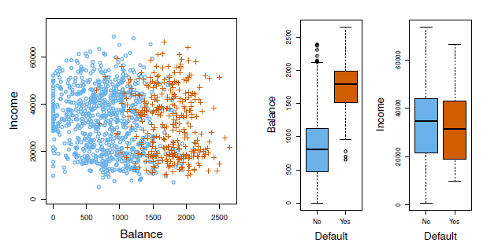
</img>

<b>FIG 5.1</b><i> </i>

<a name="5-2"/>

## [5.2 Pourquoi pas la régression linéaire ?](#5-2) ##

[Retour TOC](#toc)

Nous avons déclaré que la régression linéaire n'est pas appropriée dans le cas d'une réponse qualitative. Pourquoi ?

Supposons que nous essayons de prédire l'état médical d'une patiente aux urgences sur la base de ses symptômes. Dans cet exemple simplifié, il y a trois diagnostics possibles : accident vasculaire cérébral, overdose de médicaments et crise d'épilepsie. 

Nous pourrions envisager de coder ces valeurs sous la forme d'une variable de réponse quantitative, $Y$ , comme suit :

$$
Y = \left \lbrace
    \begin{array}{l}
        1 & if \ stroke; \\
        2 & if \ drug \ overdose; \\
        3 & if \ epileptic \ seizure.
    \end{array}
\right.
$$

En utilisant ce codage, les moindres carrés peuvent être utilisés pour ajuster un modèle de régression linéaire afin de prédire $Y$ sur la base d'un ensemble de prédicteurs $X_1, . . . ,X_p$. 

Malheureusement, ce codage implique un classement des résultats, plaçant la surdose de médicament entre l'accident vasculaire cérébral et la crise épileptique, et insistant sur le fait que la différence entre l'accident vasculaire cérébral et la surdose de médicament est la même que la différence entre la surdose de médicament et la crise épileptique. 

En pratique, il n'y a aucune raison particulière pour que ce soit le cas. Par exemple, on pourrait choisir un codage tout aussi raisonnable,

$$
Y = \left \lbrace
    \begin{array}{l}
        1 & if \ epileptic \ seizure; \\
        2 & if \ stroke; \\
        3 & if \ drug \ overdose.
    \end{array}
\right.
$$

ce qui impliquerait une relation totalement différente entre les trois conditions.

Chacun de ces codages produirait des modèles linéaires fondamentalement différents qui conduiraient en fin de compte à des ensembles différents de prédictions sur les observations du test. 

Si les valeurs de la variable réponse prenaient un ordre naturel, tel que léger, modéré et sévère, et que nous estimions que l'écart entre léger et modéré était similaire à l'écart entre modéré et sévère, alors un codage 1, 2, 3 serait raisonnable. 

Malheureusement, en général, il n'existe pas de moyen naturel de convertir une variable réponse qualitative à plus de deux niveaux en une réponse quantitative prête pour la régression linéaire.

Pour une réponse qualitative binaire (à deux niveaux), la situation est meilleure. Par exemple, il n'y a peut-être que deux possibilités pour l'état de santé du patient : un accident vasculaire cérébral et une overdose de médicaments. Nous pourrions alors utiliser l'approche d'une variable fictive pour coder la réponse comme suit :

$$
Y = \left \lbrace
    \begin{array}{l}
        0 & if \ stroke; \\ 
        1 & if \ drug \ overdose.
    \end{array}
\right.
$$

Nous pourrions alors ajuster une régression linéaire à cette réponse binaire, et prédire une surdose de médicaments si $\hat{Y} > 0.5$ et un accident vasculaire cérébral dans le cas contraire. Dans le cas binaire, il n'est pas difficile de montrer que même si nous inversons le codage ci-dessus, la régression linéaire produira les mêmes prédictions finales.

Pour une réponse binaire avec un codage $0/1$ comme ci-dessus, la régression par les moindres carrés n'est pas complètement déraisonnable : on peut montrer que le $X\hat  β$ obtenu par régression linéaire est en fait une estimation de $Pr(drug\ overdose|X)$ de ce cas particulier. 

Cependant, si nous utilisons la régression linéaire, certaines de nos estimations pourraient se situer en dehors de l'intervalle $[0, 1]$ (voir $figure\ 5.2$ ), ce qui les rend difficiles à interpréter comme des probabilités ! Néanmoins, les prédictions fournissent un ordre et peuvent être interprétées comme des estimations de probabilité brutes. 

Curieusement, il s'avère que les classifications que nous obtenons, si nous utilisons la régression linéaire pour prédire une réponse binaire, seront les mêmes que pour la procédure d'**analyse discriminante linéaire** (**ADL**).

En résumé, il y a au moins deux raisons de ne pas effectuer la classification à l'aide d'une méthode de régression : 

1. une méthode de régression ne peut pas prendre en compte une réponse qualitative avec plus de deux classes ; 
2. une méthode de régression ne fournira pas d'estimations significatives de $Pr(Y |X)$, même avec juste deux classes. 

Il est donc préférable d'utiliser une méthode de classification qui est vraiment adaptée aux valeurs de réponses qualitatives. 

Dans la prochaine section, nous présentons la régression logistique, qui est bien adaptée au cas d'une réponse qualitative binaire ; dans les sections suivantes, nous couvrirons les méthodes de classification qui sont appropriées lorsque la réponse qualitative a deux classes ou plus.

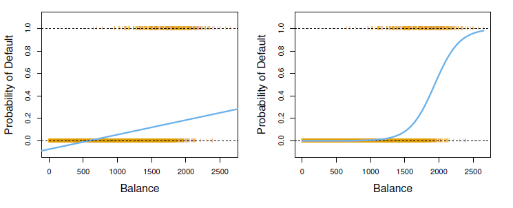
</img>

<b>FIG 5.2</b><i> </i>

<a name="5-3"/>

## [5.3 La Régression logistique](#5-3) ##

[Retour TOC](#toc)

Considérons à nouveau l'ensemble de données $Default$, où la réponse $default$ tombe dans l'une des deux catégories, $Yes$ ou $No$. Plutôt que de modéliser directement cette réponse $Y$, la régression logistique modélise la probabilité que $Y$ appartienne à une catégorie particulière.

Pour les données $default$, la régression logistique modélise la probabilité de $default$. Par exemple, la probabilité de défaut de paiement pour un solde donné peut s'écrire comme suit

$$
Pr(default = Yes|balance).
$$

Les valeurs de $Pr(default = Yes|balance)$, que nous abrégeons $p(balance)$, seront comprises entre 0 et 1. 

Ensuite, pour toute valeur donnée de $balance$, une prédiction peut être faite pour $default$. Par exemple, on peut prédire le $default = Yes$ pour tout individu pour lequel $p(balance) > 0.5$. 

Par ailleurs, si une entreprise souhaite être prudente dans la prédiction des individus qui risquent d'être en défaut de paiement, elle peut choisir d'utiliser un seuil plus bas, tel que $p(balance) > 0.1$.

<a name="5-3-1"/>

### [5.3.1 Le modèle logistique](#5-3-1) ###

[Retour TOC](#toc)

Comment devons-nous modéliser la relation entre $p(X) = Pr(Y = 1|X)\ et\ X$ ? (Par commodité, nous utilisons le codage générique 0/1 pour la réponse).

Dans la section 5.2, nous avons envisagé d'utiliser un modèle de régression linéaire pour représenter ces probabilités :

$$
p(X) = β_0 + β_1X. \hspace{6 em} (5.1)
$$

Si nous utilisons cette approche pour prédire $default=Yes$ en utilisant $balance$, nous obtenons le modèle présenté dans le panneau de gauche de la $figure\ 5.2$. 

Nous voyons ici le problème que pose cette approche : pour le solde proches de zéro, nous prédisons une probabilité négative de défaillance ; si nous devions prédire pour les soldes très importants, nous obtiendrions des valeurs supérieures à 1. 

Ces prédictions ne sont pas raisonnables, puisque, bien entendu, la véritable probabilité de défaillance, indépendamment du solde de la carte de crédit, doit se situer entre 0 et 1. Ce problème n'est pas propre aux données sur les défaillances de crédit. 

Chaque fois qu'une ligne droite est ajustée à une réponse binaire codée 0 ou 1, nous pouvons en principe toujours prédire $p(X) < 0$ pour certaines valeurs de $X$ et $p(X) > 1$ pour d'autres (à moins que la plage de $X$ soit limitée). 

Pour éviter ce problème, nous devons modéliser $p(X)$ à l'aide d'une fonction qui donne des sorties comprises entre 0 et 1 pour toutes les valeurs de $X$. 

De nombreuses fonctions répondent à cette description. Dans la régression logistique, nous utilisons la fonction logistique,

$$
p(X)=\frac{e^{\beta_0 +\beta_1 X}}{1+e^{\beta_0 +\beta_1 X}}. \hspace{6 em} (5.2)
$$

Pour ajuster le modèle (5.2), nous utilisons une méthode appelée **maximum de vraisemblance**, dont nous parlerons dans la section suivante. 

Le panneau de droite de la $figure\ 5.2$ illustre la vraisemblance de l'ajustement du modèle de régression logistique aux données sur les défauts de paiement. 

Remarquez que pour les soldes faibles, nous prédisons maintenant que la probabilité de défaillance est proche de zéro, mais jamais inférieure. De même, pour les soldes élevés, nous prédisons une probabilité de défaillance proche de 1, mais jamais supérieure. 

La fonction logistique produira toujours une courbe en $S$ de cette forme, et donc, quelle que soit la valeur de $X$, nous obtiendrons une prédiction raisonnable. 

Nous constatons également que le modèle logistique est à même de saisir la gamme des probabilités que le modèle de régression linéaire dans le graphique de gauche. 

La probabilité moyenne ajustée dans les deux cas est de 0.0333 (moyenne sur les données d'apprentissage), ce qui correspond à la proportion globale de défaillants dans l'ensemble des données.

Après quelques manipulations de (5.2), on trouve que

$$
\frac{p(X)}{1-p(X)}=e^{\beta_0 +\beta_1 X}. \hspace{6 em} (5.3)
$$

La quantité $p(X)/[1-p(X)]$ est appelée la $cote (odds)$, et peut prendre toute valeur comprise entre $0$ et $∞$. Les valeurs de la cote proches de $0$ et $∞$ indiquent,respectivement, des probabilités de défaillance très faibles et très élevées. Par exemple, en moyenne, 1 personne sur 5 ayant une cote de 1/4 sera en défaut de paiement, puisque $p(X) = 0.2$ implique une cote de $\frac{0.2}{1-0.2} = 1/4$. 

De même, en moyenne, neuf personnes sur dix ayant une cote de 9 seront en défaut, puisque $p(X) = 0,9$ implique une cote de $\frac{0.9}{1-0.9} = 9$.

Les $cotes(odds)$ sont traditionnellement utilisées à la place des probabilités dans les courses de chevaux, car elles sont plus naturellement liées à la bonne stratégie de pari.

En prenant le logarithme des deux côtés de (5.3), on arrive à

$$
log \left(\frac{p(X)}{1-p(X)}=\beta_0 + \beta_1X \right)\hspace{6em } (5.4)
$$

Le côté gauche est appelé le logarithme des probabilités ou logit. Nous voyons que le modèle de régression logistique (5.2) a un logit qui est linéaire en $X$. 

Pour rappel, dans un modèle de régression linéaire, $β_1$ donne la moyenne du changement de $Y$ associé à une augmentation d'une unité de $X$. 

En revanche, dans un modèle de régression logistique, l'augmentation de $X$ d'une unité change les probabilités logarithmiques par $β_1$ (5.4). 

De manière équivalente, elle multiplie les chances par $e^{β_1}$ (5.3). Cependant, comme la relation entre $p(X)$ et $X$ dans (5.2) n'est pas une ligne droite, $β_1$ ne correspond pas à la variation de $p(X)$ associée à une augmentation d'une unité de $X$. 

La quantité de variation de $p(X)$ due à une variation d'une unité de $X$ dépend de la valeur actuelle de $X$. Mais quelle que soit la valeur de $X$, si $β_1$ est positif, l'augmentation de $X$ sera associée à une augmentation de $p(X)$, et si $β_1$ est négatif, l'augmentation de $X$ sera associée à une diminution de $p(X)$. Le fait qu'il n'y ait pas de relation linéaire entre $p(X)$ et $X$, et le fait que le taux de variation de $p(X)$ par unité de variation de $X$ dépende de la valeur actuelle de $X$, peut également être observé en inspectant le panneau de droite de la $figure\ 5.2$.

<a name="5-3-2"/>

### [5.3.2 Estimation des coefficients de régression](#5-3-2) ###

[Retour TOC](#toc)

Les coefficients $β_0$ et $β_1$ dans (5.2) sont inconnus, et doivent être estimés sur la base des données d'apprentissage disponibles. 

Dans le section 3, nous avons utilisé l'approche des moindres carrés pour estimer les coefficients de régression linéaire inconnus. Bien que nous puissions utiliser les moindres carrés (non linéaires) pour ajuster le modèle (5.4), nous préférons la méthode plus générale du maximum de vraisemblance, car elle présente de meilleures propriétés statistiques. 

L'intuition de base derrière l'utilisation du maximum de vraisemblance pour ajuster un modèle de régression logistique est la suivante : nous cherchons des estimations pour $β_0$ et $β_1$ telles que la probabilité prédite $\hat{p}(x_i)$ $default$ pour chaque individu, en utilisant (5.2), corresponde le plus étroitement possible au statut $default$ observé de l'individu. 

En d'autres termes, nous essayons de trouver $\hatβ_0$ et $\hatβ_1$ tels que le fait de brancher ces estimations dans le modèle pour $p(X)$, donné dans (5.2), donne un nombre proche de un pour tous les individus qui ont fait $default$, et un nombre proche de zéro pour tous les individus qui n'ont pas fait $default$. Cette intuition peut être formalisée à l'aide d'une équation mathématique appelée fonction de vraisemblance :

$$
\ell(\beta_0,\beta_1) = \prod_{i:y_1=1}p(x_i) \ \prod_{i^{'}:y_{1^{'}}=1}p(x_{i{'}}) \hspace{6em } (5.5)
$$

Les estimations $\hatβ_0$ et $\hatβ_1$ sont choisies pour maximiser cette fonction de vraisemblance. Le maximum de vraisemblance est une approche très générale qui est utilisée pour ajuster de nombreux modèles non linéaires que nous examinons tout au long de ce livre. Dans le cadre de la régression linéaire, l'approche des moindres carrés est en fait un cas particulier de la vraisemblance maximale.

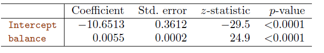

<b>TAB 5.1</b><i> </i>

Les détails mathématiques du maximum de vraisemblance dépassent le cadre de cet ouvrage. Cependant, en général, la régression logistique et d'autres modèles peuvent être facilement ajustés à l'aide de logiciels statistiques tels que $\mathrm{R}$, et nous n'avons donc pas besoin de nous préoccuper des détails de la procédure d'ajustement du maximum de vraisemblance.

Le $tableau\ 5.1$ montre les estimations des coefficients et les informations connexes qui résultent de l'ajustement d'un modèle de régression logistique sur les données de défaut de paiement afin de prédire la probabilité de défaut de paiement=Oui en utilisant le solde. Nous constatons que $\hat{\beta}_1=$ 0,0055 ; cela indique qu'une augmentation du solde est associée à une augmentation de la probabilité de défaillance. Pour être précis, une augmentation d'une unité du solde est associée à une augmentation de la probabilité logarithmique de défaillance de 0,0055 unité.

De nombreux aspects des résultats de la régression logistique présentés dans le tableau 5.1 sont similaires aux résultats de la régression linéaire du section 3 . Par exemple, nous pouvons mesurer la précision des estimations des coefficients en calculant leurs erreurs standard. La statistique $z$ du $tableau\ 5.1$ joue le même rôle que la statistique $t$ dans les résultats de la régression linéaire, par exemple dans le $tableau 3.1$  . Par exemple, la  statistique $z$ associée à $\beta_1$ est égale à $\hat{\beta}_1 / {SE}\left(\hat{\beta}_1\right)$, et donc une grande valeur (absolue) de la statistique $z$ indique une preuve contre l'hypothèse nulle $H_0 : \beta_1=0$. Cette hypothèse nulle implique que $p(X)=\frac{e^{\beta_0}}{1+e^{\beta_0}}$ : en d'autres termes, que la probabilité de défaut ne dépend pas du solde. Puisque la valeur $p$ associée au solde dans le $tableau 5.1$ est minuscule, nous pouvons rejeter $H_0$. En d'autres termes, nous concluons qu'il existe effectivement une association entre le solde et la probabilité de défaillance. L'ordonnée à l'origine estimée dans le $tableau 5.1$ n'est généralement pas intéressante ; son principal objectif est d'ajuster les probabilités ajustées moyennes à la proportion de un dans les données (dans ce cas, le taux de défaillance global).

<a name="5-3-3"/>

### [5.3.3 Faire des prédictions](#5-3-3) ###

[Retour TOC](#toc)

Une fois les coefficients estimés, nous pouvons calculer la probabilité de défaillance pour tout solde de carte de crédit donné. Par exemple, à l'aide des estimations des coefficients présentées au tableau 5.1, nous prédisons que la probabilité de défaillance d'un individu dont le solde est de 1 000 dollar est la suivante

$$
\hat{p}(X)=\frac{e^{\hat{\beta}_0+\dot{\beta}_1 X}}{1+e^{\dot{\beta}_0+\dot{\beta}_1 X}}=\frac{e^{-10.6513+0.0055 \times 1,000}}{1+e^{-10.6513+0.0055 \times 1,000}}=0.00576
$$

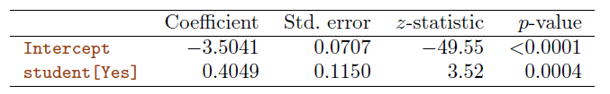

<b>TAB 5.2</b><i> ![Pour les données sur le défaut de paiement, coefficients estimés du modèle de régression logistique qui prédit la probabilité de défaut de paiement en utilisant le statut d'étudiant. Le statut d'étudiant est codé comme une variable fictive, avec une valeur de 1 pour un étudiant et une valeur de 0 pour un non-étudiant, et représenté par la variable étudiant [Oui] dans le tableau.](https://www.statlearning.com/)</i>

qui est inférieur à 1 . En revanche, la probabilité prédite de défaillance pour un individu dont le solde est de 2 000 dollars  est beaucoup plus élevée et s'élève à 0,586 ou 58,6 .

On peut utiliser des prédicteurs qualitatifs avec le modèle de régression logistique en utilisant l'approche de la variable muette de la section 3.3.1. 

Par exemple, l'ensemble de données Default contient la variable qualitative Student. Pour ajuster un modèle qui utilise le statut Student comme variable prédictive, nous créons simplement une variable muette qui prend la valeur 1 pour les étudiants et 0 pour les non-étudiants. Le modèle de régression logistique qui résulte de la prédiction de la probabilité de défaillance à partir du statut d'étudiant est présenté au $tableau\ 5.2$. 

Le coefficient associé à la variable fictive est positif, et la valeur $p$ associée est statistiquement significative. Cela indique que les étudiants ont tendance à avoir des probabilités de défaillance plus élevées que les non-étudiants :

$$
\begin{aligned}
& \widehat{{Pr}}(\text { defaul } t=\text { Yes } \mid \text { student }=\text { Yes })=\frac{e^{-3.5041+0.4049 \times 1}}{1+e^{-3.5041+0.4049 \times 1}}=0.0431, \\
& \widehat{{Pr}}(\text { default }=\text { Yes } \mid \text { student }=\text { No })=\frac{e^{-3.5041+0.4049 \times 0}}{1+e^{-3.5041+0.4049 \times 0}}=0.0292 .
\end{aligned}
$$

<a name="5-3-4"/>

### [5.3.4 Régression logistique multiple](#5-3-4) ###

[Retour TOC](#toc)

Nous considérons maintenant le problème de la prédiction d'une réponse binaire à l'aide de prédicteurs multiples. Par analogie avec l'extension de la régression linéaire simple à la régression linéaire multiple du section 3, nous pouvons généraliser (5.4) comme suit :

$$
\log \left(\frac{p(X)}{1-p(X)}\right)=\beta_0+\beta_1 X_1+\cdots+\beta_p X_p, \hspace{6em } (5.6)
$$

où $X=\left(X_1, \ldots, X_p\right)$ sont des prédicteurs $p$. L'équation 5.6 peut être réécrite comme suit

$$
p(X)=\frac{e^{\beta_0+\beta_1 X_1+\cdots+\beta_p X_p}}{1+e^{\beta_0+\beta_1 X_1+\cdots+\beta_p X_p}} .\hspace{6em } (5.7)
$$

Juste comme à la section 5.3.2, nous utilisons la méthode du maximum de vraisemblance pour estimer $\beta_0, \beta_1, \ldots, \beta_p$. Le $tableau\ 5.3$ montre les estimations des coefficients pour un modèle de régression logistique qui utilise le solde, le revenu (en milliers de dollars) et le statut d'étudiant pour prédire la probabilité de défaillance. On observe ici un résultat surprenant. 

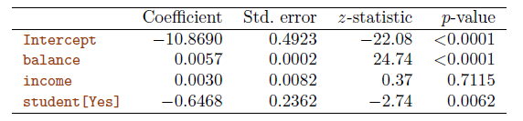

<b>TAB 5.3</b><i> ![Pour les données sur le défaut de paiement, coefficients estimés du modèle de régression logistique qui prédit la probabilité de défaut de paiement en utilisant le solde, le revenu et le statut d'étudiant. Le statut d'étudiant est codé comme une variable muette étudiant [Oui], avec une valeur de 1 pour un étudiant et une valeur de 0 pour un non-étudiant. Dans l'ajustement de ce modèle, le revenu a été mesuré en milliers de dollars.](https://www.statlearning.com/)</i>

Les $p-valeurs$  associées au solde et à la variable fictive du statut d'étudiant sont très faibles, ce qui indique que chacune de ces variables est associée à la probabilité de défaillance. 

Toutefois, le coefficient de la variable fictive est négatif, ce qui indique que les étudiants sont moins susceptibles de faire défaut que les non-étudiants. 

En revanche, le coefficient de la variable muette est positif dans le $tableau\ 5.2$. Comment est-il possible que le statut d'étudiant soit associé à une augmentation de la probabilité de défaillance dans le $tableau\ 5.2$ et à une diminution de la probabilité de défaillance dans le $tableau\ 5.3$ ? 

Le panneau de gauche de la $figure\ 5.3$ fournit une illustration graphique de ce paradoxe. Les lignes continues orange et bleues montrent les taux de défaillance moyens des étudiants et des non-étudiants, respectivement, en fonction du solde de la carte de crédit. Le coefficient négatif pour l'étudiant dans la régression logistique multiple indique que pour une valeur fixe du solde et du revenu, un étudiant est moins susceptible de faire défaut qu'un non-étudiant. En effet, nous observons dans le panneau de gauche de la $figure\ 5.3$ que le taux de défaillance des étudiants est égal ou inférieur au taux de défaillance des non-étudiants pour chaque valeur de solde. Mais les lignes horizontales brisées près de la base du graphique, qui montrent les taux de défaillance des étudiants et des non-étudiants en moyenne pour toutes les valeurs de solde et de revenu, suggèrent l'effet inverse : le taux de défaillance global des étudiants est plus élevé que celui des non-étudiants. Par conséquent, il existe un coefficient positif pour l'étudiant dans le résultat de la régression logistique à variable unique présenté au $tableau\ 5.2$.

Le panneau de droite de la $figure 5.3$ fournit une explication à cette divergence. Les variables étudiant et solde sont corrélées. Les étudiants ont tendance à détenir des niveaux d'endettement plus élevés, ce qui est à son tour associé à une plus grande probabilité de défaillance. 

En d'autres termes, les étudiants sont plus susceptibles d'avoir des soldes de carte de crédit importants, qui, comme nous le savons d'après le panneau de gauche de la $figure\ 5.3$, tendent à être associés à des taux de défaillance élevés. Ainsi, même si un étudiant individuel avec un solde de carte de crédit donné aura tendance à avoir une probabilité de défaillance plus faible qu'un non-étudiant avec le même solde de carte de crédit, le fait que les étudiants dans l'ensemble ont tendance à avoir des soldes de carte de crédit plus élevés signifie que dans l'ensemble, les étudiants ont tendance à avoir un taux de défaillance plus élevé que les non-étudiants. Il s'agit d'une distinction importante pour une société de cartes de crédit qui tente de déterminer à qui elle doit offrir du crédit. 

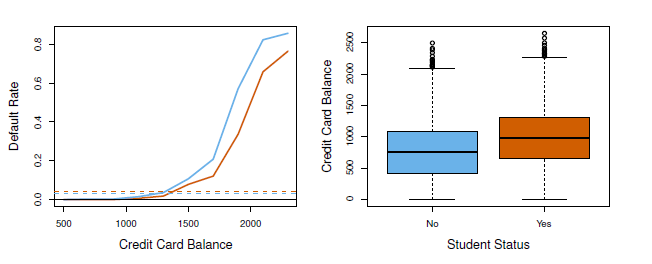

<b>FIG 5.3</b><i> </i>

Un étudiant est plus risqué qu'un non-étudiant si aucune information sur le solde de sa carte de crédit n'est disponible. Cependant, cet étudiant est moins risqué qu'un non-étudiant ayant le même solde de carte de crédit !

Cet exemple simple illustre les dangers et les subtilités associés à l'exécution de régressions impliquant un seul prédicteur lorsque d'autres prédicteurs peuvent également être pertinents. Comme dans le cadre de la régression linéaire, les résultats obtenus à l'aide d'une seule variable prédictive peuvent être très différents de ceux obtenus à l'aide de plusieurs variables prédictives, en particulier lorsqu'il existe une corrélation entre les variables prédictives. En général, le phénomène observé à la $figure\ 5.3$ est connu sous le nom de confusion.

En substituant les estimations des coefficients de régression du $tableau\ 5.3$ dans (5.7), nous pouvons faire des prédictions. Par exemple, un étudiant dont le solde de carte de crédit s'élève à 1 500 dollars et dont le revenu est de 40 000 dollars a une probabilité de défaut de paiement estimée à

$$
\hat{p}(X)=\frac{e^{-10,869+0,00574 \times 1,500+0,003 \times 40-0,6468 \times 1}}{1+e^{-10,869+0,00574 \times 1,500+0,003 \times 40-0,6468 \times 1}}=0,058 \hspace{6em } (5.8)
$$

Un non-étudiant ayant le même solde et le même revenu a une probabilité de défaut estimée à

$$
\hat{p}(X)=\frac{e^{-10.869+0.00574 \times 1,500+0.003 \times 40-0.6468 \times 0}}{1+e^{-10.869+0.00574 \times 1,500+0.003 \times 40-0.6468 \times 0}}=0.105 . \hspace{6em } (5.9)
$$

(Ici, nous multiplions l'estimation du coefficient de revenu du $tableau\ 5.3$ par 40 , plutôt que par 40 000 , car dans ce tableau, le modèle a été ajusté avec un revenu mesuré en unités de 1 000 dollars).

<a name="5-3-5"/>

### [5.3.5 Régression logistique multinomiale](#5-3-5) ###

[Retour TOC](#toc)

Nous souhaitons parfois classer une variable de réponse qui comporte plus de deux classes. Par exemple, dans la section 5.2, nous avions trois catégories de problèmes médicaux aux urgences : accident vasculaire cérébral, surdose de médicaments, crise d'épilepsie. Cependant, l'approche de régression logistique que nous avons vue dans cette section ne permet que $K=2$ classes pour la variable de réponse.

Il s'avère qu'il est possible d'étendre l'approche de régression logistique à deux classes au cas où il y aurait $K>2$ classes. Cette extension est parfois connue sous le nom de régression logistique multinomiale. Pour ce faire, nous choisissons d'abord une seule classe qui servira de base de référence ; sans perte de généralité, nous choisissons la $K$ ème classe pour ce rôle. Nous remplaçons ensuite le modèle (5.7) par le modèle

$$
{Pr}(Y=k \mid X=x)=\frac{e^{\beta_{k D}+\beta_{k 1} x_1+\cdots+\beta_{k p} x_p}}{1+\sideset{}{_{l=1}^{K-1}}\sum e^{\beta_{10}+\beta_{11} x_1+\cdots+\beta_{l p} x_p}} \hspace{6em } (5.10)
$$

pour $k=1, \ldots, K-1$, et

$$
{Pr}(Y=K \mid X=x)=\frac{1}{1+\sideset{}{_{l=1}^{K-1}}\sum e^{\beta_{10}+\beta_{I 1} x_1+\cdots+\beta_{l p} x_p}} . \hspace{6em } (5.11)
$$

Il n'est pas difficile de montrer que pour $k=1, \ldots, K-1$,

$$
\log \left(\frac{{Pr}(Y=k \mid X=x)}{{Pr}(Y=K \mid X=x)}\right)=\beta_{k 0}+\beta_{k 1} x_1+\cdots+\beta_{k p} x_p . \hspace{6em } (5.12)
$$

Remarquez que (5.12) est assez similaire à (5.6). L'$équation\ 5.12$ indique qu'une fois encore, la probabilité logarithmique entre toute paire de classes est linéaire dans les caractéristiques.

Il s'avère que dans (5.10)-(5.12), la décision de traiter la $K$ ème classe comme la référence n'est pas importante. Par exemple, lors de la classification des visites aux urgences en accidents vasculaires cérébraux, surdoses de médicaments et crises d'épilepsie, supposons que nous ajustions deux modèles de régression logistique multinomiale : l'un traitant l'accident vasculaire cérébral comme base de référence, l'autre traitant la surdose de médicaments comme base de référence. Les estimations des coefficients différeront entre les deux modèles ajustés en raison du choix différent de la ligne de base, mais les valeurs ajustées (prédictions), les probabilités logarithmiques entre toute paire de classes et les autres résultats clés du modèle resteront les mêmes.

Néanmoins, l'interprétation des coefficients d'un modèle de régression logistique multinomiale doit être faite avec précaution, car elle est liée au choix de la ligne de base. Par exemple, si nous définissons la crise épileptique comme ligne de base, nous pouvons interpréter $\beta_{\text {strokoo }}$ comme la probabilité logarithmique d'un AVC par rapport à une crise épileptique, étant donné que $x_1=\ldots=x_p=0$. En outre, une augmentation d'une unité de $X_j$ est associée à une augmentation de $\beta_{\text {strokoj }}$ de la probabilité logarithmique d'un AVC par rapport à une crise épileptique. En d'autres termes, si $X_j$ augmente d'une unité, alors

$$
\frac{{Pr}(Y=\text { stroke } \mid X=x)}{{Pr}(Y=\text { epileptic seizure } \mid X=x)}
$$

augmente de $e^{\beta_{\text {srokej }}}$. 

Nous allons maintenant présenter brièvement un codage alternatif pour la régression logistique multinomiale, connu sous le nom de codage softmax. Le codage softmax est équivalent au codage juste décrit dans le sens où les valeurs ajustées, les probabilités logarithmiques entre n'importe quelle paire de classes et les autres sorties clés du modèle resteront les mêmes, quel que soit le codage. 

Cependant, le codage softmax est largement utilisé dans certains domaines de la littérature sur l'apprentissage automatique , il est donc utile de le connaître. Dans le codage softmax, plutôt que de sélectionner une classe de base, nous traitons toutes les classes $K$ de manière symétrique, et supposons que pour $k=1, \ldots, K$,

$$
{Pr}(Y=k \mid X=x)=\frac{e^{\beta_{k 0}+\beta_{k 1} z_1+\cdots+\beta_{k p} z_p}}{\sideset{}{_{I-1}^K}\sum e^{\beta_{10}+\beta_{21} x_1+\cdots+\beta_{l p} z_p}} . \hspace{6em } (5.13)
$$

Ainsi, plutôt que d'estimer des coefficients pour les $K-1$ classes, nous estimons en fait des coefficients pour toutes les $K$ classes. Il n'est pas difficile de voir qu'en conséquence de (5.13), le logarithme du rapport de cotes entre la $k{-}ème$ et la $k^{\prime}{-}ème$ classe est égal à 

$$
\log \left(\frac{{Pr}(Y=k \mid X=x)}{{Pr}\left(Y=k^r \mid X=x\right)}\right)=\left(\beta_{k 0}-\beta_{k^{\prime} 0}\right)+\left(\beta_{k 1}-\beta_{k^{\prime} 1}\right) x_1+\cdots+\left(\beta_{k p}-\beta_{k^{\prime} p}\right) x_{\mathrm{P}}. \hspace{6em } (5.14)
$$

<a name="5-4"/>

## [5.4 Modèles génératifs pour la classification](#5-4) ##

[Retour TOC](#toc)

La régression logistique consiste à modéliser directement ${Pr}(Y=k \mid X=x)$ à l'aide de la fonction logistique, donnée par (5.7) dans le cas de deux classes de réponse. Dans le jargon statistique, nous modélisons la distribution conditionnelle de la réponse $Y$, étant donné le ou les prédicteurs $X$. 

Nous considérons maintenant une approche alternative et moins directe pour estimer ces probabilités. Dans cette nouvelle approche, nous modélisons la distribution des prédicteurs $X$ séparément dans chacune des classes de réponse (c'est-à-dire pour chaque valeur de $Y$ ). Nous utilisons ensuite le théorème de Bayes pour les transformer en estimations de ${Pr}(Y=k \mid X=x)$. Lorsque la distribution de $X$ au sein de chaque classe est supposée être normale, il s'avère que le modèle est très similaire, dans sa forme, à la régression logistique.

Pourquoi avons-nous besoin d'une autre méthode, alors que nous avons la régression logistique ? Il y a plusieurs raisons :

- Lorsqu'il y a une séparation importante entre les deux classes, les estimations des paramètres du modèle de régression logistique sont étonnamment instables. Les méthodes que nous considérons dans cette section ne souffrent pas de ce problème.
- Si la distribution des prédicteurs $X$ est approximativement normale dans chacune des classes et que la taille de l'échantillon est petite, alors les approches de cette section peuvent être plus précises que la régression logistique.
- Les méthodes de cette section peuvent être naturellement étendues au cas de plus de deux classes de réponse. (Dans le cas de plus de deux classes de réponse, nous pouvons également utiliser la régression logistique multinomiale de la section 5.3.5).

Supposons que l'on souhaite classer une observation dans l'une des $K$ classes, où $K \geq 2$. En d'autres termes, la variable de réponse qualitative $Y$ peut prendre $K$ valeurs distinctes et non ordonnées possibles. Soit $\pi_k$ la probabilité globale ou antérieure qu'une observation choisie au hasard provienne de la $k$-ème classe. Soit $f_k(X) \equiv {Pr}(X \mid Y=k)$ (Techniquement, cette définition n'est correcte que si $X$ est une variable aléatoire qualitative. Si $X$ est quantitative, alors $f_k(x) d x$ correspond à la probabilité que $X$ tombe dans une petite région $d x$ autour de $x$.) la fonction de densité de $X$ pour une observation qui provient de la $k{-}ème$ classe. 

En d'autres termes, $f_k(x)$ est relativement grande s'il existe une forte probabilité qu'une observation de la $k{-}ème$ classe ait $X \approx x$, et $f_k(x)$ est petite s'il est très peu probable qu'une observation de la $k{-}ème$ classe ait $X \approx x$. Le théorème de Bayes indique alors que

$$
{Pr}(Y=k \mid X=x)=\frac{\pi_k f_k(x)}{\sideset{}{_{l=1}^K}\sum \pi_l f_l(x)}. \hspace{6em } (5.15)
$$

Conformément à notre notation précédente, nous utiliserons l'abréviation $p_k(x)=$ ${Pr}(Y=k \mid X=x)$ ; il s'agit de la probabilité postérieure qu'une observation $X=x$ appartienne à la $k {-} ème$ classe. 

En d'autres termes, il s'agit de la probabilité que l'observation appartienne à la $k{-}ème$ classe, étant donné la valeur du prédicteur pour cette observation.

L'équation 5.15 suggère qu'au lieu de calculer directement la probabilité postérieure $p_k(x)$ comme dans la section 5.3.1, nous pouvons simplement insérer les estimations de $\pi_k$ et $f_k(x)$ dans (5.15). En général, l'estimation de $\pi_k$ est facile si nous disposons d'un échantillon aléatoire de la population : nous calculons simplement la fraction des observations d'apprentissage qui appartiennent à la $k{-}ème$ classe. Cependant, l'estimation de la fonction de densité $f_k(x)$ est beaucoup plus difficile. Comme nous allons le voir, pour estimer $f_k(x)$, nous devons généralement faire quelques hypothèses simplificatrices.

Nous savons, que le classificateur de Bayes, qui classe une observation $x$ dans la classe pour laquelle $p_k(x)$ est le plus grand, a le plus faible taux d'erreur possible parmi tous les classificateurs. (Bien sûr, cela n'est vrai que si tous les termes de (5.15) sont correctement spécifiés). Par conséquent, si nous pouvons trouver un moyen d'estimer $f_k(x)$, nous pouvons alors l'insérer dans $(5.15)$ afin d'approximer le classifieur de Bayes.

Dans les sections suivantes, nous discutons de trois classifieurs qui utilisent différentes estimations de $f_k(x)$ dans (5.15) pour approcher le classifieur de Bayes : l'analyse discriminante linéaire, l'analyse discriminante quadratique et Bayes naïf.

<a name="5-4-1"/>

### [5.4.1 Analyse discriminante linéaire pour p=1](#5-4-1) ###

[Retour TOC](#toc)

Pour l'instant, supposons que $p=1$ - c'est-à-dire que nous n'avons qu'un seul prédicteur. Nous souhaitons obtenir une estimation de $f_k(x)$ que nous pouvons insérer dans (5.15) afin d'estimer $p_k(x)$​. Nous classerons ensuite une observation dans la classe pour laquelle $p_k(x)$ est le plus grand. Pour estimer $f_k(x)$, nous allons d'abord faire quelques hypothèses sur sa forme.

En particulier, nous supposons que $f_k(x)$ est normal ou gaussien. Dans le cadre unidimensionnel, la densité normale prend la forme suivante

$$
f_k(x)=\frac{1}{\sqrt{2 \pi} \sigma_k} \exp \left(-\frac{1}{2 \sigma_k^2}\left(x-\mu_k\right)^2\right), \hspace{6em } (5.16)
$$

où $\mu_k$ et $\sigma_k^2$ sont les paramètres de moyenne et de variance pour la $k{-}ème$ classe. Pour l'instant, supposons en outre que $\sigma_1^2=\cdots=\sigma_K^2$ : c'est-à-dire qu'il existe un terme de variance commun à toutes les classes $K$, que nous pouvons désigner par $\sigma^2$ pour simplifier. En introduisant (5.16) dans $(5.15)$, nous trouvons que

$$
p_k(x)=\frac{\pi_k \frac{1}{\sqrt{2 \pi} \sigma} \exp \left(-\frac{1}{2 \sigma^2}\left(x-\mu_k\right)^2\right)}{\sideset{}{_{l=1}^K}\sum \pi_l \frac{1}{\sqrt{2 \pi} \sigma} \exp \left(-\frac{1}{2 \sigma^2}\left(x-\mu_l\right)^2\right)} . \hspace{6em } (5.17)
$$

(Notez que dans $(5.17), \pi_k$ désigne la probabilité a priori qu'une observation appartienne à la $k{-}ème$ classe, à ne pas confondre avec $\pi \approx 3.14159$, la constante mathématique). Le classifieur de Bayes (Rappelons que le classifier de Bayes affecte une observation à la classe pour laquelle $p_k(x)$ est le plus grand. Ceci est différent du théorème de Bayes dans (5.13), qui nous permet de manipuler les distributions conditionnelles.) consiste à affecter une observation $X=x$ à la classe pour laquelle (5.17) est le plus grand. En prenant le logarithme de (5.17) et en réarrangeant les termes, il n'est pas difficile de montrer que cela équivaut à assigner l'observation à la classe pour laquelle

$$
\delta_k(x)=x \cdot \frac{\mu_k}{\sigma^2}-\frac{\mu_k^2}{2 \sigma^2}+\log \left(\pi_k\right) \hspace{6em } (5.18)
$$

est le plus grand. Par exemple, si $K=2$ et $\pi_1=\pi_2$, le classificateur de Bayes affecte une observation à la classe 1 si $2 x\left(\mu_1-\mu_2\right)>\mu_1^2-\mu_2^2$, et à la classe 2 sinon. La limite de décision de Bayes est le point pour lequel $\delta_1(x)=$ $\delta_2(x)$ ; on peut montrer que cela revient à

$$
x=\frac{\mu_1^2-\mu_2^2}{2\left(\mu_1-\mu_2\right)}=\frac{\mu_1+\mu_2}{2} . \hspace{6em } (5.19)
$$

Un exemple est présenté dans le panneau de gauche de la $figure\ 5.4$. Les deux fonctions de densité normales affichées, $f_1(x)$ et $f_2(x)$, représentent deux classes distinctes. Les paramètres de moyenne et de variance pour les deux fonctions de densité sont $\mu_1=-1,25, \mu_2=1,25$, et $\sigma_1^2=\sigma_2^2=1$. Les deux densités se chevauchent, et donc, étant donné que $X=x$, il y a une certaine incertitude sur la classe à laquelle l'observation appartient. Si nous supposons qu'une observation a la même probabilité d'appartenir à l'une ou l'autre classe - c'est-à-dire $\pi_1=\pi_2=0,5$ - alors, en inspectant (5.19), nous voyons que le classificateur de Bayes affecte l'observation à la classe 1 si $x<0$ et à la classe 2 sinon. Notez que dans ce cas, nous pouvons calculer le classificateur de Bayes parce que nous savons que $X$ est tiré d'une distribution gaussienne dans chaque classe, et que nous connaissons tous les paramètres impliqués. Dans une situation réelle, nous ne sommes pas en mesure de calculer le classificateur de Bayes.

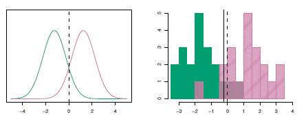

<b>FIG 5.4</b><i> </i>

En pratique, même si nous sommes tout à fait certains de notre hypothèse selon laquelle $X$ est tiré d'une distribution gaussienne au sein de chaque classe, pour appliquer le classificateur de Bayes, nous devons toujours estimer les paramètres $\mu_1, \ldots, \mu_K, \pi_1, \ldots, \pi_K$, et $\sigma^2$. 

La méthode d'analyse discriminante linéaire (LDA) permet d'approcher le classificateur de Bayes en insérant des estimations pour $\pi_k, \mu_k$, et $\sigma^2$ dans (5.18). En particulier, les estimations suivantes sont utilisées :

$$
\begin{aligned}
\hat{\mu}_k & =\frac{1}{n_k} \sum_{i: y_i=k} x_i \\
\hat{\sigma}^2 & =\frac{1}{n-K} \sum_{k=1}^K \sum_{i: y_i=k}\left(x_i-\hat{\mu}_k\right)^2
\end{aligned} \hspace{6em } (5.20)
$$

où $n$ est le nombre total d'observations d'apprentissage, et $n_k$ est le nombre d'observations d'apprentissage dans la $k{-}ème$ classe. L'estimation de $\mu_k$ est simplement la moyenne de toutes les observations d'apprentissage de la classe $k$, tandis que $\hat{\sigma}^2$ peut être considéré comme une moyenne pondérée des variances de l'échantillon pour chacune des classes $K$. Parfois, nous avons connaissance des probabilités d'appartenance à une classe $\pi_1, \ldots, \pi_K$, qui peuvent être utilisées directement. En l'absence de toute information supplémentaire, LDA estime $\pi_k$ en utilisant la proportion des observations d'apprentissage qui appartiennent à la $k{-}ème$ classe. En d'autres termes,

$$
\hat{\pi}_k=n_k / n . \hspace{6em } (5.21)
$$

Le classificateur LDA introduit les estimations données dans (5.20) et (5.21) dans (5.18), et assigne une observation $X=x$ à la classe pour laquelle

$$
\hat{\delta}_k(x)=x \cdot \frac{\hat{\mu}_k}{\hat{\sigma}^2}-\frac{\hat{\mu}_k^2}{2 \hat{\sigma}^2}+\log \left(\hat{\pi}_k\right) \hspace{6em } (5.22)
$$

est le plus grand. Le mot linéaire dans le nom du classificateur provient du fait que les fonctions discriminantes $\hat{\delta}_k(x)$ dans (5.22) sont des fonctions linéaires de $x$ (par opposition à une fonction plus complexe de $x$ ).

Le panneau de droite de la $figure\ 5.4$ présente un histogramme d'un échantillon aléatoire de 20 observations de chaque classe. Pour mettre en œuvre LDA, nous avons commencé par estimer $\pi_k$, $\mu_k$ et $\sigma^2$ à l'aide de (5.20) et (5.21). 

Nous avons ensuite calculé la limite de décision, représentée par une ligne noire pleine, qui résulte de l'affectation d'une observation à la classe pour laquelle (5.22) est la plus grande. Tous les points situés à gauche de cette ligne seront affectés à la classe verte, tandis que les points situés à droite de cette ligne seront affectés à la classe violette. 

Dans ce cas, puisque $n_1=n_2=20$, nous avons $\hat{\pi}_1=\hat{\pi}_2$. Par conséquent, la limite de décision correspond au point médian entre les moyennes de l'échantillon pour les deux classes, $\left(\hat{\mu}_1+\hat{\mu}_2\right) / 2$. La figure indique que la limite de décision LDA est légèrement à gauche de la limite de décision optimale de Bayes, qui est plutôt égale à $\left(\mu_1+\mu_2\right) / 2=$ 0 . 

**Quelle est la performance du classificateur LDA sur ces données ?** Comme il s'agit de données simulées, nous pouvons générer un grand nombre d'observations de test afin de calculer le taux d'erreur de Bayes et le taux d'erreur de test LDA. Ces taux sont respectivement de $10,6 \%$ et $11,1 \%$. En d'autres termes, le taux d'erreur du classificateur LDA n'est supérieur que de $0,5 \%$ au plus petit taux d'erreur possible ! Cela indique que LDA est très performant sur cet ensemble de données.

Pour réitérer, le classifieur LDA résulte de l'hypothèse selon laquelle les observations de chaque classe proviennent d'une distribution normale avec une moyenne spécifique à la classe et une variance commune $\sigma^2$, et de l'insertion des estimations de ces paramètres dans le classifieur de Bayes. 

Dans la Section 5.4.3, nous considérerons un ensemble d'hypothèses moins strictes, en permettant aux observations de la $k{-}ème$ classe d'avoir une variance spécifique à la classe, $\sigma_k^2$.

<a name="5-4-2"/>

### [5.4.2 Analyse discriminante linéaire pour p>1](#5-4-2) ###

[Retour TOC](#toc)

Nous allons maintenant étendre le classificateur LDA au cas de prédicteurs multiples. Pour ce faire, nous supposerons que $X=\left(X_1, X_2, \ldots, X_p\right)$ est tiré d'une distribution gaussienne multivariée (ou normale multivariée), avec un vecteur moyen spécifique à la classe et une matrice de covariance commune. 

Nous commençons par un bref examen de cette distribution. La distribution gaussienne multivariée suppose que chaque prédicteur individuel suit une distribution normale unidimensionnelle, comme dans (5.16), avec une certaine corrélation entre chaque paire de prédicteurs. 

La $figure\ 5.5$ présente deux exemples de distributions gaussiennes multivariées avec $p=2$. La hauteur de la surface en tout point particulier représente la probabilité que $X_1$ et $X_2$ tombent tous deux dans une petite région autour de ce point. Dans l'un ou l'autre panneau, si la surface est coupée le long de l'axe $X_1$ ou le long de l'axe $X_2$, la section transversale résultante aura la forme d'une distribution normale unidimensionnelle. 

Le panneau de gauche de la $figure\ 5.5$ illustre un exemple dans lequel ${Var}\left(X_1\right)={Var}\left(X_2\right)$ et ${Cor}\left(X_1, X_2\right)=0$ ; cette surface a une forme de cloche caractéristique. Cependant, la forme en cloche sera déformée si les prédicteurs sont corrélés ou ont des variances inégales, comme l'illustre le panneau de droite de la $figure\ 5.5$. Dans cette situation, la base de la cloche aura une forme elliptique, plutôt que circulaire.

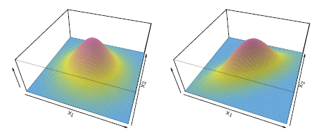

<b>FIG 5.5</b><i> </i>

Pour indiquer qu'une variable aléatoire p-dimensionnelle $X$ a une distribution gaussienne multivariée, nous écrivons $X \sim N(\mu, \mathbf{\Sigma})$. Ici, $\mathrm{E}(X)=\mu$ est la moyenne de $X$ (un vecteur à $p$ composantes), et ${Cov}(X)=\Sigma$ est la matrice de covariance $p \times p$ de $X$. Formellement, la densité gaussienne multivariée est définie comme suit

$$
f(x)=\frac{1}{(2 \pi)^{p / 2}|\boldsymbol{\Sigma}|^{1 / 2}} \exp \left(-\frac{1}{2}(x-\mu)^T \boldsymbol{\Sigma}^{-1}(x-\mu)\right) . \hspace{6em } (5.23)
$$

Dans le cas de prédicteurs $p>1$, le classificateur LDA suppose que les observations de la classe $k$ sont tirées d'une distribution gaussienne multivariée $N\left(\mu_k, \boldsymbol{\Sigma}\right)$, où $\mu_k$ est un vecteur moyen spécifique à la classe et $\boldsymbol{\Sigma}$ est une matrice de covariance commune à toutes les classes $K$. Si l'on insère la fonction de densité pour la $k{-}ième$ classe, $f_k(X=x)$, dans (5.15) et que l'on effectue un peu d'algèbre, on constate que le classificateur de Bayes affecte une observation $X=x$ à la classe pour laquelle

$$
\delta_k(x)=x^T \boldsymbol{\Sigma}^{-1} \mu_k-\frac{1}{2} \mu_k^T \boldsymbol{\Sigma}^{-1} \mu_k+\log \pi_k \hspace{6em } (5.24)
$$

il est le plus grand. Il s'agit de la version vecteur/matrice de (5.18).

Un exemple est présenté dans le panneau de gauche de la $figure\ 5.6$. Trois classes gaussiennes de taille égale sont représentées avec des vecteurs moyens spécifiques à chaque classe et une matrice de covariance commune. Les trois ellipses représentent les régions qui contiennent 95 % de la probabilité pour chacune des trois classes. Les lignes en pointillés sont les limites de décision de Bayes. En d'autres termes, elles représentent l'ensemble des valeurs $x$ pour lesquelles $\delta_k(x)=\delta_{\ell}(x)$ ; c'est-à-dire que

$$
x^T \boldsymbol{\Sigma}^{-1} \mu_k-\frac{1}{2} \mu_k^T \boldsymbol{\Sigma}^{-1} \mu_k=x^T \boldsymbol{\Sigma}^{-1} \mu_l-\frac{1}{2} \mu_l^T \boldsymbol{\Sigma}^{-1} \mu_l  \hspace{6em } (5.25)
$$

pour $k \neq l$. (Le terme $\log \pi_k$ de (4524) a disparu parce que chacune des trois classes a le même nombre d'observations d'apprentissage ; c'est-à-dire que $\pi_k$ est le même pour chaque classe).

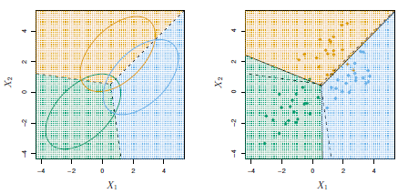

<b>FIG 5.6</b><i> ![Un exemple avec trois classes. Les observations de chaque classe sont tirées d'une distribution gaussienne multivariée avec p=2, avec un vecteur moyen spécifique à la classe et une matrice de covariance commune. À gauche : les ellipses qui contiennent 95 % de la probabilité pour chacune des trois classes sont représentées. Les lignes pointillées représentent les limites de décision de Bayes. À droite : 20 observations ont été générées pour chaque classe, et les limites de décision LDA correspondantes sont indiquées par des lignes noires pleines. Les limites de décision de Bayes sont à nouveau indiquées par des lignes pointillées.](https://www.statlearning.com/)</i>

Notez qu'il y a trois lignes représentant les limites de décision de Bayes car il y a trois paires de classes parmi les trois classes. Autrement dit, une frontière de décision de Bayes sépare la classe 1 de la classe 2, une autre la classe 1 de la classe 3 et une dernière la classe 2 de la classe 3. Ces trois frontières de décision de Bayes divisent l'espace des prédicteurs en trois régions. Le classificateur de Bayes classera une observation en fonction de la région dans laquelle elle se trouve.

Une fois encore, nous devons estimer les paramètres inconnus $\mu_1, \ldots, \mu_K$, $\pi_1, \ldots, \pi_K$, et $\Sigma$ ; les formules sont similaires à celles utilisées dans le cas unidimensionnel, données dans (5.20). Pour attribuer une nouvelle observation $X=x$, LDA introduit ces estimations dans (5.24) pour obtenir les quantités $\hat{\delta}_k(x)$, et classe dans la classe pour laquelle $\hat{\delta}_k(x)$ est le plus grand. Notez que dans (5.24) $\delta_k(x)$ est une fonction linéaire de $x$ ; c'est-à-dire que la règle de décision LDA ne dépend de $x$ que par une combinaison linéaire de ses éléments. Comme nous l'avons vu précédemment, c'est la raison d'être du mot linéaire dans LDA.

Dans le panneau de droite de la $figure\ 5.6$, 20 observations tirées de chacune des trois classes sont affichées, et les limites de décision LDA résultantes sont représentées par des lignes noires pleines. Dans l'ensemble, les limites de décision LDA sont assez proches des limites de décision Bayes, représentées à nouveau par des lignes pointillées. Les taux d'erreur de test pour les classifieurs Bayes et LDA sont respectivement de $0,0746$ et $0,0770$. Cela indique que LDA est performant sur ces données.

Nous pouvons exécuter LDA sur les données de défaut de paiement afin de prédire si un individu sera en défaut de paiement ou non sur la base du solde de sa carte de crédit et de son statut d'étudiant (Le lecteur attentif remarquera que le statut de l'étudiant est qualitatif - ainsi, l'hypothèse de normalité faite par LDA est clairement violée dans cet exemple ! Cependant, LDA est souvent remarquablement robuste aux violations de modèle, comme le montre cet exemple. Naive Bayes, dont il est question à la section 5.4.4, offre une alternative à LDA qui ne suppose pas de prédicteurs normalement distribués).

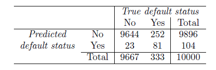

<b>TAB 5.4</b><i> ![ Une matrice de confusion compare les prédictions LDA aux véritables statuts par défaut pour les 10 000 observations d'apprentissages de l'ensemble de données Default. Les éléments sur la diagonale de la matrice représentent les individus dont les statuts de défaut ont été correctement prédits, tandis que les éléments hors diagonale représentent les individus qui ont été mal classés. LDA a fait des prédictions incorrectes pour 23 individus qui n'ont pas été en défaut de paiement et pour 252 individus qui l'ont été.](https://www.statlearning.com/)</i>

Le modèle LDA ajusté aux 10 000 échantillons d'apprentissage donne un taux d'erreur d'apprentissage de $2,75 \%$. Ce taux d'erreur semble faible, mais deux mises en garde s'imposent.

- Tout d'abord, les taux d'erreur d'apprentissage sont généralement inférieurs aux taux d'erreur de test, qui constituent la véritable quantité d'intérêt. En d'autres termes, nous pouvons nous attendre à ce que ce classificateur soit moins performant si nous l'utilisons pour prédire si un nouvel ensemble d'individus sera défaillant ou non. La raison en est que nous ajustons spécifiquement les paramètres de notre modèle pour obtenir de bons résultats sur les données d'apprentissage. Plus le rapport entre les paramètres $p$ et le nombre d'échantillons $n$ est élevé, plus cet ajustement excessif devrait jouer un rôle. Pour ces données, nous ne pensons pas que cela soit un problème, puisque $p=2$ et $n=10,000$.

- Deuxièmement, étant donné que seulement $3,33 \%$ des individus de l'échantillon d'apprentissage ont fait défaut, un classificateur simple mais inutile qui prédit toujours qu'un individu ne fera pas défaut, indépendamment du solde de sa carte de crédit et de son statut d'étudiant, donnera un taux d'erreur de $3,33 \%$. En d'autres termes, le classificateur nul trivial obtiendra un taux d'erreur à peine supérieur au taux d'erreur de l'ensemble d'apprentissage LDA.

Dans la pratique, un classificateur binaire tel que celui-ci peut commettre deux types d'erreurs : il peut affecter de manière incorrecte un individu qui se retrouve par défaut dans la catégorie sans défaut, ou il peut affecter de manière incorrecte un individu qui ne se retrouve pas par défaut dans la catégorie avec défaut. Il est souvent intéressant de déterminer lequel de ces deux types d'erreurs est commis. Une matrice de confusion, présentée pour les données sur les défauts de paiement dans le $tableau\ 5.4$, est un moyen pratique d'afficher cette information. Le tableau révèle que LDA a prédit qu'un total de 104 personnes seraient en défaut de paiement. Parmi ces personnes, 81 ont effectivement fait défaut et 23 ne l'ont pas fait. Par conséquent, seuls 23 des 9 667 individus qui n'ont pas fait défaut ont été incorrectement étiquetés.

Cela semble être un taux d'erreur assez faible ! Cependant, sur les 333 personnes en défaut de paiement, 252 (soit $75,7 \%$) n'ont pas été détectées par le LDA. Ainsi, si le taux d'erreur global est faible, le taux d'erreur parmi les personnes en défaut de paiement est très élevé. Du point de vue d'une société de cartes de crédit qui essaie d'identifier les personnes à haut risque, un taux d'erreur de $252  / 333 = 75,7 \%$ parmi les personnes en défaut de paiement pourrait bien être inacceptable.

Les performances spécifiques à une classe sont également importantes en médecine et en biologie, où les termes sensibilité et spécificité caractérisent les performances d'un classificateur ou d'un test de dépistage. Dans le cas présent, la sensibilité est le pourcentage de vrais mauvais payeurs qui sont identifiés ; elle est de 24,3 %. La spécificité est le pourcentage de non-défaillants correctement identifiés ; elle est égale à ( $1{-}23 / 9667)=99,8 \%$.

Pourquoi la méthode LDA fait-elle un si mauvais travail de classification des clients en défaut de paiement ? En d'autres termes, pourquoi sa sensibilité est-elle si faible ? Comme nous l'avons vu, LDA essaie de se rapprocher du classificateur de Bayes, qui a le taux d'erreur total le plus faible de tous les classificateurs. En d'autres termes, le classificateur de Bayes produira le plus petit nombre total possible d'observations mal classées, quelle que soit la classe d'où proviennent les erreurs. Certaines erreurs de classification résulteront de l'affectation incorrecte d'un client qui n'est pas en défaut à la classe de défaut, et d'autres résulteront de l'affectation incorrecte d'un client qui est en défaut à la classe de non-défaut. Par contre, une société de cartes de crédit pourrait particulièrement vouloir éviter de classer incorrectement un individu qui sera en défaut de paiement, alors que classer incorrectement un individu qui ne sera pas en défaut de paiement, bien que devant être évité, est moins problématique. Nous allons maintenant voir qu'il est possible de modifier la méthode LDA afin de développer un classificateur qui réponde mieux aux besoins de la société de cartes de crédit.

Le classifieur de Bayes fonctionne en assignant une observation à la classe pour laquelle la probabilité postérieure $p_k(X)$ est la plus grande. Dans le cas de deux classes, cela revient à affecter une observation à la classe par défaut si

$$
{Pr}(\text { default }=\text { Yes } \mid X=x)>0.5 \text {. } \hspace{6em } (5.26)
$$

Ainsi, le classificateur de Bayes, et par extension LDA, utilise un seuil de $50 \%$ pour la probabilité postérieure de défaillance afin d'assigner une observation à la classe de défaillance. Toutefois, si nous craignons de prédire de manière incorrecte le statut de défaillance des individus qui sont défaillants, nous pouvons envisager d'abaisser ce seuil. Par exemple, nous pourrions classer dans la classe des défaillances tout client dont la probabilité postérieure de défaillance est supérieure à 20 dollars. En d'autres termes, au lieu d'assigner une observation à la classe de défaillance si (5.26) se vérifie, nous pourrions plutôt assigner une observation à cette classe si

$$
{Pr}(\text { default }=\text { Yes } \mid X=x)>0.2 \text {. } \hspace{6em } (5.27)
$$

Les taux d'erreur qui résultent de cette approche sont présentés dans le $tableau\ 5.5$. La LDA prédit maintenant que 430 individus seront en défaut de paiement. Sur les 333 individus en défaut de paiement, la LDA prédit correctement tous les individus sauf 138, soit $41,4 \%$. Il s'agit d'une amélioration considérable par rapport au taux d'erreur de $75,7\%$ résultant de l'utilisation du seuil de $50\%$. 

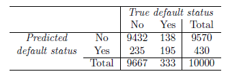

<b>TAB 5.5</b><i> </i>

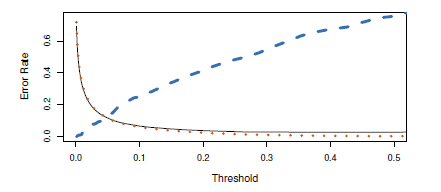

<b>FIG 5.7</b><i> </i>

Cependant, cette amélioration a un coût : désormais, 235 individus qui ne sont pas en défaut de paiement sont incorrectement classés. Par conséquent, le taux d'erreur global a légèrement augmenté, passant à $3,73 \%$. Mais une société de cartes de crédit peut considérer que cette légère augmentation du taux d'erreur total est un faible prix à payer pour une identification plus précise des individus qui sont effectivement en défaut de paiement.

La $figure\ 5.7$ illustre le compromis qui résulte de la modification de la valeur seuil de la probabilité postérieure de défaillance. Divers taux d'erreur sont indiqués en fonction de la valeur du seuil. L'utilisation d'un seuil de $0,5$, comme dans (5.26), minimise le taux d'erreur global, représenté par une ligne noire continue. Ceci est prévisible, puisque le classifieur de Bayes utilise un seuil de $0,5$ et est connu pour avoir le taux d'erreur global le plus bas. Mais lorsqu'un seuil de $0,5$ est utilisé, le taux d'erreur parmi les individus en défaut est assez élevé (ligne pointillée bleue). Au fur et à mesure que l'on réduit le seuil, le taux d'erreur parmi les individus qui font défaut diminue régulièrement, mais le taux d'erreur parmi les individus qui ne font pas défaut augmente. Comment pouvons-nous décider de la meilleure valeur de seuil ? Une telle décision doit se fonder sur la connaissance du domaine, comme des informations détaillées sur les coûts associés à la défaillance.

La courbe ROC est un graphique populaire permettant de visualiser simultanément les deux types d'erreurs pour tous les seuils possibles. Le nom "ROC" est historique, et provient de la théorie des communications. C'est un acronyme de receiver operating characteristics.

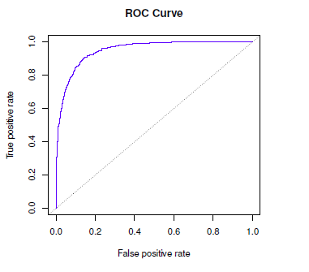

<b>FIG 5.8</b><i> ![Courbe ROC pour le classificateur LDA sur les données de défaut. Elle trace deux types d'erreur lorsque nous faisons varier la valeur du seuil pour la probabilité postérieure de défaut. Les seuils réels ne sont pas représentés. Le taux de vrais positifs est la sensibilité : la fraction de défaillants qui sont correctement identifiés, en utilisant une valeur seuil donnée. Le taux de faux positifs est égal à 1-spécificité : la fraction de non-défaillants que nous classons incorrectement comme défaillants, en utilisant cette même valeur de seuil. La courbe ROC idéale embrasse le coin supérieur gauche, indiquant un taux élevé de vrais positifs et un faible taux de faux positifs. La ligne en pointillé représente le classificateur "aucune information" ; c'est ce à quoi nous nous attendons si le statut d'étudiant et le solde de la carte de crédit ne sont pas associés à la probabilité de défaillance.](https://www.statlearning.com/)</i>

 La $figure\ 5.8$ présente la courbe ROC pour le classificateur LDA sur les données d'apprentissage. La performance globale d'un classificateur, résumée sur tous les seuils possibles, est donnée par l'aire sous la courbe $(R O C$ ) (AUC). Une courbe ROC idéale embrassera le coin supérieur gauche, donc plus l'AUC est grande, meilleur est le classifieur. Pour ces données, la $\mathrm{AUC}$ est de $0,95$, ce qui est proche du maximum de un et serait donc considéré comme très bon. On s'attend à ce qu'un classificateur dont les performances ne sont pas supérieures à celles du hasard ait un $\mathrm{AUC}$ de $0,5$ (lorsqu'il est évalué sur un ensemble de test indépendant non utilisé pour la formation du modèle). Les courbes ROC sont utiles pour comparer différents classificateurs, car elles prennent en compte tous les seuils possibles. 

Il s'avère que la courbe ROC pour le modèle de régression logistique de la section 5.3.4 adapté à ces données est pratiquement indifférenciable de celle du modèle LDA, nous ne l'affichons donc pas ici. Comme nous l'avons vu ci-dessus, faire varier le seuil du classificateur modifie son taux de vrais positifs et de faux positifs. Ceux-ci sont également appelés la sensibilité et une moins la spécificité de notre classificateur. Puisqu'il existe un éventail presque déconcertant de termes utilisés dans ce contexte, nous en donnons maintenant un résumé. Le $tableau\ 5.6$ montre les résultats possibles lorsqu'on applique un classificateur (ou un test de diagnostic) à une population. 

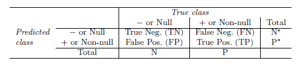

<b>TAB 5.6</b><i> </i>

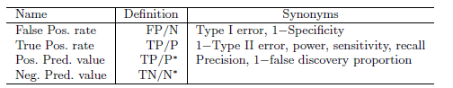

Pour faire le lien avec la littérature épidémiologique, nous considérons "+" comme la "maladie" que nous essayons de détecter, et "-" comme l'état "non-malade". Pour faire le lien avec la littérature classique sur les tests d'hypothèse, nous considérons "-" comme l'hypothèse nulle et "+" comme l'hypothèse alternative (non nulle). Dans le contexte des données sur le défaut, "+" indique un individu qui fait défaut, et "-" un individu qui ne fait pas défaut.

Le $tableau\ 5.7$ énumère plusieurs des mesures de performance populaires utilisées dans ce contexte. Les dénominateurs des taux de faux positifs et de vrais positifs sont les effectifs réels de la population dans chaque classe. En revanche, les dénominateurs de la valeur prédictive positive et de la valeur prédictive négative sont les effectifs totaux prédits pour chaque classe.

<a name="5-4-3"/>

### [5.4.3 Analyse discriminante quadratique](#5-4-3) ###

[Retour TOC](#toc)

Comme nous l'avons vu, l'analyse LDA suppose que les observations de chaque classe sont tirées d'une distribution gaussienne multivariée avec un vecteur moyen spécifique à la classe et une matrice de covariance commune à toutes les classes $K$. L'analyse discriminante quadratique (QDA) offre une approche alternative. Comme la LDA, le classificateur QDA part du principe que les observations de chaque classe sont tirées d'une distribution gaussienne et intègre les estimations des paramètres dans le théorème de Bayes afin d'effectuer la prédiction. Cependant, contrairement à LDA, QDA suppose que chaque classe possède sa propre matrice de covariance. Autrement dit, elle suppose qu'une observation de la $k{-}ième$ classe est de la forme $X \sim N\left(\mu_k, \boldsymbol{\Sigma}_k\right)$, où $\boldsymbol{\Sigma}_k$ est une matrice de covariance pour la $k{-}ième$ classe. Sous cette hypothèse, le classifieur de Bayes attribue une observation $X=x$ à la classe pour laquelle

$$
\begin{aligned}
\delta_k(x) & =-\frac{1}{2}\left(x-\mu_k\right)^T \boldsymbol{\Sigma}_k^{-1}\left(x-\mu_k\right)-\frac{1}{2} \log \left|\boldsymbol{\Sigma}_k\right|+\log \pi_k \\
& =-\frac{1}{2} x^T \boldsymbol{\Sigma}_k^{-1} x+x^T \boldsymbol{\Sigma}_k^{-1} \mu_k-\frac{1}{2} \mu_k^T \boldsymbol{\Sigma}_k^{-1} \mu_k-\frac{1}{2} \log \left|\boldsymbol{\Sigma}_k\right|+\log \pi_k
\end{aligned} \hspace{6em } (5.28)
$$

est le plus grand. Le classificateur QDA consiste donc à insérer des estimations pour $\Sigma_k, \mu_k$ et $\pi_k$ dans (5.28), puis à affecter une observation $X=x$ à la classe pour laquelle cette quantité est la plus grande. Contrairement à (5.24), la quantité $x$ apparaît comme une fonction quadratique dans (5.28). C'est de là que vient le nom de QDA.

**Pourquoi est-il important de supposer ou non que les classes $K$ partagent une matrice de covariance commune ?** En d'autres termes, pourquoi préférer LDA à QDA, ou vice-versa ? La réponse réside dans le compromis biais-variance. Lorsqu'il y a $p$ prédicteurs, l'estimation d'une matrice de covariance nécessite l'estimation de $p(p+1) / 2$ paramètres. QDA estime une matrice de covariance séparée pour chaque classe, pour un total de $K p(p+1) / 2$ paramètres. Avec 50 prédicteurs, cela correspond à un multiple de 1 275, ce qui représente un grand nombre de paramètres. En supposant plutôt que les $K$ classes partagent une matrice de covariance commune, le modèle LDA devient linéaire en $x$, ce qui signifie qu'il y a $K p$ coefficients linéaires à estimer. Par conséquent, le modèle LDA est un classificateur beaucoup moins flexible que le modèle QDA, et sa variance est donc nettement inférieure. Cela peut potentiellement conduire à une meilleure performance de prédiction. Mais il y a un compromis : si l'hypothèse de LDA selon laquelle les $K$ classes partagent une matrice de covariance commune est erronée, alors LDA peut souffrir d'un biais élevé. En gros, LDA a tendance à être un meilleur choix que QDA s'il y a relativement peu d'observations d'apprentissages et que la réduction de la variance est cruciale. En revanche, QDA est recommandé si l'ensemble d'apprentissage est très grand, de sorte que la variance du classificateur n'est pas une préoccupation majeure, ou si l'hypothèse d'une matrice de covariance commune pour les classes $K$ est clairement intenable.

La $figure\ 5.9$ illustre les performances de LDA et QDA dans deux scénarios. Dans le panneau de gauche, les deux classes gaussiennes ont une corrélation commune de $0,7$ entre $X_1$ et $X_2$. Par conséquent, la frontière de décision de Bayes est linéaire et est approximée avec précision par la frontière de décision LDA. 

La limite de décision QDA est inférieure, car elle souffre d'une variance plus élevée sans une diminution correspondante du biais. En revanche, le panneau de droite présente une situation dans laquelle la classe orange a une corrélation de $0,7$ entre les variables et la classe bleue a une corrélation de $0,7$. Maintenant, la limite de décision de Bayes est quadratique, et donc QDA se rapproche plus précisément de cette limite que LDA.

<a name="5-4-4"/>

### [5.4.4 Bayes naïf](#5-4-4) ###

[Retour TOC](#toc)

Dans les sections précédentes, nous avons utilisé le théorème de Bayes (5.15) pour développer les classifieurs LDA et QDA. Ici, nous utilisons le théorème de Bayes pour motiver le célèbre classifieur Bayes naïf.

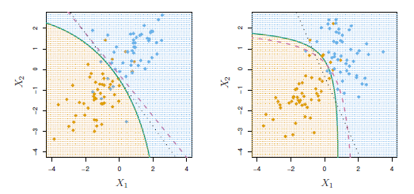

<b>FIG 5.9</b><i> ![ À gauche : les limites de décision de Bayes (pointillés violets), LDA (pointillés noirs) et QDA (pleins verts) pour un problème à deux classes avec Sum_1=Sum_2. L'ombrage indique la règle de décision QDA. Comme la limite de décision de Bayes est linéaire, elle est plus précisément approximée par LDA que par QDA. Droite : Les détails sont les mêmes que dans le panneau de gauche, sauf que Sum_1 neq Sum_2. Comme la limite de décision de Bayes est non linéaire, elle est plus précisément approximée par QDA que par LDA..](https://www.statlearning.com/)</i>

Rappelons que le théorème de Bayes (5.15) fournit une expression pour la probabilité postérieure $p_k(x)={Pr}(Y=k \mid X=x)$ en termes de $\pi_1, \ldots, \pi_K$ et $f_1(x), \ldots, f_K(x)$. Pour utiliser (5.15) en pratique, nous avons besoin d'estimations pour $\pi_1, \ldots, \pi_K$ et $f_1(x), \ldots, f_K(x)$. Comme nous l'avons vu dans les sections précédentes, l'estimation des probabilités antérieures $\pi_1, \ldots, \pi_K$ est généralement simple : par exemple, nous pouvons estimer $\hat{\pi}_k$ comme la proportion d'observations d'apprentissage appartenant à la $k{-}ème$ classe, pour $k=1, \ldots, K$.

Cependant, l'estimation de $f_1(x), \ldots, f_K(x)$ est plus subtile. Rappelons que $f_k(x)$ est la fonction de densité à $p{-}dimensions$ d'une observation dans la $k{-}ème$ classe, pour $k=1, \ldots, K$. En général, l'estimation d'une fonction de densité à $p{-}dimensions$ est un défi. Dans LDA, nous faisons une hypothèse très forte qui simplifie grandement la tâche : nous supposons que $f_k$ est la fonction de densité d'une variable aléatoire normale multivariée avec une moyenne spécifique à la classe $\mu_k$ et une matrice de covariance partagée $\Sigma$. En revanche, dans QDA, nous supposons que $f_k$ est la fonction de densité d'une variable aléatoire normale multivariée avec une moyenne spécifique à la classe $\mu_k$, et une matrice de covariance spécifique à la classe $\Sigma_k$. En faisant ces hypothèses très fortes, nous sommes en mesure de remplacer le problème très difficile de l'estimation des fonctions de densité à $Kp{-} dimensions$ par le problème beaucoup plus simple de l'estimation des vecteurs moyens à $Kp{-}dimensions$ et des matrices de covariance à une (dans le cas de LDA) ou $K$ (dans le cas de QDA) $(p \times p)$ dimensions.

Le classificateur naïf de Bayes adopte une approche différente pour estimer $f_1(x), \ldots$, $f_K(x)$. Au lieu de supposer que ces fonctions appartiennent à une famille particulière de distributions (par exemple, la normale multivariée), nous faisons une seule hypothèse : *Au sein de la $k{-}ième$ classe, les prédicteurs $p$ sont indépendants.*

Exprimée mathématiquement, cette hypothèse signifie que pour $k=1, \ldots, K$,

$$
f_k(x)=f_{k 1}\left(x_1\right) \times f_{k 2}\left(x_2\right) \times \cdots \times f_{k p}\left(x_p\right), \hspace{6em } (5.29)
$$

où $f_{k j}$ est la fonction de densité du $j{-}ème$ prédicteur parmi les observations de la $k{-}ème$ classe.

**Pourquoi cette hypothèse est-elle si puissante ?** Essentiellement, l'estimation d'une fonction de densité à $p{-}dimensions$ est difficile parce que nous devons tenir compte non seulement de la distribution marginale de chaque prédicteur - c'est-à-dire la distribution de chaque prédicteur pris isolément - mais aussi de la distribution conjointe des prédicteurs - c'est-à-dire l'association entre les différents prédicteurs. 

Dans le cas d'une distribution normale multivariée, l'association entre les différents prédicteurs est résumée par les éléments hors-diagonale de la matrice de covariance. Cependant, en général, cette association peut être très difficile à caractériser et extrêmement difficile à estimer. Mais en supposant que les covariables $p$ sont indépendantes au sein de chaque classe, nous éliminons complètement le besoin de nous préoccuper de l'association entre les prédicteurs $p$, car nous avons simplement supposé qu'il n'y a pas d'association entre les prédicteurs !

Croyons-nous vraiment à l'hypothèse naïve de Bayes selon laquelle les covariables $p$ sont indépendantes au sein de chaque classe ? Dans la plupart des cas, non. Mais même si cette hypothèse de modélisation est faite par commodité, elle conduit souvent à des résultats assez décents, en particulier dans les cas où $n$ n'est pas assez grand par rapport à $p$ pour que nous puissions estimer efficacement la distribution conjointe des prédicteurs dans chaque classe. En fait, étant donné que l'estimation d'une distribution conjointe nécessite une telle quantité de données, la méthode de Bayes naïf est un bon choix dans un large éventail de situations. Essentiellement, l'hypothèse de Bayes naïf introduit un certain biais, mais réduit la variance, ce qui conduit à un classificateur qui fonctionne assez bien dans la pratique en raison du compromis biais-variance.

Une fois que nous avons fait l'hypothèse de Bayes naïf, nous pouvons insérer (5.29) dans (5.15) pour obtenir une expression pour la probabilité postérieure,

$$
{Pr}(Y=k \mid X=x)=\frac{\pi_k \times f_{k 1}\left(x_1\right) \times f_{k 2}\left(x_2\right) \times \cdots \times f_{k p}\left(x_p\right)}{\sideset{}{_{l=1}^K}\sum \pi_l \times f_{l 1}\left(x_1\right) \times f_{l 2}\left(x_2\right) \times \cdots \times f_{l p}\left(x_p\right)} \hspace{6em } (5.30)
$$

pour $k=1, \ldots, K$.

Pour estimer la fonction de densité unidimensionnelle $f_{k j}$ à l'aide des données d'apprentissage $x_{1 j}, \ldots, x_{n j}$, nous avons quelques options.

- Si $X_j$ est quantitatif, nous pouvons supposer que $X_j \mid Y=k \sim N\left(\mu_{j k}, \sigma_{j k}^2\right)$ En d'autres termes, nous supposons que dans chaque classe, le $j{-} ème$ prédicteur est tiré d'une distribution normale (univariée). Bien que cela puisse ressembler à la méthode QDA, il existe une différence essentielle : nous supposons ici que les prédicteurs sont indépendants ; cela revient à la méthode QDA avec l'hypothèse supplémentaire que la matrice de covariance spécifique à la classe est diagonale.

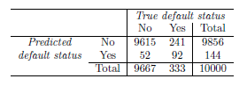

<b>TAB 5.8</b><i> 
$P(Y={default} \mid X=x)>0,5$ . </i>

- Si $X_j$ est quantitatif, une autre option consiste à utiliser une estimation non paramétrique de $f_{k j}$. Une façon très simple de le faire est de créer un histogramme pour les observations du prédicteur $j$ dans chaque classe. Nous pouvons alors estimer $f_{k j}\left(x_j\right)$ comme la fraction des observations d'apprentissage dans la $k{-}ème$ classe qui appartiennent à la même case de l'histogramme que $x_j$. Nous pouvons également utiliser un estimateur de densité à noyau, qui est essentiellement une version lissée d'un histogramme.

- Si $X_j$ est qualitatif, nous pouvons simplement compter la proportion d'observations d'apprentissages pour le prédicteur $j$ correspondant à chaque classe. Par exemple, supposons que $X_j \in\{1,2,3\}$, et que nous avons 100 observations dans la $k$ ème classe. Supposons que le prédicteur $j$ prend les valeurs 1, 2 et 3 dans 32, 55 et 13 de ces observations, respectivement. Nous pouvons alors estimer $f_{k j}$ comme suit

$$
\hat{f}_{k j}\left(x_j\right)= 
\begin{cases}0.32 & \text { if } x_j=1 \\ 
0.55 & \text { if } x_j=2 \\ 
0.13 & \text { if } x_j=3 .
\end{cases}
$$

Nous considérons maintenant le classifieur de Bayes naïf dans un exemple fictif avec $p=3$ prédicteurs et $K=2$ classes. Les deux premiers prédicteurs sont quantitatifs, et le troisième prédicteur est qualitatif avec trois niveaux. Supposons en outre que $\hat{\pi_1}=\hat{\pi_2}=0,5$ . 

Les fonctions de densité estimées $\hat{f}_{k j}$ pour $k=1,2$ et $j=1,2,3$ sont représentées sur la figure 5.10. Supposons maintenant que nous souhaitons classer une nouvelle observation, $x^*=(0,4,1,5,1)^T$ . Il s'avère que dans cet exemple, 

$$
\hat{f}_{11}(0,4)=0,368,\ \hat{f}_{12}(1,5)=0,484,\ \hat{f}_{13}(1)=0,226 ,\ et\ \hat{f}_{21}(0,4)= 0,030$,\ \hat{f}_{22}(1,5)=0,130,\ \hat{f}_{23}(1)=0,616
$$

En introduisant ces estimations dans (5.30), on obtient des estimations de probabilité postérieure de 

$$
Pr\left(Y=1 \mid X=x^*\right)=0,944
$$

$$
Pr\left(Y=2 \mid X=x^*\right)=0,056.
$$

Le $tableau\ 5.8$ présente la matrice de confusion résultant de l'application du classificateur Bayes naïf à l'ensemble de données Default, où nous prédisons un défaut si la probabilité postérieure d'un défaut - c'est-à-dire $P(Y=$ default $\mid X=x)$ - dépasse $0,5$. Si l'on compare ces résultats à ceux de la méthode LDA dans le tableau 5.4, nos conclusions sont mitigées. Alors que la LDA présente un taux d'erreur global légèrement inférieur, le modèle Bayes naïf prédit correctement une fraction plus élevée de véritables défaillants. Dans cette implémentation de Bayes naïf, nous avons supposé que chaque prédicteur quantitatif est tirée d'une distribution gaussienne (et, bien sûr, que dans chaque classe, chaque prédicteur est indépendant).

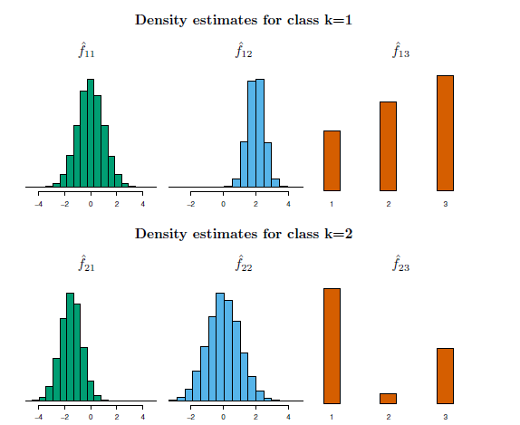

<b>FIG 5.10</b><i>Dans l'exemple fictif de la section 5.5.4, nous générons des données avec $p=3$ prédicteurs et $K=2$ classes. Les deux premiers prédicteurs sont quantitatifs, et le troisième prédicteur est qualitatif avec trois niveaux. Dans chaque classe, la densité estimée pour chacun des trois prédicteurs est affichée. Si les probabilités antérieures des deux classes sont égales, alors l'observation $x^*=(0.4,1.5,1)^T$ a une probabilité postérieure de $94,4 \%$ d'appartenir à la première classe. </i>

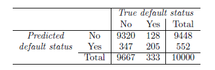

<b>TAB 5.9</b>  <i>Comparaison des prédictions naïves de Bayes au véritable état de défaut pour les 10 000 observations d'apprentissage de l'ensemble de données Défaut, lorsque nous prédisons le défaut pour toute observation pour laquelle $P(Y={default} \mid X=x)>0,2$. </i>

Juste comme avec LDA, nous pouvons facilement ajuster le seuil de probabilité pour prédire un défaut. Par exemple, le $tableau\ 5.9$ fournit la matrice de confusion résultant de la prédiction d'un défaut de paiement si $P(Y=$ défaut $\mid X=x)>0,2$. 

Encore une fois, les résultats sont mitigés par rapport à LDA avec le même seuil ($tableau\ 5.5$ ). Naive Bayes a un taux d'erreur plus élevé, mais prédit correctement près de deux tiers des vrais défauts.

Dans cet exemple, il ne devrait pas être trop surprenant que Bayes naïf ne surpasse pas de manière convaincante LDA : cet ensemble de données a $n=10 000$ et $p=4$, et donc la réduction de la variance résultant de l'hypothèse de Bayes naïf n'est pas nécessairement valable. Nous nous attendons à ce que l'utilisation de Bayes naïf par rapport à LDA ou QDA soit plus rentable dans les cas où $p$ est plus grand ou $n$ est plus petit, de sorte que la réduction de la variance est très importante.

<a name="5-5"/>

## [5.5 Comparaison des méthodes de classification](#5-5) ##

<a name="5-5-1"/>

### [5.5.1 Comparaison analytique](#5-5-1) ###

[Retour TOC](#toc)

Nous allons maintenant effectuer une comparaison analytique (ou mathématique) de LDA, QDA, Bayes naïf et régression logistique. Nous considérons ces approches dans un cadre comportant $K{-classes}$, de sorte que nous assignons une observation à la classe qui maximise ${Pr}(Y=k \mid X=x)$. De manière équivalente, nous pouvons définir $K$ comme la classe de base et affecter une observation à la classe qui maximise

$$
\log \left(\frac{{Pr}(Y=k \mid X=x)}{{Pr}(Y=K \mid X=x)}\right)  \hspace{6em } (5.31)
$$

for $k=1, \ldots, K$. L'examen de la forme spécifique de (5.31) pour chaque méthode permet de comprendre clairement leurs similitudes et leurs différences.

Tout d'abord, pour LDA, nous pouvons utiliser le théorème de Bayes (5.15) ainsi que l'hypothèse selon laquelle les prédicteurs de chaque classe sont tirés d'une densité normale multivariée (5.23) avec une moyenne spécifique à la classe et une matrice de covariance partagée, afin de montrer que

$$
\begin{aligned}
\log \left(\frac{{Pr}(Y=k \mid X=x)}{{Pr}(Y=K \mid X=x)}\right)= & \log \left(\frac{\pi_k f_k(x)}{\pi_K f_K(x)}\right) \\
= & \log \left(\frac{\pi_k \exp \left(-\frac{1}{2}\left(x-\mu_k\right)^T \mathbf{\Sigma}^{-1}\left(x-\mu_k\right)\right)}{\pi_K \exp \left(-\frac{1}{2}\left(x-\mu_K\right)^T \boldsymbol{\Sigma}^{-1}\left(x-\mu_K\right)\right)}\right) \\
= & \log \left(\frac{\pi_k}{\pi_K}\right)-\frac{1}{2}\left(x-\mu_k\right)^T \mathbf{\Sigma}^{-1}\left(x-\mu_k\right) \\
& +\frac{1}{2}\left(x-\mu_K\right)^T \mathbf{\Sigma}^{-1}\left(x-\mu_K\right) \\
= & \log \left(\frac{\pi_k}{\pi_K}\right)-\frac{1}{2}\left(\mu_k+\mu_K\right)^T \mathbf{\Sigma}^{-1}\left(\mu_k-\mu_K\right) \\
& +x^T \boldsymbol{\Sigma}^{-1}\left(\mu_k-\mu_K\right) \\
= & a_k+\sum_{j=1}^p b_{k j} x_j
\end{aligned} \hspace{6em } (5.32)
$$

où $a_k=\log \left(\frac{\pi_k}{\pi_K}\right)-\frac{1}{2}\left(\mu_k+\mu_K\right)^T \boldsymbol{\Sigma}^{- 1}\left(\mu_k-\mu_K\right)$ et $b_{k j}$ est la $j{-}ème$ composante de $\Sigma^{-1}\left(\mu_k-\mu_K\right)$. Par conséquent, la LDA, comme la régression logistique, suppose que le logarithme des probabilités postérieures est linéaire en $x$.

En utilisant des calculs similaires, dans le cadre de la QDA, (5.31) devient

$$
\log \left(\frac{{Pr}(Y=k \mid X=x)}{{Pr}(Y=K \mid X=x)}\right)=a_k+\sum_{j=1}^p b_{k j} x_j+\sum_{j=1}^p \sum_{l=1}^p c_{k j l} x_jx_l, \hspace{6em } (5.33)
$$

où $a_k, b_{k j}$, et $c_{k j l}$ sont des fonctions de $\pi_k, \pi_K, \mu_k, \mu_K, \mathbf{\Sigma}_k$ et $\mathbf{\Sigma}_K$. Encore une fois, comme son nom l'indique, QDA suppose que l'écart $\log$ des probabilités postérieures est quadratique en $x$.

Enfin, nous examinons (5.31) dans le cadre de Bayes naïf. Rappelons que dans ce cadre, $f_k(x)$ est modélisé comme un produit de $p$ fonctions unidimensionnelles $f_{k j}\left(x_j\right)$ pour $j=1, \ldots, p$. Par conséquent,

$$
\begin{aligned}
\log \left(\frac{{Pr}(Y=k \mid X=x)}{{Pr}(Y=K \mid X=x)}\right) & =\log \left(\frac{\pi_k f_k(x)}{\pi_K f_K(x)}\right) \\
& =\log \left(\frac{\pi_k \prod_{j=1}^p f_{k j}\left(x_j\right)}{\pi_K \prod_{j=1}^p f_{K j}\left(x_j\right)}\right) \\
& =\log \left(\frac{\pi_k}{\pi_K}\right)+\sum_{j=1}^p \log \left(\frac{f_{k j}\left(x_j\right)}{f_{K j}\left(x_j\right)}\right) \\
& =a_k+\sum_{j=1}^p g_{k j}\left(x_j\right)
\end{aligned} \hspace{6em } (5.34)
$$

où $a_k=\log \left(\frac{\pi_k}{\pi_K}\right)$ et $g_{k j}\left(x_j\right)=\log \left(\frac{f_{k j}\left(x_j\right)}{f_{K j}\left(x_j\right)}\right)$. Par conséquent, le côté droit de (5.34) prend la forme d'un modèle additif généralisé, un sujet qui sera abordé plus en détail au section 7.

L'inspection de (5.32), (5.33), et (5.34) permet de faire les observations suivantes sur LDA, QDA, et Bayes naïf :

- LDA est un cas particulier de QDA avec $c_{k j l}=0$ pour tous les $j=1, \ldots, p$, $l=1, \ldots, p$, et $k=1, \ldots, K$. (Bien sûr, ce n'est pas surprenant, puisque LDA est simplement une version restreinte de QDA avec $\Sigma_1=\cdots=\Sigma_K=\Sigma$).

- Tout classifieur avec une frontière de décision linéaire est un cas particulier de Bayes naïf avec $g_{k j}\left(x_j\right)=b_{k j} x_j$. En particulier, cela signifie que LDA est un cas particulier de Bayes naïf ! Cela n'est pas du tout évident d'après les descriptions de LDA et de Bayes naïf faites plus haut dans ce section, car chaque méthode fait des hypothèses très différentes : LDA suppose que les caractéristiques sont normalement distribuées avec une matrice de covariance commune au sein de la classe, et Bayes naïf suppose au contraire l'indépendance des caractéristiques.

- Si nous modélisons $f_{k j}\left(x_j\right)$ dans le classificateur de Bayes naïf en utilisant une distribution gaussienne unidimensionnelle $N\left(\mu_{k j}, \sigma_j^2\right)$, on obtient alors $g_{k j}\left(x_j\right)=$ $b_{k j} x_j$ où $b_{k j}=\left(\mu_{k j}-\mu_{K j}\right) / \sigma_j^2$. Dans ce cas, Bayes naïf est en fait un cas particulier de LDA avec $\boldsymbol{\Sigma}$ restreint à une matrice diagonale dont le $j{-}ème$ élément diagonal est égal à $\sigma_j^2$.

- Ni QDA ni Bayes naïf ne sont des cas particuliers l'un de l'autre. Bayes naïf peut produire un ajustement plus flexible, puisque n'importe quel choix peut être fait pour $g_{k j}\left(x_j\right)$. Cependant, il est limité à un ajustement purement additif, dans le sens où, dans (5.34), une fonction de $x_j$ est ajoutée à une fonction de $x_l$, pour $j \neq l$ ; cependant, ces termes ne sont jamais multipliés. En revanche, QDA inclut des termes multiplicatifs de la forme $c_{k j l} x_j x_l$. Par conséquent, QDA a le potentiel d'être plus précis dans des contextes où les interactions entre les prédicteurs sont importantes pour la discrimination entre les classes.

Aucune de ces méthodes ne domine uniformément les autres : dans n'importe quel contexte, le choix de la méthode dépendra de la distribution réelle des prédicteurs dans chacune des classes $K$, ainsi que d'autres considérations, telles que les valeurs de $n$ et $p$. Ce dernier point est lié au compromis biais-variance.

Comment la régression logistique s'inscrit-elle dans cette histoire ? Rappelez-vous (5.12) que la régression logistique multinomiale prend la forme suivante

$$
\log \left(\frac{{Pr}(Y=k \mid X=x)}{{Pr}(Y=K \mid X=x)}\right)=\beta_{k 0}+\sideset{}{_{j=1}^p}\sum \beta_{k j} x_j .
$$

Ceci est identique à la forme linéaire de la LDA (5.32) : dans les deux cas, $\log \left(\frac{{Pr}(Y=k \mid X=x)}{{Pr}(Y=K \mid X=x)}\right)$ est une fonction linéaire des prédicteurs. Dans le LDA, les coefficients de cette fonction linéaire sont des fonctions des estimations de $\pi_k, \pi_K, \mu_k$, $\mu_K$, et $\Sigma$ obtenues en supposant que $X_1, \ldots, X_p$ suivent une distribution normale au sein de chaque classe. En revanche, dans la régression logistique, les coefficients sont choisis pour maximiser la fonction de vraisemblance (5.5). Ainsi, nous nous attendons à ce que la LDA soit plus performante que la régression logistique lorsque l'hypothèse de normalité est (approximativement) vérifiée, et nous nous attendons à ce que la régression logistique soit plus performante lorsqu'elle ne l'est pas.

Nous terminons par une brève discussion sur les $K{-}plus\ proches\ voisins$ (KNN), présentée au section 2. Rappelons que KNN adopte une approche complètement différente de celle des classificateurs présentés dans ce section. Afin de faire une prédiction pour une observation $X=x$, les observations d'apprentissage qui sont les plus proches de $x$ sont identifiées. Ensuite, $X$ est attribué à la classe à laquelle appartient la pluralité de ces observations. KNN est donc une approche complètement non-paramétrique : aucune hypothèse n'est faite sur la forme de la frontière de décision. Nous faisons les observations suivantes sur KNN :

- Parce que KNN est complètement non-paramétrique, nous pouvons nous attendre à ce que cette approche domine LDA et la régression logistique lorsque la décision limite est hautement non linéaire, à condition que $n$ soit très grand et que $p$ soit petit.

- Afin de fournir une classification précise, KNN nécessite beaucoup d'observations par rapport au nombre de prédicteurs - c'est-à-dire $n$ beaucoup plus grand que $p$. Cela est dû au fait que KNN est non paramétrique, et tend donc à réduire le biais tout en subissant une grande variance.

- Dans les cas où la frontière de décision est non linéaire mais où $n$ est modeste, ou $p$ n'est pas très petit, alors QDA peut être préféré à KNN. Ceci est dû au fait que QDA peut fournir une limite de décision non linéaire tout en profitant d'une forme paramétrique, ce qui signifie qu'il nécessite une taille d'échantillon plus petite pour une classification précise, par rapport à KNN.

- Contrairement à la régression logistique, KNN ne nous indique pas quels prédicteurs sont importants : nous n'obtenons pas un tableau de coefficients comme dans le $tableau\ 5.3$.

<a name="5-5-2"/>

### [5.5.2 Une comparaison empirique](#5-5-2) ###

[Retour TOC](#toc)

Nous allons maintenant comparer les performances empiriques (pratiques) de la régression logistique, de LDA, de QDA, de Bayes naïf et de KNN. Nous avons généré des données provenant de six scénarios différents, chacun d'entre eux impliquant un problème de classification binaire (à deux classes). Dans trois des scénarios, la limite de décision de Bayes est linéaire, et dans les autres scénarios, elle est non linéaire. Pour chaque scénario, nous avons produit 100 ensembles de données d'entraînement aléatoires. Pour chacun de ces ensembles d'apprentissage, nous avons adapté chaque méthode aux données et calculé le taux d'erreur de test résultant sur un grand ensemble de test. Les résultats pour les scénarios linéaires sont présentés à la $figure\ 5.11$, et les résultats pour les scénarios non linéaires sont présentés à la $figure\ 5.12$. La méthode KNN nécessite la sélection de $K$, le nombre de voisins (à ne pas confondre avec le nombre de classes dans les sections précédentes de ce section). Nous avons exécuté la méthode KNN avec deux valeurs de $K : K=1$, et une valeur de $K$ choisie automatiquement à l'aide d'une approche appelée validation croisée, dont nous parlerons plus en détail au section 5 . Nous avons appliqué le modèle de Bayes naïf en supposant des densités gaussiennes univariées pour les caractéristiques de chaque classe (et, bien sûr, puisque c'est la caractéristique clé de Bayes naïf, en supposant l'indépendance des caractéristiques).

Dans chacun des six scénarios, il y avait $p=2$ prédicteurs quantitatifs. Les scénarios étaient les suivants :

***Scénario 1*** : Il y avait 20 observations d'apprentissages dans chacune des deux classes. Les observations de chaque classe étaient des variables normales aléatoires non corrélées avec une moyenne différente dans chaque classe. Le panneau de gauche de la $figure\ 5.11$ montre que la méthode LDA fonctionne bien dans ce contexte, comme on peut s'y attendre puisqu'il s'agit du modèle supposé par la méthode LDA. La régression logistique a également donné d'assez bons résultats, puisqu'elle suppose une limite de décision linéaire. KNN a obtenu des résultats médiocres car il a payé un prix en termes de variance qui n'a pas été compensé par une réduction du biais.

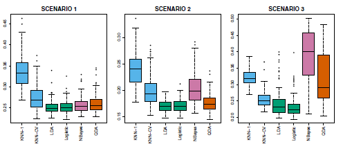

<b>FIG 5.11</b><i> </i>

QDA a également obtenu de moins bons résultats que LDA, car il a adapté un classificateur plus flexible que nécessaire. La performance de Bayes naïf était légèrement meilleure que QDA, car l'hypothèse de Bayes naïf de prédicteurs indépendants est correcte.

***Scénario 2*** : Les détails sont les mêmes que dans le scénario 1, sauf que dans chaque classe, les deux prédicteurs ont une corrélation de $-0.5$. Le panneau central de la $figure\ 5.11$ indique que les performances de la plupart des méthodes sont similaires à celles du scénario précédent. L'exception notable est la méthode de Bayes naïve, dont les performances sont très faibles ici, puisque l'hypothèse de Bayes naïve de prédicteurs indépendants est violée.

***Scénario 3*** : Comme dans le scénario précédent, il existe une corrélation négative importante entre les prédicteurs de chaque classe. Cependant, cette fois, nous avons généré $X_1$ et $X_2$ à partir de la distribution $t$, avec 50 observations par classe. La distribution $t$ a une forme similaire à la distribution normale, mais elle a tendance à produire plus de points extrêmes, c'est-à-dire plus de points éloignés de la moyenne. Dans ce contexte, la frontière de décision est toujours linéaire et s'inscrit donc dans le cadre de la régression logistique. La configuration violait les hypothèses de l'ADL, puisque les observations n'étaient pas tirées d'une distribution normale. Le panneau de droite de la $figure\ 5.11$ montre que la régression logistique est plus performante que la LDA, bien que les deux méthodes soient supérieures aux autres approches. En particulier, les résultats de la LDA se sont considérablement détériorés en raison de la non-normalité. Les performances de Naive Bayes sont très faibles car l'hypothèse d'indépendance est violée.

***Scénario 4*** : Les données ont été générées à partir d'une distribution normale, avec une corrélation de $0,5$ entre les prédicteurs de la première classe, et une corrélation de $0,5$ entre les prédicteurs de la deuxième classe. Cette configuration correspondait à l'hypothèse QDA et a donné lieu à des limites de décision quadratiques. Le panneau de gauche de la $figure\ 5.12$ montre que QDA est plus performant que toutes les autres approches. L'hypothèse de Bayes naïf concernant l'indépendance des prédicteurs est violée, de sorte que Bayes naïf n'obtient pas de bons résultats.

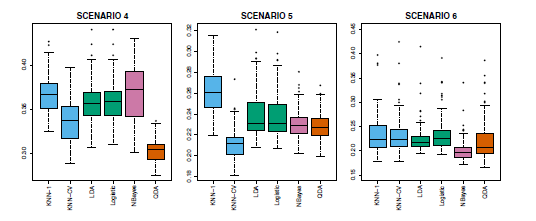

<b>FIG 5.12</b><i> </i>

***Scénario 5 :*** Les données ont été générées à partir d'une distribution normale avec des prédicteurs non corrélés. Ensuite, les réponses ont été échantillonnées à partir de la fonction logistique appliquée à une fonction non linéaire compliquée des prédicteurs. Le panneau central de la $figure\ 5.12$ montre que QDA et Bayes naïfs ont donné des résultats légèrement meilleurs que les méthodes linéaires, tandis que la méthode KNN-CV, beaucoup plus flexible, a donné les meilleurs résultats. Mais KNN avec $K=1$ a donné les pires résultats parmi toutes les méthodes. Cela souligne le fait que même lorsque les données présentent une relation non linéaire complexe, une méthode non paramétrique telle que KNN peut toujours donner de mauvais résultats si le niveau de lissage n'est pas choisi correctement.

***Scénario 6*** : Les observations ont été générées à partir d'une distribution normale avec une matrice de covariance diagonale différente pour chaque classe. Cependant, la taille de l'échantillon était très petite : juste $n=6$ dans chaque classe. Naive Bayes a donné de très bons résultats, car ses hypothèses sont respectées. Les performances de LDA et de la régression logistique sont médiocres car la véritable limite de décision n'est pas linéaire, en raison de l'inégalité des matrices de covariance. QDA a donné des résultats un peu moins bons que Bayes naïf, car étant donné la très petite taille de l'échantillon, le premier a subi trop de variance dans l'estimation de la corrélation entre les prédicteurs dans chaque classe. Les performances de KNN ont également souffert de la très petite taille de l'échantillon.

Ces six exemples illustrent le fait qu'aucune méthode ne domine les autres dans toutes les situations. Lorsque les véritables limites de décision sont linéaires, les approches LDA et régression logistique ont tendance à être performantes. Lorsque les frontières sont modérément non linéaires, QDA ou Bayes naïf peuvent donner de meilleurs résultats. Enfin, pour des frontières de décision beaucoup plus compliquées, une approche non paramétrique telle que KNN peut être supérieure. Mais le niveau de lissage d'une approche non paramétrique doit être choisi avec soin. Dans le section suivant, nous examinons un certain nombre d'approches permettant de choisir le niveau de lissage correct et, en général, de sélectionner la meilleure méthode globale. 

Enfin, rappelez-vous du section 3 : dans le cadre de la régression, nous pouvons tenir compte d'une relation non linéaire entre les prédicteurs et la réponse en effectuant une régression à l'aide de transformations des prédicteurs. Une approche similaire pourrait être adoptée dans le cadre de la classification. Par exemple, nous pourrions créer une version plus flexible de la régression logistique en incluant $X^2, X^3$, et même $X^4$ comme prédicteurs. Cela peut améliorer ou non les performances de la régression logistique, selon que l'augmentation de la variance due à la flexibilité supplémentaire est compensée par une réduction suffisamment importante du biais. Nous pourrions faire la même chose pour la LDA. Si nous ajoutons tous les termes quadratiques et produits croisés possibles à LDA, la forme du modèle serait la même que celle du modèle QDA, bien que les estimations des paramètres soient différentes. Ce dispositif nous permet de nous situer quelque part entre un modèle LDA et un modèle QDA.

<a name="5-6"/>

## [5.6 Modèles linéaires généralisés](#5-6) ##

[Retour TOC](#toc)

Au section 3, nous avons supposé que la réponse $Y$ était quantitative et nous avons étudié l'utilisation de la régression linéaire des moindres carrés pour prédire $Y$. Jusqu'à présent dans ce section, nous avons plutôt supposé que $Y$ est qualitative. Cependant, nous pouvons parfois être confrontés à des situations dans lesquelles $Y$ n'est ni qualitative ni quantitative, et donc ni la régression linéaire du section 3 ni les approches de classification abordées dans ce section ne sont applicables.

À titre d'exemple concret, nous considérons l'ensemble de données Bikeshare. La réponse est bikers, le nombre d'utilisateurs horaires d'un programme de partage de vélos à Washington, DC. Cette valeur de réponse n'est ni qualitative ni quantitative : elle prend plutôt des valeurs entières non négatives, ou des comptes. Nous envisagerons de prédire le nombre de cyclistes à l'aide des covariables mnth (mois de l'année), hr (heure de la journée, de 0 à 23), workingday (une variable indicatrice qui vaut 1 si ce n'est ni un week-end ni un jour férié), temp (la température normalisée, en Celsius), et weathersit (une variable qualitative qui prend l'une des quatre valeurs possibles : clair ; brumeux ou nuageux ; pluie légère ou neige légère ; ou forte pluie ou forte neige).

Dans les analyses qui suivent, nous traiterons mnth, hr et weathersit comme des variables qualitatives.

<a name="5-6-1"/>

### [5.6.1 Régression linéaire sur les données de vélos en libre-service](#5-6-1) ###

[Retour TOC](#toc)

Pour commencer, nous envisageons de prédire les cyclistes à l'aide d'une régression linéaire. Les résultats sont présentés dans le $tableau\ 5.10$.

Nous voyons, par exemple, qu'une progression du temps de clair à nuageux entraîne, en moyenne, $12,89$ de moins de cyclistes par heure ; cependant, si le temps progresse davantage vers la pluie ou la neige, alors cela entraîne $53,60$ de moins de cyclistes par heure. La $figure\ 5.13$ présente les coefficients associés à mnth et les coefficients associés à $\mathrm{hr}$. Nous constatons que l'utilisation des vélos est la plus élevée au printemps et à l'automne, et la plus faible pendant les mois d'hiver. De plus, l'utilisation du vélo est la plus importante aux heures de pointe (9 heures du matin et 6 heures du soir), et la plus faible pendant la nuit. Ainsi, à première vue, l'ajustement d'un modèle de régression linéaire à l'ensemble des données de Bikeshare semble fournir des résultats raisonnables et intuitifs.

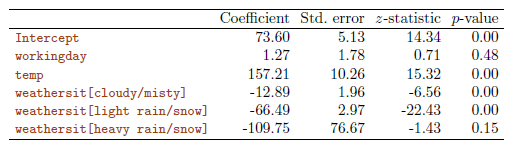

<b>TAB 5.10</b><i> </i>

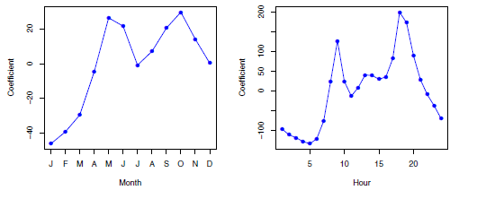

<b>FIG 5.13</b><i> </i>

Mais après une inspection plus attentive, certains problèmes deviennent apparents. Par exemple, $9,6 \%$ des valeurs ajustées dans l'ensemble de données Bikeshare sont négatives : c'est-à-dire que le modèle de régression linéaire prédit un nombre négatif d'utilisateurs pendant $9,6 \%$ des heures de l'ensemble de données. Cela remet en question notre capacité à effectuer des prédictions significatives sur les données, et soulève également des inquiétudes quant à l'exactitude des estimations des coefficients, des intervalles de confiance et des autres résultats du modèle de régression.

En outre, il est raisonnable de penser que lorsque la valeur attendue des motards est faible, la variance des motards devrait également être faible. Par exemple, à 2 heures du matin pendant une forte tempête de neige en décembre, nous nous attendons à ce que très peu de personnes utilisent un vélo, et de plus, il devrait y avoir peu de variance associée au nombre d'utilisateurs dans ces conditions. Cela est confirmé par les données : entre $1\ \mathrm{AM}$ et $4\ \mathrm{AM}$, en décembre, janvier et février, lorsqu'il pleut, il y a $5,05$ d'utilisateurs, en moyenne, avec un écart type de $3,73$.

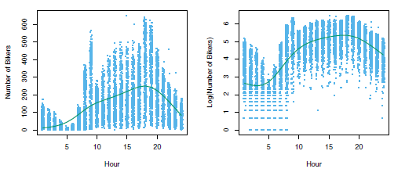

<b>FIG 5.14</b><i> </i>

En revanche, entre 7h et 10h du matin, en avril, mai et juin, lorsque le ciel est dégagé, il y a $243,59$ d'utilisateurs en moyenne, avec un écart type de $131,7$. La relation moyenne-variance est affichée dans le panneau de gauche de la $figure\ 5.14$. Il s'agit d'une violation majeure des hypothèses d'un modèle linéaire, qui stipule que $Y=\sideset{}{_{j=1}^p}\sum X_j \beta_j+\epsilon$, où $epsilon$ est un terme d'erreur de moyenne nulle avec une variance $\sigma^2$ qui est constante, et non une fonction des covariables. Par conséquent, l'hétéroscédasticité des données remet en question la pertinence d'un modèle de régression linéaire.

Enfin, la réponse motards est à valeur entière. Or, dans un modèle linéaire, $Y=\beta_0+\sideset{}{_{j=1}^p}\sum X_j \beta_j+\epsilon$, où $\epsilon$ est un terme d'erreur à valeur continue. Cela signifie que dans un modèle linéaire, la réponse $Y$ est nécessairement à valeur continue (quantitative). Ainsi, la nature entière de la réponse motards suggère qu'un modèle de régression linéaire n'est pas entièrement satisfaisant pour cet ensemble de données.

Certains des problèmes qui se posent lors de l'ajustement d'un modèle de régression linéaire aux données de Bikeshare peuvent être surmontés en transformant la réponse ; par exemple, nous pouvons ajuster le modèle suivant

$$
\log (Y)=\sideset{}{_{j=1}^p}\sum X_j \beta_j+\epsilon
$$

La transformation de la réponse évite la possibilité de prédictions négatives et permet de surmonter une grande partie de l'hétéroscédasticité des données non transformées, comme le montre le panneau de droite de la figure 5.14. Cependant, ce n'est pas une solution tout à fait satisfaisante, car les prédictions et l'inférence sont faites en termes de logarithme de la réponse, plutôt que de la réponse. Cela pose des problèmes d'interprétation, par exemple : " une augmentation d'une unité de $X_j$ est associée à une augmentation de la moyenne du logarithme de $Y$ d'un montant de $\beta_j$ ". En outre, une transformation logarithmique de la réponse ne peut pas être appliquée dans des contextes où la réponse peut prendre la valeur 0.

Ainsi, si l'ajustement d'un modèle linéaire à une transformation de la réponse peut être une approche adéquate pour certains ensembles de données à valeur de comptage, il laisse souvent à désirer. Nous verrons dans la section suivante qu'un modèle de régression de Poisson offre une approche beaucoup plus naturelle et élégante pour cette tâche.

<a name="5-6-2"/>

### [5.6.2 Régression de Poisson sur les données de Bikeshare](#5-6-2) ###

[Retour TOC](#toc)

Pour pallier les insuffisances de la régression linéaire dans l'analyse de l'ensemble de données Bikeshare, nous allons utiliser une approche alternative, appelée régression de Poisson. Avant de parler de la régression de Poisson, nous devons d'abord présenter la distribution de Poisson.

Supposons qu'une variable aléatoire $Y$ prenne des valeurs entières non négatives, c'est-à-dire $Y \in\{0,1,2, \ldots\}$. Si $Y$ suit la distribution de Poisson, alors

$$
{Pr}(Y=k)=\frac{e^{-\lambda} \lambda^k}{k !} \text { for } k=0,1,2, \ldots \hspace{6em } (5.35)
$$

Ici, $\lambda>0$ est la valeur attendue de $Y$, c'est-à-dire $\mathrm{E}(Y)$. Il s'avère que $\lambda$ est également égal à la variance de $Y$, c'est-à-dire $\lambda=\mathrm{E}(Y)={Var}(Y)$. Cela signifie que si $Y$ suit la distribution de Poisson, alors plus la moyenne de $Y$ est grande, plus sa variance est grande. (Dans (5.35), la notation $k$ !, prononcée "k factoriel", est définie comme $k !=k \times(k-1) \times(k-2) \times \ldots \times 3 \times 2 \times 1$. $)$

La distribution de Poisson est généralement utilisée pour modéliser les comptages ; il s'agit d'un choix naturel pour un certain nombre de raisons, notamment le fait que les comptages, comme la distribution de Poisson, prennent des valeurs entières non négatives. Pour voir comment nous pouvons utiliser la distribution de Poisson dans la pratique, laissez $Y$ désigner le nombre d'utilisateurs du programme de vélos en libre-service à une heure particulière de la journée, dans des conditions météorologiques particulières et pendant un mois particulier de l'année. Nous pouvons modéliser $Y$ comme une distribution de Poisson avec une moyenne de $\mathrm{E}(Y)=\lambda=5$. Cela signifie que la probabilité qu'il n'y ait aucun utilisateur pendant cette heure particulière est ${Pr}(Y=0)=\frac{e^{-5} 5^0}{0 !}=e^{-5}=0.0067$ (où $0 !=1$ par convention). La probabilité qu'il y ait exactement un utilisateur est ${Pr}(Y=1)=\frac{e^{-5} 5^1}{1 !}=5 e^{-5}=$ $0.034$, la probabilité qu'il y ait deux utilisateurs est ${Pr}(Y=2)=\frac{e^{-5} 5^2}{2 !}=0,084$, et ainsi de suite.

Bien sûr, dans la réalité, nous nous attendons à ce que le nombre moyen d'utilisateurs du programme de vélos en libre-service, $\lambda=\mathrm{E}(Y)$, varie en fonction de l'heure du jour, du mois de l'année, des conditions météorologiques, etc. Ainsi, plutôt que de modéliser le nombre de motards, $Y$, comme une distribution de Poisson avec une valeur moyenne fixe comme $\lambda=5$, nous aimerions permettre à la moyenne de varier en fonction des covariables. En particulier, nous considérons le modèle suivant pour la moyenne $\lambda=\mathrm{E}(Y)$, que nous écrivons maintenant $\lambda\left(X_1, \ldots, X_p\right)$ pour souligner qu'il s'agit d'une fonction des covariables $X_1, \ldots, X_p$ :

$$
\log \left(\lambda\left(X_1, \ldots, X_p\right)\right)=\beta_0+\beta_1 X_1+\cdots+\beta_p X_p \hspace{6em } (5.36)
$$

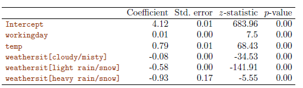

<b>TAB 5.11.</b><i>[Résultats d'un modèle de régression de Poisson ajusté pour prédire les cyclistes dans les données de Bikeshare. Les prédicteurs mnth et $\mathrm{hr}$ sont omis de ce tableau par manque d'espace, et sont visibles à la Figure 4.15. Pour la variable qualitative weathersit, la ligne de base correspond à un ciel clair.](https://www.statlearning.com/)</i>

ou de manière équivalente

$$
\lambda\left(X_1, \ldots, X_p\right)=e^{\beta_0+\beta_1 X_1+\cdots+\beta_p X_p} . \hspace{6 em} (5.37)
$$

Ici, $\beta_0, \beta_1, \ldots, \beta_p$ sont les paramètres à estimer. Ensemble, (5.35) et (5.36) définissent le modèle de régression de Poisson. Remarquez que dans (4. 36), nous prenons le $\log$ de $\lambda\left(X_1, \ldots, X_p\right)$ pour être linéaire en $X_1, \ldots, X_p$, plutôt que d'avoir $\lambda\left(X_1, \ldots, X_p\right)$ soit lui-même linéaire dans $X_1, \ldots, X_p$, afin de garantir que $\lambda\left(X_1, \ldots, X_p\right)$ prenne des valeurs non négatives pour toutes les valeurs des covariables. Pour estimer les coefficients $\beta_0, \beta_1, \ldots, \beta_p$, nous utilisons la même approche de maximum de vraisemblance que nous avons adoptée pour la régression logistique dans la section 5.3.2. Plus précisément, étant donné $n$ observations indépendantes issues du modèle de régression de Poisson, la vraisemblance prend la forme suivante

$$
\ell\left(\beta_0, \beta_1, \ldots, \beta_p\right)=\prod_{i=1}^n \frac{e^{-\lambda\left(x_i\right)} \lambda\left(x_i\right)^{y_i}}{y_{i} !}, \hspace{6 em} (5.38)
$$

où $\lambda\left(x_i\right)=e^{\beta_0+\beta_1 x_{i 1}+\cdots+\beta_p x_{i p}}$, en raison de (5.37). Nous estimons les coefficients qui maximisent la vraisemblance $\ell\left(\beta_0, \beta_1, \ldots, \beta_p\right)$, c'est-à-dire qui rendent les données observées aussi probables que possible.

Nous ajustons maintenant un modèle de régression de Poisson à l'ensemble de données Bikeshare. Les résultats sont présentés au $tableau\ 5.11$ et à la $figure\ 5.15$. Qualitativement, les résultats sont similaires à ceux de la régression linéaire de la section 5.6.1. Nous constatons à nouveau que l'utilisation du vélo est la plus élevée au printemps et à l'automne et aux heures de pointe, et la plus faible en hiver et aux premières heures du matin. De plus, l'utilisation du vélo augmente lorsque la température augmente, et diminue lorsque le temps se dégrade. Il est intéressant de noter que le coefficient associé au jour ouvrable est statistiquement significatif dans le modèle de régression de Poisson, mais pas dans le modèle de régression linéaire.

Voici quelques distinctions importantes entre le modèle de régression de Poisson et le modèle de régression linéaire :

- *Interprétation* : Pour interpréter les coefficients du modèle de régression de Poisson, nous devons prêter une attention particulière à (5.37), qui stipule qu'une augmentation de $X_j$ d'une unité est associée à une variation de $\mathrm{E}(Y)=\lambda$ d'un facteur de $\exp \left(\beta_j\right)$. Par exemple, un changement de temps de clair

  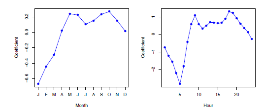

  <b>FIG 5.15</b>.<i>[Un modèle de régression de Poisson a été ajusté pour prédire les cyclistes dans l'ensemble de données Bikeshare. À gauche : les coefficients associés au mois de l'année. L'utilisation du vélo est la plus élevée au printemps et à l'automne, et la plus faible en hiver. A droite : Les coefficients associés à l'heure de la journée. L'utilisation du vélo est la plus élevée pendant les heures de pointe et la plus faible pendant la nuit.](https://www.statlearning.com/)</i>

  Si le temps se dégrade davantage et qu'il commence à pleuvoir, l'utilisation moyenne du vélo changera d'un facteur de $\exp (-0,08)=0,923$, c'est-à-dire qu'en moyenne, seulement $92,3 \%$ de personnes utiliseront le vélo lorsque le temps est nuageux par rapport au temps clair. Si le temps se dégrade encore et qu'il commence à pleuvoir, l'utilisation moyenne du vélo changera encore d'un facteur de $\exp (-0,5)=0,607$, c'est-à-dire qu'en moyenne, seulement $60,7 \%$ de personnes utiliseront le vélo lorsqu'il pleut par rapport au temps nuageux.

- Relation moyenne-variance : Comme mentionné précédemment, dans le cadre du modèle de Poisson, $\lambda=\mathrm{E}(Y)={Var}(Y)$. Ainsi, en modélisant l'utilisation des vélos avec une régression de Poisson, nous supposons implicitement que l'utilisation moyenne des vélos à une heure donnée est égale à la variance de l'utilisation des vélos pendant cette heure. En revanche, dans un modèle de régression linéaire, la variance de l'utilisation des vélos prend toujours une valeur constante. Rappelez-vous de la $Figure\ 5.14$ que dans les données de Bikeshare, lorsque les conditions de cyclisme sont favorables, la moyenne et la variance de l'usage du vélo sont beaucoup plus élevées que lorsque les conditions sont défavorables. Ainsi, le modèle de régression de Poisson est capable de gérer la relation moyenne-variance observée dans les données de Bikeshare d'une manière que le modèle de régression linéaire ne peut pas (En fait, la variance des données de Bikeshare semble être beaucoup plus élevée que la moyenne, une situation appelée surdispersion. C'est pourquoi les valeurs Z sont gonflées dans le tableau 4.11. Une analyse plus minutieuse devrait tenir compte de cette surdispersion pour obtenir des valeurs Z plus précises, et il existe une variété de méthodes pour le faire. Mais elles dépassent le cadre de cet ouvrage).

- Valeurs ajustées non négatives : Il n'y a pas de prédictions négatives en utilisant le modèle de régression de Poisson. Cela est dû au fait que le modèle de Poisson lui-même ne permet que des valeurs non négatives ; voir (4.35). En revanche, lorsque nous avons ajusté un modèle de régression linéaire à l'ensemble de données de Bikeshare, près de 10 % des prédictions étaient négatives.

<a name="5-6-3"/>

### [5.6.3 Modèles linéaires généralisés dans une plus grande généralité](#5-6-3) ###

[Retour TOC](#toc)

Nous avons maintenant discuté de trois types de modèles de régression : linéaire, logistique et de Poisson. Ces approches partagent certaines caractéristiques communes :

1. Chaque approche utilise des prédicteurs $X_1, \ldots, X_p$ pour prédire une réponse $Y$. Nous supposons que, conditionnellement à $X_1, \ldots, X_p, Y$ appartient à une certaine famille de distributions. Pour la régression linéaire, nous supposons généralement que $Y$ suit une distribution gaussienne ou normale. Pour la régression logistique, nous supposons que $Y$ suit une distribution de Bernoulli. Enfin, pour la régression de Poisson, nous supposons que $Y$ suit une distribution de Poisson.

2. Chaque approche modélise la moyenne de $Y$ en fonction des prédicteurs. Dans la régression linéaire, la moyenne de $Y$ prend la forme suivante

   

$$
\mathrm{E}\left(Y \mid X_1, \ldots, X_p\right)=\beta_0+\beta_1 X_1+\cdots+\beta_p X_p, \hspace{6 em} (5.39)
$$

- c'est-à-dire qu'elle est une fonction linéaire des prédicteurs. Pour la régression logistique, la moyenne prend plutôt la forme suivante

$$
\begin{aligned}
\mathrm{E}\left(Y \mid X_1, \ldots, X_p\right) & ={Pr}\left(Y=1 \mid X_1, \ldots, X_p\right) \\
& =\frac{e^{\beta_0+\beta_1 X_1+\cdots+\beta_p X_p}}{1+e^{\beta_0+\beta_1 X_1+\cdots+\beta_p X_p}},
\end{aligned} \hspace{6 em} (5.40)
$$

- tandis que pour la régression de Poisson, elle prend la forme de

$$
\mathrm{E}\left(Y \mid X_1, \ldots, X_p\right)=\lambda\left(X_1, \ldots, X_p\right)=e^{\beta_0+\beta_1 X_1+\cdots+\beta_p X_p} .\hspace{6 em} (5.41)
$$

Les équations (5.39)-(5.41) peuvent être exprimées à l'aide d'une fonction de liaison, $\eta$, qui applique une transformation à $\mathrm{E}\left(Y \mid X_1, \ldots, X_p\right)$ de sorte que la moyenne transformée soit une fonction linéaire des prédicteurs. C'est-à-dire ,

$$
\eta\left(\mathrm{E}\left(Y \mid X_1, \ldots, X_p\right)\right)=\beta_0+\beta_1 X_1+\cdots+\beta_p X_p .\hspace{6 em} (5.42)
$$

Les fonctions de liaison pour la régression linéaire, logistique et de Poisson sont respectivement $\eta(\mu)=\mu$, $\eta(\mu)=\log (\mu /(1-\mu))$, et $\eta(\mu)=\log (\mu)$.

Les distributions gaussienne, de Bernoulli et de Poisson sont toutes membres d'une classe plus large de distributions, connue sous le nom de famille exponentielle. D'autres membres bien connus de cette famille sont la distribution exponentielle, la distribution Gamma et la distribution binomiale négative. En général, nous pouvons effectuer une régression en modélisant la réponse $Y$ comme provenant d'un membre particulier de la famille exponentielle, puis en transformant la moyenne de la réponse de sorte que la moyenne transformée soit une fonction linéaire des prédicteurs via (5.42). Toute approche de régression qui suit cette recette très générale est connue sous le nom de modèle linéaire généralisé (GLM). Ainsi, la régression linéaire, la régression logistique et la régression de Poisson sont trois exemples de GLM. D'autres exemples non traités ici incluent la régression gamma et la régression binomiale négative.
