# [10. Deep Learning](section#10) #

[Retour README](../README.md)

<a name="toc"/>

[toc]

Cette section aborde le sujet important de l'apprentissage profond. Au moment de la rédaction de ce document (2020), l'apprentissage profond est un domaine de recherche très actif dans les communautés de l'apprentissage automatique et de l'intelligence artificielle. La pierre angulaire de l'apprentissage profond est le réseau neuronal.

Les réseaux neuronaux sont devenus célèbres à la fin des années 1980. Cette approche a suscité beaucoup d'enthousiasme et un certain battage médiatique, et elle a été à l'origine des populaires réunions sur les systèmes de traitement de l'information neuronale (NeurIPS, anciennement NIPS) qui se tiennent chaque année, généralement dans des lieux exotiques comme des stations de ski. S'en est suivie une phase de synthèse, au cours de laquelle les propriétés des réseaux neuronaux ont été analysées par des spécialistes de l'apprentissage automatique, des mathématiciens et des statisticiens ; les algorithmes ont été améliorés et la méthodologie s'est stabilisée. 

Puis sont apparus les SVM, le boosting et les forêts aléatoires, et les réseaux neuronaux ont quelque peu perdu de leur popularité. Cela s'explique en partie par le fait que les réseaux neuronaux nécessitaient beaucoup de bricolage, alors que les nouvelles méthodes étaient plus automatiques. En outre, sur de nombreux problèmes, les nouvelles méthodes ont donné de meilleurs résultats que les réseaux neuronaux mal entraînés. Ce fut le statu quo pendant la première décennie du nouveau millénaire.

Pendant ce temps, un groupe de passionnés des réseaux neuronaux a poussé leur technologie à se développer sur des architectures informatiques et des ensembles de données toujours plus grands. Les réseaux neuronaux ont refait surface après 2010 sous le nouveau nom d'apprentissage profond, avec de nouvelles architectures, des fonctionnalités supplémentaires et une chaîne de réussites sur certains problèmes de niche tels que la classification d'images et de vidéos, la modélisation de la parole et du texte. Nombreux sont ceux qui pensent que la raison principale de ces succès est la disponibilité d'ensembles de données d'entraînement toujours plus grands, rendue possible par l'utilisation à grande échelle de la numérisation dans la science et l'industrie.

Dans cette section, nous abordons les bases des réseaux de neurones et de l'apprentissage profond, puis nous examinons certaines spécialisations pour des problèmes spécifiques, comme les réseaux de neurones convolutifs $(CNN)$ pour la classification d'images et les réseaux de neurones récurrents $(RNN)$ pour les séries temporelles et autres séquences. Nous ferons également la démonstration de ces modèles à l'aide du logiciel d'apprentissage profond tensorflow développé par Google. ${ }^1$

------

${ }^1$ Pour plus d'informations sur Keras, voir Chollet et al. (2015) "Keras", disponible à l'adresse https://keras.io . Pour plus d'informations sur tensorflow, voir Absdi et al. (2015) "TensorFlow : Large-scale machine learning on heterogeneous distributed systems", disponible à l'adresse https://www.tensorflow.org/.

------

Le contenu de cette section est légèrement plus difficile que celui des autres chapitres de ce livre.

<a name="10-1"/>

## [10.1 Réseaux neuronaux à couche unique](#10-1) ##

[Retour TOC](#toc)

Un réseau neuronal prend un vecteur d'entrée de $p$ variables $X=(X_1, X_2, \ldots, X_p)$ et construit une fonction non linéaire $f(X)$ pour prédire la réponse $Y$. Nous avons construit des modèles de prédiction non linéaires dans les sections précédents, en utilisant des arbres, le boosting et les modèles additifs généralisés. 

Ce qui distingue les réseaux neuronaux de ces méthodes, c'est la structure particulière du modèle. La $figure\ 10.1$ illustre un réseau neuronal simple à action directe pour la modélisation d'une réponse quantitative utilisant $p=4$ prédicteurs. Dans la terminologie des réseaux neuronaux, les quatre caractéristiques $X_1, ..., X_4$ constituent les unités de la couche d'entrée. Les flèches indiquent que chacune des entrées de la couche d'entrée alimente chacune $K\ unités\ cachées$ (nous pouvons choisir $K$ ; ici, nous en avons choisi 5). Le modèle de réseau neuronal a la forme suivante

$$
\begin{aligned}
f(X) & =\beta_0+\sideset{}{^K_{k=1}}\sum \beta_k h_k(X) \\
& =\beta_0+\sideset{}{^K_{k=1}}\sum \beta_k g(w_{k 0}+\sideset{}{^p_{j=1}}\sum w_{k j} X_j) .
\end{aligned} \hspace{6 em} (10.1)
$$

Elle est construite ici en deux étapes. D'abord, les $K$ activations $A_k, k=1, \ldots, K$, dans la couche cachée sont calculées comme fonctions des caractéristiques d'entrée $X_1, \ldots, X_p$,

$$
A_k=h_k(X)=g(w_{k 0}+\sideset{}{^p_{j=1}}\sum w_{k j} X_j), \hspace{6 em} (10.2)
$$

où $g(z)$ est une fonction d'activation non linéaire spécifiée à l'avance. On peut considérer chaque $A_k$ comme une transformation différente $h_k(X)$ des caractéristiques originales, un peu comme les fonctions de base de la section 8 . Ces $K$ activations de la couche cachée alimentent ensuite la couche de sortie, ce qui se traduit par

$$
f(X)=\beta_0+\sideset{}{^K_{k=1}}\sum \beta_k A_k, \hspace{6 em} (10.3)
$$

un modèle de régression linéaire dans les activations $K=5$. Tous les paramètres $\beta_0, \ldots, \beta_K$ et $w_{10}, \ldots, w_{K_p}$ doivent être estimés à partir de données. 

Au début des instances des réseaux neuronaux, la fonction d'activation sigmoïde a été privilégiée,

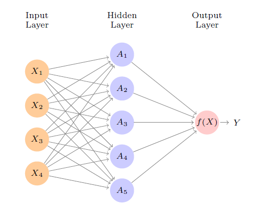

<b>FIG 10.1.</b><i> Réseau neuronal avec une seule couche cachée. La couche cachée calcule des activations $A_k = h_k(X)$ qui sont des transformations non linéaires de combinaisons linéaires des entrées $X_1, X_2, \ldots, X_p$. Ces $A_k$ ne sont donc pas directement observés. Les fonctions $h_k(\cdot)$ ne sont pas fixées à l'avance, mais sont apprises pendant l'apprentissage du réseau. La couche de sortie est un modèle linéaire qui utilise ces activations $A_k$ comme entrées, ce qui donne une fonction $f(X)$.</i>

$$
g(z)=\frac{e^z}{1+e^z}=\frac{1}{1+e^{-z}}, \hspace{6 em} (10.4)
$$

qui est la même fonction que celle utilisée dans la régression logistique pour convertir une fonction linéaire en probabilités comprises entre zéro et un (voir $figure\ 10.2$ ). Le choix préféré dans les réseaux neuronaux modernes est la fonction d'activation $ReLU$ (rectified linear unit), qui prend la forme suivante

$$
g(z)=(z)_{+}= \begin{cases}0 & \text { if } z<0 \\ z & \text { otherwise }\end{cases} \hspace{6 em} (10.5)
$$

Une activation $ReLU$ peut être calculée et stockée plus efficacement qu'une activation sigmoïde. Bien qu'elle ait un seuil à zéro, comme nous l'appliquons à une fonction linéaire (10.2), le terme constant $w_{k 0}$ déplacera ce point d'inflexion. En d'autres termes, le modèle représenté sur la $figure\ 10.1$ dérive cinq nouvelles caractéristiques en calculant cinq combinaisons linéaires différentes de $X$, puis les écrase à travers une fonction d'activation $g(\cdot)$ pour les transformer. Le modèle final est linéaire dans ces variables dérivées.

Le nom de réseau neuronal provient à l'origine du fait que l'on considère ces unités cachées comme analogues aux neurones du cerveau - les valeurs des activations $A_k = h_k(X)$ proches de un provoquent des déclencheurs, tandis que celles proches de zéro sont silencieuses (en utilisant la fonction d'activation sigmoïde).

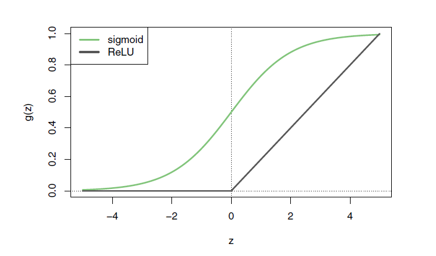

<b>FIG 10.2.</b><i> Fonctions d'activation. La fonction ReLU linéaire par morceaux est populaire pour son efficacité et sa facilité de calcul. Nous l'avons réduite d'un facteur cinq pour faciliter la comparaison.</i>

La non-linéarité de la fonction d'activation $g(\cdot)$ est essentielle, car sans elle le modèle $f(X)$ dans (10.1) s'effondrerait en un simple modèle linéaire dans $X_1, \ldots, X_p$. De plus, le fait d'avoir une fonction d'activation non linéaire permet au modèle de capturer des non-linéarités complexes et des effets d'interaction. Considérons un exemple très simple avec $p=2$ variables d'entrée $X=\left(X_1, X_2\right)$, et $K=2$ unités cachées $h_1(X)$ et $h_2(X)$ avec $g(z)=z^2$. Nous spécifions les autres paramètres comme

$$
\begin{aligned}
 \beta_0 &= 0,  \beta_1 &&= \frac{1}{4},   \beta_2 &&= -\frac{1}{4}, \\
 w_{10} &= 0,   w_{11} &&= 1,   w_{12} &&= 1 \text {, } \\
 w_{20} &= 0,   w_{21} &&= 1,   w_{22} &&= -1 . \\
&
\end{aligned} \hspace{6 em} (10.6)
$$

D'après (10.2), cela signifie que

$$
\begin{aligned}
& h_1(X) = (0+X_1+X_2)^2 \\
& h_2(X) = (0+X_1-X_2)^2
\end{aligned} \hspace{6 em} (10.7)
$$

Puis, en appliquant (10.7) à (10.1), on obtient

$$
\begin{aligned}
f(X) & =0+\frac{1}{4} \cdot(0+X_1+X_2)^2-\frac{1}{4} \cdot(0+X_1-X_2)^2 \\
& =\frac{1}{4}\biggl[(X_1+X_2)^2-(X_1-X_2)^2\biggl] \\
& =X_1 X_2 .
\end{aligned} \hspace{6 em} (10.8)
$$

Ainsi, la somme de deux transformations non linéaires de fonctions linéaires peut nous donner une interaction ! En pratique, nous n'utiliserions pas une fonction quadratique pour $g(z)$, car nous obtiendrions toujours un polynôme du second degré dans les coordonnées d'origine $X_1, \ldots, X_p$. Les activations sigmoïde ou $ReLU$ ne présentent pas une telle limitation.

L'ajustement d'un réseau neuronal nécessite d'estimer les paramètres inconnus de (10.1). Pour une réponse quantitative, on utilise généralement la perte par erreur carrée, de sorte que les paramètres sont choisis pour minimiser

$$
\sideset{}{^n_{i=1}}\sum (y_i-f(x_i))^2 . \hspace{6 em} (10.9)
$$

<b>FIG 10.3.</b><i> Exemples de chiffres manuscrits issus du corpus MNIST. Chaque image en niveaux de gris comporte 28 fois 28 pixels, chacun d'entre eux étant un nombre de huit bits (0-255) qui représente le degré d'obscurité du pixel. Les 3, 5 et 8 premières images sont agrandies pour montrer leurs 784 valeurs individuelles.</i>

La Section 10.7 fournit des détails sur la manière d'effectuer cette minimisation.

<a name="10-2"/>

## [10.2 Réseaux neuronaux multicouches](#10-2) ##

[Retour TOC](#toc)

Les réseaux neuronaux modernes comportent généralement plus d'une couche cachée, et souvent plusieurs unités par couche. En théorie, une seule couche cachée comportant un grand nombre d'unités permet d'approximer la plupart des fonctions. Cependant, la tâche d'apprentissage consistant à découvrir une bonne solution est rendue beaucoup plus facile avec plusieurs couches, chacune de taille modeste.

Nous allons illustrer un grand réseau dense sur le célèbre jeu de données de chiffres manuscrits $MNIST$, accessible au public. ${ }^2$ 

------

${ }^2$ Voir LeCun, Cortes et Burges (2010) "The MNIST databse of handwritten digits", disponible sur http://yann.lecun.com/exdb/nnist.

------

La $figure\ 10.3$ montre des exemples de ces chiffres. L'idée est de construire un modèle pour classer les images dans leur classe de chiffres correcte $0-9$. Chaque image a $p=28 \times 28=784$ pixels, chacun d'entre eux étant une valeur de niveau de gris de huit bits entre 0 et 255 représentant la quantité relative du chiffre écrit dans ce petit carré. ${ }^3$ 

------

${ }^3$ Dans le processus de conversion analogique-numérique, seule une partie du chiffre écrit peut tomber dans le carré représentant un pixel particulier.

------

Ces pixels sont stockés dans le vecteur d'entrée $X$ (dans l'ordre des colonnes, par exemple). La sortie est l'étiquette de classe, représentée par un vecteur $Y=(Y_0, Y_1, \ldots, Y_9)$ de 10 variables fictives, avec un un dans la position correspondant à l'étiquette, et des zéros ailleurs. Dans la communauté de l'apprentissage automatique, cette méthode est connue sous le nom de codage à un coup. Il y a 60 000 images d'entraînement et 10 000 images de test.

D'un point de vue historique, les problèmes de reconnaissance des chiffres ont été le catalyseur qui a accéléré le développement de la technologie des réseaux neuronaux à la fin des années 1980 dans les laboratoires AT&T Bell et ailleurs. Les tâches de reconnaissance des formes de ce type sont relativement simples pour les humains.

Notre système visuel occupe une grande partie de notre cerveau, et une bonne reconnaissance est une force évolutive pour la survie. Ces tâches ne sont pas aussi simples pour les machines, et il a fallu plus de 30 ans pour affiner les architectures de réseaux neuronaux afin qu'elles correspondent aux performances humaines.

La $figure\ 10.4$ montre une architecture de réseau multicouche qui fonctionne bien pour résoudre la tâche de classification des chiffres. Elle diffère de la $figure\ 10.1$ à plusieurs égards :

- Il possède deux couches cachées $L_1$ (256 unités) et $L_2$ (128 unités) au lieu d'une seule. Plus tard, nous verrons un réseau avec sept couches cachées.

- Il a dix variables de sortie, au lieu d'une. Dans ce cas, les dix variables représentent réellement une seule variable qualitative et sont donc très dépendantes. (Nous les avons indexées par la classe de chiffres $0-9$ plutôt que 1-10, pour plus de clarté). Plus généralement, dans l'apprentissage multitâche, on peut prédire différentes réponses simultanément avec un seul réseau ; elles ont toutes leur mot à dire dans la formation des couches cachées.

- La fonction de perte utilisée pour l'apprentissage du réseau est adaptée à la tâche de classification multiclasse.

La première couche cachée est comme dans (10.2), avec

$$
\begin{aligned}
A_k^{(1)} & =h_k^{(1)}(X) \\
& =g\left(w_{k 0}^{(1)}+\sum_{j=1}^p w_{k j}^{(1)} X_j\right)
\end{aligned} \hspace{6 em} (10.10)
$$

pour $k=1, \ldots, K_1$. La deuxième couche cachée traite les activations $A_k^{(1)}$ de la première couche cachée comme des entrées et calcule de nouvelles activations

$$
\begin{aligned}
A_{\ell}^{(2)} & =h_{\ell}^{(2)}(X) \\
& =g\left(w_{\ell 0}^{(2)}+\sum_{k=1}^{K_1} w_{\ell k}^{(2)} A_k^{(1)}\right)
\end{aligned} \hspace{6 em} (10.11)
$$

pour $\ell=1, \ldots, K_2$. Remarquez que chacune des activations de la deuxième couche $A_{\ell}^{(2)}=h_{\ell}^{(2)}(X)$ est une fonction du vecteur d'entrée $X$. C'est le cas parce que, bien qu'elles soient explicitement une fonction des activations $A_k^{(1)}$ de la couche $L_1$, celles-ci sont à leur tour des fonctions de $X$. Ce serait également le cas avec davantage de couches cachées. Ainsi, par le biais d'une chaîne de transformations, le réseau est capable de construire des transformations assez complexes de $X$ qui alimentent finalement la couche de sortie en tant que caractéristiques.

Nous avons introduit des notations supplémentaires en exposant telles que $h_{\ell}^{(2)}(X)$ et $w_{\ell j}^{(2)}$ dans (10.10) et (10.11) pour indiquer à quelle couche les activations et les poids (coefficients) appartiennent, dans ce cas la couche 2. La notation $\mathbf{W}_1$ de la $figure\ 10.4$ représente la matrice entière des poids qui alimentent la couche d'entrée vers la première couche cachée $L_1$. 

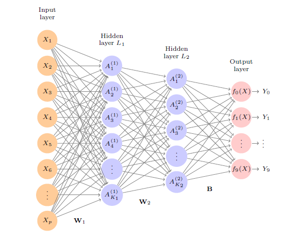

<b>FIG 10.4.</b><i> Diagramme de réseau neuronal avec deux couches cachées et plusieurs sorties, adapté au problème des chiffres manuscrits MNIST. La couche d'entrée comporte p=784 unités, les deux couches cachées $K_1 = 256$ et $K_2 = 128$ unités respectivement, et la couche de sortie 10 unités. En plus des intercepts (appelés biais dans la communauté de l'apprentissage profond), ce réseau possède 235 146 paramètres (appelés poids).</i>

Cette matrice aura $785 \times 256 = 200\ 960\ éléments$ ; il y en a 785 au lieu de 784 car nous devons tenir compte du terme d'interception ou de biais. ${ }^4$

------

${ }^4$ L'utilisation de "poids" pour les coefficients et de "biais" pour les intercepts $w_{k 0}$ dans $(10.2)$ est populaire dans la communauté de l'apprentissage automatique ; cette utilisation du biais ne doit pas être confondue avec l'utilisation de "biais-variance" ailleurs dans ce livre.

------

Chaque élément $A_k^{(1)}$ alimente la deuxième couche cachée $L_2$ via la matrice des poids $\mathbf{W}_2$ de dimension $257 \times 128 = 32\ 896$.

Nous arrivons maintenant à la couche de sortie, où nous avons maintenant dix réponses au lieu d'une. La première étape consiste à calculer dix modèles linéaires différents similaires à notre modèle unique (10.1),

$$
\begin{aligned}
Z_m & =\beta_{m 0}+\sideset{}{^{K_2}_{\ell=1}}\sum \beta_{m \ell} h_{\ell}^{(2)}(X) \\
& =\beta_{m 0}+\sum_{\ell=1}^{K_2} \beta_{m \ell} A_{\ell}^{(2)}
\end{aligned} \hspace{6 em} (10.12)
$$

pour $m=0,1, \ldots, 9$. La matrice $\mathbf{B}$ stocke l'ensemble $129 \times 10=1\ 290$ de ces poids.

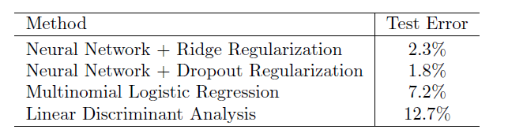

<b>TAB 10.1.</b><i> Taux d'erreur de test sur les données MNIST, pour les réseaux neuronaux avec deux formes de régularisation, ainsi que pour la régression logistique multinomiale et l'analyse discriminante linéaire. Dans cet exemple, la complexité supplémentaire du réseau neuronal entraîne une nette amélioration de l'erreur de test.</i>

S'il s'agissait de réponses quantitatives distinctes, il suffirait de définir chaque $f_m(X)=Z_m$ et le tour serait joué. Cependant, nous aimerions que nos estimations représentent les probabilités de classe $f_m(X)={Pr}(Y=m \mid X)$, juste comme dans la régression logistique multinomiale de la $section\ 5.3.5$. Nous utilisons donc la fonction d'activation spéciale softmax (voir (5.13)),

$$
f_m(X)={Pr}(Y=m \mid X)=\frac{e^{Z_m}}{\sideset{}{^9_{\ell=0}}\sum e^{Z_{\ell}}}, \hspace{6 em} (10.13)
$$

pour $m=0,1, \ldots, 9$. Cela garantit que les 10 nombres se comportent comme des probabilités (non négatives et dont la somme est égale à un). Même si l'objectif est de construire un classificateur, notre modèle estime en fait une probabilité pour chacune des 10 classes. Le classificateur attribue ensuite l'image à la classe ayant la probabilité la plus élevée.

Pour entraîner ce réseau, puisque la réponse est qualitative, nous recherchons des estimations de coefficient qui minimisent la log-vraisemblance multinomiale négative.

$$
-\sideset{}{^n_{i=1}}\sum \sideset{}{^9_{m=0}}\sum y_{i m} \log (f_m(x_i)), \hspace{6 em} (10.14)
$$

également connu sous le nom d'entropie croisée. Il s'agit d'une généralisation du critère (5.5) pour la régression logistique à deux classes. Les détails sur la façon de minimiser cet objectif sont donnés dans la section 10.7. Si la réponse était quantitative, nous minimiserions plutôt la perte par erreur quadratique comme dans (10.9).

Le $tableau\ 10.1$ compare les performances de test du réseau neuronal à deux modèles simples présentés au chapitre 4, qui font appel à des frontières de décision linéaires : la régression logistique multinomiale et l'analyse discriminante linéaire. L'amélioration des réseaux neuronaux par rapport à ces deux méthodes linéaires est spectaculaire : le réseau avec régularisation des pertes atteint un taux d'erreur de test inférieur à 2 sur les 10 000 images de test. (Nous décrivons la régularisation des pertes dans la section 10.7.3.) Dans la section 10.9.2 du laboratoire, nous présentons le code d'ajustement de ce modèle, qui s'exécute en juste plus de deux minutes sur un ordinateur portable.

En ajoutant le nombre de coefficients dans $\mathbf{W}_1, \mathbf{W}_2$ et $\mathbf{B}$, nous obtenons 235 146 en tout, soit plus de 33 fois le nombre $785 \times 9 = 7\ 065$ nécessaire pour la régression logistique multinomiale. Rappelons que l'ensemble d'apprentissage compte 60 000 images.

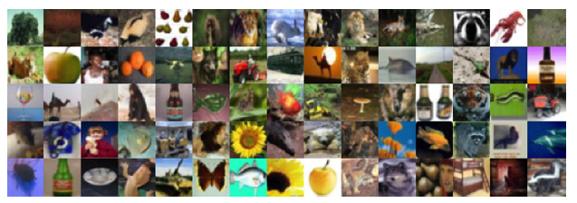

<b>FIG 10.5.</b><i> Un échantillon d'images de la base de données CIFAR100 : une collection d'images naturelles de la vie quotidienne, avec 100 classes différentes représentées.</i>

Bien que cela puisse sembler un grand ensemble d'apprentissage, il y a presque quatre fois plus de coefficients dans le modèle de réseau neuronal que d'observations dans l'ensemble d'apprentissage ! Pour éviter un ajustement excessif, une certaine régularisation est nécessaire. Dans cet exemple, nous avons utilisé deux formes de régularisation : la régularisation ridge, similaire à la régression ridge de la section 7, et la régularisation $dropout$. Ces deux formes de régularisation sont abordées à la Section 10.7.

<a name="10-3"/>

## [10.3 Réseaux neuronaux convolutifs](#10-3) ##

[Retour TOC](#toc)

Les réseaux neuronaux ont rebondi autour de 2010 avec de grands succès dans la classification d'images. À cette époque, des bases de données massives d'images étiquetées ont été accumulées, avec un nombre de classes toujours plus élevé. La $figure\ 10.5$ montre 75 images tirées de la base de données CIFAR100. ${ }^5$ 

------

${ }^5$ Voir le chapitre 3 de Krizhevsky (2009) "Learning multiple layers of features from tiny images", disponible sur https://kwu.cs.toronto.edu/-kriz/learning-features-2009-TR.pdf.

------

Cette base de données est constituée de 60 000 images étiquetées selon 20 superclasses (p. ex. mammifères aquatiques), avec cinq classes par superclasse (castor, dauphin, loutre, phoque, baleine). Chaque image a une résolution de $32 \times 32$ pixels, avec trois nombres de huit bits par pixel représentant le rouge, le vert et le bleu. Les chiffres de chaque image sont organisés dans un tableau tridimensionnel appelé carte de caractéristiques. Les deux premiers axes sont spatiaux (tous deux en 32 dimensions), et le troisième est l'axe du canal, $^6$ représentant les trois couleurs. 

------

${ }^6$ Le terme canal est tiré de la littérature sur le traitement du signal. Chaque canal est une source d'information distincte.

------

Il existe un ensemble d'entraînement de 50 000 images et un ensemble de test de 10 000 images.

Une famille spéciale de réseaux neuronaux convolutifs (CNN) a été développée pour classer des images telles que celles-ci, et a montré un succès spectaculaire sur un large éventail de problèmes. Les réseaux neuronaux convolutifs imitent dans une certaine mesure la façon dont les humains classent les images, en reconnaissant des caractéristiques ou des motifs spécifiques n'importe où dans l'image qui distinguent chaque classe d'objet particulière. Dans cette section, nous donnons un bref aperçu de leur fonctionnement.

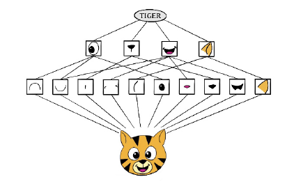

<b>FIG 10.6.</b><i> Schéma montrant comment un réseau neuronal convolutif classifie l'image d'un tigre. Le réseau prend l'image et identifie les caractéristiques locales. Il combine ensuite les caractéristiques locales afin de créer des caractéristiques composées, qui dans cet exemple incluent les yeux et les oreilles. Ces caractéristiques composées sont utilisées pour produire l'étiquette "tigre".</i>

La figure $10.6$ illustre l'idée d'un réseau de neurones convolutifs sur une image de dessin animé d'un tigre. ${ }^7$

------

${ }^7$ Merci à Elena Tuzhilina pour la réalisation du schéma et à https://www.cartooning4kids.com/ pour l'autorisation d'utiliser le dessin animé du tigre.

------

Le réseau identifie d'abord les caractéristiques de bas niveau de l'image d'entrée, telles que les petits bords, les taches de couleur, etc. Ces caractéristiques de bas niveau sont ensuite combinées pour former des caractéristiques de plus haut niveau, telles que des parties d'oreilles, d'yeux, etc. Finalement, la présence ou l'absence de ces caractéristiques de niveau supérieur contribue à la probabilité d'une classe de sortie donnée.

Comment un réseau neuronal convolutif construit-il cette hiérarchie ? Il combine deux types spécialisés de couches cachées, appelées couches de convolution et couches de mise en commun. Les couches de convolution recherchent des instances de petits motifs dans l'image, tandis que les couches de mise en commun les sous-échantillonnent pour sélectionner un sous-ensemble important. Afin d'obtenir des résultats de pointe, les architectures de réseaux neuronaux contemporaines font appel à de nombreuses couches de convolution et de mise en commun. Nous décrivons ci-après les couches de convolution et de mise en commun.

<a name="10-3-1"/>

### [10.3.1 Couches de convolution](#10-3-1) ###

[Retour TOC](#toc)

Une couche de convolution se compose d'un grand nombre de filtres de convolution, chacun d'entre eux étant un modèle qui détermine si une caractéristique locale particulière est présente dans une image. Un filtre de convolution repose sur une opération très simple, appelée convolution, qui revient essentiellement à multiplier de manière répétée des éléments de matrice, puis à additionner les résultats.

Pour comprendre le fonctionnement d'un filtre de convolution, prenons l'exemple très simple d'une image de $4 \times 3$ :

$$
\text { Original Image }=\left[\begin{array}{lll}
a & b & c \\
d & e & f \\
g & h & i \\
j & k & l
\end{array}\right] .
$$

Considérons maintenant un filtre de $2 \times 2$ de la forme

$$
\text { Convolution Filter }=\left[\begin{array}{cc}
\alpha & \beta \\
\gamma & \delta
\end{array}\right] \text {. }
$$

En convoluant l'image avec le filtre, on obtient le résultat ${ }^8$.

$$
\text { Convolved Image }=\left[\begin{array}{ll}
a \alpha+b \beta+d \gamma+e \delta & b \alpha+c \beta+e \gamma+f \delta \\
d \alpha+e \beta+g \gamma+h \delta & e \alpha+f \beta+h \gamma+i \delta \\
g \alpha+h \beta+j \gamma+k \delta & h \alpha+i \beta+k \gamma+l \delta
\end{array}\right] .
$$

------

${ }^8$ L'image convoluée est plus petite que l'image originale car sa dimension est donnée par le nombre de sous-matrices $2 \times 2$ dans l'image originale. Notez que $2 \times 2$ est la dimension du filtre de convolution. Si l'on veut que l'image convoluée ait la même dimension que l'image originale, on peut appliquer un remplissage.

------

Par exemple, l'élément supérieur gauche provient de la multiplication de chaque élément du filtre $2 \times 2$ par l'élément correspondant dans la partie supérieure gauche $2 \times 2$ de l'image, et de l'addition des résultats. Les autres éléments sont obtenus de manière similaire : le filtre de convolution est appliqué à chaque sous-matrice de $2 \times 2$ de l'image originale afin d'obtenir l'image convoluée. 

Si une sous-matrice $2 \times 2$ de l'image originale ressemble au filtre de convolution, elle aura une grande valeur dans l'image convoluée ; sinon, elle aura une petite valeur. Ainsi, l'image convoluée met en évidence les régions de l'image originale qui ressemblent au filtre de convolution. Nous avons utilisé $2 \times 2$ comme exemple ; en général, les filtres de convolution sont de petits tableaux de $\ell_1 \times \ell_2$, avec $\ell_1$ et $\ell_2$ de petits entiers positifs qui ne sont pas nécessairement égaux.

La $figure\ 10.7$ illustre l'application de deux filtres de convolution à une image de $192 \times 179$ d'un tigre, représentée à gauche ${ }^9$. 

------

${ }^9$ L'image du tigre utilisée dans les $Figures\ 10.7-10.9$ a été obtenue à partir de la ressource d'images du domaine public https://www.needpix.com/.

------

Chaque filtre de convolution est une image de $15 \times 15$ contenant principalement des zéros (noirs), avec une étroite bande de uns (blancs) orientée verticalement ou horizontalement dans l'image. 

Lorsque chaque filtre est convolué avec l'image du tigre, les zones du tigre qui ressemblent au filtre (c'est-à-dire qui ont des bandes ou des bords horizontaux ou verticaux) reçoivent de grandes valeurs, et les zones du tigre qui ne ressemblent pas à la caractéristique reçoivent de petites valeurs. Les images convoluées sont affichées sur le côté droit. Nous constatons que le filtre à bandes horizontales détecte les bandes et les bords horizontaux de l'image originale, tandis que le filtre à bandes verticales détecte les bandes et les bords verticaux de l'image originale.

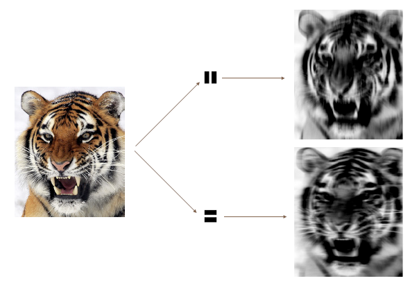

<b>FIG 10.7.</b><i> Les filtres de convolution trouvent des caractéristiques locales dans une image, telles que les bords et les petites formes. Nous commençons par l'image du tigre représentée à gauche, puis nous appliquons les deux petits filtres de convolution du milieu. Les images convoluées mettent en évidence les zones de l'image originale où des détails similaires aux filtres sont trouvés. Plus précisément, l'image convoluée du haut met en évidence les rayures verticales du tigre, tandis que l'image convoluée du bas met en évidence les rayures horizontales du tigre. Nous pouvons considérer l'image originale comme la couche d'entrée d'un réseau neuronal convolutif, et les images convolutives comme les unités de la première couche cachée.</i>

Nous avons utilisé une grande image et deux grands filtres dans la $figure\ 10.7$ à titre d'illustration. Pour la base de données $CIFAR100$, il y a $32 \times 32$ pixels couleur par image, et nous utilisons $3 \times 3$ filtres de convolution.

Dans une couche de convolution, nous utilisons toute une banque de filtres pour repérer une variété de bords et de formes orientés différemment dans l'image. L'utilisation de filtres prédéfinis de cette manière est une pratique courante dans le traitement des images. En revanche, avec les $CNN$, les filtres sont appris pour la tâche de classification spécifique. 

Nous pouvons considérer les poids des filtres comme des paramètres allant d'une couche d'entrée à une couche cachée, avec une unité cachée pour chaque pixel de l'image convoluée. C'est en fait le cas, bien que les paramètres soient hautement structurés et contraints. Ils opèrent sur des taches localisées dans l'image d'entrée (il y a donc beaucoup de zéros structurels), et les mêmes poids dans un filtre donné sont réutilisés pour toutes les taches possibles dans l'image (les poids sont donc contraints). ${ }^{10}$

------

${ }^{10}$ Dans les premières années des réseaux neuronaux, on appelait cela le partage des poids.

------

Nous donnons maintenant quelques détails supplémentaires.

- L'image d'entrée étant en couleur, elle possède trois canaux représentés par une carte de caractéristiques tridimensionnelle (tableau). Chaque canal est une carte de caractéristiques bidimensionnelle $(32 \times 32)$ - une pour le rouge, une pour le vert et une pour le bleu. Un seul filtre de convolution aura également trois canaux, un par couleur, chacun de dimension $3 \times 3$, avec des poids de filtre potentiellement différents. Les résultats des trois convolutions sont additionnés pour former une carte de caractéristiques de sortie à deux dimensions. Notez qu'à ce stade, l'information de couleur a été utilisée et n'est pas transmise aux couches suivantes, sauf par son rôle dans la convolution.
- Si nous utilisons $K$ filtres de convolution différents dans cette première couche cachée, nous obtenons $K$ cartes de caractéristiques de sortie bidimensionnelles, qui sont traitées ensemble comme une seule carte de caractéristiques tridimensionnelle. Nous considérons chacune des $K$ cartes de caractéristiques de sortie comme un canal d'information distinct, de sorte que nous avons maintenant $K$ canaux par opposition aux trois canaux de couleur de la carte de caractéristiques d'entrée originale. La carte de caractéristiques tridimensionnelle est juste comme les activations dans une couche cachée d'un réseau neuronal simple, sauf qu'elle est organisée et produite de manière structurée dans l'espace.
- Nous appliquons généralement la fonction d'activation $ReLU$ (10.5) à l'image convoluée. Cette étape est parfois considérée comme une couche distincte dans le réseau neuronal convolutif, auquel cas elle est appelée couche de détection.

<a name="10-3-2"/>

### [10.3.2 Couches de mise en commun](#10-3-2) ###

[Retour TOC](#toc)

Une couche de mise en commun permet de condenser une grande image en une image résumée plus petite. Bien qu'il existe plusieurs façons d'effectuer la mise en commun, l'opération de mise en commun maximale résume chaque bloc de pixels non chevauchant de $2 \times 2$ dans une image en utilisant la valeur maximale du bloc. Cela permet de réduire la taille de l'image par un facteur de deux dans chaque direction et d'obtenir une certaine invariance de l'emplacement : c'est-à-dire que tant qu'il y a une grande valeur dans l'un des quatre pixels du bloc, le bloc entier est enregistré comme une grande valeur dans l'image réduite.

Voici un exemple simple de max pooling :

$$
\text { Max pool }\left[\begin{array}{llll}
1 & 2 & 5 & 3 \\
3 & 0 & 1 & 2 \\
2 & 1 & 3 & 4 \\
1 & 1 & 2 & 0
\end{array}\right] \rightarrow\left[\begin{array}{ll}
3 & 5 \\
2 & 4\end{array}\right] \text {. }
$$

<a name="10-3-3"/>

### [10.3.3 Architecture d'un réseau de neurones convolutif](#10-3-3) ###

[Retour TOC](#toc)

Jusqu'à présent, nous avons défini une seule couche de convolution : chaque filtre produit une nouvelle carte de caractéristiques bidimensionnelle. Le nombre de filtres de convolution dans une couche de convolution est comparable au nombre d'unités d'une couche cachée particulière dans un réseau neuronal entièrement connecté du type de celui présenté à la $section\ 10.2$ . Ce nombre définit également le nombre de canaux dans la carte de caractéristiques tridimensionnelle résultante. Nous avons également décrit une couche de mise en commun, qui réduit les deux premières dimensions de chaque carte de caractéristiques tridimensionnelle. Les $CNN$ profonds possèdent de nombreuses couches de ce type. La $figure\ 10.8$ montre une architecture typique d'un CNN pour la tâche de classification d'images $CIFAR100$ .

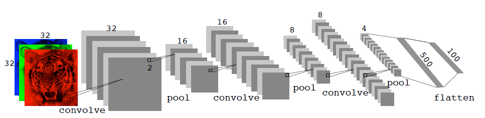

<b>FIG 10.8.</b><i> Architecture d'un CNN profond pour la tâche de classification CIFAR100. Les couches de convolution sont entrecoupées de couches max-pool $2 \times 2$, qui réduisent la taille par un facteur 2 dans les deux dimensions.</i>

Au niveau de la couche d'entrée, nous voyons la carte de caractéristiques tridimensionnelle d'une image couleur, où l'axe des canaux représente chaque couleur par une carte de caractéristiques bidimensionnelle de $32 \times 32$ de pixels. Chaque filtre de convolution produit un nouveau canal au niveau de la première couche cachée, chacun d'entre eux étant une carte de caractéristiques de $32 \times 32$ (après un certain remplissage des bords). Après cette première série de convolutions, nous avons maintenant une nouvelle "image", une carte de caractéristiques avec beaucoup plus de canaux que les trois canaux de couleur d'entrée (six dans la figure, puisque nous avons utilisé six filtres de convolution).

Cette étape est suivie d'une couche max-pool, qui réduit la taille de la carte de caractéristiques dans chaque canal par un facteur de quatre : deux dans chaque dimension.

Cette séquence convolution - pool est maintenant répétée pour les deux couches suivantes. Voici quelques détails :

- Chaque couche de convolution suivante est similaire à la première. Elle prend en entrée la carte de caractéristiques tridimensionnelle de la couche précédente et la traite comme une seule image multicanal. Chaque filtre de convolution appris possède autant de canaux que cette carte de caractéristiques.

- Comme la taille des cartes de caractéristiques des canaux est réduite après chaque couche de convolution, nous augmentons généralement le nombre de filtres dans la couche de convolution suivante pour compenser.

- Parfois, nous répétons plusieurs couches de convolution avant une couche de regroupement. Cela augmente effectivement la dimension du filtre.

Ces opérations sont répétées jusqu'à ce que le pooling ait réduit la carte des caractéristiques de chaque canal à juste quelques pixels dans chaque dimension. À ce stade, les cartes de caractéristiques tridimensionnelles sont aplaties - les pixels sont traités comme des unités distinctes - et introduites dans une ou plusieurs couches entièrement connectées avant d'atteindre la couche de sortie, qui est une activation softmax pour les 100 classes (comme dans (10.13)).

De nombreux paramètres d'ajustement doivent être sélectionnés lors de la construction d'un tel réseau, outre le nombre, la nature et la taille de chaque couche. L'apprentissage par abandon peut être utilisé à chaque couche, ainsi que la régularisation lasso ou ridge (voir section 10.7). Les détails de la construction d'un réseau neuronal convolutif peuvent sembler déconcertants. Heureusement, un logiciel formidable est disponible, avec des exemples et des vignettes détaillés qui fournissent des conseils sur les choix judicieux des paramètres.

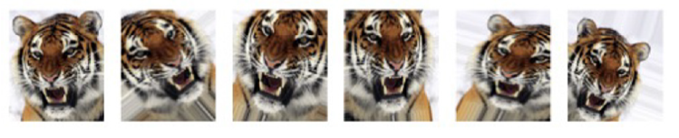

<b>FIG 10.9.</b><i> Augmentation des données. L'image originale (la plus à gauche) est déformée de manière naturelle pour produire différentes images avec la même étiquette de classe. Ces distorsions ne trompent pas les humains et agissent comme une forme de régularisation lors de l'ajustement du CNN.</i>

Pour l'ensemble de test officiel $CIFAR100$, la meilleure précision à ce jour est juste supérieure à $75$, mais il ne fait aucun doute que cette performance continuera à s'améliorer.

<a name="10-3-4"/>

### [10.3.4 Augmentation des données](#10-3-4) ###

[Retour TOC](#toc)

Une autre astuce importante utilisée avec la modélisation d'images est l'augmentation des données. Essentiellement, chaque image d'entraînement est répliquée plusieurs fois, chaque réplique étant déformée de manière aléatoire et naturelle, de sorte que la reconnaissance humaine ne soit pas affectée. 

La $figure\ 10.9$ montre quelques exemples. Les distorsions typiques sont le zoom, le décalage horizontal et vertical, le cisaillement, les petites rotations et, dans ce cas, les inversions horizontales. À première vue, il s'agit d'un moyen d'augmenter considérablement l'ensemble d'apprentissage avec des exemples quelque peu différents, et donc de se protéger contre l'adaptation excessive. En fait, nous pouvons voir cela comme une forme de régularisation : nous construisons un nuage d'images autour de chaque image originale, toutes avec la même étiquette. Ce type d'enrichissement des données est similaire à la régularisation par crête.

Nous verrons à la $section\ 10.7.2$ que les algorithmes de descente de gradient stochastique pour l'ajustement des modèles d'apprentissage profond traitent de manière répétée des lots de 128 images d'entraînement, par exemple, sélectionnées de manière aléatoire. Cela fonctionne parfaitement avec l'augmentation, car nous pouvons déformer chaque image du lot à la volée, et donc ne pas avoir à stocker toutes les nouvelles images.

<a name="10-3-5"/>

### [10.3.5 Résultats utilisant un classificateur pré-entraîné](#10-3-5) ###

[Retour TOC](#toc)

Ici, nous utilisons un classificateur pré-entraîné au niveau industriel pour prédire la classe de certaines nouvelles images. Le classificateur $resnet50$ est un réseau de neurones à convolution qui a été entraîné à l'aide de l'ensemble de données $imagenet$, qui se compose de millions d'images appartenant à un nombre croissant de catégories ${ }^{11}$. 

------

${ }^{11}$ Pour plus d'informations sur resnet50, voir He, Zhang, Ren et Sun (2015) "Deep residual learning for image recognition", https://arxiv.org/abs/1512.03385. Pour des détails sur imagenet, voir Russakovsky, Deng, et al. (2015) "ImageNet Large Scale Visual Recognition Challenge", dans International Journal of Computer Vision.

------

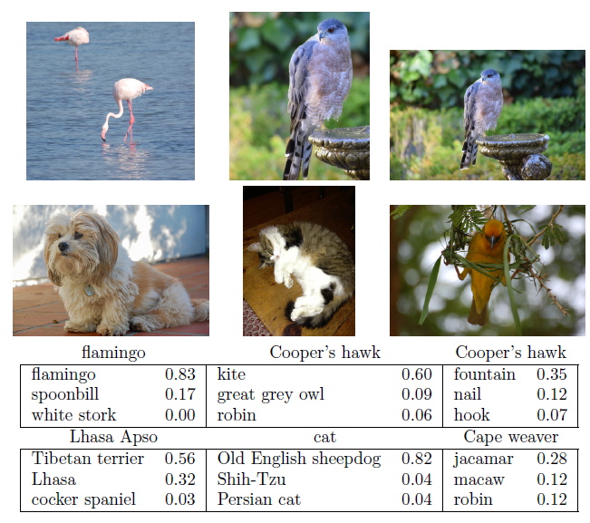

<b>FIG 10.10.</b><i> Classification de six photographies à l'aide du CNN resnet50 entraîné sur le corpus imagenet. Le tableau sous les images affiche l'étiquette réelle (intentionnelle) en haut de chaque panneau, et les trois premiers choix du classificateur (sur 100). Les chiffres sont les probabilités estimées pour chaque choix. (Un milan est un rapace, mais pas un faucon).</i>

La $figure\ 10.10$ montre les performances de $resnet50$ sur six photographies (collection privée de l'un des auteurs). ${ }^{12}$ 

------

${ }^{12}$ Ces résultats de resnet peuvent changer avec le temps, puisque le modèle entraîné publiquement est mis à jour périodiquement.

------

Le CNN fait un travail raisonnable de classification du faucon dans la deuxième image. Si nous faisons un zoom arrière comme dans la troisième image, il est confus et choisit la fontaine plutôt que le faucon. Dans la dernière image, un "jacamar" est un oiseau tropical d'Amérique du Sud et d'Amérique centrale dont la coloration est similaire à celle du tisseur du Cap d'Afrique du Sud. Nous donnons plus de détails sur cet exemple dans la $section\ 10.9.4$ .

Une grande partie du travail d'adaptation d'un $CNN$ consiste à apprendre les filtres de convolution dans les couches cachées ; ce sont les coefficients d'un $CNN$ . Pour les modèles adaptés à des corpus massifs tels qu' $imagenet$ avec de nombreuses classes, la sortie de ces filtres peut servir de caractéristiques pour des problèmes généraux de classification d'images naturelles. On peut utiliser ces couches cachées pré-entraînées pour de nouveaux problèmes avec des ensembles d'apprentissage beaucoup plus petits (un processus appelé " gel des poids "), et juste entraîner les dernières couches du réseau, ce qui nécessite beaucoup moins de données. Les vignettes et le livre ${ }^{13}$ qui accompagnent le package $keras$ donnent plus de détails sur de telles applications.

------

${ }^{13}$ Deep Learning with $R$ de F. Chollet et J.J. Allaire, 2018, Manning Publications. 

------

<a name="10-4"/>

## [10.4 Classification de documents](#10-4) ##

[Retour TOC](#toc)

Dans cette section, nous présentons un nouveau type d'exemple qui a des applications importantes dans l'industrie et la science : la prédiction des attributs des documents. Les exemples de documents comprennent les articles de revues médicales, les flux d'informations de Reuters, les courriels, les tweets, etc. Notre exemple sera les évaluations $IMDb$ (Internet Movie Database) - de courts documents où les spectateurs ont écrit des critiques de films. ${ }^{14}$ La réponse dans ce cas est le sentiment de la critique, qui sera positif ou négatif.

------

${ }^{14}$ Pour plus de détails, voir Maas et al. (2011) "Learning word vectors for sentiment analysis", in Proceedings of the 49th Annual Meeting of the Association for Computational Linguistics : Human Language Technologies, pages 142-150.

------

Voici le début d'une critique négative plutôt amusante :

$\mathcal{\color{red} \text {C'est sans doute l'un des pires films des années 90. Lorsque mes amis et moi avonsregardé ce film (étant le public cible auquel il était destiné), }}$ $\mathcal{\color{red} \text {nous nous sommes juste assis et avons regardé la première demi-heure avec les mâchoires touchant le sol en voyant à quel point c'était vraiment }}$  $\mathcal{\color{red} \text {mauvais. Le reste du temps, tous les autres spectateurs ont juste commencé à se parler, à partir ou à pleurer dans leur pop-corn...}}$

Chaque critique peut être d'une longueur différente, inclure de l'argot ou des non-mots, comporter des fautes d'orthographe, etc. Nous devons trouver un moyen de featuriser un tel document. En langage moderne, cela signifie définir un ensemble de prédicteurs.

La featurisation la plus simple et la plus courante est le modèle du sac de mots (***bag-of-words***). Nous notons chaque document pour la présence ou l'absence de chacun des mots d'un dictionnaire de langue - dans ce cas, un dictionnaire anglais. Si le dictionnaire contient $M$ mots, cela signifie que pour chaque document nous créons un vecteur de caractéristiques binaires de longueur $M$, et nous attribuons un 1 pour chaque mot présent, et un 0 sinon. Ce vecteur de caractéristiques peut être très large, c'est pourquoi nous limitons le dictionnaire - dans ce cas aux 10 000 mots les plus fréquents dans le corpus d'entraînement de 25 000 critiques. Heureusement, il existe de bons outils pour effectuer cette opération automatiquement. Voici le début d'une critique positive qui a été expurgée de cette manière :

$\mathcal{\color{green}\langle START\rangle \text {Ce film était juste génial : le casting, le lieu, les décors, l'histoire, la mise en scène, tout le monde convenait vraiment au rôle}}$

$\mathcal{\color{green} \text {qu'il jouait et vous pourriez juste imaginer être là Robert \langle UNK\rangle est un acteur incroyable et maintenant le même réalisateur \langle UNK \rangle }}$

$\mathcal{\color{green} \text {son père est originaire de la même île écossaise que moi donc j'ai adoré...}}$

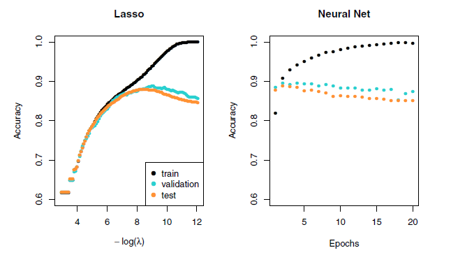

<b>FIG 10.11.</b> <i>Précision du lasso et d'un réseau neuronal à deux couches cachées sur les données $IMDb$. Pour le lasso, l'axe $x\ affiche\ -\log (\lambda)$, tandis que pour le réseau neuronal, il affiche les époques (nombre de fois que l'algorithme d'ajustement passe par l'ensemble d'apprentissage). Les deux montrent une tendance à la suradaptation, et obtiennent approximativement la même précision de test.</i>

Ici, nous pouvons voir que de nombreux mots ont été omis, et que certains mots inconnus $\langle UNK\rangle$ ont été marqués comme tels. Avec cette réduction, le vecteur de caractéristiques binaires a une longueur de 10 000 et se compose principalement de 0 et de quelques 1 dans les positions correspondant aux mots présents dans le document. 

Nous disposons d'un ensemble d'apprentissage et d'un ensemble de test, chacun contenant 25 000 exemples, et chacun étant équilibré en termes de sentiment. 

La matrice de caractéristiques d'apprentissage résultante, $\mathbf{X}$, a une dimension de $25\ 000 \times 10\ 000$, mais seulement $1,3 \%$ des entrées binaires sont différentes de zéro. On dit d'une telle matrice qu'elle est éparse, car la plupart des valeurs sont identiques (zéro dans ce cas) ; elle peut être stockée efficacement au format de matrice éparse ${ }^{15}$ . 

------

${ }^{15}$ Plutôt que de stocker la matrice entière, nous pouvons stocker l'emplacement et les valeurs des entrées non nulles. Dans ce cas, puisque les entrées non nulles sont toutes égales à 1 , seuls les emplacements sont stockés.

------

Il existe plusieurs façons de tenir compte de la longueur du document ; ici, nous ne notons qu'un mot comme étant dans ou hors du document, mais on pourrait par exemple enregistrer la fréquence relative des mots. Nous séparons un ensemble de validation de taille 2 000 des 25 000 observations d'apprentissage (pour le réglage du modèle) et ajustons deux séquences de modèle :

- Une régression logistique lasso utilisant le paquet $glmnet$;

-  Un réseau neuronal à deux classes avec deux couches cachées, chacune avec 16 unités $ReLU$ .

Les deux méthodes produisent une séquence de solutions. La séquence lasso est indexée par le paramètre de régularisation $\lambda$. La séquence du réseau neuronal est indexée par le nombre d'itérations de descente de gradient utilisées dans l'ajustement, mesuré par les époques d'apprentissage ou les passages dans l'ensemble d'apprentissage (Section 10.7). Remarquez que la précision d'apprentissage de la $figure\ 10.11$ (points noirs) augmente de manière monotone dans les deux cas. Nous pouvons utiliser l'erreur de validation pour choisir une bonne solution dans chaque séquence (points bleus dans les graphiques), qui sera ensuite utilisée pour faire des prédictions sur l'ensemble de données de test.

Notez qu'un réseau neuronal à deux classes équivaut à un modèle de régression logistique non linéaire. D'après (10.12) et (10.13), nous pouvons voir que

$$
\begin{aligned}
\log \biggl(\frac{{Pr}(Y = 1 \mid X)}{{Pr}(Y=0 \mid X)}\biggl) & = Z_ 1 - Z_ 0 \hspace{6 em} (10.15)\\ 
& = (\beta_ {10} - \beta_ {00}) + \sideset{}{^{K_ 2}_ {\ell = 1}}\sum (\beta_ {1 \ell} - \beta_ {0 \ell}) A_ {\ell}^{(2)} .
\end{aligned}
$$

(Cela montre la redondance de la fonction softmax ; pour $K$ classes, nous n'avons besoin d'estimer que $K{-}1$ ensembles de coefficients. Voir la section 4.3.5). Dans la $figure\ 10.11$, nous montrons la précision (fraction correcte) plutôt que l'erreur de classification (fraction incorrecte), la première étant plus populaire dans la communauté de l'apprentissage automatique. Les deux modèles atteignent une précision sur banc d'essai d'environ $88\ \%$ .

Le modèle du sac de mots résume un document par les mots présents et ignore leur contexte. Il existe au moins deux façons populaires de prendre en compte le contexte :

- Le modèle bag-of-n-grams. Par exemple, un sac de 2-grammes enregistre la co-occurrence consécutive de chaque paire distincte de mots. Blissfully long" peut être considéré comme une phrase positive dans une critique de film, tandis que "blissfully short" est une phrase négative.

- Traiter le document comme une séquence, en tenant compte de tous les mots dans le contexte de ceux qui ont précédé et de ceux qui suivent.

Dans la section suivante, nous explorons les modèles pour les séquences de données, qui ont des applications dans les prévisions météorologiques, la reconnaissance vocale, la traduction des langues et la prédiction des séries chronologiques, pour n'en citer que quelques-unes. Nous y poursuivons avec cet exemple $IMDb$ .

<a name="10-5"/>

## [10.5 Réseaux neuronaux récurrents](#10-5) ##

[Retour TOC](#toc)

De nombreuses sources de données sont de nature séquentielle et nécessitent un traitement particulier lors de la construction de modèles prédictifs. En voici quelques exemples :

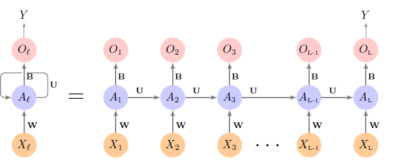

<b>FIG 10.12.</b> <i> Schéma d'un réseau neuronal récurrent simple. L'entrée est une séquence de vecteurs $\{X_Q\}_1^L$, et ici la cible est une réponse unique. Le réseau traite la séquence d'entrée $X$ de manière séquentielle ; chaque $X_{\ell}$ alimente la couche cachée, qui reçoit également en entrée le vecteur d'activation $A_{\ell-1}$ de l'élément précédent de la séquence, et produit le vecteur d'activation actuel At. Les mêmes collections de poids $\mathrm{W}, \mathrm{U}$ et $\mathrm{B}$ sont utilisées lors du traitement de chaque élément de la séquence. La couche de sortie produit une séquence de prédictions $O_{\ell}$ à partir de l'activation courante $A_{\ell}$, mais généralement, seule la dernière de ces prédictions, $O_L$, est pertinente. À gauche du signe égal se trouve une représentation concise du réseau, qui est déroulée en une version plus explicite à droite.</i>

- Des documents tels que des critiques de livres et de films, des articles de journaux et des tweets. La séquence et les positions relatives des mots dans un document permettent de saisir la narration, le thème et le ton, et peuvent être exploitées dans des tâches telles que la classification des sujets, l'analyse des sentiments et la traduction linguistique.

- Des séries temporelles de température, de précipitations, de vitesse du vent, de qualité de l'air, etc. Nous pouvons vouloir prévoir le temps plusieurs jours à l'avance, ou le climat plusieurs décennies à l'avance.

- Les séries temporelles financières, où nous suivons les indices boursiers, les volumes de transactions, les prix des actions et des obligations, et les taux de change. Ici, la prédiction est souvent difficile, mais comme nous le verrons, certains indices peuvent être prédits avec une précision raisonnable.

- La parole enregistrée, les enregistrements musicaux et autres enregistrements sonores. Nous pouvons vouloir donner une transcription textuelle d'un discours, ou peut-être une traduction linguistique. Nous pouvons vouloir évaluer la qualité d'un morceau de musique, ou lui attribuer certains attributs.

- L'écriture manuscrite, comme les notes de médecin, et les chiffres manuscrits comme les codes postaux. Dans ce cas, nous voulons transformer l'écriture manuscrite en texte numérique ou lire les chiffres (reconnaissance optique de caractères).

Dans un réseau neuronal récurrent ( $\mathrm{RNN}$ ), l'objet d'entrée $X$ est une séquence.

Considérons un corpus de documents, tel que la collection de critiques de films IMDb. Chaque document peut être représenté comme une séquence de $L$ mots, soit $X=\{X_1, X_2, \ldots, X_L\}$, où chaque $X_{\ell}$ représente un mot. L'ordre des mots, et la proximité de certains mots dans une phrase, véhiculent un sens sémantique. Les RNN sont conçus pour s'adapter et tirer parti de la nature séquentielle de ces objets d'entrée, tout comme les réseaux de neurones convolutifs s'adaptent à la structure spatiale des images d'entrée. Le résultat $Y$ peut également être une séquence (comme dans le cas de la traduction d'une langue), mais il s'agit souvent d'un scalaire, comme l'étiquette binaire du sentiment d'un document de critique de film.

La $figure\ 10.12$ illustre la structure d'un $RNN$ très basique avec une séquence $X=\{X_1, X_2, \ldots, X_L\}$ en entrée, une sortie simple $Y$, et une séquence de couche cachée $\{A_\ell\}^L_1 = \{A_1, A_2, \ldots, A_L\}$ . Chaque $X_{\ell}$ est un vecteur ; dans l'exemple du document, $X_{\ell}$ pourrait représenter un codage à un coup pour le $\ell^{ème}$ mot sur la base du dictionnaire de langue du corpus (voir le panneau supérieur de la $figure\ 10.13$ pour un exemple simple). À mesure que la séquence est traitée, un vecteur $X_{\ell}$ à la fois, le réseau met à jour les activations $A_{\ell}$ dans la couche cachée, en prenant en entrée le vecteur $X_{\ell}$ et le vecteur d'activation $A_{\ell-1}$ de l'étape précédente de la séquence. Chaque $A_{\ell}$ alimente la couche de sortie et produit une prédiction $O_{\ell}$ pour $Y$. $O_L$, la dernière de ces prédictions, est la plus pertinente.

En détail, supposons que chaque vecteur $X_{\ell}$ de la séquence d'entrée ait $p$ de composantes $X_{\ell}^T=(X_{\ell 1}, X_{\ell 2}, \ldots, X_{\ell p})$, et la couche cachée est constituée de $K$ unités $A_{\ell}^T=$ $(A_{\ell 1}, A_{\ell 2}, \ldots, A_{\ell K})$. Comme dans la figure 10.4, nous représentons l'ensemble des poids partagés $w_{k j}$ de la couche d'entrée par une matrice $W$, et de la même manière, $\mathrm{U}$ est une matrice $K \times K$ des poids $u_{k s}$ pour les couches cachées à cachées, et $\mathbf{B}$ est un vecteur $K+1$ des poids $\beta_k$ pour la couche de sortie. Ensuite,

$$
A_{\ell k}=g\Biggl(w_{k 0}+\sideset{}{^p_{j=1}}\sum w_{k j} X_{\ell j}+\sideset{}{^K_{s=1}}\sum u_{ks} A_{\ell-1, s}\Biggl), \hspace{6 em} (10.16)
$$

et la sortie $O_{\ell}$ est calculée comme suit

$$
O_{\ell}=\beta_0+\sideset{}{^K_{k=1}}\sum \beta_k A_{\ell k} \hspace{6 em} (10.17)
$$

pour une réponse quantitative, ou avec une fonction d'activation sigmoïde supplémentaire pour une réponse binaire, par exemple. Ici, $g(\cdot)$ est une fonction d'activation telle que $ReLU$ . Remarquez que les mêmes poids $\mathbf{W}, \mathbf{U}$ et $\mathbf{B}$ sont utilisés lorsque nous traitons chaque élément de la séquence, c'est-à-dire qu'ils ne sont pas des fonctions de $\ell$. Il s'agit d'une forme de partage de poids utilisée par les RNN, et similaire à l'utilisation de filtres dans les réseaux de neurones convolutifs (section 10.3.1.) Au fur et à mesure que nous allons du début à la fin, les activations $A_{\ell}$ accumulent un historique de ce qui a été vu auparavant, de sorte que le contexte appris peut être utilisé pour la prédiction.

Pour les problèmes de régression, la fonction de perte pour une observation (X, Y) est 

$$
(Y-O_L)^2, \hspace{6 em} (10.18)
$$

qui ne fait référence qu'à la sortie finale $O_L=\beta_0+\sideset{}{^K_{k=1}}\sum \beta_k A_{L k}$. Ainsi, $O_1, O_2$, $\ldots, O_{L-1}$ ne sont pas utilisés. Lorsque nous ajustons le modèle, chaque élément $X_{\ell}$ de la séquence d'entrée $X$ contribue à $O_L$ via la chaîne (10.16), et contribue donc indirectement à l'apprentissage des paramètres partagés $\mathbf{W}, \mathbf{U}$ et $\mathbf{B}$ via la perte (10.18). Avec $n$ paires séquence d'entrée/réponse $\left(x_i, y_i\right)$, les paramètres sont trouvés en minimisant la somme des carrés

$$
\sideset{}{^n_{i=1}}\sum\Biggl(y_i-o_{i L}\Biggl)^2=\sideset{}{^n_{i=1}}\sum\Biggl(y_i-\Biggl(\beta_0+\sideset{}{^K_{k=1}}\sum \beta_k g\Biggl(w_{k 0}+\sideset{}{^p_{j=1}}\sum w_{k j} x_{i L j}+\sideset{}{^K_{s=1}}\sum u_{k s,} a_{i, L-1, s}\Biggl)\Biggl)\Biggl)^2 \hspace{6 em} (10.19)
$$

Nous utilisons ici des lettres minuscules pour les séquences observées $y_i$ et les vecteurs $x_i=\{x_{i 1}, x_{i 2}, \ldots, x_{i L}\},{ }^{16}$ ainsi que les activations dérivées.

------

${ }^{16}$ C'est une séquence de vecteurs ; chaque élément $x_{1 \ell}$ est un vecteur $p$.

------

Puisque les sorties intermédiaires $O_{\ell}$ ne sont pas utilisées, on peut se demander pourquoi elles sont là. Tout d'abord, elles sont gratuites, car elles utilisent les mêmes poids de sortie $\mathrm{B}$ nécessaires pour produire $O_L$, et fournissent une prédiction évolutive pour la sortie. En outre, pour certaines tâches d'apprentissage, la réponse est également une séquence, et la séquence de sortie $\{O_1, O_2, \ldots, O_L\}$ est donc explicitement nécessaire. Lorsqu'ils sont utilisés à pleine puissance, les réseaux neuronaux récurrents peuvent être assez complexes. Nous illustrons leur utilisation dans deux applications simples. Dans la première, nous poursuivons l'analyse du sentiment IMDb de la section précédente, où nous traitons les mots des critiques de manière séquentielle. Dans la seconde application, nous illustrons leur utilisation dans un problème de prévision de séries temporelles financières.

<a name="10-5-1"/>

### [10.5.1 Modèles séquentiels pour la classification de documents](#10-5-1) ###

[Retour TOC](#toc)

Nous revenons ici à notre tâche de classification avec les critiques d' $IMDb$. Notre approche dans la $Section\ 10.4$ était d'utiliser le modèle de sac de mots. Ici, le plan est d'utiliser plutôt la séquence des mots qui apparaissent dans un document pour faire des prédictions sur l'étiquette du document entier.

Nous avons cependant un problème de dimensionnalité : chaque mot de notre document est représenté par un vecteur codé à un coup (variable fictive) avec 10 000 éléments (un par mot du dictionnaire) ! Une approche qui est devenue populaire consiste à représenter chaque mot dans un espace d'intégration de dimension beaucoup plus faible. Cela signifie qu'au lieu de représenter chaque mot par un vecteur binaire comportant 9 999 zéros et un seul un à une certaine position, nous le représenterons plutôt par un ensemble de nombres réels $m$, dont aucun n'est typiquement zéro. Ici, $m$ est la dimension d'intégration, et peut être de l'ordre de $100\mathrm{~s}$, ou même moins. Cela signifie (dans notre cas) que nous avons besoin d'une matrice $\mathbf{E}$ de dimension $m \times 10 000$, où chaque colonne est indexée par l'un des 10 000 mots de notre dictionnaire, et les valeurs de cette colonne donnent les coordonnées $m$ de ce mot dans l'espace d'intégration.

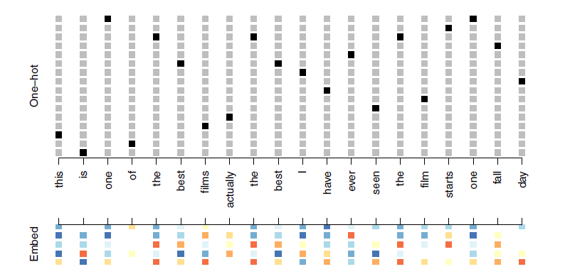

<b>FIG 10.13.</b><i> Représentation d'une séquence de 20 mots représentant un document unique : codée à un coup à l'aide d'un dictionnaire de 16 mots (panneau supérieur) et intégrée dans un espace à m dimensions avec $m=5$ (panneau inférieur).</i>

La $figure\ 10.13$ illustre l'idée (avec un dictionnaire de 16 mots au lieu de 10 000, et $m = 5$ ). D'où vient $\mathbf{E}$ ? Si nous disposons d'un grand corpus de documents étiquetés, nous pouvons demander au réseau neuronal d'apprendre $\mathbf{E}$ dans le cadre de l'optimisation. Dans ce cas, $\mathbf{E}$ est appelé couche d'intégration, et un $\mathbf{E}$ spécialisé est appris pour la tâche à accomplir. Sinon, nous pouvons insérer une matrice précalculée $\mathbf{E}$ dans la couche d'incorporation, un processus connu sous le nom de gel des poids. Deux encastrements pré-entraînés, $word2vec$ et $Glove$, sont largement utilisés ${ }^{17}$  .

------

${ }^{17}$  $word2ve$c est décrit dans Mikolon, Chen, Corrado et Dean (2013), disponible à l'adresse htrps://code.google.com/arch1ve/p/word2vec. $Glove$ est décrit dans Pennington, Socher et Manning (2014), disponible à l'adresse https://nlp.stanford.edu/projects/glove.

------

Ils sont construits à partir d'un très grand corpus de documents par une variante de l'analyse en composantes principales (section 12.2). L'idée est que la position des mots dans l'espace d'incorporation préserve le sens sémantique ; par exemple, les synonymes devraient apparaître près les uns des autres.

Jusqu'ici, tout va bien. Chaque document est maintenant représenté comme une séquence de vecteurs $m$ qui représente la séquence de mots. L'étape suivante consiste à limiter chaque document aux $L$ derniers mots. Les documents qui sont plus courts que $L$ sont remplis de zéros en amont. Ainsi, chaque document est maintenant représenté par une série composée de $L$ vecteurs $X=\{X_1, X_2, \ldots, X_L\}$, et chaque $X_{\ell}$ de la séquence possède $m$ composantes.

Nous utilisons maintenant la structure $RNN$ de la $figure\ 10.12$. Le corpus d'apprentissage est constitué de $n$ séries distinctes (documents) de longueur $L$, chacune d'entre elles étant traitée séquentiellement de gauche à droite. Au cours du processus, une série parallèle de vecteurs d'activation cachés $A_{\ell}, \ell=1, \ldots, L$ est créée comme dans (10.16) pour chaque document. $A_{\ell}$ alimente la couche de sortie pour produire la prédiction évolutive $O_{\ell}$.

Nous utilisons la valeur finale $O_L$ pour prédire la réponse : le sentiment de la critique.

Il s'agit d'un $RNN$ simple, dont les paramètres sont relativement peu nombreux. S'il y a $K$ unités cachées, la matrice de poids commune $\mathbf{W}$ a $K \times (m + 1)$ paramètres, la matrice $\mathbf{U}$ a $K \times K$ paramètres, et $\mathrm{B}$ a $2(K + 1)$ pour la régression logistique à deux classes comme dans (10.15). Ces paramètres sont utilisés de manière répétée lorsque nous traitons la séquence $X = \{X_\ell \}_1^L$ de gauche à droite, tout comme nous utilisons un seul filtre de convolution pour traiter chaque parcelle d'une image (Section 10.3.1). Si la couche d'intégration $\mathbf{E}$ est apprise, cela ajoute un paramètre supplémentaire de $m \times D$ ($D=10 000$ ici), et constitue de loin le coût le plus important.

Nous avons ajusté le $RNN$ décrit dans la $figure\ 10.12$ et le texte d'accompagnement aux données $IMDb$ . Le modèle possède une matrice d'intégration $\mathbf{E}$ avec $m = 32$ (qui a été apprise pendant l'apprentissage et non précalculée), suivie d'une couche récurrente unique avec $K = 32$ unités cachées. Le modèle a été entraîné avec une régularisation par abandon sur les 25 000 critiques de l'ensemble d'entraînement désigné, et a obtenu une précision décevante de 76 % sur les données de test $IMDb$ . Un réseau utilisant la matrice d'intégration préformée $E$ de $Glove$ a obtenu des résultats légèrement inférieurs.

Pour faciliter l'exposition, nous avons présenté un $RNN$ très simple. Des versions plus élaborées utilisent la mémoire à long terme et à court terme $(LSTM)$ . Deux pistes d'activations de couches cachées sont maintenues, de sorte que lorsque l'activation $A_{\ell}$ est calculée, elle reçoit une entrée des unités cachées à la fois plus loin dans le temps et plus près dans le temps - un $RNN$ dit $LSTM$ . Avec de longues séquences, cela permet de surmonter le problème des signaux précoces qui sont effacés au moment où ils sont propagés dans la chaîne jusqu'au vecteur d'activation final $A_L$.

Lorsque nous avons réorganisé notre modèle en utilisant l'architecture LSTM pour la couche cachée, les performances se sont améliorées pour atteindre $87\ \%$ sur les données de test $IMDb$ . Ce résultat est comparable aux $88\ \%$ obtenus par le modèle de sac de mots dans la $section\ 10.4$. Nous donnons des détails sur l'ajustement de ces modèles dans la $section\ 10.9.6$.

Malgré la complexité supplémentaire du $LSTM$ , notre $RNN$ est encore un peu "d'entrée de gamme". Nous pourrions probablement obtenir des résultats légèrement meilleurs en modifiant la taille du modèle, en changeant la régularisation et en incluant des couches cachées supplémentaires. Cependant, l'apprentissage des modèles $LSTM$ prend beaucoup de temps, ce qui rend fastidieuse l'exploration de nombreuses architectures et l'optimisation des paramètres.

Les $RNN$ offrent un cadre riche pour la modélisation des séquences de données, et ils continuent d'évoluer. De nombreux progrès ont été réalisés dans le développement des $RNN$ - dans l'architecture, l'augmentation des données et les algorithmes d'apprentissage. À l'heure où nous écrivons ces lignes (début 2020), les principales configurations de RNN affichent une précision supérieure à $95\ \%$ sur les données $IMDb$. Les détails dépassent le cadre de cet ouvrage. ${ }^{18}$

------

${ }^{18} \mathrm{An}$ IMDb leaderboard peut être trouvé à hitps://paperswithcode.con/sota/ sent1ment-analysis-on-1ndb.

------

<a name="10-5-2"/>

### [10.5.2 Prévision des séries temporelles](#10-5-2) ###

[Retour TOC](#toc)

La $figure\ 10.14$ montre les statistiques historiques des transactions de la bourse de New York. Elle présente trois séries chronologiques quotidiennes couvrant la période du 3 décembre 1962 au 31 décembre 1986: $^{19}$.

------

${ }^{19}$ Ces données ont été assemblées par LeBaron et Weigend (1998) IEEE Transactions on Neural Networks, 9(1) : 213-220.

------

- Volume d'échange logarithmique. Il s'agit de la fraction de toutes les actions en circulation qui sont échangées ce jour-là, par rapport à une moyenne mobile de 100 jours des transactions passées, sur l'échelle logarithmique.

- Rendement du Dow Jones. Il s'agit de la différence entre le log de l'indice industriel Dow Jones sur des jours de négociation consécutifs.

- Volatilité logarithmique. Elle est basée sur les valeurs absolues des mouvements de prix quotidiens.

La prédiction des prix des actions est un problème notoirement difficile, mais il s'avère que la prédiction du volume des transactions sur la base de l'historique récent est plus facile à gérer (et est utile pour planifier les stratégies de trading).

Une observation est ici constituée des mesures $(v_t, r_t, z_t)$ au jour $t$, dans ce cas les valeurs de $log_volume$, $DJ_return$ et $log_volatility$. Il existe un total de $T = 6\ 051$ de ces triples, chacun d'entre eux étant représenté sous forme de série chronologique dans la figure 10.14. Une caractéristique qui nous frappe immédiatement est que les observations quotidiennes ne sont pas indépendantes les unes des autres. Les séries présentent une auto-corrélation - dans ce cas, les valeurs proches dans le temps ont tendance à être similaires les unes aux autres. Cela distingue les séries temporelles des autres ensembles de données que nous avons rencontrés, dans lesquels on peut supposer que les observations sont indépendantes les unes des autres. Pour être clair, considérons des paires d'observations $(v_t, v_{t-\ell})$, espacées de $\ell$ jours. Si l'on prend toutes les paires de ce type dans la série $v_t$ et que l'on calcule leur coefficient de corrélation, on obtient l'autocorrélation au décalage $\ell$. La $figure\ 10.15$ montre la fonction d'autocorrélation pour tous les retards jusqu'à 37 , et nous voyons une corrélation considérable.

Une autre caractéristique intéressante de ce problème de prévision est que la variable de réponse $v_t$ - log_volume - est également un prédicteur ! En particulier, nous utiliserons les valeurs passées du log-volume pour prédire les valeurs à venir.

<a name="10-5-2-1"/>

#### [10.5.2.1 Prédicteur RNN](#10-5-2-1) ####

[Retour TOC](#toc)

Nous souhaitons prédire une valeur $v_t$ à partir des valeurs passées $v_{t-1}, v_{t-2}, \ldots$, et également utiliser les valeurs passées des autres séries $r_{\mathrm{t}-1}, r_{\mathrm{t}-2}, \ldots$ et $z_{t-1}, z_{t-2}, \ldots$. Bien que nos données combinées constituent une série assez longue avec 6 051 jours de bourse, la structure du problème est différente de celle de l'exemple précédent de classification de documents.

- Nous n'avons qu'une seule série de données, et non 25 000.

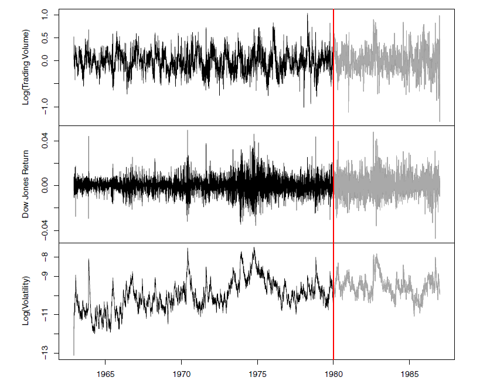

<b>FIG 10.14.</b><i> Statistiques historiques des transactions de la Bourse de New York. Les valeurs quotidiennes du logarithme normalisé du volume des transactions, du rendement du DJIA et du logarithme de la volatilité sont présentées pour une période de 24 ans allant de 1962 à 1986. Nous souhaitons prédire le volume de transactions d'un jour donné, compte tenu de l'historique de tous les jours précédents. À gauche de la barre rouge (2 janvier 1980) se trouvent les données d'entraînement, et à droite les données de test.</i>

- Nous avons une série entière de cibles $v_t$, et les entrées comprennent les valeurs passées de cette série.

Comment représenter ce problème en termes de structure comme le montre la $figure\ 10.12$ ? L'idée est d'extraire de nombreuses mini-séries courtes de séquences d'entrée $X=\{X_1, X_2, \ldots, X_L\}$ avec une longueur prédéfinie $L$ (appelée décalage dans ce contexte), et une cible correspondante $Y$. Ils ont la forme

$$
X_1=\left(\begin{array}{c}
v_{t-L} \\
r_{t-L} \\
z_{t-L}
\end{array}\right), X_2=\left(\begin{array}{l}
v_{t-L+1} \\
r_{t-L+1} \\
z_{t-L+1}
\end{array}\right), \cdots, X_L=\left(\begin{array}{c}
v_{t-1} \\
r_{t-1} \\
z_{t-1}
\end{array}\right), \text { and } Y=v_t .  \hspace{6 em} (10.20)
$$

Ainsi, ici, la cible $Y$ est la valeur du $log-volume$ $v_t$ à un instant unique $t$, et la séquence d'entrée $X$ est la série de 3-vecteurs $\{X_{\ell}\}_1^L$, chacun étant constitué des trois mesures $log\_volume$, $DJ\_return$ et $log\_volatility$ du jour $t - L, t - L + 1$, jusqu'à $t - 1$. Chaque valeur de $t$ constitue une paire $(X, Y)$ distincte, pour $t$ allant de $L + 1$ à $T$. 

<b>FIG 10.15.</b><i> La fonction d'autocorrélation pour log_volume. Nous voyons que les valeurs proches sont assez fortement corrélées, avec des corrélations supérieures à $0,2$ jusqu'à 20 jours d'intervalle.</i>

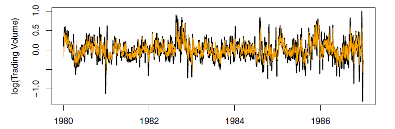

<b>FIG 10.16.</b><i> Prévision RNN du log-volume sur les données de test du NYSE. Les lignes noires représentent les volumes réels, et les lignes orange superposées les prévisions. La série prévue représente 42 % de la variance du log_volume.</i>

Pour les données du NYSE, nous utiliserons les cinq derniers jours de négociation pour prédire le volume de négociation du jour suivant. Par conséquent, nous utilisons $L = 5$. Puisque $T = 6\ 051$, nous pouvons créer 6,046 telles paires $(X, Y)$. Il est clair que $L$ est un paramètre qui doit être choisi avec soin, peut-être en utilisant des données de validation.

Nous avons ajusté ce modèle avec $K = 12$ unités cachées en utilisant les 4 281 séquences d'apprentissage dérivées des données antérieures au 2 janvier 1980 (voir figure 10.14), puis nous l'avons utilisé pour prévoir les 1 770 valeurs de $log\_volume$ après cette date. Nous obtenons un $R^2 = 0,42$ sur les données de test. Les détails sont donnés à la section 10.9.6. Comme homme de paille, ${ }^{20}$ en utilisant la valeur de log_volume d'hier comme prédiction pour aujourd'hui a $R^2 = 0.18$. La $figure\ 10.16$ montre les résultats de la prévision. Nous avons tracé les valeurs observées du $log\_volume$ journalier pour la période de test 1980-1986 en noir, et superposé la série prédite en orange.

------

${ }^{20}$ L'homme de paille  fait ici référence à une prédiction simple et sensée qui peut être utilisée comme base de comparaison.

------

La correspondance semble plutôt bonne.

Pour prévoir la valeur du log-volume au cours de la période de test, nous devons utiliser les données de test elles-mêmes pour former les séquences d'entrée $X$. Cela peut donner l'impression de tricher, mais en fait ce n'est pas le cas ; nous utilisons toujours des données passées pour prédire l'avenir.

<a name="10-5-2-2"/>

#### [10.5.2.2 Auto-régression](#10-5-2-2) ####

[Retour TOC](#toc)

Le $RNN$ que nous venons d'ajuster a beaucoup de points communs avec un modèle linéaire d'autorégression ( $AR$ ) traditionnel, que nous présentons maintenant à titre de comparaison. Nous considérons d'abord la séquence de réponse $v_t$ seule, et construisons un vecteur de réponse $\mathrm{y}$ et une matrice $M$ de prédicteurs pour la régression par les moindres carrés comme suit :

$$
\mathbf{y}=\left[\begin{array}{c}
v_{L+1} \\
v_{L+2} \\
v_{L+3} \\
\vdots \\
v_T
\end{array}\right] \quad \mathbf{M}=\left[\begin{array}{ccccc}

1 & v_L & v_{L-1} & \cdots & v_1 \\
1 & v_{L+1} & v_L & \cdots & v_2 \\
1 & v_{L+2} & v_{L+1} & \cdots & v_3 \\
\vdots & \vdots & \vdots & \ddots & \vdots \\
1 & v_{T-1} & v_{T-2} & \cdots & v_{T-L}
\end{array}\right] \hspace{6 em} (10.21)
$$

Les séries $\mathbf{M}$ et $\mathbf{y}$ ont chacune $T - L$ lignes, une par observation. Nous voyons que les prédicteurs pour une réponse donnée $v_t$ le jour $t$ sont les $L$ valeurs précédentes de la même série. Ajuster une régression de $\mathbf{y}$ sur $\mathbf{M}$ revient à ajuster le modèle

$$
\hat{v}_ t = \hat{\beta}_ 0 + \hat{\beta}_ 1 v_ {t - 1} + \hat{\beta}_ 2 v_ {t - 2} + \cdots + \hat{\beta}_ L v_ {t - L}, \hspace{6 em} (10.22)
$$

et est appelé un modèle autorégressif d'ordre $L$, ou simplement $\mathrm{AR}(L)$. Pour les données du NYSE, nous pouvons inclure des versions retardées de DJ_return et de log-volatilité, $r_t$ et $z_t$, dans la matrice prédicteur $\mathbf{M}$, ce qui donne $3L + 1$ colonnes. Un modèle $AR$ avec $L=5$ obtient un test $R^2$ de $0,41$, légèrement inférieur au $0,42$ obtenu par le $RNN$.

Bien sûr, les modèles $RNN$ et $AR$ sont très similaires. Ils utilisent tous deux la même réponse $Y$ et les mêmes séquences d'entrée $X$ de longueur $L = 5$ et de dimension $p = 3$ dans ce cas. Le RNN traite cette séquence de gauche à droite avec les mêmes poids $\mathrm{W}$ (pour la couche d'entrée), tandis que le modèle $\mathrm{AR}$ traite simplement tous les $L$ éléments de la séquence de manière égale comme un vecteur de $L \times p$ prédicteurs - un processus appelé aplatissement dans la littérature sur les réseaux neuronaux. Bien entendu, le RNN inclut également les activations de la couche cachée $A_{\ell}$ qui transfèrent les informations le long de la séquence, et introduit une non-linéarité supplémentaire. D'après (10.19) avec $K=12$ unités cachées, nous constatons que le RNN possède $13 + 12 \times(1 + 3 + 12)=205$ paramètres, contre 16 pour le modèle $\mathrm{AR}(5)$.

Une extension évidente du modèle AR consiste à utiliser l'ensemble des prédicteurs retardés comme vecteur d'entrée d'un réseau neuronal$ feedforward$ ordinaire (10.1), et donc à ajouter plus de flexibilité. Cela a permis d'obtenir un test $R^2 = 0,42$, légèrement meilleur que le modèle $AR$ linéaire, et identique à celui du $RNN$.

Tous les modèles peuvent être améliorés en incluant la variable day-of_ueek correspondant au jour $t$ de l'objectif $v_t$ (qui peut être appris à partir des dates du calendrier fournies avec les données) ; le volume des transactions est souvent plus élevé le lundi et le vendredi. Comme il y a cinq jours de bourse, ce one-hot est codé en cinq variables binaires. La performance du modèle AR. s'est améliorée à $R^2=0.46$ tout comme le RNN, et le modèle AR non linéaire s'est amélioré à $R^2=0.47$.

Nous avons utilisé la version la plus simple du RNN dans nos exemples ici. Des expériences supplémentaires avec l'extension LSTM du RNN ont donné de petites améliorations, typiquement jusqu'à $1 \%$ en $R^2$ dans ces exemples.

Nous donnons des détails sur la façon dont nous avons ajusté les trois modèles dans la Section 10.9.6.

<a name="10-5-3"/>

### [10.5.3 Résumé des RNN](#10-5-3) ###

[Retour TOC](#toc)

Nous avons illustré les RNN à travers deux cas d'utilisation simples, et nous n'avons fait qu'effleurer la surface.

Il existe de nombreuses variations et améliorations du RNN simple que nous avons utilisé pour la modélisation des séquences. Une approche que nous n'avons pas abordée utilise un réseau de neurones convolutif unidimensionnel, traitant la séquence de vecteurs (disons des mots, tels que représentés dans l'espace d'intégration) comme une image. Le filtre de convolution glisse le long de la séquence d'une manière unidimensionnelle, avec la possibilité d'apprendre des phrases particulières ou de courtes sous-séquences pertinentes pour la tâche d'apprentissage.

On peut également avoir des couches cachées supplémentaires dans un $RNN$ . Par exemple, avec deux couches cachées, la séquence $A \ell$ est traitée comme une séquence d'entrée pour la couche cachée suivante de manière évidente.

Le $RNN$ que nous avons utilisé a analysé le document du début à la fin ; d'autres $RNN$ bidirectionnels analysent les séquences dans les deux sens.

En traduction de langue, la cible est également une séquence de mots, dans une langue différente de celle de la séquence d'entrée. La séquence d'entrée et la séquence cible sont toutes deux représentées par une structure similaire à la $figure\ 10.12$, et elles partagent les unités cachées. Dans cet apprentissage dit $Seq2Seq$, les unités cachées sont censées capturer le sens sémantique des phrases. Certaines des grandes percées dans le domaine de la modélisation du langage et de la traduction résultent des améliorations relativement récentes de ces RNN. Les algorithmes utilisés pour adapter les RNN peuvent être complexes et coûteux en termes de calcul. Heureusement, un bon logiciel protège quelque peu les utilisateurs de ces complexités et rend la spécification et l'ajustement de ces modèles relativement faciles. De nombreux modèles que nous apprécions au quotidien (comme Google Translate) utilisent des architectures de pointe développées par des équipes d'ingénieurs hautement qualifiés et ont été entraînés à l'aide d'énormes ressources de calcul et de données.

<a name="10-6"/>

## [10.6 Quand utiliser l'apprentissage profond](#10-6) ##

[Retour TOC](#toc)

Les performances de l'apprentissage profond dans ce chapitre ont été plutôt impressionnantes. Il a réussi à résoudre le problème de la classification des chiffres, et les $CNN$ profonds ont vraiment révolutionné la classification des images. Nous voyons tous les jours des rapports sur les nouveaux succès de l'apprentissage profond. Beaucoup d'entre elles sont liées à des tâches de classification d'images, comme le diagnostic automatique de mammographies ou d'images radiologiques numériques $\mathrm{X}$, les scans oculaires en ophtalmologie, les annotations de scans IRM, etc. De même, les $RNN$ ont connu de nombreux succès dans la traduction de la parole et du langage, la prévision et la modélisation de documents. La question qui se pose alors est la suivante : devons-nous mettre au rebut tous nos anciens outils et utiliser l'apprentissage profond pour tous les problèmes liés aux données ? Pour répondre à cette question, nous revisitons notre jeu de données Hitters du chapitre 6.

Il s'agit d'un problème de régression, où l'objectif est de prédire le salaire d'un joueur de baseball en 1987 en utilisant ses statistiques de performance de 1986. Après avoir éliminé les joueurs dont les réponses sont manquantes, nous nous retrouvons avec 263 joueurs et 19 variables. Nous avons divisé aléatoirement les données en un ensemble d'apprentissage de 176 joueurs (deux tiers) et un ensemble de test de 87 joueurs (un tiers). Nous avons utilisé trois méthodes pour ajuster un modèle de régression à ces données.

- Un modèle linéaire a été utilisé pour ajuster les données d'entraînement et faire des prédictions sur les données de test. Ce modèle comporte 20 paramètres.

- Le même modèle linéaire a été ajusté avec une régularisation lasso. Le paramètre de réglage a été sélectionné par validation croisée à 10 reprises sur les données d'apprentissage. On a sélectionné un modèle avec 12 variables ayant des coefficients non nuls.

- Un réseau neuronal avec une couche cachée composée de 64 unités $ReLU$ a été ajusté aux données. Ce modèle comporte 1 409 paramètres. ${ }^{21}$

------

${ }^{21}$ Le modèle a été ajusté par descente de gradient stochastique avec une taille de lot de 32 pour 1 000 époques, et une régularisation par abandon de $10\ \%$. La performance de l'erreur de test s'est aplatie et a commencé à augmenter lentement après 1 000 époques. Ces détails d'ajustement sont discutés dans la section 10.7.

------

Le $tableau\ 10.2$ compare les résultats. Nous constatons des performances similaires pour les trois modèles. Nous indiquons l'erreur absolue moyenne sur les données de test, ainsi que les $R^2$ de test pour chaque méthode, qui sont tous respectables (voir Exercice 5). Nous avons passé pas mal de temps à jouer avec les paramètres de configuration du réseau neuronal pour obtenir ces résultats. Il est possible qu'en y consacrant plus de temps, et en obtenant la forme et la quantité de régularisation justes, nous soyons en mesure d'égaler, voire de dépasser, la régression linéaire et le lasso. Mais avec une grande facilité, nous avons obtenu des modèles linéaires qui fonctionnent bien. Les modèles linéaires sont beaucoup plus faciles à présenter et à comprendre que le réseau neuronal, qui est essentiellement une boîte noire. Le lasso a sélectionné 12 des 19 variables pour faire sa prédiction. Dans des cas comme celui-ci, il vaut mieux suivre le principe du rasoir d'Occam : lorsque l'on est confronté à plusieurs méthodes qui donnent des performances à peu près équivalentes, choisissez le plus simple.

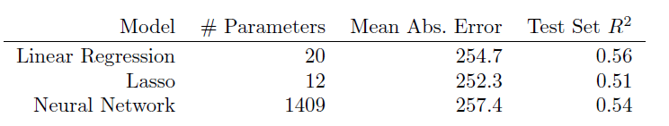

<b>TAB 10.2.</b><i> Résultats des prédictions sur les données de test de Hitters pour les modèles linéaires ajustés par les moindres carrés ordinaires et le lasso, comparés à un réseau neuronal ajusté par descente de gradient stochastique avec régularisation de la chute.</i>

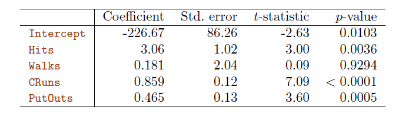

<b>TAB 10.3.</b><i> Estimations des coefficients des moindres carrés associés à la régression de Salary sur quatre variables choisies par lasso sur l'ensemble de données Hitters. Ce modèle a obtenu la meilleure performance sur les données de test, avec une erreur absolue moyenne de 224,8. Les résultats présentés ici ont été obtenus à partir d'une régression sur les données de test, qui n'ont pas été utilisées pour l'ajustement du modèle lasso.</i>

Après un peu plus d'exploration avec le modèle lasso, nous avons identifié un modèle encore plus simple avec quatre variables. Nous avons ensuite réajusté le modèle linéaire avec ces quatre variables sur les données d'entraînement (ce que l'on appelle le lasso relaxé), et nous avons obtenu une erreur absolue moyenne de $224,8 $, le grand gagnant ! Il est tentant de présenter le tableau récapitulatif de cet ajustement, afin que nous puissions voir les coefficients et les valeurs p ; cependant, comme le modèle a été sélectionné sur les données d'entraînement, il y aurait un biais de sélection. Au lieu de cela, nous avons réajusté le modèle sur les données de test, qui n'ont pas été utilisées dans la sélection. Le $tableau\ 10.3$ montre les résultats.

Nous disposons d'un certain nombre d'outils très puissants, notamment les réseaux neuronaux, les forêts aléatoires et le boosting, les machines à vecteurs de support et les modèles additifs généralisés, pour n'en citer que quelques-uns. Et puis nous avons les modèles linéaires et leurs variantes simples. Lorsqu'on est confronté à de nouveaux problèmes de modélisation et de prédiction des données, il est tentant de toujours opter pour les nouvelles méthodes à la mode. Elles donnent souvent des résultats extrêmement impressionnants, surtout lorsque les ensembles de données sont très volumineux et peuvent supporter l'ajustement de modèles non linéaires à haute dimension. Cependant, si nous pouvons produire des modèles aussi performants avec des outils plus simples, ils seront probablement plus faciles à ajuster et à comprendre, et potentiellement moins fragiles que les approches plus complexes. Dans la mesure du possible, il est judicieux d'essayer également les modèles les plus simples, puis de faire un choix en fonction du compromis performance/complexité.

En général, nous pensons que l'apprentissage profond est un choix intéressant lorsque la taille de l'échantillon de l'ensemble d'apprentissage est extrêmement importante et lorsque l'interprétabilité du modèle n'est pas une priorité.

<a name="10-7"/>

## [10.7 Ajustement d'un réseau neuronal](#10-7) ##

[Retour TOC](#toc)

L'ajustement des réseaux neuronaux est quelque peu complexe et nous en donnons ici un bref aperçu. Les idées sont généralisables à des réseaux beaucoup plus complexes. Les lecteurs pour qui ce sujet est difficile peuvent l'ignorer. Heureusement, comme nous le verrons dans le laboratoire à la fin du chapitre, il existe de bons logiciels pour ajuster les modèles de réseaux neuronaux de manière relativement automatisée, sans avoir à se soucier des détails techniques de la procédure d'ajustement du modèle.

Nous commençons par le réseau simple décrit à la $figure\ 10.1$ de la $section\ 10.1$. Dans le modèle (10.1), les paramètres sont $\beta = (\beta_0, \beta_1, \ldots, \beta_K)$, ainsi que chacun des $w_k=(w_{k 0}, w_{k 1}, \ldots, w_{k p}), k = 1, \ldots, K$. Étant donné les observations $(x_i, y_i), i =  1, \ldots, n$, nous pourrions ajuster le modèle en résolvant un problème de moindres carrés non linéaires

$$
{minimize}_{\{w_k\}_1^K, \beta} \frac{1}{2} \sideset{}{^n_{i=1}}\sum\biggl(y_i-f(x_i)\biggl)^2 \hspace{6 em} (10.23)
$$

Où

$$
f\left(x_i\right)=\beta_0+\sum_{k=1}^K \beta_k g\left(w_{k 0}+\sum_{j=1}^p w_{k j} x_{i j}\right) . \hspace{6 em} (10.24)
$$

L'objectif de (10.23) semble assez simple, mais en raison de la disposition imbriquée des paramètres et de la symétrie des unités cachées, il n'est pas simple à minimiser. Le problème est non convexe dans les paramètres, et il existe donc de multiples solutions. À titre d'exemple, la $figure\ 10.17$ montre une fonction non convexe simple d'une seule variable $\theta$ ; il existe deux solutions : l'une est un minimum local et l'autre un minimum global. De plus, (10.1) est le plus simple des réseaux neuronaux ; dans ce chapitre, nous en avons présenté des beaucoup plus complexes où ces problèmes sont aggravés. Pour surmonter certains de ces problèmes et éviter le surajustement, deux stratégies générales sont utilisées lors de l'ajustement des réseaux neuronaux.

- Apprentissage lent : le modèle est ajusté de manière itérative et assez lente, en utilisant la descente de gradient. Le processus d'ajustement est ensuite interrompu lorsqu'un surajustement est détecté.

- Régularisation : des pénalités sont imposées aux paramètres, généralement de type lasso ou ridge, comme indiqué à la section 6.2.

Supposons que nous représentions tous les paramètres dans un long vecteur $\theta$. Nous pouvons alors réécrire l'objectif de $(10.23)$ comme suit

$$
R(\theta)=\frac{1}{2} \sideset{}{^n_{i=1}}\sum\biggl(y_i-f_\theta(x_i)\biggl)^2, \hspace{6 em} (10.25)
$$

où nous rendons explicite la dépendance de $f$ sur les paramètres. L'idée de la descente de gradient est très simple.

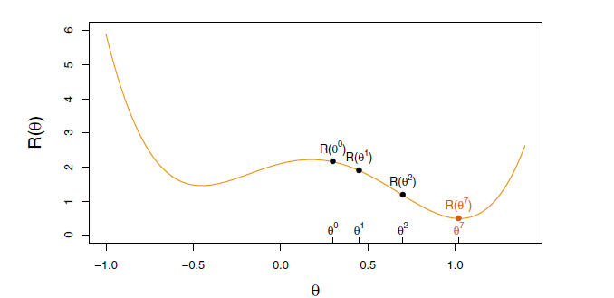

<b>FIG 10.17.</b><i> Illustration de la descente du gradient pour $\theta$ unidimensionnel. La fonction objectif $R(\theta)$ n'est pas convexe, et possède deux minima, l'un à $\theta = -0,46$ (local), l'autre à $\theta = 1,02$ (global). À partir d'une certaine valeur $\theta^D$ (généralement choisie au hasard), chaque étape de $\theta$ se déplace vers le bas - contre le gradient - jusqu'à ce qu'elle ne puisse plus descendre. Ici, la descente par gradient a atteint le minimum global en 7 étapes.</i>

1. On commence par une estimation de $\theta^0$ pour tous les paramètres de $\theta$, et on fixe $t = 0$.

2. Itérer jusqu'à ce que l'objectif (10.25) ne diminue plus :

(a) Trouver un vecteur $\delta$ qui reflète un petit changement dans $\theta$, tel que $\theta^{t + 1} =  \theta^t + \delta$ réduit l'objectif ; c'est-à-dire tel que $R(\theta^{t + 1}) < R(\theta^t)$.

(b) On définit $t \leftarrow t+1$.

On peut visualiser (figure 10.17) le fait de se tenir dans un terrain montagneux, et le but est d'atteindre le fond par une série de marches. Tant que chaque étape est en descente, nous devons finir par atteindre le fond. Dans ce cas, nous avons eu de la chance, car avec notre estimation de départ $\theta^0$, nous nous retrouvons au minimum global. En général, nous pouvons espérer arriver à un (bon) minimum local.

<a name="10-7-1"/>

### [10.7.1 La rétropropagation](#10-7-1) ###

[Retour TOC](#toc)

Comment trouver les directions dans lesquelles déplacer $\theta$ de manière à diminuer l'objectif $R(\theta)$ dans (10.25) ? Le gradient de $R(\theta)$, évalué à une certaine valeur courante $\theta = \theta^m$, est le vecteur des dérivées partielles à ce point :

$$
\nabla R\left(\theta^m\right)=\frac{\partial R(\theta)}{\partial \theta}\biggl{|}_{\theta=\theta \mathrm{m}} . \hspace{6 em} (10.26)
$$

L'indice $\theta=\theta^m$ signifie qu'après avoir calculé le vecteur des dérivées, nous l'évaluons à l'estimation actuelle, $\theta^m$. Cela donne la direction dans l'espace $\theta$ dans laquelle $R(\theta)$ augmente le plus rapidement. L'idée de la descente par gradient est de déplacer $\theta$ un peu dans la direction opposée (puisque nous souhaitons descendre la pente) :

$$
\theta^{m+1} \leftarrow \theta^m-\rho \nabla R\left(\theta^m\right) . \hspace{6 em} (10.27)
$$

Pour une valeur suffisamment petite du taux d'apprentissage $\rho$, cette étape diminuera l'objectif $R(\theta)$ ; c'est-à-dire $R(\theta^{m+1}) \leq R(\theta^m)$. Si le vecteur gradient est nul, alors nous sommes peut-être arrivés à un minimum de l'objectif.

Quelle est la complexité du calcul (10.26) ? Il s'avère qu'il est assez simple ici, et reste simple même pour des réseaux beaucoup plus complexes, en raison de la règle de différenciation en chaîne.

Puisque $R(\theta)=\sideset{}{^n_{1-1}}\sum R_t(\theta)=\frac{1}{2} \sideset{}{^n_{1-1}}\sum(y_i-f_\theta(x_i))^2$ est une somme, son gradient est également une somme sur les $n$ observations, nous allons donc juste examiner un de ces termes,

$$
R_4(\theta)=\frac{1}{2}\biggl(y_1-\beta_0-\sum_{k=1}^K \beta_k g\biggl(w_{k 0}+\sum_{j=1}^p w_{k j} I_{i j}\biggl)\biggl)^2 . \hspace{6 em} (10.28)
$$

Pour simplifier les expressions à suivre, nous écrivons $z_{i k}=w_{k0}+\sideset{}{^p_{j=1}}\sum w_{kj} x_{ij}$. Nous prenons d'abord la dérivée par rapport à $\beta_k$ :

$$
\begin{aligned}
\frac{\partial R_i(\theta)}{\partial \beta_k} & =\frac{\partial R_i(\theta)}{\partial f_\theta\left(x_i\right)} \cdot \frac{\partial f_\theta\left(x_i\right)}{\partial \beta_k} \\
& =-\left(y_i-f_\theta\left(x_i\right)\right) \cdot g\left(z_{i k}\right) .
\end{aligned} \hspace{6 em} (10.29)
$$

Et maintenant nous prenons la dérivée par rapport à $w_{k j}$ :

$$
\begin{aligned}
\frac{\partial R_i(\theta)}{\partial w_{k j}} & =\frac{\partial R_i(\theta)}{\partial f_\theta\left(x_i\right)} \cdot \frac{\partial f_\theta\left(x_i\right)}{\partial g\left(z_{i k}\right)} \cdot \frac{\partial g\left(z_{i k}\right)}{\partial z_{i k}} \cdot \frac{\partial z_{i k}}{\partial w_{k j}} \\
& =-\left(y_i-f_\theta\left(x_i\right)\right) \cdot \beta_k \cdot g^{\prime}\left(z_{i k}\right) \cdot x_{i j} .
\end{aligned} \hspace{6 em} (10.30)
$$

Remarquez que ces deux expressions contiennent le résidu $y_1 - f_\theta(x_1)$. Dans (10.29), nous voyons qu'une fraction de ce résidu est attribuée à chacune des unités cachées en fonction de la valeur de $g\left(z_{1 k}\right)$. Puis, dans (10.30), nous voyons une attribution similaire à l'entrée $j$ via l'unité cachée $k$. Ainsi, l'acte de différenciation attribue une fraction du résidu à chacun des paramètres via la règle de la chaîne - un processus connu sous le nom de rétropropagation dans la littérature sur les réseaux neuronaux. Bien que ces calculs soient simples, il est nécessaire de tenir une comptabilité minutieuse pour garder la trace de tous les éléments.

<a name="10-7-2"/>

### [10.7.2 Régularisation et descente de gradient stochastique](#10-7-2) ###

[Retour TOC](#toc)

La descente de gradient nécessite généralement de nombreuses étapes pour atteindre un minimum local. En pratique, il existe un certain nombre d'approches permettant d'accélérer le processus. De plus, lorsque $n$ est grand, au lieu d'additionner $(10.29)-(10.30)$ sur l'ensemble des $n$ observations, nous pouvons échantillonner une petite fraction ou un mini-batch de celles-ci à chaque fois que nous calculons une étape de gradient. Ce processus est connu sous le nom de descente de gradient stochastique $(SGD)$ et constitue l'état de l'art pour l'apprentissage des réseaux neuronaux profonds. Heureusement, il existe de très bons logiciels pour configurer les modèles d'apprentissage profond et pour les adapter aux données, de sorte que la plupart des aspects techniques sont cachés à l'utilisateur.

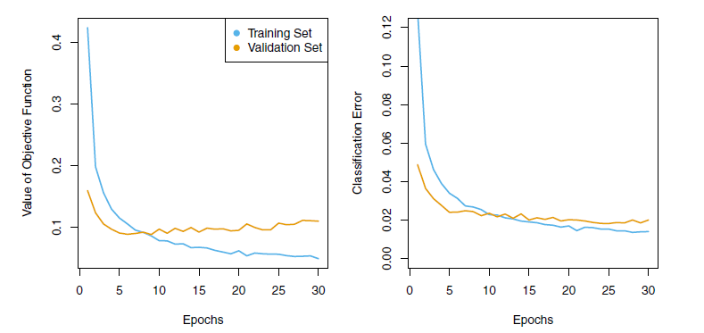

<b>FIG 10.18.</b><i> Évolution des erreurs de formation et de validation pour le réseau neuronal MNIST décrit à la figure 10.4, en fonction des époques de formation. L'objectif fait référence à la log-vraisemblance (10.14).</i>

Nous allons maintenant nous intéresser au réseau multicouche (figure 10.4) utilisé dans le problème de reconnaissance des chiffres. Le réseau compte plus de 235 000 poids, ce qui représente environ quatre fois le nombre d'exemples d'apprentissage. La régularisation est essentielle ici pour éviter l'overfitting. La première ligne du tableau 10.1 utilise la régularisation ridge sur les poids. Ceci est réalisé en augmentant la fonction objective (10.14) avec un terme de pénalité :

$$
R(\theta ; \lambda)=-\sum_{i=1}^n \sum_{m=0}^9 y_{i m} \log (f_m(x_i))+\lambda \sum_j \theta_j^2 .
$$

Le paramètre $\lambda$ est souvent prédéfini à une petite valeur, ou bien il est trouvé en utilisant l'approche de l'ensemble de validation de la section 5.3.1. Nous pouvons également utiliser différentes valeurs de $\lambda$ pour les groupes de poids de différentes couches ; dans ce cas, $\mathbf{W}_1$ et $\mathbf{W}_2$ sont pénalisés, tandis que les poids relativement peu nombreux $\mathbf{B}$ de la couche de sortie ne sont pas pénalisés du tout. La régularisation Lasso est également populaire en tant que forme de régularisation supplémentaire, ou en tant qu'alternative au ridge.

La figure 10.18 montre certaines métriques qui évoluent pendant l'entraînement du réseau sur les données $MaIST$. Il s'avère que $SGD$ applique naturellement sa propre forme de régularisation approximativement quadratique. ${ }^{22}$ Ici, la taille du minibatch était de $128$ observations par mise à jour du gradient. Le terme " époques " qui marque l'axe horizontal de la Figure 10.18 compte le nombre de fois qu'un équivalent de l'ensemble d'apprentissage complet a été traité. Pour ce réseau, $20\ \%$ des $60\ 000$ observations d'apprentissage ont été utilisées comme ensemble de validation afin de déterminer quand l'apprentissage doit s'arrêter. Ainsi, en fait, $48\ 000$ observations ont été utilisées pour

------

${ }^{22}$ Cette propriété et d'autres propriétés de la $SGD$ pour l'apprentissage profond font l'objet de nombreuses recherches dans la littérature sur l'apprentissage automatique au moment de la rédaction de cet article.

------

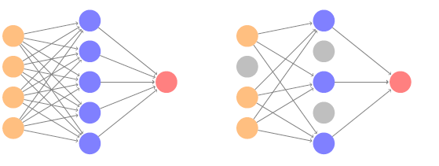

<b>FIG 10.19.</b><i> Apprentissage par abandon. gauche : un réseau entièrement connecté. À droite : réseau avec abandon dans la couche d'entrée et la couche cachée. Les nœuds en gris sont sélectionnés au hasard et ignorés dans une instance de formation.</i>

L'apprentissage se fait par le biais de l'apprentissage, et donc il y a $48\ 000\ /\ 128\ \approx 375 $ de mises à jour de gradient par $epoch$. Nous constatons que la valeur de l'objectif de validation commence en fait à augmenter à partir de 30 époques, de sorte que l'arrêt précoce peut également être utilisé comme une forme supplémentaire de régularisation.

<a name="10-7-3"/>

### [10.7.3 Apprentissage par abandon](#10-7-3) ###

[Retour TOC](#toc)

La deuxième ligne du tableau 10.1 est étiquetée dropout. Il s'agit d'une forme de régularisation relativement nouvelle et efficace, similaire à certains égards à la régularisation par crête. Inspirée des forêts aléatoires (section 8.2), l'idée est de supprimer aléatoirement une fraction $\phi$ des unités d'une couche lors de l'ajustement du modèle. La figure 10.19 illustre cela. Cette opération est effectuée séparément à chaque fois qu'une observation d'apprentissage est traitée. Les unités survivantes remplacent les unités manquantes, et leurs poids sont augmentés d'un facteur de $1 /(1 - \phi)$ pour compenser. Cela empêche les nœuds de devenir sur-spécialisés, et peut être considéré comme une forme de régularisation. En pratique, l'abandon est obtenu en fixant aléatoirement à zéro les activations des unités "abandonnées", tout en conservant l'architecture intacte.

<a name="10-7-4"/>

### [10.7.4 Réglage du réseau](#10-7-4) ###

[Retour TOC](#toc)

Le réseau de la figure 10.4 est considéré comme relativement simple ; il nécessite néanmoins un certain nombre de choix qui ont tous un effet sur les performances :

- Le nombre de couches cachées, et le nombre d'unités par couche. La pensée moderne est que le nombre d'unités par couche cachée peut être important, et que l'overfitting peut être contrôlé via les différentes formes de régularisation.

- Paramètres de réglage de la régularisation. Ceux-ci incluent le taux d'abandon $\phi$ et la force $\lambda$ de la régularisation lasso et ridge, et sont généralement réglés séparément à chaque couche.

- Détails de la descente de gradient stochastique. Ils comprennent la taille du lot, le nombre d'époques et, le cas échéant, les détails de l'augmentation des données (Section 10.3.4.).

De tels choix peuvent faire la différence. Lors de la préparation de cet exemple $mNIST$, nous avons obtenu une erreur de classification respectable de $1,8\ \%$ après quelques essais et erreurs. Des réglages plus fins et l'entraînement d'un réseau similaire permettent d'obtenir une erreur inférieure à 1 % sur ces données, mais le processus de bricolage peut être fastidieux et entraîner un surajustement s'il est effectué sans précaution.

<a name="10-8"/>

## [10.8 Interpolation et double descente](#10-8) ##

[Retour TOC](#toc)

Tout au long de cet ouvrage, nous avons abordé à plusieurs reprises le compromis biais-variance. Ce compromis indique que les méthodes d'apprentissage statistique ont tendance à être les plus performantes, en termes d'erreur sur les ensembles de tests, pour un niveau intermédiaire de complexité du modèle. En particulier, si nous représentons la "flexibilité" sur l'axe des x et l'erreur sur l'axe des y, nous nous attendons généralement à ce que l'erreur de test ait une forme en U, alors que l'erreur d'apprentissage diminue de façon monotone. L'une des implications du compromis biais-variance est que ce n'est généralement pas une bonne idée d'interpoler les données d'apprentissage - c'est-à-dire d'obtenir une erreur d'apprentissage nulle - car cela entraînera souvent une erreur de test très élevée.

Cependant, il s'avère que dans certains contextes spécifiques, il est possible qu'une méthode d'apprentissage statistique qui interpole les données d'apprentissage donne de bons résultats - ou du moins, de meilleurs résultats qu'un modèle légèrement moins complexe qui n'interpole pas tout à fait les données. Ce phénomène est connu sous le nom de double descente, et est illustré à la figure 10.20. La "double descente" tire son nom du fait que l'erreur de test a une forme en U avant que le seuil d'interpolation ne soit atteint, puis qu'elle redescend (pendant un certain temps, du moins) à mesure qu'un modèle de plus en plus flexible est ajusté.

Nous allons maintenant décrire la configuration qui a donné lieu à la figure 10.20. Nous avons simulé $n=20$ observations à partir du modèle

$$
Y=\sin (X)+\epsilon,
$$

où $X \sim U[-5,5]$ (distribution uniforme), et $\epsilon \sim N(0, \sigma^2)$ avec $\sigma = 0,3$. Nous ajustons ensuite une spline naturelle aux données, comme décrit dans la section 7.4, avec $d$ degrés de liberté. Rappelons de la Section 7.4 que l'ajustement d'une spline naturelle avec $d$ degrés de liberté revient à ajuster une régression aux moindres carrés de la réponse sur un ensemble de $d$ fonctions de base. 

------

${ }^{23}$ Cela implique le choix de $d$ nœuds, choisis ici à $d$ quantiles d'équi-probabilité des données d'apprentissage. Lorsque $d > n$, les quantiles sont trouvés par interpolation.

------

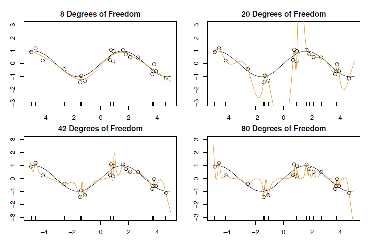

<b>FIG 10.20.</b><i> Phénomène de double descente, illustré à l'aide de tracés d'erreurs pour un exemple de spline naturelle unidimensionnelle. L'axe horizontal fait référence au nombre de fonctions de base de la spline sur l'échelle logarithmique. L'erreur d'apprentissage atteint zéro lorsque les degrés de liberté coïncident avec la taille de l'échantillon $n=20$, le " seuil d'interpolation ", et reste nulle par la suite. L'erreur de test augmente considérablement à ce seuil, mais redescend ensuite jusqu'à une valeur raisonnable avant d'augmenter à nouveau.</i>

Le panneau supérieur gauche de la Figure 10.21 montre les données, la fonction réelle $f(X)$ et $\hat f _8(X)$, la spline naturelle ajustée avec $d = 8$ degrés de liberté.

Ensuite, nous ajustons une courbe spline naturelle avec $d = 20$ degrés de liberté. Puisque $n = 20$, cela signifie que $n = d$, et nous avons une erreur d'apprentissage nulle ; en d'autres termes, nous avons interpolé les données d'apprentissage ! Nous pouvons voir dans le panneau supérieur droit de la Figure 10.21 que $\hat f _{20}(X)$ fait des excursions sauvages, et donc que l'erreur de test sera importante.

Nous continuons maintenant à ajuster des splines naturelles aux données, avec des valeurs croissantes de $d$. Pour $d > 20$, la régression par les moindres carrés de $Y$ sur $d$ fonctions de base n'est pas unique : il existe un nombre infini d'estimations des coefficients des moindres carrés qui permettent d'obtenir une erreur nulle. Pour les sélectionner, nous choisissons celle dont la somme des coefficients quadratiques est la plus petite, $\sideset{}{^d_{j=1}}\sum \hat \beta _j^2$. C'est ce qu'on appelle la solution à norme minimale.

Les deux panneaux inférieurs de la figure 10.21 montrent les ajustements par spline naturelle à norme minimale avec $d = 42$ et $d = 80$ degrés de liberté. Incroyablement, $\hat f _{42}(X)$ est un peu moins sauvage que $\hat f _{20}(X)$, même si elle utilise plus de degrés de liberté. Et $\hat f _{\mathrm{BD}}(X)$ n'est pas très différent. Comment cela est-il possible ? Essentiellement, $\hat f _{20}(X)$ est très sauvage parce qu'il existe juste une seule façon d'interpoler $n = 20$ observations en utilisant $d = 20$ fonctions de base, et cette seule façon donne une fonction ajustée quelque peu extrême. En revanche, il existe un nombre infini de façons d'interpoler $n = 20$ observations en utilisant $d = 42$.

Certains points méritent d'être soulignés :
- Le phénomène de double-descente ne contredit pas le compromis biais-variance, tel que présenté dans la section 2.2.2. La courbe de double-descente observée dans la partie droite de la Figure 10.20 est plutôt une conséquence du fait que l'axe $x$ affiche le nombre de fonctions de base spline utilisées, ce qui ne capture pas correctement la véritable "flexibilité" des modèles qui interpolent les données d'apprentissage. En d'autres termes, dans cet exemple, la spline naturelle à norme minimale avec $d = 42$ a une variance plus faible que la spline naturelle avec $d = 20$.
- La plupart des méthodes d'apprentissage statistique présentées dans cet ouvrage ne présentent pas de double descente. Par exemple, les approches de régularisation n'interpolent généralement pas les données d'apprentissage, et la double descente ne se produit donc pas. Ce n'est pas un inconvénient des méthodes régularisées : elles peuvent donner d'excellents résultats sans interpoler les données !

En particulier, dans les exemples présentés ici, si nous avions ajusté les splines naturelles à l'aide de la régression ridge avec une pénalité choisie de manière appropriée plutôt qu'à l'aide des moindres carrés, nous n'aurions pas observé de double descente et nous aurions en fait obtenu de meilleurs résultats en matière d'erreur de test.
- Au chapitre 9, nous avons vu que les classificateurs à marge maximale et les $SVM$ dont l'erreur d'apprentissage est nulle obtiennent néanmoins souvent une très bonne erreur de test. Cela est dû en partie au fait que ces méthodes recherchent des solutions lisses à norme minimale. Ceci est similaire au fait que la spline naturelle à norme minimale peut donner de bons résultats avec une erreur d'apprentissage nulle.
- Le phénomène de double-descente a été utilisé par la communauté de l'apprentissage automatique pour expliquer la pratique réussie de l'utilisation d'un réseau neuronal surparamétré (plusieurs couches et plusieurs unités cachées), puis de l'ajustement jusqu'à une erreur d'apprentissage nulle. Cependant, l'ajustement à l'erreur zéro n'est pas toujours optimal, et son opportunité dépend du rapport signal/bruit. Par exemple, nous pouvons utiliser la régularisation ridge pour éviter le surajustement d'un réseau neuronal, comme dans (10.31). Dans ce cas, à condition d'utiliser un choix approprié pour le paramètre d'ajustement $\lambda$, nous n'interpolerons jamais les données d'apprentissage et n'observerons donc pas le phénomène de double descente. Néanmoins, nous pouvons obtenir de très bonnes performances sur les ensembles de test, probablement bien meilleures que celles que nous aurions obtenues si nous avions interpolé les données d'apprentissage. L'arrêt précoce pendant la descente de gradient stochastique peut également servir de forme de régularisation qui nous empêche d'interpoler les données d'apprentissage, tout en obtenant de très bons résultats sur les données de test.

En résumé, bien que la double descente puisse parfois se produire dans les réseaux neuronaux, nous ne voulons généralement pas compter sur ce comportement. En outre, il est important de se rappeler que le compromis biais-variance est toujours valable (bien qu'il soit possible que l'erreur de test en fonction de la flexibilité ne présente pas une forme en $U$, selon la façon dont nous avons paramétré la notion de "flexibilité" sur l'axe des $x$ ).
