# Deep Learning #

[Retour README](../README.md)

[TOC]

## Leçon 1 : Les bases ##

Ceci est un réseau de neurones artificiels. Un des algorithmes d'intelligence artificielle les plus sophistiqués au monde. 


A l'origine inspiré du fonctionnement des neurones biologiques, cet algorithme est capable d'apprendre à réaliser n'importe quelle tâche. Conduire une voiture, jouer aux échecs, entretenir une conversation, ou encore reconnaître et classer des images telles que ces chiffres que vous voyez en ce moment à l'écran.  

### 1.1 Les Bases du Machine Learning et du Deep Learning ###

Dans cette leçon, nous allons montrer comment créer ce genre d'algorithmes, en vous expliquant de façon simple et ludique toutes les équations et concepts mathématiques qui se cachent derrière l'intelligence artificielle. 

Nous allons apprendre à programmer des réseaux de neurones entièrement à la main avec Numpy, mais aussi grâce aux librairies TensorFlow et Keras, pour qu'à la fin de ces leçons, vous soyez capable de créer vous-même une application de vision par ordinateur comme celle que vous voyez ici. 

Bon ! Dans cette première leçon, nous allons commencer en douceur en voyant ensemble ce qu'est le Deep Learning, quelle est sa place dans le monde de l'intelligence artificielle, et comment fonctionnent les réseaux de neurones artificiels. 

***Le machine learning est un domaine de l'intelligence artificielle, qui consiste à programmer une machine pour que celle ci apprenne à réaliser des tâches en étudiant des exemples de ces dernières.***  

D'un point de vue mathématique, ces exemples sont représentés par des données que la machine utilise pour développer un modèle, par exemple une fonction du type $f(x) = a x + b$. Le but du jeu en machine learning, c'est de trouver les paramètres $a$ et $b$ qui donnent le meilleur modèle possible, c'est à dire, le modèle qui s'ajuste le mieux à nos données.

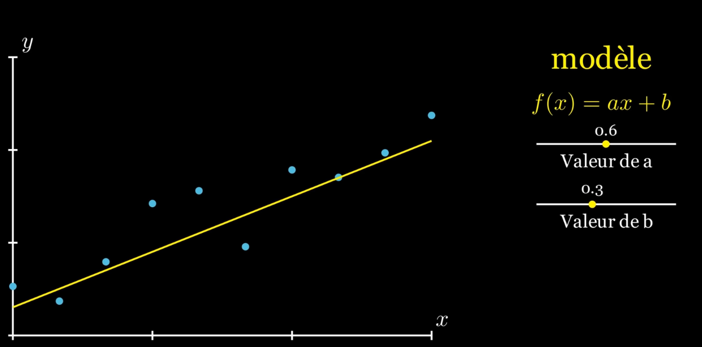 

Pour cela, on programme dans la machine un algorithme d'optimisation qui va venir tester différentes valeurs de a et b jusqu'à obtenir la combinaison qui minimise la distance entre le modèle et les points. 

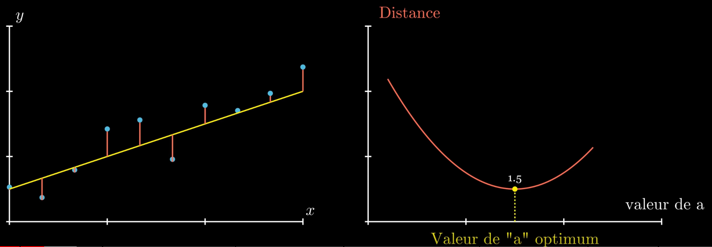

Et voilà ! C'est ça le machine learning. Ça consiste à développer un modèle en se servant d'un algorithme d'optimisation pour minimiser les erreurs entre le modèle et nos données. Tout simplement ! 

Et des modèles on en compte tout plein : comme **les modèles linéaires**, **les arbres de décision**, ou encore **les Support Vector Machines**. 

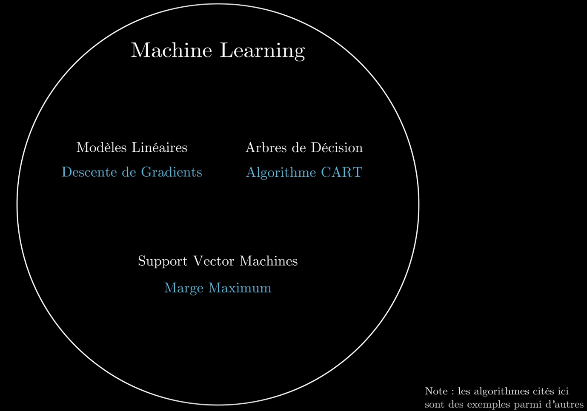

Chacun venant avec son algorithme d'optimisation : **la descente de gradient pour les modèles linéaires**, **l'algorithme CART pour les arbres de décision**, ou encore **la marge maximum pour les Support Vector Machines**.

Maintenant, qu'en est il du Deep learning ? Eh bien, le Deep Learning est un domaine du Machine Learning dans lequel, au lieu de développer un des modèles que l'on vient de citer, on développe à la place ce qu'on appelle des réseaux de neurones artificiels. 

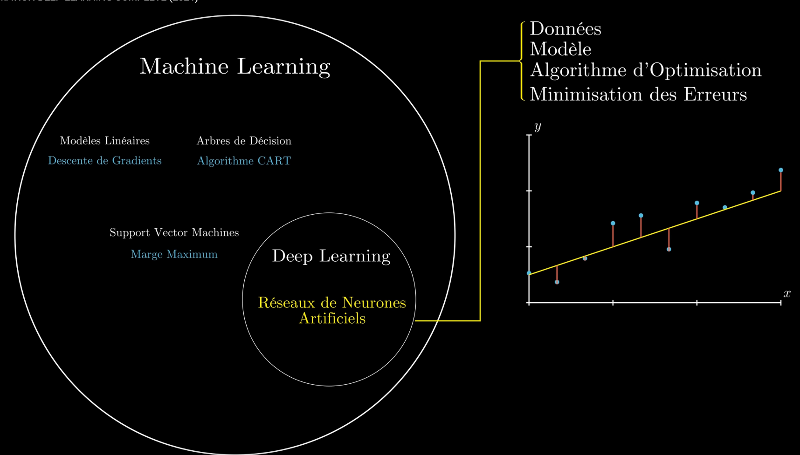

Alors le principe reste exactement le même : c'est-à-dire que l'on fournit à la machine des données, et elle utilise un algorithme d'optimisation pour ajuster le modèle à ces données. 

Mais cette fois ci, notre modèle n'est pas une simple fonction du type $f(x) = ax + b$, mais plutôt un réseau de fonctions connectées les unes aux autres...un réseau de neurones. 

On verra dans un instant comment est-ce que ces réseaux sont construits, comment ils fonctionnent, mais ce qu'il faut savoir pour le moment, c'est que plus ces réseaux sont profonds, c'est à dire plus ils contiennent de fonctions à l'intérieur, 

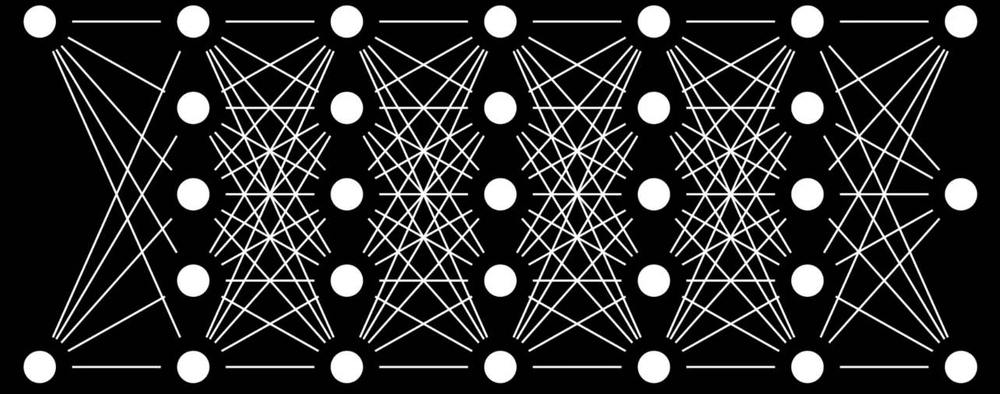

plus la machine est capable d'apprendre à réaliser des tâches complexes, comme reconnaître des objets, identifier une personne sur une photo, conduire une voiture, tout ce genre de choses...


Voilà donc pourquoi on parle d'apprentissage profond, c'est à dire de Deep Learning, lorsque l'on développe des réseaux de neurones artificiels. 

Donc, retenez bien qu'en fait le Deep Learning est un domaine du machine learning, qui repose sur les mêmes fondations que celui-ci, et que le machine learning est lui-même un domaine de l'intelligence artificielle. 

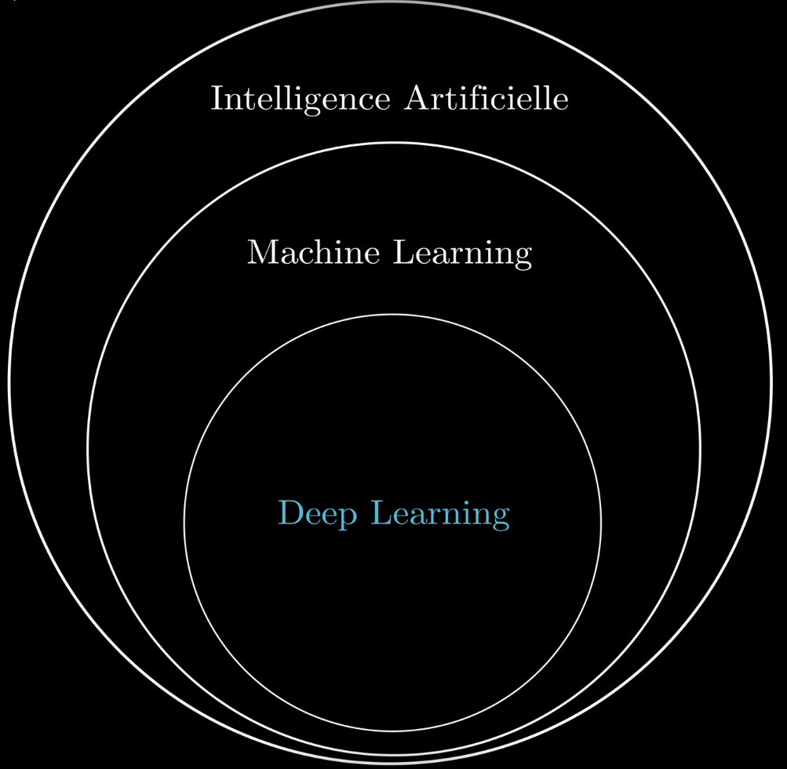

Voilà ! Maintenant qu'on a bien posé les bases, nous allons commencer notre voyage dans le monde des réseaux de neurones artificiels. 

### 1.2 L'histoire du Deep Learning ###

#### 1.2.1 Le Neurone Artificiel de McCulloch et Pitts ####

Pour bien comprendre le fonctionnement des réseaux de neurones artificiels, nous allons revenir à l'origine de leur histoire. Vous raconter comment ils ont été inventés et quelle furent leur évolution à travers le temps pour en arriver à la technologie que nous connaissons aujourd'hui. 

Cela va vous permettre de mieux comprendre et de mieux retenir leur fonctionnement, mais également d'enrichir votre culture générale avec quelques anecdotes intéressantes sur l'intelligence artificielle. 

Les premiers réseaux de neurones ont donc été inventés en 1943 par deux mathématiciens et neuroscientifiques du nom de *Warren McCulloch* et *Walter Pitts*. 

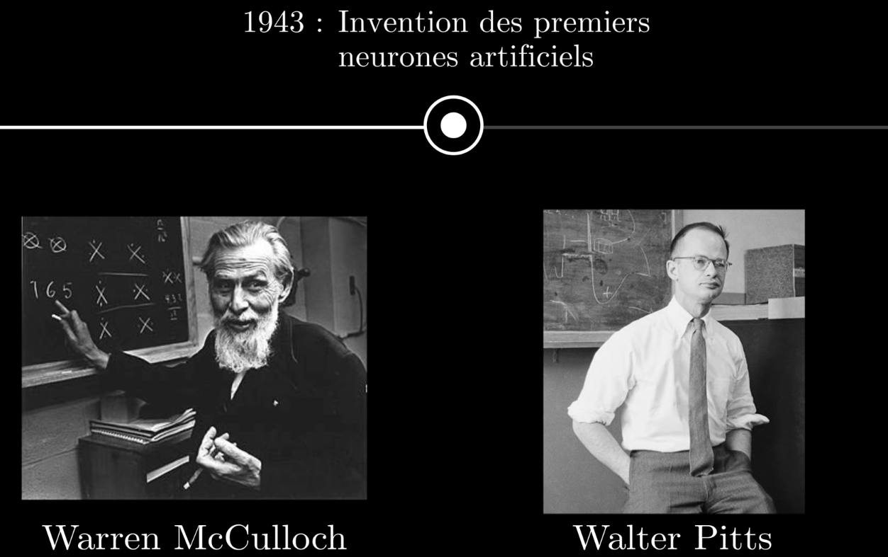

Dans leur article scientifique intitulé : "***A Logical Calculus of the ideas immanent in nervous activity***", ils expliquent comment ils ont pu programmer des neurones artificiels en s'inspirant du fonctionnement des neurones biologiques. 


Rappelons le, en biologie, les neurones sont des cellules excitables connectées les unes aux autres, et ayant pour rôle de transmettre des informations dans notre système nerveux. 

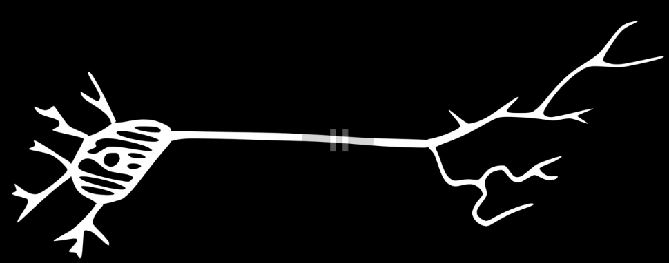

Chaque neurone est composé de plusieurs dendrites, d'un corps cellulaire, et d'un axone. 

Les dendrites sont en quelque sorte les portes d'entrée d'un neurone.  c'est à cet endroit, au niveau de la synapse, que le neurone reçoit des signaux lui provenant des neurones qui le précèdent. 

Ces signaux peuvent être de type excitateur ou à l'inverse inhibiteur. (un peu comme si nous avions des signaux qui valent +1 et d'autres qui valent -1). 

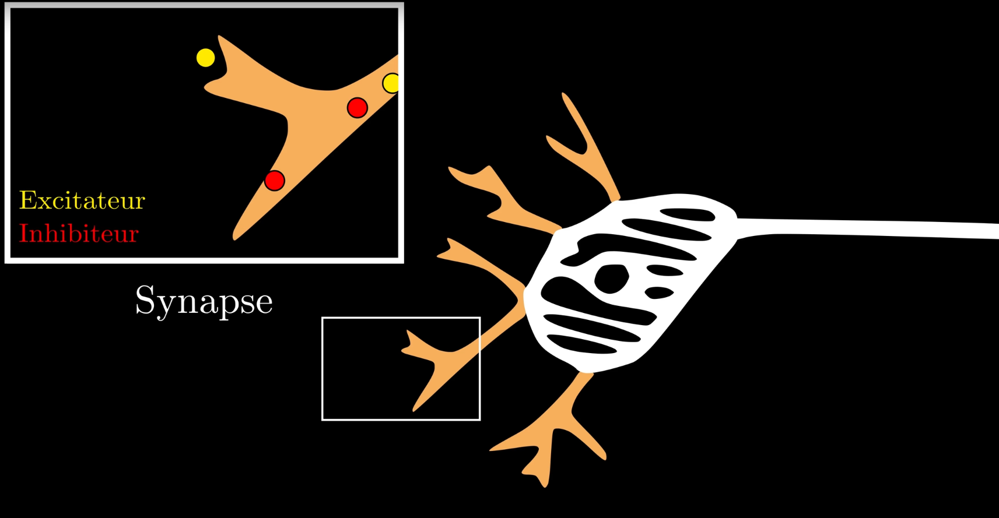

Lorsque la somme de ces signaux dépasse un certain seuil, le neurone s'active et produit alors un signal électrique. 

Ce signal circule le long de l'axone en direction des terminaisons pour être envoyé à son tour vers d'autres neurones de notre système nerveux... neurones qui fonctionneront exactement de la même manière ! 

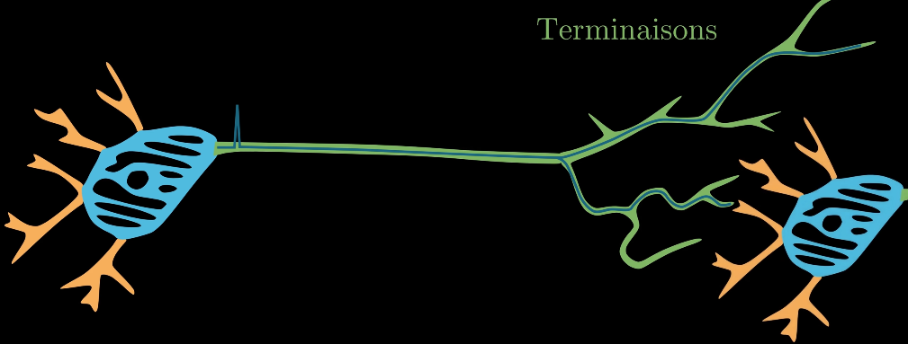

Voilà en gros, le fonctionnement des neurones.  

Ce que *Warren McCulloch* et *Walter Pitts* ont essayé de faire, c'est de modéliser ce fonctionnement, en considérant qu'un neurone pouvait être représenté par une fonction de transfert, qui prend en entrée des signaux $x$ et qui retourne une sortie $y$. 

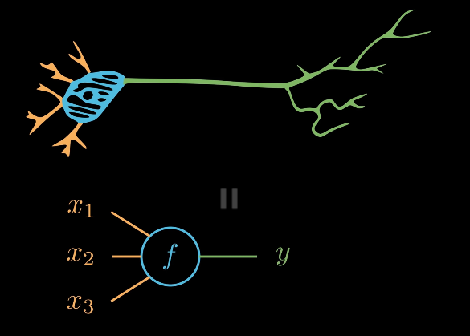

A l'intérieur de cette fonction, on trouve 2 grandes étapes.  

**La première, c'est une étape d'agrégation.** On fait la somme de toutes les entrées du neurone, en multipliant au passage chaque entrée par un coefficient $w$. ce coefficient représente en fait l'activité synaptique, c'est à dire le fait que le signal soit excitateur auquel cas $w$ vaut $+1$, ou bien inhibiteur auquel cas il vaut -1. 

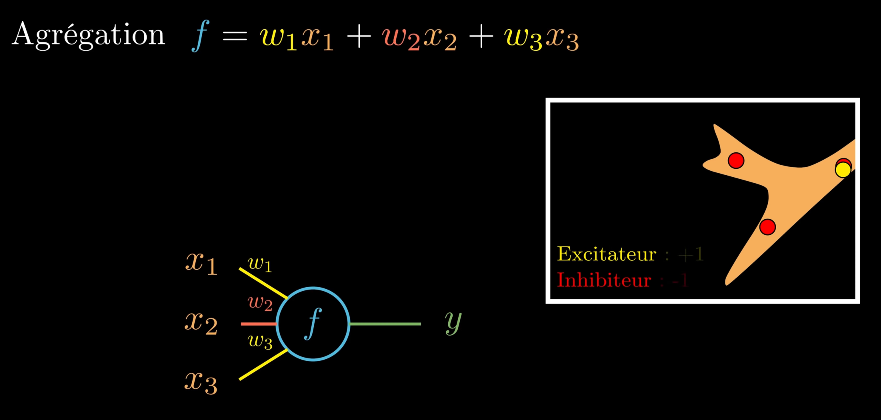

Dans cette phase d'agrégation, on obtient donc une expression de la forme $w_1 x_1 + w_2 x_2 + w_3 x_3$ etc... 

**Une fois cette étape réalisée, on passe à la phase d'activation.** On regarde le résultat du calcul effectué précédemment, et si celui ci dépasse un certain seuil, en général 0, alors le neurone s'active et retourne une sortie y = 1. Sinon, il reste à 0.

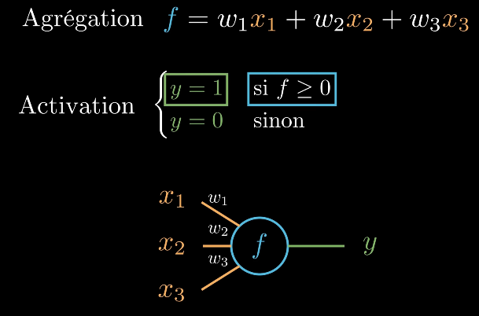 

Voilà donc comment *Warren McCulloch* et *Walter Pitts* ont réussi à développer les premiers neurones artificiels plus tard renommés "***Threshold Logic Unit***". Ce nom vient du fait qu'à l'origine, leur modèle n'était conçus que pour traiter des entrées logique qui valent soit 0 ou 1.  

Ils ont pu démontrer qu'avec ce modèle, il était possible de reproduire certaines fonctions logiques, telles que la porte AND et la porte OR. 

Ils ont également démontré qu'en connectant plusieurs de ses fonctions les unes aux autres, un petit peu à la manière des neurones de notre cerveau, alors il serait possible de résoudre n'importe quel problème de logique booléenne. 

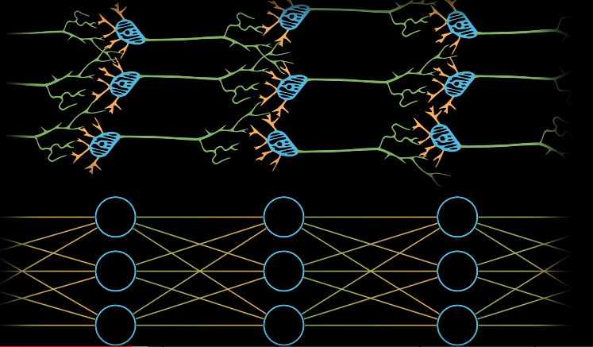

Forcément, suite à cette annonce il y eu un engouement démesuré pour l'intelligence artificielle. Certaines personnes pensaient même qu'en quelques années, nous serions capables de développer des intelligences artificielles capables de remplacer complètement les êtres humains ! Bien sûr, il n'en fut rien... car même si ce modèle pose les bases de ce qu'est encore aujourd'hui le Deep Learning, il contient un certain nombre de failles... notamment le fait qu'il ne dispose pas d'algorithme d'apprentissage, et qu'il faut donc trouver nous-mêmes les valeurs des paramètres $w$ si l'on désire s'en servir pour des applications du monde réel. 

#### 1.2.2  Le Perceptron de Frank Rosenblatt ####

Heureusement, une quinzaine d'années plus tard, en 1957, un psychologue américain trouva comment améliorer ce modèle, en proposant le premier algorithme d'apprentissage de l'histoire du Deep Learning. Ce monsieur, vous en avez peut-être déjà entendu parler... Il s'agit de *Franck Rosenblatt*, l'inventeur du ***Perceptron***.

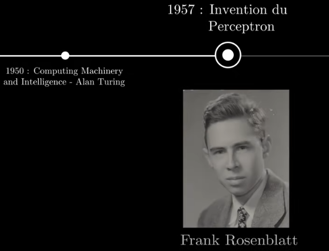 

 Le modèle du Perceptron ressemble en fait de très près à celui que nous venons d'étudier. Il s'agit d'un ***neurone artificiel, qui s'active lorsque la somme pondérée de ses entrées dépasse un certain seuil, en général 0***. 

Mais avec ça, le Perceptron ***dispose également d'un algorithme d'apprentissage*** lui permettant de trouver les valeurs de ses paramètres $w$ afin d'obtenir les sorties y qui nous conviennent. 

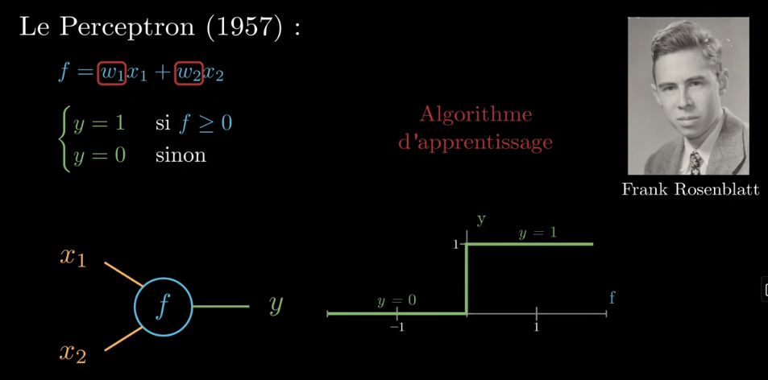

Pour développer cet algorithme, *Frank Rosenblatt* s'est inspiré de la théorie de *Hebb*. Cette théorie suggère que lorsque deux neurones biologiques sont excités conjointement, alors ils renforcent leurs liens synaptiques c'est-à-dire qu'ils renforcent les connexions qui les unissent. En neurosciences, c'est ce qu'on appelle la plasticité synaptique, et c'est ce qui permet à notre cerveau de construire sa mémoire, d'apprendre de nouvelles choses ou encore de faire de nouvelles associations. 

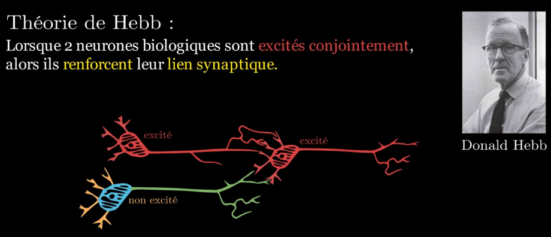

Donc, à partir de cette idée, *Frank Rosenblatt* a développé un algorithme d'apprentissage, qui consiste à entraîner un neurone artificiel sur des données de référence $(x, y)$ pour que celui ci renforce ses paramètres $w$ à chaque fois qu'une entrée $x$ est activé en même temps que la sortie y présente dans ces données. Pour ça, il a imaginé la formule suivante, dans laquelle les paramètres $w$ sont mis à jour en calculant la différence entre la sortie de référence et la sortie produite par le neurone, et en multipliant cette différence par la valeur de chaque entrée $x$,  ainsi que par un pas d'apprentissage positif. 


De cette manière, si notre neurone produit une sortie différente de celle qu'il est censé produire, par exemple s'il nous sort $y=0$, alors qu'on voudrait avoir $y=1$, alors notre formule nous donnera $w= w + \alpha\ X$. 

Donc, pour les entrées $X$ qui valent 1, le coefficient $w$ se verra augmenté d'un petit pas $\alpha$, il sera "renforcé" (pour reprendre les termes de la théorie de *Hebb*) ce qui provoquera une augmentation de la fonction $w_1 x_1 + w_2 x_2$ et qui rapprochera donc notre neurone de son seuil d'activation. 


Aussi longtemps que l'on sera en dessous de ce seuil, c'est à dire aussi longtemps que le neurone produira une mauvaise sortie, alors le coefficient $w$ continuera d'augmenter grâce à notre formule, jusqu'au moment où $y_{true}$ vaudra $y$... et à ce moment là notre formule donnera $w = w + 0$ ! Ce qui fait que nos paramètres arrêteront d'évoluer.

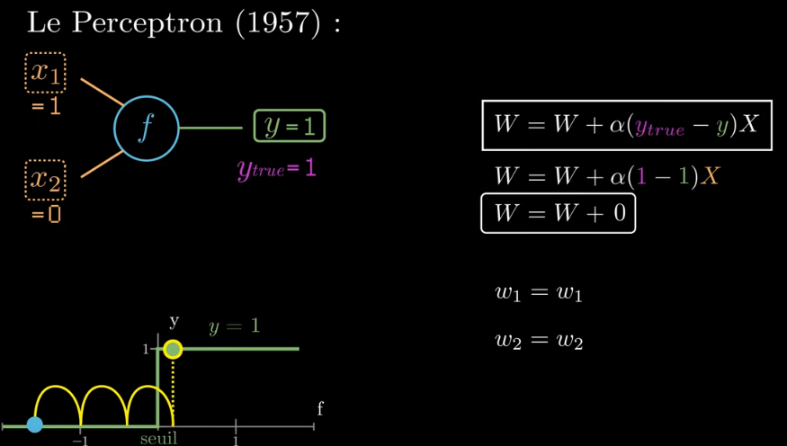 

Et voilà ! C'est ainsi que *Frank Rosenblatt* a développé le premier algorithme d'apprentissage de l'histoire du Deep Learning. 

Suite à cette invention, il y eut à nouveau un engouement démesuré pour l'intelligence artificielle. On pensait que grâce aux Perceptron, il serait possible de construire des machines capables de lire, de parler, de marcher, et même d'avoir une conscience ! Le truc de fou quoi ! Mais tout cet engouement s'effondra quelques années plus tard, lorsqu'on se rendit compte que ces promesses ne pourrait être tenues...en partie parce que le perceptron est un modèle linéaire (comme on le verra dans un instant). 

On connu alors le premier hiver de l'intelligence artificielle, de 1974 à 1980, période durant laquelle il n'y eu quasiment plus d'investisseurs pour financer les recherches en I.A. L'intelligence artificielle était sur le point de mourir... Heureusement, tout changea dans les années 80 lorsque *Geoffrey Hinton*, un des pères du Deep Learning, développa le Perceptron multicouches, ***le premier véritable réseau de neurones artificiels*** ! 

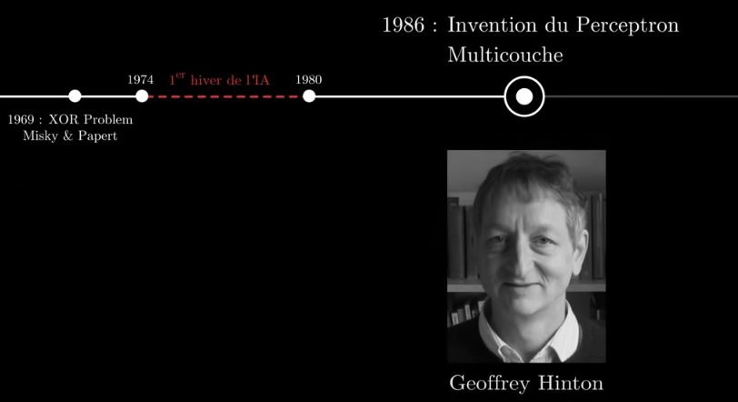

#### 1.2.3 Le Perceptron Multicouches de Geoffrey Hinton ####

Comme vu à l'instant, le Perceptron est en fait un modèle linéaire. En effet, si l'on trace la représentation graphique de sa fonction d'agrégation $f(x_1, x_2) = w_1x_1 + w_2x_2$ on obtient alors une droite, dont l'inclinaison dépend des paramètres $w$ et dont la position peut être modifiée à l'aide d'un petit paramètre complémentaire qu'on appelle le biais. 

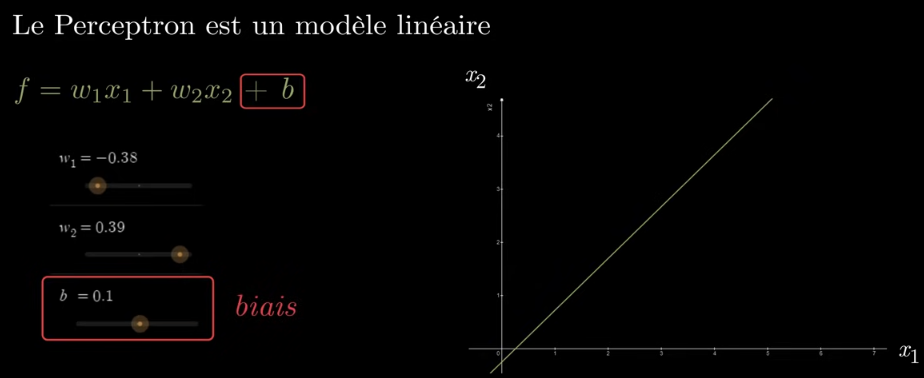

Avec cette droite on peut faire des choses géniales, comme par exemple séparer 2 classes de points, puisque grâce à notre fonction d'activation tout ce qui sera au dessus de cette droite donnera une sortie y = 1 et tout ce qui sera en dessous donnera y = 0. 

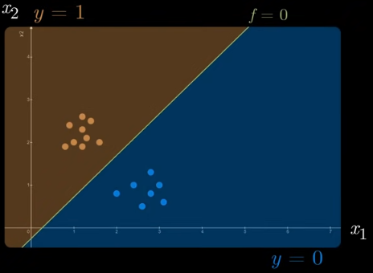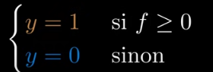

Le seul ennui, c'est qu'une grande partie des phénomènes de notre univers ne sont pas des phénomènes linéaires. Et dans ces conditions, le permettront à lui seul n'est pas très utile. 

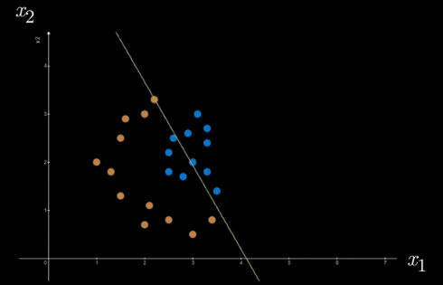

Mais rappelez-vous l'idée de *McCulloch* et *Pitts*, en connectant ensemble plusieurs neurones, il est possible de résoudre des problèmes plus complexes qu'avec un seul. Voyons donc ce qu'il se passe si l'on connecte par exemple ***3 Perceptrons ensemble***. 

Les 2 premiers reçoivent chacun les entrées $x_1$ et $x_2$. Ils font leur petit calcul, en fonction de leurs paramètres, et retournent une sortie y qu'ils envoient à leur tour vers le troisième Perceptron, qui va lui aussi faire ses petits calculs pour produire une sortie finale. 

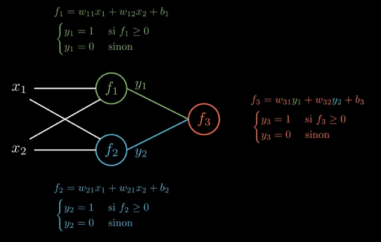

Eh bien si l'on trace la représentation graphique de la sortie finale en fonction des entrées $x_1\ et\ x_2$, on obtient cette fois ci un modèle non linéaire qui est bien plus intéressant. avec cet exemple, vous avez là votre premier réseau de neurones artificiels.

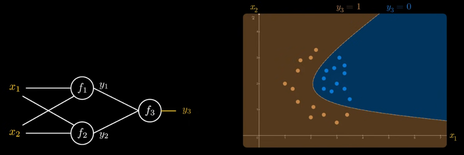 

***3 neurones, répartis en 2 couches (une couche d'entrée et une couche de sortie) c'est ce qu'on appelle un Perceptron Multicouches.*** 

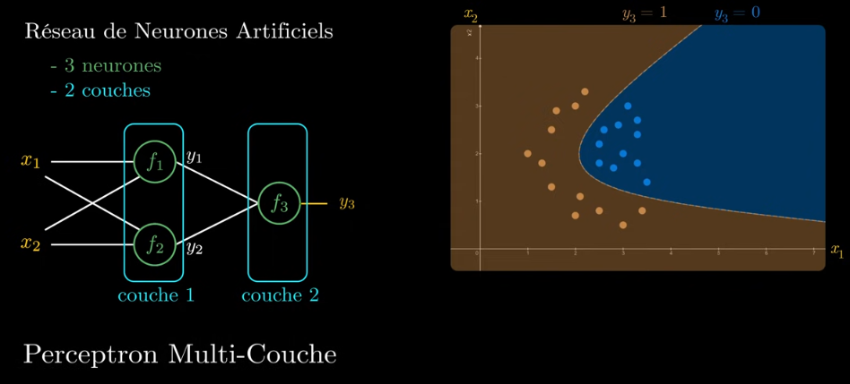

Et des couches et des neurones, vous pouvez en rajouter autant que vous voulez ! Vous pouvez en mettre 2, 3, 4, 10 pourquoi pas même 100 ! Plus vous en remettrez, plus le résultat à la sortie sera complexe et intéressant. 

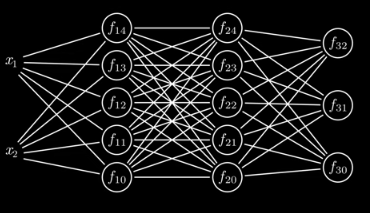

Cependant, une question subsiste... Comment entraîner un tel réseau de neurones pour qu'il fasse ce qu'on lui demande de faire ? C'est à dire, comment trouver les valeurs de tous les paramètres w et b de façon à obtenir un bon modèle ? 

Eh bien, la solution est d'utiliser une technique appelée ***Back Propagation***, qui consiste à déterminer comment la sortie du réseau varie en fonction des paramètres présents dans chaque couche du modèle. Pour ça, on calcule une chaîne de gradients, indiquant comment la sortie varie en fonction de la dernière couche, puis comment la dernière couche varie en fonction de l'avant dernière, puis comment l'avant dernière varie en fonction de l'avant avant dernière etc...jusqu'à arriver à la toute première couche de notre réseau.

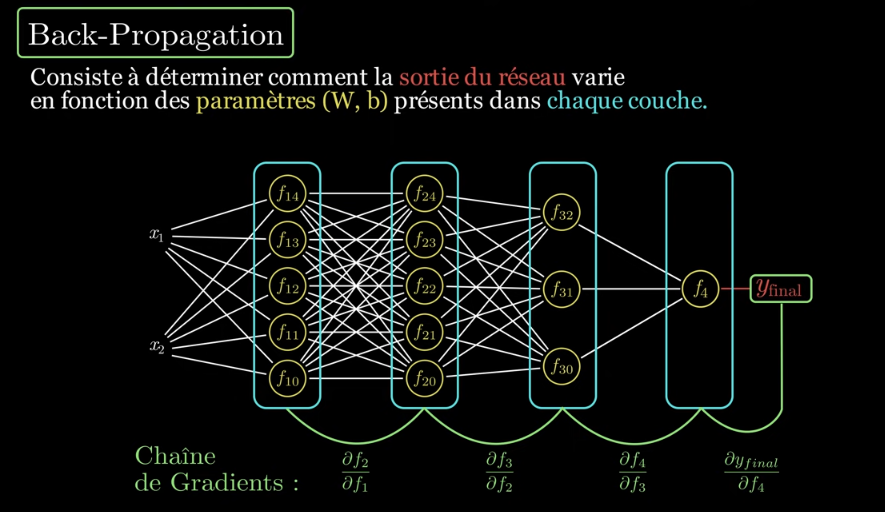 

C'est une Back Propagation : une propagation vers l'arrière ! Avec ces informations, ces gradients, on peut alors mettre à jour les paramètres de chaque couche, de telle sorte à ce qu'ils minimisent l'erreur entre la sortie du modèle et la réponse attendue (la fameuse valeur $y_{true}$) 

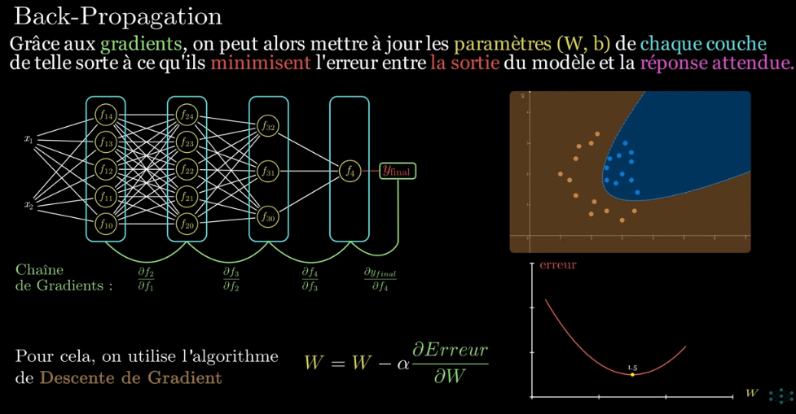

Et pour ça, on utilise une formule très proche de celle de *Frank Rosenblatt*, c'est la formule de la descente de Gradient, dont nous parlerons plus en détail dans les prochaines leçons. 

En résumé, pour développer et entraîner des réseaux de neurones artificiels, on répète en boucle les quatre étapes suivantes : 

1. ***La première étape***, c'est l'étape de ***Forward Propagation*** : on fait circuler les données de la première couche jusqu'à la dernière, afin de produire une sortie $y$. 
2. ***La deuxième étape***, c'est de ***calculer l'erreur entre cette sortie et la sortie de référence*** $y_{true}$ que l'on désire avoir. Pour ça on utilise ce qu'on appelle ***une fonction Coût*** (cost function en anglais). 
3. Ensuite, la troisième étape, c'est celle de la ***Back Propagation*** : on mesure comment cette fonction coût varie par rapport à chaque couche de notre modèle, en partant de la dernière et en remontant jusqu'à la toute première. 
4. Pour finir, ***la quatrième et dernière étape***, c'est de ***corriger chaque paramètre du modèle grâce à l'algorithme de la descente de gradient***, avant de re-boucler vers la première étape, celle de la ***Forward Propagation***, pour recommencer un cycle d'entraînement. 

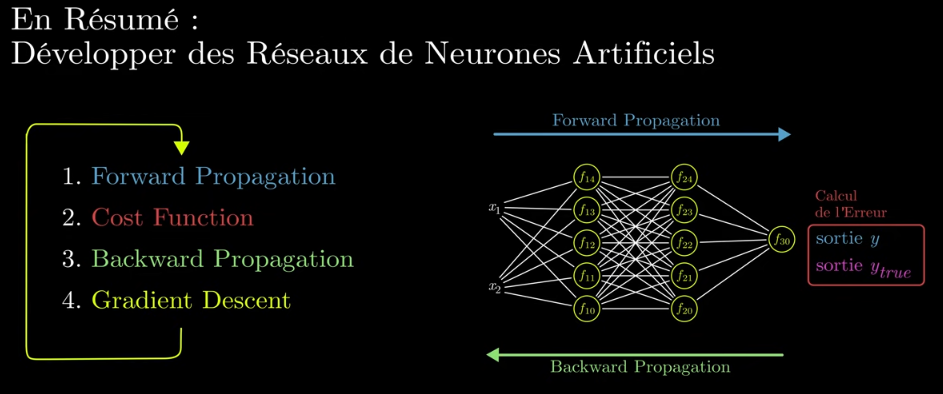

Nous comprenons que ça peut faire beaucoup d'informations vu comme ça, mais surtout ne vous en faites pas...on va vraiment voir tout ça en détail bien calmement dans les prochaines leçons.  

#### 1.2.4 Le Deep Learning Moderne ####

Au fil du temps, le modèle du Perceptron multicouches continua d'évoluer, notamment avec l'apparition de nouvelles fonctions d'activation, telles que la ***fonction logistique***, la ***fonction tangente hyperbolique***, ou encore ***la fonction*** $ReLU$. 

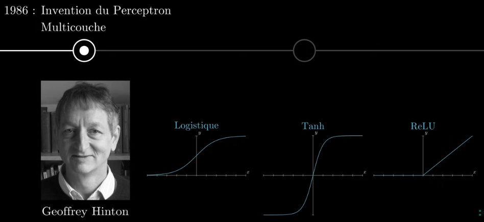

Ces fonctions ont aujourd'hui totalement remplacé ***la fonction Heaviside*** 

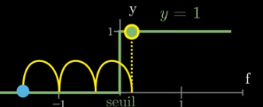

que l'on a vu jusqu'à présent, car elles offrent en fait de bien meilleures performances. 

Dans les années 90, on a commencé à développer les premières variantes du **Perceptron multicouches**. Le célèbre *Yann LeCun* inventa les premiers réseaux de neurones Convolutifs, réseaux qui sont capables de reconnaître et de traiter des images, en introduisant au début de ces réseaux des filtres mathématiques qu'on appelle ***Convolution*** et ***Pooling***. On en parlera plus tard dans cette formation.

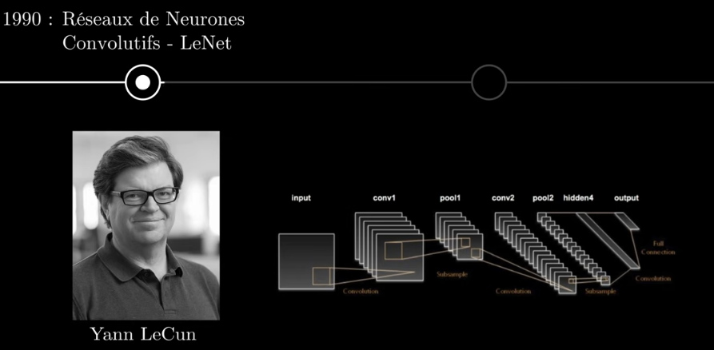 

C'est également durant ces années que l'on a vu apparaître l***es premiers réseaux de neurones récurrents***, qui sont encore une fois une variante du Perceptron multicouches et qui permettent de ***traiter efficacement des problèmes de séries temporelles comme la lecture de textes ou encore la reconnaissance vocale***. 

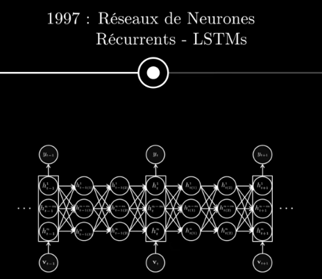

Alors vous allez peut-être vous demandez : "Mais si tout ça existait déjà dans les années 90, pourquoi avoir attendu aussi longtemps avant de voir émerger les technologies que l'on a aujourd'hui ?" Eh bien il y a deux grandes raisons à cela. 

***La première, c'est que pour bien fonctionner, un réseau de neurones doit être entraîné sur une très grosse quantité de données***, dépassant parfois les millions voir les dizaines de millions de données. 

Or dans les années 90, on ne disposait pas d'autant de données... On n'avait pas des millions voire des dizaines de millions de photos de chiens, de chats, de voitures, de piétons toutes bien classées et bien répertoriées... Non. 

Il a fallu attendre l'arrivée d'internet, des smartphones, et des objets connectés pour commencer à collecter de grosses quantités de données, d'image et de son pouvant être exploitées pour le Deep Learning 

***Maintenant, la deuxième raison pour laquelle il a fallu attendre si longtemps avant de pouvoir réellement utiliser des réseaux de neurones, c'est parce que la puissance des ordinateurs des années 80 à 90 ne le permettaient tout simplement pas.*** 

Et oui parce qu'on le verra dans cette série de leçons, entraîner un réseau de neurones, ça demande pas mal de temps et pas mal de puissance. Et il a fallu attendre qu'on dispose d'excellents CPU et GPU pour enfin obtenir de bons résultats. 

En fait, le Deep Learning n'a réellement pris son envol qu'en 2012, lors d'une compétition de vision par ordinateur nommée ***ImageNet***, où une équipe de chercheurs menée par Geoffrey Hinton, développa un réseau de neurones, capable de reconnaître n'importe quelle image avec une meilleure performance que tous les autres algorithmes de l'époque.

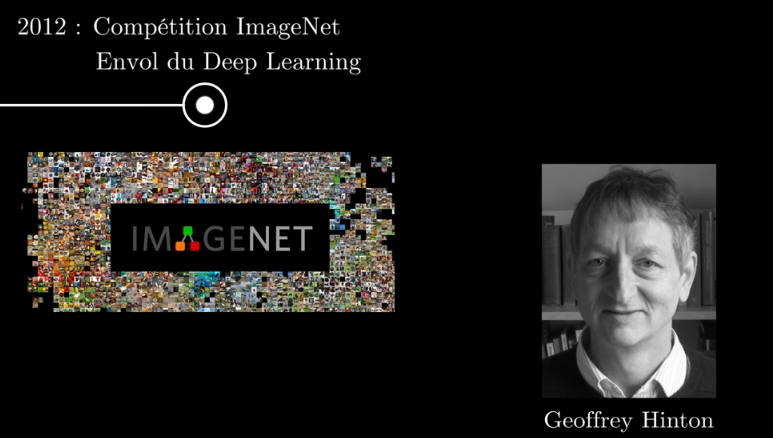 

Depuis ce jour, tout le monde ne parle plus que de machine learning et de Deep Learning. On vante sans arrêt les mérites de cette technologies...en allant même parfois un peu trop loin ! 

Par exemple quand on dit que ***"les réseaux de neurones ça fonctionne comme le cerveau humain"... eh bien non c'est complètement faux*** ! Aujourd'hui, on sait pertinemment que ***le cerveau humain est beaucoup plus complexe et beaucoup plus sophistiqué que le modèle du Perceptron ou le Perceptron Multicouches***. 

Et comme le dit *Yann LeCun*, ***comparer un réseau de neurones à un cerveau humain, c'est un petit peu comme comparer un avion à un oiseau***... On s'est peut être inspiré de ce qu'on a vu dans la nature au tout début pour faire les premiers croquis, mais c'est pas pour autant que les avions volent en battant des ailes ! 

Non, derrière tout ça, ce sont des mathématiques, de l'algèbre linéaire, du calcul différentiel... toute une mécanique bien huilée qu'on va justement découvrir ensemble dans cette formation. 

Site internet : www.machinelearnia.com

## Leçon 2 : Le Perceptron ##

Nous allons parler du Perceptron, le modèle qu'on retrouve à la base des réseaux de neurones. Nous allons voir ces formules mathématiques la, **fonction coût LogLoss** ainsi que l'algorithme de la descente de gradient 

### 2.1 Le Perceptron  ###

Le Perceptron est l'unité de base des réseaux de neurones, il s'agit d'un modèle de classification binaire capable de séparer linéairement deux classes de points. 

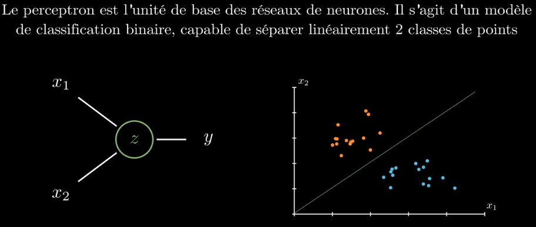

Prenons un exemple. Imaginez que l'on ait deux types de plantes. Des plantes toxiques que l'on note $y$ égal 1 et d'autres non toxique que l'on note $y$ égal à zéro. 

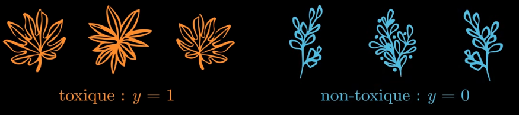

Un jour on décide de mesurer certains attributs de ces plantes, telles que la longueur et la largeur de leurs feuilles que l'on note $x_1$ et $x_2$. 

En représentant les résultats dans un graphique, on observe que les deux classes de plantes sont linéairement séparables. 

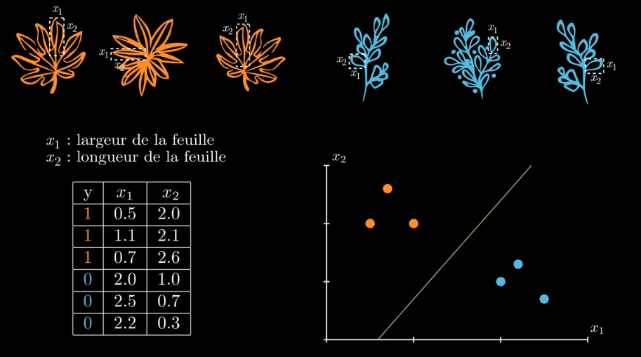

On peut donc développé un modèle capable de prédire à quelle classe appartient une future plantes en se basant sur cette droite qu'on appelle la frontière de décision. Si une plante se trouve à gauche, elle sera considérée comme toxique appartenant à la classe $y$ égal 1 et sinon elle sera considérée comme non toxique appartenant à la classe $y$ égal zéro. 

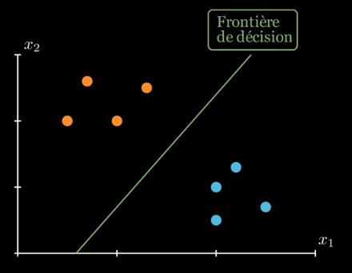

Pour développer ce modèle, il va donc nous falloir trouver qu'elle est l'équation de cette droite. 

Pour ça, on va développer ce qu'on appelle un modèle linéaire en fournissant aux variables $x_1$ et $x_2$ à un neurone et en multipliant au passage chaque entrée du neurone par un poids $w$. 

Dans ce neurones, on va également faire passer un coefficient complémentaires, qu'on appelle le biais, qui nous donne une fonction $z (x_1, x_2)=w_1 x_1 + w_2 x_2 + b$. 

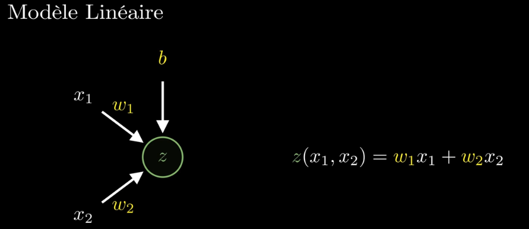

De retour sur notre graphique, on peut colorer les régions où cette fonction nous retourne une valeur positive et celle où elle nous retourne une valeur négative. 

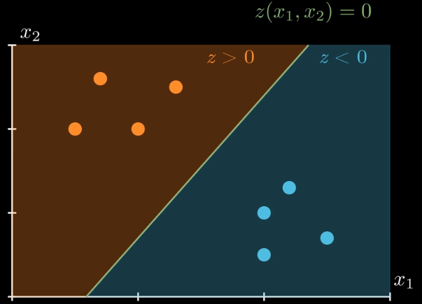

On constate alors que la frontière de décision correspond aux valeurs de $x_1$ et $x_2$ pour lesquels $z$ est égal à zéro.Voilà, on a donc l'équation de notre frontière de décision. 

Du coût, on pourra prédire à quelle classe appartient une future plantes. Il va falloir régler les paramètres $w$ et $b$ de façon à séparer du mieux possible nos deux classes. 

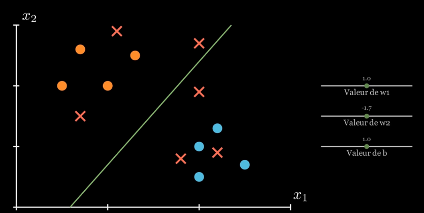

Après quoi, on pourra dire si une plante et dans la classe 0 ou 1, en regardant simplement le signe de $z$.

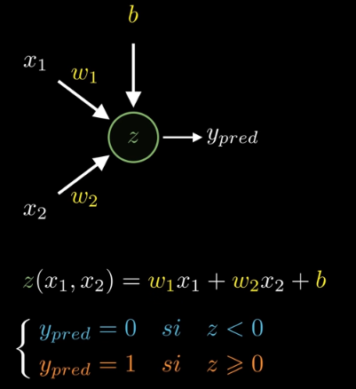

Si $z$ est négatifs, alors la plante sera dans la classe zéro et six $z$ est positif elle sera dans la classe 1. 

Voilà c'est ainsi que fonctionne le Perceptron, le premier neurone de l'histoire du Deep Learning.

### 2.2 La fonction Sigmoïde  ###

Maintenant, pour améliorer ce modèle, une bonne chose à faire ça serait d'accompagner chaque prédiction d'une probabilité. 

Plus une plante sera éloignée de la frontière de décision, plus il sera évident c'est à dire probable qu'elles appartiennent bien à sa classe. 

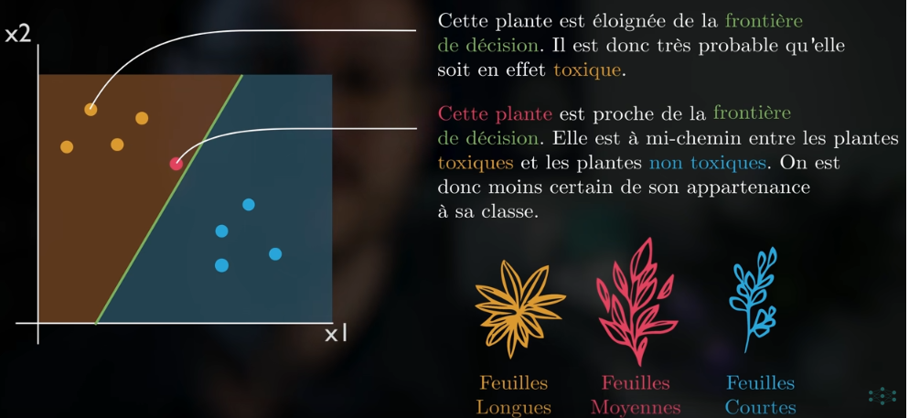

Pour ça, on pourrait utiliser ***une fonction d'activation*** nous retournant une sortie qui s'approchent de zéro ou un au fur et à mesure que l'on s'éloigne de la frontière de décision, là où $z$ est égal à zéro. 

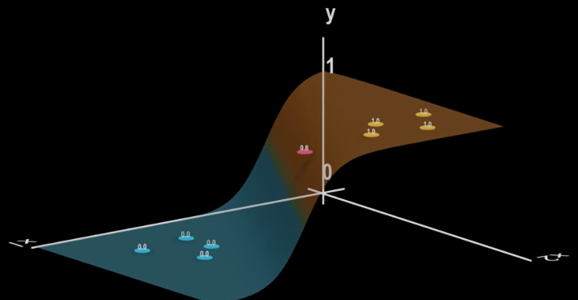

Cette fonction qui nous permet de faire ça, c'est ***la fonction sigmoïde également appelé fonctions logistiques*** dont l'expression est $a(z)=\frac{1}{1+e^{-z}}$

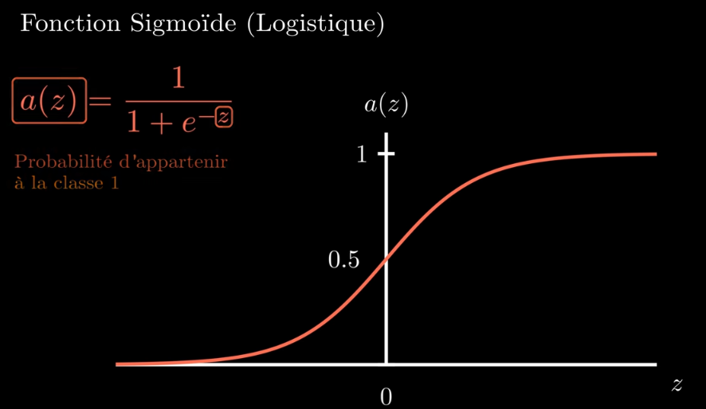

Cette fonction permet de convertir la sortie $z$ en une probabilité $a(z)$, celle qu'une plante appartiennent à la classe 1. 

Par exemple si nous avons une plante dont la valeur $z$ est égale à 1,4, alors cela donne une probabilité $a(z)= 0,8$. 

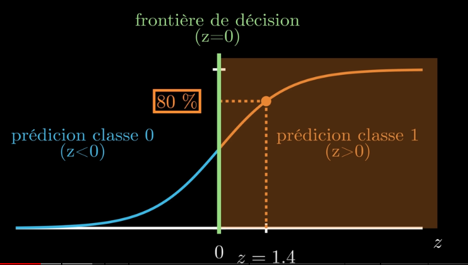

Ce qui signifie que d'après notre modèle, cette plante à 80% de chance d'appartenir à la classe 1. C'est une probabilité relativement élevé, ce qui est logique vu que cette plante se situe à droite de la frontière de décision, là où nous sommes censés obtenir des plantes toxiques. 

A l'inverse si nous avons une plante dont la valeur de $z$ est égal à -2,1, alors cela donne une probabilité $a(z)= 0,1$. 

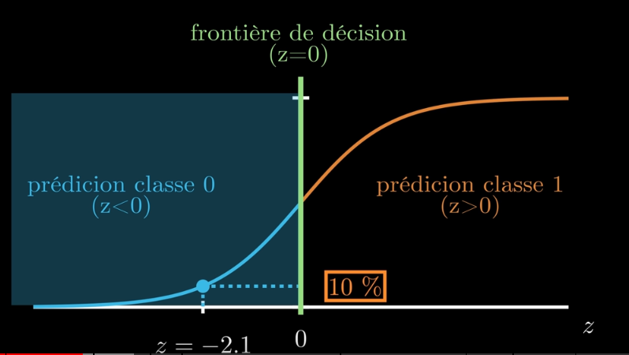

Ce qui signifie que d'après notre modèle, cette plante à seulement 10% de chance d'appartenir à la classe 1. C'est une probabilité bien plus faible que tout à l'heure, mais encore une fois ça reste tout à fait logique vu que cette plante se situe à gauche de la frontière de décision, là où nous ne sommes pas censés obtenir de plantes toxiques mais uniquement des plantes appartenant à la classe zéro. 

Du coût, on pourra dire à la place que cette plante aura 90 % de chances d'être non toxiques soit la probabilité complémentaires à celles que nous avons calculé. 

### 2.3 La Loi de Bernoulli ###

Ces probabilités suivent en fait une loi de Bernoulli. 

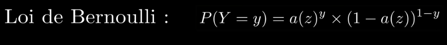

C'est à dire que la probabilité qu'une plante appartiennent à la classe 1 est donné par $a(z)$ et la probabilité qu'une plante appartiennent à la classe zéro est donnée par $1-a(z)$ 

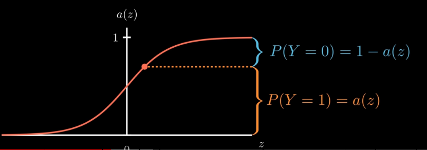


Le tout peut être résumée en une seule formule, elle peut sembler un petit peu intimidante vu comme ça, mais en fait elle est très simple à comprendre. Il suffit de décomposer les deux cas, celui où $y$ est égal à 1 et celui où $y$ est égal à zéro 

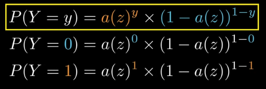

et alors on voit qu'on retombe tout simplement sur les deux expressions de tout à l'heure. 

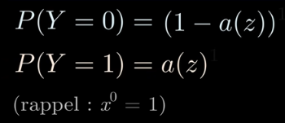

Donc pour résumer, tout ce qu'on vient de voir, ce qu'on trouve à l'intérieur des neurones, 

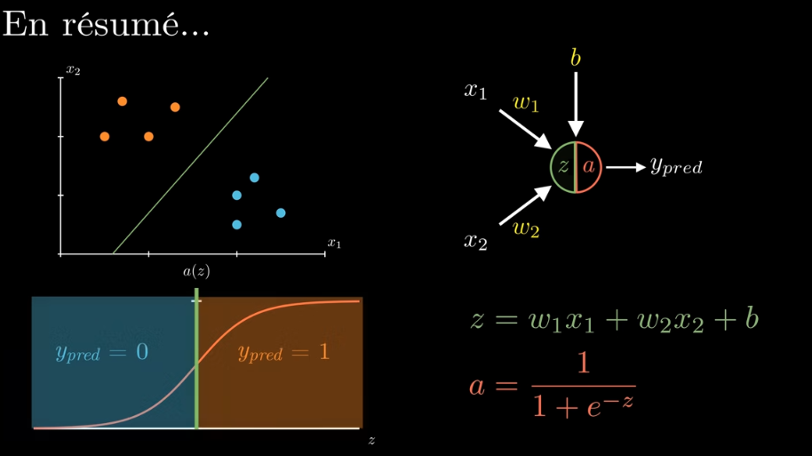

c'est une fonction linéaire $z=w_1 x_1 + w_2 x_2 + b$ suivie d'une fonction d'activation. La plus simple étant la fonction sigmoïde qui nous retourne une probabilité suivant une loi de Bernoulli. 

Maintenant notre but ça va être de régler les paramètres $w$ et $b$, de façon à obtenir le meilleur modèle possible, 

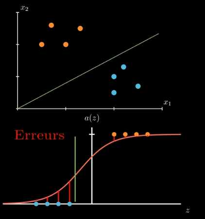

c'est à dire le modèle qui fait les plus petites erreurs entre les sorties $a(z)$ et les vraies données $y$. Et pour ça on va commencer par ***définir une fonction coût qui va permettre de mesurer ses erreurs.*** 

### 2.4 La Fonction Coût  ###

***La fonction coût en machine learning ou Loss function*** en anglais, c'est une fonction qui permet de quantifier les erreurs effectuées par un modèle. 

Dans notre cas, c'est donc une fonction qui permet de mesurer les distances que l'on voit ici en rouge entre les sorties $a(z)$ et les données $y$ dont nous disposons. 

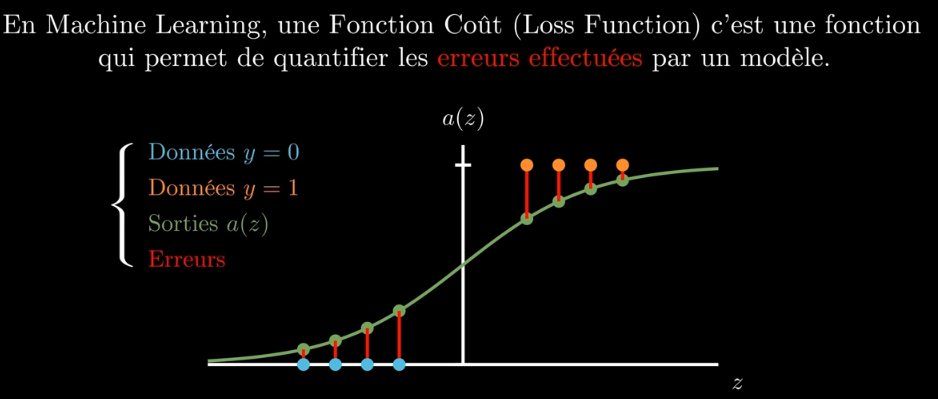

Pour ça, la fonction coût que l'on va utiliser, c'est ***la fonction de Log Loss***. 

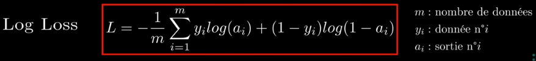

Certains d'entre vous la connaissent peut être déjà, mais ce que j'ai envie de faire dans cette leçon, ainsi que dans toutes les autres leçons de cette série, c'est de vous expliquer l'origine mathématiques de cette fonction. Et vous allez voir, c'est à la fois très simple et très satisfaisant à comprendre. 

### 2.5 Maximum de Vraisemblance ###

Une façon d'évaluer la performance de notre modèle, c'est de calculer sa vraisemblance. En statistiques, la vraisemblance ça nous indique la plausibilité de notre modèle vis-à-vis de données que l'on considère comme vrai. Un peu comme quand on dit qu'une histoire est vraisemblable vis-à-vis de fait qui se sont vraiment déroulé. Par exemple, si Sherlock Holmes a interrogé un suspect qui prétend avoir été à l'opéra le soir du crime, alors qu'en réalité le spectacle d'opéra n'a pas eu lieu et bien alors son histoire n'est pas vraisemblable vis-à-vis des faits que l'on connaît. 

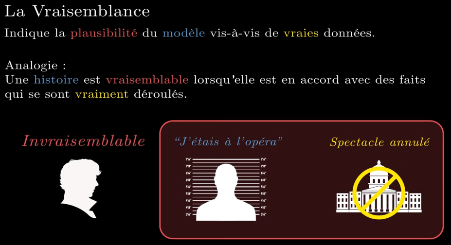

Et bien, ici, c'est la même chose, nous connaissons certaines plantes comme étant toxiques et d'autres comme étant non toxique et on va voir si les prédictions du modèle sont en accord avec ces données. 

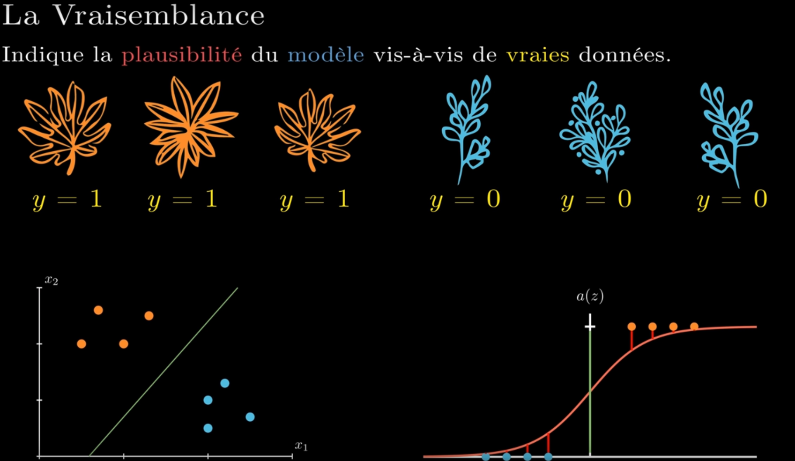

Par exemple, si une plante est toxique et que le modèle nous retourne une probabilité toxiques égal à 80% alors il est lui même vraisemblable à 80%.

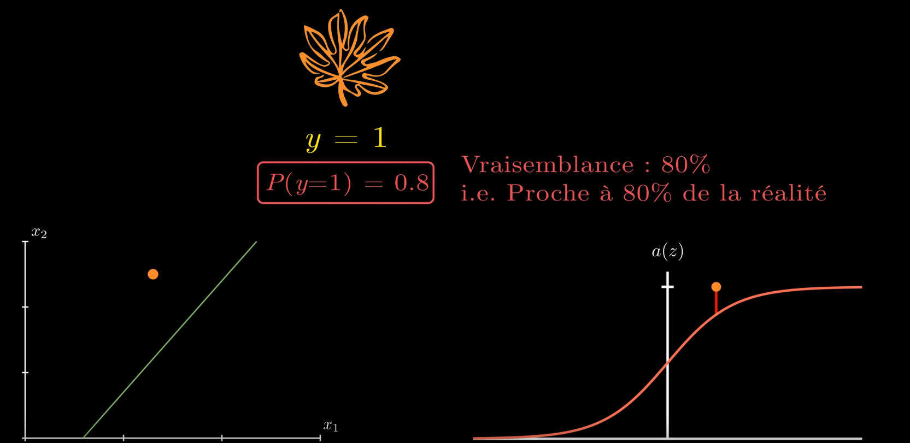

Donc vous l'aurez compris, pour calculer la vraisemblance de notre modèle, on va tout simplement faire le produit de toutes ces probabilités en utilisant la loi de Bernoulli qu'on a vu tout à l'heure. Cela nous donne la formule suivante : $L$, pour ***Likelihood*** c'est à dire ***vraisemblance***, est égal au produit de toutes les données allant de 1 à $m$ de nos probabilités retournées pour ces données.

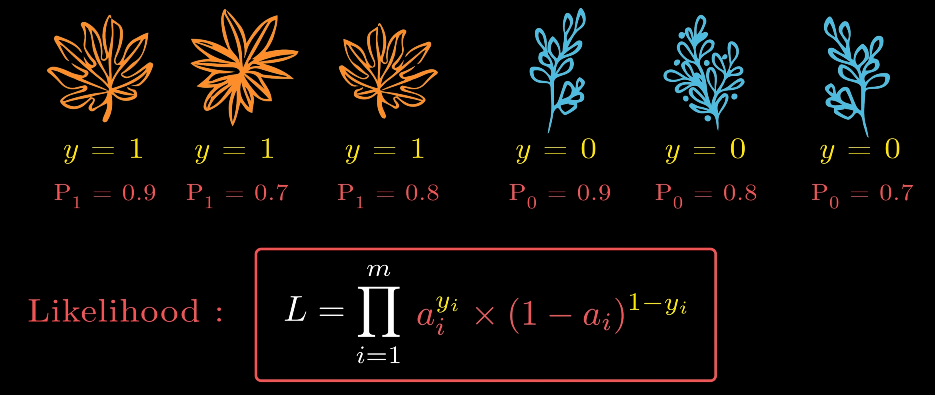

Si le résultat de ce calcul est proche de 100%, ça signifiera que notre modèle est vraisemblable à 100% puisqu'il est en accord parfait avec les données que l'on considère comme vrai. 

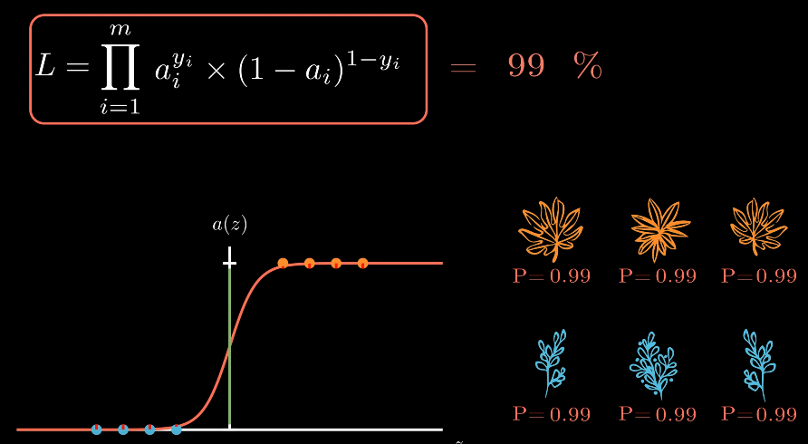

A l'inverse si le résultat est proche de 0%, ça signifiera que notre modèle est fortement invraisemblable. Il aura une chance d'exister mais si c'est le cas ça signifierait alors que toutes les données dont nous disposons serait en réalité fausse, ce qui serait pour le coût très improbable. 

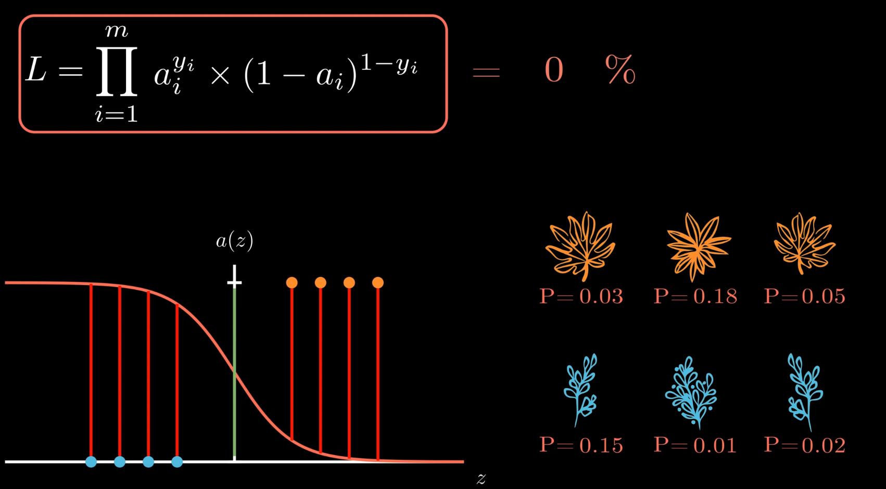

Donc, nous allons calculer la vraisemblance du modèle que l'on a ici. 

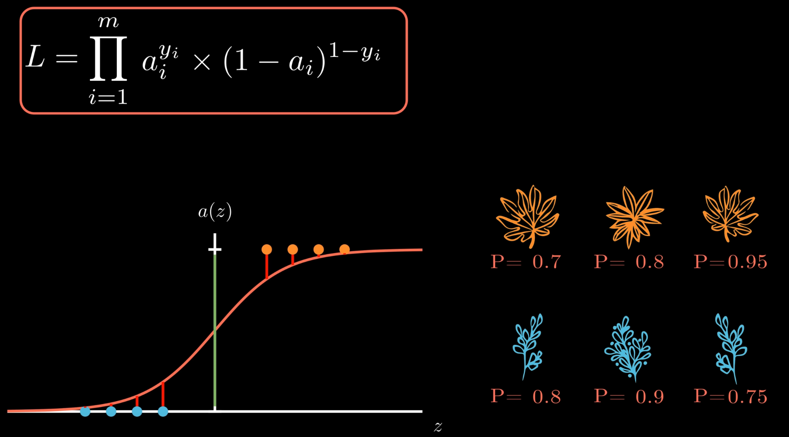

Alors là pour le coût notre modèle colle plutôt bien aux données. Donc, on s'attend à avoir un bon score, une vraisemblance proche de 100%. La plupart des probabilités est en elle-même proche de 100%. 

Sauf qu'en effectuant notre calcul, on se rend compte qu'on tombe sur un résultat proche de zéro. 

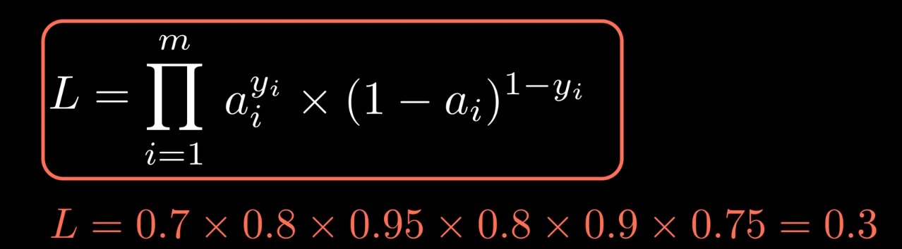

Alors comment ça se fait? Et bien, c'est le petit problème avec la vraisemblance. Comme en effectue un produit de probabilité, c'est à dire un produit de nombre qui sont tous compris entre 0 et 1, cela fait que plus on a de nombreux, plus le résultat tend vers zéro. 

Alors dans cette situation, ça ne cause pas vraiment de problème mais dans la pratique lorsqu'on voudra calculer la vraisemblance sur des milliers, voire des dizaines de milliers de points, ça risque de nous donner un résultat tellement proches de zéro que la mémoire de notre ordinateur n'arrivera même plus à stocker ce nombre. 

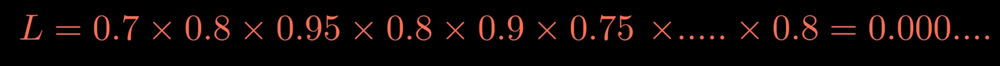

Et là, ça devient un très gros problème. Donc, ce qu'on va devoir faire c'est de trouver une astuce pour calculer cette vraisemblance sans pour autant converger vers zéro. Et cette astuce, c'est d'utiliser une fonction logarithme. 

Car rappelez-vous le logarithme d'un produit ça nous donne la somme des logarithme. 


Donc, si on applique un logarithme à notre fonction vraisemblance alors on arrête de calculer le produit de nombre qui sont tous inférieurs à 1 et à la place on fait des additions. C'est quand même bien plus pratique et vous voyez que le résultat est un nombre plus lisible. 

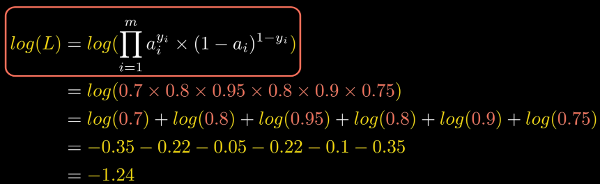

Cependant, vous allez peut-être vous dire que le fait d'utiliser ce logarithme déforme tout à notre calcul et que celui ci ne veut plus rien dire. 

Et bien rassurez vous, ça n'est pas le cas car comme la fonction logarithme est une fonction monotone croissante, elle conserve l'ordre de nos termes.

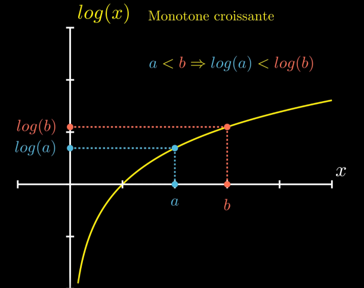 

Ca signifie que lorsqu on cherchera le maximum de notre vraisemblance, il nous suffira de chercher le maximum du log de la vraisemblance. Et comme vous le voyez sur ce graphique, ça nous retournera le même résultat. 

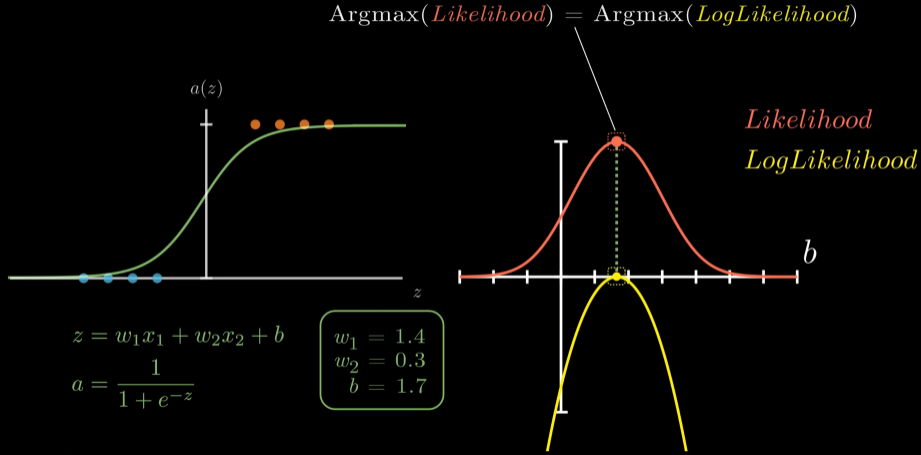

Donc il n'ya pas de problème, on peut utiliser le log de la vraisemblance pour poursuivre nos calculs. 

### 2.6 Démonstration : Le LogLoss ###

Alors c'est parti, on va voir ce que ça nous donne si on développe tout ça. Donc on va écrire $LL$ pour $Log\ Likelihood$ qui est égale au logarithme du produit pour toutes les données allant de 1 à $m$ des probabilités qui sont retournés par ces données. 

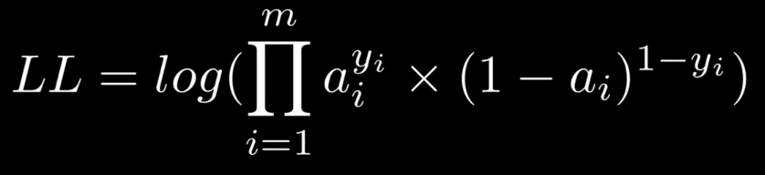

Alors cette formule on peut la simplifier car le logarithme d'un produit ça nous donne la somme des logarithme. 

Ici donc on a un logarithme avec un produit de tout plein de probabilités et on peut donc le transformer en écrivant que c'est égal à la somme des logarithme de toutes nos probabilités pour les données allant de 1 à $m$ 

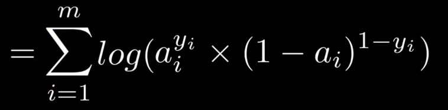

Encore une fois, là on peut effectuer une simplification puisqu'on voit que dans ce logarithme, on retrouve un produit. Le produit de $a$ puissance $y$  par $1-a$ puissance $1 - y$. Ce qui nous donne la somme pour toutes les données allant de 1 à $m$ du logarithme de $a$ puissance $y$  + le logarithme de $1 - a$ puissance $1 - y$. 


Cette expression on peut encore une fois la simplifier en utilisant une dernière propriété des logarithme.

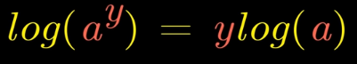

Donc on va pouvoir faire sortir tous les exposants de nos logarithme, ce qui va nous donner 

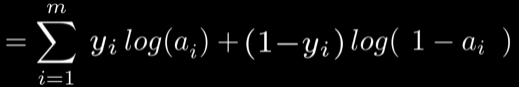

Alors maintenant, est ce que cette expression vous fait penser à quelque chose, genre quelque chose qu'on a vu au début de ce chapitre? Et bien, si vous répondez ***la fonction LogLoss***, vous avez raison. 

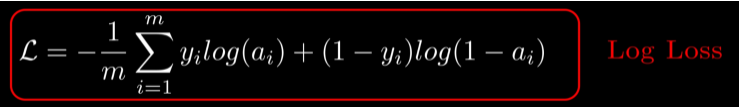

Cette fonction ressemble en effet de très près à notre fonction coût. Celle qu'on cherche à avoir. La seule différence, c'est qu'il manque le petit facteur $\frac{-1}{m}$ au début. Mais ça c'est tout à fait normal. Ce qu'on a fait jusqu'à présent, c'était de ***calculer le log de la vraisemblance*** et  une vraisemblance on cherche à la maximiser pour avoir le meilleur modèle possible, le modèle le plus vraisemblable. Or en mathématiques, les algorithmes de maximisation ça n'existe pas vraiment et à la place on utilise en général des algorithmes de minimisation. Mais ça n'est pas un problème car pour **maximiser une fonction** $f(x)$ ça revient à **minimiser la fonction** $- f(x)$. 

C'est pourquoi pour maximiser la vraisemblance de notre modèle, on va en fait cherché à minimiser sa fonction négative d'où la présence d'un facteur moins un au début de cette expression. 

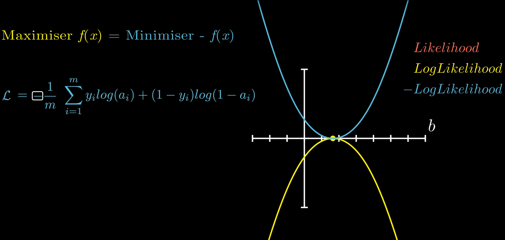

Maintenant concernant le facteur $\frac{1}{m}$ que l'on retrouve au début de la fonction LogLoss,  c'est juste un petit facteur pour normaliser notre résultat. Rien de plus. 

***Et voilà, la fonction coût LogLoss vient d'un raisonnement mathématique très simple, celui de vouloir maximiser la vraisemblance de notre modèle.*** 

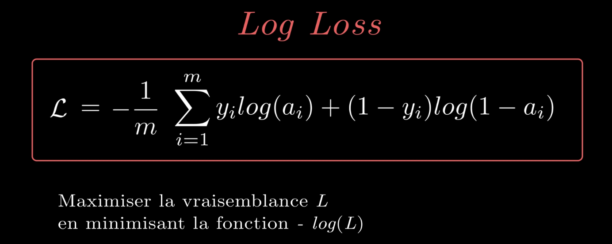

Maintenant qu'on dispose notre fonction coût, on va pouvoir s'en servir pour minimiser les erreurs de notre modèle. Et pour ça on va utiliser **l'algorithme de la descente de gradient**. 

### 2.7 La descente de gradient  ###

***La descente de gradient*** est l'un des algorithmes d'apprentissage les plus utilisés en machine learning et en Deep Learning. Il consiste à ajuster les paramètres $w$ et $b$ de façon à minimiser les erreurs du modèle c'est à dire à minimiser la fonction coût. 

Pour ça, il faut déterminer comment cette fonction varie en fonction des différents paramètres. Est-ce que la fonction diminue lorsque un des paramètres $w$ augmenter ou l'inverse. Et bien pour répondre à cette question, on doit calculer ce qu'on appelle un gradient ou une dérivée si vous préférez , la dérivée de notre fonction coût.

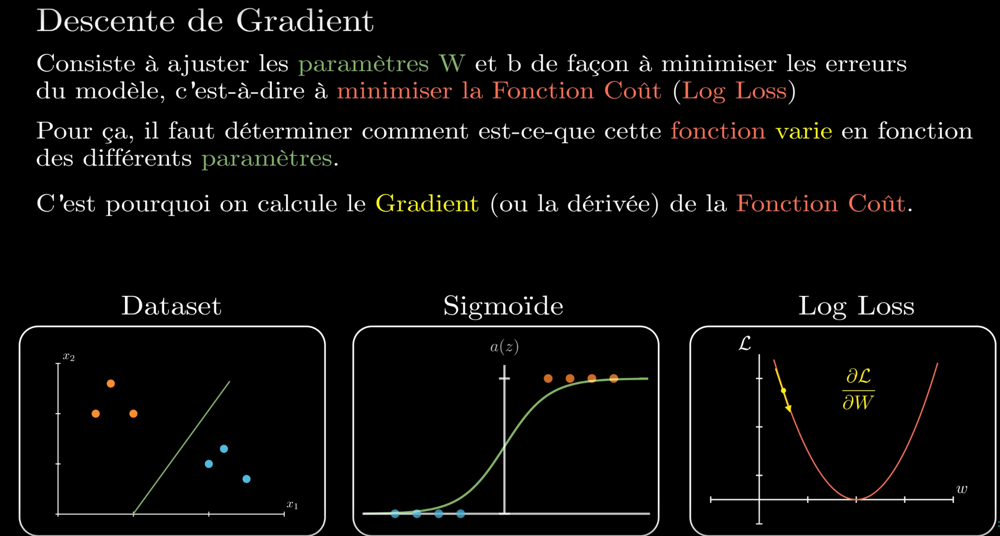

Car, , en mathématiques, la dérivée d'une fonction nous indique comment est-ce que cette fonction varie. 

Si la dérivée et est négative, ça nous indique que la fonction diminue quand $w$ augmente et qu'il va donc falloir augmenter $w$ si l'on veut réduire nos erreurs. 

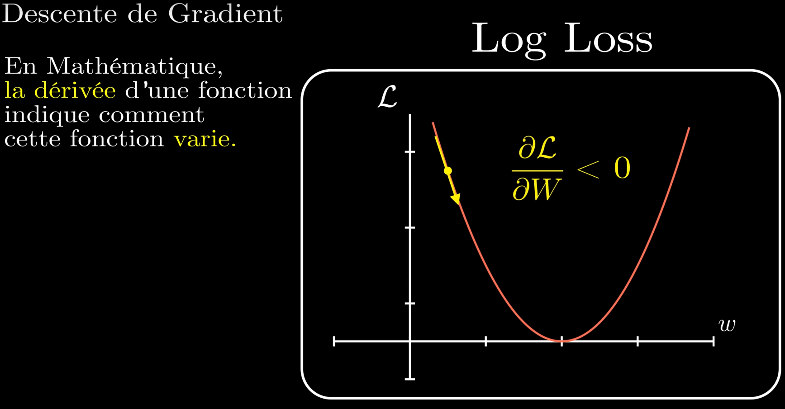

A l'inverse, si la dérivée est positive, cela indique que la fonction coûts augmentent quand $w$ augmente et qu'il faudra donc diminuer $w$ si l'on veut réduire nos erreurs. 

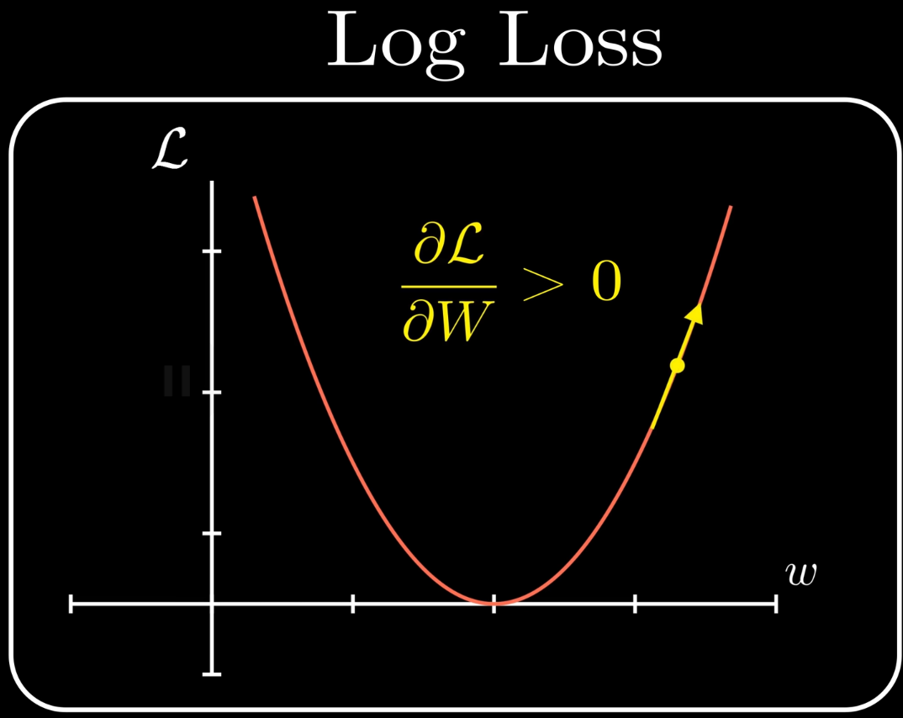

### 2.8 L'algorithme de descente de gradient ###

Pour faire cela, on va utiliser  la formule suivante : $w$ est égal à $w$ - un petit pas positif $\alpha$ multiplié par  le gradient de la fonction coût ou si vous préférez, la dérivée et partielle de la fonction coûts par rapport aux paramètres $w$ en question. 

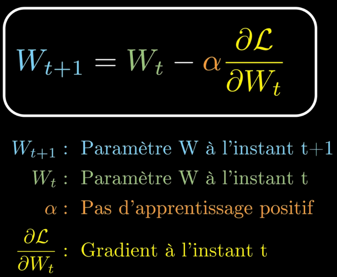

De cette manière, si le gradient est négatif alors $w$ va augmenter. 

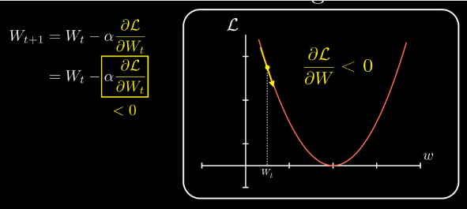

Grâce à notre formule, on voit bien qu'on a $w$ égale $w$ plus quelque chose de positif, donc $w$ augmente.

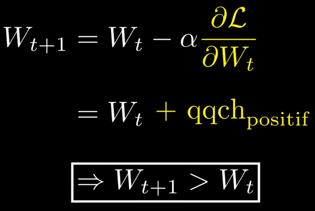 

A l'inverse si le gradient est positif, alors notre formule va faire diminuer la valeur de $w$ puisqu'on aura $w$ égale $w$ moins quelque chose. 

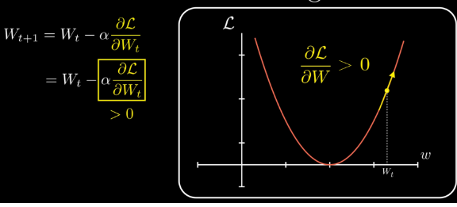

Donc $w$ va diminuer. 

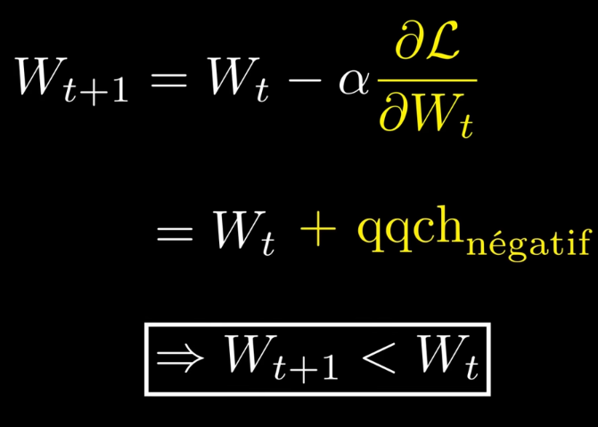

En répétant cette formule en boucle, on est ainsi capable d'atteindre le minimum de la fonction coût en descendant progressivement sa courbe. D'où le terme de descente de gradient. 

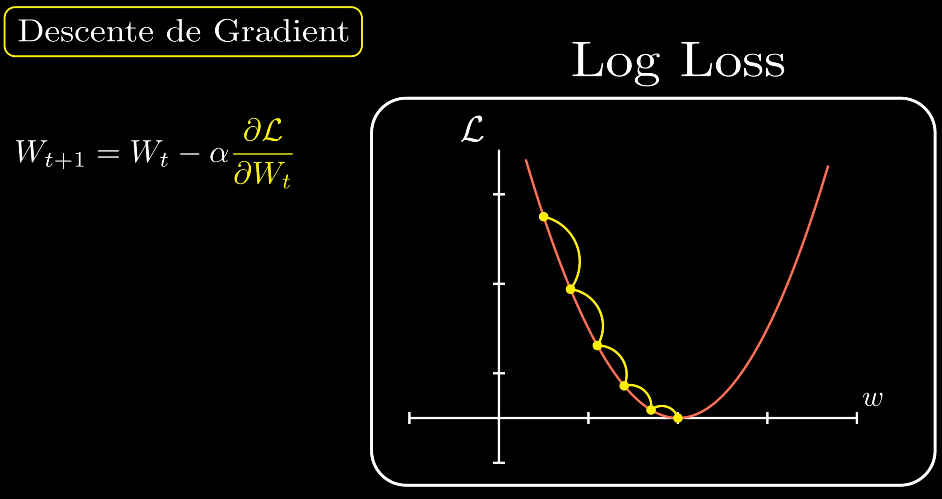

Tout ce qu'il faut pour que ça marche, c'est que notre fonction soit convexe c'est à dire qu'elles ne présentent pas de minimum local sur lequel l'algorithme pourrait rester bloqués. 

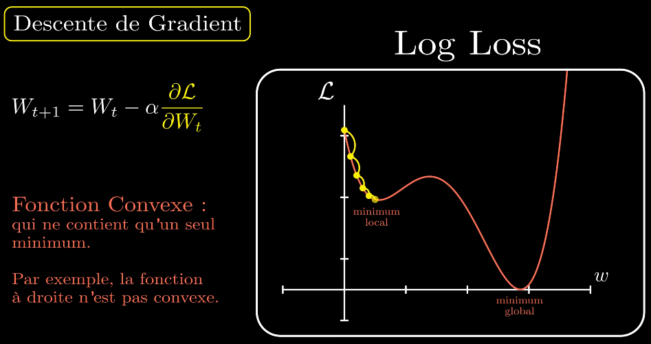

Heureusement pour nous, la fonction LogLoss est justement une fonction convexe, on peut donc utiliser l'algorithme de la descente de gradient pour entraîner notre neurones. 

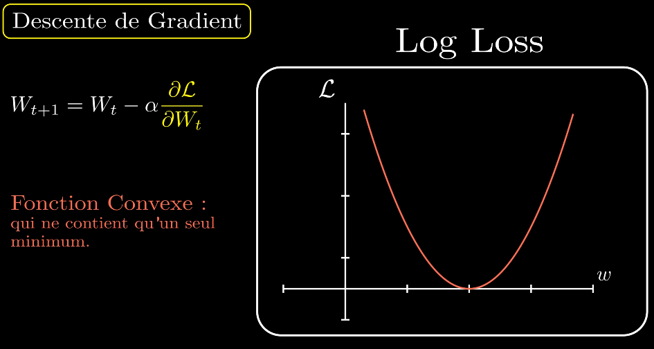

Et c'est ce qu'on fera dans les prochaines leçons, en écrivant un code qui implémente les différentes fonctions que l'on a vu aujourd'hui : la fonction linéaire, la fonction sigmoïde, la fonction coût et pour finir l'algorithme de la descente de gradient. 


Seulement, pour implémenter tout ça, il va nous falloir connaître l'expression de ces fameux gradient ceux qui interviennent dans la descente de gradient.

## Leçon 3 : Les gradients d'un neurone ##

Nous allons calculer les gradients de la fonction LogLoss. 

Alors avant toute chose, nous allons faire un petit récapitulatif de la situation histoire de bien remettre cet exercice dans son contexte. Ce qu'on cherche à faire c'est de développer un neurone dans le but de séparer linéairement deux classes de points. 

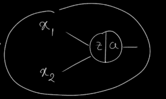


Par exemple des plantes toxiques que l'on note y égale 1 et des plantes non toxique que l'on note y égal zéro. 

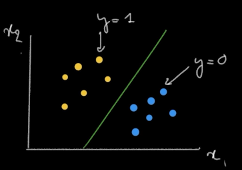

Pour ça ce qu'on fait, c'est qu'on fournit nos entrées $x_1$ et $x_2$ à notre neurones à l'intérieur duquel on va retrouver deux fonctions.D'abord une fonction linéaire $z= w_1x_1+ w_2 x_2 + b$. 

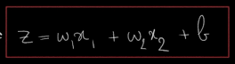

Puis une fonction d'activation, celle qu'on a vue étant la fonction sigmoïde qui retourne une sortie variant entre 0 et 1. 

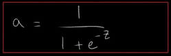

Le but du jeu bien, c'est de développer un modèle qui soit le plus fidèle possible à nos données et pour ça ce qu'on cherche à faire c'est de minimiser une fonction coût en l'occurrence la fonction de LogLoss.

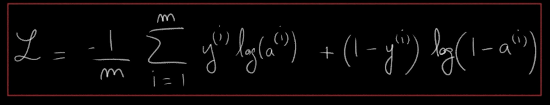 

Et pour minimiser cette fonction on va utiliser un algorithme d'optimisation très connu en machine learning l'algorithme de la descente de gradient qui consiste à calculer le gradient de la fonction coût. Donc essayer de comprendre comment cette fonction varie par rapport aux différents paramètres pour ensuite mettre à jour ces paramètres et les faire évoluer en conséquence. 

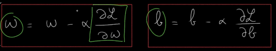

Alors à ce stade, avec les formules dont on dispose on pourrait quasiment commencé à écrire du code puisqu'on connaît absolument tout. 

- Les entrées $x$, on les connaît. 
- Les paramètres $w$ et $b$, nous les fixons 
- Concernant la fonction sigmoïde, c'est juste une fonction très simple à coder et 
- pour la fonction LogLoss, c'est pas très compliqué. Encore une fois, on a une somme, $y$ on le connaît ce sont nous données, on a le logarithme de la fonction $a$ et la fonction $a$ c'est nous qui l'avons défini. 

Bref, on pourrait quasiment tout écrire sauf une chose, le gradient. 

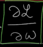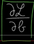

Et oui, si nous devions écrire ceci en code $Numpy$ , nous serions un petit peu perdues. Vous direz, il me faut l'expression du gradient et comment est ce que nous faisons pour le calculer? Et c'est justement pour ça qu'on a mis en place cet exercice dans lequel on va s'amuser à calculer les différents gradients dont on a besoin pour que notre neurone apprenne à classer ces différents points. 

Alors c'est parti, on va encadrée cette partie là 

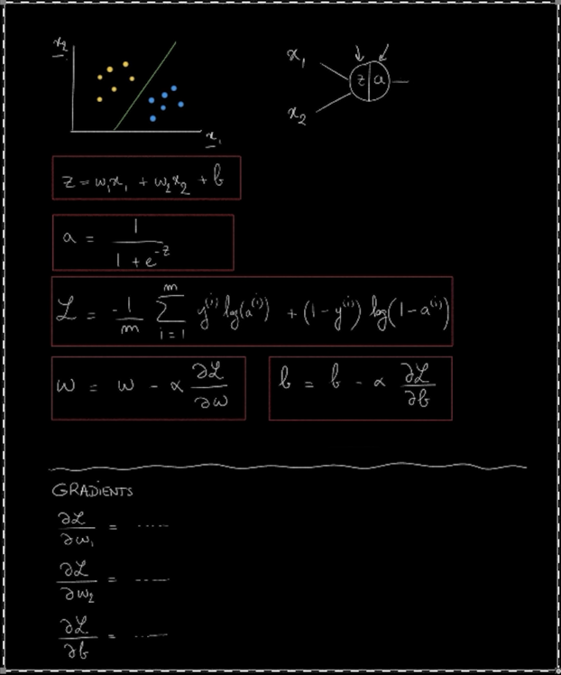

parce que c'est un petit peu notre référence.

### 3.1 Le premier calcul, la dérivée partielle de $L$ par rapport à $w_1$  ###

Alors à l'intérieur de notre fonction $L$, on ne retrouve pas $w_1$. On retrouve $y$, on retrouve $a$ mais on retrouve pas $w_1$. Donc si on voulait dérivées $L$ par rapport à $w_1$, il faudrait est exprimée $a$ de cette manière 

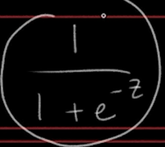

Et à la place du $z$ il faudrait écrire 

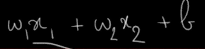

Mais, vous vous rendez compte de la taille du calcul que ça fait et nous allons dire ça c'est pas possible de résoudre à la main. Donc ce qu'on fait, c'est qu'on fait appel à une règle mathématique, ***la règle des chaînes*** qui consiste à dire que cette dérivée  partielle, 

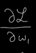

on peut la diviser en plusieurs parties tout d'abord dire que c'est la dérivée et partielle de $L$ par rapport à $a$ multiplié par la dérivéee partielle de $a$ par rapport à $z$ multiplié par la dérivéee partielle de $z$ par rapport à $w_1$ 

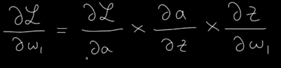

et par simplification vous voyez bien que ça se simplifient et il nous reste la dérivée partielle de $L$ par rapport à $w_1$, c'est à dire la chose que l'on cherche à calculer. 

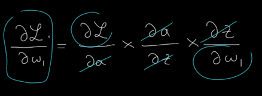

Ca signifie donc que pour effectuer cet exercice, il va nous falloir calculé 3 terme 

- d'abord la dérivée et partielle de $L$ par rapport à $a$ 
- puis la dérivée et partielle de $a$ par rapport à $z$ 
- et pour finir la dérivée partielle de $z$ par rapport à $w_1$ 

#### 3.1.1 Dérivée partielle de $L$ par rapport à $a$  ####

On va commencer tranquille en faisant la dérivée et partielle de notre fonction coût par rapport à $a$. 

Donc c'est parti, la dérivée partielle de $L$ par rapport à $a$,  ça me donne? Alors on va regarder les formules dont on dispose et la fonction $L$ , on cherche à la dérivée et par rapport à $a$ ,alors $a$ on le retrouve à deux endroits.

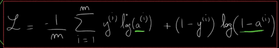

A chaque fois $a$ est à l'intérieur d'un logarithme. Donc il va falloir, non pas dérivéer $a$, mais dérivée logarithme de $a$. 

Alors si vous ne connaissez pas la dérivéee du logarithme de $a$, si vous l'avez oublié. Et bien c'est pas grave ,vous pouvez aller sur Wikipédia. 

J'en profite au passage aussi pour vous dire qu'il s'agit du **logarithme Naturel** c'est-à-dire le logarithme **en base $e$** qu'on écrit souvent en $ln(x)$ mais on continue à l'écrire log de $a$ 1 dans la littérature internationale.

Alors nous avons un tableau où on retrouve toutes les dérivéees. 

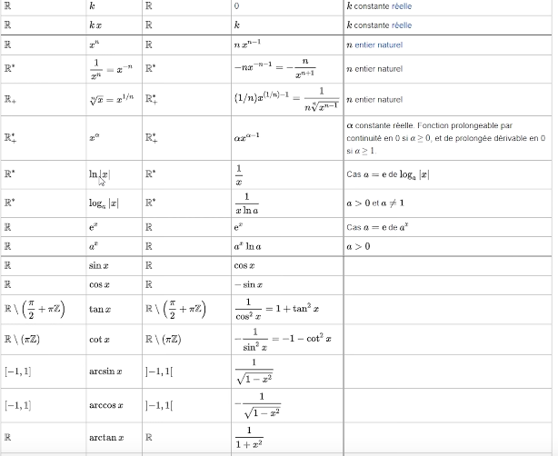

Et la dérivéee de $ln(x)$ c'est $\frac{1}{x}$. Et voilà, on a notre réponse sur la dérivée $ln(x)$.

Ca signifie, la dérivée ça va devenir 1 sur $a$ et $log(1-a)$, vous pourriez vous dira ça va nous donner 1 sur $1 - a$. Alors vous y êtes presque, c'est juste que étant donné qu'on a un coefficient négatif devant le $a$ est bien ce coefficient négatif on va le retrouver en dehors de notre dérivée. Ce qui va nous donner  - 1 sur $1-a$

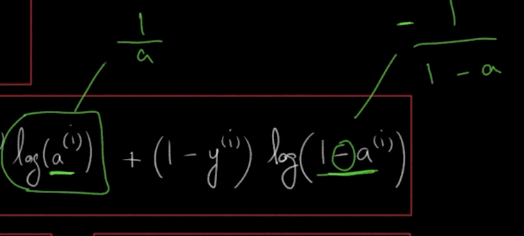

donc c'est parti on va remplacer tout ça dans notre calcul. 

On va donc écrire que la dérivée partielle de $L$ par rapport à $a$ sera -1 sur m, ça reste c'est un facteur, multiplié par la somme des $y$. Tout ça ce sont des facteurs et on va pas les enlever. donc on va écrire

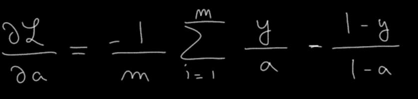

Et voilà, ça nous donne notre première expression dont on va avoir besoin dans notre calcul. 

#### 3.1.2 Dérivée partielle de $a$ par rapport à $z$ ####

Donc pour calculer cette dérivée,  la fonction $a$ peut être exprimée sous forme d'une fonction composée $a=g\ o\ f$ c'est à dire si écrit autrement $g(f(z))$ 

et donc

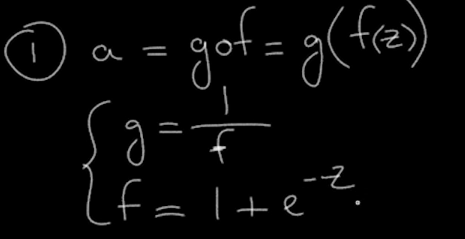

Vous voyez bien que si on assemble ses deux choses ensemble, on retourne bien sûr notre formule 

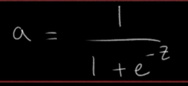

Un petit rappel de la dérivée et une fonction composé donc j'ai 

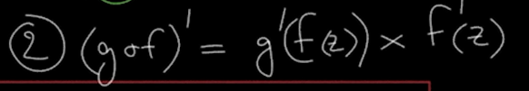

Donc, maintenant on peut calculer la dérivée partielle de $a$ par rapport à $z$ puisque c'est en fait égal à cette dernière formule dans laquelle on fait intervenir la dérivée de $g$,  la dérivée de $f$ et la fonction $f$. 

Alors pour l'utiliser jusqu'au bout cette formule, il nous faut donc calculer ces deux derniers éléments la dérivée  $g'(f(z))$ et la dérivée de $f'(z)$.

Encore une fois vous pouvez aller sur wikipédia pour retrouver ce genre de formules et

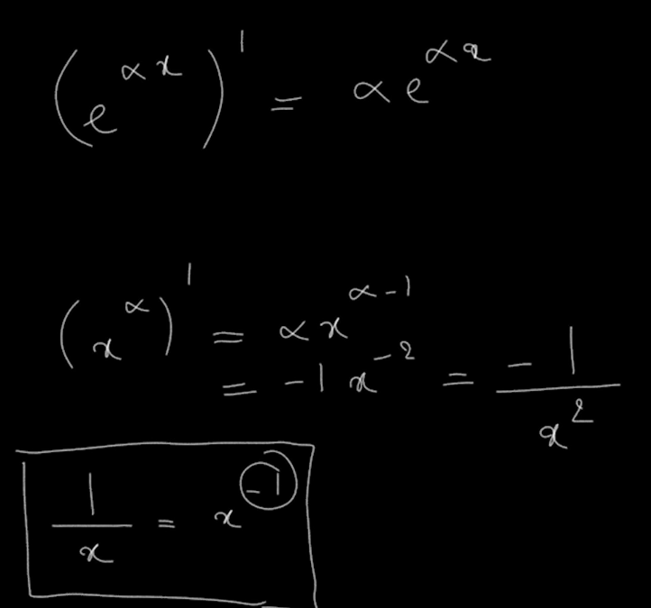

et 

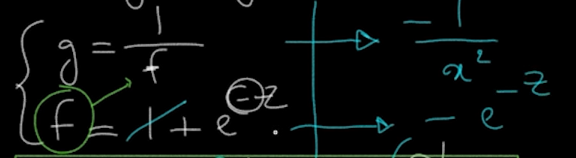

Et donc, nous avons 

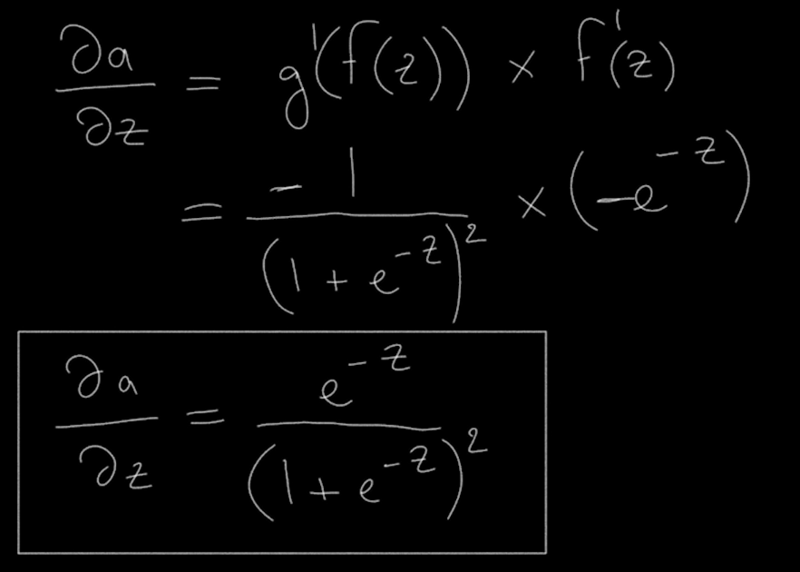

Mais vous l'aviez compris le calcul ne s'arrêtait pas ici et donc est-ce que ce calcul ne vous fait pas penser à quelque chose par exemple quelque chose comme à $a(z)$, vous savez cette expression 

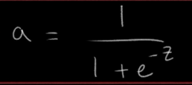

Pourquoi? Parce qu'on peut l'exprimer en le décoûtant en deux parties en deux termes. Ce calcul on peut dire que c'est égal à 

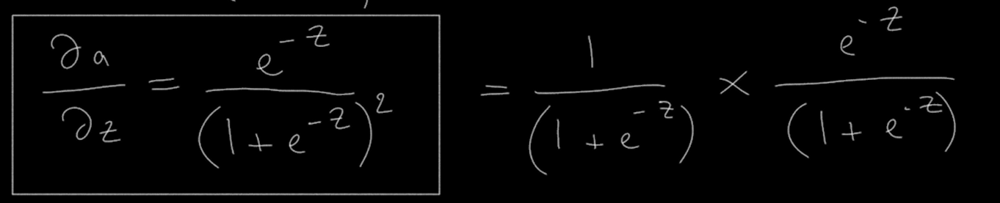

On peut clairement identifier un terme à gauche qui est égal à $a(z)$.  

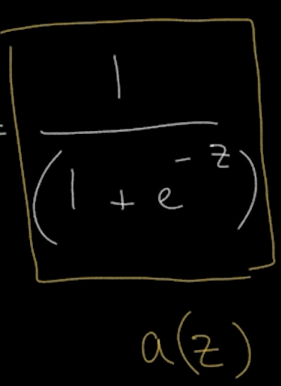

Maintenant le terme de droite est un petit peu plus délicat à simplifier. Il va falloir qu'on utilise une petite astuce mathématiques , on va rajouter + 1 - 1 au numérateur ce qui revient à la même chose ça revient à faire + 0 

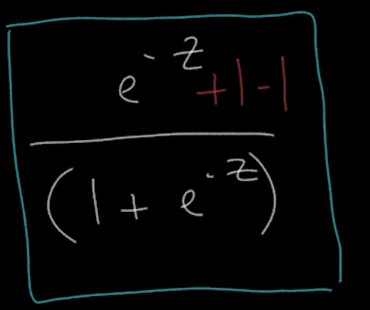

On va avoir 

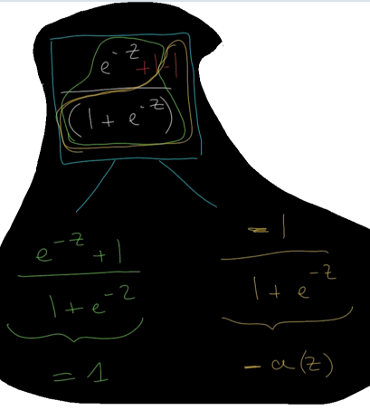

Donc ça nous donne

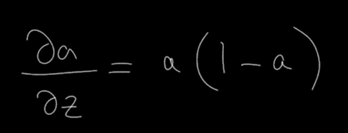

Et c'est notre deuxième formule qui intervient dans notre calcul final. 

#### 3.1.3 Dérivée partielle de $z$ par rapport à $w_1$ ####

Donc maintenant, il ne reste plus qu'à effectuer le troisième calcul, la dérivée partielle de $z$ par rapport à $w_1$. 

Donc la fonction $z$ ,lorsqu'on la dérivée par rapport à $w_1$ 

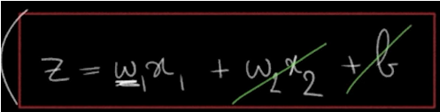

et bien le terme s'en va $w_2x_2$ car c'est une constante et le terme $b$ s'en va car c'est une constante. Alors par constante on veut dire que $w_1$ n'a aucun impact sur ces deux termes, alors le le terme $w_2x_2$ ne varie pas quand $w_1$ varie, il reste constant. 

Donc, en réalité, lorsqu'on dérivée $z$ par rapport à $w_1$, il reste le facteur en face de $w_1$, c'est-à-dire $x_1$ et vous avez vu celui-là il était très très rapide.

Donc, la dérivée partielle de z par rapport à $w_1$ est égale à $x_1$ 

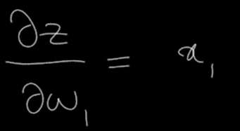

Voilà, c'est notre dernière dérivée partielle. 

#### 3.1.4 Résultat ####

Donc avec ça, on peut effectuer le calcul final la dérivée partielle de $L$ pad rapport à $w_1$. Il s'agit simplement de multiplier ensemble les trois expressions expression

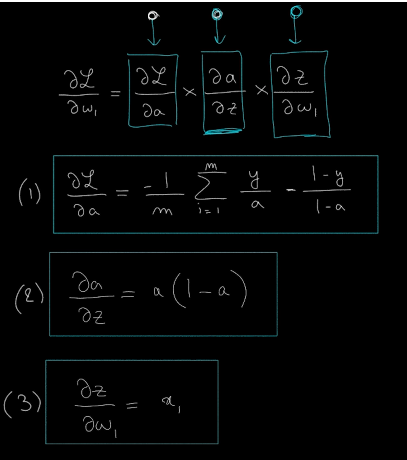


Donc on va écrire que la dérivée et partielle de $L$ par rapport à $w_1$ est égal 

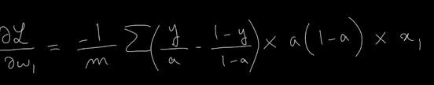

Alors maintenant comme tout à l'heure on va simplifier ce calcul

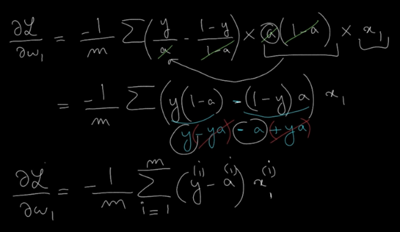


Et voilà avec ça vous avez votre premier gradient. 

On va donc résumée ici en écrivant 

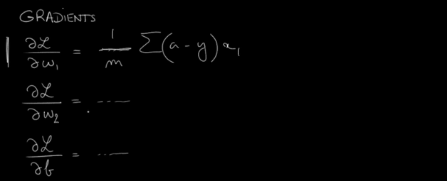

Alors là vous vous dites peut-être, ça fait trente minutes de leçon et on en a seulement fait un. Mais vous allez voir que les autres sont hyper simple.

### 3.2 Le deuxième calcule, la dérivée partielle de $L$ par rapport à $w_2$ ###

Et bien regardez la dérivée partielle de $l$ par rapport à $w_2$ comment est ce qu'on va faire pour la calculer. 

Donc cette fois ci on n'aura pas $x_1$ mais $x_2$ 

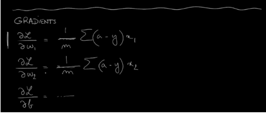

Donc on a une deuxième dérivées.

Et vous comprenez que si on en aurait un troisième paramètre, si on avait un troisième paramètre $w_3$ alors tout ce qu'on aura à faire c'est de remplace par $x_3$ et ainsi de suite... 

### 3.3 Le troisième calcul, la dérivée partielle de $L$ par rapport à $b$ ###

On aura cette fois ci 


en dérivant notre expression par $b$, on a un facteur 1. 

## Leçon 4 : La vectorisation des équations ##

Bienvenue dans la quatrième leçon de cette série sur le Deep Learning. 

Dans les précédentes leçons nous avons vu toutes les fonctions mathématiques à connaître pour développer des neurones artificiels. 

Maintenant avant d'implémenter toutes ses fonctions dans un programme, il nous reste à effectuer une étape très importante celle de la vectorisation. Dans cette leçon nous allons expliquer de quoi il s'agit pourquoi est ce si important et comment effectuer cette étape. 

### 4.1 Définition de Vectorisation ###

Pour commencer voyons ensemble ce que signifie ***Effectuer une vectorisation*** . En programmation, cela consiste à mettre nos données dans des vecteurs, des matrices ou des tableaux à n-dimensions afin d'effectuer des opérations mathématiques sur l'ensemble de ces données. 

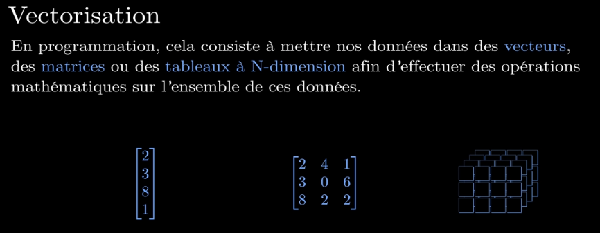

Par exemple, si vous voulez effectuer une multiplication sur tous les éléments d'une liste vous devez en principe parcourir cette dernière à l'aide d'une boucle for pour traiter les valeurs les unes après les autres. 

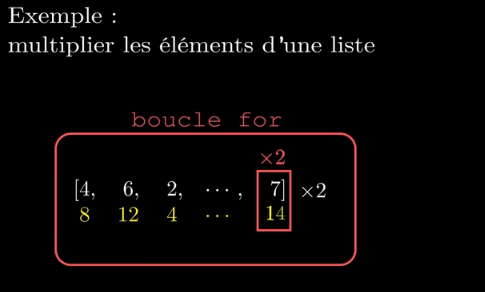

Cependant si vous vectorisé cette liste c'est à dire que vous la transformer en un vecteur, alors vous pouvez directement multiplier ce vecteur par la valeur de votre choix. 

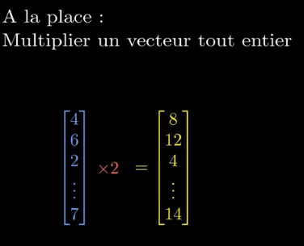

Ce qui aura pour effet de transformer tous les éléments du vecteur en une seule opération. Dans les deux cas, nous obtenons donc le même résultat à ceci près que la vectorisation nous offre un code plus simple à lire et plus rapides à exécuter car on effectue une seule opération, contrairement au cas de la liste et de sa boucle for. 

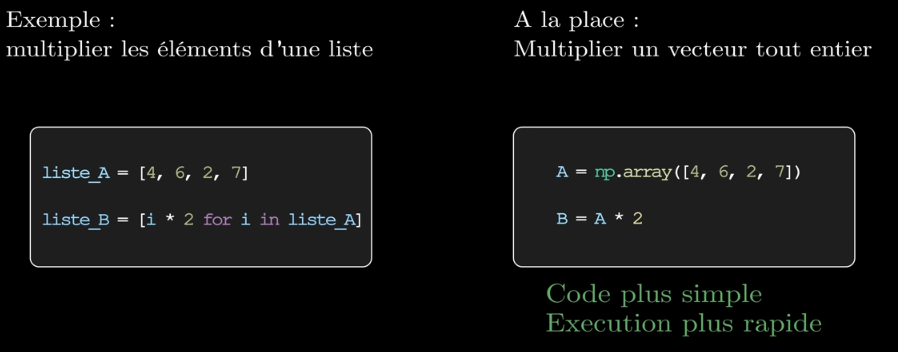

De par ses deux avantages et plus particulièrement le second, la vectorisation est une technique indispensables à connaître en machine learning et en Deep Learning car comme vous le savez nous sommes amenés à manipuler de très grosses quantités de données dans ces domaines. 

Donc au lieu de faire passer ces données les unes après les autres dans nos réseaux de neurones répétant ainsi en boucle les mêmes calculs pendant des milliers de fois, 

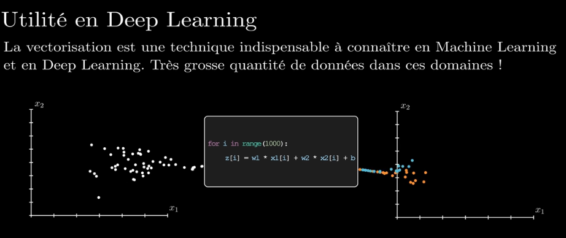

Et bien on préfère vectorisé les équations de notre modèle afin de pouvoir traiter toutes les données d'un seul coût. 

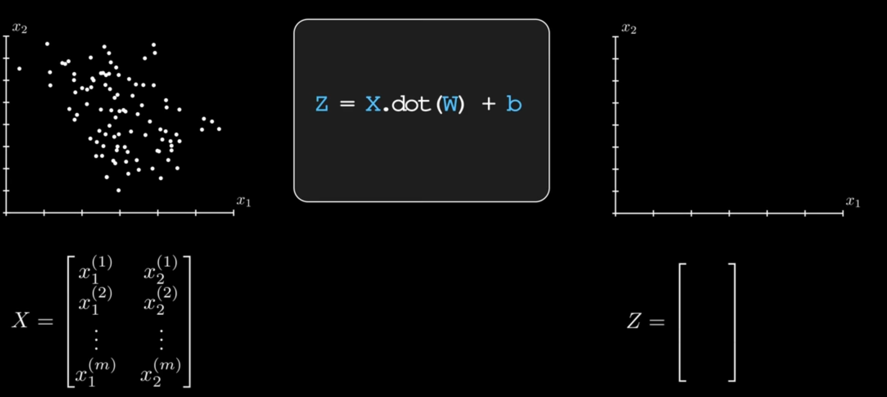

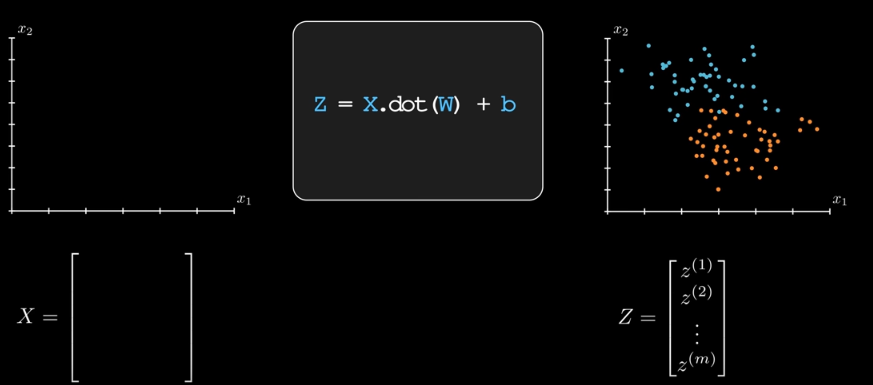

cela nous fait économiser à temps de calcul un considérable. 

Dans cette leçon, nous allons donc voir comment réécrire sous forme matricielle toutes les équations que l'on a vu dans les dernières leçons. 

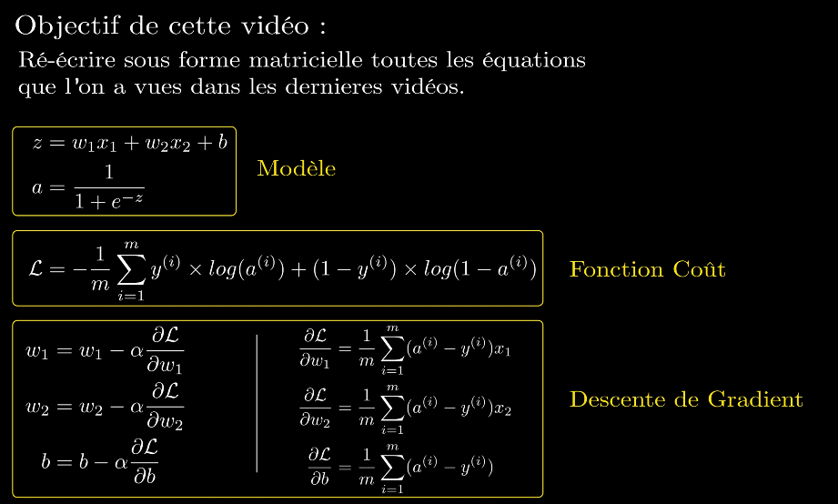

Mais pour y arriver il va falloir maîtriser les bases du calcul matricielle, c'est pourquoi nous allons faire un petit rappel à ce sujet avant de se lancer dans nos calculs. 

#### 4.1.1 Rappel sur le calcul matriciel  ####

Alors, pour faire simple tout en restant le plus corrects possibles, les matrices sont des tableaux à deux dimensions dont on se sert pour résoudre facilement et rapidement une grande quantité de problèmes mathématiques. Que ce soit des problèmes d'algèbre linéaire, d'optimisation de géométrie ou même de modélisation en physique. 

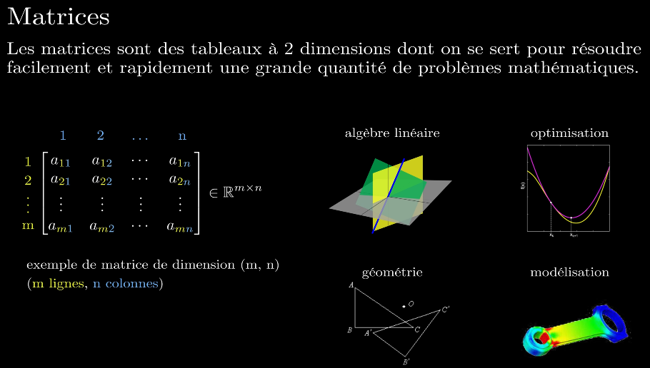

Pour prendre un exemple, le système d'équations suivant peut être résolu très facilement à l'aide de matrice. Tout qu'il s'agit de faire, c'est de le traduire sous forme matricielle 

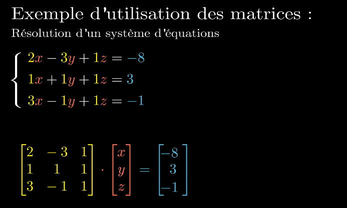

Puis d'isoler le vecteur $x, y, z$ en passant la matrice coefficient de l'autre côté de notre équation. 

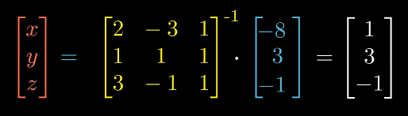

Dans le cadre du Deep Learning, il y a trois opérations que vous devez absolument connaître sur le calcul matricielle : les additions et les soustractions, les transposée et les multiplications. 

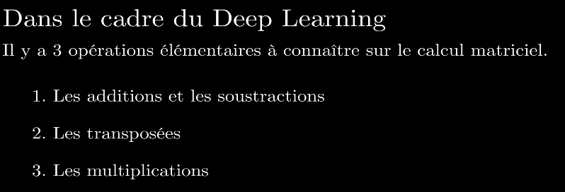

Pour commencer voyons ensemble **les additions et soustractions**. La règle est simple pour additionner ou soustraire deux matrices, il faut qu'elles aient les mêmes dimensions c'est à dire le même nombre de lignes et le même nombre de colonnes. De cette manière, on peut additionner ou soustraire chaque matrice élément par élément. 

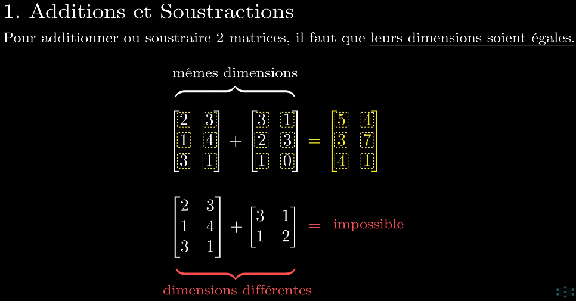

La seconde opération à connaître c'est **la transposée** que l'on note grand $T$. Il s'agit d'une opération qui consiste à faire pivoter la matrice sur sa diagonale ce qui a pour effet d' interchanger ses dimensions. 

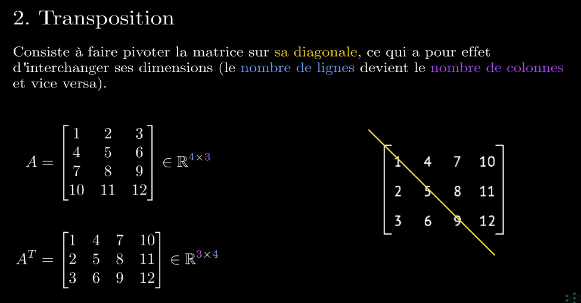

Le nombre de lignes devient le nombre de colonnes et vice versa. C'est une opération très courantes en algèbre linéaire et on s'en servira un peu plus tard dans cette leçon.

Pour finir la troisième opération importante à connaître c'est celle de **la multiplication matricielle**. Alors là la règle est un petit peu plus sophistiquée, en fait quand on multiplie ensemble deux matrices on ne le fait pas élément par élément comme pour l'addition et la soustraction à la place on effectue une combinaison linéaire entre les lignes de la matrice de gauche et les colonnes de la matrice de droite. 

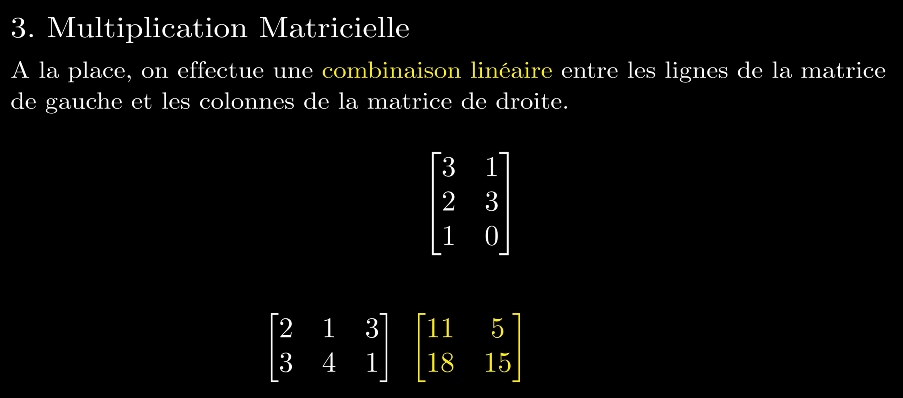

Pour commencer il faut que le nombre de colonnes de la matrice de gauche soit égal au nombre de lignes de la matrice de droite. 

Pour se rappeler l'astuce c'est de noter les dimensions sous vos matrix et de vérifier que les nombres qu'on retrouve au centre soit identique. Si c'est bien le cas, alors vous pouvez multiplier ces deux matrices ensemble. Ce qui donne un résultat dont les dimensions sont égales à ce qui nous reste sur le côté. 

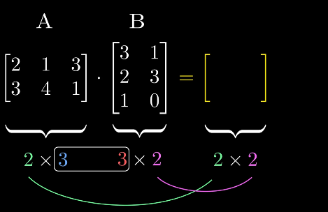

Ensuite pour calculer les termes de cette matrice, c'est simple, il s'agit d'une combinaison linéaire entre les lignes de la matrice de gauche et les colonnes de la matrice de droite. Donc pour calculer le terme situées à la première ligne première colonne on va combiner la première ligne de la matrice $A$ avec la première colonne de la matrice $B$. 

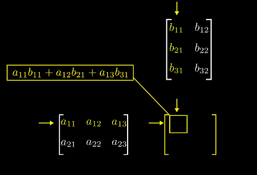

Ensuite pour calculer le terme situées à la première ligne 2e colonne, on va combiner la première ligne de la matrice $A$ avec la deuxième colonne de la matrice $B$ et ainsi de suite. 

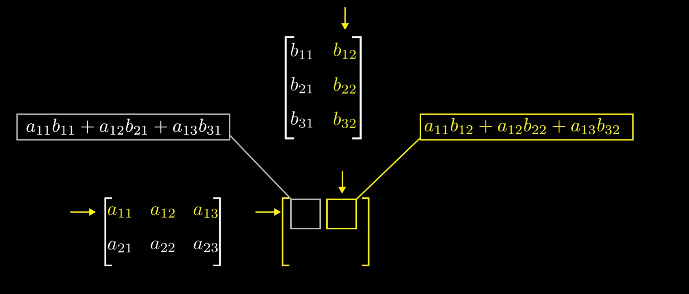

Vous comprenez l'idée. Alors pour bien maîtriser tout ça, le mieux c'est de vous entraîner. 

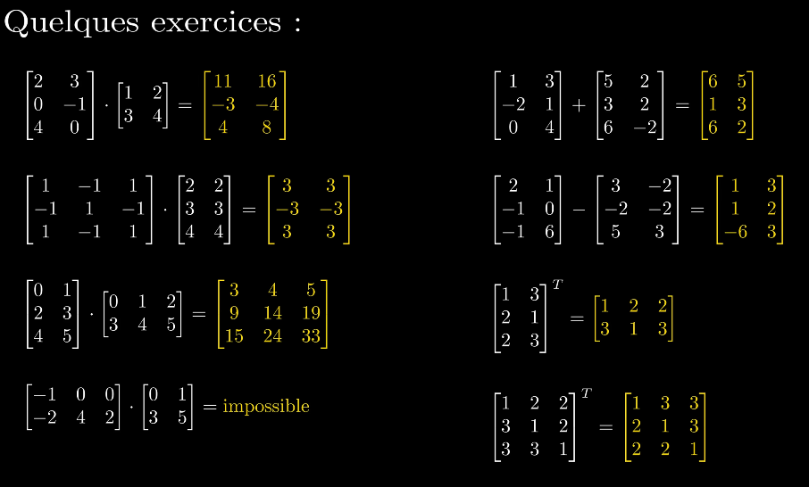

Et voilà maintenant que vous maîtrisez les bases du calcul matricielle, il est temps de voir comment vectorisé toutes les équations que l'on a vu dans les dernières leçons. 

#### 4.1.2 Vectorisation de (x, y)  ####

Pour la vectorisation de nos équations, 

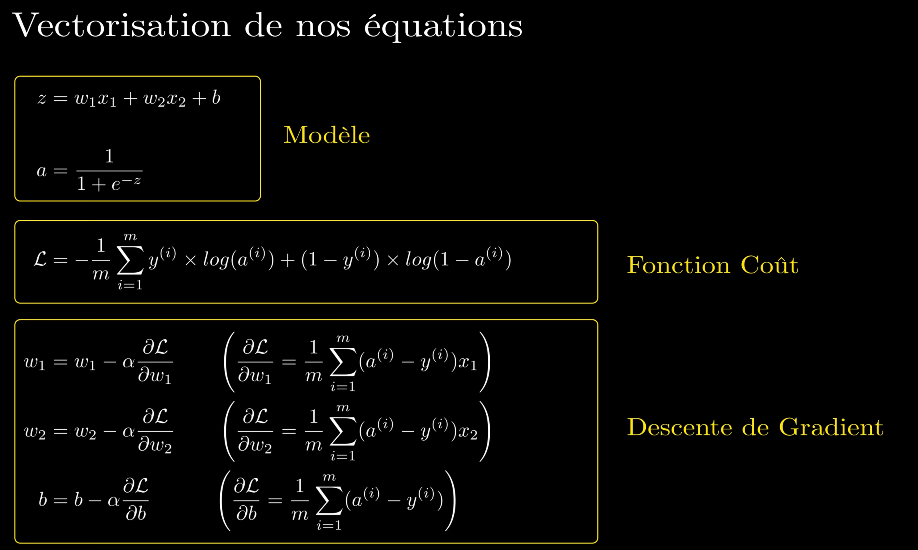

A la base, nous disposons donc d'un Dataset que l'on va vectorisé pour obtenir une matrice grand $X$ de dimensions $m\times n$ et un vecteur $y$ de dimensions $m\times 1$. Par convention on dit que $m$ représente le nombre de données et $n$ le nombre de variables de notre Dataset. 

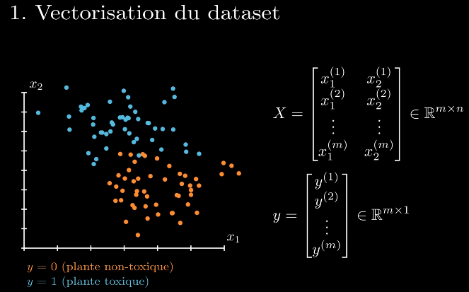

D'ailleurs dans cette leçon on va dire que $n$ est égal à 2. La première chose à faire c'est donc de transformer notre matrice $X$ de façon à obtenir un vecteur grand $Z$ qui contient les valeurs petit $z$ associés à chaque donnée. 

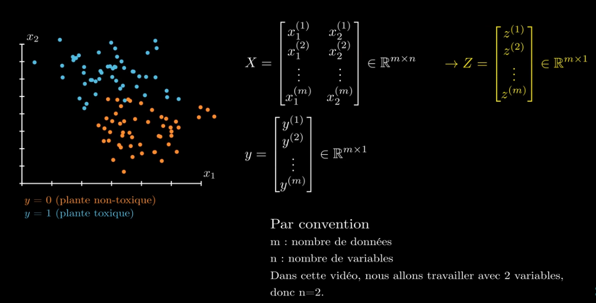

La valeur $z_1$ pour la première donnée, $z_2$ pour la deuxième, etc...

#### 4.1.3 Vectorisation de Z ####

La question c'est donc comment faire pour calculer ce vecteur $Z$. Et bien la réponse est simple à l'heure actuelle nous connaissons la fonction $z$ de $x_1$ et $x_2$ qui permet de calculer la valeur $z^{(i)}$ pour n'importe quelle donnée $i$. 

Et bien ce qu'on va faire, c'est d'utiliser cette fonction afin de remplacer chaque élément $z$ de notre vecteur par l'expression qui lui est associée.

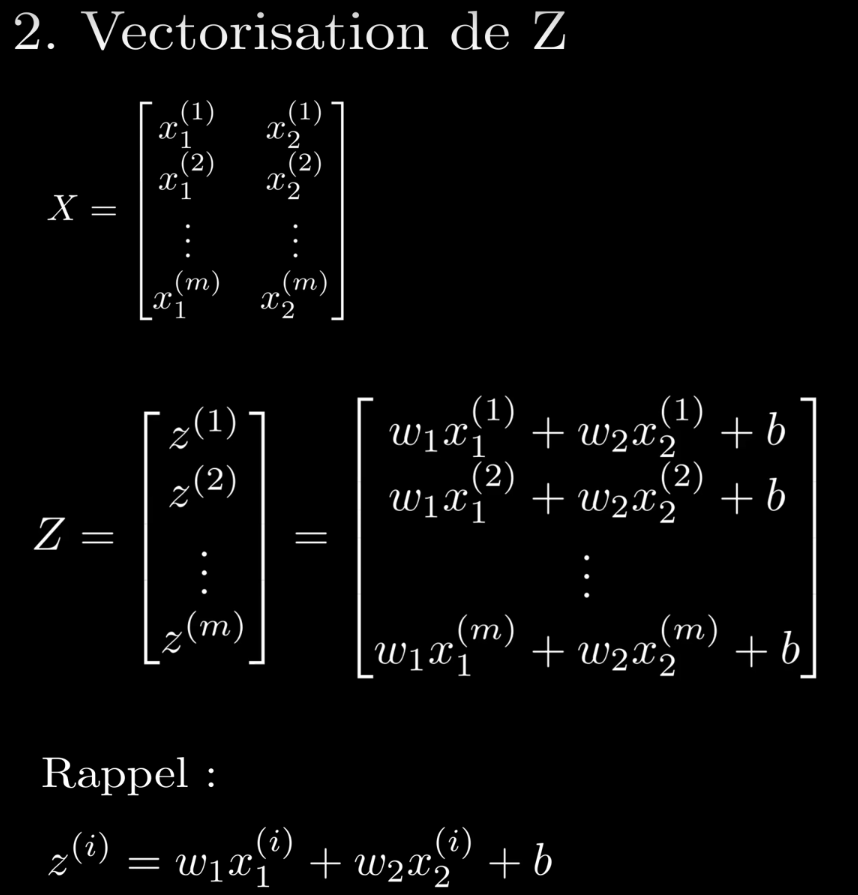

Maintenant, dans le résultat que l'on obtient qu'est-ce qu'on retrouve? Et bien, si on ouvre l'oeil, on trouve en fait la matrice $X$ qui est multipliée à un vecteur $w$, ce qui nous donne donc bien le produit matricielle $w_1 x_1 + w_2 x_2$. Et le tout est additionné à un vecteur $b$ au niveau des dimensions. 


On a donc une matrice de dimension $(m,2)$ que l'on multiplie à un vecteur de dimension (2,1), ce qui nous donne un résultat de dimension $(m, 1)$ et ce résultat on l'additionne au vecteur $b$ qui est lui aussi de dimension $(m,1)$. 

Et voilà comment réécrire la fonction $z$ 

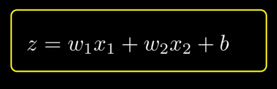

sous forme matricielle 

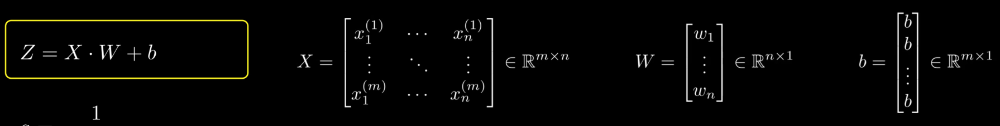

Alors dans la pratique, le vecteur $b$ est rempli de bout en bout de la même valeur on pourra en fait le remplacer par un nombre réel $b$ et cela n'affectera absolument pas nos calculs, grâce au mécanisme de broadcasting. 

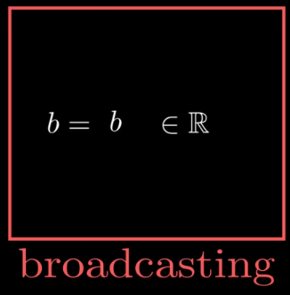

------

Le broadcasting, en calcul matriciel, fait référence à une fonctionnalité qui permet d'effectuer des opérations entre des matrices ou des tenseurs de différentes formes et dimensions de manière transparente et efficace. Le broadcasting est une fonctionnalité présente dans certains frameworks de calcul matriciel, tels que NumPy en Python.

Lorsque des opérations mathématiques (addition, soustraction, multiplication, etc.) sont effectuées entre des matrices ou des tenseurs de formes différentes, le broadcasting intervient pour adapter automatiquement les dimensions des matrices, de sorte qu'elles soient compatibles pour l'opération souhaitée.

Le broadcasting suit un ensemble de règles pour étendre les dimensions des matrices de manière à ce qu'elles correspondent. Les règles typiques du broadcasting sont les suivantes :

1. Si deux tableaux ont des dimensions différentes, le tableau avec moins de dimensions est étendu en ajoutant des dimensions de taille 1 à gauche.
2. Si la taille des dimensions d'un tableau est 1 et que l'autre tableau a une taille différente dans cette dimension, le tableau avec la taille 1 est étendu en répétant ses valeurs le long de cette dimension pour correspondre à la taille de l'autre tableau.
3. Si, après les deux premières règles, les formes des tableaux ne correspondent toujours pas dans une dimension donnée, une erreur est générée, indiquant que les tableaux ne sont pas compatibles pour l'opération demandée.

Le broadcasting permet d'éviter des opérations coûteuses de duplication des données et facilite l'écriture de codes plus concis et plus lisibles lors de l'utilisation de bibliothèques de calcul matriciel. Cela permet également d'effectuer des calculs sur des ensembles de données de tailles différentes sans avoir à les redimensionner manuellement.

En résumé, le broadcasting en calcul matriciel est un mécanisme qui permet d'effectuer des opérations entre des matrices ou des tenseurs de différentes formes en les adaptant automatiquement pour correspondre aux dimensions requises par l'opération.

------

#### 4.1.4 Vectorisation de A ####

A présent nous allons voir comment faire pour transformer ce vecteur $Z$ en  un vecteur $A$. Pour ça, on va faire comme tout à l'heure, c'est à dire partir de la fonction d'activation que l'on connaît  $a^{(i)}=\sigma\left(z^{(i)}\right)=\frac{1}{1+e^{-z^{(i)}}}$ et nous allons remplacer chaque terme du vecteur $a$ part cette fonction on obtient donc le résultat suivant 

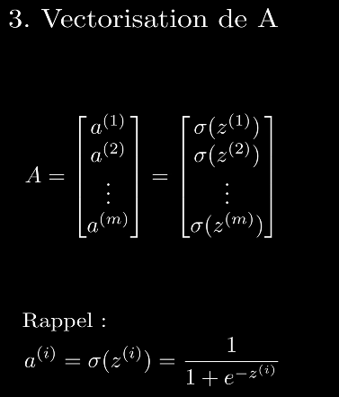

duquel on peut extraire la fonction sigma comme

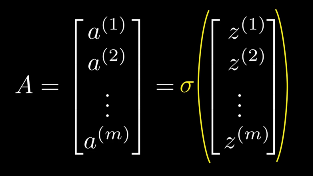

Au final, on peut donc écrire que le vecteur $A$ est égale à la fonction $\sigma$ dans laquelle on fait passer le vecteur $Z$ tout simplement 

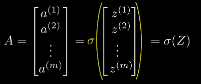

Voilà, nous avons vectorisé toutes les équations qui forment notre modèle. 

#### 4.1.5 Vectorisation de la Fonction Coût ####

Donc on se le rappelle le but de la fonction coût c'est de calculer l'erreur globale du modèle en faisant la somme de toutes les erreurs individuelles entre $a$ et $y$. Nous ce qu'on voudrait faire ça serait de vectorisé cette équation afin de comparer directement le vecteur $A$ aux vecteurs $y$. 

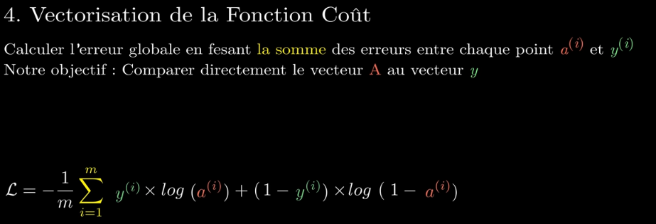

Et vous allez voir, c'est en fait très simple à faire car nous pouvons directement insérer ces deux vecteurs dans notre équation telle qu'elle est écrite à l'heure actuelle. 

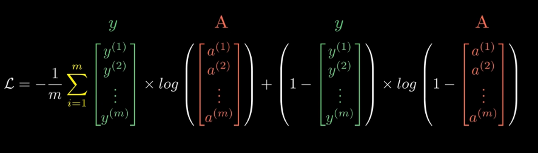

On a donc d'un côté le produit entre le vecteur $y$ et le log du vecteur $A$ et attention il s'agit non pas d'un produit matricielle mais simplement d'un produit ligne par ligne et de l'autre côté nous avons un produit assez semblables 

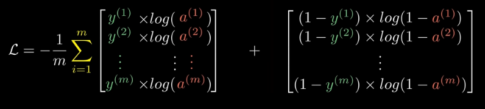

ce qui nous donne au final un très grand vecteur de dimension $m \times 1$, 

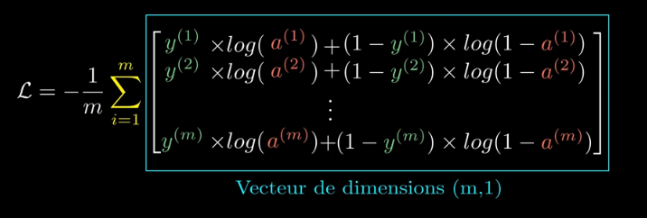

don on effectue la somme élément par élément.

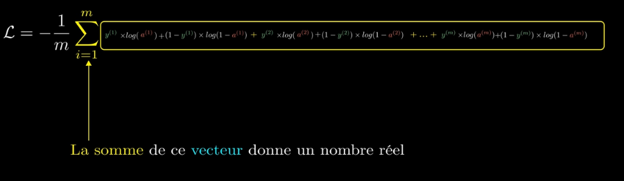

puisque dans cette fonction nous avons une somme pour $y$ allant de 1 à $m$

Le résultat de tout ce calcul nous donne donc un nombre réel et non pas un vecteur ce qui est logique vu que la fonction coût nous donne un coût c'est à dire une mesure de l'erreur de notre modèle et voilà donc comment vectorisé notre fonction coût 

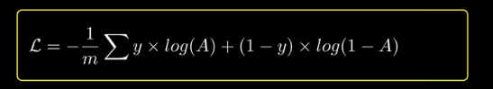

#### 4.1.6 Vectorisation de la Descente de Gradient  ####

Pour finir il ne nous reste plus qu'à vectorisé les formules de la descente de gradient. 

A l'heure actuelle nous avons trois formules pour mettre à jour les trois paramètres du modèle à savoir $w_1$, $w_2$ et $b$

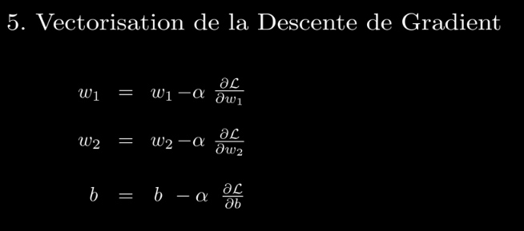

Sauf que tout à l'heure nous avons créé un vecteur $W$ qui contient déjà les paramètres $w_1$ et $w_2$

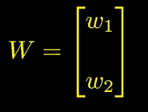

Donc, ce qu'on va faire plutôt que de modifier $w_1$ et $w_2$ séparément, c'est de modifier le vecteur $W$ d'un seul coût alors pour ça on va mettre les deux lignes ici présentes dans un vecteur et ce vecteur on va pouvoir lui-même le décoûter en plusieurs parties 

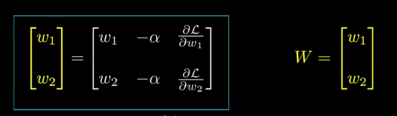

car on y retrouve le vecteur $W$ encore une fois, ainsi qu'un facteur $\alpha$ qui est multipliée à un autre vecteur qu'on appelle le $Jacobien$ qui contient nos différents gradient. 

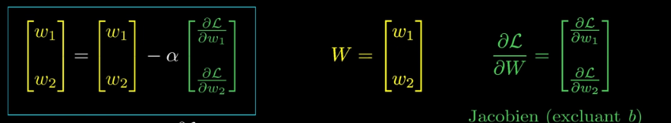

Donc, on peut résumer tout ça en écrivant que grand $W$ est égal à $W$ - $\alpha$ fois le Jacobien. 

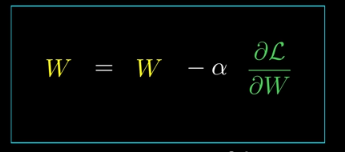

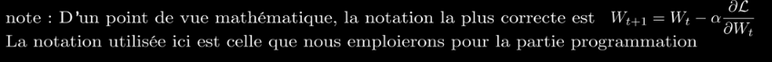

Bien maintenant en ce qui concerne le paramètre $b$, 

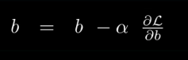

nous n'avons pas besoin de vectorisé cette équation parce qu'on a vu tout à l'heure que le paramètre $b$ pouvait en fait être assimiler non pas un vecteur mais à un nombre réel donc on peut tout simplement dire que $b$ est égal à $b$ - $\alpha$ fois la dérivée partielle de $L$ par rapport à $b $ 

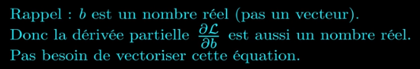

Tout cela nous donne donc les deux équations a implémenté pour réaliser notre descente de gradient 

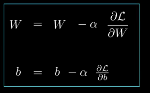

Mais notre vectorisation ne s'arrête pas là parce qu'il nous rassure une dernière chose à voir c'est nos 2 gradients (d rond $L$ sur d rond $W$) et (d rond $L$ sur d rond $b$) 

#### 4.1.7 Vectorisation des Gradients ####

Alors commençons par le premier 

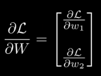

on sait donc qu'il s'agit d'un vecteur qui contient toutes les dérivées partielles de $L$ par rapport à chaque paramètre $w$ de notre modèle ici nous en avons deux $w_1$ et $w_2$. Ce qui nous donne un vecteur de dimension (2,1). 

Alors pour développer ce vecteur nous allons remplacer chaque ligne par son expression. Dans la dernière leçon, on a calculé à quoi était égal d rond $L$ sur d rond $w_1$ et d rond $L$ sur d rond $w_2$. Ca nous donne donc le résultat suivant 

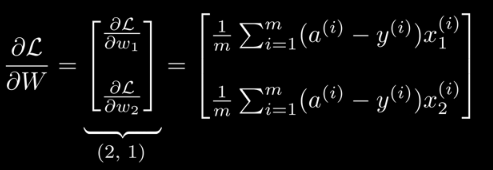

duquel nous pouvons extraire le facteur 1 sur m 

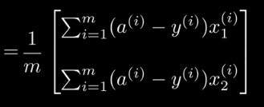

et développer la somme que l'on a à l'intérieur 

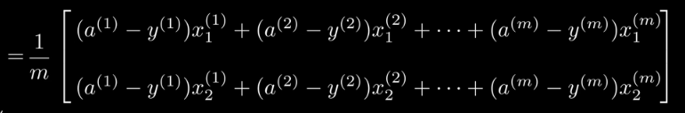

et on observe quelque chose de très intéressant, car si on ouvre bien œil, on trouve en fait la matrice $X$ qui est cette fois-ci transposée 

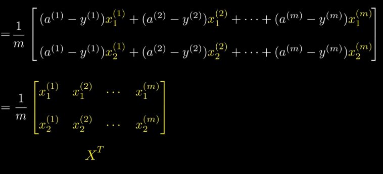

et cette matrice elle est multipliée à la différence entre le vecteur $A$ est le vecteur $y$

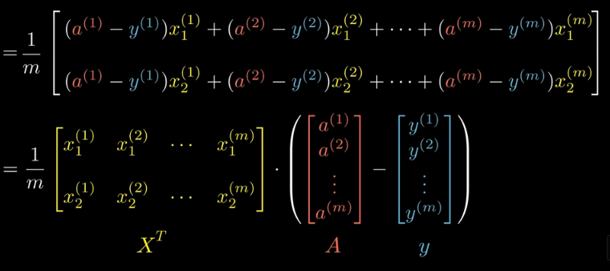

Au niveau des dimensions, on a donc un produit matricielle entre d'un côté la matrice transposé de $X$ qui est de dimension  (2,m) et d'un autre côté un grand vecteur qui est de dimension (m,1). Ce qui nous donne un résultat de dimension (2,1).

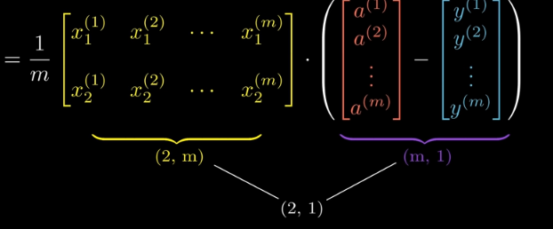

Comme on est censé obtenir pour notre Jacobien. 

On peut donc écrire que 

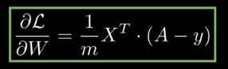

A présent voyons ce qu'il en est pour le gradient d rond $L$ sur d rond $b$. Alors contrairement aux précédents, ce gradient n'est pas un vecteur puisque le paramètre $b$ est un nombre réel. Donc la dérivée de la fonction $L$ par rapport à ce paramètre nous donne également un nombre réel. 

Dans la dernière leçon, nous avons vu que la formule pour calculer ce gradient était la suivante 

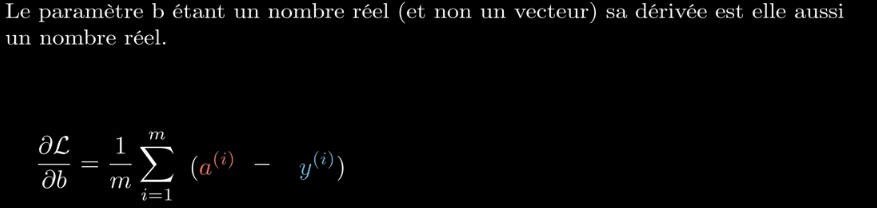

Ce qu'on va pouvoir faire, c'est directement insérer le vecteur $A$ est le vecteur $y$ 

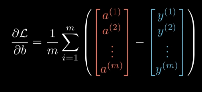

car on le voit, en combinant ces deux vecteurs ensemble 

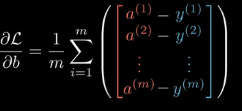

et en faisant la somme de tout le vecteur, ça nous donne un nombre réel comme ce qu'on est censé obtenir. 

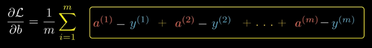

et voilà donc comment vectorisé le gradient de $b$ 

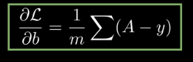

### 4.2 Equation à N-Variables ###

Cela conclut donc la vectorisation de nos équations 

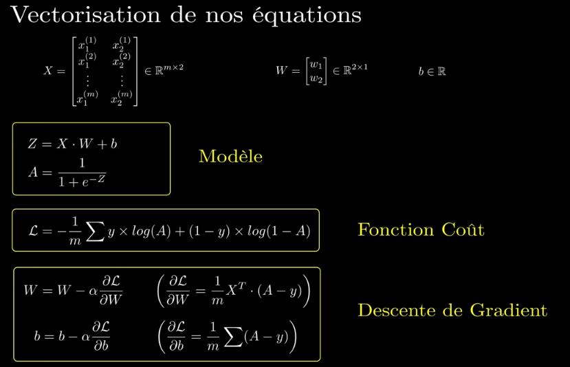

Alors dans cette leçon nous avons fait tout ça sur un Dataset comprenant deux variables $x_1$ et $x_2$. Mais ce qui est absolument génial c'est qu'on peut en réalité utilisé toutes ces équations sur autant de variables que nécessaire par exemple si notre Dataset comprend 10 variable $x_1$, $x_2$, $x_3$ jusqu'à $x_{10}$ et bien tout ce que nous avons à faire c'est de générer un vecteur $W$ qui comprennent 10 paramètres $w_1$, $w _2$ jusqu'à $w_{10}$ 

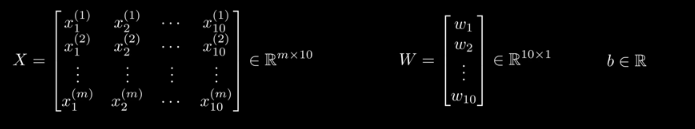

et cela nous permet alors d'utiliser toutes nos équations sans avoir à les modifier. 

En effet pour calculer le vecteur $Z$, on continuera d'effectuer le produit matricielle $Z=X \cdot W+b$, ça nous donnera

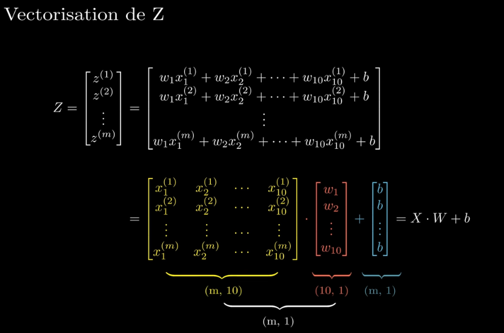

Ensuite, pour calculer le vecteur $A$, comme tout à l'heure on passera le vecteur $Z$ au sein de la fonction d'activation. 

Pour notre fonction coût rien n'a changé et concernant les gradients et bien au lieu de mettre à jour un vecteur $W$ qui comprend seulement deux paramètres $w_1$ et $w_2$ et bien on mettra à jour à paramètres $W$ qui comprend les 10 paramètres de $w_1$ jusqu'à $w_{10}$ 

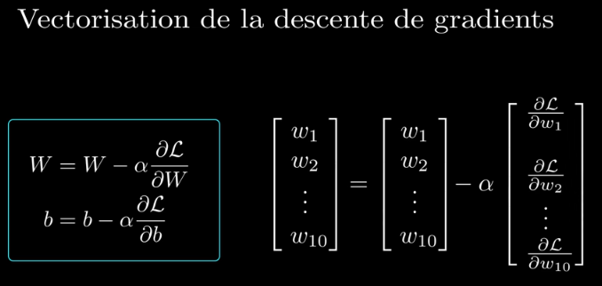

Et bien sûr n'oublions pas le gradient d rond $L$ sur d rond $W$ celui ci sera toujours égal à 

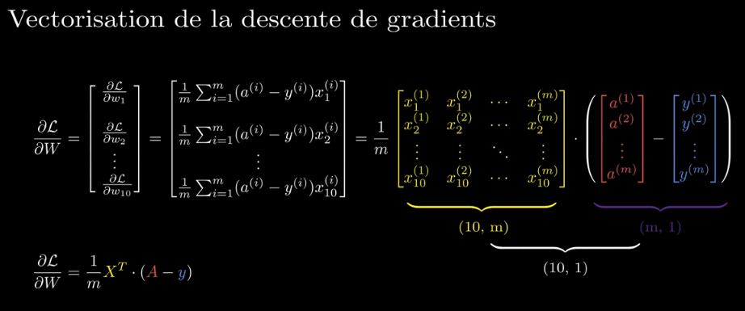

Voilà donc pourquoi il était si important de vectorisé toutes nos équations. 

- ***Cela permet d'une part de traiter toutes nos données en une seule opération*** sans avoir à passer par des boucles for.
- Mais aussi ***de traiter des problèmes avec autant de variables que nécessaire*** 

Et voilà maintenant qu'on a toutes ces équations et bien il ne reste plus qu'une chose à faire c'est de les implémenter.

## Leçon 5 : Programmation d'un neurone artificiel ##

Nous allons développer notre premier programme de neurone artificiel. Et pour ça nous allons implémenter toutes les équations que l'on a vu dans les dernières leçons. 

### 5.1 Diagramme fonctionnel ###

Alors, pour développer notre programme de neurones artificiels, nous allons partir d'un Dataset $(X, y)$ de 100 lignes et de deux colonnes. 

Si on veut, on peut imaginer que ce Dataset représente des plantes avec la longueur et la largeur de leurs feuilles. Et notre but, c'est d'entraîner un neurone artificiel pour reconnaître les plantes toxiques des plantes non toxique grâce à ces données de référence. 

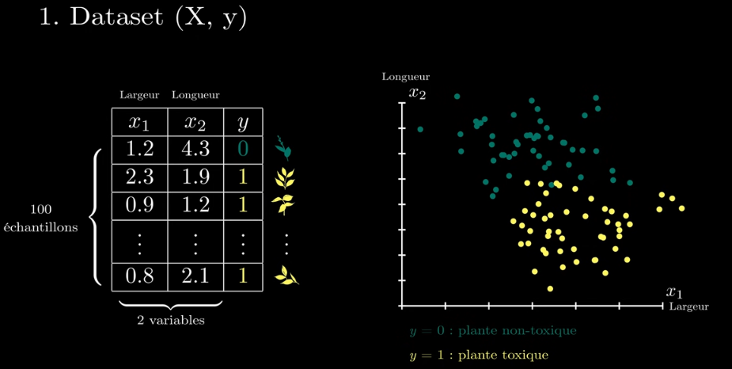

Alors pour faire ça, nous allons devoir structurer notre code de la façon suivante. 

1. Pour commencer, nous aurons besoin d'une fonction d'initialisation qui, comme son nom l'indique, nous permettra d'initialiser les paramètres $w$ et $b$ de notre modèle.


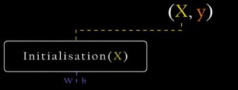

Dans cette fonction nous ferons passer la matrice $X$ car notre but, c'est d'obtenir un vecteur $W$ qui contiennent autant de paramètres que l'on trouve de variables dans la matrice $X$. 

Une fois cette étape d'initialisation effectué, nous écrirons ensuite un algorithme itératif dans lequel nous allons répéter en boucle les fonctions suivantes 

2. Pour commencer la fonction qui représente notre modèle de neurones artificiels, celle dans laquelle on va retrouver la fonction linéaire $Z=X \cdot W+b$ puis notre fonction d'activation $A=\frac{1}{1+e^{-Z}}$


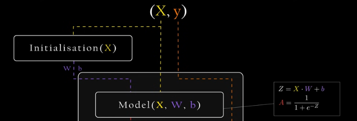


2. Ensuite nous aurons une fonction d'évaluation. C'est à dire notre fonction coûts qui nous permettra d'évaluer la performance du modèle en comparant la sortie $A$ aux données de référence $y$ que l'on a gardé de côtés 


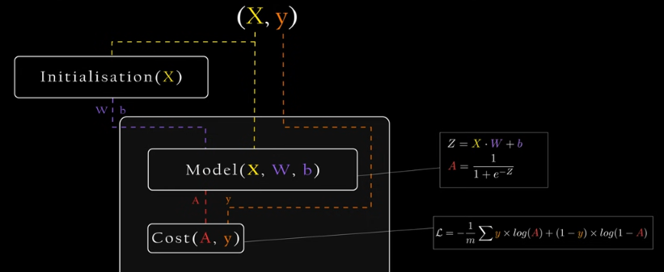

2. En parallèle, nous pourrons également calculer les gradients de cette fonction coûts grâce aux formules que l'on a développé dans les précédentes leçons 


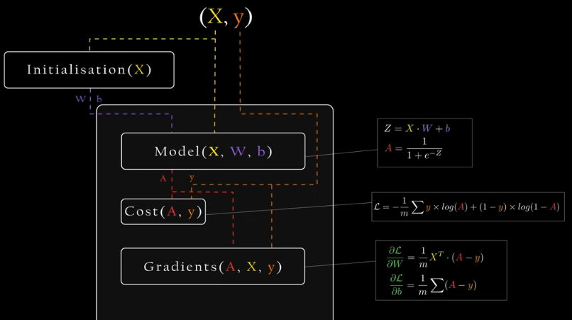

2. et pour finir nous utiliserons ces gradient dans une dernière fonction qui permettra de mettre à jour les paramètres $w$ et $b$ de manière à réduire d'une petite quantité les erreurs de notre modèle. 

Et voilà en répétant ainsi en boucle c'est quelques fonctions, 

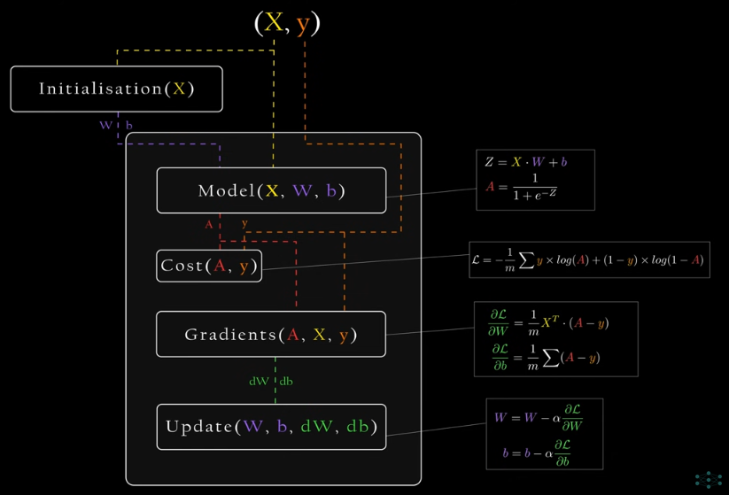

nous arriverons à minimiser le coût de notre modèle c'est ce qu'on appelle ***l'algorithme de la descente de gradient*** 

### 5.2 Implémentation des fonctions  ###

Voici l'implémentation. Le code se trouve sur [Labs_2_Deep_Learning_Programmation_neurone_artificiel](./../codes/Labs_2_Deep_Learning_Programmation_neurone_artificiel.ipynb)

#### Lab 2 : Deep Learning : Programmation d'un neurone artificiel ####

Nous allons développer notre premier programme de neurone artificiel.

Alors, pour développer notre programme de neurone artificiel, nous allons partir d'un Dataset $(X, y)$ de 100 lignes et de deux colonnes. 

Si on veut, on peut imaginer que ce Dataset représente des plantes avec la longueur et la largeur de leurs feuilles. Et notre but, c'est d'entraîner un neurone artificiel pour reconnaître les plantes toxiques des plantes non toxique grâce à ces données de référence. 

```python
import numpy as np
import matplotlib.pyplot as plt
from sklearn.datasets import make_blobs	
```

Pour commencer, nous allons générer un Dataset $(X,y)$ comprenant 100 lignes et deux variables grâce à la fonction **make_blobs** que l'on trouve dans sklearn.

1. `make_blobs`: Il s'agit d'une fonction qui génère des échantillons de données synthétiques. C'est souvent utilisé pour simuler des ensembles de données pour la classification ou la mise en grappes (clustering). Elle produit des groupes de points centrés autour de noyaux, rendant les données utiles pour des expériences de séparation linéaire.
2. `n_samples=100`: Cela signifie que l'ensemble de données généré contiendra 100 échantillons (points).
3. `n_features=2`: Chaque échantillon aura 2 caractéristiques (features). Dans un contexte graphique, cela signifie que les données peuvent être visualisées dans un espace 2D.
4. `centers=2`: Cela indique que les données seront réparties autour de 2 centres ou "blobs". Si vous le visualisez, vous verrez deux groupes distincts de points.
5. `random_state=0`: Cette option garantit que la génération des blobs sera reproductible. C'est-à-dire que si vous exécutez cette fonction avec le même `random_state` plusieurs fois, vous obtiendrez exactement le même ensemble de points à chaque fois. C'est utile pour garantir la consistance lors des expérimentations.

Les sorties `X` et `y` sont:

- `X`: Un tableau (array) de forme `(n_samples, n_features)` contenant les échantillons.
- `y`: Les labels associés à chaque échantillon. Dans cet exemple, puisque vous avez deux centres, `y` contiendra des valeurs 0 et 1, indiquant à quel centre (ou groupe) appartient chaque échantillon.

```python
X, y = make_blobs(n_samples=100, n_features=2, centers=2, random_state=0)
# Cette instruction génère 100 points dans un espace 2D, répartis autour de 2 centres, et stocke les coordonnées des points dans
# `X` et leurs labels respectifs dans `y`.

y = y.reshape((y.shape[0], 1)) 
# Cette instruction remodelera y pour qu'il ait une forme de (a, 1). Cela signifie que vous transformez y en un tableau 2D où
# chaque élément du tableau original se trouve maintenant dans sa propre ligne dans le nouveau tableau 2D. Chaque ligne contient 
# un seul élément.

print('dimensions de X :', X.shape)
print('dimensions de y: ', y.shape)

plt.scatter (X[:,0], X[:, 1], c=y, cmap='summer')
# plt.scatter: C'est la fonction de matplotlib utilisée pour créer un graphique de points dispersés.
# X[:,0] et X[:,1]: Ces deux X sont les coordonnées x et y des points que vous voulez tracer. Si X est un tableau 2D où chaque
# ligne représente un échantillon et chaque colonne représente une caractéristique, alors X[:,0] donne toutes les valeurs de la
# première caractéristique (essentiellement toutes les valeurs de la première colonne) et X[:,1] donne toutes les valeurs de la
# seconde caractéristique (toutes les valeurs de la deuxième colonne).

# c=y: Ceci définit les couleurs des points. Dans ce cas, vous utilisez le tableau y comme valeurs pour colorer les points. Si y
# contient des labels de classe (par exemple, 0 et 1 pour une classification binaire), alors les points seront colorés en
# fonction de leur label.

# cmap='summer': C'est le "colormap" utilisé pour colorer les points. Un "colormap" est essentiellement une gamme de couleurs.
# 'summer' est l'un des nombreux colormaps disponibles dans matplotlib. Il définit comment les différentes valeurs dans y
# doivent être traduites en couleurs.

# En combinant tout cela, cette commande tracera tous les échantillons de X dans un espace 2D, en colorant chaque point en
# fonction de sa valeur correspondante dans y, en utilisant la gamme de couleurs 'summer'. Si y contient des labels de
# classification, cela permettrait de visualiser comment les différents échantillons sont distribués et séparés en fonction de
# leurs labels.

plt.show()
```

```
dimensions de X : (100, 2)
dimensions de y:  (100, 1)
```

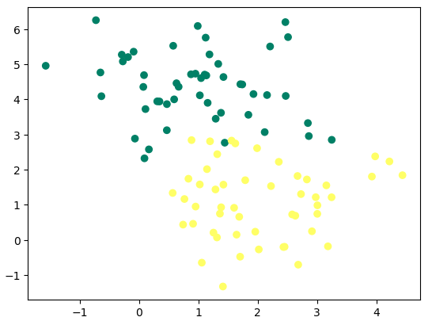

##### 1. La fonction d'initialisation #####

Donc on va écrire $\mathrm {def\ initialisation}$, dans laquelle nous faisons passer la matrice $X$. Puisque cette matrice, on va s'en servir pour donner aux vecteurs $W$ une dimension de telle sorte à ce qu'on trouve autant de paramètres dans $W$ que l'on a deux variables dans $X$. 

Donc, nous avons une matrice $X$ à deux variables. On désire donc avoir un vecteur $W$ qui contiennent deux paramètres. Et si à l'avenir, dans cette matrice $X$, nous avons quatre, cinq, ou six variables et bien on voudra avoir un vecteur $W$ qui comprennent quatre, cinq ou six paramètres. C'est pourquoi à l'intérieur de la fonction $\mathrm {randn()}$, en termes de dimensions, nous allons passer la dimension de $X$ donc la dimension sur laquelle on retrouve les variables.

Ca nous donnera un vecteur $W$ de dimension (2,1).

Pour le paramètre $b$, nous allons faire sensiblement la même chose ,sauf que nous pouvons tout simplement passer un nombre réel pour le paramètre $b$ et donc cette fonction nous retourne un $tupple$ comprenant $W$ et $b$

```python
def initialisation(X):
   W = np.random.randn(X.shape[1],1)
# np.random.randn: C'est une fonction de numpy qui renvoie un échantillon (ou des échantillons) à partir de la "distribution
# normale standard", c'est-à-dire une distribution gaussienne avec une moyenne de 0 et une variance de 1.

# X.shape[1]: Cela récupère la deuxième dimension (nombre de colonnes) de X. Si X est un tableau de forme (m, n), où m est le
# nombre de lignes (échantillons) et n est le nombre de colonnes (caractéristiques), alors X.shape[1] serait égal à n.

# W = np.random.randn(X.shape[1], 1): Cette instruction génère un tableau 2D de forme (n, 1) (où n est le nombre de
# caractéristiques de X), et chaque valeur dans ce tableau est tirée de la distribution normale standard.

# L'intention typique derrière une telle instruction est de créer un vecteur de poids initial (W) pour un algorithme
# d'apprentissage, comme la régression logistique ou une simple perceptron, lorsque les données ont n caractéristiques. Les
# poids sont souvent initialisés avec des petites valeurs aléatoires, et une distribution normale standard est un choix courant
# pour cette initialisation.

	b = np.random.randn(1)   
   return (W, b)
```

##### 2. La fonction modèle #####

On va pouvoir passer à la deuxième fonction à implémenter. C'est la fonction de notre modèle $\mathrm {def\ model}$ dans laquelle on va faire passer les données $X$ ainsi que les paramètres $W$ et $b$ qui ont été initialisé. 

Alors la première chose qu'on veut faire dans cette fonction modèle, c'est de calculer le vecteur $Z$ d'après les formules qu'on a développé dans les dernières leçons. On sait que $Z$ est le produit matricielle entre $X$ et $W$ plus le paramètre $b$. 

Donc maintenant que nous avons ce vecteur $Z$, nous allons le passé dans notre fonction d'activation pour obtenir le vecteur $A$.

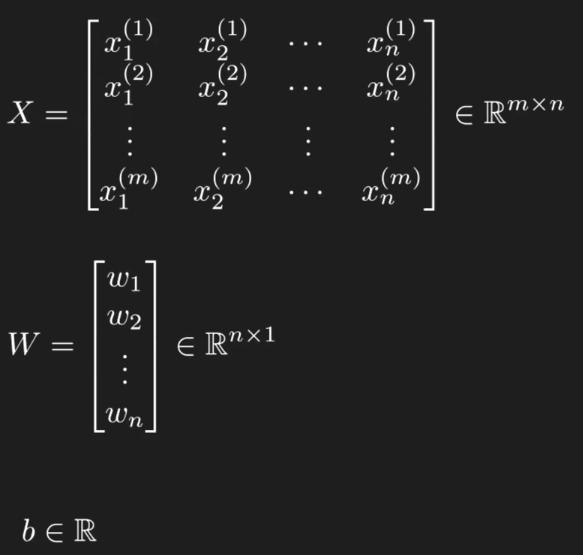

Et donc, notre modèle nous retourne nos activation. 

Alors, la dimensionnalité de $A$ est de (100,1). C'est parce que nous avons 100 valeurs dans notre Dataset échantillons et  donc il est naturel qu'on obtienne 100 activations de la part de notre neurone, une part échantillon.

1. `-Z`: Cela inverse le signe de chaque élément de la matrice ZZ.
2. `np.exp(-Z)`: Ceci calcule l'exponentielle de chaque élément de la matrice résultante de `-Z`. La fonction `exp` de `numpy` est utilisée pour cela.
3. `1 + np.exp(-Z)`: Ceci ajoute 1 à chaque élément de la matrice résultante de l'étape précédente.
4. `1 / (1 + np.exp(-Z))`: Ceci prend l'inverse de chaque élément de la matrice résultante de l'étape précédente.

La fonction résultante est la fonction sigmoïde, qui est définie par : $sigma(z) = \frac{1}{1 + e^{- z}}$

La fonction sigmoïde est souvent utilisée comme fonction d'activation dans les algorithmes de classification binaire parce qu'elle produit une sortie entre 0 et 1, ce qui peut être interprété comme une probabilité. Le résultat, `A`, sera de la même forme que `Z` et contiendra les valeurs transformées par la fonction sigmoïde pour chaque élément de `Z`.

En contexte de régression logistique (un type d'algorithme de classification binaire), cette étape transforme les combinaisons linéaires des entrées (calculées par `Z = X.dot(W) + b`) en probabilités, où chaque élément de `A` est la probabilité que l'échantillon correspondant appartienne à la classe positive.

```python
def model(X,W,b):
    Z = X.dot(W) + b
# X.dot(W): Ceci réalise le produit matriciel (ou dot product en anglais) entre la matrice X et le vecteur W. Si X est de forme
# (m, n) où m est le nombre d'échantillons et n est le nombre de caractéristiques, et si W est de forme (n, 1), alors le
# résultat de X.dot(W) sera de forme (m, 1). Chaque élément du résultat est la somme des produits des caractéristiques d'un
# échantillon par leurs poids associés.
# + b: Ceci ajoute le biais b à chaque élément du résultat précédent. En pratique, b est souvent un scalaire, et cette addition
# est diffusée (broadcasted) à chaque élément de la matrice résultante de X.dot(W).
# Le résultat Z est un vecteur de forme (m, 1) où chaque élément est une combinaison linéaire des caractéristiques d'un
#échantillon avec les poids W et le biais b.
# Dans un contexte d'apprentissage automatique, cette étape est couramment utilisée pour calculer les prédictions linéaires d'un
# modèle, avant d'appliquer éventuellement une fonction d'activation pour obtenir les prédictions finales (par exemple, une
# fonction sigmoïde pour la régression logistique).      

    A = 1 / (1 + np.exp(-Z)) 

    return A
```

##### 3. La fonction de coût #####

Maintenant nous allons passer à la fonction coût $\mathrm{def\ log\_loss}$. Donc cette fonction, on la connaît grâce à ce qu'on a vu dans les dernières leçons et c'est $\mathcal{L}=-\frac{1}{m} \sum y \times \log (A)+(1-y) \times \log (1-A)$ 

Alors qu'est ce que ça représente $m$, et bien c'est le nombre d'échantillons c'est à dire le nombre de points que l'on a dans $y$ à savoir 100. C'est la longueur de $y$ 

Note: dans le code, j'ai placé le signe "négatif" à l'intérieur de la somme, mais cela ne change rien à notre fonction!

```python
def log_loss(A, y):
    return 1 / len(y) * np.sum(-y * np.log(A) - (1 - y) * np.log(1 - A))    
```

Alors on va pouvoir s'en servir et puis vérifier si tout va bien donc $\mathrm {log\_loss (A, y)}$.

En principe c'est censé nous donner un nombre réel et non pas un vecteur et c'est ce qu'on obtient très bien.

##### 4. La fonction gradient #####

Maintenant nous allons créer la fonction des gradients dans laquelle nous nous avons besoin de $A$, $X$ et $y$. 

Alors on va dénoter le Jacobien : $\frac{\partial \mathcal{L}}{\partial W}=\frac{1}{m} X^T \cdot(A-y)$. Donc ça c'est pour $W$ et pour d rond $L$ sur d rond $b$, nous avons $\frac{\partial \mathcal{L}}{\partial b}=\frac{1}{m} \sum(A-y)$

```python
def gradients (A, X, y):
    dw = 1 / len(y) * np.dot(X.T, A - y)
    db = 1 / len(y) * np.sum(A - y)
    return (dw, db)
```

Voilà ça c'est la formule de nos gradient donc on va retourner $dW$ et $db$. 

Alors, ici, la dimension $dW$,nous donne un vecteur de dimension (2,1). C'est logique, vu que si on veut ensuite soustraire dans la formule de la descente de gradient le vecteur $W$ au vecteur $dW$,

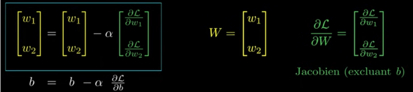

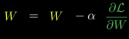

##### 5. L'update : descente de gradient

A ce stade, il ne nous reste qu'une dernière chose à implémenter, c'est la fonction de mise à jour $\mathrm {def\ update(dW, db, W, b, learning\_rate)}$

$learning\_rate$ est un pas de mises à jour ou pas d'apprentissage, qui représente le $\alpha$ dans nos formules.

Maintenant, on va implémenter les formules de la descente de gradient.  Cette fonction, nous retourne un tuple comprenant $W$ et $b$.

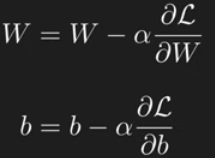

```python
def update (dW, db, W, b, learning_rate):
    W = W - learning_rate * dW
    b = b - learning_rate * db
    return (W, b)
```

##### 6. Assemblage finale #####

Nous allons rassembler toutes ces formules: l'initialisation, le modèle, le LogLoss,  le gradient et la formule pour mettre à jour nos paramètres. 

On va rassembler tout ça dans notre algorithme

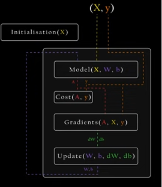

On va créer une fonction $\mathrm{def\ artifical\_neurone(X, y, learning\_rate, nbr\_iter)}$ dans laquelle nous allons faire passer nos données $X$ et $y$ ainsi qu' un learning rate qui nous servira dans la fonction de descente de gradient et il nous faut une dernière chose, c'est un nombre d'itérations, un nombre de cycles.

Alors on va déjà fixer des valeurs par défaut pour ces deux arguments, donc un learning rate égal à 0,1 et un nombre d'itérations égal à 100. 

Donc la première chose à faire, c'est d'initialiser les paramètres $W$ et $b$. Ensuite, on va créer notre boucle d'apprentissage avec une boucle for. Et on va répéter en boucle la fonction de notre modèle, celle de notre coût, celle de nos gradients, et celle de notre descente de gradient.

```python
def artificial_neurone(X, y, learning_rate=0.1, nbr_iter=100):
    #initialisation W, b
    W, b = initialisation (X)
    
    for i in range(n_iter):
        A = model(X, W, b)
        loss = log_loss(X, W, b)
        dW, db = gradients(A, X, y)
        W, b = update(dW, db, W, b, learning_rate)
    
```

Donc en effectuant cet algorithme en boucle, les paramètres *𝑊* et *𝑏* seront mises à jour. Puis ils seront réutilisées tout en haut dans la  fonction modèle pour refaire des prédictions qui seront à nouveau  comparé pour calculer des gradients, pour remettre à jour les paramètres *𝑊* et *𝑏*

 etc...

Voilà ça conclut notre implémentation d'un neurone artificiel. 

### 5.3 Visualiser l'évolution du coût ###

Alors la leçon n'est pas finie, la première chose qu'on pourrait faire serait de visualiser l'évolution du coût. Pour s'assurer que notre modèle est bien appris.

On va créer une liste Loss et on va à chaque fois rajouter à la fin de la liste, la valeur du coût qui est calculé pour l'itération en cours. Et donc ce qu'on peut faire à la fin de notre algorithme, c'est afficher une courbe.

```python
def artificial_neurone(X, y, learning_rate=0.1, nbr_iter=100):
    #initialisation W, b
    W, b = initialisation (X)
    
    loss=[]
    
    for i in range(nbr_iter):
        A = model(X, W, b)
        loss.append(log_loss(A, y))
        dW, db = gradients(A, X, y)
        W, b = update(dW, db, W, b, learning_rate)

    plt.plot(loss)
    plt.show()  
```

Et donc en utilisant notre fonction artificial neurone dans laquelle on fait passer $X$ et $W$ , 

```python
artificial_neurone(X, y)
```

on obtient donc notre courbe d'apprentissage. 

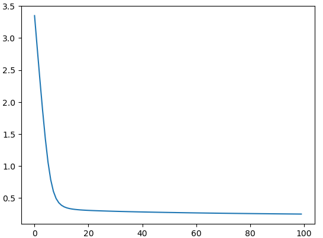

c'est à dire l'évolution des erreurs effectuées par le modèle au fur à mesure que celui ci apprend. 

Donc on voit que les erreurs diminues et que la fonction coût convergent vers une valeur plateau. Voilà une valeur limite en dessous de laquelle elle ne peut pas descendre. 

### 5.4 Effectuer de futures prédictions ###

Alors maintenant que nous avons un modèle, nous pouvons nous en servir pour effectuer des prédictions. Par exemple, si nous prenons une nouvelle plante et que nous mesurons la longueur et la largeur de ses feuilles et que nous entrons ces informations dans le modèle, celui ci va me retourner la probabilité que la plante soit toxique car, rappelez vous, la sortie de notre modèle c'est une fonction sigmoïde que l'on peut voir comme une probabilité toujours comprise entre 0 et 1. 

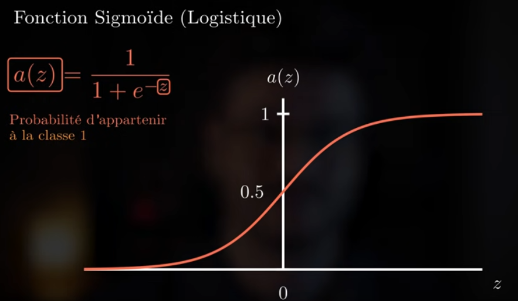

Donc ce qu'on fait en général, c'est qu'à partir du moment où cette probabilité est supérieur à 0,5, on dit que la plante est toxique et qu'elle appartient à la classe $y$ =  1. 

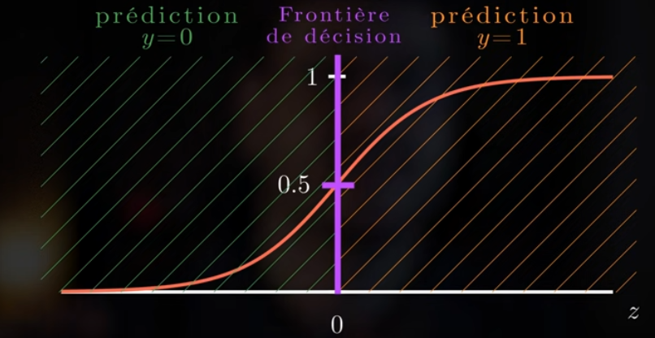

Alors pour l' implémenter, il va donc falloir créer une nouvelle fonction predict, dans laquelle nous ferons passer des données $X$, alors ça peut être les données dont on dispose à l'heure actuelle ou bien n'importe quelle donnée futur, ainsi que les paramètres de notre modèle. 

La première chose à faire dans cette fonction c'est de calculer les activations, les sorties du modèle, grâce à $(X,W,b)$. Ensuite ces activations lorsqu'elles seront supérieures au seuil de 0,5, alors on dit généralement supérieures ou égale, on retournera la valeur de la classe. Ici, on peut simplement écrire ça sous forme booléenne.

```python
def predict(X, W, b):
    A = model(X, W, b)
    print(A)
    return A >= 0.5
```

Alors on peut s'en servir dans notre fonction artificial_neurone. Une chose qu'on peut faire, c'est après avoir fini notre apprentissage et bien on peut calculer les prédictions pour toutes les données $X$ de notre Dataset. donc les 100 données que nous avons. Donc on va calculer ce que la machine prédit pour ses 100 valeurs. 

Ensuite une chose qui serait très cool à faire ça serait d'imprimer la performance de notre modèle. Alors pas la fonction coût, pas le Loss mais bien la performance, ici, en l'occurrence on pourrait choisir une accuracy c'est à dire une exactitude. 

```python
from sklerarn.metrics import accuracy_score
```

Cette fonction,  on va s'en servir pour comparer les données de référence $y$ avec nos prédictions.

```python
def artificial_neurone(X, y, learning_rate=0.1, nbr_iter=100):
    #initialisation W, b
    W, b = initialisation (X)
    
    loss=[]
    for i in range(nbr_iter):
        A = model(X, W, b)
        loss.append(log_loss(A, y))
        dW, db = gradients(A, X, y)
        W, b = update(dW, db, W, b, learning_rate)

    y_pred = predict(X, W, b)
    print(accuracy_score(y, y_pred))
    
    plt.plot(loss)
    plt.show()
```

Si maintenant on réexécute notre code,  nous voyons que notre modèle à une performance égale à 90% c'est-à-dire que sur ces données d'entraînement elle arrive à donner de bonnes réponses 90% du temps. D'ailleurs comme nous avons exactement 100 points dans notre Dataset ça veut dire qu'elle fait 89 bonnes réponses.

```python
artificial_neurone(X, y)
```

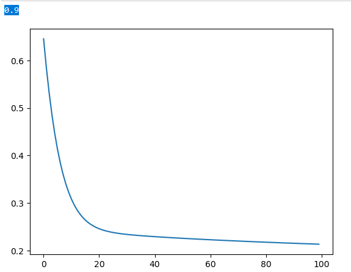


Donc, maintenant vous pourriez vous dire c'est chouette tout ça, mais ce que j'aimerais ça serait me servir de ce modèle pour faire de futurs prédictions. Alors pour ça il va déjà falloir retourner les paramètres $W$ et $b$ que le modèle a appris.

```python
def artificial_neurone(X, y, learning_rate=0.1, nbr_iter=100):
    #initialisation W, b
    W, b = initialisation (X)
    
    loss=[]
    for i in range(nbr_iter):
        A = model(X, W, b)
        loss.append(log_loss(A, y))
        dW, db = gradients(A, X, y)
        W, b = update(dW, db, W, b, learning_rate)

    y_pred = predict(X, W, b)
    print(accuracy_score(y, y_pred))
    
    plt.plot(loss)
    plt.show()
    
    return(W, b)
```

Ces paramètres d'ailleurs on peut ensuite les sauvegarder sur notre disque dur et à l'avenir à chaque fois qu'on a besoin de faire des prédictions, nous n'avons pas besoin de ré entraîner un modèle tout ce qu'on fait c'est qu'on charge ces paramètres dans un programme on les fait passer dans notre fonction predict et voilà, on a notre réponse. 

Donc,  nous allons sauvegarder ces paramètres $W$ et $b$. 

```python
W, b = artificial_neurone(X, y)
W, b
```

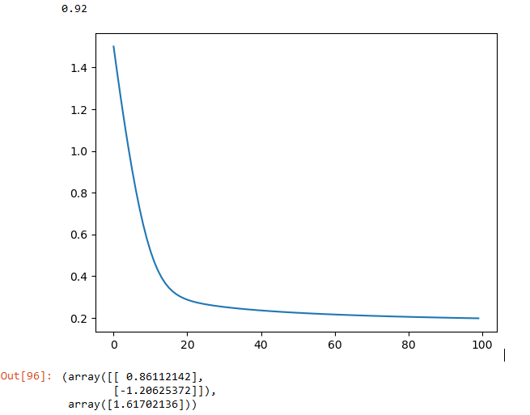

Et nous allons utiliser ces paramètres sur une nouvelle plante. Donc par exemple disons qu'on récolte une plante et qu'on mesure sa variable $x_1 = 2\ et\ x_2 = 1$. 

Donc nous allons écrire new_plant égal un tableau matricielle [2,1]. 

```
new_plant = np.array([2,1])
```

On va la visualiser dans notre graphique et on va dire que la couleur est rouge pour cette plante.

```
plt.scatter (X[:,0], X[:, 1], c=y, cmap='summer')
plt.scatter(new_plant[0], new_plant[1], c='r')
plt.show
```

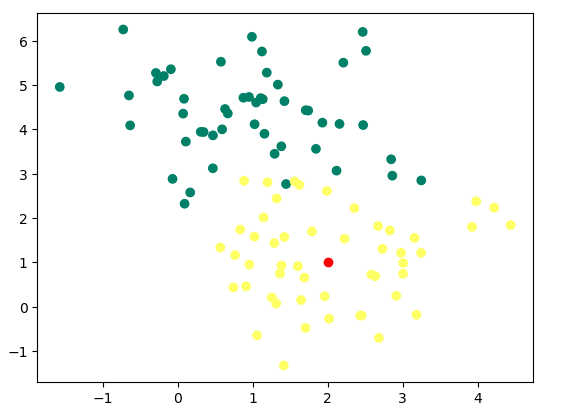

On va utiliser la fonction predict dans laquelle on va faire passer new_ plant ainsi que nous paramètres $W$ et $b$. 

```
print(predict (new_plant, W, b))
[True]
```

Et voilà selon la machine cette plante est dans la classe numéro 1, donc dans la classe des plantes toxiques. Cette plante est dangereuse et il ne faut pas la consommer. 

Alors, ce qu'on pourrait faire pour aller encore plus loin,  ça serait d'imprimer la probabilité. Alors pour ça, on va donc, avant le return de predict, faire un print et ceci pour imprimer la probabilité d'activation associée à cette plante. 

```
[0.96092361]
[ True]
```

Et ce qu'on voit c'est que cette plante est toxique à 96%. 

### 5.5 Tracer la frontière de décision ###

Pour aller encore plus loin, on pourrait même tracer la frontière de décision qui sépare nos deux classes. 

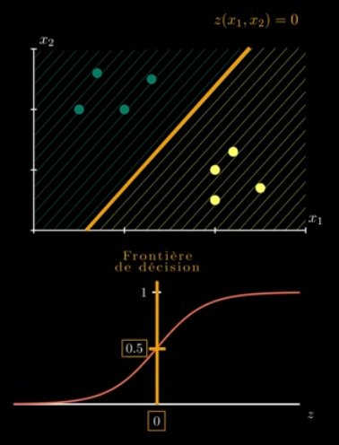

Notre frontière de décision, c'est l'ensemble des points pour lesquels $Z$ est égal à zéro et ça c'est parfaitement logique d'un point de vue mathématique vu qu'on a dit que la frontière de décision c'est aussi l'endroit pour lequel les probabilités supérieurs à 50% aura le point $Z$ pour lequel $a$ est égal à 0,5 c'est à dire la fonction sigmoïde est égal à 0,5, c'est lorsque $Z$ est égal à zéro. 

Voilà donc pourquoi ces deux éléments sont liés $Z$ égal 0 et $a$ égal et 0,5, c'est la même chose. 

Donc pour connaître l'équation de la droite que l'on voudrait tracé, il suffit de dire que c'est l'ensemble des points pour lesquels $Z$ est égal à zéro. 

C'est à dire l'ensemble des points $(x_1, x_2)$ pour lesquels $w_1 x_1 + w_2 x_2 + b = 0$. 

Alors en faisant un petit peu de mathématiques on peut isoler les termes $x_1$ et $x_2$, ce qui nous permet de dire par exemple si on veut tracer une droite allant de  $x_1=-1$  et $ x_1=4$  et bien donc on peut dire que $x_2 = (- w_1 x_1 - b) / w_2$.

Donc on va créer $x_0$ pour commencer notre indexing, on va dire que $x_0$ c'est la première variable et $x_1$ c'est la deuxième variable, qui s'étend de -1 à +4 donc avec un linspace de -1 à +4 avec 100 points. Et ensuite on va dire que $x_1 = (- w_0 x_0 - b) / w_1$

```python
new_plant = np.array([2,1])

x0 = np.linspace(-1, 4, 100)
x1 = ( -W[0] * x0 - b) / W[1]

plt.scatter (X[:,0], X[:, 1], c=y, cmap='summer')
plt.scatter(new_plant[0], new_plant[1], c='r')

plt.plot(x0, x1, c='orange', lw=3)

plt.show
```

Donc si on exécute tout ça et qu'on s'est pas trompé, on obtient une belle frontières de décision qui va de -1 jusqu'à +4 

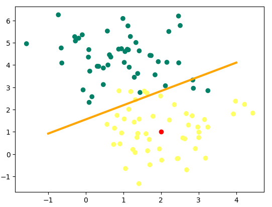

Donc, on comprend que tout ce qui est au dessus va être prédits par la machine comme appartenant dans la classe verte. Donc ici c'est la classe zéro, les plantes non toxique. Et tout ce qui est en dessous va être dans la classe jaune, donc la classe des plantes toxiques. 

### 5.6 Visualisations 3D et Animation ###

Alors si on veut encore plus s'amuser on peut visualiser tout ça en 3D. 

```python
import plotly.graph_objects as go
```

```python
fig = go.Figure(data = [go.Scatter3d(
    x = X[:, 0].flatten(),
    y = X[:, 1].flatten(),
    z = y.flatten(),
    mode = 'markers',
    marker = dict(
        size = 5,
        color = y.flatten(),
        colorscale = 'YlGn',
        opacity = 0.8,
        reversescale = True    
    )
)])

fig.update_layout (template = 'plotly_dark', margin=dict(l=0, r=0, b=0, t=0))
fig.layout.scene.camera.projection.type = "orthographic"
fig.show()
```

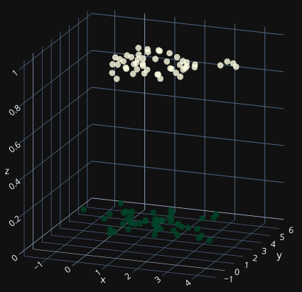

```python
X0 = np.linspace(X[: ,0].min(), X[: ,0].max(), 100)
X1 = np.linspace(X[: ,1].min(), X[: ,1].max(), 100)
xx0, xx1 = np.meshgrid(x0, X1)
Z = W[0] * xx0 + W[1] * xx1 + b
A = 1 / (1 + np.exp(-Z))

fig = (go.Figure(data=[go.Surface(z = A, x = xx0, y = xx1, colorscale='YlGn', opacity = 0.7, reversescale = True )]))
fig.add_scatter3d(x = X[:, 0].flatten(), y = X[:, 1].flatten(), z = y.flatten(), mode = 'markers', marker = dict(size=5, color=y.flatten(), colorscale='YlGn', opacity = 0.9, reversescale = True))

fig.update_layout (template = 'plotly_dark', margin=dict(l=0, r=0, b=0, t=0))
fig.layout.scene.camera.projection.type = "orthographic"
fig.show()
```

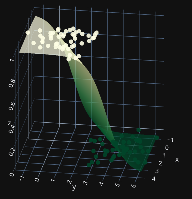


Une chose encore plus amusante c'est de sauvegarder tout l'historique d'apprentissage de la machine, c'est à dire la valeur de $W$ et $b$ pour chaque itération. Pour ensuite générer une animation qui permet de voir quel a été le comportement du modèle lors de son apprentissage. 

```python
def artificial_neurone(X, y, learning_rate=0.2, nbr_iter=100):
    #initialisation W, b
    W, b = initialisation (X)
    
    history=[]
    loss=[]
    
    for i in range(nbr_iter):
        A = model(X, W, b)
        loss.append(log_loss(A, y))
        dW, db = gradients(A, X, y)
        W, b = update(dW, db, W, b, learning_rate=learning_rate)
        history.append([W, b, loss, i])  
    
    plt.plot(loss)
    plt.show()
    
    return history
```

```python
def animate(params):
    W = params[0]
    b = params[1]
    loss = params[2]
    i = params[3]
    
    ax[0].clear()
    ax[1].clear()
    ax[2].clear()
    
    s = 300
    
    # Frontière de décision
    ax[0].scatter(X[:, 0], X[:, 1], c=y, s=s, cmap='summer', edgecolor='k', linewidth=3 )
    
    xlim = ax[0].get_xlim()
    ylim = ax[0].get_ylim()
    
    x1 = np.linspace(-3, 6, 100)
    x2 = ( - W[0] * x1 - b) / W[1]
    ax[0].plot(x1, x2, c='orange', lw=4)
    
    ax[0].set_xlim(X[:, 0].min(), X[:, 0].max() )
    ax[0].set_ylim(X[:, 1].min(), X[:, 1].max() )
    ax[0].set_title('Frontière de Décision')
    ax[0].set_xlabel('x1')
    ax[0].set_ylabel('x2')
    
    #Sigmoïde
    z = X.dot(W) + b
    z_new = np.linspace(z.min(), z.max(), 100)
    A = 1 / (1 + np.exp(-z_new)) 
    ax[1].plot(z_new, A, c='orange', lw=4)
    ax[1].scatter(z[y==0], np.zeros(z[y==0].shape), c='#000064', edgecolor='k',linewidth=3, s=s)
    ax[1].scatter(z[y==1], np.ones(z[y==1].shape), c='#ffff64', edgecolor='k',linewidth=3, s=s)
    
    ax[1].set_xlim(z.min(), z.max())
    ax[1].set_title('Sigmoïd')
    ax[1].set_xlabel('Z')
    ax[1].set_ylabel('A(Z)')
    
    
    #Fonction coût
    for j in range(len(A[y.flatten()==0])):
        xx[1].vlines(z[y==0][j], ymin=0, ymax=1 / (1 * np.exp(-z[y==0][j])), color='red', alpha=0.5, zorder=-1)
        
    for j in range(len(A[y.flatten()==1])):
        xx[1].vlines(z[y==1][j], ymin=1, ymax=1 / (1 * np.exp(-z[y==1][j])), color='red', alpha=0.5, zorder=-1)
    
    ax[2].plot(range(i), loss[:i], color='red', lw=4)
    ax[2].set_xlim(loss[-1] * 0.5, len(loss))
    ax[2].set_ylim(0, loss[0] * 1.1)
    ax[2].set_title('Fonction coût')
    ax[2].set_xlabel('itaration') 
    ax[2].set_ylabel('loss') 
```

```python
from matplotlib.animation import FuncAnimation

history = artificial_neurone(X, y)

fig, ax = plt.subplots(nrows=1, ncols=3, figsize=(40, 10)) 
ani = FuncAnimation(fig, animate, frames=history, interval=200, repeat=False)

import matplotlib.animation as animation

Writer = animation.writers['ffmpeg']
writer = Writer(fps=30, metadata=dict(artist='Me'), bitrate=3200)
ani.save('animation.mp4', writer=writer)
```

Le fichier d'animation est sauvegarder sur [Animation_neurone_artifiel](./../codes/animation.mp4)

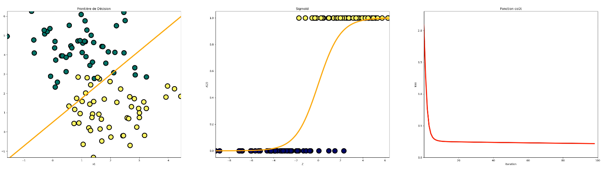

Donc ce qu'on peut voir c'est la frontière de décision qui s'ajuste à nos données au fur et à mesure de l'apprentissage. De même pour la fonction sigmoïd qui se rapproche de plus en plus aux données de référence et tout ça a donc pour effet de réduire les erreurs du modèle. 

Alors tout ça c'est bien marrant, mais dans la pratique on ne fait quasiment jamais ce genre de choses, pourquoi? Et bien parce que dans la vraie vie on travaille en général avec des Datasets de plus de deux variables. Par exemple, les Datasets avec 10 ou 100 variable et on ne peut pas visualiser ces Datasets dans des graphiques 2d comme utilisé dans cette leçon. 

### 5.7 Généralisation a N variables ###

Dans ces situation, il faut donc examiner notre courbe d'apprentissage pour s'assurer que notre modèle est bien appris. D'ailleurs ce qu'il y a de génial avec le code que l'on a développé, c'est qu'on peut l'utiliser  sur des Datasets avec autant de variables que l'on désire. Donc par exemple si nous revenons au tout début de notre code que nous fixons le nombre de features à 5, cela génère un tableau $X$ avec cinq colonnes à l'intérieur et grâce à notre fonction d'activation, dans laquelle on fait intervenir la dimension de $X$, cela nous retourne un vecteur $W$ qui contient lui aussi cinq paramètres et du coût tout notre code peut s'exécuter à la perfection. 

```python
X, y = make_blobs(n_samples=100, n_features=5, centers=2, random_state=0)
y = y.reshape((y.shape[0], 1))
```

## Leçon 5b : Neurone artificiel : orienté objet ##

Ce qui caractérise un neurone, c'est avant tout ses coefficients. Et dans un réseau de neurones, ce sera le nombre de neurones, le nombre de couche.

Notre neurone artificiel aura des méthodes pour qu'il puisse s'entrainer sur des données, on peut l'utiliser pour faire des prédictions, l'évaluer.

En créant notre neurone artificiel sous forme objet, on peut créer une bibliothèque. 

Voici l'implémentation. Le code se trouve sur [Labs_2_Deep_Learning_Programmation_neurone_artificiel_OO](./../codes/Labs_2_Deep_Learning_Programmation_neurone_artificiel_OO.ipynb)

**Lab 2 : Deep Learning : OO Programmation d'un neurone artificiel**

```
Class decorator. Adds all methods and members from the wrapped class to main_class
Args:
- main_class: class to which to append members. Defaults to the class with the same name as the wrapped class
- exclude: black-list of members which should not be copied
```

```python
import functools
def update_class(
    main_class=None, exclude=("__module__", "__name__", "__dict__", "__weakref__")
):
    """Class decorator. Adds all methods and members from the wrapped class to main_class

    Args:
    - main_class: class to which to append members. Defaults to the class with the same name as the wrapped class
    - exclude: black-list of members which should not be copied
    """

    def decorates(main_class, exclude, appended_class):
        if main_class is None:
            main_class = globals()[appended_class.__name__]
        for k, v in appended_class.__dict__.items():
            if k not in exclude:
                setattr(main_class, k, v)
        return main_class

    return functools.partial(decorates, main_class, exclude)
```

La classe artificial_neuron, ce qui caractérise un neurone artificiel, ce sont ses paramètres. Nous allons initialiser $W$ qui sont les coefficient et $b$ qui est le biais. On va aussi faire passer en paramètre, le nombre d'itération et le learning_rate. Pour info, en général, le n_iter = 1000 ou 10000 et le learning_rate est égale à 0.01.

L' erreur est aussi un attribut de notre neurone.

```python
class artificial_neuron:
    def __init__(self, n_iter=100, learning_rate=0.1):
        self.coef_ = None # W
        self.bias_ = None # b
        self.n_iter_ = n_iter
        self.learning_rate_ = learning_rate
        self.loss_ = []
```

On va définir une méthode predict_proba() pour l'activation. On passe les données $X$, à partir desquels nous pouvons faire des prédictions.

```python
@update_class()
class artificial_neuron:
    def predict_proba(self,X):
        Z = X.dot(self.coef_) + self.bias_
        return 1 / (1 + np.exp(-Z))
```

Nous allons faire les prédictions. Il faut bien sûr passer les caractéristiques $X$ en paramètres.

Nous allons calculer les activations. Lorsqu'elles sont supérieur à 0.5, on retourne un booléen.

```python
@update_class()
class artificial_neuron:
    def predict(self, X):
        A = self.predict_proba (X)    
        return A >= 0.5
```

On va afficher le loss.

```python
@update_class()
class artificial_neuron:
    def display_loss(self):
        plt.plot(self.loss_)
        plt.show()
```

Pour l'attibut loss, nous allons créer une méthode log_loss (y, A). Pour info, dans les paramètres on fait tounjours passer le $y_{true}$ qui est la référence et ensuite, on fait passer les prédictions $A$ pour info, on rajoute un $\varepsilon$ pour éviter la division par 0.

```python
@update_class()
class artificial_neuron:
    def log_loss(self, y, A):
        return 1 / len(y) * np.sum(-y * np.log(A + 10E-15) - (1 - y) * np.log(1 - A + 10E-15))     
```

Maintenant qu'on a initialisé notre neurone, on va l'entraîner. Et comme dans sklear, on va créer une méthode fit.

Pour entraîner nos données, il faut deux paramètres les données en entrées $X$ et la prédiction $y$.

Les gradients sont calculés mais ne sont pas considérés comme des attributs de notre neurone.
Une fois que les gradients sont calculés, on peut mettre à jour les coefficients et le biais.

```python
@update_class()
class artificial_neuron:
    def fit (self, X, y):

        #initialisation W, b
        self.coef_ = np.random.randn(X.shape[1],1)    
        self.bias_ = np.random.randn(1)

        self.loss=[] #ici, on réinitialise le loss car si on refit notre modèle, il faut réinitialiser le loss.

        #Apprentissage
        for i in range(self.n_iter_):
            #Activation               
            A = self.predict_proba(X)

            #loss
            self.loss_.append(self.log_loss(y, A))

            #Gradients
            dW = 1 / len(y) * np.dot(X.T, A - y)
            db = 1 / len(y) * np.sum(A - y)

            #update
            self.coef_ = self.coef_ - self.learning_rate_ * dW
            self.bias_ = self.bias_ - self.learning_rate_ * db                      
```

Pour commencer, nous allons générer un Dataset $(X,y)$ comprenant 100 lignes et deux variables grâce à la fonction **make_blobs** que l'on trouve dans sklearn.

```python
import numpy as np
import matplotlib.pyplot as plt
from sklearn.datasets import make_blobs	

X, y = make_blobs(n_samples=100, n_features=2, centers=2, random_state=0)
y = y.reshape((y.shape[0], 1))

print('dimensions de X :', X.shape)
print('dimensions de y: ', y.shape)

plt.scatter (X[:,0], X[:, 1], c=y, cmap='summer')
plt.show()

model.display_loss()
```

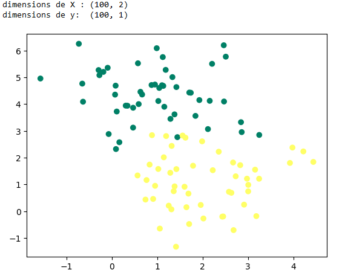

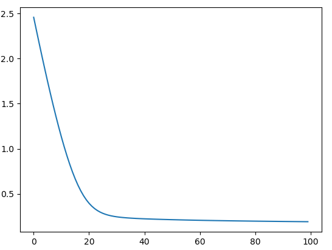

## Leçon 6 : Neurone artificiel : Chient vs Chat ##

Voici l'implémentation. Le code se trouve sur [Labs_2_Deep_Learning_Programmation_neurone_artificiel](./../codes/Labs_3_Deep_Learning_Chient_vs_Chat.ipynb)

Nous allons développer un programme de vision par ordinateur pour reconnaître une photo de chat ou de chien.

Remise en contexte, alors avant de commencer j'aimerais faire un petit point en arrière ce qu'on a fait dans la dernière leçon c'est qu'on a développé un code permettant d'entraîner des modèles de neurones artificiels. 

Vous pouvez voir ça comme une usine qui permet de fabriquer des modèles de Deep Learning. Vous fournissez des données à l' usine et elle vous retourne un modèle. 

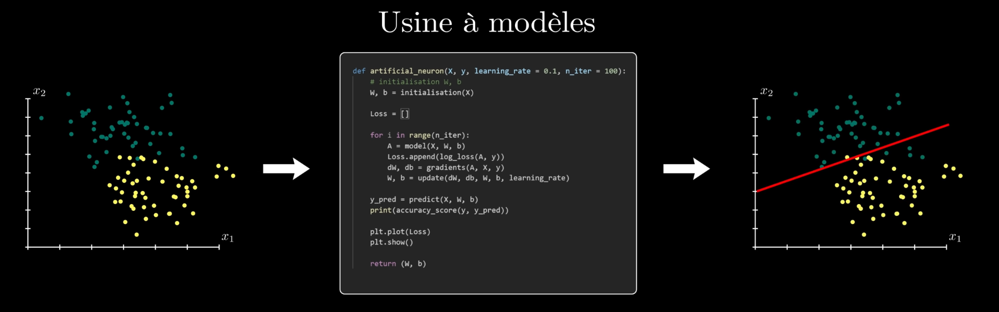

Donc ce qu'on aimerait faire, ça serait de fournir des photos de chats et de chiens à notre code pour qu'ils nous retourne un modèle qui soit capable de classer ce genre de photos. 

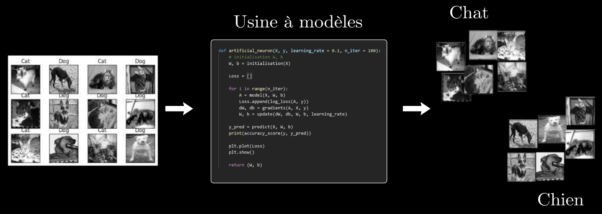

Alors pour ça dans, la dernière leçon nous avions un DataSet à télécharger sur github. 

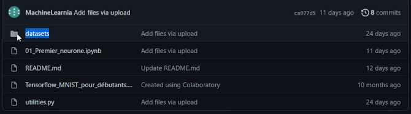

Ensuite, installer le module **h5py** qui nous permet d'ouvrir des fichiers au format **hdf5**, un format très utilisé en Deep Learning. 

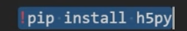

Et tout ça nous donne alors un **trainset et un testset** qui sont composés de tableau **Numpy**. 

```python
from utilities import *

X_train, y_train, X_test, y_test = load_data()
```

Dans le trainset, nous  avons mille photos et chaque photo faisant 64 pixels par 64 pixels. 

```python
print (X_train.shape)
print (y_train.shape)
print (np.unique(y_train,return_counts=True))
```

```
(1000, 64, 64)
(1000, 1)
(array([0., 1.]), array([500, 500], dtype=int64))
```

```python
print (X_test.shape)
print (y_test.shape)
print (np.unique(y_test,return_counts=True))
```

```python
import matplotlib.pyplot as plt

plt.figure(figsize=(16,8))
for i in range (1,8):
    plt.subplot(4,5,i)
    plt.imshow(X_train[i],cmap='gray')
    plt.title(y_train[i])
    plt.tight_layout()
plt.show()
```

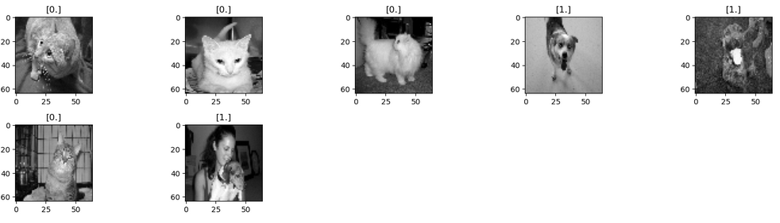

### 6.1 Reshape des données ###

Donc une première chose qu'on pourrait être tenté de faire avec ces données $\mathrm{x\_train}$ et $\mathrm{y\_train}$, ce serait de les utiliser directement dans la fonction **artificial_neuron**. Après tout, c'est exactement ce qu'on avait fait dans la dernière leçon sur les données $(X,y)$ que l'on avait simulé 

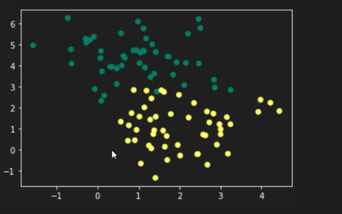

et comme on le voit sur ce graphique, ça nous avait retourné d'excellents résultats. 

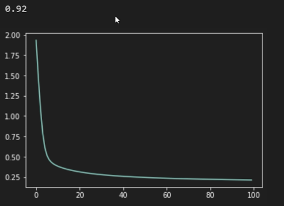

```python
from artificial_neuron import *
model = artificial_neuron()
model.fit(X_train, y_train)
```

```python

```

Donc X_train représentant chaque photo et y_train représente la classe que l'on cherche à prédire, donc soit 0 soit 1.On pourrait exécuter ce code, sauf que celui-ci ne va nous retourner une erreur. 

```python
ValueError: operands could not be broadcast together with shapes (1000,1) (1000,64,1) 
```

Alors en examinant, cette erreur de plus près on voit que celle ci est causée par les shapes de nos tableaux, c'est à dire les dimensions des tableaux et en y réfléchissant bien, c'est tout à fait pertinent car dans la dernière leçon nous avions développé un programme qui soit capable de traiter des tableaux $X$ à deux dimensions, la première représentant les différentes données et la deuxième les différentes variables $x_1\ et\ x_2$ et plus s'il y en a. 

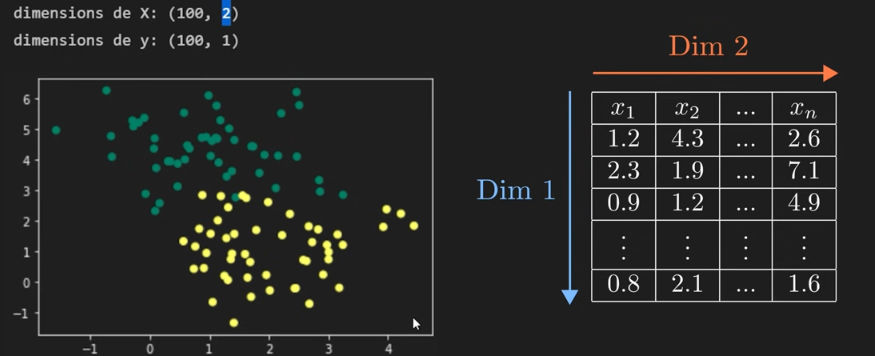

Or ici nous avons un tableau extrait à trois dimensions, 

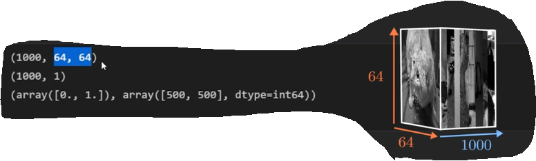

- la première dimension, c'est donc le nombre de données c'est à dire le nombre de photos, mais ensuite sur 
- notre deuxième dimension, en fait on n'a pas vraiment de deuxième dimension, on en a une deuxième et une troisième sur lesquels on retrouve la moitié de nos variable.

Donc il faudrait ramener tout ça à un tableau à deux dimensions. 

Ca serait d'aplatir chaque photo de notre Dataset 


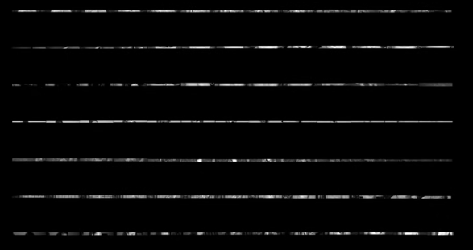

de telle sorte à mettre sur un seul axe, c'est à dire sur une seule dimension tous les pixels de chaque photo c'est à dire avoir un axe sur lequel on retrouve 4096 pixels soit 64 x 64 pixels. 

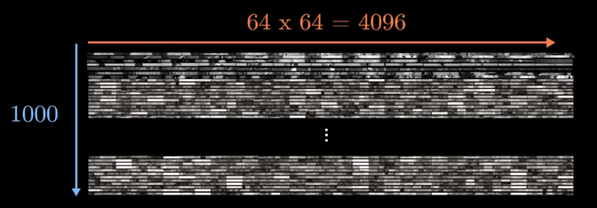


Donc une manière de faire ça serait de créer une nouvelle variable qu'on va appeler $X\_train\_reshape$ en utilisant la méthode $reshape$ sur notre tableau $X\_train$, de façon à obtenir un tableau qui fasse (1000, 4096) 

Donc pour obtenir le 1000, c'est très simple on va prendre la première dimension de $X\_train$ et pour obtenir le 4096 alors on va tout simplement décrire -1 car en python ça signifie simplement qu'on va vouloir redimensionner notre tableau $X\_train$ pour que celui ci soit de dimensions (1000,  tout ce qu'il reste à réorganiser )

```python
X_train_reshape = X_train.reshape(X_train.shape[0], -1) # (1000, 4096)
X_test_reshape = X_test.reshape(X_test.shape[0], -1) # (200, 4096)
```

Donc ce qu'il reste à réorganiser ses 64 x 64, donc voilà ce petit -1 fait parfaitement l'affaire comme vous le constatez. Voilà pour notre $X\_train$ alors bien sûr il va également falloir redimensionner le $X\_test$, ça nous sera utile un peu plus tard dans cette leçon. Doc voilà, on obtient bien un $X\_test$ de dimension (200,4096) 

### 6.2 Overflow de l'Exponentielle ###

Donc désormais remplaçant $X\_train$ par $X\_train\_reshape$, on obtient un code qui fonctionne. en faire un code qui fonctionne c'est vite  dit ans car même si nous n'obtenons pas de message d'erreur, cette fois ci il y a visiblement quelque chose qui cloche dans notre code. 

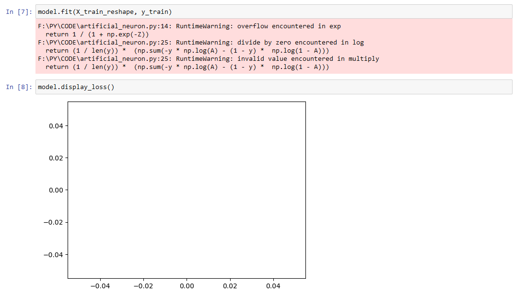

Car nous ce qu'on aimerait obtenir, c'est une belle courbe qui montre que le modèle a bien été entraîné.

Aors pour comprendre d'où vient cette erreur, nous allons devoir analyser les petits messages qui nous ont été retournés. Le premier ce ces messages, nous informe qu'il a eu un overflow dans une fonction exponentielle

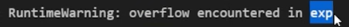

Première question où est ce que nous aurions une fonction exponentielle dans notre code, on se rend compte qu'il n'y a qu'un seul endroit où nous utilisons la fonction exponentielle c'est pour calculer l'activation de notre neurone c'est à dire la fonction sigmoïde. Donc deuxième question, que signifie rencontrer un overflow. Et bien un overflow c'est tout simplement lorsque vous passez une valeur tellement grande dans votre fonction exponentielle que celle ci ne peut pas vous retournez de vraies valeurs. 

Petite démonstration, si nous importons depuis le module math la fonction exponentielle et qu'on fait passer par exemple une valeur 1000 à l'intérieur de la fonction exponentielle 

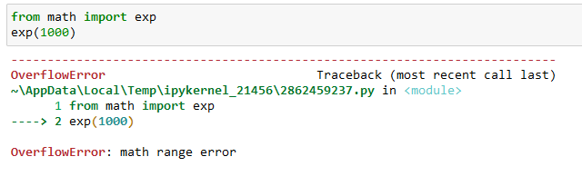

ça retourne une over flow erreur ça veut juste dire que mathématiquement on peut pas calculer ça parce que c'est beaucoup trop grand. Alors ça pourrait vous surprendre parce que 1000 ça paraît pas si grand que ça, mais la fonction exponentielle c'est une des fonctions qui croît le plus vite dans notre univers. Rappelez vous aussi que la dérivé d'une fonction exponentielle ça vous donne une fonction exponentielle elle même 

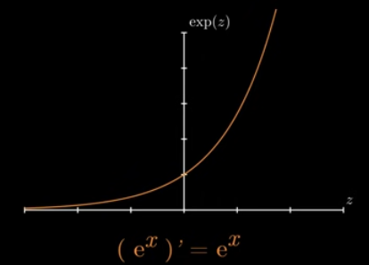

Tout ça nous indiquerait que la valeur de $Z$ est une valeur qui fait exploser notre exponentielle. Alors pour en avoir le coeur ne, on pourrait imprimer à chaque fois qu'on calcule le vecteur $Z$, sa valeur maximum. 

Ca nous donne des grandes valeurs quand même. Du coût pourquoi on obtient à overflow, alors vous allez vous dire très bien mais en quoi est ce que ça explique qu'on n'obtient pas de graphiques et que le modèle n'est pas entraîné. Et bien pour le comprendre, il faut poursuivre notre analyse donc comme nous disposons de valeur $Z$ qui sont assez importantes, soit dans le domaine positif soit dans le domaine négatif, cela fait que on obtient une exponentielle de $-Z $ qui lorsqu'elle est calculée avec **Numpy**, nous retourne soit 0 ou soit plus  l'infini et c'est justement là qu'on a une erreur de type overflow. Du coût, lorsqu'on va injecter cet exponentielle de $-Z$, à l'intérieur de notre fonction sigmoïde, on obtiendra un résultat dans lequel on fera soit intervenir 0, soit intervenir l'infini. 

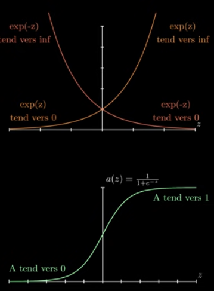

Donc bien sûr, quand ça sera zéro ben ça nous donnera $1 / 1$ ce qui nous donne 1 et quand ce sera à l'infini ça nous donnera $1 / 1 + l'infini$ c'est à dire $1 / l'infini$ et tout ça  tend vers zéro. 

### 6.3 Erreur dans le logarithme ###

Tou ceci pour parler de notre fonction coût dans laquelle vous l'aurez remarqué on fait passer notre vecteur d'activation, c'est à dire cette valeur qu'on vient de calculer dans laquelle on va retrouver des 1 et des 0. Or c'est ça qui est très important dans notre fonction coût, on retrouve des logarithme et  les fonctions logarithme ne sont pas définies en 0. 

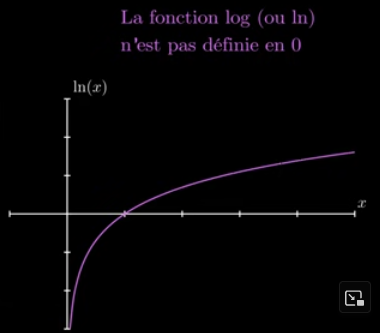

Nous faisons passer un vecteur qui comprend des 0 et des 1 et ce vecteur on essaie d'en calculer les logarithmes. 

```python
 def predict_proba(self,X):
        Z = X.dot(self.coef_) + self.bias_        
        return 1 / (1 + np.exp(-Z))
```

```python
def log_loss(self, y, A):
        return (1 / len(y)) *  (np.sum(-y * np.log(A) - (1 - y) *  np.log(1 - A)))
```

Alors lorsqu'on aura un 0 à l'intérieur de $A$, le log(0) va nous retourner une erreur et lorsqu'on aura 1 et bien log(1-1), pareil ça nous retournera une erreur. 

Donc tout ça pour dire que lorsque $Z$ à de grandes valeurs, qu'elles soient positives ou négatives, cela fait que notre programme se retrouvent dans l'incapacité de calculer le coût de notre modèle. Par conséquent s'il ne peut pas calculer le coût, il ne peut pas afficher notre courbe d'apprentissage et c'est la raison pour laquelle on se retrouve avec un graphique vide et avec différentes erreurs comme overflow.

Alors la première chose à faire, qui est une chose assez importante, c'est de modifier notre fonction **log_loss()** pour faire intervenir une petite valeur epsilon à l'intérieur de ces logarithme. Voilà ça fait en fait partie des bonnes pratiques qu'on retrouve même dans les bibliothèques du type $sklearn$. 

Donc le fait de placer un petit epsilon par exemple égal à 10 puissance moins 15, donc c'est vraiment un très petit nombre, à l'intérieur de nos logarithme, quoi qu'il arrive on sera capable de calculer un **log_loss()**. 

```python
def log_loss(self, y, A):
        return (1 / len(y)) *  (np.sum(-y * np.log(A + 10E-15) - (1 - y) *  np.log(1 - A + 10E-15)))
```

Alors certes, cela va avoir un petit impact sur le calcul du coût mais c'est tout. Ca va absolument pas impacter le calcul de nos gradient ni celui de notre mise à jour, ça va simplement impaqueter le graphique sur lequel on visualise notre coût. Mais çe n'est rien d'important. 

Donc voilà, on va pouvoir réentraîner notre modèle et avec tout ça, nous obtenons désormais la courbe d'apprentissage de notre modèle. 

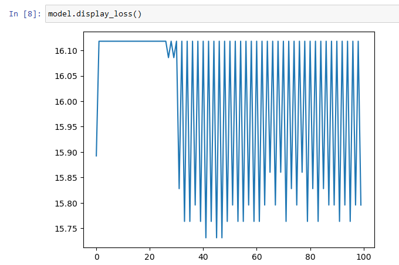

Alors de ce qu'on voit ici, le modèle n'a pas appris grand chose à son apprentissage. Il a plutôt été chaotique et ça c'est en fait lié au fait que nous avons toujours notre erreur d'overflow. Parce que on a beau avoir modifié la fonction coût en rajoutant le epsilon dans le logarithme, cela ne change rien au fait que nous ayons toujours des valeurs $Z$ qui soit trop grande et qui par extension crée un  overflow dans notre exponentielle. 

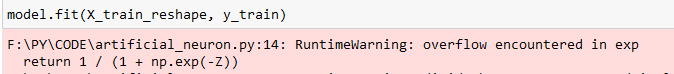

Donc pour corriger ce problème, nous allons devoir effectuer une des opérations les plus importantes du monde du Deep Learning et du machine learning. Ccelle de normaliser nos données. 

### 6.4 La Normalisation des données ###

Que ça soit en machine learning ou en Deep Learning il faut toujours normaliser nos données lorsqu'on utilise un algorithme de descente de gradient. 

Pour faire simple, cela signifie mettre sur une même échelle toutes les variables d'un Dataset afin d'éviter que les plus grandes valeurs ne viennent écraser les plus petites. 

Pour bien comprendre ce que ça signifie, nous allons voir un petit exemple avec une application numérique. 

Imaginez que l'on ait deux variables $x_1$ et $x_2$ dont les valeurs s'étendent de 0 à 1 pour la première et de 0 à 10 pour la seconde. 

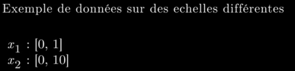

en plaçant ces variables dans notre fonction linéaire $z\left(x_1, x_2\right)=w_1 x_1+w_2 x_2+b$, on se rend compte que les pois $w_1$ et $w_2$ n'ont alors pas le même impact sur notre sortie $z(0.5,5)=w_1 0.5+w_2 5+b$.

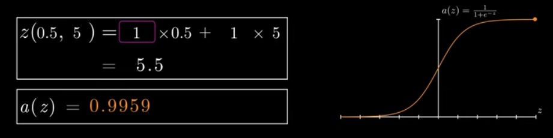

En effet, lorsqu'on bouge légèrement le coefficient $w_1$ cela peut faire varier notre sortie de quelques unités, 

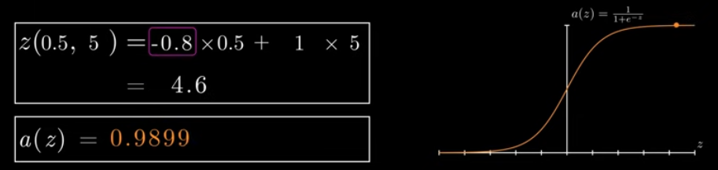

alors que quand on bouge légèrement le coefficient $w_2$ cela fait varier la sortie $Z$ de plusieurs dizaines d'unités. 

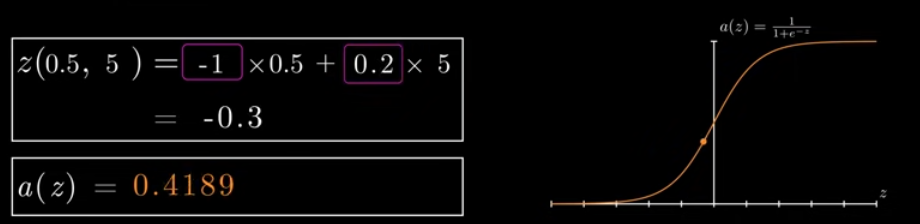

Du coup, en poursuivant le raisonnement cela impacte tout autant notre activation et par extension la différence entre l'activation et les données $y$, ce qui n'est autre que notre fonction coût. 

Alors en principe pour avoir une bonne convergence de la descente de gradient, 

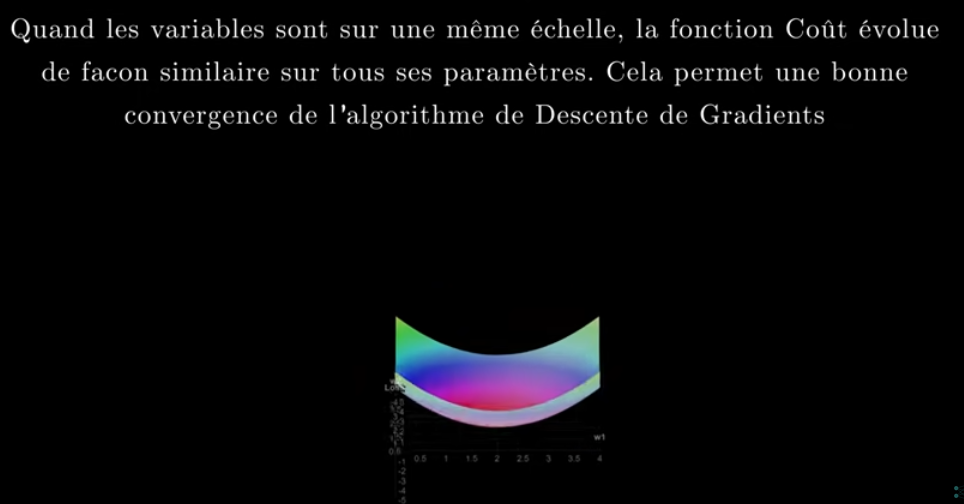

on désire avoir une fonction coûts qui évolue de façon similaire sur les deux paramètres $w_1$ et $w_2$ . Sauf que si le premier à dix fois plus d'importance sur la sortie que le second et bien on va se retrouver avec une fonction coût qui est totalement compressé. 

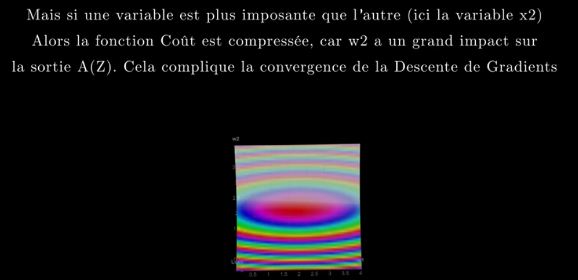

ici on voit bien qu'un faible changement de la valeur de $w_2$ créer un grand changement de comportement de la part de notre modèle, ce qui a donc une très grande influence sur le coût de notre modèle. 

Et donc le problème, c'est que lorsqu'on utilise une descente de gradient cela ne va pas faciliter la convergence. Nous donnant parfois des situations dans lesquelles on passe notre temps à rebondir d'un côté et de l'autre de notre fonction coût. 

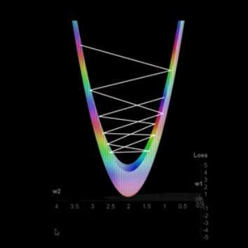

### 6.5 Préparation de l'expérience sur la Normalisation ###

Alors pour illustrer tout ça, nous allons faire une petite expérience sur la base du Dataset que l'on avait dans la dernière leçon. 

```python
from sklearn.datasets import make_blobs

X, y = make_blobs(n_samples=100, n_features= 2, centers=2, random_state=0)
y = y.reshape((y.shape[0], 1))

plt.scatter (X[:,0], X[:, 1], c=y, cmap='summer')
plt.show()
```

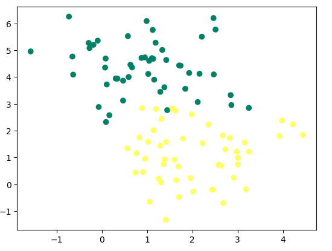

Donc dans ce Dataset, nous avions deux variables $x_1$ et $x_2$ qui sont clairement du même ordre de grandeur, puisque la première s'étale de -1 à +4 et la deuxième de -1 à +6, donc on peut pas dire que l'une vient écraser l'autre. 

Alors ce que j'aimerais faire, ce serait de tracer l'évolution de la fonction coût en fonction des paramètres $w_1$ et $w_2$, c'est à dire les paramètres qui sont associés à chacune de ces variables, de cette manière vous pourrez voir si en effet la fonction coût est compressé lorsque l'une de ses variables devient très grande

On va commencer par définir une rangée de valeur pour $w_1$ et $w_2$  grâce à la fonction **linespace()** dans laquelle nous allons passer une valeur minimum  à -10 jusqu'à une limite +10 avec h valeur c'est-à-dire 100 valeurs. 

```python
lim = 10
h=100

w1 = np.linspace(-lim, lim, h)
w2 = np.linspace(-lim, lim, h)

w1
```

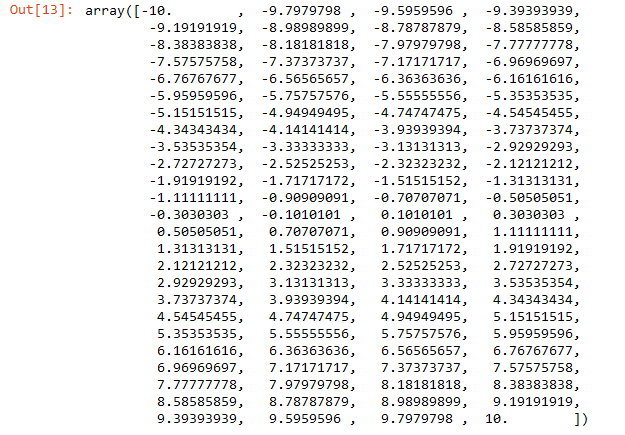

Nous retourne donc un tableau pour $w_1$ qui va de -10 à 10 avec 100 valeurs réparties de façon uniforme. 

On va faire varier $w_2$ exactement de la même manière et on va combiner ces deux tableaux avec une **meshgrid()** 

```python
w11, w22 = np.meshgrid(w1, w2)
```

Donc ça nous donne un tableau $w_{11}$ qui est de dimension (100,100) puisque le vecteur $W$ à a été recopiées en boucle pour couvrir la dimension du vecteur $w_2$ est ce la même chose donc pour $w_{22}$. 


------

La fonction `np.meshgrid` est une fonction fournie par NumPy, une bibliothèque puissante de calcul numérique en Python. Cette fonction est utilisée pour créer une grille rectangulaire à partir de deux tableaux unidimensionnels donnés représentant l'indexation cartésienne ou l'indexation matricielle. Les grilles résultantes sont des tableaux 2D qui ont des valeurs correspondantes des tableaux d'entrée comme leurs lignes et colonnes.

Dans la ligne de code que vous avez écrite:

```python
w11, w22 = np.meshgrid(w1, w2)
```

Les tableaux `w1` et `w2` sont les entrées de la fonction `np.meshgrid()`. Cela génère deux tableaux 2D `w11` et `w22`. Chaque point `(i, j)` dans ces grilles 2D correspond à un point `(w1[i], w2[j])` dans l'espace cartésien.

Supposons que `w1` et `w2` soient des tableaux unidimensionnels de longueurs `n` et `m` respectivement. Alors, `w11` sera un tableau 2D de forme `(m, n)` où chaque ligne `i` est une copie de `w1`, et `w22` sera un tableau 2D de forme `(m, n)` où chaque colonne `j` est une copie de `w2`.

Cette fonction est souvent utilisée pour évaluer des fonctions sur une grille, généralement pour des visualisations en 3D.

Supposons que vous ayez deux tableaux 1D suivants:

```python
import numpy as np

w1 = np.array([1, 2, 3])
w2 = np.array([4, 5, 6, 7])
```

Vous pouvez utiliser la fonction `np.meshgrid` pour créer deux grilles 2D :

```python
w11, w22 = np.meshgrid(w1, w2)
```

Le contenu de `w11` et `w22` sera alors :

```python
print(w11)

# Output:
# array([[1, 2, 3],
#        [1, 2, 3],
#        [1, 2, 3],
#        [1, 2, 3]])

print(w22)

# Output:
# array([[4, 4, 4],
#        [5, 5, 5],
#        [6, 6, 6],
#        [7, 7, 7]])
```

Dans ce cas, chaque ligne de `w11` est une copie du tableau `w1`, et chaque colonne de `w22` est une copie du tableau `w2`. De cette façon, vous pouvez associer chaque élément `w11[i, j]` avec `w22[i, j]` pour obtenir un point de coordonnées (x, y) dans l'espace 2D comme (w1[j], w2[i]).

------

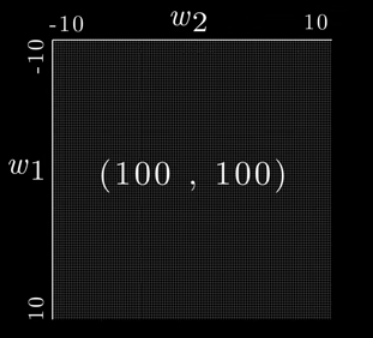

Alors nous ce qu'on voudrait faire, ça serait de passé cette grille de valeur qui donc contient dix mille configurations possibles puisque 100 x 100 ça fait dix mille. On aimerait passer ces 10000 configuration dans notre fonction $Z(x_1, x_2)$,  $z=x \cdot {dot}(w)+b$  avec $b$ qu'on va initialiser à zéro, on le changera peut-être après car ce qui nous intéresse c'est $W$

Rappelons-nous juste que $W$ devra être de dimension $(n,10000)$ puisqu'on veut 10000 configurations possibles et $n=2$  car on a deux variables. 

Donc,  c'est ce qu'il nous faut en dimensions pour $W$, comme ça on peut effectuer le produit matricielle avec $X$ qui lui est de dimension (100,2). On a un produit matricielle entre $(100,2) \times (2,10000)$ $(X . W)$

Alors le problème, c'est qu'à l'heure actuelle nous n'avons pas un seul $W$ qui fait (2,10000), mais nous avons deux tableaux $W$ qui font chacun $100 \times 100$

Alors ce qu'on va faire, c'est qu'on va créer une variable  $W_{finale}$ qui est égal à la concaténation des deux tableaux $w_{11}$ et $w_{22}$. On va aussi aplatir chaque tableau, du coût ça nous donne 10000 valeurs dans $w_{11}$ et 10000 valeurs dans $w_{22}$. Donc on obtient un tableau de dimension (10000,2)

```python
W_final = np.c_[w11.ravel(), w22.ravel()]
W_final.shape
```

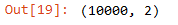


Donc, on va transposer ce tableau, car on veut un $W$ de dimension (2,10000). 

```python
W_final = np.c_[w11.ravel(), w22.ravel()].T
W_final.shape
```

Donc, on a créé un tableau de paramètres qui contient 10000 configurations possibles c'est à dire lorsque $W_{11}$ vaut -10  et que $W_{22}$ vaut -10 puis que $W_{11}$ vaut -10 et que $W_{22}$ vaut -9,9 etc...

Ca nous donne 10000 situations possibles et chacune de ces situations on va les évaluer. 

Donc, on va créer des prédictions,  

```python
b = 0
Z = X.dot(W_final) + b
A = 1 / (1 + np.exp(-Z))
```

Alors, si on réfléchit bien ça nous donne donc un tableau $A$ qui doit être de dimension (100,10000). Alors pourquoi? Et bien parce que normalement dans le vecteur $A$ nous avons 100 valeur puisqu'on a 100 données dans notre Dataset, sauf qu'ici on a testé 10000 configurations possible, donc on va avoir 10000 situations différentes. 

Alors maintenant ce tableau à on veut le comparer à notre tableau $y$. 

Alors pour ça, on a 

```python
epsilon = 1e-15
L =  (1 / len(y)) *  (np.sum(-y * np.log(A + epsilon) - (1 - y) *  np.log(1 - A + epsilon)))
L
```

Et si j'exécute le code comme ça on va faire simplement la somme de tout le tableau 


et ça va nous donner un nombre réel mais ce n'est pas qu'on veut faire nous on veut obtenir 10000 coût différent puisqu'on test 100 valeur de $w_1$ et 100 valeurs de $w_2$. Donc ça nous donne 10000 configurations différentes. 

Donc, on va faire la somme en suivant un axe bien précis, l'axe=0. 

```
L =  (1 / len(y)) *  (np.sum(-y * np.log(A + epsilon) - (1 - y) *  np.log(1 - A + epsilon)), axis=0)
L.shape
```

Donc cette fois ci $L$ va donc être de dimension (10000,). 

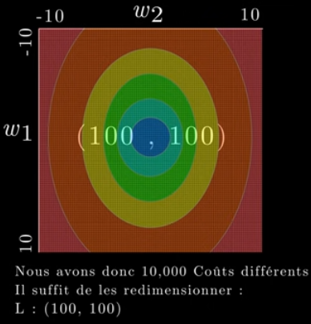

C'est bien et on veut afficher tout ça dans un graphique en 2d, une sorte de **contourplot** , donc on va le redimensionner en (100,100) où ce qu'on pourrait même faire c'est prendre directement les dimensions qu'on avait pour $w_{11}$ 

```python
L =  1 / len(y) *  np.sum(-y * np.log(A + epsilon) - (1 - y) *  np.log(1 - A + epsilon), axis=0).reshape(w11.shape)
L.shape
```

### 6.6 Visualisation des résultats de la Normalisation ###

Et voilà, ça nous  donne donc un tableau $L$ à deux dimensions. Donc ce tableau, il ne reste plus qu'à l'afficher. 

```python
plt.contourf(w11, w22)
```

Donc ça c'est pour les axes $X$ et $y$ et pour la hauteur du graphique c'est à dire les valeurs que l'on affiche sur l'axé $Z$, ça va tout simplement être $L$

```python
plt.contourf(w11, w22, L, cmap='magma')
plt.colorbar()
```

Et voilà, 

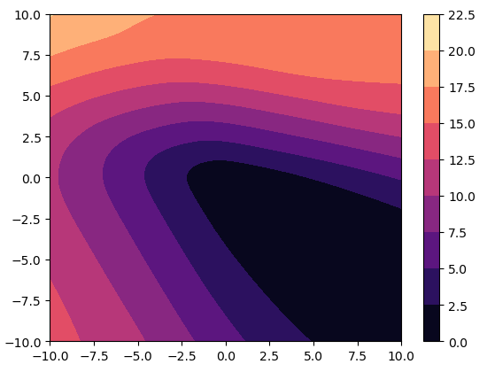

On voit donc l'évolution de notre fonction coût en fonction des valeurs des différents paramètres. Donc si $w_1$ vaut -7,5 et que $w_2$ vos -2,5 on aurait un coût aux alentours de 7,5-10. 

Notre objectif c'était de faire un graphique qui puisse démontrer que lorsqu'une variable devient trop imposante et bien ce graphique comment ça se compresser. 

Alors pour ça, on va prendre une de nos deux variables par exemple la variable $x_2$ et on va là multiplié par deux. 

```python
from sklearn.datasets import make_blobs

X, y = make_blobs(n_samples=100, n_features= 2, centers=2, random_state=0)
X[:, 1]= X[:, 1] * 2

y = y.reshape((y.shape[0], 1))

plt.scatter (X[:,0], X[:, 1], c=y, cmap='summer')
plt.show()
```

Si j'exécute regardez bien on va passer de -1 à 6 à techniquement -2 à 12

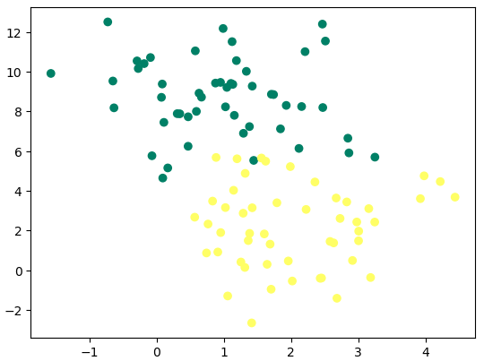

```python
lim = 10
h=100

w1 = np.linspace(-lim, lim, h)
w2 = np.linspace(-lim, lim, h)
```

```python
w11, w22 = np.meshgrid(w1, w2)
```

```python
W_final = np.c_[w11.ravel(), w22.ravel()].T
W_final.shape
```

```python
b = 0
Z = X.dot(W_final) + b
A = 1 / (1 + np.exp(-Z))
```

```python
epsilon = 1e-15
L =  1 / len(y) *  np.sum(-y * np.log(A + epsilon) - (1 - y) *  np.log(1 - A + epsilon), axis=0).reshape(w11.shape)
L.shape
```

```python
plt.contourf(w11, w22, L, cmap='magma')
plt.colorbar()
```

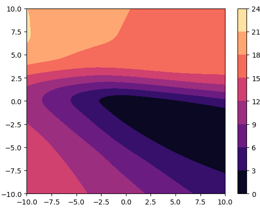

Vous voyez notre fonction coûts commencent à être compressé. Alors rien de très grave sauf que là, nous avons simplement multiplié par 2 notre variable $x_2$.  Voyons ce qui se passe quand on l'a multiplie par par 10,

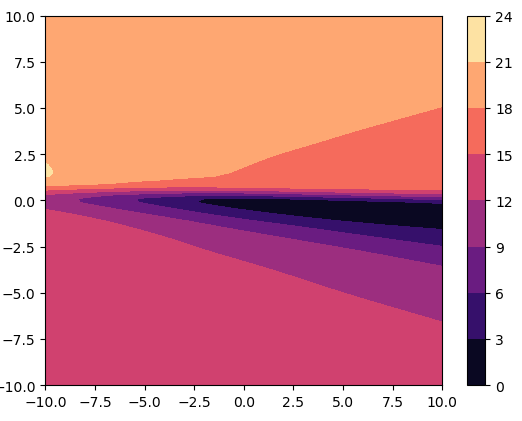

Et bien dans ce cas de figure le paramètre qui sera associé à la variable la plus imposante va venir complètement écrasé nos sorties ce qui fait qu'on obtient une fonction coût complètement compressé et parce que cette fonction coût est compressé de cette manière et bien notre algorithme de descente de gradient va avoir du mal à converger pour trouver le minimum et ça va nous donner une situation de zig zag comme ce qu'on avait observé tout à l'heure. 

### 6.7 Visualisation de la Descente de Gradients ###

Alors pour visualiser tout ça j'ai un petit peu modifié notre fonction **artificial_neuron** que j'ai renommée **artificial_neuron_2**. Donc, on a rajouté un petit bout de code pour enregistrer tous les dix itération les différents paramètres de notre modèle.  

```python
def artificial_neuron_2(X, y, learning_rate=0.1, nbr_iter=100):
    #initialisation W, b
    W, b = initialisation (X)
    W[0], W[1] = -7.5, -7.5
    
    nb = 10
    j = 0
    history = np.zeros((nbr_iter // nb, 5))    
    loss=[]
    
    for i in range(nbr_iter):
        A = model(X, W, b)
        loss.append(log_loss(y, A))
        dW, db = gradients(A, X, y)
        W, b = update(dW, db, W, b, learning_rate)
        
        if (i % nb == 0):
            history[j, 0] = W[0]
            history[j, 1] = W[1]
            history[j, 2] = b
            history[j, 3] = i
            history[j, 4] = log_loss (y, A)
            j += 1  
    
    plt.plot(loss)
    plt.show()
    
    return history, b
```

```python
history, b = artificial_neuron_2(X,y)
```

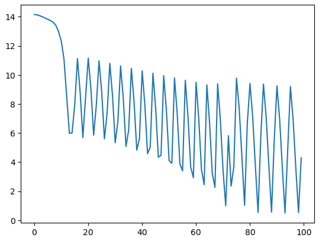

Donc on voit bien qu'on a une fonction coût qui oscille, elle fait des va et vient. Donc elle n'est clairement pas en train de bien fonctionner et c'est justement parce que notre Dataset n'est pas normalisé, on a une variable beaucoup plus imposante que l'autre. 

```python
plt.figure(figsize=(12,4))
plt.subplot(1, 2, 1)
plt.contourf(w11, w22, L, 10, cmap='magma')
plt.colorbar()

plt.subplot(1, 2, 2)
plt.contourf(w11, w22, L, 10, cmap='magma')
plt.scatter(history[:, 0], history[:, 1], c=history[:, 2], cmap='magma', marker='*')
plt.colorbar()
```

et ça on le voit extrêmement bien sur le graphique 

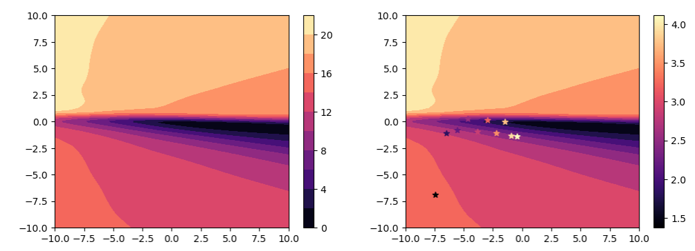

Vous retrouvez donc notre espace de fonctions coût  avec notre point de départ initialisé à -7,5 pour les deux variables. C'est ce que vous voyez ici, parce que ça simplifie un petit peu la lecture. 

Et donc ce qu'on voit c'est que au lieu de bien converger, et bien on fait des va et vient.

### 6.8 Visualisation 3D ###

Un petit graphique 3D,  

```pyth
import plotly.graph_objects as go

fig = (go.Figure(data=[go.Surface(z=L, x=w11, y=w22, opacity = 1)]))

fig.update_layout(template = "plotly_dark", margin=dict(l=0, r=0, b=0, t=0))
fig.layout.scene.camera.projection.type = "orthographic"
fig.show()
```

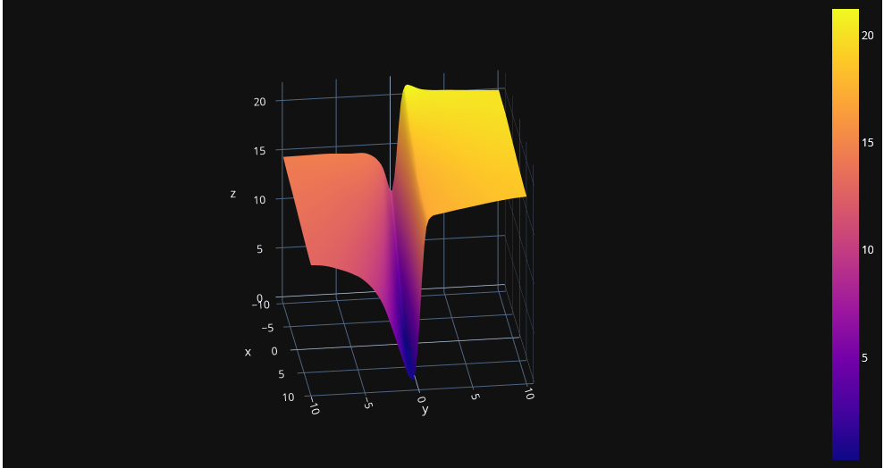

On voit bien que notre fonction coût est devenu très brut, c'est une véritable falaises. 

Et juste pour en comparaison, donc si on revient sur quelque chose de normal donc $x_1$. Donc un Dataset équilibré et bien on obtient donc une belle fonction coût 

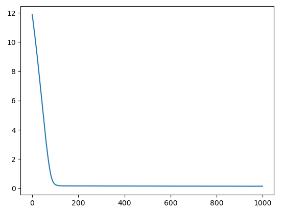

on voit qu'on converge très facilement vers le centre, c'est à dire vers le point le plus bas de notre coût. Et ça nous donne aussi une belle fonction coût. 

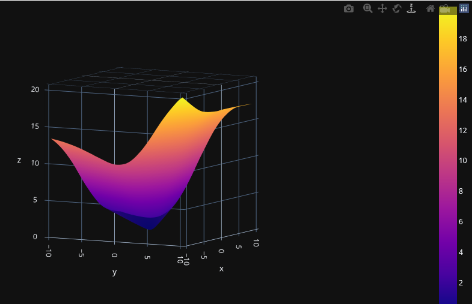

### 6.9 Normalisation Minmax ###

J'espère que vous avez bien compris l'importance de normaliser vos données. Maintenant la question, c'est comment faire pour effectuer une normalisation et bien il existe différentes techniques comme la standardisation ou la normalisation Minmax.

Nous allons justement utiliser la normalisation Minmax dans le but de mettre toutes nos variable c'est-à-dire tous nos pixels sur une échelle de 0 à 1. 

Alors pour ça c'est très simple, il suffit d'appliquer la formule suivante 

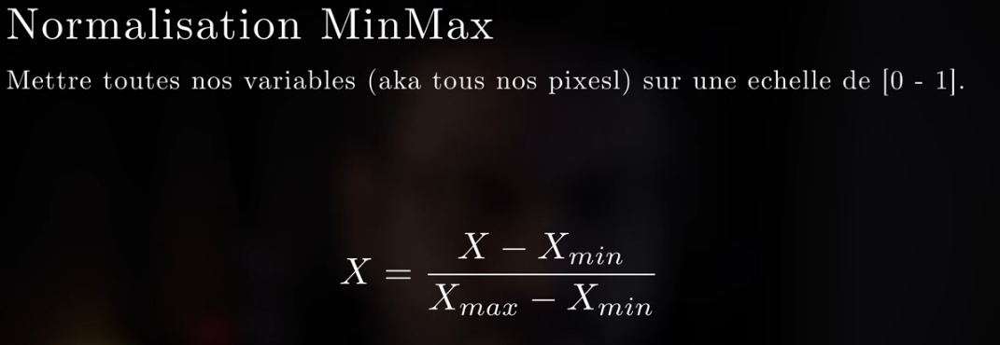

c'est à dire prendre chaque pixel et le soustraire à la valeur minimum de ce pixel et diviser le tout par le maximum - le minimum de ce pixel. 

En plus, comme nos photos sont codées en 8 bits, ça fait que les pixels valent au minimum 0 et au maximum 255 

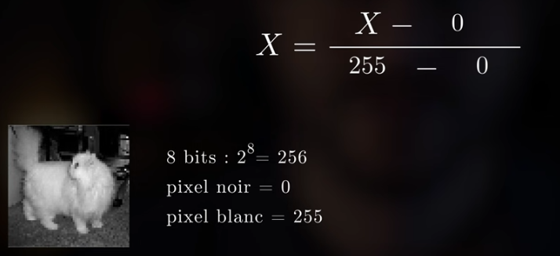

Donc, on peut même simplifier cette formule en disant simplement que chaque pixel est égal à lui même divisé par 255 

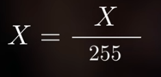

et voilà c'est ainsi qu'on normalise nos données. 

On va voir comment faire ça dans notre code. Donc de retour dans notre code, ce qu'on va faire c'est qu'on va retourner à l'endroit où nous avions défini notre train_set et nous allons diviser celui-ci par la valeur maximum que l'on trouve à l'intérieur. 

```python
X_train_reshape = X_train.reshape(X_train.shape[0], -1) / X_train.max() # (1000, 4096)
X_train_reshape.max()
```

Cela va donc avoir pour effet de normaliser nos données en passant d'un maximum égal à 254 à un maximum égal à 1. 

autrement dit cela fait que toutes les photos que nous avons dans notre Dataset ont désormais des pixels compris entre 0 et 1. 

Alors bien sûr, nous allons également effectuer cette opération sur notre test_set en effectuant la même opération, c'est à dire qu'on n'écrit pas $X\_test.max()$ mais bien $X\_train$.max() ça c'est un des points fondamentaux du  preprocessing.

```
X_test_reshape = X_test.reshape(X_test.shape[0], -1) / X_train.max() # (1000, 4096)
X_test_reshape.max()
```

Et donc en ayant normalisé à la fois notre Dataset et notre Testset, nous allons pouvoir réentraîner notre modèle de neurone artificielle et vous allez voir que ça va avoir pour effet d'éliminer notre erreur d'overflow. 

```python
from artificial_neuron import *

model = artificial_neuron()
model.fit(X_train_reshape, y_train)
```

Et voilà on a plus d'erreurs. 

```python
model.display_loss()
```

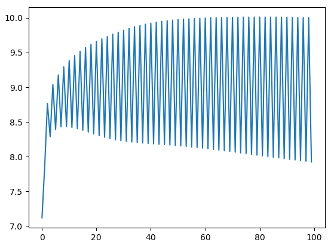

Alors certes nous avons toujours un graphique un petit peu étrange, mais celui ci on va laisser de côté juste un instant pour conclure sur cette histoire d'overflow car quand on y réfléchit bien tout ce qu'on vient de faire cette extrêmement logique. Rappelez-vous, si on avait un overflow c'est parce que les valeurs de $Z$ était beaucoup trop importante. On avait des valeurs de $Z$ qui valait parfois 10000 parfois 100000 parfois -50000, bref des choses beaucoup trop importante pour être passée dans une fonction exponentielle. 

Mais quand on y pense, c'était assez logique d'obtenir des valeurs aussi importante car rappelez-vous $Z$ c'est en fait égal à $w_1 x_1 + w_2x_2 + w_3 x_3$ etc... jusqu'à $w_{4096}x_{4096}$ car ici nous avons 4096 variable. 

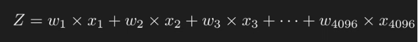

Donc si chacune de ces variables peut valoir quelque chose entre 0 et 255 mais ça fait complètement explosé la valeur de $Z$ . 

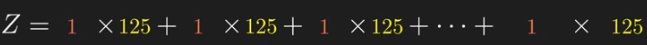

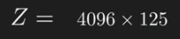

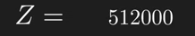

Et c'est donc là que notre problème se voit totalement résolue lorsqu'on normalise nos données car cette fois ci tout est compris entre 0 et 1. Tout ça fait que la valeur de $Z$ est fortement atténuée. 

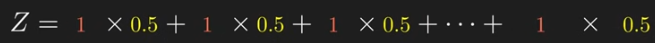

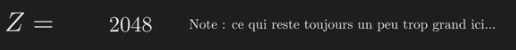

On voit que le problème est complètement résolu, enfin il nous reste toujours ce graphique. Mais celui ci n'a aucun rapport avec la normalisation, il a en fait un lien avec les hyper paramètres de notre modèle.

### 6.10 Réglage des hyper-paramètres  ###

Comment ça se fait qu'on obtienne toujours un graphique aussi décevant. Après tout, nous avons normalisé nos données, ce qui fait que notre fonction coût évolue progressivement et on retrouve pas de falaise à l'intérieur, alors pourquoi? Et bien, on a beau avoir une fonction coûts qui évolue progressivement, si notre algorithme de descente de gradient décide de faire des pas beaucoup trop grand dans cette fonction coût, et bien, il va oscillé et faire des va et vient 


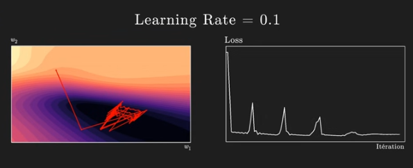

c'est peut-être ça le problème, après tout on va définir un learning_rate peut-être égal à 0,01, car de base celui ci a été réglée sur 0,1, c'est un learning_rate  beaucoup trop grand pour un vrai problème

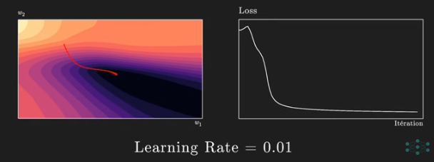

Ca fonctionne bien sur un petit Dataset, sur un vrai problème avec des photos, vaut mieux passer aux choses sérieuses.

```python
from artificial_neuron import *

model = artificial_neuron(learning_rate=0.01)
model.fit(X_train_reshape, y_train)
```

```python
model.display_loss()
```

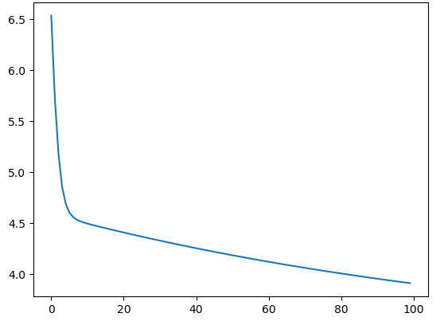

Voilà, on réexécute notre code et vous voyez c'est beaucoup mieux déjà. Alors là on voit pertinemment que notre modèle est en train d'apprendre. 

C'est génial tout ce qu'on pourrait se dire, ça ne suffit pas et il faudrait rajouter plus d'itérations. 

```python
model = artificial_neuron(n_iter = 10000, learning_rate=0.01)
model.fit(X_train_reshape, y_train)
```

```python
model.display_loss()
```

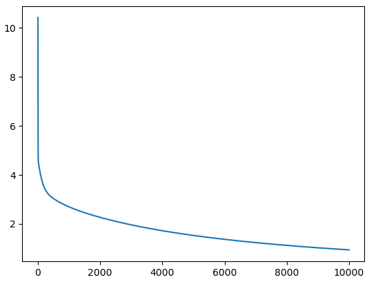

On commence par tomber sur quelque chose de très satisfaisant. Alors, c'est bien génial tout ça mais on pourrait se dire, quelle est la performance du modèle? Donc pour ça on va retourner dans notre fonction **artificial_neuron()** et on va créer une liste **accuracy[]** que l'on va **.append** à chaque itération avec la fonction **accuracy_score()** de $sklearn$. 

```python
 def display_acc(self):      
        plt.plot(self.acc_)
        plt.show()        
```

```python
def fit (self, X, y):       
        #initialisation W, b
        self.coef_ = np.random.randn(X.shape[1],1)    
        self.bias_ = np.random.randn(1)

        self.loss_ = [] #ici, on réinitialise le loss car si on refit notre modèle, il faut réinitialiser le loss.
        self.acc_ = [] #ici, on réinitialise le loss car si on refit notre modèle, il faut réinitialiser acc.

        #Apprentissage
        for i in range(self.n_iter_):
            #Activation               
            A = self.predict_proba(X)            

            #loss
            self.loss_.append(self.log_loss(y, A))
            
            #accuracy
            self.acc_.append(accuracy_score(y, self.predict(X)))

            #Gradients
            dW = 1 / len(y) * np.dot(X.T, A - y)
            db = 1 / len(y) * np.sum(A - y)

            #update
            self.coef_ = self.coef_ - self.learning_rate_ * dW
            self.bias_ = self.bias_ - self.learning_rate_ * db  
```

Voilà une fois qu'on a ça tout ce qui reste à faire c'est donc d'afficher 

```python
model.display_acc()
```


On peut voir comment évolue la courbe de notre modèle. Elle monte et même si le **loss** diminue et semble se stabiliser, on voit que **l'accuracy** continue de monter. 

Donc ça nous indique très clairement que notre modèle a besoin de plus de temps pour apprendre. Il voudrait plus d'itérations donc on pourrait passer de 1000 à 10000. 

**Cependant attention**,  en faisant ça, j'ai envie de vous donner deux conseils: 

- Le premier, c'est qu'en effectuant 10000 itération et en calculant à chacune de ces itérations le coût l'accuracy et en installant ces choses dans une liste, et bien votre code va être considérablement ralenti. Pour rappelle,python n'est pas le langage le plus performant du monde à comparer C++ ou d'autres. Donc dans ces situations, lorsqu'on effectue beaucoup d'itérations, il est conseillé d'ajouter dans votre code une petite condition qui dit que si l'itération en cours est un multiple de 10, par exemple, alors et seulement dans ces conditions, on effectue le calcul de nos coûts et de nos accuracy. 

- Pour le deuxième, c'est très simple, il est conseillé conseille de toujours a ajouter une petite barre de progression lorsque vous exécuter un code très long. Alors pour ça il existe une librairie fabuleuse qui s'appelle **tqdm**. Alors, **tqdm** ça vient de l'arab qui signifie **takadoum**. 

```python
def fit (self, X, y):       
        #initialisation W, b
        self.coef_ = np.random.randn(X.shape[1],1)    
        self.bias_ = np.random.randn(1)

        self.loss_ = [] #ici, on réinitialise le loss car si on refit notre modèle, il faut réinitialiser le loss.
        self.acc_ = [] #ici, on réinitialise le loss car si on refit notre modèle, il faut réinitialiser acc.

        #Apprentissage
        for i in tqdm(range(self.n_iter_)):
            #Activation               
            A = self.predict_proba(X)            

            if i%10 == 0:
                #loss
                self.loss_.append(self.log_loss(y, A))
            
                #accuracy
                self.acc_.append(accuracy_score(y, self.predict(X)))

            #Gradients
            dW = 1 / len(y) * np.dot(X.T, A - y)
            db = 1 / len(y) * np.sum(A - y)

            #update
            self.coef_ = self.coef_ - self.learning_rate_ * dW
            self.bias_ = self.bias_ - self.learning_rate_ * db
```

Voilà une petite barre de progression qui nous indiquent des choses très importantes. 

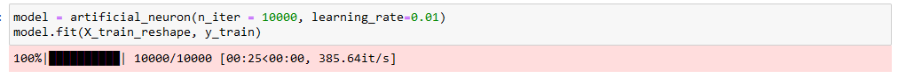

On obtient donc le résultat suivant dans lequel c'est extrêmement perturbant puisque même après 10000 itérations

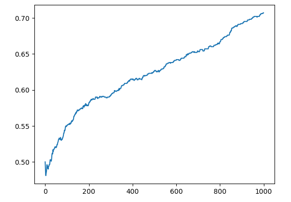

Alors, malgré nos 10.000 itération, notre performance continue toujours à augmenter. 

### 6.11 Diagnostique d'overfitting ###

Alors là il faut commencer à se méfier dans cette situation, parce que peut-être que notre modèle est en train d'entrer en **overfitting**. 

Pour rappelle, l'**overfitting**, c'est quand votre modèle n'est plus capable de généraliser, il se focalise tellement sur les exemples du **train_set**  lors de son entraînement qu'il en perd la capacité de faire de bonnes prédictions sur le **test_set**. 

C'est donc une façon de détecter l'overfitting, c'est lorsqu'on voit que la courbe de **Loss** du **train_set** diminue mais que celle du **train_test** commence à stagner, voire à augmenter. Et sur l'accuracy, on voit que le **train_set** s'améliore de plus en plus mais que **train_test** commence à stabiliser voire se dégrader. 

Donc pour visualiser tout ça, vous l'avez compris, il faut tracer la courbe de test. C'est pourquoi on va modifier encore une fois notre fonction **artificial_neuron**, en faisant cette fois ci passer notre **train_set** et notre **test_set** à l'intérieur. Donc on va créer une variable **X_train, y_train, X_test et y_test** . Il va donc falloir modifier ce qu'on a à l'intérieur de tout notre boucles d'apprentissage. 

```python
def __init__(self, n_iter=100, learning_rate=0.1):
        self.coef_ = None # W
        self.bias_ = None # b
        self.n_iter_ = n_iter
        self.learning_rate_ = learning_rate
        self.train_loss_ = []
        self.train_acc_ = []
        self.test_acc_ = []
        self.tes_acc_ = []
```

```python
def fit (self, X_train, y_train, X_test, y_test):       
        #initialisation W, b
        self.coef_ = np.random.randn(X_train.shape[1],1)    
        self.bias_ = np.random.randn(1)

        self.train_loss_ = [] #ici, on réinitialise le loss car si on refit notre modèle, il faut réinitialiser le loss.
        self.train_acc_ = [] #ici, on réinitialise le loss car si on refit notre modèle, il faut réinitialiser acc.
        
        self.test_loss_ = [] #ici, on réinitialise le loss car si on refit notre modèle, il faut réinitialiser le loss.
        self.test_acc_ = [] #ici, on réinitialise le loss car si on refit notre modèle, il faut réinitialiser acc.

        #Apprentissage
        for i in tqdm(range(self.n_iter_)):
            #Activation               
            A_train = self.predict_proba(X_train) #Dans la boucle d'apprentissage, le train_set entre en jeux.            
            A_test = self.predict_proba(X_test) #Dans la boucle d'apprentissage, le test_set entre en jeux.            

            if i%10 == 0:
                #Train loss
                self.train_loss_.append(self.log_loss(y_train, A_train))            
                #accuracy
                self.train_acc_.append(accuracy_score(y_train, self.predict(X_train)))

                #Test loss                
                self.test_loss_.append(self.log_loss(y_test, A_train))            
                #accuracy
                self.test_acc_.append(accuracy_score(y_test, self.predict(X_test)))                

            #Gradients
            dW = 1 / len(y_train) * np.dot(X_train.T, A_train - y_train)
            db = 1 / len(y_train) * np.sum(A_train - y_train)

            #update
            self.coef_ = self.coef_ - self.learning_rate_ * dW
            self.bias_ = self.bias_ - self.learning_rate_ * db 
```

```python
def display_loss(self):      
        plt.plot(self.train_loss_, label='train_loss')
        plt.plot(self.test_loss_, label='test_loss')
        plt.legend()
        plt.show()
        
    def display_acc(self):      
        plt.plot(self.train_acc_, label='test_loss')
        plt.plot(self.test_acc_, label='test_acc')
        plt.legend()
        plt.show()    
```

```python
import artificial_neuron
from importlib import reload

reload(artificial_neuron)

from artificial_neuron import *

model = artificial_neuron(n_iter=10000, learning_rate=0.01)
model.fit(X_train_reshape, y_train, X_test_reshape, y_test)
```

Donc c'est là qu'on est bien content d'avoir notre petite barre de progression

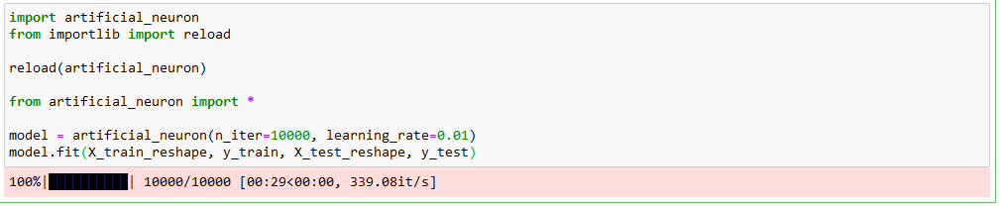

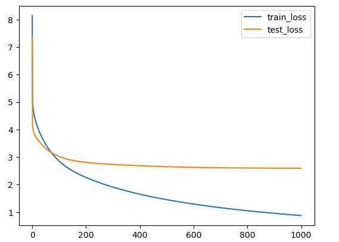

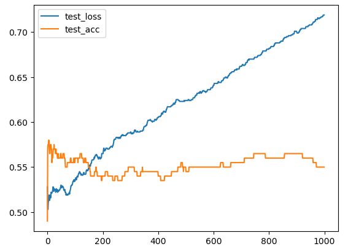

### 6.12 Que faire pour améliorer le modèle? ###

Tout ça nous indique  bien qu'on a un modèle en overfitting, car sur le graphique de Loss, on voit bien qu'il ya un décalage assez important entre le test_loss et train_loss, car le modèle fait beaucoup plus d'erreurs sur le test_set que sur le train_set. Et on retrouve exactement la même chose sur le graphique de accuracy. Puisque on voit que le modèle à beau s'entraîner encore et encore et encore, améliorant ainsi sa performance sur le train_set. Et sa capacité à généraliser et relativement mauvaise, puisqu'il n'améliore pas du tout sa performance sur le test_set. 

**Alors, pour régler ce problème,la première chose à faire** c'est de fournir plus de données à notre machine car en effet 1000 photos ça n'est clairement pas suffisant pour entraîner un bon modèle de Deep Learning. De plus lorsqu'on a un grand décalage entre le nombre de photos et le nombre de variables (1000 photos pour 4096 variables), on obtient un phénomène appelé **le fléau de la dimension**. Qui fait que l'espace, dans lequel se trouve nos données, est un espace principalement rempli de vide, au sein duquel le modèle peut se balader comme il veut et y trouver la configuration qui l'arrange pour obtenir un bon score sur le training_set au détriment de son score sur le test_set. 

Ce qu'on pourrait faire pour améliorer la situation, ça serait de fournir plus de données à notre modèle ou bien de réduire le nombre de variables ou encore d'utiliser une technique de régularisation tels que la pénalité $L_1$ ou $L_2$, cependant même en utilisant toutes ces choses ça ne va pas améliorer beaucoup la performance de notre modèle. Car en réalité, le problème vient du fait que notre modèle est beaucoup trop simpliste et  à l'heure actuelle tout ce que nous avons c'est un seul neurone. C'est un modèle linéaire, c'est à dire qu'il ne peut être utilisé que sur des problèmes qu'on peut séparer linéairement à partir du moment où vous traitez un Dataset un peu plus complexe, ce modèle ne va pas suffire. 

**Donc imaginez sur un Dataset de photos de chats et de chiens, clairement ça ne va pas.** 

Donc avant même de vouloir traiter ce problème d'overfitting, il va nous falloir améliorer le modèle en lui-même et pour ça nous allons devoir rajouter d'autres neurones dans notre modèle formant ainsi notre premier réseau de neurones artificiels.

## Leçon 7 : Réseau de neurones - 2 couches ##

Dans les précédentes leçons, nous avons vu comment développer des modèles de neurones artificiels également connu sous le nom de régression logistique. 

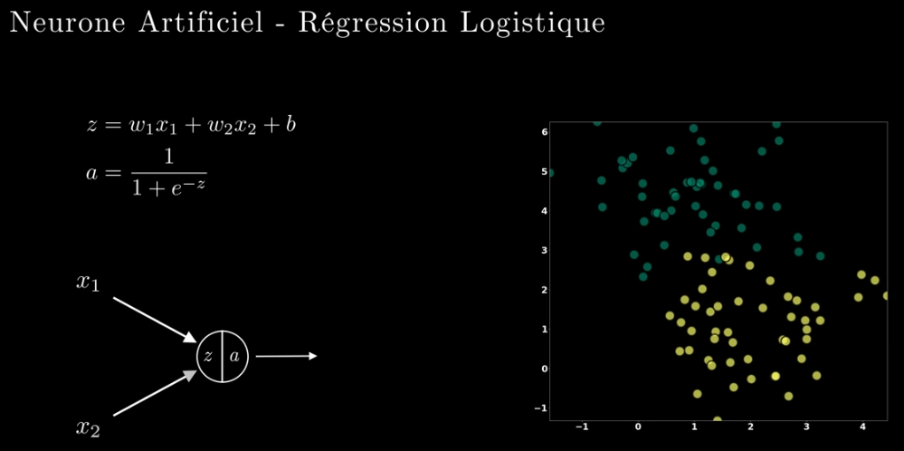

Comme on l'a vu ces modèles sont parfaits pour résoudre des problèmes relativement simples comme le fait de séparer deux classes de points linéairement séparables. 

En revanche dès que l'on s'attaque à des problèmes plus sophistiqués, 

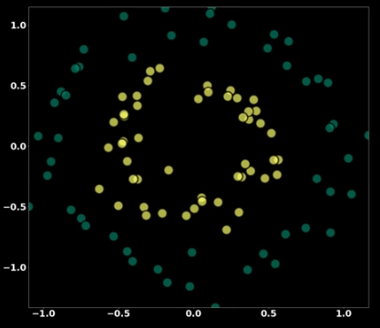

ce type de modèle est trop faible pour obtenir de bons résultats, on dit que le modèle est biaisé car son caractère linéaire représente un biais qui l'empêchent de saisir toute la complexité du problème.

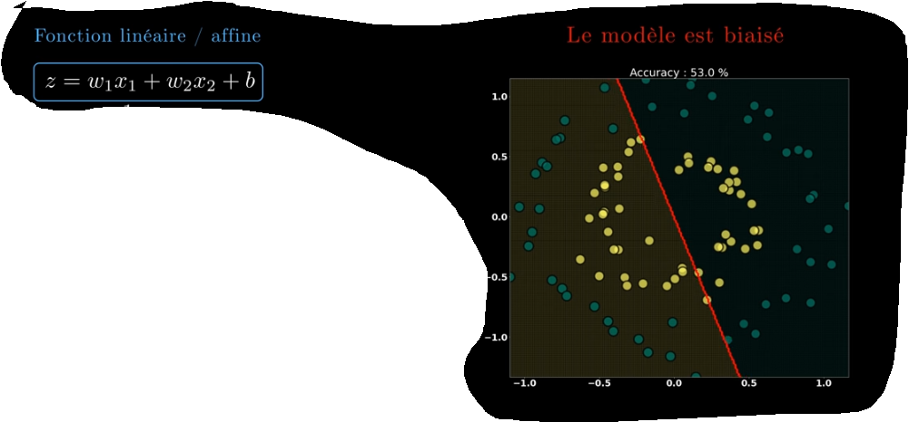

Donc, pour résoudre, ce qu'on fait est traditionnellement en machine learning, on améliore notre modèle en rajoutant par exemple des variables $x_1^2$ , $x_2^2$  ce qui nous permet de développer un modèle polynomiale.  

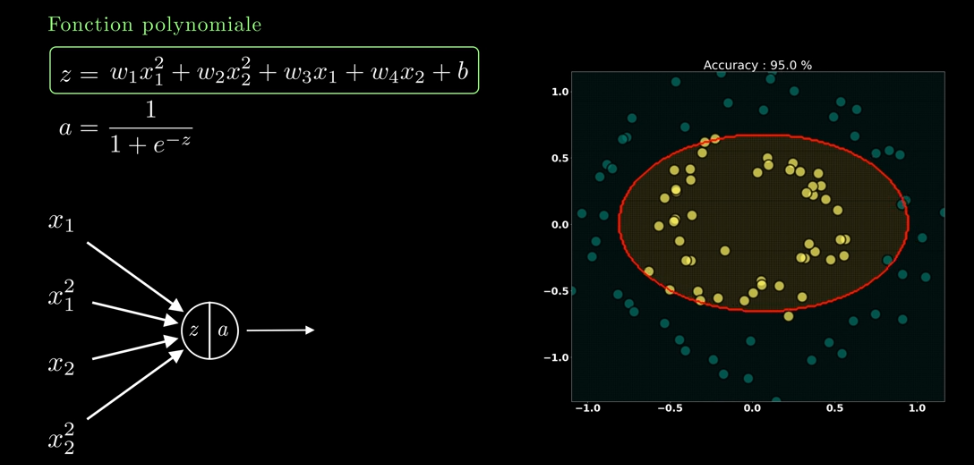

c'est ce qu'on appelle faire du **feature engineering** c'est à dire de la création de caractéristiques et c'est un travail qui peut demander beaucoup de temps et d' expertise. 

Maintenant dans cette série de leçons ne faisons pas du machine learning mais du deep learning, donc au lieu de faire du feature engineering, on va améliorer notre modèle en rajoutant d'autres neurones à l'intérieur. 

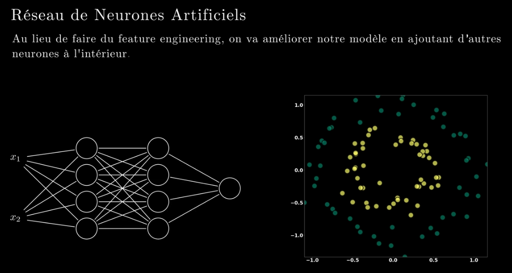

L'idée c'est de laisser la machine apprendre à faire son propre feature engineering, en lui allouant des neurones spécialement dédiés à cela. De cette manière en empilant plusieurs couches de neurones on obtient un modèle non linéaire qui est capable d'apprendre et à résoudre une très grande quantité de problèmes.

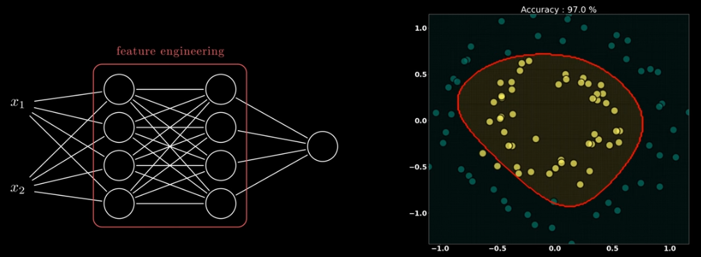 

Nous allons voir comment créer un tel réseau de neurones à partir des équations que l'on a développé dans les précédentes leçons 

### 7.1 Couche [1]  ###

Pour créer notre premier réseau de neurones artificiels, nous allons commencer par ajouter un autre neurone à côté de celui que nous avions déjà construits, 

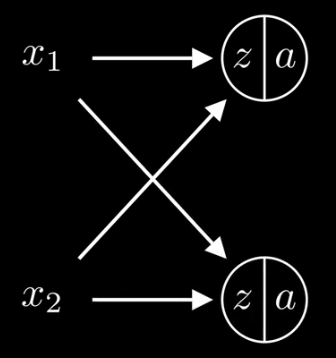

pour bien différencier les deux on va dire que le premier produit des valeurs $z_1, a_1$ tandis que le deuxième produit des valeurs $z_2, a_2$. 

Ces deux neurones ne partageant pas les mêmes connexions on va donc créer des paramètres $W$ et $b$ propres à chacun d'entre eux, en l'occurrence on note $w_{11}$ la connexion entre $z_1$ et $x_1$ , $w_{12}$ la connexion entre $z_1$ et $x_2$

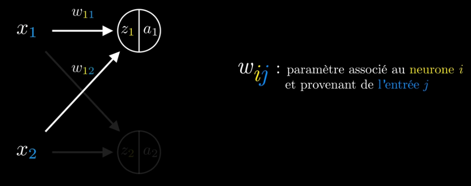

et $w_{21}$ la connexion entre $z_2$ et $x_1$ et $w_{22}$ la connexion entre $z_2$ et $x_2$. 

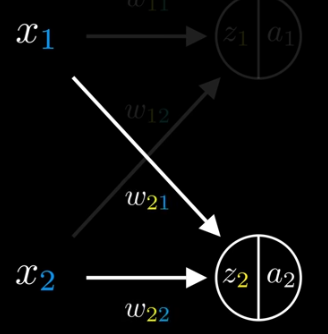

Chaque neurone reçoit également un biais qui lui est propre à savoir $b_1$ pour le premier et $b_2$ pour le deuxième. 

​	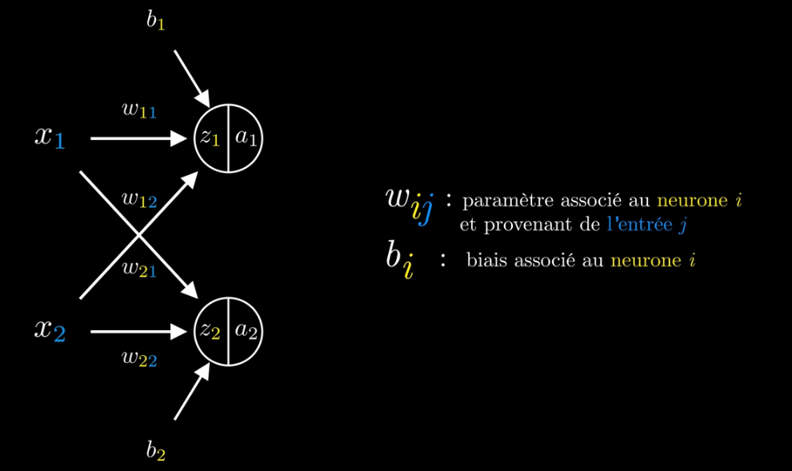

Tout cela nous permet donc d'écrire que 

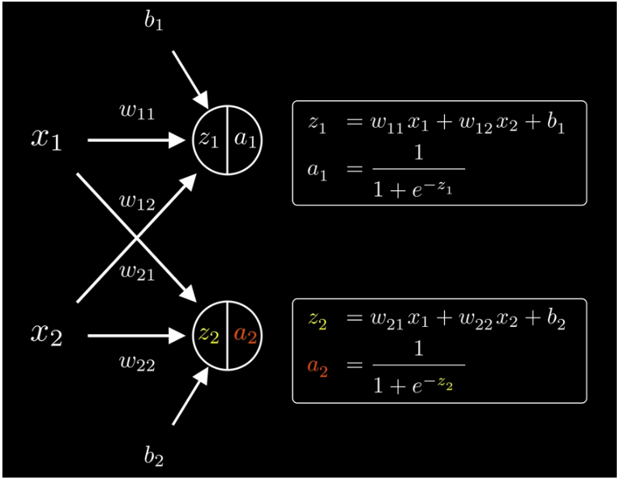

Ensuite pour calculer les activations de chaque neurone, c'est très simple puisqu'on dit que $a_1$ est égale à la fonction sigmoïde dans laquelle on fait passer $z_1$ et de la même manière $a_2$ est égale à la fonction sigmoïde dans laquelle on fait passer $z_2$. 

Et voilà, avec ça vous venez de créer votre premier réseau de neurones à une couche. Au sein de cette couche, vous pouvez rajouter autant de neurones que vous désirez

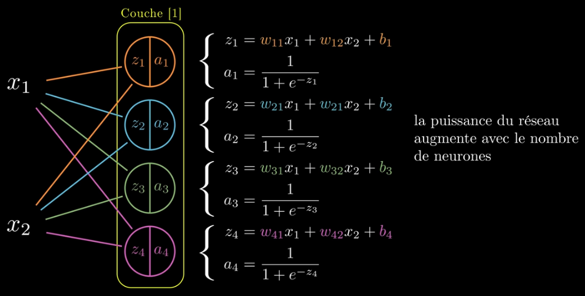

Chaque neurone disposant donc de ses propres paramètres, leur fonctionnement sera donc indépendant les uns des autres. Ce qui fait que plus vous en mettrez et plus votre réseau sera puissant mais aussi lent à entraîner. 

### 7.2 Couche [2] ###

A présent ce qu'on peut faire avec les résultats de cette première couche, c'est  de les envoyer vers une seconde couche de neurones. Pour ne pas confondre les éléments de cette deuxième couche avec ceux de la première couche, on introduit sur chacune de nos valeurs une nouvelle notation qui indiquent entre crochets le numéro de la couche en question. 

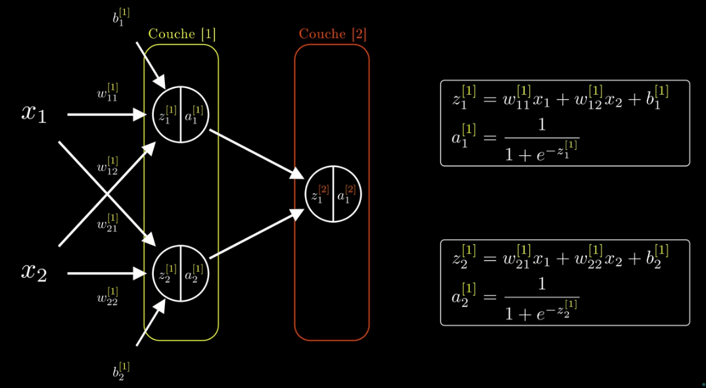

Donc ici, tout ce qui se situe dans la première couche va s'écrire entre [1] et tout ce qui se situe dans la deuxième couche va s'écrire [2]. 

De cette manière, pour calculer les éléments de la deuxième couche de neurones à savoir $z_1^{[2] }$ et $a_1^{[2]}$, nous allons prendre les activations issue de la première couche à savoir $a_1^{[1]}$ et $a_2^{[1]}$et nous allons les associer à des coefficients $w$ et $b$ qui sont propres à la deuxième couche de neurones. 

De cette manière on va donc avoir 

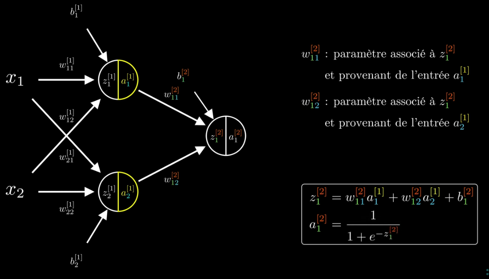

Voilà comment créer un réseau de neurones à deux couches. 

Alors comme tout à l'heure, vous pouvez rajouter autant de neurones que vous désirez au sein de cette deuxième couche les notations peuvent sembler un peu compliqué mais en réalité elles sont justes dans la continuité de ce qu'on a vu jusqu'à présent.

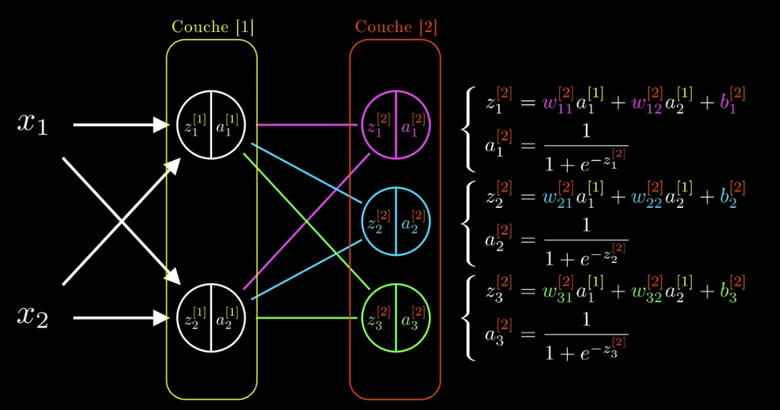

Pour finir vous pouvez aussi ajouter une troisième couche et pourquoi pas une quatrième et une cinquième. Chaque couche étant construites sur le même principe, c'est à dire en prenant en entrée les activations issues de la couche précédente. Et de cette manière vous pouvez alors construire un très grand réseau de neurones, ce qu'on appelle un **Deep Neural Network** d'où le nom de Deep Learning

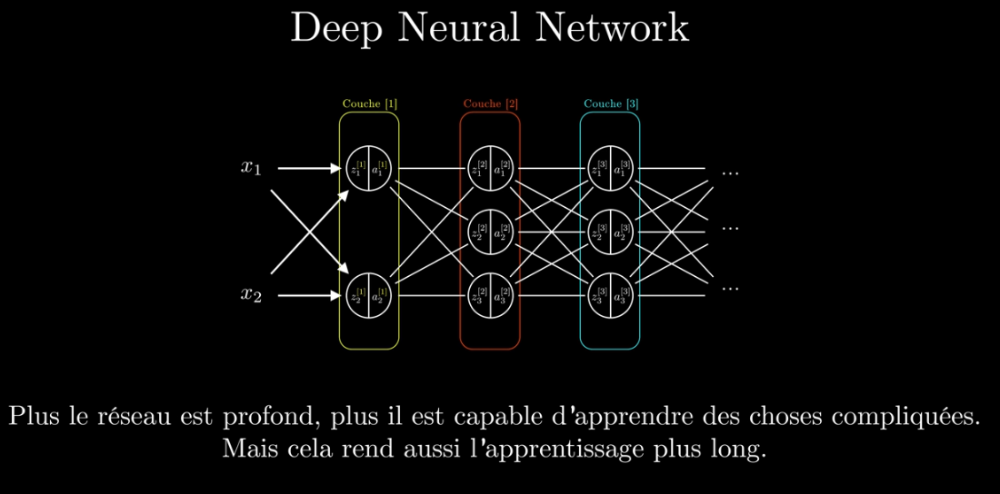

Plus votre réseau sera profond, c'est à dire plus il y aura de couches à l'intérieur et plus celui-ci sera puissant c'est à dire capable d'apprendre des choses très compliquées mais aussi plus lent à l'apprentissage. Un petit peu comme tout à l'heure, plus on met des neurones à l'intérieur d'une couche et plus celui ci est lent. Il faut donc trouver un juste équilibre.

### 7.3 Résumé ###

Et voilà avec ça, vous savez désormais  comment créer des réseaux de neurones artificiels. Pour résumer voici les trois points les plus importants à retenir 

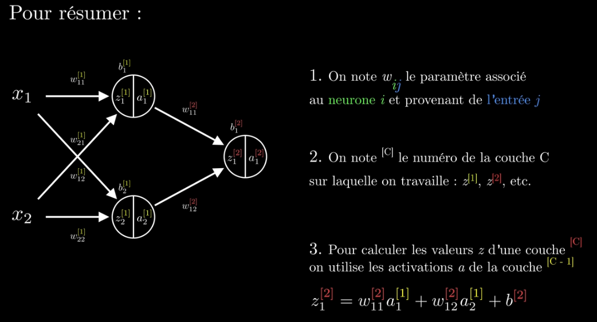

Maintenant, pour implémenter de tels modèles nous n'allons pas écrire une à une toutes les équations qui les composent. Dans le cas où nous aurions des milliers de neurones à l'intérieur d'un réseau, ça prendrait beaucoup trop de temps. 

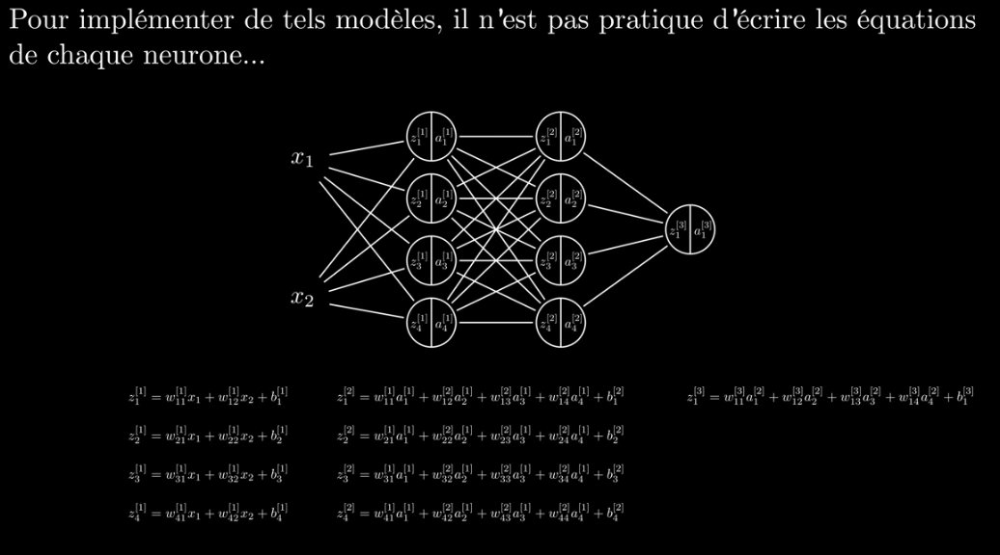

A la place, nous allons vectorisé l'ensemble de ces équations afin de représenter chaque couche du réseau par des matrices  

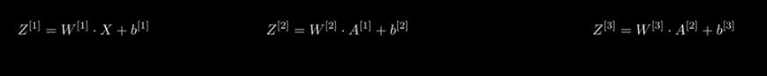

### 7.4 Vectorisation d'un réseau de neurones ###

Rappelez-vous nous avions déjà vu ce qu'était la vectorisation dans la quatrième leçon de cette série lorsque nous avions vectorisé les équations d'un modèle de neurones artificiels. 


Pour cela nous avions mis au sein d'un vecteur les paramètres $w_1$ et $w_2$ $\left[\begin{array}{l} w_1 \\ w_2\end{array}\right]$, ce qui nous avait permis à travers le calcul matricielle $X \cdot W+b$ d'obtenir un vecteur $Z$ comprenant toutes les valeurs petit z associée à notre Dataset

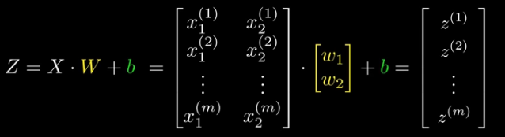

Et bien dans le cas d'un réseau de neurones, nous allons faire exactement la même chose, c'est-à-dire à placer les coefficients $w_{11}$, $w_{12}$, $w_{21}$ et $w_{22}$ au sein d'une matrice $W$ puis également placé les biais $b_1$ et $b_2$ au sein d'un vecteur $b$ pour ensuite effectuer le même calcul que dans les dernières leçons à savoir $Z = X \cdot W+b$, ce qui nous permet d'obtenir une matrice $Z^{[1]}$ de $m$ lignes et de deux colonnes une pour chaque neurone 

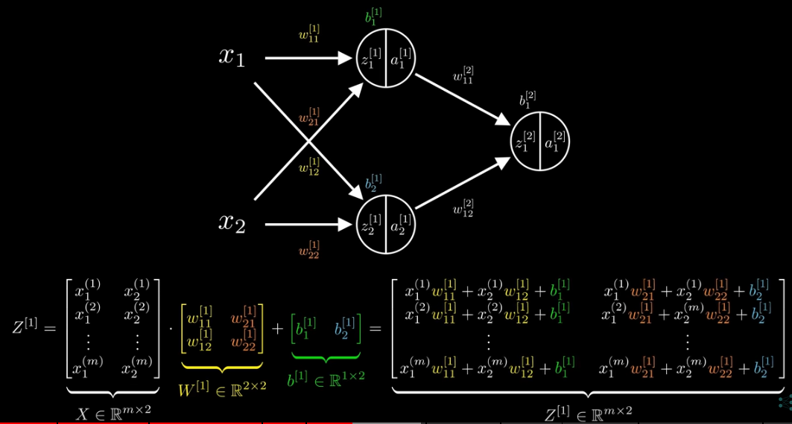

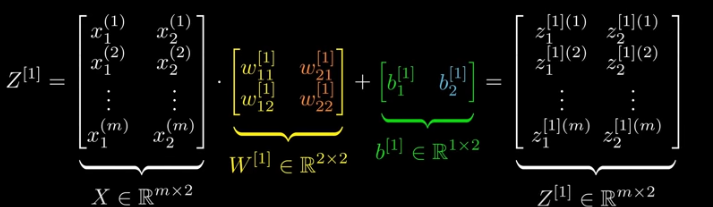

Autrement dit, grâce à la vectorisation, on est capable de réunir les résultats de nos deux neurones au sein d'une seule matrice et tout ça avec un seul calcul. 

Le grand avantage de cette technique, c'est que si vous voulez rajouter un troisième neurones à votre première couche alors tout ce que vous avez à faire c'est d'ajouter une troisième colonne à la matrice $w^{[1]}$ ainsi qu'un autres paramètres dans le vecteur $b^{[1]}$et de par le calcul matricielle $X \cdot W+b$, vous obtiendrez automatiquement une troisième colonne qui correspondra à votre troisième neurones dans la matrice $Z^{[1]}$ 

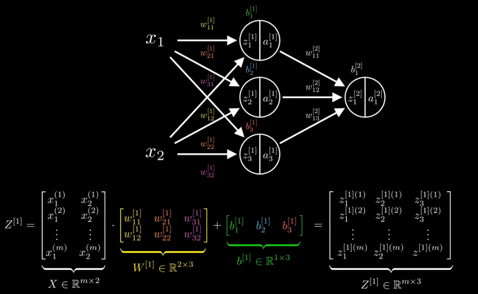

Et voilà, vous savez désormais comment vectoriser les équations d'un réseau de neurones. 

Alors juste pour information, vous verrez parfois ce calcul écrit un petit peu différemment dans certains livres. En effet, il arrive que l'on préfère organiser les coefficients $W$ et $b$ en ligne et non pas en colonnes. Ce qui impose de transposer la matrice $X$ et de réorganiser les termes de notre calcul matricielle pour que celui ci soit compatible au niveau des dimensions. 

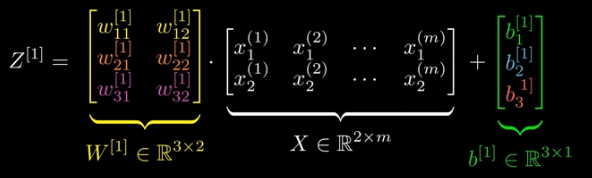

Alors rassurez vous, cela ne change absolument rien à notre calcul si ce n'est le fait de transposer la matrice $Z^{[1]}$. L'intérêt de faire ça, c'est tout simplement de pouvoir aligner chaque ligne de nos matrices avec leurs neurones respectifs. 

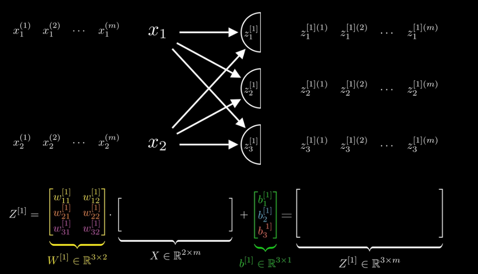

Donc ça ne change absolument rien à nos calculs mais ça rend le tout un petit peu plus compréhensible. D'ailleurs ça donne presque l'impression que les données pénètrent les unes après les autres dans le réseau et que chaque neurone produit une séquence de valeur que l'on enregistre en tant que ligne dans la matrice $Z$.

### 7.5 La Forward Propagation ###

Donc pour résumer, lorsque vous voulez vectorisé la première couche d'un réseau de neurones, il vous suffit d'écrire que 

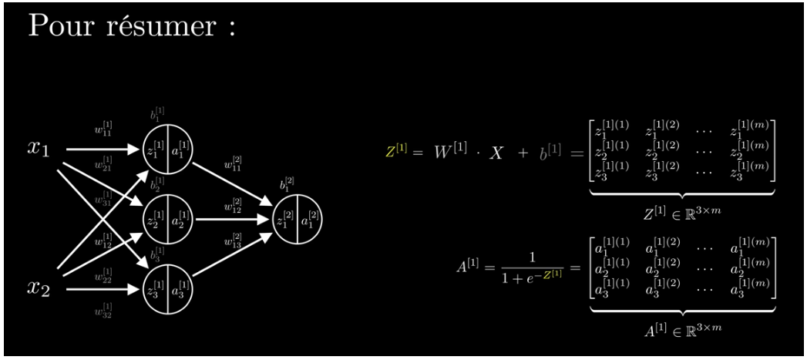

$Z^{[1]} = W^{[1]} \cdot X  + b^{[1]}$ ensuite pour obtenir les activations de cette première couche et bien il suffit de passer la matrice grand $Z^{[1]}$ au sein de la fonction d'activation ce qui nous retourne une matrice $A^{[1]}$ de même dimension que la matrice $Z^{[1]}$ tout simplement. 

Alors cette matrice $A^{[1]}$ peu ensuite l'envoyer vers la deuxième couche de notre réseau pour ça on utilise la même formule que tout à l'heure à savoir $Z^{[2]} = W^{[2]} \cdot X  + b^{[2]}$ ou $W^{[2]}$ et $b^{[2]}$ sont les matrices et les vecteurs qui contiennent tous les paramètres de la deuxième couche 

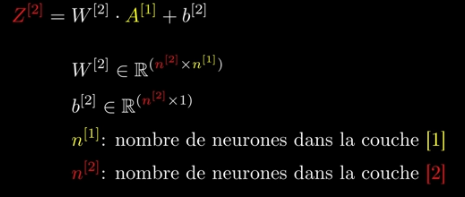

alors ça c'est important à savoir $W^{[2]}$ et donc de dimension $n^{[2]} \times n^{[1]}$ où $n^{[2]}$ c'est le nombre de neurones de la deuxième couche et $n^{[1]}$ c'est le nombre de neurones de la première couche.  $b^{[2]}$ est quant à lui de dimensions $n^{[2]} \times ...$ ensuite vous comprenez l'idée. On calcule $A^{[2]}$ à partir de $Z^{[2]}$ puis on calcule $Z^{[3]}$ à partir de $A^{[2]}$ etc... 

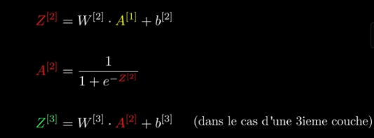

Et en fait, le tout forme ce qu'on appelle l'étape de **Forward Propagation** en français c'est ce qu'on peut traduire par **propagation vers l'avant** et c'est donc cette étape qui nous permet de faire passer les données de la première couche jusqu'à la toute dernière. 

Et voilà, vous savez désormais comment créer un réseau de neurones artificiels. 

Maintenant il ne reste plus qu à l'entraîner et pour ça nous allons utiliser une technique très connu du Deep Learning, celle de la **Back Propagation**   

### 7.6 L'entrainement d'un Réseau de neurones  ###

Pour rappel dans les dernières leçons nous avions vu que pour entraîner un modèle de neurones artificiels il fallait commencer par définir une fonction coûts qui permet d'évaluer les erreurs du modèle, puis de calculer les dérivées partielles de cette fonction coûts par rapport aux différents paramètres du modèle ce qui permet de comprendre comment cette fonction évolué par rapport à chacun de ces paramètres et pour finir de mettre à jour les paramètres $W$ et $b$ de façon à minimiser la fonction coût, c'est à dire minimiser les erreurs du modèle et tout ça grâce à l'algorithme de la descente de gradient. 

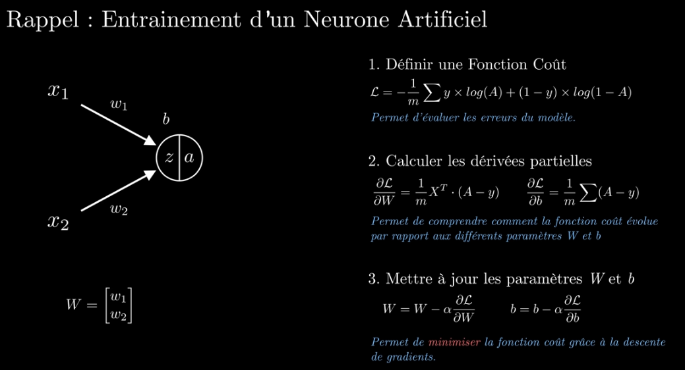

Et bien dans le cas d'un réseau de neurones, on procède exactement de la même manière c'est à dire qu'on commence par définir une fonction coût qui prend en compte la sortie du réseau ici il s'agit du vecteur $a^{[2]}$ puis dans un second temps, on calcule la dérivées partielles de cette fonction par rapport à chaque paramètre du réseau donc les paramètres de la deuxième couche $W^{[2]}$ et $b^{[2]}$, ainsi que les paramètres de la première couche $W^{[1]}$ et $b^{[1]}$ et pour finir on met à jour ces différents paramètres grâce à l'algorithme de la descente de gradient. 

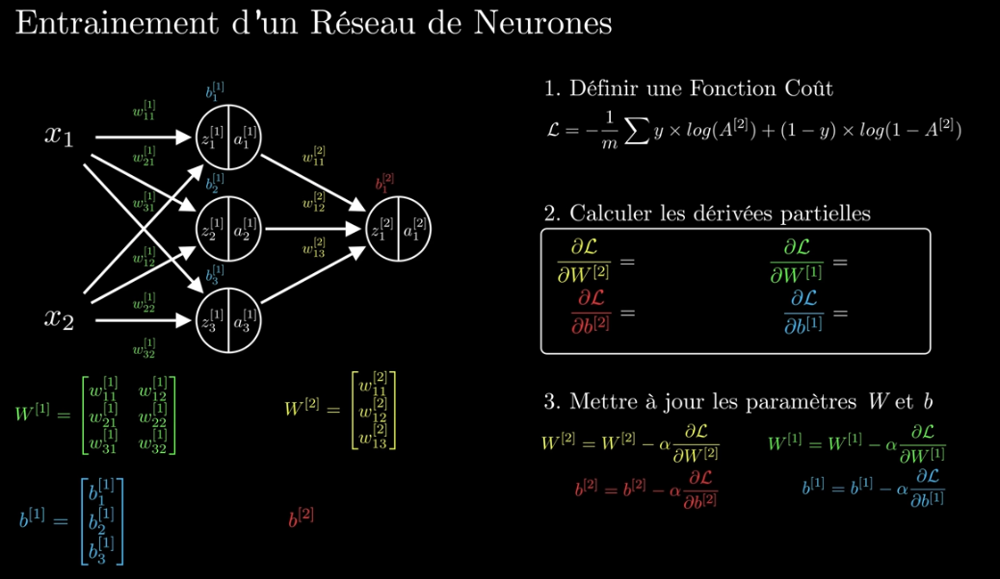

### 7.7 La Back Propagation ###

**La technique de la Back-Propagation** consiste à retracé comment la fonction coût évolue de la dernière couche du réseau jusqu'à la toute première. 

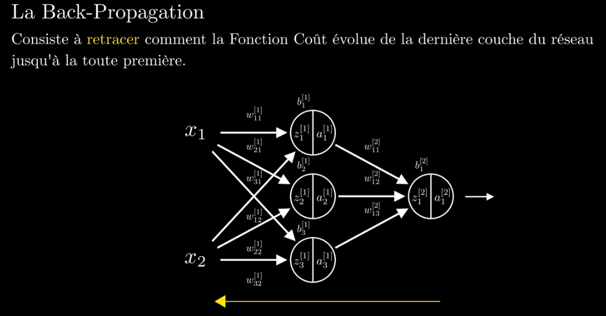

Un petit peu comme ce que nous avions fait dans la troisième leçon, lorsque nous avions calculé les gradients d'un modèle de neurones artificiels et nous avions retracé toutes nos équations de la dernière jusqu'à la première en calculant la dérivée partielle de $L$ par rapport à $A$ puis la dérivées partielles de $A$ par rapport à $Z$ et pour finir la dérivées partielles de $Z$ par rapport à $W$ et $b$. En simplifiant tous les éléments de cette chaîne de gradient, on obtient bien les dérivées partielles de $L$ par rapport à $W$ et par rapport à $b$ 

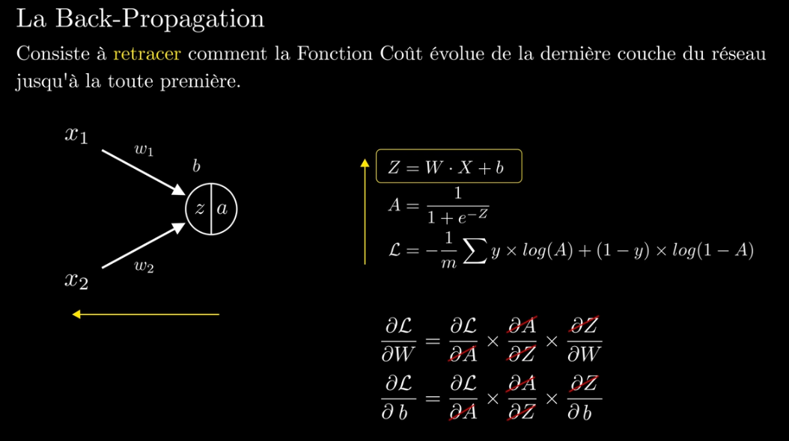

Maintenant, dans le cas d'un réseau de neurones, nous allons faire exactement la même chose c'est à dire qu'on va calculer la dérivée partielle de $L$ par rapport à $A^{[2]}$ puis la dérivées partielles de $A^{[2]}$ par rapport à $Z^{[2]}$ et pour finir la dérivée partielle de $Z^{[2]}$ par rapport à $W^{[2]}$ et $b^{[2]}$, ce qui nous permet de calculer et gradient de la deuxième couche. 

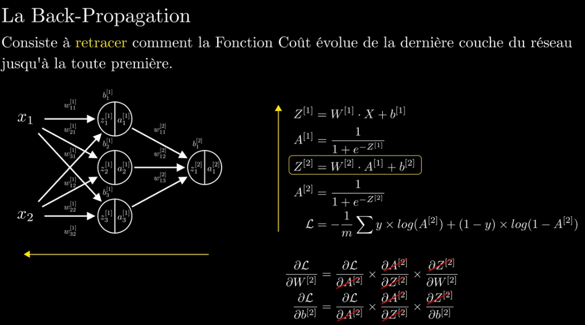

Ensuite, pour calculer les gradients de la première couche, on va poursuivre ce retracement encore plus loin en arrière. Pour commencer, on repasse par le même chemin que tout à l'heure c'est à dire la dérivée partielle de $L$ par rapport à $A^{[2]}$ puis la dérive est partiel de $A^{[2]}$ par rapport à $Z^{[2]}$ et ensuite afin de passer de la deuxième couche à la première couche,  on calcule la dérivées partielles de $Z^{[2]}$ par rapport à $A^{[1]}$ après quoi il suffit de calculer la dérivée partielle de $A^{[1]}$ par rapport à $Z^{[1]}$ et pour finir là dérivées partielles de $Z^{[1]}$ par rapport à $W^{[1]}$ est $b^{[1]}$.

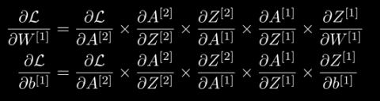

Et voilà, c'est ça qu'on appelle **la Back-Propagation**, la propagation vers l'arrière puisqu'on retrace tout notre calcul de la dernière équation jusqu'à la toute première. 

Alors tout ça nous donne donc les équations de nos différents gradient et on peut en général les simplifier de la manière suivante. Comme on peut le constater les gradients de la deuxième couche commence toujours par la même base à savoir d rond $L$ sur d rond $A^{[2]}$  et d rond $A^{[2]}$ sur d rond $Z^{[2]}$, donc ce qu'on peut faire c'est de poser une valeur $dZ_2$ qui est égal à ces deux dérivées partielles 

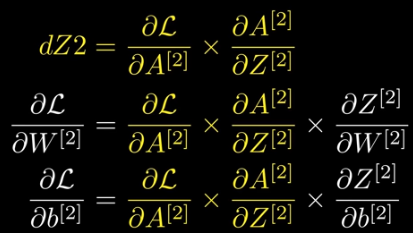

cela nous permet de simplifier l'écriture de nos de gradient 

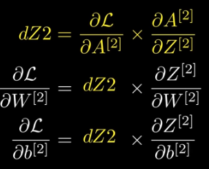

De la même manière on constate que les gradients de la première couche commence également par la même base. ici en bleu 

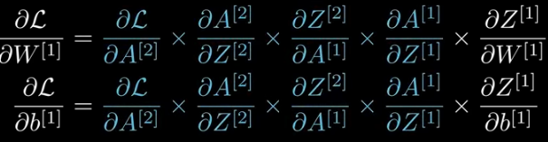

Alors ce qu'on fait en général, c'est qu'on pose une valeur $dZ^{[1]}$ qui est égal à toute cette expression en bleu. 


Et au sein de cette même expression, on retrouve $dZ^{[2]}$, 


donc on peut dire que 

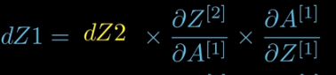

ce qui nous permet donc de simplifier le calcul des gradients de la première couche avec cette expression 

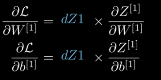

## Leçon 8 : La Back-Propagation ##

### 8.1 Rappel : Le Forward-Propagation ###


Alors avant toute chose pour résoudre cet exercice, nous allons avoir besoin de toutes les formules qui constitue l'étape de la **Forward-Propagation**. Donc pour commencer, nous allons réécrire ces formules, ce qui va nous permettre au passage de faire un petit rappel de ce qu'on a vu dans la dernière leçon. 

Donc nous avons ici un réseau de neurones à 2 couches au sein duquel on désire faire passer une matrice $X$ de dimensions $n^{[0]} \times m$ où $n^{[0]}$ représente le nombre de variables de notre Dataset et $m$ le nombre de données. 

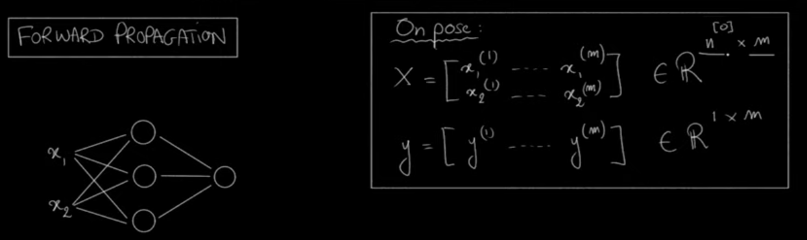

Alors ici dans ce cas précis, nous avons deux variables dans notre réseau $x_1$ et $x_2$, ce qui fait que $n^{[0]}$ va être égal à 2. Mais bien sûr on peut travailler avec autant de variables qu'on désire $x_3$, $x_4$, $x_5$,... tout ça n'a aucun impact sur les formules qu'on s'apprête à écrire. 

Alors dans la dernière leçon, nous avions vu que pour calculer les éléments de la première couche on commençait par calculé $Z^{[1]} = W^{[1]} . X + b^{[1]}$ où $W^{[1]}$ est une matrice de dimension $n^{[1]} \times n^{[0]}$ et $b^{[1]}$ est un vecteur de dimension $n^{[1]} \times 1$. 

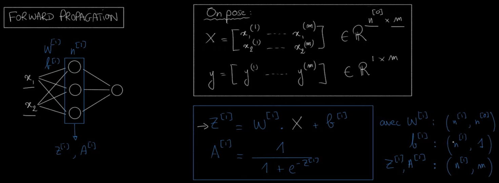

Alors dans tout ça, $n^{[1]}$ représente en réalité le nombre de neurones de la première couche et $n^{[0]}$ c'est le nombre de variables ou si vous voulez le nombre d'entrées de notre réseau. Donc dans ce cas précis, on peut dire que $n^{[1]}$ est égal à 3 car nous avons trois neurones. On a donc $W^{[1]}$ qui est de dimension (3,2) et $b^{[1]}$ qui est de dimension (3,1). Et tout ça c'est parfaitement logique, puisque 3x 2 = 6 et on a bien 6 connexions à l'entrée de notre réseau et pour $b^{[1]}$, on a bien 3 biais. Et ces trois biais sont mis dans un vecteur de dimension (3,1).

Donc voilà pour les paramètres $W$ et $b$, et ça nous donne une matrice $Z^{[1]}$ de dimension ($n^{[1]}$, $m$ ). 

Alors encore une fois c'est tout à fait logique puisque c'est en fait une matrice dans lequel dans laquelle on va avoir trois lignes, une pour chaque neurone. Donc on a un nombre $n^{[1]}$ de ligne et on va avoir $m$ colonne puisqu'on va avoir $m$ données qui vont se propager dans ce réseau,

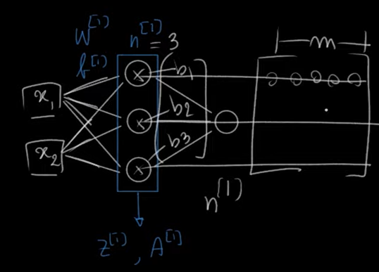

donc chaque neurone, va produire une séquence avec $m$ valeurs. 

Alors, on peut en plus vérifier le calcul matricielle ici $W^{[1]} . X + b^{[1]}$ , $W^{[1]}$  est de dimensions ( $n^{[1]}$,$n^{[0]}$ ) et $X$ est de dimension ( $n^{[0]}, m$ ). 

Donc quand on effectue le produit matricielle de ces deux vecteurs, le $n^{[0]}$ s'en va et laisse place à une matrice de dimension  Le $b^{[1]}$ est de  dimension ( $n^{[1]}$, 1 ) donc quand on additionne 

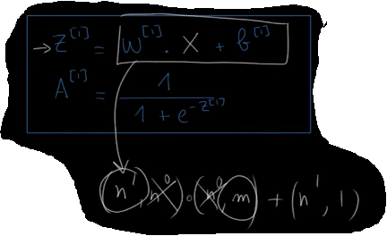

de part **l'effet de broadcasting**, le 1 est si vous voulez étendu pour devenir un $m$ 

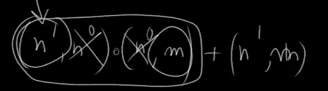

et pour couvrir l'étendue de toute la matrice. Donc on a bien un résultat de dimension ( $n^{[1]}$ , $m$ ) et voilà pour la matrice $Z^{[1]}$ 

Maintenant cette matrice $Z^{[1]}$, on peut la passer dans notre fonction d'activation, ce qui nous retourne une matrice $A^{[1]}$ qui est elle aussi de dimension ( $n^{[1]}, m$ ),  ce qui est logique encore une fois vu que on a trois activation $A^{[1]}$,$A^{[2]}$ et $A^{[3]}$.  Chaque activation produit une séquence de $m$ valeur donc c'est bien une matrice de dimension ( $n^{[1]}, m$ ). 

**Comment calculer tous les éléments de la première couche de notre réseau?** Dans la dernière leçon, on avait vu que pour calculer les éléments de la deuxième couche, il fallait prendre la sortie de la première couche donc l'activation $A^{[1]}$ et l'injecter dans la formule de $Z^{[2]}$ 

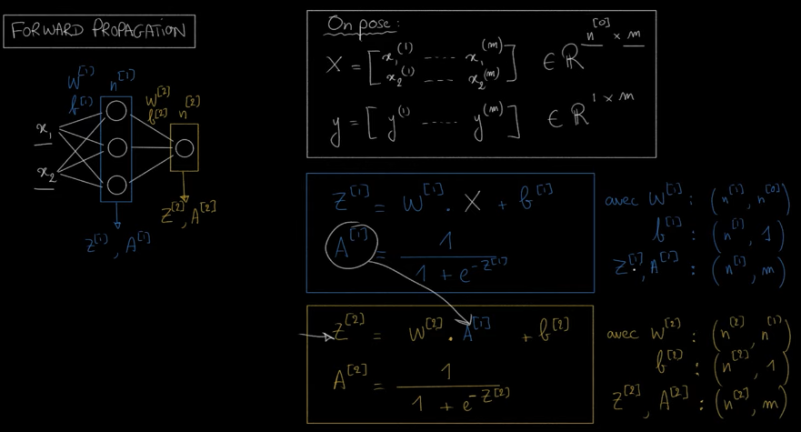

c'est-à-dire la formule qu'on retrouve à l'entrée de la deuxième couche de notre réseau. Donc on a $Z^{[2]} = W^{[2]} . A^{[2]} + b^{[2]}$  ou $W_2$ et $b_2$ sont les matrices et les vecteurs qui contiennent les paramètres de la deuxième couche. 

Alors au niveau des dimensions c'est exactement la même chose tout ce qu'on fait c'est qu'on incrémente e 1 toutes les couches par rapport à ce qu'on avait tout à l'heure et donc ça nous permet d'obtenir une matrice $Z^{[2]}$ et $A^{[2]}$ dont les dimensions sont ( $n^{[2]} , m$ ).

Pour compléter notre Forward-Propagation, il ne nous manque plus qu notre fonction coût. Donc là le principe est simple, on prend la sortie de notre réseau c'est à dire à deux et on injecte dans la formule du logos ce qui nous retourne les erreurs de notre modèle


Et voilà, avec ça vous avez donc toutes les équations qui constitue l'étape de Forward-Propagation.

### 8.2 Back-Propagation ###

Donc à présent nous allons pouvoir passer à la Back- Propagation ou Backward-Propagation, le retracement vers l'arrière parce qu'en fait pour calculer nos gradients, on part de la dernière formule, donc notre fonction coût et on calcule sa dérivé et par rapport à la fonction qui la précède c'est à dire la fonction d'activation $A^{[2]}$, ensuite on calcule la dérivée de la fonction d'activation $A^{[2]}$ par rapport à $Z^{[2]}$, puis la dérivée de $Z^{[2]}$ par rapport à $W^{[2]}$ 

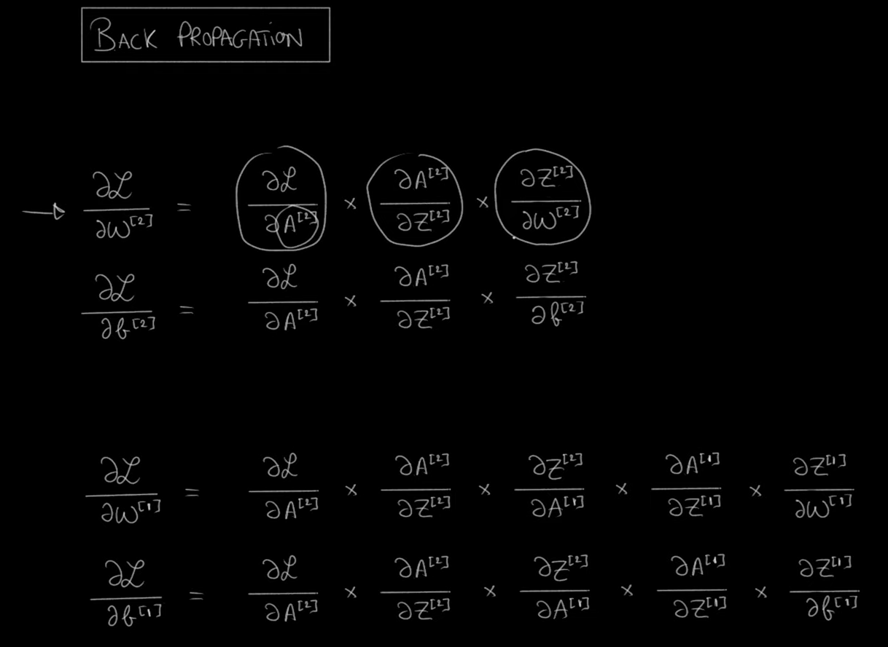

donc en fait, on rebrousse notre chemin de la dernière équation $L$ jusqu'à $Z^{[2]}$ ou jusqu'à carrément la toute première lorsqu'on veut calculer les gradients de la première couche. C'est pour ça que ça s'appelle la Back-Propagation. 

Si ça nous permet de calculer la dérive partielle de $L$ par rapport à $W^{[2]}$, c'est parce qu'au final et cela se simplifient 

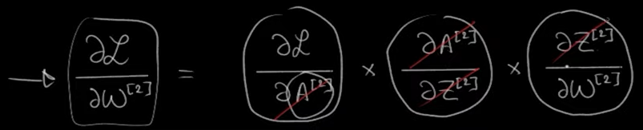

Donc il nous reste plus que la dérivée partielle de $L$ par rapport à $W^{[2]}$. Idem pour tous les autres gradients. 

Donc ce qu'on avait vu dans la dernière leçon, c'est qu'on pouvait en réalité simplifier l'écriture de ces gradients puisqu'on remarque qu'il commence à chaque fois par la même base 


et cette base on l'appelle $dZ_2$ pour les gradients de la deuxième couche et $dZ_1$  pour les gradients de la première couche. 

Donc nous allons calculer ces six expressions à commencer par $dZ_2$, ensuite les gradients de la deuxième couche et ensuite $dZ_1$ et les gradients de la première couche.

### 8.3 Calcul de dZ2  ###

Commencer par $dZ^{[2]}$ qui est donc égale à 


$$
d Z 2=\frac{\partial \mathcal{L}}{\partial A^{[2]}} \times \frac{\partial A^{[2]}}{\partial Z^{[2]}}
$$


C'est $dZ_2$ parce qu'en réalité c'est la dérivée partielle de $L$ par rapport à $Z^{[2]}$ et cela vaut, 


$$
\begin{aligned}
d Z 2 & =\frac{1}{m} \sum\left(\frac{-y}{A^{[2]} }+\frac{1-y^2}{1 - A^{[2]}}\right) \times(A^{[2]}(1-A^{[2]}) \\
& =\frac{1}{m} \sum-y(1-A^{[2]})+(1-y) A^{[2]} \\
& =\frac{1}{m} \sum-y(A^{[2]} y)+A^{[2]}(-A^{[2]} y) \\
& =\frac{1}{m} \sum A^{[2]}-y
\end{aligned}
$$


donc c'est notre expression qui nous permet de calculer $dZ2$. 

Alors avant d'aller plus loin on va vérifier que les dimensions sont bonnes puisque $dZ2$ est censée être de la même dimension que $Z^{[2]}$ car $dZ2$ est la dérivée partielle de $L$ par rapport à $Z^{[2]}$. Admettons que $Z^{[2]}$ soit un tableau qui contiennent deux lignes et quatre colonnes. 

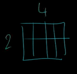

Lorsqu'on va dériver notre fonctions coût par rapport à $Z^{[2]}$, on va calculer la dérivée par rapport à ce premier élément et ça va nous donner la dérivée de $L$ par rapport à la première case, ensuite on aura la dérivée de $L$ par rapport à la deuxième case là etc...

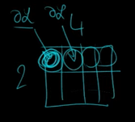


Donc, le tableau qui représente $dZ2$ est de même dimension que le tableau de $Z^{[2]}$.

Donc, on sait  que $dZ2$ est de dimension  ( $n^{[2]} , m$ ), $A^{[2]}$ est de dimension ( $n^{[2]} , m$ ) et $y$ est de dimension ( 1, $m$ ). 

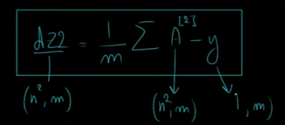

Alors, on pourrait dire qu'il y a un problème de dimensions? Non, grâce au **Broadcasting**. **Le broadcasting** c'est une technique qui nous permet d'étendre les dimensions du tableau $y$ pour que celui ci couvre les dimensions du tableau  $A^{[2]}$. Imaginons que notre tableau $A^{[2]}$ face donc $n^{[2]}$ lignes, ici on va dire qu' il a simplement 3 lignes et $m$ colonnes, cic plein de colonnes. Et $y$ est un tableau qui contient une seule ligne et $m$ colonnes. 

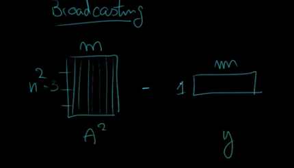

Si on soustrait le tableau $A^{[2]}$ au tableau $y$, ce qu'on va faire c'est qu'on va prendre la ligne $y$ et on voit la soustraire à la première ligne $A^{[2]}$ puis on va la soustraire à la deuxième ligne $A^{[2]}$ et puis on va la soustraire à la troisième ligne $A^{[2]}$.

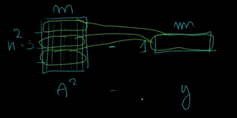

Cette soustraction, c'est le broadcasting, ça nous permet de dire que finalement $y$ c'est comme s'il était de dimension ( $n^{[2]} , m$ ). 

Donc tout ça pour dire qu' en soustrayant nos deux tableaux le tableau $A^{[2]}$ et le tableau $y$, on obtient bien quelque chose de dimension ( $n^{[2]}$,  $m$ ). 

Alors pour ça, on va juste extraire le $\frac{1}{m}\ et\ la \sum$ de notre formule et on l'intégrera un petit peu plus tard. Pour l'instant on la met de côté parce que si on fait la somme de ces tableaux, au final on n'obtient pas une matrice de dimension ( $n^{[2]}$,  $m$ ). Si on fait la somme des éléments d'un tableau, ça réduit nécessairement la dimension de ce tableau

Donc tout ça nous permet de conclure que $dZ2=A^{[2]}-y$. La somme comme j'ai dit on la laisse de côté pour le moment.

A présent qu'on a $dZ2$, on va donc pouvoir l'injecter à cet endroit, 

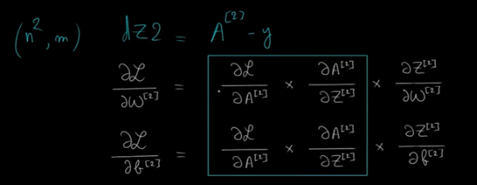

pour calculer la dérivée partielle de $L$ par rapport à  $W^{[2]}$, la dérivée partielle de $L$ par rapport à $b^{[2]}$.

### 8.4 Calcul de dW2 ###

On va dire que 


$$
\frac{\partial \mathcal{L}}{\partial \omega^{[2]}}=d z 2 \times \frac{\partial z^{[2]}}{\partial \omega^{[2]}}
$$


Alors , quand on dérive $Z^{[2]}$ par rapport à $W^{[2]}$, il reste $A^{[1]}$ et le $b^{[2]}$, quant à lui c'est une constante. 

Donc 


$$
\frac{\partial \mathcal{L}}{\partial w^{[2]}} = \frac{1}{m} dZ2 \times A^{[1]}
$$


Alors encore une fois, avant d'aller plus loin, on va vérifier les dimensions de notre calcul,

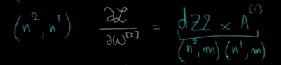

Alors là, on a un problème parce qu'on ne peut pas faire la multiplication élément par élément de deux tableaux qui ont de telles dimensions. Alors quand on parle de multiplication élément par élément, on parle pas du produit matricielle, on parle de multiplication standard. Alors, on ne peut pas le faire parce que les deux tableaux n'ont pas les mêmes dimensions. 

Donc, on va créer un produit matricielle et on va transposer la matrice $A^{[1]}$. Parce qu en la transposant, le $m$ va passer de l'autre côté et donc on va pouvoir faire s'envoler les $m$ et on gardera quelque chose de dimension $(n^{[2]} , n^{[1]})$. Il n'est pas nécessaire d'intégrer la $\sum$ que nous avons laissé de côté car elle est intégrée dans le produit matriciel.

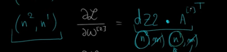

Donc au final le calcul pour la dérivée partielle de $L$ par rapport à w2 est 


$$
\frac{\partial L}{\partial w^{[2]}} = \frac{1}{m} dZ2 \cdot A^{[1]^T}
$$


### 8.5 Calcul de db2 ###

Ensuite pour la dérivée partielle de $L$  par rapport à $b^{[2]}$, la dérivée partielle de$Z^{[2]}$ par rapport à $b^{[2]}$, ça donne 

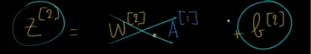

on a 1 x $b^{[2]}$, donc ça nous retourne 1.

Donc ça nous retourne tout simplement 


$$
\frac{\partial \mathcal{L}}{\partial b^{[2]}} = \frac{1}{m}dZ2
$$


On va vérifier les dimensions,  $\frac{\partial \mathcal{L}}{\partial b^{[2]}}$ est de dimension ( $n^{[2]}$,  $1$ ) mais $dZ2$ et de dimensions ( $n^{[2]}$,  $m$ ). Donc là, on a un problème et pour résoudre ce problème c'est très simple, on va réintroduire la somme qu'on avait laissé de côté. Car si on fait la somme sur les colonnes donc sur l'axe1 d'un tableau qui contient $m$ colonne et  $n^{[2]}$ ligne et bien  $m$ va être converti en une seule colonne. 

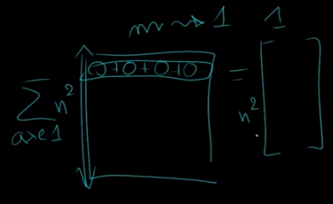

Donc, ça nous donne donc un vecteur à une seule colonne et $n^{[2]}$ lignes. 

Donc voilà comment on va réutiliser notre sommes,  on va dire que la dérivée partielle de $L$ par rapport à b2 c'est 


$$
\frac{\partial \mathcal{L}}{\partial b^{[2]}}=\frac{1}{m} \sum_{a \times e 1} d Z 2
$$


### 8.6 Calcul de dZ1 ###

Il ne reste plus qu'à calculer les gradients de la première couche, à commencer par $dZ1$ au sein duquel on retrouve d'abord $dZ2$. 


$$
\begin{aligned}
dZ1 & = d Z 2 \times \frac{\partial Z^{[2]}}{\partial A^{[1]}} \times \frac{\partial A^{[1]}}{\partial Z^{[1]}} \\
& = dZ2 \times W^{[2]} \times A^{[1]} (1 - AW^{[1]})
\end{aligned}
$$


Alors avant d'aller plus loin, on va vérifier que les dimensions $dZ1$ sont correctes. Donc $dZ1$ est censé être de même dimension que $Z^{[1]}$ qui est de  dimension ( $n^{[1]}$,  $m$ ), $dZ2$ est de dimension ( $n^{[2]}$,  $m$ ), $W^{[2]} $ est de dimensions ( $n^{[2]}$,  $n^{[1]}$ ) et $A^{[1]}$ est de dimensions ( $n^{[1]}$,  $m$ )

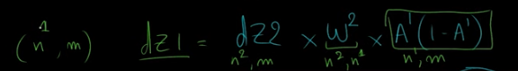

Alors, encore une fois on a des petits problèmes de dimension. Nous on veut avoir ( $n^{[1]}$,  $m$ ).Donc, on pourrait faire un produit matricielle en passant $W{[2]}$ de l'autre côté et en transposant $W{[2]}$,

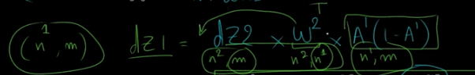


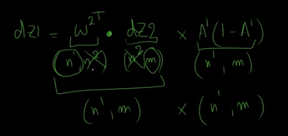

donc on a une matrice qu'on multiplie alors pas du tout en produits matricielle mais juste en produits terme à terme.

Alors 


$$
dZ1=W^{2^{\top}} \cdot\ dZ2 \times A^{[1]} (1-A^{[1]})
$$


et tout ça c'est donc de dimensions  ( $n^{[1]}$,  $m$ ). 

### 8.7 Calcul de dW1 et db1 ###

Alors à présent on peut donc simplifier les formules de nos 2 gradients 

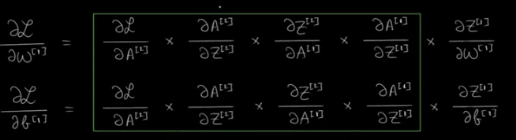

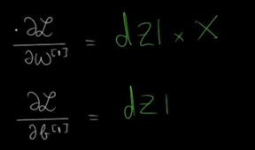

On va encore vérifier que nos dimensions soit correcte, 

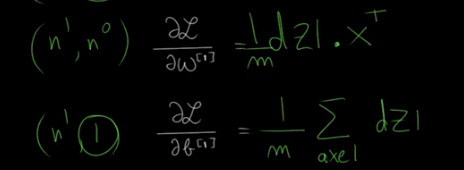

### 8.7 Bilan ###

Nous avons donc nos six équation, 

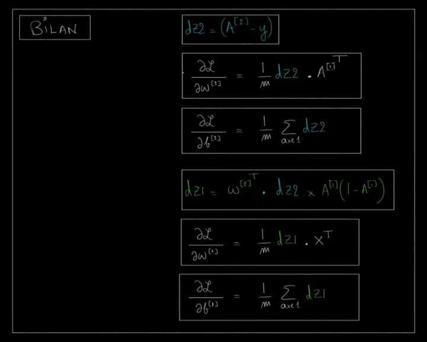

## Leçon 9 : Programmer un réseau de neurones à 2 couches ##

### 9.1 Structure du code  ###

Pour écrire notre programme de réseaux de neurones, nous allons repartir du code qui nous avait permis d'entraîner un modèle de neurones artificiels

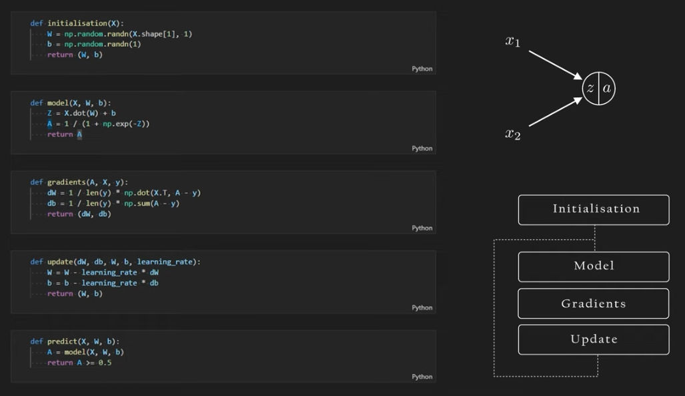

car en réalité ces deux programmes vont suivre exactement la même structure. La seule différence entre les deux, c'est qu'au lieu d'avoir un seul neurone dans une seule couche et bien nous avons cette fois ci plusieurs neurones répartis en deux couches,

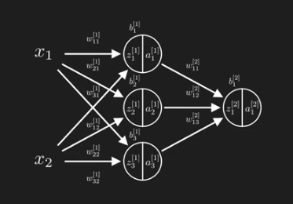

cela fait que nos fonctions vont être un tout petit peu différente. En effet, au lieu d'avoir simplement $W$ et $B$ dans notre fonction d'initialisation, nous allons avoir quatre paramètres $W^{[1]}$, $b^{[1]}$ et $W^{[2]}$,  $b^{[2]}$. 

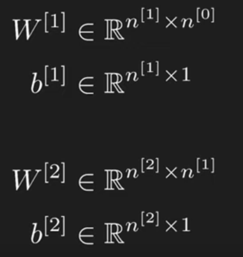

De même pour la fonction du modèle, au lieu d'avoir simplement $Z$  et $A$, nous allons avoir $Z^{[1]}$, $A^{[1]}$ et $Z^{[2]}$, $A^{[2]}$. 


### 9.2 Fonction d'initialisation ###

Comment modifier notre fonction d'initialisation pour pouvoir cette fois ci l'utiliser pour un réseau de neurones à deux couches. On va dire cette fois ci que $W1$ est de  dimensions $(n1, n0)$ 

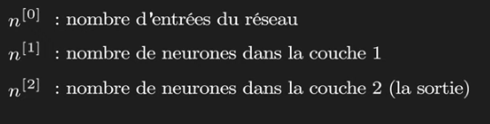

Alors ce $n1$ et ce $n0$ on va donc les faire passer en tant que paramètres. $b1$ est quant à lui de dimensions $(n1,1)$. Ca c'est donc pour les paramètres de la première couche. 

Et ensuite, il nous faut initialiser les paramètres de la deuxième couche $W2$ de dimension $(n2,n1)$ et $b2$ est de dimension $(n2,1)$. On va à notre liste de paramètres $n2$.  

```python
import numpy as np
import matplotlib.pyplot as plt
from sklearn.datasets import make_blobs, make_circles
from sklearn.metrics import accuracy_score, log_loss
from tqdm import tqdm
```

```python
def initialisation(n0, n1, n2):

    W1 = np.random.randn(n1, n0)
    b1 = np.zeros((n1, 1))
    W2 = np.random.randn(n2, n1)
    b2 = np.zeros((n2, 1))
```

Maintenant pour retourner ces différents paramètres, nous allons scellé tous ces paramètres dans un dictionnaire qu'on peut par exemple appeler **parametres{}**. Et de retourner ce dictionnaire, ce qui nous permettra par la suite de manipuler uniquement ce conteneur dans tout le reste de notre code.

```python
    parametres = {
        'W1': W1,
        'b1': b1,
        'W2': W2,
        'b2': b2
    }

    return parametres
```

Et voilà, avec ça vous avez désormais votre fonction d'initialisation prêtes à l'emploi.

### 9.3 Forward-Propagation ###

Maintenant, passons à notre fonction de modèle qu'on pourrait peut-être nommé en **forward_propagation()**, puisque c'est vraiment le terme qu'on utilise en Deep-Learning. Alors, dans cette fonction on faisait autrefois passer nos données $X$ ainsi que les paramètres $W$ et $b$, sauf qu'à présent nous avons un dictionnaire qui contient nos différents paramètres. Donc on va faire passer ce dictionnaire à la place. 

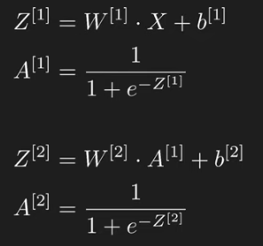

Alors, dans cette fonction on cherche donc à calculer $Z1$, $A1$ et $Z2$, $A2$. On va venir chercher nos coefficients et biais dans notre dictionnaire paramètres

```python
def forward_propagation(X, parametres):

    W1 = parametres['W1']
    b1 = parametres['b1']
    W2 = parametres['W2']
    b2 = parametres['b2']
```

Ce qui nous permet donc de calculer 

```python
    Z1 = W1.dot(X) + b1
    A1 = 1 / (1 + np.exp(-Z1))

    Z2 = W2.dot(A1) + b2
    A2 = 1 / (1 + np.exp(-Z2))
```

Pour finir notre Forward-Propagation, il faut donc qu'on retourne l'activation à la sortie de notre neuronne, donc l'activation $A2$. Cependant on va pas se contenter de retourner uniquement cette activation parce qu'en réalité on aura également besoin de l'activation $A1$ pour calculer les gradients lors de la Back-Propagation. 

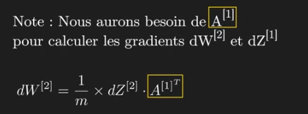

Donc ici on peut retourner si on veut un tupple qui contient nos différentes activation en les plaçant dans un dictionnaire que l'on retourne 

```python
    activations = {
        'A1': A1,
        'A2': A2
    }

    return activations
```

voilà avec ça vous avez désormais écrit votre Forward-Propagation. 

### 9.4 Back-Propagation  ###

Maintenant qu'on a fait tout ça, nous allons enfin pouvoir passer à la fonction des gradients qu'on va pouvoir ici renommer en **back_propagation()**. 

Dans cette fonction nous allons calculer $dZ2$, $dW2$, $db2$ et ensuite $dZ1$, $dW1$,  $db1$. 

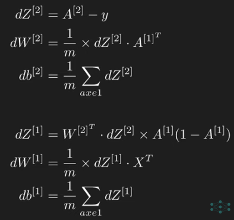

Alors pour ça, si on jette un coup d'oeil à nos formules on voit qu'on va avoir besoin de $A2$ , $y2$ , $A1$, $W2$ et de $X$. 

Donc avant de se lancer dans les calculs, nous allons nous assurer qu'on est bien accès à ces différentes valeurs en les passant dans notre fonction. On a donc $X$, $y$ ainsi que le **dictionnaire des activations** pour pouvoir extraire $A1$ et $A2$ et le dictionnaire paramètres pour pouvoir extraire $W2$. 

Une fois que nous avons extrait ces différentes valeurs, nous pouvons nous lancer dans nos calculs. 

```python
def back_propagation(X, y, parametres, activations):

    A1 = activations['A1']
    A2 = activations['A2']
    W2 = parametres['W2']

    m = y.shape[1]
```

Alors on va commencer par $dZ2$. Ensuite, nous avons $dW2$ où $m$ c'est le nombre de données que l'on a dans notre Dataset,  autrement dit m c'est égal à **shape[1]** et oui car comme on l'avait vu dans la septième leçon de cette série, lorsqu'on travaille avec des réseaux de neurones, on a tendance à transposer la matrice $X$ est le vecteur $y$. 

```python
    dZ2 = A2 - y
    dW2 = 1 / m * dZ2.dot(A1.T)
```

Maintenant db2, c'est égal à $1/m$ x la somme des colonnes de $dZ2$, donc on va écrire **axis égal à 1** dans tout ça on va aussi rajouter $keepdims=Tue$, ce qui va nous permettre de conserver un tableau $db2$ à deux dimensions. Ca c'est très important parce que tout à l'heure lors ce qu'on mettra à jour nos gradient en disant que $b2$ est égal à $b2$ moins le **learning_rate** fois le gradient $db2$. Si $db2$ est de dimension $n2$ et que $b2$ est de dimensions $(n2,1)$, on va obtenir des résultats assez étrange à cause du phénomène de **broadcasting**. 

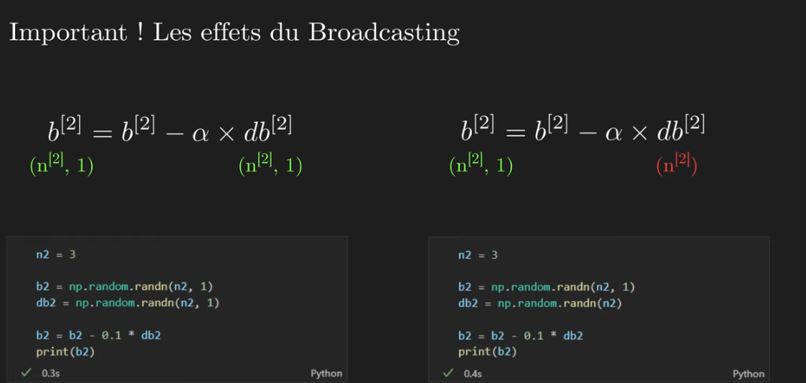

```python
    db2 = 1 / m * np.sum(dZ2, axis=1, keepdims = True)
```

Donc voilà pour les gradients de la deuxième couche. 

Maintenant, on va copier coller tout ça pour travailler sur la première couche.

```python
    dZ1 = np.dot(W2.T, dZ2) * A1 * (1 - A1)
    dW1 = 1 / m * dZ1.dot(X.T)
    db1 = 1 / m * np.sum(dZ1, axis=1, keepdims = True)
```

Encore une fois, ce qui est conseillé de faire, c'est de mettre tous ces gradient dans un dictionnaire et de retourner ce dictionnaire. 

```python
    gradients = {
        'dW1' : dW1,
        'db1' : db1,
        'dW2' : dW2,
        'db2' : db2
    }
    
    return gradients
```


Voilà avec ça nous avons notre formule de Bak-Propagation. 

### 9.5 Fonction Update  ###

Pour finir, il ne reste plus qu'à modifier notre fonction **update()**. Alors cette fonction, elle a normalement pour but de modifier les paramètres $W$ et $b$. Mais là, comme nous avons quatre paramètres, on va modifier $W1$, $b1$ et $W2$, $b2$. 

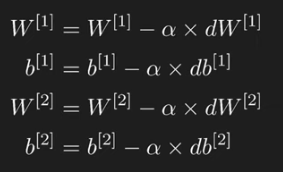

```python
def update(gradients, parametres, learning_rate):

    W1 = parametres['W1']
    b1 = parametres['b1']
    W2 = parametres['W2']
    b2 = parametres['b2']

    dW1 = gradients['dW1']
    db1 = gradients['db1']
    dW2 = gradients['dW2']
    db2 = gradients['db2']

    W1 = W1 - learning_rate * dW1
    b1 = b1 - learning_rate * db1
    W2 = W2 - learning_rate * dW2
    b2 = b2 - learning_rate * db2

```


Une fois qu'on a mis à jour nos paramètres, on les remet dans le dictionnaire et on retourne ce dictionnaire. 

```python
parametres = {
    'W1': W1,
    'b1': b1,
    'W2': W2,
    'b2': b2
}

return parametres
```

### 9.6 Fonction predict  ###

Pour finir, il ne reste plus qu'à modifier notre fonction de prédiction dans laquelle on fait passer donc nos paramètres, ce qui nous permet d'effectuer la **forward_propagation()** et cela nous retourne, d'après notre définition de tout à l'heure, un dictionnaire d'activation duquel on peut extraire l'activation final, donc $A2$ et on retourne tout simplement 1 lorsque $A2$ est supérieur à 0.5 et sinon on retourne 0 tout simplement. 

```python
def predict(X, parametres):
  activations = forward_propagation(X, parametres)
  A2 = activations['A2']
  return A2 >= 0.5
```

### 9.7 Fonction Finale  ###

Et voilà, avec ça nous avons désormais toutes les fonctions nécessaires pour entraîner un réseau de neurones à deux couches. 

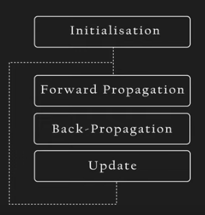

Maintenant il ne reste plus qu'à assembler toutes ses fonctions au sein de l'algorithme de la descente de gradient donc pour ça dans la cinquième leçon de cette série nous avions créé une fonction **artificial_neuron()**, qu'on va ici renommée en **neural_network()**. Dans cette fonction, on commence par initialiser nos paramètres mais attention cette fois ci, nous n'avons pas des paramètres $W$ et $b$, mais nous avons un dictionnaire de paramètres donc il va falloir corriger tout ça.  Puis nous avons **une boucle for** dans laquelle on va effectuer notre **forward_propagation()** et notre **back-propagation()**et notre **update()**. 

Pour effectuer notre initialisation, d'après la fonction qu'on a créé tout à l'heure, il nous faut trois valeurs $n0$, $n1$ et $n2$. 

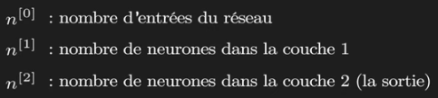

Alors, $n0$ c'est le nombre de variables que l'on a dans $X$ où $X_{train}$  étant donné que notre matrice va être transposée. 

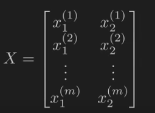

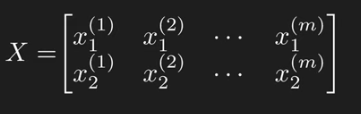

C'est ce qui était expliqué dans la septième leçon de cette série, on dit que $n0$ est égal à $X_{train}.shape[0]$ de la même manière $n2$ est égal à $y_{train}.shape[0]$ et pourrait $n1$, c'est simplement le nombre de neurones qu'on désire avoir dans notre première couche. Pour ça, on va créer une entrée $n1$ que vous pourrez choisir.

```python
def neural_network(X, y, n1=32, learning_rate = 0.1, n_iter = 1000):

    # initialisation parametres
    n0 = X.shape[0]
    n2 = y.shape[0]
    np.random.seed(0)
    parametres = initialisation(n0, n1, n2)
```

Donc avec ça, nous avons désormais un dictionnaire qui peut contenir nos différents paramètres. 

Maintenant, nous pouvons passer à notre descente de gradient. Donc pendant **n_itération**, on va d'abord faire notre **forward_propagation()**, dans laquelle on doit passer **X_train** ainsi que les différents paramètres du modèle et ceci nous **retourne des activations**. Ensuite, on effectue notre **back_propagation()** en faisant passer **X_train**, $y_train$ ainsi que le dictionnaire des activations et le dictionnaire des paramètres. Et cela nous retourne des gradients. Et pour finir c'est gradient on s'en sert pour mettre à jour notre modèle avec les gradients et les paramètres. 

```python
train_loss = []
train_acc = []
history = []

# gradient descent
for i in tqdm(range(n_iter)):
    activations = forward_propagation(X, parametres)
    A2 = activations['A2']

    # Plot courbe d'apprentissage
    train_loss.append(log_loss(y.flatten(), A2.flatten()))
    y_pred = predict(X, parametres)
    train_acc.append(accuracy_score(y.flatten(), y_pred.flatten()))
    
    history.append([parametres.copy(), train_loss, train_acc, i])

    # mise a jour
    gradients = back_propagation(X, y, parametres, activations)
    parametres = update(gradients, parametres, learning_rate)
```

Le reste c'est simplement de quoi visualiser nos courbes d'apprentissage. Donc tous les dix itération on va rajouter le **loss** dans une liste initialement vide. Donc le loss, on le calcul grâce à la fonction de $sklearn$ en comparant les données **y_train** avec nos activation. Donc pour ça, on va prendre $activations[A2]$,  donc les activations à la sortie de notre réseau et plus loin on calcule également l'exactitude, pour ça il nous faut faire des prédictions à partir du **X_train** et des paramètres en cours. Et de la même manière on peut utiliser la fonction de $sklearn$ sur y_train.

Alors il va juste falloir aplatir à nos deux tableaux (**flatten**) puisque ce sont des tableaux à deux dimensions et $sklearn$ ne va pas forcément apprécié ça donc on va forcer si vous voulez les tableaux à passer en une seule dimension puisque nos deux tableaux sont ici deux dimensions **(n2,1)**. 

```python
    if i%10 == 0:
	    #Train loss
        train_loss_.append(log_loss(y_train, activation['A2']))                        
        y_pred = predict(X_train, parameters)            
        #accuracy
        current_accuracy = accuracy_score(y_train.flatten(), y_pred.flatten())
        train_acc.append(current_accuracy)

plt.figure(figsize=(12, 4))
plt.subplot(1, 2, 1)
plt.plot(train_loss, label='train loss')
plt.legend()

plt.subplot(1, 2, 2)
plt.plot(train_acc, label='train acc')
plt.legend()
plt.show()

return parametres
```

Il ne reste plus qu'à afficher tout ça dans des graphiques et retourner si on le désire nos paramètres. 

### 9.8 Expérience sur Dataset  ###

Maintenant qu'on a créé notre réseau de neurones, il est temps qu'on s'amuse un Dataset $(X, y)$ de 100 échantillons et deux variables. On va voir ce que notre réseau de neurones est capable de faire sur ce Dataset. 

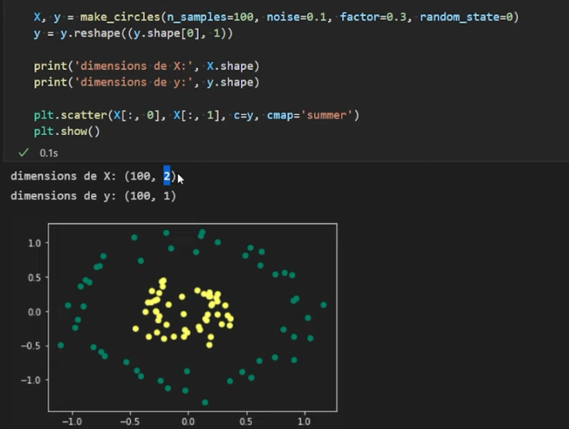

Mais avant ça voyons déjà ce qu'on est censé obtenir si on utilise notre modèle de neurones artificiels qu'on avait développé dans la cinquième leçon

Alors si on l'en traîne, on voit qu'on obtient de très mauvaises performances

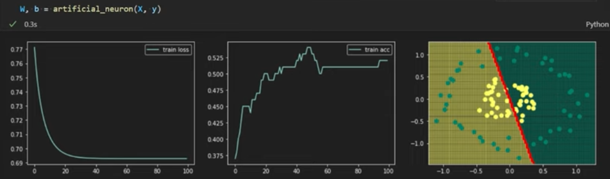

Car il s'agit d'un modèle linéaire qui n'est donc pas capable de séparer ces deux classes de points. Donc dans ce cas de figure, on va justement utiliser un réseau de neurones artificiels. 

Alors avant ça une chose très importante à faire c'est de transposer notre matrice $X$ et notre vecteur $y$. 

Donc pour ça 

```python
from sklearn.datasets import make_circles

X_train, y_train = make_circles(n_samples=100, noise=0.1, factor=0.3, random_state=0)

X_train = X_train.T
y_train_reshape = y_train.reshape((1, y_train.shape[0]))
```

Il va aussi falloir qu'on change le contenu de la fonction scatter et quand on vat exécuter ma cellule de code, cale va intervertir ces deux dimensions 

```python
print('dimensions de X:', X_train.shape)
print('dimensions de y:', y_train_reshape.shape)

plt.scatter(X_train_reshape[0, :], X_train_reshape[1, :], c=y_train_reshape, cmap='summer')
plt.show()
```

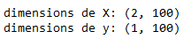

voilà donc on a désormais une matrice $X$ de dimensions (2,100) et un vecteur y de dimensions (1,100). 

**C'est très important et si jamais vous obtenez des problèmes en utilisant vos réseaux de neurones artificiels**, vérifiez les dimensions de vos matrix. **80% du temps les problèmes viennent des dimensions.** 

Donc voyant ce qu'un réseau de neurones est capable de faire sur ce Dataset. Pour commencer on va dire qu'on utilise deux neurones,  pour le nombre d'itérations on va garder quelque chose d'assez classique c'est à dire 1000 et de même pour le learning_rate quelque chose de basique à savoir 0,1.

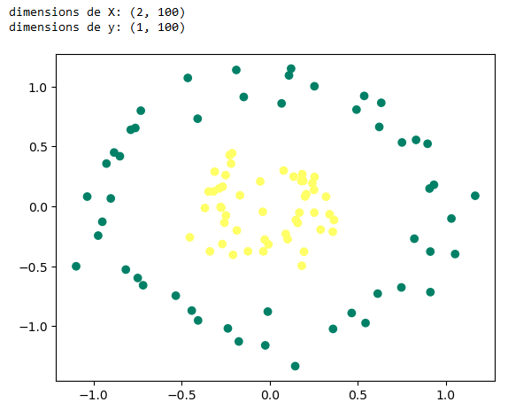

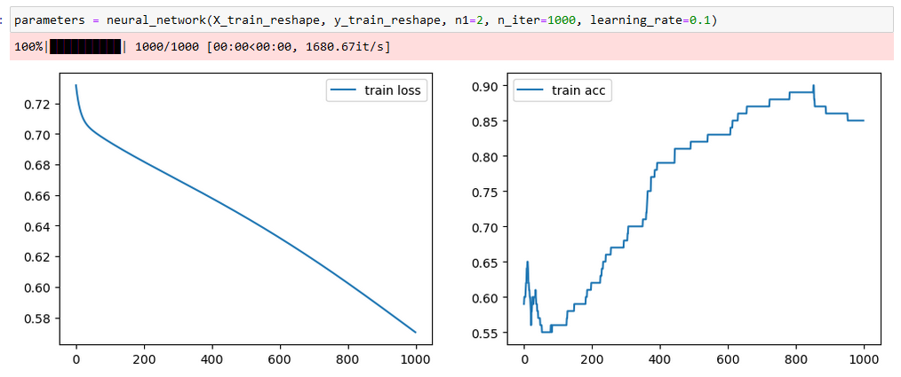

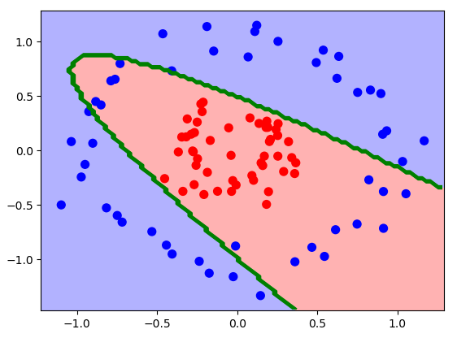

Comme on peut le voir sur ce graphique, on obtient déjà des résultats beaucoup plus intéressant. 

Alors on peut clairement voir que l'apprentissage n'a pas été terminé puisque la fonction coup ne se stabilise pas, ici on voit l'exactitude qui augmente mais qui peut toujours atteindre de meilleurs niveaux, elle est en progression, et on obtient des performances plutôt intéressante avec deux neurones. 

### 9.9 Benchmark sur le nombre de neurones ###

A présent, il serait intéressant de voir ce qu'on obtient lorsqu'on rajoute des neurones dans notre première couche par exemple si on prend trois neurones 4, 5 etc... Alors j'ai fait pour vous l'expérience avec une petite animation pour des valeurs de neurones égale à 2, 4, 8, 16, et 32 

Si j'ai choisi des puissances de 2, c'est tout simplement parce que c'est ce qu'ont choisi de faire en général lorsqu'on fait du Deep Learning, c'est pour des raisons d'optimisation de la mémoire de notre machine. 

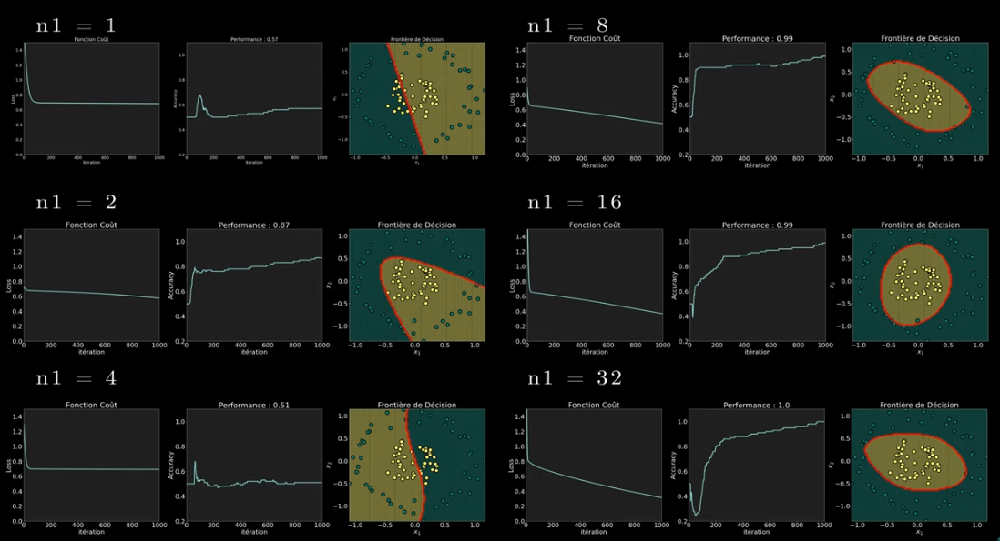

On peut voir que plus le nombre de neurones augmente meilleur et la performance de notre modèle attention toutefois plus vous augmentez ce nombre, plus la machine va mettre de temps à s'entraîner. 

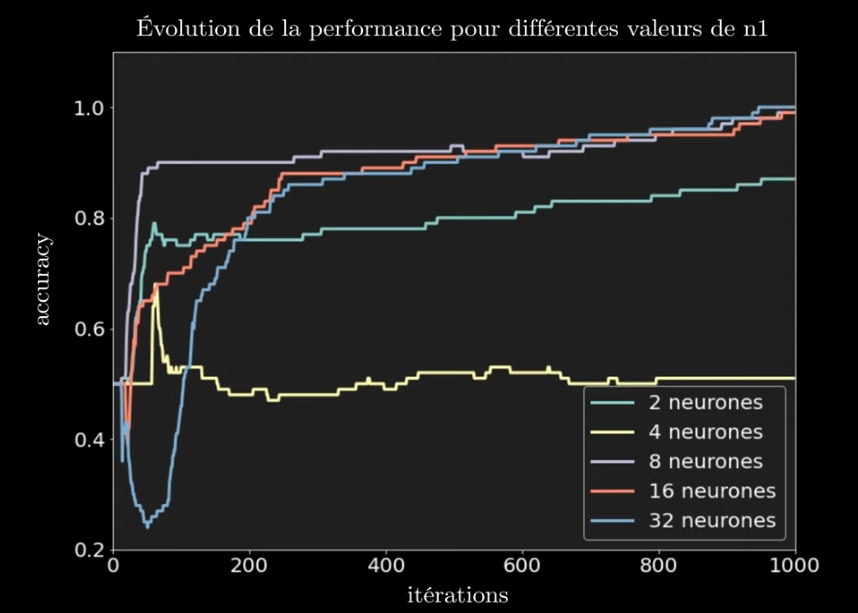

Donc, inutile d'essayer un réseau de neurones avec des milliards de neurones. En plus de ne pas tenir dans la mémoire de votre ordinateur, ça vous prendra une infinité de temps pour entraîner. 

### 9.10 Démonstration sur des photos de Chats ###

Alors une autre chose qu'on peut faire avec ce réseau de neurones, c'est de l'utiliser pour faire la distinction entre des photos de chats et de chiens.

Exactement comme ce qu'on avait cherché à faire dans la cinquième leçon. On n'avait pas vraiment eu de bons résultats car on avait simplement un modèle linéaire. 

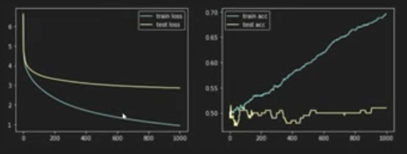

Mais cette fois ci eh bien on peut faire l'expérience en rechargeant nos données donc on a des photos de 64 pixels par 64 pixels et on en a 20000 dans le train_set et 200 dans le test_set. 

Alors, on redimentionne toutes nos photos de façon à ce qu'elle soit deux dimensions 4096 virgule 300 où 4096 est égal à 64 x 64 et 300 c'est juste pour prendre les 300 premières images du Dataset pour avoir quelque chose de plus petit juste pour commencer. 

Et si on balance tout ça dans le réseau de neurones et bien on voit que cette fois ci on obtient de bien meilleurs résultats 

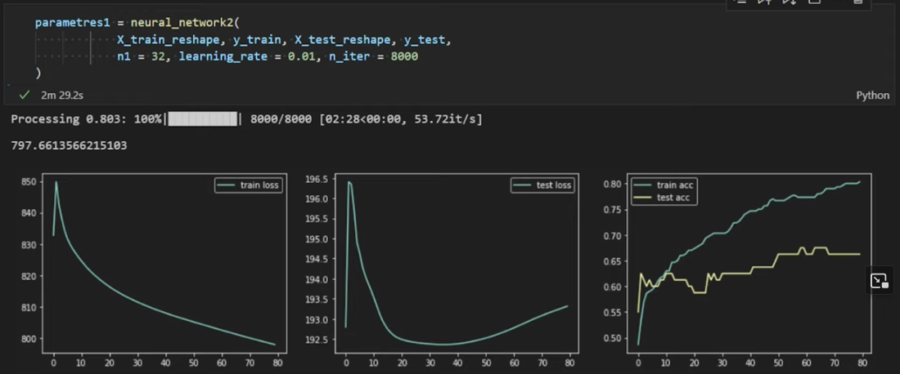

Donc notre fonction coûts diminuent sur le train_set et elle diminue également sur le test_set, mais attention, elle commence à remonter, signe que l'on a toujours de l'overfitting. est ici bas on voit que les performances 

 

ce qui n'est pas trop mal mais on pourrait encore améliorer largement tout cela en rajoutant d'autres neurones et surtout d'autres couches dans notre réseau de neurones.

## Leçon 10 : Réseau de neurones profond ##

### 10.1 Initialisation neurones profond ###

Pour développer un réseau de neurones profonds, avec autant de couches que l'on désire à l'intérieur, 

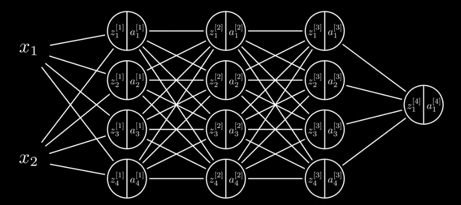

nous allons repartir des équations qui nous avait permis de créer un réseau de neurones à deux couches. 


On va essayer de comprendre comment on est passé de la première couche à la deuxième couche et à partir de là nous allons en tirer une règle générale qui nous permettent de passer de n'importe quelle couche $C$ à la couche suivante, c'est à dire $C + 1$ 

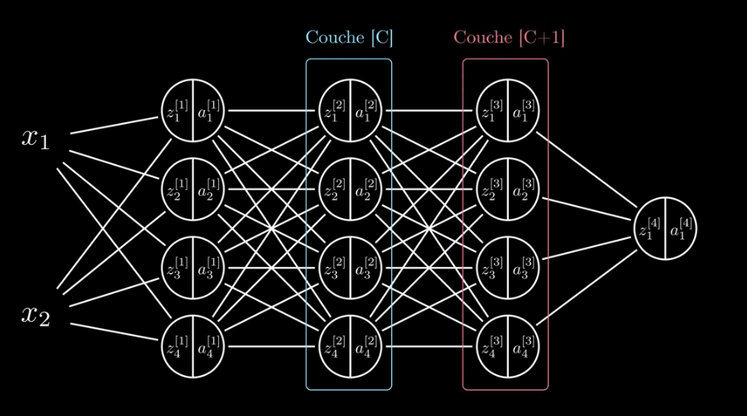

Donc, commençons par les paramètres du modèle. lorsqu'on avait un réseau de neurones à deux couches nous avions quatre paramètres $W^{[1]}$,$b^{[1]}$ et $W^{[2]}$, $b^{[2]}$. Alors si on se penche de plus près sur $W^{[1]}$, on voit qu'ils étaient de dimensions $(n^{[1]} \times n^{[0]})$. Quant à $W^{[2]}$, il était de dimensions $(n^{[2]} \times n^{[1]})$ 

A présent imaginez que l'on rajoute à tout ça une troisième couche et bien vous devinez l'idée $W^{[3]}$ sera de dimension $(n^{[3]} \times n^{[2]})$ et dans le cas où on aurait même une quatrième couche et bien $W^{[4]}$ serait de dimension $(n^{[4]} \times n^{[3]})$. Donc de par cette logique, on peut en déduire que n'importe quelle couche numéro $W^{[C]}$ est en fait de dimension $(n^{[C]} \times n^{[C-1]})$.

A présent, faisons la même chose pour le paramètre $b$, on voit que $b^{[1]}$ est de dimension $(n^{[1]} \times 1)$, $b^{[2]}$ est de dimensions $(n^{[2]} \times 1)$, donc on comprend l'idée $b^{[3]}$ sera de dimension $(n^{[3]} \times 1)$ et $b^{[4]}$ sera de dimensions $(n^{[4]} \times 1)$.

Donc cela, nous permet de compléter notre généralisation en disant que pour n'importe quelle couche numéro $C$, $b^{[C]}$ est en fait de dimension $(n^{[C]} \times 1)$. 

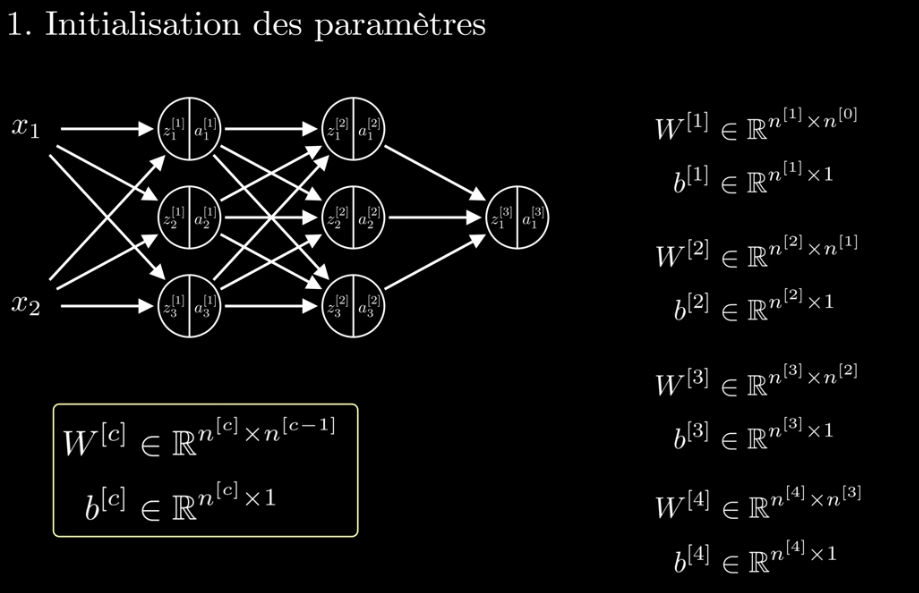

Et voilà avec ces deux formules vous êtes désormais capable d'initialiser les paramètres d'un réseau de neurones avec autant de couches que vous voulez à l'intérieur

Pour ça, il suffit de placer les dimensions $(n^{[0]}$, $n^{[1]}$, $n^{[2]}$, $n^{[3]}$, $...)$  au sein d'une liste, puis d'utiliser une boucle for afin de prendre chaque élément de cette liste pour initialiser les paramètres de chaque couche.

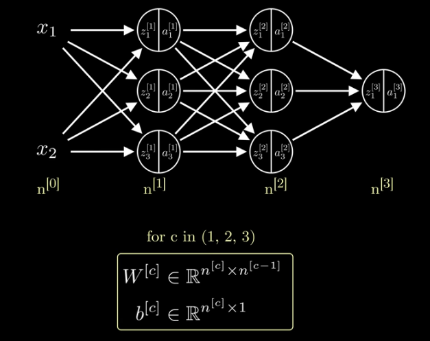  

Donc pour faire ça en python, nous allons repartir de la fonction d'initialisation qu'on avait écrit dans la dernière leçon. 

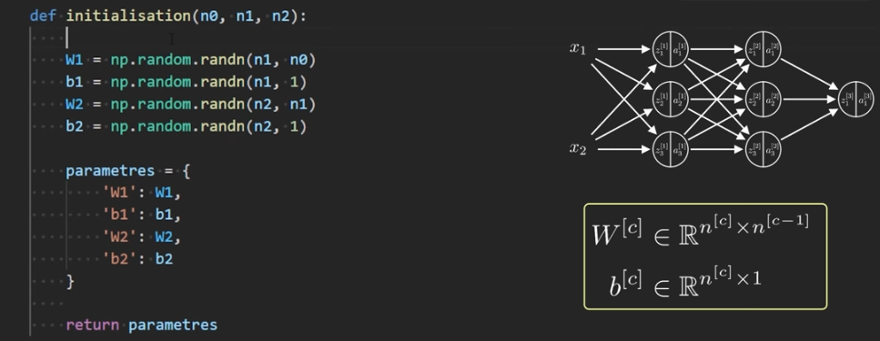


Dans cette fonction, nous allons faire passer cette liste de dimensions qui comprend donc  $(n^{[0]}$, $n^{[1]}$, $n^{[2]}$, $n^{[3]}$, $...)$ 

```python
def initialisation(dimensions):
```

Alors dans cette fonction on va donc écrire une boucle for allant de la première couche jusqu'à la toute dernière, la couche $C$ qui va donc être égal à la longueur de la liste de dimensions.  Et c'est dans cette boucle for qu'on va donc pouvoir créer $W^{[1]}$,  $b^{[1]}$, $W^{[2]}$, $b^{[2]}$ et d'une manière générale n'importe quelle valeur $W^{[C]}$ et $b^{[C]}$. 

Alors, pour ça on va partir d'un dictionnaire de paramètres initialement vide qu'on va placer à la tête de notre fonction. Et c'est dans la boucle for qu'on va rajouter à chaque itération une clé $W^{[C]}$ ou $C$ représente la couche en cours. Ainsi qu'une clé $b^{[C]}$. Et c'est comme ça qu'on aura les valeurs $W^{[1]}$,$b^{[1]}$, $W^{[2]}$, $b^{[2]}$, ... 

Donc, il ne reste plus qu'à dire à quoi sont égales ces différentes valeurs, donc on va avoir pour $W$, une matrice **random.randn** de dimensions $(C, C-1)$ et pour $b$, on va avoir un vecteur de dimension $(C, 1)$. 

```python
    parametres = {}
    C = len(dimensions)

    for c in range (1 , C):
        params['W' + str(c)] = np.random.randn(dimensions[c], dimensions[c-1])
        params['b' + str(c)] = np.random.randn(dimensions[c], 1)

    return parameters
```

Voilà, avec ça vous avez désormais votre fonction d'initialisation prêtes à l'emploi. 

On va tester en y faisant passer la liste suivante. 

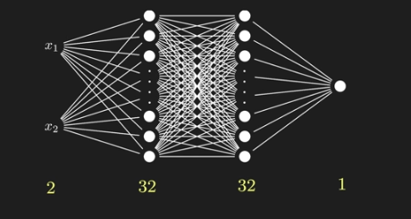	

Donc on a ici un réseau de neurones avec trois couches, puisque bien sûr l'entrée c'est pas vraiment considéré comme une couche qui est $n^{[0]}$ et on a bien $n^{[1]}$, $n^{[2]}$ et $n^{[3]}$ 

```
##### TEST
parametres = initialisation([X.shape[0], 32, 32, y.shape[0]])

for key,val in parameters.items():
    print(key, value.shape)
```

et en examinant le dictionnaire paramètres que l'on obtient en sortie,  on voit qu'on a 

```python
W1 (32, 2)
b1 (32, 1)
W2 (32, 32)
b2 (32, 1)
W3 (1, 32)
b3 (1, 1)
```

### 10.2 Forward propagation  ###

A présent, faisons le même exercice de généralisation pour les équations de la **forward_propagation()**. 

Lorsqu'on avait un réseau de neurones à deux couches, on avait 

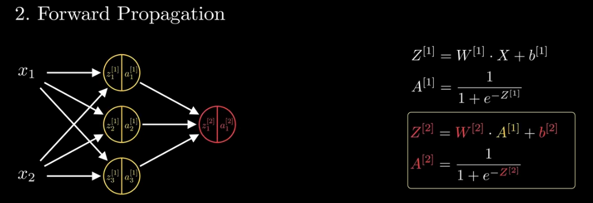

En fait, pour calculer les éléments de cette deuxième couche, on venait chercher les activations de la première couche. 

Donc vous imaginez l'idée, si nous rajoutons une troisième couche à ce réseau, pour calculer les éléments de cette troisième couche, nous allons devoir nous servir des activations de la deuxième couche et on aura donc 

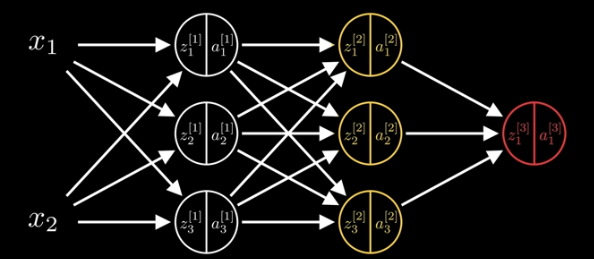

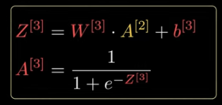

Donc on peut généraliser tout cela en écrivant que pour n'importe quelle couche $C$, cela nous permet de calculer $Z^{[2]}$, $Z^{[3]}$, $Z^{[4]}$, ...  	


mais pour $Z^{[1]}$, ça ne fonctionne pas tout à fait puisque d'après nos formules $Z^{[1]}=W^{[1]} \cdot X+b^{[1]}$ et non pas $Z^{[1]}=W^{[1]} \cdot A^{[0]} + b^{[1]}$. 

Cependant, il existe une petite astuce pour que notre formule fonctionne quand même pour $Z^{[1]}$, c'est de dire que $X=A^{[0]}$ et voilà avec ça nous avons de quoi calculer $Z^{[C]}$ pour n'importe quelle couche $C$. Et pour les activations $A^{[C]}$, c'est très simple on passe tout simplement $Z^{[C]}$ dans la fonction sigmoïde. 

Donc pour programmer tout, ça nous allons modifier la fonction de **forward_propagation()** qui nous avait servi pour un réseau de neurones à deux couches. 

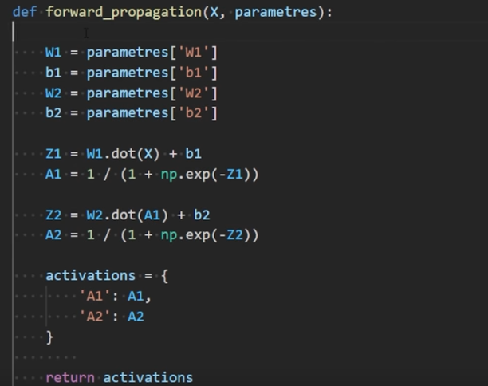

A l'époque, nous avions commencé par extraire les paramètres $W^{[1]}$, $b^{[1]}$, $W^{[2]}$, $b^{[2]}$, puis nous les avions utilisés pour calculer $Z^{[1]}$, $A^{[1]}$ et $Z^{[2]}$, $A^{[2]}$ et pour finir nous avions placé les activations dans un dictionnaire que nous avions retourné. 

Donc ce qu'on va faire à présent, c'est de placer tout ça dans une boucle for. Pour commencer, nous allons initialiser un dictionnaire d'activation en créant déjà une clé $A^{[0]}$ qui est associé à la matrice $X$. Ensuite, nous allons pouvoir initier notre boucle for en voulant partir de la première couche et en allant jusqu'à la toute dernière, ceci dans le but de calculer  $Z^{[1]}$, $A^{[1]}$ et $Z^{[2]}$, $A^{[2]}$, $Z^{[3]}$, $A^{[3]}$. 

Donc pour ça, nous allons écrire **for c in range (1, C + 1)**, si on écrit **C + 1**, c'est parce que dans python, quand on définit la fonction **range**, celle ci va s'arrêter juste un nombre avant le **C + 1**.

Alors, avant d'entrer dans cette boucle for, il va falloir définir $C$ et pour ça on va se servir du dictionnaire paramètres parce que dans ce dictionnaire paramètres on retrouve la longueur de notre réseau. En effet, si on a un réseau de deux couches alors on a quatre paramètres à l'intérieur $W^{[1]}$, $b^{[1]}$, $W^{[2]}$, $b^{[2]}$ si nous avons un réseau de neurones à trois couches alors on a six paramètres $W^{[1]}$, $b^{[1]}$, $W^{[2]}$, $b^{[2]}$,$W^{[3]}$, $b^{[3]}$ donc d'une manière générale on peut dire que la longueur du réseau français est égale à la longueur du dictionnaire paramètres divisé par deux. Et ici on fait une division entière afin de tomber sur un nombre entier. 

```python
def forward_propagation(X, parameters):
    activations = {'A0': X}
    C = len(parameters) // 2
```

Dans notre boucle for, on va écrire les deux formules qu'on a vu tout à l'heure. Mais pour l'activation, on va directement faire passer **'A'** dans notre dictionnaire d'activation.

```python
for c in range (1, C+1):
    Z = parameters['W' + str(c)].dot(activations['A' + str(c-1)]) + parameters['b' + str(c)]
    activations['A' + src(c)] = 1 / (1 + np.exp(-z))

return activations
```

avec ça on retourne un dictionnaire d'activation qui va comprendre toutes les activations de notre réseau de neurones. 

On va tester notre fonction en y faisant passer le dictionnaire de paramètres qu'on a généré tout à l'heure, ainsi qu'une matrice $X$ comprenant deux variables et 100 échantillons. 

```python
##### TEST
activations = forward_propagation (X, parameters)

for key,val in activations.items():
    print(key, val.shape) 
```

```python
A0 (2, 100)
A1 (32, 100)
A2 (32, 100)
A3 (1, 100)
```

### 10.3 Back Propagation ###

Lorsque nous avions un réseau de neurones à deux couches, 


nous avions les équations suivante pour commencer on calculait $dZ^{[2]}$ à la sortie du réseau de neurones puis $dW^{[2]}$ et $db^{[2]}$. Eensuite, pour passer de la deuxième couche à la première gauche, on a calculé $dZ^{[1]}$ suivi de $dW^{[1]}$ et $db^{[1]}$. 

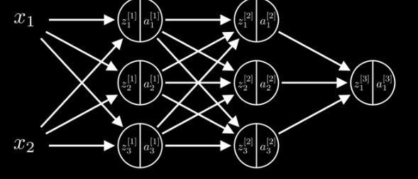

A présent, si on imagine faire la même chose pour un réseau de neurones à trois couches en sortie de notre réseau, on n'aura pas $dZ^{[2]}$ mais $dZ^{[3]}$ et celui ci sera égal à la sortie du réseau c'est-à-dire $AZ^{[3]} - y$ ensuite pour savoir à quoi sera égale $dW^{[3]}$ et $db^{[3]}$, on va tout simplement voir à quoi était égal $dW^{[2]}$ et $db^{[2]}$ dans notre réseau de neurones à deux couches. Et on va incrémenté de 1 toutes nos unités.

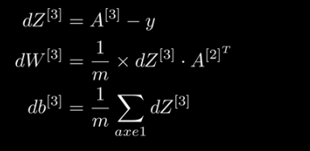

Ensuite une fois qu'on a calculé tous les gradients de la troisième couche, on va pouvoir passer à la deuxième couche et pour ça il va falloir commencer par calcul et $dZ^{[2]}$, alors comme tout à l'heure on peut faire le parallèle avec $dZ^{[1]}$ 

 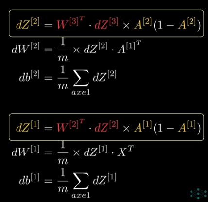

Donc pour généraliser, lorsqu'on veut effectuer une Back-Propagation, nous avons besoin des quatre équations suivante pour commencer l'équation du gradient de la couche finale 

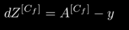

Ensuite pour toutes les couches de la dernière jusqu'à la toute première nous avons

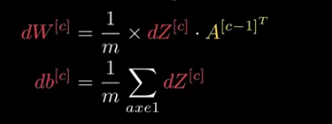

comme vous le voyez cela fonctionne pour toutes les couches, y compris la toute première car tout à l'heure nous avons posé que $X=A^{[0]}$. 

Pour finir notre Back-Propagation, il nous reste à connaître la formule nous permettant de passer d'une couche numéro $C$ à la couche $C-1$ et cette formule $dZ^{[1]}$ c'est 

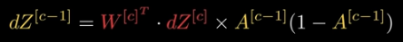

Encore une fois, vous voyez qu'elle fonctionne très bien ici pour $dZ^{[2]}$ et $dZ^{[1]}$. 

Donc pour résumé, lorsque l'on veut effectuer une Back-Propagation il faut écrire une boucle for allant de la dernière couche jusqu'à la toute première au sein de laquelle on calcule $dW^{[C]}$,  $db^{[C]}$ et $dZ^{[C - 1]}$  qui nous permet de passer de la couche $C$ à la couche $C-1$. 

Pour implémenter tout ça nous allons, utilisez une boucle for allant de la première couche jusqu'à la toute dernière. 

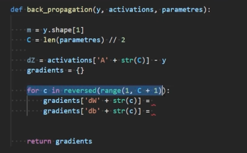

Mais cette boucle for, nous allons la renverser puisque ce qu'on veut faire c'est partir de la toute dernière couche $C$ est remonté jusqu'à la toute première couche.

Donc pour ça comme tout à l'heure, on définit la longueur du réseau de neurones. 

```python
def back_propagation(y, activations, parameters):
    
    m = y.shape[1]
    C = len(parameters) // 2
```

On pose déjà le tout premier $dZ$

```python
	dZ = activations['A' str(C)] - y #AC - y
```

puis on définit un dictionnaire de gradient initialement vide au sein duquel on va rajouter à chaque itération le gradient $dW^{[C]}$, $db^{[C]}$  

```python
	for c in reversed(range(1, C+1)):
		gradients['dW' + str(c)] = 1/m * np.dot(dZ, activations['A' + str(c - 1)].T)
	    gradients['db' + str(c)] = 1/m * np.sum(dZ, axis=1, keepdims=True)
```

mais à chaque itération on doit également mettre à jour la valeur de $dZ$, donc pour ça nous allons dire que

```python
        dZ = np.dot(parameters['W' + str(c)].T,dZ) * activations['A' + str(c - 1)] * (1 - activation['A' + strt(c - 1)])
```

voilà avec cette dernière ligne qui est très importante on peut passer d'une couche numéro $C$, à la couche précédente $C - 1$. Alors, si on veut être très rigoureux en réalité cette dernière ligne il faut l'utiliser uniquement lorsque $C$ est supérieur à 1 parce qu'en effet lorsque $C$ va être égal à 1, ça n'a pas de sens de calculer $dZ^{[0]}$ puisque ça n'existe tout simplement  Ca ne va pas retourner une erreur si vous le faites parce qu'en plus vous n'allez pas vous en servir dans la suite de vos calculs .

```
		if (c > 1):
			dZ = np.dot(parameters['W' + str(c)].T,dZ) * activations['A' + str(c - 1)] * (1 - activation['A' + strt(c - 1)])
    
    return params   
```

Vous avez désormais votre formule de Back-Propagation. 

Il ne reste plus qu'à la tester avec les activations et les paramètres qu'on a généré tout à l'heure. 

```python
##### TEST
gradients = back_propagation (y, activations, parameters)

for key,val in gradients.items():
    print(key, val.shape) 
```

```python
dW3 (1, 32)
db3 (1, 1)
dW2 (32, 32)
db2 (32, 1)
dW1 (32, 2)
db1 (32, 1)
```

### 10.4 Mise à jour des paramètres ###

Pour finir dans tout ça, il ne reste plus qu à généraliser les fonctions de la descente de gradient. On va définir une boucle for allant de la première couche jusqu'à la toute dernière. Et à chaque itération de cette boucle on va pouvoir mettre à jour les paramètres $W^{[C]}$ et $b^{[C]}$ de la manière suivante

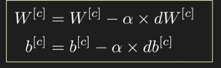

```python
def update(gradients, parametres, learning_rate):
    C=len(parametres) //2
    
    for c in range (1,C + 1) :
        parametres ['W' + str(c)]= parametres ['W' + str(c)] - learning_rate * gradients['dW' + str(c)]
        parametres ['b' + str(c)]= parametres ['b' + str(c)] - learning_rate * gradients['db' + str(c)]

    return parametres
```

### 10.5 Code final  ###

```python
def predict(X, parametres):
    activations = forward_propagation(X, parametres)
    C = len(parametres) // 2
    Af = activations['A' + str(C)]
    
    return Af >= 0.5
```

```python
def visualisation(X, y, params):
    fig, ax = plt.subplots()
    ax.scatter(X[0, :], X[1, :], c=y, cmap='bwr', s=50)
    
    x0_lim = ax.get_xlim()
    x1_lim = ax.get_ylim()
    
    resolution = 100
    x0 = np.linspace(x0_lim[0], x0_lim[1], resolution)
    x1 = np.linspace(x1_lim[0], x1_lim[1], resolution)
    
    #meshgrid
    X0, X1 = np.meshgrid(x0, x1)

    #assemblee (100, 100) => (1000, 2)
    XX = np.vstack((X0.ravel(), X1.ravel()))

    Z = predict(XX, params)
    Z = Z.reshape((resolution, resolution))

    ax.pcolormesh(X0, X1, Z, cmap='bwr', alpha=0.3, zorder=-1)
    ax.contour(X0, X1, Z, colors='green')
    
    plt.show()
```

Il ne reste plus qu'à les utiliser dans notre fonction finale celle de notre réseau de neurones. 

Donc pour commencer dans cette fonction, nous allons faire passer une liste de dimension pour notre réseau de neurones. 

Cette liste on va l'appeler **hidden_layers** ce qui signifie en anglais les couches cachée du réseau. 

```python
def neural_network (X, y, hidden_layers, learning_rate=0.1 , iter=1000):
```

Lorsqu'on va initialiser nos paramètres, on va donc rajouter au tout début de cette liste la dimension de la matrice $X$ et on va aussi rajouter à la toute fin de cette liste la dimension du vecteur $y$. Tout cela nous permet donc d'initialiser nos paramètres pour ensuite commencer notre apprentissage. 

```python
    np. random. seed(0)
    
    #initialisation , b    
    dimensions = list(hidden_layers)
    dimensions.insert(0, X.shape[0])
    dimensions.append(y.shape[0])

    parametres =  initialisation(dimensions)

    train_loss = []
    train_acc = []
```

Donc là, dans notre boucle for, qui va représenter la boucle de la descente de gradient, on va commencer par faire la Forward-Propagation, ce qui va nous donner des activation. Ensuite ces activations, on va les fournir dans l'algorithme de la Back-Propagation afin d'obtenir nos différents gradient. Et ces gradient, on va s'en servir pour mettre à jour nos paramètres. 

```python
    for i in tqdm(range(iter)):
        activations = forward_propagation(X , parametres)
        gradients = back_propagation(y, activations, parametres)
        parametres = update(gradients, parametres, learning_rate)
```

Ensuite, dans cette boucle for, on peut aussi rajouter un petit peu de code pour analyser les courbes d'apprentissage de notre réseau de neurones. 

Donc pour toutes les dix itérations, on va calculer quelle est le **log_loss** entre $y$ est les activations de la couche finale. Et par la même occasion, on peut aussi analyser l'exactitude donc l' **accuracy** entre les prédictions du réseau et les données $y$ associées. 

Une fois notre boucle for terminée, on rajoute un petit peu de code dans notre fonction pour visualiser nos différents graphiques. 

```python
        if i%10 == 0:
            C=len(parametres)
            train_loss.append(log_loss(y, activations ['A' + str(C)]))
            y_pred = predict(X, parametres)
            current_accuracy = accuracy_score(y.flatten() , y_pred.flatten())
            train_acc.append(current_accuracy)

    #Visualisation des résultats
    fig, ax = plt.subplots(nrows=1, ncols=1, figsize=(18, 4))
    ax[0].plot(train_loss, label='train loss')
    ax[0].legend ()

    ax[1].plot(train_acc, label='train acc')
    ax.legend()
    visualisation(X, y, parametres, ax)

    plt.show()
    
    return parametres
```

Avec trois couches caché à l'intérieur on obtient donc ce genre de résultat

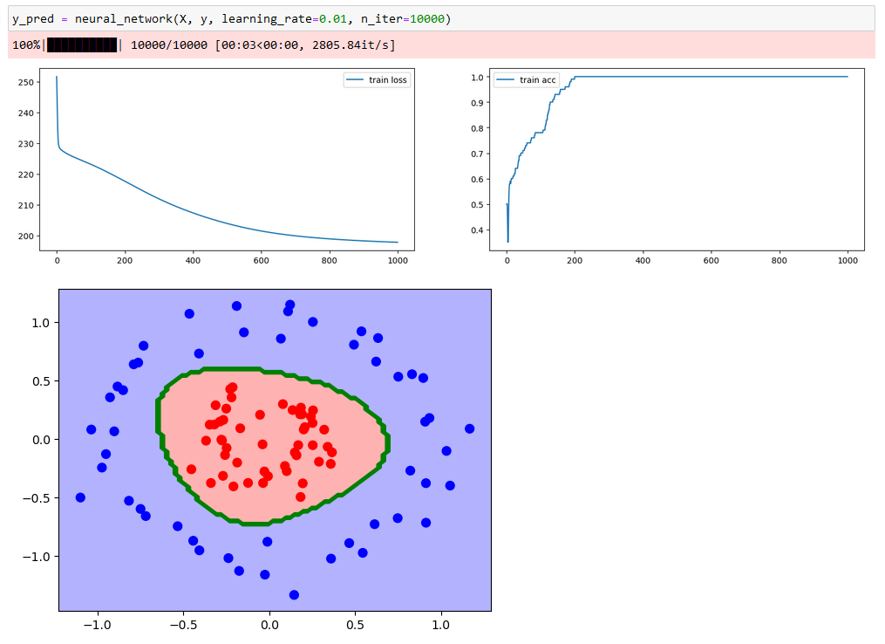

