# Introduction [[20]( https://searchworks.stanford.edu/view/13463251/)] #

La vision par ordinateur est la science qui permet de comprendre ou de manipuler des images et des vidéos. La vision par ordinateur a de nombreuses applications, notamment la conduite autonome, l'inspection industrielle et la réalité augmentée. 

L'utilisation de l'apprentissage profond pour la vision par ordinateur peut être classée en plusieurs catégories : la classification, la détection, la segmentation et la génération, à la fois dans les images et les vidéos. 

Vous apprendrez à former des modèles d'apprentissage profond pour les applications de vision par ordinateur et à les déployer sur plusieurs plateformes. Nous utiliserons TensorFlow, une bibliothèque python populaire pour l'apprentissage profond, tout au long de ce livre pour les exemples. Dans ce chapitre, nous aborderons les sujets suivants : 

- Les bases et le vocabulaire de l'apprentissage profond 
- Comment l'apprentissage profond rencontre la vision par ordinateur 
- Configurer l'environnement de développement qui sera utilisé pour les exemples couverts dans ce livre 
- Se familiariser avec TensorFlow, ainsi que ses puissants outils, tels que TensorBoard et TensorFlow Serving 
- Apprendre à utiliser TensorFlow pour la vision par ordinateur.

# 1. Bien commencer #

## 1.1 Comprendre l'apprentissage profond  ##

Le domaine de la vision par ordinateur a une longue histoire. Avec l'émergence de l'apprentissage profond, la vision par ordinateur s'est révélée utile pour diverses applications. L'apprentissage profond est un ensemble de techniques issues des réseaux neuronaux artificiels (RNA, **artificial neural network** (**ANN**)), une branche de l'apprentissage automatique. Les réseaux neuronaux artificiels s'inspirent du cerveau humain ; ils sont constitués de nœuds reliés les uns aux autres qui se transmettent des informations. Dans les sections suivantes, nous examinerons en détail le fonctionnement de l'apprentissage profond en comprenant les termes de base couramment utilisés.

### 1.1.1 Perceptron  ###

Un neurone artificiel ou perceptron prend plusieurs entrées et effectue une sommation pondérée pour produire une sortie. Le poids du perceptron est déterminé au cours du processus de formation et est basé sur les données de formation. Voici un schéma du perceptron :

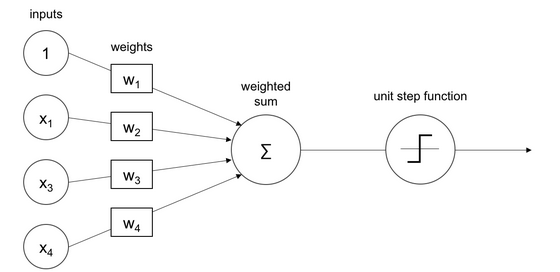


1. Les entrées sont pondérées et additionnées comme indiqué dans l'image précédente. 

2. La somme est ensuite transmise à une fonction de pas unitaire, dans ce cas, pour un problème de classification binaire. 

   Un perceptron ne peut apprendre que des fonctions simples en apprenant les poids à partir d'exemples. Le processus d'apprentissage des poids est appelé **formation**. L'apprentissage d'un perceptron peut se faire par des méthodes basées sur le gradient, qui sont expliquées dans une section ultérieure. 

3. La sortie du perceptron peut passer par une fonction d'activation ou une fonction de transfert, qui sera expliquée dans la section suivante.

### 1.1.2 Fonctions d'activation  ###

Les fonctions d'activation rendent les réseaux neuronaux non linéaires. 

Une fonction d'activation décide si un perceptron doit se déclencher ou non. 

Au cours de la formation à l'activation, les fonctions jouent un rôle important dans l'ajustement des gradients. Une fonction d'activation telle que la sigmoïde, illustrée dans la section suivante, atténue les valeurs les plus élevées. 

Ce comportement non linéaire de la fonction d'activation permet aux réseaux profonds d'apprendre des fonctions complexes. La plupart des fonctions d'activation sont des fonctions continues et différentielles, à l'exception de l'unité rectifiée à 0 . 

Une fonction continue présente de petites variations de la sortie pour chaque petite variation de l'entrée. Une fonction différentielle possède une dérivée en tout point du domaine. Pour entraîner un réseau neuronal, la fonction doit être différentiable. Voici quelques fonctions d'activation.

*Ne vous inquiétez pas si vous ne comprenez pas en détail les termes "continu" et "différentiable". Ils deviendront plus clairs au fil des chapitres.*

#### 1.1.2.1 Sigmoïde ####

La sigmoïde peut être considérée comme une fonction en escalier lissée et donc différentiable. La sigmoïde est utile pour convertir n'importe quelle valeur en probabilité et peut être utilisée pour la classification binaire. La sigmoïde convertit une entrée en une valeur comprise entre 0 et 1, comme le montre le graphique suivant :

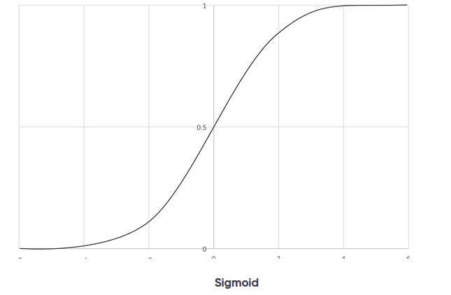

#### 1.1.2.2 La fonction tangente hyperbolique ####

La fonction tangente hyperbolique, ou tanh, est la version réduite de la sigmoïde. Comme la sigmoïde, elle est lisse et différentiable. La fonction tanh associe l'entrée à une valeur comprise entre -1 et 1 , comme le montre le graphique suivant :

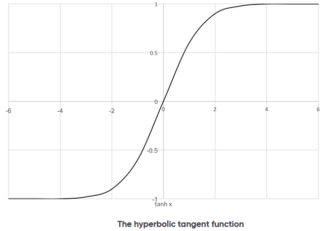

#### 1.1.2.3 L'unité linéaire rectifiée (ReLU)  ####

ReLu peut laisser passer de grands nombres. Cela rend quelques neurones périmés et ils ne se déclenchent pas. 

Cela permet d'augmenter la densité et donc d'obtenir de bons résultats. La ReLu fait correspondre l'entrée $x$ à $\max (0, x)$, c'est-à-dire qu'elle fait correspondre les entrées négatives à 0 , et les entrées positives sont émises sans aucun changement, comme le montre le graphique suivant :

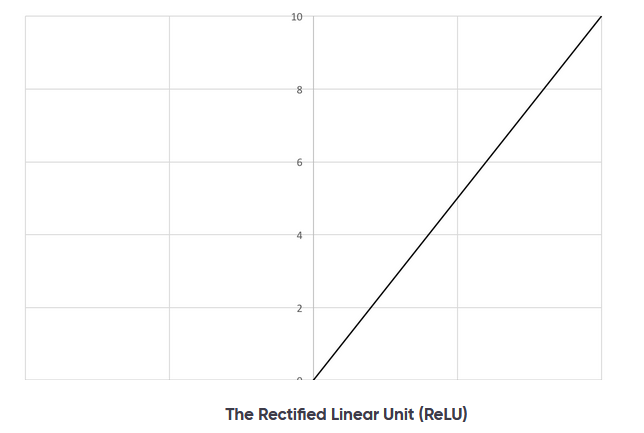

### 1.1.3 Réseau neuronal artificiel (RNA) ###

Le RNA est un ensemble de perceptrons et de fonctions d'activation. 

Les perceptrons sont connectés pour former des couches ou unités cachées. 

Les unités cachées forment la base non linéaire qui relie les couches d'entrée aux couches de sortie dans un espace de dimension inférieure, également appelé réseau neuronal artificiel. 

Le réseau neuronal artificiel est une carte allant de l'entrée à la sortie. La carte est calculée par l'addition pondérée des entrées avec des biais. Les valeurs des poids et des biais, ainsi que l'architecture, sont appelées **modèle**. 

Le processus de formation détermine les valeurs de ces poids et biais. Les valeurs du modèle sont initialisées avec des valeurs aléatoires au début de la formation. 

L'erreur est calculée à l'aide d'une fonction de perte en la comparant à la vérité réelle. Sur la base de la perte calculée, les poids sont ajustés à chaque étape. 

La formation est interrompue lorsque l'erreur ne peut plus être réduite. Le processus de formation apprend les caractéristiques au cours de la formation. Les caractéristiques constituent une meilleure représentation que les images brutes. Voici le schéma d'un réseau neuronal artificiel, ou perceptron multicouche :

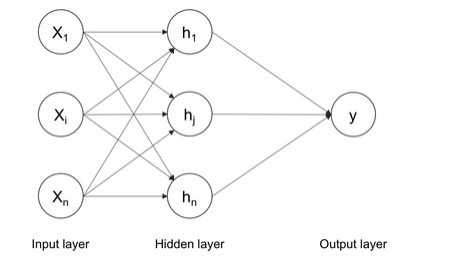

Plusieurs entrées de $x$ passent par une couche cachée de perceptrons et sont additionnées pour obtenir la sortie. 

Le théorème d'approximation universelle suggère qu'un tel réseau neuronal peut approximer n'importe quelle fonction. La couche cachée peut également être appelée **couche dense**. 

Chaque couche peut avoir l'une des fonctions d'activation décrites dans la section précédente. Le nombre de couches cachées et de perceptrons peut être choisi en fonction du problème. Quelques autres éléments permettent à ce perceptron multicouche de fonctionner pour les problèmes de classification multi-classes. Un problème de classification multi-classes tente de discriminer plus de dix catégories. Nous examinerons ces termes dans les sections suivantes.

#### 1.1.3.1 One-hot encoding (encodage à chaud) ####

**One-hot encoding** est un moyen de représenter les variables cibles ou les classes dans le cas d'un problème de classification. 

Les variables cibles peuvent être converties à partir des étiquettes de chaîne en vecteurs encodés à une vitesse. 

Un vecteur one-hot est rempli avec 1 à l'index de la classe cible et avec 0 partout ailleurs. Par exemple, si les classes cibles sont chat et chien, elles peuvent être représentées par $[1,0]$ et $[0,1]$, respectivement. Pour 1 000 classes, les vecteurs à un coup seront de la taille de 1 000 entiers avec tous les zéros sauf 1 . Il n'y a pas d'hypothèse sur la similarité des variables cibles. 

Grâce à la combinaison du One-hot encoding avec la softmax expliquée dans la section suivante, la classification multi-classes devient possible dans l'ANN.

#### 1.1.3.2 Softmax  ####

Softmax est un moyen de forcer les réseaux neuronaux à produire la somme de 1 . 

Ainsi, les valeurs de sortie de la fonction Softmax peuvent être considérées comme faisant partie d'une distribution de probabilités. Cette fonction est utile dans les problèmes de classification multi-classes. Softmax est une sorte de fonction d'activation dont la particularité est que la somme des sorties est égale à 1 . 

Elle convertit les sorties en probabilités en divisant la sortie par la somme de toutes les autres valeurs. La distance euclidienne peut être calculée entre les probabilités Softmax et le codage à une touche pour l'optimisation. Mais l'entropie croisée expliquée dans la section suivante est une meilleure fonction de coût à optimiser.

#### 1.1.3.3 Entropie croisée  ####

L'entropie croisée compare la distance entre les résultats du codage softmax et du codage one-hot. 

L'entropie croisée est une fonction de perte pour laquelle l'erreur doit être minimisée. 

Les réseaux neuronaux estiment la probabilité que les données données appartiennent à chaque classe. La probabilité doit être maximisée pour obtenir l'étiquette cible correcte. 

L'entropie croisée est la somme des probabilités logarithmiques négatives. La valeur logarithmique est utilisée pour la stabilité numérique. La maximisation d'une fonction est équivalente à la minimisation de la valeur négative de cette même fonction. Dans la section suivante, nous verrons les méthodes de régularisation suivantes pour éviter le surajustement de l'ANN : 

- Dropout

- Batch normalization

- L1 and L2 normalization


##### 1.1.3.3.1 Dropout  #####

Le dropout est un moyen efficace de régulariser les réseaux neuronaux afin d'éviter l'ajustement excessif de ces derniers. 

Au cours de la formation, la couche d'exclusion paralyse le réseau neuronal en supprimant les unités cachées de manière stochastique, comme le montre l'image suivante :

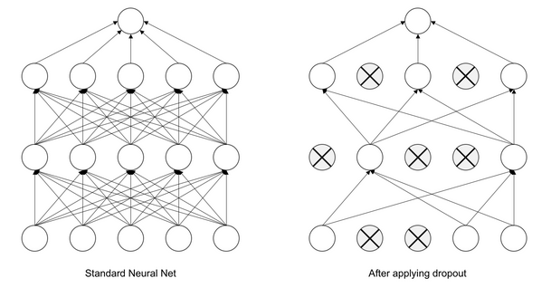

Notez que les neurones sont formés de manière aléatoire. Le Dropout est également un moyen efficace de combiner plusieurs réseaux neuronaux. Pour chaque cas de formation, nous sélectionnons au hasard quelques unités cachées, de manière à obtenir des architectures différentes pour chaque cas. Il s'agit d'un cas extrême de bagging et de model averaging. La couche d'exclusion ne doit pas être utilisée pendant l'inférence, car elle n'est pas nécessaire.

##### 1.1.3.3.2 Batch normalization (normalisation par lots) #####

La Batch normalization, ou batch-norm, augmente la stabilité et les performances de la formation des réseaux neuronaux. Elle normalise la sortie d'une couche avec une moyenne nulle et un écart type de 1 . Cela réduit le surajustement et accélère la formation du réseau. Elle est très utile pour la formation de réseaux neuronaux complexes.

##### 1.1.3.3.3 Régularisation L1 et L2  #####

L1 pénalise la valeur absolue du poids et tend à rendre les poids nuls. L2 pénalise la valeur quadratique du poids et tend à réduire le poids pendant l'apprentissage. 

Les deux régularisations supposent que les modèles avec des poids plus petits sont meilleurs.

### 1.1.4 Formation des réseaux neuronaux  ###

La formation d'un réseau neuronal est délicate car il contient plusieurs paramètres à optimiser. La procédure de mise à jour des poids est appelée rétropropagation. La procédure de minimisation de l'erreur est appelée optimisation. Nous aborderons ces deux procédures en détail dans les sections suivantes.

#### 1.1.4.1 Backpropagation ####

L'algorithme de Backpropagation est couramment utilisé pour la formation des réseaux neuronaux artificiels. Les poids sont mis à jour à partir de l'arrière en fonction de l'erreur calculée, comme le montre l'image suivante :

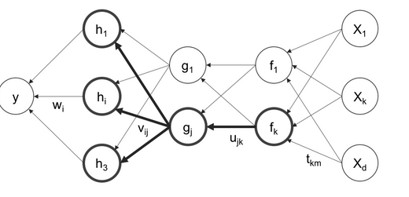

#### 1.1.4.2 Gradient descent ####

L'algorithme de descente de gradient effectue une optimisation multidimensionnelle. L'objectif est d'atteindre le maximum global. 

La descente de gradient est une technique d'optimisation populaire utilisée dans de nombreux modèles d'apprentissage automatique. Elle permet d'améliorer ou d'optimiser la prédiction du modèle. 

Une implémentation de la descente de gradient est appelée la descente de gradient stochastique (SGD) et devient de plus en plus populaire (expliqué dans la section suivante) dans les réseaux neuronaux. L'optimisation consiste à calculer la valeur de l'erreur et à modifier les poids pour obtenir cette erreur minimale. 

La direction de la recherche du minimum est le négatif du gradient de la fonction de perte. La procédure de Gradient descent est illustrée qualitativement dans la figure suivante :

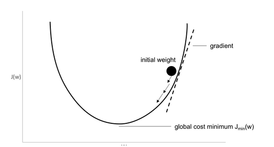

#### 1.1.4.3 La descente de gradient stochastique  ####

SGD est identique à la descente de gradient, sauf qu'elle n'est utilisée que pour des données partielles à entraîner à chaque fois. 

Le paramètre est appelé taille du mini-lot. En théorie, un seul exemple peut être utilisé pour la formation. Dans la pratique, il est préférable d'expérimenter avec différents nombres. Dans la section suivante, nous aborderons les réseaux neuronaux convolutifs qui fonctionnent mieux sur les données d'image que les réseaux neuronaux standard.

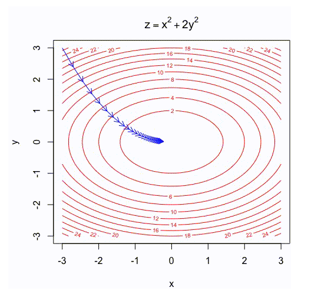

Visitez https://yihui.name/animation/example/grad-desc/ pour voir une excellente visualisation de la descente de gradient sur des surfaces convexes et non convexes.

### 1.1.5 Jouer avec TensorFlow ###

TensorFlow playground est une visualisation interactive des réseaux neuronaux. Visitez  http:///playground.tensorflow.org/, jouez en changeant les paramètres pour voir comment les termes mentionnés précédemment fonctionnent ensemble. Voici une capture d'écran du terrain de jeu :

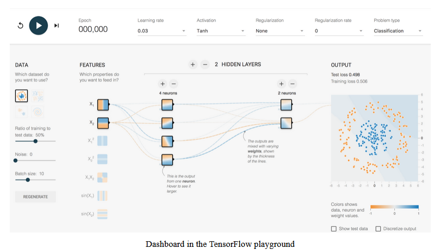

Comme indiqué précédemment, le lecteur peut modifier le taux d'apprentissage, l'activation, la régularisation, les unités cachées et les couches pour voir comment cela affecte le processus de formation. Vous pouvez passer un certain temps à ajuster les paramètres pour avoir l'intuition de la manière dont les réseaux neuronaux traitent différents types de données.

### 1.1.6 Convolutional neural network (réseau neuronal convolutif) ###

Les réseaux neuronaux convolutionnels (CNN) sont similaires aux réseaux neuronaux décrits dans les sections précédentes. 

Les réseaux neuronaux convolutifs ont des poids, des biais et des sorties par le biais d'une activation non linéaire. 

Les réseaux neuronaux ordinaires reçoivent des entrées et les neurones sont entièrement connectés aux couches suivantes. Les neurones d'une même couche ne partagent aucune connexion. Si nous utilisons des réseaux neuronaux ordinaires pour les images, leur taille sera très importante en raison du grand nombre de neurones, ce qui entraînera un surajustement. Nous ne pouvons pas utiliser ce type de réseau pour les images, car celles-ci sont de grande taille. 

Augmenter la taille du modèle nécessite un grand nombre de neurones. Une image peut être considérée comme un volume dont les dimensions sont la hauteur, la largeur et la profondeur. La profondeur est le canal d'une image, c'est-à-dire le rouge, le bleu et le vert. 

Les neurones d'un CNN sont disposés de manière volumétrique pour tirer parti du volume. Chacune des couches transforme le volume d'entrée en un volume de sortie, comme le montre l'image suivante :


Les filtres des réseaux neuronaux à convolution codent par transformation. Les filtres appris détectent des caractéristiques ou des motifs dans les images. Plus la couche est profonde, plus le motif est abstrait. Certaines analyses ont montré que ces couches sont capables de détecter les bords, les coins et les motifs. Les paramètres pouvant être appris dans les couches CNN sont inférieurs à ceux de la couche dense décrite dans la section précédente.

#### 1.1.6.1 Kernel (Noyeau) ####

Le Kernel est la couche de convolution des paramètres utilisée pour convoluer l'image. L'opération de convolution est illustrée dans la figure suivante :

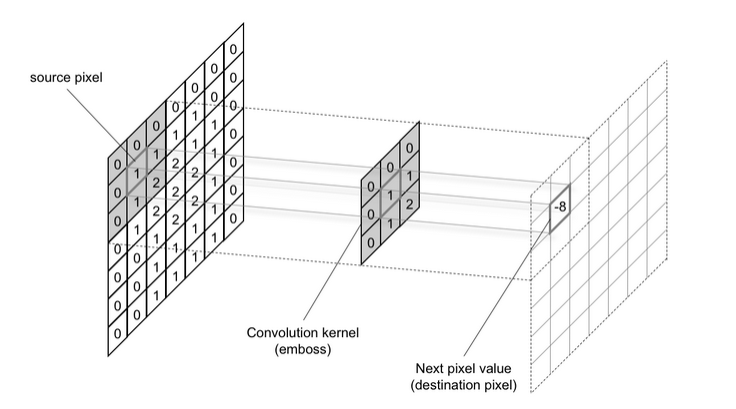

Le noyau a deux paramètres, appelés **stride** et **size**. La taille peut être n'importe quelle dimension d'un rectangle. La foulée est le nombre de pixels déplacés à chaque fois. Un déplacement de longueur 1 produit une image de taille presque identique, et un déplacement de longueur 2 produit une image de taille moitié moindre. Le remplissage de l'image permet d'obtenir une taille identique à celle de l'entrée.

#### 1.1.6.2 Max pooling  ####

Les couches de pooling sont placées entre les couches de convolution. Les couches de mise en commun réduisent la taille de l'image d'une couche à l'autre par échantillonnage. 

L'échantillonnage se fait en sélectionnant la valeur maximale dans une fenêtre. Le pooling moyen fait la moyenne sur la fenêtre. La mise en commun agit également comme une technique de régularisation pour éviter l'ajustement excessif. La mise en commun est effectuée sur tous les canaux de caractéristiques. La taille de la fenêtre est une mesure du champ réceptif du CNN. La figure suivante montre un exemple de mise en commun maximale :

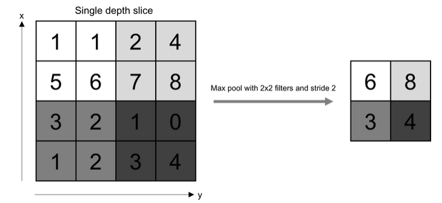

Le CNN est le composant le plus important de tout modèle d'apprentissage profond pour la vision par ordinateur. 

Il n'est pas exagéré d'affirmer qu'il sera impossible pour un ordinateur d'avoir une vision sans un CNN. Dans les sections suivantes, nous discuterons de quelques couches avancées qui peuvent être utilisées pour quelques applications.

Visitez le site https://www.youtube.com/watch?v=jajkssuQW4mc pour une excellente visualisation d'un CNN et d'une opération de mise en commun maximale.

### 1.1.7 Réseaux neuronaux récurrents (RNN)  ###

Les réseaux neuronaux récurrents (RNN) peuvent modéliser des informations séquentielles. Ils ne supposent pas que les points de données sont intensifs. Ils effectuent la même tâche à partir de la sortie des données précédentes d'une série de données séquentielles. Cela peut également être considéré comme de la mémoire. Les RNN ne peuvent pas se souvenir de séquences plus longues ou du temps. Il se déploie au cours du processus de formation, comme le montre l'image suivante :

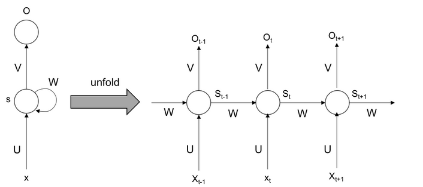

Comme le montre la figure précédente, l'étape est dépliée et entraînée à chaque fois. Au cours de la rétropropagation, les gradients peuvent disparaître avec le temps. Pour surmonter ce problème, la mémoire à long terme peut être utilisée pour se souvenir sur une période plus longue.

### 1.1.8 Long short-term memory (LSTM) (Mémoire à long terme) ###

La mémoire à long terme (LSTM) peut stocker des informations pendant des périodes plus longues et permet donc d'obtenir des résultats à long terme. La figure suivante illustre la conception d'une cellule LSTM :

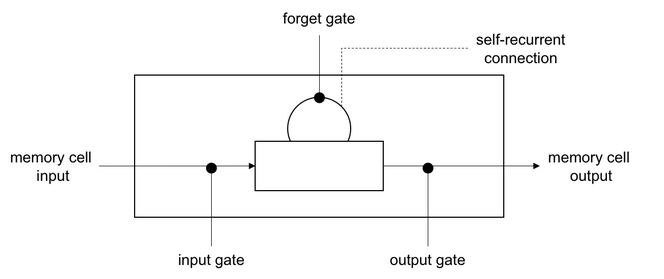

La LSTM comporte plusieurs portes : oubli, entrée et sortie. 

1. La porte d'oubli conserve l'information sur l'état précédent. 
2. La porte d'entrée met à jour l'état actuel à l'aide de l'entrée. 
3. La porte de sortie décide de l'information à transmettre à l'état suivant. 

La capacité d'oublier et de ne retenir que les éléments importants permet à la LSTM de se souvenir sur une plus longue période. Vous avez appris le vocabulaire de l'apprentissage profond qui sera utilisé tout au long du livre. Dans la section suivante, nous verrons comment l'apprentissage profond peut être utilisé dans le contexte de la vision par ordinateur.

## 1.2 Apprentissage en profondeur pour la vision par ordinateur ##

La vision par ordinateur permet d'exploiter les propriétés de la vision humaine sur un ordinateur. Un ordinateur peut prendre la forme d'un smartphone, d'un drone, d'un système de vidéosurveillance, d'un scanner IRM, etc. Le capteur produit des images sous forme numérique qui doivent être interprétées par l'ordinateur. L'élément de base de cette interprétation ou intelligence est expliqué dans la section suivante. Les différents problèmes qui se posent dans le domaine de la vision par ordinateur peuvent être résolus efficacement à l'aide de techniques d'apprentissage profond.

### 1.2.1 Classification  ###

La classification d'images consiste à associer en toute confiance un objet ou un concept à l'ensemble de l'image. Les applications comprennent la classification des sexes à partir d'une image du visage d'une personne, l'identification du type d'animal de compagnie, l'étiquetage des photos, etc. Voici le résultat d'une telle tâche de classification :

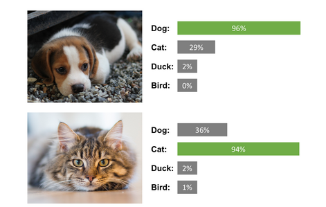

### 1.2.2 Détection ou localisation et segmentation  ###

La détection ou la localisation est une tâche qui consiste à trouver un objet dans une image et à le localiser à l'aide d'une boîte englobante. 

Cette tâche a de nombreuses applications, telles que la recherche de piétons et de panneaux de signalisation pour les véhicules autopilotés. L'image suivante illustre la détection :

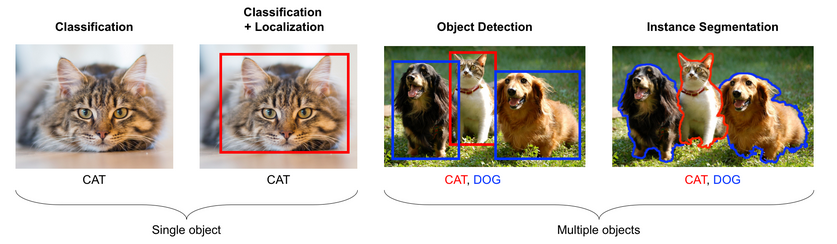

La segmentation consiste à effectuer une classification par pixel. Elle permet de séparer finement les objets. Elle est utile pour le traitement des images médicales et des images satellite. 

### 1.2.3 Similarity learning(Apprentissage par similarité) ###

L'apprentissage par similarité est le processus d'apprentissage des similitudes entre deux images. Un score peut être calculé entre deux images sur la base de leur signification sémantique, comme le montre l'image suivante :

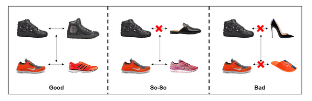

Il existe plusieurs applications de cette méthode, de la recherche de produits similaires à l'identification faciale. 

### 1.2.4 Image captioning(Légende de l'image)  ###

La légende de l'image consiste à décrire l'image avec du texte, comme illustré [ci-dessous] :

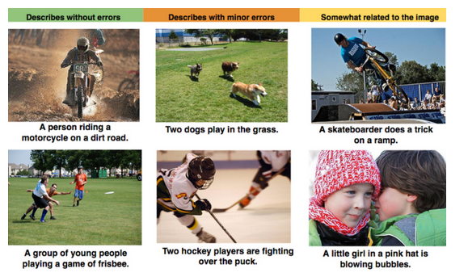

Il s'agit d'un cas unique où les techniques de traitement du langage naturel (NLP) et de vision par ordinateur doivent être combinées.

### 1.2.5 Generative models (Modèles génératifs)  ###

Les modèles génératifs sont très intéressants car ils génèrent des images. Voici un exemple d'application de transfert de style où une image est générée avec le contenu de cette image et le style d'autres images :

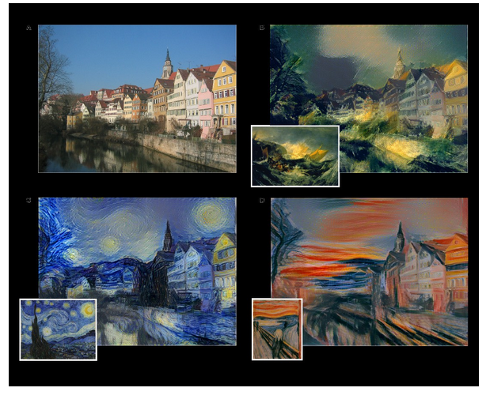

Les images peuvent être générées à d'autres fins, comme de nouveaux exemples d'apprentissage, des images de super-résolution, etc. 

### 1.2.6 Video analysis ###

L'analyse vidéo traite une vidéo dans son ensemble, par opposition aux images comme dans les cas précédents. Elle a plusieurs applications, telles que le suivi sportif, la détection d'intrusion et les caméras de surveillance. La nouvelle dimension des données temporelles donne lieu à de nombreuses applications intéressantes. Dans la section suivante, nous verrons comment configurer l'environnement de développement.

## 1.3. Configuration de l'environnement de développement  ##

Dans cette section, nous allons configurer l'environnement de programmation qui sera utile pour suivre les exemples dans le reste du livre. Les lecteurs peuvent avoir le choix entre les systèmes d'exploitation suivants : 

- Systèmes d'exploitation de développement (OS) tels que Mac, Ubuntu ou Windows 
- Systèmes d'exploitation de déploiement tels que Mac, Windows, Android, iOs ou Ubuntu installés sur une plateforme Cloud telle que Amazon Web Services (AWS), Google Cloud Platform (GCP), Azure, Tegra, Raspberry Pi 

Indépendamment des plateformes, tout le code développé dans ce livre devrait s'exécuter sans problème. Dans ce chapitre, nous allons couvrir les procédures d'installation de l'environnement de développement.

### 1.3.1 Matériel et systèmes d'exploitation - OS  ###

Pour l'environnement de développement, vous devez disposer d'une grande puissance de calcul, car la formation est très coûteuse sur le plan informatique. Les utilisateurs de Mac sont plutôt limités en termes de puissance de calcul. Les utilisateurs de Windows et d'Ubuntu peuvent améliorer leur environnement de développement avec davantage de processeurs et de GP-GPU (General Purpose - Graphics Processing Unit), ce qui sera expliqué dans la section suivante.

#### 1.3.1.1 General Purpose - Graphics Processing Unit (GP-GPU)  ####

Les GP-GPU sont des matériels spéciaux qui accélèrent le processus de formation des modèles d'apprentissage profond. Les GP-GPU fournis par la société NVIDIA sont très populaires pour la formation et le déploiement de l'apprentissage profond, car ils disposent d'un logiciel bien développé et du soutien de la communauté. 

Les lecteurs peuvent configurer une machine avec un tel GP-GPU pour une formation plus rapide. Il y a beaucoup de choix disponibles, et le lecteur peut en choisir un en fonction de son budget. Il est également important de choisir la RAM, le CPU et le disque dur correspondant à la puissance du GP-GPU. 

Après l'installation du matériel, les pilotes et bibliothèques suivants doivent être installés. Les lecteurs qui utilisent Mac ou Windows/Ubuntu sans GP-GPU peuvent sauter l'installation. 

Les bibliothèques suivantes sont nécessaires pour configurer l'environnement : 

- Computer Unified Device Architecture (CUDA) 
- CUDA Deep Neural Network (CUDNN)

#### 1.3.1.2 Computer Unified Device Architecture CUDA  ####

CUDA est la couche API fournie par NVIDIA, qui utilise la nature parallèle du GPU. Lorsque cette couche est installée, les pilotes pour le matériel sont également installés. 

Tout d'abord, téléchargez la bibliothèque cuDA à partir du portail NVIDIA : https://developer.nvidia.com/cuda-downloads.

Suivez les instructions de la page, téléchargez le pilote et suivez les instructions d'installation. Voici une capture d'écran d'Ubuntu CUDA et les instructions d'installation :

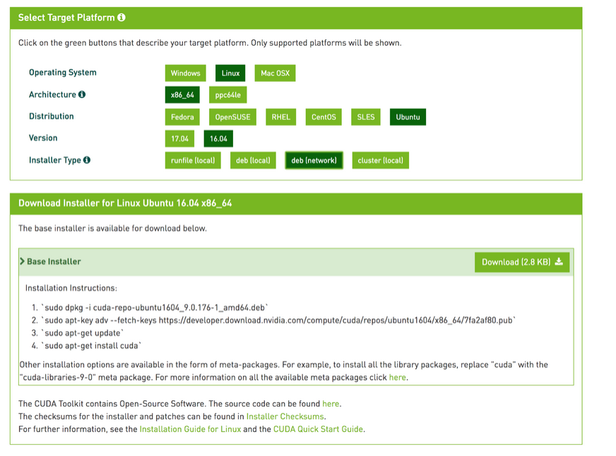

Ces commandes auraient installé les pilotes cuda et les autres API CUDA nécessaires.

Vous pouvez vérifier si les pilotes sont correctement installés en tapant **!nvidia-smi** dans l'invite de commande.

#### 1.3.1.4 Réseau neuronal profond CUDA - CUDNN  ####

La bibliothèque cuDNn fournit des primitives pour les algorithmes d'apprentissage profond. Comme ce paquetage est fourni par NVIDIA, il est hautement optimisé pour leur matériel et s'exécute plus rapidement. 

Plusieurs routines standard pour l'apprentissage profond sont fournies dans ce paquet. Ces paquets sont utilisés par de célèbres bibliothèques d'apprentissage profond telles que tensorflow, caffe, etc. 

Dans la section suivante, des instructions sont fournies pour l'installation de cuDNn. Vous pouvez télécharger cuDnn depuis le portail NVIDIA à l'adresse https://developer.nvidia.com/rdp/cudnn-download. Un compte utilisateur est nécessaire (inscription gratuite). Copiez les fichiers pertinents dans les dossiers cuDA, afin de les rendre plus rapides à exécuter sur les GPU. 

Nous n'utiliserons pas directement les bibliothèques CUDA et cuDnn. Tensorflow les utilise pour travailler sur GPGPU avec des routines optimisées.

### 1.3.2 Installation des logiciels (Environnement Anaconda sous Windows) ###

Plusieurs bibliothèques sont nécessaires pour former des modèles d'apprentissage profond. Nous installerons les bibliothèques suivantes et nous verrons pourquoi nous les avons choisies plutôt que d'autres : 

- Python et autres dépendances 
- OpenCV 
- TensorFlow 
- Keras

#### 1.3.2.1. Python ####

Python est le choix de facto pour toute application de science des données. Il dispose de la plus grande communauté et de l'écosystème de bibliothèques le plus performant. 

L'API TensorFlow pour Python est la plus complète et, par conséquent, Python est le langage naturel de choix. 

Allez sur https://www.python.org/ downloads/ et téléchargez la version 3 en fonction de votre système d'exploitation. 

Installez Python en suivant les étapes indiquées dans le lien de téléchargement. 

Après avoir installé Python, il faut installer pip3 pour faciliter l'installation des paquets Python. 

Installez ensuite les différents paquets Python en entrant la commande suivante, afin de pouvoir installer opencv et tensorflow plus tard :

```python
pip3 install numpy scipy scikit-learn pillow h5py
```

La description des paquets installés précédemment est la suivante :
- numpy est un paquetage de calcul numérique hautement optimisé. Il dispose d'un puissant package dimensionnel d'objet tableau, et les opérations matricielles de la bibliothèque numpy sont hautement optimisées pour la vitesse. Une image peut être stockée sous la forme d'un objet numpy tridimensionnel.
- scipy possède plusieurs routines pour les calculs scientifiques et techniques. Nous utiliserons certains packages d'optimisation plus tard dans le livre.
- scikit-learn est une bibliothèque d'apprentissage automatique dont nous utiliserons de nombreuses fonctions d'aide.
- Ppillow est utile pour le chargement d'images et les opérations de base.
- Le paquet H5py est une interface Pythonique pour le format de données binaires HDF5. C'est le format de stockage des modèles formés avec Keras.

#### 1.3.2.2 Vision par ordinateur ouverte - OpenCV ####

OpenCV est une célèbre bibliothèque de vision par ordinateur. Cette bibliothèque contient plusieurs routines de traitement d'images qui peuvent s'avérer très utiles. Voici la procédure d'installation d'OpencV sous Ubuntu.

```
conda install -c conda-forge opencv
```

```
pip install opencv-python
```

Des étapes similaires peuvent être trouvées pour d'autres systèmes d'exploitation à l'adresse https://opencv.org/. 

OpencV est multiplateforme et optimisé pour les applications gourmandes en ressources processeur. Il dispose d'interfaces pour plusieurs langages de programmation et est supporté par Windows, Ubuntu et Mac.

#### 1.3.2.3 La bibliothèque TensorFlow ####

La bibliothèque TensorFlow est une bibliothèque open source pour le développement et le déploiement de modèles d'apprentissage profond. 

TensorFlow utilise des graphes de calcul pour le flux de données et les calculs numériques. En d'autres termes, les données, ou tenseur, circulent à travers le graphe, d'où le nom tensorflow. 

Le graphe comporte des nœuds qui permettent tout calcul numérique et conviennent donc aux opérations d'apprentissage en profondeur. Il fournit une API unique pour tous les types de plateformes et de matériel. TensorFlow gère toute la complexité de la mise à l'échelle et de l'optimisation en arrière-plan. Elle a été développée à l'origine pour la recherche chez Google. 

Il s'agit de la bibliothèque d'apprentissage profond la plus connue, avec une grande communauté et des outils pour la visualisation et le déploiement en production.

#### 1.3.2.4 TensorBoard ####

TensorBoard est une suite d'outils de visualisation pour l'entraînement de modèles basés sur l'apprentissage profond avec TensorFlow. Les données suivantes peuvent être visualisées dans TensorBoard :
- Graphiques : Graphiques de calcul, placements de périphériques et détails des tenseurs.
- Scalaires : Métriques telles que la perte, la précision sur les itérations.
- Images : Utilisées pour voir les images avec les étiquettes correspondantes
- Audio : Permet d'écouter le son de l'entraînement ou un son généré.
- Distribution : Permet de visualiser la distribution d'un scalaire
- Histogrammes : Comprend l'histogramme des poids et des biais
- Projecteur : Aide à visualiser les données dans un espace tridimensionnel
- Texte : Imprime les données textuelles d'entraînement
- Profil : Affiche les ressources matérielles utilisées pour la formation

Le navigateur devrait afficher quelque chose comme ceci :

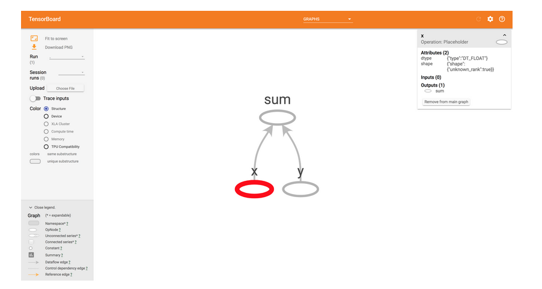

Le graphique de l'addition est affiché avec les noms donnés pour les espaces réservés.

Lorsque nous cliquons dessus, nous pouvons voir toutes les particularités du tenseur pour cette opération sur le côté droit. Familiarisez-vous avec les onglets et les options. Cette fenêtre comporte plusieurs parties. Nous les découvrirons dans différents chapitres.
TensorBoard est l'un des meilleurs outils de distinction de TensorFlow, ce qui le rend meilleur que n'importe quel autre framework d'apprentissage profond.

#### 1.3.2.5 L'outil TensorFlow Serving ####

TensorFlow Serving est un outil de TensorFlow développé pour les environnements de déploiement qui sont flexibles, fournissant des environnements de latence et de débit élevés. Tout modèle d'apprentissage profond formé avec TensorFlow peut être déployé avec serving. Installez Serving en exécutant la commande suivante :

```
install tensorflow-model-server
```

Notez que le serveur n'est facile à installer que sous Ubuntu ; pour les autres systèmes d'exploitation, veuillez vous référer à https://www.tensorflow.org/serving/setup. La figure suivante illustre l'interaction entre TensorFlow Serving et TensorFlow dans les environnements de production :

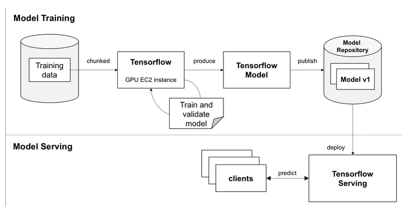

#### 1.3.2.6 La bibliothèque Keras ####

Keras est une bibliothèque open source pour l'apprentissage profond écrite en Python. 

Elle fournit une interface facile pour utiliser TensorFlow comme backend. Keras peut également être utilisée avec Theano, deep learning 4j, ou CNTK comme backend. 

Keras est conçu pour une expérimentation facile et rapide en mettant l'accent sur la convivialité, la modularité et l'extensibilité. 

Il s'agit d'un framework autonome qui fonctionne de manière transparente entre le CPU et le GPU. Keras peut être installé séparément ou utilisé dans TensorFlow lui-même à l'aide de l'API tf.keras. 

Dans ce livre, nous utiliserons l'API tf.keras. Nous avons vu les étapes d'installation des bibliothèques requises pour l'environnement de développement. L'installation et le bon fonctionnement de CUDA, CUDNN, OpenCV, TensorFlow et Keras sont essentiels pour les chapitres suivants.

# 2. Classification des images #

La classification d'images consiste à classer une image entière sous une seule étiquette. Par exemple, une tâche de classification d'images pourrait étiqueter une image comme un chien ou un chat, étant donné qu'une image est soit un chien, soit un chat. 

Dans ce chapitre, nous verrons comment utiliser TensorFlow pour construire un tel modèle de classification d'images et nous apprendrons également les techniques pour améliorer la précision.
Nous aborderons les sujets suivants dans ce chapitre :

- Entraînement du modèle MNIST dans TensorFlow
- Entraînement du modèle MNIST avec Keras
- Autres ensembles de données de test d'images populaires
- Les plus grands modèles d'apprentissage profond
- Entraînement d'un modèle pour les chats par rapport aux chiens
- Développement d'applications réelles

## 2.1 Entraînement du modèle MNIST dans TensorFlow  ##

Dans cette section, nous allons nous familiariser avec les données de la base Modified National Institute of Standards and Technology (MNIST) et construire un modèle de classification simple. L'objectif de cette section est d'apprendre le cadre général de l'apprentissage profond et d'utiliser TensorFlow à cette fin. 

Tout d'abord, nous construirons un modèle de perceptron ou de régression logistique. Ensuite, nous formerons un CNN pour obtenir une meilleure précision. Nous verrons également comment TensorBoard aide à visualiser le processus de formation et à comprendre les paramètres.

### 2.1.1 Les ensembles de données MNIST  ###

Les données MNIST contiennent des chiffres manuscrits de 0 à 9, 60 000 images pour l'apprentissage et 10 000 images pour le test. 

Cette base de données est largement utilisée pour tester des algorithmes avec un minimum de prétraitement. Il s'agit d'une bonne base de données compacte pour l'apprentissage des algorithmes d'apprentissage automatique. C'est la base de données la plus connue pour les problèmes de classification d'images. Quelques exemples sont présentés ici :

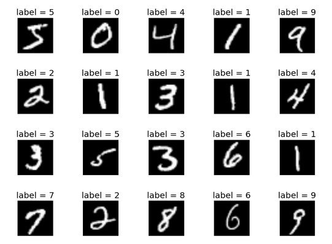

Comme le montre la figure précédente, il y a 10 étiquettes pour ces caractères manuscrits. Les images sont normalisées à la taille de 28 pixels d'image par 28 pixels d'image, converties en taille grise et centrées à une taille fixe. Il s'agit d'un petit ensemble de données sur lequel un algorithme peut être rapidement testé. Dans la section suivante, nous verrons comment charger cet ensemble de données pour l'utiliser dans TensorFlow.

### 2.1.2 Chargement des données MNIST  ###

Chargez les données MNIST directement depuis TensorFlow. Notez que nous spécifions un One-hot encoding comme argument lors du chargement des données. 

L'étiquette est stockée sous forme d'entiers mais doit être chargée en tant que One-hot encoding afin de s'entraîner. Il est supposé que le lecteur exécute le code à partir d'un éditeur avec TensorFlow importé $t f$ à partir de ce point. Voici l'extrait de code pour charger les données MNIST_data :

```python
from tensorflow.examples.tutorials.mnist import input_data
mnist_data = input_data.read_data_sets('MNIST_data', one_hot=True)
```

Lors de la première exécution, les données seront téléchargées, ce qui peut prendre un certain temps. Lors de la deuxième exécution, les données mises en cache seront utilisées. Dans la section suivante, nous construirons un perceptron pour classer les chiffres.

### 2.1.3 Construction d'un perceptron  ###

Un perceptron est un réseau neuronal à une seule couche. Les concepts abordés dans ce chapitre, tels qu'une couche entièrement connectée, la fonction d'activation, la descente stochastique de gradient, les logits, le One-hot encoding, la softmax et l'entropie croisée seront utiles ici. 

Vous apprendrez à définir ces composants de réseaux neuronaux dans TensorFlow et à utiliser le réseau pour entraîner les données MNIST.

#### 2.1.3.1 Définir des espaces réservés pour les données d'entrée et les cibles ####

Un espace réservé est un tenseur dans lequel les données sont transmises. 

Les espaces réservés ne sont pas des valeurs spécifiques, mais ils recevront des données pendant le calcul. 

La taille d'entrée du perceptron, le nombre de classes, la taille du lot et le nombre total d'itérations ou de lots sont d'abord déclarés. 

- $x_{-}$input est l'entrée où les images seront introduites ultérieurement. 
- $y_{-}$input est l'espace réservé où les étiquettes ou les cibles seront fournies comme indiqué ici :

```python
input_size = 784
no_classes = 10
batch_size = 100
total_batches = 200

x_input = tf.placeholder(tf.float32, shape=[None, input_size])
y_input = tf.placeholder(tf.float32, shape=[None, no_classes])
```

Le None dans l'argument shape indique qu'il peut être de n'importe quelle taille puisque nous n'avons pas encore défini la taille du lot. 

Le deuxième argument est la taille du tenseur pour $x_{-}$input et le nombre de classes pour $y_{-}$input. En fonction du type de placeholder, nous avons envoyé les données sous forme de flottants. 

Ensuite, nous pouvons définir le perceptron.