# [8. Extensions au modèle linéaire](#section8) #

[Retour README](../README.md)

<a name="toc"/>

[toc]

Jusqu'à présent, dans cet ouvrage, nous nous sommes principalement concentrés sur les modèles linéaires. Les modèles linéaires sont relativement simples à décrire et à mettre en œuvre, et présentent des avantages par rapport à d'autres approches en termes d'interprétation et d'inférence. Cependant, la régression linéaire standard peut présenter des limites importantes en termes de pouvoir prédictif. Cela est dû au fait que l'hypothèse de linéarité est presque toujours une approximation, et parfois une mauvaise approximation. Le chapitre 6 montre que nous pouvons améliorer les moindres carrés en utilisant la régression ridge, le lasso, la régression en composantes principales et d'autres techniques. Dans ce contexte, l'amélioration est obtenue en réduisant la complexité du modèle linéaire, et donc la variance des estimations. Mais nous utilisons toujours un modèle linéaire, qui ne peut être amélioré que jusqu'à un certain point ! Dans ce chapitre, nous assouplissons l'hypothèse de linéarité tout en essayant de maintenir autant d'interprétabilité que possible. Pour ce faire, nous examinons des extensions très simples des modèles linéaires, comme la régression polynomiale et les fonctions échelon, ainsi que des approches plus sophistiquées telles que les splines, la régression locale et les modèles additifs généralisés.

- **La régression polynomiale** étend le modèle linéaire en ajoutant des prédicteurs supplémentaires, obtenus en élevant chacun des prédicteurs d'origine à une puissance. Par exemple, une régression cubique utilise trois variables, $X, X^2$ et $X^3$, comme prédicteurs. Cette approche constitue un moyen simple de fournir un ajustement non linéaire aux données.

- **Les fonctions à paliers** découpent la plage d'une variable en $K{-}régions$ distinctes afin de produire une variable qualitative. Cela a pour effet d'ajuster une fonction constante par morceaux.
- **Les splines de régression** sont plus flexibles que les polynômes et les fonctions à pas, et constituent en fait une extension de ces deux types de fonctions. Elles consistent à diviser l'intervalle de $X$ en K$ régions distinctes. Dans chaque région, une fonction polynomiale est ajustée aux données. Cependant, ces polynômes sont contraints de se rejoindre de manière régulière aux limites de la région, ou nœuds. À condition que l'intervalle soit divisé en un nombre suffisant de régions, cela peut produire un ajustement extrêmement souple.
- **Les splines de lissage** sont similaires aux splines de régression, mais se produisent dans une situation légèrement différente. Les splines de lissage résultent de la minimisation d'un critère de somme des carrés résiduels soumis à une pénalité de lissage.
- **La régression locale** est similaire aux splines, mais en diffère de manière importante. Les régions sont autorisées à se chevaucher, et elles le font effectivement de manière très lisse.
- **Les modèles additifs généralisés** nous permettent d'étendre les méthodes ci-dessus pour traiter des prédicteurs multiples.

Dans les sections 8.1-8.6, nous présentons un certain nombre d'approches permettant de modéliser de manière flexible la relation entre une réponse $Y$ et un prédicteur unique $X$ . Dans la section $8.7$ , nous montrons que ces approches peuvent être intégrées de manière transparente afin de modéliser une réponse $Y$ en fonction de plusieurs prédicteurs $X_ 1, \ldots, X_ p$ .

<a name="8-1"/>

## [8.1 Régression polynomiale](#8-1) ##

[Retour TOC](#toc)

Historiquement, la manière standard d'étendre la régression linéaire à des contextes dans lesquels la relation entre les prédicteurs et la réponse est non linéaire a consisté à remplacer le modèle linéaire standard

$$
y_i=\beta_0+\beta_1 x_i+\epsilon_i
$$

avec une fonction polynomiale

$$
y_i=\beta_0+\beta_1 x_i+\beta_2 x_i^2+\beta_3 x_i^3+\cdots+\beta_d x_i^d+\varepsilon_i, \hspace{6 em}(8.1)
$$

où $\varepsilon_i$ est le terme erreur. Cette approche est connue sous le nom de régression polynomiale, et nous avons en fait vu un exemple de cette méthode dans la section 3.3.2. Pour un degré $d$ suffisamment grand, une régression polynomiale nous permet de produire une courbe extrêmement non linéaire. 

Remarquez que les coefficients de (8.1) peuvent être facilement estimés à l'aide de la régression linéaire des moindres carrés car il s'agit juste d'un modèle linéaire standard avec des prédicteurs $x_i, x_i^2, x_i^3, \ldots, x_i^d$. En général, il est inhabituel d'utiliser $d$ supérieur à 3 ou 4 car pour de grandes valeurs de $d$, la courbe polynomiale peut devenir trop flexible et prendre des formes très étranges. Ceci est particulièrement vrai près de la limite de la variable $X$.

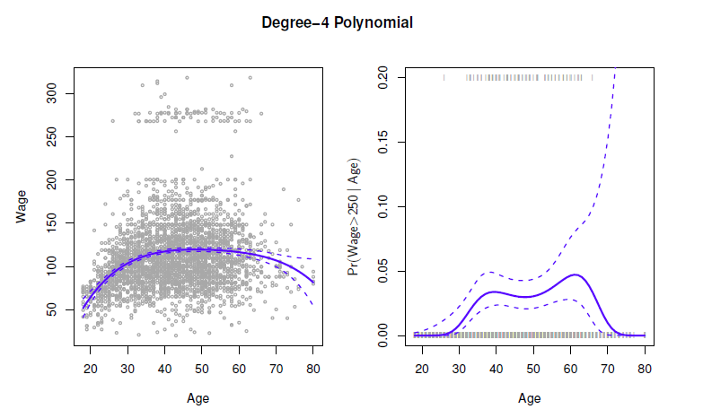

<b>FIG 8.1.</b><i> [Les données sur les salaires. À gauche : la courbe bleue pleine est un polynôme de degré 4 du salaire (en milliers de dollars) en fonction de l'âge, ajusté par les moindres carrés. Les courbes en pointillés indiquent un intervalle de confiance estimé à 95 %. Droite : Nous modélisons l'événement binaire salaire > 250 en utilisant la régression logistique, à nouveau avec un polynôme de degré 4. La probabilité a posteriori ajustée d'un salaire supérieur à 250 000 $ est indiquée en bleu, ainsi qu'un intervalle de confiance estimé à 95 %.]()</i>

Le panneau de gauche de la $figure 8.1$ est un tracé du salaire en fonction de l'âge pour l'ensemble de données Wage, qui contient des informations sur le revenu et la démographie des hommes résidant dans la région de l'Atlantique central des États-Unis. Nous voyons les résultats de l'ajustement d'un polynôme de degré 4 en utilisant les moindres carrés (courbe bleue pleine). Bien qu'il s'agisse d'un modèle de régression linéaire comme un autre, les coefficients individuels ne présentent pas d'intérêt particulier. Nous examinons plutôt l'ensemble de la fonction ajustée sur une grille de 63 valeurs d'âge allant de 18 à 80 ans afin de comprendre la relation entre l'âge et le salaire.

Dans la $figure 8.1$ , une paire de courbes en pointillés accompagne l'ajustement ; il s'agit de courbes d'erreur standard de $(2 \times)$. Voyons comment elles apparaissent. Supposons que nous ayons calculé l'ajustement à une valeur particulière de l'âge, $x_0$ :

$$
\hat{f}(x_0)=\hat{\beta}_0+\hat{\beta}_1 x_0+\hat{\beta}_2 x_0^2+\hat{\beta}_3 x_0^3+\hat{\beta}_4 x_0^4 .
$$

Quelle est la variance de l'ajustement, c'est-à-dire : ${Var} \hat{f}(x_0)$ ? La méthode des moindres carrés renvoie des estimations de variance pour chacun des coefficients ajustés $\hat{\beta}_j$, ainsi que les covariances entre les paires d'estimations de coefficients. Nous pouvons les utiliser pour calculer la variance estimée de $\hat{f}(x_0){ }^1$ L'erreur standard ponctuelle estimée de $\hat{f} (x_0)$ est la racine carrée de cette variance.

------

${ }^1$ Si $\hat{C}$ est la matrice de covariance $5 \times 5$ des $\beta_j$, et si $\ell_0^T=(1, x_0, x_0^2, x_0^3, x_0^4)$, alors ${Var}\left[f\left(x_0\right)\right]=\ell_0^T \hat{\mathbf{C}} \ell_0$.

------

La somme $\hat{f}\left(x_0\right)$ est la racine carrée de cette variance. Ce calcul est répété à chaque point de référence $x_0$, et nous traçons la courbe ajustée, ainsi que deux fois l'erreur standard de chaque côté de la courbe ajustée. Nous traçons deux fois l'erreur standard car, pour des termes d'erreur normalement distribués, cette quantité correspond à un intervalle de confiance approximatif de $95 \%$.

Il semble que les salaires de la $figure\ 8.1$ proviennent de deux populations distinctes : il semble y avoir un groupe de hauts salariés gagnant plus de 250 000$ par an, ainsi qu'un groupe de bas salariés. Nous pouvons traiter le salaire comme une variable binaire en le répartissant entre ces deux groupes. La régression logistique peut alors être utilisée pour prédire cette réponse binaire, en utilisant des fonctions polynomiales de l'âge comme prédicteurs. En d'autres termes, nous ajustons le modèle

$$
{Pr}(y_i>250 \mid x_i)=\frac{\exp (\beta_0+\beta_1 x_i+\beta_2 x_i^2+\cdots+\beta_d x_i^d)}{1+\exp (\beta_0+\beta_1 x_i+\beta_2 x_i^2+\cdots+\beta_d x_i^d)} .
$$

Le résultat est présenté dans le panneau de droite de la $figure\ 8.1$. Les marques grises en haut et en bas du panneau indiquent l'âge des personnes à hauts revenus et des personnes à faibles revenus. La courbe bleue pleine indique les probabilités ajustées d'être une personne à revenu élevé, en fonction de l'âge. L'intervalle de confiance estimé à $95$ est également indiqué. Nous constatons qu'ici, les intervalles de confiance sont assez larges, surtout du côté droit. Bien que la taille de l'échantillon pour cet ensemble de données soit importante ( $n=3 000$ ), il n'y a que 79 personnes à hauts revenus, ce qui entraîne une variance élevée des coefficients estimés et, par conséquent, des intervalles de confiance larges.

<a name="8-2"/>

## [8.2 Fonctions échelon](#8-2) ##

[Retour TOC](#toc)

L'utilisation de fonctions polynomiales des caractéristiques comme prédicteurs dans un modèle linéaire impose une structure globale à la fonction non linéaire de $X$. Nous pouvons à la place utiliser des fonctions échelon afin d'éviter d'imposer une telle structure globale. Dans ce cas, nous divisons l'intervalle de $X$ en tranches, et nous ajustons une constante différente dans chaque tranche. Cela revient à convertir une variable continue en une variable catégorielle ordonnée.

Plus en détail, nous créons des points de coupure $c_1, c_2, \ldots, c_K$ dans l'intervalle de $X$, puis nous créons $K + 1$ nouvelles variables

$$
\begin{aligned}
& C_0(X) &&=I(X < c_1), \\
& C_1(X) &&=I(c_1 \leq X < c_2), \\
& C_2(X) &&=I(c_2 \leq X < c_3) \text {, } \\
& C_{K-1}(X)&&=I(c_{K-1} \leq X < c_K) . \\
& C_K(X)&&=I(c_K \leq X) \text {, } \\
\end{aligned}
$$

où $I(\cdot)$ est une fonction indicatrice qui renvoie un 1 si la condition est vraie, et renvoie un 0 dans le cas contraire.

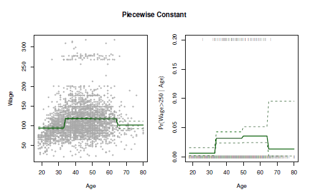

<b>FIG 8.2.</b><i>Les données sur les salaires. A gauche : La courbe pleine affiche la valeur ajustée d'une régression par les moindres carrés du salaire (en milliers de dollars) en utilisant des fonctions échelonnées de l'âge. Les courbes en pointillés indiquent un intervalle de confiance estimé à $95 \%$ . Droite : Nous modélisons l'événement binaire salaire>250 à l'aide d'une régression logistique, en utilisant à nouveau des fonctions échelonnées de l'âge. La probabilité a posteriori ajustée d'un salaire supérieur à $ \$250\ 000$ est indiquée, ainsi qu'un intervalle de confiance estimé à $95 \%$.</i>

Par exemple, $I(c_K \leq X)$ est égale à 1 si $c_K \leq X$, et égale à 0 sinon. Ces variables sont parfois appelées variables fictives. Remarquez que pour toute valeur de $X, C_0(X)+C_1(X)+ C_K(X)=1$, puisque $X$ doit se trouver dans exactement un des intervalles de $K+1$. Nous utilisons ensuite les moindres carrés pour ajuster un modèle linéaire en utilisant $C_1(X), C_2(X), \ldots, C_K(X)$ comme prédicteurs ${ }^2$ .

------

${}^2$ Nous excluons $C_0(X)$ comme prédicteur dans $(8.5)$ car il est redondant avec l'ordonnée à l'origine. Ceci est similaire au fait que nous n'avons besoin que de deux variables muettes pour coder une variable qualitative à trois niveaux, à condition que le modèle contienne un intercept. La décision d'exclure $C_0(X)$ au lieu d'un autre $C_k(X)$ dans $(8.5)$ est arbitraire. Alternativement, nous pourrions inclure $C_0(X), C_1(X), \ldots, C_K(X)$​, et exclure l'intercept.

------

$$
y_i=\beta_0+\beta_1 C_1(x_i)+\beta_2 C_2(x_i)+\cdots+\beta_K C_K(x_i)+\epsilon_i \hspace{6 em} (8.5)
$$

Pour une valeur donnée de $X$, au plus un des $C_1, C_2, \ldots, C_K$ peut être non nul. Notez que lorsque $X < c_1$, tous les prédicteurs de $(8.5)$ sont nuls, de sorte que $\beta_0$ peut être interprété comme la valeur moyenne de $Y$ pour $X < c_1$. Par comparaison, (8.5) prédit une réponse de $\beta_0+\beta_j$ pour $c_j \leq X < c_{j+1}$, donc $\beta_j$ représente l'augmentation moyenne de la réponse pour $X$ dans $c_j \leq X < c_{j+1}$ par rapport à $X < c_1$.

Un exemple d'ajustement des fonctions d'échelon aux données sur les salaires de la $figure\ 8.1$ est présenté dans le panneau de gauche de la $figure\ 8.2$. 

$$
{Pr}(y_i>250 \mid x_i)=\frac{\exp (\beta_0+\beta_1 C_1(x_i)+\cdots+\beta_K C_K(x_i))}{1+\exp (\beta_0+\beta_1 C_1(x_i)+\cdots+\beta_K C_K(x_i))} \hspace{6 em} (8.6)
$$

Nous avons également ajusté le modèle de régression logistique afin de prédire la probabilité qu'un individu gagne beaucoup d'argent en fonction de son âge. Le panneau de droite de la $figure\ 8.2$ présente les probabilités a posteriori ajustées obtenues par cette approche.

Malheureusement, à moins qu'il n'y ait des points de rupture naturels dans les prédicteurs, les fonctions à constantes partielles peuvent manquer l'action. Par exemple, dans le panneau de gauche de la $figure\ 8.2$, la première case manque clairement la tendance à la hausse du salaire avec l'âge. Néanmoins, les approches par fonctions échelonnées sont très populaires en biostatistique et en épidémiologie, entre autres disciplines. Par exemple, les groupes d'âge de 5 ans sont souvent utilisés pour définir les bacs.

<a name="8-3"/>

## [8.3 Fonctions de base](#8-3) ##

[Retour TOC](#toc)

Les modèles de régression polynomiaux et à constantes par morceaux sont en fait des cas particuliers de l'approche par les fonctions de base. L'idée est d'avoir à portée de main une famille de fonctions ou de transformations qui peuvent être appliquées à une variable $X$ : $b_1(X), b_2(X), \ldots, b_K(X)$. Au lieu d'ajuster un modèle linéaire en $X$, nous ajustons le modèle

$$
y_i=\beta_0+\beta_1 b_1(x_i)+\beta_2 b_2(x_i)+\beta_3 b_3(x_i)+\cdots+\beta_K b_K(x_i)+\epsilon_i . \hspace{6 em} (8.7)
$$

Notez que les fonctions de base $b_1(\cdot), b_2(\cdot), \ldots, b_K(\cdot)$ sont fixes et connues. (En d'autres termes, nous choisissons les fonctions à l'avance.) Pour une régression polynomiale, les fonctions de base sont $b_j(x_i) = x_i^j$, et pour les fonctions constantes par morceaux, elles sont $b_j(x_i)=I(c_j \leq x_i < c_{j+1})$. Nous pouvons considérer (8.7) comme un modèle linéaire standard avec des prédicteurs $b_1(x_i), b_2(x_i), \ldots, b_K(x_i)$. Par conséquent, nous pouvons utiliser les moindres carrés pour estimer les coefficients de régression inconnus dans (8.7). Il est important de noter que cela signifie que tous les outils d'inférence pour les modèles linéaires abordés au chapitre 3, tels que les erreurs standard pour les estimations des coefficients et les statistiques F pour la signification globale du modèle, sont disponibles dans ce contexte.

Jusqu'à présent, nous avons envisagé l'utilisation de fonctions polynomiales et de fonctions constantes par morceaux pour nos fonctions de base ; cependant, de nombreuses alternatives sont possibles. Par exemple, nous pouvons utiliser des ondelettes ou des séries de Fourier pour construire les fonctions de base. Dans la section suivante, nous étudions un choix très courant pour une fonction de base : les splines de régression.

<a name="8-4"/>

## [8.4 Splines de régression](#8-4) ##

Nous allons maintenant aborder une classe flexible de fonctions de base qui s'appuie sur les approches de régression polynomiale et de régression constante par morceaux que nous venons de voir.

<a name="8-4-1"/>

### [8.4.1 Polynômes par morceaux](#8-4-1) ###

[Retour TOC](#toc)

Au lieu d'ajuster un polynôme de haut degré sur toute la plage de $X$, la régression polynomiale par morceaux implique l'ajustement de polynômes de bas degré séparés sur différentes régions de $X$. Par exemple, un polynôme cubique par morceaux fonctionne en ajustant un modèle de régression cubique de la forme suivante

$$
y_i=\beta_0+\beta_1 x_i+\beta_2 x_i^2+\beta_3 x_i^3+\epsilon_i, \hspace{6 em} (8.8)
$$

où les coefficients $\beta_0, \beta_1, \beta_2$, et $\beta_3$ diffèrent dans différentes parties du domaine de $X$. Les points où les coefficients changent sont appelés nœuds.

Par exemple, une cubique par morceaux sans nœuds est juste un polynôme cubique standard, comme dans (8.1) avec $d=3$. Un polynôme cubique par morceaux avec un seul nœud à un point $c$ prend la forme suivante

$$
y_i= \begin{cases}\beta_{01}+\beta_{11} x_i+\beta_{21} x_i^2+\beta_{31} x_i^3+\epsilon_i & \text { if } x_i < c \\ \beta_{02}+\beta_{12} x_i+\beta_{22} x_i^2+\beta_{32} x_i^3+\epsilon_i & \text { if } x_i \geq c .\end{cases}
$$

En d'autres termes, nous ajustons deux fonctions polynomiales différentes aux données, l'une sur le sous-ensemble des observations avec $x_i < c$, et l'autre sur le sous-ensemble des observations avec $x_i \geq c$. La première fonction polynomiale a pour coefficients $\beta_{01}, \beta_{11}, \beta_{21}$, et $\beta_{31}$, et la seconde a pour coefficients $\beta_{02}, \beta_{12}, \beta_{22}$, et $\beta_{32}$. Chacune de ces fonctions polynomiales peut être ajustée à l'aide des moindres carrés appliqués aux fonctions simples du prédicteur original.

L'utilisation d'un plus grand nombre de nœuds permet d'obtenir un polynôme par morceaux plus flexible. En général, si nous plaçons $K$ nœuds différents sur toute la plage de $X$, nous finirons par ajuster $K+1$ polynômes cubiques différents. Notez que nous n'avons pas besoin d'utiliser un polynôme cubique. Par exemple, nous pouvons utiliser des fonctions linéaires par morceaux. En fait, nos fonctions constantes par morceaux de la $Section\ 8.2$ sont des polynômes par morceaux de degré 0 !

Le panneau supérieur gauche de la $figure\ 8.3$ montre un polynôme cubique par morceaux ajusté à un sous-ensemble de données sur les salaires, avec un seul nœud à l'âge $=50$. Nous voyons immédiatement un problème : la fonction est discontinue et semble ridicule ! Comme chaque polynôme a quatre paramètres, nous utilisons un total de huit degrés de liberté pour ajuster ce modèle polynomial par morceaux.

<a name="8-4-2"/>

### [8.4.2 Contraintes et splines](#8-4-2) ###

[Retour TOC](#toc)

Le panneau supérieur gauche de la $Figure\ 8.3$ semble incorrect car la courbe ajustée est juste trop flexible. Pour remédier à ce problème, nous pouvons ajuster un polynôme par morceaux sous la contrainte que la courbe ajustée doit être continue.

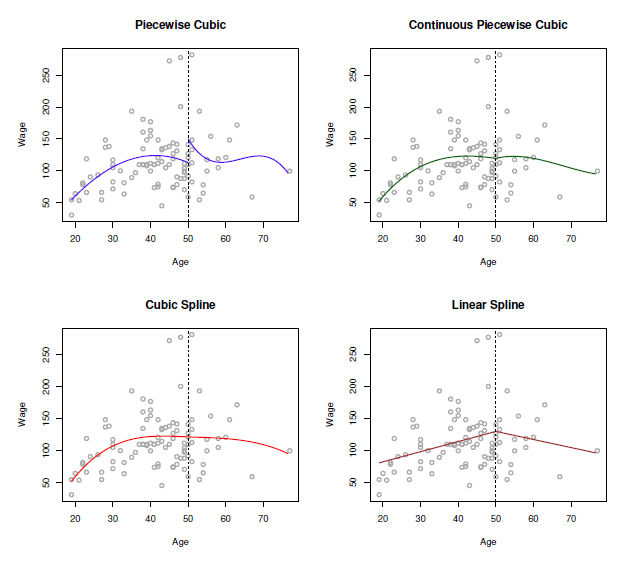

<b>FIG 8.3.</b><i>Divers polynômes par morceaux sont ajustés à un sous-ensemble des données sur les salaires, avec un nœud à l'âge $=50$. En haut à gauche : les polynômes cubiques sont inconstructibles. En haut à droite : Les polynômes cubiques sont contraints d'être continus à l'âge $=50$. En bas à gauche : Les polynômes cubiques sont contraints d'être continus, et d'avoir des dérivées premières et secondes continues. En bas à droite : Une spline linéaire est représentée, qui est contrainte d'être continue.</i>

En d'autres termes, il ne peut pas y avoir de saut lorsque l'âge $=50$. Le graphique en haut à droite de la $figure\ 8.3$ montre l'ajustement résultant. Il semble meilleur que le graphique en haut à gauche, mais la jointure en forme de V ne semble pas naturelle.

Dans le graphique inférieur gauche, nous avons ajouté deux contraintes supplémentaires : maintenant, les dérivées premières et secondes des polynômes par morceaux sont continues à l'âge $=50$. En d'autres termes, nous exigeons que le polynôme par morceaux soit non seulement continu à l'âge $=50$, mais aussi très lisse. Chaque contrainte que nous imposons aux polynômes cubiques par morceaux libère effectivement un degré de liberté, en réduisant la complexité de l'ajustement du polynôme par morceaux résultant. Ainsi, dans le graphique en haut à gauche, nous utilisons huit degrés de liberté, mais dans le graphique en bas à gauche, nous avons imposé trois contraintes (continuité, continuité de la première dérivée et continuité de la seconde dérivée) et on se retrouve donc avec cinq degrés de liberté. La courbe du graphique en bas à gauche s'appelle une spline cubique. ${ }^3$ En général, une spline cubique avec $K$ nœuds utilise un total de $4+K$ degrés de liberté.

------

${ }^3$ Les splines cubiques sont populaires car la plupart des yeux humains ne peuvent pas détecter la discontinuité au niveau des nœuds.

------

Dans la $figure\ 8.3$, le graphique en bas à droite est une spline linéaire, qui est continue à l'âge $=50$. La définition générale d'une spline de degré $d$ est qu'il s'agit d'un polynôme de degré $d$ par morceaux, avec une continuité des dérivées jusqu'au degré $d-1$ à chaque nœud. Par conséquent, une spline linéaire est obtenue en ajustant une ligne dans chaque région de l'espace prédicteur défini par les nœuds, en exigeant la continuité à chaque nœud.

Dans la $figure\ 8.3$, il y a un seul nœud à l'âge $=50$. Bien entendu, nous pourrions ajouter d'autres nœuds et imposer la continuité à chacun d'eux.

<a name="8-4-3"/>

### [8.4.3 La représentation de base des splines](#8-4-3) ###

[Retour TOC](#toc)

Les splines de régression que nous venons de voir dans la section précédente ont pu sembler quelque peu complexes : comment pouvons-nous ajuster un polynôme de degré $d$ par morceaux sous la contrainte qu'il (et éventuellement ses dérivées $d-1$ premières) soit continu ? Il s'avère que nous pouvons utiliser le modèle de base (8.7) pour représenter une spline de régression. Une spline cubique avec $K$ nœuds peut être modélisée comme suit

$$
y_i=\beta_0+\beta_1 b_1(x_i)+\beta_2 b_2(x_i)+\cdots+\beta_{K+3} b_{K+3}(x_i)+\epsilon_i, \hspace{6 em} (8.9)
$$

pour un choix approprié de fonctions de base $b_1, b_2, \ldots, b_{K+3}$. Le modèle (8.9) peut alors être ajusté en utilisant les moindres carrés.

Juste comme il existait plusieurs façons de représenter les polynômes, il existe également de nombreuses façons équivalentes de représenter les splines cubiques en utilisant différents choix de fonctions de base dans $(8.9)$. La façon la plus directe de représenter une spline cubique à l'aide de $(8.9)$ est de commencer par une base pour un polynôme cubique - à savoir, $x, x^2$ et $x^3$ - puis d'ajouter une fonction de base de puissance tronquée par nœud. Une fonction de base de puissance tronquée est définie comme suit

$$
h(x, \xi)=(x-\xi)_{+}^3=\left\{\begin{aligned}
(x-\xi)^3 & \text { if } x>\xi \\
0 & \text { otherwise },
\end{aligned}\right. \hspace{6 em} (8.10)
$$

où $\xi$ est le nœud. On peut montrer que l'ajout d'un terme de la forme $\beta_4 h(x, \xi)$ au modèle (8.8) pour un polynôme cubique conduira à une discontinuité uniquement dans la troisième dérivée à $\xi$ ; la fonction restera continue, avec des dérivées premières et secondes continues, à chacun des nœuds.

En d'autres termes, pour ajuster une spline cubique à un ensemble de données comportant $K$ nœuds, nous effectuons une régression par les moindres carrés avec une ordonnée à l'origine et $3+K$ prédicteurs, de la forme $X, X^2, X^3, h(X, \xi_1), h(X, \xi_2), \ldots, h(X, \xi_K)$, où $\xi_1, \ldots, \xi_K$ sont les nœuds. Cela revient à estimer un total de $K+4$ coefficients de régression ; pour cette raison, l'ajustement d'une spline cubique avec $K$ nœuds utilise $K+4$ degrés de liberté.

<b>FIG 8.4.</b><i>Une spline cubique et une spline cubique naturelle, avec trois nœuds, ajustées à un sous-ensemble des données sur les salaires. Les lignes pointillées dénotent les emplacements des nœuds.</i>

Malheureusement, les splines peuvent avoir une variance élevée dans la plage extérieure des prédicteurs - c'est-à-dire lorsque $X$ prend une valeur très petite ou très grande. La $figure\ 8.4$ montre un ajustement aux données sur les salaires avec trois nœuds. Nous voyons que les bandes de confiance dans la région limite semblent assez sauvages. Une spline naturelle est une spline de régression avec des contraintes de limite supplémentaires : la fonction doit être linéaire à la limite (dans la région où $X$ est plus petit que le plus petit nœud, ou plus grand que le plus grand nœud). Cette contrainte supplémentaire signifie que les splines naturelles produisent généralement des estimations plus stables aux frontières. Dans la $figure\ 8.4$ , une spline cubique naturelle est également représentée par une ligne rouge. Notez que les intervalles de confiance correspondants sont plus étroits.

<a name="8-4-4"/>

### [8.4.4 Choix du nombre et de l'emplacement des nœuds](#8-4-4) ###

[Retour TOC](#toc)

Lorsque nous ajustons une spline, où devons-nous placer les nœuds ? La spline de régression est plus flexible dans les régions qui contiennent beaucoup de nœuds, car dans ces régions, les coefficients polynomiaux peuvent changer rapidement. Par conséquent, une option consiste à placer plus de nœuds aux endroits où nous pensons que la fonction peut varier le plus rapidement, et à placer moins de nœuds là où elle semble plus stable. Bien que cette option puisse fonctionner correctement, dans la pratique, il est courant de placer les nœuds de manière uniforme. Une façon de procéder est de spécifier les degrés de liberté souhaités, puis de demander au logiciel de placer automatiquement le nombre correspondant de nœuds aux quantiles uniformes des données.

La $figure\ 8.5$ montre un exemple sur les données salariales. Comme dans la $figure\ 8.4$, nous avons ajusté une spline cubique naturelle avec trois nœuds, sauf que cette fois, les emplacements des nœuds ont été choisis automatiquement comme étant les $25^{ème}$ , $50^{ème}$ et $75^{ème}$ percentiles de l'âge. Ceci a été spécifié en demandant quatre degrés de liberté. L'argument selon lequel quatre degrés de liberté conduisent à trois nœuds intérieurs est quelque peu technique .${ }^4$

------

${ }^4$ Il y a en fait cinq nœuds, y compris les deux nœuds de frontière. Une spline cubique avec 5 nœuds a neuf degrés de liberté. Mais les splines cubiques naturelles ont deux contraintes naturelles supplémentaires à chaque limite pour renforcer la linéarité, ce qui donne $9-4=5$ degrés de liberté. Comme cela inclut une constante, qui est absorbée dans l'intercept, nous comptons quatre degrés de liberté.

------

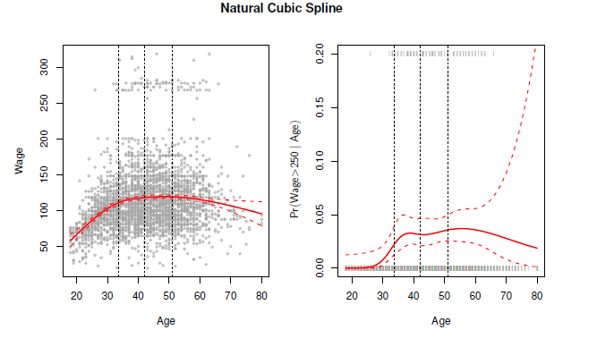

<b>FIG 8.5.</b><i> Une fonction spline cubique naturelle à quatre degrés de liberté est ajustée aux données sur les salaires. À gauche : une fonction spline est ajustée au salaire (en milliers de dollars) en fonction de l'âge. A droite : Une fonction spline est ajustée au salaire (en milliers de dollars) en fonction de l'âge : La régression logistique est utilisée pour modéliser l'événement binaire salaire $>250$ en fonction de l'âge. La probabilité postérieure futée d'un salaire supérieur à 250 000 $ est indiquée. Les lignes pointillées indiquent l'emplacement des nœuds.</i>

Combien de nœuds devons-nous utiliser ou, de manière équivalente, combien de degrés de liberté notre spline doit-elle contenir ? Une option consiste à essayer différents nombres de nœuds et à voir lequel produit la meilleure courbe. Une approche un peu plus objective consiste à utiliser la validation croisée, comme nous l'avons vu aux chapitres 5 et 6. Avec cette méthode, nous supprimons une partie des données (disons 10 ), ajustons une courbe spline avec un certain nombre de nœuds aux données restantes, puis utilisons la courbe spline pour faire des prédictions pour la partie conservée. Nous répétons ce processus plusieurs fois jusqu'à ce que chaque observation ait été exclue une fois, puis nous calculons le RSS global validé par recoupement. Cette procédure peut être répétée pour différents nombres de nœuds $K$. On choisit ensuite la valeur de $K$ qui donne le $RSS$ le plus petit.

La $figure\ 8.6$ montre les erreurs quadratiques moyennes validées par recoupement dix fois pour des splines avec différents degrés de liberté ajustées aux données sur les salaires. 

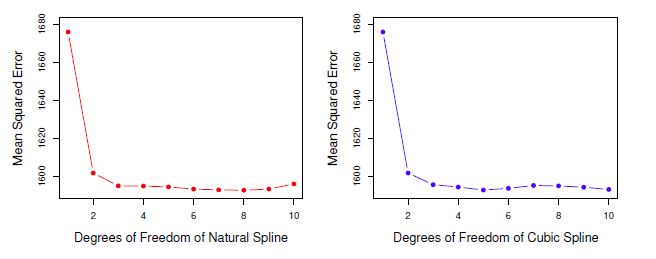

<b>FIG 8.6.</b><i>Erreurs quadratiques moyennes validées par croisement dix fois pour sélectionner les degrés de liberté lors de l'ajustement des splines aux données de salaire. La réponse est le salaire et le prédicteur l'âge. Gauche : Une spline cubique naturelle. Droite : $A$ cubic spline.</i>

Le panneau de gauche correspond à une spline cubique naturelle et le panneau de droite à une spline cubique. Les deux méthodes produisent des résultats presque identiques, avec une preuve évidente qu'un ajustement à un degré (une régression linéaire) n'est pas adéquat. Les deux courbes s'aplatissent rapidement, et il semble que trois degrés de liberté pour la spline naturelle et quatre degrés de liberté pour la spline cubique soient tout à fait adéquats.

Dans la section $8.7$, nous ajustons des modèles spline additifs simultanément sur plusieurs variables à la fois. Cela pourrait potentiellement nécessiter la sélection de degrés de liberté pour chaque variable. Dans ce cas, nous adoptons généralement une approche plus pragmatique et fixons les degrés de liberté à un nombre fixe, par exemple quatre, pour tous les termes.

<a name="8-4-5"/>

### [8.4.5 Comparaison avec la régression polynomiale](#8-4-5) ###

[Retour TOC](#toc)

La $figure\ 8.7$ compare une spline cubique naturelle avec 15 degrés de liberté à un polynôme de degré 15 sur l'ensemble de données sur les salaires. La flexibilité supplémentaire du polynôme produit des résultats indésirables aux limites, tandis que la spline cubique naturelle fournit toujours un ajustement raisonnable aux données. Les splines de régression donnent souvent des résultats supérieurs à la régression polynomiale. En effet, contrairement aux polynômes, qui doivent utiliser un degré élevé (exposant du terme monomial le plus élevé, par exemple $X^{15}$ ) pour produire des ajustements flexibles, les splines introduisent de la flexibilité en augmentant le nombre de nœuds mais en gardant le degré fixe. En général, cette approche produit des estimations plus stables. Les splines nous permettent également de placer plus de nœuds, et donc de flexibilité, sur les régions où la fonction $f$ semble changer rapidement, et moins de nœuds là où $f$ semble plus stable.

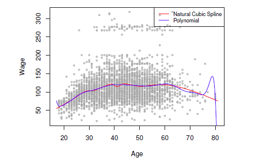

<b>FIG 8.7.</b><i>Sur l'ensemble de données sur les salaires, une spline cubique naturelle à 15 degrés de liberté est comparée à un polynôme de degré 15. Les polynômes peuvent présenter un comportement sauvage, notamment près des queues.</i>

<a name="8-5"/>

## [8.5 Splines de lissage](#8-5) ##

Dans la dernière section, nous avons abordé les splines de régression, que nous créons en spécifiant un ensemble de nœuds, en produisant une séquence de fonctions de base, puis en utilisant les moindres carrés pour estimer les coefficients de la spline. Nous présentons maintenant une approche quelque peu différente qui produit également une spline.

<a name="8-5-1"/>

### [8.5.1 Aperçu des splines de lissage](#8-5-1) ###

[Retour TOC](#toc)

Lors de l'ajustement d'une courbe lisse à un ensemble de données, nous souhaitons réellement trouver une fonction, disons $g(x)$, qui s'ajuste bien aux données observées : autrement dit, nous voulons que $RSS$ $=\sideset{}{^n_{1-1}}\sum(y_1-g\left(x_i)\right)^2$ soit petit. Cependant, cette approche pose un problème. Si nous ne mettons aucune contrainte sur $g\left(x_i\right)$, alors nous pouvons toujours rendre RSS nulle simplement en choisissant $g$ de telle sorte qu'elle interpole tous les $y_t$. Une telle fonction serait terriblement inadaptée aux données - elle serait beaucoup trop flexible. Ce que nous voulons vraiment, c'est une fonction $g$ qui rend le RSS petit, mais qui est également lisse.

Comment pouvons-nous nous assurer que $g$ est lisse ? Il y a plusieurs façons de le faire. Une approche naturelle est de trouver la fonction $g$ qui minimise

$$
\sum_{i=1}^n(y_i-g(x_i))^2+\lambda \int g^{\prime \prime}(t)^2 d t \hspace{6 em} (8.11)
$$

où $\lambda$ est un paramètre d'ajustement non négatif. La fonction $g$ qui minimise (8.11) est appelée spline de lissage.

Que signifie (8.11) ? L'équation $8.11$ reprend la formulation "Perte+Pénalité" que nous rencontrons dans le contexte de la régression ridge et du lasso à la section 7.

Le terme $\sideset{}{^n_{i-1}}\sum(y_i-g(x_i))^2$ est une fonction de perte qui encourage $g$ à bien s'ajuster aux données, et le terme $\lambda \int g^{\prime \prime}(t)^2 d t$ est un terme de pénalité qui pénalise la variabilité de $g$. La notation $g^{\prime \prime}(t)$ indique la dérivée seconde de la fonction $g$. La dérivée première $g^{\prime}(t)$ mesure la pente d'une fonction à $t$, et la dérivée seconde correspond à l'ampleur de la variation de la pente. Ainsi, de manière générale, la dérivée seconde d'une fonction est une mesure de sa rugosité : elle est grande en valeur absolue si $g(t)$ est très ondulé à proximité de $t$, et elle est proche de zéro dans le cas contraire. (La dérivée seconde d'une ligne droite est nulle ; notez qu'une ligne est parfaitement lisse). La notation $\int$ est une intégrale, que l'on peut considérer comme une sommation sur l'intervalle de $t$. En d'autres termes, $\int g^{\prime \prime}(t)^2 d t$ est simplement une mesure de la variation totale de la fonction $g^{\prime}(t)$, sur toute son étendue. Si $g$ est très lisse, alors $g^{\prime}(t)$ sera proche de la constante et $\int g^{\prime \prime}(t)^2 d t$ prendra une petite valeur. Inversement, si $g$ est instable et variable, alors $g^{\prime}(t)$ variera significativement et $\int g^{\prime \prime}(t)^2 d t$ prendra une grande valeur. Par conséquent, dans $(8.11), \lambda \int g^{\prime \prime}(t)^2 d t$ encourage $g$ à être lisse. Plus la valeur de $\lambda$ est grande, plus $g$ sera lisse.

Lorsque $\lambda=0$, le terme de pénalité dans (8.11) n'a aucun effet, et la fonction $g$ sera donc très irrégulière et interpolera exactement les observations d'apprentissage. Lorsque $\lambda \rightarrow \infty, g$ sera parfaitement lisse - ce sera juste une ligne droite qui passe aussi près que possible des points d'apprentissage. En fait, dans ce cas, $g$ sera la ligne linéaire des moindres carrés, puisque la fonction de perte dans (8.11) revient à minimiser la somme résiduelle des carrés. Pour une valeur intermédiaire de $\lambda, g$ se rapprochera des observations d'apprentissage mais sera quelque peu lisse. Nous voyons que $\lambda$ contrôle le compromis biais-variance de la spline de lissage.

On peut montrer que la fonction $g(x)$ qui minimise (8.11) possède certaines propriétés particulières : il s'agit d'un polynôme cubique par morceaux avec des nœuds aux valeurs uniques de $x_1, \ldots, x_n$, et des dérivées premières et secondes continues à chaque nœud. De plus, elle est linéaire dans la région située en dehors des nœuds extrêmes. En d'autres termes, la fonction $g(x)$ qui minimise $(8.11)$ est une spline cubique naturelle avec des nœuds à $x_1, \ldots, x_n$ ! Cependant, il ne s'agit pas de la même courbe cubique naturelle que celle que l'on obtiendrait si l'on appliquait l'approche de la fonction de base décrite à la $section\ 8.4.3$ avec des nœuds à $x_1, \ldots, x_n$ - il s'agit plutôt d'une version rétrécie d'une telle courbe cubique naturelle, où la valeur du paramètre d'ajustement $\lambda$ dans (8.11) contrôle le niveau de rétrécissement.

<a name="8-5-2"/>

### [8.5.2 Choix du paramètre de lissage $\lambda$.](#8-5-2)  ###

[Retour TOC](#toc)

Nous avons vu qu'une spline de lissage est simplement une spline cubique naturelle avec des nœuds à chaque valeur unique de $x_i$. On pourrait penser qu'une spline de lissage possède beaucoup trop de degrés de liberté, puisqu'un nœud à chaque point de données offre une grande flexibilité. Mais le paramètre de réglage $\lambda$ contrôle la rugosité de la spline de lissage, et donc les degrés de liberté effectifs. Il est possible de montrer que lorsque $\lambda$ augmente de 0 à $\infty$, les degrés de liberté effectifs, que nous écrivons $d f_\lambda$, diminuent de $n$ à 2 .

Dans le contexte des splines de lissage, pourquoi parle-t-on de degrés de liberté effectifs plutôt que de degrés de liberté ? Habituellement, les degrés de liberté font référence au nombre de paramètres libres, tels que le nombre de coefficients ajustés dans une spline polynomiale ou cubique. Bien qu'une spline de lissage possède $n$ paramètres et donc $n$ degrés de liberté nominaux, ces $n$ paramètres sont fortement contraints ou réduits. Par conséquent, $d f_\lambda$ est une mesure de la flexibilité de la spline de lissage - plus il est élevé, plus la spline de lissage est flexible (et plus le biais est faible mais la variance élevée). La définition des degrés de liberté effectifs est quelque peu technique. Nous pouvons écrire

$$
\hat{\mathrm{g}}_ \lambda = \mathbf{S}_ {\lambda \mathbf{y}}, \hspace{6 em} (8.12)
$$

où $\hat g_\lambda$ est la solution de (8.11) pour un choix particulier de $\lambda$ - c'est-à-dire un vecteur $n$ contenant les valeurs ajustées de la spline de lissage aux points d'apprentissage $x_1, \ldots, x_n$. L'équation $8.12$ indique que le vecteur des valeurs ajustées lors de l'application d'une spline de lissage aux données peut être écrit comme une matrice $n \times n$ $S_\lambda$ (pour laquelle il existe une formule) multipliée par le vecteur de réponse $\mathbf{y}$. Le nombre effectif de degrés de liberté est alors défini comme suit

$$
d f_ \lambda = \sideset{}{^n_ {i = 1}}\sum\{\mathbf{S}_ \lambda\}_ {1 \mathrm{i}}, \hspace{6 em} (8.13)
$$

la somme des éléments diagonaux de la matrice $\mathbf{S}_\lambda$.

Lors de l'ajustement d'une spline de lissage, nous n'avons pas besoin de choisir le nombre ou l'emplacement des nœuds - il y aura un nœud pour chaque observation d'apprentissage, $x_1, \ldots, x_n$. En revanche, nous avons un autre problème : nous devons choisir la valeur de $\lambda$. Il n'est pas surprenant qu'une solution possible à ce problème soit la validation croisée. En d'autres termes, nous pouvons trouver la valeur de $\lambda$ qui rend le RSS validé par recoupement aussi petit que possible. Il s'avère que la LOOCV (***leaveone-out cross-validation erro***r) peut être calculée très efficacement pour les splines de lissage, avec essentiellement le même coût que le calcul d'un ajustement unique, à l'aide de la formule suivante :

$$
{RSS}_ {c v}(\lambda) = \sideset{}{^n_ {i = 1}}\sum(y_ i - \hat{g}_ \lambda^{(-1)}(x_i))^2 = \sideset{}{^n_ {i = 1}}\sum \biggl[\frac{y_ i - \hat{g}_ \lambda(x_ i)}{1 - \{\mathbf{S}_ \lambda\}_ {11}} \biggl ]^2 .
$$

La notation $\hat g_\lambda^{(-1)}(x_i)$ indique la valeur ajustée pour cette spline de lissage évaluée à $x_i$, où l'ajustement utilise toutes les observations d'apprentissage à l'exception de la $(x_i, y_t)$. En revanche, $\hat g_\lambda(x_i)$ indique la fonction spline de lissage ajustée à toutes les observations d'apprentissage et évaluée à $x_1$. Cette formule remarquable indique que nous pouvons calculer chacun de ces ajustements sans tenir compte des observations en utilisant seulement $\hat g \lambda$, l'ajustement original à toutes les données. ${ }^5$ 

------

${ }^5$ Les formules exactes de calcul de $\hat g(x_i)$ et de $S_\lambda$ sont très techniques ; cependant, il existe des algorithmes efficaces pour calculer ces quantités.

------

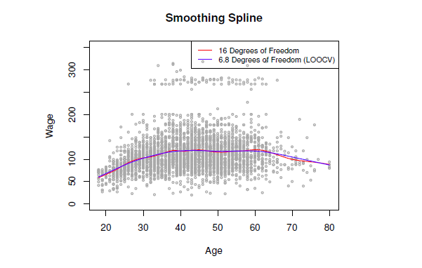

<b>FIG 8.8.</b><i>Des ajustements spline de lissage aux données sur les salaires. La courbe rouge résulte de la spécification de 16 degrés de liberté effectifs. Pour la courbe bleue, $\lambda$ a été trouvé automatiquement par validation croisée leave-one-out, ce qui a donné $6,8$ degrés de liberté effectifs.</i>

Nous avons une formule très similaire (6.2) de la section 6 pour la régression linéaire par les moindres carrés. En utilisant (5.2), nous pouvons très rapidement effectuer une LOOCV pour les splines de régression discutées plus tôt dans ce chapitre, ainsi que pour la régression des moindres carrés utilisant des fonctions de base arbitraires.

La $figure\ 8.8$ montre les résultats de l'ajustement d'une spline de lissage aux données sur les salaires. La courbe rouge indique l'ajustement obtenu en spécifiant au préalable que nous souhaitons une spline de lissage avec 16 degrés de liberté effectifs. La courbe bleue est le spline de lissage obtenu lorsque $\lambda$ est choisi à l'aide de LOOCV ; dans ce cas, la valeur de $\lambda$ choisie donne $6,8$ degrés de liberté effectifs (calculés à l'aide de (8.13)). Pour ces données, il y a peu de différence perceptible entre les deux splines de lissage, hormis le fait que celle à 16 degrés de liberté semble légèrement plus ondulée. Puisqu'il y a peu de différence entre les deux ajustements, l'ajustement par spline de lissage avec $6,8$ degrés de liberté est préférable, car en général les modèles plus simples sont meilleurs, à moins que les données ne fournissent des preuves en faveur d'un modèle plus complexe.

<a name="8-6"/>

## [8.6 Régression locale](#8-6) ##

[Retour TOC](#toc)

La régression locale est une approche différente pour l'ajustement de fonctions non linéaires flexibles, qui consiste à calculer l'ajustement à un point cible $x_0$ en utilisant uniquement les observations d'apprentissage proches. La figure $8.9$ illustre l'idée sur certaines données simulées, avec un point cible proche de $0.4$, et un autre proche de la limite de $0,05$.

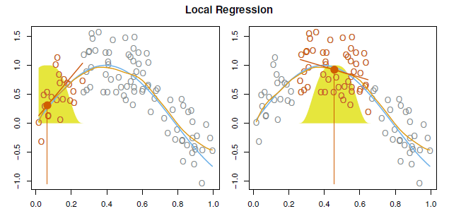

<b>FIG 8.9.</b><i>Régression locale illustrée sur quelques données simulées, où la courbe bleue représente $f(x)$ à partir duquel les données ont été générées, et la courbe orange clair correspond à l'estimation de la régression locale $\hat{f}(x)$. Les points colorés en orange sont locaux au point cible $x_0$, représenté par la ligne verticale orange. La forme de cloche jaune superposée au tracé indique les poids attribués à chaque point, qui diminuent jusqu'à zéro avec la distance du point cible. L'ajustement $\hat{f}\left(x_0\right)$ à $x_0$ est obtenu en ajustant une régression linéaire pondérée (segment de ligne orange), et en utilisant la valeur ajustée à $x_0$ (point plein orange) comme estimation $\hat{f}\left(x_0\right)$.</i>

Sur cette figure, la ligne bleue représente la fonction $f(x)$ à partir de laquelle les données ont été générées, et la ligne orange clair correspond à l'estimation par régression locale $\hat{f}(x)$. La régression locale est décrite dans l'Algorithme $8.1$.

Notez que dans l'étape 3 de l'algorithme $8.1$, les poids $K_{i 0}$ seront différents pour chaque valeur de $x_0$. En d'autres termes, afin d'obtenir l'ajustement de la régression locale à un nouveau point, nous devons ajuster un nouveau modèle de régression des moindres carrés pondérés en minimisant (8.14) pour un nouvel ensemble de poids. La régression locale est parfois appelée une procédure basée sur la mémoire, car comme pour les plus proches voisins, nous avons besoin de toutes les données d'apprentissage chaque fois que nous souhaitons calculer une prédiction. Nous n'entrerons pas ici dans les détails techniques de la régression locale - il existe des livres sur le sujet.

Pour effectuer une régression locale, il faut faire un certain nombre de choix, tels que la définition de la fonction de pondération $K$ et l'ajustement d'une régression linéaire, constante ou quadratique à l'étape 3. (L'équation $8.14$ correspond à une régression linéaire.) Bien que tous ces choix fassent une certaine différence, le choix le plus important est l'étendue s, qui est la proportion de points utilisés pour calculer la régression locale à $x_0$, telle que définie à l'étape 1 ci-dessus. L'étendue joue un rôle similaire à celui du paramètre d'accord $\lambda$ dans les splines de lissage : elle contrôle la flexibilité de l'ajustement non linéaire. Plus la valeur de $s$ est petite, plus l'ajustement sera local et ondulé ; à l'inverse, une valeur très élevée de $s$ conduira à un ajustement global aux données en utilisant toutes les observations d'apprentissage. Nous pouvons à nouveau utiliser la validation croisée pour choisir $s$, ou nous pouvons le spécifier directement.

------

***Algorithme 8.1*** Régression locale à $X = x_ 0$

1. Rassembler la fraction $s=k / n$ des points d'apprentissage dont les $x_i$ sont les plus proches de $x_0$.

2. Attribuer un poids $K_{i 0}=K\left(x_i, x_0\right)$ à chaque point de ce voisinage, de sorte que le point le plus éloigné de $x_0$ ait un poids nul, et que le plus proche ait le poids le plus élevé. Tous les voisins les plus proches, sauf ces $k$, ont un poids nul.

3. Ajuster une régression par les moindres carrés pondérés de $y_i$ sur $x_i$ en utilisant les poids susmentionnés, en trouvant $\hat{\beta}_0$ et $\hat{\beta}_1$ qui minimisent

$$
\sideset{}{^n_{i=1}}\sum K_{i 0}(y_i-\beta_0-\beta_1 x_i)^2 . \hspace{6 em} (8.14)
$$

4. La valeur ajustée à $x_0$ est donnée par $\hat f (x_0)=\hat \beta_0+\hat \beta_1 x_0$.

------

La figure $8.10$ affiche les ajustements de régression linéaire locale sur les données de salaire, en utilisant deux valeurs de $s : 0,7$ et $0,2$. Comme prévu, l'ajustement obtenu avec $s=0,7$ est plus lisse que celui obtenu avec $s=0,2$.

L'idée de régression locale peut être généralisée de nombreuses manières différentes. Dans un contexte de caractéristiques multiples $X_1, X_2, \ldots, X_p$, une généralisation très utile consiste à ajuster un modèle de régression linéaire multiple qui est global pour certaines variables, mais local pour d'autres, comme le temps. De tels modèles à coefficients variables constituent un moyen utile d'adapter un modèle aux données les plus récemment recueillies. La régression locale se généralise aussi très naturellement lorsque nous voulons ajuster des modèles qui sont locaux dans une paire de variables $X_1$ et $X_2$, plutôt que dans une seule. Nous pouvons simplement utiliser des voisinages bidimensionnels et ajuster des modèles de régression linéaire à deux variables en utilisant les observations qui sont proches de chaque point cible dans l'espace bidimensionnel. Théoriquement, la même approche peut être mise en œuvre dans des dimensions supérieures, en utilisant des régressions linéaires ajustées à des voisinages à $p{-}dimensions$ . Cependant, la régression locale peut donner de mauvais résultats si $p$ est beaucoup plus grand que 3 ou 4, car il y aura généralement très peu d'observations d'apprentissage proches de $x_0$. La régression par les plus proches voisins, abordée au chapitre 3, souffre d'un problème similaire en haute dimension.

<a name="8-7"/>

## [8.7 Modèles additifs généralisés](#8-7) ##

[Retour TOC](#toc)

Dans les sections 8.1-8.6, nous présentons un certain nombre d'approches permettant de prédire de manière flexible une réponse $Y$ sur la base d'un prédicteur unique $X$. Ces approches peuvent être considérées comme des extensions de la régression linéaire simple. Ici, nous explorons ici le problème de la prédiction flexible de $Y$ sur la base de plusieurs prédicteurs, $X_1, \ldots, X_p$. Cela revient à une extension de la régression linéaire multiple. 

<b>FIG 8.10.</b><i>Des ajustements linéaires locaux aux données sur les salaires. La portée spécifie la fraction des données utilisées pour calculer l'ajustement à chaque point cible.</i>

Les modèles additifs généralisés (MAG) fournissent un cadre général pour étendre un modèle linéaire standard en autorisant des fonctions non linéaires de chacune des variables, tout en maintenant l'additivité. Juste comme les modèles linéaires, les MAG peuvent être appliqués à des réponses quantitatives et qualitatives. Nous examinons d'abord les MAG pour une réponse quantitative dans la section 8.7.1, puis pour une réponse qualitative dans la section 8.7.2.

<a name="8-7-1"/>

### [8.7.1 GAM pour les problèmes de régression](#8-7-1) ###

[Retour TOC](#toc)

Une manière naturelle d'étendre le modèle de régression linéaire multiple

$$
y_i=\beta_0+\beta_1 x_{i 1}+\beta_2 x_{i 2}+\cdots+\beta_p x_{i p}+\varepsilon_i
$$

afin de tenir compte des relations non linéaires entre chaque caractéristique et la réponse consiste à remplacer chaque composante linéaire $\beta_j x_{i j}$ par une fonction non linéaire (lisse) $f_j(x_{i j})$. Nous écririons alors le modèle comme suit

$$
\begin{aligned}
y_i & =\beta_0+\sideset{}{^p_{j=1}}\sum f_j(x_{i j})+\epsilon_i \\
& =\beta_0+f_1(x_{i 1})+f_2(x_{i 2})+\cdots+f_p\left(x_{i p}\right)+\varepsilon_i .
\end{aligned} \hspace{6 em} (8.15)
$$

Ceci est un exemple de MAG. Il s'agit d'un modèle additif car nous calculons un $f_j$ distinct pour chaque $X_j$, puis nous additionnons toutes leurs contributions.

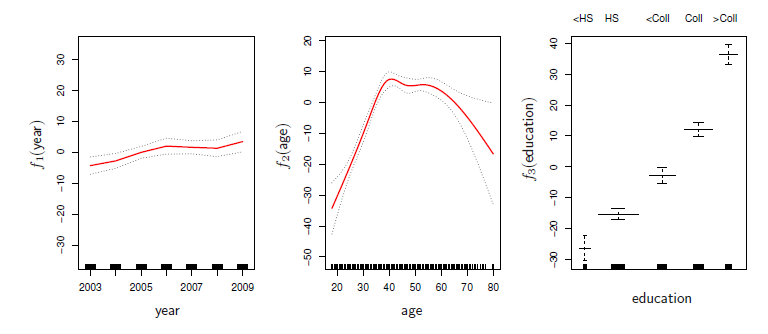

<b>FIG 8.11.</b><i>Pour les données sur les salaires, tracés de la relation entre chaque caractéristique et la réponse, le salaire, dans le modèle ajusté (8.16). Chaque graphique affiche la fonction ajustée et les erreurs standard ponctuelles. Les deux premières fonctions sont des splines naturelles en année et en âge, avec quatre et cinq degrés de liberté, respectivement. La troisième fonction est une fonction échelon, ajustée à la variable qualitative éducation.</i>

Dans les sections 8.1-8.6, nous discutons de nombreuses méthodes d'ajustement de fonctions à une seule variable. La beauté des MAG est que nous pouvons utiliser ces méthodes comme blocs de construction pour ajuster un modèle additif. En fait, pour la plupart des méthodes que nous avons vues jusqu'à présent dans ce chapitre, cela peut être fait de manière assez triviale. Prenons, par exemple, les splines naturelles, et considérons la tâche d'ajustement du modèle

$$
\text { wage } =\beta_0+f_1 \text { (year })+f_2 \text { (age) }+f_3 \text { (education })+\varepsilon \hspace{6 em} (8.16)
$$

sur les données salariales. Ici, l'année et l'âge sont des variables quantitatives, et l'éducation est une variable qualitative à cinq niveaux : $< \mathrm{HS}$, HS, $< \mathrm{Coll}$, $\mathrm{Coll}$, $> \mathrm{Coll}$, se référant au niveau d'études secondaires ou universitaires qu'un individu a terminé. Nous ajustons les deux premières fonctions à l'aide de splines naturelles. Nous ajustons la troisième fonction en utilisant une constante distincte pour chaque niveau, via l'approche habituelle de la variable muette de la section 4.3.1.

La $figure\ 8.11$ montre les résultats de l'ajustement du modèle (8.16) en utilisant les moindres carrés. Cela est facile à faire, car comme nous l'avons vu dans la $section\ 8.4$, des splines naturelles peuvent être construites en utilisant un ensemble de fonctions de base choisies de manière appropriée. Par conséquent, l'ensemble du modèle est juste une grande régression sur les variables de base des splines et les variables fictives, toutes regroupées dans une grande matrice de régression.

La $figure\ 8.11$ peut être facilement interprétée. Le panneau de gauche indique que si l'âge et l'éducation sont fixes, le salaire a tendance à augmenter légèrement avec l'année ; cela peut être dû à l'inflation. Le panneau central indique que si l'éducation et l'année sont fixes, le salaire tend à être le plus élevé pour les valeurs intermédiaires de l'âge, et le plus bas pour les personnes très jeunes et très âgées. Le panneau de droite indique que si l'année et l'âge sont fixes, le salaire tend à augmenter avec l'éducation : plus une personne est éduquée, plus son salaire est élevé, en moyenne. Tous ces résultats sont intuitifs.

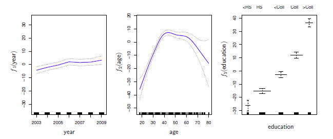

<b>FIGURE 8.12.</b><i>Les détails sont les mêmes que dans la figure 8.11, mais maintenant $f_1$ et $f_2$ sont des splines de lissage avec quatre et cinq degrés de liberté, respectivement.</i>

La $figure\ 8.12$ présente un triple tracé similaire, mais cette fois, $f_1$ et $f_2$ sont des splines de lissage avec quatre et cinq degrés de liberté, respectivement. L'ajustement d'un $GAM$ avec une spline de lissage n'est pas aussi simple que l'ajustement d'un $GAM$ avec une spline naturelle, car dans le cas des splines de lissage, les moindres carrés ne peuvent pas être utilisés. Cependant, un logiciel standard tel que la fonction $gam ()$ de R peut être utilisé pour ajuster des $GAM$ à l'aide de splines de lissage, via une approche connue sous le nom de $backfitting$ . Cette méthode permet d'ajuster un modèle impliquant plusieurs prédicteurs en mettant à jour de manière répétée l'ajustement pour chaque prédicteur à tour de rôle, en maintenant les autres fixes. L'intérêt de cette approche est que chaque fois que nous mettons à jour une fonction, nous appliquons simplement la méthode d'ajustement pour cette variable à un résidu partiel ${ }^6$.

------

${ }^6$ Le résidu partiel de $\mathrm{~A}$ pour $X_3$, par exemple, a la forme $r_1=y_1-f_1(x_{11})-f_2(x_{12})$. Si nous connaissons $f_1$ et $f_2$, alors nous pouvons ajuster $f_3$ en traitant ce résidu comme une réponse dans une régression non linéaire sur $X_3$.

------

Les fonctions ajustées des $figures\ 8.11\ et\ 8.12$ sont assez similaires. Dans la plupart des situations, les différences entre les MAG obtenus à l'aide de splines de lissage et de splines naturelles sont faibles.

Nous ne sommes pas obligés d'utiliser des splines comme éléments de base des $GAM$: nous pouvons juste utiliser la régression locale, la régression polynomiale ou toute autre combinaison des approches vues précédemment dans ce chapitre afin de créer un $GAM$. Les $GAM$ sont étudiés plus en détail dans le laboratoire à la fin de ce chapitre.

<a name="8-7-1-1"/>

#### [8.7.1.1 Avantages et inconvénients des MAG](#8-7-1-1) ####

[Retour TOC](#toc)

Avant de poursuivre, résumons les avantages et les limites d'un GAM.

1. $\mathcal{\color{green} \text {Les avantages d'un GAM.}}$
   1. Les MAG nous permettent d'ajuster un $f_j$ non linéaire à chaque $X_j$, de sorte que nous pouvons automatiquement modéliser des relations non linéaires que la régression linéaire standard ne pourra pas reproduire. Cela signifie que nous n'avons pas besoin d'essayer manuellement de nombreuses transformations différentes sur chaque variable individuellement. 
   2. Les ajustements non linéaires peuvent potentiellement faire des prédictions plus précises pour la réponse $Y$.
   3. Le modèle étant additif, nous pouvons examiner l'effet de chaque $X_J$ sur $Y$ individuellement tout en maintenant fixes toutes les autres variables.
   4. Le caractère lisse de la fonction $f_j$ pour la variable $X_j$ peut être résumé par les degrés de liberté.

2. $\mathcal{\color{orange} \text {Les limites d'un GAM.}}$

   La principale limitation des MAG est que le modèle est restreint à être additif. Avec de nombreuses variables, des interactions importantes peuvent être manquées. Cependant, comme pour la régression linéaire, nous pouvons ajouter manuellement des termes d'interaction au modèle $GAM$ en incluant des prédicteurs supplémentaires de la forme $X_j \times X_k$. En outre, nous pouvons ajouter des fonctions d'interaction de faible dimension de la forme $f_{j k}(X_j, X_k)$ dans le modèle ; ces termes peuvent être ajustés à l'aide de lisseurs bidimensionnels tels que la régression locale, ou de splines bidimensionnels (non traités ici).

Pour les modèles entièrement généraux, nous devons nous tourner vers des approches encore plus flexibles telles que les forêts aléatoires et le boosting, décrits au chapitre 8. Les $GAM$ constituent un compromis utile entre les modèles linéaires et les modèles entièrement non paramétriques.

<a name="8-7-2"/>

### [8.7.2 Les GAM pour les problèmes de classification](#8-7-2) ###

[Retour TOC](#toc)

Les GAM peuvent également être utilisés dans des situations où $Y$ est qualitatif. Par souci de simplicité, nous supposerons ici que $Y$ prend les valeurs zéro ou un, et laissons $p(X)={Pr}(Y=$ $1 \mid X)$ être la probabilité conditionnelle (étant donné les prédicteurs) que la réponse soit égale à un. Rappelons le modèle de régression logistique $(4.6)$ :

$$
\log \Biggl(\frac{p(X)}{1-p(X)}\Biggl)=\beta_0+\beta_1 X_1+\beta_2 X_2+\cdots+\beta_p X_p \hspace{6 em} (8.17)
$$

Le côté gauche est le logarithme de la probabilité de $P(Y=1 \mid X)$ par rapport à $P(Y=0 \mid X)$, que (8.17) représente comme une fonction linéaire des prédicteurs. Une façon naturelle d'étendre $(7.17)$ pour permettre des relations non linéaires est d'utiliser le modèle

$$
\log \Biggl(\frac{p(X)}{1-p(X)}\Biggl)=\beta_0+f_1(X_1)+f_2(X_2)+\cdots+f_p(X_p) \hspace{6 em} (8.18)
$$

L'équation $8.18$ est un $GAM$  de régression logistique. Elle présente les mêmes avantages et inconvénients que ceux évoqués dans la section précédente pour les réponses quantitatives.

Nous ajustons un $GAM$  aux données sur les salaires afin de prédire la probabilité que le revenu d'un individu dépasse $250\ 000\ dollars$ par an. Le $GAM$ que nous ajustons prend la forme suivante

$$
\log \Biggl(\frac{p(X)}{1-p(X)}\Biggl)=\beta_0+\beta_1 \times \text { year }+f_2(\text { age })+f_3(\text { education }) \hspace{6 em} (8.19)
$$

où

$$
p(X)={Pr} \text { (wage }>250 \mid \text { year, age, education })
$$

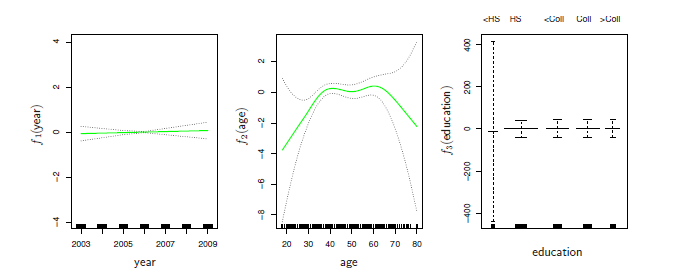

<b>FIG 8.13.</b><i>Pour les données sur les salaires, le MAG de régression logistique donné dans (7.19) est ajusté à la réponse binaire I (salaire>250). Chaque graphique affiche la fonction ajustée et les erreurs standard ponctuelles. La première fonction est linéaire en fonction de l'année, la deuxième fonction est une spline de lissage avec cinq degrés de liberté en fonction de l'âge, et la troisième est une fonction en escalier pour l'éducation. Il y a des erreurs standard très larges pour le premier niveau <HS d'éducation.</i>

Une fois encore, $f_2$ est ajusté à l'aide d'une spline de lissage avec cinq degrés de liberté, et $f_3$ est ajusté comme une fonction d'étape, en créant des variables fictives pour chacun des niveaux d'éducation. L'ajustement résultant est illustré à la $figure\ 8.13$ . Le dernier panneau semble suspect, avec des intervalles de confiance très larges pour le niveau <HS. En fait, aucune valeur de réponse n'est égale à un pour cette catégorie : aucun individu ayant un niveau d'éducation inférieur au lycée ne gagne plus de $250\ 000\ dollars$ par an. Par conséquent, nous reformulons le $GAM$ en excluant les individus n'ayant pas atteint le niveau d'études secondaires. Le modèle résultant est illustré dans la $Figure\ 8.14$ . Comme dans les $Figures\ 8.11\ et\ 8.12$, les trois panneaux ont des échelles verticales similaires. Cela nous permet d'évaluer visuellement les contributions relatives de chacune des variables. Nous observons que l'âge et l'éducation ont un effet beaucoup plus important que l'année sur la probabilité d'être un salarié à revenu élevé.