# [2. L'apprentissage statistique](#section2) #

[Retour README](../README.md)

<a name="toc"/>

[toc]

<a name="2-1"/>

## [2.1 Qu'est-ce que l'apprentissage statistique?](#2-1) ##

[Retour TOC](#toc)

[[6](https://www.statlearning.com/)] Afin de motiver notre étude de l'apprentissage statistique, nous commençons par un exemple simple. Supposons que nous soyons des consultants en statistiques engagés par un client pour étudier l'association entre la publicité et les ventes d'un produit particulier. 

L'ensemble de données sur la publicité est constitué 

1. des ventes de ce produit sur 200 marchés différents, ainsi que 
2. des budgets publicitaires du produit sur chacun de ces marchés via trois médias différents : TV, radio, et journaux. 

Ces données sont présentées à la $figure\ 2.1$. 

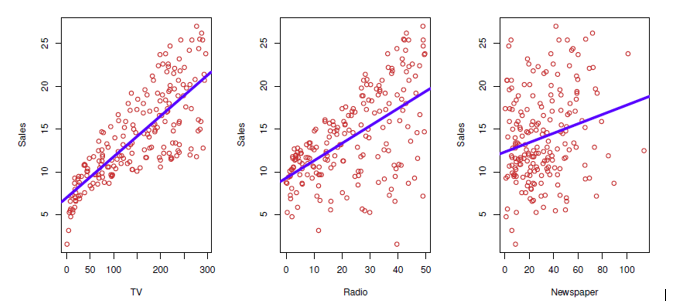
</img>

<b>FIG 2.1</b><i> ![L'ensemble de données sur la publicité. Le graphique présente les ventes, en milliers d'unités, en fonction des budgets de la télévision, de la radio et des journaux, en milliers de dollars, pour 200 marchés différents. Dans chaque graphique, nous montrons l’ajustement simple des moindres carrés des ventes à cette variable, comme décrit dans la section 4. En d'autres termes, chaque ligne bleue représente un modèle simple qui peut être utilisé pour prédire les ventes duent aux publicités via la télévision, la radio et le journal.](https://www.statlearning.com)</i>

Il n'est pas possible pour notre client d'augmenter directement les ventes du produit. En revanche, il peut contrôler les dépenses publicitaires dans chacun de ces trois médias. 

Par conséquent, si nous déterminons qu'il existe une association entre la publicité et les ventes, nous pouvons demander à notre client d'ajuster les budgets publicitaires, augmentant ainsi indirectement les ventes. En d'autres termes, notre objectif est de développer un modèle précis qui puisse être utilisé pour prédire les ventes sur la base du budget des trois médias.

Dans ce contexte, les budgets publicitaires sont des variables d'entrée tandis que les ventes sont une variable de sortie. 

**Les variables d'entrée** sont généralement désignées par le symbole $X$, avec un indice pour les distinguer. Ainsi, $X_1$ pourrait être le budget de la télévision, $X_2$ celui de la radio et $X_3$ celui des journaux. **Les entrées portent des noms** différents, tels que **prédicteurs**, **variables indépendantes**, **caractéristiques (features)**, ou parfois juste variables.

**La variable de sortie** - dans ce cas, les ventes - est souvent **appelée la réponse** ou **la variable dépendante**, et est généralement désignée par le symbole $Y$ . 

Plus généralement, supposons que nous observions une réponse quantitative $Y$ et $p$ prédicteurs différents, $X_1,X_2,..., X_p$. Nous supposons qu'il existe une relation entre $Y$ et $X=\ (X_1,X_2,...,X_p)$, qui peut s'écrire sous la forme très générale suivante $\boxed{Y=f(X)+\ \epsilon}$.

Ici, $f$ est une certaine fonction fixée mais inconnue de $X_1,...,X_p$, avec $\varepsilon$ e qui est un terme d'erreur aléatoire,  indépendant de $X$ et qui a une moyenne de zéro. 

Dans cette formule, $f$ représente l'information systématique que $X$ fournit sur $Y$ .

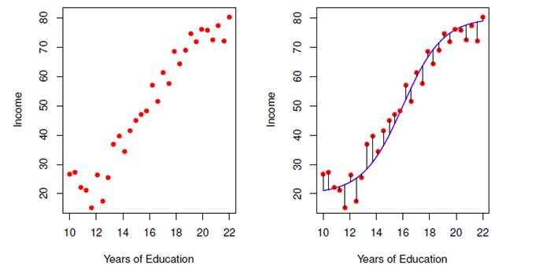
</img>

<b>FIG 2.2</b><i> ![L'ensemble de données sur le revenu. A Gauche : Les points rouges représentent les valeurs observées du revenu (en dizaines de milliers de dollars) et des années d'études pour 30 individus. A Droite. : La courbe bleue représente la véritable relation sous-jacente entre le revenu et les années d'études, qui est généralement inconnue (mais qui est connue dans ce cas car les données ont été simulées). Les lignes noires représentent l'erreur associée à chaque observation. Notez que certaines erreurs sont positives (si une observation se situe au-dessus de la courbe bleue) et d'autres sont négatives (si une observation se situe en dessous de la courbe). Globalement, ces erreurs ont une moyenne approximative de zéro.](https://www.statlearning.com)</i>

Prenons un autre exemple, celui du panneau de gauche de la $figure\ 2.2$, un graphique du revenu en fonction du nombre d'années d'études de 30 individus. Le graphique suggère que l'on pourrait être en mesure de prédire le revenu à l'aide du nombre d'années d'études. Cependant, la fonction $f$ qui relie la variable d'entrée à la variable de sortie est en général inconnue. 

Dans cette situation, on doit estimer $f$ sur la base des points observés. Puisque le revenu est un ensemble de données simulées, $f$ est connu et est représenté par la courbe bleue dans le panneau de droite de la $figure\ 2.2$. 

Les lignes verticales représentent les termes d'erreur $\boldsymbol\varepsilon$. Nous remarquons que certaines des 30 observations se situent au-dessus de la courbe bleue et d'autres en dessous (dans l'ensemble, les erreurs ont approximativement la moyenne égale à zéro). 

En général, la fonction $f$ peut impliquer plus d'une variable d'entrée. 

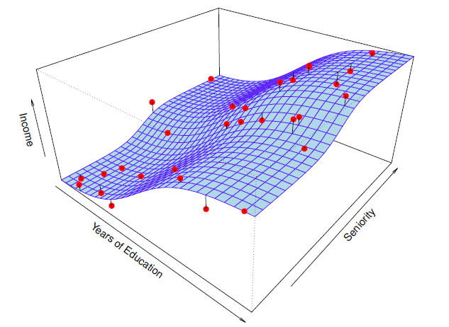
</img>

<b>FIG 2.3</b><i> </i>

Dans la $figure\ 2.3$, nous représentons le revenu en fonction des années d'études et de l'ancienneté. Ici, $f$ est une surface bidimensionnelle qui doit être estimée sur la base des données observées.

Par essence, l'apprentissage statistique fait référence à un ensemble d'approches permettant d'estimer $f$. 

Dans cette section, nous présentons certains des concepts théoriques clés qui interviennent dans l'estimation de $f$, ainsi que des outils permettant d'évaluer les estimations obtenues.

<a name="2-1-1"/>

### [2.1.1 Pourquoi estimer f ?](#2-1-1) ###

[Retour TOC](#toc)

Il y a deux raisons principales pour lesquelles nous pouvons souhaiter estimer $f$ : **la prédiction** et **l'inférence**. Nous les abordons tour à tour.

<a name="2-1-1-1"/>

#### [2.1.1.1 Prédiction](#2-1-1-1) ####

[Retour TOC](#toc)

Dans de nombreuses situations, un ensemble d'entrées $X$ est facilement disponible, mais la sortie $Y$ ne peut pas être facilement obtenue. Dans ce cas, puisque le terme d'erreur est en moyenne égal à zéro, nous pouvons prédire $Y$ en utilisant

$$
\boxed{\hat{Y}=\hat{f}(X)}
$$

où  **$\hat{f}$ représente notre estimation de $f$**, et **$\hat{Y}$ représente la prédiction résultante pour $Y$** . **Dans ce contexte, $\hat{f}$ est souvent traité comme une boîte noire**, dans le sens où l'on ne se préoccupe généralement pas de la forme exacte de l'expression $\hat{f}$, à condition qu'elle donne des prédictions précises pour $Y$ .

À titre d'exemple, supposons que $X_1,...,X_p$ soient des caractéristiques (features) sur un échantillon de sang d'un patient, qui peuvent être facilement mesurées en laboratoire, et que $Y$ soit une variable codant le risque pour le patient de subir une réaction indésirable grave à un médicament particulier.
Il est naturel de chercher à prédire $Y$ à l'aide de $X$, puisque nous pouvons alors éviter de donner le médicament en question aux patients qui présentent un risque élevé d'effet indésirable, c'est-à-dire aux patients pour lesquels l'estimation de $Y$ est élevée.

**La précision de $\hat{Y}$ comme une prédiction pour $Y$ dépend de deux quantités**, que nous appellerons **l'erreur réductible** et **l'erreur irréductible**. 

En général, **$\hat{f}$ ne sera pas une estimation parfaite de $f$,** et cette imprécision introduira une certaine erreur. **Cette erreur est réductible parce que nous pouvons potentiellement améliorer la précision de $\hat{f}$ en utilisant la technique d'apprentissage statistique la plus appropriée pour estimer $f$**. 

Cependant, même s'il était possible de former une estimation parfaite de $f$, de sorte que notre réponse estimée prenne la forme  $\hat{Y}=f(X)$, notre prédiction comporterait toujours une certaine erreur ! En effet, $Y$ est également une fonction de $\boldsymbol\varepsilon$, qui par définition ne peut être prédite à l'aide de $X$. Par conséquent, la variabilité associée à $\boldsymbol\varepsilon$ affectera également la précision de nos prédictions. C'est ce qu'on appelle **l'erreur irréductible, car quelle que soit la qualité de notre estimation de $f$, nous ne pouvons pas réduire l'erreur introduite par $\boldsymbol\varepsilon$**.

***Pourquoi l'erreur irréductible est-elle supérieure à zéro ?*** 
La quantité $\boldsymbol\varepsilon$ peut contenir des variables non mesurées qui sont utiles pour prédire $Y$ : puisque nous ne les mesurons pas, $f$ ne peut pas les utiliser pour sa prédiction. La quantité $\varepsilon$ peut également contenir des variations non mesurables. 
Par exemple, le risque d'un effet indésirable peut varier pour un patient donné, un jour donné, en fonction de la variation de fabrication du médicament lui-même ou du sentiment général de bien-être du patient ce jour-là.

Considérons une estimation donnée $\hat{f}$ et un ensemble de prédicteurs $X$, qui donne la prédiction $\hat{Y}=\hat{f}(X)$ . Supposons un instant que $\hat{f}$ et $X$ sont tous deux fixés, de sorte que la seule variabilité provient de $\boldsymbol\varepsilon$. Alors, il est facile de montrer que

$$
E(Y-\hat Y)^2 = E[f(X) + \varepsilon -\hat f(X)]^2 
$$

$$
\hspace{8.5em}= E[f(X) -\hat f(X)]^2 + VAR(\varepsilon) ,
$$

avec $E[f(X) -\hat f(X)]^2$ l'**erreur réductible** et $VAR(\varepsilon)$ **l'erreur irréductible**.

Nous avons $E(Y- \hat Y)^2$ qui représente **la moyenne** (ou valeur attendue) **du carré de la différence entre la valeur prédite et la valeur réelle de $𝑌$** , et $𝑉𝑎𝑟(𝜖)$ qui **représente la variance associée au terme d'erreur $\boldsymbol\varepsilon$** (mesure la dispersions des échantillons autour de la moyenne associées à l'erreur irréductible). 

**Nous nous concentrons sur les techniques d'estimation de $𝑓$ dans le but de minimiser l'erreur réductible**. Il est important de garder à l'esprit que **l'erreur irréductible fournira toujours une limite supérieure à la précision de notre prédiction pour $𝑌$** . Cette limite est presque toujours inconnue dans la pratique.

<a name="2-1-1-2"/>

#### [2.1.1.2 Inférence](#2-1-1-2) ####

[Retour TOC](#toc)

Nous sommes souvent intéressés par la compréhension de l'association entre $Y$ et $X_1,...,X_p$. Dans cette situation, nous souhaitons estimer $f$, mais notre objectif n'est pas uniquement de faire des prédictions pour $Y$ , et donc $\hat{f}$ ne peut pas être traitée comme une boîte noire, car nous devons connaître sa forme exacte. Dans ce cadre, on peut être intéressé à répondre aux questions suivantes.

***Quels prédicteurs sont associés à la réponse ?*** 
Il arrive souvent que seule une petite fraction des prédicteurs disponibles soit substantiellement associée à $Y$ . Identifier les quelques prédicteurs importants parmi un large ensemble de variables possibles peut être extrêmement utile, selon l'application.

***Quelle est la relation entre la réponse et chaque prédicteur ?*** 
Certains prédicteurs peuvent avoir une relation positive avec $Y$ , en ce sens que des valeurs plus élevées du prédicteur sont associées à des valeurs plus élevées de $Y$ . D'autres prédicteurs peuvent avoir une relation inverse. Selon la complexité de $f$ , la relation entre la réponse et un prédicteur donné peut également dépendre des valeurs des autres prédicteurs. 

**La relation entre $Y$ et chaque prédicteur peut-elle être résumée de manière adéquate à l'aide d'une équation linéaire, ou la relation est-elle plus compliquée ?** 
Historiquement, la plupart des méthodes d'estimation de $f$ ont pris une forme linéaire. Dans certaines situations, une telle hypothèse est raisonnable ou même souhaitable. Mais souvent, la relation réelle est plus compliquée, auquel cas un modèle linéaire peut ne pas fournir une représentation précise de la relation entre les variables d'entrée et de sortie.

Nous verrons un certain nombre d'exemples qui relèvent du cadre de la prédiction, de l'inférence ou d'une combinaison des deux.

<a name="2-1-1-3"/>

#### [2.1.1.3 Exemple sur la prédiction et l'inférence](#2-1-1-3) ####

[Retour TOC](#toc)

Prenons l'exemple d'une entreprise qui souhaite mener une campagne de marketing direct. L'objectif est d'identifier les individus qui sont susceptibles de répondre positivement à un mailing, en se basant sur l'observation de variables démographiques mesurées sur chaque individu. Dans ce cas, les variables démographiques servent de prédicteurs, et la réponse à la campagne de marketing (positive ou négative) sert de résultat. 

1. Soit, l'entreprise n'est pas intéressée par l'obtention d'une compréhension profonde des relations entre chaque prédicteur individuel et la réponse. Elle veut simplement prédire avec précision la réponse en utilisant les prédicteurs. **Il s'agit d'un exemple de modélisation pour la prédiction**.

2. En revanche, considérons les données publicitaires illustrées à la $figure\ 2.1$. On peut souhaiter répondre à des questions telles que :

   - ​	Quels médias sont associés aux ventes ?
   - ​	Quels sont les médias qui génèrent la plus forte augmentation des ventes ? ou
   - ​	Quelle est l'ampleur de l'augmentation des ventes associée à une augmentation donnée de la publicité télévisée ?

   Cette situation relève du paradigme de l'inférence

Un autre exemple consiste à modéliser la marque d'un produit qu'un client pourrait acheter en fonction de variables telles que le prix, l'emplacement du magasin, les niveaux de remise, le prix de la concurrence, etc. Dans cette situation, on pourrait vraiment s'intéresser à l'association entre chaque variable et la probabilité d'achat. Par exemple, dans quelle mesure le prix du produit est-il associé aux ventes ? **Il s'agit d'un exemple de modélisation pour l'inférence.**

Enfin, certaines modélisations peuvent être effectuées **à la fois pour la prédiction et l'inférence**. Par exemple, dans un contexte immobilier, on peut chercher à relier la valeur des maisons à des données telles que le taux de criminalité, le zonage, la distance par rapport à une rivière, la qualité de l'air, les écoles, le niveau de revenu de la communauté, la taille des maisons, etc. Dans ce cas, on peut s'intéresser à l'association entre chaque variable d'entrée individuelle et le prix du logement - par exemple, quelle sera la valeur supplémentaire d'une maison si elle a une vue sur la rivière ? I**l s'agit d'un problème d'inférence**. On peut aussi simplement s'intéresser à la prédiction de la valeur d'une maison en fonction de ses caractéristiques : cette maison est-elle sous- ou sur-évaluée ? **Il s'agit d'un problème de prédiction**.

Selon que notre objectif ultime est la prédiction, l'inférence ou une combinaison des deux, différentes méthodes d'estimation de $f$ peuvent être appropriées ;

- **les modèles linéaires** permettent **une inférence relativement simple** et interprétable, mais peuvent **ne pas donner des prédictions aussi précises** que certaines autres approches. 
- En revanche, certaines **des approches hautement non linéaires** que nous abordons dans les dernières sections peuvent potentiellement **fournir des prédictions assez précises pour $Y$,** mais cela se fait au prix d'un modèle moins interprétable pour lequel **l'inférence est plus difficile**.

<a name="2-1-2"/>

### [2.1.2 Comment estimer f ?](#2-1-2) ###

[Retour TOC](#toc)

Nous explorons de nombreuses approches linéaires et non linéaires pour estimer $f$. Cependant, ces méthodes partagent généralement certaines caractéristiques communes. Nous supposerons toujours que nous avons observé un ensemble de $n$ points de données différentes. Par exemple, dans la $figure\ 2.2$, nous avons observé $n=30$ points de données. **Ces observations sont appelées données d'apprentissage** parce que nous allons les utiliser pour entraîner, ou apprendre, à notre méthode comment estimer $f$. 

Les données $x_{ij}$  représentent la valeur du $j^{ème}$ prédicteur (ou entrée) pour l'observation $i$, où $i=1,\ 2,...,n$ et $j=1,\ 2,...,p$. 

Par conséquent, $y_i$ représente la variable de réponse pour la $i^{ème}$ observation et nos données d'apprentissage consistent alors en ${(x_1,y_1),\ (x_2,y_2),...,\ (x_n,y_n)}$ où $x_i\ =\left(x_{i1},x_{i2},...,x_{ip}\right)^T $. 

**Notre objectif est d'appliquer une méthode d'apprentissage statistique aux données d'apprentissage afin d'estimer la fonction inconnue $f$**. 
En d'autres termes, nous voulons trouver une fonction $\hat{f}$ telle que $Y\approx\hat{f}(X)$ pour toute observation $(X,\ Y)$. 

**De manière générale, la plupart des méthodes d'apprentissage statistique pour cette tâche peuvent être caractérisées comme étant paramétriques ou non-paramétriques.** 

<a name="2-1-2-1"/>

#### [2.1.2.1 Méthodes paramétriques](#2-1-2-1) ####

[Retour TOC](#toc)

Les méthodes paramétriques impliquent une approche basée sur un modèle en deux étapes.

1. **Premièrement, nous faisons une hypothèse sur la forme fonctionnelle (ou forme) de $f$**. Par exemple, une hypothèse très simple est que f est linéaire en $X$ : 

$$
f\left(X\right)=\beta_0+\beta_1X_1+\beta_2X_2\ldots+\beta_pX_p.\hspace{6em}(2.1)
$$

$\hspace{2 em}$Il s'agit d'un modèle linéaire. Dès que nous avons supposé que $f$ est linéaire, le problème de l'estimation de $f$ est grandement simplifié. 

$\hspace{2 em}$Au lieu de devoir estimer une fonction $f(X)$ qui est $p{-}dimensionnelle$ entièrement arbitraire , il suffit d'estimer les $p+1$ 

$\hspace{2 em}$coefficients $\beta_0,\beta_1, . . . ,\beta_p$. 

2. Après avoir sélectionné un modèle, **nous avons besoin d'une procédure qui utilise les données d'apprentissage pour ajuster ou entraîner le modèle**. Dans le cas du modèle linéaire, nous devons estimer les paramètres $\beta_0,\beta_1,\ .\ .\ .\ ,\beta_p$. Autrement dit, nous voulons trouver des valeurs de ces paramètres telles que 

$$
Y\approx\beta_0+\beta_1X_1+\beta_2X_2+\ldots+\beta_pX_p.
$$

L'approche la plus courante pour ajuster le modèle (2.1) est **la méthode des moindres carrés** , que nous abordons plus loin dans ce document. 

Les moindres carrés sont l'une des nombreuses façons possibles d'ajuster le modèle linéaire. A savoir qu'il existe d'autres approches pour estimer les paramètres de (2.1).

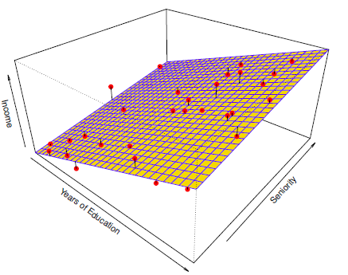
</img>

<b>FIG 2.4</b><i> </i>   

L'approche basée sur le modèle que nous venons de décrire est dite paramétrique ; elle réduit le problème de l'estimation de $f$ à celui de l'estimation d'un ensemble de paramètres. 

Le fait de supposer une forme paramétrique pour $f$ simplifie le problème de l'estimation de $f$ car il est généralement beaucoup plus facile d'estimer un ensemble de paramètres, tels que $\beta_0,\beta_1,\ .\ .\ .\ ,\beta_p$ dans le modèle linéaire (2.1), que d'ajuster une fonction $f$ entièrement arbitraire. 

**L'inconvénient potentiel d'une approche paramétrique est que le modèle que nous choisissons ne correspondra généralement pas à la véritable forme inconnue de $f$**. Si le modèle choisi est trop éloigné de la véritable $f$, notre estimation sera mauvaise. **Nous pouvons essayer de résoudre ce problème en choisissant des modèles flexibles qui peuvent s'adapter à de nombreuses formes fonctionnelles différentes pour $f$**. 

Mais en général, **l'adaptation d'un modèle plus flexible nécessite l'estimation d'un plus grand nombre de paramètres**. **Ces modèles plus complexes peuvent conduire à un phénomène connu sous le nom d'ajustement excessif des données, ce qui signifie essentiellement qu'ils suivent les erreurs, ou le bruit, de trop près** (**overfitting**). 

La $figure\ 2.4$ présente un exemple de l'approche paramétrique appliquée aux données de revenu de la $figure\ 2.3$. Nous avons ajusté un modèle linéaire de la forme 

$$
income\ \approx\ \beta_0\ +\ \beta_1\ \times\ education\ +\ \beta_2\ \times\ seniority.
$$

Puisque nous avons supposé une relation linéaire entre la réponse et les deux prédicteurs, l'ensemble du problème d'ajustement se réduit à l'estimation de $\beta_0,\ \beta_1 et \beta_2$ , ce que nous faisons à l'aide de la régression linéaire par les moindres carrés. 

**En comparant la $figure\ 2.3$ à la $figure\ 2.4$, nous pouvons constater que l'ajustement linéaire donné dans la $figure\ 2.4$ n'est pas tout à fait correct : le véritable $f$ présente une certaine courbure qui n'est pas prise en compte dans l'ajustement linéaire.**

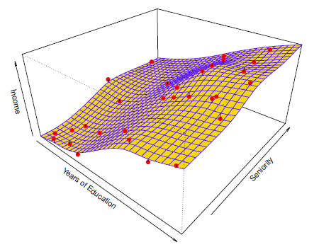
</img>

<b>FIG 2.5</b><i> </i>  

Toutefois, l'ajustement linéaire semble encore bien rendre compte de la relation positive entre les années d'études et le revenu, ainsi que de la relation légèrement moins positive entre l'ancienneté et le revenu. Il se peut qu'avec un si petit nombre d'observations, ce soit le mieux que nous puissions faire.

<a name="2-1-2-2"/>

#### [2.1.2.2 Méthodes non paramétriques](#2-1-2-2) ####

[Retour TOC](#toc)

**Les méthodes non paramétriques ne font pas d'hypothèses explicites sur la forme fonctionnelle de $f$. Elles cherchent plutôt à obtenir une estimation de $f$ qui se rapproche le plus possible des points de données, sans être trop grossière ou ondulée.** 

**Ces approches peuvent présenter un avantage majeur par rapport aux approches paramétriques** : en évitant l'hypothèse d'une forme fonctionnelle particulière pour $f$, **elles ont la possibilité d'ajuster avec précision un plus grand nombre de formes possibles pour $f$.** 

**Toute approche paramétrique comporte la possibilité que la forme fonctionnelle utilisée pour estimer $f$ soit très différente de la vraie fonction $f$**, auquel cas le modèle résultant ne s'ajustera pas bien aux données. 

En revanche, les approches non paramétriques évitent complètement ce danger, puisqu'aucune hypothèse sur la forme de $f$ n'est formulée. 
Mais **les approches non paramétriques souffrent d'un inconvénient majeur** : comme elles ne réduisent pas le problème de l'estimation de $f$ à un petit nombre de paramètres, **il faut un très grand nombre d'observations** (bien plus que ce qui est généralement nécessaire pour une approche paramétrique) **pour obtenir une estimation précise de $f$**. 

La $figure\ 2.5$ présente un exemple d'approche non paramétrique de l'ajustement des données du revenu. Une spline à plaque mince est utilisée pour estimer $f$. Cette approche n'impose pas de modèle pré-spécifié pour $f$. Elle tente plutôt de produire une estimation pour f qui soit aussi proche que possible des données observées, à condition que l'ajustement - c'est-à-dire la surface jaune de la $figure\ 2.5$ - soit lisse. 

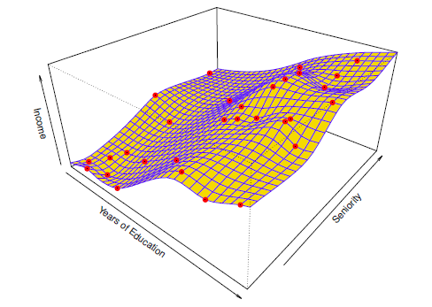
</img>

<b>FIG 2.6</b><i> </i>  

Dans ce cas, l'ajustement non paramétrique a permis d'obtenir une estimation remarquablement précise de la vraie $f$ illustrée à la $figure\ 2.3$. Afin d'ajuster une spline à plaque mince, l'analyste de données doit sélectionner un niveau de lissage. La $figure\ 2.6$ montre le même ajustement spline à plaque mince en utilisant un niveau de lissage plus faible, permettant un ajustement plus grossier. 

L'estimation qui en résulte correspond parfaitement aux données observées !  Cependant, l'ajustement spline illustré à la $figure\ 2.6$ est beaucoup plus variable que la fonction réelle $f$, de la $figure\ 2.3$. **Il s'agit d'un exemple d'ajustement excessif des données, dont nous avons parlé précédemment.** 

Il s'agit d'une situation indésirable car l'ajustement obtenu ne donnera pas d'estimations précises de la réponse sur de nouvelles observations qui ne faisaient pas partie de l'ensemble de données d'apprentissage initial.

 Comme nous l'avons vu, les méthodes paramétriques et non paramétriques d'apprentissage statistique présentent des avantages et des inconvénients. 

<a name="2-1-3"/>

### [2.1.3. Le compromis entre la précision de la prédiction et l'interprétation du modèle Interprétable](#2-1-3) ###

[Retour TOC](#toc)

Parmi les nombreuses méthodes que nous examinons, certaines sont moins flexibles, ou plus restrictives, dans le sens où elles ne peuvent produire qu'une gamme relativement restreinte de formes pour estimer $f$. Par exemple, **la régression linéaire** **est une approche relativement peu flexible**, car elle ne peut générer que des fonctions linéaires telles que les lignes illustrées à la $figure\ 2.1$ ou le plan illustré à la $figure\ 2.4.$  D'autres méthodes, telles que les splines à plaques minces illustrées aux $figures\ 2.5\ et\ 2.6$, sont beaucoup plus souples car elles peuvent générer un éventail beaucoup plus large de formes possibles pour estimer $f$. 

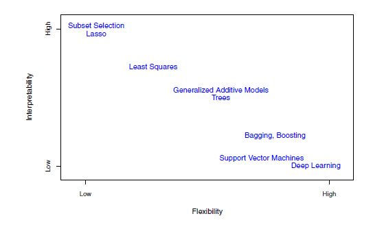
</img>

<b>FIG 2.7</b><i> </i>

On peut raisonnablement se poser la question suivante : **pourquoi choisir d'utiliser une méthode plus restrictive plutôt qu'une approche très souple ?**  Il existe plusieurs raisons pour lesquelles nous pourrions préférer un modèle plus restrictif.  Si nous sommes principalement intéressés par l'inférence, les modèles restrictifs sont beaucoup plus faciles à interpréter. Par exemple, lorsque l'inférence est l'objectif, le modèle linéaire peut être un bon choix car il sera assez facile de comprendre la relation entre $Y$ et $X_1,X_2\ ,\ .\ .\ .\ ,X_p$. 

En revanche, les approches très flexibles, telles que les splines présentées aux $figures\ 2.5\ et\ 2.6$ ainsi que les méthodes de boosting, peuvent conduire à des estimations de $f$ si compliquées qu'il est difficile de comprendre comment chaque prédicteur individuel est associé à la réponse.  

***Remarques:***  En mathématiques appliquées et en analyse numérique, [[13](https://fr.wikipedia.org/wiki/Spline)] **une spline** est une fonction définie par morceaux par des polynômes. Dans les problèmes d'interpolation, la méthode des splines est très souvent préférée à l'interpolation polynomiale. Les splines sont également utilisées dans les problèmes de lissage de données expérimentales ou de statistiques. Les splines sont utilisées pour représenter numériquement des contours complexes. Leur mise en œuvre est simple. [[14](https://fr.wikipedia.org/wiki/Boosting,"*Boosting)] **Le boosting** est un domaine de l'apprentissage automatique. C'est un principe qui regroupe de nombreux algorithmes qui s'appuient sur des ensembles de classifieurs binaires : le boosting optimise leurs performances. 

La $figure\ 2.7$ illustre le compromis entre flexibilité et interprétabilité pour certaines méthodes.

La **régression linéaire par les moindres carrés est relativement peu flexible mais tout à fait interprétable.** 

**Le lasso** s'appuie sur le modèle linéaire (2.4) mais utilise une procédure d'ajustement alternative pour estimer les coefficients $\beta_0,\beta_1,\ .\ .\ .\ ,\beta_p$. La nouvelle procédure est plus restrictive dans l'estimation des coefficients, et fixe un certain nombre d'entre eux à exactement zéro. 

Ainsi, dans ce sens, **le lasso est une approche moins flexible que la régression linéaire**.  Elle est également plus facile à interpréter que la régression linéaire, car dans le modèle final, la variable de réponse ne sera liée qu'à un petit sous-ensemble de prédicteurs, à savoir ceux dont les coefficients sont estimés non nuls. 

**Les modèles additifs généralisés** (**MAG**) étendent plutôt le modèle linéaire (2.4) pour permettre certaines relations non linéaires. Par conséquent, **les MAG sont plus flexibles que la régression linéaire**. Ils sont également **un peu moins interprétables que la régression linéaire**, car la relation entre chaque prédicteur et la réponse est maintenant modélisée par une courbe. 

Enfin, **les méthodes entièrement non linéaires telles que le bagging, le boosting, les machines à vecteurs de support avec des noyaux non linéaires et les réseaux neuronaux (apprentissage profond)  sont des approches très flexibles mais plus difficiles à interpréter.** 

Nous avons établi que lorsque l'inférence est l'objectif, il y a des avantages évidents à utiliser des méthodes d'apprentissage statistique simples et relativement peu flexibles.  

Dans certains cas, cependant, nous ne sommes intéressés que par la prédiction, et l'interprétabilité du modèle prédictif n'est tout simplement pas importante. Par exemple, si nous cherchons à développer un algorithme pour prédire le prix d'une action, notre seule exigence pour l'algorithme est qu'il prédise avec précision - l'interprétabilité n'est pas une préoccupation. Dans ce contexte, on pourrait s'attendre à ce qu'il soit préférable d'utiliser le modèle le plus flexible disponible. 

**Étonnamment, ce n'est pas toujours le cas ! Nous obtiendrons souvent des prédictions plus précises en utilisant une méthode moins flexible. Ce phénomène, qui peut sembler contre-intuitif à première vue, est lié au potentiel d'overfitting des méthodes très flexibles.** Nous avons vu un exemple d'overfitting à la $figure\ 2.6$. 

<a name="2-1-4"/>

### [2.1.4 Apprentissage supervisé et apprentissage non supervisé](#2-1-4) ###

[Retour TOC](#toc)

La plupart des problèmes d'apprentissage statistique entrent dans l'une des deux catégories suivantes : **supervisé ou non supervisé**. Les exemples que nous avons abordés jusqu'à présent dans cette section relèvent tous du domaine de l'apprentissage supervisé. Pour chaque observation des mesures du prédicteur $x_i$, $i=1,\ .\ .\ .\ n$ , il existe une mesure de réponse associée ${y}_{i}$. 

Nous souhaitons ajuster un modèle qui relie la réponse aux prédicteurs, dans le but de prédire avec précision la réponse pour les observations futures (prédiction) ou de mieux comprendre la relation entre la réponse et les prédicteurs (inférence). 

De nombreuses méthodes classiques d'apprentissage statistique, telles que la régression linéaire et la régression logistique, ainsi que des approches plus modernes telles que les $MAG$ , le $boosting$ et les $machines\ à\ vecteurs\ de\ support$, fonctionnent dans le domaine de l'apprentissage supervisé.  

En revanche, l'apprentissage non supervisé décrit la situation un peu plus difficile dans laquelle pour chaque observation ${i}={1},\ .\ .\ .\ ,{n}$, nous observons un vecteur de mesures $x_i$ mais pas de réponse associée $y_i$. 

Il n'est pas possible d'ajuster un modèle de régression linéaire, puisqu'il n'y a pas de variable de réponse à prédire. Dans ce contexte, nous travaillons en quelque sorte à l'aveugle ; la situation est qualifiée de non supervisée parce qu'il nous manque une variable de réponse qui puisse superviser notre analyse. 

**Quel type d'analyse statistique est possible ?** 
**Nous pouvons chercher à comprendre les relations entre les variables ou entre les observations**. Un outil d'apprentissage statistique que nous pouvons utiliser dans ce contexte est l'analyse en grappes, ou clustering. L'objectif de l'analyse en clustering est de déterminer, sur la base de $x_1,...,x_n$, si les observations appartiennent à des groupes relativement distincts. Par exemple, dans une étude de segmentation de marché, nous pouvons observer de multiples caractéristiques (variables) de clients potentiels, telles que le code postal, le revenu familial et les habitudes d'achat. Nous pouvons penser que les clients appartiennent à des groupes différents, tels que les gros dépensiers et les petits dépensiers. Si les informations sur les habitudes de consommation de chaque client étaient disponibles, une analyse supervisée serait alors possible. Cependant, ces informations ne sont pas disponibles, c'est-à-dire que nous ne savons pas si chaque client potentiel est un gros dépensier ou non. Dans ce cas, nous pouvons essayer de regrouper les clients sur la base des variables mesurées, afin d'identifier des groupes distincts de clients potentiels. L'identification de ces groupes peut s'avérer intéressante car il se peut que les groupes diffèrent en ce qui concerne certaines propriétés intéressantes, comme les habitudes de consommation. 

La $figure\ 2.8$ fournit une illustration simple du problème de clustering. 

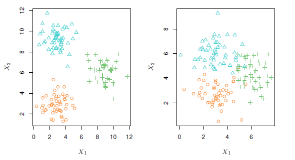
</img>

<b>FIG 2.8</b><i> </i>

Nous avons représenté 150 observations avec des mesures sur deux variables, $X_1$ et $X_2$. Chaque observation correspond à l'un des trois groupes distincts. A des fins d'illustration, nous avons représenté les membres de chaque groupe par des couleurs et des symboles différents. Cependant, dans la pratique, les appartenances aux groupes sont inconnues, et l'objectif est de déterminer le groupe auquel appartient chaque observation. 

Dans le panneau de gauche de la $figure\ 2.8$, cette tâche est relativement facile car les groupes sont bien séparés. En revanche, le panneau de droite illustre une situation plus difficile dans laquelle il y a un certain chevauchement entre les groupes. On ne peut s'attendre à ce qu'une méthode de clustering affecte tous les points qui se chevauchent au bon groupe (bleu, vert ou orange).  

Dans les exemples présentés à la $figure\ 2.8$, il n'y a que deux variables, et on peut donc simplement inspecter visuellement les nuages de points des observations afin d'identifier les groupes. Cependant, dans la pratique, nous rencontrons souvent des ensembles de données qui contiennent beaucoup plus de deux variables. Dans ce cas, nous ne pouvons pas facilement tracer les observations. Par exemple, s'il y a $p$ variables dans notre ensemble de données, alors $p(p-1)/2$ diagrammes de dispersion distincts peuvent être réalisés, et l'inspection visuelle n'est tout simplement pas un moyen viable d'identifier les clusters. 

**C'est pourquoi les méthodes de clustering automatisées sont importantes.** 

De nombreux problèmes tombent naturellement dans le paradigme de l'apprentissage supervisé ou non supervisé. Cependant, la question de savoir si une analyse doit être considérée comme supervisée ou non supervisée est parfois moins évidente. Par exemple, supposons que nous ayons un ensemble de $n$ observations et pour $m$ des observations, où $m < n$, nous avons à la fois les mesures du prédicteur et une mesure de la réponse et pour les $n{-}m$ observations restantes, nous avons des mesures du prédicteur mais pas de mesure de la réponse. 

Un tel scénario peut se produire si les prédicteurs peuvent être mesurés à un coût relativement faible mais que les réponses correspondantes sont beaucoup plus coûteuses à collecter. Nous appelons cette situation un problème d'apprentissage semi-supervisé. Dans ce contexte, nous souhaitons utiliser une méthode d'apprentissage statistique qui peut incorporer les $m$ observations pour lesquelles des mesures de réponse sont disponibles ainsi que les $n{-}m$ observations pour lesquelles elles ne le sont pas. 

<a name="2-1-5"/>

### [2.1.5  Problèmes de régression et de classification](#2-1-5) ###

[Retour TOC](#toc)

Les variables peuvent être caractérisées comme étant quantitatives ou qualitatives (également appelées catégoriques). Les variables quantitatives prennent des valeurs numériques, par exemple l'âge, la taille ou le revenu d'une personne, la valeur d'une maison ou le prix d'une action. 

En revanche, les variables qualitatives prennent des valeurs dans l'une des $K{-}classes$ ou catégories différentes. Parmi les exemples de variables qualitatives, citons l'état civil d'une personne (mariée ou non), la marque d'un produit acheté ( marque $A$, $B$ ou $C$ ), le fait qu'une personne ne rembourse pas une dette (oui ou non) ou le diagnostic d'un cancer (leucémie myélogène aiguë, leucémie lymphoblastique aiguë ou pas de leucémie). 

**Nous avons tendance à désigner les problèmes comportant une réponse quantitative comme des problèmes de régression, tandis que ceux impliquant une réponse qualitative sont souvent appelés des problèmes de classification.** Toutefois, la distinction n'est pas toujours aussi nette. 

**La régression linéaire par les moindres carrés est utilisée avec une réponse quantitative**, tandis que **la régression logistique est généralement utilisée avec une réponse qualitative** (à deux classes ou binaire). Ainsi, malgré son nom, **la régression logistique est une méthode de classification**. **Mais comme elle estime les probabilités de classe, elle peut également être considérée comme une méthode de régression**. 

Certaines méthodes statistiques, telles que les ${K}{-}nearestneighbors$  et le $boosting$, peuvent être utilisées dans le cas de réponses quantitatives ou qualitatives.  

Nous avons tendance à sélectionner les méthodes d'apprentissage statistique en fonction du caractère quantitatif ou qualitatif de la réponse, c'est-à-dire que nous pouvons utiliser la régression linéaire dans le cas de réponses quantitatives et la régression logistique dans le cas de réponses qualitatives. 

Cependant, le fait que les prédicteurs soient qualitatifs ou quantitatifs est généralement considéré comme moins important. La plupart des méthodes d'apprentissage statistique peuvent être appliquées quel que soit le type de variable prédictive, à condition que les prédicteurs qualitatifs soient correctement codés avant la réalisation de l'analyse.

<a name="2-2"/>

## [2.2 Évaluation de la précision du modèle](#2-2) ##

[Retour TOC](#toc)

**Pourquoi est-il nécessaire de présenter autant d'approches d'apprentissage statistique différentes, plutôt que de se contenter d'une seule méthode optimale ?** 
Aucune méthode ne domine toutes les autres sur tous les ensembles de données possibles. Sur un ensemble de données particulier, une méthode spécifique peut être la plus efficace, mais une autre méthode peut être plus efficace sur un ensemble de données similaire mais différent. 

Il est donc important de décider, pour un ensemble de données donné, quelle méthode produit les meilleurs résultats. **Le choix de la meilleure approche peut être l'un des aspects les plus difficiles de l'apprentissage statistique dans la pratique.**  

Dans cette section, nous abordons certains des concepts les plus importants qui interviennent dans la sélection d'une procédure d'apprentissage statistique pour un ensemble de données spécifique. 

<a name="2-2-1"/>

### [2.2.1.  Mesurer la qualité de l'ajustement](#2-2-1) ###

[Retour TOC](#toc)

Afin d'évaluer la performance d'une méthode d'apprentissage statistique sur un ensemble de données donné, il faut pouvoir mesurer dans quelle mesure ses prédictions correspondent aux données observées. Autrement dit, nous devons quantifier la mesure dans laquelle la valeur de réponse prédite pour une observation donnée est proche de la valeur de réponse réelle pour cette observation. 

Dans le cadre de la régression, la mesure la plus couramment utilisée est **l'erreur quadratique moyenne** (**EQM**), donnée par 

$$
EQM = \frac{1}{n}\sum_{i=n}^n(y_i - \hat{f} (x_i))^2, \hspace{6em} (2.5)
$$

où  $\hat{f} (x_i)$ est la prédiction que $\hat{f}$ donne pour la $i^{ème}$ observation. L'**EQM** sera faible si les réponses prédites sont très proches des réponses réelles, et sera grande si pour certaines des observations, les réponses prédites et réelles diffèrent considérablement.  L'**EQM** dans (2.5) est calculée à l'aide des données d'apprentissage qui ont été utilisées pour ajuster le modèle, et devrait donc être appelée plus précisément l'**EQM** d'apprentissage. 

Mais en général, nous ne nous soucions pas vraiment de l'efficacité de la méthode sur les données d'apprentissage. Nous nous intéressons plutôt à la précision des prédictions que nous obtenons lorsque nous appliquons notre méthode à des données de test inédites. 

**Pourquoi cela nous intéresse-t-il ?** 
Supposons que nous soyons intéressés par le développement d'un algorithme permettant de prédire le prix d'une action en fonction des rendements boursiers précédents. Nous pouvons entraîner la méthode en utilisant les rendements boursiers des six derniers mois. Mais la capacité de notre méthode à prédire le prix de l'action de la semaine dernière ne nous intéresse pas vraiment. Nous nous intéressons plutôt à sa capacité à prédire le prix de demain ou du mois prochain. 

Dans le même ordre d'idées, supposons que nous disposions de mesures cliniques (poids, pression artérielle, taille, âge, antécédents familiaux de maladie) pour un certain nombre de patients, ainsi que des observations indiquant si chaque patient est diabétique. Nous pouvons utiliser ces patients pour former une méthode d'apprentissage statistique permettant de prédire le risque de diabète sur la base des mesures cliniques. 
En pratique, nous voulons que cette méthode prédise avec précision le risque de diabète pour les futurs patients sur la base de leurs mesures cliniques. Nous ne sommes pas très intéressés par le fait que la méthode prédise avec précision ou non le risque de diabète pour les patients utilisés pour former le modèle, puisque nous savons déjà lesquels de ces patients sont diabétiques.  

Pour exprimer cela de manière plus mathématique, supposons que nous ajustons notre méthode d'apprentissage statistique sur nos observations d’apprentissage ${(x_1,\ y_1),\ (x_2,\ y_2),...,\ (x_n,\ y_n)}$, et nous obtenons l’estimation $\hat f$. Nous pouvons alors calculer $\hat f(x_1),\hat f(x_2), . . . , \hat f(x_n)$.  Si ces valeurs sont approximativement égales à $y_1, y_2, . . . , y_n$, alors le **EQM** d’apprentissage donné par (2.5) est petit. 

Cependant, nous ne sommes pas vraiment intéressés par le fait de savoir si $\hat f(x_i) \approx y_i$ ; au lieu de cela, nous voulons savoir si $\hat f(x_0)$ est approximativement égal à $y_0$, où $(x_0, y_0)$ est une observation test non vue précédemment et non utilisée pour entraîner **la méthode d'apprentissage statistique**. **Nous voulons choisir la méthode qui donne le EQM de test le plus bas, par opposition au EQM d'apprentissage le plus bas.** 

En d'autres termes, si nous avions un grand nombre d'observations de test, nous pourrions calculer 

$$
Ave(y_0 - \hat{f} (x_0))^2
$$

**l'erreur quadratique moyenne de prédiction** pour ces observations de test $(x_0, y_0)$. Nous aimerions sélectionner le modèle pour lequel cette quantité est la plus petite possible.  

**Comment pouvons-nous essayer de sélectionner une méthode qui minimise l'EQM de test ?** 
Dans certains cas, nous pouvons disposer d'un ensemble de données de test, c'est-à-dire que nous pouvons avoir accès à un ensemble d'observations qui n'ont pas été utilisées pour entraîner la méthode d'apprentissage statistique. Nous pouvons alors simplement évaluer (2.6) sur les observations de test, et sélectionner la méthode d'apprentissage pour laquelle l'**EQM** de test est la plus petite. 

**Mais que se passe-t-il si aucune observation de test n'est disponible ?** 
Dans ce cas, on pourrait imaginer de sélectionner simplement une méthode d'apprentissage statistique qui minimise l'**EQM** d’apprentissage (2.5). Cela semble être une approche judicieuse, puisque l'**EQM** d'apprentissage et l'**EQM** de test semblent être étroitement liées.

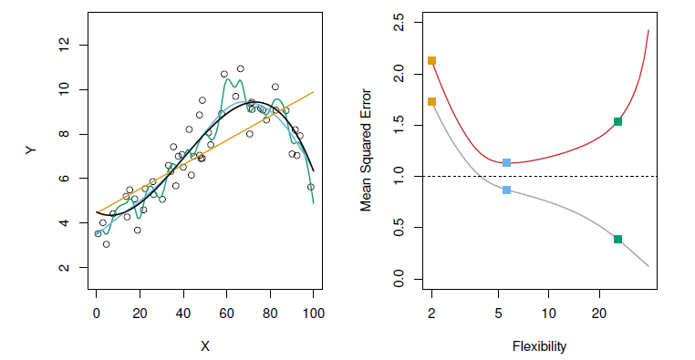
</img>

<b>FIG 2.9</b><i> </i>

Malheureusement, cette stratégie pose un problème fondamental, rien ne garantit que la méthode présentant l'**EQM** d'apprentissage la plus faible aura également l'**EQM** de test la plus faible. En gros, le problème est que de nombreuses méthodes statistiques estiment spécifiquement les coefficients de manière à minimiser l'**EQM** de l'ensemble d'apprentissage. Pour ces méthodes, l'**EQM** de l'ensemble d'apprentissage peut être assez faible, mais l'**EQM** du test est souvent beaucoup plus importante.  

La $figure\ 2.9$ illustre ce phénomène sur un exemple simple. Dans le panneau de gauche de la $figure\ 2.9$, nous avons généré des observations à partir de (2.1) avec le vrai $f$ donné par la courbe noire. Les courbes orange, bleue et verte illustrent trois estimations possibles de $f$ obtenues à l'aide de méthodes présentant des niveaux de flexibilité croissants. 

- La ligne orange représente l'ajustement par régression linéaire, qui est relativement peu flexible. 
- Les courbes bleue et verte ont été produites à l'aide de splines de lissage avec différents niveaux de lissage. Il est clair que plus le niveau de flexibilité augmente, plus les courbes s'ajustent aux données observées. La courbe verte est la plus flexible et s'adapte très bien aux données ; cependant, nous observons qu'elle s'adapte mal au vrai $f$ (représenté en noir) car elle est trop ondulée. En ajustant le niveau de flexibilité de l'ajustement par spline de lissage, nous pouvons produire de nombreux ajustements différents pour ces données.  

Nous passons maintenant au panneau de droite de la $figure\ 2.9$. La courbe grise affiche l'**EQM** moyenne de l'apprentissage en fonction de la flexibilité ou plus formellement des degrés de liberté pour un certain nombre de splines de lissage. **Les degrés de liberté sont une quantité qui résume la flexibilité d'une courbe**.

Les carrés orange, bleus et verts indiquent les **EQM** associées aux courbes correspondantes dans le panneau de gauche. Une courbe plus restreinte et donc plus lisse possède moins de degrés de liberté qu'une courbe ondulée - notez que dans la $figure\ 2.9$, la régression linéaire se situe à l'extrémité la plus restrictive, avec deux degrés de liberté. 

**L'EQM d'apprentissage diminue de façon monotone à mesure que la flexibilité augmente.** 

Dans cet exemple, le véritable $f$ n'est pas linéaire, et l'ajustement linéaire orange n'est donc pas assez flexible pour estimer $f$ correctement. 

La courbe verte présente l'**EQM** d'apprentissage la plus faible des trois méthodes, car elle correspond à la plus flexible des trois courbes ajustées dans le panneau de gauche. 

Dans cet exemple, nous connaissons la vraie fonction $f$, et nous pouvons donc également calculer le **EQM** de test sur un très grand ensemble de test, en fonction de la flexibilité (le **EQM** de test est représenté par la courbe rouge dans le panneau de droite de la $figure\ 2.9$). Comme pour l'**EQM** d'entraînement, l'**EQM** de test diminue initialement à mesure que le niveau de flexibilité augmente. Cependant, à un moment donné, le **EQM** de test se stabilise, puis recommence à augmenter. Par conséquent, 

- les courbes orange et verte ont toutes deux un **EQM** de test élevé. 
- La courbe bleue minimise l'**EQM** de test, ce qui n'est pas surprenant étant donné que visuellement, elle semble estimer $f$ le mieux dans le panneau de gauche de la $figure 2.9$. 
- La ligne pointillée horizontale indique $Var( \varepsilon )$, l'erreur irréductible dans (2.3), qui correspond à la plus faible **EQM** de test réalisable parmi toutes les méthodes possibles. 
- Par conséquent, la spline de lissage représentée par la courbe bleue est proche de l'optimum.  

Dans le panneau de droite de la $figure\ 2.9$, à mesure que la flexibilité de la méthode d'apprentissage statistique augmente, nous observons une diminution monotone de la **EQM** d'apprentissage et une forme en $\bigcup$ de la **EQM** de test. Il s'agit d'une propriété fondamentale de l'apprentissage statistique qui est valable quel que soit l'ensemble de données en question et quelle que soit la méthode statistique utilisée. **Plus la flexibilité du modèle augmente, plus l'EQM d'apprentissage diminue, mais pas nécessairement l'EQM de test.** 

**Lorsqu'une méthode donnée produit une petite EQM d'apprentissage mais une grande EQM de test, on dit que nous surestimons(overfitting) les données**. Cela se produit parce que notre procédure d'apprentissage statistique s'efforce trop de trouver des modèles dans les données d'apprentissage, et peut détecter certains modèles qui sont juste dus au hasard plutôt qu'à de véritables propriétés de la fonction inconnue $f$. 

Lorsque nous surestimons les données d'apprentissage, la **EQM** de test sera très élevée parce que les modèles supposés que la méthode a trouvés dans les données d'apprentissage n'existent tout simplement pas dans les données de test. Notez qu'indépendamment de l'existence ou non d'une surestimation (overfitting), nous nous attendons presque toujours à ce que l'**EQM** d'apprentissage soit plus petite que l'**EQM** de test, car la plupart des méthodes d'apprentissage statistique cherchent directement ou indirectement à minimiser l'**EQM** d'apprentissage. **L'overfitting se réfère spécifiquement au cas où un modèle moins flexible aurait donné un EQM de test plus petit.**

La $figure\ 2.10$ présente un autre exemple dans lequel le vrai $f$ est approximativement linéaire. Nous observons à nouveau que l'**EQM** de formation diminue de façon monotone à mesure que la flexibilité du modèle augmente, et que l'**EQM** de test a une forme en U. Cependant, comme la vérité est proche de la linéarité, l'**EQM** de test ne diminue que légèrement avant d'augmenter à nouveau, de sorte que l'ajustement orange des moindres carrés est nettement meilleur que la courbe verte hautement flexible. 
Enfin, la $figure\ 2.11$ présente un exemple dans lequel $f$ est fortement non linéaire. Les courbes **EQM** d'apprentissage et de test présentent toujours les mêmes schémas généraux, mais il y a maintenant une diminution rapide dans les deux courbes avant que la **EQM** de test ne commence à augmenter lentement.

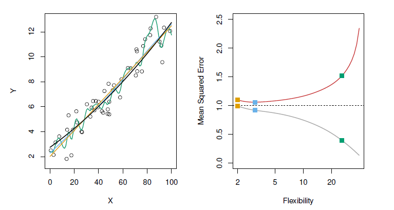
</img>

<b>FIG 2.10</b><i> </i>

Dans la pratique, on peut généralement calculer l'**EQM** d'apprentissage avec une relative facilité, mais l'estimation de l'**EQM** de test est beaucoup plus difficile car on ne dispose généralement pas de données de test.  

Comme l'illustrent les trois exemples précédents, le niveau de flexibilité correspondant au modèle présentant l'**EQM** de test minimale peut varier considérablement selon les ensembles de données.  Une méthode importante est la validation croisée qui est une méthode d'estimation de l'**EQM** de test à l'aide des données d'apprentissages.

<a name="2-3"/>

## [2.3. Le compromis biais-variance](#2-3) ##

[Retour TOC](#toc)

La forme en $\bigcup$ observée dans les courbes d'**EQM** de test ( $figures\ 2.9-2.11$ ) s'avère être le résultat de deux propriétés concurrentes des méthodes d'apprentissage statistique.  **Il est possible de montrer que le EQM de test attendu, pour une valeur $x_0$ donnée, peut toujours être décomposé en la somme de trois quantités fondamentales : la variance de $\hat{f}(x_0)$, le biais au carré de $\hat{f}(x0)$ et la variance des termes d'erreur $\varepsilon$**. C'est-à-dire ,

$$
E(y_0 - \hat{f}(x_0))^2=Var( \hat{f}(x_0)) + [Bias(\hat{f}(x_0))]^2+Var( \varepsilon). \hspace{6 em}(2.7)
$$

Ici, la notation $E(y_0 - \hat{f}(x_0))^2$,  définit la **EQM** de test attendue en $x_0$, et se réfère à la **EQM** de test moyenne que nous obtiendrions si nous estimions $f $ de manière répétée en utilisant un grand nombre d'ensembles d'apprentissage, et en testant chacun d'eux à $x_0$. 

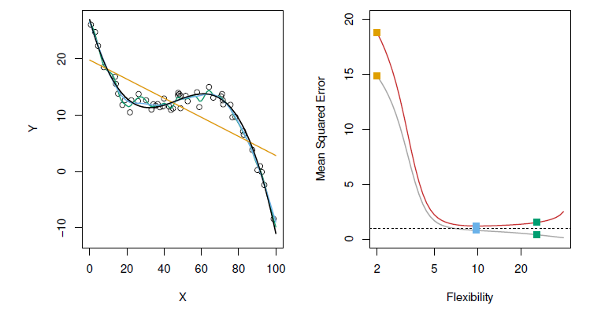
</img>

<b>FIG 2.11</b><i> </i>

La **EQM** globale de test attendue peut être calculée en faisant la moyenne de $E(y_0 - \hat{f}(x_0))^2$ sur toutes les valeurs possibles de $x_0$ dans l'ensemble de test.  L'équation (2.7) nous indique que pour minimiser l'erreur de test attendue, nous devons choisir une méthode d'apprentissage statistique qui présente simultanément une faible variance et un faible biais. 

Notez que la variance est par nature une quantité non négative, et que le biais au carré est également non négatif. Par conséquent, nous voyons que l'**EQM** de test attendue ne peut jamais être inférieure à $Var( \epsilon )$, l'erreur irréductible de (2.3).  

**Qu'entendons-nous par variance et biais d'une méthode d'apprentissage statistique ?** 
**La variance fait référence à la proportion de changement de $\hat{f}$ si nous l'estimions en utilisant un ensemble de données d'apprentissage différent.** Puisque les données d’apprentissages sont utilisées pour ajuster la méthode d’apprentissage statistique, des ensembles de données d’apprentissages différents donneront lieu à un $\hat{f}$ différent. 

Cependant, **si une méthode a une variance élevée, de petits changements dans les données de formation peuvent entraîner de grands changements dans $\hat{f}$.** **En général, les méthodes statistiques plus flexibles ont une variance plus élevée.** 

Considérons les courbes verte et orange de la $figure\ 2.9$. La courbe verte flexible suit les observations de très près. Elle présente une variance élevée car la modification de n'importe lequel de ces points de données peut entraîner un changement considérable de l'estimation  $\hat{f}$.  En revanche, la ligne orange des moindres carrés est relativement inflexible et présente une faible variance, car le déplacement d'une seule observation ne provoquera probablement qu'un faible décalage de la position de la ligne.  

D'autre part, **le biais désigne l'erreur introduite par l'approximation d'un problème réel, qui peut être extrêmement compliqué, par un modèle beaucoup plus simple.** Par exemple, la régression linéaire suppose qu'il existe une relation linéaire entre $Y$ et $X_1,X_2,\ .\ .\ .\ ,X_p$. Il est peu probable qu'un problème de la vie réelle présente une relation linéaire aussi simple, et la régression linéaire entraînera donc indubitablement un biais dans l'estimation de $f$. 

Dans la $figure\ 2.11$, la vraie $f$ est essentiellement non linéaire, et quel que soit le nombre d'observations d'entraînement qui nous sont fournies, il ne sera pas possible de produire une estimation précise à l'aide de la régression linéaire. En d'autres termes, la régression linéaire entraîne un biais élevé dans cet exemple.

Cependant, dans la $figure\ 2.10$, la véritable $f$ est très proche de la linéarité, et donc, avec suffisamment de données, la régression linéaire devrait pouvoir produire une estimation précise. 

En général, les méthodes plus souples entraînent moins de biais.  En règle générale, à mesure que nous utilisons des méthodes plus souples, la variance augmente et le biais diminue. Le taux de variation relatif de ces deux quantités détermine si l'**EQM** du test augmente ou diminue. Lorsque nous augmentons la flexibilité d'une classe de méthodes, le biais a tendance à diminuer initialement plus rapidement que la variance n'augmente. Par conséquent, l'**EQM** de test attendue diminue. 

Cependant, à un certain point, l'augmentation de la flexibilité a peu d'impact sur le biais mais commence à augmenter significativement la variance. Dans ce cas, le test **EQM** augmente. 

Notez que nous avons observé ce modèle de **EQM** de test décroissante suivie d'un **EQM** de test croissante dans les panneaux de droite des $figures\ 2.9-2.11$.  

Les trois graphiques de la $figure\ 2.12$ illustrent l'équation (2.7) pour les exemples des $figures\ 2.9-2.11$. Dans chaque cas, 

- la courbe pleine bleue représente le biais au carré, pour différents niveaux de flexibilité, tandis 
- que la courbe orange correspond à la variance. 
- La ligne horizontale en pointillés représente $Var( \varepsilon )$, l'erreur irréductible. 
- Enfin, la courbe rouge, correspondant au **EQM** de l'ensemble de test, est la somme de ces trois quantités.

Dans les trois cas, la variance augmente et le biais diminue lorsque la flexibilité de la méthode augmente. 

Toutefois, le niveau de flexibilité correspondant à l'**EQM** de test optimale diffère considérablement entre les trois ensembles de données, car le biais au carré et la variance évoluent à des rythmes différents dans chacun des ensembles de données. 

Dans le panneau de gauche de la $figure\ 2.12$, le biais diminue rapidement au départ, ce qui entraîne une forte diminution initiale de l'**EQM** de test prévue. 

En revanche, dans le panneau central de la $figure\ 2.12$, le vrai $f$ est proche de la linéarité, de sorte qu'il n'y a qu'une faible diminution du biais lorsque la flexibilité augmente, et l'**EQM** de test ne diminue que légèrement avant d'augmenter rapidement lorsque la variance augmente. 

Enfin, dans le panneau de droite de la $figure\ 2.12$, on observe une baisse spectaculaire du biais à mesure que la flexibilité augmente, car le $f$ réel est très non linéaire. 

On observe également une très faible augmentation de la variance à mesure que la flexibilité augmente. Par conséquent, l'**EQM** du test diminue considérablement avant de connaître une légère augmentation lorsque la flexibilité du modèle augmente.

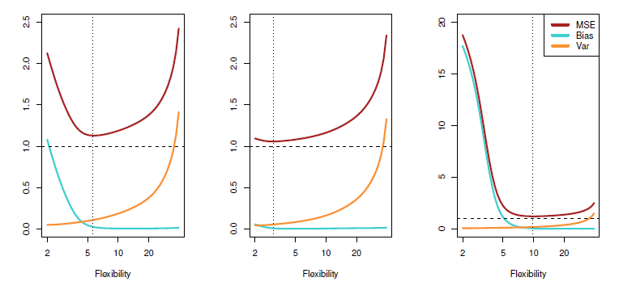
</img>

<b>FIG 2.12</b><i> </i>

La relation entre le biais, la variance et l'**EQM** de l'ensemble de test, présentée dans l'équation (2.7) et illustrée à la $figure 2.12$, est appelée **le compromis biais-variance**. 

**Pour qu'une méthode d'apprentissage statistique soit performante sur un ensemble de tests, il faut que la variance et le biais au carré soient faibles.** Il s'agit d'un compromis car il est facile d'obtenir une méthode avec un biais extrêmement faible mais une variance élevée (par exemple, en traçant une courbe qui passe par chaque observation d'apprentissage) ou une méthode avec une variance très faible mais un biais élevé (en ajustant une ligne horizontale aux données). 

Le défi consiste à trouver une méthode pour laquelle la variance et le biais au carré sont tous deux faibles. Dans une situation réelle où $f$ n'est pas observée, il n'est généralement pas possible de calculer explicitement l'**EQM**, le biais ou la variance d'une méthode d'apprentissage statistique. Néanmoins, il faut toujours garder à l'esprit le compromis biais-variance. 

Les méthodes qui sont extrêmement flexible  et qui peuvent éliminer le biais ne garantit pas qu'elles seront plus performantes qu'une méthode beaucoup plus simple comme la régression linéaire. Pour prendre un exemple extrême, supposons que la véritable ${f}$ soit linéaire. Dans cette situation, la régression linéaire n'aura aucun biais, ce qui rendra très difficile la concurrence d'une méthode plus flexible. En revanche, si la vrai ${f}$ est fortement non linéaire et que nous disposons d'un grand nombre d'observations d'apprentissage, nous pouvons obtenir de meilleurs résultats en utilisant une approche très flexible, comme dans la $figure 2.11$. 

<a name="2-4"/>

## [2.4. Le contexte de la classification](#2-4) ##

[Retour TOC](#toc)

Jusqu'à présent, notre discussion sur la précision des modèles s'est concentrée sur le cadre de la régression. Cependant, bon nombre des concepts que nous avons rencontrés, tels que le compromis biais-variance, sont transposés au cadre de la classification avec seulement quelques modifications dues au fait que $y_i$ n'est plus quantitatif.  

Supposons que nous cherchions à estimer $f$ sur la base d'observations d'apprentissage ${(x_1,\ y_1),\ .\ .\ .\ (x_n,\ y_n)}$, où maintenant $y_1,\ .\ .\ .\ ,\ y_n$ sont qualitatifs. L'approche la plus courante pour quantifier la précision de notre estimation $\hat{f}$ est le taux d'erreur d'apprentissage, c'est-à-dire la proportion d'erreurs qui sont commises si nous appliquons notre estimation $\hat{f}$ aux observations d'apprentissage :

$$
\frac{1}{n}\sum_{i=1}^{n}I(y_i \neq \hat{y}_i) \hspace{6 em} (2.8)
$$

Ici $\hat{y}_i$ est l'étiquette de classe prédite pour la $i^{ème}$ observation en utilisant $\hat{f}$. Et $I(y_i\neq \hat{y_i})$ est une variable indicatrice qui est égale à 1 si $y_i\neq\hat{y}_i$ et zéro si $y_i=\hat{y}_i$. Si $I(y_i\neq \hat{y_i})=0$ alors la $i^{èm}$ observation a été classée correctement par notre méthode de classification ; sinon elle a été mal classée. 

L'équation (2.8) calcule donc la fraction des classifications incorrectes.  L'équation (2.8) est appelée **taux d'erreur d'apprentissage car elle est calculée sur la base des données qui ont été utilisées pour entraîner notre classificateur**. 

Comme dans le cas de la régression, nous sommes plus intéressés par les taux d'erreur qui résultent de l'application de notre classificateur aux observations de test qui n'ont pas été utilisées dans la formation.  Le taux d'erreur de test associé à un ensemble d'observations de test de la forme  $(x_0,\ y_0)$ est donné par

$$
Ave(I(y_0 \neq \hat{y}_0)), \hspace {6 em} (2.9)
$$

où $\hat{y}_0$ est l'étiquette de classe prédite qui résulte de l'application du classificateur à l'observation de test avec le prédicteur $x_0$. Un bon classificateur est celui pour lequel l'erreur de test (2.9) est la plus petite.

<a name="2-5"/>

## [2.5. Le classificateur de Bayes](#2-5) ##

[Retour TOC](#toc)

Il est possible de montrer que le taux d'erreur du test donné dans (2.9) est minimisé, en moyenne, par un classificateur très simple qui affecte chaque observation à la classe la plus probable, compte tenu des valeurs de ses prédicteurs. En d'autres termes, nous devrions simplement affecter une observation de test avec **le vecteur prédicteur** $x_0$ à la classe $j$ pour laquelle

$$
Pr(Y=j|X=x_0) \hspace{6 em} (2.10)
$$

est le plus grand. Notez que (2.10) est une probabilité conditionnelle : c'est la probabilité que $Y=j$ étant donné le vecteur prédicteur observé $x_0$. Ce classificateur très simple est appelé classificateur de Bayes. Dans un problème à deux classes où il n'y a que deux valeurs de réponse possibles, disons la classe 1 ou la classe 2, le classificateur de Bayes correspond à la prédiction de la $classe\ 1$ si $Pr(Y=1|X=x_0)>0.5$, sinon de la $classe\ 2$.  

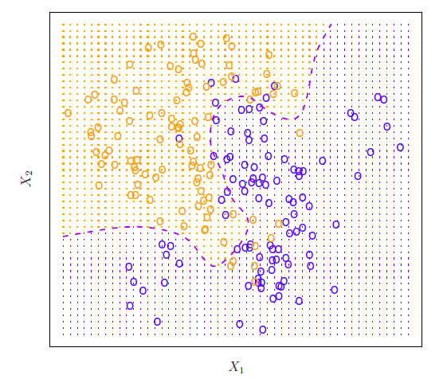
</img>

<b>FIG 2.13</b><i> </i>

La $figure\ 2.13$ présente un exemple utilisant un ensemble de données simulées dans un espace bidimensionnel composé de prédicteurs $X_1$ et $X_2$. Les cercles orange et bleus correspondent à des observations de formation qui appartiennent à deux classes différentes. Pour chaque valeur de $X_1$ et $X_2$, il existe une probabilité différente que la réponse soit orange ou bleue. 

Comme il s'agit de données simulées, nous savons comment les données ont été générées et nous pouvons calculer les probabilités conditionnelles pour chaque valeur de $X_1$ et $X_2$. 

- La région ombrée en orange reflète l'ensemble des points pour lesquels $Pr(Y=orange|X)$ est supérieur à 50%, tandis que 
- la région ombrée en bleu indique l'ensemble des points pour lesquels la probabilité est inférieure à 50%. 
- La ligne pointillée violette représente les points pour lesquels la probabilité est exactement de 50%. C'est ce qu'on appelle la frontière de décision de Bayes. 

La prédiction du classificateur de Bayes est déterminée par la frontière de décision de Bayes, une observation qui se trouve du côté orange de la frontière sera affectée à la classe orange, et de même une observation du côté bleu de la frontière sera affectée à la classe bleue.  

**Le classificateur de Bayes produit le taux d'erreur de test le plus faible possible, appelé taux d'erreur de Bayes**. Puisque le classificateur de Bayes choisira toujours la classe pour laquelle (2.10) est le plus grand, le taux d'erreur sera $1-max_j\ Pr(Y=j|X=x_0)\ avec\ X=x_0$. 

En général, le taux d'erreur global de Bayes est donné par

$$
1-E(max_j Pr(Y=j|X)), \hspace{6 em} (2.11)
$$

où **l'espérance est la moyenne de la probabilité sur toutes les valeurs possibles de $X$** . Pour nos données simulées, le taux d'erreur de Bayes est de $0.133$. Il est supérieur à zéro, car les classes se chevauchent dans la population réelle, de sorte que $\max_j\ Pr(Y=j|X=x_0)<1$ pour certaines valeurs de $x_0$.  **Le taux d’erreur de Bayes est analogue à l’erreur irréductible, discutée précédemment.**

<a name="2-6"/>

## [2.6 Voisins les plus proches (K-Nearest Neighbors)](#2-6) ##

[Retour TOC](#toc)

En théorie, nous aimerions toujours prédire les réponses qualitatives à l'aide du classificateur de Bayes. Mais pour les données réelles, nous ne connaissons pas la distribution conditionnelle de $Y$ étant donné $X$, et il est donc impossible de calculer le classificateur de Bayes.  Par conséquent, **le classificateur de Bayes sert d'étalon-or inatteignable pour comparer d'autres méthodes.** 

De nombreuses approches tentent d'estimer la distribution conditionnelle de $Y$ étant donné $X$, puis de classer une observation donnée dans la classe dont la probabilité estimée est la plus élevée. L'une de ces méthodes est le classificateur $KNN (K{-}nearest neighbors)$. 

Étant donné un nombre entier positif $K$ et une observation de test $x_0$, le classificateur $KNN$ identifie d'abord les $K$ points dans les données d'apprentissage qui sont les plus proches de $x_0$, représentés par $\mathcal{N}_0$. Il estime ensuite la probabilité conditionnelle pour la classe $j$ comme la fraction de points dans $\mathcal{N}_0$ dont les valeurs de réponse sont égales à $j$ :

$$
Pr(Y=j|X=x_0)=\frac{1}{k}\sum_I(y_i=j). \hspace{6 em} (2.12)
$$

Enfin, $KNN$ classe l'observation de test $x_0$ dans la classe avec la plus grande probabilité de (2.12).  La $figure\ 2.14$ fournit un exemple illustratif de l'approche $KNN$. Dans le panneau de gauche, nous avons tracé un petit ensemble de données d'apprentissage composé de six observations bleues et de six observations orange. Notre objectif est de faire une prédiction pour le point marqué par la croix noire. 

Supposons que nous choisissions $K=3$. Donc $KNN$ identifiera d'abord les trois observations qui sont les plus proches de la croix.  Ce voisinage est représenté par un cercle. Il se compose de deux points bleus et d'un point orange, ce qui donne des probabilités estimées de 2/3 pour la classe bleue et de 1/3 pour la classe orange. $KNN$ prédit donc que la croix noire appartient à la classe bleue. 

Dans le panneau de droite de la $figure 2.14$, nous avons appliqué l'approche $KNN$ avec $K=3$ à toutes les valeurs possibles de $X_1$ et $X_2$, et nous avons dessiné la limite de décision $KNN$ correspondante.  Malgré le fait qu'il s'agisse d'une approche très simple, $KNN$ peut souvent produire des classifieurs qui sont étonnamment proches du classifieur optimal de Bayes.  

La $figure\ 2.15$ montre la limite de décision $KNN$, en utilisant $K=10$, lorsqu'elle est appliquée à l'ensemble de données simulées plus important de la $figure\ 2.13$. Remarquez que même si la distribution réelle n'est pas connue par le classificateur $KNN$, la limite de décision $KNN$ est très proche de celle du classificateur Bayes. Le taux d'erreur du test utilisant $KNN$ est de $0.1363$ , ce qui est proche du taux d'erreur de Bayes de $0.1304$ .

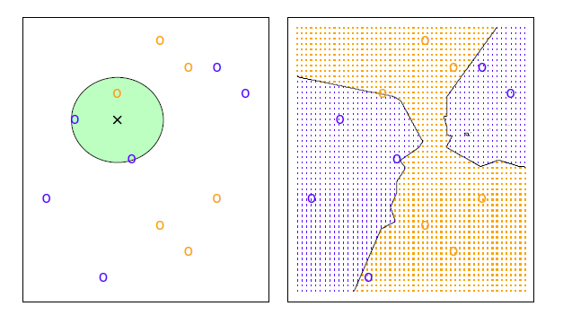
</img>

<b>FIG 2.14</b><i> ![L'approche KNN, utilisant K = 3, est illustrée dans une situation simple avec six observations bleues et six observations orange. À gauche : une observation test pour laquelle une étiquette de classe prédite est souhaitée est représentée par une croix noire. Les trois points les plus proches de l'observation test sont identifiés, et il est prédit que l'observation test appartient à la classe la plus courante, dans ce cas le bleu. A droite : La limite de décision KNN pour cet exemple est représentée en noir. La grille bleue indique la région dans laquelle une observation de test sera affectée à la classe bleue, et la grille orange indique la région dans laquelle elle sera affectée à la classe orange.](https://www.statlearning.com/)</i>

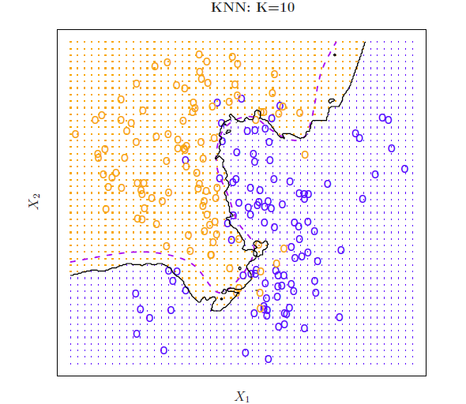
</img>

<b>FIG 2.15</b><i> </i>

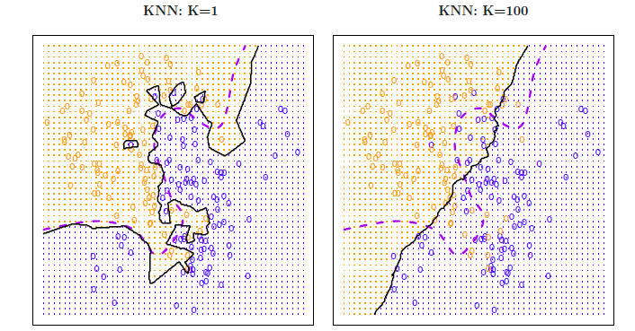
</img>

<b>FIG 2.16</b><i> </i>

Le choix de $K$ a un effet drastique sur le classificateur $KNN$ obtenu.  La $figure\ 2.16$ montre deux ajustements $KNN$ aux données simulées de la $figure\ 2.13$, en utilisant $K=1$ et $K=100$. Lorsque $K=1$, la limite de décision est trop flexible et trouve des modèles dans les données qui ne correspondent pas à la limite de décision de Bayes. Cela correspond à un classificateur qui a un faible biais mais une variance très élevée. Au fur et à mesure que $K$ augmente, la méthode devient moins flexible et produit une limite de décision qui est proche de la linéarité. Cela correspond à un classificateur à faible variance mais à biais élevé. 

Sur cet ensemble de données simulées, ni $K=1$ ni $K=100$ ne donnent de bonnes prédictions : ils ont des taux d'erreur de test de 0.1695 et 0.1925, respectivement.  Juste comme dans le cadre de la régression, il n'y a pas de relation forte entre le taux d'erreur de formation et le taux d'erreur de test. Avec $K=1$, le taux d'erreur de formation de $KNN$ est de 0, mais le taux d'erreur de test peut être assez élevé. 

**En général, à mesure que nous utilisons des méthodes de classification plus flexibles, le taux d'erreur d'apprentissage diminue, mais pas le taux d'erreur de test**. Dans la $figure\ 2.17$, nous avons tracé les erreurs de test et d'apprentissage de $KNN$ en fonction de $1/K$. **Plus $1/K$ augmente, plus la méthode devient flexible. Comme dans le cadre de la régression, le taux d'erreur d'apprentissage diminue systématiquement à mesure que la flexibilité augmente.** Cependant, l'erreur de test présente une forme en $\bigcup$ caractéristique, diminuant d'abord (avec un minimum à environ $K=10$) avant d'augmenter à nouveau lorsque la méthode devient excessivement flexible et qu'elle se surestime(overfitting).

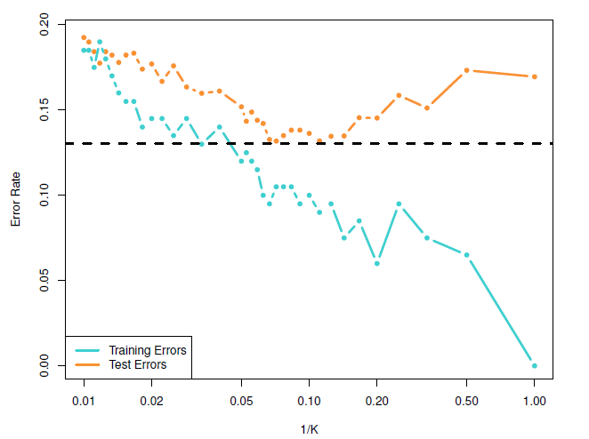
</img>

<b>FIG 2.16</b><i> </i>

**Dans le cadre de la régression et de la classification, le choix du niveau de flexibilité correct est essentiel au succès de toute méthode d'apprentissage statistique.  Le compromis biais-variance, et la forme en U de l'erreur de test qui en résulte, peuvent rendre cette tâche difficile.** 

**Diverses méthodes permettent d'estimer les taux d'erreur de test et ainsi choisir le niveau optimal de flexibilité pour une méthode d'apprentissage statistique donnée.**
