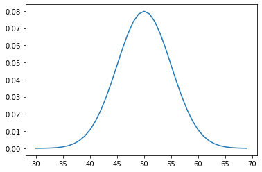
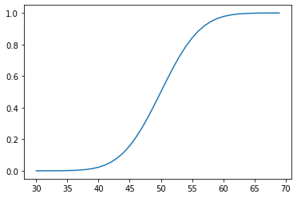
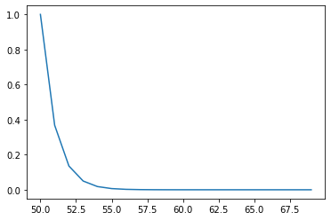
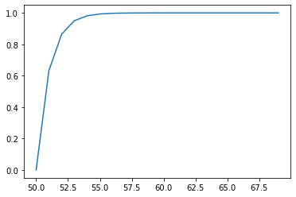
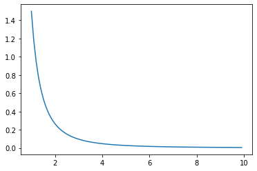
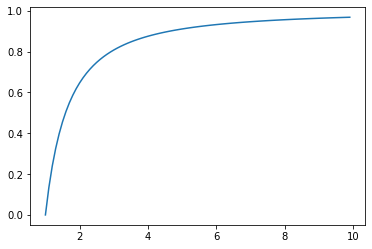
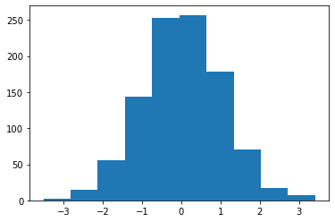
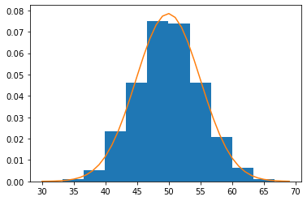
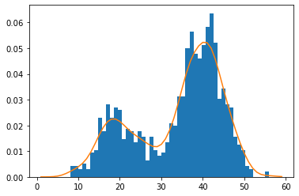

# [Section 3: L'incertitude du Machine Learning](#section3) #

[Retour README](../README.md)

<a name="toc"/>

[toc]

[[5]( https://machinelearningmastery.com/uncertainty-in-machine-learning/)] Le Machine Learning appliqué nécessite de gérer l'incertitude. Il existe de nombreuses sources d'incertitude dans un projet de Machine Learning, notamment 

- **la variance** des valeurs de données spécifiques,
- **l'échantillon de données** collectées et 
- **la nature imparfaite de tout modèle** développé à partir de ces données. 

 **La gestion de l'incertitude inhérente au Machine Learning pour la modélisation prédictive peut être réalisée grâce aux outils et techniques de probabilité**, un domaine spécifiquement conçu pour gérer l'incertitude.

<a name="3-1"/>

## [3.1 L'incertitude dans le Machine Learning](#3-1) ##

[Retour TOC](#toc)

L'incertitude signifie travailler avec des informations imparfaites ou incomplètes.  

L'incertitude est fondamentale dans le Machine Learning, mais c'est l'un des aspects qui pose le plus de difficultés aux débutants, en particulier à ceux qui viennent d'un milieu de développeurs. 

Pour les ingénieurs logiciels et les développeurs, **les ordinateurs sont déterministes**. Vous écrivez un programme, et l'ordinateur fait ce que vous avez codé. Les algorithmes sont analysés en fonction de leur complexité spatiale ou temporelle et peuvent être choisis pour optimiser ce qui est le plus important pour le projet, comme la vitesse d'exécution ou les contraintes de mémoire. 

 **La modélisation prédictive** implique l'ajustement d'un modèle pour faire correspondre des variables d'entrées à une sortie, comme un nombre dans le cas d'un problème de régression ou une étiquette de classe dans le cas d'un problème de classification. Naturellement, le débutant pose des questions raisonnables, telles que :

- **Quelles sont les meilleures fonctionnalités que je devrais utiliser ?**
- **Quel est le meilleur algorithme pour mon ensemble de données ?**

 **Les réponses à ces questions sont inconnues, tout du moins exactement connaissable.**

*La raison pour laquelle les réponses sont inconnues est l'incertitude*, et *la solution consiste à évaluer systématiquement différentes solutions jusqu'à ce qu'un ensemble de caractéristiques et/ou un algorithme suffisamment bon soit découvert pour un problème de prédiction.*  

 Il existe trois sources principales d'incertitude dans le Machine Learning, et dans les sections suivantes, nous examinerons successivement les trois sources possibles.

<a name="3-1-1"/>

### [3.1.1 Bruit dans les observations](#3-1-1) ###

[Retour TOC](#toc)

Le bruit statistique est un terme qui fait référence à la variation  inexpliquée ou au caractère aléatoire qui se trouve dans un échantillon  de données. 

Il en existe deux formes principales : **les erreurs et les résidus**. 

**Une erreur statistique** est simplement la  valeur de l'observation qui diffère de la valeur attendue qui a été  supposée être la bonne réponse. 

**Un résidu** est le résultat d’une  estimation plus informelle du résultat attendu. 

La notion générale  derrière le bruit statistique est qu’un ensemble particulier de données  n’est pas nécessairement précis et pourrait ne pas pouvoir être dupliqué si la même information était collectée ou calculée à nouveau.

 Un exemple pourrait être un ensemble de mesures sur une fleur d'iris et l'espèce de fleur qui a été mesurée dans le cas de données d'apprentissage.

```python
Sepal length: 	5.1 cm
Sepal width: 	3.5 cm
Petal length:	1.4 cm
Petal width: 	0.2 cm

Species:  Iris setosa
```

Soit le cas de nouvelles données pour lesquelles une prédiction doit être faite. Il s'agit juste de mesures sans les espèces de fleurs.

```python
Sepal length: 	5.1 m
Sepal width: 	3.5 cm
Petal length:	1.4 cm
Petal width: 	0.2 cm

Species:  ?
```

**Le bruit fait référence à la variabilité de l'observation**. La variabilité peut être naturelle, par exemple une fleur plus grande ou plus petite que la normale. Il peut également s'agir d'une erreur, comme une erreur de mesure ou une faute de frappe lors de l'écriture des observations.  

Cette variabilité a un impact non seulement sur les entrées ou les mesures, mais aussi sur les sorties. Par exemple, une observation peut avoir une étiquette de classe incorrecte ce qui signifie que nous disposons d'observations qui ont une certaine variabilité ou un caractère aléatoire. 

Les données réelles sont désordonnées ou imparfaites. En tant que praticiens, nous devons rester sceptiques face aux données et développer des systèmes permettant de s'attendre à cette incertitude, voire de l'exploiter. 

C'est pourquoi **nous passons tant de temps à examiner les statistiques des données et à créer des visualisations pour aider à identifier les cas aberrants ou inhabituels** : c'est ce qu'on appelle **le nettoyage des données**.

<a name="3-1-2"/>

### [3.1.2 Couverture incomplète du domaine](#3-1-2) ###

[Retour TOC](#toc)

Les observations, utilisées pour entraîner un modèle, constituent un échantillon et elles sont incomplètes par définition. 

**En statistique, un échantillon aléatoire fait référence à des observations choisies sans biais systématique** (par exemple, uniformément aléatoire).  Néanmoins, il y aura toujours une limitation qui introduira un biais. Par exemple, nous pouvons choisir de mesurer la taille des fleurs choisies au hasard dans un jardin. Les fleurs sont choisies au hasard mais la portée est limitée à un seul jardin. La portée peut être étendue aux jardins d'une ville, d'un pays, d'un continent, etc. 

**Un niveau approprié de variance et de biais dans l'échantillon est nécessaire** pour que l'échantillon soit représentatif du projet pour lequel les données ou le modèle seront utilisés. **Notre objectif est de collecter ou d'obtenir un échantillon aléatoire d'observations suffisamment représentatif pour entraîner et évaluer un modèle de Machine Learning**. 

Souvent, nous avons peu de contrôle sur le processus d'échantillonnage. Au lieu de cela, nous accédons à une base de données ou à un fichier CSV et les données dont nous disposons sont celles avec lesquelles nous devons travailler. Dans tous les cas, nous n'aurons jamais toutes les observations nécessaires pour une prédiction précise et si c'était le cas, un modèle prédictif ne serait plus nécessaire. 

Cela signifie qu'il y aura toujours des cas non observés. Il y aura une partie du domaine du problème pour laquelle nous n'avons pas de couverture. Quelle que soit l'efficacité avec laquelle nous généralisons les modèles, nous ne pouvons qu'espérer couvrir les cas de l'ensemble de données d’apprentissage et les cas qui ne le sont pas. 

**C'est pourquoi nous divisons un ensemble de données en un ensembles d’apprentissage et un ensemble de test**. Nous pouvons aussi utiliser **des méthodes de rééchantillonnage** telles que la validation croisée $k\mathrm{-fold}$. 

Cela permet 

1. ​	de gérer l'incertitude quant à la représentativité de notre ensemble de données (données de l’apprentissage) et
2. ​	d'estimer les performances d'une procédure de modélisation sur des données non utilisées dans cette procédure (données de testes).

<a name="3-1-3"/>

### [3.1.3 Modèle imparfait du problème](#3-1-3) ###

[Retour TOC](#toc)

**Un modèle de Machine Learning comportera toujours une part d'erreur**. On résume souvent ce phénomène en disant que tous les modèles sont erronés, ou de manière plus complète dans un aphorisme de *George Box* : ***Tous les modèles sont faux, mais certains sont utiles.***

Cela ne s'applique pas seulement au modèle, mais à toute la procédure utilisée pour le préparer :

- le choix et la préparation des données, 
- le choix des hyperparamètres d'apprentissage et l'interprétation des prédictions du modèle. 

L'erreur du modèle peut signifier des **prédictions imparfaites**, comme la prédiction d'une valeur de sortie de type numérique dans un problème de régression linéaire qui est très différente de ce qui était attendu, ou la prédiction d'une étiquette de classe qui ne correspond pas à ce qui serait attendu.  Ce type d'erreur de prédiction est attendu étant donné l'incertitude que nous avons sur les données que nous venons de discuter, à la fois en termes de bruit dans les observations et de couverture incomplète du domaine. 

Un autre type d'erreur est **l'erreur d'omission**. Nous omettons des détails ou les abstrayons afin de généraliser à de nouveaux cas. Pour ce faire, nous sélectionnons des modèles plus simples mais plus robustes aux spécificités des données, par opposition aux modèles complexes qui peuvent être hautement spécialisés aux données d'apprentissage. 

Ainsi, **nous pouvons choisir, et choisissons souvent, un modèle connu pour faire des erreurs sur l'ensemble des données d'apprentissage, dans l'espoir que le modèle se généralisera mieux aux nouveaux cas et aura une meilleure performance globale.**

Néanmoins, des prédictions sont nécessaires. **Sachant que les modèles feront des erreurs, nous gérons cette incertitude en recherchant un modèle qui soit suffisamment bon.** Cela est souvent interprété comme la sélection d'un modèle qui est habile par rapport à une méthode naïve ou à d'autres modèles d'apprentissage établis.

<a name="3-2"/>

## [3.2 Comment gérer l'incertitude?](#3-2) ##

[Retour TOC](#toc)

**L'incertitude dans le Machine Learning est gérée à l'aide des probabilités**. Les probabilités sont le domaine des mathématiques conçu pour traiter, manipuler et exploiter l'incertitude.

En fait, la théorie des probabilités est bien plus au cœur du domaine du Machine Learning que l'intelligence artificielle.

**Les méthodes et outils issus des probabilités fournissent la base et la manière de penser à la nature aléatoire ou stochastique des problèmes de modélisation prédictive abordés par le Machine Learning.** Par exemple,

1. **En ce qui concerne les observations bruyantes**, les probabilités et les statistiques nous **aident à comprendre et à quantifier la valeur attendue** et à identifier la variabilité des caractéristiques provenant des observations.
2. **En ce qui concerne la couverture incomplète du domaine**, les probabilités aident à **comprendre et à quantifier la distribution et la densité attendues** des observations.

   La distribution des données dans l’espace vectoriel auquel elles appartiennent peut être utilement décrite par une fonction de **densité de probabilité**. Cette caractérisation de la distribution des données dans l’espace a de multiples intérêts :

   1. **Une meilleure compréhension des données** : quelles sont les  régions de densité élevée (où les données sont les plus denses), ces  régions diffèrent-elles d’une classe à une autre (si les observations  appartiennent à différentes classes), dans quelles directions les  projections des données sont distribuées de façon particulière (par ex., la distribution présente plusieurs maxima bien distincts), etc.
   2. Une caractérisation du **support** de la  distribution, c’est à dire de la région où la densité ne peut pas être  assimilée à 0. Cela peut permettre de détecter des données aberrantes (*outliers*) ou de réaliser un rejet de non représentativité.
   3. La construction de modèles décisionnels de discrimination entre  plusieurs classes sur la base des densités de probabilité des classes.
3. **En termes d'erreur de modèle**, la probabilité aide à **comprendre et à quantifier la capacité et la variance attendues** des performances des modèles prédictifs lorsqu'ils sont appliqués à de nouvelles données. ( $\equiv$  **la variance** est une mesure fiable, très utilisée pour analyser les  données d’une distribution. Après l’avoir comparée avec la moyenne, les  experts des données peuvent reconnaître aisément les données aberrantes  ou celles qui sont éloignées).

 Mais ce n'est qu'un début, car les probabilités constituent le fondement de l'apprentissage itératif de nombreux modèles de Machine Learning, appelé **estimation du maximum de vraisemblance (MLE),** qui sous-tend des modèles tels que 

- la régression linéaire, 
- la régression logistique, 
- les réseaux de neurones artificiels, 
- et bien d'autres encore. 

**Les probabilités constituent également la base du développement d'algorithmes spécifiques**, tels que Naive Bayes.

[[15](https://fr.wikipedia.org/wiki/Maximum_de_vraisemblance)]  **MLE** $\equiv$ l'**estimateur du maximum de vraisemblance** est un estimateur statistique utilisé pour inférer les paramètres de la loi de probabilité d'un échantillon donné en recherchant les valeurs des paramètres maximisant la fonction de vraisemblance.

Soit $X$ une variable aléatoire réelle, de loi ${\mathcal {D}}_{\theta }$, de paramètre $\theta$ inconnu. On définit une fonction $f$ selon si la loi est discrète ou continue.

- Si $X$ est une variable discrète, alors on pose ${\displaystyle f(x;\theta )=P_{\theta }(X=x)}$, c'est-à-dire la probabilité que $X$ vaut $x$.
- Si $X$ est une variable continue, alors on pose ${\displaystyle f(x;\theta )=f_{\theta }(x)}$, la densité de $X$ au point $x$.

On appelle vraisemblance de $\theta$ au vu des observations ${\displaystyle (x_{1},\ldots ,x_{n})}$ d'un n-échantillon indépendamment et identiquement distribué selon la loi  ${\mathcal {D}}_{\theta }$, le nombre :


$$
{\displaystyle L(x_ {1},\ldots ,x_ {n};\theta ) = f(x_ {1};\theta )\times \ldots \times f(x_ {n};\theta ) = \prod _ {i = 1}^{n}f(x_ {i};\theta )}A ( x_ 1 , … , x_ n ) {\displaystyle (x_{1},\ldots ,x_ {n})}
$$


 fixé, on cherche à trouver le maximum de cette vraisemblance pour que les probabilités des réalisations observées soient aussi maximum. Ceci est un problème d'optimisation. Ainsi, un estimateur du maximum de vraisemblance est tout estimateur $\widehat {\theta }$ de $\theta$  vérifiant 


$$
{\displaystyle \sup_ {\theta }L(x_ {1},\ldots ,x_ {n};\theta ) = L(x_ {1},\ldots ,x_ {n};{\hat {\theta }})}.
$$


A priori, il n'y a ni existence, ni unicité d'un estimateur du maximum de vraisemblance. Cependant, en pratique, dans la plupart des cas, il existe, est unique, et on peut le calculer. 

Cette méthode se distingue de la recherche d'un estimateur non biaisé de $\theta$, ce qui ne donne pas nécessairement la valeur la plus probable pour $\theta$ utilisé pour inférer les paramètres de la loi de probabilité d'un échantillon donné en recherchant les valeurs des paramètres maximisant la fonction de vraisemblance.

<a name="3-3"/>

## [3.3 Pourquoi apprendre les probabilités pour le Machine Learning?](#3-3) ##

[Retour TOC](#toc)

Les probabilités sont un domaine des mathématiques qui quantifie l'incertitude. Il s'agit indéniablement d'un pilier du Machine Learning, et beaucoup recommandent de l'étudier avant de se lancer. 

Pourquoi les praticiens du Machine Learning devraient étudier les probabilités pour améliorer leurs compétences et leurs capacités. Car

- de nombreux algorithmes sont conçus à l'aide d'outils et de techniques issus des probabilités, tels que Naive Bayes.
- le **maximum de vraisemblance** qui sous-tend la formation de nombreux algorithmes de Machine Learning **provient du domaine des probabilités**.

<a name="3-3-1"/>

### [3.3.1 L'appartenance à une classe requiert la prédiction d'une probabilité](#3-3-1) ###

[Retour TOC](#toc)

**Les problèmes de modélisation prédictive de classification sont ceux pour lesquels une étiquette donnée est attribuée à un exemple.** 

Un exemple familier est l'ensemble de données sur les fleurs d'iris, dans lequel nous disposons de quatre mesures d'une fleur. L'objectif est d'attribuer, à l'observation, l'une des trois différentes espèces connues de fleurs d'iris. 

Nous pouvons modéliser le problème en attribuant directement une étiquette de classe à chaque observation.

- **Entrée** : Mesures d'une fleur.
- **Sortie** : Une espèce d'iris.

Une approche plus courante consiste à formuler le problème comme une appartenance à **une classe probabiliste**, où la probabilité qu'une observation appartienne à chaque classe connue est prédite.

- **Entrée** : Mesures d'une fleur.
- **Sortie** : Probabilité d'appartenance à chaque espèce d'iris.

**Le fait de formuler le problème comme une prédiction de la probabilité d'appartenance à une classe probabiliste simplifie le problème de modélisation et facilite l'apprentissage d'un modèle.** Il permet au modèle de capturer l'ambiguïté des données, ce qui permet à un processus en aval, tel que l'utilisateur, d'interpréter les probabilités dans le contexte du domaine. 

**Les probabilités peuvent être transformées en une étiquette de classe claire en choisissant la classe avec la plus grande probabilité.** 

<a name="3-3-2"/>

### [3.3.2 Certains algorithmes sont conçus à l'aide de probabilités](#3-2-2) ###

[Retour TOC](#toc)

Il existe des algorithmes spécialement conçus pour exploiter les outils et les méthodes des probabilités. Il s'agit notamment d'algorithmes individuels, comme l'algorithme Naive Bayes, qui est construit à l'aide du théorème de Bayes avec quelques hypothèses simplificatrices.

<a name="3-3-3"/>

### [3.3.3 Les modèles sont formés à l'aide d'un cadre probabiliste](#3-3-3) ###

[Retour TOC](#toc)

De nombreux modèles de Machine Learning sont formés à l'aide d'un algorithme itératif conçu dans un cadre probabiliste. 

- Le cadre le plus courant est peut-être celui de l'**estimation du maximum de vraisemblance**, parfois abrégé en **MLE**. Il s'agit d'un cadre permettant d'estimer les paramètres d'un modèle (par exemple, les poids) en fonction des données observées. **C'est le cadre qui sous-tend l'estimation par les moindres carrés ordinaires d'un modèle de régression linéaire** c'est à dire que dans un modèle linéaire, si les erreurs appartiennent à une distribution normale, les estimateurs des moindres carrés sont également les  **estimateurs du maximum de vraisemblance**. 

- L'algorithme de **maximisation des espérances**, ou **EM** en abrégé, est une approche de l'estimation du maximum de vraisemblance souvent utilisée pour le clustering non supervisé de données, par exemple l'estimation de $\text{k-moyennes}$ pour $\text{k-clusters}$, également connu sous le nom d'algorithme de clustering  $\text{k-Means}.$

  Pour les modèles qui prédisent l'appartenance à une classe, **l'estimation du maximum de vraisemblance fournit le cadre permettant de minimiser la différence ou la divergence entre une distribution de probabilité observée et une distribution de probabilité prédite**. Cette méthode est utilisée dans les algorithmes de classification, comme la régression logistique, ainsi que dans les réseaux neuronaux d'apprentissage profond. Il est courant de mesurer cette différence entre les distributions de probabilité pendant la formation en utilisant l'entropie, par exemple via l'entropie croisée. 

  L'entropie, les différences entre les distributions mesurées et l'entropie croisée  sont issues du domaine de la théorie de l'information qui s'appuie directement sur la théorie des probabilités. Par exemple, l'entropie est calculée directement comme le log négatif de la probabilité.

------

1. **Estimation du Maximum de Vraisemblance (MLE)**:

   - Le MLE est une méthode pour estimer les paramètres d'un modèle de telle sorte qu'ils maximisent la probabilité (ou vraisemblance) des données observées sous le modèle donné.
   - Par exemple, si vous avez des données qui semblent suivre une ligne droite (avec une certaine variabilité ou bruit), le MLE vous aidera à trouver la ligne qui "s'adapte" le mieux à ces données dans le sens où elle rend les données "les plus probables".

   **Exemple concret**:

   - Imaginons que vous avez des points de données sur une feuille graphique. Si vous dessinez une ligne à travers ces points, la MLE vous aidera à trouver la ligne telle que la somme des carrés des distances verticales de chaque point à la ligne (erreurs) est minimisée. Cette méthode est en fait les moindres carrés ordinaires pour la régression linéaire.

   **Concept du MLE:**

   L'idée fondamentale du MLE est d'estimer les paramètres d'un modèle statistique de telle manière que, pour les données observées, la vraisemblance de ces données sous le modèle est maximisée.

   La vraisemblance $L(\theta)$ est définie comme la probabilité des données observées $X_1, X_2, \ldots, X_n$ étant donné un paramètre $\theta$, c'est-à-dire:

   

   

   $$
   L(\theta) = P\left(X_ 1, X_ 2, \ldots, X_ n \mid \theta\right)
   $$

   

   


   L'objectif est de trouver la valeur de $\theta$ qui maximise cette vraisemblance.

   **Démonstration simplifiée avec un exemple:**

   Supposons que nous ayons une série de lancers de pièce, et nous voulons estimer la probabilité $p$ que la pièce atterrisse sur Face.

   Supposons que nos données soient: $X_1, X_2, \ldots, X_n$ où chaque $X_i$ est 1 si le résultat est Face et 0 si c'est Pile.

   Si nous supposons que chaque lancer est indépendant, alors la vraisemblance de nos données observées, étant donné $p$, est:

   

   

   $$
   L(p) = p^{\left(\sum x_ i\right)}(1 - p)^{n - \sum x_ i}
   $$

   

   


   Pour maximiser $L(p)$, il est souvent plus facile de maximiser son logarithme (**logvraisemblance**):

   

   

   $$
   l(p) = \sum X_ i \log (p) + \left(n - \sum X_ i\right) \log (1 - p)
   $$

   

   


   En utilisant les techniques de calcul, nous dérivons $l(p)$ par rapport à $p$, égalons à zéro, et résolvons pour $p$.

   La dérivée est:

   

   

   $$
   \frac{d l}{d p} = \frac{\sum X_ i}{p} - \frac{n - \sum X_ i}{1 - p}
   $$

   

   

   


   Égalons cela à zéro et résolvons pour $p$, nous obtenons:

   

   

   $$
   p = \frac{\sum X_ i}{n}
   $$

   

   


   Ce qui est exactement ce que nous attendons: **la proportion d'observations où la pièce atterrit sur Face est notre meilleure estimation de p**.

   **En résumé**: Le MLE est une méthode d'estimation qui utilise le concept de vraisemblance (ou sa version log-transformée) pour trouver la valeur du paramètre qui rend les données observées "les plus probables".

   **Continuons sur l'exemple du lancer de pièce, qui est en fait un exemple classique de la loi de Bernoulli.**

   La loi de Bernoulli est une distribution de probabilité discrète d'une variable aléatoire qui prend la valeur 1 avec une probabilité $p$ et la valeur 0 avec une probabilité $1-p$. Dans le contexte de notre lancer de pièce, la valeur 1 pourrait représenter "Face" et la valeur 0 "Pile".

   **La fonction de masse de probabilité** (PMF) pour une variable aléatoire $X$ suivant une loi de Bernoulli est :

   

   

   $$
   P(X = k) = p^k(1 - p)^{1 - k}
   $$

   

   


   où $k$ est soit 0 soit 1 .

   Si vous avez un échantillon de $n$ observations indépendantes $X_1, X_2, \ldots, X_n$ qui suit une lo de Bernoulli, alors la vraisemblance de cet échantillon, étant donné $p$, est le produit des PMF pour chaque observation :

   

   

   $$
   L(p) = \prod_ {i - 1}^n p^{X_ i}(1 - p)^{1 - x_ i}
   $$

   

   


   Pour le MLE, nous voulons maximiser cette vraisemblance pour trouver la meilleure estimation de $p$. Comme précédemment mentionné, il est souvent plus facile de travailler avec la log-vraisemblance:

   

   

   $$
   l(p)=\sum_ {i - 1}^n\left[X_ i \log (p) + \left(1 - X_ i\right) \log (1 - p)\right]
   $$

   

   


   La dérivation et la résolution de la log-vraisemblance par rapport à $p$ (comme nous l'avons fait précédemment) vous donnera l'estimation du maximum de vraisemblance pour $p$, qui est :

   

   

   $$
   \hat{p} = \frac{\sum X_ i}{n}
   $$

   

   


   où $\hat{p}$ est l'estimateur MLE de $p$. Cette estimation est intuitive : elle est simplement la proportion d'observations où $X_i=1$, ou dans le contexte de notre exemple, la proportion de lancers où la pièce a atterri sur Face.

   Ainsi, le MLE pour une variable aléatoire de Bernoulli est très naturel et correspond à la moyenne empirique des données observées.

2. **Algorithme de Maximisation des Espérances (EM)**:

   - C'est une technique d'optimisation souvent utilisée lorsque vous avez des données "manquantes" ou cachées. L'algorithme fonctionne en deux étapes: 
     - une étape d'**E** (espérance) où vous estimez l'espérance basée sur les données observées et les paramètres actuels, et 
     - une étape de **M** (maximisation) où vous maximisez la vraisemblance en fonction de cette espérance.

   **Exemple concret**:

   - Prenons l'exemple de $\text{k-Means}$. Imaginons que vous ayez un ensemble de points de données et que vous vouliez les regrouper en 2 clusters mais sans savoir à quel cluster appartient chaque point. 

     1. L'étape $E$ attribue chaque point au centre du cluster le plus proche. 
     2. L'étape $M$ calcule ensuite le nouveau centre de chaque cluster comme la moyenne des points qui lui sont attribués. 

     Ces étapes sont répétées jusqu'à ce que les centres des clusters ne bougent plus beaucoup.

3. **Minimiser la différence entre les distributions de probabilité**:

   - Lorsque vous formez un modèle pour prédire des probabilités (comme dans la classification), vous voulez que votre modèle prédise des probabilités qui sont proches de la "vérité". **La manière de mesurer cette "proximité" est souvent l'entropie croisée**.

   **Exemple concret**:

   - Supposons que pour une image donnée d'un chat, le "vrai" label est [1, 0] (il s'agit d'un chat, pas d'un chien). Si votre modèle prédit [0.9, 0.1], l'entropie croisée entre la prédiction et la vérité serait faible, ce qui est bon. Mais si votre modèle prédit [0.1, 0.9], l'entropie croisée serait élevée, indiquant une mauvaise prédiction.

4. **Entropie et Théorie de l'Information**:

   - L'entropie mesure l'incertitude dans une distribution de probabilité. La théorie de l'information utilise des concepts tels que l'entropie pour quantifier la quantité d'information dans des signaux, des distributions, etc.

   **Exemple concret**:

   - Si vous avez une pièce équilibrée et que vous la lancez, l'entropie (ou l'incertitude) associée à cette action est maximale car vous êtes vraiment incertain quant à savoir si vous obtiendrez face ou pile. Cependant, si la pièce était truquée pour donner toujours face, l'entropie serait nulle, car il n'y a aucune incertitude.

<a name="3-3-4"/>

### [3.3.4 Les modèles peuvent être ajustés à l'aide d'un cadre de travail probabiliste](#3-3-4) ###

[Retour TOC](#toc)

Il est courant de régler les hyperparamètres d'un modèle de Machine Learning, tels que $k$ pour ${k}NN$. 

L'optimisation bayésienne est une optimisation efficace des hyperparamètres qui implique une recherche dirigée de l'espace des configurations possibles sur la base des configurations les plus susceptibles de donner de meilleures performances. 

Comme son nom l'indique, cette approche a été conçue à partir du théorème de Bayes et l'exploite lors de l'échantillonnage de l'espace des configurations possibles.

------

**Hyperparamètres et le besoin d'optimisation :**

Les hyperparamètres sont des paramètres qui ne sont pas appris directement par les algorithmes d'apprentissage automatique lors de la formation. Au lieu de cela, ils doivent être configurés avant la formation. Par exemple, dans l'algorithme des $k$ plus proches voisins $(k \mathrm{NN}), k$ est un hyperparamètre qui représente le nombre de voisins à considérer lors de la prédiction.

L'optimisation des hyperparamètres est cruciale car le choix de leurs valeurs peut considérablement influencer les performances du modèle. Une valeur non optimale peut entraîner une mauvaise performance, tandis qu'une valeur optimale peut permettre au modèle d'atteindre sa meilleure performance possible.

**Optimisation bayésienne des hyperparamètres :**

L'optimisation bayésienne vise à trouver les hyperparamètres qui minimisent (ou maximisent) une fonction objectif, généralement une mesure de l'erreur du modèle. L'idée est d'utiliser le théorème de Bayes pour estimer la distribution postérieure de la fonction objectif compte tenu des valeurs des hyperparamètres. Cette distribution postérieure est ensuite utilisée pour guider la recherche des hyperparamètres.

Théorème de Bayes :


$$
P(\theta \mid D) = \frac{P(D \mid \theta) P(\theta)}{P(D)}
$$


Où:

\- $P(\theta \mid D)$ est la distribution postérieure des hyperparamètres $\theta$ compte tenu des données $D$.

\- $P(D \mid \theta)$ est la vraisemblance, qui évalue la qualité des hyperparamètres $\theta$ compte tenu des données.

\- $P(\theta)$ est la distribution a priori des hyperparamètres.

\- $P(D)$ est la probabilité des données, agissant comme un facteur de normalisation.

Dans l'optimisation bayésienne, l'objectif est de maximiser la distribution postérieure $P(\theta \mid D)$ afin de trouver les hyperparamètres optimaux.

**Étapes de l'optimisation bayésienne:**

1. **Choisir une priorité pour les hyperparamètres** : C'est une distribution qui exprime nos croyances initiales sur les hyperparamètres avant d'avoir vu les données.
2. **Évaluer la vraisemblance pour un ensemble d'hyperparamètres** : Cela se fait en entraînant le modèle avec cet ensemble d'hyperparamètres et en évaluant sa performance.
3. **Calculer la distribution postérieure** : Utiliser le théorème de Bayes pour combiner la priorité et la vraisemblance.
4. **Sélectionner le prochain ensemble d'hyperparamètres à évaluer** : Cela se fait généralement en choisissant l'ensemble d'hyperparamètres qui maximise une certaine fonction d'acquisition, qui mesure le compromis entre explorer des régions de l'espace des hyperparamètres avec une incertitude élevée et exploiter des régions avec une faible erreur estimée.

**Exemple concret :**

Imaginons que nous formons un modèle $k \mathrm{NN}$ sur un ensemble de données de classification et que nous voulons trouver la meilleure valeur pour $k$.

1. Nous pourrions commencer par choisir une distribution a priori pour $k$ qui donne une probabilité égale à chaque valeur entre 1 et 20.
2. Ensuite, nous pourrions choisir au hasard une valeur de $k$, disons 5 , former notre modèle, et évaluer son erreur sur un ensemble de validation.
3. En utilisant cette erreur et notre priorité, nous mettons à jour notre croyance sur la distribution des erreurs possibles pour chaque valeur de $k$ en utilisant le théorème de Bayes.
4. Ensuite, nous pourrions utiliser une fonction d'acquisition pour choisir la prochaine valeur de $k$ à évaluer, peut-être $k=10$ cette fois.
5. Ce processus se poursuit jusqu'à ce que nous ayons soit évalué toutes les valeurs possibles de $k$, soit atteint un nombre d'itérations que nous avons fixé à l'avance.

**Allons plus en détail pour cet exemple :**

**Contexte** : Vous avez un ensemble de données de classification et vous avez choisi d'utiliser l'algorithme kNN (k plus proches voisins) pour modéliser ces données. Vous savez que kNN est sensible au choix de k, et vous voulez déterminer la meilleure valeur de k.

**1. Distribution a priori pour k** :

Avant d'avoir vu aucune donnée, vous pouvez supposer que toutes les valeurs de k entre 1 et 20 sont également probables. C'est une approche non informative. Votre distribution a priori pourrait ressembler à un histogramme uniforme pour k entre 1 et 20.

**2. Évaluation initiale** :

Vous choisissez au hasard k=5. Après avoir formé votre modèle KNN avec k=5, vous le testez sur un ensemble de validation et notez l'erreur, disons 12%.

**3. Mise à jour avec le théorème de Bayes** :

Sur la base de cette erreur de 12%, vous allez mettre à jour vos croyances (ou probabilités) concernant chaque valeur de k. Pour simplifier, imaginons que l'erreur diminue linéairement de 1 à 20. Avec une erreur de 12% pour k=5, vous pourriez maintenant penser que k proche de 5 est plus probable d'être le meilleur choix que k loin de 5. Cependant, ces mises à jour ne sont pas tranchées et sèches ; elles dépendent de la nature des données, de la fonction d'acquisition et de la distribution postérieure.

**4. Utilisation de la fonction d'acquisition** :

La fonction d'acquisition vous indique où échantillonner ensuite. Une fonction d'acquisition courante est l'espérance d'amélioration (EI). Supposons que sur la base de EI, vous déterminiez que k=10 est la prochaine valeur la plus prometteuse à évaluer. Vous formez alors un nouveau modèle avec k=10 et notez l'erreur sur l'ensemble de validation, disons 10%. Vous mettez ensuite à jour votre distribution postérieure pour k en fonction de cette nouvelle erreur.

**5. Itération** :

Vous répétez ce processus, chaque fois en choisissant une nouvelle valeur de k sur la base de la fonction d'acquisition et de la distribution postérieure mise à jour. Avec le temps, vous devriez avoir une idée claire de la valeur optimale de k.

Après un certain nombre d'itérations (que vous avez défini au préalable) ou après avoir évalué toutes les valeurs possibles de k, vous choisirez la valeur de k qui a donné la plus faible erreur de validation comme votre valeur optimale.

**Note finale** : En pratique, l'optimisation bayésienne est souvent facilitée par des outils et des bibliothèques qui automatisent bon nombre de ces étapes, tels que `Scikit-Optimize` en Python.

<a name="3-3-5"/>

### [3.3.5 Des mesures probabilistes sont utilisées pour évaluer la compétence du modèle](#3-3-5) ###

[Retour TOC](#toc)

Pour les algorithmes où une prédiction des probabilités est effectuée, des mesures d'évaluation sont nécessaires pour valider la performance du modèle. Il existe de nombreuses mesures utilisées pour valider les performances d'un modèle basé sur des probabilités prédites. Les exemples courants incluent des mesures agrégées comme la perte logarithmique et le score de Brier. 

Pour les tâches de classification binaire où un seul score de probabilité est prédit, les courbes **ROC** (**Receiver Operating Characteristic**) peuvent être construites pour explorer différents seuils pouvant être utilisés lors de l'interprétation de la prédiction qui, à son tour, donne lieu à différents compromis. 

L'aire sous la courbe ROC, ou AUC ROC, peut également être calculée comme une mesure globale. 

Le choix et l'interprétation de ces méthodes de notation nécessitent une compréhension fondamentale de la théorie des probabilités.

------

1. **Perte logarithmique et score de Brier**

**Perte logarithmique (Log Loss):**

Elle est une mesure de performance pour les modèles de classification qui produisent des probabilités. Elle évalue la précision de ces probabilités prédites. Une perte logarithmique plus faible est meilleure, avec une perte logarithmique parfaite de 0 .


$$
\log \operatorname{Loss} = -\frac{1}{N} \sum_ {i = 1}^N\left[y_ i \log \left(p\left(y_ i\right)\right) + \left(1 - y_ i\right) \log \left(1- p\left(y_ i\right)\right)\right]
$$


où:

\- $N$ est le nombre total d'observations.

\- $y_i$ est le label réel de l'observation $i$ ( 0 ou 1 dans le cas binaire).

\- $p\left(y_i\right)$ est la probabilité prédite que l'observation $i$ appartienne à la classe 1 .

**Score de Brier:**

II s'agit d'une mesure de performance qui évalue la précision des probabilités prédites. II est toujours entre 0 et 1 , où une valeur inférieure est meilleure.

Brier Score $=\frac{1}{N} \sum_ {i = 1}^N\left(f_ i - o_ i\right)^2$

où:

\- $f_i$ est la probabilité prédite que l'observation $i$ appartienne à la classe 1 .

\- $o_i$ est le label réel de l'observation $i$ ( 0 ou 1 dans le cas binaire).

2. **Courbes ROC**

La courbe ROC est un outil graphique utilisé pour évaluer les performances des algorithmes de classification. Elle compare le taux de vrais positifs (sensibilité) au taux de faux positifs (1 - spécificité) à différents seuils de probabilité.

3. **Aire sous la courbe ROC (AUC ROC)**

L'AUC ROC est la surface sous la courbe ROC. Elle varie entre 0 et 1 . Une valeur de 0,5 signifie que le modèle n'a pas de capacité discriminative, tandis qu'une valeur de 1,0 signifie que le modèle est parfait.

**Exemple concret:**

Prenons un modèle de régression logistique qui prédit si un e-mail est un spam (1) ou non (0).

Supposons que notre modèle prédise les probabilités suivantes pour quatre e-mails:

E-mail 1: 0.95 (réel: spam)

E-mail 2: 0.85 (réel: spam)

E-mail 3: 0.10 (réel: non spam)

E-mail 4: 0.30 (réel: non spam)

Utilisant ces probabilités prédites, nous pouvons calculer la perte logarithmique et le score de Brier pour évaluer la qualité de ces probabilités.

En outre, en traçant les taux de vrais positifs et de faux positifs pour différents seuils (de 0 à 1), nous pouvons obtenir une courbe ROC. L'AUC de cette courbe peut être utilisée comme une métrique récapitulative de la performance du modèle.

**Importance de la théorie des probabilités:**

La théorie des probabilités est essentielle car toutes ces mesures évaluent la qualité des probabilités prédites par le modèle. Une compréhension solide de la théorie des probabilités aide à comprendre pourquoi certaines probabilités prédites peuvent entraîner de grandes erreurs (par exemple, prédire une probabilité très faible pour une observation qui est en réalité positive) et comment ces erreurs se traduisent dans des mesures comme la perte logarithmique ou le score de Brier.

<a name="3-4"/>

## [3.4 Probabilité conjointe, marginale et conditionnelle](#3-4) ##

[Retour TOC](#toc)

**La probabilité quantifie l'incertitude des résultats d'une variable aléatoire**. Il est relativement facile de comprendre et de calculer la probabilité pour une seule variable. 

Néanmoins, en apprentissage automatique, nous avons souvent de nombreuses variables aléatoires qui interagissent de manière complexe et inconnue. **Il existe des techniques spécifiques qui peuvent être utilisées pour quantifier la probabilité de plusieurs variables aléatoires**, telles que la **probabilité conjointe, marginale et conditionnelle**. Ces techniques fournissent la base d'une compréhension probabiliste de l'ajustement d'un modèle prédictif aux données. 

- La **probabilité conjointe** est la probabilité que deux ou plusieurs événements se produisent simultanément.
- La **probabilité marginale** est la probabilité d'un événement indépendamment du résultat d'autres variables.
- La **probabilité conditionnelle** est la probabilité qu'un événement se produise en présence d'un ou plusieurs autres événements.

<a name="3-4-1"/>

### [3.4.1 Probabilité d'une variable aléatoire](#3-4-1) ###

[Retour TOC](#toc)

La **probabilité quantifie la vraisemblance d'un événement**. Plus précisément, elle **quantifie la probabilité d'un résultat spécifique pour une variable aléatoire**, comme le tirage d'une pièce de monnaie, le lancer d'un dé ou le tirage d'une carte dans un jeu.

Pour une variable aléatoire $x$, ${P}({x})$ est une **fonction qui attribue une probabilité à toutes les valeurs possibles de ${x}$**.


$$
Densité\ de\ probabilité\ de\  x=P(x)
$$


**La probabilité d'un événement spécifique** $A$ pour une variable aléatoire $x$ est désignée par ${P}({x}={A})$, ou simplement par $P(A)$


$$
Probabilité\ de\ l'événement\ A=P(A)
$$


**La probabilité est calculée comme le nombre de résultats souhaités divisé par le total des résultats possibles**, dans le cas où tous les résultats sont également probables. 

$$
Probabilité = \frac {nombre\ de\ résultats\ souhaités}{nombre\ total\ de\ résultats\ possibles}
$$


Cela est intuitif si l'on pense à une variable aléatoire discrète telle que le lancer d'un dé. Par exemple, la probabilité qu'un dé donne un 5 est calculée comme le résultat d'un 5 (1) divisé par le nombre total de résultats discrets (6) ou $\frac{1}{6}$ ou environ 0.1666 ou environ 16.666%.  

**La somme des probabilités de toutes les possibilités doit être égale à un**. Si ce n'est pas le cas, nous n'avons pas de probabilités valides.


$$
Somme\ des\ probabilités\ pour\ tous\ les\ résultats\ =\ 1.0.
$$


**La probabilité d'un résultat impossible est de zéro**. Par exemple, il est impossible d'obtenir un 7 avec un dé standard à six faces.


$$
Probabilité\ d'un\ résultat\ impossible\ =\ 0.0.
$$


**La probabilité d'un résultat certain est de un**. Par exemple, il est certain qu'une valeur comprise entre les chiffres 1 et 6 est obtenue en lançant un dé à six faces.


$$
Probabilité\ d'un\ résultat\ certain\ = 1.0.
$$


**La probabilité qu'un événement ne se produise pas, appelée le complément**. Elle peut être calculée par un moins la probabilité de l'événement, ou $1{-}P(A)$. Par exemple, la probabilité de ne pas sortir un 5 serait de $1{-}P(5)$ ou $1{-}0.106$ ou environ 0.833 ou environ 83.333%.


$$
P(not\ A)= 1-P(A)
$$

<a name="3-4-2"/>

### [3.4.2 Probabilité de variables aléatoires multiples](#3-4-2) ###

[Retour TOC](#toc)

En apprentissage automatique, nous sommes susceptibles de travailler avec de nombreuses variables aléatoires. Par exemple, dans un tableau de données, comme dans Excel, chaque ligne représente une observation ou un événement distinct, et chaque colonne représente une variable aléatoire distincte. 

**Les variables peuvent être soit discrètes, ce qui signifie qu'elles prennent un ensemble fini de valeurs, soit continues, ce qui signifie qu'elles prennent une valeur réelle ou numérique.**  

En tant que tel, nous nous intéressons à la probabilité entre deux ou plusieurs variables aléatoires. Cela est compliqué car les variables aléatoires peuvent interagir de nombreuses façons, ce qui, à son tour, a un impact sur leurs probabilités. On peut simplifier les choses en réduisant la discussion à deux variables aléatoires $(X,Y)$, bien que les principes soient généralisables à plusieurs variables. De plus, nous pouvons discuter de la probabilité de deux événements seulement, un pour chaque variable $(X=A, X=B)$, bien que nous puissions tout aussi bien discuter de groupes d'événements pour chaque variable. Par conséquent, **nous présenterons la probabilité de variables aléatoires multiples comme la probabilité d'un événement $A$ et d'un événement $B$**, c'est-à-dire, en abrégé, $X=A\ et\ Y=B$.

Nous supposons que les deux variables sont liées ou dépendantes à des événements. En tant que tel, il existe trois principaux types de probabilité que nous pouvons considérer:

- **Probabilité conjointe** : Probabilité des événements $A$ et $B$. La probabilité qu'une ligne de données est la probabilité conjointe pour chaque variable d'entrée.
- **Probabilité marginale** : Probabilité de l'événement $A$ étant donné la variable $Y$. La probabilité qu'une valeur spécifique d'une variable d'entrée est la probabilité marginale parmi les valeurs des autres variables d'entrée.
- **Probabilité conditionnelle** :Probabilité d'un événement $A$ étant donné un événement $B$. Le modèle prédictif lui-même est une estimation de la probabilité conditionnelle d'une sortie en fonction d'un exemple d'entrée.

Ces types de probabilité constituent la base d'une grande partie de la modélisation prédictive avec des problèmes tels que la classification et la régression.

**Les probabilités conjointe, marginale et conditionnelle sont fondamentales pour le Machine Learning.**

<a name="3-4-2-1"/>

#### [3.4.2.1 Probabilité conjointe sur deux variables](#3-4-2-1) ####

[Retour TOC](#toc)

**La probabilité de deux événements (ou plus) s'appelle la probabilité conjointe**. La probabilité conjointe de deux variables aléatoires (ou plus) est appelée **distribution de probabilité conjointe**. Par exemple, la probabilité conjointe de l'événement A et de l'événement B s'écrit 
formellement comme suit :

$$
P(A\ and\ B)
$$

**La conjonction** où "**et**" est désignée par l'opérateur $\cap$ ou parfois par une virgule (**,**).
$$
P(A\ and\ B)= P(A\cap B) = P(A,B)
$$
**La probabilité conjointe** des événements A et B est calculée comme la probabilité de l'événement A étant donné l'événement B, multipliée par la probabilité de l'événement B. Cela peut être formulé comme suit :

$$
P(A \cap B)=P(A\ étant\ donné\ B ) \times P(B)
$$


**Le calcul de la probabilité conjointe** est parfois appelé **la règle fondamentale de la probabilité ou la règle du produit de la probabilité**. 

Ici, $P(A\ étant\ donné\ B)$ est la probabilité de l'événement A étant donné que l'événement B s'est produit, appelée **probabilité conditionnelle**, décrite ci-dessous. 

**La probabilité conjointe est symétrique**, ce qui signifie que $P(A\cap B)$ est identique à $P(B\cap A)$.

<a name="3-4-2-2"/>

#### [3.4.2.2 Probabilité marginale](#3-4-2-2) ####

[Retour TOC](#toc)

On peut s'intéresser à la probabilité d'un événement pour une variable aléatoire, quel que soit le résultat d'une autre variable aléatoire. Par exemple, la probabilité de $X=A$ pour tous les résultats de $Y$. 

**La probabilité d'un événement en présence de tous (ou d'un sous-ensemble de) les résultats de l'autre variable aléatoire est appelée probabilité marginale ou distribution marginale**. 

**La probabilité marginale d'une variable aléatoire en présence de variables aléatoires supplémentaires est appelée distribution marginale de probabilité.** Elle est appelée probabilité marginale parce que si tous les résultats et toutes les probabilités des deux variables étaient présentés ensemble dans un tableau ($X$ en colonnes, $Y$ en lignes), alors la probabilité marginale d'une variable $(X)$ serait la somme des probabilités de l'autre variable ( $Y$ en lignes) en marge du tableau. 

Il n'y a pas de notation spéciale pour la probabilité marginale ; il s'agit simplement de la somme ou de l'union de toutes les probabilités de tous les événements pour la seconde variable pour un événement fixe donné pour la première variable.


$$
P(X=A)=\sum^{y\in Y}P(X=A, Y=B)
$$


Il s'agit d'une autre règle fondamentale importante en probabilité, appelée **règle de la somme**. 

**La probabilité marginale est différente de la probabilité conditionnelle (décrite ci-après) car elle considère l'union de tous les événements pour la seconde variable plutôt que la probabilité d'un seul événement.**

<a name="3-4-2-3"/>

#### [3.4.2.3 Probabilité conditionnelle](#3-4-2-3) ####

[Retour TOC](#toc)

Nous pouvons être intéressés par la probabilité d'un événement étant donné l'occurrence d'un autre événement. 

**La probabilité d'un événement étant donné l'occurrence d'un autre événement s'appelle la probabilité conditionnelle**. La probabilité conditionnelle d'une variable aléatoire par rapport à une ou plusieurs autres est appelée **distribution de probabilité conditionnelle**. Par exemple, la probabilité conditionnelle de l'événement A étant donné l'événement B s'écrit formellement comme suit :


$$
P(A\ étant\ donné\ B)
$$


La donnée est indiquée à l'aide de l'opérateur pipe (|) .  Par exemple,


$$
P(A\ étant\ donné\ B=P(A|B)
$$


**La probabilité conditionnelle des événements A étant donné l'événement B** est calculée comme suit :


$$
P(A|B)=\frac{P(A\cap B)}{P(B)}
$$


Ce calcul suppose que la probabilité de l'événement B n'est pas nulle, c'est-à-dire qu'elle n'est pas impossible. 

La notion d'événement A étant donné l'événement B ne signifie pas que l'événement B s'est produit (par exemple, il est certain) ; il s'agit plutôt de la probabilité que l'événement A se produise après ou en présence de l'événement B pour un essai donné.

<a name="3-5"/>

## [3.5    Probabilité d'indépendance et d'exclusivité](#3-5) ##

[Retour TOC](#toc)

Lorsque l'on considère plusieurs variables aléatoires, il est possible qu'elles n'interagissent pas.
Nous pouvons supposer que deux variables ne dépendent pas l'une de l'autre et donc elles sont indépendantes. Mais, il se peut également que les variables interagissent mais que leurs événements ne se produisent pas simultanément, ce que l'on appelle l'**exclusivité**. 

<a name="3-5-1"/>

### [3.5.1 Indépendance](#3-5-1) ###

[Retour TOC](#toc)

Si une variable ne dépend pas d'une deuxième variable, on parle **d'indépendance ou d'indépendance statistique**. Cela a un impact sur le calcul des probabilités des deux variables. Par exemple, nous pouvons être intéressés par la probabilité conjointe d'événements indépendants A et B, qui est la même que la probabilité de A et la probabilité de B. 

Les probabilités sont combinées à l'aide d'une multiplication, donc la probabilité conjointe d'événements indépendants est calculée comme la probabilité de l'événement $A$ multipliée par la probabilité de l'événement $B$. Cela peut être formulé comme suit :


$$
Probabilité\ conjointe:P(A\cap B)=P(A)×P(B)
$$


**Comme on peut l'imaginer, la probabilité marginale d'un événement pour une variable aléatoire indépendante est simplement la probabilité de l'événement.** C'est l'idée de probabilité d'une variable aléatoire unique qui nous est familière :


$$
Probabilité\ marginale\ = P(A)
$$


Nous appelons la probabilité marginale d'une probabilité indépendante simplement la probabilité. De même, la probabilité conditionnelle de A étant donné B lorsque les variables sont indépendantes est simplement la probabilité de A puisque la probabilité de B n'a aucun effet.  Par exemple :


$$
Probabilité\ conditionnelle:P(A|B)=P(A)
$$


La notion d'indépendance statistique de l'échantillonnage nous est peut-être familière. Cela suppose qu'un échantillon n'est pas affecté par les échantillons précédents et n'affecte pas les échantillons futurs. De nombreux algorithmes de Machine Learning supposent que les échantillons d'un domaine sont indépendants les uns des autres et qu'ils proviennent de la même distribution de probabilité, appelée indépendance et identité distribué.

<a name="3-5-2"/>

### [3.5.2 Exclusivité](#3-5-2) ###

[Retour TOC](#toc)

**Si l'occurrence d'un événement exclut l'occurrence d'autres événements, on dit que les événements sont mutuellement exclusifs.** La probabilité des événements est dite disjointe, ce qui signifie qu'ils ne peuvent pas interagir, sont strictement indépendants.  Si la probabilité de l'événement A est mutuellement exclusive de l'événement B, alors la probabilité conjointe de l'événement A et de l'événement B est nulle.


$$
P(A\cap B)= {\emptyset}
$$


Au lieu de cela, la probabilité d'un résultat peut être décrite comme un événement A ou un événement B, énoncé formellement comme suit :


$$
P(A\ or B)=P(A)+P(B)
$$


Le ou est également appelé union et est désigné par la lettre $\cup$ . Par exemple,


$$
P(A\ or B)=P(A \cup B)
$$


Si les événements ne s'excluent pas mutuellement, on peut s'intéresser à l'issue de l'un ou l'autre événement. La probabilité d'événements qui ne s'excluent pas mutuellement est calculée comme la probabilité de l'événement A et la probabilité de l'événement B moins la probabilité que les deux événements se produisent simultanément.  On peut l'énoncer formellement comme suit :


$$
P(A \cup B)=P(A)+P(B)-P(A \cap B)
$$

<a name="3-6"/>

## [3.6 Distributions de probabilités](#3-6) ##

[Retour TOC](#toc)

**Les probabilités ne servent pas seulement à calculer la probabilité d'un événement, elles peuvent aussi valider la probabilité de toutes les solutions possibles.** 

Un élément d'intérêt en probabilité est appelé une variable aléatoire, et la relation entre chaque résultat possible pour une variable aléatoire et leur probabilité est appelée une distribution de probabilité. 

**La structure et le type de la distribution de probabilité varient en fonction des propriétés de la variable aléatoire, telles que continue ou discrète, ce qui, à son tour, a un impact sur la façon dont la distribution peut être résumée ou comment calculer le résultat le plus probable et sa probabilité.** 

- Les variables aléatoires en probabilité peuvent être **continues ou discrètes**.
- **Les distributions de probabilités** résument la relation entre les valeurs possibles et la probabilité d'une variable aléatoire.
- **Les fonctions de densité** ou de **masse de probabilité** font correspondre des valeurs à des probabilités et les fonctions de distribution cumulative font correspondre des résultats inférieurs ou égaux pour une valeur à une probabilité.

<a name="3-6-1"/>

### [3.6.1 Variables aléatoires](#3-6-1) ###

[Retour TOC](#toc)

Une variable aléatoire est une quantité qui est produite par un processus aléatoire. Une probabilité peut être attribuée à une valeur spécifique ou à un ensemble de valeurs.

Une variable aléatoire est souvent désignée par une lettre majuscule, par exemple $X$, et les valeurs de la variable aléatoire sont désignées par une lettre minuscule et un indice, par exemple $x_1,x_2,x_3$ .

**Une variable aléatoire discrète a un ensemble fini d'états.** Par exemple, les couleurs d'une voiture. 

**Une variable aléatoire dont les valeurs sont vraies ou fausses est discrète et est appelée variable aléatoire booléenne.** Par exemple, le lancer d'une pièce de monnaie. 

Une variable aléatoire continue possède une gamme de valeurs numériques : par exemple, la taille des humains.

- **Variable aléatoire discrète**. Les valeurs sont tirées d'un ensemble fini d'états.
- **Variable aléatoire booléenne**. Les valeurs sont tirées de l'ensemble  $\lbrace {vrai,\ faux} \rbrace$.
- **Variable aléatoire continue**. Les valeurs sont tirées d'une gamme de valeurs numériques réelles.

La valeur d'une variable aléatoire peut être spécifiée à l'aide d'un opérateur égal : par exemple, $X=Vrai$. 

La probabilité d'une variable aléatoire est désignée comme une fonction utilisant la majuscule $P$ ou $Pr$ ; par exemple, $P(X)$ est la probabilité de toutes les valeurs de la variable aléatoire $X$. 

La probabilité d'une valeur d'une variable aléatoire peut être désignée par $P(X=Vrai)$, indiquant dans ce cas la probabilité que la variable aléatoire $X$ ait la valeur Vrai.

<a name="3-6-2"/>

### [3.6.2 Distribution des probabilités](#3-6-2) ###

[Retour TOC](#toc)

**Une distribution de probabilité est un résumé des probabilités pour les valeurs possibles d'une variable aléatoire**.  

**Deux propriétés importantes d'une distribution de probabilité sont la valeur attendue et la variance.** 

Mathématiquement, on les appelle **le premier et le deuxième moment** de la distribution.  Les autres moments sont **l'asymétrie (3e moment) et l'aplatissement (4e moment)**.

**La valeur attendue** est la valeur moyenne ou moyenne d'une variable aléatoire $X$. C'est la valeur la plus probable ou le résultat ayant la plus forte probabilité. Elle est généralement désignée comme une fonction $E(X)$ pour la valeur attendue de $X$ ou $E[f(x)]$ où la fonction $f(x)$ est utilisée pour échantillonner une valeur du domaine de $X$.

**La variance** **est l'écart des valeurs d'une variable aléatoire par rapport à la moyenne**. Elle est généralement désignée par une fonction $Var$.Par exemple, $Var(X)$ est la variance de la variable aléatoire $X$ ou $Var(f(x))$ pour la variance des valeurs tirées du domaine de $X$ à l'aide de la fonction $f()$. 

**La racine carrée de la variance normalise la valeur et est appelée l'écart-type.**

**La variance entre deux variables est appelée covariance** et résume la relation linéaire de la façon dont deux variables aléatoires évoluent ensemble.

- **Valeur attendue**. La valeur moyenne d'une variable aléatoire.
- **Variance**. L'écart moyen des valeurs autour de la valeur attendue.

Chaque variable aléatoire a sa propre distribution de probabilité, même si la distribution de probabilité de plusieurs variables aléatoires différentes peut avoir la même forme. 

**La structure de la distribution de probabilité sera différente selon que la variable aléatoire est discrète ou continue.**

<a name="3-6-3"/>

### [3.6.3 Distributions de probabilités discrètes](#3-6-3) ###

[Retour TOC](#toc)

**Une distribution de probabilité discrète** résume les probabilités d'une variable aléatoire discrète. La **fonction de masse de probabilité**, ou **FMP**, définit la distribution de probabilité d'une variable aléatoire discrète. Il s'agit d'une fonction qui attribue une probabilité à des valeurs discrètes spécifiques. 

Une distribution de probabilité discrète possède **une fonction de distribution cumulative**, ou **CDF**. Il s'agit d'une fonction qui attribue une probabilité qu'une variable aléatoire discrète ait une valeur inférieure ou égale à une valeur discrète spécifique.

- **Fonction de masse des probabilités**. Probabilité d'une valeur pour une variable aléatoire discrète.
- **Fonction de distribution cumulative**. Probabilité inférieure ou égale à une valeur pour une variable aléatoire.

Les valeurs de la variable aléatoire peuvent ou non être ordinales, c'est-à-dire qu'elles peuvent ou non être ordonnées sur une ligne numérique. 

La valeur attendue pour une variable aléatoire discrète peut être calculée à partir d'un échantillon en utilisant le mode. Par exemple, en trouvant la valeur la plus courante. 

**La somme des probabilités dans la FMP est égale à un**. Voici quelques exemples de distributions de probabilité discrètes bien connues :

- Distributions de Bernoulli et binomiales.
- Distributions Multinoulli et multinomiales.
- Distribution de Poisson.

Voici quelques exemples de domaines communs avec des distributions de probabilité discrètes bien connues :

- **Les probabilités des jets de dés forment une distribution uniforme discrète.**
- **Les probabilités des tirages à pile ou face forment une distribution de Bernoulli.**
- **Les probabilités des couleurs des voitures forment une distribution multinomiale.**

<a name="3-6-4"/>

### [3.6.4 Distributions de probabilités continues](#3-6-4) ###

[Retour TOC](#toc)

Une distribution de probabilité continue résume la probabilité d'une variable aléatoire continue. **La fonction de distribution de probabilité**, ou **PDF**, définit la distribution de probabilité d'une variable aléatoire continue.

Comme une distribution de probabilité discrète, la distribution de probabilité continue possède également une fonction de distribution cumulative, ou CDF, qui définit la probabilité d'une valeur inférieure ou égale à une valeur numérique spécifique du domaine.

- **Fonction de distribution des probabilités**. Probabilité d'une valeur pour une variable aléatoire continue. 
- **Fonction de distribution cumulative**. Probabilité inférieure ou égale à une valeur pour une variable aléatoire.

En tant que fonction continue, la structure forme une courbe lisse. Voici quelques exemples de distributions de probabilité continues bien connues :

- Distribution normale ou gaussienne.
- Distribution exponentielle.

<a name="3-7"/>

## [3.7 Distributions de probabilités discrètes](#3-7) ##

[Retour TOC](#toc)

Une variable aléatoire est la quantité produite par un processus aléatoire. 

Une variable aléatoire discrète est une variable aléatoire qui peut avoir l'un des résultats spécifiques d'un ensemble fini. Les deux types de variables aléatoires discrètes les plus couramment utilisés en apprentissage automatique sont binaires et catégoriels.

- ​	**Variable aléatoire binaire** : $x \in \lbrace0,1 \rbrace$.
- ​	**Variable aléatoire catégorielle** : $x\ \in\ \lbrace 1,\ 2,···· ,K \rbrace$.

Chaque résultat ou événement d'une variable aléatoire discrète a une probabilité. La relation entre les événements d'une variable aléatoire discrète et leurs probabilités est appelée **distribution de probabilité discrète** et est résumée par une fonction de masse de probabilité, ou **PMF** en abrégé. 

Pour les résultats qui peuvent être ordonnés, la probabilité d'un événement égal ou inférieur à une valeur donnée est définie par l**a fonction de distribution cumulative**, ou **CDF**.

**L'inverse de la CDF s'appelle la fonction de pourcentage et donne le résultat discret qui est inférieur ou égal à une probabilité.**

- **PMF : Probability Mass Function**, renvoie la probabilité d'un résultat donné.
- **CDF : Fonction de distribution cumulative**, renvoie la probabilité d'une valeur inférieure ou égale à un résultat donné.
- **PPF : fonction de pourcentage et de point**, renvoie une valeur discrète qui est inférieure ou égale à la probabilité donnée.

 Il existe de nombreuses distributions de probabilité discrètes. Les plus courantes sont l**es distributions de Bernoulli et de Multinoulli** **pour les variables aléatoires discrètes binaires et catégorielles respectives, et les distributions binomiale et multinomiale qui se généralisent chacune à de multiples essais indépendants.**

•     **Variable aléatoire binaire** : Distribution de Bernoulli.

•     **Séquence d'une variable aléatoire binaire** : Distribution binomiale.

•     **Variable aléatoire catégorielle** : Distribution Multinoulli.

•     **Séquence d'une variable aléatoire catégorielle** : Distribution multinomiale.

<a name="3-7-1"/>

### [3.7.1 Distribution de Bernoulli](#3-7-1) ###

[Retour TOC](#toc)

**La distribution de Bernoulli est une distribution de probabilité discrète qui couvre le cas où un événement a une issue binaire, soit 0 ou 1.**


$$
x\in \lbrace  0,1 \rbrace
$$


Voici quelques exemples courants de la distribution de Bernoulli :

- ​	Une pièce de monnaie qui peut avoir un résultat pile (0) ou face (1).
- ​	Une seule naissance d'un garçon (0) ou d'une fille (1).

Un exemple courant de la distribution de Bernoulli dans le Machine Learning peut être une classification binaire d'un exemple comme première classe (0) ou deuxième classe (1).  La distribution peut être résumée par une seule variable $p$ qui définit la probabilité d'un résultat 1. Compte tenu de ce paramètre, la probabilité de chaque événement peut être calculée comme suit :

$\hspace {25 em} P\left(x=1\right)=\ p\ $
$\hspace {25 em} P\left(x=0\right)=1\mathrm{-}p$

Dans le cas d'un tirage à pile ou face, la valeur de $p$ serait de 0.5, soit une probabilité de 50 % pour chaque résultat.

<a name="3-7-2"/>

### [3.7.2 Distribution binomiale](#3-7-2) ###

[Retour TOC](#toc)

La répétition de plusieurs épreuves indépendantes de Bernoulli s'appelle **un processus de Bernoulli.**

Les résultats d'un processus de Bernoulli suivent **une distribution binomiale**. Ainsi, **la distribution de Bernoulli serait une distribution binomiale avec un seul essai**. La performance d'un algorithme de Machine Learning sur un problème de classification binaire peut être analysée comme un processus de Bernoulli, où la prédiction par le modèle sur un ensemble de tests est un épreuve de Bernoulli (correct ou incorrect). 

La distribution binomiale résume le nombre de succès dans un nombre donné d'épreuves de Bernoulli $k$, avec une probabilité de succès donnée pour chaque épreuve $p$. 

Nous pouvons le démontrer avec un processus de Bernoulli où la probabilité de succès est de 30 % ou $P(x=1)=0.3$ et le nombre total d'épreuves est de 100($k=100$). Nous pouvons simuler le processus de Bernoulli avec des cas générés aléatoirement et compter le nombre de réussites sur le nombre d'épreuves donné. Ceci peut être réalisé via la fonction $NumPy\ binomial()$. Cette fonction prend le nombre total d'essais et la probabilité de réussite comme arguments et renvoie le nombre d'issues positives sur l'ensemble des essais pour une simulation. 

[Distribution binomial notebook](../codes/3_9_Distribution_Bernouilli.ipynb)

```python
## Exemple de simulation d'un processus binomial et de comptage des succès
from numpy.random import binomial
## Définir les paramètres de la distribution
## La probabilité de succès donné pour chaque essais 𝑝 est
## Nombre total d'épreuves est 𝑘 = 100
p = 0.3
k=100
##Exécuter une seule simulation
success = binomial (k,p)
print('Total success: %d' %success)
```

Nous nous attendons à ce que 30 cas sur 100 soient réussis compte tenu des paramètres choisis $(k\ \times p\ ou\ 100 \times 0.3)$. 

Une séquence aléatoire différente de 100 essais sera obtenue chaque fois que le code sera exécuté, de sorte que les résultats spécifiques seront différents.  

En exécutant l'exemple plusieurs fois. Nous pouvons constater que nous obtenons un peu moins que les 30 essais réussis attendus.

$\boxed{ Total\ success : 26}$

Nous pouvons calculer la valeur attendue (ou moyenne) et la variance à l'aide de la fonction $SciPy\ binom.stats()$. 

[Moments de distribution binomial notebook](../codes/3_9_Distribution_Bernouilli_Moment_Distribution.ipynb)

```python
## Nous pouvons calculer les moments de cette distribution, plus précisément la valeur attendue 
## ou moyenne et la variance à l'aide de la fonction $SciPy\ binom.stats()$.
from scipy.stats import binom
from numpy import sqrt
## Définir les paramètres de la distribution
## La probabilité de succès donné pour chaque essais $p$ est
p = 0.3
## Nombre total d'épreuves est $k$ = 100
k=100
## Calculer les moments de distribution binomiale
mean,var,_,_ = binom.stats(k, p, moments='mvsk')
print('Mean=%.3f, Variance=%.3f, Ecart-Type=%.3f' %(mean, var, sqrt(var)))
```

L'exécution de l'exemple donne la valeur attendue 

- de la distribution qui est de 30
- de la variance = 21
- La racine carrée le variance ( $\equiv$  écart type) = 4.5

$\boxed {Mean=30.000, Variance=21.000, Ecart-Type=4.583}$

Nous pouvons utiliser la fonction de masse de probabilité (**PMF**) pour calculer la probabilité de différents nombres d'issues positives pour une séquence d'épreuves, par exemple 10, 20, 30 ou 100. 

Nous nous attendons à ce que 30 résultats positifs aient la probabilité la plus élevée.

[Fonction_de_masse_de_probabilite](../codes/3_9_Distribution_Bernouilli_PMF.ipynb)

```python
## Exemple d'utilisation de la PMF, la fonction de masse de probabilité , pour la distribution binomiale
from scipy.stats import binom
## Définir les paramètres de la distribution
## La probabilité de succès donné pour chaque essais $p$ est
p = 0.3
## Nombre total d'épreuves est $k$ = 100
k=100
## Calculer la probabilité des $n$ succès. 10 par 10 épreuves jusqu'à 100
for n in range(10, 110, 10):
    print('P of %d success: %.3f%%' % (n, dist.pmf(n)*100))
```

L'exécution de l'exemple définit la distribution binomiale et calcule la probabilité pour chaque nombre d'issues réussies dans [10, 100] par groupes de 10. Les probabilités sont multipliées par 100 pour donner des pourcentages, et nous pouvons voir que 30 résultats positifs ont la probabilité la plus élevée, soit environ 8,6%

```python
P of 10 success: 0.000%
P of 20 success: 0.758%
P of 30 success: 8.678%
P of 40 success: 0.849%
P of 50 success: 0.001%
P of 60 success: 0.000%
P of 70 success: 0.000%
P of 80 success: 0.000%
P of 90 success: 0.000%
P of 100 success: 0.000%
```

Étant donné que la probabilité de réussite est de 30% pour un essai, on peut s'attendre à ce que la probabilité de 50 réussites ou moins sur 100 essais soit proche de 100%. 

Nous pouvons calculer cette probabilité à l'aide de la fonction de distribution cumulative, illustrée ci-dessous.

[Fonction_de_distribution_cumulative](../codes/3_9_Distribution_Bernouilli_CDF.ipynb)

```python
## Exemple d'utilisation du CDF,Fonction de distribution cumulative, pour la distribution binomiale
from scipy.stats import binom
## Définir les paramètres de la distribution
## La probabilité de succès donné pour chaque essais $p$ est
p = 0.3
## Nombre total d'épreuves est $k$ = 100
k=100
## L'exécution de l'exemple imprime chaque nombre de succès dans $[10, 100]$ par groupes de 10 et la probabilité d'obtenir ce nombre de succès ou moins sur 100 essais.
for n in range(10, 110, 10):
	print('P of %d success: %.3f%%' % (n, dist.cdf(n)*100))
```

L'exécution de l'exemple imprime chaque nombre de succès dans [10, 100] par groupes de 10 et la probabilité d'obtenir ce nombre de succès ou moins sur 100 essais. Comme prévu, le nombre de 50 succès ou moins couvre 99,999 % des succès attendus dans cette distribution. 

```
P of 10 success: 0.000%
P of 20 success: 1.646%
P of 30 success: 54.912%
P of 40 success: 98.750%
P of 50 success: 99.999%
P of 60 success: 100.000%
P of 70 success: 100.000%
P of 80 success: 100.000%
P of 90 success: 100.000%
P of 100 success: 100.000%
```

<a name="3-7-3"/>

### [3.7.3 Distribution Multinoulli](#3-7-3) ###

[Retour TOC](#toc)

**La distribution de Multinoulli, également appelée distribution catégorielle**, couvre le cas où un événement aura l'une des $K$ issues possibles avec  $x\ \in\ {1,\ 2,\ 3,\ ...\ ,\ K}\ $

C'est une généralisation de la distribution de Bernoulli d'une variable binaire à une variable catégorielle, où le nombre de cas $K$ pour la distribution de Bernoulli est fixé à 2, $K=2$. 

Voici un exemple courant qui suit une distribution Multinoulli : 

- Un seul lancer de dé qui aura un résultat dans $\lbrace 1,\ 2,\ 3,\ 4,\ 5,\ 6 \rbrace$, par exemple $K=6$. 

Un autre exemple courant d'une distribution de Multinoulli dans le Machine Learning peut être une classification multiclasse d'un seul exemple dans l'une des $K$ classes. Par exemple, l'une des trois espèces différentes de la fleur d'iris. 

La distribution peut être résumée par $p$ variables de $p_1\ à\ p_k$ , chacune définissant la probabilité d'un résultat catégorique donné de $1\ à\ K$, et où la somme de toutes les probabilités est égale à 1.0. 
$\hspace {25 em} P(x=1)=p_1\ $
$\hspace {25 em} P(x=2)=p_2\ $
$\hspace {25 em} P(x=3)=p_3$
$\hspace {25 em} ...$
$\hspace {25 em} P(x=K)=p_K\ $

Dans le cas d'un seul lancer de dé, les probabilités pour chaque valeur seraient1 , soit environ 0.166 ou environ 16.6 %. 

<a name="3-7-4"/>

### [3.7.4 Distribution multinomiale](#3-7-4)  ###

[Retour TOC](#toc)

La répétition de plusieurs essais Multinoulli indépendants suivra une distribution multinomiale. **La distribution multinomiale est une généralisation de la distribution binomiale pour une variable discrète à $K$ issues**. 

Un exemple de processus multinomial est une séquence de lancers de dés. Un exemple courant de distribution multinomiale est le nombre d'occurrences de mots dans un document texte, dans le domaine du traitement du langage naturel. 

Une distribution multinomiale est résumée par une variable aléatoire discrète avec $K$ résultats, une probabilité pour chaque résultat de $p_1\ à\ p_k$ , et $n$ essais successifs. 
Nous pouvons le démontrer à l'aide d'un petit exemple avec 3 catégories $(K\ =\ 3)$ de même probabilité ( $p=33.33$ %) et 100 essais. 

Tout d'abord, nous pouvons utiliser la fonction $NumPy\ multinomial()$ pour simuler 100 essais indépendants et imprimer le nombre de fois où l'événement a abouti à chacune des catégories données. La fonction prend à la fois le nombre d'essais et les probabilités pour chaque catégorie sous forme de liste. L'exemple complet est présenté ci-dessous.

[Distribution_multinomiale](../codes/3_9_Distribution_Multinomiale.ipynb)

```python
## Nous pouvons utiliser la fonction NumPy multinomial() pour simuler 100 essais indépendants et résumer le nombre de fois où 
## l'événement a abouti à chacune des catégories données. La fonction prend à la fois le nombre d'essais et les probabilités 
## pour chaque catégorie sous forme de liste. 
from numpy.random import multinomial
## Définir les paramètres de la distribution.
## Les probabilités p pour chaque catégorie sous forme de liste.
p = [1.0/3.0, 1.0/3.0, 1.0/3.0]
## Nombre total d'essais est k = 100
k=100
## Calculer les moments de distribution multinomiale.
cases = multinomial(k, p)
## Impression du nombre d'événements pas catagérorie
for i in range(len(cases)):
    print('Case %d: %d' % (i+1, cases[i]))   
```

Nous nous attendons à ce que chaque catégorie ait environ 33 événements. L'exécution de l'exemple rapporte chaque cas et le nombre d'événements. Une séquence aléatoire différente de 100 essais sera obtenue chaque fois que le code est exécuté, de sorte que les résultats spécifiques seront différents. 

```
Case 1: 25
Case 2: 38
Case 3: 37
```

Nous pourrions nous attendre à ce que le cas idéalisé de 100 essais donne lieu à 33, 33 et 34 cas pour les événements 1, 2 et 3 respectivement. Nous pouvons calculer la probabilité que cette combinaison spécifique se produise dans la pratique en utilisant la fonction de masse de probabilité ou la fonction $SciPy\ multinomial.pmf()$. L'exemple complet est présenté ci-dessous.

[Distribution_multinomiale_PMF](../codes/3_9_Distribution_Multinomiale_PMF.ipynb)

```python
## Calculer la probabilité pour un nombre donné d'événements de chaque type (PMF).
## Nous pouvons calculer la probabilité que cette combinaison spécifique se produise dans la pratique en utilisant la fonction ## de masse de probabilité ou la fonction SciPy multinomial.pmf().
from scipy.stats import multinomial
## Définir les paramètres de la distribution. Les probabilités 𝑝 pour chaque catégorie sous forme de liste.
p = [1.0/3.0, 1.0/3.0, 1.0/3.0]
## Nombre total d'essais est 𝑘 = 100
k=100
## Définire la distibution
dist = multinomial(k, p)
## Définir un nombre spécifique de résultats à partir de 100 essais.
cases = [33, 33, 34]
## Calculate the probability for the case.
pr = dist.pmf(cases)
## Imprimer le résultat.
print('Case=%s, Probability: %.3f%%' % (cases, pr*100))
```

L'exécution de l'exemple indique une probabilité inférieure à 1% pour le nombre idéalisé de cas de [33, 33, 34] pour chaque type d'événement.

```
Case=[33, 33, 34], Probability: 0.813%
```

<a name="3-8"/>

## [3.8 Distributions de probabilités continues](#3-8)  ##

[Retour TOC](#toc)

La probabilité d'une variable aléatoire continue peut être résumée en une distribution de probabilité continue. 

En Machine Learning, Les distributions de probabilité continues sont utilisées dans la distribution des variables numériques d'entrée et de sortie des modèles et dans la distribution des erreurs commises par les modèles.  

La connaissance de la distribution de probabilité continue normale est également requise dans l'estimation de la densité et des paramètres  de nombreux modèles de Machine Learning. 

Une **variable aléatoire** est une quantité produite par un processus aléatoire. Une **variable aléatoire continue** est une variable aléatoire qui a une valeur numérique réelle. Une probabilité peut être attribuée à chaque résultat numérique d'une variable aléatoire continue. 

 La relation entre les événements d'une variable aléatoire continue et leurs probabilités s'appelle la **distribution de probabilité continue** et est résumée par une **fonction de densité de probabilité** (**PDF**). 

 Contrairement à une variable aléatoire discrète, la probabilité d'une variable aléatoire continue donnée ne peut pas être spécifiée directement ; elle est plutôt calculée comme une intégrale (aire sous la courbe) pour un intervalle minuscule autour du résultat spécifique. 

 La probabilité d'un événement égal ou inférieur à une valeur donnée est définie par la **fonction de distribution cumulative** (**CDF**). L'**inverse de la CDF** s'appelle la fonction de pourcentage et donne le résultat discret qui est inférieur ou égal à une probabilité. 

- **PDF : Fonction de densité de probabilité**, renvoie la probabilité d'un résultat continu donné. 
- **CDF : Fonction de distribution cumulative**, renvoie la probabilité d'une valeur inférieure ou égale à un résultat donné. 
- **PPF : fonction de pourcentage et de point**, renvoie une valeur discrète qui est inférieure ou égale à la probabilité donnée. 

Il existe de nombreuses distributions de probabilité continues courantes. La plus courante est la **distribution de probabilité normale**. 

Pratiquement toutes les distributions de probabilité continues appartiennent à la famille des distributions dites exponentielles, qui ne sont qu'une collection de distributions de probabilité paramétrées (c'est-à-dire des distributions qui changent en fonction des valeurs des paramètres). 

 Les **distributions de probabilité continues** jouent un rôle important dans le Machine Learning, qu'il s'agisse 

- de la distribution des variables d'entrée des modèles, 
- de la distribution des erreurs commises par les modèles ou 
- des modèles eux-mêmes lorsqu'ils estiment la correspondance entre les entrées et les sorties. Dans les sections suivantes, nous examinerons de plus près certaines des distributions de probabilité continues les plus courantes. 

<a name="3-8-1"/>

### [3.8.1 Distribution normale](#3-8-1)  ###

[Retour TOC](#toc)

**La distribution normale est également appelée distribution gaussienne** (du nom de Carl Friedrich Gauss) ou **distribution en cloche**. Cette distribution couvre la probabilité d'événements à valeur réelle dans de nombreux domaines différents, ce qui en fait une distribution courante et bien connue, d'où le nom de normale. 

Une variable aléatoire continue qui présente une distribution normale est dite normale ou normalement distribuée. Voici quelques exemples de domaines dans lesquels les événements sont normalement distribués : 

- Les hauteurs des gens. 
- Le poids des bébés. 
- Les résultats d'un test. 

La distribution peut être définie à l'aide de deux paramètres : 

- **Moyenne** $(mu \ ou\ \mu)$ : La valeur attendue. 
- **Variance** $(sigma^2\ ou\ \sigma^2)$ : L'écart par rapport à la moyenne. 

Souvent, l'écart-type est utilisé à la place de la variance, qui est calculée comme la racine carrée de la variance, c'est-à-dire normalisée. 

- **Écart-type $(sigma\ ou\ \sigma)$** : L'écart moyen par rapport à la moyenne. 

Une distribution normale avec une moyenne de zéro et un écart-type de 1 est appelée **distribution normale standard**, et les données sont souvent réduites ou normalisées à cette distribution pour l'analyse afin de **faciliter l'interprétation et la comparaison**. 

Nous pouvons définir une distribution avec une moyenne de 50 et un écart-type de 5 et échantillonner des nombres aléatoires à partir de cette distribution. Nous pouvons y parvenir en utilisant la fonction $SciPy\ normal( )$. L'exemple ci-dessous échantillonne et imprime 10 nombres issus de cette distribution. 

[Distribution_Normale_CDF_PDF](../codes/3_9_Distribution_Normale_CDF_PDF.ipynb)

```python
## Nous pouvons définir une distribution avec une moyenne de 50 et un écart-type de 5 et échantillonner des nombres aléatoires à ## partir de cette distribution. Nous pouvons y parvenir en utilisant la fonction $NumPy normal( )$. PDF et CDF pour une 
## distribution normale 
from scipy.stats import norm 
from matplotlib import pyplot
## Définir les paramètres de distribution 
mu = 50
sigma = 5
## Créer la distribution normale
dist = norm(mu, sigma) 
## Afficher la distribution normale PDF
values = [value for value in range(30, 70)]
probabilities = [dist.pdf(value) for value in values]
pyplot.plot(values, probabilities)
pyplot.show()
## Afficher la distribution normale CDF
cprobs = [dist.cdf(value)for value in values] 
pyplot.plot(values, cprobs)
pyplot.show()
```

L'exécution de l'exemple calcule d'abord la probabilité pour les nombres entiers dans l'intervalle [30, 70] et crée un graphique linéaire des valeurs et des probabilités. Le tracé montre une forme de gaussienne ou de cloche avec le pic de probabilité le plus élevé autour de la valeur attendue ou moyenne de 50 avec une probabilité d'environ 8 %.


</img>

Les probabilités cumulées sont ensuite calculées pour les observations sur le même intervalle, montrant qu'à la moyenne, nous avons couvert environ 50% des valeurs attendues et très près de 100 % après la valeur d'environ 65.


</img>

En fait, la distribution normale possède une règle heuristique ou empirique qui définit le pourcentage de données couvertes par un intervalle donné par le nombre d'écarts types par rapport à la moyenne. Il s'agit de la règle 68-95-99.7, qui correspond au pourcentage approximatif de données couvertes par les intervalles définis par 1, 2 et 3 écarts types par rapport à la moyenne. 

Par exemple, dans notre distribution dont la moyenne est de 50 et l'écart-type de 5, nous nous attendons à ce que 95 % des données soient couvertes par des valeurs situées à 2 écarts-types de la moyenne, soit $50-(2\times 5)$ et $50+(2\times 5)$ ou entre 40 et 60. 

Nous pouvons le confirmer en calculant les valeurs exactes à l'aide de la fonction point de pourcentage. Les 95 % intermédiaires seraient définis par la valeur de  2.5% à l'extrémité inférieure et 97.5 % à l'extrémité supérieure, où 97.5 à 2.5.

[Distribution_Normale_Fonction_de_Pourcentage](../codes/3_9_Distribution_Normale_Fonction_de_Pourcentage.ipynb)

```python
## Nous pouvons le confirmer en calculant les valeurs exactes à l'aide de la fonction point de
## pourcentage. Les 95 % intermédiaires seraient définis par la valeur de la fonction de point de pourcentage pour 2,5 % à 
## l'extrémité inférieure et 97,5 % à l'extrémité supérieure, où 97,5 à 2,5
## Calculer les valeurs qui définissent les 95% du milieu 
from scipy.stats import norm
## Définir les paramètres de distribution 
mu = 50
sigma = 5
## Créer la distribution normale
dist = norm(mu, sigma) 
low_end = dist.ppf(0.025) 
high_end = dist.ppf(0.975) 
## Afficher la distribution normale PDF
print('Middle 95%% between %.1f and %.1f' % (low_end, high_end))

```

L'exécution de l'exemple donne les résultats exacts qui définissent le milieu de 95% des résultats attendus qui sont très proches de notre heuristique basée sur l'écart-type de 40 et 60.

```
Middle 95% between 40.2 and 59.8
```

<a name="3-8-2"/>

### [3.8.2 Distribution exponentielle](#3-8-2)  ###

[Retour TOC](#toc)

**La distribution exponentielle** est une distribution de probabilité continue où quelques résultats sont les plus probables avec une diminution rapide de la probabilité de tous les autres résultats. C'est l'équivalent pour les variables aléatoires continues de la distribution de probabilité géométrique pour les variables aléatoires discrètes. 

Voici quelques exemples de domaines qui présentent des événements de distribution exponentielle :

- Le temps entre les clics sur un compteur Geiger.
- Le temps jusqu'à la défaillance d'une pièce.
- Le temps jusqu'à la défaillance d'un prêt.
- La distribution peut être définie à l'aide d'un seul paramètre :
- Échelle (bêta ou \beta) : La moyenne et l'écart-type de la distribution.

Parfois, la distribution est définie plus formellement avec un paramètre lambda ou taux. Le paramètre bêta est défini comme la réciproque du paramètre lambda $(\beta\ =\frac{1}{\lambda})$

- **Taux ( lambda ou $\lambda$  )** = Taux de changement dans la distribution.

Nous pouvons définir une distribution avec une moyenne de 50 et échantillonner des nombres aléatoires à partir de cette distribution. Nous pouvons y parvenir en utilisant la fonction $NumPy\ exponential( )$. L'exemple ci-dessous échantillonne et imprime 10 nombres issus de cette distribution.

[Distribution Exponentielle](../codes/3_9_Distribution_Exponentielle.ipynb)

```python
## Nous pouvons définir une distribution avec une moyenne de 50 et échantillonner des nombres aléatoires à partir de cette 
## distribution. Nous pouvons y parvenir en utilisant la fonction NumPy exponential( ). L'exemple ci-dessous échantillonne et
## imprime 10 nombres issus de cette distribution.

## Echantillonner une distribution exponentielle.
from numpy.random import exponential
Définir les paramètres de distribution 
beta = 50
n = 10
## Générer l'échantillon
sample = exponential(beta, n) 
## Afficher l'échantillon
print(sample)
```

L'exécution de l'exemple imprime 10 numéros échantillonnés au hasard dans la distribution définie.

```
[  3.57664023  50.83456937   1.51327819  32.63128651  58.92350693
  74.10185348  63.86099533  11.21411266 104.23041617  50.37912899]
```

Nous pouvons définir une distribution exponentielle à l'aide de la fonction $SciPy expon( )$, puis calculer des propriétés telles que les moments, le **PDF**, le **CDF**. 

L'exemple ci-dessous définit une plage d'observations comprise entre 50 et 70 et calcule la probabilité et la probabilité cumulée pour chacune d'elles, puis trace le résultat.

[Distribution Exponentielle PDF CDF](../codes/3_9_Distribution_Exponentielle_PDF_CDF.ipynb)

```python
## Nous pouvons définir une distribution exponentielle à l'aide de la fonction 
## SciPy expon( ), puis calculer des propriétés telles que les moments, le PDF, le CDF.
## PDF et CDF pour une distribution exponentielle.
from scipy.stats import expon
from matplotlib import pyplot
## Définir les paramètres de distribution 
beta = 50
## Générer la distribution
dist = expon(beta)
## Afficher PDF
values = [value for value in range(50, 70)]
probabilities = [dist.pdf(value) for value in values]
pyplot.plot(values, probabilities)
pyplot.show()
## Afficher CDF
cprobs = [dist.cdf(value) for value in values]
pyplot.plot(values, cprobs)
pyplot.show()
```

L'exécution du premier exemple crée un tracé linéaire des résultats en fonction des probabilités, montrant une forme familière de distribution de probabilité exponentielle.


</img>


Ensuite, les probabilités cumulatives pour chaque résultat sont calculées et représentées sous la forme d'un graphique linéaire, montrant qu'après une valeur de 55, presque 100 % des valeurs attendues seront observées.


</img>


<a name="3-8-3"/>

### [3.8.3 Distribution de Pareto](#3-8-3) ###

[Retour TOC](#toc)

**La distribution de Pareto**, nommée d'après Vilfredo Pareto, peut être désignée comme une distribution de type loi de puissance. Elle est également liée au principe de Pareto (ou règle des 80/20) qui est une heuristique pour les variables aléatoires continues qui suivent une distribution de Pareto, où 80 % des événements sont couverts par 20 % de la gamme des résultats, c'est-à-dire que la plupart des événements sont tirés de 20 % de la gamme de la variable continue. 

Le principe de Pareto est un heuristique pour une distribution de Pareto spécifique, plus précisément la distribution de Pareto de type II.

Voici quelques exemples de domaines qui présentent des événements distribués selon le principe de Pareto :

- Le revenu des ménages dans un pays.
- Les ventes totales de livres.
- Les scores des joueurs d'une équipe sportive.

La distribution peut être défini en utilisant un seul paramètre :

- Forme ( alpha ou $\alpha$ ) : La pente de la diminution de la probabilité.

Les valeurs du paramètre sont souvent petites, par exemple entre 1 et 3, le principe de Pareto étant donné lorsque alpha est fixé à 1.161. 

Nous pouvons définir une distribution dont la forme est de 1.1 et échantillonner des nombres aléatoires à partir de cette distribution. Nous pouvons y parvenir à l'aide de la fonction $NumPy pareto( )$.

[Distribution Pareto](../codes/3_9_Distribution_Pareto.ipynb)

```python
## Nous pouvons définir une distribution dont la forme est de 1,1 et échantillonner des nombres aléatoires à partir de cette 
## distribution. Nous pouvons y parvenir à l'aide de la fonction NumPy pareto( ).
from numpy.random import pareto 
## Définir les paramètres de distribution 
alpha = 1.1
n = 10
## Générer l'échantillon 
sample = pareto(alpha, n) 
## Afficher l'échantillon
print(sample)
```

L'exécution de l'exemple imprime 10 numéros échantillonnés au hasard dans la distribution définie.

```
[ 0.1604462   1.01067274 28.15582585  1.04585116  0.10595697  4.93491716
  0.0925907   0.03331265  0.39299304  0.57655971]
```

Nous pouvons définir une distribution de Pareto à l'aide de la fonction $SciPy\ pareto()$, et ensuite calculer des propriétés telles que les moments, le PDF, le CDF. L'exemple ci-dessous défini une plage d'observations comprise entre 1 et environ 10 et calcule la probabilité et la probabilité cumulée pour chacune d'elles, puis trace le résultat.

[Distribution Pareto PDF CDF](../codes/3_9_Distribution_Pareto_PDF_CDF.ipynb)

```python
## PDF et CDF pour une distribution de pareto
from scipy.stats import pareto
from matplotlib import pyplot
## Définition des paramètres de distribution
alpha = 1.5
## Créer la distribution
dist = pareto(alpha) 
## Afficher PDF
values = [value/10.0 for value in range(10, 100)]
probabilities = [dist.pdf(value) for value in values]
pyplot.plot(values, probabilities)
pyplot.show()
print(sample)
## Afficher CDF
cprobs = [dist.cdf(value) for value in values]
pyplot.plot(values, cprobs)
pyplot.show()
```

L'exécution du premier exemple est de créer un graphique linéaire des résultats par rapport aux probabilités, montrant une forme familière de distribution de probabilité de Pareto.


</img>

Ensuite, les probabilités cumulées pour chaque résultat sont calculées et représentées sous forme de graphique linéaire, montrant une montée moins abrupte que la distribution exponentielle vue dans la section précédente.


</img>

<a name="3-9"/>

## [3.9 Estimation de la densité de probabilité](#3-9)  ##

[Retour TOC](#toc)

La densité de probabilité est la relation entre les observations et leur probabilité. Certains résultats d'une variable aléatoire auront une densité de probabilité faible et d'autres résultats auront une densité de probabilité élevée.  

La forme générale de la densité de probabilité est appelée distribution de probabilité, et le calcul des probabilités pour des résultats spécifiques d'une variable aléatoire est effectué par une fonction de densité de probabilité (**PDF**). Il est utile de connaître la fonction de densité de probabilité pour un échantillon de données afin de savoir si une observation donnée est peu probable, c'est à dire qu'elle est considérée comme une valeur aberrante ou une anomalie et si elle doit être éliminée. 

Cette connaissance est également utile pour choisir les méthodes d'apprentissage appropriées qui exigent que les données d'entrée aient une distribution de probabilité spécifique. Il est peu probable que la fonction de densité de probabilité d'un échantillon aléatoire de données soit connue. Par conséquent, la densité de probabilité doit être approximée à l'aide d'un processus connu sous le nom d'estimation de la densité de probabilité. 

- Les histogrammes constituent un moyen rapide et fiable de visualiser la densité de probabilité d'un échantillon de données.
- L'estimation paramétrique de la densité de probabilité consiste à sélectionner une distribution commune et à estimer les paramètres de la fonction de densité à partir d'un échantillon de données.
- L'estimation non paramétrique de la densité de probabilité consiste à utiliser une technique pour ajuster un modèle à la distribution arbitraire des données, comme l'estimation de la densité du noyau.

<a name="3-9-1"/>

### [3.9.1 Densité de probabilité](#3-9-1) ###

[Retour TOC](#toc)

Une variable aléatoire $X$ a une distribution de probabilité $p(X)$. La relation entre les résultats d'une variable aléatoire et sa probabilité est appelée densité de probabilité, ou simplement la densité. 

Si une variable aléatoire est continue, alors la probabilité peut être calculée via la fonction de densité de probabilité. La forme de la fonction de densité de probabilité dans le domaine d'une variable aléatoire est appelée distribution de probabilité et les distributions de probabilité courantes ont des noms, tels que uniforme, normal, exponentiel, etc.

Étant donné une variable aléatoire, nous nous intéressons à la densité de ses probabilités. Par exemple, pour un échantillon aléatoire d'une variable, nous pouvons souhaiter connaître des éléments tels que la forme de la distribution de probabilité, la valeur la plus probable et la dispersion des valeurs.

Connaître la distribution de probabilité d'une variable aléatoire peut aider à calculer les moments de la distribution, comme la moyenne et la variance, mais peut également être utile pour d'autres considérations plus générales, comme déterminer si une observation est peu ou très peu probable et pourrait être une valeur aberrante ou une anomalie. 

Le problème est que nous pouvons ne pas connaître la distribution de probabilité d'une variable aléatoire. Nous connaissons rarement la distribution car nous n'avons pas accès à tous les résultats possibles pour une variable aléatoire. En fait, tout ce à quoi nous avons accès est un échantillon d'observations. Nous devons donc choisir une distribution de probabilité.

Ce problème est appelé estimation de la densité de probabilité, ou simplement estimation de la densité, car nous utilisons les observations d'un échantillon aléatoire pour estimer la densité générale des probabilités au-delà du seul échantillon de données dont nous disposons. 

Le processus d'estimation de la densité d'une variable aléatoire comporte plusieurs étapes. 

- La première étape consiste à examiner la densité des observations de l'échantillon aléatoire à l'aide d'un simple histogramme. 
- À partir de l'histogramme, nous pourrons peut-être identifier une distribution de probabilité commune qui peut être utilisée, telle qu'une distribution normale. 
- Sinon, nous devrons peut-être ajuster un modèle pour estimer la distribution.

<a name="3-9-2"/>

### [3.9.2 Résumer la densité à un histogramme](#3-9-2) ###

[Retour TOC](#toc)

La première étape de l'estimation de la densité consiste à créer un histogramme des observations de l'échantillon aléatoire. Un histogramme est un graphique qui implique d'abord de regrouper les observations en rectangles et de compter le nombre d'événements qui se trouvent dans chaque rectangle. 

Le nombre, ou la fréquence des observations, dans chaque rectangle est ensuite représenté sous la forme d'un histogramme avec les rectangles sur l'axe des $X$ et la fréquence sur l'axe des $Y$. Le choix du nombre de rectangles est important car il contrôle la grosseur de la distribution (nombre de barres) et, par conséquent, la qualité du tracé de la densité des observations. 

Il est judicieux d'expérimenter différentes tailles de rectangles pour un échantillon de données donné afin d'obtenir plusieurs perspectives. Par exemple, les observations comprises entre 1 et 100 pourraient être réparties en 3 intervalles (1-33, 34-66, 67-100), ce qui serait trop grossier, ou en 10 intervalles (1-10, 11-20, ..., 91-100), ce qui permettrait de mieux rendre compte de la situation de la densité. 

Un histogramme peut être créé à l'aide de la bibliothèque $Matplotlib$ et de la fonction $hist()$. 

Nous pouvons créer un échantillon aléatoire tiré d'une distribution normale et faire comme si nous ne connaissions pas la distribution, puis créer un histogramme des données.  La fonction $NumPy normal()$ nous permettra d'y parvenir et nous générerons 1000 échantillons avec une moyenne de 0 et un écart-type de 1. Par exemple, une gaussienne standard. 

L'exemple ci-dessous crée un histogramme avec 10 cases pour un échantillon de données.

[Estimation Densite Histo](../codes/3_9_Estimation_Densite_Histo.ipynb)

```python
## Nous pouvons créer un échantillon aléatoire tiré d'une distribution normale et faire comme si nous ne connaissions pas la 
## distribution, puis créer un histogramme des données.  La fonction $NumPy normal()$ nous permettra d'y parvenir et nous 
## générerons 1000 échantillons avec une moyenne de 0 et un écart-type de 1. Par exemple, une gaussienne standard.
## Echantillonner une distribution exponentielle.
from matplotlib import pyplot
from numpy.random import normal
## Générer l'échantillon
sample = normal(size=1000)
## Afficher l'histograme de l'échantillon
print(sample)
pyplot.hist(sample, bins=10) 
pyplot.show()
## Afficher l'échantillon
print(sample)
## Tracer un histogramme de l'échantillon 
pyplot.hist(sample, bins=10) 
pyplot.show()
```

L'exécution de l'exemple permet de tirer un échantillon d'observations aléatoires et de créer un histogramme à 10 cases. Nous pouvons clairement voir la forme de la distribution normale. Notez que vos résultats vont être différent étant donné la nature aléatoire de l'échantillon de données. Essayez d'exécuter l'exemple plusieurs fois.


</img>

L'examen de l'histogramme d'un échantillon de données avec une gamme de nombres différents de rectangles permet d'identifier si la densité ressemble ou non à une distribution de probabilité commune. Dans la plupart des cas, vous verrez une distribution unimodale, comme la forme familière en cloche de la normale, la forme à plat de l'uniforme, ou la forme descendante ou ascendante d'une distribution exponentielle ou de Pareto. 

 On peut aussi observer des distributions complexes, telles que deux pics qui ne disparaissent pas avec un nombre différent de rectangles, ce que l'on appelle une distribution bimodale, ou plusieurs pics, ce que l'on appelle une distribution multimodale. 

On peut également observer un pic important de densité pour une valeur donnée ou une petite plage de valeurs indiquant des valeurs aberrantes, qui se produisent souvent sur la queue d'une distribution, loin du reste de la densité.

<a name="3-9-3"/>

### [3.9.3 Estimation paramétrique de la densité](#3-9-3) ###

[Retour TOC](#toc)

La forme d'un histogramme de la plupart des échantillons aléatoires correspondra à une distribution de probabilité bien connue.  

Se familiariser avec les distributions de probabilité communes aide à identifier une distribution donnée à partir d'un histogramme. Une fois identifié, on peut estimer la densité de la variable aléatoire avec une distribution de probabilité choisie. Pour ce faire, on peut estimer les paramètres de la distribution à partir d'un échantillon aléatoire de données.

*Par exemple*, la distribution normale a deux paramètres : la moyenne et l'écart-type. Compte tenu de ces deux paramètres, nous connaissons maintenant la fonction de distribution de probabilité. Ces paramètres peuvent être estimés à partir de données en calculant la moyenne et l'écart type de l'échantillon. 

Nous appelons ce processus l'estimation paramétrique de la densité. La raison en est que nous utilisons des fonctions prédéfinies pour montrer la relation entre les observations et leur probabilité qui peut être contrôlée ou configurée avec des paramètres.  

Une fois que nous avons estimé la densité, nous pouvons vérifier s'il s'agit d'un bon ajustement. Cela peut être fait de plusieurs façons, par exemple :

- Tracer la fonction de densité et comparer la forme à l'histogramme.
- Echantillonner la fonction de densité et comparer l'échantillon généré à l'échantillon réel.
- Utiliser un test statistique pour confirmer que les données ajustent la distribution.

 Nous pouvons démontrer cela avec un exemple. Nous pouvons générer un échantillon aléatoire de 1 000 observations à partir d'une distribution normale avec une moyenne de 50 et un écart-type de 5.

```python
...
sample = normal(loc=50, scale=5, size=1000)
```

Nous pouvons ensuite faire comme si nous ne connaissions pas la distribution de probabilité et peut-être regarder un histogramme et supposer qu'elle est normale. 

En supposant qu'elle est normale, nous pouvons alors calculer les paramètres de la distribution, en particulier la moyenne et l'écart-type. Nous ne nous attendrions pas à ce que la moyenne et l'écart-type soient exactement de 50 et 5 étant donné la petite taille de l'échantillon et le bruit dans le processus d'échantillonnage. 

```python
...
sample_mean = mean(sample)
sample_std = std(sample)
print('Mean=%.3f, Standard Deviation=%.3f' % (sample_mean, sample_std))
```

Ajustons ensuite la distribution avec ces paramètres, ce que l'on appelle l'estimation paramétrique de la densité de notre échantillon de données. Dans ce cas, nous pouvons utiliser la fonction $SciPy\ norm( )$. 

```python
...
dist = norm(sample_mean, sample_std)
```

Nous pouvons ensuite échantillonner les probabilités de cette distribution pour une gamme de valeurs dans notre domaine, dans ce cas entre 30 et 70. 

```python
values = [value for value in range(30, 70)]
probabilities = [dist.pdf(value) for value in values]
```

Enfin, nous pouvons tracer un histogramme de l'échantillon de données et superposer un graphique linéaire des probabilités calculées pour la plage de valeurs à partir du **PDF**. Il est important de noter que nous pouvons convertir les comptes ou fréquences dans chaque case de l'histogramme en une probabilité normalisée pour s'assurer que l'axe des $Y$ de l'histogramme correspond à l'axe des $Y$ des ordonnées du graphique linéaire. Ceci peut être réalisé en définissant l'argument $density$ à True dans l'appel à $hist()$.

[Estimation Densite Param](../codes/3_9_Estimation_Densite_Param.ipynb)

L'exécution de cet exemple génère d'abord l'échantillon de données, puis estime les paramètres de la distribution de probabilité normale. Les résultats varieront en fonction de la nature aléatoire de l'échantillon de données. 

Exécutons l'exemple plusieurs fois. Dans ce cas, nous pouvons voir que la moyenne et l'écart-type présentent un certain bruit et sont légèrement différents des valeurs attendues de 50 et 5 respectivement. 

Le bruit est mineur et la distribution devrait toujours être une bonne.

```
Mean=49.900, Standard Deviation=5.079
```

Ensuite, la PDF est ajusté en utilisant les paramètres estimés et l'histogramme des données avec 10 bins est comparé aux probabilités pour une gamme de valeurs échantillonnées à partir de la **PDF**. Nous pouvons voir que la PDF correspond bien à nos données.


</img>

Il est possible que les données correspondent à une distribution de probabilité commune, mais qu'elles nécessitent une transformation avant l'estimation paramétrique de la densité. Par exemple, on peut avoir des valeurs aberrantes qui sont éloignées de la moyenne ou du centre de masse de la distribution. Cela peut avoir pour effet de donner des estimations incorrectes des paramètres de la distribution et, à son tour, de provoquer un mauvais ajustement aux données. Ces valeurs aberrantes doivent être éliminées avant d'estimer les paramètres de distribution.

*Un autre exemple* est que les données peuvent avoir une inclinaison ou être décalées vers la gauche ou la droite. Dans ce cas, nous devrions peut-être transformer les données avant d'estimer les paramètres, par exemple en prenant le logarithme ou la racine carrée, ou plus généralement en utilisant une transformation de puissance comme la transformation de Box-Cox. Ces types de modifications des données peuvent ne pas être évidents et une estimation paramétrique de la densité effective peut nécessiter un processus itératif,

 Boucle jusqu'à ce que l'ajustement de la distribution aux données soit suffisant :

1. Estimation des paramètres de la distribution

2. Examiner le PDF résultant par rapport aux données

3. Transformer les données pour mieux correspondre à la distribution.

<a name="3-9-4"/>

### [3.9.4 Estimation non paramétrique de la densité](#3-9-4)  ###

[Retour TOC](#toc)

Dans certains cas, un échantillon de données peut ne pas ressembler à une distribution de probabilité commune ou ne peut pas être facilement adapté à la distribution. C'est souvent le cas lorsque les données présentent deux pics (distribution bimodale) ou de nombreux pics (distribution multimodale). 

Dans ce cas, l'estimation paramétrique de la densité n'est pas réalisable et on peut utiliser des méthodes alternatives qui n'utilisent pas une distribution commune. Au lieu de cela, un algorithme est utilisé pour approximer la distribution de probabilité des données sans distribution prédéfinie, ce que l'on appelle **une méthode non paramétrique**. 

 Les distributions auront toujours des paramètres mais ne sont pas directement contrôlables de la même manière que les distributions de probabilité simples. Par exemple, une méthode non paramétrique peut estimer la densité en utilisant toutes les observations d'un échantillon aléatoire, en utilisant ainsi toutes les observations de l'échantillon des *paramètres*.  

L'approche non paramétrique la plus courante pour estimer la fonction de densité de probabilité d'une variable aléatoire continue est appelée **lissage du noyau, ou estimation de la densité du noyau (KDE)**. 

- **Estimation de la densité du noyau** : Méthode non paramétrique permettant d'utiliser un ensemble de données pour estimer les probabilités de nouveaux points. 

Dans ce cas, un noyau est une fonction mathématique qui renvoie une probabilité pour une valeur donnée d'une variable aléatoire. Le noyau lisse ou interpole efficacement les probabilités sur l'ensemble des résultats d'une variable aléatoire de sorte que la somme des probabilités soit égale à un, ce qui est une condition pour que les probabilités se comportent bien. 

La fonction noyau pondère la contribution des observations d'un échantillon de données en fonction de leur relation ou de leur distance avec un échantillon d'interrogation donné pour lequel la probabilité est demandée. Un paramètre, appelé **paramètre de lissage ou largeur de bande**, contrôle la portée, ou la fenêtre d'observations, de l'échantillon de données qui contribue à l'estimation de la probabilité pour un échantillon donné. En tant que telle, l'estimation de la densité par noyau est parfois **appelée fenêtre de Parzen-Rosenblatt**, ou simplement **fenêtre de Parzen**, du nom des développeurs de la méthode.  

- **Paramètre de lissage (*****largeur de bande\*)** : Paramètre qui contrôle le nombre d'échantillons ou la fenêtre d'échantillons utilisés pour estimer la probabilité d'un nouveau point. 

 Une grande fenêtre peut donner une densité grossière avec peu de détails, tandis qu'une petite fenêtre peut avoir trop de détails et ne pas être assez lisse ou générale pour couvrir correctement des exemples nouveaux ou non vus. 

La contribution des échantillons à l'intérieur de la fenêtre peut être façonnée à l'aide de différentes fonctions, parfois appelées **fonctions de base**, par exemple normale uniforme, etc., avec des effets différents sur la régularité de la fonction de densité résultante. 

- **Fonction de base (*****noyau\*)** : La fonction choisie permet de contrôler la contribution des échantillons de l'ensemble de données à l'estimation de la probabilité d'un nouveau point. 

 Il peut donc être utile d'expérimenter avec différentes tailles de fenêtres et différentes fonctions de contribution et d'évaluer les résultats par rapport aux histogrammes des données. 

*Nous pouvons le démontrer à l'aide d'un exemple*. Tout d'abord, nous pouvons construire une distribution bimodale en combinant des échantillons de deux distributions normales différentes. Plus précisément, 300 exemples avec une moyenne de 20 et un écart-type de 5 (le plus petit pic), et 700 exemples avec une moyenne de 40 et un écart-type de 5 (le plus grand pic). 

Les moyennes ont été choisies proches les unes des autres pour que les distributions se chevauchent dans l'échantillon combiné. L'exemple complet de la création de cet échantillon avec une distribution de probabilité bimodale et du tracé de l'histogramme est présenté ci-dessous.

[Estimation Densite Non Param](../codes/3_9_Estimation_Densite_Non_Param.ipynb)

```python
## L'estimation non paramétrique de la densité.
## Tout d'abord, nous pouvons construire une distribution bimodale en combinant des échantillons de deux distributions normales ## différentes. Plus précisément, 300 exemples avec une moyenne de 20 et un écart-type de 5 (le plus petit pic), et 700 exemples ## avec une moyenne de 40 et un écart-type de 5 (le plus grand pic). 

## Exemple d'un échantillon de données bimodales
from matplotlib import pyplot
from numpy.random import normal
from numpy import hstack
## Générer un échantillon
sample1 = normal(loc=20, scale=5, size=300)
sample2 = normal(loc=40, scale=5, size=700)
sample = hstack((sample1, sample2))
## Afficher l'histograme et la normale
pyplot.hist(sample, bins=50)
pyplot.show()
```

L'exécution de l'exemple crée l'échantillon de données et trace l'histogramme. Notez que vos résultats varieront en fonction de la nature aléatoire de l'échantillon de données. 

En exécutant l'exemple plusieurs fois, nous avons moins d'échantillons avec une moyenne de 20 que d'échantillons avec une moyenne de 40, ce qui se reflète dans l'histogramme avec une plus grande densité d'échantillons autour de 40 qu'autour de 20. Les données avec cette distribution n'entrent pas dans une distribution de probabilité commune, à dessein. C'est un bon cas pour l'utilisation d'une méthode d'estimation non paramétrique de la densité du noyau.


</img>

La bibliothèque de Machine Learning $scikit-learn$ fournit la classe $KernelDensity$ qui met en œuvre l'estimation de la densité du noyau. Tout d'abord, la classe est construite avec les arguments de largeur de bande (taille de la fenêtre) et de noyau (fonction de base) souhaités. C'est une bonne idée de tester différentes configurations sur vos données. Dans ce cas, nous allons essayer une largeur de bande de 2 et un noyau gaussien. La classe est alors ajustée sur un échantillon de données via la fonction $fit( )$. La fonction s'attend à ce que les données aient une forme 2D avec la forme [lignes, colonnes], nous pouvons donc remodeler notre échantillon de données pour avoir 1 000 lignes et 1 colonne.

```python
...
model = KernelDensity(bandwidth=2, kernel='gaussian')
sample = sample.reshape((len(sample), 1))
model.fit(sample)
```

Nous pouvons ensuite évaluer dans quelle mesure l'estimation de la densité correspond à nos données en calculant les probabilités pour une série d'observations et en comparant la forme à l'histogramme, juste comme nous l'avons fait pour le cas paramétrique dans la section précédente. La fonction $samples( $) du $KernelDensity$ calcule la probabilité logarithmique pour un tableau d'échantillons. Nous pouvons créer une plage d'échantillons allant de 1 à 60, soit environ la plage de notre domaine, calculer les probabilités logarithmiques, puis inverser l'opération logarithmique en calculant l'exposant ou $exp( )$ pour ramener les valeurs dans la plage 0-1 pour les probabilités normales.

```python
values = asarray([value for value in range(1, 60)])
values = values.reshape((len(values), 1))
probabilities = model.score_samples(values)
probabilities = exp(probabilities)
```

Enfin, nous pouvons créer un histogramme avec des fréquences normalisées et un graphique linéaire superposé des valeurs aux probabilités estimées.

```python
pyplot.hist(sample, bins=50, density=True)
pyplot.plot(values[:], probabilities)
pyplot.show()
```

L'exemple complet d'estimation de la densité du noyau pour un échantillon de données bimodal : [Estimation Densite Non Param KernelDensity](../codes/3_9_Estimation_Densite_Non_Param_KernelDensity.ipynb)

L'exécution de l'exemple crée la distribution des données, ajuste le modèle d'estimation de la densité du noyau, puis trace l'histogramme de l'échantillon de données et la PDF du modèle KDE. 


</img>

Estimation pour un échantillon de données bimodal. La classe **KernelDensity** est puissante et prend en charge l'estimation de la **PDF** pour les données multidimensionnelles.

<a name="3-10"/>

## [3.10 Estimation du maximum de vraisemblance](#3-10)  ##

[Retour TOC](#toc)

L'estimation de la densité est le problème de l'estimation de la distribution de probabilité pour un échantillon d'observations provenant d'un domaine problématique. 

Il existe de nombreuses techniques pour résoudre l'estimation de densité, bien qu'un cadre commun utilisé dans le Machine Learning soit l'estimation par **maximum de vraisemblance.**  

**L'estimation par maximum de vraisemblance implique la définition d'une fonction de vraisemblance pour calculer la probabilité conditionnelle d'observer l'échantillon de données compte tenu d'une distribution de probabilité et des paramètres de distribution.** 

Cette approche peut être utilisée pour rechercher un espace de distributions et de paramètres possibles. Ce cadre probabiliste flexible constitue également la base de nombreux algorithmes de Machine Learning, y compris des méthodes importantes telles que la régression linéaire et la régression logistique pour la prédiction de valeurs numériques et d'étiquettes de classe respectivement, mais aussi plus généralement pour les réseaux de neurones artificiels d'apprentissage profond. 

<a name="3-10-1"/>

### [3.10.1 Problème de l'estimation de la densité de probabilité](#3-10-1) ###

[Retour TOC](#toc)

Un problème de modélisation courant consiste à estimer une distribution de probabilité conjointe pour un ensemble de données. Par exemple, étant donné un échantillon d'observations $(X)$ d'un domaine $(x_1\ ,\ x_2\ ,\ x_3\ ,...,\ x_n )$, où chaque observation est tirée indépendamment du domaine avec la même distribution de probabilité (dite indépendante et identiquement distribuée). 

L'estimation de la densité consiste à sélectionner une fonction de distribution de probabilité et les paramètres de cette distribution qui expliquent le mieux la distribution de probabilité conjointe des données observées $(X)$. 

- Comment choisir la fonction de distribution de probabilité ? 
- Comment choisir les paramètres de la fonction de distribution de probabilité ?  

Ce problème est rendu plus difficile si l'échantillon $(X)$ tiré de la population est petit et comporte du bruit, ce qui signifie que toute évaluation d'une fonction de densité de probabilité estimée et de ses paramètres comportera une certaine erreur. 

Il existe de nombreuses techniques pour résoudre ce problème, mais les deux approches les plus courantes sont les suivantes : 

- **Maximum a Posteriori (MAP)**, une méthode bayésienne.  

- **Estimation du maximum de vraisemblance (MLE)**, méthode fréquentiste. 

La principale différence est que la méthode MLE suppose que toutes les solutions ont la même probabilité préalable, alors que la méthode **MAP** permet d'exploiter les informations préalables sur la forme de la solution. 

<a name="3-10-2"/>

### [3.10.2 Estimation du maximum de vraisemblance](#3-10-2)  ###

[Retour TOC](#toc)

L'une des solutions à l'estimation de la densité de probabilité est l'estimation du maximum de vraisemblance (**Maximum Likelihood Estimation** (**MLE**). 

L'estimation du maximum de vraisemblance implique de traiter le problème comme un problème d'optimisation ou de recherche, où l'on cherche un ensemble de paramètres qui donne le meilleur ajustement pour la probabilité conjointe de l'échantillon de données $(X)$. 

Tout d'abord, il s'agit de définir un paramètre appelé thêta ( $\theta$ ) qui définit à la fois le choix de la fonction de densité de probabilité et les paramètres de cette distribution. Il peut s'agir d'un vecteur de valeurs numériques dont les valeurs varient de façon régulière et correspondent à différentes distributions de probabilité et à leurs paramètres. Dans l'estimation du maximum de vraisemblance, nous souhaitons maximiser la probabilité d'observer les données à partir de la distribution de probabilité conjointe étant donné une distribution de probabilité spécifique et ses paramètres, énoncée formellement comme suit :


$$
P\ (X|\theta)
$$


Cette probabilité conditionnelle est souvent énoncée en utilisant la notation du point-virgule ( ;) au lieu de la notation de la barre (|) car $\theta$ n'est pas une variable aléatoire, mais plutôt un paramètre inconnu. Par exemple :


$$
P\ (X\ ;\ \theta)
$$


ou


$$
P\ (x_1\ ,\ x_2\ ,\ x_3\ ,\ ...,\ x_n\ ;\ \theta)
$$


Cette probabilité conditionnelle résultante est appelée **la vraisemblance de l'observation des données** compte tenu des paramètres du modèle et s'écrit à l'aide de la notation $L(\ )$ pour désigner la fonction de vraisemblance. 
Par exemple :


$$
L(X\ ;\ \theta)
$$


L'objectif de l'estimation du maximum de vraisemblance est de trouver le jeu de paramètres $(\theta)$ qui maximise la fonction de vraisemblance, c'est-à-dire qui donne la plus grande valeur de vraisemblance.


$$
max\ L(X\ ;\ \theta)
$$


Nous pouvons décomposer la probabilité conditionnelle calculée par la fonction de vraisemblance. Étant donné que l'échantillon est composé de $n$exemples, nous pouvons le définir comme la probabilité conjointe des échantillons de données observés $x_1\ ,\ x_2\ ,\ x_3\ ,\ \ ,\ x_n$ dans X étant donné les paramètres de distribution de probabilité $(\theta)$.


$$
L(x_1\ ,\ x_2\ ,\ x_3\ ,\ ...,\ x_n\ ;\ \theta)
$$


La distribution de probabilité conjointe peut être reformulée comme la multiplication de la probabilité conditionnelle d'observer chaque exemple étant donné les paramètres de distribution.


$$
\prod_{i=1}^{n}P\left(x_i;\theta\right)
$$


Multiplier de nombreuses petites probabilités ensemble peut être numériquement instable en pratique, c'est pourquoi il est courant de reformuler ce problème comme la somme des probabilités conditionnelles logarithmiques d'observer chaque exemple étant donné les paramètres du modèle.


$$
\sum_{i=1}^{n}logP\left(x_i;\theta\right)
$$


Où le logarithme avec $base-e$ appelé logarithme naturel est couramment utilisé. 

Ce produit sur de nombreuses probabilités peut s'avérer peu pratique [...] il est sujet à des débordements numériques. Pour obtenir un problème d'optimisation plus commode mais équivalent, nous observons que le fait de prendre le logarithme de la vraisemblance ne change pas son arg max mais transforme commodément un produit en une somme.


$$
min-\sum_{i=1}^{n}logP\left(x_i,\theta\right)
$$


Dans les logiciels, nous exprimons souvent ces deux notions comme la minimisation d'une fonction de coût. Le maximum de vraisemblance devient donc la minimisation de la log-vraisemblance négative (**NLL**) 

<a name="3-10-3"/>

### [3.10.3 Relation avec le Machine Learning](#3-10-3) ###

[Retour TOC](#toc)

Ce problème d'estimation de la densité est directement lié à le Machine Learning appliqué. Nous pouvons formuler le problème de l'ajustement d'un modèle de Machine Learning comme le problème de l'estimation de la densité de probabilité. Plus précisément, le choix du modèle et de ses paramètres est appelé **hypothèse de modélisation** $h$, et **le problème consiste à trouver $h$ qui explique le mieux les données $X$**.


$$
P\ (X\ ;\ h)
$$


Nous pouvons donc trouver l'hypothèse de modélisation qui maximise la fonction de vraisemblance. 


$$
max\ L(X\ ;\ h)
$$


Ou, plus complètement : 


$$
max\sum_{i=1}^{n}logP\left(x_i;h\right)
$$


Cela constitue la base de l'estimation de la densité de probabilité d'un ensemble de données, généralement utilisée dans les algorithmes d'apprentissage automatique non supervisés, par exemple : 

- Algorithmes de clustering. 

Le cadre d'estimation du maximum de vraisemblance est également un outil utile pour le Machine Learning supervisé. Cela s'applique aux données pour lesquelles nous avons des variables d'entrée et de sortie, la variable de sortie pouvant être une valeur numérique ou une étiquette de classe dans le cas de la modélisation prédictive par régression et classification rétrospective. Nous pouvons l'énoncer comme la probabilité conditionnelle de la sortie $Y$ étant donné l'entrée $(X)$ étant donné l'hypothèse de modélisation $(h)$.


$$
max\ L(y|X\ ;\ h)
$$


Ou, plus complètement :


$$
max\sum_{i=1}^{n}{logP\left(y_i\middle| x_i;h\right)}
$$


L'estimateur du maximum de vraisemblance peut facilement être généralisé au cas où notre objectif est d'estimer une probabilité conditionnelle $P\ (y|x\ ;\ \theta)$ afin de prédire $Y$ étant donné $X$. Il s'agit en fait de la situation la plus courante, car elle constitue la base de la plupart des apprentissages supervisés. 

Cela signifie que le même cadre d'estimation du maximum de vraisemblance qui est généralement utilisé pour l'estimation de la densité peut être utilisé pour trouver un modèle d'apprentissage supervisé et ses paramètres. Cela fournit la base des techniques de modélisation linéaire fondamentales, telles que : 

- ​	Régression linéaire, pour prédire une valeur numérique. 
- ​	Régression logistique, pour la classification binaire. 

Dans le cas de **la régression linéaire**, le modèle est contraint à une ligne et il s'agit de trouver un ensemble de coefficients pour la ligne qui correspond le mieux aux données observées. Heureusement, ce problème peut être résolu analytiquement (par exemple, en utilisant directement l'algèbre linéaire). 

Dans le cas de **la régression logistique**, le modèle définit une ligne et implique de trouver un ensemble de coefficients pour la ligne qui sépare le mieux les classes. Ce problème ne peut pas être résolu analytiquement et est souvent résolu en recherchant l'espace des valeurs de coefficient possibles à l'aide d'**un algorithme d'optimisation efficace tel que l'algorithme BFGS ou ses variantes**. 

Les deux méthodes peuvent également être résolues de manière moins efficace à l'aide d'un algorithme d'optimisation plus général tel que la descente de gradient stochastique. En fait, la plupart des modèles d'apprentissage automatique peuvent être encadrés dans le cadre de l'estimation du maximum de vraisemblance, ce qui constitue un moyen utile et cohérent d'aborder la modélisation prédictive comme un problème d'optimisation. Un avantage important de l'estimateur de vraisemblance maximale dans le Machine Learning est que la qualité de l'estimateur continue de s'améliorer à mesure que la taille de l'ensemble de données augmente.

## 3.11 Régression linéaire avec estimation du maximum de vraisemblance ##

La régression linéaire est un modèle classique permettant de prédire une quantité numérique. Les paramètres d'un modèle de régression linéaire peuvent être estimés par une procédure des moindres carrés ou par une procédure d'estimation du maximum de vraisemblance. L'estimation par maximum de vraisemblance est un cadre probabiliste permettant de trouver automatiquement la distribution de probabilité et les paramètres qui décrivent le mieux les données observées. L'apprentissage supervisé peut être formulé comme un problème de probabilité conditionnelle, et l'estimation par maximum de vraisemblance peut être utilisée pour ajuster les paramètres d'un modèle qui résume le mieux la distribution de probabilité conditionnelle, ce que l'on appelle l'estimation par maximum de vraisemblance conditionnelle. 

Un modèle de régression linéaire peut être ajusté dans ce cadre et on peut montrer que la solution est identique à celle de l'approche des moindres carrés. Dans ce tutoriel, vous découvrirez la régression linéaire avec l'estimation du maximum de vraisemblance. Après avoir lu ce tutoriel, vous saurez :

- La régression linéaire est un modèle permettant de prédire une quantité numérique et l'estimation du maximum de vraisemblance est un cadre probabiliste permettant d'estimer les paramètres du modèle.

- Les coefficients d'un modèle de régression linéaire peuvent être estimés à l'aide d'une fonction de log-vraisemblance négative de l'estimation du maximum de vraisemblance.

- La fonction de log-vraisemblance négative peut être utilisée pour dériver la solution des moindres carrés de la régression linéaire.

### 3.11.1 Cette section est divisé en quatre parties, à savoir : ###

1. Régression linéaire

2. Estimation du maximum de vraisemblance

3. Régression linéaire comme maximum de vraisemblance

4. Les moindres carrés et le maximum de vraisemblance

### 3.11.2 Régression linéaire ###

La régression linéaire est une méthode de modélisation standard des statistiques et de l'apprentissage automatique.

*La régression linéaire est le "cheval de bataille" des statistiques et de l'apprentissage automatique (supervisé).*\- Page 217, Machine Learning : A Probabilistic Perspective, 2012.

En général, il s'agit d'un modèle qui associe une ou plusieurs entrées numériques à une sortie numérique. En termes de modélisation prédictive, il est adapté aux problèmes de type régression : c'est-à-dire la prédiction d'une quantité à valeur réelle. Les données d'entrée sont désignées par $X$ avec $n$ exemples et la sortie est désignée par $y$ avec une sortie pour chaque entrée. La prédiction du modèle pour une entrée donnée est désignée par yhat.


$$
\text { yhat }=model(X)
$$


Le modèle est défini en termes de paramètres appelés coefficients (beta ou $\beta$ ), où il y a un coefficient par entrée et un coefficient supplémentaire qui fournit l'interception ou le biais. Par exemple, un problème comportant des entrées $X$ avec $m$ variables $x_1, x_2, \cdots, x_m$ aura des coefficients $\beta_1, \beta_2, \cdots, \beta_m$ et $\beta_0$. Une entrée donnée est prédite comme la somme pondérée des entrées de l'exemple et des coefficients.


$$
\text { yhat }=\beta_0+\beta_1 \times x_1+\beta_2 \times x_2+\cdots+\beta_m \times x_m
$$


Le modèle peut également être décrit à l'aide de l'algèbre linéaire, avec un vecteur pour les coefficients $(\beta)$ et une matrice pour les données d'entrée $(X)$ et un vecteur pour la sortie $(y)$.


$$
y=X \times \beta
$$


Les exemples sont tirés d'une population plus large et, en tant que tel, l'échantillon est connu pour être incomplet. De plus, on s'attend à ce qu'il y ait une erreur de mesure ou un bruit statistique dans les observations. Les paramètres du modèle $(\beta)$ doivent être estimés à partir de l'échantillon d'observations tiré du domaine. Il existe de nombreuses façons d'estimer les paramètres, étant donné l'étude du modèle depuis plus de 100 ans ; néanmoins, il existe deux cadres qui sont les plus courants. Il s'agit de :

- L'optimisation par les moindres carrés.

- L'estimation du maximum de vraisemblance.

Les deux sont des procédures d'optimisation qui impliquent la recherche de différents paramètres du modèle. L'optimisation des moindres carrés est une approche visant à estimer les paramètres d'un modèle en recherchant un ensemble de paramètres qui donne lieu à la plus petite erreur quadratique entre les prédictions du modèle (yhat) et les sorties réelles $(y)$, en moyenne sur tous les exemples de l'ensemble de données, ce que l'on appelle l'erreur quadratique moyenne. L'estimation du maximum de vraisemblance est un cadre probabiliste fréquentiste qui recherche un ensemble de paramètres pour le modèle qui maximise une fonction de vraisemblance. Nous allons examiner de plus près cette deuxième approche.

Dans les deux cadres, différents algorithmes d'optimisation peuvent être utilisés, tels que des méthodes de recherche locale comme l'algorithme BFGS (ou ses variantes), et des méthodes d'optimisation générale comme la descente de gradient stochastique. Le modèle de régression linéaire est particulier dans la mesure où il existe également une solution analytique, ce qui signifie que les coefficients peuvent être calculés directement à l'aide de l'algèbre linéaire, un sujet qui sort du cadre de ce tutoriel.

### 3.11.3 Estimation du maximum de vraisemblance ###

L'estimation du maximum de vraisemblance, ou MLE en abrégé, est un cadre probabiliste permettant d'estimer les paramètres d'un modèle (présenté à la $section\ 3.10$ ). Dans l'estimation du maximum de vraisemblance, nous souhaitons maximiser la probabilité conditionnelle d'observer les données $(X)$ compte tenu d'une distribution de probabilité spécifique et de ses paramètres $(\theta)$, énoncés formellement comme suit :


$$
P(X ; \theta)
$$


Où $X$ est, en fait, la distribution de probabilité conjointe de toutes les observations du domaine du problème de 1 à $n$.


$$
P\left(x_1, x_2, x_3, \cdots, x_n ; \theta\right)
$$


Cette probabilité conditionnelle résultante est appelée vraisemblance de l'observation des données compte tenu des paramètres du modèle et s'écrit à l'aide de la notation $L()$ pour désigner la fonction de vraisemblance. Par exemple :


$$
L(X ; \theta)
$$


La distribution de probabilité conjointe peut être reformulée comme la multiplication de la probabilité conditionnelle d'observer chaque exemple étant donné les paramètres de distribution. La multiplication de nombreuses petites probabilités peut être instable ; c'est pourquoi il est courant de reformuler ce problème comme la somme des logarithmes naturels des probabilités conditionnelles.


$$
\sum_{i=1}^n \log P\left(x_i ; \theta\right)
$$


Étant donné l'utilisation courante du log dans la fonction de vraisemblance, on parle de fonction de vraisemblance logarithmique. Il est également courant dans les problèmes d'optimisation de préférer minimiser la fonction de coût plutôt que de la maximiser. Par conséquent, on utilise le négatif de la fonction de log-vraisemblance, généralement appelée fonction de log-vraisemblance négative (NLL).


$$
\min -\sum_{i=1}^n \log P\left(x_i ; \theta\right)
$$


Le cadre d'estimation du maximum de vraisemblance peut être utilisé comme base pour estimer les paramètres de nombreux modèles d'apprentissage automatique différents pour la modélisation prédictive de la régression et de la classification. Cela inclut le modèle de régression linéaire.

### 3.11.4 Régression linéaire en tant que maximum de vraisemblance ###

Nous pouvons formuler le problème de l'ajustement d'un modèle d'apprentissage automatique comme un problème d'estimation de densité de probabilité. Plus précisément, le choix du modèle et de ses paramètres est appelé hypothèse de modélisation $h$, et le problème consiste à trouver $h$ qui explique le mieux les données $X$. Nous pouvons donc trouver l'hypothèse de modélisation qui maximise la fonction de vraisemblance.


$$
\max \sum_{i=1}^n \log P\left(x_i ; h\right)
$$


L'apprentissage supervisé peut être formulé comme un problème de probabilité conditionnelle consistant à prédire la probabilité de la sortie en fonction de l'entrée :


$$
P(y \mid X)
$$


Ainsi, nous pouvons définir l'estimation par maximum de vraisemblance conditionnelle pour l'apprentissage automatique supervisé comme suit :


$$
\max \sum_{i=1}^n \log P\left(y_i \mid x_i ; h\right)
$$


Nous pouvons maintenant remplacer $h$ par notre modèle de régression linéaire. Nous pouvons faire quelques hypothèses raisonnables, telles que les observations de l'ensemble de données sont indépendantes et tirées de la même distribution de probabilité (i.i.d.), et que la variable cible ($y$) présente un bruit statistique avec une distribution gaussienne, une moyenne nulle et la même variance pour tous les exemples. Avec ces hypothèses, nous pouvons formuler le problème de l'estimation de $y$ étant donné $X$ comme l'estimation de la valeur moyenne de $y$ à partir d'une distribution de probabilité gaussienne étant donné $X$. La forme analytique de la fonction gaussienne est la suivante :


$$
f(x)=\frac{1}{\sqrt{2 \times \pi \times \sigma^2}} \times \exp \left(-\frac{1}{2 \times \sigma^2} \times(y-\mu)^2\right)
$$


Où $\mu$ est la moyenne de la distribution et $\sigma^2$ est la variance où les unités sont au carré. Nous pouvons utiliser cette fonction comme notre fonction de vraisemblance, où $\mu$ est défini comme la prédiction du modèle avec un ensemble donné de coefficients et sigma est une constante fixe. Nous pouvons remplacer $\mu$ par notre modèle exprimé sous la forme $h\left(x_i, \beta\right)$. Tout d'abord, nous pouvons formuler le problème comme la maximisation du produit des probabilités pour chaque exemple de l'ensemble de données :


$$
\max \prod_{i=1}^n \frac{1}{\sqrt{2 \times \pi \times \sigma^2}} \times \exp \left(-\frac{1}{2 \times \sigma^2} \times\left(y_i-h\left(x_i, \beta\right)\right)^2\right)
$$


Où $x_i$ est un exemple donné et $\beta$ désigne les coefficients du modèle de régression linéaire. Nous pouvons transformer ce modèle en un modèle de log-vraisemblance comme suit :


$$
\max \sum_{i=1}^n \log \frac{1}{\sqrt{2 \times \pi \times \sigma^2}}-\frac{1}{2 \times \sigma^2} \times\left(y_i-h\left(x_i, \beta\right)\right)^2
$$


Le calcul peut être encore simplifié, mais nous nous arrêterons là pour l'instant. Il est intéressant que la prédiction soit la moyenne d'une distribution. Cela suggère que nous pouvons très raisonnablement ajouter une limite à la prédiction pour donner un intervalle de prédiction basé sur l'écart type de la distribution, ce qui est en effet une pratique courante. Bien que le modèle suppose une distribution gaussienne dans la prédiction (c'est-à-dire une fonction de bruit ou une fonction d'erreur gaussienne), il n'existe pas de telle attente pour les entrées du modèle $(X)$.

*[Le modèle] considère le bruit uniquement dans la valeur cible de l'exemple d'apprentissage et ne considère pas le bruit dans les attributs décrivant les instances elles-mêmes.* \- Page 167, Machine Learning, 1997.

Nous pouvons appliquer une procédure de recherche pour maximiser cette fonction de log-vraisemblance, ou l'inverser en ajoutant un signe négatif au début et minimiser la fonction de log-vraisemblance négative (plus courant). On obtient ainsi une solution au modèle de régression linéaire pour un ensemble de données donné. Ce cadre est également plus général et peut être utilisé pour l'ajustement des courbes et servir de base à l'ajustement d'autres modèles de régression, tels que les réseaux de neurones artificiels.

### 3.11.5 Les moindres carrés et le maximum de vraisemblance ###

Il est intéressant de constater que la solution du maximum de vraisemblance pour la régression linéaire présentée dans la section précédente est identique à la solution des moindres carrés. Après dérivation, l'équation des moindres carrés, à minimiser, et pour ajuster une régression linéaire à un ensemble de données se présente comme suit :


$$
\min \sum_{i=1}^n\left(y_i-h\left(x_i, \beta\right)\right)^2
$$


Où nous additionnons les erreurs au carré entre chaque variable cible $\left(y_i\right)$ et la prédiction du modèle pour l'entrée associée $h\left(x_i, \beta\right)$. Cette méthode est souvent appelée " moindres carrés ordinaires ". Plus généralement, si la valeur est normalisée par le nombre d'exemples dans l'ensemble de données (moyenne) plutôt que d'être additionnée, la quantité est appelée erreur quadratique moyenne.


$$
m s e=\frac{1}{n} \times \sum_{i=1}^n\left(y_i-y h a t\right)^2
$$


En partant de la fonction de vraisemblance définie dans la section précédente, nous pouvons montrer comment nous pouvons supprimer les éléments constants pour obtenir la même équation que l'approche des moindres carrés pour résoudre la régression linéaire.


$$
\max \sum_{i=1}^n \log \frac{1}{\sqrt{2 \times \pi \times \sigma^2}}-\frac{1}{2 \times \sigma^2} \times\left(y_i-h\left(x_i, \beta\right)\right)^2
$$


La clé pour supprimer les constantes est de se concentrer sur ce qui ne change pas lorsque différents modèles sont évalués, par exemple lorsque $h\left(x_i, \beta\right)$ est évalué. Le premier terme du calcul est indépendant du modèle et peut être supprimé pour donner :


$$
\max \sum_{i=1}^n-\frac{1}{2 \times \sigma^2} \times\left(y_i-h\left(x_i, \beta\right)\right)^2
$$


Nous pouvons alors enlever le signe négatif pour minimiser la quantité positive plutôt que de maximiser la quantité négative :


$$
\min \sum_{i=1}^n \frac{1}{2 \times \sigma^2} \times\left(y_i-h\left(x_i, \beta\right)\right)^2
$$


Enfin, nous pouvons écarter le premier terme restant qui est également indépendant du modèle pour donner :


$$
\min \sum_{i=1}^n\left(y_i-h\left(x_i, \beta\right)\right)^2
$$


Nous pouvons constater que cette solution est identique à celle des moindres carrés. En fait, sous des hypothèses raisonnables, un algorithme qui minimise l'erreur quadratique entre la variable cible et la sortie du modèle effectue également une estimation par maximum de vraisemblance.

... *sous certaines hypothèses, tout algorithme d'apprentissage qui minimise l'erreur quadratique entre les prédictions de l'hypothèse de sortie et les données d'entraînement produira une hypothèse de vraisemblance maximale.* - Page 164, Machine Learning, 1997.

### 3.11.6Résumé ###

- La régression linéaire est un modèle permettant de prédire une quantité numérique et l'estimation du maximum de vraisemblance est un cadre probabiliste permettant d'estimer les paramètres du modèle.

- Les coefficients d'un modèle de régression linéaire peuvent être estimés à l'aide d'une fonction de log-vraisemblance négative issue de l'estimation par maximum de vraisemblance.

- La fonction de log-vraisemblance négative peut être utilisée pour dériver la solution des moindres carrés de la régression linéaire.

## 3.12 Régression logistique avec estimation du maximum de vraisemblance ##

La régression logistique est un modèle de modélisation prédictive de la classification binaire. Les paramètres d'un modèle de régression logistique peuvent être estimés par le cadre probabiliste appelé estimation du maximum de vraisemblance. 

Dans ce cadre, il faut supposer une distribution de probabilité pour la variable cible (étiquette de classe), puis définir une fonction de vraisemblance qui calcule la probabilité d'observer le résultat compte tenu des données d'entrée et du modèle. Cette fonction peut ensuite être optimisée pour trouver le jeu de paramètres qui donne la plus grande somme de vraisemblance sur l'ensemble des données d'apprentissage. 

L'approche du maximum de vraisemblance pour l'ajustement d'un modèle de régression logistique aide à mieux comprendre la forme du modèle de régression logistique et fournit un modèle qui peut être utilisé pour l'ajustement des modèles de classification de manière plus générale. Ceci est d'autant plus vrai que l'on peut montrer que la négative de la fonction de log-vraisemblance utilisée dans la procédure est équivalente à la fonction de perte d'entropie croisée. Dans ce tutoriel, vous allez découvrir la régression logistique avec l'estimation par maximum de vraisemblance. Après avoir lu ce tutoriel, vous saurez :

- La régression logistique est un modèle linéaire de modélisation prédictive de classification binaire.

- La partie linéaire du modèle prédit les chances logarithmiques d'un exemple appartenant à la classe 1 , qui est convertie en une probabilité via la fonction logistique.

- Les paramètres du modèle peuvent être estimés en maximisant une fonction de vraisemblance qui prédit la moyenne d'une distribution de Bernoulli pour chaque exemple.

### 3.12.1 Régression logistique ###

La régression logistique est une méthode linéaire classique de classification binaire. Les problèmes de modélisation prédictive de classification sont ceux qui nécessitent la prédiction d'une étiquette de classe (par exemple, rouge, vert, bleu) pour un ensemble donné de variables d'entrée. 

La classification binaire fait référence aux problèmes de classification qui ont deux étiquettes de classe, par exemple vrai/faux ou 0$/1$. 

La régression logistique a beaucoup de points communs avec la régression linéaire, bien que la régression linéaire soit une technique de prédiction d'une valeur numérique, et non de problèmes de classification. Les deux techniques modélisent la variable cible avec une ligne (ou un hyperplan, selon le nombre de dimensions de l'entrée. La régression linéaire ajuste la ligne aux données, ce qui peut être utilisé pour prédire une nouvelle quantité, tandis que la régression logistique ajuste une ligne pour séparer au mieux les deux classes. Les données d'entrée sont désignées par $X$ avec $n$ exemples et la sortie est désignée par $y$ avec une sortie pour chaque entrée. La prédiction du modèle pour une entrée donnée est désignée par yhat.


$$
y \text { hat }=model(X)
$$


Le modèle est défini en termes de paramètres appelés coefficients $(\beta)$, où il y a un coefficient par entrée et un coefficient supplémentaire qui fournit l'interception ou le biais. Par exemple, un problème avec des entrées $X$ avec $m$ variables $x_1, x_2, \cdots, x_m$ aura des coefficients $\beta_1, \beta_2, \cdots, \beta_m$, et $\beta_0$. Une entrée donnée est prédite comme la somme pondérée des entrées de l'exemple et des coefficients.


$$
\text { yhat }=\beta_0+\beta_1 \times x_1+\beta_2 \times x_2+\cdots+\beta_m \times x_m
$$


Le modèle peut également être décrit à l'aide de l'algèbre linéaire, avec un vecteur pour les coefficients $(\beta)$ et une matrice pour les données d'entrée $(X)$ et un vecteur pour la sortie $(y)$.


$$
y=X \times \text { Beta }
$$


Jusqu'à présent, cette méthode est identique à la régression linéaire et est insuffisante car la sortie sera une valeur réelle au lieu d'une étiquette de classe. Au lieu de cela, le modèle écrase la sortie de cette somme pondérée en utilisant une fonction non linéaire pour s'assurer que les sorties sont une valeur entre 0 et 1 . On utilise la fonction logistique (également appelée sigmoïde), qui est définie comme suit :


$$
f(x)=\frac{1}{1+\exp (-x)}
$$


Où $x$ est la valeur d'entrée de la fonction. Dans le cas de la régression logistique, $x$ est remplacé par la somme pondérée. Par exemple :


$$
\text { yhat }=\frac{1}{1+\exp (-(X \times \beta))}
$$


La sortie est interprétée comme une probabilité issue d'une fonction de distribution de probabilité binomiale pour la classe étiquetée 1 , si les deux classes du problème sont étiquetées 0 et 1 .

*Remarquez que la sortie, étant un nombre entre 0 et 1, peut être interprétée comme une probabilité d'appartenir à la classe étiquetée 1.* - Page 726, Artificial Intelligence : A Modern Approach, 3e édition, 2009.

Les exemples de l'ensemble de données de formation sont tirés d'une population plus large et, en tant que tel, cet échantillon est connu pour être incomplet. De plus, on s'attend à ce qu'il y ait une erreur de mesure ou un bruit statistique dans les observations. Les paramètres du modèle $(\beta)$ doivent être estimés à partir de l'échantillon d'observations tiré du domaine. Il existe de nombreuses façons d'estimer les paramètres. Il y a deux cadres qui sont les plus communs:

- L'optimisation par les moindres carrés (moindres carrés repondérés par itération).

- L'estimation du maximum de vraisemblance.

Les deux sont des procédures d'optimisation qui impliquent la recherche de différents paramètres du modèle. L'estimation du maximum de vraisemblance est un cadre probabiliste fréquentiste qui recherche un ensemble de paramètres pour le modèle qui maximise une fonction de vraisemblance. Nous examinerons de plus près cette deuxième approche dans les sections suivantes.

### 3.12.2 Régression logistique et Log-Odds ###

Avant de nous plonger dans la manière dont les paramètres du modèle sont estimés à partir des données, nous devons comprendre ce que calcule exactement la régression logistique. La partie linéaire du modèle (la somme pondérée des entrées) calcule les probabilités logarithmiques d'un événement réussi, plus précisément, les probabilités logarithmiques qu'un échantillon appartienne à la classe 1.


$$
\log \text {-odds }=\beta_0+\beta_1 \times x_1+\beta_2 \times x_2+\cdots+\beta_m \times x_m
$$


En effet, le modèle estime les probabilités logarithmiques de la classe 1 pour les variables d'entrée à chaque niveau (toutes les valeurs observées). Que sont les cotes et les probabilités logarithmiques ? Les cotes sont peut-être familières dans le domaine des jeux d'argent. Les cotes sont souvent exprimées en termes de gains et de pertes (gains : pertes), par exemple, une chance sur dix ou un ratio de gain est exprimé par 1 $ : 10 $. Étant donné la probabilité de succès $(p)$ prédite par le modèle de régression logistique, nous pouvons la convertir en cotes de succès comme la probabilité de succès divisée par la probabilité de non-réussite :


$$
\text { odds of success }=\frac{p}{1-p}
$$


On calcule le logarithme de la cote, plus précisément le log base-e ou le logarithme naturel. Cette quantité est appelée log-cotes et peut être désignée par le terme logit (unité logistique), une unité de mesure.


$$
\log \text {-odds }=\log \left(\frac{p}{1-p}\right)
$$


Rappelons que c'est ce que calcule la partie linéaire de la régression logistique :


$$
\text { log-odds }=\beta_0+\beta_1 \times x_1+\beta_2 \times x_2+\cdots+\beta_m \times x_m
$$


Les chances logarithmiques de succès peuvent être reconverties en chances de succès en calculant l'exponentielle des chances logarithmiques.


$$
\text { odds }=\exp (\log -odds)
$$


Où


$$
\text { odds }=\exp \left(\beta_0+\beta_1 \times x_1+\beta_2 \times x_2+\cdots+\beta_m \times x_m\right)
$$


Les chances de succès peuvent être reconverties en une probabilité de succès comme suit :


$$
p=\frac{\text { odds }}{o d d s+1}
$$


Et ceci est proche de la forme de notre modèle de régression logistique, sauf que nous voulons convertir les log-odds en odds dans le cadre du calcul. Nous pouvons le faire et simplifier le calcul comme suit :


$$
p=\frac{1}{1+\exp (-\log \text {-odds })}
$$


Cela montre comment nous passons des log-odds aux odds, à une probabilité de classe 1 avec le modèle de régression logistique, et que cette forme fonctionnelle finale correspond à la fonction logistique, garantissant que la probabilité est comprise entre 0 et 1 . Nous pouvons concrétiser ces calculs de conversion entre probabilité, odds et log-odds avec quelques petits exemples en Python. 

Tout d'abord, définissons la probabilité de réussite à $80 \%$, soit $0,8$, et convertissons-la en cotes puis de nouveau en probabilité. 

L'exemple complet est présenté ci-dessous.

```python
# exemple de conversion entre probabilité et score # définir notre probabilité de succès
prob = 0.8
print('Probability %.1f' % prob)
# convertir la probabilité en score
odds = prob / (1 - prob)
print('Odds %.1f' % odds)
# convertir en probabilité
prob = odds / (odds + 1)
```

*Exemple de conversion entre probabilité et chances.*

L'exécution de l'exemple montre que $0,8$ est converti en cotes (chances de succès) 4 , puis en probabilité correcte.

```python
Probability 0.8 
Odds 4.0 
Probability 0.8
```

*Exemple de résultat de la conversion entre probabilité et cote.*

Étendons cet exemple et convertissons les probabilités en log-odds, puis reconvertissons les log-odds en probabilité initiale. Cette conversion finale est en fait la forme du modèle de régression logistique, ou la fonction logistique. L'exemple complet est présenté ci-dessous.

[Regression_Logistique](../codes/3_12_Regression_Logistique.ipynb)

```python
# exemple de conversion entre probabilité et log-odds à partir de math import log
from math import exp
# définir notre probabilité de réussite
prob = 0.8
print('Probability %.1f' % prob)
# convertir les probabilités en cotes
odds = prob / (1 - prob)
print('Odds %.1f' % odds)
# convertir les cotes en cotes logarithmiques
logodds = log(odds)
print('Log-Odds %.1f' % logodds)
# convertir les log-odds en une probabilité prob = 1 / (1 + exp(-logodds))
print('Probability %.1f' % prob)
```

*Exemple de conversion entre la probabilité et le logarithme des cotes.*

Maintenant que nous connaissons la probabilité calculée par la régression logistique, examinons l'estimation par maximum de vraisemblance.

3.12.3 Estimation du maximum de vraisemblance (Maximum Likelihood Estimation)

L'estimation du maximum de vraisemblance, ou MLE en abrégé, est un cadre probabiliste permettant d'estimer les paramètres d'un modèle (présenté à la $section\ 3.9$ ). Dans l'estimation du maximum de vraisemblance, nous souhaitons maximiser la probabilité conditionnelle d'observer les données $(X)$ compte tenu d'une distribution de probabilité spécifique et de ses paramètres $(\theta)$, énoncés formellement comme suit :


$$
P(X ; \theta)
$$


Où $X$ est, en fait, la distribution de probabilité conjointe de toutes les observations du domaine du problème de 1 à $n$.


$$
P\left(x_1, x_2, x_3, \cdots, x_n ; \theta\right)
$$


Cette probabilité conditionnelle résultante est appelée vraisemblance de l'observation des données compte tenu des paramètres du modèle et s'écrit à l'aide de la notation $L()$ pour désigner la fonction de vraisemblance. Par exemple :


$$
L(X ; \theta)
$$


La distribution de probabilité conjointe peut être reformulée comme la multiplication de la probabilité conditionnelle d'observer chaque exemple étant donné les paramètres de distribution. La multiplication de nombreuses petites probabilités peut être instable ; c'est pourquoi il est courant de reformuler ce problème comme la somme des logarithmes des probabilités conditionnelles.


$$
\sum_{i=1}^n \log P\left(x_i ; \theta\right)
$$


Étant donné l'utilisation fréquente du log dans la fonction de vraisemblance, on parle de fonction de vraisemblance logarithmique. Il est courant dans les problèmes d'optimisation de préférer minimiser la fonction de coût plutôt que de la maximiser. C'est pourquoi on utilise la négative de la fonction de log-vraisemblance, généralement appelée fonction de log-vraisemblance négative (NLL).


$$
\min -\sum_{i=1}^n \log P\left(x_i ; \theta\right)
$$


Le cadre d'estimation du maximum de vraisemblance peut servir de base à l'estimation des paramètres de nombreux modèles d'apprentissage automatique différents pour la modélisation prédictive de la régression et de la classification. Cela inclut le modèle de régression logistique.

### 3.12.3 Régression logistique en tant que probabilité maximale ###

Nous pouvons formuler le problème de l'ajustement d'un modèle d'apprentissage automatique comme un problème d'estimation de densité de probabilité. Plus précisément, le choix du modèle et de ses paramètres est appelé hypothèse de modélisation $h$, et le problème consiste à trouver $h$ qui explique le mieux les données $X$. Nous pouvons donc trouver l'hypothèse de modélisation qui maximise la fonction de vraisemblance.


$$
\max \sum_{i=1}^n \log P\left(x_i ; h\right)
$$


L'apprentissage supervisé peut être formulé comme un problème de probabilité conditionnelle consistant à prédire la probabilité de la sortie en fonction de l'entrée :


$$
P(y \mid X)
$$


Ainsi, nous pouvons définir l'estimation par maximum de vraisemblance conditionnelle pour l'apprentissage automatique supervisé comme suit :


$$
\max \sum_{i=1}^n \log P\left(y_i \mid x_i ; h\right)
$$


Nous pouvons maintenant remplacer $h$ par notre modèle de régression logistique. Afin d'utiliser le maximum de vraisemblance, nous devons supposer une distribution de probabilité. Dans le cas de la régression logistique, on suppose une distribution de probabilité binomiale pour l'échantillon de données, où chaque exemple est un résultat d'un essai de Bernoulli. La distribution de Bernoulli a un seul paramètre : la probabilité d'un résultat positif $(p)$.


$$
\begin{aligned}
& P(y=1)=p \\
& P(y=0)=1-p
\end{aligned}
$$


*La distribution de probabilité la plus souvent utilisée lorsqu'il y a deux classes est la distribution binomiale. Cette distribution a un seul paramètre, $p$, qui est la probabilité d'un événement ou d'une classe spécifique.*- Page 283, Applied Predictive Modeling, 2013.

La valeur attendue (moyenne) de la distribution de Bernoulli peut être calculée comme suit :


$$
\text { mean }=P(y=1) \times 1+P(y=0) \times 0
$$


Or, given p:


$$
\text { mean }=p \times 1+(1-p) \times 0
$$


Ce calcul peut sembler redondant, mais il fournit la base de la fonction de vraisemblance pour une entrée spécifique, où la probabilité est donnée par le modèle ( $yhat$ ) et l'étiquette réelle est donnée par l'ensemble de données.


$$
\text { likelihood }=\text { yhat } \times y+(1-y h a t) \times(1-y)
$$


Cette fonction renverra toujours une grande probabilité lorsque le modèle est proche de la valeur de la classe correspondante, et une petite valeur lorsqu'il en est éloigné, pour les deux cas $y=0$ et $y=1$. 

Nous pouvons le démontrer avec un petit exemple sur les deux résultats avec les petites et grandes probabilités prédites pour chacun. L'exemple complet est présenté ci-dessous.

[Regression_Logistique_Vraisemblance_Bernoulli](..\codes\3_12_Regression_Logistique_Bernoulli.py)

```python
# test de la fonction de vraisemblance de Bernoulli
# fonction de vraisemblance pour la distribution de Bernoulli
def likelihood(y, yhat):
    return yhat * y + (1 - yhat) * (1 - y)

# test pour y=1
y, yhat = 1, 0.9
print('y=%.1f, yhat=%.1f, likelihood: %.3f' % (y, yhat, likelihood(y, yhat)))

y, yhat = 1, 0.1
print('y=%.1f, yhat=%.1f, likelihood: %.3f' % (y, yhat, likelihood(y, yhat)))

# test for y=0
y, yhat = 0, 0.1
print('y=%.1f, yhat=%.1f, likelihood: %.3f' % (y, yhat, likelihood(y, yhat)))

y, yhat = 0, 0.9
print('y=%.1f, yhat=%.1f, likelihood: %.3f' % (y, yhat, likelihood(y, yhat)))
```

*Exemple de fonction de vraisemblance d'une régression logistique.*

L'exécution de l'exemple imprime les étiquettes de classe ( $y$ ) et les probabilités prédites ( $yhat$ ) pour les cas avec des probabilités proches et éloignées pour chaque cas. Nous pouvons voir que la fonction de vraisemblance est cohérente et renvoie une probabilité pour la façon dont le modèle atteint le résultat souhaité.

```python
y=1.0, yhat=0.9, likelihood: 0.900
y=1.0, yhat=0.1, likelihood: 0.100
y=0.0, yhat=0.1, likelihood: 0.900
y=0.0, yhat=0.9, likelihood: 0.100
```

*Exemple de sortie de la fonction de vraisemblance de la régression logistique.*

Nous pouvons mettre à jour la fonction de vraisemblance en utilisant le log pour la transformer en une fonction de vraisemblance logarithmique :


$$
\log \text {-likelihood }=\log (\text { yhat }) \times y+\log (1-y \text { hat }) \times(1-y)
$$


Enfin, nous pouvons additionner la fonction de vraisemblance sur tous les exemples de l'ensemble de données pour maximiser la vraisemblance :


$$
\max \sum_{i=1}^n \log \left(y h a t_i\right) \times y_i+\log \left(1-y_h t_i\right) \times\left(1-y_i\right)
$$


Il est courant de minimiser une fonction de coût pour les problèmes d'optimisation ; par conséquent, nous pouvons inverser la fonction de manière à minimiser la log-vraisemblance négative :


$$
\min \sum_{i=1}^n-\left(\log \left(\text { yhat }_i\right) \times y_i+\log \left(1-y_{h a} t_i\right) \times\left(1-y_i\right)\right)
$$


Le calcul de la négative de la fonction de log-vraisemblance pour la distribution de Bernoulli est équivalent au calcul de la fonction d'entropie croisée pour la distribution de Bernoulli, où $p()$ représente la probabilité de la classe 0 ou de la classe 1 , et $q()$ représente l'estimation de la distribution de probabilité, dans ce cas par notre modèle de régression logistique (ceci est décrit plus en détail au chapitre 23).


$$
\text { cross-entropy }=-(\log (q(\text { class } 0)) \times p(\text { class } 0)+\log (q(\text { class } 1)) \times p(\text { class } 1))
$$


Contrairement à la régression linéaire, il n'existe pas de solution analytique pour résoudre ce problème d'optimisation. Il faut donc utiliser un algorithme d'optimisation itératif.

*Contrairement à la régression linéaire, nous ne pouvons plus écrire l'ELM sous forme fermée. Au lieu de cela, nous devons utiliser un algorithme d'optimisation pour le calculer. Pour cela, nous devons dériver le gradient et le hessien.* - Page 246, Machine Learning : A Probabilistic Perspective, 2012.

La fonction fournit certaines informations pour faciliter l'optimisation (en particulier, une matrice hessienne peut être calculée), ce qui signifie que des procédures de recherche efficaces qui exploitent ces informations peuvent être utilisées, comme l'algorithme BFGS (et ses variantes).

### 3.12.4 Résumé ###

-  La régression logistique est un modèle linéaire pour la modélisation prédictive de la classification binaire. 
-  La partie linéaire du modèle prédit les chances logarithmiques d'un exemple appartenant à la classe 1, qui sont converties en probabilité par la fonction logistique.
- Les paramètres du modèle peuvent être estimés en maximisant une fonction de vraisemblance qui prédit la moyenne d'une distribution de Bernoulli pour chaque exemple.
