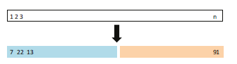
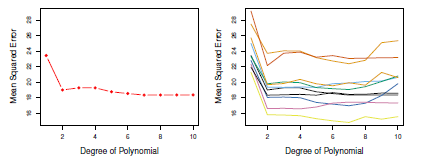
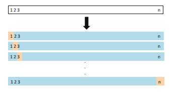
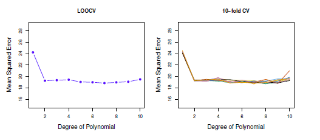
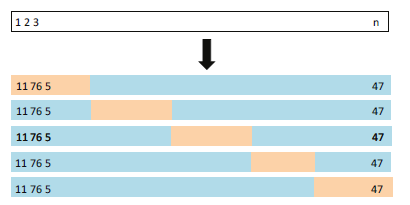
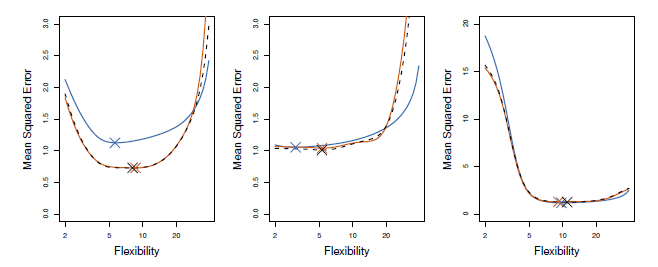
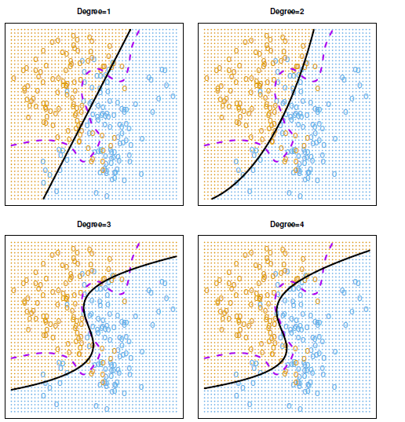
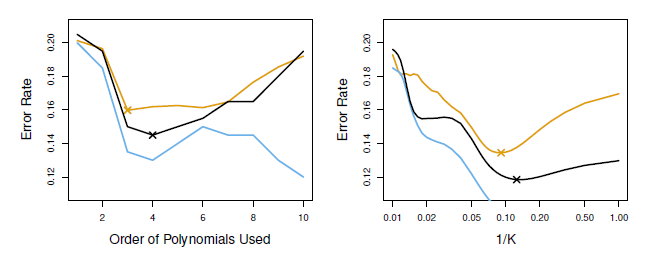
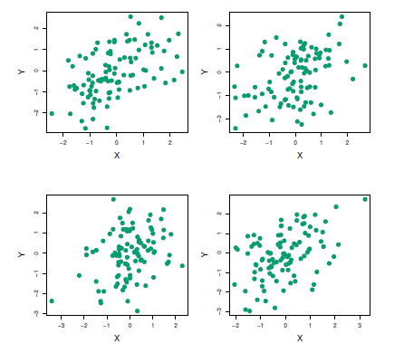
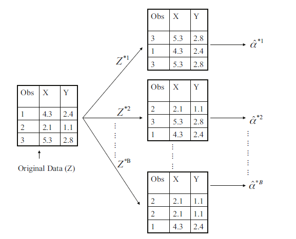

# [6. Méthodes de rééchantillonnage](#section6) #

[Retour README](../README.md)

<a name="toc"/>

[toc]

Les méthodes de rééchantillonnage sont un outil indispensable des statistiques modernes. Elles consistent à tirer de manière répétée des échantillons d'un ensemble d'apprentissage et à réajuster un modèle d'intérêt sur chaque échantillon afin d'obtenir des informations supplémentaires sur le modèle ajusté. Par exemple, afin d'estimer la variabilité de l'ajustement d'une régression linéaire, nous pouvons tirer à plusieurs reprises différents échantillons des données d'apprentissage, ajuster une régression linéaire à chaque nouvel échantillon, puis examiner dans quelle mesure les ajustements résultants diffèrent. Une telle approche peut nous permettre d'obtenir des informations qui ne seraient pas disponibles en ajustant le modèle une seule fois en utilisant l'échantillon d'entraînement original.

Les approches de rééchantillonnage peuvent être coûteuses en termes de calcul, car elles impliquent l'ajustement de la même méthode statistique plusieurs fois en utilisant différents sous-ensembles de données d'apprentissage. Cependant, grâce aux récents progrès de la puissance de calcul, les exigences de calcul des méthodes de rééchantillonnage ne sont généralement pas prohibitives. 

Nous abordons deux des méthodes de rééchantillonnage les plus couramment utilisées, la validation croisée et le bootstrap. Ces deux méthodes sont des outils importants dans l'application pratique de nombreuses procédures d'apprentissage statistique. Par exemple, la validation croisée peut être utilisée pour estimer l'erreur de test associée à une méthode d'apprentissage statistique donnée afin d'évaluer ses performances, ou pour sélectionner le niveau de flexibilité approprié. Le processus d'évaluation de la performance d'un modèle est connu sous le nom d'évaluation de modèle, tandis que le processus de sélection du niveau de flexibilité approprié pour un modèle est connu sous le nom de sélection de modèle. Le bootstrap est utilisé dans plusieurs contextes, le plus souvent pour fournir une mesure de la précision de l'estimation d'un paramètre ou d'une méthode d'apprentissage statistique donnée.

<a name="6-1"/>

## [6.1 Validation croisée](#6-1) ##

[Retour TOC](#toc)

Précédemment, nous avons discuté de la distinction entre le taux d'erreur de test et le taux d'erreur d'apprentissage. L'erreur de test est l'erreur moyenne qui résulte de l'utilisation d'une méthode d'apprentissage statistique pour prédire la réponse sur une nouvelle observation, c'est-à-dire une mesure qui n'a pas été utilisée pour la formation de la méthode. Pour un ensemble de données, l'utilisation d'une méthode d'apprentissage statistique particulière est justifiée si elle donne lieu à une faible erreur de test. L'erreur de test peut être facilement calculée si un ensemble de test désigné est disponible. Malheureusement, ce n'est généralement pas le cas. En revanche, l'erreur d'apprentissage peut être facilement calculée en appliquant la méthode d'apprentissage statistique aux observations utilisées pour son apprentissage. Mais comme nous l'avons vu, le taux d'erreur d'apprentissage est souvent très différent du taux d'erreur de test, et en particulier le premier peut considérablement sous-estimer le second.

En l'absence d'un très grand ensemble de test désigné qui peut être utilisé pour estimer directement le taux d'erreur de test, un certain nombre de techniques peuvent être utilisées pour estimer cette quantité à l'aide des données d'apprentissage disponibles. Certaines méthodes procèdent à un ajustement mathématique du taux d'erreur d'apprentissage afin d'estimer le taux d'erreur de test. Dans cette section, nous considérons plutôt une classe de méthodes qui estiment le taux d'erreur de test en excluant un sous-ensemble d'observations d'apprentissage du processus d'ajustement, puis en appliquant la méthode d'apprentissage statistique à ces observations exclues.

Dans les sections 6.1.1-6.1.4, pour des raisons de simplicité, nous supposons que nous sommes intéressés par une régression avec une réponse quantitative. Dans la section 6.1.5, nous considérons le cas de la classification avec une réponse qualitative. Comme nous le verrons, les concepts clés restent les mêmes, que la réponse soit quantitative ou qualitative.

<a name="6-1-1"/>

### [6.1.1 L'approche de l'ensemble de validation](#6-1-1) ###

[Retour TOC](#toc)

Supposons que nous souhaitions estimer l'erreur de test associée à l'application d'une méthode d'apprentissage statistique particulière à un ensemble d'observations. L'approche de l'ensemble de validation, présentée à la $figure\ 6.1$ , est une stratégie très simple pour cette tâche. Elle consiste à diviser aléatoirement l'ensemble d'observations disponible en deux parties, un ensemble d'apprentissage et un ensemble de validation ou ensemble d'exclusion. Le modèle est ajusté sur l'ensemble d'apprentissage, et le modèle ajusté est utilisé pour prédire les réponses des observations de l'ensemble de validation. Le taux d'erreur de l'ensemble de validation qui en résulte - généralement évalué à l'aide du $MSE$ dans le cas d'une réponse quantitative - fournit une estimation du taux d'erreur du test.

Nous illustrons l'approche de l'ensemble de validation sur l'ensemble de données Auto. Rappelez-vous, au chapitre 3, qu'il semble exister une relation non linéaire entre le nombre de kilomètres parcourus et la puissance en chevaux, et qu'un modèle qui prédit le nombre de kilomètres parcourus en utilisant la puissance en chevaux et la puissance en chevaux ${ }^2$ donne de meilleurs résultats qu'un modèle qui n'utilise qu'un terme linéaire. Il est naturel de se demander si un ajustement cubique ou d'ordre supérieur ne pourrait pas fournir des résultats plus précis?

<b>FIG 6.1.</b><i>[Représentation schématique de l'approche de l'ensemble de validation. Un ensemble de n observations est divisé aléatoirement en un ensemble d'apprentissage (représenté en bleu, contenant les observations 7, 22 et 13, entre autres) et un ensemble de validation (représenté en beige, contenant l'observation 91, entre autres). La méthode d'apprentissage statistique est adaptée à l'ensemble d'apprentissage, et ses performances sont évaluées sur l'ensemble de validation.](https://www.statlearning.com)</i>

Nous pouvons répondre à cette question en utilisant la méthode de validation. Nous avons divisé aléatoirement les 392 observations en deux ensembles, un ensemble d'apprentissage contenant 196 des points de données, et un ensemble de validation contenant les 196 observations restantes. Les taux d'erreur de l'ensemble de validation qui résultent de l'ajustement de divers modèles de régression sur l'échantillon d'apprentissage et de l'évaluation de leur performance sur l'échantillon de validation, en utilisant le $MSE$ comme mesure de l'erreur de l'ensemble de validation, sont présentés dans le panneau de gauche de la figure 5.2. Le $MSE$ de l'ensemble de validation pour l'ajustement quadratique est considérablement plus faible que pour l'ajustement linéaire. Cependant, le $MSE$ de l'ensemble de validation pour l'ajustement cubique est en fait légèrement supérieure à celle de l'ajustement quadratique. Cela implique que l'inclusion d'un terme cubique dans la régression ne conduit pas à une meilleure prédiction que la simple utilisation d'un terme quadratique.

Rappelez-vous que pour créer le panneau de gauche de la $figure\ 5.2$, nous avons divisé aléatoirement l'ensemble de données en deux parties, un ensemble d'apprentissage et un ensemble de validation. Si nous répétons le processus de division aléatoire de l'ensemble d'échantillons en deux parties, nous obtiendrons une estimation quelque peu différente de le $MSE$ de test. À titre d'illustration, le panneau de droite de la $figure\ 5.2$ présente dix courbes différentes de l'EQM de l'ensemble de données Auto, produites à l'aide de dix divisions aléatoires différentes des observations en ensembles de formation et de validation. Les dix courbes indiquent que le modèle avec un terme quadratique a une $MSE$ de l'ensemble de validation considérablement plus petite que le modèle avec seulement un terme linéaire. En outre, les dix courbes indiquent qu'il n'y a pas beaucoup d'avantages à inclure des termes cubiques ou polynomiaux d'ordre supérieur dans le modèle. Mais il convient de noter que chacune des dix courbes donne lieu à une estimation différente du $MSE$ de test pour chacun des dix modèles de régression considérés. Et il n'y a pas de consensus entre les courbes quant au modèle qui donne lieu à la plus petite $MSE$ de l'ensemble de validation. Sur la base de la variabilité entre ces courbes, tout ce que nous pouvons conclure avec certitude est que l'ajustement linéaire n'est pas adéquat pour ces données.

L'approche de l'ensemble de validation est conceptuellement simple et facile à mettre en œuvre. Mais elle présente deux inconvénients potentiels :

<b>FIG 6.2.</b><i> [L'approche de l'ensemble de validation a été utilisée sur l'ensemble de données Auto afin d'estimer l'erreur de test qui résulte de la prédiction du nombre de kilomètres parcourus à l'aide de fonctions polynomiales de la puissance. À gauche : estimations de l'erreur de validation pour une division unique en ensembles de données de formation et de validation. Droite : La méthode de validation a été répétée dix fois, en utilisant à chaque fois une division aléatoire différente des observations en un ensemble de formation et un ensemble de validation. Ceci illustre la variabilité de l'EQM de test estimée qui résulte de cette approche.](https://www.statlearning.com)</i>

1. Comme le montre le panneau de droite de la figure 5.2, l'estimation de validation du taux d'erreur de test peut être très variable, en fonction des observations précisément incluses dans l'ensemble d'apprentissage et des observations incluses dans l'ensemble de validation.

2. Dans l'approche de validation, seul un sous-ensemble d'observations - celles qui sont incluses dans l'ensemble d'apprentissage plutôt que dans l'ensemble de validation - est utilisé pour ajuster le modèle. Puisque les méthodes statistiques ont tendance à être moins performantes lorsqu'elles sont formées sur un nombre réduit d'observations, cela suggère que le taux d'erreur de l'ensemble de validation peut avoir tendance à surestimer le taux d'erreur du test pour le modèle ajusté sur l'ensemble des données.

Dans les prochaines sous-sections, nous présenterons la validation croisée, un raffinement de l'approche de l'ensemble de validation qui aborde ces deux problèmes.

<a name="6-1-2"/>

### [6.1.2 Validation croisée sans exclusion](#6-1-2) ###

[Retour TOC](#toc)

La validation croisée avec exclusion (***Leave-one-out cross-validation***) (LOOCV) est étroitement liée à l'approche par ensemble de validation de la $section\ 6.1.1$, mais elle tente de remédier aux inconvénients de cette méthode.

Comme l'approche de l'ensemble de validation, la LOOCV implique la division de l'ensemble d'observations en deux parties. Cependant, au lieu de créer deux sous-ensembles de taille comparable, une seule observation $\left(x_1, y_1\right)$ est utilisée pour l'ensemble de validation, et les observations restantes $\{(x_2, y_2),...,(x_n, y_n) \}$ 

constituent l'ensemble d'apprentissage. La méthode d'apprentissage statistique est ajustée sur les $n{-}1$ observations d'apprentissage, et une prédiction $\hat{y}_1$ est faite pour l'observation exclue, en utilisant sa valeur $x_1$. 

<b>FIG 6.3.</b><i> [Représentation schématique de LOOCV. Un ensemble de $n$ points de données est divisé de manière répétée en un ensemble d'apprentissage (représenté en bleu) contenant toutes les observations sauf une, et un ensemble de validation qui ne contient que cette observation (représenté en beige). L'erreur de test est ensuite estimée en faisant la moyenne des $n$ MSE résultants. Le premier ensemble d'apprentissage contient tout sauf l'observation 1, le deuxième ensemble d'apprentissage contient tout sauf l'observation 2, et ainsi de suite.)](https://www.statlearning.com)</i>

Puisque $\left(x_1, y_1\right)$ n'a pas été utilisé dans le processus d'ajustement, MSE $_1=$ $\left(y_1-\hat{y}_1\right)^2$ fournit une estimation approximativement non biaisée de l'erreur de test. Mais même si MSE $_1$ est sans biais pour l'erreur de test, il s'agit d'une mauvaise estimation car elle est très variable, puisqu'elle est basée sur une seule observation $\left(x_1, y_1\right)$.

Nous pouvons répéter la procédure en sélectionnant $\left(x_2, y_2\right)$ pour les données de validation, en entraînant la procédure d'apprentissage statistique sur les $n-1$ observations $\{(x_1, y_1),(x_3, y_3), \ldots,(x_n, y_n)\}$, et calculer ${MSE}_2=\left(y_2-\hat{y}_2\right)^2$. En répétant cette approche $n$ fois, on obtient $n$ erreurs quadratiques, ${MSE}_1, \ldots$, MSE $_n$. L'estimation LOOCV de la MSE du test est la moyenne de ces $n$ estimations d'erreurs de test :

$$
\mathrm{CV}_{(n)}=\frac{1}{n} \sum_{i=1}^n \mathrm{MSE}_i
$$

Un schéma de l'approche LOOCV est illustré à la $figure\ 6.3.$

LOOCV présente quelques avantages majeurs par rapport à l'approche de l'ensemble de validation. Premièrement, elle présente beaucoup moins de biais. Dans LOOCV, nous ajustons de manière répétée la méthode d'apprentissage statistique à l'aide d'ensembles d'apprentissage qui contiennent $n-1$ observations, soit presque autant que l'ensemble des données. Ceci est en contraste avec l'approche de l'ensemble de validation, dans laquelle l'ensemble d'apprentissage est généralement de la moitié de la taille de l'ensemble de données original. Par conséquent, l'approche LOOCV tend à ne pas surestimer le taux d'erreur du test autant que l'approche de l'ensemble de validation. Deuxièmement, contrairement à l'approche de validation qui donne des résultats différents lorsqu'elle est appliquée de manière répétée en raison du caractère aléatoire de la répartition des ensembles d'entraînement et de validation, l'exécution de LOOCV donnent toujours les mêmes résultats : il n'y a pas de caractère aléatoire dans la division des ensembles de formation/validation.

<b>FIG 6.4.</b><i> [La validation croisée a été utilisée sur l'ensemble de données Auto afin d'estimer l'erreur de test qui résulte de la prédiction du mpg à l'aide de fonctions polynomiales de la puissance. À gauche : la courbe d'erreur LOOCV. À droite : la CV 10 fois a été exécutée neuf fois, chacune avec une division aléatoire différente des données en dix parties. La figure montre les neuf courbes d'erreur $C V$ légèrement différentes.](https://www.statlearning.com)</i>

Nous avons utilisé LOOCV sur l'ensemble de données Auto afin d'obtenir une estimation du MSE de l'ensemble de test qui résulte de l'ajustement d'un modèle de régression linéaire pour prédire le mpg en utilisant des fonctions polynomiales de la puissance. Les résultats sont présentés dans le panneau de gauche de la $figure\ 6.4$.

LOOCV peut s'avérer coûteux à mettre en œuvre, car le modèle doit être ajusté n$ fois. Cela peut prendre beaucoup de temps si $n$ est grand, et si chaque modèle individuel est lent à ajuster. Avec la régression linéaire ou polynomiale des moindres carrés, un raccourci étonnant fait que le coût de LOOCV est le même que celui d'un ajustement de modèle unique ! La formule suivante s'applique :

<b>FIG 6.5.</b><i> [Une représentation schématique du CV 5-fois. Un ensemble de $n$ observations est divisé aléatoirement en cinq groupes non chevauchants. Chacun de ces cinquièmes agit comme un ensemble de validation (représenté en beige), et le reste comme un ensemble d'apprentissage (représenté en bleu). L'erreur de test est estimée en faisant la moyenne des cinq estimations MSE résultantes.](https://www.statlearning.com)</i>

Nous pourrions par exemple l'utiliser avec la régression logistique ou l'analyse discriminante linéaire, ou n'importe laquelle des méthodes abordées dans les chapitres suivants. La formule magique (5.2) ne tient pas en général, auquel cas le modèle doit être réajusté $n$ fois.

<a name="6-1-3"/>

### [6.1.3 Validation croisée k-Fold](#6-1-3) ###

[Retour TOC](#toc)

Une alternative à LOOCV est la $CV$ $k{-}fold$. Cette approche consiste à diviser aléatoirement l'ensemble des observations en $k$ groupes, ou plis, de taille approximativement égale. Le premier pli est traité comme un ensemble de validation, et la méthode est ajustée sur les $k-1$ plis restants. L'erreur quadratique moyenne, $MSE _1$, est ensuite calculée sur les observations du pli retenu. Cette procédure est répétée $k$ fois ; à chaque fois, un groupe différent d'observations est traité comme un ensemble de validation. Ce processus aboutit à $k$ estimations de l'erreur de test, $\mathrm{MSE}_1, \mathrm{MSE}_2, \ldots, \mathrm{MSE}_k$. La moyenne de ces valeurs permet de calculer l'estimation de l'indice de variabilité des $k{-}fold$,

$$
\mathrm{CV}_{(k)}=\frac{1}{k} \sum_{i=1}^k \mathrm{MSE}_i \text {. }
$$

La $figure\ 6.5$ illustre l'approche de la $k$-fold CV.

Il n'est pas difficile de voir que la méthode LOOCV est un cas particulier de la méthode des $k{-}fold\ CV$ dans laquelle $k$ est égal à $n$. Dans la pratique, on effectue généralement une $k{-}fold\ CV$ en utilisant $k=5$ ou $k=10$. Quel est l'avantage d'utiliser $k=5$ ou $k=10$ plutôt que $k=n$ ? L'avantage le plus évident est d'ordre informatique. LOOCV nécessite d'ajuster la méthode d'apprentissage statistique $n$ fois. Cela peut s'avérer coûteux en termes de calcul (sauf pour les modèles linéaires ajustés par les moindres carrés, auquel cas la formule (5.2) peut être utilisée). Mais la validation croisée est une approche très générale qui peut être appliquée à presque toutes les méthodes d'apprentissage statistique. Certaines méthodes d'apprentissage statistique ont un coût de calcul élevé.

$$
\mathrm{CV}_{(n)}=\frac{1}{n} \sum_{i=1}^n\left(\frac{y_i-\hat{y}_i}{1-h_i}\right)^2
$$

où $\hat{y}{i}$ est la $i^{ième}$ valeur ajustée à partir de l'ajustement original par les moindres carrés, et $h{\mathrm{i}}$ est le levier défini dans (3.37). C'est comme le MSE ordinaire, sauf que le $i^{ième}$ résidu est divisé par $1{-}h_i$. L'effet de levier se situe entre $1 / n$ et 1 , et reflète la mesure dans laquelle une observation influence son propre ajustement. Par conséquent, les résidus pour les points à fort effet de levier sont gonflés dans cette formule par exactement la bonne quantité pour que cette égalité soit respectée.

LOOCV est une méthode très générale, qui peut être utilisée avec tout type de modélisation prédictive. Par exemple, nous pouvons l'utiliser avec la régression logistique.

<b>FIG 6.6. </b><i> [MSE de test réelle et estimée pour les ensembles de données simulées des figures 2.9 (gauche), 2.10 (centre) et 2.11 (droite). La MSE de test réelle est représentée en bleu, l'estimation de la LOOCV est représentée par une ligne pointillée noire, et l'estimation du CV 10 fois est représentée en orange. Les croix indiquent le minimum de chacune des courbes MSE.](https://www.statlearning.com)</i>

Certaines méthodes d'apprentissage statistique ont des procédures d'ajustement exigeantes en termes de calcul, et donc l'exécution de LOOCV peut poser des problèmes de calcul, en particulier si $n$ est extrêmement grand. En revanche, l'exécution de $10{-fold}\ CV$ nécessite d'ajuster la procédure d'apprentissage seulement dix fois, ce qui peut être beaucoup plus faisable. Comme nous le verrons à la section 5.1.4, il peut également y avoir d'autres avantages non informatiques à effectuer un $5{-}fold\ CV$ ou $10{-}fold\ CV$, qui impliquent le compromis biais-variance.

Le panneau de droite de la $figure\ 6.4$ présente neuf estimations différentes du $10{-}fold\ CV$ pour l'ensemble de données Auto, chacune résultant d'une division aléatoire différente des observations en dix plis. Comme nous pouvons le voir sur la figure, il y a une certaine variabilité dans les estimations du CV en raison de la variabilité de la façon dont les observations sont divisées en dix plis. Mais cette variabilité est généralement beaucoup plus faible que la variabilité des estimations de l'erreur de test qui résulte de l'approche de l'ensemble de validation (panneau de droite de la $figure\ 6.2$).

Lorsque nous examinons des données réelles, nous ne connaissons pas la véritable $MSE$ de test, et il est donc difficile de déterminer la précision de l'estimation par validation croisée. Cependant, si nous examinons des données simulées, nous pouvons alors calculer la véritable $MSE$ de test et évaluer ainsi la précision de nos résultats de validation croisée. Dans la Figure 5.6, nous traçons les estimations de validation croisée et les taux d'erreur de test réels qui résultent de l'application de splines de lissage aux ensembles de données simulées illustrés dans les $Figures\ 2.9-2.11$ de la $section\ 2$. Le $MSE$ de test réel est affiché en bleu. Les lignes noires en pointillés et orange pleines montrent respectivement les estimations de la LOOCV et du $10{-}fold\ CV$. Dans les trois graphiques, les deux estimations par validation croisée sont très similaires. Dans le panneau de droite de la $figure\ 6.6$, le $MSE$ du test réel et les courbes de validation croisée sont presque identiques. Dans le panneau central de la $figure\ 6.6$, les deux ensembles de courbes sont similaires pour les degrés de flexibilité les plus faibles, tandis que les courbes de validation croisée surestiment le  $MSE$ de l'ensemble de test pour les degrés de flexibilité plus élevés. Dans le panneau de gauche de la $figure\ 6.6$, les courbes CV ont la forme générale correcte, mais elles sous-estiment la véritable MSE de test.

Lorsque nous effectuons une validation croisée, notre objectif peut être de déterminer la performance d'une procédure d'apprentissage statistique donnée sur des données indépendantes ; dans ce cas, l'estimation réelle de la MSE de test est intéressante. Mais dans d'autres cas, nous ne sommes intéressés que par l'emplacement du point minimum de la courbe estimée de la MSE de test. En effet, nous pouvons effectuer une validation croisée sur un certain nombre de méthodes d'apprentissage statistique, ou sur une seule méthode utilisant différents niveaux de flexibilité, afin d'identifier la méthode qui produit l'erreur de test la plus faible. À cette fin, l'emplacement du point minimum de la courbe de MSE de test estimée est important, mais la valeur réelle de la MSE de test estimée ne l'est pas. Nous constatons à la $figure\ 6.6$ que, malgré le fait qu'elles sous-estiment parfois la véritable MSE de test, toutes les courbes CV sont proches de l'identification du niveau correct de flexibilité - c'est-à-dire le niveau de flexibilité correspondant à la plus petite MSE de test.

<a name="6-1-4"/>

### [6.1.4 Compromis biais-variance pour la validation croisée à k-Fold](#6-1-4) ###

[Retour TOC](#toc)

Nous avons mentionné dans la $section\ 6.1.3$ que la validation croisée à $k{-}fold\ CV$ avec $k < n$ présente un avantage en termes de calcul par rapport à la validation croisée LOOCV. Mais en mettant de côté les problèmes de calcul, un avantage moins évident mais potentiellement plus important de la validation croisée $k{-}fold\ CV$  est qu'elle donne souvent des estimations plus précises du taux d'erreur du test que la méthode LOOCV. Ceci est lié à un compromis biais-variance.

Il a été mentionné dans la $section\ 6.1.1$ que l'approche de l'ensemble de validation peut conduire à des surestimations du taux d'erreur de test, puisque dans cette approche l'ensemble de formation utilisé pour ajuster la méthode d'apprentissage statistique ne contient que la moitié des observations de l'ensemble des données. En utilisant cette logique, il n'est pas difficile de voir que LOOCV donnera des estimations approximativement non biaisées de l'erreur de test, puisque chaque ensemble de formation contient $n{-}1$ observations, ce qui est presque autant que le nombre d'observations dans l'ensemble de données complet. Et l'exécution de $k{-}fold\ CV$  pour, par exemple, $k=5$ ou $k=10$ conduira à un niveau intermédiaire de biais, puisque chaque ensemble d'apprentissage contient environ $(k-1) n / k$ observations - moins que dans l'approche LOOCV, mais beaucoup plus que dans l'approche de l'ensemble de validation. Par conséquent, du point de vue de la réduction du biais, il est clair que LOOCV doit être préféré à $k{-}fold\ CV$ .

Cependant, nous savons que le biais n'est pas la seule source de préoccupation dans une procédure d'estimation ; nous devons également tenir compte de la variance de la procédure. Il s'avère que la variance de la LOOCV est plus élevée que celle de la $k{-}fold\ CV$  avec  $k < n$ . 

Pourquoi en est-il ainsi ? Lorsque nous effectuons la LOOCV, nous calculons en fait la moyenne des sorties de n modèles ajustés, chacun d'entre eux étant entraîné sur un ensemble d'observations presque identique ; par conséquent, ces sorties sont fortement (positivement) corrélées entre elles. En revanche, lorsque nous effectuons un $k{-}fold\ CV$  avec $k < n$, nous calculons la moyenne des sorties de $k$ modèles ajustés qui sont un peu moins corrélés les uns avec les autres, puisque le chevauchement entre les ensembles d'apprentissage de chaque modèle est plus faible. Comme la moyenne de nombreuses quantités fortement corrélées a une variance plus élevée que la moyenne de nombreuses quantités qui ne sont pas aussi fortement corrélées, l'estimation de l'erreur de test résultant de LOOCV a tendance à avoir une variance plus élevée que l'estimation de l'erreur de test résultant de $k$-fold CV.

En résumé, il existe un compromis biais-variance associé au choix de $k$ dans la validation croisée à  $k{-}fold\ CV$. En général, compte tenu de ces considérations, on effectue une validation croisée à  $k{-}fold\ CV$ en utilisant $k=5\ ou\ k=10$, car il a été démontré empiriquement que ces valeurs donnent des estimations du taux d'erreur de test qui ne souffrent ni d'un biais excessivement élevé ni d'une variance très élevée.

<a name="6-1-5"/>

### [6.1.5 Validation croisée sur les problèmes de classification](#6-1-5) ###

[Retour TOC](#toc)

Jusqu'à présent, dans ce chapitre, nous avons illustré l'utilisation de la validation croisée dans le cadre de la régression où le résultat $Y$ est quantitatif, et nous avons donc utilisé la MSE pour quantifier l'erreur de test. Mais la validation croisée peut également être une approche très utile dans le cadre de la classification lorsque $Y$ est qualitatif. Dans ce contexte, la validation croisée fonctionne juste comme décrit précédemment dans ce chapitre, sauf qu'au lieu d'utiliser $MSE$ pour quantifier l'erreur de test, nous utilisons le nombre d'observations mal classées. Par exemple, dans le cadre de la classification, le taux d'erreur LOOCV prend la forme suivante

$$
\mathrm{CV}_ {(n)}=\frac{1}{n} \sum_{i=1}^n {Err}_ i
$$

où $nom\ de\ l'opérateur{Err}_i=I\left(y_i \neq \hat{y}_i\right)$ . Le taux d'erreur $k{-}fold\ CV$ et les taux d'erreur de l'ensemble de validation sont définis de manière analogue.

À titre d'exemple, nous ajustons différents modèles de régression logistique sur les données de classification bidimensionnelles présentées à la $figure \ 2.13$. Dans le panneau supérieur gauche de la $Figure\ 6.7$, la ligne noire pleine montre la limite de décision estimée résultant de l'ajustement d'un modèle de régression logistique standard à cet ensemble de données. Puisqu'il s'agit de données simulées, nous pouvons calculer le taux d'erreur de test réel, qui prend une valeur de $0,201$ et est donc nettement supérieur au taux d'erreur de Bayes de $0,133$. Il est clair que la régression logistique n'est pas suffisamment flexible pour modéliser la limite de décision de Bayes dans ce contexte. Nous pouvons facilement étendre la régression logistique pour obtenir une limite de décision non linéaire en utilisant des fonctions polynomiales des prédicteurs, comme nous l'avons fait dans le cadre de la régression à la $section\ 3.3.2$. Par exemple, nous pouvons ajuster un modèle de régression logistique quadratique, donné par

$$
\log \left(\frac{p}{1-p}\right)=\beta_0+\beta_1 X_1+\beta_2 X_1^2+\beta_3 X_2+\beta_4 X_2^2 .
$$

Le panneau supérieur droit de la $figure\ 6.7$ affiche la frontière de décision résultante, qui est maintenant incurvée. Cependant, le taux d'erreur du test n'a été que légèrement amélioré, à $0,197$. Une amélioration beaucoup plus importante est apparente dans le panneau inférieur gauche de la $Figure\ 6.7$, dans laquelle nous avons ajusté un modèle de régression logistique impliquant des polynômes cubiques des prédicteurs. Maintenant, le taux d'erreur du test a diminué à $0,160$. Le passage à un polynôme quartique (en bas à droite) augmente légèrement l'erreur de test.

<b>FIGURE 6.7.</b><i>[Ajustements de régression logistique sur les données de classification bidimensionnelles affichées à la figure 2.13. La frontière de décision de Bayes est représentée à l'aide d'une ligne pointillée violette. Les limites de décision estimées à partir des régressions logistiques linéaires, quadratiques, cubiques et quartiques (degrés 1-4) sont affichées en noir. Les taux d'erreur de test pour les quatre ajustements de régression logistique sont respectivement de 0,201,0,197,0,160 et 0,162, tandis que le taux d'erreur de Bayes est de 0,133.](https://www.statlearning.com)</i>

En pratique, pour des données réelles, la limite de décision de Bayes et les taux d'erreur de test sont inconnus. Alors, comment décider entre les quatre modèles de régression logistique affichés dans la $Figure\ 6.7$ ? Nous pouvons utiliser la validation croisée pour prendre cette décision. Le panneau de gauche de la $Figure\ 6.8$ affiche en noir les taux d'erreur du $10{-}fold\ CV$ qui résultent de l'ajustement de dix modèles de régression logistique aux données, en utilisant des fonctions polynomiales des prédicteurs jusqu'au dixième ordre.

<b>FIG 6.8.</b><i>[Erreur de test (marron), erreur d'apprentissage (bleu) et 10-fold CV erreur (noir) sur les données de classification bidimensionnelles affichées à la figure 6.7. Gauche : Régression logistique utilisant des fonctions polynomiales des prédicteurs. L'ordre des polynômes utilisés est affiché sur l'axe des abscisses. Droite : Le classificateur KNN avec différentes valeurs de K, le nombre de voisins utilisés dans le classificateur KNN.](https://www.statlearning.com)</i>

Le panneau de gauche de la $Figure\ 6.8$ affiche en noir les taux d'erreur $10{-}fold\ CV$ qui résultent de l'ajustement de dix modèles de régression logistique aux données, en utilisant des fonctions polynomiales des prédicteurs jusqu'au dixième ordre. Les erreurs de test réelles sont indiquées en marron, et les erreurs d'apprentissage en bleu. Comme nous l'avons vu précédemment, l'erreur d'apprentissage a tendance à diminuer lorsque la flexibilité de l'ajustement augmente. (La figure indique que, bien que le taux d'erreur d'apprentissage ne diminue pas tout à fait de façon monotone, il a tendance à diminuer dans l'ensemble à mesure que la complexité du modèle augmente). En revanche, l'erreur de test présente une forme en U caractéristique. Le taux d'erreur de $10{-}fold\ CV$ fournit une assez bonne approximation du taux d'erreur de test. Bien qu'il sous-estime quelque peu le taux d'erreur, il atteint un minimum lorsque des polynômes du quatrième ordre sont utilisés, ce qui est très proche du minimum de la courbe de test, qui se produit lorsque des polynômes du troisième ordre sont utilisés. En fait, l'utilisation de polynômes d'ordre 4 conduirait probablement à une bonne performance de l'ensemble de test, car le taux d'erreur de test réel est approximativement le même pour les polynômes d'ordre 3, 4, 5 et 6.

Le panneau de droite de la $Figure\ 6.8$ affiche les trois mêmes courbes en utilisant l'approche KNN pour la classification, en fonction de la valeur de $K$ (qui dans ce contexte indique le nombre de voisins utilisés dans le classificateur KNN, plutôt que le nombre de $CV\ folds$ utilisés). Encore une fois, le taux d'erreur d'apprentissage diminue à mesure que la méthode devient plus flexible, et nous voyons donc que le taux d'erreur d'apprentissage ne peut pas être utilisé pour sélectionner la valeur optimale de $K$. Bien que la courbe d'erreur de validation croisée sous-estime légèrement le taux d'erreur de test, elle prend un minimum très proche de la meilleure valeur pour $K$.

<a name="6-2"/>

## [6.2 Le bootstrap](#6-2) ##

[Retour TOC](#toc)

Le bootstrap est un outil statistique extrêmement puissant et largement applicable qui peut être utilisé pour quantifier l'incertitude associée à un estimateur ou à une méthode d'apprentissage statistique donnée. À titre d'exemple simple, le bootstrap peut être utilisé pour estimer les erreurs standard des coefficients d'un ajustement de régression linéaire. Dans le cas spécifique de la régression linéaire, cela n'est pas particulièrement utile, puisque nous avons vu à la $section\ 3$ que les logiciels statistiques standard tels que R produisent automatiquement ces erreurs standard. Cependant, la puissance du bootstrap réside dans le fait qu'il peut être facilement appliqué à un large éventail de méthodes d'apprentissage statistique, y compris certaines pour lesquelles une mesure de la variabilité est autrement difficile à obtenir et n'est pas automatiquement produite par le logiciel statistique.

Dans cette section, nous illustrons le bootstrap sur un exemple fictif dans lequel nous souhaitons déterminer la meilleure répartition des investissements dans le cadre d'un modèle simple. Dans la $section\ 6.3$, nous explorons l'utilisation du bootstrap pour évaluer la variabilité associée aux coefficients de régression dans un ajustement de modèle linéaire.

Supposons que nous souhaitions investir une somme d'argent fixe dans deux actifs financiers qui rapportent respectivement $X$ et $Y$, où $X$ et $Y$ sont des quantités aléatoires. Nous investirons une fraction $\alpha$ de notre argent dans $X$, et nous investirons la fraction restante $1-\alpha$ dans $Y$. Étant donné la variabilité associée aux rendements de ces deux actifs, nous souhaitons choisir $\alpha$ pour minimiser le risque total, ou variance, de notre investissement. En d'autres termes, nous voulons minimiser ${Var}(\alpha X+(1-\alpha) Y)$. On peut montrer que la valeur qui minimise le risque est donnée par

$$
\alpha=\frac{\sigma_Y^2-\sigma_{X Y}}{\sigma_X^2+\sigma_Y^2-2 \sigma_{X Y}},
$$

où $\sigma_X^2={Var}(X), \sigma_Y^2={Var}(Y)$, et $\sigma_{X Y}={Cov}(X, Y)$.

En réalité, les quantités $\sigma_X^2$ , $\sigma_Y^2$ , et $\sigma_{X Y}$ sont inconnues. Nous pouvons calculer des estimations pour ces quantités,  $\sigma_X^2$ , $\sigma_Y^2$ , et $\sigma_{X Y}$, à l'aide d'un ensemble de données contenant les mesures passées de $X$ et $Y$. Nous pouvons alors estimer la valeur de $\alpha$ qui minimise la variance de notre investissement en utilisant

$$
\hat{\alpha}=\frac{\hat{\sigma}_Y^2-\hat{\sigma}_{X Y}}{\hat{\sigma}_X^2+\hat{\sigma}_Y^2-2 \hat{\sigma}_{X Y}} \hspace{6 em} (6.7)
$$

La $figure\ 6.9$ illustre cette approche pour estimer $\alpha$ sur un ensemble de données simulées. Dans chaque panneau, nous avons simulé 100 paires de rendements pour les investissements $X$ et $Y$. Nous avons utilisé ces rendements pour estimer $\sigma_X^2$ , $\sigma_Y^2$, et $\sigma_{X Y}$ , que nous avons ensuite substitués dans (6.7) afin d'obtenir des estimations pour $\alpha$. La valeur de $\hat{\alpha}$ résultant de chaque ensemble de données simulées varie de $0,532$  à  $0,657$.

Il est naturel de vouloir quantifier la précision de notre estimation de $\alpha$. Pour estimer l'écart type de $\hat{\alpha}$, nous avons répété 1 000 fois le processus de simulation de 100 observations appariées de $X$ et $Y$, et l'estimation de $\alpha$ à l'aide de (6.7). 

<b>FIG 6.9.</b><i>[Chaque panneau affiche 100 rendements simulés pour les investissements X et Y. De gauche à droite et de haut en bas, les estimations résultantes pour alpha sont 0,576, 0,532, 0,657 et 0,651..](https://www.statlearning.com) </i>

Nous avons ainsi obtenu 1 000 estimations de $\alpha$, que nous pouvons appeler $\hat\alpha_1$ , $\hat\alpha_2$ , $\ldots$ , $\hat\alpha_{1000}$  . Le panneau de gauche de la $figure\ 6.10$ présente un histogramme des estimations résultantes. Pour ces simulations, les paramètres ont été fixés à $\sigma_X^2=1$ , $\sigma_Y^2=1.25$ , et $\sigma_{X Y}=0.5$ , et ainsi nous savons que la vraie valeur de $\alpha$ qui est de  0.6. Nous avons indiqué cette valeur à l'aide d'une ligne verticale pleine sur l'histogramme. La moyenne des 1 000 estimations de $\alpha$ est la suivante

$$
\bar{\alpha}=\frac{1}{1000} \sideset{}{_{r=1}^{1000}}\sum \hat{\alpha}_r=0.5996,
$$

très proche de $\alpha=0.6$, et l'écart-type des estimations est de

$$
\sqrt{\frac{1}{1000-1} \sideset{}{_{r=1}^{1000}}\sum\left(\hat{\alpha}_r-\bar{\alpha}\right)^2}=0.083 .
$$

Cela nous donne une très bonne idée de la précision de $\hat{\alpha}$ : ${SE}(\hat{\alpha}) \approx 0.083$. Donc, en gros, pour un échantillon aléatoire de la population, nous nous attendons à ce que $\hat{\alpha}$ diffère de $\alpha$ d'environ $0,08$, en moyenne.

En pratique, cependant, la procédure d'estimation de $\mathrm{SE}(\hat{\alpha})$ décrite ci-dessus ne peut pas être appliquée, car pour les données réelles, nous ne pouvons pas générer de nouveaux échantillons de la population d'origine.

<b>FIG 6.10.</b><i>[A gauche : un histogramme des estimations de alpha obtenues en générant 1 000 ensembles de données simulées à partir de la vraie population. Centre : Un histogramme des estimations de $\alpha$ obtenues à partir de 1 000 échantillons bootstrap d'un seul ensemble de données. À droite : Les estimations de alpha affichées dans les panneaux de gauche et du centre sont présentées sous forme de boxplots. Dans chaque panneau, la ligne rose indique la vraie valeur de alpha.]()</i>

Cependant, l'approche bootstrap nous permet d'utiliser un ordinateur pour émuler le processus d'obtention de nouveaux ensembles d'échantillons, de sorte que nous pouvons estimer la variabilité de $\hat{\alpha}$ sans générer d'échantillons supplémentaires. Au lieu d'obtenir de manière répétée des ensembles de données indépendants à partir de la population, nous obtenons des ensembles de données distincts en échantillonnant de manière répétée les observations de l'ensemble de données original.

Cette approche est illustrée à la $figure\ 6.11$ sur un ensemble de données simple, que nous appelons $Z$, qui ne contient que $n=3$ observations. Nous sélectionnons aléatoirement $n$ observations de l'ensemble de données afin de produire un ensemble de données bootstrap, $Z^{* 1}$. L'échantillonnage est effectué avec remplacement, ce qui signifie que la même observation peut apparaître plus d'une fois dans l'ensemble de données bootstrap. Dans cet exemple, $Z^{* 1}$ contient la troisième observation deux fois, la première observation une fois, et aucune instance de la deuxième observation. Notez que si une observation est contenue dans $Z^{* 1}$, alors ses deux valeurs $X$ et $Y$ sont incluses. Nous pouvons utiliser $Z^{* 1}$ pour produire une nouvelle estimation bootstrap pour $\alpha$, que nous appelons $\hat{\alpha}^{* 1}$. Cette procédure est répétée $B$ fois pour une grande valeur de $B$, afin de produire $B$ ensembles de données bootstrap différents, $Z^{* 1}, Z^{* 2}, \ldots, Z^{* B}$, et $B$ estimations de $\alpha$ correspondantes, $\hat{\alpha}^{* 1}, \hat{\alpha}^{* 2}, \ldots, \hat{\alpha}^{* B}$. Nous pouvons calculer l'erreur standard de ces estimations bootstrap en utilisant la formule suivantela

$$
\mathrm{SE}_B(\hat{\alpha})=\sqrt{\frac{1}{B-1} \sideset{}{_{r=1}^B}\sum\left(\hat{\alpha}^{* r}-\frac{1}{B} \sideset{}{_{r^{\prime}=1}^B} \sum \hat{\alpha}^{* r^{\prime}}\right)^2} \hspace {6 em} (6.8)
$$

Cela sert d'estimation de l'erreur standard de $\hat{\alpha}$ estimée à partir de l'ensemble de données original.

L'approche bootstrap est illustrée dans le panneau central de la $figure\ 6.10$, qui présente un histogramme de 1 000 estimations bootstrap de $\alpha$, chacune étant calculée à partir d'un ensemble de données bootstrap distinct.

<b>FIG 6.11.</b><i>[Une illustration graphique de l'approche bootstrap sur un petit échantillon contenant n=3 observations. Chaque ensemble de données bootstrap contient n observations, échantillonnées avec remplacement à partir de l'ensemble de données original. Chaque ensemble de données bootstrap est utilisé pour obtenir une estimation de alpha](https://www.statlearning.com)</i>.

Ce panel a été construit sur la base d'un seul ensemble de données, et pourrait donc être créé à partir de données réelles. Notez que l'histogramme ressemble beaucoup à celui du panneau de gauche, qui affiche l'histogramme idéalisé des estimations de $\alpha$ obtenues en générant 1 000 ensembles de données simulées à partir de la vraie population. En particulier, l'estimation bootstrap $\mathrm{SE}(\hat{\alpha})$ de $(6.8)$ est de $0,087$, très proche de l'estimation de $0,083$ obtenue en utilisant 1 000 ensembles de données simulées. Le panneau de droite présente les informations des panneaux central et de gauche d'une manière différente, par le biais de diagrammes en boîte des estimations de $\alpha$ obtenues en générant 1 000 ensembles de données simulées à partir de la population réelle et en utilisant l'approche bootstrap. Là encore, les boxplots présentent des écarts similaires, ce qui indique que l'approche bootstrap peut être utilisée pour estimer efficacement la variabilité associée à $\hat{\alpha}$.

