# [9. Méthodes basées sur les arbres](#9) #

[Retour README](../README.md)

<a name="toc"/>

[toc]

Dans cette section, nous décrivons les méthodes de régression et de classification basées sur les arbres. Ces méthodes consistent à stratifier ou à segmenter l'espace de prédiction en un certain nombre de régions simples. Afin d'effectuer une prédiction pour une observation donnée, nous utilisons généralement la valeur de réponse moyenne ou modale pour les observations d'apprentissage dans la région à laquelle elle appartient. 

Puisque l'ensemble des règles de division utilisées pour segmenter l'espace prédicteur peut être résumé dans un arbre, ces types d'approches sont connus comme des ***méthodes d'arbre de décision***.

Les méthodes basées sur les arbres sont simples et utiles pour l'interprétation. Cependant, elles ne sont généralement pas compétitives avec les meilleures approches d'apprentissage supervisé, telles que celles présentées aux sections 7 et 8, en termes de précision de prédiction. C'est pourquoi, dans cette section, nous présentons également les arbres de type ***bagging***, ***random forests***, ***boosting*** et ***régression additive bayésienne***. Chacune de ces approches implique la production de plusieurs arbres qui sont ensuite combinés pour produire une seule prédiction consensuelle. Nous verrons que la combinaison d'un grand nombre d'arbres permet souvent d'améliorer considérablement la précision des prédictions, au prix d'une certaine perte d'interprétation.

<a name="9-1"/>

## [9.1 Les bases des arbres de décision](#9-1) ##

[Retour TOC](#toc)

Les arbres de décision peuvent être appliqués à la fois aux problèmes de régression et de classification. Nous considérons d'abord les problèmes de régression, puis nous passons à la classification.

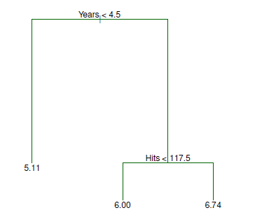

<b>FIG 9.1.</b><i>Pour les données Hitters, un arbre de régression permettant de prédire le salaire logarithmique d'un joueur de baseball, en fonction du nombre d'années où il a joué dans les ligues majeures et du nombre de hits qu'il a réalisés l'année précédente. À un nœud interne donné, l'étiquette (de la forme $X_j < t_k$ ) indique la branche de gauche émanant de cette division, et la branche de droite correspond à $X_j \geq t_k$. Par exemple, le fractionnement au sommet de l'arbre donne lieu à deux grandes branches. La branche de gauche correspond aux $années < 4,5$, et la branche de droite correspond aux $années > = 4,5$. L'arbre comporte deux nœuds internes et trois nœuds terminaux, ou feuilles. Le nombre dans chaque feuille est la moyenne de la réponse pour les observations qui y tombent.</i>

<a name="9-1-1"/>

### [9.1.1 Arbres de régression](#9-1-1) ###

Afin de motiver les arbres de régression, nous commençons par un exemple simple.

<a name="9-1-1-1"/>

#### [9.1.1.1 Prévision des salaires des joueurs de baseball à l'aide d'arbres de régression](#9-1-1-1) ####

[Retour TOC](#toc)

Nous utilisons l'ensemble de données ***Hitters*** pour prédire le salaire d'un joueur de baseball en fonction de ses années (le nombre d'années pendant lesquelles il a joué dans les ligues majeures) et de ses hits (le nombre de hits qu'il a réalisés l'année précédente). Nous supprimons d'abord les observations pour lesquelles il manque des valeurs de salaire, puis nous transformons le salaire en logarithme afin que sa distribution ait davantage la forme d'une cloche typique. (Rappelons que le Salaire est mesuré en milliers de dollars).

La $figure\ 9.1$ montre un arbre de régression adapté à ces données. Il se compose d'une série de règles de division, en commençant par le sommet de l'arbre. La division supérieure attribue les observations ayant  $Années < 4.5$ à la branche gauche ${ }^1$ . 

------

${ }^1$ Les années et les hits sont des entiers dans ces données ; la fonction $tree()$ de R étiquette les divisions au point médian entre deux valeurs adjacentes.

------

Le salaire prédit pour ces joueurs est donné par la valeur de réponse moyenne pour les joueurs de l'ensemble de données ayant une $année < 4,5$. 

Pour ces joueurs, le logarithme moyen du salaire est de $5.107$, et nous faisons donc une prédiction de $e^{5,107}$ milliers de dollars, soit $ 165\ 174\ dollars$, pour les joueurs suivants.

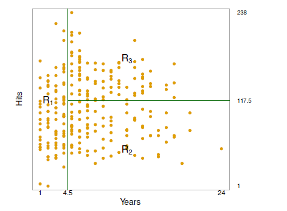

<b>FIGURE 9.2.</b><i>La partition en trois régions pour l'ensemble de données des frappeurs à partir de l'arbre de régression illustré à la figure 9.1.</i>.

Les joueurs ayant des $années > = 4,5$ sont affectés à la branche de droite, puis ce groupe est encore subdivisé par les Hits. Globalement, l'arbre stratifie ou segmente les joueurs en trois régions de l'espace prédicteur : les joueurs qui ont joué pendant quatre ans ou moins, les joueurs qui ont joué pendant cinq ans ou plus et qui ont fait moins de 118 hits l'année dernière, et les joueurs qui ont joué pendant cinq ans ou plus et qui ont fait au moins 118 hits l'année dernière. Ces trois régions peuvent s'écrire $R_1=\{\mathrm{X} \mid Years < 4.5\},\ R_2=\{\mathrm{X} \mid Years > = 4.5,\ Hits < 117.5\}$, et $R_3=\{\mathrm{X} \mid Years >=4.5,\ Hits > = 117.5\}$. 

La $figure\ 9.2$ illustre les régions en fonction des Années et des Hits. Les salaires prédits pour ces trois groupes sont respectivement de $1\ 000\ dollars \times e^{5.107}=\ 165\ 174\ dollars$, $1\ 000\ dollars \times e^{5.999}=402\ 834\ dollars$, et $1\ 000 \times e^{6.740}= 845\ 346\ dollars$.

Pour rester dans l'analogie de l'arbre, les régions $R_1$, $R_2$ et $R_3$ sont appelées nœuds terminaux ou feuilles de l'arbre. Comme c'est le cas pour la $figure\ 9.1$ , les arbres de décision sont généralement dessinés à l'envers, en ce sens que les feuilles se trouvent en bas de l'arbre. Les points de l'arbre où l'espace prédicteur est divisé sont appelés nœuds internes. Dans la $figure\ 9.1$ , les deux nœuds internes sont indiqués par les textes $Années < 4.5$ et $Hits < 117.5$. Les segments des arbres qui relient les nœuds sont appelés branches.

Nous pouvons interpréter l'arbre de régression affiché dans la $figure\ 9.1$ comme suit : Les années sont le facteur le plus important pour déterminer le salaire, et les joueurs avec moins d'expérience gagnent des salaires plus bas que les joueurs plus expérimentés. Étant donné qu'un joueur est moins expérimenté, le nombre de coups qu'il a fait l'année précédente semble jouer peu de rôle dans son salaire. Mais parmi les joueurs qui sont dans les ligues majeures depuis cinq ans ou plus, le nombre de coups réussis l'année précédente a une incidence sur le salaire, et les joueurs qui ont fait plus de coups réussis l'année précédente ont tendance à avoir des salaires plus élevés. L'arbre de régression présenté dans La $figure\ 9.1$ est probablement une simplification excessive de la relation réelle entre les succès, les années et le salaire. Cependant, elle présente des avantages par rapport à d'autres types de modèles de régression (tels que ceux présentés aux sections 4 et 7) : elle est plus facile à interpréter et offre une belle représentation graphique.

<a name="9-1-1-2"/>

#### [9.1.1.2 Prédiction via la stratification de l'espace des caractéristiques](#9-1-1-2) ####

[Retour TOC](#toc)

Nous allons maintenant aborder le processus de construction d'un arbre de régression. En gros, il y a deux étapes.

1. Nous divisons l'espace des prédicteurs - c'est-à-dire l'ensemble des valeurs possibles pour $X_1, X_2, \ldots, X_p$ - en $J$ régions distinctes et non chevauchantes, $R_1, R_2, \ldots, R_J$.

2. Pour chaque observation qui tombe dans la région $R_j$, nous faisons la même prédiction, qui est simplement la moyenne des valeurs de réponse pour les observations d'apprentissage dans $R_j$.

Par exemple, supposons qu'à l'étape 1, nous obtenions deux régions, $R_1$ et $R_2$, et que la moyenne des réponses des observations d'apprentissage dans la première région soit de 10 , tandis que la moyenne des réponses des observations d'apprentissage dans la deuxième région soit de 20 . Ainsi, pour une observation donnée $X = x$, si $x \in R_1$ nous prédisons une valeur de 10 , et si $x \in R_2$ nous prédisons une valeur de 20 .

Nous allons maintenant développer l'étape 1 ci-dessus. Comment construisons-nous les régions $R_1,\ ...,\ R_J$ ? En théorie, les régions peuvent avoir n'importe quelle forme. Cependant, nous choisissons de diviser l'espace prédicteur en rectangles à haute dimension, ou boîtes, pour des raisons de simplicité et pour faciliter l'interprétation du modèle prédictif résultant. L'objectif est de trouver les boîtes $R_1, \ldots, R_J$ qui minimisent le $RSS$, donné par

$$
\sideset{}{^J_ {j = 1}}\sum \sideset{}{_ {i \in R_ j}}\sum(y_ i - \hat{y}_ {R_ j})^2, \hspace{6 em} (9.1)
$$

où $\hat y_{R_j}$ est la réponse moyenne des observations d'apprentissage dans la $j^{ème}$ boîte. Malheureusement, il n'est pas possible, d'un point de vue informatique, de considérer toutes les partitions possibles de l'espace des caractéristiques en $J$ boîtes. C'est pourquoi nous adoptons une approche descendante et avide, connue sous le nom de division binaire récursive. Cette approche est descendante car elle commence au sommet de l'arbre (toutes les observations appartiennent alors à une seule région) et divise ensuite successivement l'espace des prédicteurs ; chaque division est indiquée par deux nouvelles branches plus bas dans l'arbre. Il est gourmand car à chaque étape du processus de construction de l'arbre, la meilleure division est effectuée à cette étape particulière, plutôt que de regarder en avant et de choisir une division qui conduira à un meilleur arbre dans une étape future.

Pour effectuer une division binaire récursive, nous sélectionnons d'abord le prédicteur $X_j$ et le point de coupe $s$ de telle sorte que la division de l'espace des prédicteurs dans les régions $\{X \mid X_j < s\}$ et $\{X \mid X_j \geq s\}$ entraîne la plus grande réduction possible du $RSS$ . (La notation $\{X \mid X_j < s\}$ signifie  la région de l'espace des prédicteurs dans laquelle $X_j$ prend une valeur inférieure à $s$ ). Autrement dit, nous considérons tous les prédicteurs $X_1, \ldots, X_p$, et toutes les valeurs possibles du point de coupure $s$ pour chacun des prédicteurs, puis nous choisissons le prédicteur et le point de coupure tels que l'arbre résultant présente le $RSS$ le plus faible. De manière plus détaillée, pour tout $j$ et $s$, nous définissons la paire de demi-plans suivants

$$
R_1(j, s)=\{X \mid X_j < s\} \text { and } R_2(j, s)=\{X \mid X_j \geq s\}, \hspace{6 em} (9.2)
$$

et nous cherchons la valeur de $j$ et $s$ qui minimise l'équation

$$
\sideset{}{_ {i: x_ i \in R_ 1(j, s)}}\sum(y_ i - \hat y_ {R_ 1})^2 + \sideset{}{_ {i: x_ i \in R_ 2(j, s)}}\sum(y_ i - \hat y_ {R_ 2})^2, \hspace{6 em} (9.3)
$$

où $\hat y_{R_1}$ est la réponse moyenne des observations d'apprentissage dans $R_1(j, s)$, et $\hat y_{R_2}$ est la réponse moyenne des observations d'apprentissage dans $R_2(j, s)$. La recherche des valeurs de $j$ et $s$ qui minimisent (9.3) peut être effectuée assez rapidement, en particulier lorsque le nombre de caractéristiques $p$ n'est pas trop grand.

Ensuite, nous répétons le processus, en recherchant le meilleur prédicteur et le meilleur point de coupure afin de diviser davantage les données de manière à minimiser le RSS dans chacune des régions résultantes. Cependant, cette fois, au lieu de diviser l'espace prédicteur entier, nous divisons l'une des deux régions identifiées précédemment. Nous avons maintenant trois régions. De nouveau, nous cherchons à diviser davantage l'une de ces trois régions, de manière à minimiser le RSS. Le processus se poursuit jusqu'à ce qu'un critère d'arrêt soit atteint ; par exemple, nous pouvons continuer jusqu'à ce qu'aucune région ne contienne plus de cinq observations.

Une fois que les régions $R_1, \ldots, R_J$ ont été créées, nous prédisons la réponse pour une observation de test donnée en utilisant la moyenne des observations d'apprentissage dans la région à laquelle cette observation de test appartient.

Un exemple à cinq régions de cette approche est présenté à la $figure\ 9.3$.

<a name="9-1-1-3"/>

#### [9.1.1.3 Élagage de l'arbre](#9-1-1-3) ####

[Retour TOC](#toc)

Le processus décrit ci-dessus peut produire de bonnes prédictions sur l'ensemble d'apprentissage, mais il est probable qu'il surajuste les données, ce qui entraîne de mauvaises performances sur l'ensemble de test. Cela est dû au fait que l'arbre résultant peut être trop complexe. Un arbre plus petit avec moins de scissions (c'est-à-dire moins de régions $R_1,\ ...,\ R_J$) pourrait conduire à une variance plus faible et à une meilleure interprétation au prix d'un léger biais. Une alternative possible au processus décrit ci-dessus consiste à ne construire l'arbre que tant que la diminution du $RSS$ due à chaque division dépasse un certain seuil (élevé). Cette stratégie permet d'obtenir des arbres plus petits, mais elle est trop myope, car une division apparemment sans valeur au début de l'arbre peut être suivie d'une très bonne division, c'est-à-dire une division qui entraîne une forte réduction du $RSS$ par la suite.

Par conséquent, une meilleure stratégie consiste à faire croître un très grand arbre $T_0$, puis à l'élaguer afin d'obtenir un sous-arbre. Comment déterminer la meilleure façon d'élaguer l'arbre ? Intuitivement, notre objectif est de sélectionner un sous-arbre qui conduit au taux d'erreur de test le plus faible. 

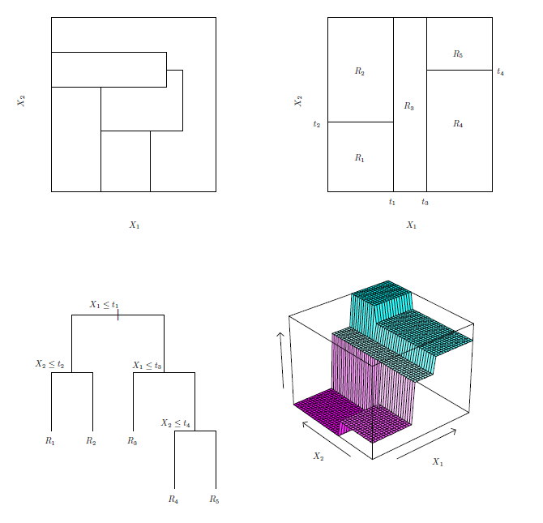

<b>FIGE 9.3.</b><i>En haut à gauche : une partition de l'espace des caractéristiques bidimensionnelles qui ne pourrait pas résulter d'un fractionnement binaire récursif. En haut à droite : Le résultat du fractionnement binaire récursif sur un exemple bidimensionnel. En bas à gauche : Un arbre correspondant à la partition du panneau supérieur droit. En bas à droite : Un tracé en perspective de la surface de prédiction correspondant à cet arbre.</i>

Étant donné un sous-arbre, nous pouvons estimer son erreur de test en utilisant la validation croisée ou l'approche de l'ensemble de validation. Cependant, l'estimation de l'erreur de validation croisée pour chaque sous-arbre possible serait trop encombrante, car il existe un nombre extrêmement important de sous-arbres possibles. Au lieu de cela, nous avons besoin d'un moyen de sélectionner un petit ensemble de sous-arbres à prendre en compte. L'élagage de la complexité des coûts - également connu sous le nom d'élagage du lien le plus faible - nous donne un moyen de faire juste cela. Plutôt que de prendre en compte tous les sous-arbres possibles, nous considérons une séquence d'arbres indexés par un paramètre d'accord non négatif $\alpha$. À chaque valeur de $\alpha$ correspond un sous-arbre $T \subset T_0$ tel que

$$
\sideset{}{^{|T|}_ {m = 1}}\sum \sideset{}{_ {i:x_ i \in R_ m}}\sum(y_ i - \hat y_ {R_ m})^2 + \alpha|T| \hspace{6 em} (9.4)
$$

est aussi petite que possible.

------

***Algorithme 9.1*** Construction d'un arbre de régression

------

1. Utilisez la division binaire récursive pour faire croître un grand arbre sur les données d'apprentissage, en ne s'arrêtant que lorsque chaque nœud terminal a moins qu'un certain nombre minimum d'observations.

2. Appliquer l'élagage de complexité des coûts au grand arbre afin d'obtenir une séquence des meilleurs sous-arbres, en fonction de $\alpha$.

3. Utiliser la validation croisée $K{-}fold$ pour choisir $\alpha$. C'est-à-dire, diviser les observations d'apprentissage en $K{-}fold$. Pour chaque $k = 1, \ldots, K$ :

   - (a) Répétez les étapes 1 et 2 sur les données d'apprentissage sauf le $k^{ème}{-}fold$.

   - (b) Évaluer l'erreur quadratique moyenne de prédiction sur les données du $k^{ème}{-}fold$ laissé de côté, en fonction de $\alpha$.

Faites la moyenne des résultats pour chaque valeur de $\alpha$, et choisissez $\alpha$ pour minimiser l'erreur moyenne.

4. Retourner le sous-arbre de l'étape 2 qui correspond à la valeur choisie de $\alpha$.

------

Ici, $|T|$ indique le nombre de nœuds terminaux de l'arbre $T, R_{m}$ est le rectangle (c'est-à-dire le sous-ensemble de l'espace du prédicteur) correspondant au $m$ème nœud terminal, et $\hat y_{R_{m}}$ est la réponse prédite associée à $R_{m}$ - c'est-à-dire la moyenne des observations d'apprentissage dans $R_{m}$. Le paramètre d'ajustement $\alpha$ contrôle un compromis entre la complexité du sous-arbre et son adéquation aux données d'apprentissage. Lorsque $\alpha=0$, le sous-arbre $T$ sera juste égal à $T_{0}$, car (9.4) mesure juste l'erreur d'apprentissage. Cependant, lorsque $\alpha$ augmente, il y a un prix à payer pour avoir un arbre avec de nombreux nœuds terminaux, et donc la quantité (9.4) aura tendance à être minimisée pour un sous-arbre plus petit. L'équation $9.4$ rappelle le lasso (7.7) de la section 7, dans lequel une formulation similaire était utilisée afin de contrôler la complexité d'un modèle linéaire.

Il s'avère qu'à mesure que nous augmentons $\alpha$ de zéro dans (9.4), les branches sont élaguées de l'arbre de manière imbriquée et prévisible, de sorte qu'il est facile d'obtenir la séquence complète des sous-arbres en fonction de $\alpha$. Nous pouvons sélectionner une valeur de $\alpha$ en utilisant un ensemble de validation ou en utilisant la validation croisée. Nous revenons ensuite à l'ensemble complet de données et obtenons le sous-arbre correspondant à $\alpha$. Ce processus est résumé dans l'algorithme 9.1.

Les $figures\ 9.4\ et\ 9.5$ présentent les résultats de l'ajustement et de l'élagage d'un arbre de régression sur les données Hitters, en utilisant neuf des caractéristiques. Tout d'abord, nous avons divisé aléatoirement l'ensemble de données en deux, ce qui a donné 132 observations dans l'ensemble d'apprentissage et 131 observations dans l'ensemble de test. Nous avons ensuite construit un grand arbre de régression sur les données d'apprentissage et fait varier $\alpha$ dans (9.4) afin de créer des sous-arbres avec différents nombres de nœuds terminaux. Enfin, nous avons effectué une validation croisée à six reprises afin d'estimer la MSE validée par recoupement des arbres en fonction de $\alpha$.

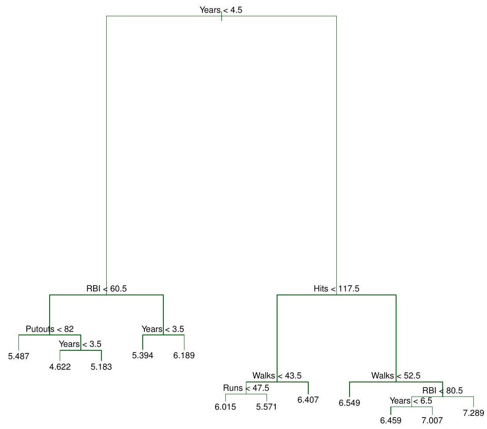

<b>FIG 9.4.</b><i> Analyse de l'arbre de régression pour les données Hitters. L'arbre non élagué qui résulte de la division descendante de type " greedy " sur les données d'apprentissage est illustré.</i>

(Nous avons choisi d'effectuer une validation croisée à six reprises car 132 est un multiple exact de six). L'arbre de régression non élagué est illustré à la $figure\ 9.4$. La courbe verte de la $figure\ 9.5$ montre l'erreur CV en fonction du nombre de feuilles, ${ }^2$ tandis que la courbe orange indique l'erreur de test. 

------

${ }^2$ Bien que l'erreur de CV soit calculée en fonction de $\alpha$, il est plus pratique d'afficher le résultat en fonction de $|T|$, le nombre de feuilles ; ceci est basé sur la relation entre $\alpha$ et $|T|$ dans l'arbre original développé pour toutes les données d'apprentissage. 

------

Les barres d'erreur standard autour des erreurs estimées sont également indiquées. Pour référence, la courbe d'erreur d'apprentissage est représentée en noir. L'erreur CV est une approximation raisonnable de l'erreur de test : l'erreur CV prend sa valeur minimale pour un arbre à trois nœuds, tandis que l'erreur de test descend également à l'arbre à trois nœuds (bien qu'elle prenne sa valeur la plus basse à l'arbre à dix nœuds). L'arbre élagué contenant trois nœuds terminaux est illustré à la $figure\ 9.1$.

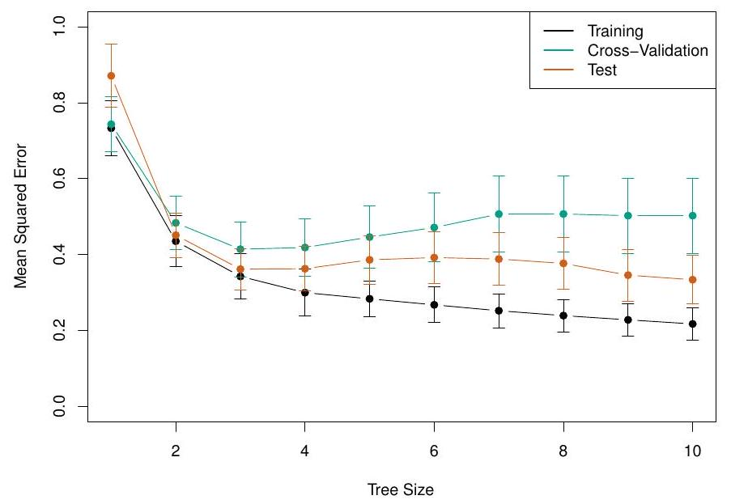

<b>FIG 9.5.</b><i> Analyse de l'arbre de régression pour les données Hitters. La MSE d'apprentissage, de validation croisée et de test est représentée en fonction du nombre de nœuds terminaux dans l'arbre élagué. Les bandes d'erreur standard sont affichées. L'erreur de validation croisée minimale est obtenue pour une taille d'arbre de trois.</i>

<a name="9-1-2"/>

### [9.1.2 Arbres de classification](#9-1-2) ###

[Retour TOC](#toc)

Un arbre de classification est très similaire à un arbre de régression, sauf qu'il est utilisé pour prédire une réponse qualitative plutôt que quantitative. Rappelons que pour un arbre de régression, la réponse prédite pour une observation est donnée par la réponse moyenne des observations d'apprentissage qui appartiennent au même nœud terminal. En revanche, pour un arbre de classification, nous prédisons que chaque observation appartient à la classe d'observations d'apprentissage la plus courante dans la région à laquelle elle appartient. En interprétant les résultats d'un arbre de classification, nous sommes souvent intéressés non seulement par la prédiction de classe correspondant à une région de nœud terminal particulière, mais aussi par les proportions de classe parmi les observations d'apprentissage qui tombent dans cette région.

La tâche de croissance d'un arbre de classification est assez similaire à celle d'un arbre de régression. Juste comme dans le cadre de la régression, nous utilisons le fractionnement binaire récursif pour faire croître un arbre de classification. Cependant, dans le cadre de la classification, le RSS ne peut pas être utilisé comme critère pour effectuer les séparations binaires. Une alternative naturelle au RSS est le taux d'erreur de classification. Puisque nous prévoyons d'assigner une observation dans une région donnée à la classe la plus courante des observations de formation dans cette région, le taux d'erreur de classification est simplement la fraction des observations de formation dans cette région qui n'appartiennent pas à la classe la plus courante:

$$
E=1-\max _{k}(\hat p_{m k}) . \hspace{6 em} (9.5)
$$

Ici, $\hat p_{mk}$ représente la proportion d'observations d'apprentissage dans la région $m$ qui appartiennent à la classe $k$. Cependant, il s'avère que l'erreur de classification n'est pas suffisamment sensible pour l'arborescence, et en pratique deux autres mesures sont préférables.

*L'indice de Gini est défini par*

$$
G = \sideset{}{^K_ {k = 1}}\sum \hat p_ {m k}(1 - \hat p_ {m k}) \hspace{6 em} (9.6)
$$

une mesure de la variance totale entre les classes de $K$. Il n'est pas difficile de voir que l'indice de Gini prend une petite valeur si toutes les valeurs de $\hat p_{mk}$ sont proches de zéro ou de un. Pour cette raison, l'indice de Gini est considéré comme une mesure de la pureté des nœuds - une petite valeur indique qu'un nœud contient principalement des observations d'une seule classe.

***Une alternative à l'indice de Gini est l'entropie, donnée par***

$$
D=- \sideset{}{^K_{k=1}}\sum \hat p_{mk} \log \hat p_{mk} \hspace{6 em} (9.7)
$$

Puisque $0 \leq \hat p_{mk} \leq 1$, il s'ensuit que $0 \leq-\hat p_{mk} \log \hat p_{mk}$. On peut montrer que l'entropie prendra une valeur proche de zéro si les $\hat p_{mk}$ sont tous proches de zéro ou de un. Par conséquent, comme l'indice de Gini, l'entropie prendra une petite valeur si le $m^{ème}$ nœud est pur. En fait, il s'avère que l'indice de Gini et l'entropie sont numériquement très similaires.

Lors de la construction d'un arbre de classification, l'indice de Gini ou l'entropie sont généralement utilisés pour évaluer la qualité d'une division particulière, car ces deux approches sont plus sensibles à la pureté des nœuds que le taux d'erreur de classification. Chacune de ces trois approches peut être utilisée lors de l'élagage de l'arbre, mais le taux d'erreur de classification est préférable si la précision de prédiction de l'arbre final élagué est le but recherché.

La $figure\ 9.6$ montre un exemple sur l'ensemble de données Heart. Ces données contiennent un résultat binaire HD pour 303 patients qui ont présenté une douleur thoracique. Une valeur de résultat de Oui indique la présence d'une maladie cardiaque basée sur un test angiographique, tandis que Non signifie l'absence de maladie cardiaque. Il existe 13 prédicteurs, dont l'âge, le sexe, le cholestérol (une mesure du cholestérol) et d'autres mesures de la fonction cardiaque et pulmonaire. La validation croisée donne lieu à un arbre comportant six nœuds terminaux.

Dans notre discussion jusqu'à présent, nous avons supposé que les variables prédicteurs prennent des valeurs continues. Cependant, les arbres de décision peuvent être construits même en présence de variables prédicteurs qualitatives. Par exemple, dans les données sur le cœur, certaines variables prédicteurs, telles que Sexe, Thal (épreuve d'effort au thallium) et Douleur thoracique, sont qualitatives. Par conséquent, une scission sur l'une de ces variables revient à affecter certaines des valeurs qualitatives à une branche et à affecter les autres à l'autre branche. Dans la figure 9.6, certains des nœuds internes correspondent à la division de variables qualitatives. Par exemple, le nœud interne supérieur correspond au fractionnement de Thal.

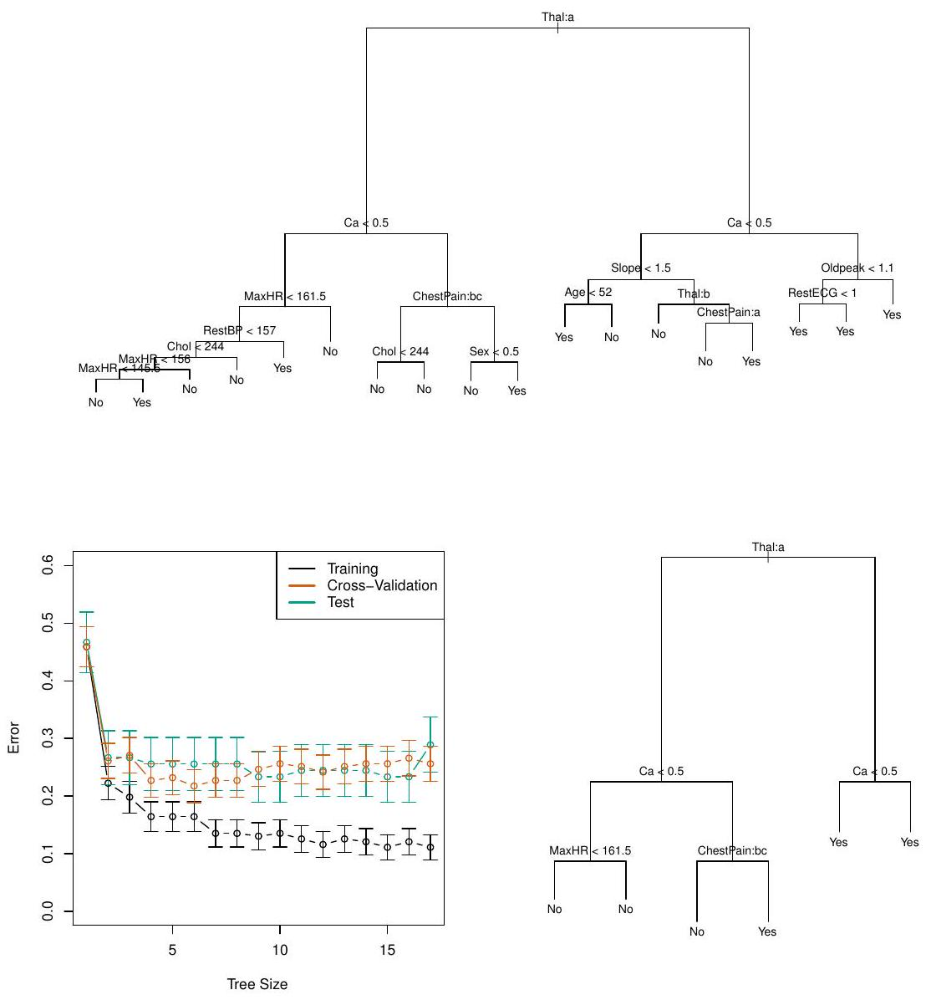

<b>FIG 9.6.</b><i>Données du cœur. En haut : l'arbre non élagué. En bas à gauche : erreur de validation croisée, erreur de formation et erreur de test, pour différentes tailles de l'arbre élagué. En bas à droite : L'arbre élagué correspondant à l'erreur de validation croisée minimale.</i>

Le nœud interne supérieur correspond à l'élagage de ***Thal***. Le texte $Thal:a$ indique que la branche de gauche sortant de ce nœud est constituée d'observations avec la première valeur de la variable Thal (normale), et le nœud de droite est constitué des autres observations (défauts fixes ou réversibles). Le texte $ChestPain : bc$ de la deuxième branche dans l'arbre à gauche indique que la branche de gauche sortant de ce noeud est constituée d'observations avec les deuxième et troisième valeurs de la variable ***ChestPain***, où les valeurs possibles sont angine typique, angine atypique, douleur non angineuse et asymptomatique.

La $figure\ 9.6$ présente une caractéristique surprenante : certains des fractionnements donnent deux nœuds terminaux qui ont la même valeur prédite. Par exemple, considérez la division $RestECG < 1$ près du coin inférieur droit de l'arbre non élagué. Quelle que soit la valeur de ***RestECG***, une valeur de réponse de Oui est prédite pour ces observations.

Pourquoi, alors, la scission est-elle effectuée ? La division est effectuée parce qu'elle conduit à une plus grande pureté des nœuds. C'est-à-dire que les 9 observations correspondant à la feuille de droite ont une valeur de réponse de Oui, alors que $7 / 11$ de celles correspondant à la feuille de gauche ont une valeur de réponse de Oui. Pourquoi la pureté des nœuds est-elle importante ? Supposons que nous ayons une observation de test qui appartient à la région donnée par la feuille de droite. Nous pouvons alors être pratiquement certains que sa valeur de réponse est Oui. En revanche, si une observation de test appartient à la région donnée par la feuille de gauche, alors sa valeur de réponse est probablement Oui, mais nous sommes beaucoup moins certains. Même si la division $RestECG < 1$ ne réduit pas l'erreur de classification, elle améliore l'indice de Gini et l'entropie, qui sont plus sensibles à la pureté des nœuds.

<a name="9-1-3"/>

### [9.1.3 Arbres par rapport aux modèles linéaires](#9-1-3) ###

[Retour TOC](#toc)

Les arbres de régression et de classification ont une saveur très différente des approches plus classiques de régression et de classification présentées dans les sections 4 et 5. En particulier, la régression linéaire suppose un modèle de la forme

$$
f(X)=\beta_0+\sideset{}{^p_{j=1}}\sum X_j \beta_j, \hspace{6 em} (9.8)
$$

alors que les arbres de régression supposent un modèle de la forme

$$
f(X)=\sideset{}{^M_{m=1}}\sum c_m \cdot 1_{(X \in R_m)} \hspace{6 em} (9.9)
$$

où $R_1, \ldots, R_M$ représentent une partition de l'espace des caractéristiques, comme dans la $figure\ 9.3$.

Quel modèle est le meilleur ? Cela dépend du problème à résoudre. Si la relation entre les caractéristiques et la réponse est bien approximée par un modèle linéaire comme dans (9.8), alors une approche telle que la régression linéaire fonctionnera probablement bien et sera plus performante qu'une méthode telle qu'un arbre de régression qui n'exploite pas cette structure linéaire. Si, au contraire, il existe une relation hautement non linéaire et complexe entre les caractéristiques et la réponse, comme l'indique le modèle (9.9), alors les arbres de décision peuvent surpasser les approches classiques. Un exemple illustratif est présenté à la figure 9.7. Les performances relatives des approches arborescentes et classiques peuvent être évaluées en estimant l'erreur de test, en utilisant la validation croisée ou l'approche par ensemble de validation (section 6).

Bien entendu, d'autres considérations que la simple erreur de test peuvent entrer en jeu dans le choix d'une méthode d'apprentissage statistique ; par exemple, dans certains contextes, la prédiction à l'aide d'un arbre peut être préférée pour des raisons d'interprétabilité et de visualisation.

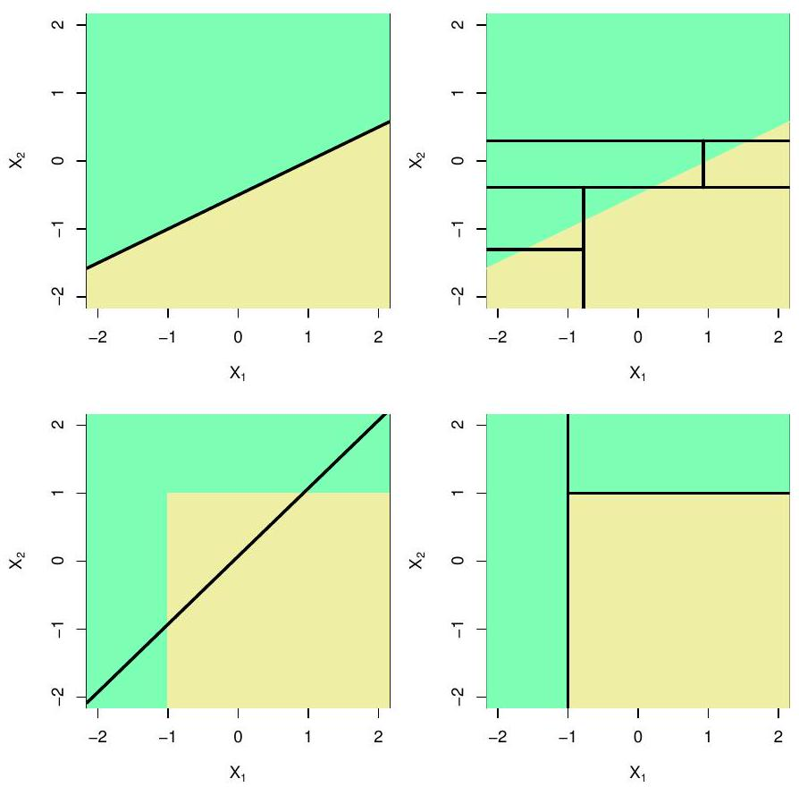

<b>FIG 9.7.</b><i>Rangée supérieure : Un exemple de classification bidimensionnelle dans lequel la véritable frontière de décision est linéaire, et est indiquée par les régions ombrées. Une approche classique qui suppose une frontière linéaire (à gauche) sera plus performante qu'un arbre de décision qui effectue des divisions parallèles aux axes (à droite). Rangée du bas : Ici, la véritable limite de décision est non linéaire. Ici, un modèle linéaire est incapable de capturer la véritable frontière de décision (à gauche), alors qu'un arbre de décision y parvient (à droite).</i>

<a name="9-1-4"/>

### [9.1.4 Avantages et inconvénients des arbres](#9-1-4) ###

[Retour TOC](#toc)

Les arbres de décision pour la régression et la classification ont un certain nombre d'avantages par rapport aux approches plus classiques vues aux sections 4 et 5 :

$\mathcal{\color{green} \text {Les avantages sont:}}$

- Les arbres sont très faciles à expliquer aux gens. En fait, ils sont même plus faciles à expliquer que la régression linéaire !

- Certains pensent que les arbres décisionnels reflètent plus fidèlement la prise de décision humaine que les approches de régression et de classification vues dans les chapitres précédents.
- Les arbres peuvent être affichés sous forme de graphique et sont faciles à interpréter, même par un non-expert (surtout s'ils sont petits).
- Les arbres peuvent facilement traiter des prédicteurs qualitatifs sans qu'il soit nécessaire de créer des variables fictives.

$\mathcal{\color{red} \text {Les inconvenients sont:}}$

- Malheureusement, les arbres n'ont généralement pas le même niveau de précision prédictive que certaines des autres approches de régression et de classification présentées dans cet ouvrage.
- En outre, les arbres peuvent être très peu robustes. En d'autres termes, un petit changement dans les données peut entraîner un changement important dans l'arbre final estimé.

Cependant, en agrégeant de nombreux arbres de décision, à l'aide de méthodes telles que le bagging, les forêts aléatoires et le boosting, la performance prédictive des arbres peut être considérablement améliorée. Nous présentons ces concepts dans la section suivante.

<a name="9-2"/>

## [9.2 Bagging, Forêts Aléatoires, Boosting et arbres de régression additifs bayésiens](#9-2) ##

Une méthode d'ensemble est une approche qui combine plusieurs modèles simples "modulaires" afin d'obtenir un modèle unique et potentiellement très puissant. Ces modèles simples sont parfois appelés "apprenants faibles", car ils peuvent donner lieu à des prédictions médiocres.

Nous allons maintenant aborder les méthodes de mise en sac, les forêts aléatoires, le boosting et les arbres de régression additifs bayésiens. Il s'agit de méthodes d'ensemble pour lesquelles le simple élément constitutif est un arbre de régression ou de classification.

<a name="9-2-1"/>

### [9.2.1 Mise en sac (Bagging)](#9-2-1) ###

[Retour TOC](#toc)

Le bootstrap, présenté à la section 6, est une idée extrêmement puissante. Il est utilisé dans de nombreuses situations où il est difficile, voire impossible, de calculer directement l'écart-type d'une quantité d'intérêt. Nous voyons ici que le bootstrap peut être utilisé dans un tout autre contexte, afin d'améliorer les méthodes d'apprentissage statistique telles que les arbres de décision.

Les arbres de décision discutés dans la $section\ 9.1$ souffrent d'une variance élevée. Cela signifie que si nous divisons les données d'apprentissage en deux parties au hasard et que nous adaptons un arbre de décision aux deux moitiés, les résultats que nous obtenons peuvent être très différents. En revanche, une procédure à faible variance donnera des résultats similaires si elle est appliquée de manière répétée à des ensembles de données distincts ; la régression linéaire tend à avoir une faible variance, si le rapport entre $n$ et $p$ est modérément grand. L'agrégation par bootstrap, ou mise en sac (bagging), est une procédure générale de réduction de la variance d'une méthode d'apprentissage statistique ; nous la présentons ici car elle est particulièrement utile et fréquemment utilisée dans le contexte des arbres de décision.

Rappelons qu'étant donné un ensemble de $n$ observations indépendantes $Z_1, \ldots, Z_n$, chacune avec une variance $\sigma^2$, la variance de la moyenne $\bar Z$ des observations est donnée par $\sigma^2 / n$. En d'autres termes, le calcul de la moyenne d'un ensemble d'observations réduit la variance. Par conséquent, une façon naturelle de réduire la variance et d'augmenter la précision de l'ensemble de test d'une méthode d'apprentissage statistique est de prendre de nombreux ensembles d'apprentissage de la population, de construire un modèle de prédiction distinct en utilisant chaque ensemble d'apprentissage, et de faire la moyenne des prédictions résultantes.

En d'autres termes, nous pourrions calculer $\hat f^1(x),\ \hat f^2(x),\ \ldots, \hat f^B(x)$ en utilisant $B$ ensembles d'apprentissage distincts, et en faire la moyenne afin d'obtenir un seul modèle d'apprentissage statistique à faible variance, donné par

$$
\hat f_{\mathrm{avg}}(x)=\frac{1}{B} \sideset{}{^B_{b=1}}\sum \hat f^b(x) .
$$

Bien entendu, cela n'est pas pratique car nous n'avons généralement pas accès à plusieurs ensembles d'apprentissage. Au lieu de cela, nous pouvons faire du bootstrap, en prenant des échantillons répétés de l'ensemble de données d'entraînement (unique). Dans cette approche, nous générons $B$ différents ensembles de données d'entraînement bootstrapés. Nous entraînons ensuite notre méthode sur le $b^{ème}$ ensemble de données d'entraînement bootstrapées afin d'obtenir $\hat f^{* b}(x)$, et enfin nous faisons la moyenne de toutes les prédictions, pour obtenir

$$
\hat f_{\mathrm{bag}}(x)=\frac{1}{B} \sideset{}{^B_{b=1}}\sum \hat f^{* b}(x) .
$$

C'est ce qu'on appelle la mise en sac (bagging).

Si la mise en sac peut améliorer les prédictions de nombreuses méthodes de régression, elle est particulièrement utile pour les arbres de décision. Pour appliquer le bagging aux arbres de régression, il suffit de construire $B$ arbres de régression en utilisant $B$ ensembles d'entraînement ***bootstrapped***, et de faire la moyenne des prédictions résultantes. Ces arbres sont développés en profondeur et ne sont pas élagués. Par conséquent, chaque arbre individuel a une variance élevée, mais un faible biais. Le calcul de la moyenne de ces $B$ arbres réduit la variance. Il a été démontré que la mise en sac permet d'améliorer considérablement la précision en combinant des centaines, voire des milliers d'arbres en une seule procédure.

Jusqu'à présent, nous avons décrit la procédure de mise en sac dans le contexte de la régression, pour prédire un résultat quantitatif $Y$. Comment peut-on étendre le bagging à un problème de classification où $Y$ est qualitatif ? Dans cette situation, il existe plusieurs approches possibles, mais la plus simple est la suivante. Pour une observation de test donnée, nous pouvons enregistrer la classe prédite par chacun des arbres $B$, et procéder à un vote majoritaire : la prédiction globale est la classe la plus fréquente parmi les prédictions $B$.

La $figure\ 9.8$ montre les résultats de la mise en sac des arbres sur les données de Heart. Le taux d'erreur de test est indiqué en fonction de $B$, le nombre d'arbres construits à l'aide d'ensembles de données d'entraînement bootstrapped. Nous constatons que le taux d'erreur du test de mise en sac est légèrement inférieur dans ce cas au taux d'erreur du test obtenu à partir d'un seul arbre. Le nombre d'arbres $B$ n'est pas un paramètre critique dans le cas de la mise en sac ; l'utilisation d'une très grande valeur de $B$ ne conduira pas à un surajustement. En pratique, nous utilisons une valeur de $B$ suffisamment grande pour que l'erreur se stabilise. L'utilisation de $B=100$ est suffisante pour obtenir de bonnes performances dans cet exemple.

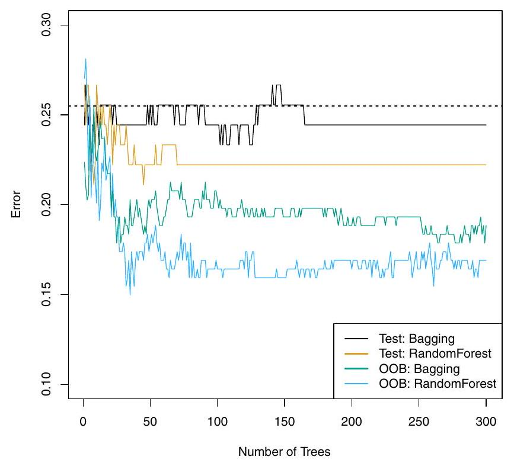	

<b>FIG 9.8.</b><i>Résultats de l'ensachage et de la forêt aléatoire pour les données du cœur. L'erreur de test (en noir et orange) est représentée en fonction de $B$, le nombre de jeux d'entraînement bootstrapped utilisés. Les forêts aléatoires ont été appliquées avec $m=\sqrt{p}$. La ligne pointillée indique l'erreur de test résultant d'un seul arbre de classification. Les traces vertes et bleues indiquent l'erreur OOB, qui dans ce cas est - par chance - considérablement plus faible.</i>

<a name="9-2-1-1"/>

#### [9.2.1.1 Estimation de l'erreur Out-of-Bag](#9-2-1-1) ####

[Retour TOC](#toc)

Il s'avère qu'il existe un moyen très simple d'estimer l'erreur de test d'un modèle bagué, sans avoir besoin d'effectuer une validation croisée ou l'approche de l'ensemble de validation. Rappelons que la clé du bagging est que les arbres sont ajustés de manière répétée à des sous-ensembles d'observations bootstrapped. On peut montrer qu'en moyenne, chaque arbre baggé utilise environ deux tiers des observations. Le tiers restant des observations qui n'est pas utilisé pour ajuster un arbre ensaché donné est appelé "observations hors sac" (OOB). Nous pouvons prédire la réponse pour la $i^{ème}$ observation en utilisant chacun des arbres dans lesquels cette observation était OOB. Cela donnera environ $B / 3$ prédictions pour la $i^{ème}$ observation. Afin d'obtenir une seule prédiction pour la $i$ ème observation, nous pouvons faire la moyenne de ces réponses prédites (si le but est la régression) ou prendre un vote majoritaire (si le but est la classification). Cela conduit à une prédiction OOB unique pour la $i$ ème observation. Une prédiction OOB peut être obtenue de cette manière pour chacune des $n$ observations, à partir de laquelle la $MSE$ OOB globale (pour un problème de régression) ou l'erreur de classification (pour un problème de classification) peut être calculée.

L'erreur $OOB$ qui en résulte est une estimation valide de l'erreur de test pour le modèle bagged, puisque la réponse pour chaque observation est prédite en utilisant uniquement les arbres qui n'ont pas été ajustés en utilisant cette observation. La $figure\ 9.8$ montre l'erreur $OOB$ sur les données de Heart. On peut montrer qu'avec $B$ suffisamment grand, l'erreur $OOB$ est pratiquement équivalente à l'erreur de validation croisée leave-one-out. L'approche $OOB$ pour l'estimation de l'erreur de test est particulièrement pratique lorsque l'on effectue une mise en sac sur de grands ensembles de données pour lesquels la validation croisée serait coûteuse en termes de calcul.

<a name="9-2-1-2"/>

#### [9.2.1.2 Mesures de l'importance des variables](#9-2-1-2) ####

[Retour TOC](#toc)

Comme nous l'avons vu, la mise en sac permet généralement d'améliorer la précision par rapport à la prédiction utilisant un seul arbre. Malheureusement, il peut être difficile d'interpréter le modèle résultant. Rappelons que l'un des avantages des arbres de décision est le diagramme attrayant et facile à interpréter qui en résulte, tel que celui présenté à la $figure\ 9.1$. Cependant, lorsque l'on met en sac un grand nombre d'arbres, il n'est plus possible de représenter la procédure d'apprentissage statistique résultante à l'aide d'un seul arbre, et il n'est plus possible de savoir quelles variables sont les plus importantes pour la procédure. Ainsi, la mise en sac améliore la précision de la prédiction au détriment de l'interprétabilité.

Bien que la collection d'arbres mis en sac soit beaucoup plus difficile à interpréter qu'un arbre unique, on peut obtenir un résumé global de l'importance de chaque prédicteur en utilisant le RSS (pour les arbres de régression mis en sac) ou l'indice de Gini (pour les arbres de classification mis en sac). Dans le cas des arbres de régression en sac, nous pouvons enregistrer le montant total de la diminution du $RSS$ (9.1) due aux divisions sur un prédicteur donné, en faisant la moyenne sur tous les arbres $B$. Une valeur élevée indique un prédicteur important. De même, dans le contexte des arbres de classification en sac, nous pouvons additionner le montant total de la diminution de l'indice de Gini (9.6) due aux divisions sur un prédicteur donné, en moyenne sur tous les arbres $B$.

La $figure\ 9.9$ présente une représentation graphique de l'importance des variables dans les données sur le cœur. Nous voyons la diminution moyenne de l'indice de Gini pour chaque variable, par rapport à la plus grande. Les variables présentant la plus grande diminution moyenne de l'indice de Gini sont ***Thal***, ***Ca*** et ***ChestPain***.

<a name="9-2-2"/>

### [9.2.2 Forêts aléatoires](#9-2-2) ###

[Retour TOC](#toc)

Les forêts aléatoires offrent une amélioration par rapport aux arbres en sac par le biais d'une petite modification qui permet de décorréler les arbres. Comme pour la mise en sac, nous construisons un certain nombre d'arbres de décision sur des échantillons d'entraînement bootstrapped. Mais lors de la construction de ces arbres de décision, chaque fois qu'une division dans un arbre est envisagée, un échantillon aléatoire de $m$ prédicteurs est choisi comme candidats à la division parmi l'ensemble complet de $p$ prédicteurs. La division ne peut utiliser qu'un seul de ces $m$ prédicteurs. Un nouvel échantillon de $m$ prédicteurs est prélevé à chaque division, et nous choisissons généralement $m \approx \sqrt{p}$, c'est-à-dire que le nombre de prédicteurs pris en compte à chaque division est approximativement égal à la racine carrée du nombre total de prédicteurs (4 sur 13 pour les données de Heart).

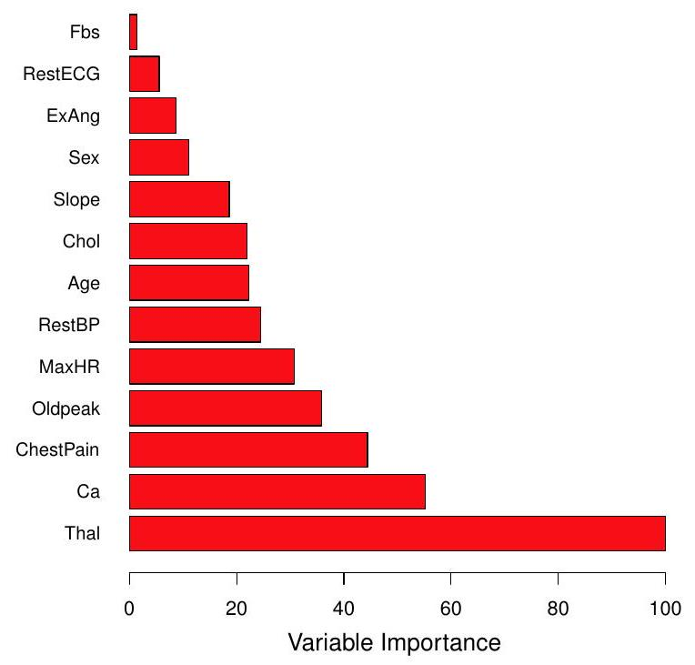

<b>FIG 9.9.</b><i> Graphique de l'importance des variables pour les données de Heart. L'importance des variables est calculée en utilisant la diminution moyenne de l'indice de Gini, et exprimée par rapport au maximum.</i>

En d'autres termes, lors de la construction d'une forêt aléatoire, à chaque division de l'arbre, l'algorithme n'est même pas autorisé à prendre en compte la majorité des prédicteurs disponibles. Cela peut sembler fou, mais il y a une raison intelligente à cela. Supposons qu'il existe un prédicteur très fort dans l'ensemble de données, ainsi qu'un certain nombre d'autres prédicteurs modérément forts. Alors, dans la collection d'arbres mis en sac, la plupart ou la totalité des arbres utiliseront ce prédicteur fort dans la division supérieure. Par conséquent, tous les arbres regroupés seront assez similaires les uns aux autres. Les prédictions des arbres regroupés seront donc fortement corrélées. Malheureusement, la moyenne de nombreuses quantités fortement corrélées n'entraîne pas une réduction de la variance aussi importante que la moyenne de nombreuses quantités non corrélées. En particulier, cela signifie que la mise en sac n'entraînera pas une réduction substantielle de la variance par rapport à un seul arbre dans ce contexte.

Les forêts aléatoires surmontent ce problème en forçant chaque division à ne considérer qu'un sous-ensemble des prédicteurs. Par conséquent, en moyenne $(p-m) / p$ des divisions ne prendront même pas en compte le prédicteur fort, et les autres prédicteurs auront donc plus de chances. Nous pouvons considérer ce processus comme une décorrélation des arbres, rendant ainsi la moyenne des arbres résultants moins variable et donc plus fiable.

La principale différence entre le bagging et les forêts aléatoires est le choix de la taille du sous-ensemble de prédicteurs $m$. Par exemple, si une forêt aléatoire est construite en utilisant $m=p$, cela revient à une simple mise en sac. Sur les données de Heart, les forêts aléatoires utilisant $m=\sqrt{p}$ entraînent une réduction de l'erreur de test et de l'erreur $OOB$ par rapport à la mise en sac (figure 9.8).

L'utilisation d'une petite valeur de $m$ dans la construction d'une forêt aléatoire est généralement utile lorsque nous avons un grand nombre de prédicteurs corrélés. Nous avons appliqué les forêts aléatoires à un ensemble de données biologiques de haute dimension constitué des mesures d'expression de 4 718 gènes mesurées sur des échantillons de tissus provenant de 349 patients. Il existe environ 20 000 gènes chez l'homme, et les gènes individuels ont différents niveaux d'activité, ou d'expression, dans des cellules, des tissus et des conditions biologiques particuliers. Dans cet ensemble de données, chacun des échantillons de patients a une étiquette qualitative avec 15 niveaux différents : soit normal, soit un des 14 types de cancer. Notre objectif était d'utiliser les forêts aléatoires pour prédire le type de cancer sur la base des 500 gènes qui ont la plus grande variance dans l'ensemble d'entraînement. Nous avons divisé aléatoirement les observations en un ensemble d'apprentissage et un ensemble de test, et nous avons appliqué les forêts aléatoires à l'ensemble d'apprentissage pour trois valeurs différentes du nombre de variables de division $m$. Les résultats sont présentés à la $figure\ 9.10$. Le taux d'erreur d'un arbre unique est de $45,7 \%$, et le taux nul est de $75,4 \% .^4$ 

------

${ }^4$ Le taux nul résulte de la simple classification de chaque observation dans la classe dominante globale, qui est dans ce cas la classe normale.

------

Nous voyons que l'utilisation de 400 arbres est suffisante pour obtenir de bonnes performances, et que le choix $m=\sqrt{p}$ a donné une petite amélioration de l'erreur de test par rapport à la mise en sac $(m=p)$ dans cet exemple. Comme pour la mise en sac, les forêts aléatoires ne se surajusteront pas si nous augmentons $B$, donc en pratique nous utilisons une valeur de $B$ suffisamment grande pour que le taux d'erreur se soit stabilisé.

<a name="9-2-3"/>

### [9.2.3 Boosting](#9-2-3) ###

[Retour TOC](#toc)

Nous allons maintenant aborder le boosting, une autre approche pour améliorer les prédictions résultant d'un arbre de décision. Comme le bagging, le boosting est une approche générale qui peut être appliquée à de nombreuses méthodes d'apprentissage statistique pour la régression ou la classification. Nous limitons ici notre discussion sur le boosting au contexte des arbres de décision.

Rappelons que la mise en sac implique la création de plusieurs copies de l'ensemble de données d'entraînement original à l'aide du bootstrap, l'adaptation d'un arbre de décision distinct à chaque copie, puis la combinaison de tous les arbres afin de créer un modèle prédictif unique. Notamment, chaque arbre est construit sur un ensemble de données bootstrap, indépendamment des autres arbres. Le boosting fonctionne de manière similaire, sauf que les arbres sont développés de manière séquentielle : chaque arbre est développé en utilisant les informations des arbres précédents. Le boosting n'implique pas d'échantillonnage bootstrap ; au lieu de cela, chaque arbre est ajusté sur une version modifiée de l'ensemble de données original.

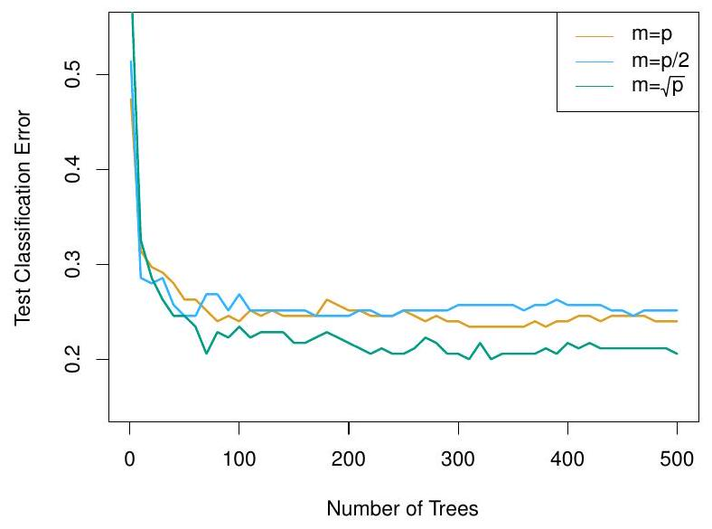

<b>FIG 9.10.</b><i> Résultats des forêts aléatoires pour l'ensemble de données d'expression génique de 15 classes avec $p=500$ prédicteurs. L'erreur de test est affichée en fonction du nombre d'arbres. Chaque ligne colorée correspond à une valeur différente de $m$, le nombre de prédicteurs disponibles pour le fractionnement à chaque nœud d'arbre intérieur. Les forêts aléatoires $(m < p)$ conduisent à une légère amélioration par rapport au bagging $(m = p)$. Un arbre de classification unique a un taux d'erreur de $45,7 \%$. </i>

Considérons d'abord le cadre de la régression. Comme le bagging, le boosting consiste à combiner un grand nombre d'arbres de décision, $\hat f^1, \ldots, \hat f^B$. Le boosting est décrit dans l'algorithme 9.2.

Quelle est l'idée derrière cette procédure ? Contrairement à l'adaptation d'un grand arbre de décision unique aux données, qui revient à adapter les données de manière stricte et potentiellement à les sur adapter, l'approche Boosting apprend lentement. Étant donné le modèle actuel, nous adaptons un arbre de décision aux résidus du modèle. En d'autres termes, nous ajustons un arbre en utilisant les résidus actuels, plutôt que le résultat $Y$, comme réponse. Nous ajoutons ensuite ce nouvel arbre de décision à la fonction ajustée afin d'actualiser les résidus. Chacun de ces arbres peut être assez petit, avec juste quelques nœuds terminaux, déterminés par le paramètre $d$ de l'algorithme. En adaptant de petits arbres aux résidus, nous améliorons lentement $\hat f$ dans les domaines où il n'est pas performant. Le paramètre de rétrécissement $\lambda$ ralentit encore plus le processus, permettant à des arbres plus nombreux et de formes différentes d'attaquer les résidus. En général, les approches d'apprentissage statistique qui apprennent lentement ont tendance à être performantes. Notez que dans le boosting, contrairement au bagging, la construction de chaque arbre dépend fortement des arbres qui ont déjà été cultivés.

Nous venons juste de décrire le processus de boosting des arbres de régression. Le boosting des arbres de classification procède de manière similaire mais légèrement plus complexe, et les détails sont omis ici.

Le boosting possède trois paramètres de réglage :

------

***Algorithme $9.2$*** Boosting pour les arbres de régression

------

1. Définir $\hat f(x) = 0$ et $r_i = y_i$ pour tous les $i$ de l'ensemble d'apprentissage.

2. Pour $b = 1,2, \ldots, B$, répétez :

   (a) Ajuster un arbre $\hat f^b$ avec $d$ divisions ( $d + 1$ nœuds terminaux) à l'apprentissage ${data}(X, r)$.

   (b) Mettre à jour $\hat f$ en ajoutant une version réduite du nouvel arbre :

$$
\hat f(x) \leftarrow \hat f(x)+\lambda \hat f^b(x) .
$$

​		(c) Mettre à jour les résidus,

$$
r_i \leftarrow r_i-\lambda \hat f^b(x_i) .
$$

3. Produire le modèle boosté,

$$
\hat f(x)=\sideset{}{^B_{b=1}}\sum \lambda \hat f^b(x) .
$$

------

1. Le nombre d'arbres $B$. Contrairement à la mise en sac et aux forêts aléatoires, le boosting peut être surajusté si $B$ est trop grand, bien que ce surajustement ait tendance à se produire lentement, voire pas du tout. Nous utilisons la validation croisée pour sélectionner $B$.

2. Le paramètre de rétrécissement $\lambda$, un petit nombre positif. Il contrôle la vitesse à laquelle le boosting apprend. Les valeurs typiques sont $0,01$ ou $0,001$, et le bon choix peut dépendre du problème. De très petits $\lambda$ peuvent nécessiter l'utilisation d'une très grande valeur de $B$ afin d'obtenir de bonnes performances.

3. Le nombre $d$ de splits dans chaque arbre, qui contrôle la complexité de l'ensemble boosté. Souvent, $d = 1$ fonctionne bien, dans ce cas, chaque arbre est une souche, constituée d'une seule division. Dans ce cas, l'ensemble boosté ajuste un modèle additif, puisque chaque terme n'implique qu'une seule variable. Plus généralement, $d$ est la profondeur d'interaction, et contrôle l'ordre d'interaction du modèle boosté, puisque $d$ splits peuvent impliquer au plus $d$ variables.

Dans la $figure\ 9.11$, nous avons appliqué le boosting à l'ensemble de données d'expression génétique du cancer à 15 classes, afin de développer un classificateur capable de distinguer la classe normale des 14 classes de cancer. Nous affichons l'erreur de test en fonction du nombre total d'arbres et de la profondeur d'interaction $d$. Nous constatons que les souches simples avec une profondeur d'interaction de un donnent de bons résultats si elles sont suffisamment nombreuses. Ce modèle est plus performant que le modèle de profondeur deux, et les deux sont plus performants qu'une forêt aléatoire. Cela met en évidence une différence entre le boosting et les forêts aléatoires : dans le boosting, et les forêts aléatoires : dans le boosting, étant donné que la croissance d'un arbre particulier prend en compte les autres arbres qui ont déjà été développés, des arbres plus petits sont généralement suffisants. L'utilisation d'arbres plus petits peut également faciliter l'interprétation ; par exemple, l'utilisation de souches conduit à un modèle additif.

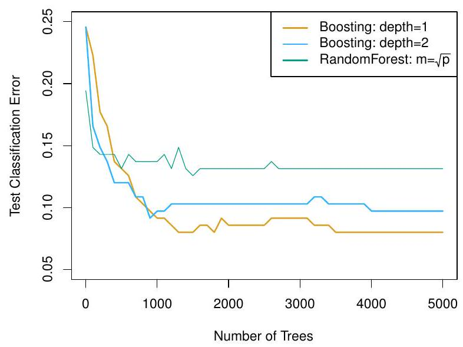

<b>FIG 9.11.</b><i>  Résultats de l'exécution de boosting et de forêts aléatoires sur l'ensemble de données d'expression génique de 15 classes afin de prédire le cancer par rapport à la normale. L'erreur de test est affichée en fonction du nombre d'arbres. Pour les deux modèles boostés, $\lambda=0.01$. Les arbres de profondeur 1 surpassent légèrement les arbres de profondeur 2, et les deux surpassent la forêt aléatoire, bien que les erreurs standard soient d'environ 0,02, ce qui rend aucune de ces différences significative. Le taux d'erreur de test pour un seul arbre est de $24 \%$. </i>

<a name="9-2-4"/>

### [9.2.4 Arbres de régression additifs bayésiens](#9-2-4) ###

[Retour TOC](#toc)

Enfin, nous aborderons les arbres de régression additifs bayésiens (BART), une autre méthode d'ensemble qui utilise des arbres de décision comme éléments constitutifs. Pour simplifier, nous présentons BART pour la régression (par opposition à la classification).

Rappelons que le bagging et les forêts aléatoires font des prédictions à partir d'une moyenne d'arbres de régression, chacun d'entre eux étant construit à l'aide d'un échantillon aléatoire de données et/ou de prédicteurs. Chaque arbre est construit séparément des autres. En revanche, le boosting utilise une somme pondérée d'arbres, dont chacun est construit en ajustant un arbre au résidu de l'ajustement actuel. Ainsi, chaque nouvel arbre tente de capturer le signal qui n'est pas encore pris en compte par l'ensemble actuel d'arbres. BART est lié à ces deux approches : chaque arbre est construit de manière aléatoire comme dans le bagging et les forêts aléatoires, et chaque arbre tente de capturer le signal qui n'est pas encore pris en compte par le modèle actuel, comme dans le boosting. La principale nouveauté de BART est la manière dont les nouveaux arbres sont générés.

Avant de présenter l'algorithme BART, nous définissons quelques notations. Nous laissons $K$ désigner le nombre d'arbres de régression et $B$ le nombre d'itérations pour lesquelles l'algorithme BART sera exécuté. La notation $\hat f_k^b(x)$ représente

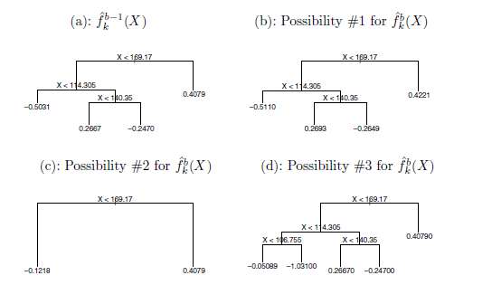

<b>FIG 9.12.</b><i> Schéma des arbres perturbés de l'algorithme BART. (a) : Le kième arbre à la st itération $(b - 1)$, $f_k^{b-1}(X)$, est affiché. Les panneaux $(b) - (d)$ présentent trois des nombreuses possibilités pour $\hat f_k^b(X)$, étant donné la forme de $\hat f_k^{b-1}(X)$. (b) : Une possibilité est que $f_k^b(X)$ ait la même structure que $\hat f_k^{b-1}(X)$, mais avec des prédictions différentes aux nœuds terminaux. (c) : Une autre possibilité est que $\hat f_k^b(X)$ résulte de l'élagage de $\hat f_k^{b-1}(X)$. (d) : Alternativement, $\hat f_k^b(X)$ peut avoir plus de noeuds terminaux que $\hat f_k^{b-1}(X)$.</i>

la prédiction à $x$ pour le $k^{ème}$ arbre de régression utilisé dans la $b^{ème}$ itération. À la fin de chaque itération, les $K$ arbres de cette itération seront additionnés, c'est-à-dire $\hat f^b(x)=\sideset{}{^K_{k=1}}\sum \hat f_k^b(x)$ pour $b=1, \ldots, B$.

Dans la première itération de l'algorithme BART, tous les arbres sont initialisés pour avoir un seul nœud racine, avec $\hat f_k^1(x)=\frac{1}{nK} \sideset{}{^n_{i=1}}\sum y_i$, la moyenne des valeurs de réponse divisée par le nombre total d'arbres. Ainsi, $\hat f^1(x)=\sideset{}{^K_{k=1}}\sum \hat f_k^1(x)= \frac{1}{n} \sideset{}{^n_{i=1}}\sum y_i$ temps. Dans la $b^{ème}$ itération, pour mettre à jour le $k^{ème}$ arbre, on soustrait de chaque valeur de réponse les prédictions de tous les arbres sauf le $k^{ème}, afin d'obtenir un résidu partiel

$$
r_ i = y_ i - \sideset{}{_ {k^{\prime} < k}}\sum \hat f_ {k^{\prime}}^b(x_ i) - \sideset{}{_ {k^{\prime} > k}}\sum \hat f_ {k^{\prime}}^{b - 1}(x_ i)
$$

pour la $i^{ème}$ observation, $i = 1, \ldots, n$. Plutôt que d'ajuster un nouvel arbre à ce résidu partiel, BART choisit aléatoirement une perturbation de l'arbre de l'itération précédente $\biggl(\hat f_k^{b-1}\biggl)$ parmi un ensemble de perturbations possibles, en favorisant celles qui améliorent l'ajustement au résidu partiel. Cette perturbation comporte deux composantes :

1. Nous pouvons modifier la structure de l'arbre en ajoutant ou en élaguant des branches.

2. Nous pouvons modifier la prédiction dans chaque nœud terminal de l'arbre.

La $figure\ 9.12$ illustre des exemples de perturbations possibles d'un arbre. Le résultat de BART est une collection de modèles de prédiction,

$$
\hat f^b(x)=\sideset{}{^K_{k=1}}\sum \hat f_k^b(x), \text { for } b=1,2, \ldots, B .
$$

Nous jetons généralement les premiers de ces modèles de prédiction, car les modèles obtenus dans les premières itérations - appelées période de rodage - ont tendance à ne pas fournir de très bons résultats. Nous pouvons laisser $L$ indiquer le nombre d'itérations de burn-in ; par exemple, nous pourrions prendre $L=200$. Ensuite, pour obtenir une prédiction unique, nous prenons simplement la moyenne après les itérations de burn-in, $\hat f(x)=\frac{1}{B-L} \sideset{}{^B_{b=L+1}}\sum \hat f^b(x)$. Cependant, il est également possible de calculer des quantités autres que la moyenne : par exemple, les percentiles de $\hat f^{L+1}(x), \ldots, \hat f^B(x)$ fournissent une mesure de l'incertitude de la prédiction finale. La procédure BART globale est résumée dans l'algorithme 9.3.

Un élément clé de l'approche BART est qu'à l'étape 3(a)ii., nous n'ajustons pas un nouvel arbre au résidu partiel actuel : nous essayons plutôt d'améliorer l'ajustement au résidu partiel actuel en modifiant légèrement l'arbre obtenu lors de l'itération précédente (voir figure 9.12). De manière générale, cela permet d'éviter un ajustement excessif, car cela limite le degré d'ajustement des données à chaque itération. En outre, les arbres individuels sont généralement assez petits. Nous limitons la taille de l'arbre afin d'éviter un ajustement excessif des données, qui serait plus susceptible de se produire si nous développions de très grands arbres.

La $figure\ 9.13$ montre le résultat de l'application de BART aux données de Heart, avec $K = 200$ arbres, lorsque le nombre d'itérations est porté à  $10\  000$. Au cours des premières itérations, les erreurs de test et d'apprentissage sautent un peu partout. Après cette période initiale de rodage, les taux d'erreur se stabilisent. Nous remarquons qu'il n'y a qu'une petite différence entre l'erreur d'apprentissage et l'erreur de test, ce qui indique que le processus de perturbation de l'arbre évite largement le surajustement.

Les erreurs d'apprentissage et de test pour le boosting sont également présentées à la $figure\ 9.13$ . Nous constatons que l'erreur de test pour le boosting se rapproche de celle de BART, mais commence à augmenter au fur et à mesure que le nombre d'itérations augmente. En outre, l'erreur de formation pour le boosting diminue à mesure que le nombre d'itérations augmente, ce qui indique que le boosting a surajusté les données.

Bien que les détails sortent du cadre de cet ouvrage, il s'avère que la méthode BART peut être considérée comme une approche bayésienne de l'ajustement d'un ensemble d'arbres : chaque fois que nous perturbons aléatoirement un arbre afin d'ajuster les résidus, nous dessinons en fait un nouvel arbre à partir d'une distribution postérieure. (En outre, l'$algorithme\ 9.3$ peut être considéré comme un algorithme de Monte Carlo par chaîne de Markov pour l'ajustement du modèle $BART$.

------

**$Algorithme\ 9.3$** Arbres de régression additifs bayésiens

------

1. Soit $\hat f_1^1(x)=\hat f_2^1(x)=\cdots=\hat f_K^1(x)=\frac{1}{nK} \sideset{}{^n_{i=1}}\sum y_i$.

2. Calculer $\hat f^1(x)=\sideset{}{^K_{k=1}}\sum \hat f_k^1(x)=\frac{1}{n} \sideset{}{^n_{i=1}}\sum y_i$.

3. Pour $b = 2, \ldots, B$ :

$\hspace{2 em}$ (a) Pour $k=1,2, \ldots, K$ :

$\hspace{5 em}$ i. Pour $i=1, \ldots, n$, calculer le résidu partiel courant

$$
r_i=y_i-\sideset{}{_{k^{\prime} < k}}\sum \hat f_{k^{\prime}}^b(x_i)-\sideset{}{_{k^{\prime} > k}}\sum \hat f_{k^{\prime}}^{b-1}(x_i) .
$$

$\hspace{5 em}$ ii. Ajuster un nouvel arbre, $\hat f_k^b(x)$, à $r_i$, en perturbant de manière aléatoire le $k^{ème}$ arbre de l'itération précédente, $\hat f_k^{b-1}(x)$. 

$\hspace{6 em}$Les perturbations qui améliorent l'ajustement sont favorisées.

$\hspace{2 em}$(b) Calculer $\hat f^b(x)=\sideset{}{^K_{k=1}}\sum \hat f_k^b(x)$.

4. Calculez la moyenne après $L$ échantillons de burn-in,

$$
\hat f(x)=\frac{1}{B-L} \sideset{}{^B_{b=L+1}}\sum \hat f^b(x) .
$$

------

Lorsque nous appliquons BART, nous devons choisir le nombre d'arbres $K$, le nombre d'itérations $B$, et le nombre d'itérations de burn-in $L$. Nous choisissons généralement de grandes valeurs pour $B$ et $K$, et une valeur modérée pour $L$ : par exemple, $K = 200$, $B = 1\ 000$, et $L = 100$ est un choix raisonnable. $BART$ s'est avéré très performant dès sa sortie de l'emballage, c'est-à-dire qu'il fonctionne bien avec un réglage minimal.

<a name="9-2-5"/>

### [9.2.5 Résumé des méthodes d'ensemble d'arbres](#9-2-5) ###

[Retour TOC](#toc)

Les arbres constituent un choix intéressant d'apprenant faible pour une méthode d'ensemble pour un certain nombre de raisons, notamment leur flexibilité et leur capacité à traiter des prédicteurs de types mixtes (c'est-à-dire qualitatifs et quantitatifs). Nous avons vu quatre approches pour l'ajustement d'un ensemble d'arbres : bagging, random forests, boosting et $BART$.

- Dans le cas du bagging, les arbres sont développés indépendamment sur des échantillons aléatoires des observations. Par conséquent, les arbres ont tendance à être assez similaires les uns aux autres. Ainsi, le bagging peut s'enfermer dans des optima locaux et ne pas explorer en profondeur l'espace du modèle.

- Dans les forêts aléatoires, les arbres sont à nouveau développés indépendamment sur des échantillons aléatoires des observations. Cependant, chaque division de chaque arbre est effectuée à l'aide d'un sous-ensemble aléatoire de caractéristiques, décorrélant ainsi les arbres et conduisant à une exploration plus approfondie de l'espace du modèle par rapport à la mise en sac.

- Dans le boosting, nous utilisons uniquement les données d'origine et ne tirons aucun échantillon aléatoire. Les arbres sont développés successivement, en utilisant une approche d'apprentissage "lente" : chaque nouvel arbre est adapté au signal restant des arbres précédents, et réduit avant d'être utilisé.

- Dans $B A R T$, nous utilisons à nouveau uniquement les données d'origine et nous faisons croître les arbres successivement. Cependant, chaque arbre est perturbé afin d'éviter les minima locaux et d'obtenir une exploration plus approfondie de l'espace du modèle.

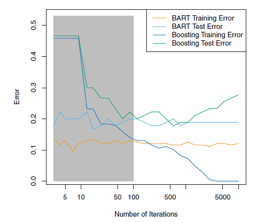

<b>FIG 9.13.</b><i> Résultats de BART et de boosting pour les données de Heart. Les erreurs d'apprentissage et de test sont affichées. Après une période de rodage de 100 itérations (en gris), les taux d'erreur de BART se stabilisent. Le boosting commence à être surajusté après quelques centaines d'itérations.</i>

