# [7. Sélection de modèles linéaires et régularisation](#section7) #

[Retour README](../README.md)

<a name="toc"/>

[toc]

Dans le cadre de la régression, le modèle linéaire standard

$$
Y=\beta_0+\beta_1 X_1+\cdots+\beta_p X_p+\epsilon \hspace{6 em}      (7.1)
$$

est couramment utilisé pour décrire la relation entre une réponse $Y$ et un ensemble de variables $X_1, X_2, \ldots, X_p$. Nous avons vu au chapitre 3 que l'on ajuste généralement ce modèle en utilisant les moindres carrés.

Dans la section suivante, nous examinons certaines approches permettant d'étendre le cadre du modèle linéaire. A la section 8, nous généralisons $(7.1)$ afin de prendre en compte les relations non linéaires, mais toujours additives, tandis qu'à la section 11, nous considérons des modèles non linéaires encore plus généraux. 

Cependant, le modèle linéaire présente des avantages distincts en termes d'inférence et, sur les problèmes du monde réel, il est souvent étonnamment compétitif par rapport aux méthodes non linéaires. Par conséquent, avant de passer au monde non linéaire, nous examinons dans cette section certaines façons d'améliorer le modèle linéaire simple, en remplaçant l'ajustement des moindres carrés par d'autres procédures d'ajustement.

***Pourquoi vouloir utiliser une autre procédure d'ajustement au lieu des moindres carrés ?*** Comme nous le verrons, les procédures d'ajustement alternatives peuvent améliorer la précision des prédictions et l'interprétabilité du modèle.

- **Précision de la prédiction** : Si la relation réelle entre la réponse et les prédicteurs est approximativement linéaire, les estimations des moindres carrés auront un faible biais. Si $n \gg p$ - c'est-à-dire si $n$, le nombre d'observations, est beaucoup plus grand que $p$, le nombre de variables - alors les estimations des moindres carrés ont tendance à avoir également une faible variance, et donc à être performantes sur les observations de test. 
- Cependant, si $n$ n'est pas beaucoup plus grand que $p$, il peut y avoir beaucoup de variabilité dans l'ajustement des moindres carrés, ce qui entraîne un surajustement et, par conséquent, de mauvaises prédictions sur les observations futures non utilisées dans l'apprentissage du modèle. Et si $p > n$, il n'existe plus d'estimation unique du coefficient des moindres carrés : la variance est infinie et la méthode ne peut donc pas être utilisée du tout. En contraignant ou en réduisant les coefficients estimés, nous pouvons souvent réduire considérablement la variance au prix d'une augmentation négligeable du biais. Cela peut conduire à des améliorations substantielles de la précision avec laquelle nous pouvons prédire la réponse pour les observations non utilisées dans l'apprentissage du modèle.
- **Interprétabilité du modèle** : Il arrive souvent que certaines ou plusieurs des variables utilisées dans un modèle de régression multiple ne soient en fait pas associées à la réponse. L'inclusion de telles variables non pertinentes entraîne une complexité inutile du modèle résultant. En supprimant ces variables - c'est-à-dire en mettant à zéro les estimations des coefficients correspondants - on peut obtenir un modèle plus facile à interpréter. Or, il est extrêmement improbable que les moindres carrés donnent des estimations de coefficient qui soient exactement nulles. Dans ce chapitre, nous avons vu quelques approches permettant d'effectuer automatiquement la sélection des caractéristiques ou des variables, c'est-à-dire d'exclure les variables non pertinentes d'un modèle de régression multiple.

Il existe de nombreuses alternatives, tant classiques que modernes, à l'utilisation des moindres carrés pour ajuster (7.1). Dans ce chapitre, nous abordons trois classes importantes de méthodes.

- **Sélection de sous-ensembles**. Cette approche consiste à identifier un sous-ensemble de prédicteurs $p$ que nous pensons être liés à la réponse. Nous ajustons ensuite un modèle en utilisant les moindres carrés sur l'ensemble réduit de variables.
- **Rétrécissement**. Cette approche implique l'ajustement d'un modèle impliquant tous les prédicteurs $p$. Cependant, les coefficients estimés sont rétrécis vers zéro par rapport aux estimations des moindres carrés. Ce rétrécissement (également appelé régularisation) a pour effet de réduire la variance. Selon le type de rétrécissement effectué, certains des coefficients peuvent être estimés comme étant exactement nuls. Par conséquent, les méthodes de rétrécissement peuvent également effectuer une sélection des variables.
- **Réduction de la dimension**. Cette approche consiste à projeter les $p$ prédicteurs dans un sous-espace à $M$ dimensions, où $M < p$. Pour ce faire, on calcule $M$ différentes combinaisons linéaires, ou projections, des variables. Ensuite, ces $M$ projections sont utilisées comme prédicteurs pour ajuster un modèle de régression linéaire par moindres carrés.

Dans les sections suivantes, nous décrivons chacune de ces approches plus en détail, ainsi que leurs avantages et inconvénients. Bien que ce chapitre décrive les extensions et les modifications du modèle linéaire de régression présenté à la section 3, les mêmes concepts s'appliquent à d'autres méthodes, telles que les modèles de classification présentés à la section 5.

<a name="7-1"/>

## [7.1 Sélection de sous-ensembles](#7-1) ##

Dans cette section, nous examinons certaines méthodes de sélection de sous-ensembles de prédicteurs. Il s'agit notamment des procédures de sélection du meilleur sous-ensemble et du modèle par étapes.

<a name="7-1-1"/>

### [7.1.1 Sélection du meilleur sous-ensemble](#7-1-1) ###

[Retour TOC](#toc)

Pour effectuer la sélection du meilleur sous-ensemble, nous ajustons une régression des moindres carrés distincte pour chaque combinaison possible des prédicteurs $p$. Autrement dit, nous ajustons tous les modèles $p$ qui contiennent exactement un prédicteur, tous les modèles $\binom{p}{2}=p(p-1) / 2$ qui contiennent exactement deux prédicteurs, et ainsi de suite. Nous examinons ensuite tous les modèles résultants, dans le but d'identifier celui qui est le meilleur.

Le problème de la sélection du meilleur modèle parmi les $2^p$ possibilités envisagées par la sélection du meilleur sous-ensemble n'est pas trivial. Il est généralement décomposé en deux étapes, comme décrit dans l' $Algorithme\ 7.1$ .

------

***Algorithme 7.1 Sélection du meilleur sous-ensemble***

1. Soit $\mathcal{M}_0$ le modèle nul, qui ne contient aucun prédicteur. Ce modèle prédit simplement la moyenne de l'échantillon pour chaque observation.

2. Pour $k=1,2, \ldots p$ :

   a. Ajuster tous les modèles $\binom{p}{k}$ qui contiennent exactement $k$ prédicteurs.

   b. Choisir le meilleur de ces modèles $(p)$, et l'appeler $\mathcal{M}_k$. Ici, le meilleur est défini comme ayant le plus petit RSS, ou de manière équivalente le plus grand $R^2$.

3. Sélectionner un seul meilleur modèle parmi $\mathcal{M}_0, \ldots, \mathcal{M}_p$ en utilisant l'erreur de prédiction validée par recoupement, $C_p(\mathrm{AIC}), \mathrm{BIC}$, ou $R^2$ ajusté.

------

Dans l' $algorithme\ 7.1$ , l'étape 2 identifie le meilleur modèle (sur les données d'apprentissage) pour chaque taille de sous-ensemble, afin de réduire le problème d'un des $2^p$ modèles possibles à un des $p+1$ modèles possibles. Dans la $figure\ 7.1$ , ces modèles forment la frontière inférieure décrite en rouge.

Maintenant, afin de sélectionner un seul meilleur modèle, nous devons simplement choisir parmi ces $p+1$ options. Cette tâche doit être effectuée avec précaution, car le RSS de ces $p+1$ modèles diminue de façon monotone, et le $R^2$ augmente de façon monotone, à mesure que le nombre de caractéristiques incluses dans les modèles augmente. Par conséquent, si nous utilisons ces statistiques pour sélectionner le meilleur modèle, nous aboutirons toujours à un modèle impliquant toutes les variables. Le problème est qu'un faible RSS ou un $R^2$ élevé indique un modèle avec une faible erreur d'apprentissage, alors que nous souhaitons choisir un modèle qui a une faible erreur de test. Par conséquent, à l'étape 3, nous utilisons l'erreur de prédiction validée par recoupement, $C_p$, BIC , ou $R^2$ ajusté afin de sélectionner parmi $\mathcal{M}_0, \mathcal{M}_1, \ldots, \mathcal{M}_p$. Ces approches sont discutées à la section 7.1.3.

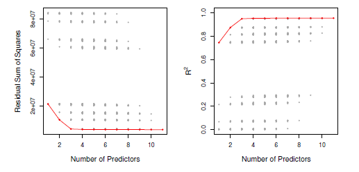

<b>FIG 7.1.</b><i>[Pour chaque modèle possible contenant un sous-ensemble des dix prédicteurs de l'ensemble de données Credit, le RSS et $R^2$ sont affichés. La frontière rouge suit le meilleur modèle pour un nombre donné de prédicteurs, selon le RSS et $R^2$. Bien que l'ensemble de données ne contienne que dix prédicteurs, l'axe $x$ va de 1 à 11 , car l'une des variables est catégorique et prend trois valeurs, ce qui conduit à la création de deux variables fictives.]() </i>

La $figure\ 7.1$ présente une application de la sélection du meilleur sous-ensemble. Chaque point du graphique correspond à un modèle de régression des moindres carrés ajusté à l'aide d'un sous-ensemble différent des 10 prédicteurs de l'ensemble de données Credit, présenté à la section 3. 

Ici, la variable région est une variable qualitative à trois niveaux, et est donc représentée par deux variables fictives, qui sont sélectionnées séparément dans ce cas. Par conséquent, il y a un total de 11 variables possibles qui peuvent être incluses dans le modèle. Nous avons tracé les statistiques RSS et $R^2$ pour chaque modèle, en fonction du nombre de variables. Les courbes rouges relient les meilleurs modèles pour chaque taille de modèle, en fonction de RSS ou $R^2$. La figure montre que, comme prévu, ces quantités s'améliorent à mesure que le nombre de variables augmente ; cependant, à partir du modèle à trois variables, il y a peu d'amélioration de RSS et de $R^2$ suite à l'inclusion de prédicteurs supplémentaires. Bien que nous ayons présenté ici la meilleure sélection de sous-ensembles pour la régression des moindres carrés, les mêmes idées s'appliquent à d'autres types de modèles, comme la régression logistique. Dans le cas de la régression logistique, au lieu de classer les modèles par RSS à l'étape 2 de l'algorithme 7.1, nous utilisons la déviance, une mesure qui joue le rôle de RSS pour une classe plus large de modèles. La déviance est une valeur négative égale à deux fois la log-vraisemblance maximisée ; plus la déviance est petite, plus l'ajustement est bon.

Bien que la sélection du meilleur sous-ensemble soit une approche simple et conceptuellement attrayante, elle souffre de limitations informatiques. Le nombre de modèles possibles à prendre en compte croît rapidement lorsque $p$ augmente. En général,

il existe $2^p$ modèles qui impliquent des sous-ensembles de $p$ prédicteurs. Ainsi, si $p=10$, il y a environ 1 000 modèles possibles à prendre en compte, et si $p=20$, il y a plus d'un million de possibilités ! Par conséquent, la sélection du meilleur sous-ensemble devient irréalisable sur le plan informatique pour des valeurs de $p$ supérieures à environ 40, même avec des ordinateurs modernes extrêmement rapides. Il existe des raccourcis informatiques - appelés techniques de branchement et de rebondissement - pour éliminer certains choix, mais ils ont leurs limites lorsque $p$ devient grand. De plus, elles ne fonctionnent que pour la régression linéaire par les moindres carrés. Nous présentons ci-après des alternatives efficaces en termes de calcul à la meilleure sélection de sous-ensembles.

<a name="7-1-2"/>

### [7.1.2 Sélection par étapes](#7-1-2) ###

Pour des raisons de calcul, la meilleure sélection de sous-ensembles ne peut pas être appliquée avec de très grands $p$. La meilleure sélection de sous-ensembles peut également souffrir de problèmes statistiques lorsque $p$ est grand. Plus l'espace de recherche est grand, plus il y a de chances de trouver des modèles qui semblent bons sur les données d'apprentissage, même s'ils n'ont aucun pouvoir prédictif sur les données futures. Ainsi, un espace de recherche énorme peut conduire à un surajustement et à une variance élevée des estimations des coefficients.

Pour ces deux raisons, les méthodes pas à pas, qui explorent un ensemble beaucoup plus restreint de modèles, sont des alternatives intéressantes à la sélection du meilleur sous-ensemble.

<a name="7-1-2-1"/>

#### [7.1.2.1 Sélection pas à pas directe](#7-1-2-1) ####

[Retour TOC](#toc)

La sélection pas à pas est une alternative efficace du point de vue du calcul à la meilleure sélection de sous-ensembles. Alors que la procédure de sélection du meilleur sous-ensemble considère tous les $2^p$ modèles possibles contenant des sous-ensembles des $p$ prédicteurs, la sélection pas à pas avant considère un ensemble beaucoup plus restreint de modèles. La sélection pas à pas commence par un modèle ne contenant aucune variable prédictive, puis ajoute des variables prédictives au modèle, une par une, jusqu'à ce que toutes les variables prédictives soient dans le modèle. En particulier, à chaque étape, la variable qui apporte la plus grande amélioration supplémentaire à l'ajustement est ajoutée au modèle. Plus formellement, la procédure de sélection pas à pas est présentée dans l'algorithme 7.2.

Contrairement à la sélection du meilleur sous-ensemble, qui implique l'ajustement de $2^p$ modèles, la sélection pas à pas avant implique l'ajustement d'un modèle nul, ainsi que de $p{-}k\ modèles$ à la $k^{ème}$ itération, pour $k=0, \ldots, p-1$. Cela revient à un total de $1+$ $\sideset{}{_{k=0}^{p-1}}\sum(p-k)=1+p(p+1) / 2$ modèles. Il s'agit d'une différence substantielle : lorsque $p=20$, la sélection du meilleur sous-ensemble nécessite l'ajustement de $1\ 048\ 576$ modèles, alors que la sélection pas à pas avant ne nécessite l'ajustement que de $211$ modèles. 

------

***Algorithme 7.2 Sélection directe par étapes***

1. Soit $\mathcal{M}_0$ le modèle nul, qui ne contient aucun prédicteur.

2. Pour $k=0, \ldots, p-1$ :

​		a. Considérer tous les modèles $p-k$ qui augmentent les prédicteurs dans $\mathcal{M}_k$ avec un prédicteur supplémentaire.

​		b. Choisir le meilleur parmi ces $p-k$ modèles, et l'appeler $\mathcal{M}_{k+1}$. Ici, le meilleur est défini comme ayant le plus petit RSS ou le plus grand $R^2$.

3. Sélectionner un seul meilleur modèle parmi $\mathcal{M}_0, \ldots, \mathcal{M}_p$ en utilisant l'erreur de prédiction croisée, $C_p$ (AIC), BIC, ou $R^2$ ajusté.

------

À l'étape 2(b) de l' algorithme 7.2 , nous devons identifier le meilleur modèle parmi les $p-k$ qui augmentent $\mathcal{M}_k$ d'un prédicteur supplémentaire. Nous pouvons le faire en choisissant simplement le modèle avec le RSS le plus bas ou le $R^2$ le plus élevé. Cependant, à l'étape 3, nous devons identifier le meilleur modèle parmi un ensemble de modèles comportant différents nombres de variables. Cette tâche est plus difficile et est abordée à la section 7.1.3.

L'avantage computationnel de la sélection pas à pas avant la sélection du meilleur sous-ensemble est clair. Bien que la sélection pas à pas directe ait tendance à donner de bons résultats dans la pratique, il n'est pas garanti qu'elle trouve le meilleur modèle possible parmi tous les $2^p$  modèles contenant des sous-ensembles des $p$ prédicteurs. Par exemple, supposons que dans un ensemble de données donné avec $p=3$ prédicteurs, le meilleur modèle à une variable possible contient $X_1$, et que le meilleur modèle à deux variables possible contient plutôt $X_2$ et $X_3$. Dans ce cas, la sélection pas à pas ne parviendra pas à sélectionner le meilleur modèle à deux variables possible, car $\mathcal{M}_1$ contiendra $X_1$, donc $\mathcal{M}_2$ doit également contenir $X_1$ ainsi qu'une variable supplémentaire.

Le $tableau\ 7.1$, qui présente les quatre premiers modèles sélectionnés pour la meilleure sélection de sous-ensembles et la sélection pas à pas avant sur l'ensemble de données Crédit, illustre ce phénomène. La meilleure sélection de sous-ensembles et la sélection pas à pas avant choisissent toutes deux la notation pour le meilleur modèle à une variable, puis incluent le revenu et l'étudiant pour les modèles à deux et trois variables. Cependant, la meilleure sélection de sous-ensembles remplace la cote par des cartes dans le modèle à quatre variables, tandis que la sélection pas à pas doit maintenir la cote dans son modèle à quatre variables. Dans cet exemple, la $figure\ 7.1$ indique qu'il n'y a pas beaucoup de différence entre les modèles à trois et quatre variables en termes de RSS, de sorte que l'un ou l'autre des modèles à quatre variables sera probablement adéquat.

La sélection pas à pas vers l'avant peut être appliquée même dans un cadre hautement dimensionnel où $n < p$ ; cependant, dans ce cas, il est possible de construire des sous-modèles $\mathcal M_0, \ldots, \mathcal M_{n-1}$ uniquement, puisque chaque sous-modèle est ajusté à l'aide des moindres carrés, ce qui ne donnera pas une solution unique si $p \geq n$.

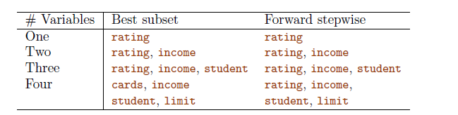

<b>TAB 7.1.</b><i>[ Les quatre premiers modèles sélectionnés pour la meilleure sélection de sous-ensembles et la sélection pas à pas avant sur l'ensemble de données Crédit. Les trois premiers modèles sont identiques mais les quatrièmes modèles diffèrent.]()</i>

<a name="7-1-2-2"/>

#### [7.1.2.2 Sélection pas à pas vers l'arrière](#7-1-2-2) ####

[Retour TOC](#toc)

Comme la sélection pas à pas avant, la sélection pas à pas arrière offre une alternative efficace à la meilleure sélection de sous-ensembles. Cependant, contrairement à la sélection pas à pas avant, elle commence par le modèle complet des moindres carrés contenant tous les prédicteurs $p$, puis élimine itérativement le prédicteur le moins utile, un par un. Les détails sont donnés dans l' $algorithme\ 7.3$ .

------

***Algorithme 7.3 Sélection pas à pas à rebours***

1. Soit $\mathcal{M}_p$ le modèle complet, qui contient tous les prédicteurs $p$.

2. Pour $k=p, p-1, \ldots, 1$ :

​		a. Considérer tous les $k$ modèles qui contiennent tous les prédicteurs sauf un dans $\mathcal{M}_k$, pour un total de $k-1$ prédicteurs.

​		b. Choisir le meilleur parmi ces $k$ modèles, et l'appeler $\mathcal{M}_{k-1}$. Ici, le meilleur est défini comme ayant le plus petit RSS ou le plus grand $R^2$.

3. Sélectionner un seul meilleur modèle parmi  $\mathcal{M}_0, \ldots, \mathcal{M}_p$ en utilisant l'erreur de prédiction validée par recoupement, $C_p(\mathrm{AIC}), \mathrm{BIC}$, ou $R^2$ ajusté.

------

Comme la sélection pas à pas avant, l'approche de sélection arrière ne recherche que $1+p(p+1) / 2$ modèles, et peut donc être appliquée dans les cas où $p$ est trop grand pour appliquer la meilleure sélection de sous-ensembles. De même que la sélection pas à pas avant, la sélection pas à pas arrière n'est pas garantie de produire le meilleur modèle contenant un sous-ensemble des prédicteurs $p$.

La sélection à rebours exige que le nombre d'échantillons $n$ soit supérieur au nombre de variables $p$ (afin que le modèle complet puisse être ajusté). En revanche, la sélection pas à pas avant peut être utilisée même lorsque $n < p$, et constitue donc la seule méthode de sous-ensemble viable lorsque $p$ est très grand.

<a name="7-1-2-3"/>

#### [7.1.2.3 Approches hybrides](#7-1-2-3) ####

[Retour TOC](#toc)

Les approches de sélection du meilleur sous-ensemble, de la sélection pas à pas avant et de la sélection pas à pas arrière donnent généralement des modèles similaires mais pas identiques. Il existe également des versions hybrides de la sélection pas à pas avant et arrière, dans lesquelles les variables sont ajoutées au modèle de manière séquentielle, par analogie avec la sélection avant. Cependant, après l'ajout de chaque nouvelle variable, la méthode peut également supprimer toutes les variables qui n'apportent plus d'amélioration de l'ajustement du modèle. Cette approche tente d'imiter plus fidèlement la sélection du meilleur sous-ensemble tout en conservant les avantages informatiques de la sélection pas à pas avant et arrière.

<a name="7-1-3"/>

### [7.1.3 Choix du modèle optimal](#7-1-3) ###

La sélection du meilleur sous-ensemble, la sélection avant et la sélection arrière aboutissent à la création d'un ensemble de modèles, dont chacun contient un sous-ensemble des prédicteurs $p$. Pour appliquer ces méthodes, nous avons besoin d'un moyen de déterminer lequel de ces modèles est le meilleur. Comme nous l'avons vu à la section 7.1.1, le modèle contenant tous les prédicteurs aura toujours le plus petit RSS et le plus grand $R^2$, puisque ces quantités sont liées à l'erreur d'apprentissage. Au lieu de cela, nous souhaitons choisir un modèle avec une faible erreur de test. Comme cela est évident ici, et comme nous le montrons au chapitre 2, l'erreur d'apprentissage peut être une mauvaise estimation de l'erreur de test. Par conséquent, RSS et $R^2$ ne sont pas appropriés pour sélectionner le meilleur modèle parmi une collection de modèles avec différents nombres de prédicteurs.

Afin de sélectionner le meilleur modèle par rapport à l'erreur de test, nous devons estimer cette erreur de test. Il existe deux approches courantes :

1.  Nous pouvons estimer indirectement l'erreur de test en effectuant un ajustement de l'erreur d'apprentissage pour tenir compte du biais dû à l'overfitting.

2.  Nous pouvons estimer directement l'erreur de test, en utilisant soit une approche par ensemble de validation, soit une approche par validation croisée, comme indiqué à la section 6.

Nous considérons ces deux approches ci-dessous.

<a name="7-1-3-1"/>

#### [7.1.3.1 Cp, AIC, BIC, et Rsquare ajusté](#7-1-3-1) ####

[Retour TOC](#toc)

Nous avons montré que la MSE de l'ensemble d'apprentissage est généralement une sous-estimation de la MSE du test. (Rappelons que $MSE =\mathrm{RSS} / n$.) Cela est dû au fait que lorsque nous ajustons un modèle aux données d'apprentissage à l'aide des moindres carrés, nous estimons spécifiquement les coefficients de régression de sorte que le RSS d'apprentissage (mais pas le RSS de test) soit aussi petit que possible. En particulier, l'erreur d'apprentissage diminuera à mesure qu'un plus grand nombre de variables sont incluses dans le modèle, mais pas l'erreur de test. Par conséquent, le RSS de l'ensemble d'apprentissage et le $R^2$ de l'ensemble d'apprentissage ne peuvent pas être utilisés pour choisir parmi un ensemble de modèles avec différents nombres de variables.

Cependant, il existe un certain nombre de techniques permettant d'ajuster l'erreur d'apprentissage en fonction de la taille du modèle. Ces approches peuvent être utilisées pour sélectionner parmi un ensemble de modèles avec un nombre différent de variables.

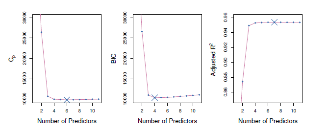

<b>FIG 7.2.</b><i> $C_p$ , $B I C$ , et $R^2$ ajusté sont indiqués pour les meilleurs modèles de chaque taille pour l'ensemble de données Crédit (la frontière inférieure de la figure 7.1). $C_p$ et $B I C$ sont des estimations de la MSE du test. Dans le graphique du milieu, nous constatons que l'estimation BIC de l'erreur de test augmente après la sélection de quatre variables. Les deux autres graphiques sont plutôt plats après l'inclusion de quatre variables.</i>

Ces approches peuvent être utilisées pour sélectionner parmi un ensemble de modèles avec différents nombres de variables. Nous considérons maintenant quatre de ces approches : $C_p$, le critère d'information d'Akaike ( $AIC$ ), le critère d'information bayésien ( $BIC$ ) et le $R^2$ ajusté. La $figure\ 7.2$ montre $C_p$, $\mathrm{BIC}$, et $R^2$ ajusté pour le meilleur modèle de chaque taille produit par la meilleure sélection de sous-ensembles sur l'ensemble de données Crédit.

Pour un modèle ajusté des moindres carrés contenant $d$ prédicteurs, l'estimation $C_p$ de la MSE du test est calculée à l'aide de l'équation suivante

$$
C_{\mathrm{p}}=\frac{1}{n}\left({RSS}+2 d \hat{\sigma}^2\right), \hspace{6 em}(7.2)
$$

où $\hat{\sigma}^2$ est une estimation de la variance de l'erreur $\epsilon$ associée à chaque mesure de réponse dans $(7.1)$ .Typiquement, $\hat{\sigma}^2$ est estimé en utilisant le modèle complet contenant tous les prédicteurs. Essentiellement, la statistique $C_p$ ajoute une pénalité de $2 d \hat{\sigma}^2$ au RSS d'apprentissage afin de s'ajuster au fait que l'erreur d'apprentissage tend à sous-estimer l'erreur de test. Il est clair que la pénalité augmente à mesure que le nombre de prédicteurs dans le modèle augmente ; ceci a pour but d'ajuster la diminution correspondante du RSS d'apprentissage. Bien que cela dépasse le cadre de cet ouvrage, on peut montrer que si $\hat{\sigma}^2$ est une estimation sans biais de $\sigma^2$ dans $(7.2)$, alors $C_p$ est une estimation sans biais de la $MSE$ du test. Par conséquent, la statistique $C_p$ a tendance à prendre une petite valeur pour les modèles dont l'erreur de test est faible. Ainsi, pour déterminer lequel d'un ensemble de modèles est le meilleur, nous choisissons le modèle dont la valeur $C_p$ est la plus faible. Dans la $figure\ 7.2$ , $C_p$ sélectionne le modèle à six variables contenant les prédicteurs revenu, limite, cote, cartes, âge et étudiant.

Le critère $AIC$ est défini pour une grande classe de modèles ajustés par le maximum de vraisemblance. Dans le cas du modèle (7.1) avec erreurs gaussiennes, le maximum de vraisemblance et les moindres carrés sont la même chose. Dans ce cas, l' $AIC$ est donné par

$$
\mathrm{AIC}=\frac{1}{n}\left(\mathrm{RSS}+2 d \hat{\sigma}^2\right)
$$

où, par souci de simplicité, nous avons omis les constantes non pertinentes.  Ainsi, pour les modèles des moindres carrés, $C_p$ et $AIC$ sont proportionnels l'un à l'autre, et donc seul $C_p$ est affiché dans la $figure\ 7.2$.

Le $BIC$ est dérivé d'un point de vue bayésien, mais il finit par ressembler à $C_p$ (et à $\mathrm{AIC}$ ) également. Pour le modèle des moindres carrés avec $d$ prédicteurs, le $\mathrm{BIC}$ est, jusqu'à des constantes non pertinentes, donné par

$$
\mathrm{BIC}=\frac{1}{n}\left(\mathrm{RSS}+\log (n) d \hat{\sigma}^2\right) . \hspace{6 em} (7.3)
$$

Comme $C_p$, le $BIC$ aura tendance à prendre une petite valeur pour un modèle avec une faible erreur de test, et donc généralement nous sélectionnons le modèle qui a la valeur BIC la plus faible. Remarquez que le BIC remplace les $2 d \hat{\sigma}^2$ utilisés par $C_p$ par un terme $\log (n) d \hat{\sigma}^2$, où $n$ est le nombre d'observations. Étant donné que $\log n > 2$ pour tout $n > 7$ , la statistique BIC impose généralement une pénalité plus lourde aux modèles comportant de nombreuses variables, et entraîne donc la sélection de modèles plus petits que $C_p$. Dans la figure 7.2, nous voyons que c'est effectivement le cas pour l'ensemble de données sur le crédit ; le $BIC$ choisit un modèle qui ne contient que les quatre prédicteurs suivants : revenu, limite, cartes et étudiant. Dans ce cas, les courbes sont très plates et il ne semble pas y avoir une grande différence de précision entre les modèles à quatre et à six variables.

La statistique $R^2$ ajustée est une autre approche populaire pour choisir parmi un ensemble de modèles qui contiennent différents nombres de variables. Rappelez-vous, dans la $section\ 3$ , que la $R^2$ habituelle est définie comme étant $1{-}RSS/TSS$ , où $TSS = \sum\left(y_i-\bar{y}\right)^2$ est la somme totale des carrés pour la réponse. Comme le $RSS$ diminue toujours à mesure que l'on ajoute des variables au modèle, le $R^2$ augmente toujours à mesure que l'on ajoute des variables. Pour un modèle des moindres carrés avec $d$ variables, la statistique $R^2$ ajustée est calculée comme suit

$$
\text { Adjusted } R^2=1-\frac{{RSS} /(n-d-1)}{{TSS} /(n-1)} \hspace{6 em} (7.4)
$$

Contrairement à $C_p, \mathrm{AIC}$, et $BIC$ , pour lesquels une petite valeur indique un modèle avec une faible erreur de test, une grande valeur de $R^2$ ajustée indique un modèle avec une petite erreur de test. Maximiser le $R^2$ ajusté est équivalent à minimiser $\frac{\text { RSS }}{n-d-1}$. Alors que le RSS diminue toujours lorsque le nombre de variables dans le modèle augmente, $\frac{\text { RSS }}{n-d-1}$ peut augmenter ou diminuer, en raison de la présence de $d$ dans le dénominateur.

L'intuition derrière le $R^2$ ajusté est qu'une fois que toutes les variables correctes ont été incluses dans le modèle, l'ajout de variables de bruit supplémentaires n'entraînera qu'une très faible diminution du $RSS$. Puisque l'ajout de variables de bruit entraîne une augmentation de $d$, de telles variables entraîneront une augmentation de $\frac{\text { RSS }}{n-d-1}$, et par conséquent une diminution du $R^2$ ajusté. Par conséquent, en théorie, le modèle avec le plus grand $R^2$ ajusté n'aura que des variables correctes et aucune variable de bruit. Contrairement à la statistique $R^2$, la statistique $R^2$ ajustée paie un prix pour l'inclusion de variables inutiles dans le modèle. La $figure\ 7.2$ montre le $R^2$ ajusté pour l'ensemble de données Crédit. L'utilisation de cette statistique entraîne la sélection d'un modèle qui contient sept variables, ajoutant la sienne au modèle sélectionné par $C_p$ et $AIC$.

$C_p$, $AIC$ et $BIC$ ont tous des justifications théoriques rigoureuses qui dépassent le cadre de cet ouvrage. Ces justifications reposent sur des arguments asymptotiques (scénarios où la taille de l'échantillon $n$ est très grande). Malgré sa popularité, et même s'il est assez intuitif, le $R^2$ ajusté n'est pas aussi bien motivé en théorie statistique que l' $AIC$ , le $BIC$ et le $C_p$. Toutes ces mesures sont simples à utiliser et à calculer. Nous avons présenté ici leurs formules dans le cas d'un modèle linéaire ajusté par les moindres carrés ; cependant, l' $AIC$ et le $BIC$ peuvent également être définis pour des types de modèles plus généraux.

<a name="7-1-3-2"/>

#### [7.1.3.2 Validation et validation croisée](#7-1-3-2) ####

[Retour TOC](#toc)

En guise d'alternative aux approches que nous venons d'aborder, nous pouvons estimer directement l'erreur de test à l'aide des méthodes d'ensemble de validation et de validation croisée présentées à la $section\ 6$ . Nous pouvons calculer l'erreur de l'ensemble de validation ou l'erreur de validation croisée pour chaque modèle considéré, puis sélectionner le modèle pour lequel l'erreur de test estimée est la plus faible. Cette procédure présente un avantage par rapport aux méthodes $AIC$, $BIC$ , $C_p$ et $R^2$ ajusté, dans la mesure où elle fournit une estimation directe de l'erreur de test et fait moins d'hypothèses sur le véritable modèle sous-jacent. Elle peut également être utilisée dans un plus large éventail de tâches de sélection de modèles, même dans les cas où il est difficile de déterminer les degrés de liberté du modèle (par exemple, le nombre de prédicteurs dans le modèle) ou d'estimer la variance de l'erreur $\sigma^2$.

Dans le passé, l'exécution de la validation croisée était prohibitive sur le plan informatique pour de nombreux problèmes avec de grands $p$ et/ou de grands $n$, et donc l' $AIC$ , le $BIC$ , le $C_p$ et le $R^2$ ajusté étaient des approches plus intéressantes pour choisir parmi un ensemble de modèles. Cependant, de nos jours, avec les ordinateurs rapides, les calculs nécessaires pour effectuer une validation croisée ne sont presque plus un problème. Ainsi, la validation croisée est une approche très intéressante pour choisir parmi un certain nombre de modèles considérés.

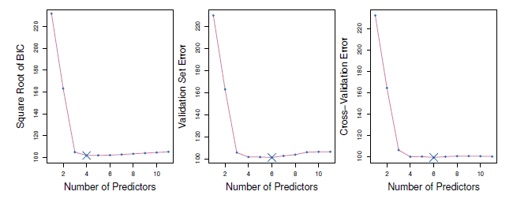

<b>FIG 7.3.</b><i>[Pour l'ensemble de données Crédit, trois quantités sont affichées pour le meilleur modèle contenant $d$ prédicteurs, pour $d$ allant de 1 à 11 . Le meilleur modèle global, basé sur chacune de ces quantités, est représenté par une croix bleue. A gauche : Racine carrée du BIC. Centre : Erreurs de l'ensemble de validation. Droite : Erreurs de validation croisée.]() </i>

$Figure\ 7.3$ affiche, en fonction de $d$, le $BIC$, les erreurs de l'ensemble de validation et les erreurs de validation croisée sur les données de crédit, pour le meilleur modèle à $d$ variables. Les erreurs de validation ont été calculées en sélectionnant aléatoirement trois quarts des observations comme ensemble d'apprentissage, et le reste comme ensemble de validation. Les erreurs de validation croisée ont été calculées en utilisant $k=10$ plis. Dans ce cas, les méthodes de validation et de validation croisée aboutissent toutes deux à un modèle à six variables. Cependant, les trois approches suggèrent que les modèles à quatre, cinq et six variables sont à peu près équivalents en termes d'erreurs de test.

En fait, les courbes d'erreur de test estimées affichées dans les panneaux central et droit de la $figure\ 7.3$ sont assez plates. Alors qu'un modèle à trois variables présente clairement une erreur de test estimée plus faible qu'un modèle à deux variables, les erreurs de test estimées des modèles à 3 à 11 variables sont assez similaires. De plus, si nous répétons l'approche de l'ensemble de validation en utilisant une division différente des données en un ensemble d'apprentissage et un ensemble de validation, ou si nous répétons la validation croisée en utilisant un ensemble différent de plis de validation croisée, le modèle précis présentant l'erreur de test estimée la plus faible changera certainement. Dans ce contexte, nous pouvons sélectionner un modèle en utilisant la règle de l'erreur standard unique. Nous calculons d'abord l'erreur standard de la $MSE$ de test estimée pour chaque taille de modèle, puis nous sélectionnons le plus petit modèle pour lequel l'erreur de test estimée se situe à moins d'une erreur standard du point le plus bas de la courbe. Le raisonnement est le suivant : si un ensemble de modèles semble être plus ou moins aussi bon, nous pouvons choisir le modèle le plus simple, c'est-à-dire le modèle avec le plus petit nombre de prédicteurs. Dans ce cas, l'application de la règle de l'erreur standard à l'ensemble de validation ou à l'approche de validation croisée conduit à la sélection du modèle à trois variables.

<a name="7-2"/>

## [7.2 Méthodes de rétrécissement](#7-2) ##

Les méthodes de sélection de sous-ensembles décrites à la $section\ 7.1$ consistent à utiliser les moindres carrés pour ajuster un modèle linéaire qui contient un sous-ensemble de prédicteurs. Comme alternative, nous pouvons ajuster un modèle contenant tous les prédicteurs $p$ en utilisant une technique qui contraint ou régularise les estimations des coefficients, ou de manière équivalente, qui réduit les estimations des coefficients vers zéro. La raison pour laquelle une telle contrainte devrait améliorer l'ajustement n'est peut-être pas évidente au premier abord, mais il s'avère que le rétrécissement des estimations des coefficients peut réduire considérablement leur variance. Les deux techniques les plus connues pour réduire les coefficients de régression vers zéro sont la régression ridge et le lasso.

<a name="7-2-1"/>

### [7.2.1 Régression ridge](#7-2-1) ###

[Retour TOC](#toc)

Nous avons vu à la section 3 que la procédure d'ajustement par les moindres carrés estime $\beta_0, \beta_1, \ldots, \beta_p$ en utilisant les valeurs qui minimisent

$$
{RSS}=\sum_{i=1}^n\left(y_i-\beta_0-\sum_{j=1}^p \beta_j x_{i j}\right)^2
$$

La régression ridge est très similaire aux moindres carrés, sauf que les coefficients sont estimés en minimisant une quantité légèrement différente. En particulier, les estimations des coefficients de la régression ridge $\hat{\beta}^R$ sont les valeurs qui minimisent

$$
\sum_{i=1}^n\left(y_i-\beta_0-\sum_{j=1}^p \beta_j x_{i j}\right)^2+\lambda \sum_{j=1}^p \beta_j^2=\mathrm{RSS}+\lambda \sum_{j=1}^p \beta_j^2, \hspace{6 em} (7.5)
$$

où $\lambda \geq 0$ est un paramètre d'ajustement, à déterminer séparément. L'$équation\ 7.5$ permet de concilier deux critères différents. Comme pour les moindres carrés, la régression ridge recherche des estimations de coefficients qui s'adaptent bien aux données, en rendant le $RSS$ petit. Cependant, le second terme, $\lambda \sum_j \beta_j^2$, appelé pénalité de rétrécissement, est petit lorsque $\beta_1, \ldots, \beta_p$ sont proches de zéro, et il a donc pour effet de rétrécir les estimations de $\beta_j$ vers zéro. Le paramètre d'ajustement $\lambda$ sert à contrôler l'impact relatif de ces deux termes sur les estimations des coefficients de régression. Lorsque $\lambda=0$, le terme de pénalité n'a aucun effet, et la régression ridge produira les estimations des moindres carrés. Cependant, lorsque $\lambda \rightarrow \infty$, l'impact de la pénalité de rétrécissement augmente, et les estimations du coefficient de régression ridge s'approchent de zéro. Contrairement aux moindres carrés, qui ne génèrent qu'un seul ensemble d'estimations de coefficients, la régression ridge produit un ensemble différent d'estimations de coefficients, $\hat{\beta}_\lambda^R$, pour chaque valeur de $\lambda$. La sélection d'une bonne valeur pour $\lambda$ est essentielle ; nous reportons cette discussion à la $Section\ 7.2.3$, où nous utilisons la validation croisée.

Notez que dans $(7.5)$ , la pénalité de rétrécissement est appliquée à $\beta_1, \ldots, \beta_p$, mais pas à l'intercept $\beta_0$. 

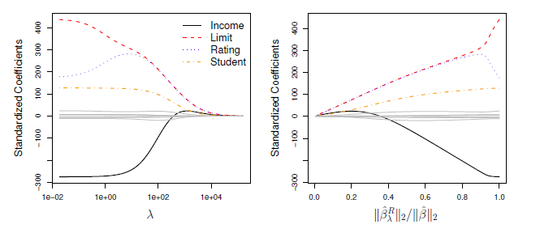

<b>FIG 7.4.</b><i>Les coefficients de régression ridge normalisés sont affichés pour l'ensemble de données Crédit, en fonction de $\lambda$ et de $||\hat{\beta}_\lambda^R ||_2 / ||\hat{\beta} ||_2$.</i>

Nous voulons réduire l'association estimée de chaque variable avec la réponse ; cependant, nous ne voulons pas réduire l'ordonnée à l'origine, qui est simplement une mesure de la valeur moyenne de la réponse lorsque $x_{i 1}=x_{i 2}=\ldots=x_{i p}=0$. Si nous supposons que les variables - c'est-à-dire les colonnes de la matrice de données $\mathbf{X}$ - ont été centrées pour avoir une moyenne de zéro avant d'effectuer la régression ridge, l'ordonnée à l'origine estimée prendra la forme $\beta_0=\bar{y}=\sideset{}{_{i=1}^n}\sum y_i / n$.

<a name="7-2-1-1"/>

#### [7.2.1.1 Application aux données de crédit](#7-2-1-1) ####

[Retour TOC](#toc)

La $figure\ 7.4$ présente les estimations des coefficients de régression ridge pour l'ensemble de données sur le crédit. Dans le panneau de gauche, chaque courbe correspond à l'estimation du coefficient de régression ridge pour l'une des dix variables, tracée en fonction de $\lambda$. Par exemple, la ligne noire pleine représente l'estimation du coefficient de régression ridge pour le revenu, en fonction de la variation de $\lambda$. À l'extrême gauche du graphique, $\lambda$ est essentiellement nul, et les estimations du coefficient de crête correspondant sont donc les mêmes que celles des moindres carrés habituels. Mais à mesure que $\lambda$ augmente, les estimations du coefficient de crête se réduisent à zéro. Lorsque $\lambda$ est extrêmement grand, toutes les estimations des coefficients ridge sont pratiquement nulles ; cela correspond au modèle nul qui ne contient aucun prédicteur. Dans ce graphique, les variables de revenu, de limite, de notation et d'étudiant sont affichées dans des couleurs distinctes, car ces variables ont tendance à avoir de loin les estimations de coefficient les plus importantes. Alors que les estimations des coefficients de crête ont tendance à diminuer globalement lorsque $\lambda$ augmente, les coefficients individuels, tels que la cote et le revenu, peuvent occasionnellement augmenter lorsque $\lambda$ augmente.

Le panneau de droite de la $figure\ 7.4$ présente les mêmes estimations de coefficient de crête que le panneau de gauche, mais au lieu d'afficher $\lambda$ sur l'axe $x$, nous affichons maintenant $||\hat{\beta}_\lambda^R ||_2 / ||\hat{\beta} ||_2$ où $\hat{\beta}$ désigne le vecteur des estimations de coefficient des moindres carrés. La notation $|| \beta ||_2$ désigne la norme $\ell_2$ (prononcée " ell  2 " ) d'un vecteur, et est définie comme 

$$
||\beta ||_2  = \sqrt{\sideset{}{_{j=1}^p}\sum \beta_j^2}.
$$

 Elle mesure la distance de $\beta$ par rapport à zéro.

Au fur et à mesure que $\lambda$ augmente, la norme $\ell_2$ de $\hat\beta_\lambda^R$ diminuera toujours, de même que $||\hat\beta_\lambda^R ||_2 / ||\hat\beta ||_2$ . Cette dernière quantité est comprise entre 1 (lorsque $\lambda=0$, auquel cas l'estimation du coefficient de régression ridge est la même que l'estimation des moindres carrés, et donc leurs normes $\ell_2$ sont identiques) et 0 (lorsque $\lambda=\infty$, auquel cas l'estimation du coefficient de régression ridge est un vecteur de zéros, avec une norme $\ell_2$ égale à zéro). Par conséquent, nous pouvons considérer l'axe $x$ du panneau de droite de la $figure\ 7.4$ comme le degré de rétrécissement des estimations du coefficient de régression ridge vers zéro ; une petite valeur indique qu'elles ont été rétrécies très près de zéro.

Les estimations standard des coefficients des moindres carrés examinées à la $section\ 3$ sont équivariantes en termes d'échelle : la multiplication de $X_j$ par une constante $c$ entraîne simplement une mise à l'échelle des estimations des coefficients des moindres carrés par un facteur de $1 / c$. En d'autres termes, quelle que soit la façon dont le prédicteur $j$ est mis à l'échelle, $X_j \hat\beta_j$ restera le même. En revanche, les estimations du coefficient de régression ridge peuvent changer de manière substantielle lorsqu'on multiplie un prédicteur donné par une constante. Prenons par exemple la variable du revenu, qui est mesurée en dollars. On aurait pu raisonnablement mesurer le revenu en milliers de dollars, ce qui aurait entraîné une réduction des valeurs observées du revenu d'un facteur de 1 000 . Or, en raison du terme de la somme des coefficients au carré dans la formulation de la régression ridge (7.5), un tel changement d'échelle n'entraînera pas simplement une modification de l'estimation du coefficient de régression ridge pour le revenu par un facteur de 1 000 . En d'autres termes, $X_j \hat\beta_{j, \lambda}^R$ dépendra non seulement de la valeur de $\lambda$, mais aussi de l'échelle du $j^{ème}$ prédicteur. En fait, la valeur de $X_j \hat\beta_{j, \lambda}^R$ peut même dépendre de l'échelle des autres prédicteurs ! Par conséquent, il est préférable d'appliquer la régression ridge après avoir normalisé les prédicteurs, en utilisant la formule suivante 

$$
\bar{x}_{i j}=\frac{x_{i j}}{\sqrt{\frac{1}{n} \sum_{i=1}^n\left(x_{i j}-\bar{x}_j\right)^2}}, \hspace{6 em}(7.6)
$$

afin qu'ils soient tous sur la même échelle. Dans $(7.6)$, le dénominateur est l'écart type estimé du $j$ ème prédicteur. Par conséquent, tous les prédicteurs normalisés auront un écart-type de un. Par conséquent, l'ajustement final ne dépendra pas de l'échelle sur laquelle les prédicteurs sont mesurés. Dans la $figure\ 7.4$, l'axe $y$ affiche les estimations des coefficients de régression ridge standardisés, c'est-à-dire les estimations des coefficients qui résultent de la régression ridge utilisant des prédicteurs standardisés.

***Pourquoi la régression ridge est-elle meilleure que les moindres carrés ?***

L'avantage de la régression ridge sur les moindres carrés est ancré dans le compromis biais-variance. Lorsque $\lambda$ augmente, la flexibilité de l'ajustement de la régression ridge diminue, ce qui entraîne une diminution de la variance mais une augmentation du biais. Ceci est illustré dans le panneau de gauche de la $figure\ 7.5$ , à l'aide d'un ensemble de données simulées contenant $p=45$ prédicteurs et $n=50$ observations. La courbe verte du panneau gauche de la $figure\ 7.5$ représente la variance des prédictions de la régression ridge en fonction de $\lambda$ .

<b>FIG 7.5.</b><i>Barrière-plan (noir), variance (vert) et erreur quadratique moyenne de test (violet) pour les prédictions de négation de crêtes sur un ensemble de données simulées, en fonction de $||\hat\beta_\lambda^R ||_2 / ||\hat\beta ||_2$ . Les lignes horizontales en pointillés indiquent la $MSE$ minimale possible. Les croix violettes indiquent les modèles de régression ridge pour lesquels la $MSE$ est la plus petite.</i>

Aux estimations des coefficients des moindres carrés, qui correspondent à la régression ridge avec $\lambda=0$, la variance est élevée mais il n'y a pas de biais. Mais lorsque $\lambda$ augmente, le rétrécissement des estimations des coefficients de crête entraîne une réduction substantielle de la variance des prédictions, au prix d'une légère augmentation du biais. Rappelons que l'erreur quadratique moyenne du test ( $MSE$ ), représentée en violet, est étroitement liée à la variance plus le biais au carré. Pour les valeurs de $\lambda$ jusqu'à environ 10 , la variance diminue rapidement, avec une très faible augmentation du biais, représentée en noir. Par conséquent, la $MSE$ diminue considérablement lorsque $\lambda$ augmente de 0 à 10 . Au-delà de ce point, la diminution de la variance due à l'augmentation de $\lambda$ ralentit, et le rétrécissement des coefficients entraîne leur sous-estimation significative, ce qui se traduit par une forte augmentation du biais. Le $MSE$ minimum est atteint à environ $\lambda=30$. Il est intéressant de noter qu'en raison de sa variance élevée, la MSE associée à l'ajustement par les moindres carrés, lorsque $\lambda=0$, est presque aussi élevée que celle du modèle nul pour lequel toutes les estimations de coefficients sont nulles, lorsque $\lambda=\infty$. Cependant, pour une valeur intermédiaire de $\lambda$, la $MSE$ est considérablement plus faible.

Le panneau de droite de la $figure\ 7.5$ présente les mêmes courbes que le panneau de gauche, cette fois-ci tracées en fonction de la norme $\ell_2$ des estimations des coefficients de régression ridge divisée par la norme $\ell_2$ des estimations des moindres carrés. Maintenant, à mesure que nous nous déplaçons de gauche à droite, les ajustements deviennent plus flexibles, et donc le biais diminue et la variance augmente.

En général, dans les situations où la relation entre la réponse et les prédicteurs est proche de la linéarité, les estimations des moindres carrés auront un biais faible mais une variance élevée. Cela signifie qu'un petit changement dans les données d'apprentissage peut entraîner un grand changement dans les estimations des coefficients des moindres carrés. En particulier, lorsque le nombre de variables $p$ est presque aussi grand que le nombre d'observations $n$, comme dans l'exemple de la $figure\ 7.5$, les estimations des moindres carrés seront extrêmement variables. Et si $p > n$, les estimations des moindres carrés n'ont même pas de solution unique, alors que la régression ridge peut encore donner de bons résultats en échangeant une petite augmentation du biais contre une grande diminution de la variance. Par conséquent, la régression ridge fonctionne mieux dans les situations où les estimations des moindres carrés ont une variance élevée.

La régression de crête présente également des avantages considérables en termes de calcul par rapport à la sélection du meilleur sous-ensemble, qui nécessite une recherche parmi $2^p$ modèles. Comme nous l'avons vu précédemment, même pour des valeurs modérées de $p$, une telle recherche peut être infaisable sur le plan informatique. En revanche, pour toute valeur fixe de $\lambda$, la régression ridge n'ajuste qu'un seul modèle, et la procédure d'ajustement du modèle peut être exécutée assez rapidement. En fait, on peut montrer que les calculs nécessaires pour résoudre (7.5), simultanément pour toutes les valeurs de $\lambda$, sont presque identiques à ceux de l'ajustement d'un modèle à l'aide des moindres carrés.

<a name="7-2-2"/>

### [7.2.2 Le Lasso](#7-2-2) ###

[Retour TOC](#toc)

La régression ridge présente un inconvénient évident. Contrairement à la sélection du meilleur sous-ensemble, à la sélection pas à pas en avant et à la sélection pas à pas en arrière, qui sélectionnent généralement des modèles impliquant juste un sous-ensemble de variables, la régression ridge inclut tous les prédicteurs $p$ dans le modèle final. La pénalité $\lambda \sum \beta_j^2$ dans (7.5) réduira tous les coefficients vers zéro, mais n'en fixera aucun exactement à zéro (sauf si $\lambda=\infty$ ). Cela peut ne pas être un problème pour la précision de la prédiction, mais cela peut être créé un défi dans l'interprétation du modèle dans des contextes où le nombre de variables $p$ est assez grand. Par exemple, dans l'ensemble de données sur le crédit, il semble que les variables les plus importantes soient le revenu, la limite, la cote et l'étudiant. Nous pourrions donc souhaiter construire un modèle incluant juste ces prédicteurs. Cependant, la régression ridge générera toujours un modèle impliquant les dix prédicteurs. L'augmentation de la valeur de $\lambda$ aura tendance à réduire l'ampleur des coefficients, mais n'entraînera l'exclusion d'aucune des variables.

Le lasso est une alternative relativement récente à la régression ridge qui permet de surmonter cet inconvénient. Les coefficients lasso, $\hat\beta_\lambda^L$, minimisent la quantité

$$
\sum_{i=1}^n\left(y_i-\beta_0-\sum_{j=1}^p \beta_j x_{i j}\right)^2+\lambda \sum_{j=1}^p\left|\beta_j\right|={RSS}+\lambda \sum_{j=1}^p\left|\beta_j\right| . \hspace{6 em}(7.7)
$$

En comparant (7.7) à (7.5), on constate que le lasso et la régression ridge ont des formulations similaires. La seule différence est que le terme $\beta_j^2$ dans la pénalité de la régression ridge (7.5) a été remplacé par $\left|\beta_j\right|$ dans la pénalité du lasso (7.7). En langage statistique, le lasso utilise une pénalité $\ell_1$ (prononcée "ell 1") au lieu d'une pénalité $\ell_2$. La norme $\ell_1$ d'un vecteur de coefficient $\beta$ est donnée par $||\beta ||_1=\sum\ |\beta_j|$.

Comme pour la régression ridge, le lasso réduit les estimations des coefficients vers zéro. Cependant, dans le cas du lasso, la pénalité $\ell_1$ a pour effet de forcer certaines des estimations de coefficient à être exactement égales à zéro lorsque le paramètre d'ajustement λ est suffisamment grand.

Ainsi, à l'instar de la sélection du meilleur sous-ensemble, le lasso effectue une sélection des variables. Par conséquent, les modèles générés par le lasso sont généralement beaucoup plus faciles à interpréter que ceux produits par la régression ridge. Nous disons que le lasso produit des modèles épars, c'est-à-dire des modèles qui n'impliquent qu'un sous-ensemble de variables. Comme dans la régression ridge, la sélection d'une bonne valeur de $\lambda$ pour le lasso est essentielle ; nous reportons cette discussion à la $Section\ 7.2.3$, où nous utilisons la validation croisée.

À titre d'exemple, considérons les graphiques de coefficients de la figure 7.6, générés par l'application du lasso à l'ensemble de données sur le crédit. Lorsque $\lambda=0$, le lasso donne simplement l'ajustement des moindres carrés, et lorsque $\lambda$ devient suffisamment grand, le lasso donne le model nul dans lequel toutes les estimations de coefficient sont égales à zéro. Cependant, entre ces deux extrêmes, les modèles de régression ridge et lasso sont très différents l'un de l'autre. En allant de gauche à droite dans le panneau de droite de la $figure\ 7.6$ , nous observons qu'au début, le lasso donne un modèle qui ne contient que le prédicteur de notation. Ensuite, l'étudiant et la limite entrent dans le modèle presque simultanément, suivis de peu par le revenu. Finalement, les variables restantes entrent dans le modèle. Ainsi, en fonction de la valeur de $\lambda$, le lasso peut produire un modèle impliquant un nombre quelconque de variables. En revanche, la régression ridge inclura toujours toutes les variables dans le modèle, bien que l'ampleur des estimations des coefficients dépende de $\lambda$.

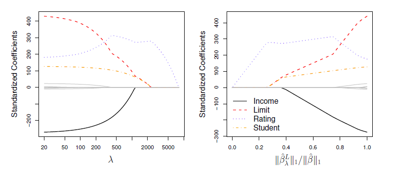

<b>FIG 7.6.</b><i> Les coefficients lasso normalisés de l'ensemble de données de crédit sont représentés en fonction de $\lambda$ et de $||\hat\beta_\lambda^L ||_1 / ||\hat\beta ||_1$ .</i>

<a name="7-2-2-1"/>

#### [7.2.2.1 Une autre formulation pour la régression ridge et le Lasso](#7-2-2-1) ####

[Retour TOC](#toc)

On peut montrer que les estimations des coefficients de régression lasso et ridge résolvent les problèmes suivants.

$$
\underset\beta{minimize}\left\lbrace\sideset{}{_{i=1}^n}\sum\Biggl(y_i-\beta_0-\sum_{j=1}^p \beta_j x_{i j}\Biggl)^2\right\rbrace \text { subject to } { subject to } \sideset{}{_{j=1}^p}\sum |\beta_j| \leq s \hspace{6 em}(7.8)
$$

et

$$
\underset\beta{minimize}\left\lbrace\sideset{}{_{i=1}^n}\sum\Biggl(y_i-\beta_0-\sum_{j=1}^p \beta_j x_{i j}\Biggl)^2\right\rbrace \text { subject to } { subject to } \sideset{}{_{j=1}^p}\sum  \beta_j^2 \leq s, \hspace{6 em}(7.9)
$$

En d'autres termes, pour chaque valeur de $\lambda$, il existe un certain $s$ tel que les équations (7.7) et (7.8) donneront les mêmes estimations de coefficient lasso. De même, pour chaque valeur de $\lambda$, il existe un $s$ correspondant tel que les équations (7.5) et (7.9) donnent les mêmes estimations de coefficient de régression ridge. Lorsque $p=2$, alors (7.8) indique que les estimations du coefficient du lasso ont le plus petit RSS parmi tous les points qui se trouvent à l'intérieur du losange défini par $\left|\beta_1\right|+\left|\beta_2\right| \leq s$. De même, les estimations de la régression ridge ont le plus petit RSS parmi tous les points situés dans le cercle défini par $\beta_1^2+\beta_2^2 \leq s$.

Nous pouvons considérer (7.8) de la manière suivante. Lorsque nous effectuons le lasso, nous essayons de trouver l'ensemble des estimations de coefficient qui conduisent au RSS le plus petit, sous réserve de la contrainte qu'il existe un budget $s$ pour la taille que peut avoir $\sideset{}{^p_{j=1}} \sum |\beta_j|$ . Lorsque $s$ est extrêmement grand, alors ce budget n'est pas très restrictif, et donc les estimations de coefficient peuvent être grandes. En fait, si $s$ est suffisamment grand pour que la solution des moindres carrés respecte le budget, alors $(7.8)$ donnera simplement la solution des moindres carrés. En revanche, si $s$ est petit, alors $\sideset{}{^p_{j=1}}\sum |\beta_j|$ doit être petit afin d'éviter de violer le budget. De même, $(7.9)$ indique que lorsque nous effectuons une régression ridge, nous recherchons un ensemble d'estimations de coefficients tel que le RSS est aussi petit que possible, sous réserve que $\sideset{}{^p_{j=1}}\sum \beta_j^2$ ne dépasse pas le budget $s$.

Les formulations (7.8) et (7.9) révèlent un lien étroit entre le lasso, la régression ridge et la sélection du meilleur sous-ensemble. Considérons le problème

$$
\underset\beta{minimize}\left\lbrace\sideset{}{_{i=1}^n}\sum\Biggl(y_i-\beta_0-\sum_{j=1}^p \beta_j x_{i j}\Biggl)^2\right\rbrace \text { subject to } \sum_{j=1}^p I\left(\beta_j \neq 0\right) \leq s \text {. } \hspace{6 em}(7.10)
$$

Ici, $I\left(\beta_j \neq 0\right)$ est une variable indicatrice : elle prend la valeur 1 si $\beta_j \neq 0$, et est égale à zéro sinon. Alors (7.10) revient à trouver un ensemble d'estimations de coefficients tel que RSS soit aussi petit que possible, sous réserve de la contrainte que pas plus de $s$ coefficients ne puissent être non nuls. Le problème (7.10) est équivalent à la sélection du meilleur sous-ensemble.

<b>FIG 7.7.</b><i>Contours des fonctions d'erreur et de contrainte pour le lasso (à gauche) et la négation des crêtes (à droite). Les zones bleues pleines sont les régions construites, $|\beta_1|+|\beta_2| \leq s$ et $\beta_1^2+\beta_2^2 \leq s$, tandis que les ellipses rouges sont les contours de la $RSS$.</i>.

Malheureusement, la résolution de $(7.10)$ est infaisable d'un point de vue informatique lorsque $p$ est grand, puisqu'elle nécessite de considérer tous les $(p)$ modèles contenant $s$ prédicteurs. Par conséquent, nous pouvons interpréter la régression ridge et le lasso comme des alternatives calculables à la sélection du meilleur sous-ensemble qui remplacent la forme intraitable du budget dans (7.10) par des formes beaucoup plus faciles à résoudre. Bien entendu, le lasso est beaucoup plus étroitement lié à la sélection du meilleur sous-ensemble, puisqu'il effectue une sélection des caractéristiques pour $s$ suffisamment petit dans (7.8), alors que la régression ridge ne le fait pas.

<a name="7-2-2-2"/>

#### [7.2.2.2 La propriété de sélection de variables du lasso](#7-2-2-2) ####

[Retour TOC](#toc)

Pourquoi le lasso, contrairement à la régression ridge, donne-t-il des estimations de coefficient exactement égales à zéro ? Les formulations (7.8) et (7.9) peuvent être utilisées pour faire la lumière sur cette question. La $figure\ 7.7$ illustre la situation. La solution des moindres carrés est marquée $\hat{\beta}$, tandis que le losange et le cercle bleus représentent les contraintes du lasso et de la régression ridge dans $(7.8)$ et $(7.9)$, respectivement. Si $s$ est suffisamment grand, les régions de contrainte contiendront $\hat{\beta}$, et donc les estimations par régression ridge et lasso seront les mêmes que les estimations par moindres carrés. (Une valeur aussi grande de $s$ correspond à $\lambda=0$ dans (7.5) et (7.7)). Cependant, dans la $figure\ 7.7$, les estimations des moindres carrés se situent à l'extérieur du losange et du cercle, et les estimations des moindres carrés ne sont donc pas les mêmes que celles de la régression lasso et ridge.

Chacune des ellipses centrées autour de $\hat{\beta}$ représente un contour : cela signifie que tous les points d'une ellipse particulière ont la même valeur $RSS$.

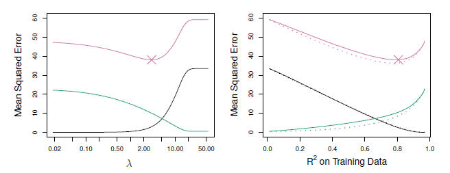

<b>FIG 7.8.</b><i> Gauche : tracés du biais au carré (noir), de la variance (vert) et de la MSE de test (violet) pour le lasso sur un ensemble de données simulées. Droite : Comparaison du biais au carré, de la variance et de la MSE de test entre le lasso (solide) et le ridge (en pointillés). Les deux sont représentés par rapport à leur $R^2$ sur les données d'entraînement, comme une forme commune d'indexation. Les croix dans les deux graphiques indiquent le modèle lasso pour lequel la MSE est la plus faible. </i>.

Au fur et à mesure que les ellipses s'éloignent des estimations des coefficients des moindres carrés, le $RSS$ augmente. Les équations (7.8) et (7.9) indiquent que les estimations des coefficients de régression lasso et ridge sont données par le premier point auquel une ellipse entre en contact avec la région de contrainte. Étant donné que la régression ridge a une contrainte circulaire sans point net, cette intersection ne se produira généralement pas sur un axe, et les estimations du coefficient de régression ridge seront donc exclusivement non nulles. Cependant, la contrainte du lasso a des angles sur chacun des axes, et l'ellipse coupera donc souvent la région de contrainte sur un axe. Lorsque cela se produit, l'un des coefficients sera égal à zéro. Dans les dimensions supérieures, plusieurs des coefficients estimés peuvent être égaux à zéro simultanément. Dans la $figure\ 7.7$, l'intersection se produit à $\beta_1=0$, et le modèle résultant ne comprendra donc que $\beta_2$.

Dans la $figure\ 7.7$, nous avons considéré le cas simple de $p = 2$. Lorsque $p = 3$, la région de contrainte pour la régression ridge devient une sphère, et la région de contrainte pour le lasso devient un polyèdre. Lorsque $p > 3$, la contrainte pour la régression ridge devient une hypersphère et la contrainte pour le lasso devient un polytope. Cependant, les idées clés décrites dans la figure $7.7$ restent valables. En particulier, le lasso conduit à une sélection des caractéristiques lorsque $p > 2$ en raison des angles aigus du polyèdre ou du polytope.

<a name="7-2-2-3"/>

#### [7.2.2.3 Comparaison du lasso et de la régression ridge](#7-2-2-3) ####

[Retour TOC](#toc)

Il est clair que le lasso présente un avantage majeur par rapport à la régression ridge, dans la mesure où il produit des modèles plus simples et plus interprétables qui ne font intervenir qu'un sous-ensemble de prédicteurs. Cependant, quelle méthode conduit à une meilleure précision de prédiction ? La $figure\ 7.8$ présente la variance, le biais au carré et la MSE de test du lasso appliqué aux mêmes données simulées que dans la $figure\ 7.5$.l est clair que le lasso conduit à un comportement qualitativement similaire à la régression ridge, en ce sens que lorsque $\lambda$ augmente, la variance diminue et le biais augmente.

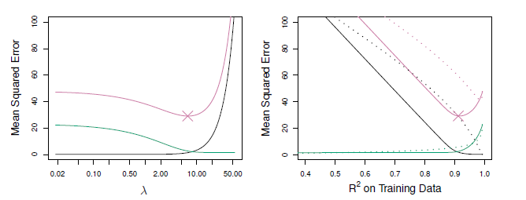

<b>FIGURE 7.9.</b><i>Gauche : tracés du biais au carré (noir), de la variance (vert) et de la MSE de test (violet) pour le lasso. Les données simulées sont similaires à celles de la figure 7.8, sauf que maintenant, seuls deux prédicteurs sont liés à la réponse. droite : Comparaison du biais au carré, de la variance et de la MSE de test entre le lasso (solide) et le ridge (en pointillés). Les deux sont tracés en fonction de leur $R^2$ sur les données d'apprentissage, comme une forme courante d'indentation. Les croix dans les deux graphiques indiquent le modèle lasso pour lequel la MSE est la plus petite.</i>

I Dans le panneau de droite de la $figure\ 7.8$, les lignes pointillées représentent les ajustements de la régression ridge. Ici, nous les traçons en fonction de leur $R^2$ sur les données d'apprentissage. Il s'agit d'une autre manière utile d'indexer les modèles, et elle peut être utilisée pour comparer des modèles avec différents types de régularisation, comme c'est le cas ici. Dans cet exemple, le lasso et la régression ridge donnent des biais presque identiques. Cependant, la variance de la régression ridge est légèrement inférieure à la variance du lasso. Par conséquent, la MSE minimale de la régression ridge est légèrement inférieure à celle du lasso.

Cependant, les données de la figure $7.8$ ont été générées de telle sorte que les 45 prédicteurs étaient liés à la réponse, c'est-à-dire qu'aucun des coefficients réels $\beta_1, \ldots, \beta_{45}$ n'était égal à zéro. Le lasso suppose implicitement qu'un certain nombre de coefficients sont réellement égaux à zéro. Par conséquent, il n'est pas surprenant que la régression ridge surpasse le lasso en termes d'erreur de prédiction dans ce contexte. La $figure\ 7.9$ illustre une situation similaire, sauf que la réponse est maintenant une fonction de seulement 2 prédicteurs sur 45. Dans ce cas, le lasso a tendance à surpasser la régression ridge en termes de biais, de variance et de $MSE$.

Ces deux exemples illustrent le fait que ni la régression ridge ni le lasso ne dominent universellement l'autre. En général, on peut s'attendre à ce que le lasso soit plus performant dans un contexte où un nombre relativement faible de prédicteurs ont des coefficients importants, et où les autres prédicteurs ont des coefficients très faibles ou égaux à zéro. La régression Ridge sera plus performante lorsque la réponse est une fonction de nombreuses prédicteurs, toutes avec des coefficients de taille à peu près égale. Cependant, le nombre de prédicteurs qui est lié à la réponse n'est jamais connu a priori pour les ensembles de données réels. 

Une technique telle que la validation croisée peut être utilisée afin de déterminer quelle approche est la meilleure sur un ensemble de données particulier.

Comme dans le cas de la régression ridge, lorsque les estimations des moindres carrés ont une variance excessivement élevée, la solution lasso peut permettre de réduire la variance au prix d'une légère augmentation du biais, et peut donc générer des prédictions plus précises. Contrairement à la régression ridge, le lasso effectue une sélection des variables, ce qui permet d'obtenir des modèles plus faciles à interpréter.

Il existe des algorithmes très efficaces pour ajuster les modèles ridge et lasso ; dans les deux cas, les chemins de coefficients entiers peuvent être calculés avec à peu près la même quantité de travail qu'un simple ajustement par les moindres carrés. Nous approfondirons cette question dans le laboratoire à la fin de ce chapitre.

<a name="7-2-2-4"/>

#### [7.2.2.4 Un cas spécial simple pour la régression en crête et le Lasso](#7-2-2-4) ####

[Retour TOC](#toc)

Pour mieux comprendre le comportement de la régression ridge et du lasso, considérons un cas spécial simple avec $n=p$, et $\mathbf{X}$ une matrice diagonale avec des 1 sur la diagonale et des 0 dans tous les éléments hors diagonale. Pour simplifier davantage le problème, supposons également que nous effectuons une régression sans interception. Avec ces hypothèses, le problème habituel des moindres carrés se simplifie et consiste à trouver $\beta_1, \ldots, \beta_p$ qui minimisent

$$
\sideset{}{^P_{j=1}}\sum\biggl(y_j-\beta_j\biggl)^2 .\hspace{6 em}(7.11)
$$

Dans ce cas, la solution des moindres carrés est donnée par

$$
\hat\beta_j=y_j .
$$

Et dans ce contexte, la régression ridge revient à trouver $\beta_1, \ldots, \beta_p$ tels que

$$
\sideset{}{^p_{j=1}}\sum\biggl(y_j-\beta_j\biggl)^2+\lambda \sideset{}{^p_{j=1}}\sum \beta_j^2 \hspace{6 em}(7.12)
$$

est minimisée, et le lasso revient à trouver les coefficients tels que

$$
\sideset{}{^p_{j=1}}\sum\biggl(y_j-\beta_j\biggl)^2+\lambda \sideset{}{^p_{j=1}}\sum |\beta_j| \hspace{6 em}(7.13)
$$

est minimisée. On peut montrer que dans ce contexte, les estimations de la régression ridge prennent la forme suivante

$$
\hat\beta_j^R=y_j /(1+\lambda), \hspace{6 em}(7.14)
$$

et les estimations lasso prennent la forme

$$
\hat\beta_j^L= 
\begin{cases}y_j-\lambda / 2 & \text { if } y_j &>\lambda / 2 \\ 
y_j+\lambda / 2 & \text { if } y_j &< -\lambda / 2 \\ 
0 & \text { if } |y_j| &\leq \lambda / 2\end{cases} \hspace{6 em}(7.15)
$$

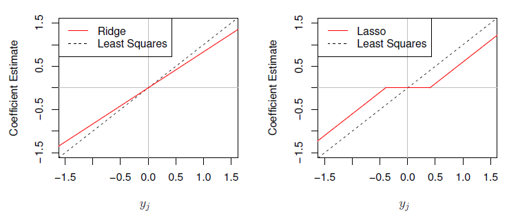

<b>FIGURE 7.10.</b><i>Les estimations des coefficients de régression ridge et lasso pour un cadre simple avec $n=p$ et $\mathbf{X}$ une matrice diagonale avec des 1 sur la diagonale. À gauche : les estimations des coefficients de la régression ridge sont réduites proportionnellement vers zéro, par rapport aux estimations des moindres carrés. A droite : Les estimations des coefficients lasso sont réduites à un seuil doux vers zéro.</i>

$La figure\ 7.10$ présente la situation. Nous pouvons constater que la régression ridge et le lasso effectuent deux types de rétrécissement très différents. Dans la régression ridge, chaque estimation du coefficient des moindres carrés est rétrécie dans la même proportion. En revanche, le lasso réduit chaque coefficient des moindres carrés vers zéro d'une quantité constante, $\lambda / 2$ ; les coefficients des moindres carrés qui sont inférieurs à $\lambda / 2$ en valeur absolue sont entièrement réduits à zéro. Le type de rétrécissement effectué par le lasso dans ce cadre simple (7.15) est connu sous le nom de soft-thresholding (seuils souples). Le fait que certains coefficients du lasso soient entièrement ramenés à zéro explique pourquoi le lasso effectue une sélection de caractéristiques.

Dans le cas d'une matrice de données plus générale $\mathbf{X}$, l'histoire est un peu plus compliquée que ce qui est décrit dans la $Figure 7.10$, mais les idées principales restent approximativement les mêmes : la régression ridge réduit plus ou moins chaque dimension des données dans la même proportion, tandis que le lasso réduit plus ou moins tous les coefficients vers zéro dans la même mesure, et les coefficients suffisamment petits sont réduits entièrement à zéro.

<a name="7-2-2-5"/>

#### [7.2.2.5 Interprétation bayésienne de la régression ridge et du lasso](#7-2-2-5) ####

[Retour TOC](#toc)

Nous allons maintenant montrer qu'il est possible de considérer la régression en crête et le lasso à travers un prisme bayésien. Un point de vue bayésien de la régression suppose que le vecteur de coefficient $\beta$ a une certaine distribution préalable, disons $p(\beta)$, où $\beta=$ $\left(\beta_0, \beta_1, \ldots, \beta_p\right)^T$. La vraisemblance des données peut être écrite sous la forme $f(Y \mid X, \beta)$, où $X=(X_1, \ldots, X_p)$. En multipliant la distribution antérieure par la vraisemblance, on obtient (jusqu'à une constante de proportionnalité) la distribution postérieure, qui prend la forme suivante

$$
p(\beta \mid X, Y) \propto f(Y \mid X, \beta) p(\beta \mid X)=f(Y \mid X, \beta) p(\beta),
$$

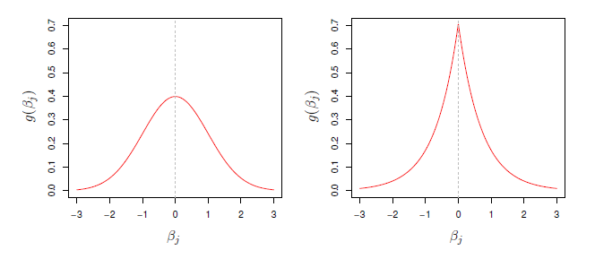

<b>FIG 7.11.</b><i> Left: Ridge regression is the posterior mode for $\beta$ under a Gaussian prior. Right: The lasso is the posterior mode for $\beta$ under a double-exponential prior.</i>

où la proportionnalité ci-dessus découle du théorème de Bayes, et l'égalité ci-dessus découle de l'hypothèse selon laquelle $X$ est fixe.

Nous supposons le modèle linéaire habituel,

$$
Y=\beta_0+X_1 \beta_1+\cdots+X_p \beta_p+\epsilon,
$$

et supposons que les erreurs sont indépendantes et tirées d'une distribution normale. En outre, supposons que $p(\beta)=\sideset{}{^p_{j=1}}\prod g(\beta_j)$, pour une certaine fonction de densité $g$. Il s'avère que la régression ridge et le lasso découlent naturellement de deux cas particuliers de $g$ :

- Si $g$ est une distribution gaussienne de moyenne zéro et d'écart-type fonction de $\lambda$, il s'ensuit que le mode postérieur de $\beta$ - c'est-à-dire la valeur la plus probable de $\beta$, compte tenu des données - est donné par la solution de régression ridge. (En fait, la solution de régression ridge est également la moyenne postérieure).

- Si $g$ est une distribution double-exponentielle (Laplace) avec une moyenne de zéro et un paramètre d'échelle fonction de $\lambda$, il s'ensuit que le mode postérieur pour $\beta$ est la solution lasso. (Cependant, la solution lasso n'est pas la moyenne postérieure, et en fait, la moyenne postérieure ne donne pas un vecteur de coefficient clairsemé).

Les prieurs gaussiens et doublement exponentiels sont présentés à la $figure\ 7.11.$ Par conséquent, d'un point de vue bayésien, la régression ridge et le lasso découlent directement de l'hypothèse du modèle linéaire habituel avec des erreurs normales, ainsi que d'une distribution préalable simple pour $\beta$. Remarquez que la distribution antérieure du lasso présente un pic abrupt à zéro, tandis que la distribution gaussienne est plus plate à zéro. Par conséquent, le lasso s'attend a priori à ce que de nombreux coefficients soient (exactement) nuls, tandis que la gaussienne suppose que les coefficients sont distribués aléatoirement autour de zéro.

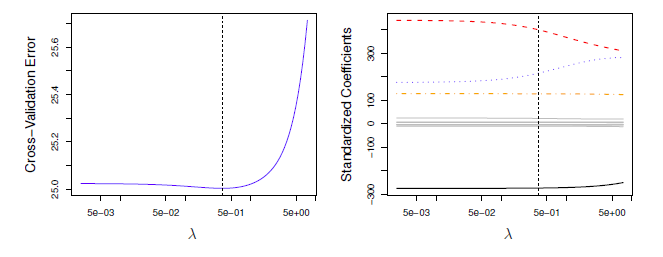

<b>FIG 7.12.</b><i>Gauche : Erreurs de validation croisée qui résultent de l'application de la régression ridge à l'ensemble de données Crédit avec différentes valeurs de $\lambda$. Droite : Les estimations des coefficients en fonction de $\lambda$. Les lignes pointillées verticales indiquent la valeur de $\lambda$ sélectionnée par validation croisée.</i>

<a name="7-2-3"/>

### [7.2.3 Sélection du paramètre d'accord](#7-2-3) ###

[Retour TOC](#toc)

Juste comme les approches de sélection de sous-ensembles considérées dans la section $7.1$ nécessitent une méthode pour déterminer lequel des modèles considérés est le meilleur, la mise en œuvre de la régression ridge et du lasso nécessite une méthode pour sélectionner une valeur pour le paramètre d'accord $\lambda$ dans (7.5) et (7.7), ou de manière équivalente, la valeur de la contrainte $s$ dans (7.9) et (7.8). La validation croisée offre un moyen simple d'aborder ce problème. Nous choisissons une grille de valeurs de $\lambda$, et calculons l'erreur de validation croisée pour chaque valeur de $\lambda$, comme décrit au chapitre 5 . Nous sélectionnons ensuite la valeur du paramètre de réglage pour laquelle l'erreur de validation croisée est la plus faible. Enfin, le modèle est réajusté en utilisant toutes les observations disponibles et la valeur sélectionnée du paramètre d'ajustement.

La $figure\ 7.12$ montre le choix de $\lambda$ qui résulte de la validation croisée avec exclusion sur les ajustements de régression ridge de l'ensemble de données de crédit. Les lignes verticales en pointillés indiquent la valeur sélectionnée de $\lambda$. Dans ce cas, la valeur est relativement faible, ce qui indique que l'ajustement optimal n'implique qu'un faible rétrécissement par rapport à la solution des moindres carrés. De plus, le creux n'est pas très prononcé, il existe donc une large gamme de valeurs qui donneraient une erreur très similaire. Dans un cas comme celui-ci, nous pourrions simplement utiliser la solution des moindres carrés.

La $figure\ 7.13$ illustre la validation croisée dix fois appliquée aux ajustements lasso sur les données simulées éparses de la figure 7.9. Le panneau de gauche de la figure $7.13$ affiche l'erreur de validation croisée, tandis que le panneau de droite affiche les estimations des coefficients. Les lignes pointillées verticales indiquent le point auquel l'erreur de validation croisée est la plus faible. Les deux lignes colorées du panneau de droite de la figure $7.13$ représentent les deux variables prédictives liées à la réponse, tandis que les lignes grises représentent les variables prédictives non liées ; elles sont souvent appelées variables de signal et de bruit, respectivement. 

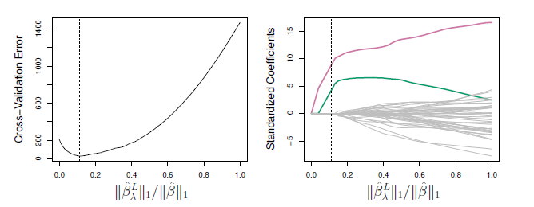

<b>FIGURE 7.13.</b><i>[ Gauche : MSE par validation croisée dix fois pour le lasso, appliqué à l'ensemble de données simulées éparses de la figure 7.9. Droite : Les estimations des coefficients lasso correspondants sont affichées. Les deux variables de signal sont représentées en couleur, et les variables de bruit sont en gris. Les lignes pointillées verticales indiquent l'ajustement lasso pour lequel l'erreur de validation croisée est la plus faible.]()</i>

Non seulement le lasso a correctement donné des estimations de coefficients beaucoup plus importantes aux deux prédicteurs du signal, mais aussi l'erreur de validation croisée minimale correspond à un ensemble d'estimations de coefficients pour lesquelles seules les variables du signal sont non nulles. Par conséquent, la validation croisée associée au lasso a correctement identifié les deux variables de signal dans le modèle, même s'il s'agit d'un paramètre difficile, avec $p=45$ variables et seulement $n=50$ observations. En revanche, la solution des moindres carrés, présentée à l'extrême droite du panneau de droite de la figure $7.13$, attribue une estimation de coefficient importante à une seule des deux variables de signal.

<a name="7-3"/>

## [7.3 Méthodes de réduction de dimension](#7-3) ##

[Retour TOC](#toc)

Les méthodes que nous avons abordées jusqu'à présent dans ce chapitre ont contrôlé la variance de deux manières différentes, soit en utilisant un sous-ensemble des variables originales, soit en réduisant leurs coefficients vers zéro. Toutes ces méthodes sont définies à l'aide des prédicteurs originaux, $X_1, X_2, \ldots, X_p$. Nous allons maintenant explorer une classe d'approches qui transforment les prédicteurs, puis ajustent un modèle des moindres carrés en utilisant les variables transformées. Nous appellerons ces techniques des méthodes de réduction de dimension.

Soit $Z_1, Z_2, \ldots, Z_M$ représentant $M < p$ combinaisons linéaires de nos $p$ prédicteurs originaux. C'est-à-dire ,

$$
Z_m=\sideset{}{^p_{j=1}}\sum \phi_{j m} X_j \hspace{6 em}(7.16)
$$

C'est à dire, pour certaines constantes $\phi_{1 m}, \phi_{2 m} \ldots, \phi_{p m}, m=1, \ldots, M$. Nous pouvons alors ajuster le modèle de régression linéaire

$$
y_i=\theta_0+\sideset{}{^M_{m=1}}\sum \theta_m z_{i m}+\epsilon_i, \quad i=1, \ldots, n \hspace{6 em}(7.17)
$$

en utilisant les moindres carrés. Notez que dans (7.17), les coefficients de régression sont donnés par $\theta_0, \theta_1, \ldots, \theta_M$. Si les constantes $\phi_{1 m}, \phi_{2 m}, \ldots, \phi_{p m}$ sont choisies judicieusement, ces approches de réduction de la dimension peuvent souvent surpasser la régression par les moindres carrés. En d'autres termes, l'ajustement de $(7.17)$ à l'aide des moindres carrés peut donner de meilleurs résultats que l'ajustement de (7.1) à l'aide des moindres carrés.

Le terme de réduction de dimension vient du fait que cette approche réduit le problème de l'estimation des $p+1$ coefficients $\beta_0, \beta_1, \ldots, \beta_p$ au problème plus simple de l'estimation des $M+1$ coefficients $\theta_0, \theta_1, \ldots, \theta_M$, où $M < p$. En d'autres termes, la dimension du problème a été réduite de $p+1$ à $M+1$.

Remarquez que d'après $(7.16)$,

$$
\sideset{}{^M_{m=1}}\sum \theta_m z_{i m}=\sideset{}{^M_{m=1}}\sum \theta_m \sideset{}{^p_{j=1}}\sum \phi_{j m} x_{i j}=\sideset{}{^p_{j=1}}\sum \sideset{}{^M_{m=1}}\sum \theta_m \phi_{j m} x_{i j}=\sideset{}{^p_{j=1}}\sum \beta_j x_{i j}
$$

où

$$
\beta_j=\sideset{}{^M_{m=1}}\sum \theta_m \phi_{j m} \hspace{6 em}(7.18)
$$

Par conséquent, (7.17) peut être considéré comme un cas particulier du modèle de régression linéaire original donné par (7.1). La réduction de dimension sert à contraindre les coefficients estimés de $\beta_j$, puisqu'ils doivent maintenant prendre la forme (7.18). Cette contrainte sur la forme des coefficients a le potentiel de biaiser les estimations des coefficients. Cependant, dans les situations où $p$ est important par rapport à $n$, le choix d'une valeur de $M \ll p$ peut réduire de manière significative la variance des coefficients ajustés. Si $M = p$ , et que tous les $Z_m$ sont linéairement indépendants, alors (7.18) ne pose aucune contrainte. Dans ce cas, il n'y a pas de réduction de dimension, et l'ajustement (7.17) est donc équivalent à la réalisation des moindres carrés sur les prédicteurs originaux $p$.

Toutes les méthodes de réduction de dimension fonctionnent en deux étapes. Tout d'abord, les prédicteurs transformés $Z_1, Z_2, Z_M$ sont obtenus. Ensuite, le modèle est ajusté en utilisant ces prédicteurs $M$. Cependant, le choix de $Z_1, Z_2, \ldots, Z_M$, ou de manière équivalente, la sélection de $\phi_{j m}$ 's, peut se faire de différentes manières. Dans ce chapitre, nous allons considérer deux approches pour cette tâche : les composantes principales et les moindres carrés partiels.

<a name="7-3-1"/>

### [7.3.1 Régression en composantes principales](#7-3-1) ###

[Retour TOC](#toc)

L'analyse en composantes principales $(ACP)$ est une approche populaire pour dériver un ensemble de caractéristiques de faible dimension à partir d'un grand ensemble de variables.

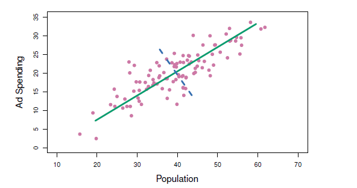

<b>FIG 7.14.</b> <i>[La taille de la population (pop) et les dépenses publicitaires (ad) pour 100 villes différentes sont représentées par des cercles violets. La ligne continue verte indique la première composante principale, et la ligne pointillée bleue indique la deuxième composante principale]()</i>.

Nous décrivons ici l'utilisation d' $ACP$ comme technique de réduction de dimension pour la régression.

<a name="7-3-1-1"/>

#### [7.3.1.1 Aperçu de l'analyse en composantes principaless](#7-3-1-1) ####

[Retour TOC](#toc)

L' $ACP$ est une technique permettant de réduire la dimension d'une matrice $n \times p$ de données $\mathrm{X}$. La première direction de la composante principale des données est la direction selon laquelle les observations varient le plus. Considérons, par exemple, la figure 7.14, qui montre la taille de la population (pop) en dizaines de milliers de personnes et les dépenses publicitaires d'une entreprise particulière (ad) en milliers de dollars, pour 100 villes. La ligne continue verte représente la direction de la première composante principale des données. Nous pouvons voir à l'œil que c'est dans cette direction que se trouve la plus grande variabilité des données. En d'autres termes, si nous projetons les 100 observations sur cette ligne (comme indiqué dans le panneau de gauche de la $figure\ 7.15$ ), les observations projetées résultantes auront la plus grande variance possible ; la projection des observations sur toute autre ligne donnera des observations projetées avec une variance plus faible. La projection d'un point sur une ligne implique simplement de trouver l'emplacement sur la ligne qui est le plus proche du point.

La première composante principale est représentée graphiquement à la $figure\ 7.14$, mais comment la résumer mathématiquement ? Elle est donnée par la formule

$$
Z_1=0.839 \times(\text { pop }-\overline{\text { pop }})+0.544 \times(\mathrm{ad}-\overline{\mathrm{ad}}) \hspace{6 em}(7.19)
$$

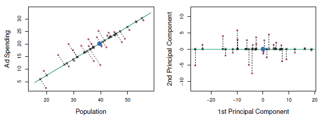

<b>FIG 7.15.</b><i>Un sous-ensemble des données sur la publicité. La pop moyenne et les budgets publicitaires sont indiqués par un cercle bleu. À gauche : la direction de la première composante principale est indiquée en vert. Il s'agit de la dimension le long de laquelle les données varient le plus, et elle définit également la ligne qui est la plus proche de toutes les $n$ observations. Les distances de chaque observation à la composante principale sont représentées à l'aide des segments de ligne pointillée noire. Le point bleu représente ( $\overline{\mathrm{pop}}, \overline{\mathrm{ad}})$. À droite : Le panneau de gauche a été tourné de façon à ce que la direction de la première composante principale coïncide avec l'axe $x$.</i>

Ici, $\phi_{11}=0,839$ et $\phi_{21}=0,544$ sont les chargements des composantes principales, qui définissent la direction mentionnée ci-dessus. Dans (7.19), pop indique la moyenne de toutes les valeurs de pop dans cet ensemble de données, et ad indique la moyenne de toutes les dépenses publicitaires. L'idée est que, parmi toutes les combinaisons linéaires possibles de pop et de ad telles que $\phi_{11}^2+\phi_{21}^2=1$, cette combinaison linéaire particulière donne la variance la plus élevée : c'est-à-dire qu'il s'agit de la combinaison linéaire pour laquelle ${Var}\left(\phi_{11} \times(\mathrm{pop}-\overline{\mathrm{pop}})+\phi_{21} \times(\mathrm{ad}-\overline{\mathrm{ad}})\right)$ est maximisée. Il est nécessaire de ne considérer que les combinaisons linéaires de la forme $\phi_{11}^2+\phi_{21}^2=1$, car sinon nous pourrions augmenter $\phi_{11}$ et $\phi_{21}$ arbitrairement afin de faire exploser la variance. Dans (7.19), les deux chargements sont tous deux positifs et ont une taille similaire, et donc $Z_1$ est presque une moyenne des deux variables.

Puisque $n=100$, pop et ad sont des vecteurs de longueur 100 , tout comme $Z_1$ dans (7.19). Par exemple,

$$
z_{i 1}=0.839 \times(\mathrm{pop}_i-\overline{\mathrm{pop}})+0.544 \times(\mathrm{ad}_i-\overline{\mathrm{ad}}) . \hspace{6 em}(7.20)
$$

Les valeurs de $z_{11}, \ldots, z_{n 1}$ sont connues comme les scores des composantes principales, et peuvent être vues dans le panneau de droite de la $figure\ 7.15$.

Il existe également une autre interprétation de l' $ACP$ : le premier vecteur de composante principale définit la ligne la plus proche possible des données. Par exemple, dans la $figure\ 7.14$ , la première ligne de composantes principales minimise la somme des carrés des distances perpendiculaires entre chaque point et la ligne. Ces distances sont représentées par des segments de ligne en pointillés dans le panneau de gauche de la $figure\ 7.15$ , où les croix représentent la projection de chaque point sur la ligne de la première composante principale. La première composante principale a été choisie de manière à ce que les observations projetées soient aussi proches que possible des observations originales.

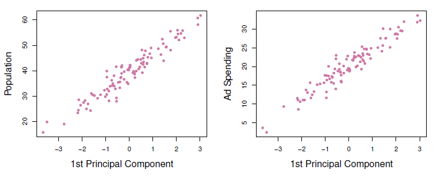

<b>FIG 7.16.</b><i>Plots des scores de la première composante principale $z_n$ en fonction de la pop et de la pub. Les relations sont fortes.</i>

Dans le panneau de droite de la $figure\ 7.15$, le panneau de gauche a été tourné de sorte que la direction de la première composante principale coïncide avec l'axe $x$. Il est possible de montrer que le score de la première composante principale pour la $i^{ème}$ observation, donné dans $(7.20)$, est la distance dans la direction $x$ de la $i^{ème}$ croix par rapport à zéro. Ainsi, par exemple, le point situé dans le coin inférieur gauche du panneau gauche de la figure $7.15$ a un score de composante principale négatif important, $z_{i 1}=-26,1$, tandis que le point situé dans le coin supérieur droit a un score positif important, $z_{i 1}=18,7$. Ces scores peuvent être calculés directement en utilisant $(7.20)$.

Nous pouvons considérer les valeurs de la composante principale $Z_1$ comme des résumés à un seul chiffre des budgets conjoints de la pop et de la publicité pour chaque emplacement. Dans cet exemple,  

$$
\text { if } z_{i 1}=0.839 \times(\mathrm{pop}_i-\overline{\mathrm{pop}})+0.544 \times(\mathrm{ad}_{i}-\overline{\mathrm{ad}})<0
$$

, cela indique une ville avec une taille de population et des dépenses publicitaires inférieures à la moyenne. Un score positif suggère le contraire. Dans quelle mesure un seul chiffre peut-il représenter à la fois la population et la publicité ? Dans ce cas, la $figure\ 7.14$ indique que la population et la publicité ont une relation approximativement linéaire, et nous pouvons donc nous attendre à ce qu'un résumé à un seul chiffre fonctionne bien. La $figure\ 7.16$ affiche $z_{\mathrm{il}}$ en fonction de la population et de la publicité. Les graphiques montrent une forte relation entre la première composante principale et les deux caractéristiques. En d'autres termes, la première composante principale semble capturer la plupart des informations contenues dans les prédicteurs pop et ad.

Jusqu'à présent, nous nous sommes concentrés sur la première composante principale. En général, on peut construire jusqu'à $p$ composantes principales distinctes. La deuxième composante principale $Z_2$ est une combinaison linéaire des variables qui n'est pas corrélée avec $Z_1$, et qui a la plus grande variance sous réserve de cette contrainte. La direction de la deuxième composante principale est illustrée par une ligne bleue pointillée dans la $figure\ 7.14$.

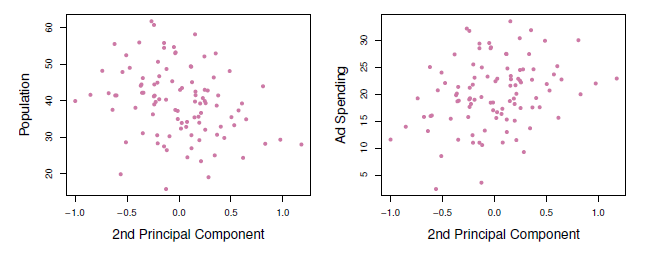

<b>FIG 7.17.</b> <i>Plots des scores de la deuxième composante principale $z_{12}$ en fonction de la pop et de la pub. Les relations sont faibles.</i>

Il s'avère que la condition de corrélation nulle de $Z_1$ avec $Z_2$ est équivalente à la condition que la direction soit perpendiculaire, ou orthogonale, à la direction de la première composante principale. La deuxième composante principale est donnée par la formule

$$
Z_2=0.544 \times(\text { pop }-\overline{\text { pop }})-0.839 \times(\mathrm{ad}-\overline{\mathrm{ad}}) .
$$

Puisque les données sur la publicité ont deux prédicteurs, les deux premières composantes principales contiennent toutes les informations qui se trouvent dans la pop et la pub. Cependant, par construction, c'est la première composante qui contient le plus d'informations. Considérez, par exemple, la variabilité beaucoup plus grande de $z_{i 1}$ (l'axe des $x$) par rapport à $z_{i 2}$ (l'axe des $y$) dans le panneau de droite de la $figure\ 7.15$. Le fait que les scores de la deuxième composante principale soient beaucoup plus proches de zéro indique que cette composante capture beaucoup moins d'informations. Pour une autre illustration, la $figure\ 7.17$ montre $z_{i 2}$ en fonction du pop et de la publicité. Il y a peu de relation entre la deuxième composante principale et ces deux prédicteurs, ce qui suggère à nouveau que dans ce cas, il suffit de la première composante principale pour représenter avec précision les budgets pop et ad.

Avec des données bidimensionnelles, comme dans notre exemple de publicité, nous pouvons construire au maximum deux composantes principales. Cependant, si nous disposions d'autres prédicteurs, tels que l'âge de la population, le niveau de revenu, l'éducation, etc. Elles maximiseraient successivement la variance, sous réserve de la contrainte d'être non corrélées avec les composantes précédentes.

<a name="7-3-1-2"/>

#### [7.3.1.2 L'approche de la régression en composantes principales](#7-3-1-2) ####

[Retour TOC](#toc)

L'approche de régression en composantes principales ( $\mathrm{PCR}$ ) consiste à construire les $M$ premières composantes principales, $Z_1, \ldots, Z_M$, puis à utiliser ces composantes comme prédicteurs dans un modèle de régression linéaire ajusté par la méthode des moindres carrés. L'idée principale est que, souvent, un petit nombre de composantes principales suffit à expliquer la majeure partie de la variabilité des données, ainsi qu'un grand nombre d'autres facteurs.

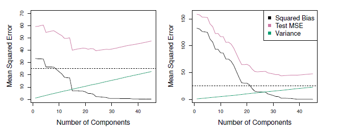

<b>FIG 7.18.</b><i> [ La PCR a été appliquée à deux ensembles de données simulées. Dans chaque panneau, la ligne pointillée horizontale représente l'erreur irréductible. À gauche : données simulées de la figure 7.8. Droite : Données simulées de la figure 7.9.]() </i>

L'idée clé est que, souvent, un petit nombre de composantes principales suffit à expliquer la majeure partie de la variabilité des données, ainsi que la relation avec la réponse. En d'autres termes, nous supposons que les directions dans lesquelles $X_1, \ldots, X_p$ montrent le plus de variation sont les directions qui sont associées à $Y$. Bien que la véracité de cette hypothèse ne soit pas garantie, elle s'avère souvent être une approximation suffisamment raisonnable pour donner de bons résultats.

Si l'hypothèse sous-jacente à $PCR$ se vérifie, l'ajustement d'un modèle des moindres carrés à $Z_1, \ldots, Z_M$ conduira à de meilleurs résultats que l'ajustement d'un modèle des moindres carrés à $X_1, \ldots, X_p$, puisque la plupart ou la totalité des informations des données relatives à la réponse sont contenues dans $Z_1, \ldots, Z_M$, et qu'en estimant seulement $M \ll p$ coefficients, nous pouvons limiter le surajustement. Dans les données relatives à la publicité, la première composante principale explique la majeure partie de la variance de la population et de la publicité, de sorte qu'une régression en composantes principales qui utilise cette seule variable pour prédire une réponse d'intérêt, telle que les ventes, sera probablement assez performante.

La $figure\ 7.18$ montre les ajustements de la $PCR$ sur les ensembles de données simulées des figures $7.8$ et $7.9$. Rappelez-vous que les deux ensembles de données ont été générés à l'aide de $n=50$ observations et $p=45$ prédicteurs. Cependant, alors que la réponse dans le premier ensemble de données était une fonction de tous les prédicteurs, la réponse dans le second ensemble de données a été générée en utilisant seulement deux des prédicteurs. Les courbes sont tracées en fonction de $M$, le nombre de composantes principales utilisées comme prédicteurs dans le modèle de régression. Plus le nombre de composantes principales utilisées dans le modèle de régression est élevé, plus le biais diminue, mais plus la variance augmente. Il en résulte une forme typique en U pour l'erreur quadratique moyenne. Lorsque $M=p=45$, alors $\mathrm{PCR}$ équivaut simplement à un ajustement par la méthode des moindres carrés en utilisant tous les prédicteurs originaux. La figure indique que l'exécution de la $PCR$ avec un choix approprié de $M$ peut entraîner une amélioration substantielle par rapport aux moindres carrés, notamment dans le panneau de gauche. Cependant, en examinant les résultats de la régression ridge et du lasso aux $figures\ 7.5,\ 7.8\ et\ 7.9$, nous constatons que la $PCR$ n'est pas aussi performante que les deux méthodes de rétrécissement dans cet exemple.

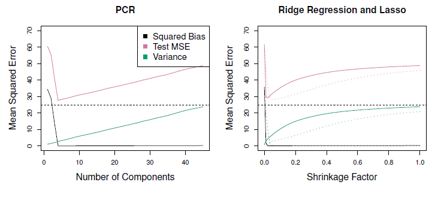

<b>FIG 7.19.</b><i> La PCR, la régression ridge et le lasso ont été appliqués à un ensemble de données simulées dans lequel les cinq premières composantes principales de $X$ contiennent toutes les informations sur la réponse $Y$. Dans chaque panneau, l'erreur irréductible ${Var}(\epsilon)$ est représentée par une ligne pointillée horizontale. À gauche : résultats pour la PCR. Droite : Résultats pour le lasso (solide) et la régression ridge (en pointillés). L'axe $x$ affiche le facteur de rétrécissement des estimations de coefficient, défini comme la norme $\ell_2$ des estimations de coefficient rétrécies divisée par la norme $\ell_2$ de l'estimation des moindres carrés.</i>

La performance relativement moins bonne de la $PCR$ dans la $figure\ 7.18$ est une conséquence du fait que les données ont été générées de telle manière que de nombreuses composantes principales sont nécessaires pour modéliser adéquatement la réponse. En revanche, la $PCR$ aura tendance à donner de bons résultats dans les cas où les quelques premières composantes principales sont suffisantes pour capturer la majeure partie de la variation des prédicteurs ainsi que la relation avec la réponse. Le panneau de gauche de la $figure\ 7.19$ illustre les résultats d'un autre ensemble de données simulées conçu pour être plus favorable à la $PCR$. Ici, la réponse a été générée de telle manière qu'elle dépend exclusivement des cinq premières composantes principales. Maintenant, le biais tombe rapidement à zéro lorsque $M$, le nombre de composantes principales utilisées dans $\mathrm{PCR}$, augmente. L'erreur quadratique moyenne affiche un minimum clair à $M = 5$. Le panneau de droite de la $figure\ 7.19$ présente les résultats obtenus sur ces données en utilisant la régression ridge et le lasso. Les trois méthodes offrent une amélioration significative par rapport aux moindres carrés. Cependant, la $PCR$ et la régression ridge sont légèrement plus performantes que le lasso.

Nous notons que même si la $PCR$ offre un moyen simple d'effectuer une régression à l'aide de prédicteurs $M < p$, il ne s'agit pas d'une méthode de sélection de caractéristiques. Cela est dû au fait que chacune des $M$ composantes principales utilisées dans la régression est une combinaison linéaire de toutes les $p$ caractéristiques originales. Par exemple, dans $(7.19)$, $Z_1$ est une combinaison linéaire de pop et de ad. Par conséquent, si la $PCR$ donne souvent de bons résultats dans de nombreux contextes pratiques, elle n'aboutit pas au développement d'un modèle qui repose sur un petit ensemble de caractéristiques originales. En ce sens, la $PCR$ est plus proche de la régression ridge que du lasso. 

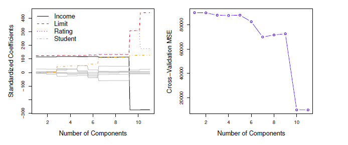

<b>FIG 7.20.</b><i>Gauche : estimations des coefficients normalisés de la PCR sur l'ensemble des données de crédit pour différentes valeurs de $M$. Droite : Le MSE de la validation croisée dix fois obtenu à l'aide de la PCR, en fonction de $M$.</i>

En fait, on peut montrer que la $PCR$ et la régression ridge sont très étroitement liées. On peut même considérer la régression ridge comme une version continue de $PCR$.

Dans la $PCR$, le nombre de composantes principales, $M$, est généralement choisi par validation croisée. Les résultats de l'application de la $PCR$ à l'ensemble de données du Crédit sont présentés à la $figure\ 7.20$ ; le panneau de droite affiche les erreurs de validation croisée obtenues, en fonction de $M$. Sur ces données, l'erreur de validation croisée la plus faible se produit lorsqu'il y a $M=10$ composantes ; cela correspond à une réduction de dimension presque nulle, puisque la $PCR$ avec $M=11$ est équivalente à la simple exécution des moindres carrés.

Lors de l'exécution de la $PCR$, nous recommandons généralement de normaliser chaque prédicteur, en utilisant (7.6), avant de générer les composantes principales. Cette normalisation garantit que toutes les variables sont sur la même échelle. En l'absence de normalisation, les variables à haute variance auront tendance à jouer un rôle plus important dans les composantes principales obtenues, et l'échelle sur laquelle les variables sont mesurées aura finalement un effet sur le modèle $PCR$ final. Cependant, si les variables sont toutes mesurées dans les mêmes unités (par exemple, en kilogrammes ou en pouces), on peut choisir de ne pas les normaliser.

<a name="7-3-2"/>

### [7.3.2 Moindres carrés partiels](#7-3-2) ###

[Retour TOC](#toc)

L'approche $PCR$ que nous venons de décrire consiste à identifier les combinaisons linéaires, ou directions, qui représentent le mieux les prédicteurs $X_1, \ldots, X_p$. Ces directions sont identifiées de manière non supervisée, puisque la réponse $Y$ n'est pas utilisée pour aider à déterminer les directions des composantes principales. Autrement dit, la réponse ne supervise pas l'identification des composantes principales.

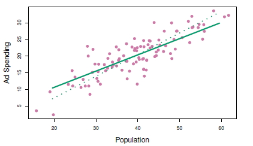

<b>FIG 7.21.</b><i> [Pour les données sur la publicité, la première direction PLS (ligne pleine) et la première direction PCR (ligne pointillée) sont indiquées]()</i>.

Par conséquent, la $PCR$ souffre d'un inconvénient : il n'y a aucune garantie que les directions qui expliquent le mieux les prédicteurs seront également les meilleures directions à utiliser pour prédire la réponse. Les méthodes non supervisées sont abordées plus en détail au chapitre 12 .

Nous présentons maintenant les moindres carrés partiels ($PLS$), une alternative supervisée à la PCR. Comme la $PCR$ , $PLS$ est une méthode de réduction de la dimension, qui identifie d'abord un nouvel ensemble de caractéristiques $Z_1, \ldots, Z_M$ qui sont des combinaisons linéaires des caractéristiques d'origine, puis ajuste un modèle linéaire par moindres carrés en utilisant ces $M$ nouvelles caractéristiques. Mais contrairement à la $PCR$, la $PLS$ identifie ces nouvelles caractéristiques de manière supervisée - c'est-à-dire qu'elle utilise la réponse $Y$ afin d'identifier les nouvelles caractéristiques qui non seulement se rapprochent bien des anciennes caractéristiques, mais qui sont également liées à la réponse. En gros, l'approche PLS tente de trouver des directions qui aident à expliquer à la fois la réponse et les prédicteurs.

Nous décrivons maintenant comment la première direction PLS est calculée. Après avoir normalisé les prédicteurs $p$, PLS calcule la première direction $Z_1$ en fixant chaque $\phi_{j 1}$ dans (7.16) égal au coefficient de la régression linéaire simple de $Y$ sur $X_j$. On peut montrer que ce coefficient est proportionnel à la corrélation entre $Y$ et $X_j$. Par conséquent, en calculant $Z_1=\sideset{}{^p_{j=1}}\sum \phi_{j 1} X_j$, PLS accorde le poids le plus élevé aux variables qui sont le plus fortement liées à la réponse.

La $figure\ 7.21$ montre un exemple de $PLS$ sur un ensemble de données synthétiques avec, comme réponse, les ventes dans chacune des 100 régions et deux prédicteurs : la taille de la population et les dépenses publicitaires. La ligne verte pleine indique la première direction $PLS$, tandis que la ligne pointillée montre la première direction de la composante principale. $PLS$ a choisi une direction qui présente moins de changement dans la dimension publicitaire par unité de changement dans la dimension démographique, par rapport à l' $ACP$ . Cela suggère que la pop est plus fortement corrélée avec la réponse que la pub. 

La direction PLS n'ajuste pas les prédicteurs aussi étroitement que l'ACP, mais elle explique mieux la réponse.

Pour identifier la deuxième direction PLS, nous ajustons d'abord chacune des variables pour $Z_1$, en régressant chaque variable sur $Z_1$ et en prenant les résidus. Ces résidus peuvent être interprétés comme l'information restante qui n'a pas été expliquée par la première direction PLS. Nous calculons ensuite $Z_2$ en utilisant ces données orthogonalisées, exactement de la même manière que $Z_1$ a été calculé sur la base des données originales. Cette approche itérative peut être répétée $M$ fois pour identifier plusieurs composantes PLS $Z_1, \ldots, Z_M$. Enfin, à la fin de cette procédure, nous utilisons les moindres carrés pour ajuster un modèle linéaire afin de prédire $Y$ à l'aide de $Z_1, \ldots, Z_M$, exactement de la même manière que pour la PCR.

Comme pour $\mathrm{PCR}$, le nombre $M$ de directions partielles des moindres carrés utilisées dans $PLS$ est un paramètre de réglage qui est généralement choisi par validation croisée. On normalise généralement les prédicteurs et la réponse avant d'effectuer la $PLS$.

La méthode $PLS$ est populaire dans le domaine de la chimio métrie, où de nombreuses variables proviennent de signaux spectrométriques numérisés. En pratique, ses performances ne sont souvent pas meilleures que celles de la régression ridge ou de la $\mathrm{PCR}$. Bien que la réduction de dimension supervisée de $PLS$ puisse réduire le biais, elle peut également augmenter la variance, de sorte que l'avantage global de $PLS$ par rapport à la $PCR$ est nul.

<a name="7-4"/>

## [7.4 Considérations sur les hautes dimensions](#7-4) ##

<a name="7-4-1"/>

### [7.4.1 Données à haute dimension](#7-4-1) ###

[Retour TOC](#toc)

La plupart des techniques statistiques traditionnelles de régression et de classification sont conçues pour un environnement à faible dimension dans lequel $n$, le nombre d'observations, est beaucoup plus grand que $p$, le nombre de caractéristiques. Cela est dû en partie au fait que, pendant la majeure partie de l'histoire de ce domaine, la plupart des problèmes scientifiques nécessitant l'utilisation de la statistique étaient de faible dimension. Par exemple, considérons la tâche consistant à développer un modèle pour prédire la pression artérielle d'un patient sur la base de son âge, de son sexe et de son indice de masse corporelle ($IMC$). Il existe trois prédicteurs, ou quatre si une ordonnée à l'origine est incluse dans le modèle, et peut-être plusieurs milliers de patients pour lesquels la pression artérielle et l'âge, le sexe et l'IMC sont disponibles. Par conséquent, $n \gg p$, et le problème est donc de faible dimension. (Par dimension, nous faisons ici référence à la taille de $p$).

Au cours des 20 dernières années, les nouvelles technologies ont changé la façon dont les données sont collectées dans des domaines aussi divers que la finance, le marketing et la médecine. Il est désormais courant de collecter un nombre presque illimité de mesures de caractéristiques ( $p$ très grand). Alors que $p$ peut être extrêmement grand, le nombre d'observations $n$ est souvent limité en raison du coût, de la disponibilité des échantillons ou d'autres considérations. Voici deux exemples :

1. Plutôt que de prédire la pression artérielle sur la base juste de l'âge, du sexe et de l'IMC, on pourrait également recueillir les mesures d'un demi-million de polymorphismes nucléotidiques simples (SNP ; il s'agit de mutations individuelles de l'ADN qui sont relativement courantes dans la population) pour les inclure dans le modèle prédictif. Alors $n \approx 200$ et $p \approx 500 000$.
2. Un analyste marketing désireux de comprendre les habitudes d'achat en ligne des internautes pourrait considérer comme des caractéristiques tous les termes de recherche saisis par les utilisateurs d'un moteur de recherche. C'est ce qu'on appelle parfois le modèle du "sac de mots". Le même chercheur peut avoir accès à l'historique des recherches de quelques centaines ou milliers d'utilisateurs de moteurs de recherche qui ont accepté de partager leurs informations avec lui. Pour un utilisateur donné, chacun des $p$ termes de recherche est noté présent $(0)$ ou absent (1), créant ainsi un grand vecteur de caractéristiques binaires. Dans ce cas, $n \approx 1,000$ et $p$ est beaucoup plus grand.

Les ensembles de données contenant plus de caractéristiques que d'observations sont souvent qualifiés de haute dimension. Les approches classiques telles que la régression linéaire par les moindres carrés ne sont pas appropriées dans ce contexte. Bon nombre des problèmes qui se posent lors de l'analyse de données hautement dimensionnelles ont été abordés précédemment dans cet ouvrage, car ils s'appliquent également lorsque $n > p$ : il s'agit notamment du rôle du compromis biais-variance et du risque de surajustement. Bien que ces questions soient toujours pertinentes, elles peuvent devenir particulièrement importantes lorsque le nombre de caractéristiques est très élevé par rapport au nombre d'observations.

Nous avons défini le cadre à haute dimension comme le cas où le nombre de caractéristiques $p$ est supérieur au nombre d'observations $n$. Mais les considérations que nous allons aborder maintenant s'appliquent certainement aussi si $p$ est légèrement inférieur à $n$, et il est préférable de toujours les garder à l'esprit lors de l'apprentissage supervisé.

<a name="7-4-2"/>

### [7.4.2 Qu'est-ce qui ne va pas en haute dimension ?](#7-4-2) ###

[Retour TOC](#toc)

Afin d'illustrer la nécessité de prendre des précautions supplémentaires et d'utiliser des techniques spécialisées pour la régression et la classification lorsque $p > n$, nous commençons par examiner ce qui peut se passer si nous appliquons une technique statistique qui n'a pas été conçue pour le cadre à haute dimension. À cette fin, nous examinons la régression des moindres carrés. Mais les mêmes concepts s'appliquent à la régression logistique, à l'analyse discriminante linéaire et à d'autres approches statistiques classiques.

Lorsque le nombre de caractéristiques $p$ est aussi grand ou plus grand que le nombre d'observations $n$, la méthode des moindres carrés décrite à la section 3 ne peut (ou plutôt, ne doit) pas être appliquée. La raison en est simple : qu'il existe ou non une relation réelle entre les caractéristiques et la réponse, les moindres carrés produisent un ensemble d'estimations de coefficients qui se traduisent par un ajustement parfait aux données, de sorte que les résidus sont nuls.

Un exemple est illustré à la $figure\ 7.22$ avec une caractéristique $p = 1$ (plus une ordonnée à l'origine) dans deux cas : lorsqu'il y a 20 observations et lorsqu'il n'y a que deux observations. Lorsqu'il y a 20 observations, $n > p$ et la droite de régression des moindres carrés ne s'ajuste pas parfaitement aux données ; au contraire, la droite de régression cherche à se rapprocher le mieux possible des 20 observations.

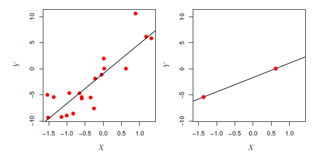

<b>FIGURE 7.22.</b><i>Gauche : Régression par les moindres carrés dans le cadre de la basse dimension. Droite : Régression des moindres carrés avec $n=2$ observations et deux paramètres à estimer (un intercept et un coefficient).</i>

En revanche, lorsqu'il n'y a que deux observations, alors quelles que soient les valeurs de ces observations, la droite de régression s'ajuste exactement aux données. Cela pose problème car cet ajustement parfait conduira presque certainement à un ajustement excessif des données. En d'autres termes, bien qu'il soit possible d'ajuster parfaitement les données d'apprentissage dans un cadre hautement dimensionnel, le modèle linéaire résultant aura des performances extrêmement faibles sur un ensemble de tests indépendants et ne constituera donc pas un modèle utile. En fait, nous pouvons voir que cela s'est produit à la $figure\ 7.22$ : la ligne des moindres carrés obtenue dans le panneau de droite sera très peu performante sur un ensemble de test composé des observations du panneau de gauche. Le problème est simple : lorsque $p > n$ ou $p \approx n$, une simple ligne de régression des moindres carrés est trop flexible et s'adapte donc trop aux données.

La $figure\ 7.23$ illustre encore le risque d'une application imprudente des moindres carrés lorsque le nombre de caractéristiques $p$ est élevé. Les données ont été simulées avec $n=20$ observations, et la régression a été effectuée avec entre 1 et 20 caractéristiques, chacune d'entre elles n'étant absolument pas liée à la réponse. Comme le montre la figure, le modèle $R^2$ augmente jusqu'à 1 lorsque le nombre de caractéristiques incluses dans le modèle augmente, et de manière correspondante le $MSE$ de l'ensemble d'apprentissage diminue jusqu'à 0 lorsque le nombre de caractéristiques augmente, même si les caractéristiques ne sont absolument pas liées à la réponse. En revanche, la $MSE$ sur un ensemble de test indépendant devient extrêmement importante lorsque le nombre de caractéristiques incluses dans le modèle augmente, car l'inclusion de prédicteurs supplémentaires entraîne une augmentation considérable de la variance des estimations de coefficient. Si l'on regarde le $MSE$ de l'ensemble de test, il est clair que le meilleur modèle contient tout au plus quelques variables. Cependant, quelqu'un qui n'examinerait que le $R^2$ ou le MSE de l'ensemble d'entraînement pourrait conclure à tort que le modèle avec le plus grand nombre de variables est le meilleur.

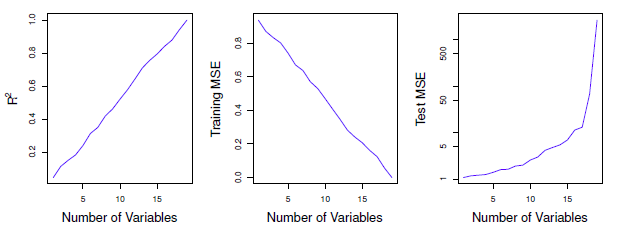

<b>FIG 7.23.</b><i>Sur un exemple simulé avec $n=20$ observations d'apprentissage, des caractéristiques qui ne sont absolument pas liées au résultat sont ajoutées au modèle. À gauche : le $R^2$ augmente jusqu'à 1 au fur et à mesure que des caractéristiques sont incluses. Au centre : Le MSE de l'ensemble de truquage diminue jusqu'à 0 lorsque davantage de caractéristiques sont incluses. A droite : Le MSE de l'ensemble de test augmente au fur et à mesure que des caractéristiques sont incluses.</i>

 Ceci indique l'importance de faire preuve de prudence lors de l'analyse d'ensembles de données comportant un grand nombre de variables, et de toujours évaluer les performances du modèle sur un ensemble de test indépendant.

Dans la $Section\ 7.1.3$ , nous avons vu un certain nombre d'approches pour ajuster le $RSS$ ou $R^2$ de l'ensemble d'apprentissage afin de tenir compte du nombre de variables utilisées pour ajuster un modèle des moindres carrés. Malheureusement, les approches $C_p, \mathrm{AIC}$, et $\mathrm{BIC}$ ne sont pas appropriées dans un cadre à haute dimension, car l'estimation de $\hat{\sigma}^2$ est problématique. (Par exemple, la formule pour $\hat{\sigma}^2$ du chapitre 3 donne une estimation $\hat{\sigma}^2=0$ dans ce cadre). De même, des problèmes se posent dans l'application de $R^2$ ajusté dans le cadre à haute dimension, puisqu'on peut facilement obtenir un modèle avec une valeur de $R^2$ ajusté de 1 . Il est clair qu'il faut trouver d'autres approches mieux adaptées au cadre à haute dimension.

<a name="7-4-3"/>

### [7.4.3 Régression en haute dimension](#7-4-3) ###

[Retour TOC](#toc)

Il s'avère que de nombreuses méthodes vues dans ce chapitre pour ajuster des modèles des moindres carrés moins flexibles, telles que la sélection pas à pas, la régression ridge, le lasso et la régression en composantes principales, sont particulièrement utiles pour effectuer une régression dans un cadre à haute dimension. Essentiellement, ces approches évitent le surajustement en utilisant une approche d'ajustement moins flexible que les moindres carrés.

La $figure\ 7.24$ illustre les performances du lasso dans un exemple simulé simple. Il y a $p=20,50$, soit 2 000 caractéristiques, dont 20 sont réellement associées au résultat. Le lasso a été effectué sur $n=100$ observations d'apprentissage, et l'erreur quadratique moyenne a été évaluée sur un ensemble de test indépendant. Plus le nombre de caractéristiques augmente, plus l'erreur sur l'ensemble de test augmente. Lorsque $p=20$, l'erreur la plus faible sur l'ensemble de validation a été obtenue lorsque $\lambda$ dans (7.7) était petit ; cependant, lorsque $p$ est plus grand, l'erreur la plus faible de l'ensemble de validation est obtenue en utilisant une valeur plus grande de $\lambda$. 

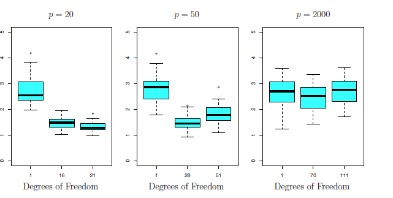

<b>FIG 7.24.</b><i>Le lasso a été effectué avec $n=100$ observations et trois valeurs de $p$, le nombre de caractéristiques. Sur les $p$ caractéristiques, 20 ont été associées à la réponse. Les boxplots montrent les MSE de test qui résultent de l'utilisation de trois valeurs différentes du paramètre d'accord $\lambda$ dans $(6 . \gamma)$. Pour faciliter l'interprétation, au lieu d'indiquer $\lambda$, on indique les degrés de liberté ; pour le lasso, il s'agit simplement du nombre de coefficients estimés non nuls. Lorsque $p=20$, le MSE de test le plus faible a été obtenu avec la plus petite quantité de régularisation. Lorsque $p=50$, le $MSE$ de test le plus faible a été obtenu avec une quantité substantielle de régularisation. Lorsque $p=2 000$, le lasso a obtenu de mauvaises performances quelle que soit la quantité de régularisation, en raison du fait que seules 20 des 2 000 caractéristiques sont véritablement associées au résultat.</i>

Dans chaque boxplot, plutôt que d'indiquer les valeurs de $\lambda$ utilisées, les degrés de liberté de la solution lasso résultante sont affichés ; il s'agit simplement du nombre d'estimations de coefficient non nul dans la solution lasso, et c'est une mesure de la flexibilité de l'ajustement lasso. La $figure\ 7.24$ met en évidence trois points importants : (1) la régularisation ou le rétrécissement joue un rôle clé dans les problèmes à haute dimension, (2) une sélection appropriée des paramètres d'ajustement est cruciale pour une bonne performance prédictive, et (3) l'erreur de test a tendance à augmenter lorsque la dimensionnalité du problème (c'est-à-dire le nombre de caractéristiques ou de prédicteurs) augmente, à moins que les caractéristiques supplémentaires ne soient réellement associées à la réponse.

Le troisième point ci-dessus est en fait un principe clé de l'analyse des données à haute dimension, connu sous le nom de malédiction de la dimensionnalité. On pourrait penser que plus le nombre de caractéristiques utilisées pour ajuster un modèle augmente, plus la qualité du modèle ajusté augmente également. Cependant, en comparant les panneaux de gauche et de droite de la $figure\ 7.24$, nous constatons que ce n'est pas nécessairement le cas : dans cet exemple, le $MSE$ de l'ensemble de test double presque lorsque $p$ passe de 20 à 2 000. En général, l'ajout de caractéristiques de signal supplémentaires qui sont réellement associées à la réponse améliorera le modèle ajusté, dans le sens où il entraînera une réduction de l'erreur de l'ensemble de test. 

Cependant, l'ajout de caractéristiques de bruit qui ne sont pas réellement associées à la réponse entraînera une détérioration du modèle ajusté et, par conséquent, une augmentation de l'erreur de l'ensemble de test. En effet, les caractéristiques de bruit augmentent la dimension du problème, ce qui exacerbe le risque d'ajustement excessif (puisque des coefficients non nuls peuvent être attribués aux caractéristiques de bruit en raison d'associations fortuites avec la réponse sur l'ensemble d'apprentissage) sans aucun avantage potentiel en termes d'amélioration de l'erreur de l'ensemble de test. Ainsi, nous constatons que les nouvelles technologies qui permettent de collecter des mesures pour des milliers ou des millions de caractéristiques sont une arme à double tranchant : elles peuvent conduire à des modèles prédictifs améliorés si ces caractéristiques sont effectivement pertinentes pour le problème en question, mais elles conduiront à de moins bons résultats si les caractéristiques ne sont pas pertinentes. Même si elles sont pertinentes, la variance encourue lors de l'ajustement de leurs coefficients peut être supérieure à la réduction du biais qu'elles apportent.

<a name="7-4-4"/>

### [7.4.4 Interprétation des résultats en haute dimension](#7-4-4) ###

[Retour TOC](#toc)

Lorsque nous appliquons le lasso, la régression ridge ou d'autres procédures de régression dans un cadre à haute dimension, nous devons faire preuve d'une grande prudence dans la manière dont nous présentons les résultats obtenus. A la section 3 , nous avons appris ce qu'était la multicollinéarité, c'est-à-dire le concept selon lequel les variables d'une régression peuvent être corrélées entre elles. Dans un cadre hautement dimensionnel, le problème de la multicollinéarité est extrême : toute variable du modèle peut être écrite comme une combinaison linéaire de toutes les autres variables du modèle. Cela signifie essentiellement que nous ne pourrons jamais savoir exactement quelles variables (le cas échéant) sont réellement prédictives du résultat, et que nous ne pourrons jamais identifier les meilleurs coefficients à utiliser dans la régression. Tout au plus, nous pouvons espérer attribuer des coefficients de régression importants aux variables qui sont corrélées avec les variables qui sont réellement prédictives du résultat.

Par exemple, supposons que nous essayons de prédire la pression artérielle sur la base d'un demi-million de SNP, et que la sélection pas à pas indique que 17 de ces SNP conduisent à un bon modèle prédictif sur les données d'apprentissage. Il serait incorrect de conclure que ces 17 SNP prédisent la pression artérielle plus efficacement que les autres SNP non inclus dans le modèle. Il existe probablement de nombreux ensembles de 17 SNP qui prédisent la pression artérielle juste aussi bien que le modèle sélectionné. Si nous devions obtenir un ensemble de données indépendant et effectuer une sélection pas à pas sur cet ensemble de données, nous obtiendrions probablement un modèle contenant un ensemble de SNP différent, et peut-être même non chevauchant. Cela n'enlève rien à la valeur du modèle obtenu - par exemple, le modèle pourrait s'avérer très efficace pour prédire la pression artérielle sur un ensemble indépendant de patients, et pourrait être cliniquement utile pour les médecins. Mais nous devons veiller à ne pas exagérer les résultats obtenus et à préciser que ce que nous avons identifié n'est qu'un des nombreux modèles possibles pour prédire la pression artérielle et qu'il doit être validé plus avant sur des ensembles de données indépendants.

Il est également important d'être particulièrement prudent dans la présentation des erreurs et des mesures de l'ajustement du modèle dans le cadre à haute dimension. Nous avons vu que lorsque $p>n$, il est facile d'obtenir un modèle inutile dont les résidus sont nuls. Par conséquent, il ne faut jamais utiliser la somme des erreurs au carré, les valeurs p, les statistiques $R^2$ ou d'autres mesures traditionnelles de l'ajustement du modèle sur les données d'apprentissage comme preuve d'un bon ajustement du modèle dans un cadre hautement dimensionnel. Par exemple, comme nous l'avons vu dans la $Figure\ 7.23$, on peut facilement obtenir un modèle avec $R^2=1$ lorsque $p > n$. Signaler ce fait pourrait induire les autres en erreur et leur faire penser qu'un modèle statistiquement valide et utile a été obtenu, alors qu'en fait, cela ne fournit absolument aucune preuve d'un modèle convaincant. Il est important de signaler plutôt les résultats sur un ensemble de test indépendant, ou les erreurs de validation croisée. Par exemple, la $MSE$ ou $R^2$ sur un ensemble de test indépendant est une mesure valide de l'adéquation du modèle, mais la MSE sur l'ensemble d'apprentissage ne l'est certainement pas.

