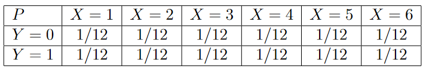
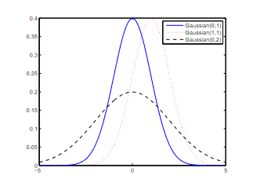
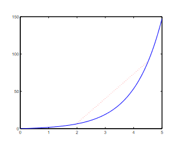

# Théorie des probabilités : Samuel Leong #

[Retour README](../README.md)

<a name="toc"/>

[toc]

Un complément à la première partie qui fait référence au cours de Samuel Leong [[18]](https://see.stanford.edu/materials/aimlcs229/cs229-prob.pdf)

<a name="1"/>

## [1 Variables aléatoires](#1) ##

[Retour TOC](#toc)

Les variables aléatoires jouent un rôle important dans la théorie des probabilités. Le fait le plus important concernant **les variables aléatoires** est qu'elles **ne sont pas des variables.** 

**Il s'agit en fait de fonctions qui associent des résultats (dans l'espace des résultats) à des valeurs réelles.** En termes de notation, nous désignons généralement les variables aléatoires par une lettre majuscule. 

Voyons un exemple. Considérons à nouveau le processus de lancement d'un dé. Soit $X$ une variable aléatoire qui dépend du résultat du lancer. Un choix naturel pour $X$ serait de faire correspondre le résultat $i$ à la valeur $i$, c'est-à-dire de faire correspondre le fait de lancer un "un" à la valeur 1 . Notez que nous aurions également pu choisir des mappings étranges. Par exemple, nous pourrions avoir une variable aléatoire $Y$ qui associe tous les résultats à 0 , ce qui serait une fonction très ennuyeuse, ou une variable aléatoire $Z$ qui associe le résultat $i$ à la valeur de $2^i$ si $i$ est impair et à la valeur de $-i$ si $i$ est pair, ce qui serait vraiment très étrange.

En un sens, **les variables aléatoires nous permettent de nous abstraire de la notion formelle d'espace d'événements, car nous pouvons définir des variables aléatoires qui capturent les événements appropriés.** 

Par exemple, soit l'espace d'événement pair ou impair d'un lancer de dés . Nous pourrions définir une variable aléatoire qui prend la valeur 1 si le résultat $i$ est impair et 0 sinon. Ce type de variable aléatoire binaire est très courant dans la pratique, et est connu sous le nom de **variable indicatrice,** qui tire son nom de son utilisation pour indiquer si un certain événement s'est produit. 

Alors **pourquoi avons-nous introduit l'espace des événements** ? Parce que lorsqu'on étudie la théorie des probabilités (plus rigoureusement) en utilisant la théorie de la mesure, la distinction entre espace de résultat et espace d'événement sera très importante. Dans tous les cas, il est bon de garder à l'esprit que l'espace des événements n'est pas toujours simplement l'ensemble des puissances de l'espace des résultats.

Les variables aléatoires nous permettent de fournir un traitement plus uniforme de la théorie des probabilités. Pour les notations, la probabilité qu'une variable aléatoire $X$ prenne la valeur de $a$ sera dénotée soit par

$$
P(X=a) \quad \text { or } \quad P_X(a)
$$

Nous désignerons également l'intervalle d'une variable aléatoire $X$ par ${Val}(X)$.

<a name="2"/>

## [2 Distributions, distributions conjointes et distributions marginales](#2) ##

[Retour TOC](#toc)

Nous parlons souvent de la distribution d'une variable. Il s'agit formellement de la probabilité qu'une variable aléatoire prenne certaines valeurs. Par exemple, soit une variable aléatoire $X$ définie sur l'espace des résultats $\Omega$ d'un lancer de dé (encore !). Si le dé est juste, la distribution de $X$ est la suivante

$$
P_X(1)=P_X(2)=\cdots=P_X(6)=1 / 6
$$

Notez que bien que la distribution de probabilité définie sur les événements ressemble à celle définie sur les variables aléatoires, elle a une signification sémantique différente. 

Pour la notation, nous utiliserons $P(X)$ pour désigner la distribution de la variable aléatoire $X$.

Nous appelons ces distributions des distributions conjointes, car la probabilité est déterminée conjointement par toutes les variables concernées. Un exemple permet de clarifier ce point. Soit $X$ une variable aléatoire définie sur l'espace des résultats d'un lancer de dé. Soit $Y$ une variable indicielle qui prend la valeur 1 si le lancer d'une pièce de monnaie donne un résultat positif et 0 si le résultat est négatif. En supposant que le dé et la pièce de monnaie sont justes, la distribution conjointe de $X$ et $Y$ est donnée par

Nous désignons la probabilité que $X$ prenne la valeur $a$ et que $Y$ prenne la valeur $b$ par la main longue de $P(X=a, Y=b)$, ou la main courte de $P_{X, Y}(a, b)$. **Nous faisons référence à leur distribution conjointe** par $P(X, Y)$.

Étant donné une distribution conjointe, disons sur des variables aléatoires $X$ et $Y$, nous pouvons parler de la distribution marginale de $X$ ou de celle de $Y$. **La distribution marginale fait référence à la distribution de probabilité d'une variable aléatoire prise isolément**. 

Pour connaître la distribution marginale d'une variable aléatoire, nous additionnons toutes les autres variables aléatoires de la distribution. Formellement, on signifie

$$
P(X)=\sum_{b \in Val(Y)} P(X, Y=b) \hspace{6 em} (1)
$$

Le nom de distribution marginale vient du fait que si nous additionnons toutes les entrées d'une ligne (ou d'une colonne) d'une distribution conjointe, et que nous écrivons la réponse à la fin (c'est-à-dire en marge) de celle-ci, ce sera la probabilité que la variable aléatoire prenne cette valeur. Bien entendu, cette façon de penser n'est utile que lorsque la distribution conjointe implique deux variables.

<a name="2-1"/>

### [2.1 Distributions conditionnelles](#2-1) ###

[Retour TOC](#toc)

Les distributions conditionnelles sont l'un des outils clés de la théorie des probabilités pour raisonner sur l'incertitude. Elles spécifient la distribution d'une variable aléatoire lorsque la valeur d'une autre variable aléatoire est connue (ou plus généralement, lorsqu'un événement est connu comme étant vrai).

Formellement, la probabilité conditionnelle de $X=a$ étant donné $Y=b$ est définie comme suit

$$
P(X=a \mid Y=b)=\frac{P(X=a, Y=b)}{P(Y=b)} \hspace{6 em} (2)
$$

Notez que ceci n'est pas défini lorsque la probabilité de $Y=b$ est 0 .

Exemple, supposons que l'on sache qu'un lancer de dé était impair, et que l'on veuille connaître la probabilité qu'un "un" ait été lancé. Soit $X$ la variable aléatoire du lancer de dés, et $Y$ une variable indicatrice qui prend la valeur 1 si le lancer de dés s'avère impair, alors nous écrivons notre probabilité souhaitée comme suit :

$$
P(X=1 \mid Y=1)=\frac{P(X=1, Y=1)}{P(Y=1)}=\frac{1 / 6}{1 / 2}=1 / 3
$$

L'idée de probabilité conditionnelle s'étend naturellement au cas où la distribution d'une variable aléatoire est conditionnée par plusieurs variables, à savoir

$$
P(X=a \mid Y=b, Z=c)=\frac{P(X=a, Y=b, Z=c)}{P(Y=b, Z=c)}
$$

En ce qui concerne les notations, nous écrivons $P(X \mid Y=b)$ pour désigner la distribution de la variable aléatoire $X$ lorsque $Y=b$. Nous pouvons également écrire $P(X \mid Y)$ pour désigner un ensemble de distributions de $X$, une pour chacune des différentes valeurs que $Y$ peut prendre.

<a name="2-2"/>

### [2.2 Indépendance](#2-2) ###

[Retour TOC](#toc)

En théorie des probabilités, l'indépendance signifie que la distribution d'une variable aléatoire ne change pas lors de l'apprentissage de la valeur d'une autre variable aléatoire. Dans l'apprentissage automatique, nous faisons souvent de telles hypothèses sur nos données. 

Par exemple, les échantillons d'apprentissage sont supposés être tirés indépendamment d'un certain espace sous-jacent ; l'étiquette de l'échantillon $i$ est supposée être indépendante des caractéristiques de l'échantillon $j(i \neq j)$.

Mathématiquement, une variable aléatoire $X$ est indépendante de $Y$ lorsque

$$
P(X)=P(X \mid Y)
$$

(Notez que nous avons laissé tomber les valeurs que prennent $X$ et $Y$. Cela signifie que l'affirmation est vraie pour toutes les valeurs que peuvent prendre $X$ et $Y$).

En utilisant l'équation (2), il est facile de vérifier que si $X$ est indépendant de $Y$, alors $Y$ est également indépendant de $X$. En guise de notation, nous écrivons $X \perp Y$ si $X$ et $Y$ sont indépendants.

Un énoncé mathématique équivalent sur l'indépendance des variables aléatoires $X$ et $Y$ est le suivant

$$
P(X, Y)=P(X) P(Y)
$$

On parle aussi parfois d'indépendance conditionnelle, ce qui signifie que si l'on connaît la valeur d'une variable aléatoire (ou plus généralement d'un ensemble de variables aléatoires), alors certaines autres variables aléatoires seront indépendantes les unes des autres. Formellement, on dit " $X$ et $Y$ sont conditionnellement indépendants étant donné $Z^n$ si

$$
P(X \mid Z)=P(X \mid Y, Z)
$$

ou, de manière équivalente,

$$
P(X, Y \mid Z)=P(X \mid Z) P(Y \mid Z)
$$

**Un exemple d'indépendance conditionnelle est l'hypothèse de Naive Bayes**. Cette hypothèse est formulée dans le contexte d'un algorithme d'apprentissage pour apprendre à classer les courriels en tant que spams ou non-spams. Elle suppose que la probabilité qu'un mot $x$ apparaisse dans le courriel est conditionnellement indépendante de l'apparition d'un mot $y$, que le courriel soit un spam ou non. Cela n'est évidemment pas sans perte de généralité, car certains mots apparaissent presque invariablement par paire. Cependant, il s'avère que cette hypothèse simplificatrice ne nuit pas beaucoup aux performances, et nous permet en tout cas d'apprendre à classer les spams rapidement. 

<a name="2-3"/>

### [2.3 Règle de la chaîne et règle de Bayes](#2-3) ###

[Retour TOC](#toc)

Nous présentons maintenant deux règles de base, mais importantes, pour manipuler les relations entre les distributions conjointes et les distributions conditionnelles. La première est connue sous le nom de règle de la chaîne. Elle peut être considérée comme une généralisation de l'équation (2) à des variables aléatoires multiples.

***Théorème 1 (règle de la chaîne).***

$$
P\left(X_1, X_2, \ldots, X_n\right)=P\left(X_1\right) P\left(X_2 \mid X_1\right) \cdots P\left(X_n \mid X_1, X_2, \ldots, X_{n-1}\right)
$$

La règle des chaînes est souvent utilisée pour évaluer la probabilité conjointe de certaines variables aléatoires, et est particulièrement utile lorsqu'il existe une indépendance (conditionnelle) entre les variables. 

Remarquez qu'il y a un choix dans l'ordre dans lequel nous démêlons les variables aléatoires lorsque nous appliquons la règle de la chaîne ; choisir le bon ordre peut souvent rendre l'évaluation de la probabilité beaucoup plus facile.

La deuxième règle est la règle de Bayes. La règle de Bayes nous permet de calculer la probabilité conditionnelle $P(X \mid Y)$ à partir de $P(Y \mid X)$, en quelque sorte en "inversant" les conditions. Elle peut également être dérivée simplement de l'équation (2).

***Théorème 2 (règle de Bayes).***

$$
P(X \mid Y)=\frac{P(Y \mid X) P(X)}{P(Y)}
$$

Et rappelez-vous que si $P(Y)$ n'est pas donné, nous pouvons toujours appliquer l'équation (1) pour le trouver.

$$
P(Y)=\sum_{a \in Val(X)} P(X=a, Y)=\sum_{a \in Val(X)} P(Y \mid X=a) P(X=a)
$$

Cette application de l'équation (1) est parfois appelée **la loi de la probabilité totale**.

L'extension de la règle de Bayes au cas de variables aléatoires multiples peut parfois être délicate. Juste pour être clair, nous allons donner quelques exemples. En cas de doute, il est toujours possible de se référer à la définition des probabilités conditionnelles et de régler les détails.

Exemple, considérons les probabilités conditionnelles suivantes : $P(X, Y \mid Z)$ et $(X \mid Y, Z)$.

$$
\begin{aligned}
& P(X, Y \mid Z)=\frac{P(Z \mid X, Y) P(X, Y)}{P(Z)}=\frac{P(Y, Z \mid X) P(X)}{P(Z)} \\
& P(X \mid Y, Z)=\frac{P(Y \mid X, Z) P(X, Z)}{P(Y, Z)}=\frac{P(Y \mid X, Z) P(X \mid Z) P(Z)}{P(Y \mid Z) P(Z)}=\frac{P(Y \mid X, Z) P(X \mid Z)}{P(Y \mid Z)}
\end{aligned}
$$

<a name="3"/>

## [3 Définition d'une distribution de probabilités](#3) ##

[Retour TOC](#toc)

Nous parlons depuis un moment des distributions de probabilités. Mais **comment définir une distribution** ? Dans un sens large, il existe deux classes de distribution qui nécessitent des traitements apparemment différents (ceux-ci peuvent être unifiés en utilisant la théorie de la mesure). Il s'agit des distributions discrètes et des distributions continues. Nous allons maintenant discuter de la manière dont les distributions sont spécifiques.

Notez que cette discussion est distincte de la manière dont nous pouvons représenter efficacement une distribution. Le sujet de la représentation efficace des distributions de probabilité est en fait un domaine de recherche très important et actif qui mérite son propre cours. 

*Si vous souhaitez en savoir plus sur la manière de représenter, de raisonner et d'apprendre efficacement sur les distributions, nous vous conseillons de suivre le cours CS228 : Modèles Probabilistes en Intelligence Artificielle.*

<a name="3-1"/>

### [3.1 Distribution discrète : Fonction de masse des probabilités](#3-1) ###

[Retour TOC](#toc)

Par distribution discrète, nous entendons que la variable aléatoire de la distribution sous-jacente ne peut prendre qu'un nombre fini de valeurs différentes (ou que l'espace des résultats est fini).

Pour définir une distribution discrète, nous pouvons simplement énumérer la probabilité que la variable aléatoire prenne chacune des valeurs possibles. Cette énumération est connue sous le nom de **fonction de masse de probabilité**, car elle divise une masse unitaire (la probabilité totale) et la place sur les différentes valeurs que peut prendre une variable aléatoire. On peut l'étendre par analogie aux distributions conjointes et aux distributions conditionnelles.

<a name="3-2"/>

### [3.2 Distribution continue : Fonction de densité de probabilité](#3-2) ###

[Retour TOC](#toc)

Par distribution continue, nous entendons que la variable aléatoire de la distribution sous-jacente peut prendre une infinité de valeurs différentes (ou que l'espace des résultats est infini).

Cette situation est sans doute plus délicate que dans le cas discret, car si nous plaçons une quantité non nulle de masse sur chacune des valeurs, la masse totale atteindra l'infini, ce qui enfreint l'exigence selon laquelle la probaiblité totale doit être égale à un.

Pour définir une distribution continue, nous utiliserons la **fonction de densité de probabilité** $(PDF)$. Une fonction de densité de probabilité, $f$, est une fonction non négligeable et non intégrable telle que,

$$
\int_{Val(X)} f(x) d x=1
$$

La probabilité d'une variable aléatoire $X$ distribuée selon une PDF $f$ se calcule comme suit

$$
P(a \leq X \leq b)=\int_a^b f(x) d x
$$

Notez que ceci, en particulier, implique que la probabilité qu'une variable aléatoire distribuée de façon continue prenne une valeur unique donnée est nulle.

Exemple, (Distribution uniforme) considérons une variable aléatoire $X$ qui est uniformément distribuée dans l'intervalle $[0,1]$. La $PDF$ correspondante serait

$$
f(x)= \begin{cases}1 & \text { if } 0 \leq x \leq 1 \\ 0 & \text { otherwise }\end{cases}
$$

On peut vérifier que $\int_0^1 1 d x$ est bien 1 , et donc que $f$ est une $PDF$. Calculer la probabilité que $X$ soit plus petit que la moitié,

$$
P(X \leq 1 / 2)=\int_0^{1 / 2} 1 d x-[x]_0^{1 / 2}=1 / 2
$$

De manière plus générale, supposons que $X$ soit distribué uniformément sur l'intervalle $[a, b]$, alors la PDF serait la suivante

$$
f(x)= \begin{cases}\frac{1}{b-a} & \text { if } a \leq x \leq b \\ 0 & \text { otherwise }\end{cases}
$$

Parfois, nous parlerons également de **fonction de distribution cumulative**. Il s'agit d'une fonction qui donne la probabilité qu'une variable aléatoire soit inférieure à une certaine valeur. Une fonction de distribution cumulative $F$ est liée à la fonction de densité de probabilité sous-jacente $f$ comme suit 

$$
F(b)=P(X \leq b)=\int_{-\infty}^b f(x) d x
$$

et donc $F(x)=\int f(x) d x$ (au sens de l'intégrale indéfinie).

Pour étendre la définition de la distribution continue à la distribution conjointe, la fonction de densité de probabilité est étendue pour prendre plusieurs arguments, à savoir ,

$$
P\left(a_1 \leq X_1 \leq b_1, a_2 \leq X_2 \leq b_2, \ldots, a_n \leq X_n \leq n_1\right)=\int_{a_1}^{b_1} \int_{a_2}^{b_2} \cdots \int_{a_n}^{b_n} f\left(x_1, x_2, \ldots, x_n\right) d x_1 d x_2 \ldots d x_n
$$

Pour étendre la définition de la distribution conditionnelle aux variables aléatoires continues, nous nous sommes heurtés au problème suivant : la probabilité qu'une variable aléatoire continue prenne une seule valeur est égale à 0 ; l'équation (2) n'est donc pas bien définie, puisque le dénominateur est égal à 0 . Pour définir la distribution conditionnelle d'une variable continue, disons que $f(x, y)$ est la distribution conjointe de $X$ et $Y$. Par application de l'analyse, nous pouvons montrer que la PDF, $f(y \mid x)$, sous-jacente à la distribution $P(Y \mid X)$ est donnée par

$$
f(y \mid x)=\frac{f(x, y)}{f(x)}
$$

Par exemple,

$$
P(a \leq Y \leq b \mid X=c)=\int_a^b f(y \mid c) d y=\int_a^b \frac{f(c, y)}{f(c)} d y
$$

<a name="4"/>

## [4 Espérance et variance](#4) ##

<a name="4-1"/>

### [4.1 Espérances](#4-1) ###

[Retour TOC](#toc)

L'une des opérations les plus courantes que nous effectuons sur une variable aléatoire consiste à calculer son espérance, également appelée moyenne, valeur attendue ou premier moment. L'espérance d'une variable aléatoire, désignée par $E(X)$, est donnée par la formule suivante

$$
E(X)=\sum_{a \in Val(X)} a P(X=a) \quad \text { or } \quad E(X)=\int_{a \in Val(X)} x f(x) d x
$$

Exemple, soit $X$ le résultat du lancer d'un dé juste. L'espérance de $X$ est

$$
E(X)=(1) \frac{1}{6}+(2) \frac{1}{6}+\cdots+6 \frac{1}{6}=3 \frac{1}{2}
$$

Nous pouvons parfois être intéressés par le calcul de la valeur attendue d'une fonction $f$ d'une variable aléatoire $X$. Rappelons toutefois qu'une variable aléatoire est également une fonction elle-même, donc la façon la plus simple d'y penser est donc de définir une nouvelle variable aléatoire $Y=f(X)$, et de calculer la valeur attendue de $Y$ à la place.

Lorsque l'on travaille avec des variables indicatrices, une identification utile est la suivante :

$$
E(X)=P(X=1) \quad \text { for indicator variable } X
$$

Lorsque l'on travaille avec les sommes de variables aléatoires, l'une des règles les plus importantes est la linéarité des attentes.

***Théorème 3 (linéarité des espérances)***. 

Soit $X_1, X_2, \ldots, X_n$ des variables aléatoires (éventuellement dépendantes),

$$
E\left(X_1+X_2+\cdots+X_n\right)=E\left(X_1\right)+E\left(X_2\right)+\cdots+E\left(X_n\right)
$$

La linéarité des attentes est très puissante car il n'y a aucune restriction sur le fait que les variables aléatoires soient indépendantes ou non. Cependant, lorsque nous travaillons sur des produits de variables aléatoires, nous ne pouvons pas dire grand-chose en général. Cependant, lorsque les variables aléatoires sont indépendantes, alors

***Théorème 4.*** 

Soit $X$ et $Y$ des variables aléatoires indépendantes,

$$
E(X Y)=E(X) E(Y)
$$

<a name="4-2"/>

### [4.2 Variance](#4-2) ###

[Retour TOC](#toc)

La variance d'une distribution est une mesure de la "dispersion" d'une distribution. On l'appelle aussi parfois le deuxième moment. Elle est définie comme suit :

$$
Var(X)=E\left((X-E(X))^2\right)
$$

La variance d'une variable aléatoire est souvent désignée par $\sigma^2$. La raison pour laquelle cette valeur est au carré est que nous voulons souvent connaître $\sigma$, connu sous le nom d'écart-type. La variance et l'écart-type sont liés (évidemment) par $\sigma=\sqrt{Var(X)}$.

Pour connaître la variance d'une variable aléatoire $X$, il est souvent plus simple de calculer plutôt la formule suivante

$$
Var(X)=E\left(X^2\right)-(E(X))^2
$$

Notons que contrairement à l'espérance, la variance n'est pas une fonction linéaire d'une variable aléatoire $X$. En effet, on peut vérifier que la variance de $(a X+b)$ est

$$
Var(a X+b)=a^2 Var(X)
$$

Si les variables aléatoires $X$ et $Y$ sont indépendantes, alors

$$
Var(X+Y)=Var(X) Var(Y) \quad \text { if } X \perp Y
$$

On parle aussi parfois de la covariance de deux variables aléatoires. Il s'agit d'une mesure de la "proximité" de deux variables aléatoires. Sa définition est la suivante.

$$
Cov(X, Y)=E((X-E(X))(Y-E(Y)))
$$

<a name="5"/>

## [5 Quelques distributions importantes](#5) ##

Dans cette section, nous allons passer en revue certaines des distributions de probabilité. Il ne s'agit en aucun cas d'une liste exhaustive des distributions que l'on doit connaître. En particulier, des distributions telles que les distributions géométrique, hypergéométrique et binomiale, qui sont très utiles en soi et étudiées dans l'introduction à la théorie des probabilités, ne sont pas passées en revue ici.

<a name="5-1"/>

### [5.1 Bernoulli](#5-1) ###

[Retour TOC](#toc)

La distribution de Bernoulli est l'une des distributions les plus fondamentales. Une variable aléatoire distribuée selon la distribution de Bernoulli peut prendre deux valeurs possibles, $\{0,1\}$. Elle peut être spécifiée par un seul paramètre $p$, et par convention, nous prenons $p$ comme étant $P(X=1)$. Elle est souvent utilisée pour indiquer si une piste est réussie ou non.

Il est parfois utile d'écrire la distribution de probabilité d'une variable aléatoire de Bernoulli $X$ comme suit

$$
P(X)=p^x(1-p)^{1-x}
$$

Un exemple de la distribution de Bernoulli en action est la tâche de classification dans les Notes de cours 1 . Pour développer l'algorithme de régression logistique pour cette tâche, nous supposons que les étiquettes sont distribuées selon la distribution de Bernoulli étant donné les caractéristiques.

<a name="5-2"/>

### [5.2 Distribution de Poisson](#5-2) ###

[Retour TOC](#toc)

La distribution de Poisson est une distribution très utile qui traite de l'arrivée d'événements. Elle mesure la probabilité que le nombre d'événements se produise sur une période de temps fixe, compte tenu d'un taux d'occurrence moyen fixe, et que les événements se produisent indépendamment du temps écoulé depuis le dernier événement. Elle est paramétrée par le taux d'arrivée moyen $\lambda$. La fonction de masse de probabilité est donnée par :

$$
P(X-k)=\frac{\exp (-\lambda) \lambda^k}{k !}
$$

La valeur moyenne d'une variable aléatoire de Poisson est de $\lambda$, et sa variance est également de $\lambda$.

Nous allons travailler sur un algorithme d'apprentissage qui traite les variables aléatoires de Poisson dans le devoir 1, problème 3.

<a name="5-3"/>

### [5.3 Gauss](#5-3) ###

[Retour TOC](#toc)

La distribution gaussienne, également connue sous le nom de distribution normale, est l'une des distributions les plus " polyvalentes " de la théorie des probabilités, et apparaît dans une grande variété de contextes. Par exemple, elle peut être utilisée pour approximer la distribution binomiale lorsque le nombre d'expériences est important, ou la distribution de Poisson lorsque le taux d'arrivée moyen est élevé. Elle est également liée à la loi des grands nombres. Pour de nombreux problèmes, nous supposerons aussi souvent que lorsque le bruit dans le système est distribué de manière gaussienne. La liste des applications est infinie.

<b>FIG 1</b> <i> Distributions gaussiennes sous différentes moyenne et variance</i>

La distribution gaussienne est déterminée par deux paramètres : la moyenne $\mu$ et la variance $\sigma^2$. La fonction de densité de probabilité est donnée par

$$
f(x)=\frac{1}{\sqrt{2 \pi} \sigma} \exp \left(-\frac{(x-\mu)^2}{2 \sigma^2}\right)
$$

Pour mieux comprendre comment la distribution change en fonction de la moyenne et de la variance, nous avons représenté trois distributions gaussiennes différentes dans la figure 1.

Nous travaillerons parfois avec des distributions gaussiennes multi-variées. Une distribution gaussienne multi-variable de $k{-}dimension$  est paramétrée par $(\mu, \Sigma)$, où $\mu$ est maintenant un vecteur de moyennes dans $\mathbb{R}^k$, et $\Sigma$ est le vecteur de covariance dans $\mathbb{R}^{k \times k}$, en d'autres termes, $\Sigma_{i i}=Var\left(X_i\right)$ et $\Sigma_{i j}=Cov\left(X_i, X_j\right)$. La fonction de densité de probabilité est maintenant définie sur les vecteurs d'entrée, donnée par

$$
f(\mathrm{x})=\frac{1}{\sqrt{2 \pi^k|\Sigma|}} \exp \left(-\frac{1}{2}(\mathrm{x}-\mu)^T \Sigma^{-1}(\mathrm{x}-\mu)\right)
$$

(Rappelons que nous désignons le déterminant d'une matrice $A$ par $|A|$, et son inverse par $A^{-1}$).

Pour avoir une meilleure idée de la façon dont une distribution gaussienne à plusieurs variables dépend de la matrice de covariance.

Travailler avec une distribution gaussienne à plusieurs variables peut parfois s'avérer délicat et décourageant. Une façon de nous faciliter la vie, au moins pour avoir une intuition sur un problème, est de supposer que les covariances sont nulles lorsque nous tentons de résoudre un problème pour la première fois. Lorsque les covariances sont nulles, le déterminant $|\Sigma|$ sera simplement le produit des variances, et l'inverse $\Sigma^{-1}$ peut être trouvé en prenant l'inverse des entrées diagonales de $\Sigma$.

5 Travailler avec des probabilités

Comme nous allons beaucoup travailler avec des probabilités et des distributions dans ce cours, vous trouverez ci-dessous quelques conseils pour une manipulation efficace des distributions.

<a name="6"/>

## [6 L'astuce du logarithme](#6) ##

[Retour TOC](#toc)

En apprentissage automatique, nous supposons généralement l'indépendance des différents échantillons. Par conséquent, nous devons souvent traiter le produit d'un (grand) nombre de distributions. Lorsque notre objectif est d'optimiser les fonctions de ces produits, il est souvent plus facile de travailler d'abord avec le logarithme de ces fonctions. Comme la fonction logarithmique est une fonction strictement croissante, elle ne faussera pas l'emplacement du maximum (bien que, très certainement, la valeur maximale de la fonction avant et après la prise du logarithme sera différente).

À titre d'exemple, considérons la fonction de vraisemblance

$$
L(\theta)=\prod_{i=1}^m\left(h_\theta\left(x^{(i)}\right)\right)^{y^{(i)}}\left(1-h_\theta\left(x^{(i)}\right)\right)^{1-y^{(i)}}
$$

J'ose dire qu'il s'agit d'une fonction assez moyenne. Mais en prenant le logarithme de cette fonction, appelé fonction de vraisemblance, nous avons à la place

$$
\ell(\theta)=\log L(\theta)=\sum_{i=1}^m y^{(i)} \log h_\theta\left(x^{(i)}\right)+\left(1-y^{(i)}\right) \log \left(1-h_\theta\left(x^{(i)}\right)\right)
$$

Ce n'est pas la plus belle fonction du monde, mais au moins elle est plus facile à gérer. Nous pouvons maintenant travailler sur un seul terme (c'est-à-dire un échantillon d'apprentissage) à la fois, car ils sont additionnés plutôt que multipliés.

<a name="7"/>

## [7 Normalisation retardée](#7) ##

Étant donné que la somme des probabilités doit être égale à un, nous devons souvent procéder à une normalisation, en particulier pour les distributions contiguës. Par exemple, pour les distributions gaussiennes, le terme en dehors de l'exposant sert à garantir que l'intégrale de la $PDF$ est égale à un. Lorsque nous sommes sûrs que le produit final d'une certaine algèbre sera une distribution de probabilité, ou lorsque nous trouvons l'optimum de certaines distributions, il est souvent plus facile de simplement désigner la constante de normalisation comme étant $Z$, et de ne pas se soucier de calculer la constante de normalisation en permanence.

<a name="8"/>

## [8 Inégalité de Jenson](#8) ##

[Retour TOC](#toc)

Parfois, lorsque nous évaluons l'espérance d'une fonction d'une variable aléatoire, nous n'avons besoin que d'une limite plutôt que de sa valeur exacte. Dans ces situations, si la fonction est convexe ou concave, l'inégalité de Jenson nous permet de dériver une borne en évaluant la valeur de la fonction à l'espérance de la variable aléatoire elle-même.

<b>FIG 2</b><i> : Illustration de l'inégalité de Jenson.</i>

***Théorème 5 (Inégalité de Jenson)***. 

Soit $X$ une variable aléatoire, et $f$ une fonction convexe. Alors

$$
f(E(X)) \leq E(f(X))
$$

Si $f$ est une fonction concave, alors

$$
f(E(X)) \geq E(f(X))
$$

Bien que nous puissions démontrer l'inégalité de Jenson par l'algèbre, il est plus facile de la comprendre par une image. La fonction de la figure 2 est une fonction convexe. Nous pouvons voir qu'une ligne droite entre deux points quelconques de la fonction se situe toujours au-dessus de la fonction. Cela montre que si une variable aléatoire ne peut prendre que deux valeurs, alors l'inégalité de Jenson est valable. Il est relativement simple d'étendre cela aux variables aléatoires générales.
