# Python pour le Machine Learning : Ensemble BAGGING, BOOSTING et STACKING

[Retour README](../README.md)

[toc]

## 1. Intro

Nous allons parler d'ensemble learning, une technique qui consiste à entraîner plusieurs modèles de machine learning pour ensuite considérer l'ensemble de leurs prédictions. 

Pour cela, il existe trois grandes méthodes : le bagging, le boosting et le stacking. 

Les algorithmes qui reposent sur ces méthodes, comme l'algorithme de random forest, comptent parmi les plus performants dans le monde du machine learning.

## 2. The Wisdom of the Crowd

Pour commencer, je vous propose de procéder à une petite expérience. 

Prenons trois modèles de machine learning et utilisons-les pour effectuer dix prédictions. 

- En vert, nous avons les prédictions correctes et 
- en rouge les prédictions incorrectes. 

On voit donc que nos modèles ont, chacun de leur côté, effectué 70 % de bonnes réponses. 
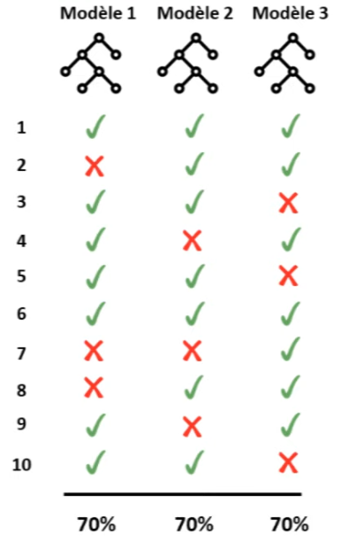

Ce qui est intéressant, c'est de constater que nos modèles n'ont pas tous fait les mêmes erreurs au même endroit. 
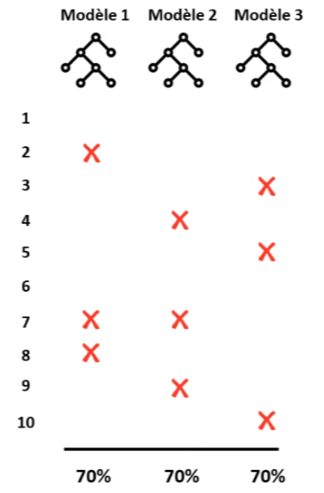

Si on venait à combiner les résultats de nos différents modèles pour garder à chaque fois la prédiction majoritaire, on obtiendrait au total neuf bonnes réponses sur dix. 
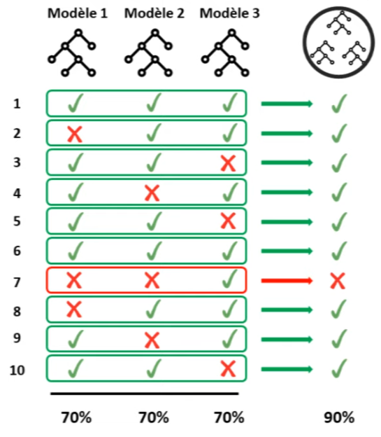

Autrement dit, lorsqu'on regroupe nos modèles tous ensemble, on obtient une meilleure performance que lorsqu'on utilise nos modèles chacun de leur côté. Intéressant, n'est-ce pas ? 

Et bien, ce résultat n'est pas le fruit du hasard. Il vient d'un phénomène appelé "The Wisdom of the Crowd". L'idée est qu'une foule d'individus a plus souvent raison qu'un individu tout seul. C'est une idée vieille comme le monde. Aristote lui-même avait écrit dans son ouvrage "La Politique" que la majorité, dont chaque membre pris à part n'est pas un homme remarquable, est cependant au-dessus de sommets supérieurs. Autrement dit, l'avis d'une foule d'amateurs est meilleur que celui d'un expert tout seul. 


Et on l'a bien vu ici : en regroupant des modèles ayant chacun une performance de 70 %, on a pu atteindre une performance de 90 %. 

Mais savez-vous quoi ? On peut aller encore plus loin. On peut, par exemple, réunir un grand nombre de modèles ayant à peine 51 % de performance et, ensemble, réussir à atteindre 99 % de bonnes réponses. 
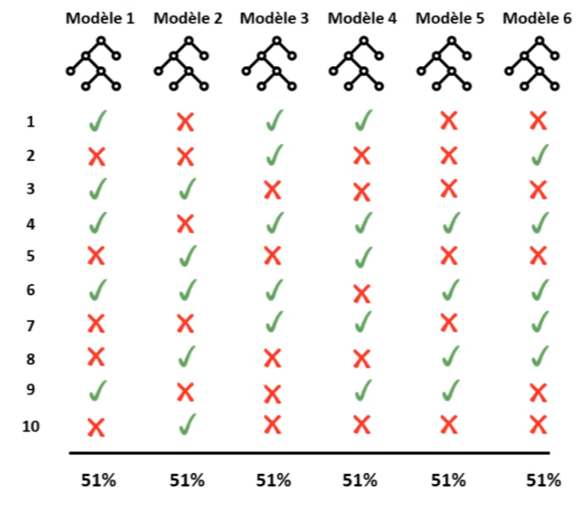

Ça paraît incroyable, mais c'est en fait dû à la loi des grands nombres. Plus vous avez de modèles, plus la performance collective s'approche des 100 %.
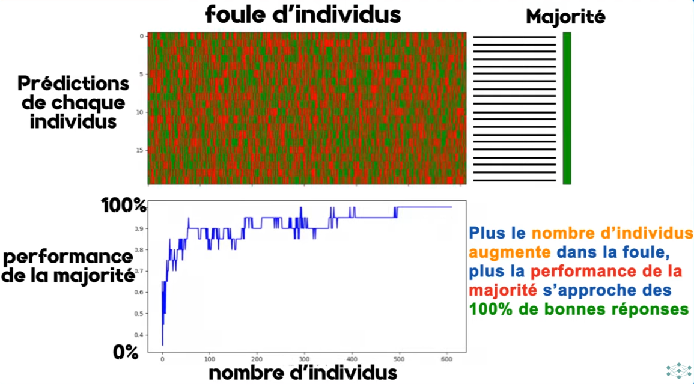

Attention toutefois, pour que cela fonctionne, il faut que notre foule respecte deux grands critères. 
1. Pour commencer, il faut que les modèles, c'est-à-dire les membres de la foule, aient au moins 50 % de performance. Car s'ils ont juste en dessous, par exemple 49 %, alors la performance collective va converger vers 0 % plutôt que 100 %. Encore une fois, c'est lié à la loi des grands nombres. 
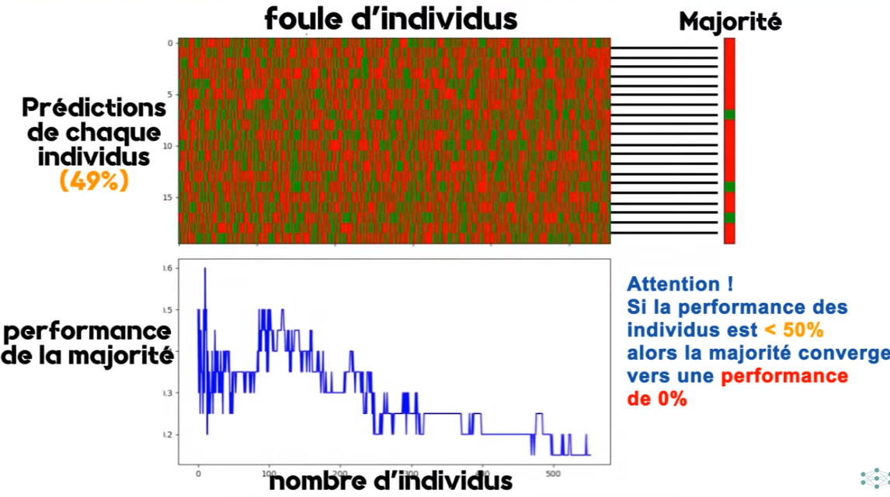

2. Ensuite, il faut que notre foule présente un minimum de diversité. Si les gens au sein d'une foule partagent tous exactement les mêmes opinions, ça ne sert à rien de regrouper leurs avis. Autant demander à une seule personne ce qu'elle pense. 
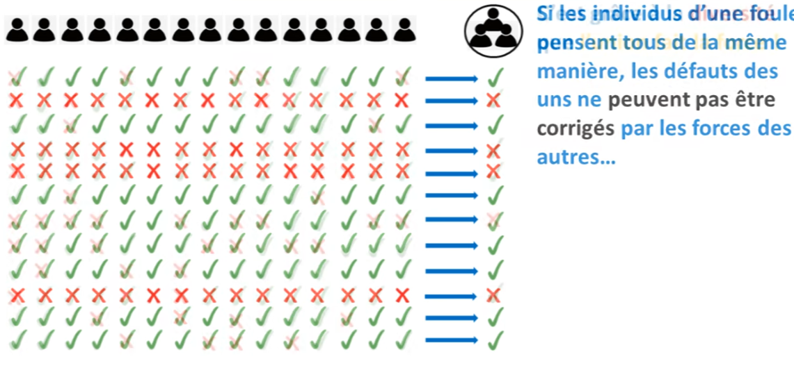

Voilà pourquoi il est important de créer un minimum de diversité au sein de notre foule, de telle sorte que les faiblesses des uns soient compensées par les forces des autres. Ça explique aussi pourquoi, dans les grandes entreprises, on essaie toujours de créer des équipes mixtes avec des gens de différents âges, sexes et cultures. Car c'est grâce à cette diversité que l'union fait la force.
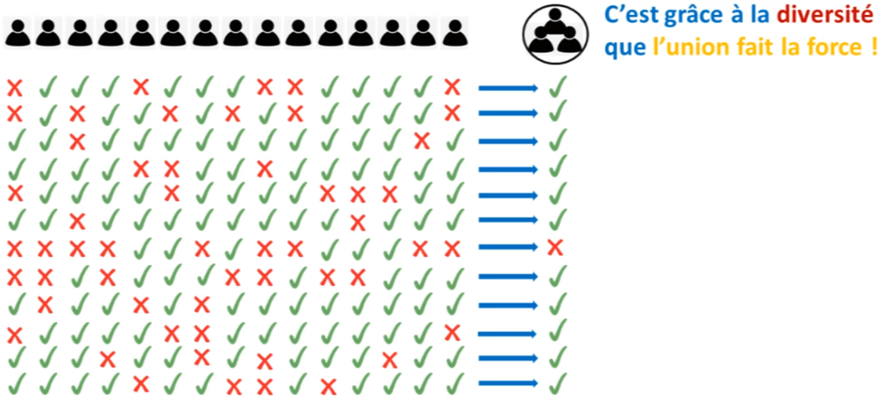

Donc, pour résumer, "The Wisdom of the Crowd" est un phénomène lié à la loi des grands nombres, qui fait qu'une foule d'individus a plus souvent raison qu'un expert tout seul. À condition que cette foule soit suffisamment grande, compétente et diversifiée. 
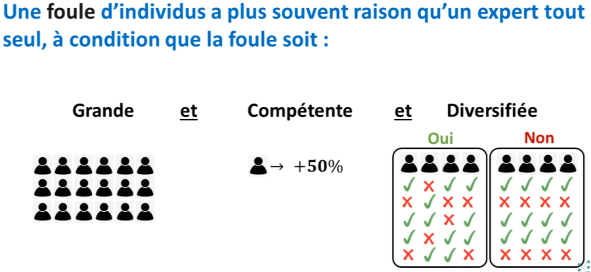

En machine learning, on peut utiliser ce concept pour créer des ensembles de modèles qui surpassent les performances des meilleurs modèles de machine learning au monde. Tout ce qu'il faut, c'est satisfaire ces trois critères : taille, compétence, diversité. Et pour cela, on dispose de trois grandes techniques : le bagging, le boosting et le stacking.

## 3. Bagging

Pour commencer, je vais vous parler du bagging. L'idée est de créer plusieurs instances d'un même modèle, par exemple, plusieurs arbres de décision. 
On entraîne chacune de ces instances sur une portion aléatoire de notre dataset. Pour cela, on utilise une technique d'échantillonnage appelée "bootstrapping", qui consiste à replacer, après chaque tirage au sort, les données qui ont été sélectionnées dans notre dataset. 
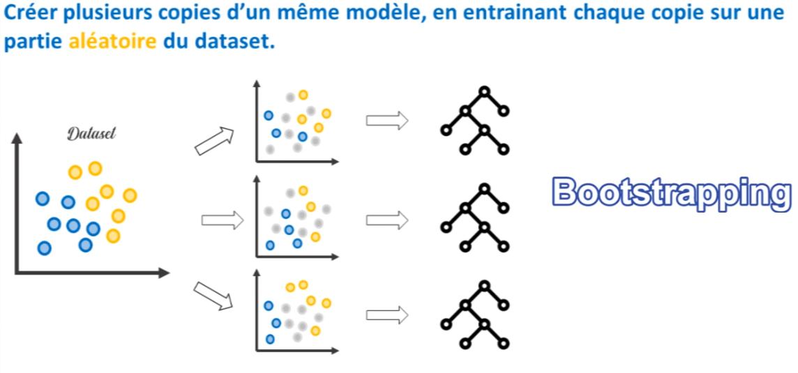


De cette manière, on obtient une foule de modèles diversifiée puisqu'ils n'ont pas tous été formés avec les mêmes données. 

Mais ils partagent certaines connaissances en commun, et c'est très important pour obtenir des majorités en faveur des bonnes réponses. 
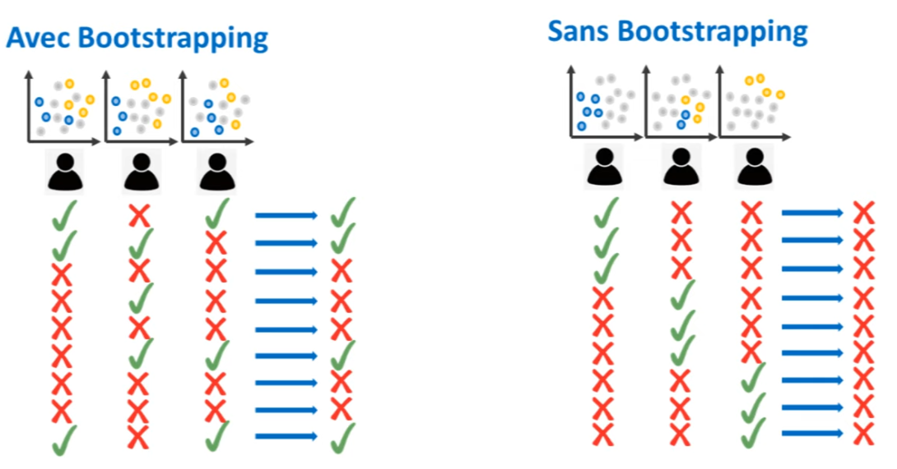

Une fois qu'on a cette foule, on peut regrouper les résultats de chaque modèle pour faire notre prédiction finale. 
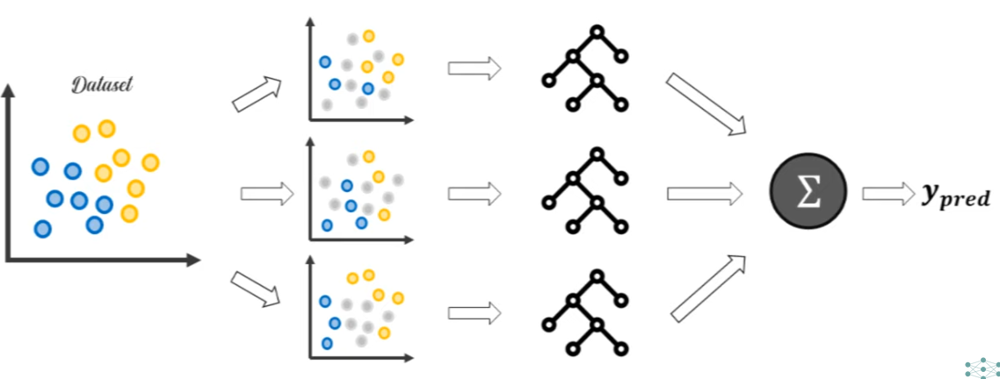

Voilà donc, en quelques mots, ce qu'est le bagging. 

L'exemple d'algorithme le plus connu est celui de Random Forest, dans lequel on choisit comme modèle de base l'arbre de décision. Vu qu'on crée un ensemble d'arbres basé sur des données tirées au hasard, on obtient donc une "forêt aléatoire", une "Random Forest".

## 4. Boosting

Une autre façon d'obtenir des ensembles de modèles diversifiés est d'utiliser une technique appelée boosting.
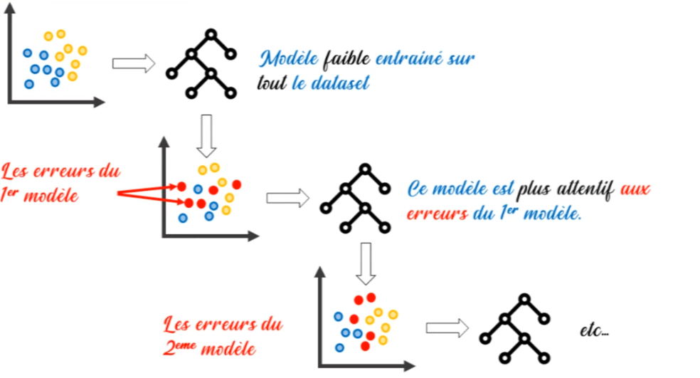

Cette fois-ci, l'idée est d'entraîner l'un après l'autre plusieurs modèles relativement faibles, en demandant à chaque modèle d'essayer de corriger les erreurs effectuées par son prédécesseur. 

Du coup, on obtient un ensemble de modèles parfaitement complémentaires, dans lequel les faiblesses des uns sont compensées par les forces des autres. 

Pour ce faire, il existe deux grands algorithmes : AdaBoost et Gradient Boosting. 

Vous le voyez, l'idée de base est assez différente de celle du bagging. 
- Dans le bagging, on entraîne nos modèles en parallèle, alors qu'
- avec le boosting, on les entraîne en série. 

Dans le bagging, nos modèles sont tous relativement forts et sont chacun en situation d'overfitting. En rassemblant leurs prédictions, on permet de réduire la variance de l'ensemble.
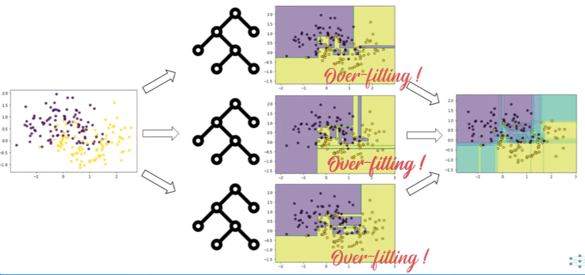

À l'inverse, avec le boosting, nos modèles sont tous relativement faibles, en situation d'underfitting. Mais en les construisant les uns après les autres, on est capable de réduire le biais de l'ensemble. 
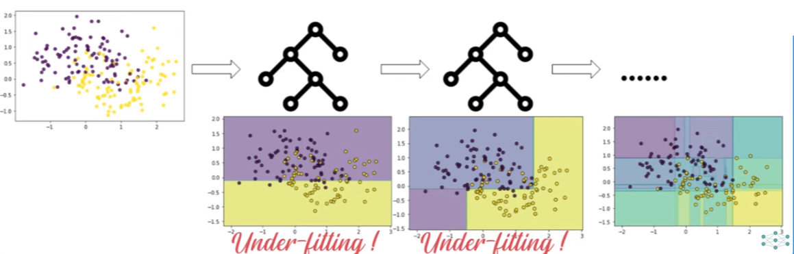

Gardez bien cette comparaison en tête, car elle résume vraiment bien la différence entre le bagging et le boosting. 


Mais une chose très importante à savoir, c'est que ces deux techniques, même si elles emploient des procédés
différents permettent d'obtenir le même résultat c'est à dire obtenir un ensemble de modèles qu'ils soient compétents grand et diversifiée.

## 5. Stacking

Il existe une troisième technique d'ensemble très populaire : le stacking. 

L'idée est d'entraîner un modèle de machine learning par-dessus les prédictions de notre foule. 

C'est-à-dire qu'au lieu de simplement rassembler les résultats de nos modèles pour retenir une prédiction majoritaire, 
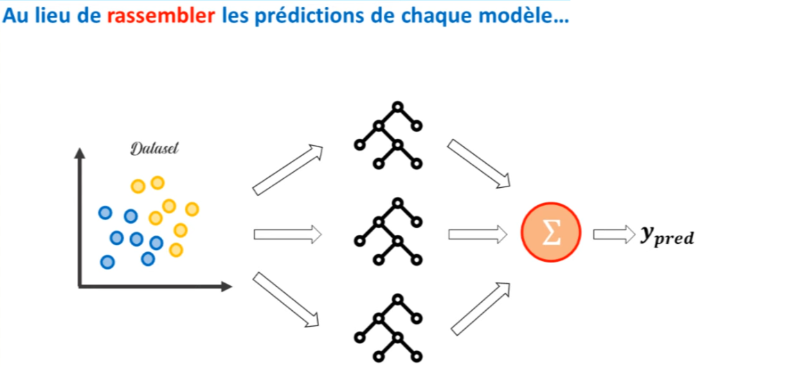


on demande à un modèle d'apprendre à reconnaître qui a tort et qui a raison dans notre foule pour lui-même prédire le résultat final. 
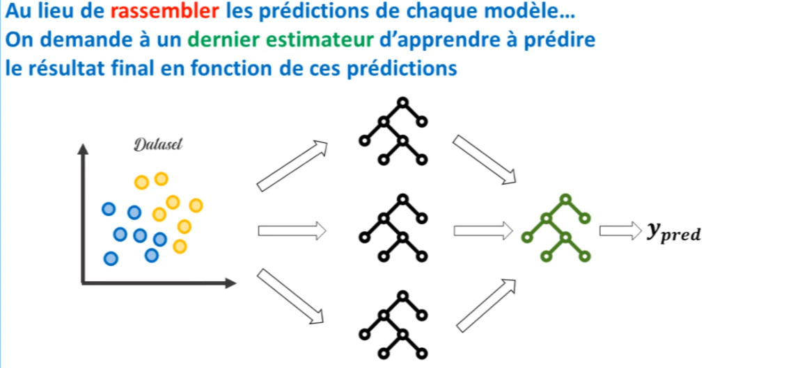

C'est plutôt intéressant comme technique. Vous vous demandez peut-être ce que cela nous apporte. Eh bien, ne vous inquiétez pas, je vous propose tout de suite de passer à l'action en voyant comment mettre en place des algorithmes de bagging, boosting et de stacking avec Scikit-Learn.

## 6. Sklearn 

Dans Scikit-learn, on va retrouver tous les algorithmes dont on a parlé dans le module "ensemble". 

- Pour commencer, dans ce module, on dispose de deux classes très simples : la classe VotingClassifier et VotingRegressor. Ce sont les implémentations les plus basiques qui puissent exister d'une "wisdom of the crowd". C'est-à-dire qu'avec ces deux classes, on va tout simplement entrer la liste des modèles qu'on veut avoir dans notre foule. Les modèles seront entraînés et leurs résultats seront regroupés pour retenir le résultat général sous forme de vote. C'est aussi simple que ça.

- Ensuite, dans notre module "ensemble", on a les estimateurs qui permettent de faire du bagging. On va avoir BaggingClassifier et BaggingRegressor qui sont tout simplement les estimateurs de base pour faire du bagging. 

- Puis, on retrouvera RandomForest, qui est réellement la technique la plus populaire, celle que vous devez retenir. D'ailleurs, comme vous pouvez le voir, on retrouve aussi IsolationForest, car en effet, c'est un algorithme qui fait appel à la technique de bootstrapping que l'on a abordée tout à l'heure.

- Ensuite, dans le module "ensemble", on retrouve les estimateurs de boosting, principalement AdaBoost et GradientBoosting. Je vous conseille de vous y référer.

- Et pour finir, depuis la version 0.22 de Scikit-learn, on a aussi deux classes qui nous permettent de faire du stacking. 

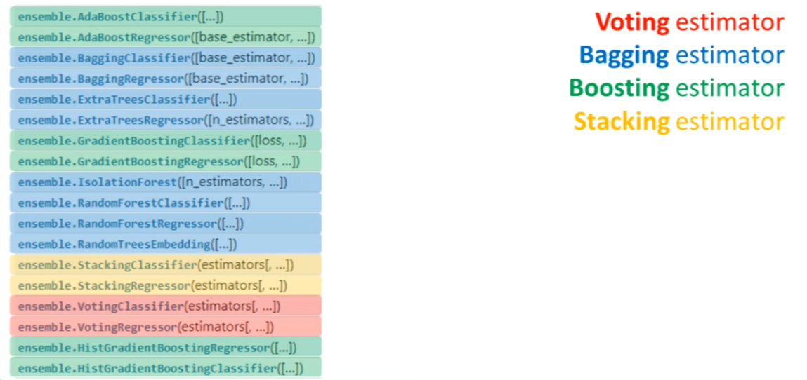

Maintenant, il ne reste plus qu'à voir comment utiliser ces différents modèles avec Scikit-learn. 

Donc, avant toute chose, je vous propose de générer un dataset, par exemple, avec le générateur MakeMoons. 


```python
import numpy as np
import matplotlib.pyplot as plt
from sklearn.datasets import make_moons
from sklearn.model_selection import train_test_split
```


```python
from matplotlib.colors import ListedColormap

def plot_decision_boundary(clf, X, y, axes=[-1.5, 2.45, -1, 1.5], alpha=0.5, contour=True):
    
    h = .02
    x_min, x_max = X[:, 0].min() - .5, X[:, 0].max() + .5
    y_min, y_max = X[:, 1].min() - .5, X[:, 1].max() + .5
    xx, yy = np.meshgrid(np.arange(x_min, x_max, h),
                         np.arange(y_min, y_max, h))
    
    
    Z = clf.predict_proba(np.c_[xx.ravel(), yy.ravel()])[:, 1]
    Z = Z.reshape(xx.shape)
    plt.contourf(xx, yy, Z, alpha=.5)
    
    plt.scatter(X[:,0], X[:,1], c=y, alpha=0.8, edgecolors='k')
```


```python
X, y = make_moons(n_samples=500, noise=0.3, random_state=0)
plt.scatter(X[:,0], X[:,1], c=y, alpha=0.8)
```


    <matplotlib.collections.PathCollection at 0x21479cceac0>


    


Ensuite, il faut bien sûr créer un train set et un test set, c'est toujours très important. J'ai choisi les réglages suivants.


```python
X_train, X_test, y_train, y_test = train_test_split(X, y, test_size=0.3, random_state=0)
```

### 6.1 VotingClassifier

Maintenant, voyons comment utiliser VotingClassifier sur notre dataset. 

Pour l'utiliser, il faut commencer par définir quels seront les modèles qui le composeront et les modèles qui seront dans notre foule. 

Ici, j'ai choisi SGDClassifier, DecisionTreeClassifier et KNeighborsClassifier. 


```python
from sklearn.linear_model import SGDClassifier
from sklearn.tree import DecisionTreeClassifier
from sklearn.neighbors import KNeighborsClassifier
```

Avant d'utiliser ces modèles dans VotingClassifier, je vous propose de voir quelle serait la performance de chacun de ces modèles sur notre dataset. 

Pour cela, on va initialiser nos trois modèles, puis on va écrire une boucle for dans laquelle on va entraîner chaque modèle, puis imprimer le nom du modèle et son score sur le test. 


```python
model_1 = SGDClassifier(random_state=0)
model_2 = DecisionTreeClassifier(random_state=0)
model_3 = KNeighborsClassifier(n_neighbors=2)

for model in (model_1, model_2, model_3):
    model.fit(X_train, y_train)
    print(model.__class__.__name__, model.score(X_test, y_test))
```

    SGDClassifier 0.84
    DecisionTreeClassifier 0.86
    KNeighborsClassifier 0.86


Cela nous donne les performances suivantes : 84% pour SGDClassifier, 86% pour DecisionTreeClassifier et 86% pour KNeighborsClassifier.

À présent, voyons comment utiliser le VotingClassifier. 

On va charger la classe depuis le module "ensemble". 


```python
from sklearn.ensemble import VotingClassifier
```

Pour utiliser cette classe, tout ce qu'on doit faire, c'est entrer, dans une liste, les différents modèles qui vont composer notre foule. 

On va entrer trois tuples, car dans chaque tuple, on doit donner un surnom à notre modèle et indiquer de quel modèle il s'agit. 

Par exemple, 
1. pour le SGDClassifier, on va l'appeler "sgd" et ce sera notre modèle 1, 
2. pour le DecisionTreeClassifier, on l'appellera "tree" et ce sera notre modèle 2, et 
3. pour le KNeighborsClassifier, on l'appellera "knn" et ce sera notre modèle 3. 

Une fois cette liste créée, il y a une autre chose très importante à spécifier dans notre VotingClassifier, c'est la technique de vote qui sera utilisée, car il existe deux types de votes : le vote "hard" et le vote "soft". 
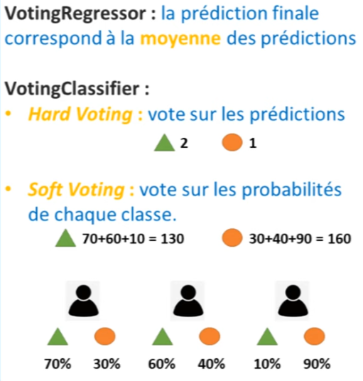

Pour information, lorsqu'on entraîne un régresseur, c'est-à-dire lorsqu'on doit prédire une valeur quantitative, par exemple le prix d'un appartement, on ne va pas effectuer un vote. 

En réalité, on va effectuer une moyenne. En effet, c'est logique : si dans la vraie vie vous demandez à trois experts d'estimer le prix d'un appartement et que l'un d'entre eux dit 300 000, l'autre 350 000 et le dernier 310 000, vous allez faire la moyenne de leurs prédictions. C'est ainsi que fonctionne le "voting régressant". 

Concernant le "voting classifier", c'est un peu différent. On a deux techniques de vote : le vote "hard" et le vote "soft". 

Le vote "hard" va consister à prendre la prédiction majoritaire, c'est-à-dire que si deux des trois experts pensent que c'est la classe "triangle" la bonne, alors c'est le triangle qui va l'emporter. 

Pour le vote "soft", c'est une technique où l'on va accumuler les probabilités de chaque classe. Par exemple, si le premier expert dit que c'est la classe "triangle" la bonne et qu'il en est sûr à 70%, mais que le troisième expert pense que c'est la classe "ronde" qui est la bonne à 90%, alors en cumulant toutes ces probabilités et certitudes, on pourrait obtenir un autre résultat. 

Dans cet exemple, on obtient effectivement un autre résultat.

La question est de savoir quand utiliser le vote "hard" et quand utiliser le vote "soft". En général, on dit que le vote "soft" est meilleur lorsque nos modèles sont bien calibrés.

Si, dans notre cas, on choisit "voting = hard" et qu'on entraîne ce modèle, qu'obtient-on ? 


```python
model_4 = VotingClassifier([('SGD', model_1),
                            ('Tree', model_2),
                            ('KNN', model_3)],
                          voting='hard')

for model in (model_1, model_2, model_3, model_4):
    model.fit(X_train, y_train)
    print(model.__class__.__name__, model.score(X_test, y_test))
```

    SGDClassifier 0.84
    DecisionTreeClassifier 0.86
    KNeighborsClassifier 0.86
    VotingClassifier 0.8733333333333333


Eh bien, on obtient une performance de 87%. 

Autrement dit, la technique d'ensemble a fonctionné : la "wisdom of the crowd" fonctionne. On est passé de modèles individuels ayant des performances de 84% et 86% à un ensemble ayant une performance de 87%. 

C'est un bon résultat.

Cela dit, en général, le "voting classifier" n'est pas une technique d'ensemble très efficace. Pourquoi ? Parce qu'il est très difficile, avec cette technique, de respecter le troisième critère du "wisdom of the crowd", c'est-à-dire le critère de diversité. 

En effet, nos modèles sont certes performants, mais en termes de prédiction, ils nous disent tous à peu près la même chose. 
Ils ne sont donc pas très diversifiés. 

La meilleure façon d'acquérir de la diversité, comme nous l'avons vu, c'est grâce au "bagging" et au "boosting". 

###  6.2 Bagging

Pour le bagging, je vais vous montrer comment utiliser "BaggingClassifier" et "RandomForestClassifier". 


```python
from sklearn.ensemble import BaggingClassifier, RandomForestClassifier
```

Mais ce que nous allons voir, peut être appliqué à tous les autres modèles de bagging existants, c'est à dire, modèles de régression, modèles "ExtraTrees", etc. 

Pour créer ces modèles, par exemple avec un "BaggingClassifier", c'est très simple. Tout ce que vous avez à faire est de déterminer un estimateur de base avec lequel vous souhaitez travailler. 

Ça peut être un arbre de décision, ça peut être un "KNeighborsClassifier", ça peut être un "SGDClassifier" ou n'importe quel autre estimateur que vous souhaitez. 

Par exemple, nous choisirons un "KNeighborsClassifier". 

Ensuite, un autre argument très important est de préciser le nombre d'estimateurs que l'on va avoir dans notre ensemble. 

Par défaut, il est fixé à 100. 


```python
model = BaggingClassifier(estimator=KNeighborsClassifier(),
                          n_estimators=100)
```

Franchement, quand vous faites du bagging, c'est le principal à retenir. Vous pouvez, si vous le souhaitez, explorer d'autres hyperparamètres, mais c'est déjà très bien. 

Ensuite, vous n'avez qu'à entraîner votre modèle et à le tester. 


```python
model.fit(X_train, y_train)
model.score(X_test, y_test)
```


    0.8866666666666667

Nous obtenons une performance de 89%. 

Nous voyons donc que le bagging est plus puissant et plus efficace qu'une simple technique de vote. Pourquoi ? Parce qu'on réussit à créer de la diversité. 

Si vous souhaitez utiliser l'algorithme de "Random Forest", c'est encore plus simple. Tout ce que vous avez à faire est de préciser le nombre d'estimateurs que vous voulez. Il n'est pas nécessaire de préciser l'estimateur de base, car par défaut, "Random Forest" utilise des arbres de décision. 


```python
model = RandomForestClassifier(n_estimators=100)

model.fit(X_train, y_train)
model.score(X_test, y_test)
```


    0.8933333333333333

Si nous entraînons un modèle "Random Forest", nous obtenons une performance de 88%. En général, un "Random Forest" aura de meilleurs résultats qu'un "BaggingClassifier" avec un "KNeighborsClassifier". Mais il faut connaître les règles et il faut optimiser le modèle. 


```python
plot_decision_boundary(model, X_train, y_train)
```


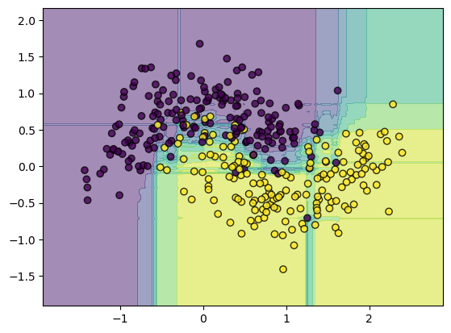
    


Par exemple, vous pouvez ajuster l'argument "max_depth" qui nous indique la taille maximale des arbres que nous voulons dans notre forêt. 


```python
model = RandomForestClassifier(n_estimators=100, max_depth=10000)

model.fit(X_train, y_train)
model.score(X_test, y_test)
```


    0.88

Plus cette taille est grande, plus nos arbres seront performants. Mais attention, ces arbres seront aussi plus susceptibles de surajuster (overfitting). Donc, il faudra peut-être augmenter la taille de notre forêt, c'est-à-dire le nombre d'estimateurs. Bien sûr, plus nous augmentons la taille des arbres et la taille de la forêt, plus notre modèle sera lent. 

C'est un inconvénient de cette technique. Gardez cela à l'esprit.

### 6.3 Boosting

Concernant le "boosting", deux principaux estimateurs existent : "AdaBoost" et "GradientBoosting". Ces deux peuvent être utilisés comme classificateurs ou comme régresseurs. Mais ici, nous effectuons une tâche de classification. 

Quand vous utilisez ces algorithmes, tout ce que vous avez à faire est de préciser le nombre d'estimateurs que vous voulez. 

Prenons, par exemple, 100, entraînez-le et testez-le. Nous obtenons une performance de 90%. 


```python
from sklearn.ensemble import AdaBoostClassifier, GradientBoostingClassifier
```


```python
model = AdaBoostClassifier(n_estimators=100)
model.fit(X_train, y_train)
model.score(X_test, y_test)
```


    0.88


```python
plot_decision_boundary(model, X_train, y_train)
```


    


Bien sûr, d'autres hyperparamètres peuvent être ajoutés, comme choisir un estimateur de base. Pour "AdaBoost", l'estimateur de base par défaut est un arbre de décision. 


Vous pouvez aussi ajuster le "learning_rate". Je vous recommande d'explorer tous ces paramètres. 

Mais la meilleure chose à faire, si vous voulez trouver les meilleures configurations, c'est d'utiliser "GridSearchCV".

### 6.4 StackingClassifier

Pour conclure, je vais vous montrer comment utiliser le "StackingClassifier". 

Le principe, comme nous l'avons vu, est d'entraîner un estimateur sur les prédictions de nos différents modèles. 

Vous pouvez, par exemple, prendre le "VotingClassifier" que nous avions au début, mais remplacer ce "VotingClassifier" par un "StackingClassifier". 


```python
from sklearn.ensemble import StackingClassifier
```

Vous devez d'abord lister les différents modèles qui constitueront votre ensemble. 

Puis, au lieu d'avoir un vote, vous aurez un estimateur final qui fera ses prédictions sur l'ensemble. Vous pouvez choisir, par exemple, un "KNeighborsClassifier". 


```python
model = StackingClassifier([('SGD', model_1),
                            ('Tree', model_2),
                            ('KNN', model_3)],
                             final_estimator=KNeighborsClassifier())
```

Entraînez votre modèle et testez-le.


```python
model.fit(X_train, y_train)
model.score(X_test, y_test)
```


    0.8666666666666667

Donc, nous avons souvent obtenu une performance de 90%, de 89% et de 87%. 

Mais ce que nous avons observé, c'est qu'à chaque fois, cette performance était supérieure à celle des modèles individuels que l'on pourrait entraîner en machine learning. 

Donc, vous avez découvert une nouvelle technique très puissante : ce sont les techniques d'ensemble.

Maintenant, si vous voulez savoir quelles techniques utiliser dans quelles circonstances, ce que je vous conseille de retenir, c'est que le bagging, on va essayer de l'utiliser lorsqu'on se rend compte que nos modèles individuels ont tendance à faire du overfitting. 

Le fait de créer plusieurs experts et de faire la moyenne, ou bien le vote de leurs prédictions avec du bootstrapping, va réduire ce overfitting. 

Et si, à l'inverse, vous travaillez sur un problème où vos modèles individuels ont du mal à atteindre une bonne performance, simplement parce que les données sont complexes ou que la tâche est très complexe, alors essayez d'utiliser du boosting, c'est très efficace.

Quant au "stacking", c'est une technique qui peut être très performante, notamment si vous avez investi beaucoup de temps à entraîner chaque modèle individuellement. 

Par exemple, si vous avez utilisé un SGD Classifier et l'avez fait travailler pendant de nombreuses itérations, ou si vous avez entraîné un arbre de décision, ou peut-être même une random forest avec un grand nombre d'arbres, rendant ainsi la forêt très puissante, et que vous souhaitez combiner les résultats de cette forêt avec ceux du SGD et, disons, d'un réseau de neurones, vous pouvez envisager de superposer un autre modèle pour faire des prédictions basées sur ces résultats combinés. 

Honnêtement, cette technique peut être très efficace, mais elle est la plus lente des trois techniques présentées en début de leçon.
