# PytHon pour le Machine Learning

[Retour README](../README.md)

[toc]

------


# 1. Matplotlib : Les bases

## 1.1 La visualisation de données doit être un atout !


Permettez une petite question : Pourquoi crée-t-on des graphiques dans la vie ? 

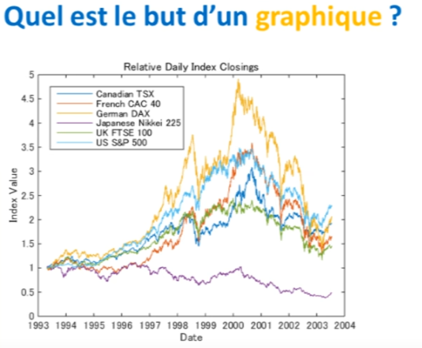

C'est pour visualiser les choses sur lesquelles on travaille, qu'il s'agisse de données ou d'un modèle. C'est pour mieux comprendre le problème sur lequel on travaille. En d'autres termes, un graphique est censé aider à la résolution de problèmes. 


Pourtant, pour nombre de personnes qui utilisent Matplotlib, c'est l'inverse qui se produit.


Beaucoup de personnes vont créer un graphique et dans ce graphique, il y aura des erreurs. Ainsi, au lieu d'aider à résoudre leurs problèmes, ce graphique leur donne un nouveau problème qu'ils doivent d'abord résoudre avant de s'attaquer à leurs vrais problèmes. Il suffit de consulter le premier forum tel que Stack Overflow pour voir le nombre de personnes qui ont des problèmes avec Matplotlib.

Pourtant, Matplotlib est très simple à utiliser et en principe, aucun bug ne devrait survenir avec ce package. 


Si les gens rencontrent parfois des problèmes, c'est d'une part parce qu'ils essaient d'ajouter beaucoup trop de détails à leur courbe. Ils perdent du temps à perfectionner leur graphique alors qu'ils devraient se concentrer sur leur problème de machine learning. D'autre part, c'est parce qu'il existe deux méthodes pour créer des graphiques dans Matplotlib.

Une méthode est orientée objet et l'autre est plus basique. Comme l'indique Matplotlib sur leur site officiel, les gens ont tendance à mélanger ces deux méthodes, et ils ne devraient pas. Dans cette vidéo, on mettra les choses au clair.

Il sera expliqué comment créer des graphiques qui ne soient ni trop simples, ni trop sophistiqués. Juste les graphiques parfaits qu'il faut, sans jamais avoir de bug dans ces graphiques. C'est vraiment très simple.

Comme mentionné précédemment, il existe deux méthodes pour créer des graphiques avec Matplotlib. La méthode la plus simple est d'utiliser une fonction appelée plot qui provient du module Pyplot. C'est ce qui sera exploré en premier dans cette vidéo, puis la méthode orientée objet sera expliquée.

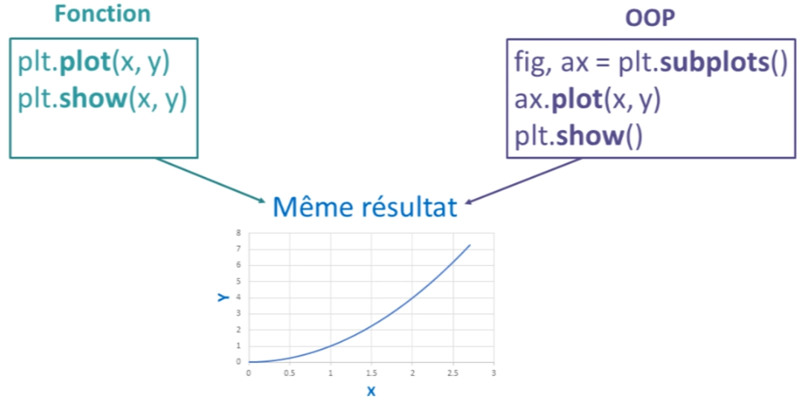

## 1.2 Premier graphique avec plt.plot()

Par exemple, deux tableaux Numpy ont été créés ici : un tableau X qui comprend 10 points allant de 0 à 2, et un tableau Y qui est simplement le carré de X. 

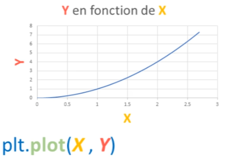


```python
%matplotlib inline

import numpy as np

X = np.linspace(0, 2, 10)
Y = X**2

print ('le tableau X est ', X)
print ('le tableau Y est', Y)

```

    le tableau X est  [0.         0.22222222 0.44444444 0.66666667 0.88888889 1.11111111
     1.33333333 1.55555556 1.77777778 2.        ]
    le tableau Y est [0.         0.04938272 0.19753086 0.44444444 0.79012346 1.2345679
     1.77777778 2.41975309 3.16049383 4.        ]


Pour tracer Y en fonction de X, X est tracé sur l'axe des abscisses et Y sur l'axe des ordonnées. Cela donne un graphique tout simple, beau et efficace.

```python
import matplotlib.pyplot as plt
plt.plot(X, Y)
```


    [<matplotlib.lines.Line2D at 0x202af4fd790>]

​    
​    


Maintenant, si autre chose que Jupyter Notebook est utilisée, le graphique ne s'affichera pas de cette façon. Ce qu'il faut faire, c'est écrire $plt.show()$ pour afficher le graphique conçu en écrivant $plt.plot()$. 

Une erreur courante que certains débutants font avec la fonction $plot()$, c'est de passer des tableaux X et Y qui n'ont pas les mêmes dimensions. Par exemple, il y aurait plus de points dans le tableau Y qu'il n'y en a dans le tableau X. Or, si c'est le cas, comment tracer un point Y s'il n'a pas de correspondance avec un point X ? C'est impossible. Donc, typiquement, si un tableau Y est créé avec disons 20 points, cela renvoie une erreur indiquant que X et Y n'ont pas les mêmes dimensions.


```python
X = np.linspace(0, 2, 10)
Y = np.linspace(0, 2, 20)

print ('le tableau X est ', X)
print ('le tableau Y est', Y)

# plt.plot(X, Y)
# ValueError: x and y must have same first dimension, but have shapes (10,) and (20,)
```

    le tableau X est  [0.         0.22222222 0.44444444 0.66666667 0.88888889 1.11111111
     1.33333333 1.55555556 1.77777778 2.        ]
    le tableau Y est [0.         0.10526316 0.21052632 0.31578947 0.42105263 0.52631579
     0.63157895 0.73684211 0.84210526 0.94736842 1.05263158 1.15789474
     1.26315789 1.36842105 1.47368421 1.57894737 1.68421053 1.78947368
     1.89473684 2.        ]


Voilà comment tracer une courbe toute simple avec Matplotlib. Maintenant, il y a d'autres fonctions que la fonction plot. 

Par exemple, pour tracer un nuage de points, on utilise la fonction $scatter()$, qui est très populaire. Cela trace Y en fonction de X avec un nuage de points.

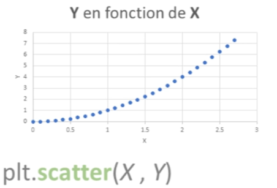


```python
import numpy as np

X = np.linspace(0, 2, 10)
Y = X**2

plt.scatter (X, Y)
plt.show()
```

​    
​    


## 1.3 Les styles les plus importants

Lorsqu'il est question de personnaliser une courbe, de changer son épaisseur, sa couleur, son style de trait, Matplotlib offre une infinité de possibilités. C'est précisément là que réside le problème. Il est conseillé de garder les choses simples, de mémoriser idéalement un paramètre de personnalisation, sinon trois. Trois seront présentés ici, il suffit de retenir celui qui est préféré.

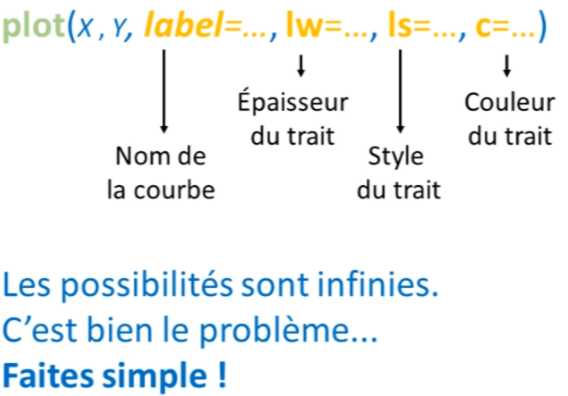

Par exemple, avec le paramètre $c$, on peut choisir la couleur de la courbe. On peut choisir un rouge ou un noir, par exemple. Il existe beaucoup de possibilités de couleur, ce n'est pas compliqué. Ensuite, avec le paramètre $lw$ (pour linewidth), on peut choisir l'épaisseur de la ligne. On peut donc choisir de faire une courbe plus ou moins épaisse, par exemple 3.5. Il n'y a pas vraiment de science à cela, il s'agit plutôt de jouer avec les nombres que l'on souhaite.

Finalement, un dernier paramètre qui peut être intéressant est le paramètre $ls$ (pour linestyle). Ici, il est important de connaître certaines options. Ce n'est pas très utile de les connaître toutes, mais par exemple, pour faire de petites tirets, on va écrire deux fois le symbole tiret ('--') et on obtient une ligne qui ressemble à cela.


```python
plt.plot(X, Y, c='red', lw=5, ls='--')
plt.show()
```

​    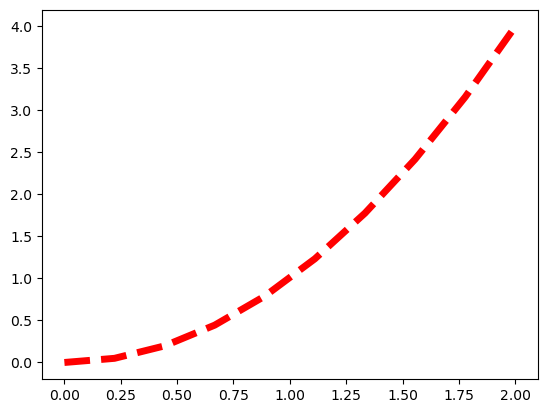
​    


## 1.4 Le cycle de vie d'une figure Matplotlib 

Maintenant, il est temps de se concentrer sur l'élément le plus important à comprendre dans Matplotlib: le cycle de vie d'une figure. Si ce concept est bien compris, alors il n'y aura aucun problème avec Matplotlib par la suite. 


Précédemment, lors de la création d'une figure, la syntaxe $plt.plot$ était utilisée directement. C'est bien, c'est rapide, c'est simple, c'est efficace, mais en principe, la création d'une figure commence par l'écriture de $plt.figure$. Ceci crée une nouvelle figure, un espace de travail vierge, la feuille sur laquelle le travail sera effectué.

Si ce code est compilé, rien n'apparaît car il s'agit d'une figure sans aucun axe. 


```python
import numpy as np
import matplotlib.pyplot as plt

X = np.linspace(0, 2, 10)
Y = X**2

plt.figure()
```


    <Figure size 640x480 with 0 Axes>


    <Figure size 640x480 with 0 Axes>


Ensuite, une fois la figure créée, un premier graphique peut être créé en écrivant $plt.plot(x, y)$. Cela donne une figure avec la courbe dessus. La raison pour laquelle la figure est explicitement écrite est qu'à l'intérieur des parenthèses, par exemple, la taille de la figure peut être choisie. C'est un paramètre à retenir, car il peut être utile. Pour cela, il faut écrire $figsize=()$, et entrer les dimensions de la figure en pouces, pas en cm. Cela peut être utile lorsque tu as besoin d'avoir une grande figure avec beaucoup de détails. Pour l'instant, revenons à la taille de base pour le reste de cette leçon, afin d'avoir une meilleure visibilité.


```python
plt.figure(figsize=(6,4))
plt.plot(X,Y)
```


    [<matplotlib.lines.Line2D at 0x202af64e2b0>]

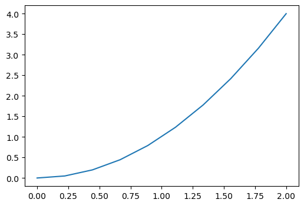
​    


Dans le cycle de vie d'une figure, il est possible d'ajouter d'autres courbes à la figure. Pour cela, il suffit d'écrire $plt.plot(x, z)$ où $z$ est par exemple le cube de $x$. Ainsi, lors de l'exécution du code, deux courbes apparaissent sur la figure. 


```python
plt.figure(figsize=(6,4))
plt.plot(X,Y)
plt.plot(X,X**3)
```


    [<matplotlib.lines.Line2D at 0x202aff47e80>]

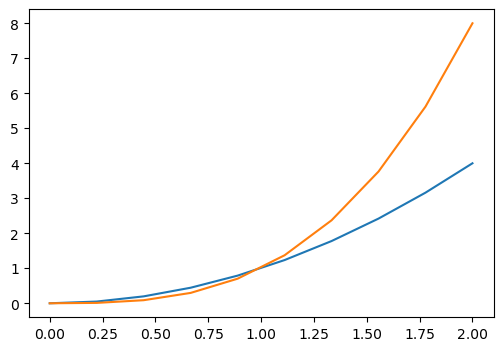​    


Après cela, tout un tas de petits extras peuvent être ajoutés à la figure. Par exemple, un titre peut être ajouté en écrivant $plt.title$ et en entrant un titre, par exemple "Figure Principale". Cela donne un titre à la figure.


```python
plt.figure(figsize=(6,4))
plt.plot(X,Y)
plt.plot(X,X**3)
plt.title('Figure principale')
```


    Text(0.5, 1.0, 'Figure principale')

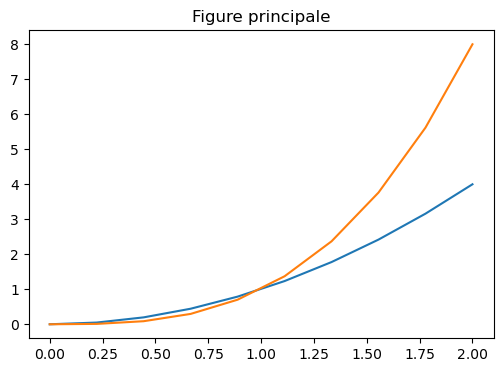​    


Ensuite, il est possible d'ajouter des noms aux axes. Pour cela, il faut écrire $plt.xlabel$ pour l'axe des abscisses, et indiquer que c'est l'axe x. La même chose peut être faite pour l'axe y, en écrivant $plt.ylabel$ et en indiquant "axe y". En exécutant le code, il y a maintenant une figure avec des axes $x$ et $y$ nommés.


```python
plt.figure(figsize=(6,4))
plt.plot(X,Y)
plt.plot(X,X**3)
plt.title('Figure principale')
plt.xlabel('axe X')
plt.ylabel('axe Y')
```


    Text(0, 0.5, 'axe Y')

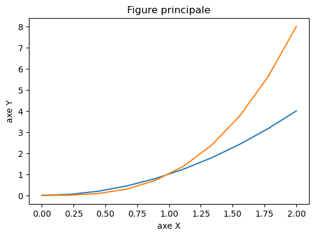
​    


Pour finir, une chose très souvent faite lors de la création d'un graphique est d'ajouter une légende aux graphiques. Pour cela, il faut écrire $plt.legend$. Lors de l'affichage d'une légende, il faut bien sûr indiquer à quoi correspondent les deux courbes, et cela se fait à l'intérieur des fonctions plot. Il faut donc écrire label="quadratique" pour la première et "cubique" pour la seconde. En exécutant le code, la légende est affichée. C'est génial.


```python
plt.figure(figsize=(6,4))
plt.plot(X,Y, label='Quadratique')
plt.plot(X,X**3, label='Cubique')
plt.title('Figure principale')
plt.xlabel('axe X')
plt.ylabel('axe Y')
plt.legend()
```


    <matplotlib.legend.Legend at 0x202b10a7a30>

​    
​    


Enfin, comme mentionné précédemment, en principe, il faut terminer la figure en écrivant plt.show. C'est seulement à ce moment que la figure s'affiche réellement. Avec Jupyter, il est possible d'omettre le $plt.show$ et cela fonctionne également.


```python
plt.figure(figsize=(6,4))
plt.plot(X,Y, label='Quadratique')
plt.plot(X,X**3, label='Cubique')
plt.title('Figure principale')
plt.xlabel('axe X')
plt.ylabel('axe Y')
plt.legend()
plt.show()
```

   ​    


Pour terminer, une dernière chose qui peut être faite dans le cycle de vie d'une figure est d'utiliser une fonction pour sauvegarder la figure une fois qu'elle est terminée. Pour cela, il y a une fonction appelée $plt.savefig$ dans laquelle il faut entrer un nom pour la figure, par exemple "figure.png". Maintenant, dans le répertoire de travail, il y a une image.png qui est disponible et qui peut être utilisée comme on le souhaite.

Voilà donc pour le cycle de vie d'une figure dans Matplotlib. On commence par écrire $plt.figure$, puis on ajoute beaucoup d'éléments à la figure : des courbes, des titres, etc., puis on affiche la figure et, en option, on peut la sauvegarder. 

Si une nouvelle figure doit être créée, bien sûr dans Jupyter Notebook, il suffit d'aller dans une autre cellule et de copier le code. Mais si tu es ailleurs que dans Jupyter, par exemple dans Spider ou dans PyCharm, tout ce qu'il faut faire c'est sauter une ligne, écrire une nouvelle figure, écrire $plt.plot$ (par exemple, à nouveau $x$, $y$), et deux figures vont s'afficher dans la console.

## 1.5 Subplot: afficher plusieurs graphiques avec matplotlib

Maintenant, très souvent, l'envie se fait sentir d'afficher plusieurs graphiques sur une seule et même leçon. 

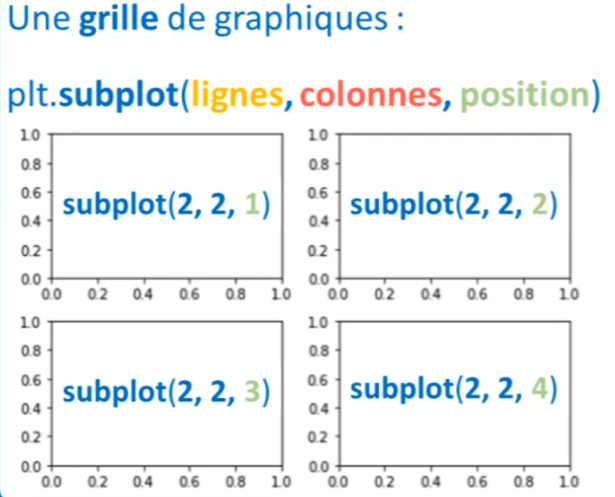

Pour cela, une autre fonction est utilisée, c'est la fonction $subplot$. Cette fonction permet de générer une grille de différents graphiques sur la leçon. Pour cela, à l'intérieur de subplot, le nombre de lignes et le nombre de colonnes souhaitées dans la grille sont indiquées, puis ensuite, il est spécifié sur quel graphique, à l'intérieur de cette grille, l'envie se fait sentir de travailler.

Par exemple, si l'envie est de créer deux graphiques au sein d'une leçon, $plt.subplot$ est écrit, 

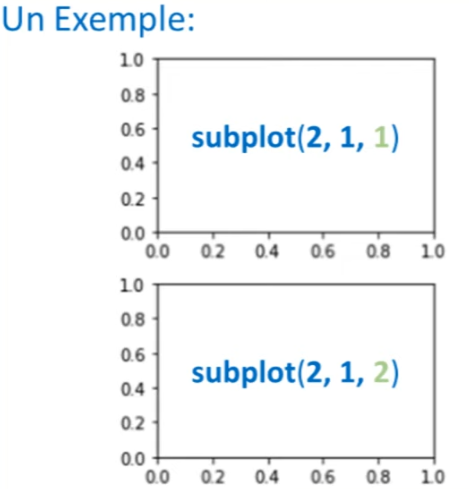

et par exemple, si l'intention est de créer deux graphiques sur une seule et même colonne, donc faire deux lignes une colonne, le travail commencera sur le premier graphique. Ensuite, $plt.plot$ sera écrit sur ce graphique pour afficher $X$ et $Y$. Disons que l'affichage est en rouge, donc si le code est exécuté, un graphique en rouge est obtenu.


```python
plt.subplot(2, 1, 1)
plt.plot(X, Y, c='red')
```


    [<matplotlib.lines.Line2D at 0x202af621a30>]

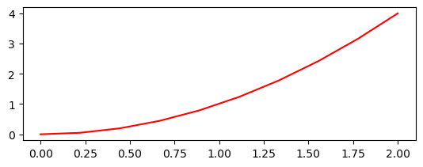​    


Maintenant, si l'intention est d'obtenir le graphique qui se situe en dessous, $plt.subplot (2,1,2)$ sera écrit. Si le code est exécuté, le deuxième graphique est déjà affiché, mais pour l'instant, il est vide, rien n'a été ajouté dessus.


```python
plt.subplot(2, 1, 2)
```


    <Axes: >

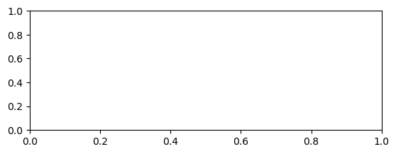​    


Donc, si l'envie est d'ajouter une courbe, $plt.plot$ sera également écrit, et peut-être que l'affichage sera en bleu cette fois. Donc, il y a deux courbes affichées, l'une au-dessus de l'autre, dans deux graphiques différents, mais ils font partie de la même leçon.


```python
plt.subplot(2, 1, 1)
plt.plot(X, Y, c='red')
plt.subplot(2, 1, 2)
plt.plot(X, X**9,c='blue')
```


    [<matplotlib.lines.Line2D at 0x202b11df160>]

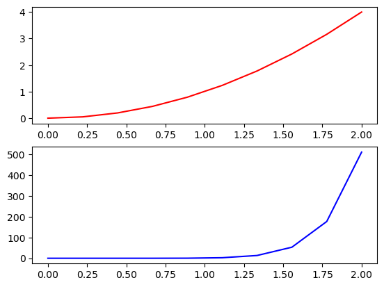​    


Pour résumer, voici à quoi ressemble le véritable cycle de vie d'une leçon à l'intérieur de Matplotlib. 

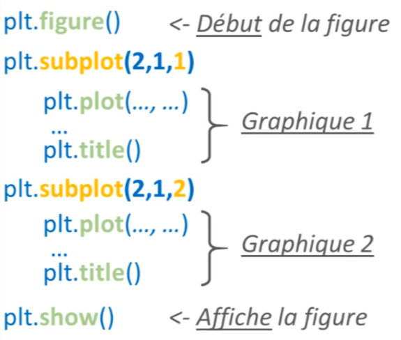

Tout d'abord, une leçon est créée. Si un système de grille est désiré, les subplots sont créés, puis le travail commence sur le premier graphique. Par exemple, l'intention pourrait être de faire x en fonction de y, et un titre serait écrit, appelé "Graphique 1". Une fois satisfait du premier graphique, le passage se fait au deuxième graphique, donc $plt.subplot( 2,2)$ est écrit, et le travail recommence avec un tout nouveau graphique. Cette action affiche $plt.plot$ pour $sin(2x)$, et disons que sur ce graphique, l'envie est de rajouter une légende, un label "sinus", et l'appeler "sinus". 


```python
plt.figure()
plt.subplot(2, 1, 1)
plt.plot(X, Y, c='red')
plt.title('Graphique 1')
plt.subplot(2, 1, 2)
plt.plot(X, np.sin(X), label='sinus')
plt.plot(X, np.cos(X), label='cosinus')
plt.legend()
```


    <matplotlib.legend.Legend at 0x202b12e7be0>

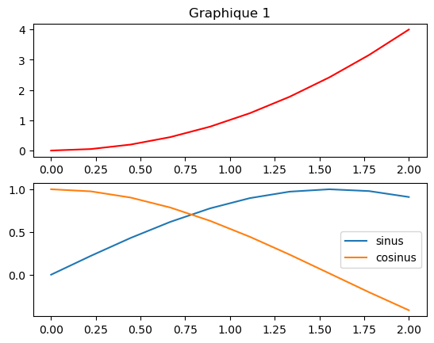
​    


Voilà comment se fait la création de graphiques avec Matplotlib, c'est aussi simple que ça.

## 1.6 Matplotlib Orienté Objets

Comme mentionné au début, une autre méthode existe, celle-ci est orientée objet. Cette méthode, un peu plus poussée, permet de réaliser des choses un peu plus intéressantes. Cependant, elle n'est pas spécialement recommandée car avec la première méthode, 99% des graphiques désirés peuvent être tracés. Mais il est tout de même utile de montrer comment tracer des graphiques avec la méthode orientée objet, simplement pour être au courant de son fonctionnement et être à même de comprendre ce qui est lu sur internet lorsque certaines personnes utilisent cette méthode.

Avec cette méthode, le commencement se fait par la création de la figure et de l'axe qui seront des objets, c'est-à-dire qu'ils auront des méthodes et c'est en utilisant ces méthodes qu'il est possible de tracer les différents graphiques. Une figure est créée, qui représente la feuille de papier sur laquelle on travaille, ainsi que des axes, et cela est fait avec une méthode qui s'appelle $plt.subplots$. Cela peut porter à confusion car cette méthode a un "s" en plus par rapport à la fonction subplot utilisée précédemment, ce qui peut causer de la confusion et amener à mélanger les deux méthodes, ce qui n'est pas souhaitable.


```python
fig, ax = plt.subplots()
ax.plot(X, Y)
```


    [<matplotlib.lines.Line2D at 0x202b150d250>]

​    


Une fois cela fait, il est possible de faire $ax.plot$ et de faire passer $x$ et $y$. Le résultat obtenu est le même que celui du tout début. Cependant, la méthode orientée objet est plus intéressante que la méthode simple avec les fonctions $plot$, car elle offre plus de possibilités. 

Par exemple, il est possible de créer des graphiques qui partagent la même abscisse ou la même ordonnée. Pour cela, il faut bien sûr créer plusieurs subplots, par exemple deux lignes et une colonne. Ensuite, il est possible d'utiliser un paramètre qui s'appelle $sharex$.

```python
fig, ax = plt.subplots(2, 1, sharex=True)
# ax.plot(X, Y)
# plt.show()
# AttributeError: 'numpy.ndarray' object has no attribute 'plot'
```

  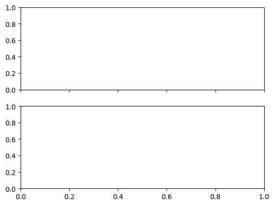​    


Si le code est exécuté, il est possible d'avoir différents subplots qui partageront la même abscisse. Cependant, si le code est exécuté tel quel, une erreur sera obtenue, indiquant que le **tableau Numpy n'a pas d'attributs plot**. C'est parce que lorsqu'on crée des subplots et qu'ils sont enregistrés dans la variable $ax$, **ax n'est pas un objet mais en réalité un tableau numpy qui contiendra les différents axes.**

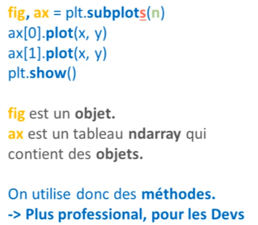

En vérifiant le type de la variable $ax$, on constate qu'elle contient un numpy array. En regardant la dimension de $ax$, on constate que c'est un tableau de dimension 2. On retrouve alors dans ce tableau le premier axe en index 0 et le deuxième axe en index 1. Ainsi, lorsque l'on souhaite réaliser plusieurs subplots, on fait $ax[0].plot$ pour certaines choses, puis $ax[1].plot$ pour, par exemple, $X$ et $sin(X)$.


```python
fig, ax = plt.subplots(2, 1, sharex=True)
ax[0].plot(X, Y)
ax[1].plot(X, np.sin(X))
plt.show()
```

​    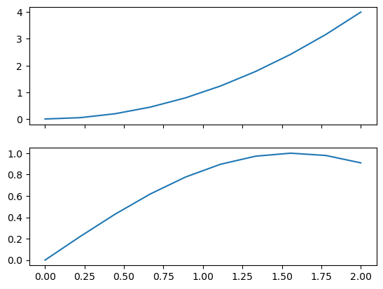​    


Ainsi, dans le code, on constate que l'on a une seule abscisse partagée pour les deux graphiques. Sur le graphique du haut, l'abscisse n'est pas présente simplement parce que sharex a été défini sur True.

Voilà, c'est absolument tout ce qu'il faut savoir pour ne pas faire d'erreur lors de l'écriture de code avec Matplotlib. Il est important de bien retenir ce cycle de vie dans lequel une figure est créée, puis les subplots sont créés. À l'intérieur du subplot, tout ce qui est souhaité sur un seul graphique est défini : le titre, les axes, la légende, les courbes, etc. En ce qui concerne le style, il est assez simple. Il suffit de retenir comment modifier la couleur ou simplement comment changer l'épaisseur de la ligne. Ensuite, il vaut mieux consacrer du temps à la résolution de problèmes de machine learning.

## 1.7 BILAN et EXERCICE Matplotlib subplots TRES UTILE !

Maintenant, l'exercice pour cette leçon serait de créer une fonction graphique qui permet de tracer sur une seule figure plusieurs graphiques correspondant à des données récoltées lors de plusieurs expériences. Par exemple, on pourrait avoir un dictionnaire nommé "dataset", créé avec la méthode des dictionnaires. Chaque clé dans ce dictionnaire serait une expérience, et chaque valeur associée à une clé serait simplement un tableau de valeurs. Disons que chaque expérience collecte 100 points. Cette association pourrait être répétée, disons, quatre fois, pour obtenir quatre expériences.


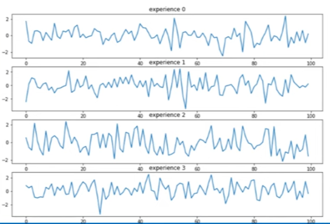

Pour créer une telle fonction, il faut utiliser une boucle $for$ et la fonction $subplot$ qui permet de créer un mini-graphique sur une grande figure à chaque itération.

Il faut donc avoir autant de sous-graphiques que d'expériences dans le dictionnaire, c'est-à-dire qu'il faut mesurer la longueur du dictionnaire. Après cela, il faut commencer par créer une figure d'une certaine taille et, dans cette figure, créer différents sous-graphiques à l'aide d'une boucle $for$.

Pour faire cela étape par étape, il faut d'abord créer les sous-graphiques. Il y en aura autant que le nombre d'expériences, tous disposés sur une seule ligne, puisqu'il y a autant de sous-graphiques que la longueur du dictionnaire, et sur une seule colonne. Ensuite, il faut traiter chaque sous-graphique un par un.

Pour faire cela, dans la boucle $for$, il faut obtenir à la fois le nombre d'expériences et le contenu du dictionnaire. Pour cela, il faut utiliser la fonction $zip$, qui permet d'itérer à travers deux structures de données en parallèle. Donc, dans la boucle $for$, il faut passer le dictionnaire pour obtenir les différentes clés, et aller de 1 à $n+1$ pour les valeurs, car la position zéro n'existe pas.


```python
dataset ={f"experience {i}": np.random.randn(100) for i in range(4)}
```

Une fois la boucle $for$ prête, il faut placer le sous-graphique à l'intérieur et, dans le sous-graphique, retirer les données qui se situent à la clé courante. On pourrait également ajouter un titre au graphique en utilisant la clé. On pourrait ensuite ajouter des abscisses, des légendes, etc., mais l'exercice se termine ici.

Il suffit de terminer en écrivant $plt.show()$ et le résultat de ce code donne une figure sur laquelle les différentes expériences sont affichées. Ce code est extrêmement utile et flexible. Si on passe à six expériences, par exemple, six graphiques seront affichés. Si les graphiques commencent à être trop petits, on peut augmenter la taille de la figure.

```python
def graphique(data):
    n = len(data)
    plt.figure(figsize=(12,8))
    for k, i in zip(data.keys(), range(1, n + 1)):
        plt.subplot(n, 1, i)
        plt.plot(data[k])
        plt.title(k)
    plt.show()  
```


```python
graphique(dataset)
```

​    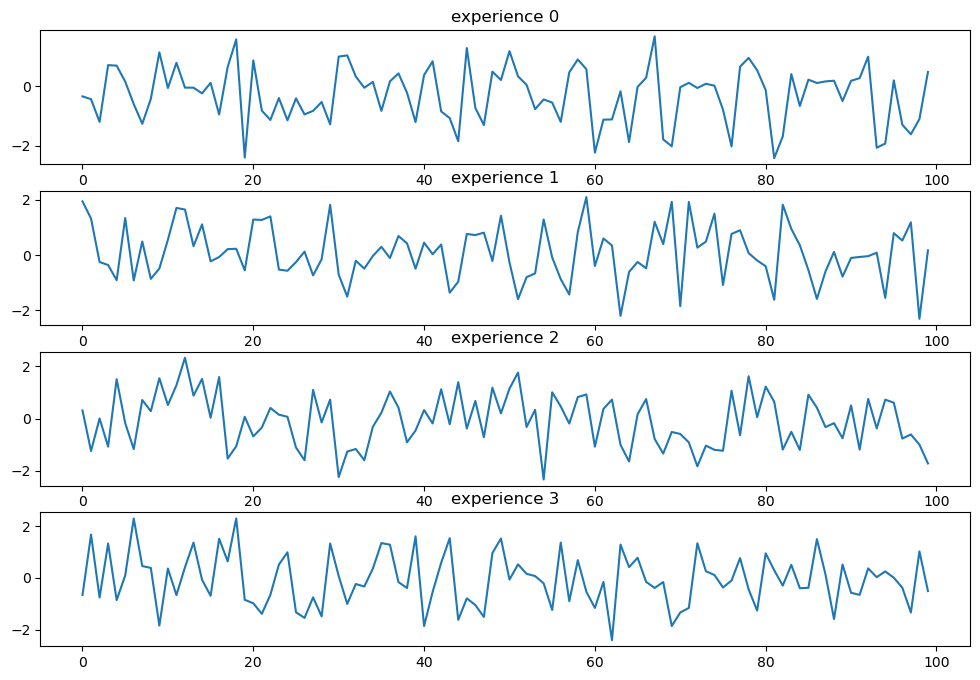​    


Ce qui est encore mieux, c'est que si chaque ensemble de données contient en réalité plusieurs variables, disons trois variables différentes, ces trois signaux seront affichés sur chacune des expériences. C'est là que ce code commence vraiment à être très puissant et très intéressant.


```python
dataset ={f"experience {i}": np.random.randn(100, 3) for i in range(4)}
```


```python
graphique(dataset)
```

  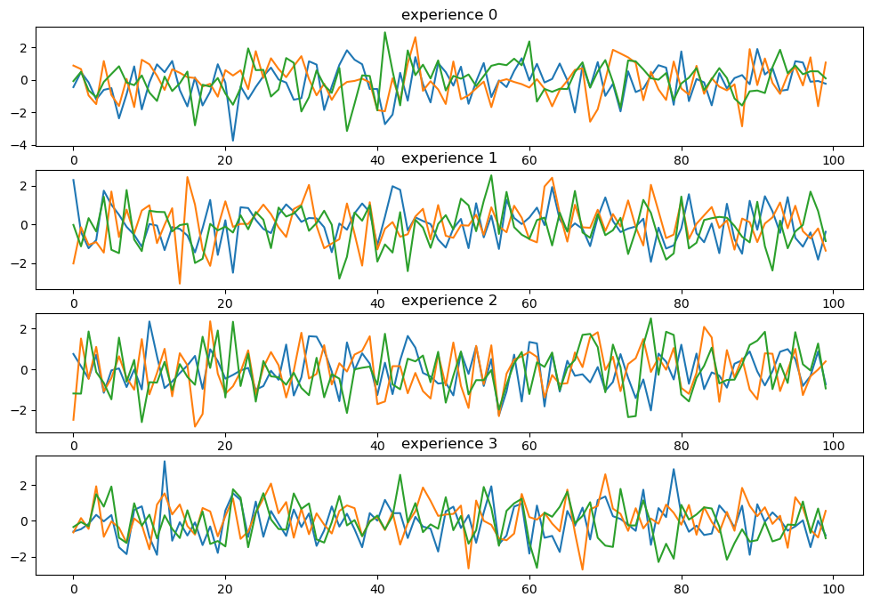​    


C'est la fin de ce classement des 5 graphiques les plus utiles avec Matplotlib pour faire du machine learning. 

L'exercice pour cette leçon serait d'utiliser ce code, de le transformer un peu, afin d'afficher sur une seule figure les différentes variables pour le dataset de l'iris. 

Il est conseillé d'utiliser uniquement les **subplots** à l'intérieur d'une boucle for pour afficher sur un seul et même graphique toutes les différentes variables qu'il pourrait y avoir dans un Dataset. 

Pour faire ça, on commence par enregistrer dans une variable $n$ le nombre de colonnes qu'il y a dans $X$, donc la dimension 1, parce que le nombre de colonnes c'est le nombre de variables.


```python
import numpy as np
import matplotlib.pyplot as plt
from sklearn.datasets import load_iris

iris = load_iris()

X = iris.data
y = iris.target

names =list(iris.target_names)

print(f'X contient {X.shape[0]} exemples et {X.shape[1]} variables')
print(f'il y {np.unique(y).size} classes')
```

    X contient 150 exemples et 4 variables
    il y 3 classes


Ensuite une figure est créée, puis une boucle for est écrite, qui va faire une itération sur le nombre $n$, c'est à dire le nombre de variables. A l'intérieur de ça, $plt.subplot$ est écrit et qu'il est voulu $n$ divisé par deux lignes et n divisé par deux colonnes, et deux fois le symbole division est écrit pour être sûr de tomber sur un nombre entier. 

Enfin, à l'intérieur du subplot, à chaque fois il est écrit qu'il est travaille avec le graphique $i+1$ tout simplement parce que dans ce $range(n)$ on commence à 0, sauf que le graphique 0 il n'existe pas, ça commence toujours avec le graphique 1. C'est pour ça qu'on écrit $i+1$. 

Ensuite, à chaque fois que $plt.scatter()$ est utilisé, par exemple plot en abscisse 0 est utilisé, mais il serait possible d'adapter et mettre autre chose en abscisses, et $i$ pour les ordonner. Donc voilà, c'est aussi simple que ça, après des axes sont ajoutés.


```python
n = X.shape[1]
plt.figure(figsize=(12,8))

for i in range(n):
    plt.subplot(n//2, n//2, i+1)
    plt.scatter(X[:,0], X[:,i],c=y)
    plt.xlabel('0')
    plt.ylabel(i)
plt.show()
```

​    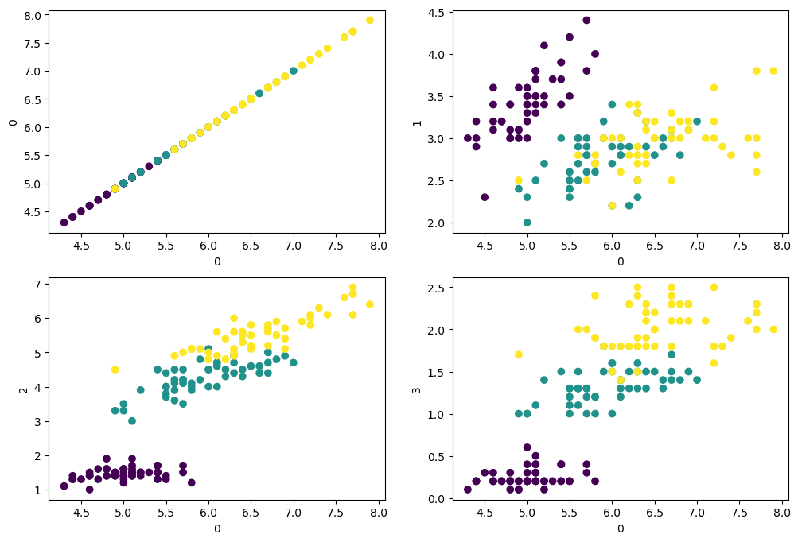​    


Comment rajouter une légende lorsqu'on a $scatter$ et qu'on a différentes catégories à l'intérieur? On peut faire une $colorbar$ dans laquelle notre échelle, c'est à dire $ticks$, vont être la liste des différents éléments qui apparaissent une seule fois à l'intérieur de y, donc, on utilise la fonction $np.unique(y)$ qu'on avait vu dans les leçons Numpy. 

```python
for i in range(n):
    plt.subplot(n//2, n//2, i+1)
    plt.scatter(X[:,0], X[:,i],c=y)
    plt.xlabel('0')
    plt.ylabel(i)
    plt.colorbar(ticks=list(np.unique(y)))
plt.show()
```

​    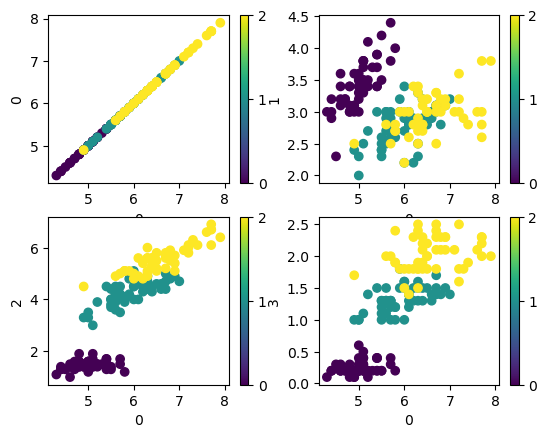​    


# 2. Matplotlib : Les graphiques importants

## 2.1 $5^{ème}$ position : Scatter

Dans cette leçon, l'idée est de découvrir le top 5 des graphiques les plus utiles avec Matplotlib pour faire des mathématiques appliquées.

En cinquième position, se trouve le graphique de classification avec plt.scatter. 

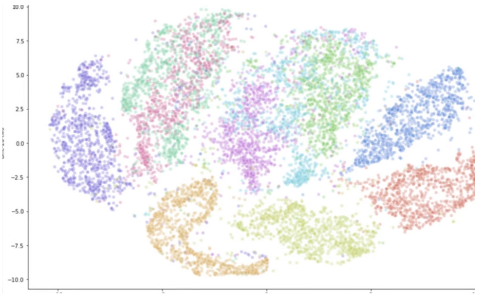

Dans le domaine du machine learning, pratiquement la moitié des problèmes travaillés sont des problèmes de classification. 

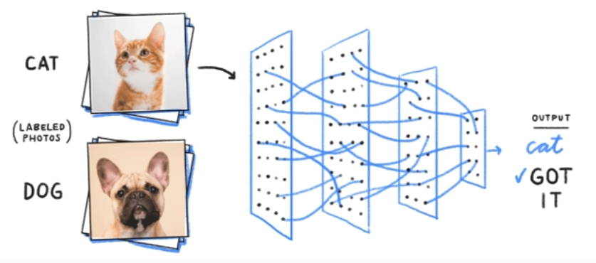

Par exemple, le souhait peut être de classer un e-mail en tant que spam ou non-spam, en fonction de plusieurs attributs comme le nombre de fautes d'orthographe ou le nombre de liens internet qu'il contient.


Dans ce genre de problèmes, deux classes se distinguent généralement : une classe spam et une classe non-spam. Pour représenter un tel dataset, le graphique $plt.scatter$ est l'un des meilleurs choix possible.


Dans cette leçon, l'objectif est de montrer comment réaliser un tel graphique avec un dataset très connu, celui des fleurs d'Iris. Ce dataset contient 150 exemples de fleurs d'Iris répartis en trois classes, avec quatre variables disponibles pour prédire la classe : la longueur et la largeur du pétale de la fleur et la longueur et la largeur du sépale de la fleur.


Le code permettant de charger ce dataset est issu du package $\text{Scikit-learn}$, ce petit code fonctionne de la façon suivante : à l'intérieur de $\text{Scikit-learn}$, un ensemble de datasets est disponible, y compris le dataset des fleurs d'Iris. Ce dataset contient des données correspondant aux variables (la longueur du pétale, longueur du sépale etc.) et une cible ("target"), représentant les différentes classes (classe 0, 1 ou 2).


```python
%matplotlib inline

import numpy as np
import matplotlib.pyplot as plt
from sklearn.datasets import load_iris

iris = load_iris()


X = iris.data
Y = iris.target

names =list(iris.target_names)

print(f'X contient {X.shape[0]} exemples et {X.shape[1]} variables')
print(f'il Y {np.unique(Y).size} classes')
```

    X contient 150 exemples et 4 variables
    il Y 3 classes


Ces deux tableaux sont enregistrés dans un tableau $X$ et un tableau $Y$, qui serviront à créer des graphiques avec $plt.scatter$. $X$ est un tableau de 150 lignes et quatre colonnes, et $Y$ contient 150 exemples, tous représentés par les chiffres 0, 1 ou 2, qui représentent les trois classes dans le problème.


```python
X
```


    array([[5.1, 3.5, 1.4, 0.2],
           [4.9, 3. , 1.4, 0.2],
           [4.7, 3.2, 1.3, 0.2],
           [4.6, 3.1, 1.5, 0.2],
           [5. , 3.6, 1.4, 0.2],
           [5.4, 3.9, 1.7, 0.4],
           [4.6, 3.4, 1.4, 0.3],
           [5. , 3.4, 1.5, 0.2],
           [4.4, 2.9, 1.4, 0.2],
           [4.9, 3.1, 1.5, 0.1],
           [5.4, 3.7, 1.5, 0.2],
           [4.8, 3.4, 1.6, 0.2],
           [4.8, 3. , 1.4, 0.1],
           [4.3, 3. , 1.1, 0.1],
           [5.8, 4. , 1.2, 0.2],
           [5.7, 4.4, 1.5, 0.4],
           [5.4, 3.9, 1.3, 0.4],
           [5.1, 3.5, 1.4, 0.3],
           [5.7, 3.8, 1.7, 0.3],
           [5.1, 3.8, 1.5, 0.3],
           [5.4, 3.4, 1.7, 0.2],
           [5.1, 3.7, 1.5, 0.4],
           [4.6, 3.6, 1. , 0.2],
           [5.1, 3.3, 1.7, 0.5],
           [4.8, 3.4, 1.9, 0.2],
           [5. , 3. , 1.6, 0.2],
           [5. , 3.4, 1.6, 0.4],
           [5.2, 3.5, 1.5, 0.2],
           [5.2, 3.4, 1.4, 0.2],
           [4.7, 3.2, 1.6, 0.2],
           [4.8, 3.1, 1.6, 0.2],
           [5.4, 3.4, 1.5, 0.4],
           [5.2, 4.1, 1.5, 0.1],
           [5.5, 4.2, 1.4, 0.2],
           [4.9, 3.1, 1.5, 0.2],
           [5. , 3.2, 1.2, 0.2],
           [5.5, 3.5, 1.3, 0.2],
           [4.9, 3.6, 1.4, 0.1],
           [4.4, 3. , 1.3, 0.2],
           [5.1, 3.4, 1.5, 0.2],
           [5. , 3.5, 1.3, 0.3],
           [4.5, 2.3, 1.3, 0.3],
           [4.4, 3.2, 1.3, 0.2],
           [5. , 3.5, 1.6, 0.6],
           [5.1, 3.8, 1.9, 0.4],
           [4.8, 3. , 1.4, 0.3],
           [5.1, 3.8, 1.6, 0.2],
           [4.6, 3.2, 1.4, 0.2],
           [5.3, 3.7, 1.5, 0.2],
           [5. , 3.3, 1.4, 0.2],
           [7. , 3.2, 4.7, 1.4],
           [6.4, 3.2, 4.5, 1.5],
           [6.9, 3.1, 4.9, 1.5],
           [5.5, 2.3, 4. , 1.3],
           [6.5, 2.8, 4.6, 1.5],
           [5.7, 2.8, 4.5, 1.3],
           [6.3, 3.3, 4.7, 1.6],
           [4.9, 2.4, 3.3, 1. ],
           [6.6, 2.9, 4.6, 1.3],
           [5.2, 2.7, 3.9, 1.4],
           [5. , 2. , 3.5, 1. ],
           [5.9, 3. , 4.2, 1.5],
           [6. , 2.2, 4. , 1. ],
           [6.1, 2.9, 4.7, 1.4],
           [5.6, 2.9, 3.6, 1.3],
           [6.7, 3.1, 4.4, 1.4],
           [5.6, 3. , 4.5, 1.5],
           [5.8, 2.7, 4.1, 1. ],
           [6.2, 2.2, 4.5, 1.5],
           [5.6, 2.5, 3.9, 1.1],
           [5.9, 3.2, 4.8, 1.8],
           [6.1, 2.8, 4. , 1.3],
           [6.3, 2.5, 4.9, 1.5],
           [6.1, 2.8, 4.7, 1.2],
           [6.4, 2.9, 4.3, 1.3],
           [6.6, 3. , 4.4, 1.4],
           [6.8, 2.8, 4.8, 1.4],
           [6.7, 3. , 5. , 1.7],
           [6. , 2.9, 4.5, 1.5],
           [5.7, 2.6, 3.5, 1. ],
           [5.5, 2.4, 3.8, 1.1],
           [5.5, 2.4, 3.7, 1. ],
           [5.8, 2.7, 3.9, 1.2],
           [6. , 2.7, 5.1, 1.6],
           [5.4, 3. , 4.5, 1.5],
           [6. , 3.4, 4.5, 1.6],
           [6.7, 3.1, 4.7, 1.5],
           [6.3, 2.3, 4.4, 1.3],
           [5.6, 3. , 4.1, 1.3],
           [5.5, 2.5, 4. , 1.3],
           [5.5, 2.6, 4.4, 1.2],
           [6.1, 3. , 4.6, 1.4],
           [5.8, 2.6, 4. , 1.2],
           [5. , 2.3, 3.3, 1. ],
           [5.6, 2.7, 4.2, 1.3],
           [5.7, 3. , 4.2, 1.2],
           [5.7, 2.9, 4.2, 1.3],
           [6.2, 2.9, 4.3, 1.3],
           [5.1, 2.5, 3. , 1.1],
           [5.7, 2.8, 4.1, 1.3],
           [6.3, 3.3, 6. , 2.5],
           [5.8, 2.7, 5.1, 1.9],
           [7.1, 3. , 5.9, 2.1],
           [6.3, 2.9, 5.6, 1.8],
           [6.5, 3. , 5.8, 2.2],
           [7.6, 3. , 6.6, 2.1],
           [4.9, 2.5, 4.5, 1.7],
           [7.3, 2.9, 6.3, 1.8],
           [6.7, 2.5, 5.8, 1.8],
           [7.2, 3.6, 6.1, 2.5],
           [6.5, 3.2, 5.1, 2. ],
           [6.4, 2.7, 5.3, 1.9],
           [6.8, 3. , 5.5, 2.1],
           [5.7, 2.5, 5. , 2. ],
           [5.8, 2.8, 5.1, 2.4],
           [6.4, 3.2, 5.3, 2.3],
           [6.5, 3. , 5.5, 1.8],
           [7.7, 3.8, 6.7, 2.2],
           [7.7, 2.6, 6.9, 2.3],
           [6. , 2.2, 5. , 1.5],
           [6.9, 3.2, 5.7, 2.3],
           [5.6, 2.8, 4.9, 2. ],
           [7.7, 2.8, 6.7, 2. ],
           [6.3, 2.7, 4.9, 1.8],
           [6.7, 3.3, 5.7, 2.1],
           [7.2, 3.2, 6. , 1.8],
           [6.2, 2.8, 4.8, 1.8],
           [6.1, 3. , 4.9, 1.8],
           [6.4, 2.8, 5.6, 2.1],
           [7.2, 3. , 5.8, 1.6],
           [7.4, 2.8, 6.1, 1.9],
           [7.9, 3.8, 6.4, 2. ],
           [6.4, 2.8, 5.6, 2.2],
           [6.3, 2.8, 5.1, 1.5],
           [6.1, 2.6, 5.6, 1.4],
           [7.7, 3. , 6.1, 2.3],
           [6.3, 3.4, 5.6, 2.4],
           [6.4, 3.1, 5.5, 1.8],
           [6. , 3. , 4.8, 1.8],
           [6.9, 3.1, 5.4, 2.1],
           [6.7, 3.1, 5.6, 2.4],
           [6.9, 3.1, 5.1, 2.3],
           [5.8, 2.7, 5.1, 1.9],
           [6.8, 3.2, 5.9, 2.3],
           [6.7, 3.3, 5.7, 2.5],
           [6.7, 3. , 5.2, 2.3],
           [6.3, 2.5, 5. , 1.9],
           [6.5, 3. , 5.2, 2. ],
           [6.2, 3.4, 5.4, 2.3],
           [5.9, 3. , 5.1, 1.8]])


```python
Y
```


    array([0, 0, 0, 0, 0, 0, 0, 0, 0, 0, 0, 0, 0, 0, 0, 0, 0, 0, 0, 0, 0, 0,
           0, 0, 0, 0, 0, 0, 0, 0, 0, 0, 0, 0, 0, 0, 0, 0, 0, 0, 0, 0, 0, 0,
           0, 0, 0, 0, 0, 0, 1, 1, 1, 1, 1, 1, 1, 1, 1, 1, 1, 1, 1, 1, 1, 1,
           1, 1, 1, 1, 1, 1, 1, 1, 1, 1, 1, 1, 1, 1, 1, 1, 1, 1, 1, 1, 1, 1,
           1, 1, 1, 1, 1, 1, 1, 1, 1, 1, 1, 1, 2, 2, 2, 2, 2, 2, 2, 2, 2, 2,
           2, 2, 2, 2, 2, 2, 2, 2, 2, 2, 2, 2, 2, 2, 2, 2, 2, 2, 2, 2, 2, 2,
           2, 2, 2, 2, 2, 2, 2, 2, 2, 2, 2, 2, 2, 2, 2, 2, 2, 2])

L'utilisation de $plt.scatter$ est simple : deux variables parmi les quatre disponibles dans le problème sont passées en abscisses et en ordonnées. Par exemple, la première et la deuxième variables peuvent être choisies. 


```python
plt.scatter(X[:, 0], X[:, 1])
```


    <matplotlib.collections.PathCollection at 0x202b407eb20>

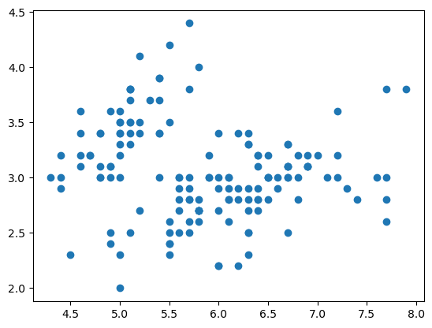
​    


Ensuite, pour colorer les points en fonction de la classe, il suffit d'écrire $c=y$, c étant le paramètre qui définit la couleur, et $y$ étant les chiffres 0, 1 ou 2.


```python
plt.scatter(X[:, 0], X[:, 1], c=y)
```


    <matplotlib.collections.PathCollection at 0x202b4100a30>

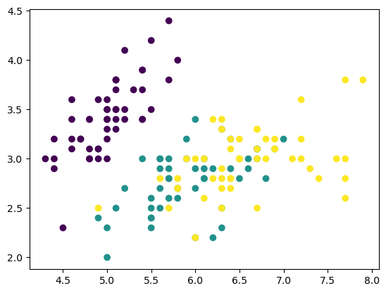​    


Ainsi, trois couleurs différentes apparaissent et permettent de distinguer les différentes classes réparties selon deux variables, la variable $X_0$ et la variable $X_1$. Ces deux variables correspondent respectivement à la longueur et la largeur des sépales de la fleur. En ajoutant ces deux variables sur les axes, comme présenté dans la leçon précédente, un graphique très instructif se dessine, qui aide à comprendre le problème à résoudre.


```python
plt.scatter(X[:, 0], X[:, 1], c=y)
plt.xlabel('longueur sépal')
plt.ylabel('largeur sépal')
```


    Text(0, 0.5, 'largeur sépal')

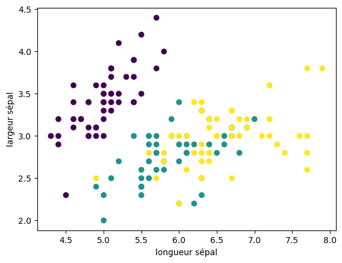​    


Évidemment, une des limites de ce graphique est qu'il ne permet de représenter que deux des quatre variables disponibles. Cependant, une technique va être montrée à la fin de cette leçon, qui permet de représenter toutes les variables dans une seule figure. Il est donc recommandé de rester jusqu'à la fin de cette leçon, car cette technique s'avère être extrêmement utile.

Pour conclure avec le graphique $plt.scatter$, deux astuces sont partagées. La première concerne l'utilisation du paramètre $alpha$ qui permet de contrôler la transparence de chaque point du graphique. La deuxième astuce concerne l'utilisation du paramètre $s$ qui permet de contrôler la taille des points. En écrivant $s=100$ par exemple, la taille des points augmente.


```python
plt.scatter(X[:, 0], X[:, 1], c=y, alpha=0.5,  s=100)
plt.xlabel('longueur sépal')
plt.ylabel('largeur sépal')
```


    Text(0, 0.5, 'largeur sépal')

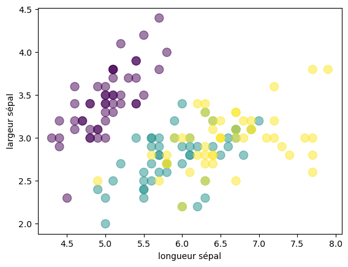​    


Ce qui est vraiment intéressant, c'est de contrôler la taille des points en fonction d'une des variables du problème. On peut, par exemple, prendre la variable 3 dans le dataset. Ainsi, tous les points n'ont pas la même taille : plus ils sont gros, plus le pétale est long, et plus ils sont petits, plus le pétale est court.


```python
plt.scatter(X[:, 0], X[:, 1], c=y, alpha=0.5,  s=X[:, 2]*100)
plt.xlabel('longueur sépal')
plt.ylabel('largeur sépal')
```


    Text(0, 0.5, 'largeur sépal')


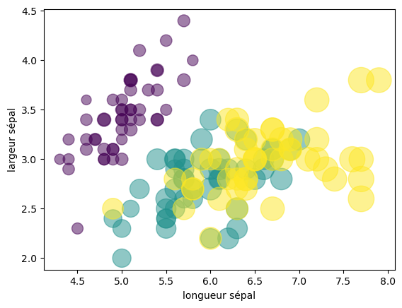​    


## 2.2 $4^{ème}$ position : graphique 3D

En quatrième position du classement se trouve le graphique 3D. 

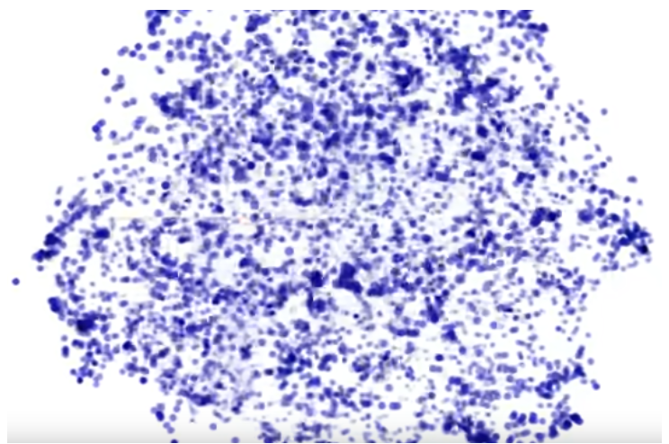


Ce type de graphique provient de $mpl\_toolkits$, qui est l'un des seuls packages $Matplotlib$ gratuits. Il permet de créer des graphiques en trois dimensions, ce qui peut être extrêmement utile pour visualiser plusieurs variables en une seule fois sur un même graphique.

Pour faire ce genre de graphiques, il faut commencer par charger les graphiques 3D qui se trouvent dans $mpl_toolkits$. Habituellement, on écrit 


```python
%matplotlib inline
from mpl_toolkits.mplot3d import Axes3D
```

Une fois ce module chargé, il est nécessaire de créer un objet "Axes" avec la fonction "Axes" qui se trouve dans plt, et de le faire en 3D en écrivant


```python
ax = plt.axes(projection='3d')
```

​    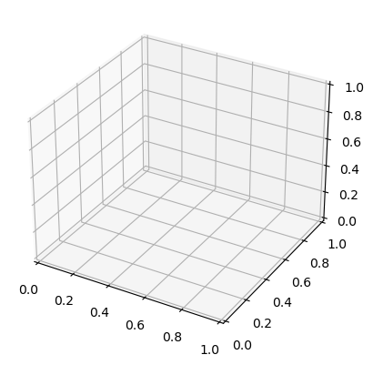​    


En écrivant cette ligne, on crée un objet "Axes" sur lequel on va pouvoir travailler. Il faut comprendre que lorsqu'on crée des graphiques 3D avec Matplotlib, on doit utiliser la programmation orientée objet. Cependant, il n'y a pas de quoi 
s'inquiéter car ce n'est vraiment pas compliqué. 

Il suffit simplement d'écrire $ax.scatter$ et à l'intérieur de ce scatter, au lieu d'écrire deux variables $(x_0, x_1)$, on en écrit trois $(x_0, x_1, x_2)$. Ainsi, on aura trois variables.

En affichant cela, comme précédemment, on obtient un nuage de points bleus. Ensuite, en faisant $c=y$, on obtient un nuage de points avec plusieurs couleurs. Ce graphique peut être visualisé en 3D, permettant de se déplacer à l'intérieur, de zoomer, ou de se déplacer, que ce soit dans Spider ou PyCharm, mais aussi dans Jupyter si le code est commencé par "%matplotlib".


```python
from mpl_toolkits.mplot3d import Axes3D
```


```python
ax = plt.axes(projection='3d')
ax.scatter(X[:, 0], X[:, 1], X[:, 2], c=y)
```


    <mpl_toolkits.mplot3d.art3d.Path3DCollection at 0x202b48fd880>

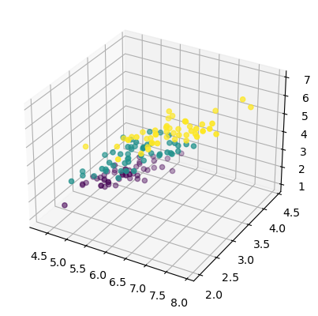​    


Une autre utilisation intéressante des graphiques 3D est de visualiser des surfaces et des fonctions mathématiques modélisées. 

Par exemple, on pourrait créer une fonction $f(x,y)$ qui est égale à $sin(x) + cos(x+y)$. Cette fonction est créée avec $lambda$, qui est notre générateur de fonctions anonymes dans Python.


```python
import numpy as np
import matplotlib.pyplot as plt
f = lambda X,Yy: np.sin(X) + np.cos(X + Y)
```

Pour observer $f(x,y)$ en fonction de $x$ et de $y$ dans un graphique 3D, il faut d'abord créer deux vecteurs $np_x$ et $np_y$ allant de 0 à 5 pour les deux. 

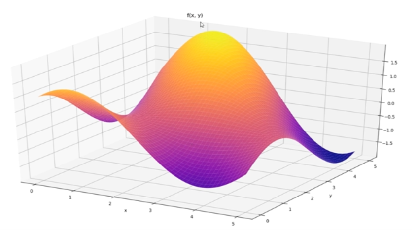

Ensuite, on doit créer une grille en utilisant la fonction $np.meshgrid$, qui permet de créer une grille à partir de deux axes x et y.


Ensuite, on injecte les variables $x$ et $y$ dans notre fonction $f$, ce qui donne un résultat $z$. 


```python
X = np.linspace(0, 5, 100)
Y = np.linspace(0, 5,100)
X,Y = np.meshgrid(X, Y)

Z = f (X , Y)
```

Maintenant que $z$ est obtenu, on peut vérifier par exemple les dimensions. On a 200 lignes et autant de colonnes, ce qui nous permet de tracer quelque chose sur tout cet espace.


```python
Z.shape
```


    (100, 100)

Pour visualiser tout cela, comme précédemment, on commence par créer un objet "Axes" en projection 3D. Ensuite, on fait $ax.plot\_surface$ et à l'intérieur de cela, on fait passer les variables $x$, $y$, et notre variable $z$. On peut éventuellement choisir une couleur pour notre surface. Le résultat est alors la courbe que l'on a vue précédemment.


```python
ax = plt.axes(projection='3d')
ax.plot_surface(X, Y, Z, cmap='plasma')
```


    <mpl_toolkits.mplot3d.art3d.Poly3DCollection at 0x202b111a940>

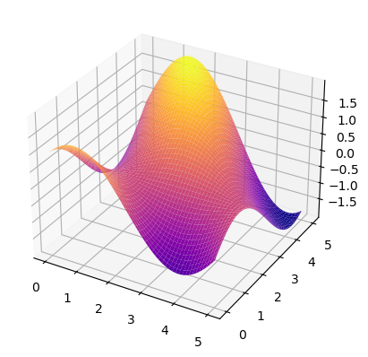
​    


## 2.3 $3^{ème}$ position : Histogramme

En troisième position de notre classement, on retrouve l'histogramme. Ce graphique est indispensable à connaître en machine learning et en data science. Il nous permet de voir la distribution des données avec lesquelles on travaille. 

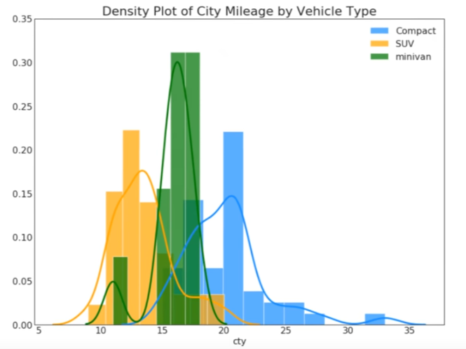

Il est important de comprendre si nos données suivent une distribution normale ou non, si la distribution est symétrique ou asymétrique, ou de visualiser où se situe la moyenne.

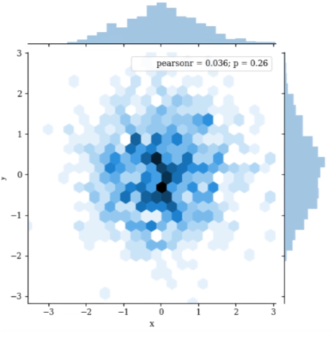

C'est très important en machine learning. Par exemple, pour reprendre notre dataset avec les fleurs d'iris, on peut décider de visualiser comment sont distribuées nos quatre variables. 
Donc, pour ça, on va faire passer dans la fonction $hist()$ de $matplotlib$ une des quatre variables que l'on a.


```python
%matplotlib inline

import numpy as np
import matplotlib.pyplot as plt
from sklearn.datasets import load_iris

iris = load_iris()

X = iris.data
Y = iris.target

names =list(iris.target_names)

print(f'X contient {X.shape[0]} exemples et {X.shape[1]} variables')
print(f'il Y {np.unique(y).size} classes')

plt.hist(X[:,0]);
```

    X contient 150 exemples et 4 variables
    il Y 3 classes


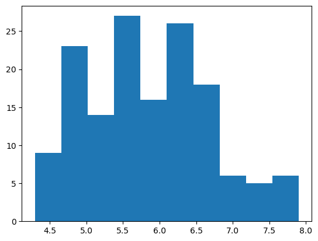    


Ceci nous donne la distribution pour la variable 0 pour toutes nos fleurs d'iris sont représentées. 

Sur l'axe des abscisses, on a toutes les valeurs que peuvent prendre la longueur d'un sépale dans notre dataset d'iris. Le sépale le plus petit mesure environ 4,5 cm et le sépale le plus long environ 8 cm. 

Sur l'axe des ordonnées, on a le nombre d'apparitions pour chacune de ces catégories. Par exemple, dans notre dataset, il y a environ 25 fois un sépale qui mesure aux alentours de 5,5 cm.

À l'intérieur de cette fonction histogramme, on peut choisir de modifier un paramètre qui s'appelle $bins$. Ce paramètre détermine le nombre de sections que l'on désire avoir dans notre histogramme. Par défaut, il semble qu'on en ait dix, mais on peut choisir d'en avoir 30 par exemple. 


```python
plt.hist(X[:,0], bins=30)
```


    (array([ 4.,  1.,  4.,  2.,  5., 16.,  9.,  4.,  1.,  6., 13.,  8.,  7.,
             3.,  6., 10.,  9.,  7.,  5.,  2., 11.,  4.,  1.,  1.,  4.,  1.,
             0.,  1.,  4.,  1.]),
     array([4.3 , 4.42, 4.54, 4.66, 4.78, 4.9 , 5.02, 5.14, 5.26, 5.38, 5.5 ,
            5.62, 5.74, 5.86, 5.98, 6.1 , 6.22, 6.34, 6.46, 6.58, 6.7 , 6.82,
            6.94, 7.06, 7.18, 7.3 , 7.42, 7.54, 7.66, 7.78, 7.9 ]),
     <BarContainer object of 30 artists>)

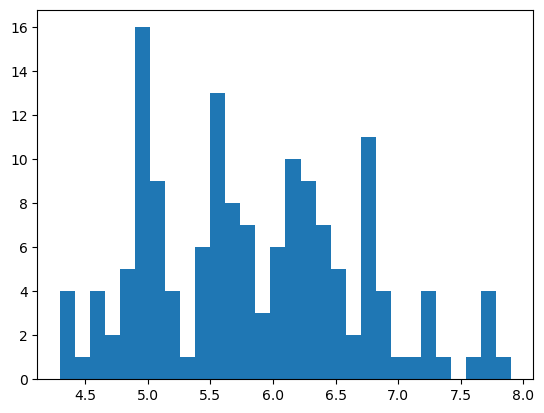​    


Si, à l'inverse, on crée un histogramme qui contient une seule colonne, ça n'a aucun intérêt.


```python
plt.hist(X[:,0], bins=1)
```


    (array([150.]), array([4.3, 7.9]), <BarContainer object of 1 artists>)

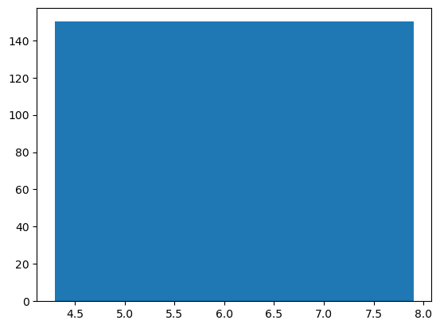​    


Mais c'est juste pour montrer que le nombre total d'éléments qui tombe dans une seule colonne est de 150, tout simplement parce qu'on a 150 exemples dans notre dataset de fleurs d'iris.

Maintenant, sur une même figure, on peut créer deux histogrammes en même temps : un pour notre variable 0 et un pour notre variable 1. 


```python
plt.hist(X[:,0], bins=20)
plt.hist(X[:,1], bins=20)
```


    (array([ 1.,  3.,  4.,  3.,  8., 14., 14., 10., 26., 11., 19., 12.,  6.,
             4.,  9.,  2.,  1.,  1.,  1.,  1.]),
     array([2.  , 2.12, 2.24, 2.36, 2.48, 2.6 , 2.72, 2.84, 2.96, 3.08, 3.2 ,
            3.32, 3.44, 3.56, 3.68, 3.8 , 3.92, 4.04, 4.16, 4.28, 4.4 ]),
     <BarContainer object of 20 artists>)

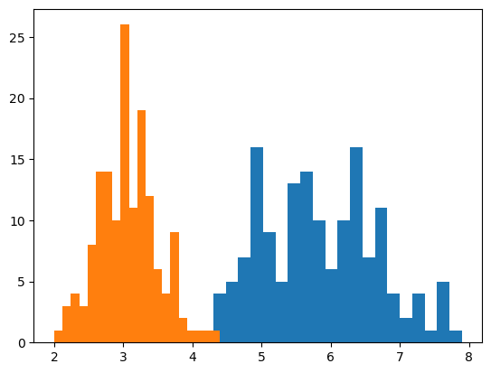​    


Mais les possibilités avec matplotlib ne s'arrêtent pas là. On peut également tracer des histogrammes en 2D pour visualiser la distribution en fonction de deux variables. Pour ça, il suffit d'utiliser $plt.hist2d()$.

À l'intérieur de ce graphique, on va tout simplement faire passer deux variables, par exemple notre variable X_0 et notre variable X_1. Afin de bien comprendre cet histogramme, n'oublions pas de rajouter des titres sur nos différents axes. 

On va aussi rajouter une "colorbar", une sorte de légende qui indique à quoi correspondent les différentes couleurs. Les couleurs jaunes représentent les fréquences d'apparition les plus élevées. Pour les rendre un peu plus attirants tous ces graphiques et bien on peut leur ajouter une couleur $cmap=\text{'Blues'}$.


```python
plt.hist2d(X[:,0], X[:,1], cmap='Blues')
plt.xlabel('longueur sépal')
plt.ylabel('largeur sépal')

plt.colorbar()
```


    <matplotlib.colorbar.Colorbar at 0x202b3e9f700>

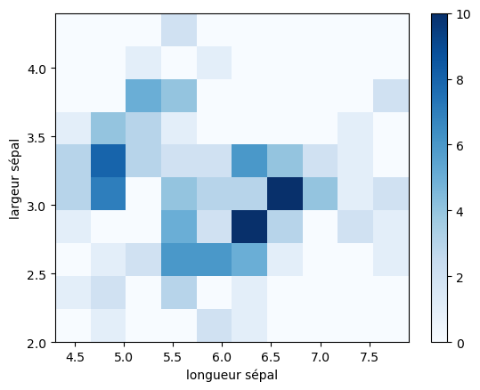​    


Pour finir sur les histogrammes, il y a une dernière utilité super intéressante, c'est lorsqu'on les utilise pour faire l'analyse d'une image. Typiquement, pour une image en noir et blanc, on peut créer un histogramme où $bins$ est égal à 255. 

Pourquoi 255 ? Parce qu'une image comprend généralement 255 valeurs de pixels : 0 représentant le noir et 255 le blanc. Si notre image est importée depuis $SciPy$ et enregistrée dans un tableau $Numpy$ appelé $face$. 


```python
import matplotlib.pyplot as plt
from scipy import datasets

# Charger l'image en niveaux de gris
face = datasets.face(gray=True)

# Afficher l'image
plt.imshow(face, cmap='gray')
plt.show()
```

    C:\Users\romeofr\anaconda3\lib\site-packages\paramiko\transport.py:219: CryptographyDeprecationWarning: Blowfish has been deprecated
      "class": algorithms.Blowfish,


    


On peut en faire l'analyse en observant la fréquence d'apparition des différentes couleurs de pixels, en utilisant la fonction $ravel()$. On observe qu'il y a une majorité de pixels entre 100 et 150, très peu de pixels clairs, et pas mal de pixels foncés.


```python
import matplotlib.pyplot as plt
from scipy import datasets

# Charger l'image en niveaux de gris
face = datasets.face(gray=True)

# Afficher l'histogramme pour la première colonne de l'image
plt.hist(face[:,0].ravel(), bins=255, range=(0, 256))
plt.title("Histogramme pour la première colonne")
plt.show()

# Afficher l'histogramme pour la deuxième colonne de l'image
plt.hist(face[:,1].ravel(), bins=255, range=(0, 256))
plt.title("Histogramme pour la deuxième colonne")
plt.show()

plt.hist(face.ravel(), bins=255, range=(0, 256))
plt.title("Histogramme pour les deux colonnes")
plt.show()
```

​    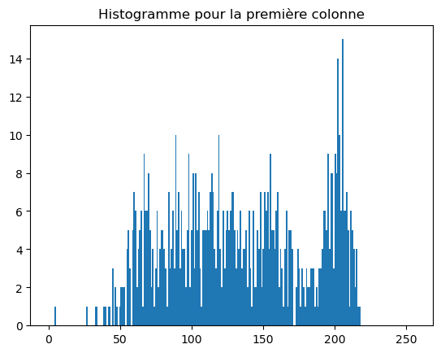
​    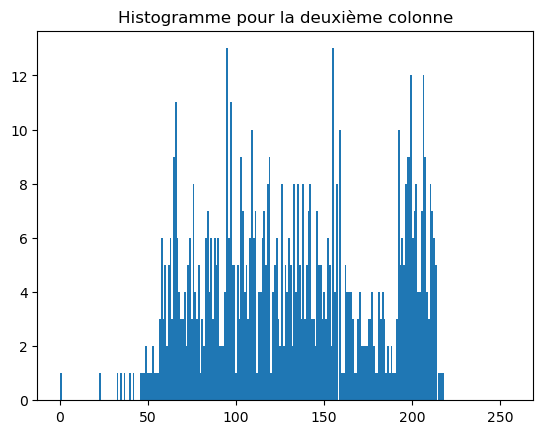
​    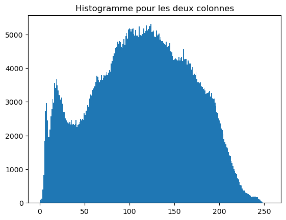  


## 2.4 $2^{ème}$ position : Contour Plots

Ces graphiques sont super utiles quand vous voulez visualiser un modèle qui occupe trois dimensions en vue du dessus. 


Typiquement, en intelligence artificielle, on cherche souvent à résoudre des problèmes d'optimisation, comme par exemple trouver le minimum d'une fonction coût ou bien maximiser des revenus. 

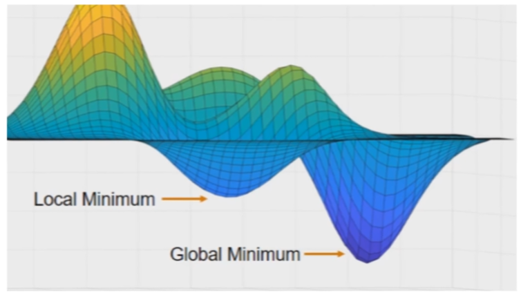

Et c'est précisément là que ce type de graphique peut jouer un rôle majeur dans votre compréhension du problème d'optimisation sur lequel vous travaillez.
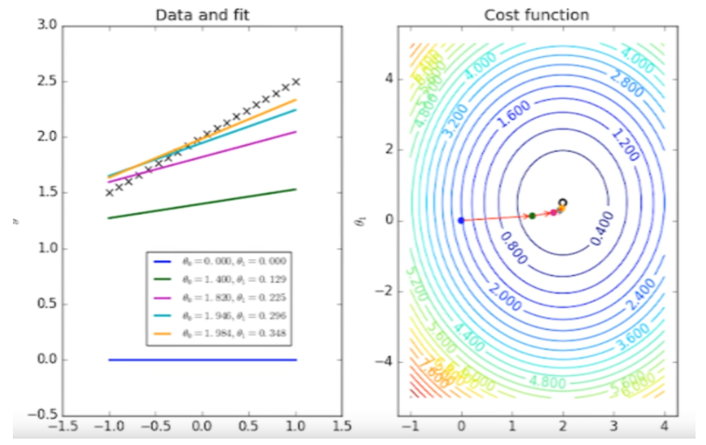

Typiquement, tout à l'heure, on a créé une fonction f qui est égale à $sin(x)+cos⁡(x+y)$ et on l'avait visualisée en 3D. 

Et bien, avec $Contour\ Plots$, on peut la visualiser en vue du dessus. Pour ça, c'est très simple : tout ce qu'on a à faire, c'est utiliser $plt.contours$ et là, on va faire passer $x$, $y$, $z$. Ce que ça nous donne comme résultat, c'est notre $Contour\ Plots$ en vue du dessus.


```python
%matplotlib inline

import numpy as np
import matplotlib.pyplot as plt

X = np.linspace(0, 5, 100)
Y = np.linspace(0, 5,100)
X,Y = np.meshgrid(X, Y)

f = lambda x,y: np.sin(x) + np.cos(x + y)
Z = f (X , Y)

plt.contour(X,Y,Z)
```


    <matplotlib.contour.QuadContourSet at 0x202b63256a0>

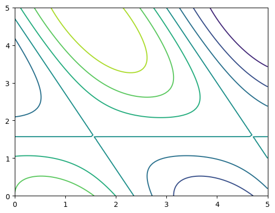​    


Alors, si on veut le rendre un petit peu plus lisible, ce graphique, on peut en modifier le nombre de niveaux. 

Par exemple, on peut créer 20 niveaux, donc ça va augmenter la précision d'affichage qu'on a sur notre graphique. 


```python
plt.contour(X,Y,Z,20)
```


    <matplotlib.contour.QuadContourSet at 0x202b79bd8e0>

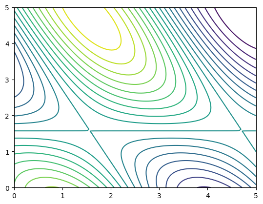​    


Et pour le rendre encore plus lisible, on peut aussi jouer avec les couleurs en écrivant colors. On a beaucoup de couleurs à disposition. Par exemple, on peut tout simplement créer ce graphique en noir et blanc.


```python
plt.contour(X,Y,Z,20, colors='black')
```


    <matplotlib.contour.QuadContourSet at 0x202b7ae0be0>

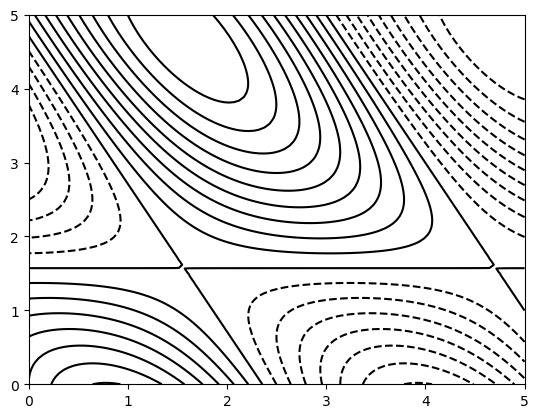​    


Là, tout ce qui va être positif, ça va s'afficher en continu et tout ce qui est négatif, ça s'affiche en pointillé.

Donc, typiquement, si vous travaillez en économie, en ingénierie, en logistique ou en fait, quel que soit le secteur dans lequel vous travaillez, si vous avez une fonction un peu plus complexe à optimiser, les $Contour\ Plots$ peuvent vraiment vous aider à y voir clair dans un champ de possibilités comme celui-ci. 


```python
f = lambda X,Y: np.sin(X) + np.cos(X + Y) * np.cos(X)
Z = f (X , Y)

plt.contour(X,Y,Z,20)
```


    <matplotlib.contour.QuadContourSet at 0x202b7ca5910>

​    


Maintenant, petite astuce pour les $Contour Plots$ : il existe une autre fonction qui est la fonction $contourf$, dans laquelle on va également faire passer $X, Y, Z$. Cette fois-ci, on va faire passer une $colormap$. 


```python
f = lambda X,Y: np.sin(X) + np.cos(X + Y) * np.cos(X)
Z = f (X , Y)

plt.contourf(X,Y,Z, cmap='RdGy')
```


    <matplotlib.contour.QuadContourSet at 0x202b7c0d3d0>

​   


Et ça nous donne un graphique un petit peu plus sympa qu'on va détailler un peu plus en écrivant 20. Et si on veut, on peut rajouter une sorte de légende encore une fois en écrivant plt.colorbar. 


```python
plt.contourf(X,Y,Z, 20, cmap='RdGy')
plt.colorbar()
```


    <matplotlib.colorbar.Colorbar at 0x202b7d33400>

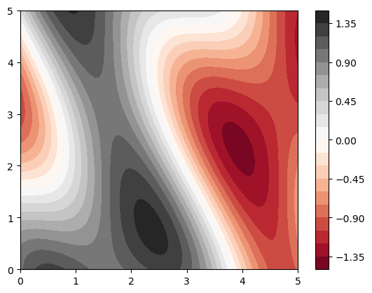​    


Et avec ça, on peut comprendre quelles sont les valeurs de nos différents gradients sur d'autres "contours pelote". Très, très utile.

## 2.5 $1^{ère}$ position : Imshow

Sans conteste, le graphique $imshow$ est à la tête de ce classement, parce qu'on peut juste faire des choses incroyables avec. Alors, bien sûr, la toute première utilité, c'est de visualiser une image, comme l'image $face$ que l'on avait chargé auparavant. 


```python
plt.imshow(face)
```


    <matplotlib.image.AxesImage at 0x202b7c5f2e0>

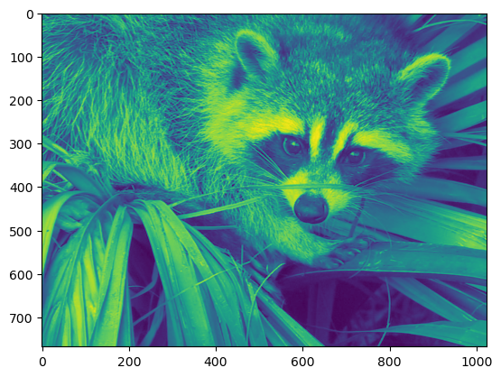​    


Mais en fait, l'utilisation de $imshow$ va beaucoup plus loin que simplement afficher des images.

Rappelez-vous d'une chose : $face$ est un tableau $Numpy$ d'une certaine taille qui contient les différents pixels de notre image. 

De fait, la fonction $imshow$ nous permet d'afficher n'importe quel tableau $Numpy$. Et c'est là l'intérêt absolument génial qu'on a à utiliser $imshow$ : on va pouvoir afficher n'importe quelle matrice. 

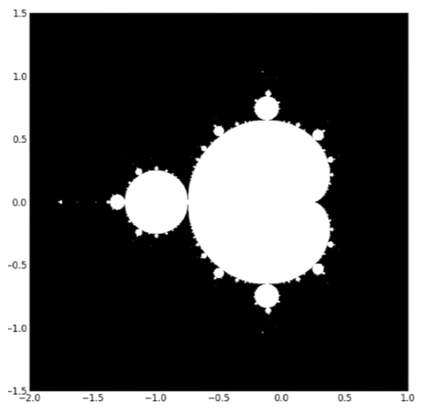

Par exemple, on va pouvoir tracer des matrices de corrélation, 
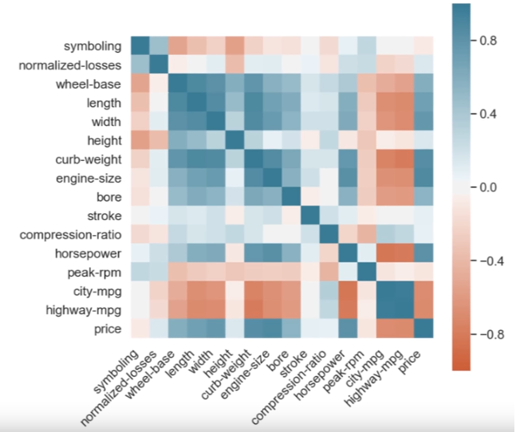

on pourra analyser un problème d'optimisation en mettant tous les chemins possibles dans une matrice, 


on va pouvoir visualiser un masque avant de s'en servir dans du Boolean Indexing, 
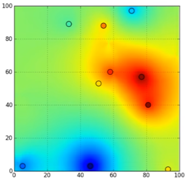


et bien plus. Bref, on peut faire énormément de choses avec imshow.

Avec $imshow$, on peut, par exemple, tracer la matrice de corrélation pour notre dataset des fleurs d'iris. 

Rappelez-vous, on a quatre variables et 150 exemples. Pour tracer ce graphique, on fait passer à l'intérieur de $imshow$ la fonction $np.corrcoef$, qui nous retourne une matrice de corrélation pour notre tableau $X$. 


```python
%matplotlib inline

import numpy as np
import matplotlib.pyplot as plt
from sklearn.datasets import load_iris

iris = load_iris()

X = iris.data
y = iris.target

names =list(iris.target_names)

print(f'X contient {X.shape[0]} exemples et {X.shape[1]} variables')
print(f'il y {np.unique(y).size} classes')
```

    X contient 150 exemples et 4 variables
    il y 3 classes


À l'intérieur de ça, on va faire passer la transposée de X parce que ce qui nous intéresse, c'est la corrélation entre les colonnes et non pas les lignes. Et ça nous produit la matrice de corrélation qui nous permet de voir où se situent les différentes corrélations dans notre dataset.


```python
plt.imshow(np.corrcoef(X.T), cmap='Blues')
plt.colorbar()
plt.show()
```

   ​    


Maintenant, quand on travaille avec des datasets beaucoup plus larges, comme par exemple le dataset sur les données du cancer du sein où l'on a beaucoup plus de variables, ici en l'occurrence 30 variables, ce genre de graphique est super informatif pour comprendre quelles sont les variables qui ont de fortes corrélations entre elles.

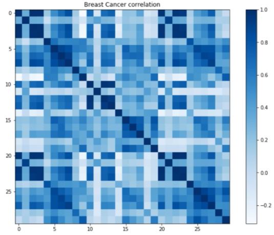

On pourrait encore parler très longuement de $imshow$. Pour terminer, on va simplement parler des problèmes d'optimisation dans lesquels nous avons utilisé $contour\ plots$ et cette fois-ci tout ce qu'on a à faire c'est de passer le tableau $Z$, qui est donc un tableau de dimensions de 100 lignse par 100 colonnes, à l'intérieur de imshow. 

Et donc on a la matrice Z de deux dimensions de 100 lignes et de 100 colonnes qui nous est représentée avec $imshow$.


```python
plt.figure(figsize=(12,8))
plt.imshow(Z)
```


    <matplotlib.image.AxesImage at 0x202b794aa60>

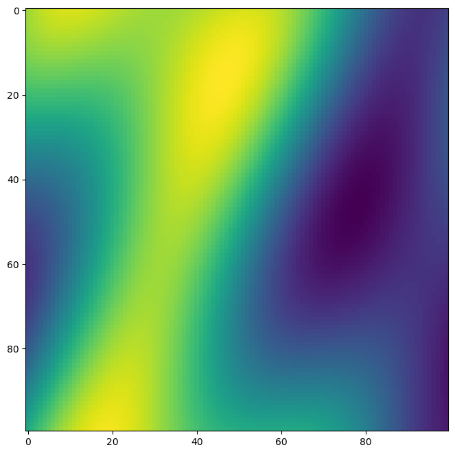    

