# Pyton pour le Machine Learning

[Retour README](../README.md)

[toc]

------

# 1. Numpy : ndarray

Au cœur de ce package, on trouve un objet extrêmement puissant performant et utile en machine learning,  deep learning et en data scientist, c'est le **tableau à n dimentions**, ce qu'on appelle en anglais **ND Array**. 

Avec ce genre de tableaux, on fera passer toutes les données dans nos modèles de machine learning et de data scientist afin d'entraîner notre  intelligence artificielle. Comme son nom l'indique le ND Array, 


nous permet de créer des tableaux à une dimension, à deux dimensions ce qui ressemble à une matrice Excel, à trois dimensions ce qui ressemble à un cube et ça continue comme ça jusqu'au delà de votre imagination. 

Quand on parle de tableau à une dimension en fin de compte ça ressemble à une liste, d'autant plus que le tableau Numpy est comparable à une séquence. 

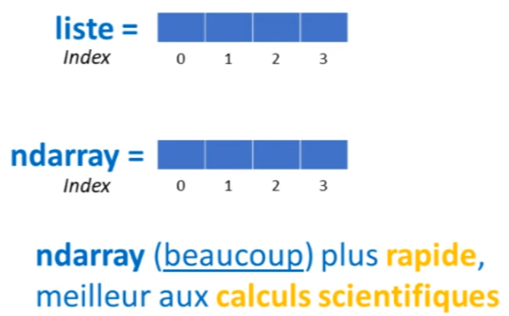

On dispose d'indices, la différence majeure avec une liste étant que le tableau Numpy se révèle bien plus puissant.

Il occupe moins d'espace en mémoire, ce qui permet d'exécuter des programmes nettement plus rapidement. En comparaison avec les listes, le tableau Numpy offre un accès à un nombre plus important de méthodes pour réaliser du calcul scientifique. Il est donc particulièrement adapté à la pratique du machine learning.

En tant que praticiens du machine learning et data scientist, on travaille le plus souvent avec des tableaux bidimensionnels. Ceux-ci peuvent être comparés à un tableau Excel, dans lequel les différentes lignes correspondent aux exemples du dataset, et les différentes colonnes représentent les variables, les caractéristiques et la variable cible.

Un autre usage possible des tableaux bidimensionnels est le stockage des pixels d'une image.

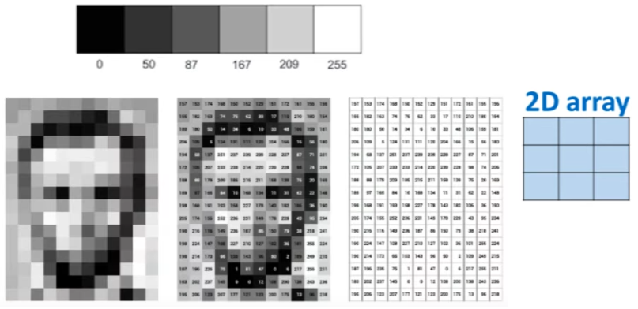

vu qu'une image est en deux dimensions et bien dans chaque case de notre tableau, on peut stocker la valeur du pixel allant de 0 à 255. Le plus souvent zéro indiquant une couleur noire et 255 indiquant le blanc. Par exemple cette image 

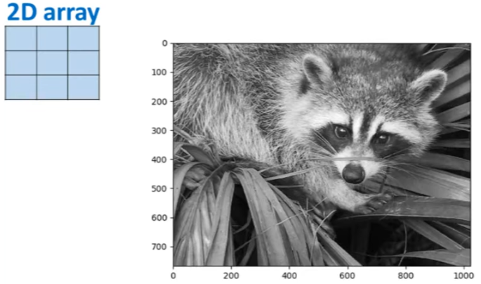

nous donnerait un tableau Numpy dans lequel on aurait environ 800 lignes et mille et quelques colonnes. Cette même image si on la prend en couleurs 


alors on peut la décomposer en trois couches de couleur vert, bleu et rouge .


Et c'est alors qu'on va commencer à utiliser des tableaux avec trois dimensions parce que sur chaque couche vert, bleu et rouge on aura une valeur de pixels différentes. Et c'est lorsqu'on ensemble ces trois couches ensemble, qu'on obtient la couleur finale pour chaque pixel. 

Donc le tableau à $n$ dimension qui nous vient de Numpy est un objet et comme tous les objets, il a des méthodes et des attributs. 

Des attributs il y en a beaucoup mais les plus importants, ceux qu'on utilise le plus souvent en machine learning et Data scientis, c'est l' attribu **shape**. Cet attribut nous permet de voir quelle est la forme de notre tableau, c'est à dire combien il ya de lignes et de colonnes. Quelle est sa profondeur dans le cas où c'est un tableau à trois dimensions, etc... 

Par exemple, si on considère un premier tableau a une dimension 

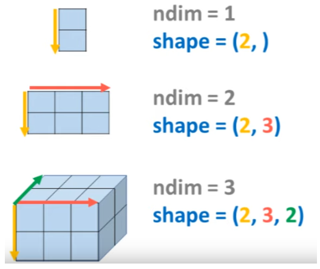

alors il y a déjà un premier attribut qui est $ndim$, et cet attribut sera égal à 1, puisque on a une seule dimension. Ensuite l'attribut **shape** de ce tableau sera de 2 puisqu'on a deux éléments dans cette colonne. 

Maintenant si on prend un tableau à deux dimensions alors l'attribut $ndim$ est égal à 2 et pour ce tableau l'attribut $shape$ est égal à (2,3), parce qu'on a deux lignes et trois colonnes. 

Enfin si on prend ce tableau à trois dimensions, et bien $ndim$ est égal à 3 et $shape$ est égal à (2,3,2). Et j'espère que vous l'avez remarqué, l'attribut $shape$ nous donne un tuple 


c'est une information que pas mal de développeurs oublie de temps à autre. Ca veut dire deux choses, la première c'est que **c'est une séquence, ça veut dire qu'on peut accéder aux différents valeurs du tuple en indiquant les index**. Donc bien souvent quand on tracera avec un tableau Numpy, si on veut accéder au nombre de lignes de ce tableau, et bien on écrira **shape[0]**  et si à l' inverse, on veut accéder au nombre de colonnes et bien on écrira **shape[1]**. Maintenant, la deuxième chose que ça veut dire c'est que **shape est un attribut imutable** puisque par définition un tuple ne peut pas être muté, on ne peut pas rajouter des éléments dans un tuple ou bien en enlever. Donc l'attribut shape est en quelque sorte protégé. 

Maintenant dans cette leçon, on va faire le tour des différents constructeurs qui nous permettent de créer certains de ces tableaux. Je vais vous montrer comment créer différents types de tableau avec différentes $ndim$ dimension. 


## 1.2 Initialiser un ndarray: np.ones, np.zeros ##

On va à chaque fois vérifier l'attribut shape sur ces différents tableaux. afin que vous commencez à être à l'aise avec le concept de tableau à $n$ dimension .Si vous êtes déjà à l'aise avec le tableau Numpy, alors cette leçon peut quand même vous être utile.

La documentation Numpy, nous indique que pour créer un objet de la classe **ndarray**, c'est à dire un de ses tableaux, alors il existe un constructeur de base qui est **la fonction array**. 

Donc, pour créer un tableau la première chose qu'on fait c'est bien sûr d'importer Numpy et **np** c'est le nom qu'on donne le plus souvent à Numpy. 

On va à chaque fois vérifier l'attribut shape sur ces différents tableaux. afin que vous commencez à être à l'aise avec le concept de tableau à $n$ dimension .Si vous êtes déjà à l'aise avec le tableau Numpy, alors cette leçon peut quand même vous être utile.

La documentation Numpy, nous indique que pour créer un objet de la classe **ndarray**, c'est à dire un de ses tableaux, alors il existe un constructeur de base qui est **la fonction array**. 

Donc, pour créer un tableau la première chose qu'on fait c'est bien sûr d'importer Numpy et **np** c'est le nom qu'on donne le plus souvent à Numpy. 


```python
import numpy as np
```

Ensuite, la fonction **array()** est utilisée et les nombres souhaités pour le tableau sont passés à l'intérieur de cette fonction. S'il est souhaité d'avoir un tableau à une dimension qui contient les nombres 1, 2 et 3, on pourrait penser à passer 1, 2 et 3 à l'intérieur de cette fonction. Cependant, cela ne fonctionne pas ainsi ; le constructeur n'opère pas de cette manière. Pour passer deux nombres spécifiques au constructeur, il faut les mettre entre crochets. 


```python
A = np.array([1,2,3])
A.shape
```


    (3,)


Ainsi, un tableau est créé qui sera un objet de la classe ndarray. Le nombre de dimensions de ce tableau peut maintenant être vérifié, ce qui donne une dimension. Sa forme peut également être visualisée en utilisant l'attribut shape, ce qui indique que sur sa seule dimension, il y a trois éléments. Numpy offre une série d'attributs détaillés dans la documentation. Cependant, **en machine learning ou en data science, deux attributs sont particulièrement importants** : **l'attribut shape** et **l'attribut size** qui retourne le nombre d'éléments dans le tableau. Tous les autres attributs peuvent être oubliés, car ils sont rarement utilisés.

En pratique, il n'est pas courant d'écrire explicitement tous les nombres que l'on souhaite avoir dans le tableau. À la place, il existe des constructeurs qui permettent d'initialiser les tableaux avec certains nombres et certaines dimensions. Par exemple, la fonction **np.zeros()** initialise le tableau avec des zéros et tout ce qu'il faut faire est d'indiquer dans la fonction les dimensions souhaitées pour le tableau, c'est-à-dire la forme ou le shape. Le shape est écrit sous forme de tuple, car shape est un tuple. Ainsi, si on souhaite un tableau avec trois lignes et deux colonnes, on écrit (3,2) et le tableau est rempli de zéros avec trois lignes et deux colonnes.


```python
B = np.zeros((3,2))
print('tuple = \n',B)
print('Nombre de dimensions = ',B.ndim)
print('Shape = ',B.shape)
```

    tuple = 
     [[0. 0.]
     [0. 0.]
     [0. 0.]]
    Nombre de dimensions =  2
    Shape =  (3, 2)


Le nombre de dimensions de ce tableau peut être vérifié, qui est de deux, et sa forme ou **shape** peut également être vérifiée, qui est (3,2). Pour le fun, la fonction type peut être utilisée pour confirmer que b.shape est en fait un tuple. 


```python
type(B.shape)
```


    tuple


Il existe d'autres fonctions qui permettent d'initialiser, par exemple, un tableau rempli de 1. Pour ce faire, écrivez le tuple qui contient les dimensions du tableau, par exemple cette fois un tableau avec trois lignes et quatre colonnes, et voilà, il est rempli de 1.


```python
C = np.ones((3,4))
print( 'tuple de 1 = \n', C)
```

    tuple de 1 = 
     [[1. 1. 1. 1.]
     [1. 1. 1. 1.]
     [1. 1. 1. 1.]]


L'attribut **size**, mentionné précédemment comme important à connaître, donne la taille de ce tableau, ce qui correspond au produit des différentes dimensions du tableau. 


```python
C.size
```


    12


Une autre fonction, **np.full()**, n'est pas très utile, mais elle permet d'initialiser un tableau avec un certain nombre. Par exemple, si on veut un tableau avec quatre lignes et trois colonnes, et le remplir avec le nombre 9, cela donne ce tableau. 


```python
D = np.full((2,3),9)
print ('tuple de 9 = \n', D)
```

    tuple de 9 = 
     [[9 9 9]
     [9 9 9]]


Cependant, il est rare de voir un programme de machine learning utiliser cette fonction. En général, on se contente d'initialiser les tableaux soit avec des uns, soit avec des zéros, soit avec des nombres aléatoires.

Pour générer des nombres aléatoires, on utilise un des modules du package numpy, qui est le module random. En écrivant **np.random**, une série de fonctions sont disponibles qui permettent de générer différents types de nombres aléatoires. Par exemple, avec **np.random.randint**, on peut générer un tableau rempli de nombres aléatoires qui sont des entiers. Le premier argument de cette fonction est le nombre de départ, le deuxième est le nombre d'arrivée, et le troisième argument est le shape, qui est le même que précédemment. Par exemple, si on veut des nombres aléatoires entre 1 et 10, dans un tableau à trois dimensions avec deux lignes et deux colonnes, le tableau est ainsi créé. Il faut noter que le nombre d'arrivée est exclu dans le tableau, c'est-à-dire que le 10 n'est pas présent.

On peut également générer des nombres aléatoires qui suivent une distribution normale standard, avec une moyenne de zéro et un écart-type de un. 


Pour ce faire, on utilise la fonction **np.random.randn**, qui génère un tableau rempli de ces nombres aléatoires. Le shape de ce tableau peut être passé en argument de cette fonction, par exemple un tableau à deux dimensions avec deux lignes et trois colonnes. 


```python
E = np.random.randn(3,4)
print ('tuple random = \n', E)
```

    tuple random = 
     [[-0.63743703 -0.39727181 -0.13288058 -0.29779088]
     [-0.30901297 -1.67600381  1.15233156  1.07961859]
     [-0.81336426 -1.46642433  0.52106488 -0.57578797]]


```python
E = np.random.seed(0)
E = np.random.randn(3,4)
print ('tuple random = \n', E)
```

    tuple random = 
     [[ 1.76405235  0.40015721  0.97873798  2.2408932 ]
     [ 1.86755799 -0.97727788  0.95008842 -0.15135721]
     [-0.10321885  0.4105985   0.14404357  1.45427351]]


En utilisant un argument différent pour la fonction **seed()**, nous aurons des nombres différents mais qui resteront les mêmes à chaque réexécution du code.

Un autre générateur, le générateur "eye", permet de créer une matrice d'identité. Ce générateur n'est cependant pas très utilisé en machine learning ou data science, mais il existe et peut être utile à connaître. Pour créer une matrice d'identité, il suffit d'entrer le nombre d'éléments que l'on souhaite avoir sur la diagonale avec la fonction **eye()**. Cela retourne une matrice d'identité. 


```python
F = np.eye(4)
F
```


    array([[1., 0., 0., 0.],
           [0., 1., 0., 0.],
           [0., 0., 1., 0.],
           [0., 0., 0., 1.]])


## 1.3 np.linspace, np.arange

Il y a également **np.linspace** et **np.arange**, deux constructeurs particulièrement intéressants lors de la création de graphiques avec **Matplotlib**.


Le constructeur linspace permet de créer un tableau à une dimension dans lequel on spécifie un point de départ, un point d'arrivée et une quantité d'éléments à inclure dans le tableau. Cette quantité de nombres est répartie de manière égale entre le point de départ et le point d'arrivée. Par exemple, si l'on souhaite avoir 20 points répartis entre 0 et 10, il suffit d'écrire le code correspondant.


```python
np.linspace(0,10,20)
```


    array([ 0.        ,  0.52631579,  1.05263158,  1.57894737,  2.10526316,
            2.63157895,  3.15789474,  3.68421053,  4.21052632,  4.73684211,
            5.26315789,  5.78947368,  6.31578947,  6.84210526,  7.36842105,
            7.89473684,  8.42105263,  8.94736842,  9.47368421, 10.        ])


Quant à la fonction **np.arange**, elle fonctionne de manière un peu différente. Avec cette fonction, on entre un point de départ et un point d'arrivée, mais on indique non pas le nombre d'éléments que l'on souhaite avoir dans le tableau, mais le pas que l'on désire entre chaque élément. Par exemple, si l'on souhaite créer un tableau avec un pas de 1, on obtient une série de nombres allant de 0 à 10.


```python
np.arange(0, 10, 0.5)
```


    array([0. , 0.5, 1. , 1.5, 2. , 2.5, 3. , 3.5, 4. , 4.5, 5. , 5.5, 6. ,
           6.5, 7. , 7.5, 8. , 8.5, 9. , 9.5])


## 1.4 dtype=np.float16 np.float64 ##

Il est important de noter que lors de la création d'un tableau dans NumPy, on peut choisir le type de données à inclure dans le tableau grâce au paramètre **dtype**. Il y a plusieurs types de données disponibles et en plus de choisir si l'on veut un type integer ou un type float, on peut aussi choisir le nombre de bits que doit occuper chaque valeur dans la mémoire de l'ordinateur. Par exemple, on peut choisir de créer des nombres entiers qui occuperont 8 bits de la mémoire, ou bien des integers qui occuperont 16 bits, 32 bits, ou 64 bits de la mémoire.


Plus on augmente le nombre de bits que peuvent occuper les données sur l'ordinateur, meilleure sera la précision du programme et plus performant sera le programme. Cependant, le programme s'exécutera plus lentement. Ainsi, il y a deux choses à retenir :

1. Quel que soit le constructeur de tableau que l'on choisit (linspace, arange, full, ones, etc.), on peut préciser le type de données à utiliser grâce au paramètre **dtype**.
2. Si on choisit un type de données qui occupe beaucoup d'espace en mémoire (par exemple float64), on obtient une grande précision dans les nombres, mais le programme sera plus lent à l'exécution. À l'inverse, si on opte pour un type plus léger en mémoire (par exemple float16, où chaque élément n'occupe que 16 bits), le programme sera plus rapide à l'exécuter, mais la précision sera moindre. Cela permet potentiellement d'entraîner des modèles  plus rapidement. C'est une information très importante à connaître. En  pratique, le dtype généré par défaut est souvent utilisé car il est  adapté au tableau NumPy. Cependant, lorsqu'il s'agit de construire des  codes puissants et performants, il est parfois nécessaire de manipuler  le type de données dans le tableau.

## 1.5 Assembler des tableaux: vstack hstack concatenate  ##

Alors, pour conclure cette leçon, un tour des différentes méthodes permettant de manipuler des tableaux, comme redimensionner des tableaux, assembler des tableaux ensemble, diviser un tableau en deux, etc... 

Imaginons la création de deux tableaux NumPy de la même dimension, c'est-à-dire trois lignes deux colonnes. Une première action possible sur ces tableaux est leur assemblage, soit de façon verticale, soit de façon horizontale. 


```python
A = np.zeros((3,2))
print ('tuple A = \n', A)

B = np.ones((3,2))
print ('tuple B = \n', B)
```

    tuple A = 
     [[0. 0.]
     [0. 0.]
     [0. 0.]]
    tuple B = 
     [[1. 1.]
     [1. 1.]
     [1. 1.]]


Pour cela, il y a les méthodes **hstack** et **vstack**, qui signifient horizontal stack et vertical stack. Par exemple, en utilisant la méthode hstack sur les tableaux A et B, cela donne un tableau dans lequel les deux tableaux sont accolés horizontalement.


```python
np.hstack((A,B))
```


    array([[0., 0., 1., 1.],
           [0., 0., 1., 1.],
           [0., 0., 1., 1.]])


```python
C = np.hstack((A,B))
C.shape
```


    (3, 4)


En utilisant à l'inverse la méthode **vstack**, cela colle les deux tableaux de façon verticale.


```python
np.vstack((A, B))
```


    array([[0., 0.],
           [0., 0.],
           [0., 0.],
           [1., 1.],
           [1., 1.],
           [1., 1.]])


Le résultat de cette opération donne un tableau dont les dimensions sont (6 x 2). Ces méthodes peuvent être utiles, par exemple, si des régressions avec NumPy sont effectuées et qu'il est souhaité d'ajouter une colonne de biais dans la matrice. Dans ce cas, il est possible d'utiliser la méthode hstack. 

Il y a aussi une autre méthode qui permet d'obtenir exactement le même résultat : la méthode concatenate.

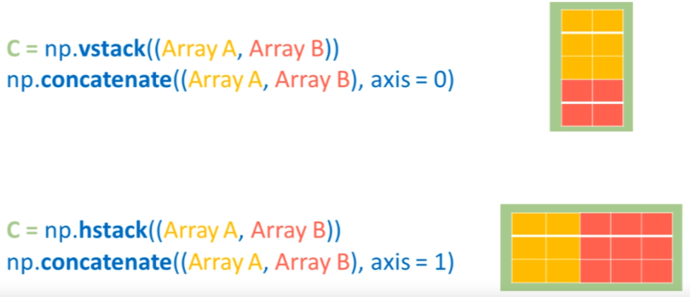

Avec cette méthode, il est fait de la même manière, en passant une autre tableau à et notre tableau b, puis ensuite on va désigner un axe sur lequel on veut faire notre assemblage. 


Par exemple, **si on définit l'axe d'assemblage comme étant 0, alors on va faire la même opération que vstack** et à l'inverse, **si on fait l'assemblage selon l'axe 1, on va obtenir le même résultat qu'avec hstack**.


```python
np.concatenate((A,B), axis=0)
```


    array([[0., 0.],
           [0., 0.],
           [0., 0.],
           [1., 1.],
           [1., 1.],
           [1., 1.]])


## 1.6 np.reshape np.squeeze

Maintenant, je vais parler d'une méthode extrêmement importante, la méthode **reshape**. Cette méthode permet de remodeler la forme d'un tableau pour lui donner une nouvelle forme. 

Le remaniement de la forme d'un tableau a un impact significatif sur la  façon dont les nombres sont disposés. Cette méthode est couramment  utilisée et on la retrouve dans de nombreux codes sur Github et  Internet. Elle est particulièrement utile lors de la création d'un  tableau à une dimension. 

La méthode **np.reshape** est une fonction cruciale permettant de manipuler la forme d'un tableau pour lui donner une nouvelle forme. Il est important de noter que cette méthode fonctionne seulement si le nombre d'éléments dans la forme initiale est égal au nombre d'éléments dans la forme finale. 

Par exemple, si un tableau "D" de dimension 6x2 est créé, il contient douze éléments. Ce tableau peut être redimensionné aux dimensions 3x4 car le produit de 3 et 4 est aussi douze. Pour cela, on définit "D = D.reshape(3,4)", sachant que 3 et 4 sont écrits dans un tuple car shape doit être un tuple. En observant "D", on voit 000 jusqu'à la moitié du tableau, puis 1.


```python
D = np.vstack((A, B))
D.size
```


    12


```python
D.reshape((3,4))
```


    array([[0., 0., 0., 0.],
           [0., 0., 1., 1.],
           [1., 1., 1., 1.]])


Le remaniement de la forme d'un tableau a un impact significatif sur la façon dont les nombres sont disposés à l'intérieur.

Le remaniement de la forme d'un tableau a un impact significatif sur la  façon dont les nombres sont disposés. Cette méthode est couramment  utilisée et on la retrouve dans de nombreux codes sur Github et  Internet. Elle est particulièrement utile lors de la création d'un  tableau à une dimension. Par exemple, si un tableau "A" est créé avec np.array([1, 2, 3]), on remarque que la forme du tableau est de (3,) et puis il n'y a rien de marqué après. Très souvent, l'idée est de remplacer cette place vide par 1  car l'absence de ce petit 1 dans la forme peut créer des problèmes dans  certains algorithmes.


```python
A = np.array([1,2,3])
A.shape
```


    (3,)


Pour cela, $A$ est redéfini avec **A.reshape** à l'intérieur duquel,  au lieu d'écrire simplement (3,1), on écrira


```python
A = A.reshape((A.shape[0],1))
A.shape
```


    (3, 1)


Rappelez-vous que "shape" est un tuple et on peut accéder à ses  différents éléments grâce à l'indexation. Donc, en choisissant l'index  0, cela renvoie 3. Après redimensionnement du tableau, il est confirmé  que "A" est de dimension (3,1).

Parfois, cette méthode de redimensionnement est essentielle lors du  calcul matriciel ou de la sommation sur certains axes de tableaux. Si le petit 1 n'est pas présent dans la **shape**, cela peut créer des problèmes. 

Cependant, dans certaines situations, avoir un tableau à une dimension  où le nombre 1 est présent peut également poser des problèmes, notamment lors de la création de graphiques ou de l'observation d'une photo à  l'écran. Il est donc préférable de revenir à la dimension (3, ) et pour cela, une autre méthode appelée **squeeze** existe. En  utilisant 


```python
A = A.squeeze()
A.shape
```


    (3,)


## 1.7 np.ravel()

Pour finir cette leçon, une méthode appelée "ravel" est parfois utilisée. Cette méthode permet d'aplatir un tableau à une seule dimension.

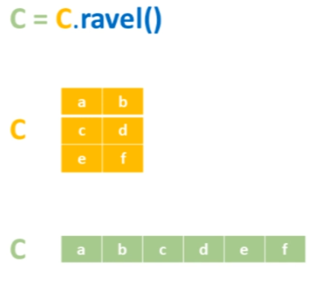

Par exemple, si on a un tableau "D" qui a trois lignes et quatre colonnes, en utilisant "ravel", 


```python
D = D.reshape((3,4))
D.ravel()
```


    array([0., 0., 0., 0., 0., 0., 1., 1., 1., 1., 1., 1.])


ce tableau va afficher les éléments ([0., 0., 0., 0., 0., 0., 1., 1., 1., 1., 1., 1.]) mais sur une seule dimension. Cette méthode peut également être utile dans certains cas, qui seront rencontrés avec le temps en travaillant avec les tableaux Numpy et en créant des algorithmes de machine learning.

## 1.8 Exercices

L'exercice pour cette leçon consisterait à créer une fonction  d'initialisation qui prendrait comme argument $m$ et $n$, où $m$ est le nombre de lignes et $n$ le nombre de colonnes nécessaires pour créer une matrice aléatoire de dimension $(m \times n + 1)$. Avec une colonne biais, c'est-à-dire une colonne remplie de 1, serait placée tout à droite de la matrice. 

Pour cela,  quelques indices pourraient être utiles : utiliser la fonction **reshape**,  la fonction **random.randn** et aussi la fonction **concatenate**.

Il est possible de créer une matrice, appelons-la $X$, qui est initialisée aléatoirement avec $np.random.randn$, en y passant les dimensions $m$ et $n$. À ce stade, il y a une matrice $X$ de dimensions $m \times
 n$.

Ensuite, il faut coller une colonne remplie de 1 à droite de cette matrice.

Pour assembler, il y a deux options : utiliser **hstack** ou utiliser **concatenate**. Le choix s'est porté sur $np.concatenate$ car c'est un peu plus complexe. Il faut indiquer une valeur pour les axes.


```python
def initialisation(m, n):
    # m : nombre de lignes
    # n : nombre de colonnes
    # retourne une matrice aléatoire (m, n+1)
    # avec une colonne biais (remplie de "1") tout a droite
    X = np.random.randn(m, n)
    X = np.concatenate((X, np.ones((X.shape[0], 1))), axis = 1)
    
    return X
```

$X$ est maintenant égal à $np.concatenate$, et ensuite dans un tuple, la matrice $X$ est insérée avec un vecteur rempli de 1 qui a la même dimension que le nombre de lignes de la matrice $X$. Pour cela, il serait possible de simplement passer l'argument $m$, mais la préférence va à utiliser **shape**. En écrivant $np.ones$ et en ouvrant un tuple dans lequel $(X.shape[0], 1)$ est inscrit, il a été possible de créer un vecteur rempli de 1 qui a le même nombre de lignes que $X$.

Maintenant, il ne reste plus qu'à assembler $X$ et ce vecteur selon un des axes sur lesquels on travaille, soit l'axe 0 soit l'axe 1. Si il y a un doute, il suffit d'essayer les deux. Par exemple, en écrivant $axis = 0$ et en renvoyant $X$. Si la fonction d'initialisation est utilisée avec une matrice de dimension (3 ,4) , cela donnera une erreur simplement parce que ce n'est pas le bon axe de travail.l'assemblage ne se fait pas. Alors il faut essayer avec l'axe 1 et là, un **array numpy** est retourné avec une colonne de 1 tout à droite du tableau.


```python
initialisation(3, 4)
```


    array([[ 0.76103773,  0.12167502,  0.44386323,  0.33367433,  1.        ],
           [ 1.49407907, -0.20515826,  0.3130677 , -0.85409574,  1.        ],
           [-2.55298982,  0.6536186 ,  0.8644362 , -0.74216502,  1.        ]])


Un petit truc a été montré si jamais il y a un problème pour se rappeler quel axe est censé être l'axe 0, l'axe 1, etc. Il suffit d'essayer, de faire des petits tests et de remarquer quel est le bon résultat.

# 2. Numpy : Indexing, Slicing, Masking #

Bonjour et bienvenue dans cette leçon de la série Python spécial machine learning. Dans la dernière leçon, des notions sur la création et l'initialisation de tableaux Numpy ont été abordées. Il a été montré comment examiner ces tableaux, observer leurs dimensions, explorer leur forme et manipuler ces tableaux en les assemblant ou en redimensionnant certains tableaux.

Maintenant, dans cette leçon, l'objectif est d'entrer au cœur même de ces tableaux Numpy. Il sera montré comment naviguer à l'intérieur d'un tableau en utilisant les techniques d'indexing, de slicing et de subsetting. En effet, ce sont exactement les mêmes techniques qu'on utilise pour naviguer à l'intérieur d'une liste, mais naviguer dans un espace à plusieurs dimensions est un peu plus compliqué que de naviguer dans un espace à une dimension.

Il y a beaucoup de développeurs qui se perdent lorsqu'il s'agit de naviguer dans cet espace aussi vaste, et la conséquence directe c'est des bugs et des erreurs dans les programmes de machine learning. L'objectif dans cette leçonest donc de donner les bons repères pour être complètement à l'aise lorsqu'il s'agit de se balader à l'intérieur d'un tableau Numpy.

## 2.1 Indexing Axis[0] Axis[1] ##

En machine learning et en data science, le travail s'effectue le plus souvent avec des tableaux à deux dimensions. Ce sont des tableaux sur lesquels il y a un axe 0 qui correspond aux lignes et un axe 1 qui correspond aux colonnes. 


La technique pour ne jamais se perdre lors de la navigation à travers un tableau à deux dimensions, ou à plusieurs dimensions, c'est de toujours se déplacer sur un axe à la fois, en se rappelant que ces axes sont tous orthogonaux. C'est-à-dire que lorsqu'on se déplace sur un axe à la fois, la position change seulement sur cet axe, pas sur les autres.

La première chose qui peut être faite pour naviguer sur un tableau, tout comme pour les listes, s'appelle l'indexing. Il s'agit de choisir d'accéder à un élément particulier du tableau en indiquant un index pour cet élément. Dans ce cas précis, un index pour les lignes et un index pour les colonnes sont indiqués.

Supposons qu'il y a un tableau à deux dimensions dans lequel il y a trois lignes et trois colonnes. 


```python
import numpy as np
A = np.array([[1,2,3], [4,5,6], [7,8,9]])
A
```


    array([[1, 2, 3],
           [4, 5, 6],
           [7, 8, 9]])


Si, par exemple, l'objectif est d'accéder à l'élément qui se trouve à la première ligne et à la première colonne, 

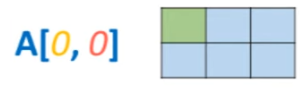

il suffit d'écrire 


```python
A[0, 0]
```


    1


et cela donne 1. 

Si l'objectif est d'accéder à la première ligne, deuxième colonne, 

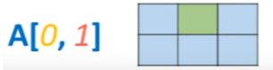

il suffit d'écrire 


```python
A[0, 1]
```


    2


et cela donne 2. 

Pour obtenir le nombre 5, il suffit d'écrire 

## 2.2 Slicing ##

En effet, bien que l'indexing puisse sembler simple, le **slicing** peut vite devenir beaucoup plus compliqué.

En manipulant les listes, on définit un index de départ, un index de fin et, optionnellement, un pas, mais cela sera expliqué plus tard. 

Par exemple, dans le tableau $A$, je veux imprimer toute la première colonne,


on écrit 


```python
A[:, 0]
```


    array([1, 4, 7])


Cela indique tout ce qu'il y a  du début à la fin, concernant l'index 0, qui se trouve sur l'axe 1. Cela donne un tableau contenant 1, 4, et 7.

À l'inverse, pour imprimer tous les éléments de la première ligne, 

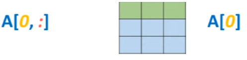

on écrit 


```python
A[0, :]
```


    array([1, 2, 3])


indiquant la première ligne et tous les éléments sur l'axe 1, cela donne 1, 2, et 3. 


Une astuce à connaître est qu'il suffit d'écrire le numéro de la ligne entre crochets pour accéder à une ligne entière. C'est parce que cette ligne est l'axe principal, le premier axe sur lequel on travaille, c'est-à-dire l'axe 0. Par conséquent, le système comprend par défaut que l'on veut accéder aux éléments qui sont sur cet axe là en particulier. Par exemple, pour imprimer la deuxième ligne, il suffit d'écrire


```python
A[0]
```


    array([1, 2, 3])


et pour imprimer la troisième ligne, il suffit d'écrire


```python
A[1]
```


    array([4, 5, 6])


et ainsi de suite.

Pour sélectionner un bloc à l'intérieur du tableau, 

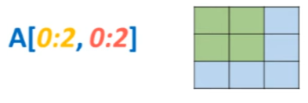

on pourrait écrire 


```python
A[0:2,0:2]
```


    array([[1, 2],
           [4, 5]])


,cela sélectionne les deux premières lignes et les deux premières colonnes ensemble.

L'accès aux données n'est pas simplement pour les afficher, mais aussi pour les modifier ou les mettre dans un nouveau tableau. Cela s'appelle **subsetting**, c'est-à-dire créer un plus petit tableau à partir d'un grand tableau.

Par exemple, on pourrait créer un tableau $B$ qui est égal à cette section A[0:2,0:2] du tableau $A$. $B$ est alors un tableau dont les dimensions sont (2,2). 


```python
B = A[0:2,0:2]
B
```


    array([[1, 2],
           [4, 5]])


Une autre chose que l'on peut faire, vu qu'on a accès aux données dans $A$, c'est de transformer $A$ en disant que cette section est maintenant égale à 10. 


```python
A[0:2,0:2] = 10
A
```


    array([[10, 10,  3],
           [10, 10,  6],
           [ 7,  8,  9]])


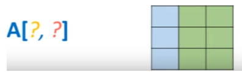

est simplement 


```python
A[:,-2:]
```


    array([[10,  3],
           [10,  6],
           [ 8,  9]])


Cela signifie "prendre toutes les lignes et les deux dernières colonnes". Cela donne bien le sous-tableau attendu. La subtilité ici est qu'en utilisant -2, on part de l'avant-dernière colonne et on va jusqu'à la fin du tableau.

Pour faire un pas de plus dans la complexité, on pourrait chercher à remplacer le milieu d'un tableau par une valeur spécifique. Par exemple, pour remplacer le milieu d'un tableau $B$ rempli de 0 et de dimensions (4 x 4), par la valeur 1, on utilise la technique du **slicing**. 


On écrit


```python
B = np.zeros((4,4))
B
```


    array([[0., 0., 0., 0.],
           [0., 0., 0., 0.],
           [0., 0., 0., 0.],
           [0., 0., 0., 0.]])


Cela sélectionne les lignes et les colonnes allant de l'index 1 à 3 (exclu) et les remplace par 1.


```python
B[1:3, 1:3] = 1
B
```


    array([[0., 0., 0., 0.],
           [0., 1., 1., 0.],
           [0., 1., 1., 0.],
           [0., 0., 0., 0.]])


La technique du **slicing** peut être encore poussée un peu plus loin **en introduisant le pas.** 

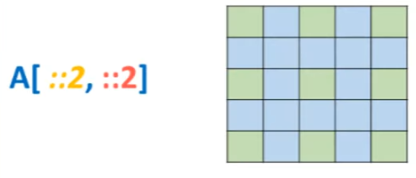

Par exemple, pour remplir une matrice $C$ de taille 5 x 5, on écrit 


```python
C = np.zeros((5,5))
C
```


    array([[0., 0., 0., 0., 0.],
           [0., 0., 0., 0., 0.],
           [0., 0., 0., 0., 0.],
           [0., 0., 0., 0., 0.],
           [0., 0., 0., 0., 0.]])


Cela signifie "prendre toutes les valeurs, du début à la fin, en sautant un pas de 2". 


```python
C[::2, ::2] = 1
C
```


    array([[1., 0., 1., 0., 1.],
           [0., 0., 0., 0., 0.],
           [1., 0., 1., 0., 1.],
           [0., 0., 0., 0., 0.],
           [1., 0., 1., 0., 1.]])


Il faut noter cependant qu'en pratique, **en machine learning et en data science, on n'utilise pas le slicing avec un pas**, ce n'est pas très utile. C'est montré ici principalement pour faire travailler un peu la gymnastique mathématique du cerveau.

## 2.3 Boolean Indexing ##

À présent, revenons à une technique particulièrement utile en machine learning et en science des données, la technique de **Booléen Indexing**. Pour illustrer cela, prenons un nouveau tableau $A$, que nous allons remplir de nombres entiers aléatoires. 

Pour ce faire, nous allons utiliser $np.random.randint()$, et dans les parenthèses, nous allons passer un nombre entre 0 et 10 dans un tableau de dimensions 5 par 5.


```python
A = np.random.randint(0,10,[5,5])
A
```


    array([[7, 2, 0, 0, 4],
           [5, 5, 6, 8, 4],
           [1, 4, 9, 8, 1],
           [1, 7, 9, 9, 3],
           [6, 7, 2, 0, 3]])


Avec ce tableau, nous pouvons effectuer des opérations de comparaison, comme dans les premières leçons, ce qui donne des résultats de type booléen. Par exemple, si j'écris $A < 5$, cela donne un tableau où tous les éléments qui sont inférieurs à 5 sont indiqués. 


```python
A < 5
```


    array([[False,  True,  True,  True,  True],
           [False, False, False, False,  True],
           [ True,  True, False, False,  True],
           [ True, False, False, False,  True],
           [False, False,  True,  True,  True]])


C'est ce que l'on appelle un **masque**, et on peut l'utiliser comme un index à l'intérieur de n'importe quel tableau **Numpy** de même dimension, soit 5 par 5. C'est ce qu'on appelle le **Booléen Indexing**.

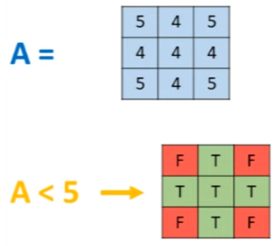

Par exemple, je peux réutiliser mon tableau $A$ et dire que je vais sélectionner tous les éléments pour lesquels $A$ est inférieur à 5, et ces éléments, je peux dire qu'ils sont maintenant égaux à 10. 


```python
A[A < 5] = 10
A
```


    array([[ 7, 10, 10, 10, 10],
           [ 5,  5,  6,  8, 10],
           [10, 10,  9,  8, 10],
           [10,  7,  9,  9, 10],
           [ 6,  7, 10, 10, 10]])


où tous les nombres 10 correspondent aux endroits où, auparavant, il y avait un nombre inférieur à 5. Cette technique sera très utile pour convertir les valeurs d'un tableau lorsque celles-ci sont inférieures à un certain seuil, ou supérieures à un certain seuil. 

On peut même tester plusieurs conditions avec le Booléen Indexing, par exemple, les valeurs qui sont à la fois inférieures à 5 et supérieures à 2.


```python
A[(A < 5) & (A > 2)] = 10
A
```


    array([[ 7, 10, 10, 10, 10],
           [ 5,  5,  6,  8, 10],
           [10, 10,  9,  8, 10],
           [10,  7,  9,  9, 10],
           [ 6,  7, 10, 10, 10]])


Cette technique peut également être utilisée pour le traitement d'images. 

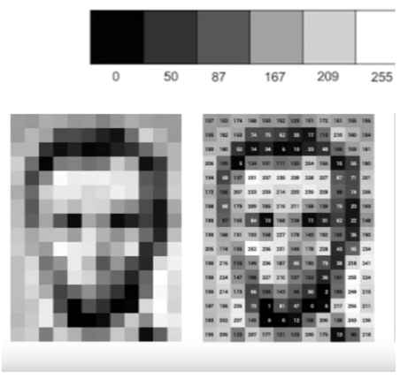

Par exemple, si nous avons un tableau assez grand dans lequel les valeurs peuvent varier de 0 (représentant un pixel noir) à 255 (représentant un pixel blanc), et que ce tableau est de dimensions 1024 par 750, on peut modifier notre tableau en disant que tous les pixels qui ont une luminosité assez élevée, c'est-à-dire les pixels qui sont supérieurs à 200, seront tous égaux à 255.


```python
A = np.random.randint(0 , 255, [1024, 720])
A
```


    array([[ 53, 140, 121, ...,  28, 115, 134],
           [ 66,  92, 220, ..., 132,  28, 193],
           [ 49, 177,  87, ..., 239, 197, 212],
           ...,
           [243,  97, 245, ..., 232, 163,  29],
           [214, 135,  83, ..., 124, 148, 176],
           [105, 100, 171, ...,  67, 219, 179]])


```python
A[A > 200] = 255
A
```


    array([[ 53, 140, 121, ...,  28, 115, 134],
           [ 66,  92, 255, ..., 132,  28, 193],
           [ 49, 177,  87, ..., 255, 197, 255],
           ...,
           [255,  97, 255, ..., 255, 163,  29],
           [255, 135,  83, ..., 124, 148, 176],
           [105, 100, 171, ...,  67, 255, 179]])


Une autre chose que l'on peut faire avec un masque est de filtrer les données d'un tableau de même dimension. Par exemple, on peut retourner le tableau $A$ pour lequel $A$ est inférieur à 5. 


```python
A = np.random.randint(0,10,[5,5])
A [A < 5]
```


    array([4, 3, 1, 3, 3, 4, 1, 0, 4, 4])


Cela retourne un tableau dans lequel seuls les nombres inférieurs à 5 sont présents.

Cependant, cela détruit complètement la forme initiale de notre tableau, car nous obtenons simplement un tableau à une dimension dans lequel nous avons moins d'éléments que dans notre premier tableau, car nous avons filtré les éléments qui respectent cette condition, et tous les autres ont été rejetés.


```python
A [A < 5].shape
```


    (10,)


Cette technique peut donc vraiment s'avérer utile, notamment pour  traiter une image ou appliquer un masque sur un autre tableau. 

Ici,  l'usage du masque s'est fait sur un tableau $A$, mais il serait tout à  fait possible d'utiliser ce masque sur un autre tableau $B$. Le tableau  $B$ est un tableau initialisé avec des valeurs aléatoires qui a deux  dimensions, 5 par 5, donc les mêmes dimensions que le masque $A$. 


```python
A = np.random.randint(0,10,[5,5])
A
```


    array([[0, 6, 1, 7, 7],
           [5, 3, 4, 7, 1],
           [1, 0, 3, 9, 2],
           [4, 6, 7, 5, 2],
           [2, 8, 8, 0, 9]])


```python
B = np.random.randint (0, 255, [5,5])
B
```


    array([[204,  80, 160, 241, 154],
           [ 87, 252,   2,  75, 201],
           [ 68,  73,  12,  40,  79],
           [226,  39, 108, 214, 185],
           [207,  12, 156, 247, 212]])


```python
B[A < 5]
```


    array([204, 160, 252,   2, 201,  68,  73,  12,  79, 226, 185, 207, 247])


Ainsi, le tableau obtenu présente différentes valeurs. Cependant, ces valeurs  ne proviennent pas de $A$, elles viennent de $B$. Elles ont été  sélectionnées grâce au **Booléen Indexing** issu du masque de $A$.

## 2.4 Exercice sur une image ##

Donc, l'exercice pour cette leçon consiste à prendre cette photo, 


à zoomer légèrement dessus et à appliquer un filtre, comme vu précédemment. 

Cette photo est un tableau numpy, chargé avec le code suivant


```python
from scipy import misc
import matplotlib.pyplot as plt
face = misc.face()
plt.imshow(face)
plt.show()
```

    C:\Users\romeofr\AppData\Local\Temp\ipykernel_31468\1516849581.py:3: DeprecationWarning: scipy.misc.face has been deprecated in SciPy v1.10.0; and will be completely removed in SciPy v1.12.0. Dataset methods have moved into the scipy.datasets module. Use scipy.datasets.face instead.
      face = misc.face()


    


Dans Numpy, on peut charger cette photo et utiliser matplotlib pour l'afficher. Évidemment, cette photo est un objet de type Numpy. Pour vérifier, on peut utiliser la fonction **type()** en passant **'face'** en argument et on verra que c'est un numpy.ndarray. 


```python
type(face)
```


    numpy.ndarray


Une autre chose qu'on peut faire, c'est vérifier les dimensions de cette photo, ou de ce tableau, 


```python
face.shape
```


    (768, 1024, 3)


Ce qui donne une forme de 768 par 1024 par 3, représentant un tableau à trois dimensions avec les trois couleurs rouge, vert et bleu.

Pour simplifier cet exercice, la photo est chargée en noir et blanc. Pour ce faire, à l'intérieur de la fonction de chargement de la photo, on écrit 'face(gray=True)', et à l'intérieur de 'imshow', on écrit 'cmap=plt.cm.gray', c'est juste pour définir les couleurs utilisées pour tracer le graphique.


```python
face = misc.face(gray=True)
plt.imshow(face, cmap=plt.cm.gray)
plt.show()
```

    C:\Users\romeofr\AppData\Local\Temp\ipykernel_31468\2809970912.py:1: DeprecationWarning: scipy.misc.face has been deprecated in SciPy v1.10.0; and will be completely removed in SciPy v1.12.0. Dataset methods have moved into the scipy.datasets module. Use scipy.datasets.face instead.
      face = misc.face(gray=True)


    


```python
face.shape
```


    (768, 1024)


Donc, si maintenant ce code est exécuté, la photo est en noir et blanc et on a un tableau à deux dimensions. 

Ce qui est demandé avec cette photo, c'est de zoomer de 1/4 vers le milieu de cette photo. Pour ce faire, on pourrait utiliser les dimensions de la photo avec 'face.shape', enregistrer ces dimensions dans des variables et utiliser ces variables dans les techniques de slicing pour faire certaines choses pour zoomer de 1/4 vers le milieu de la photo.


En bonus, il serait intéressant d'augmenter la luminosité des pixels qui sont déjà au-dessus d'une certaine luminosité et aussi de réduire la luminosité des pixels qui sont déjà très sombres. Pour cela, il faut bien entendu utiliser le Booléen Indexing. 

Alors, pour réussir à faire ça, la première chose à faire est de créer une variable hauteur et une variable largeur qui sont en réalité les dimensions de l'image. 


Il faut créer une variable $h$ qui est égal à l' $image.shape[0]$ et une variable $w$ pour la largeur qui est égal à l' $image.shape[1]$. 


```python
h = face.shape[0]
w = face.shape[1]

print('hauteur = ', h)
print('largeur = ', w)
```

    hauteur =  768
    largeur =  1024


On peut voir que $h$ vaut 768 et $w$ vaut 1024.

Pour bien comprendre ce qu'il faut faire avec $h$ et $w$, voici un petit dessin. 


Si on commence à travailler sur l'axe 0, c'est-à-dire l'axe vertical, il faut sélectionner tous les points qui sont situés entre $h/4$ et $-h/4$. Le moins fait référence à la technique de **slicing ou d'indexing** qui consiste à partir du dernier élément de notre axe 0.

Une fois cela compris, tout le reste du problème est résolu parce que sur l'axe 1 pour la largeur de l'image, on va procéder exactement de la même manière, sauf qu'on va travailler avec la valeur $w$.


Pour effectuer le zoom, il suffit d'implémenter le **slicing** suivant : créer un nouveau tableau qui s'appelle $zoom_face$ et qui est égal à l'image en prenant $h$ divisé par quatre, en préférant écrire une double division pour avoir une division entière. De cette manière, dans l'éventualité où la division par 4 ne retourne pas un nombre avec virgule, NumPy n'aura pas de problème, puisqu'il a besoin d'avoir un index, pas un nombre à virgule. Puis on écrit $-h/4$ pour l'axe 0 et pour l'axe 1, c'est la même chose avec $-w/4$. 


```python
h = face.shape[0]
w = face.shape[1]
zoom_face = face[h//4 : -h//4, w//4 : -w//4]
```

Le résultat de ce **slicing** donne un zoom, disons, de x2 de l'image initiale.


```python
plt.imshow(zoom_face, cmap=plt.cm.gray)
plt.show()
```


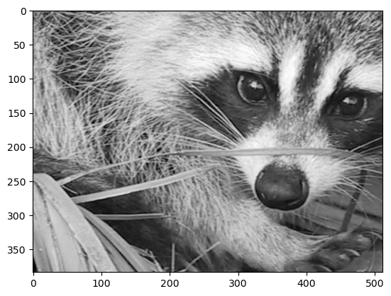
    


```python
zoom_face
```


    array([[143, 165, 175, ...,  86,  89, 102],
           [141, 145, 142, ..., 100,  98, 103],
           [138, 127, 117, ..., 100, 108, 115],
           ...,
           [  9,  13,   3, ..., 122, 117, 114],
           [ 12,  14,   3, ..., 117, 115, 113],
           [ 13,  15,   4, ..., 112, 118, 122]], dtype=uint8)


Avec cette image, on pourrait s'amuser encore un peu plus. Par exemple, accentuer les pixels qui sont proches du blanc en les saturant à une valeur de 255. Pour cela, il faut faire un zoom_image pour tous les pixels de zoom_image qui sont supérieurs à, disons, 150. Tous les pixels qui respectent cette condition sont maintenant égaux à 255. Cela donne une nouvelle image qui est un petit peu saturée.


```python
zoom_face[zoom_face > 150] = 255
plt.imshow(zoom_face, cmap=plt.cm.gray)
plt.show()
```


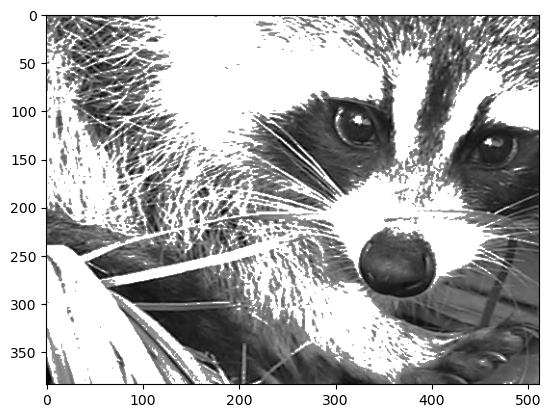
    


Maintenant, un dernier petit bonus : montrer comment réduire de moitié le poids de cette image sur le disque dur sans pour autant perdre de sa qualité d'image. On peut voir ça un peu comme une technique de compression d'image. Pour cela, il faut prendre l'image et effectuer un **slicing** en effectuant un pas de 2 par exemple sur les deux dimensions du **slicing**. 

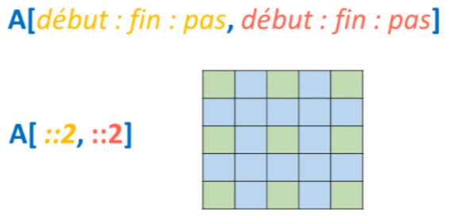

On fait ::2 pour les deux dimensions, l'axe 0 et l'axe 1.


```python
from scipy import misc
import matplotlib.pyplot as plt
face = misc.face()
face = misc.face(gray=True)
plt.imshow(face, cmap=plt.cm.gray)
plt.show()
```

    C:\Users\romeofr\AppData\Local\Temp\ipykernel_31468\3142388480.py:3: DeprecationWarning: scipy.misc.face has been deprecated in SciPy v1.10.0; and will be completely removed in SciPy v1.12.0. Dataset methods have moved into the scipy.datasets module. Use scipy.datasets.face instead.
      face = misc.face()
    C:\Users\romeofr\AppData\Local\Temp\ipykernel_31468\3142388480.py:4: DeprecationWarning: scipy.misc.face has been deprecated in SciPy v1.10.0; and will be completely removed in SciPy v1.12.0. Dataset methods have moved into the scipy.datasets module. Use scipy.datasets.face instead.
      face = misc.face(gray=True)


    


```python
compress_face = face[::2, ::2]
plt.imshow(compress_face, cmap=plt.cm.gray)
plt.show()
```


​    
​    


On peut effectuer cette opération plusieurs fois de suite. 

Si on recommence, on a encore diminué la qualité de l'image de 2 mais ça commence à se voir relativement par rapport à l'image initiale. 


```python
compress_face = compress_face[::2, ::2]
plt.imshow(compress_face, cmap=plt.cm.gray)
plt.show()
```


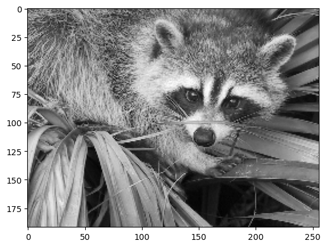
    


Si on continue ainsi, au bout d'un moment, on commence à sérieusement endommager la qualité de l'image à force de sauter à chaque fois de deux pixels.


```python
compress_face = compress_face[::2, ::2]
plt.imshow(compress_face, cmap=plt.cm.gray)
plt.show()
```


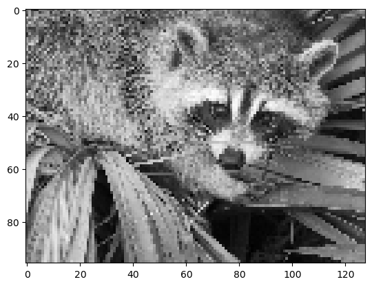
    


```python
compress_face = compress_face[::2, ::2]
plt.imshow(compress_face, cmap=plt.cm.gray)
plt.show()
```


​    
​    


```python
compress_face = compress_face[::2, ::2]
plt.imshow(compress_face, cmap=plt.cm.gray)
plt.show()
```


   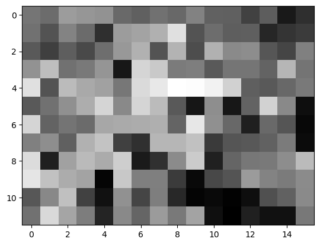


# 3. Numpy : mathématiques et statistiques #

## 3.1 Méthodes ndarray de bases sum, sum(axis=0), sum(axis = 1) ##

Il faut utiliser des méthodes sur les tableaux à une dimension, qui sont les objets de cette classe. Ces méthodes sont toutes documentées à une adresse spécifique https://numpy.org/doc/stable/reference/generated/numpy.ndarray.html. 

Il s'agit des méthodes les plus basiques mais aussi les plus utiles, retrouvées dans presque tous les codes de machine learning que l'on peut trouver sur GitHub par exemple. 

Il y a des méthodes pour faire la somme de tous les éléments d'un tableau, pour trier le tableau, pour trouver le maximum et le minimum, ou pour calculer la moyenne. En somme, il s'agit de méthodes essentielles dont on ne peut se passer.

Par exemple, pour faire la somme de tous les éléments d'un tableau $A$, il suffit d'écrire 


```python
import numpy as np
np.random.seed(0)

A = np.random.randint(0, 10, [2,3])
A
```


    array([[5, 0, 3],
           [3, 7, 9]])


```python
A.sum()
```


    27


Maintenant, il y a quelque chose de plus intéressant : utiliser la méthode $sum()$ sur un des axes du tableau, par exemple l'axe 0. C'est là que certaines personnes peuvent commencer à se perdre en se demandant ce que cela signifie de faire la somme selon l'axe 0. Est-ce que cela signifie sommer les lignes, les colonnes ou les éléments dans une même ligne? 


```python
A.sum(axis=0)
```


    array([ 8,  7, 12])


De la même manière, si on fait la somme selon l'axe 1, qui est l'axe horizontal, on fait la somme de tous les éléments qui se suivent horizontalement. Ainsi, 5 plus 0 plus 3 donne 8, et 3 plus 7 plus 9 donne 19.


```python
A.sum(axis=1)
```


    array([ 8, 19])


Il est essentiel de bien comprendre comment travailler sur les axes, car cette technique sera utilisée dans presque toutes les fonctions qu'on peut avoir dans NumPy. Typiquement, quand on a un Dataset qui vient du monde réel, on pourra avoir dans une colonne tous les prix de tous les appartements, 

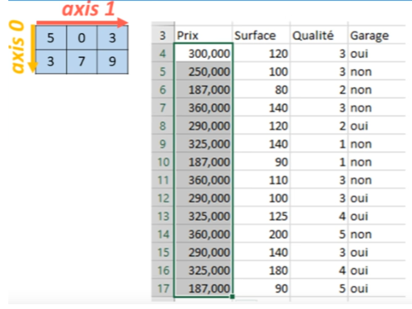

donc on voudra faire la moyenne selon cette colonne. Il faut donc savoir travailler sur l'axe 0.

Il y a aussi plein d'autres méthodes de base. 


```python
A.cumsum()
```


    array([ 5,  5,  8, 11, 18, 27])


Il est également possible de faire le produit du tableau, ce qui ici donne zéro


```python
A.prod()
```


    0


## 3.2 min() et argmin(), max() et argmax()

Il est possible de chercher le minimum selon certains axes du tableau. Par exemple, le minimum suivant l'axe 0 serait 3, 0, 3. 


```python
A.min(axis=0)
```


    array([3, 0, 3])


Il est important de se rappeler que les nombres sont comparés verticalement.

Une méthode parfois bien plus utile que simplement trouver le minimum, c'est de trouver la position du minimum. 

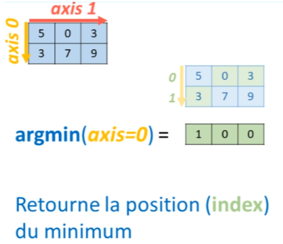

Pour cela, la méthode argmin est utilisée. Donc, la position du minimum dans l'axe 0 serait à chaque fois 0, 0 car le 3, qui est le minimum sur la première colonne, occupe l'index 0 dans l'axe 0. 


```python
A.argmin(axis=0)
```


    array([1, 0, 0], dtype=int64)


Tout comme il y a une fonction $min()$ et une fonction $argmin()$, il y a aussi une fonction $max()$ et une fonction $argmax()$.

## 3.3 argsort() ##

Une méthode qui pourrait être intéressante à présenter, c'est la méthode $argsort()$. On connait bien la méthode $sort()$, qui est exactement la même méthode qu'on a sur les listes et qui permet de trier une liste du plus petit au plus grand ou vice versa. 

La méthode $argsort()$ va retourner la façon dont il faudrait agencer nos différents indices afin de trier un tableau soit du plus grand au plus petit ou inversement.

Par exemple, si on a un tableau à une dimension dans lequel il y a 1, 3, -2 et 5. Typiquement, si on utilisait la méthode $sort()$, ça donnerait -2, 1, 3, 5, rangé du plus petit au plus grand.


Ce que va faire $argsort()$, c'est prendre le tableau initial et regarder quel est le plus petit élément, qui est -2. Il va chercher son index, qui est 2, et va retourner ce chiffre en premier, en signalant qu'il faut d'abord placer l'indice 2. Ensuite, le deuxième plus petit élément dans le tableau est le 1, qui est situé à l'indice 0, donc il va retourner 0, puis l'indice 1 et pour finir l'indice 3.


Cette méthode est très utile pour effectuer des classements un petit peu sophistiquée dans un tableau Numpy.

## 3.4 Fonctions mathématiques : np.exp(), log, cos, sin, sinh .... ##

Pour faire un peu de mathématiques, on se rend compte que l'on a vite fait le tour. On pourrait croire qu'il y a beaucoup ici, mais pour faire des mathématiques, il n'y en a pas énormément. 

Cependant, il faut se rappeler que ce qui est présent ici, ce sont les méthodes les plus basiques et en même temps les plus utiles. 

Il existe beaucoup d'autres fonctions à l'intérieur de NumPy qui sont en dehors de la classe ndarray.

Ces fonctions se trouvent dans toutes les routines de NumPy. Par exemple, la page documentant toutes les fonctions mathématiques liées à NumPy, https://docs.scipy.org/doc/numpy-1.13.0/reference/routines.math.html, présente les fonctions trigonométriques comme $sinus()$ et $cosinus()$, les fonctions hyperboliques, des fonctions qui permettent de faire des sommes, des produits, des exponentielles, des logarithmes, des opérations arithmétiques, etc. On a vraiment tout ce dont on a besoin pour faire de la modélisation, de l'ingénierie, de la physique et autres.

Pour accéder à ces fonctions, il ne faut pas écrire $A.exp()$ car cela va retourner une erreur indiquant que l'objet de la classe $ndarray$ n'a pas d'attribut ou de méthode exponentielle. 

Pour charger ces fonctions, il faut écrire $np.exponentiel()$ à l'intérieur de laquelle on fait passer le tableau $A$. 


```python
# A.exp()
```

Pour charger ces fonctions, il faut écrire $np.exponentiel()$ à l'intérieur de laquelle on fait passer le tableau $A$. 


```python
np.exp(A)
```


    array([[1.48413159e+02, 1.00000000e+00, 2.00855369e+01],
           [2.00855369e+01, 1.09663316e+03, 8.10308393e+03]])


On obtient alors l'exponentielle pour chaque nombre qui y figure. 

De même, on pourrait faire le logarithme, même si cela retourne une petite erreur ici car le logarithme de zéro n'existe pas. 


```python
np.log(A)
```

    C:\Users\romeofr\AppData\Local\Temp\ipykernel_31468\2475394391.py:1: RuntimeWarning: divide by zero encountered in log
      np.log(A)


    array([[1.60943791,       -inf, 1.09861229],
           [1.09861229, 1.94591015, 2.19722458]])


## 3.5 Statistiques: mean, var, std ##

Imaginons qu'un nouveau dataset, $A$, arrive. Ce dataset ressemble à un tableau NumPy. 


La première chose qui est souvent faite en statistiques est de déterminer le minimum et le maximum du tableau. 


```python
A
```


    array([[5, 0, 3],
           [3, 7, 9]])


```python
A.min()
```


    0


```python
A.max()
```


    9


Potentiellement, on cherchera aussi la moyenne du tableau ou la moyenne selon un des axes du tableau. 


```python
A.mean()
```


    4.5


On peut calculer l'écart type de notre tableau, ce qui fait aussi partie des méthodes disponibles sur l'objet ndarray. 


```python
A.std()
```


    2.9297326385411577


Une autre méthode intéressante est la variance. 


```python
A.var()
```


    8.583333333333334


## 3.6 corrcoef: calculer des corrélations entre lignes ou colonnes ##

Si on veut faire des statistiques un peu plus poussées, il existe des routines spécialisées pour ça. Ces routines sont documentées sur une page spécifique, https://docs.scipy.org/doc/numpy-1.13.0/reference/routines.statistics.html. Cette page présente en particulier une routine intéressante, la fonction $corrcoef()$, pour correlation coefficient. 

C'est une fonction de NumPy qui permet de tracer une matrice de corrélation pour le tableau $A$. Cela signifie qu'on va pouvoir comprendre quelles sont les corrélations entre les différentes lignes ou potentiellement les différentes colonnes du tableau $A$, ou même les différentes corrélations qu'on pourrait avoir entre plusieurs lignes, plusieurs colonnes de n'importe quel tableau différent d'un ndarray.


```python
np.corrcoef(A)
```


    array([[ 1.        , -0.56362148],
           [-0.56362148,  1.        ]])


En faisant passer la matrice $A$ à l'intérieur de la fonction $corrcoef()$, cela retourne un ndarray. Ce tableau est une matrice de corrélation. Par exemple, il y a la corrélation entre la ligne 1 et la ligne 1, ces deux lignes étant identiques, la corrélation est de 1. A cette position, il y a la corrélation entre la ligne 1 et la ligne 2, qui est intéressante. Ensuite, à la ligne 1, on trouve la corrélation entre la ligne 2 et la ligne 1, qui est exactement identique à la corrélation entre la ligne 1 et la ligne 2. C'est comme comparer des pommes avec des poires plutôt que de comparer des poires avec des pommes, c'est la même chose. Pour finir, il y a la corrélation entre la ligne 2 et la ligne 2, qui donne encore une fois une corrélation de 1.


En présence d'un ndarray, pour accéder à la corrélation en haut à droite de ce tableau de corrélation, on peut faire de l'indexing. Par exemple, pour accéder à cet élément qui est à la première ligne, deuxième colonne, on peut écrire [0,1], où 0 désigne la ligne et 1 désigne la colonne. Cela donne le coefficient de corrélation entre la ligne 1 et la ligne 2.


```python
np.corrcoef(A)[0,1]
```


    -0.5636214801906779


## 3.7 np.unique: compter le nombre de répétitions dans notre dataset ##

Une autre chose couramment faite en statistiques est de trouver le nombre de fois que certains éléments se répètent à l'intérieur d'un ndarray. Pour cela, on peut utiliser la fonction $np.unique()$. Cette fonction retourne à la fois un tableau qui contient les différentes entités présentes dans le ndarray, ainsi que le nombre de répétitions pour chacune de ces entités. Par exemple, en écrivant $np.unique(A, return_counts=True)$, cela donne deux ndarrays. Le premier contient les différentes entités présentes dans $A$, et le deuxième tableau donne le nombre de répétitions pour chacune de ces entités.

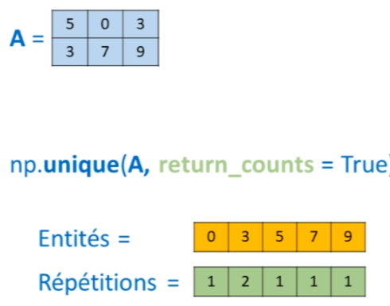


```python
np.unique(A, return_counts=True)
```


    (array([0, 3, 5, 7, 9]), array([1, 2, 1, 1, 1], dtype=int64))


Cette fonction est vraiment très utile, surtout quand il y a un très grand Dataset avec des centaines de milliers de nombres. Par exemple, si le tableau est agrandi pour avoir deux dimensions, 5 par 5, donc contenant 25 éléments, et qu'il y a plusieurs répétitions de nombres, on peut voir combien de fois tous ces nombres se répètent en utilisant $np.unique()$. Cela donnera un tableau contenant toutes les entités de 0 à 9, et un autre tableau montrant le nombre de fois que chaque nombre se répète.


```python
np.random.seed(0)
A = np.random.randint(0, 10, [5,5])
A
```


    array([[5, 0, 3, 3, 7],
           [9, 3, 5, 2, 4],
           [7, 6, 8, 8, 1],
           [6, 7, 7, 8, 1],
           [5, 9, 8, 9, 4]])


```python
np.unique(A, return_counts=True)
```


    (array([0, 1, 2, 3, 4, 5, 6, 7, 8, 9]),
     array([1, 2, 1, 3, 2, 3, 2, 4, 4, 3], dtype=int64))


## 3.8 Exercice: Argsort() + np.unique() pour trier les répétition d'un tableau Numpy ##

La fonction $Argsort()$ utile et agréable à utiliser ici. Si les deux tableaux sont enregistrés dans des variables, en créant un tableau value pour le premier tableau et un tableau counts pour le deuxième, l'$Argsort()$ peut classer un autre tableau value et counts pour trouver les éléments qui apparaissent le plus souvent ou le moins souvent dans la Dataset. En utilisant la méthode $Argsort()$, cela donne un tableau des différents index qui permettent de trier counts.


```python
value, counts = np.unique(A, return_counts=True)
counts
```


    array([1, 2, 1, 3, 2, 3, 2, 4, 4, 3], dtype=int64)


En injectant tous ces index à l'intérieur du tableau value, value est réorganisé, indiquant quel nombre apparaît le plus souvent dans le tableau. 


En écrivant un peu plus de code, il est possible d'afficher à l'écran toutes les valeurs selon leur fréquence d'apparition, en commençant par les valeurs qui apparaissent le moins souvent et en terminant par les valeurs qui apparaissent le plus souvent.

Tous ces index sont injectés à l'intérieur du tableau 'value', ce qui permet de réorganiser 'value'. Cette opération indique quel nombre apparaît le plus souvent dans le tableau. Par exemple, le nombre 8 peut apparaître le plus souvent, suivi du nombre 7, puis du nombre 9, etc.


```python
value[counts.argsort()]
```


    array([0, 2, 1, 4, 6, 3, 5, 9, 7, 8])


En ajoutant un peu plus de code, il est possible d'accomplir des choses vraiment intéressantes. Par exemple, l'écriture de cette petite ligne $value[counts.argsort()]$ suivit de $counts[counts.argsort()]$, permet indirectement de trier counts. Tout cela est placé dans un **zip** qui est contenu dans une boucle for. L'ensemble est ensuite écrit dans une chaîne de caractères où la fonction **format** intégrée est utilisée. Cela permet d'afficher à l'écran toutes les valeurs selon leur ordre d'apparition, en commençant par les valeurs qui apparaissent le moins souvent et en terminant par les valeurs qui apparaissent le plus souvent.


```python
for i, j in zip(value[counts.argsort()], counts[counts.argsort()]):
    print(f'valeur {i} apparait {j} fois')
```

    valeur 0 apparait 1 fois
    valeur 2 apparait 1 fois
    valeur 1 apparait 2 fois
    valeur 4 apparait 2 fois
    valeur 6 apparait 2 fois
    valeur 3 apparait 3 fois
    valeur 5 apparait 3 fois
    valeur 9 apparait 3 fois
    valeur 7 apparait 4 fois
    valeur 8 apparait 4 fois


## 3.9 NaN Not a Number: np.nanmean() et np.nanstd() ##

Très souvent, lorsqu'on collecte des données réelles, il manque des nombres ou on a des données corrompues. Cela se traduit par la présence d'une entité dans le tableau appelée **'NaN' (Not a Number)**, ce qui signifie qu'il n'y a pas de nombre. Comment peut-on alors calculer une moyenne sans nombre ? Ça ne fonctionne tout simplement pas. C'est démontrable en utilisant la méthode $mean()$ sur cet objet, cela retourne 'NaN'. 


```python
A = np.random.randn(5, 5)
A[0, 2] = np.nan # insere un NaN dans la matrice A
A[4, 3] = np.nan # insere un NaN dans la matrice A
A 
```


    array([[ 0.44386323,  0.33367433,         nan, -0.20515826,  0.3130677 ],
           [-0.85409574, -2.55298982,  0.6536186 ,  0.8644362 , -0.74216502],
           [ 2.26975462, -1.45436567,  0.04575852, -0.18718385,  1.53277921],
           [ 1.46935877,  0.15494743,  0.37816252, -0.88778575, -1.98079647],
           [-0.34791215,  0.15634897,  1.23029068,         nan, -0.38732682]])


```python
A.mean()
```


    nan


C'est le cas également pour les quartiles, la variance, bref pour toutes les statistiques qu'on pourrait vouloir calculer.C'est pour cela que **lorsqu'on importe des données du monde extérieur, il est toujours nécessaire de filtrer, préparer, corriger ces données.** Cela sera détaillé dans des vidéos dédiées à Pandas. Cependant, deux ou trois astuces peuvent être montrées avec NumPy. Par exemple, sur la page des routines de statistiques de NumPy, il y a quelques fonctions qui permettent de calculer des moyennes **(nanmean()**), des écarts-types (**nanstd()**) ou des variances(**nanvar()**) tout en ignorant les entités 'NaN' présentes dans le tableau.

Par exemple, en utilisant la fonction $np.nanmean()$, il est possible de passer le tableau à travers cette fonction et obtenir la moyenne pour ce tableau. 


```python
print('moyenne sans NaN:', np.nanmean(A)) # calcule la moyenne de A en ignorant les NaN
```

    moyenne sans NaN: 0.010707879575141632


```python
print('variance sans NaN:', np.nanvar(A)) # calcule la variance de A en ignorant les NaN
```

    variance sans NaN: 1.213857100788078


```python
print('écart type sans NaN:', np.nanstd(A)) # calcule l'écart type' de A en ignorant les NaN
```

    écart type sans NaN: 1.1017518326683546


Comment compter le nombre de fois qu'un NaN est retrouvé dans le tableau. Pour cela, il y a une méthode intéressante. La première chose est d'utiliser une fonction appelée $isnan()$. Lorsque le tableau est passé à travers cette fonction, elle retourne un masque NumPy, un tableau rempli de booléens où chaque **True** désigne la présence d'un NaN. 


```python
np.isnan(A)
```


    array([[False, False,  True, False, False],
           [False, False, False, False, False],
           [False, False, False, False, False],
           [False, False, False, False, False],
           [False, False, False,  True, False]])


```python
np.isnan(A).sum()
```


    2


Maintenant, il y a encore quelque chose d'autre à montrer. Si l'on veut connaître le ratio de 'NaN' dans le tableau par rapport à la taille totale du tableau, cela se fait en divisant par la taille du tableau. Pour cela, on utilise l'attribut **size**, qui est vraiment très utile. On peut voir qu'il y a 0.08, ce qui signifie qu'il y a huit pour cent de toutes les valeurs du tableau qui sont des valeurs 'NaN'.


```python
print('ratio NaN/zise:', (np.isnan(A).sum()/A.size)) # calcule la proportion de NaN dans A
```

    ratio NaN/zise: 0.08


En regroupant toutes ces fonctionnalités, toutes ces méthodes, tous ces attributs de NumPy, on peut faire des choses vraiment intéressantes. Pour terminer, comment se débarrasser des 'NaN' dans un tableau NumPy sera montré, simplement en utilisant NumPy. Pour cela, on utilise l'indexation booléenne. Parce que si on fait $np.isnan()$, cela donne un masque. Ce masque peut être réinjecté dans le tableau $A$ et on peut dire que tout cela est maintenant égal à une valeur par défaut, par exemple 0. Donc, après cela, le tableau $A$ ressemble au tableau suivant où 0 a remplacé les 'NaN'. Espérons que cette petite astuce ait été utile. 


```python
A[np.isnan(A)] = 0
A
```


    array([[ 0.44386323,  0.33367433,  0.        , -0.20515826,  0.3130677 ],
           [-0.85409574, -2.55298982,  0.6536186 ,  0.8644362 , -0.74216502],
           [ 2.26975462, -1.45436567,  0.04575852, -0.18718385,  1.53277921],
           [ 1.46935877,  0.15494743,  0.37816252, -0.88778575, -1.98079647],
           [-0.34791215,  0.15634897,  1.23029068,  0.        , -0.38732682]])


# 4 Numpy : Algèbre linéaire

## 4.1 Transposée et produit matricielle dot()

Imaginons que deux matrices $A$ et $B$ de dimensions (2 x 3) et ( 3 x2) sont créées. L'une des premières choses que l'on peut faire avec de telles matrices est d'aller chercher l'attribut **T**, qui permet de transposer simplement la matrice.


```python
A = np.ones((2,3))
B = np.ones((3,2))
```


```python
A
```


    array([[1., 1., 1.],
           [1., 1., 1.]])


```python
B
```


    array([[1., 1.],
           [1., 1.],
           [1., 1.]])


Donc, au début, la matrice $A$ est de dimension 2 lignes, 3 colonnes, maintenant elle est de 3 lignes, 2 colonnes.


```python
print(A.T) # transposé de la matrice A (c'est un attribut de ndarray)
```

    [[1. 1.]
     [1. 1.]
     [1. 1.]]


Evidemment, cela modifie aussi les dimensions de la matrice.


```python
A.T.shape
```


    (3, 2)


Maintenant, si l'on veut faire un produit matriciel entre $A$ et $B$, il y a une fonction, qui est également une méthode qui appartient à la classe NumPy, c'est la méthode $dot()$. 


J'aime bien écrire $A.dot(B)$, et cela donne le produit matriciel entre $A$ et $B$. Dans ce cas, on obtient une matrice de 2 remplie de 3. 


```python
A.dot(B) # produit matriciel A.B
```


    array([[3., 3.],
           [3., 3.]])


Comme tu le sais sûrement si tu es initié à l'algèbre linéaire, si je fais le calcul dans l'autre sens, cela donne un autre résultat.


```python
B.dot(A)
```


    array([[2., 2., 2.],
           [2., 2., 2.],
           [2., 2., 2.]])


## 4.2 np.linalg : determinant, inversion, eigen values (valeurs propres)


En poursuivant l'exploration de l'algèbre linéaire avec NumPy, il y a un package entièrement dédié à cela qui est numpy.linalg, https://docs.scipy.org/doc/numpy-1.13.0/reference/routines.linalg.html.Il contient tout ce qu'il faut pour, par exemple, mesurer un déterminant, inverser une matrice, ou encore calculer les valeurs propres d'une matrice ou les vecteurs propres d'une matrice. Toutes ces fonctions sont documentées à une certaine adresse, le lien étant fourni dans la description.

Supposons que je crée une matrice carrée $A$, remplie de nombres complètement aléatoires pour éviter d'avoir une combinaison linéaire entre mes lignes et mes colonnes. Je peux calculer le déterminant de cette matrice en utilisant numpy.linalg.det. Étant donné que le déterminant n'est pas égal à zéro, il est également possible d'inverser la matrice en utilisant numpy.linalg.inv.


```python
A = np.random.randint(0, 10, [3, 3])
A
```


    array([[3, 5, 9],
           [4, 4, 6],
           [4, 4, 3]])


```python
print('det=', np.linalg.det(A)) # calcule le determinant de A
print('inv A:\n', np.linalg.inv(A)) # calcul l'inverse de A
```

    det= 23.999999999999993
    inv A:
     [[-0.5         0.875      -0.25      ]
     [ 0.5        -1.125       0.75      ]
     [-0.          0.33333333 -0.33333333]]


Très souvent, lorsqu'on manipule des données dans NumPy, il peut y avoir des combinaisons linéaires entre les lignes et les colonnes, ce qui rend impossible l'inversion de la matrice. Pour résoudre ce problème, la fonction numpy.linalg.pinv (pour "pseudo-inverse") peut être utilisée pour inverser une matrice, bien qu'il y ait quelques différences à prendre en compte.


```python
print('inv A:\n', np.linalg.inv(A)) # calcul l'inverse de A
```

    inv A:
     [[-0.5         0.875      -0.25      ]
     [ 0.5        -1.125       0.75      ]
     [-0.          0.33333333 -0.33333333]]


Pour terminer, je vais montrer comment trouver les valeurs propres et les vecteurs propres d'une matrice, car cela peut être très utile dans certains algorithmes de machine learning, par exemple pour la réduction de dimensions. Par exemple, **l'analyse en composantes principales (PCA)** utilise les valeurs propres et les vecteurs propres. Pour cela, on utilise numpy.linalg.eig, ce qui signifie "eigen" parce que "valeur propre" se dit "eigenvalue" en anglais et "vecteur propre" se dit "eigenvector".

Cela retourne deux tableaux, le premier contenant les valeurs propres et le second contenant les vecteurs propres pour la matrice 3x3.


```python
val, vec = np.linalg.eig(A)
print('valeur propre:\n', val) # valeur propre
print('vecteur propre:\n', vec) # vecteur propre
```

    valeur propre:
     [13.58872344 -3.         -0.58872344]
    vecteur propre:
     [[-6.70561268e-01 -8.32050294e-01  6.04408531e-01]
     [-5.73889829e-01 -2.53488338e-16 -7.73940635e-01]
     [-4.70104297e-01  5.54700196e-01  1.88960901e-01]]


## 4.2 Exercice de cette vidéo: Standardiser un dataset + méthode de normalisation

$\text { Standardisez la matrice suivante, c'est a dire effectuez le calcul suivant : }$
$A=\frac{A-\operatorname{mean}\left(A_{\text {columns }}\right) \text {. }}{\operatorname{std}\left(A_{\text {columns }}\right)}$

Résultat: chaque colonne doit avoir moyenne $=0$ et écart type $=1$

Pour conclure cette leçon, un petit exercice va permettre de pratiquer un peu toutes les choses vues dans cette leçon, mise à part la section de l'algèbre linéaire.

L'objectif est de travailler avec cette matrice, qui peut être recréée exactement de la même manière en utilisant le générateur d'éléments aléatoires fixé sur 0.

Il faut pouvoir standardiser les différentes colonnes de cette matrice. La standardisation d'un ensemble de données est une pratique courante en data science, en machine learning ou en statistiques, car elle permet de mettre toutes les différentes colonnes ou toutes les différentes lignes de l'ensemble de données sur une même échelle.

Il existe plusieurs techniques pour normaliser un ensemble de données. Couramment, on utilise la technique de mise à l'échelle dans laquelle on prend un tableau, on soustrait le minimum et on divise par le maximum moins le minimum.

Une autre technique bien connue est la normalisation par la moyenne, où on prend un tableau, on soustrait la moyenne du tableau, puis on divise par le maximum moins le minimum.

Mais l'exercice ici consiste à utiliser une méthode de normalisation appelée standardisation. Elle consiste à prendre le tableau, à le soustraire à la moyenne et à le diviser par l'écart type. Cependant, l'exercice ne demande pas de faire cette opération de standardisation sur tout le tableau, mais sur chaque colonne du tableau.

Suppose que ce tableau représente un ensemble de données dans lequel, par exemple, la colonne 1 représente le prix de différents appartements et la colonne 2 représente la surface de ces appartements. Il n'a pas de sens de mélanger toutes ces données ensemble pour faire la moyenne en combinant les prix et les surfaces.

Il faut donc calculer la moyenne des prix et la moyenne des surfaces, puis calculer l'écart type des prix et l'écart type des surfaces. Ensuite, il est possible de faire la standardisation de ces deux colonnes indépendamment l'une de l'autre.


```python
np.random.seed(0)
A = np.random.randint(0, 100, [10, 5])
A
```


    array([[44, 47, 64, 67, 67],
           [ 9, 83, 21, 36, 87],
           [70, 88, 88, 12, 58],
           [65, 39, 87, 46, 88],
           [81, 37, 25, 77, 72],
           [ 9, 20, 80, 69, 79],
           [47, 64, 82, 99, 88],
           [49, 29, 19, 19, 14],
           [39, 32, 65,  9, 57],
           [32, 31, 74, 23, 35]])


Standardiser, c'est une technique vraiment très utile en machine learning et en analyse de données.

Pour arriver à ce résultat, chaque colonne de $A$ doit être soustraite à la moyenne de la colonne et tout cela doit être divisé par l'écart type de la colonne. Autrement dit, il faut travailler sur l'axe vertical (axis=0). Par exemple, $A$ est défini comme $A$ moins $A.mean(axis=0)$ et tout cela est divisé par A.std(axis=0)$.

Le résultat obtenu est un tableau avec toutes les colonnes standardisées selon cette formule. Cela signifie que la moyenne de chaque colonne est égale à zéro et l'écart type de chaque colonne est égal à un.

Si on fait $A.mean(axis=0)$, on obtient une série de nombres qui sont vraiment très proches de zéro. Et si maintenant on fait $A.std(axis=0)$, tous les écarts types de toutes les colonnes sont égaux à un. Autrement dit, chacune des colonnes suit une distribution normale standard parfaitement.

C'est pour cette raison qu'on parle de standardisation, car elle distribue les données selon la distribution normale standard. Avoir des données qui suivent ce genre de distribution facilite énormément l'apprentissage statistique, simplement parce que les données sont très bien réparties.


```python
# SOLUTION
D = (A - A.mean(axis=0)) / A.std(axis=0)
D
```


    array([[-0.02206157,  0.        ,  0.13173823,  0.72539252,  0.10755798],
           [-1.56637126,  1.61579632, -1.48676006, -0.33034307,  0.96802178],
           [ 1.12513992,  1.84021247,  1.03508612, -1.14768676, -0.27965074],
           [ 0.90452425, -0.35906585,  0.99744662,  0.0102168 ,  1.01104497],
           [ 1.6104944 , -0.44883231, -1.33620208,  1.0659524 ,  0.32267393],
           [-1.56637126, -1.21184724,  0.73397016,  0.7935045 ,  0.62383626],
           [ 0.11030784,  0.76301493,  0.80924915,  1.81518411,  1.01104497],
           [ 0.1985541 , -0.80789816, -1.56203905, -0.90929485, -2.17267111],
           [-0.24267724, -0.67324847,  0.16937773, -1.24985473, -0.32267393],
           [-0.55153918, -0.7181317 ,  0.50813319, -0.77307091, -1.26918412]])


```python
print(D.mean(axis=0)) # les moyennes sont toutes = 0
print(D.std(axis=0)) # les std sont tous = 1
```

    [-2.22044605e-17 -4.44089210e-17  0.00000000e+00 -1.22124533e-16
     -4.44089210e-17]
    [1. 1. 1. 1. 1.]


# 5. Numpy : qu'est ce que c'est le Broadcasting ? Pourquoi Numpy est si PUISSANT ?!

En réalité, le broadcasting n'est pas vraiment une technique qu'il est nécessaire d'apprendre. C'est plutôt une façon dont NumPy a été construit, permettant de réaliser des calculs entre un tableau $A$ et un tableau $B$ de manière très rapide et très simple.

Typiquement, dans un langage comme C ou C++, si on veut effectuer une opération entre deux tableaux - par exemple, ajouter chacun des éléments - il faudrait écrire une boucle for qui accède à chaque index du tableau, extraire ces deux éléments, les additionner, puis passer à l'élément suivant. Avec la boucle for, il serait nécessaire d'itérer de cette manière sur tout le tableau, ce qui peut être assez long.

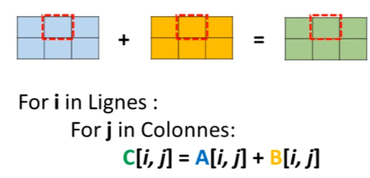

Avec NumPy, pour faire une telle addition entre un tableau $A$ et un tableau $B$, il suffit simplement d'écrire $A + B$. En réalité, tout ce système d'itérations qu'on pourrait retrouver dans un autre langage a déjà été implémenté à l'intérieur de NumPy, qui est écrit en langage C, un langage extrêmement performant. Cela simplifie énormément la tâche, car il n'est pas nécessaire de faire des itérations. Tout ce qu'il faut, c'est $A+B$.


## 5.1 Les règles du broadcasting: meme dimensions ou dimension = 1

En effet, on pourrait penser qu'il est possible de faire ce genre d'opérations uniquement lorsque les tableaux ont les mêmes dimensions. C'est-à-dire qu'on puisse les superposer parfaitement l'un au-dessus de l'autre. Par exemple, si on a deux tableaux de dimensions 2,3, on peut faire $A+B$ et obtenir la somme de chacun de ces éléments.


```python
np.random.seed(0)
A = np.random.randint(0, 10,[2,3])
B = np.ones((2, 3)) 
```


```python
A
```


    array([[5, 0, 3],
           [3, 7, 9]])


```python
B
```


    array([[1., 1., 1.],
           [1., 1., 1.]])


```python
A + B
```


    array([[ 6.,  1.,  4.],
           [ 4.,  8., 10.]])


Cependant, si on crée un tableau 'p' qui a deux lignes et deux colonnes, il est clair qu'il y aura un problème. Car nos tableaux ne peuvent pas se superposer, donc qu'est-ce qui va se passer pour les éléments 3 et 9 qui ne vont être additionnés à rien du tout? C'est pourquoi NumPy renvoie une erreur, en disant que ce genre d'opération n'est pas possible.


```python
B = np.ones((2, 2)) 
B
```


    array([[1., 1.],
           [1., 1.]])


```python
# A + B
# ValueError                                Traceback (most recent call last)
#~\AppData\Local\Temp\ipykernel_31468\2673172716.py in <module>
#----> 1 A + B

#ValueError: operands could not be broadcast together with shapes (2,3) (2,2) 
```

Mais ce n'est pas exactement cela. En réalité, il est tout à fait possible de faire des opérations entre deux tableaux qui n'ont pas la même dimension, lorsque certaines dimensions de nos tableaux peuvent être étendues. C'est ce qu'on appelle le broadcasting.

Un exemple simple serait de faire $A + 2$, 2 étant un scalaire, qui équivaut à un tableau avec une ligne et une colonne, un tableau avec un seul élément. Cela fonctionne simplement parce que ce tableau à une ligne et une colonne a été étendu pour 
couvrir toutes les dimensions du tableau $A$.


```python
A + 2
```


    array([[ 7,  2,  5],
           [ 5,  9, 11]])


De la même manière, on peut créer un tableau $B$ qui comprend deux éléments, donc un vecteur, et ensuite faire l'opération entre $A + B$. Cela fonctionne parce que les colonnes de $B$ ont été étendues pour couvrir tout le tableau $A$.


```python
B = np.ones((2,1))
A + B
```


    array([[ 6.,  1.,  4.],
           [ 4.,  8., 10.]])


Cependant, il pourrait être tentant de créer un tableau $B$ dans lequel il y a trois lignes et essayer de faire $A + B$ pour faire la même chose sur les lignes. Malheureusement, cela ne fonctionne pas. 


En fait, lorsque l'on fait du broadcasting, il y a des règles très claires et simples à suivre.


```python
B = np.ones((3,1))
# A + B
# ValueError                                Traceback (most recent call last)
# ~\AppData\Local\Temp\ipykernel_31468\3623777620.py in <module>
#      1 B = np.ones((3,1))
#----> 2 A + B

#ValueError: operands could not be broadcast together with shapes (2,3) (3,1) 

```

Chaque dimension dans $A$ et $B$ doit être égale respectivement - même nombre de lignes en $A$, même nombre de lignes en $B$, même nombre de colonnes en $A$, même nombre de colonnes en $B$. 

Ou, lorsque l'on a une différence entre les deux dimensions, la dimension respective est égale à 1.

Par exemple, on avait précédemment deux lignes, trois colonnes dans nos deux tableaux, ce qui fonctionnait. 


Ensuite, on avait un tableau $B$ avec deux lignes et deux colonnes, donc c'était au niveau des colonnes (c'est-à-dire, de l'axe 1) qu'il y avait un problème, parce qu'il y avait une différence entre 2 et 3. 


Ensuite, on avait pris un tableau $B$ qui avait deux lignes et une seule colonne. Donc, on avait pour les colonnes 1,3 et 1,1 et c'est là que le broadcasting pouvait s'effectuer, parce que le 1 était étendu à la dimension 3 que l'on avait dans le tableau 1.


Par contre, dans le dernier cas, on a créé un tableau $B$ dans lequel il y a trois éléments sur l'axe 0 et on a essayé de le superposer à un tableau $B$ dans lequel il y a deux éléments sur l'axe 0. 

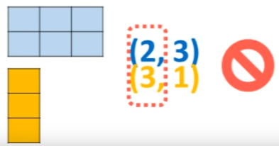

Même si on voit les choses imprimées telles qu'elles sont, on pourrait penser qu'on va réussir à faire le broadcasting, mais ce n'est pas le cas. La technique pour être sûr que le broadcasting fonctionne, c'est d'écrire l'une au-dessus de l'autre les deux dimensions des tableaux et de vérifier si ça correspond ou pas.

## 5.2 Mini exercice de broadcasting

Il pourrait y avoir des différences intéressantes lors d'opérations sur des tableaux. Prenons par exemple un exercice hypothétique : Quel serait le résultat d'une opération entre un tableau (4,1) et (1,3)? 

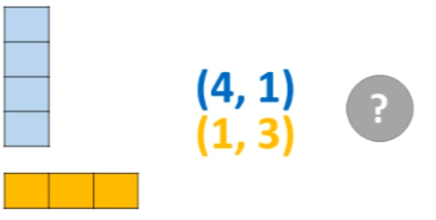

Après une réflexion, le résultat pourrait paraître surprenant. En réalité, le vecteur $A$ et le vecteur $B$ s'étendront mutuellement l'un sur l'autre pour couvrir une surface de 4 par 3.


Si cela est compilé, le résultat est un vecteur avec quatre lignes et trois colonnes. Cette technique peut sembler incroyablement utile, mais il est recommandé de faire preuve de prudence. Un exemple illustrera pourquoi.


```python
np.random.seed(0)
A = np.random.randint(0, 10,[4,1])
B = np.ones((1, 3)) 

print('La matrice A = \n', A)
print('La matrice B = \n', B)
```

    La matrice A = 
     [[5]
     [0]
     [3]
     [3]]
    La matrice B = 
     [[1. 1. 1.]]


```python
A + B
```


    array([[6., 6., 6.],
           [1., 1., 1.],
           [4., 4., 4.],
           [4., 4., 4.]])


Pour bien comprendre l'exemple, il est important de savoir qu'en travaillant avec des tableaux ayant des dimensions incomplètes (c'est-à-dire un tableau avec (3,) - il manque une dimension), le résultat obtenu est exactement le même. Cela peut sembler déroutant, car le '3' ne semble pas se superposer avec le '4', donc on pourrait penser que cela ne fonctionnerait pas.


```python
np.random.seed(0)
A = np.random.randint(0, 10,[4,1])
B = np.ones((3,)) 

print('La matrice A = \n', A)
print('La matrice B = \n', B)
```

    La matrice A = 
     [[5]
     [0]
     [3]
     [3]]
    La matrice B = 
     [1. 1. 1.]


```python
A + B
```


    array([[6., 6., 6.],
           [1., 1., 1.],
           [4., 4., 4.],
           [4., 4., 4.]])


Cependant, lorsqu'on travaille avec des dimensions incomplètes comme (3,), le '3' est considéré comme la dernière dimension du tableau. En réalité, il est donc comme si c'était la dimension sur l'axe 1 pour le tableau $A$.

Par conséquent, en travaillant avec des tableaux dont les dimensions ne sont pas complètes, par exemple un tableau avec (3,), des opérations de broadcasting non intentionnelles et non souhaitées pourraient se produire dans des programmes de machine learning, ce qui pourrait être dangereux.

C'est pourquoi il est toujours recommandé de vérifier les dimensions des matrices et des tableaux, et d'utiliser la fonction 'reshape' pour redimensionner les matrices lorsqu'elles sont incomplètes. C'est un point très important.

## 5.3 Exemple en Machine Learning (DANGER)

Considérons cet exemple. C'est le code écrit précédemment pour réaliser une régression linéaire et une régression polynomiale dans une série d'apprentissage automatique. Dans cette série, un ensemble de données a été créé à l'aide d'une fonction "make_regression" qui renvoie un tableau $X$ et un tableau $Y$. Cependant, cette fonction, lorsqu'elle est utilisée, renvoie un tableau $Y$ dont les dimensions sont incomplètes, à savoir (100,).


```python
import numpy as np
from sklearn.datasets import make_regression

import matplotlib.pyplot as plt

np.random.seed(0) #pour toujours reproduire le même Dataset
X, Y = make_regression(n_samples=100, n_features=1, noise=10)
plt.scatter(X, Y) #afficher les résultats. X en absice et y en ordonnée
```

```python
print ('Tableau X est de dimension = ', X.shape)
print ('Tableau y est de dimension = ', Y.shape)

#important de redimensionner le tabeau y
#y = np.reshape(y.shape[0], 1)
print ('Tableau y est de dimension = ', Y.shape)

```

    Tableau X est de dimension =  (100, 1)
    Tableau y est de dimension =  (100,)
    Tableau y est de dimension =  (100,)


Il a été expliqué qu'il est très important de redimensionner le tableau $Y$ pour qu'il ait les dimensions (100,1). Cette ligne a été désactivée dans le code actuel pour illustrer l'impact d'un mauvais broadcasting sur le code de régression linéaire.

Imagine la situation : un vecteur $X$ contenant 100 éléments et un vecteur $Y$ contenant également 100 éléments. Si on veut simplement soustraire $y$ de $X$, on s'attend à obtenir un résultat contenant 100 éléments, c'est-à-dire un vecteur avec $x_1-y_1, x_2-y_2,...$


```python
X - Y
print ('Tableau X - Y est de dimension = ', (X-Y).shape)
```

    Tableau X - Y est de dimension =  (100, 100)


Cependant, ce n'est pas du tout ce qui se passe ici. Le broadcasting, tel qu'il est effectué, donne un tableau beaucoup plus grand. Il donne un tableau dont les dimensions sont (100 x 100), soit 100 lignes et 100 colonnes. Le résultat est donc un tableau de 100 par 100. C'est le même type de broadcasting que dans l'exemple théorique donné précédemment.

Ce genre de chose peut avoir des conséquences désastreuses sur le code d'apprentissage automatique. Par exemple, lors de l'utilisation du gradient et de la soustraction du modèle de y, le résultat ne sera pas une colonne de 100 éléments, mais un tableau de 100 lignes et 100 colonnes. Par conséquent, le gradient sera hors de contrôle.

Si toutes les lignes de code sont exécutées jusqu'à la fin, le modèle obtenu est un charabia absolu. Ce n'est pas du tout un modèle, car il ne contient rien de compréhensible. Tout cela est simplement dû au fait de ne pas travailler avec les bonnes dimensions dans les vecteurs et les matrices.


L'importance de la méthode de redimensionnement, déjà mentionnée et sur laquelle il a été insisté, est donc bien comprise. Il est crucial de redimensionner correctement les vecteurs $Y$. En redimensionnant correctement, le résultat de $X-Y$ donnera une colonne de 100 éléments.


```python
print ('Tableau X est de dimension = ', X.shape)
print ('Tableau Y est de dimension = ', Y.shape)
print ('Tableau X-Y est de dimension = ', (X-Y).shape)

#important de redimensionner le tabeau y
y = np.reshape(Y.shape[0], 1)
print ('Tableau y est de dimension = ', y.shape)
print ('Tableau X-y est de dimension = ', (X-y).shape)

```

    Tableau X est de dimension =  (100, 1)
    Tableau Y est de dimension =  (100,)
    Tableau X-Y est de dimension =  (100, 100)
    Tableau y est de dimension =  (1,)
    Tableau X-y est de dimension =  (100, 1)


Si tout le reste du code est exécuté, un joli modèle est obtenu. 

Les règles ne sont pas si compliquées, mais il faut être très prudent lors de leur utilisation. En fait, chaque fois qu'une opération de broadcasting est effectuée, il faut vérifier le résultat obtenu. De cette façon, on peut être sûr de ne pas rencontrer de problèmes plus tard dans le code.

# 6. Numpy : BILAN

NumPy est utilisé pour travailler avec des tableaux à une dimension ou plus. En machine learning, des tableaux à deux dimensions sont surtout créés, avec un axe 0 vertical et un axe 1 horizontal. Ce système d'axes, l'un des concepts les plus importants à comprendre dans NumPy, influence les opérations d'indexation, de slicing et d'utilisation de méthodes pour trouver le minimum d'une ligne ou le maximum d'une colonne. Il est facile d'oublier sur quel axe le travail est effectué, il est donc primordial de garder ce concept à l'esprit.

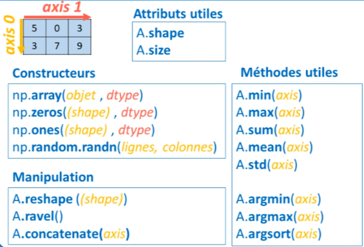


Pour ce qui est des attributs d'un tableau à une dimension, deux d'entre eux sont à retenir. Le plus important est l'attribut **shape**, qui permet d'analyser les dimensions d'un tableau, c'est-à-dire de savoir combien d'éléments se trouvent sur l'axe 0 et combien sur l'axe 1. En d'autres termes, il indique le nombre de lignes et de colonnes. Lors de la réalisation d'opérations avec des tableaux, il est important de vérifier régulièrement les dimensions des résultats obtenus pour éviter les mauvaises surprises causées par le broadcasting.

L'autre attribut important est **size**, qui permet de connaître le nombre total d'éléments dans un tableau. Les autres attributs peuvent être oubliés sans problème.

En ce qui concerne les méthodes les plus utiles, pour assembler deux tableaux ensemble, on peut utiliser la méthode **concatenate()**, soit avec l'axe 1 soit avec l'axe 0. Pour redimensionner un tableau, il convient d'utiliser **reshape()**, une méthode très utile. Même l'ajout d'un simple 1 aux dimensions peut avoir un impact majeur, comme démontré dans cette vidéo. Pour réduire un tableau à une seule dimension, la méthode **ravel()** est très efficace.

Bien sûr, les méthodes **min(), max(), sum(), prod(), mean() et std()** sont assez simples à retenir. Cependant, une des méthodes vraiment importantes à retenir est la méthode **argsort()**. Cette méthode permet de réaliser des tris et des classements dans les tableaux, ce qui peut s'avérer très utile.

Concernant les fonctions mathématiques avancées, certaines existent dans NumPy, mais la majorité se trouve dans SciPy. Il est conseillé de les utiliser avec ce dernier.

Pour conclure, lorsqu'il s'agit de sélectionner certains éléments d'un tableau ou de filtrer un tableau selon certaines conditions, le boolean indexing est une méthode très utile et largement utilisée. Enfin, il faut rester vigilant lors de l'utilisation du **broadcasting**.
