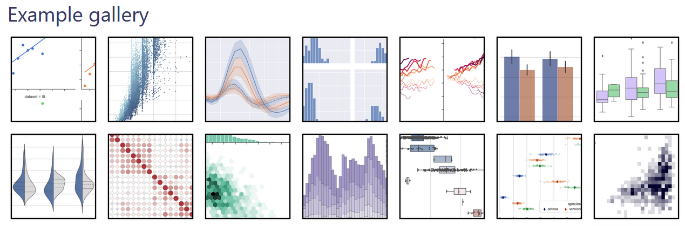
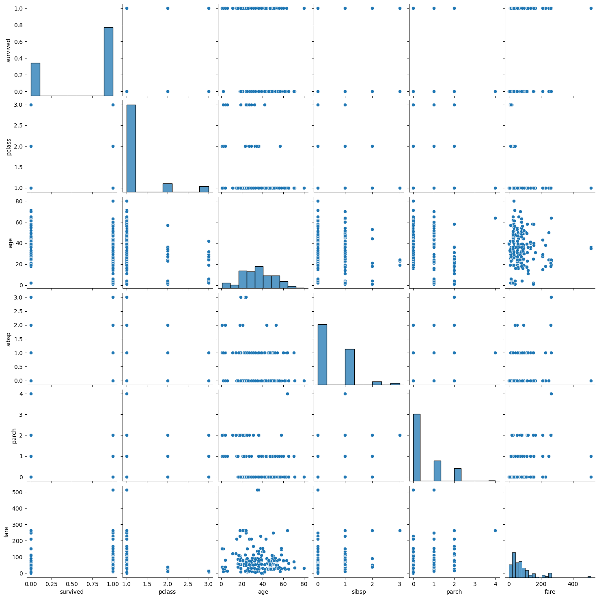
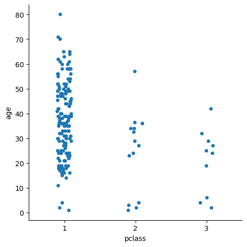
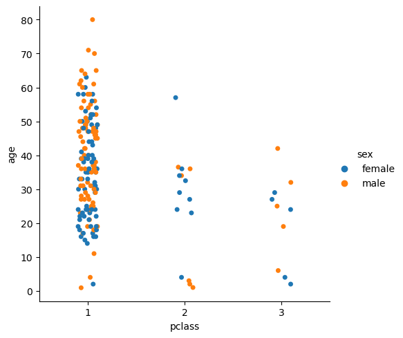
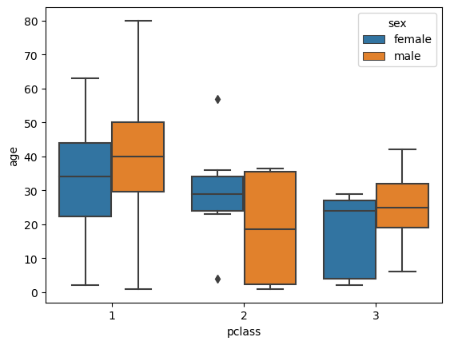
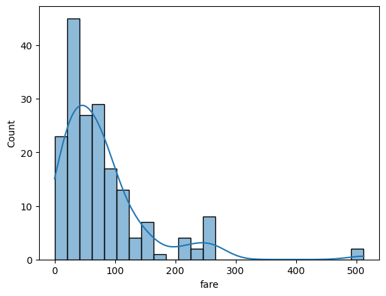
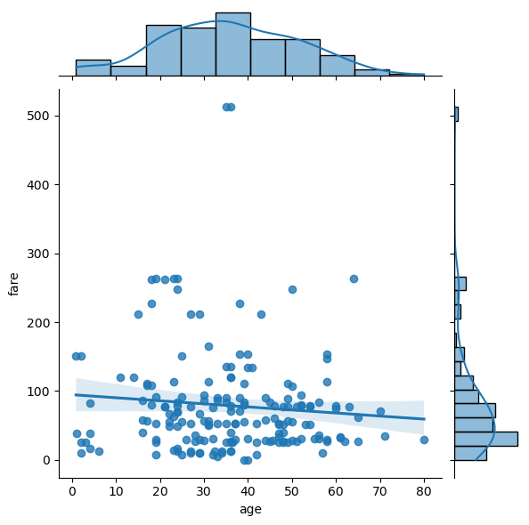
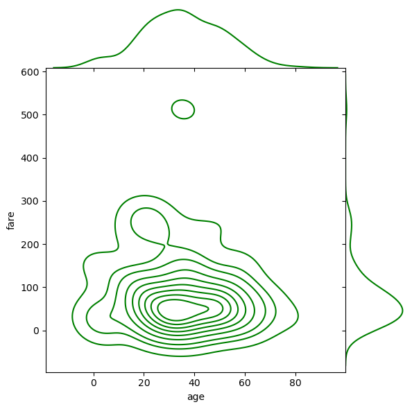
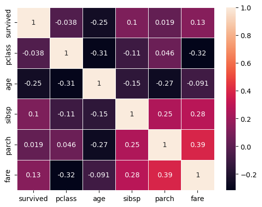
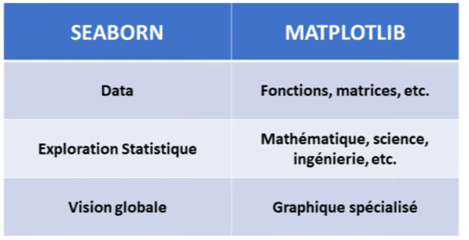

# Python pour le Machine Learning : SEABORN

[Retour README](../README.md)

[toc]

------

## 1. Intro

Vous savez, quand on cherche à résoudre un problème, il faut bien souvent commencer par visualiser ce problème. Par exemple, en physique, on cherche à observer des phénomènes, et en "data science", on cherche à visualiser nos données. 

Et comme vous le savez, pour visualiser des données dans Python, il existe Matplotlib. Mais bon, Matplotlib, eh bien, c'est Matplotlib quoi. Déjà, c'est peu esthétique, car ça ressemble à ça, 


alors qu'en réalité, c'est superbe. 

Et quand vous vous débrouillez pour sortir un graphique à peu près sympathique, il faut écrire une tonne de code, et nous, on n'est pas là pour ça. 

Notre job, c'est de résoudre des problèmes. C'est pour cette raison qu'il existe Seaborn, construit sur la base de Matplotlib et de Pandas, et qui permet de réaliser une visualisation de données très poussée en écrivant seulement une ligne de code. 

Je répète, avec Seaborn, vous pouvez créer ce genre de graphiques en écrivant simplement une seule ligne de code. 


Est-ce que vous vous rendez compte de ce que je suis en train de dire ? C'est juste incroyable ! Allez, je vous propose de découvrir les fonctions les plus utiles de Seaborn en faisant l'analyse de quelques datasets. 

## 2. Data Visualisation

Alors, imaginez que vous travaillez sur un nouveau projet. Vous importez donc des données avec Pandas, et la première chose que vous voulez faire, c'est de visualiser vos données. En l'occurrence, ici, nous avons importé un dataset sur des fleurs d'iris. 


```python
import numpy as np
import matplotlib.pyplot as plt
import pandas as pd
```


```python
iris = pd.read_csv('datasets/iris.csv')
iris.head() 
```

<table border="1" class="dataframe">
  <thead>
    <tr style="text-align: right;">
      <th></th>
      <th>sepal_length</th>
      <th>sepal_width</th>
      <th>petal_length</th>
      <th>petal_width</th>
      <th>species</th>
    </tr>
  </thead>
  <tbody>
    <tr>
      <th>0</th>
      <td>5.1</td>
      <td>3.5</td>
      <td>1.4</td>
      <td>0.2</td>
      <td>setosa</td>
    </tr>
    <tr>
      <th>1</th>
      <td>4.9</td>
      <td>3.0</td>
      <td>1.4</td>
      <td>0.2</td>
      <td>setosa</td>
    </tr>
    <tr>
      <th>2</th>
      <td>4.7</td>
      <td>3.2</td>
      <td>1.3</td>
      <td>0.2</td>
      <td>setosa</td>
    </tr>
    <tr>
      <th>3</th>
      <td>4.6</td>
      <td>3.1</td>
      <td>1.5</td>
      <td>0.2</td>
      <td>setosa</td>
    </tr>
    <tr>
      <th>4</th>
      <td>5.0</td>
      <td>3.6</td>
      <td>1.4</td>
      <td>0.2</td>
      <td>setosa</td>
    </tr>
  </tbody>
</table>
Dans ce dataset, nous avons cinq variables : une variable qui décrit la variété des fleurs et d'autres variables concernant les dimensions du pétale et du sépale. 

Pour visualiser tout cela, nous pourrions utiliser Matplotlib, par exemple, avec un graphique scatter, pour visualiser la relation entre deux colonnes de notre dataset, par exemple la longueur du sépale et la largeur du pétale. 

Cela nous donne un graphique qui ressemble à cela. 


```python
plt.scatter(iris['sepal_length'], iris['sepal_width'])
```


    <matplotlib.collections.PathCollection at 0x1cb09fa2820>


    


C'est pas mal, mais ce n'est pas très informatif comme graphique. Il manque les axes, il n'y a pas de titre, il manque des couleurs pour distinguer les différentes variétés de fleurs. 

Bref, pour rendre ce graphique utile, il faudrait écrire beaucoup de code. Et avec tout ça, nous n'aurions créé qu'un seul graphique, alors que nous avons plusieurs variables à observer dans notre dataset. 

Donc, pour s'épargner toute cette peine, nous allons importer Seaborn sous le pseudonyme sns. Ensuite, nous écrivons simplement $sns.pairplot(data=iris)$, ce qui produit une figure sur laquelle nous pouvons voir toutes les relations entre nos différentes variables. 


```python
import seaborn as sns
```


```python
sns.pairplot(iris)
```


    <seaborn.axisgrid.PairGrid at 0x1cb0a80faf0>


    


Par exemple, ici nous retrouvons le graphique que nous avions tracé juste avant, avec en abscisse la longueur des pétales et en ordonnée la largeur des sépales. 

De plus, sur cette figure, comme vous l'avez remarqué, des histogrammes apparaissent sur la diagonale. Ce qui permet de voir comment sont réparties nos données selon chaque variable. En l'occurrence, nous pouvons voir que la largeur du sépale suit une distribution normale, ce qui n'est pas le cas pour la variable "pétale width", c'est-à-dire la largeur du pétale. 

Vous pourriez penser que $Seaborn,$ c'est pas mal. Mais attendez, nous ne sommes qu'au début ! Si, par exemple, dans ma fonction $pairplot$, je rajoute $hue='variety'$, alors j'obtiens le graphique suivant sur lequel nous pouvons voir comment sont réparties nos trois variétés de fleurs en fonction de toutes les variables de notre dataset. 


```python
sns.pairplot(iris, hue = 'species')
```


    <seaborn.axisgrid.PairGrid at 0x1cb0d69ed90>


    


C'est typiquement quelque chose qui serait vraiment difficile à réaliser avec Matplotlib. 

Nous pouvons voir que l'espèce "setosa", représentée par les points bleus, se distingue très clairement des deux autres espèces de fleurs. 

En tout cas, quand nous regardons les variables de type pétale, "petal length" et "petal width", nous pouvons observer cela simplement en examinant les histogrammes de nos deux variables, car il n'y a pas de région de contact entre les zones bleues et les zones vertes et oranges. 

Contrairement aux autres variables qui concernent le sépale, nous pouvons donc affirmer, en regardant ce simple graphique, que les dimensions d'un pétale suffisent pour distinguer une variété de "setosa", c'est-à-dire la variété bleue, des autres variétés de fleurs d'iris. 

Ainsi, avec Seaborn, je peux déjà commencer à faire une analyse de données en écrivant simplement une ligne de code. Est-ce que j'ai besoin de préciser que c'est beau ? Nous pourrions très facilement intégrer ce graphique dans une présentation ou un rapport. Bref, c'est vraiment super ! 

Alors, pour découvrir Seaborn plus en détail, le plus simple, c'est que je vous montre directement leur site officiel. Car il est très simple à suivre : https://seaborn.pydata.org/index.html.

Nous avons une section "galerie" qui montre tous les graphiques que nous pouvons réaliser.


## 3. Les fonctions les plus utiles pour la visualisation

Je vous propose de découvrir les fonctions les plus utiles pour la visualisation de données. Vous verrez que ces fonctions sont utilisées de la même manière dans presque toutes les fonctions de Seaborn. 

Les paramètres communs sont $x$, $y$ et $data$, qui désignent respectivement les abscisses, les ordonnées et les données à visualiser. 

Puis viennent une série de paramètres de classification, comme par exemple les paramètres $hue$, $style$ et $size$. Si vous retenez cela, vous aurez saisi l'essentiel concernant Seaborn.


Pour illustrer cela, je vous suggère de charger le dataset du Titanic. Nous pouvons utiliser la fonction $load\_dataset$ de Seaborn, qui fournit plusieurs jeux de données pour expérimentation. 

Ces datasets sont accessibles dans le répertoire de Seaborn. https://github.com/mwaskom/seaborn


```python
titanic = sns.load_dataset('titanic')
titanic.head()
```

<table border="1" class="dataframe">
  <thead>
    <tr style="text-align: right;">
      <th></th>
      <th>survived</th>
      <th>pclass</th>
      <th>sex</th>
      <th>age</th>
      <th>sibsp</th>
      <th>parch</th>
      <th>fare</th>
      <th>embarked</th>
      <th>class</th>
      <th>who</th>
      <th>adult_male</th>
      <th>deck</th>
      <th>embark_town</th>
      <th>alive</th>
      <th>alone</th>
    </tr>
  </thead>
  <tbody>
    <tr>
      <th>0</th>
      <td>0</td>
      <td>3</td>
      <td>male</td>
      <td>22.0</td>
      <td>1</td>
      <td>0</td>
      <td>7.2500</td>
      <td>S</td>
      <td>Third</td>
      <td>man</td>
      <td>True</td>
      <td>NaN</td>
      <td>Southampton</td>
      <td>no</td>
      <td>False</td>
    </tr>
    <tr>
      <th>1</th>
      <td>1</td>
      <td>1</td>
      <td>female</td>
      <td>38.0</td>
      <td>1</td>
      <td>0</td>
      <td>71.2833</td>
      <td>C</td>
      <td>First</td>
      <td>woman</td>
      <td>False</td>
      <td>C</td>
      <td>Cherbourg</td>
      <td>yes</td>
      <td>False</td>
    </tr>
    <tr>
      <th>2</th>
      <td>1</td>
      <td>3</td>
      <td>female</td>
      <td>26.0</td>
      <td>0</td>
      <td>0</td>
      <td>7.9250</td>
      <td>S</td>
      <td>Third</td>
      <td>woman</td>
      <td>False</td>
      <td>NaN</td>
      <td>Southampton</td>
      <td>yes</td>
      <td>True</td>
    </tr>
    <tr>
      <th>3</th>
      <td>1</td>
      <td>1</td>
      <td>female</td>
      <td>35.0</td>
      <td>1</td>
      <td>0</td>
      <td>53.1000</td>
      <td>S</td>
      <td>First</td>
      <td>woman</td>
      <td>False</td>
      <td>C</td>
      <td>Southampton</td>
      <td>yes</td>
      <td>False</td>
    </tr>
    <tr>
      <th>4</th>
      <td>0</td>
      <td>3</td>
      <td>male</td>
      <td>35.0</td>
      <td>0</td>
      <td>0</td>
      <td>8.0500</td>
      <td>S</td>
      <td>Third</td>
      <td>man</td>
      <td>True</td>
      <td>NaN</td>
      <td>Southampton</td>
      <td>no</td>
      <td>True</td>
    </tr>
  </tbody>
</table>
Après avoir filtré notre dataset du Titanic avec les méthodes $drop$ et $dropna$.


```python
titanic.drop(['alone', 'alive', 'who', 'adult_male', 'embark_town', 'class'], axis=1, inplace=True)
titanic.dropna(axis=0, inplace=True)
titanic.head()
```

<table border="1" class="dataframe">
  <thead>
    <tr style="text-align: right;">
      <th></th>
      <th>survived</th>
      <th>pclass</th>
      <th>sex</th>
      <th>age</th>
      <th>sibsp</th>
      <th>parch</th>
      <th>fare</th>
      <th>embarked</th>
      <th>deck</th>
    </tr>
  </thead>
  <tbody>
    <tr>
      <th>1</th>
      <td>1</td>
      <td>1</td>
      <td>female</td>
      <td>38.0</td>
      <td>1</td>
      <td>0</td>
      <td>71.2833</td>
      <td>C</td>
      <td>C</td>
    </tr>
    <tr>
      <th>3</th>
      <td>1</td>
      <td>1</td>
      <td>female</td>
      <td>35.0</td>
      <td>1</td>
      <td>0</td>
      <td>53.1000</td>
      <td>S</td>
      <td>C</td>
    </tr>
    <tr>
      <th>6</th>
      <td>0</td>
      <td>1</td>
      <td>male</td>
      <td>54.0</td>
      <td>0</td>
      <td>0</td>
      <td>51.8625</td>
      <td>S</td>
      <td>E</td>
    </tr>
    <tr>
      <th>10</th>
      <td>1</td>
      <td>3</td>
      <td>female</td>
      <td>4.0</td>
      <td>1</td>
      <td>1</td>
      <td>16.7000</td>
      <td>S</td>
      <td>G</td>
    </tr>
    <tr>
      <th>11</th>
      <td>1</td>
      <td>1</td>
      <td>female</td>
      <td>58.0</td>
      <td>0</td>
      <td>0</td>
      <td>26.5500</td>
      <td>S</td>
      <td>C</td>
    </tr>
  </tbody>
</table>
Nous pouvons visualiser son contenu avec la fonction $pairplot$, qui est d'ailleurs très pratique lorsque vous débutez un nouveau projet pour explorer votre jeu de données.


```python
sns.pairplot(titanic)
```


    <seaborn.axisgrid.PairGrid at 0x1cb10f7c9a0>



    


Cependant, le résultat est parfois surprenant. Contrairement au dataset des fleurs d'Iris, qui présentait de jolis nuages de points, le dataset du Titanic montre des points majoritairement alignés. 

Ceci s'explique par le fait que le dataset du Titanic contient beaucoup de variables catégorielles. Par exemple, la colonne "survived" ne contient que des valeurs 0 et 1, et la colonne "pclass" contient les trois classes des passagers : 1, 2 et 3.

Si on affiche dans le graphique $pairplot$ de la colonne survive en fonction de la colonne pclass, cela nous donne un graphique avec deux lignes et trois colonnes. La raison pour laquelle je vous montre cet exemple c'est parce que dans
la vraie vie on a très souvent ce genre de situation c'est à dire un dataset avec des variables de type catégorie et dans de telles situations, il est préférable d'utiliser les fonctions de visualisation dédiées aux données catégorielles, comme $catplo$t ou $boxplot$.

Avec la fonction $catplot$, nous pouvons observer, par exemple, l'âge des passagers en fonction de leur classe. 

Si nous ajoutons le paramètre $hue$ pour distinguer les hommes des femmes, nous obtenons une vue encore plus informative.


```python
sns.catplot(x='pclass', y='age', data=titanic)
```


    <seaborn.axisgrid.FacetGrid at 0x1cb11df8760>



    


Tout cela nous donne un graphique qui, franchement, est assez impressionnant. Il est nettement plus informatif et lisible que ce que nous avions précédemment. Rappelez-vous de la possibilité d'ajouter des paramètres comme hue, size ou style. 

Par exemple, en utilisant "hue = sexe", on enrichit considérablement notre graphique. 


```python
sns.catplot(x='pclass', y='age', data=titanic, hue='sex')
```


    <seaborn.axisgrid.FacetGrid at 0x1cb11cceca0>



    


Grâce à cela, on peut observer comment les hommes et les femmes sont répartis à travers les différentes classes et tranches d'âge.

Ensuite, il y a la fonction $boxplot$. 


Un $boxplot$ nous montre la distribution des données à travers plusieurs statistiques, telles que la médiane, les quartiles, etc. 

La ligne centrale d'une boîte représente la médiane des données. On peut voir que la médiane des âges pour les hommes en première classe est de 40 ans. 

Les bords supérieur et inférieur de la boîte correspondent au premier et au troisième quartile, montrant ainsi l'étendue interquartile des données. Ici, on observe que les hommes avaient majoritairement entre 30 ans et 50 ans.  

Les "whiskers" ou moustaches s'étendant à partir de la boîte indiquent la variabilité en dehors des quartiles, et les points en dehors de ces moustaches peuvent être considérés comme des anomalies.Ils montrent toute l'étendue des valeurs. Par défaut, cette étendue est égale à 1,5 fois la différence entre le quartile 3 et le quartile 1. Cela représente la plupart de nos données, à l'exception des valeurs aberrantes ou anomalies. 

Par exemple, sur ce graphique, on peut voir quelques anomalies pour les femmes voyageant en 2e classe. On observe que la plupart des femmes avaient entre 25 et 35 ans, à l'exception de deux individus : une jeune fille de moins de 10 ans et une femme de plus de 55 ans.


```python
sns.boxplot(x='pclass', y='age', data=titanic, hue='sex')
```


    <Axes: xlabel='pclass', ylabel='age'>



    


Vous savez maintenant comment examiner des données catégorielles. Si vous avez des doutes, vous pouvez consulter le site de Seaborn. Il est très bien conçu. Vous pouvez aussi utiliser les graphiques $violonplot$, $barplot$ ou encore $countplot$. Il y a tant de possibilités à explorer!

Lorsqu'on réalise de la visualisation de données, il est aussi courant de vouloir observer des distributions. Par exemple, avec le jeu de données du Titanic, on peut utiliser la fonction $distplot$ pour visualiser la distribution de la variable 
tarif, c'est-à-dire la colonne "fare". NB : $displot$ depracated, replaced by $histplot$.


```python
sns.histplot(titanic['fare'], kde=True)
```


    <Axes: xlabel='fare', ylabel='Count'>



    


Lorsqu'on observe cette distribution, on se rend compte que le tarif ne suit pas une distribution normale. La plupart des gens ont opté pour le tarif le moins cher possible, à l'exception de quelques passagers particulièrement fortunés.

Pour observer des distributions avec Seaborn, il existe la fonction $histplot$, mais aussi $pairplot$, que nous avons utilisée au début. 

Une autre fonction intéressante est $jointplot$, qui permet de visualiser la distribution de deux variables simultanément. 

Pour l'utiliser, il suffit de spécifier une variable pour l'axe $x$, une pour l'axe $y$, et d'indiquer les données. Pour personnaliser le graphique, on peut utiliser l'argument "kind". Les styles "kde" et "hex" sont particulièrement esthétiques.


```python
sns.jointplot(x='age', y='fare', data=titanic, kind='hex')
```


    <seaborn.axisgrid.JointGrid at 0x1cb1275c4c0>


    


Ajout d'une régression avec ajustement de la densité du noyau.


```python
sns.jointplot(x='age', y='fare', data=titanic, kind='reg')
```


    <seaborn.axisgrid.JointGrid at 0x1cb09eaf310>



    


Remplacer $scatterplots$ et $histograms$ par des estimations de densité et aligner étroitement les axes marginaux sur les axes conjoints.


```python
sns.jointplot(x='age', y='fare', data=titanic, kind='kde', space=0, color='g')
```


    <seaborn.axisgrid.JointGrid at 0x1cb155a1100>



    


Seaborn offre vraiment beaucoup de possibilités avec un nombre limité de fonctions. 

Pour conclure, je vais vous présenter la fonction $heatmap$, qui est l'une des fonctions les plus utiles de Seaborn. Elle permet de visualiser des matrices. L'une des utilisations les plus intéressantes est la visualisation des matrices de corrélation. Si on calcule les différentes corrélations de notre jeu de données du Titanic et qu'on les visualise avec heatmap, on obtient un graphique qui permet de repérer d'un coup d'œil les variables les plus ou les moins corrélées.


```python
titanic.drop(['sex', 'embarked', 'deck'], axis=1, inplace=True)
```


```python
sns.heatmap(titanic.corr(), annot=True, linewidths=.5)
```


    <Axes: >



    


Voilà pour Seaborn ! Comme vous pouvez le voir, c'est une bibliothèque formidable. Avec peu de code, on peut créer des graphiques impressionnants. Je vous encourage à visiter leur site, en particulier les sections "tutorial" et "galerie".

Toutefois, je vous recommande de ne pas vous disperser parmi toutes ces fonctions. Retenez que la plupart des fonctions utilisent la structure x/y data, et ensuite, on peut ajouter des paramètres de style. Si vous retenez cela, vous aurez saisi l'essentiel sur Seaborn et serez bien équipé pour la visualisation de données.

## 4. Quand utiliser Seaborn et quand utiliser Matplotlib


Seaborn est beaucoup plus adapté pour travailler sur des datasets, car on est capable de créer des graphiques statistiques très intéressants avec très peu de code. 

À l'inverse, je dirais que Matplotlib est parfait pour les fonctions mathématiques, les matrices, et ce genre de choses. 

De toute façon, vous n'aurez pas le choix : lorsque vous voudrez créer des graphiques très détaillés et spécifiques, il vous faudra utiliser Matplotlib, car Seaborn reste vraiment très général.
