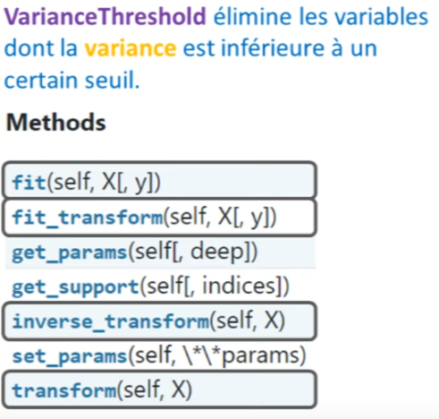
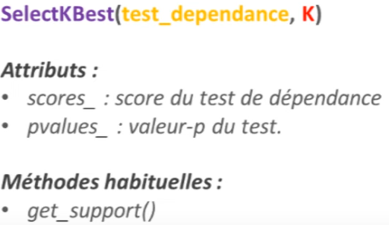
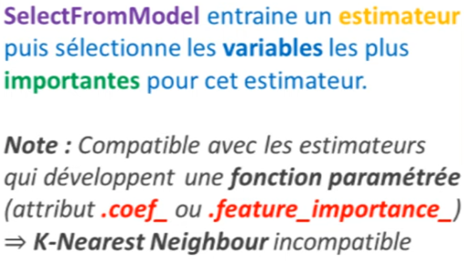
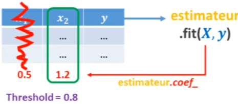
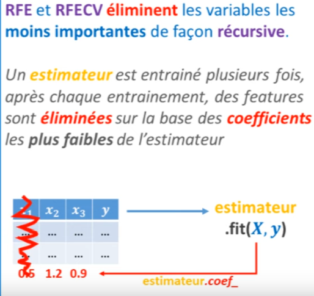
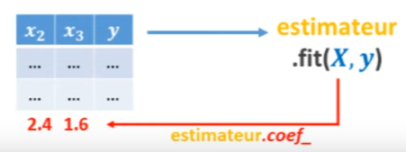
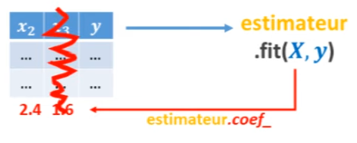
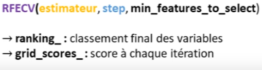

# Python pour le Machine Learning : SKLEARN Feature Selection

[Retour README](../README.md)

[toc]

------

## 1. Intro

Nous allons voir comment faire de la sélection de variables avec Scikit-Learn. 

Cette technique, comme son nom l'indique, consiste à trouver puis sélectionner les variables les plus utiles au développement d'un modèle parmi toutes les variables disponibles dans un dataset. Il s'agit là d'une des opérations les plus importantes en preprocessing, car lorsqu'on fournit trop de variables à un modèle, notamment des variables qui ne sont pas utiles au modèle, eh bien cela affecte sa performance de façon négative. 

C'est pourquoi on a développé différentes techniques afin de sélectionner les variables les plus importantes.

Pour commencer, je vous propose d'analyser un peu le contenu du module feature selection de Scikit-Learn. 

Alors, comme d'habitude, dans ce module, on va retrouver différentes choses : des transformers ainsi que des fonctions. 


Parmi les transformers, on va tout d'abord parler de VarianceThreshold. C'est donc le transformer qui permet de sélectionner les variables selon leur degré de variation, c'est-à-dire selon leur variance. 

Ensuite, nous verrons les transformers qui permettent de sélectionner nos variables à partir des tests statistiques, comme le test du chi-2, le test d'ANOVA. Parmi ceux-là, on retrouve SelectKBest ainsi que SelectPercentile, qui est très utile. Les autres sont un peu dans le même esprit. Je vous laisserai les explorer de votre côté, ils font à peu près la même chose.

Et pour finir, nous verrons les transformers qui permettent de sélectionner les variables les plus importantes à partir des coefficients d'un modèle qui a été pré-entraîné sur tout le dataset. Pour ça, le plus important c'est SelectFromModel, mais il existe également RFE et RFECV, étant des transformers qui font une sélection récursive de nos variables. 

Donc voilà pour les transformers. 

Ensuite, en dessous, on a des fonctions mathématiques qui sont en fait des tests de dépendance. Donc, on va retrouver, par exemple, le test d'ANOVA, tout ce qui est utile pour travailler sur des problèmes de classification. 

Et ensuite, en rouge, je vous ai mis les tests qui sont utiles pour les problèmes de régression. Donc on va retrouver les corrélations de Pearson et tout ce genre de choses.

## 2. VarianceThreshold

Pour commencer, nous allons parler du transformer VarianceThreshold. Celui-ci calcule la variance de toutes les variables de votre dataset, puis élimine les variables dont la variance est inférieure au seuil que vous définissez. 


Le but de cette opération est d'éliminer les variables qui ne varient que très peu, voire pas du tout. Car, en effet, à quoi cela nous sert d'avoir une variable si elle ne varie pas, c'est-à-dire si c'est une constante? Pas à grand-chose. Comme je l'ai indiqué ici, pour effectuer des prédictions, un estimateur a besoin d'information qui varie en accord avec la target.

Donc, si vous entraînez un modèle de machine learning pour prédire le prix d'appartements qui sont tous exclusivement situés à Paris, alors il est plutôt déconseillé de fournir à votre machine le fait que tous ces appartements soient à Paris. Premièrement, c'est inutile et deuxièmement, cela peut même dégrader la performance de votre modèle. 
Si jamais vous lui fournissez un appartement qui vient d'une autre ville, par exemple Marseille, alors le modèle va se dire : "Waouh, il y a un changement dans la colonne ville, mais je ne sais pas comment interpréter ce changement. Je n'ai jamais vu de changement dans cette colonne lors de mon apprentissage, donc je ne sais pas quoi faire." Je pense que vous avez bien compris avec cet exemple.

Maintenant, pour vous l'illustrer sur un dataset réel comme le dataset des fleurs d'Iris, on peut voir, en affichant nos différentes variables, que certaines variables varient pas mal, comme par exemple la variable "pétales_length" ici en vert, et d'autres variables bougent beaucoup moins, comme la variable "sepal_width". 

On peut voir que celle-ci est toujours comprise entre 3-4 tandis que la variable verte "pétales_length" passe de 1-2 à 4-5 ou 5-6. 


```python
import numpy as np
import matplotlib.pyplot as plt
import pandas as pd
```


```python
from sklearn.feature_selection import VarianceThreshold
```


```python
from sklearn.datasets import load_iris

iris = load_iris()
X = iris.data
y = iris.target

plt.plot(X)
plt.legend(iris.feature_names)
```


    <matplotlib.legend.Legend at 0x2800c638c10>


    

Ce que l'on pourrait faire, c'est utiliser le transformer VarianceThreshold afin d'éliminer la variable orange, si toutefois elle est inférieure au seuil de variance que vous définissez.



Avant toute chose, je vous propose de calculer les variances de tous nos signaux. 

Écrire "X.var(axis=0)" nous donne la variance de chacune de nos variables. 


```python
X.var(axis=0)
```


    array([0.68112222, 0.18871289, 3.09550267, 0.57713289])

La première variable, qui est peut-être "sepal_length", a une variance de 0.68, la suivante de 0.18, etc. 

À partir de là, on peut créer un objet selector, qui sera un transformer que l'on va appeler depuis la classe VarianceThreshold, dans laquelle nous allons définir un seuil égal à par exemple 0.2. Ainsi, on va éliminer cette variable. 


```python
selector = VarianceThreshold(threshold=0.2)
```

Ensuite, on va utiliser "fit_transform" et on obtient le résultat suivant : notre colonne "sepal_width", ici en orange, a été filtrée. 


```python
selector.fit_transform(X)
```


    array([[5.1, 1.4, 0.2],
           [4.9, 1.4, 0.2],
           [4.7, 1.3, 0.2],
           [4.6, 1.5, 0.2],
           [5. , 1.4, 0.2],
           [5.4, 1.7, 0.4],
           [4.6, 1.4, 0.3],
           [5. , 1.5, 0.2],
           [4.4, 1.4, 0.2],
           [4.9, 1.5, 0.1],
           [5.4, 1.5, 0.2],
           [4.8, 1.6, 0.2],
           [4.8, 1.4, 0.1],
           [4.3, 1.1, 0.1],
           [5.8, 1.2, 0.2],
           [5.7, 1.5, 0.4],
           [5.4, 1.3, 0.4],
           [5.1, 1.4, 0.3],
           [5.7, 1.7, 0.3],
           [5.1, 1.5, 0.3],
           [5.4, 1.7, 0.2],
           [5.1, 1.5, 0.4],
           [4.6, 1. , 0.2],
           [5.1, 1.7, 0.5],
           [4.8, 1.9, 0.2],
           [5. , 1.6, 0.2],
           [5. , 1.6, 0.4],
           [5.2, 1.5, 0.2],
           [5.2, 1.4, 0.2],
           [4.7, 1.6, 0.2],
           [4.8, 1.6, 0.2],
           [5.4, 1.5, 0.4],
           [5.2, 1.5, 0.1],
           [5.5, 1.4, 0.2],
           [4.9, 1.5, 0.2],
           [5. , 1.2, 0.2],
           [5.5, 1.3, 0.2],
           [4.9, 1.4, 0.1],
           [4.4, 1.3, 0.2],
           [5.1, 1.5, 0.2],
           [5. , 1.3, 0.3],
           [4.5, 1.3, 0.3],
           [4.4, 1.3, 0.2],
           [5. , 1.6, 0.6],
           [5.1, 1.9, 0.4],
           [4.8, 1.4, 0.3],
           [5.1, 1.6, 0.2],
           [4.6, 1.4, 0.2],
           [5.3, 1.5, 0.2],
           [5. , 1.4, 0.2],
           [7. , 4.7, 1.4],
           [6.4, 4.5, 1.5],
           [6.9, 4.9, 1.5],
           [5.5, 4. , 1.3],
           [6.5, 4.6, 1.5],
           [5.7, 4.5, 1.3],
           [6.3, 4.7, 1.6],
           [4.9, 3.3, 1. ],
           [6.6, 4.6, 1.3],
           [5.2, 3.9, 1.4],
           [5. , 3.5, 1. ],
           [5.9, 4.2, 1.5],
           [6. , 4. , 1. ],
           [6.1, 4.7, 1.4],
           [5.6, 3.6, 1.3],
           [6.7, 4.4, 1.4],
           [5.6, 4.5, 1.5],
           [5.8, 4.1, 1. ],
           [6.2, 4.5, 1.5],
           [5.6, 3.9, 1.1],
           [5.9, 4.8, 1.8],
           [6.1, 4. , 1.3],
           [6.3, 4.9, 1.5],
           [6.1, 4.7, 1.2],
           [6.4, 4.3, 1.3],
           [6.6, 4.4, 1.4],
           [6.8, 4.8, 1.4],
           [6.7, 5. , 1.7],
           [6. , 4.5, 1.5],
           [5.7, 3.5, 1. ],
           [5.5, 3.8, 1.1],
           [5.5, 3.7, 1. ],
           [5.8, 3.9, 1.2],
           [6. , 5.1, 1.6],
           [5.4, 4.5, 1.5],
           [6. , 4.5, 1.6],
           [6.7, 4.7, 1.5],
           [6.3, 4.4, 1.3],
           [5.6, 4.1, 1.3],
           [5.5, 4. , 1.3],
           [5.5, 4.4, 1.2],
           [6.1, 4.6, 1.4],
           [5.8, 4. , 1.2],
           [5. , 3.3, 1. ],
           [5.6, 4.2, 1.3],
           [5.7, 4.2, 1.2],
           [5.7, 4.2, 1.3],
           [6.2, 4.3, 1.3],
           [5.1, 3. , 1.1],
           [5.7, 4.1, 1.3],
           [6.3, 6. , 2.5],
           [5.8, 5.1, 1.9],
           [7.1, 5.9, 2.1],
           [6.3, 5.6, 1.8],
           [6.5, 5.8, 2.2],
           [7.6, 6.6, 2.1],
           [4.9, 4.5, 1.7],
           [7.3, 6.3, 1.8],
           [6.7, 5.8, 1.8],
           [7.2, 6.1, 2.5],
           [6.5, 5.1, 2. ],
           [6.4, 5.3, 1.9],
           [6.8, 5.5, 2.1],
           [5.7, 5. , 2. ],
           [5.8, 5.1, 2.4],
           [6.4, 5.3, 2.3],
           [6.5, 5.5, 1.8],
           [7.7, 6.7, 2.2],
           [7.7, 6.9, 2.3],
           [6. , 5. , 1.5],
           [6.9, 5.7, 2.3],
           [5.6, 4.9, 2. ],
           [7.7, 6.7, 2. ],
           [6.3, 4.9, 1.8],
           [6.7, 5.7, 2.1],
           [7.2, 6. , 1.8],
           [6.2, 4.8, 1.8],
           [6.1, 4.9, 1.8],
           [6.4, 5.6, 2.1],
           [7.2, 5.8, 1.6],
           [7.4, 6.1, 1.9],
           [7.9, 6.4, 2. ],
           [6.4, 5.6, 2.2],
           [6.3, 5.1, 1.5],
           [6.1, 5.6, 1.4],
           [7.7, 6.1, 2.3],
           [6.3, 5.6, 2.4],
           [6.4, 5.5, 1.8],
           [6. , 4.8, 1.8],
           [6.9, 5.4, 2.1],
           [6.7, 5.6, 2.4],
           [6.9, 5.1, 2.3],
           [5.8, 5.1, 1.9],
           [6.8, 5.9, 2.3],
           [6.7, 5.7, 2.5],
           [6.7, 5.2, 2.3],
           [6.3, 5. , 1.9],
           [6.5, 5.2, 2. ],
           [6.2, 5.4, 2.3],
           [5.9, 5.1, 1.8]])

C'est pas très visible,c'est pourquoi l'ensemble des transformers que l'on va voir ont tous une méthode spéciale, en plus des méthodes habituelles comme "fit" et "transform", c'est la méthode "get_support". Cette méthode retourne un tableau boolean qui nous indique quelles sont les variables qui ont été sélectionnées.


```python
selector.get_support()
```


    array([ True, False,  True,  True])

Et comme c'est un tableau boolean, on peut s'en servir pour faire du boolean indexing. Par exemple, dans notre tableau Iris, on a quelque chose qui s'appelle "feature_names", qui nous retourne la liste de nos différentes variables du dataset fleur d'Iris. 


```python
iris.feature_names
```


    ['sepal length (cm)',
     'sepal width (cm)',
     'petal length (cm)',
     'petal width (cm)']

Cette liste, on pourrait la mettre dans un tableau numpy : "np.array(iris.feature_names)". 


```python
np.array(iris.feature_names)
```


    array(['sepal length (cm)', 'sepal width (cm)', 'petal length (cm)',
           'petal width (cm)'], dtype='<U17')

Ensuite, tout ce qu'il faut faire, c'est utiliser "selector.get_support()" pour retourner les variables qui ont été sélectionnées, soit "pétale_length", "pétale_width", etc. 


```python
np.array(iris.feature_names)[selector.get_support()]
```


    array(['sepal length (cm)', 'petal length (cm)', 'petal width (cm)'],
          dtype='<U17')

On peut remarquer que la variable "sepal_width" n'a, quant à elle, pas été sélectionnée.

Donc voilà, un premier transformer très utile pour faire de la sélection de variables avec Scikit-Learn.

## 3. SelectKBest

À présent, nous allons voir une technique qui est en général bien plus puissante et plus efficace que celle que nous venons de discuter. Il s'agit de la sélection de variables basée sur les tests de dépendance. 

Pour cela, on dispose de nombreux transformateurs dans Scikit-Learn. Mais le plus simple à comprendre, et sans doute le plus efficace, c'est "SelectKBest". Ce transformateur sélectionne les k variables X dont le score de tests de dépendance avec y est le plus élevé.




En statistiques, il existe de nombreux tests de dépendance. On a 
- le test du chi-carré pour comparer des variables catégorielles, 
- le test ANOVA, 
- les corrélations de Pearson, parmi d'autres. 

Tous ces tests sont disponibles dans le module "feature_selection". Avec une interface classique, on peut retrouver des fonctions comme ANOVA, etc. 

Lorsqu'on utilise l'un de ces tests, par exemple le test du chi-carré, et qu'on lui fournit X et y, il retourne deux tableaux. 


```python
from sklearn.feature_selection import SelectKBest, chi2
```


```python
chi2(X, y)
```


    (array([ 10.81782088,   3.7107283 , 116.31261309,  67.0483602 ]),
     array([4.47651499e-03, 1.56395980e-01, 5.53397228e-26, 2.75824965e-15]))

Dans le premier tableau, on trouve le score statistique; plus il est élevé, plus il y a une dépendance entre une variable de X et la variable y. 

Dans le deuxième tableau, on retrouve les p-values (valeurs de probabilité). Je n'entrerai pas dans les détails ici, mais sachez que ces p-values sont essentielles en statistiques.

Revenons à "SelectKBest". Ce que fait ce transformateur, c'est sélectionner les variables dont le score statistique, c'est-à-dire la valeur du premier tableau, est le plus élevé. 

Si, par exemple, nous créons un "selector" avec k=1 et un test du chi-carré, alors ce selector ne retournera qu'une seule variable parmi toutes celles disponibles dans notre dataset X. 


```python
selector = SelectKBest(chi2, k=1)
selector.fit_transform(X, y)
```


    array([[1.4],
           [1.4],
           [1.3],
           [1.5],
           [1.4],
           [1.7],
           [1.4],
           [1.5],
           [1.4],
           [1.5],
           [1.5],
           [1.6],
           [1.4],
           [1.1],
           [1.2],
           [1.5],
           [1.3],
           [1.4],
           [1.7],
           [1.5],
           [1.7],
           [1.5],
           [1. ],
           [1.7],
           [1.9],
           [1.6],
           [1.6],
           [1.5],
           [1.4],
           [1.6],
           [1.6],
           [1.5],
           [1.5],
           [1.4],
           [1.5],
           [1.2],
           [1.3],
           [1.4],
           [1.3],
           [1.5],
           [1.3],
           [1.3],
           [1.3],
           [1.6],
           [1.9],
           [1.4],
           [1.6],
           [1.4],
           [1.5],
           [1.4],
           [4.7],
           [4.5],
           [4.9],
           [4. ],
           [4.6],
           [4.5],
           [4.7],
           [3.3],
           [4.6],
           [3.9],
           [3.5],
           [4.2],
           [4. ],
           [4.7],
           [3.6],
           [4.4],
           [4.5],
           [4.1],
           [4.5],
           [3.9],
           [4.8],
           [4. ],
           [4.9],
           [4.7],
           [4.3],
           [4.4],
           [4.8],
           [5. ],
           [4.5],
           [3.5],
           [3.8],
           [3.7],
           [3.9],
           [5.1],
           [4.5],
           [4.5],
           [4.7],
           [4.4],
           [4.1],
           [4. ],
           [4.4],
           [4.6],
           [4. ],
           [3.3],
           [4.2],
           [4.2],
           [4.2],
           [4.3],
           [3. ],
           [4.1],
           [6. ],
           [5.1],
           [5.9],
           [5.6],
           [5.8],
           [6.6],
           [4.5],
           [6.3],
           [5.8],
           [6.1],
           [5.1],
           [5.3],
           [5.5],
           [5. ],
           [5.1],
           [5.3],
           [5.5],
           [6.7],
           [6.9],
           [5. ],
           [5.7],
           [4.9],
           [6.7],
           [4.9],
           [5.7],
           [6. ],
           [4.8],
           [4.9],
           [5.6],
           [5.8],
           [6.1],
           [6.4],
           [5.6],
           [5.1],
           [5.6],
           [6.1],
           [5.6],
           [5.5],
           [4.8],
           [5.4],
           [5.6],
           [5.1],
           [5.1],
           [5.9],
           [5.7],
           [5.2],
           [5. ],
           [5.2],
           [5.4],
           [5.1]])


Lorsqu'on utilise "fit_transform", il faudra fournir à la fois X et y. Comme on l'a vu précédemment, cela retourne une seule variable, qui est celle ayant le score le plus élevé.

On peut vérifier cela en utilisant la méthode "get_support" de notre objet. 


```python
selector.get_support()
```


    array([False, False,  True, False])

Si, par exemple, on utilise une valeur de k=2, les scores des tests seront calculés et cela nous retournera les deux variables ayant les scores les plus élevés.


```python
selector = SelectKBest(chi2, k=2)
selector.fit_transform(X, y)
selector.get_support()
```


    array([False, False,  True,  True])

Nous avons ici un transformateur extrêmement pratique qui fonctionne avec presque tous les tests de dépendance que l'on pourrait imaginer, que ce soit le chi-carré, ANOVA, etc. 

Il vous revient de choisir le test de dépendance approprié en fonction de votre problème. 

Ensuite, vous devez décider quel transformateur utiliser pour sélectionner vos variables. "SelectKBest", par exemple, sélectionne les k variables ayant le score le plus élevé. 

Mais il y a d'autres transformateurs, comme "SelectPercentile", qui sélectionnent les variables selon un certain pourcentage de scores. 

Certains transformateurs se basent non pas sur le score de dépendance, mais sur la p-value. En somme, vous avez un large éventail de possibilités avec ces transformateurs.

## 4. SelectFromModel

Pour finir, nous allons parler d'une dernière technique de sélection de variables. Celle-ci consiste à entraîner un estimateur à partir de tout notre dataset puis d'examiner ses coefficients pour ensuite conclure quels sont les features, c'est-à-dire les variables, les plus importantes pour l'estimateur que nous avons entraîné. 

Imaginez que nous ayons deux variables, x1 et x2, et avec ces deux variables, nous cherchons à construire un modèle pour prédire la valeur de y. 

Il se trouve que quand on observe y en fonction de x1, nous obtenons une belle droite : c'est un modèle linéaire parfait. 

En revanche, quand on observe y en fonction de x2, il ne semble y avoir aucune corrélation. x2 semble un peu inutile. 

Par conséquent, si nous développons un modèle vraiment simple du type f(x1, x2) = ax1 + bx2, nous obtiendrons sûrement quelque chose du type a = 1 et b = 0. Donc, en observant nos coefficients a et b, leur signe, leur valeur, que ce soit grands ou petits, nous pourrons comprendre quelles sont les variables les plus importantes pour notre modèle. 

Dans ce cas, x1 est très important tandis que x2 ne l'est pas.


Bien sûr, pour utiliser cette technique dans notre transformateur, nous devons faire appel à un estimateur qui développe
- soit des coefficients, comme par exemple les réseaux de neurones ou les modèles linéaires, 
- soit qui calcule l'importance des variables pendant leur création, comme les arbres de décision ou les random forests. 



Vous ne pourrez pas utiliser ce transformateur sur des estimateurs comme les k-NN (k-nearest neighbors) car ils sont incompatibles. Ces derniers ne développent jamais de coefficients, ne sont pas des modèles paramétrés et retiennent en mémoire tous les échantillons fournis.

Prenons l'exemple des fleurs d'Iris. Nous allons développer un transformateur SelectFromModel en utilisant un estimateur, par exemple, SGDClassifier, que nous initialiserons avec random_state égal à 0. 

L'estimateur sera donc entraîné sur x et y. Il aura donc développé des coefficients. 



Ensuite, pour sélectionner les variables les plus importantes, nous utiliserons un critère qui, par exemple, dira que nous voulons sélectionner les variables dont les coefficients sont au-dessus de la moyenne de tous les coefficients. Nous pourrions choisir d'autres critères comme la médiane. Ces techniques sont disponibles dans la documentation. 

Pour cet exemple, nous pourrions choisir un seuil égal à la médiane.


```python
from sklearn.feature_selection import SelectFromModel
from sklearn.linear_model import SGDClassifier
```


```python
selector = SelectFromModel(SGDClassifier(random_state=0), threshold='mean' )
```

Maintenant, il ne reste plus qu'à développer notre transformateur. Pour cela, nous utiliserons la méthode fit_transform, dans laquelle nous passerons x et y. 


```python
selector.fit_transform(X, y)
```


    array([[1.4, 0.2],
           [1.4, 0.2],
           [1.3, 0.2],
           [1.5, 0.2],
           [1.4, 0.2],
           [1.7, 0.4],
           [1.4, 0.3],
           [1.5, 0.2],
           [1.4, 0.2],
           [1.5, 0.1],
           [1.5, 0.2],
           [1.6, 0.2],
           [1.4, 0.1],
           [1.1, 0.1],
           [1.2, 0.2],
           [1.5, 0.4],
           [1.3, 0.4],
           [1.4, 0.3],
           [1.7, 0.3],
           [1.5, 0.3],
           [1.7, 0.2],
           [1.5, 0.4],
           [1. , 0.2],
           [1.7, 0.5],
           [1.9, 0.2],
           [1.6, 0.2],
           [1.6, 0.4],
           [1.5, 0.2],
           [1.4, 0.2],
           [1.6, 0.2],
           [1.6, 0.2],
           [1.5, 0.4],
           [1.5, 0.1],
           [1.4, 0.2],
           [1.5, 0.2],
           [1.2, 0.2],
           [1.3, 0.2],
           [1.4, 0.1],
           [1.3, 0.2],
           [1.5, 0.2],
           [1.3, 0.3],
           [1.3, 0.3],
           [1.3, 0.2],
           [1.6, 0.6],
           [1.9, 0.4],
           [1.4, 0.3],
           [1.6, 0.2],
           [1.4, 0.2],
           [1.5, 0.2],
           [1.4, 0.2],
           [4.7, 1.4],
           [4.5, 1.5],
           [4.9, 1.5],
           [4. , 1.3],
           [4.6, 1.5],
           [4.5, 1.3],
           [4.7, 1.6],
           [3.3, 1. ],
           [4.6, 1.3],
           [3.9, 1.4],
           [3.5, 1. ],
           [4.2, 1.5],
           [4. , 1. ],
           [4.7, 1.4],
           [3.6, 1.3],
           [4.4, 1.4],
           [4.5, 1.5],
           [4.1, 1. ],
           [4.5, 1.5],
           [3.9, 1.1],
           [4.8, 1.8],
           [4. , 1.3],
           [4.9, 1.5],
           [4.7, 1.2],
           [4.3, 1.3],
           [4.4, 1.4],
           [4.8, 1.4],
           [5. , 1.7],
           [4.5, 1.5],
           [3.5, 1. ],
           [3.8, 1.1],
           [3.7, 1. ],
           [3.9, 1.2],
           [5.1, 1.6],
           [4.5, 1.5],
           [4.5, 1.6],
           [4.7, 1.5],
           [4.4, 1.3],
           [4.1, 1.3],
           [4. , 1.3],
           [4.4, 1.2],
           [4.6, 1.4],
           [4. , 1.2],
           [3.3, 1. ],
           [4.2, 1.3],
           [4.2, 1.2],
           [4.2, 1.3],
           [4.3, 1.3],
           [3. , 1.1],
           [4.1, 1.3],
           [6. , 2.5],
           [5.1, 1.9],
           [5.9, 2.1],
           [5.6, 1.8],
           [5.8, 2.2],
           [6.6, 2.1],
           [4.5, 1.7],
           [6.3, 1.8],
           [5.8, 1.8],
           [6.1, 2.5],
           [5.1, 2. ],
           [5.3, 1.9],
           [5.5, 2.1],
           [5. , 2. ],
           [5.1, 2.4],
           [5.3, 2.3],
           [5.5, 1.8],
           [6.7, 2.2],
           [6.9, 2.3],
           [5. , 1.5],
           [5.7, 2.3],
           [4.9, 2. ],
           [6.7, 2. ],
           [4.9, 1.8],
           [5.7, 2.1],
           [6. , 1.8],
           [4.8, 1.8],
           [4.9, 1.8],
           [5.6, 2.1],
           [5.8, 1.6],
           [6.1, 1.9],
           [6.4, 2. ],
           [5.6, 2.2],
           [5.1, 1.5],
           [5.6, 1.4],
           [6.1, 2.3],
           [5.6, 2.4],
           [5.5, 1.8],
           [4.8, 1.8],
           [5.4, 2.1],
           [5.6, 2.4],
           [5.1, 2.3],
           [5.1, 1.9],
           [5.9, 2.3],
           [5.7, 2.5],
           [5.2, 2.3],
           [5. , 1.9],
           [5.2, 2. ],
           [5.4, 2.3],
           [5.1, 1.8]])

Pourquoi x et y? Car au début de notre transformateur, nous avons un estimateur qu'il faut entraîner. Cet estimateur, SGDClassifier, a besoin de x et de y pour développer ses coefficients. 

Ce que nous obtenons ensuite semble indiquer que deux variables sur les quatre ont été sélectionnées. Si nous voulons savoir lesquelles, nous utiliserons, comme précédemment, la méthode get_support. 


```python
selector.get_support()
```


    array([False, False,  True,  True])

Nous constatons que ce sont les deux dernières. 

Mais maintenant, je souhaiterais examiner quels sont les coefficients qui ont été trouvés par notre estimateur.

## 5. La matrice de coefficients

J'aimerai voir quels sont les coefficients qui ont été trouvés par notre estimateur SGDClassifier, donc ce que nous allons faire, c'est que nous utiliserons "selector.estimator". Ainsi, nous accédons à l'attribut estimateur de notre transformateur. 


```python
selector.estimator_
```

C'est possible de faire cela pour cette classe de transformateur : SelectFromModel, car il s'agit en réalité d'un méta-transformateur. Vous n'avez pas besoin de retenir ce terme ; c'est juste pour votre culture générale. Ce méta-transformateur signifie qu'il s'agit d'un transformateur à l'intérieur duquel on trouve également une fonctionnalité d'estimateur.

Une fois que nous avons accès à notre estimateur, regardez ce qui se passe : notre estimateur SGDClassifier possède un attribut appelé "coef".


```python
selector.estimator_.coef_
```


    array([[  8.64029104,  27.2851296 , -40.01819009, -17.73533424],
           [ -5.48888269, -58.79616709,  22.88584985, -54.14457159],
           [-81.28026953, -75.17372078, 130.76437145, 131.39608339]])

Nous pouvons ainsi voir les différents coefficients qui ont été développés par SGDClassifier. 

Et vous pourriez vous demander : d'où viennent tous ces coefficients ? C'est à ce moment-là qu'il est nécessaire de comprendre un peu les algorithmes de machine learning et l'algèbre linéaire sous-jacente, comme la descente de gradient stochastique.

Rappelez-vous, nous travaillons avec des matrices. 

Dans ce cas, nous avons d'un côté une matrice X de dimension 150 lignes et 4 colonnes.


```python
X.shape
```


    (150, 4)

De l'autre côté, nous avons y. Si nous observons simplement la forme de y, elle possède 150 lignes, mais le nombre de classes dans y est égal à 3 (setosa, versicolor, virginica).


```python
y.shape
```


    (150,)

Pour bien comprendre ce qui se passe, prenons l'exemple d'une matrice X dont les dimensions sont 150 par 4. 

Nous souhaitons transformer cette matrice à l'aide d'un algorithme de machine learning pour obtenir une matrice y de dimensions 150 par 3. 


En mathématiques, pour réaliser cette transformation, il suffit de multiplier la matrice 150 par 4 par une matrice 4 par 3.

Du coup, avec un petit calcul matriciel, les 4 sont éliminés et on se retrouve avec une dimension de 150 x 3 de l'autre côté. 

Voilà, c'est un calcul matriciel élémentaire. Cela signifie que le vecteur de paramètres, thêta, ou la matrice des paramètres thêta est une matrice de 4 lignes et 3 colonnes, ou bien 3 lignes et 4 colonnes. Cela dépend de comment nous avons exprimé notre problème à la base, si nous avons utilisé la transposition, etc. 

C'est donc pour cette raison que nous avons ici une matrice de coefficients dont les dimensions sont 3 par 4 ou 4 par 3, c'est sensiblement la même chose. Nos colonnes correspondent aux coefficients que nous avons pour les différentes variables et nos lignes aux coefficients associés à chaque classe de y.

Ce qui va se passer, c'est que notre transformeur, SelectFromModel, va calculer la moyenne de tous nos coefficients en fonction de leur variable. 

Donc, il va calculer la moyenne de ,8, -5 et -81. 

Il va ensuite calculer la moyenne de 27, -58 et -75, etc. 

Ensuite, il va sélectionner les variables qui sont au-dessus de la moyenne générale. En d'autres termes, nous nous retrouvons avec quelque chose comme ceci : donc nous faisons ".mean(axis = 0)". 


```python
selector.estimator_.coef_.mean(axis=0)
```


    array([-26.04295373, -35.56158609,  37.87734374,  19.83872585])

Voilà nos différentes moyennes. 

Puis, il va calculer la moyenne de ces différences. 


```python
selector.estimator_.coef_.mean(axis=0).mean()
```


    -0.9721175565229512

Donc, on observe que la moyenne est -0,97. 

Et il va sélectionner toutes les variables qui sont supérieures à cette valeur. 

C'est-à-dire que -26 est en dessous, nous ne le sélectionnons pas; -35 est en dessous, nous ne le sélectionnons pas; 37 est supérieur et 19 est également supérieur, donc nous sélectionnons ces deux variables. 

Cela nous conduit aux résultats suivants : false, false, true, true. 


```python
selector.get_support()
```


    array([False, False,  True,  True])

C'est exactement ainsi que cela fonctionne.

## 6. RFE + RFECV.

Donc, dans le module feature_selection de scikit-learn, on trouve deux derniers transformeurs qui nous permettent de sélectionner des variables de façon récurrente : 
- le premier, RFE, qui signifie "Recursive Feature Elimination", et 
- le second, RFECV, qui est exactement la même chose sauf qu'il utilise la cross-validation pour faire l'entraînement puis l'évaluation de ses modèles. 

Le principe est quasiment identique à celui qu'on vient de voir juste avant. 

1. On va donc entraîner un estimateur sur notre dataset. 

2. On va examiner ses coefficients puis on va éliminer une ou plusieurs variables, celles qui sont les plus faibles pour cet estimateur.

  

3. Ensuite, avec les variables qui nous restent, on va ré-entraîner cet estimateur,

  

4. examiner ses coefficients puis éliminer, encore une fois, une ou plusieurs variables, celles qui sont les plus faibles, 

  

5. et ainsi de suite, on entraîne un estimateur, on élimine les variables, on réinjecte les variables qui nous restent dans l'estimateur, etc., jusqu'à avoir un nombre de variables qui nous satisfait.

Je vais vous faire une petite démonstration avec la classe RFECV, dans laquelle on va pouvoir utiliser pas mal d'arguments qu'on n'a pas utilisés jusqu'à présent. 



Pour commencer, 

1. sélectionnons un estimateur. Pour faire simple, je vais garder le même que tout à l'heure, c'est-à-dire SGDClassifier. 

2. Après quoi, nous allons définir un nombre de variables à éliminer à chaque itération. Cela va se faire avec la variable "step". C'est-à-dire que, une fois que le modèle aura été entraîné, on va examiner ses coefficients et on éliminera simplement une seule variable, celle qui sera la moins importante. On va faire "step = 1". Et si on voulait en éliminer deux, on écrirait "2". Si on en voulait éliminer trois, on écrirait "3", etc. Par exemple, je vais écrire "1". 

3. Ensuite, on peut utiliser l'argument "min_features_to_select" qui nous permet d'indiquer combien de variables on désire avoir à la fin de notre algorithme récursif. Donc, par exemple, on pourrait dire qu'on veut au minimum en avoir deux. 

4. Pour finir, dans le cas de RFECV, on désigne un nombre de splits pour notre cross-validation, par exemple "cv = 4". 


```python
from sklearn.feature_selection import RFECV
from sklearn.linear_model import SGDClassifier
```


```python
selector = RFECV(SGDClassifier(random_state=0), step=1, min_features_to_select=2, cv=5)
```

5. Ensuite, une fois qu'on a défini notre transformeur, on peut l'entraîner avec la méthode "fit" ou bien la méthode "fit_transform". 


```python
selector.fit(X, y)
```

Après quoi, il est possible d'utiliser deux arguments très intéressants : l'argument "ranking" et l'argument "cv_results_". 

Donc le premier, l'argument "ranking", va nous permettre de voir le classement final de nos différentes variables. 


```python
selector.ranking_
```


    array([2, 1, 1, 1])

Ici, on peut voir que nos trois dernières variables occupent toutes la première place. Elles sont ex-aequo en termes d'importance, tandis que la première variable de notre dataset est à la deuxième place, donc elle a forcément été éliminée par notre algorithme. 

Bien sûr, c'est le hasard qui fait que l'on se retrouve avec trois variables à la première position, mais lorsque vous avez des datasets beaucoup plus larges, vous allez vous retrouver avec des classements qui commencent à 10, 9, 8, 7, 6, etc. Et parfois, vous terminerez avec deux variables qui occupent la première position, selon le nombre minimum de "features" que vous voulez sélectionner. 

Ensuite, le deuxième argument qui est très intéressant, comme je vous disais, c'est l'argument "cv_results_", qui, quant à lui, nous indique le score du SGDClassifier à chaque itération de notre RFECV. 


```python
selector.cv_results_
```


    {'mean_test_score': array([0.8       , 0.84666667, 0.77333333]),
     'std_test_score': array([0.10540926, 0.08055364, 0.1289272 ]),
     'split0_test_score': array([0.73333333, 0.73333333, 1.        ]),
     'split1_test_score': array([0.93333333, 0.8       , 0.8       ]),
     'split2_test_score': array([0.86666667, 0.9       , 0.76666667]),
     'split3_test_score': array([0.83333333, 0.83333333, 0.63333333]),
     'split4_test_score': array([0.63333333, 0.96666667, 0.66666667])}

Donc, cela nous indique que la première fois que le classifier a été entraîné, c'est-à-dire sur toutes nos données avec nos quatre variables, il a obtenu un score de 80%. Ensuite, il a éliminé une première variable, il a été ré-entraîné, et il a obtenu 84%. Ensuite, il a encore éliminé une variable et s'est retrouvé avec un score de 77%. 

Donc là, il s'est dit : "Ah non, là on diminue notre performance. La variable qu'on vient d'éliminer, il vaudrait peut-être mieux ne pas l'éliminer". Donc, on va la garder, on va la remettre dans le lot et c'est pour ça que l'on termine avec un nombre minimum de "features" qui n'est pas égal à deux mais qui est égal à trois. 

Voilà, c'est donc comme ça que cet algorithme fonctionne.
