# Python pour le Machine Learning : SKLEARN

[Retour README](../README.md)

[toc]

------

## 1. KNN, LinearRegression et SUPERVISED LEARNING

Est-ce que vous pensez que vous auriez survécu au naufrage du Titanic ? 

Nous allons développer un modèle de machine learning pour prédire quelles étaient vos chances de survie, en prenant en compte votre âge, votre sexe, et la classe dans laquelle vous auriez voyagé. 

Nous allons utiliser Sklearn pour faire de l'apprentissage supervisé c'est à dire comment estimer le prix d'un appartement, prédire le cours de la bourse, détecter un objet sur une photo, ou même calculer vos chances de survie lors d'une catastrophe telle que celle du Titanic. 

Mais avant tout, voyons brièvement ce qu'est le machine learning

## 2. Comprendre le Machine Learning et L'apprentissage supervisé

Le machine learning est l'art de donner à une machine la capacité d'apprendre sans la programmer de façon explicite. C'est la définition historique. 

De nos jours, en pratique, le machine learning consiste à développer un modèle mathématique basé sur des données expérimentales. 

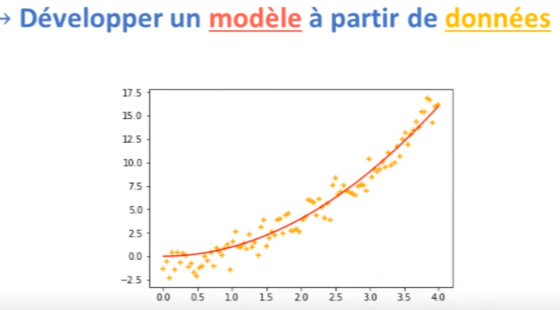

Il y a trois techniques principales : 
- l'apprentissage supervisé, 
- l'apprentissage non supervisé et 
- l'apprentissage par renforcement. 


Dans cette section, nous nous concentrerons sur la technique la plus populaire : l'apprentissage supervisé.


Dans l'apprentissage supervisé, la machine reçoit des données caractérisées par des variables $x$, et annotées d'une variable $y$. En termes de machine learning, les variables $x$ sont appelées "Features" (en français, caractéristiques). La variable $y$ est, quant à elle, nommée "Label" (étiquette). 

Le but de l'apprentissage supervisé est que la machine apprenne à prédire la valeur de $y$ en fonction des Features $x$ fournies. C'est pourquoi $y$ est aussi appelée "Target" (objectif). 

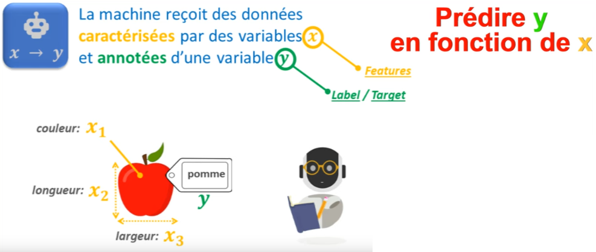

Pour réussir, 
1. nous commençons par fournir de nombreuses données à la machine, constituant ainsi un "Dataset". 

2. Puis, nous précisons le type de modèle que la machine doit apprendre : est-ce un modèle linéaire, un modèle polynomial, un arbre de décision ou un réseau de neurones ? 

Il existe de nombreux types de modèles. Nous spécifions également les hyperparamètres de notre modèle, comme le nombre de branches dans un arbre de décision ou le nombre de neurones dans notre réseau. 

3. Une fois ces étapes complétées, la machine utilise un algorithme d'optimisation pour déterminer les paramètres du modèle offrant les meilleures performances pour les données de notre dataset. C'est ce qu'on nomme la phase d'entraînement. 

4. Une fois terminée, notre modèle de machine learning est prêt. Quand la machine reçoit de nouvelles données (sans étiquette), elle utilise le modèle pour prédire la valeur de $y$.


Avec l'apprentissage supervisé, nous pouvons résoudre des problèmes de régression (lorsque y est une variable continue, soit une variable quantitative) et des problèmes de classification (quand $y$ est une variable discrète, c'est-à-dire une variable qualitative). 

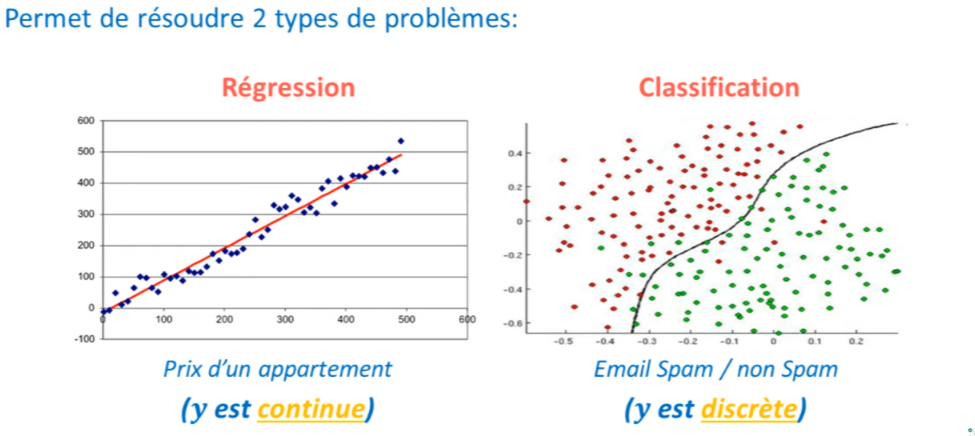

Dans cette section, nous aborderons les deux, régressions et classifications.

## 3. SKLEARN, API, et le fonctionnement d'un estimateur

Faire du machine learning avec Sklearn est extrêmement simple. Tous les modèles et tous les algorithmes de machine learning ont déjà été implémentés suivant une architecture orientée objet. 

Chaque modèle dispose de sa propre classe. 

1. Ainsi, pour créer un modèle, on génère un objet de la classe correspondante. Dans Sklearn, c'est ce qu'on appelle un estimateur. On peut également spécifier, entre parenthèses, les hyperparamètres de notre modèle. 

   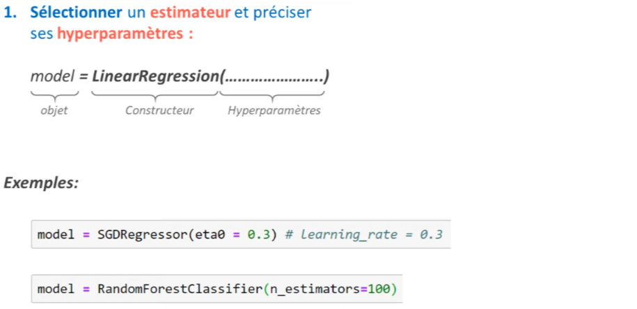

Par exemple, pour une descente de gradient, on peut préciser le "Learning Rate" et pour une Random Forest, le nombre d'arbres. Si vous ne connaissez pas ces termes, il peut être difficile de faire du machine learning. Toutefois, ne vous inquiétez pas ! Le site web de Sklearn propose un tutoriel en anglais qui explique tout cela.

Après avoir initialisé notre modèle, on peut l'entraîner, l'évaluer et l'utiliser en utilisant trois méthodes présentes dans toutes les classes de Sklearn. 


Ce qui rend Sklearn exceptionnel est que même si tous ces modèles ont des mécanismes distincts, leur interface d'utilisation reste la même. 

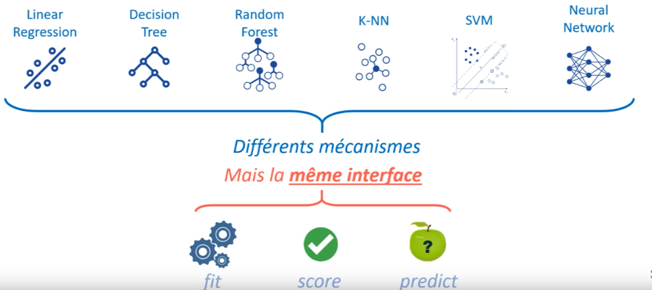

Que ce soit pour une régression linéaire ou un arbre de décision, le code sera presque identique. 


2. Pour entraîner notre modèle, on utilise la méthode $fit$ en fournissant nos données $x$ et $y$ sous la forme de deux tableaux $Numpy$ distincts. 

  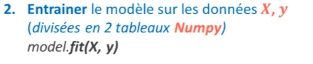

Ces tableaux doivent toujours avoir deux dimensions : 
- la première pour le nombre d'échantillons et 

- la seconde pour le nombre de "Features" (pour $y$, ce sera le nombre de "Target", c'est-à-dire "1"). 

  


Il est courant que certains oublient de respecter la dimension 1 pour le vecteur $y$. 

3. Une fois le modèle entraîné, on peut l'évaluer avec la méthode $score$. Cette méthode prend à nouveau les données $x$ et $y$. 
    La machine utilise alors $x$ pour faire des prédictions et les compare aux valeurs $y$. 

  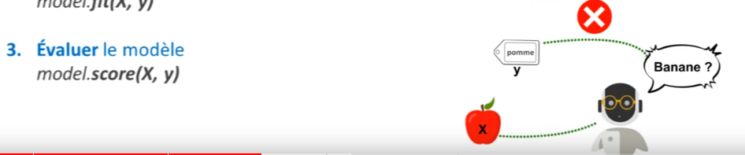


4. Lorsque vous êtes satisfait des performances de votre modèle, vous pouvez l'utiliser pour de nouvelles prédictions avec la méthode $predict$.

  

Ainsi, voici les quatre lignes de code essentielles pour développer des modèles de machine learning avec Sklearn. Si vous maîtrisez cela, vous connaîtrez 80% de Sklearn. 

Comme mentionné précédemment, les codes pour différents modèles sont très similaires. 


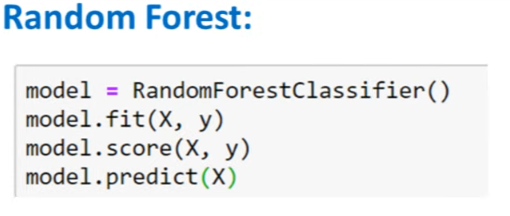

Si vous consultez la documentation, vous constaterez que les modèles sont classés par modules. 

Par exemple, 
- le module Linear_model comprend les modèles Linear Regression, Ridge et SGDRegressor. 
- Le module neighbors contient les algorithmes de N-Nearest Neighbors et 
- le module svm les algorithmes de Support Vector Machine. 

Pour utiliser ces algorithmes, commencez par importer les modules correspondants. Ne tentez pas d'importer Sklearn seul, sinon votre programme ne fonctionnera pas. 

Si vous ne savez pas quel algorithme choisir, consultez cette carte qui vous aidera à sélectionner le bon estimateur. 
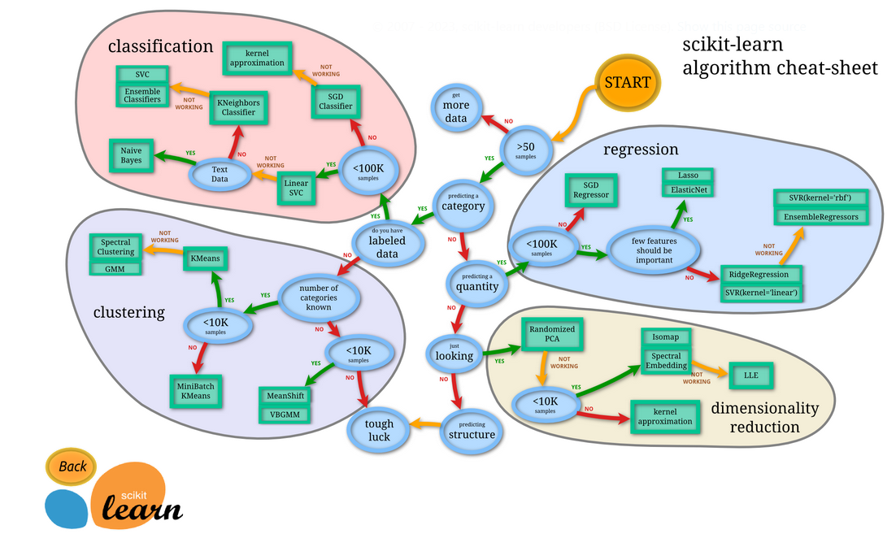

Avec toutes ces informations, je peux vous assurer que vous saurez développer des modèles de machine learning de première classe. 

## 4. Régression avec SKLEARN (LinearRegression + SVR)

Ce que je vous propose est de résoudre un problème de régression avec Sklearn. 

J'ai ici le dataset que j'ai créé à partir de 2 tableaux Numpy : un tableau $x$ et un tableau $y$. J'ai créé ces tableaux en veillant à bien préciser qu'ils ont deux dimensions. 


```python
import numpy as np
import matplotlib.pyplot as plt
import seaborn as sns
```


```python
np.random.seed(0)
m = 100 # creation de 100 échantillons
X = np.linspace(0, 10, m).reshape(m,1)
y = X + np.random.randn(m, 1)

plt.scatter(X, y)
```


    <matplotlib.collections.PathCollection at 0x2614a1c93a0>


    


Face à un tel dataset, nous pourrions développer un modèle de régression linéaire. 

Pour cela, nous devons importer la classe $LinearRegression$ depuis le sous-package $linear\_model$.


```python
from sklearn.linear_model import LinearRegression
```

Une fois cela fait, il suffit de suivre les 4 lignes de code que nous avons vues précédemment. 

Nous commençons par créer un objet de la classe LinearRegression. Ici, il n'est pas nécessaire d'écrire quoi que ce soit entre les parenthèses car la classe LinearRegression implémente la méthode des moindres carrés qui ne requiert aucun hyperparamètre (pas de descente de gradient ou autres). 


```python
model = LinearRegression()
```

Après avoir créé notre modèle, nous l'entraînons avec la méthode fit sur nos données $(x, y)$. 

Puis nous pouvons l'évaluer.


```python
model.fit(X, y) # entrainement du modele
model.score(X, y) # évaluation avec le coefficient de corrélation
```


    0.8881140743377214

Par exemple, avec les mêmes données $(x, y)$, obtenant un score de 88%. En réalité, c'est le coefficient de détermination, c'est-à-dire le R2, de la méthode des moindres carrés qui est calculé.
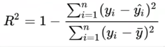


Cependant, avec Sklearn, d'autres techniques d'évaluation sont disponibles.

Pour conclure, nous utiliserons la méthode $predict$ pour faire de nouvelles prédictions sur nos données $X$, ce qui nous donnera un tableau Numpy contenant autant de résultats qu'il y a de données dans notre tableau $X$. 


```python
model.predict(X)
```


    array([[0.20847145],
           [0.30647825],
           [0.40448505],
           [0.50249185],
           [0.60049865],
           [0.69850544],
           [0.79651224],
           [0.89451904],
           [0.99252584],
           [1.09053264],
           [1.18853944],
           [1.28654624],
           [1.38455304],
           [1.48255984],
           [1.58056664],
           [1.67857344],
           [1.77658024],
           [1.87458704],
           [1.97259384],
           [2.07060064],
           [2.16860743],
           [2.26661423],
           [2.36462103],
           [2.46262783],
           [2.56063463],
           [2.65864143],
           [2.75664823],
           [2.85465503],
           [2.95266183],
           [3.05066863],
           [3.14867543],
           [3.24668223],
           [3.34468903],
           [3.44269583],
           [3.54070263],
           [3.63870942],
           [3.73671622],
           [3.83472302],
           [3.93272982],
           [4.03073662],
           [4.12874342],
           [4.22675022],
           [4.32475702],
           [4.42276382],
           [4.52077062],
           [4.61877742],
           [4.71678422],
           [4.81479102],
           [4.91279782],
           [5.01080462],
           [5.10881142],
           [5.20681821],
           [5.30482501],
           [5.40283181],
           [5.50083861],
           [5.59884541],
           [5.69685221],
           [5.79485901],
           [5.89286581],
           [5.99087261],
           [6.08887941],
           [6.18688621],
           [6.28489301],
           [6.38289981],
           [6.48090661],
           [6.57891341],
           [6.6769202 ],
           [6.774927  ],
           [6.8729338 ],
           [6.9709406 ],
           [7.0689474 ],
           [7.1669542 ],
           [7.264961  ],
           [7.3629678 ],
           [7.4609746 ],
           [7.5589814 ],
           [7.6569882 ],
           [7.754995  ],
           [7.8530018 ],
           [7.9510086 ],
           [8.0490154 ],
           [8.14702219],
           [8.24502899],
           [8.34303579],
           [8.44104259],
           [8.53904939],
           [8.63705619],
           [8.73506299],
           [8.83306979],
           [8.93107659],
           [9.02908339],
           [9.12709019],
           [9.22509699],
           [9.32310379],
           [9.42111059],
           [9.51911739],
           [9.61712419],
           [9.71513098],
           [9.81313778],
           [9.91114458]])

Avec Matplotlib, nous pouvons visualiser ces résultats à l'écran, ce qui est impressionnant pour seulement 4 lignes de code ! 


```python
plt.scatter(X, y)
plt.plot(X, model.predict(X), c='red')
```


    [<matplotlib.lines.Line2D at 0x2614b3133d0>]


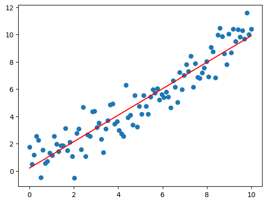
    


Cependant, ce modèle de régression linéaire n'est pas universel. 


```python
y = X**2 + np.random.randn(m, 1)
plt.scatter(X, y)
```


    <matplotlib.collections.PathCollection at 0x2614b342eb0>


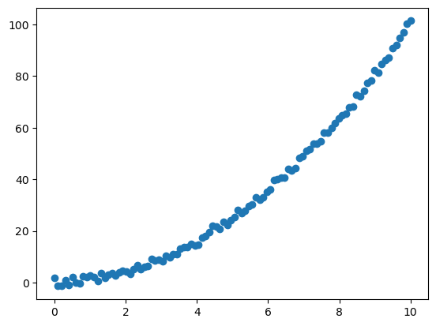
    


Si, par exemple, j'ai un dataset non linéaire et que je ré-entraîne mon modèle, le résultat est loin d'être idéal. 


```python
model = LinearRegression()
model.fit(X, y) # entrainement du modele
model.score(X, y) # évaluation avec le coefficient de corrélation
plt.scatter(X, y)
plt.plot(X, model.predict(X), c='red')
```


    [<matplotlib.lines.Line2D at 0x2614b3c0e80>]


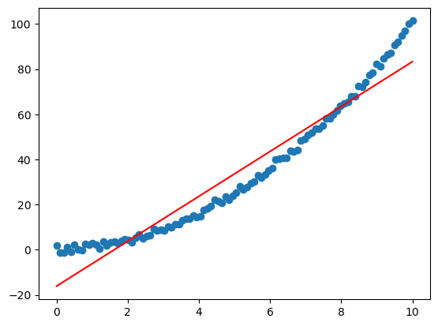
    


On pourrait penser que notre modèle n'a pas bien réussi son apprentissage, mais en réalité, il a parfaitement fonctionné. C'est simplement que ce n'est pas le modèle approprié pour ce type de données. 

Dans ce cas, il serait préférable de choisir un autre modèle de machine learning, comme le Support Vector Machine (SVM). Il suffirait de remplacer LinearRegression par SVR dans notre code et, éventuellement, d'ajuster certains hyperparamètres pour obtenir de meilleurs résultats. 


```python
from sklearn.svm import SVR

model = SVR(C=100)
model.fit(X, y.ravel()) # entrainement du modele
model.score(X, y) # évaluation avec le coefficient de corrélation
plt.scatter(X, y)
plt.plot(X, model.predict(X), c='red', lw=3)
```


    [<matplotlib.lines.Line2D at 0x2614b451220>]


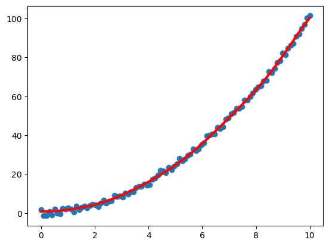
    


Une autre option serait de traiter les données en créant des variables polynomiales, soit faire du "Feature Engineering".

## 5. Classification avec SKLEARN (K-Nearest Neighbor)

Cette fois-ci, je vais vous montrer comment procéder lorsque vous travaillez sur des données réelles. Comme exemple, nous prendrons le dataset du Titanic. J'ai déjà importé le dataset avec Seaborn et l'ai quelque peu filtré en ne sélectionnant que les colonnes qui nous intéressent, c'est-à-dire les colonnes "survived", "pclass", "sex" et "age". 


```python
import pandas as pd
```


```python
titanic = sns.load_dataset('titanic')
titanic = titanic[['survived', 'pclass', 'sex', 'age']]
```

Ensuite, j'ai éliminé les données manquantes du dataset avec la méthode Dropna(). Chose très importante : j'ai remplacé les mots "male" et "female" par des valeurs numériques, à savoir 0 et 1, car pour faire du machine learning, nous avons besoin de valeurs numériques.


```python
titanic.dropna(axis=0, inplace=True)
titanic['sex'].replace(['male', 'female'], [0, 1], inplace=True)
```

Effectivement, on ne peut pas faire de calculs avec des mots ! Le résultat de toutes ces étapes nous donne le dataset que voici.


```python
titanic.head()
```

<table border="1" class="dataframe">
  <thead>
    <tr style="text-align: right;">
      <th></th>
      <th>survived</th>
      <th>pclass</th>
      <th>sex</th>
      <th>age</th>
    </tr>
  </thead>
  <tbody>
    <tr>
      <th>0</th>
      <td>0</td>
      <td>3</td>
      <td>0</td>
      <td>22.0</td>
    </tr>
    <tr>
      <th>1</th>
      <td>1</td>
      <td>1</td>
      <td>1</td>
      <td>38.0</td>
    </tr>
    <tr>
      <th>2</th>
      <td>1</td>
      <td>3</td>
      <td>1</td>
      <td>26.0</td>
    </tr>
    <tr>
      <th>3</th>
      <td>1</td>
      <td>1</td>
      <td>1</td>
      <td>35.0</td>
    </tr>
    <tr>
      <th>4</th>
      <td>0</td>
      <td>3</td>
      <td>0</td>
      <td>35.0</td>
    </tr>
  </tbody>
</table>
Notre objectif est de développer un modèle de classification pour déterminer si un passager du Titanic survivra ou non au naufrage. 

Pour résoudre un problème de classification, il faut d'abord choisir un modèle de classification. Si vous n'en connaissez pas, vous pouvez consulter le site de Sklearn et utiliser la carte des estimateurs pour choisir un modèle adapté. 

Dans la section "classification", vous trouverez différentes options. Nous optons pour le $KNeighborsClassifier$. 


```python
from sklearn.neighbors import KNeighborsClassifier
```


```python
model = KNeighborsClassifier()
```

Ceci initialisera notre modèle. Le souci actuel est que nous n'avons pas encore de données séparées $(x, y)$ ; nous disposons uniquement d'un tableau Pandas. 

Il faudra diviser ce tableau en deux : un tableau $y$ qui contiendra la colonne "survived" et un tableau $x$ qui contiendra le reste des données à l'exception de "survived". 

Pour créer $x$, nous sélectionnerons toutes les colonnes sauf "survived", en utilisant la méthode "drop" déjà abordée dans cette formation.


```python
y = titanic['survived']
X = titanic.drop('survived', axis=1)
```

Une fois ces étapes franchies, nous aurons un tableau $X$ et un tableau $y$. 

Vous pourriez vous demander : "Mais ce sont des DataFrames ! Je croyais qu'il fallait des tableaux Numpy !" 

Souvenez-vous que Pandas est construit sur la base de Numpy. Ainsi, nous pouvons fournir ces tableaux à Sklearn sans problème. 

En évaluant la performance de notre modèle, nous obtenons une précision de 84%. Cela signifie que 83% du temps, notre modèle fait une bonne prédiction, c'est-à-dire qu'il prévoit correctement si un passager a survécu ou non. 


```python
model.fit(X, y) # entrainement du modele
model.score(X, y) # évaluation    
```


    0.8417366946778712

À présent, nous pourrions utiliser la méthode "predict" pour déterminer les passagers ayant survécu. 


```python
model.predict(X)
```


    array([0, 1, 0, 1, 0, 0, 0, 1, 1, 1, 1, 0, 0, 1, 1, 0, 0, 0, 0, 1, 1, 0,
           0, 0, 0, 0, 1, 0, 0, 0, 1, 0, 1, 1, 1, 0, 0, 0, 1, 1, 0, 0, 0, 1,
           0, 0, 1, 0, 0, 1, 0, 1, 0, 0, 1, 0, 0, 0, 0, 1, 0, 0, 0, 1, 1, 0,
           0, 1, 0, 0, 0, 0, 0, 0, 0, 0, 1, 0, 1, 0, 0, 0, 0, 0, 0, 0, 1, 0,
           0, 1, 0, 0, 0, 0, 0, 0, 0, 1, 0, 0, 0, 0, 0, 0, 0, 1, 0, 0, 1, 1,
           0, 0, 1, 1, 0, 0, 0, 1, 0, 0, 0, 0, 1, 0, 0, 0, 1, 0, 0, 1, 0, 0,
           0, 0, 0, 0, 0, 0, 1, 0, 0, 0, 0, 0, 0, 0, 1, 1, 0, 0, 0, 1, 0, 1,
           1, 1, 1, 0, 1, 0, 0, 0, 0, 0, 0, 0, 1, 0, 0, 1, 0, 0, 1, 1, 0, 1,
           0, 0, 0, 0, 0, 0, 0, 0, 0, 1, 0, 0, 1, 0, 0, 1, 0, 0, 0, 0, 0, 0,
           0, 1, 1, 0, 0, 0, 0, 0, 0, 1, 1, 1, 1, 0, 0, 0, 0, 0, 1, 1, 0, 1,
           1, 0, 0, 0, 0, 0, 0, 0, 0, 0, 0, 0, 0, 1, 1, 1, 0, 1, 0, 0, 1, 0,
           0, 1, 1, 0, 1, 1, 1, 1, 0, 0, 0, 1, 0, 1, 1, 0, 1, 1, 1, 1, 0, 1,
           0, 1, 0, 0, 0, 0, 1, 0, 0, 1, 1, 0, 0, 0, 1, 1, 1, 0, 0, 0, 0, 0,
           1, 1, 0, 0, 0, 0, 0, 0, 1, 0, 0, 0, 1, 0, 1, 1, 0, 0, 1, 1, 0, 1,
           0, 0, 1, 1, 1, 0, 0, 1, 1, 0, 0, 0, 0, 1, 0, 0, 0, 0, 0, 0, 0, 1,
           0, 1, 0, 1, 1, 0, 0, 0, 0, 1, 0, 1, 1, 0, 1, 1, 0, 0, 1, 0, 1, 0,
           0, 1, 0, 0, 1, 1, 1, 0, 1, 0, 0, 0, 1, 0, 0, 1, 1, 0, 0, 1, 0, 0,
           1, 0, 1, 1, 1, 0, 0, 0, 0, 0, 0, 1, 0, 1, 1, 0, 0, 0, 0, 0, 0, 1,
           1, 0, 0, 0, 1, 1, 0, 1, 0, 0, 0, 1, 1, 0, 0, 1, 1, 0, 1, 0, 1, 0,
           1, 0, 0, 0, 0, 0, 1, 0, 1, 1, 1, 0, 0, 0, 0, 0, 1, 0, 1, 1, 0, 0,
           1, 0, 1, 1, 1, 0, 0, 0, 0, 0, 0, 0, 1, 1, 0, 0, 1, 1, 0, 1, 1, 0,
           1, 1, 0, 0, 0, 0, 1, 0, 0, 0, 0, 1, 1, 0, 1, 0, 0, 1, 1, 1, 0, 0,
           1, 0, 0, 1, 0, 1, 0, 0, 0, 0, 0, 0, 1, 0, 0, 0, 0, 0, 1, 0, 0, 0,
           0, 1, 0, 1, 1, 0, 0, 0, 1, 0, 0, 0, 0, 0, 1, 0, 0, 0, 0, 0, 0, 0,
           0, 1, 0, 0, 0, 0, 0, 0, 0, 1, 1, 0, 0, 0, 0, 0, 0, 0, 1, 0, 1, 0,
           0, 0, 0, 1, 0, 1, 1, 0, 0, 0, 0, 1, 0, 1, 1, 1, 0, 0, 0, 1, 1, 0,
           1, 0, 0, 0, 1, 0, 1, 0, 0, 1, 0, 0, 0, 0, 0, 1, 1, 1, 0, 0, 0, 0,
           1, 0, 0, 1, 0, 0, 0, 1, 1, 0, 0, 0, 1, 0, 0, 1, 0, 1, 0, 0, 0, 0,
           1, 1, 0, 1, 1, 1, 1, 0, 0, 0, 0, 0, 0, 0, 0, 0, 0, 1, 0, 0, 0, 0,
           1, 0, 1, 1, 0, 1, 0, 0, 1, 0, 0, 0, 1, 0, 0, 0, 0, 0, 1, 1, 0, 1,
           0, 1, 0, 1, 1, 0, 0, 1, 0, 0, 0, 0, 1, 0, 0, 0, 0, 0, 0, 0, 0, 1,
           1, 0, 1, 0, 1, 0, 0, 1, 0, 1, 1, 0, 0, 0, 0, 1, 0, 1, 1, 0, 0, 1,
           1, 0, 1, 0, 0, 0, 0, 1, 1, 0], dtype=int64)

Maintenant, nous allons écrire une fonction pour déterminer si vous auriez survécu au naufrage du Titanic!

## 6. Auriez-vous survécu au Titanic ?

Je vous propose de créer une fonction $survie()$ dans laquelle nous passerons notre modèle ainsi qu'une classe de passagers, une valeur pour le sexe et une valeur pour l'âge. On peut directement initialiser ces arguments avec des valeurs par défaut. Par exemple, je pense que j'aurais voyagé en troisième classe, mon sexe est masculin (je mets 0 pour être cohérent avec les modifications effectuées précédemment) et actuellement, j'ai 26 ans. 

Dans cette fonction, nous allons créer un tableau Numpy qui comprendra ces éléments : pclass, sex et age. Il est essentiel de veiller à entrer ces données dans le bon ordre, c'est-à-dire celui avec lequel la machine a été entraînée. 

Sachez que votre tableau $X$ doit avoir deux dimensions ! Actuellement, il n'en a qu'une. Il faudra donc utiliser $Resize()$.

C'est très important, de nombreux débutants oublient de faire cela et obtiennent des erreurs. Une fois cela fait, il suffit d'afficher les résultats de la prédiction sur $X$. C'est terminé ! 


```python
def survie(model, pclass=3, sex=0, age=26):
    data = {'pclass': [pclass], 'sex': [sex], 'age': [age]}
    X = pd.DataFrame(data)
    print(model.predict(X))
```

Si vous souhaitez savoir si vous auriez survécu au naufrage du Titanic, utilisez simplement la fonction $survie()$.


```python
survie(model)
```

    [0]


Pour conclure, nous pourrions calculer la probabilité d'appartenance à la classe 0 ou à la classe 1. Il existe la méthode $predict_proba()$ disponible dans certains modèles de machine learning, mais pas tous, il faut le savoir. 

Si je complète ma fonction avec $model.predict_proba(X)$, je constate que j'ai 80% de chances d'appartenir à la classe 0 et 20% à la classe 1. Cela explique pourquoi le modèle estime que j'ai plus de chances d'appartenir à la classe 0, c'est-à-dire de ne pas survivre.


```python
def survie(model, pclass=3, sex=0, age=26):
    data = {'pclass': [pclass], 'sex': [sex], 'age': [age]}
    X = pd.DataFrame(data)
    print(model.predict(X))
    print(model.predict_proba(X))
```


```python
survie(model)
```

    [0]
    [[0.8 0.2]]


N'oubliez pas, le résultat obtenu doit être pris avec précaution car notre modèle n'est pas parfait. Il manque des données dans le dataset original et nous avons filtré notre dataset. Cela signifie que notre modèle ne reflète pas totalement la réalité.

## 7. Exercice

Comme exercice, je vous suggère de modifier le nombre de voisins de notre algorithme pour trouver la valeur optimale de cet hyperparamètre. 

Pour ceux qui ne connaissent pas cet algorithme, il est simple : par exemple, si parmi les 5 voisins les plus proches de moi, 4 ont survécu et 1 n'a pas survécu, alors l'algorithme estimera que j'ai également survécu.


Je vous encourage à tester différentes valeurs entre 0 et 30. 

Bien sûr, Sklearn offre des fonctions pour sélectionner des modèles, mais je vous invite à écrire votre propre algorithme en utilisant une boucle $for$ et peut-être des conditions $if$ à l'intérieur pour tester différentes valeurs d'hyperparamètres.

Pour cela, il suffit d'écrire une boucle $FOR$ pour explorer un nombre de voisins allant de 1 à 30, de l'évaluer, puis d'enregistrer le résultat dans une liste initialement vide. 

Lorsque le meilleur score (initialement à 0) est inférieur à notre nouveau score, on remplace la valeur de $best_k$ par $k$ et la valeur $best_score$ par notre nouveau score. 


```python
# SOLUTION
score = []
best_k = 1
best_score = 0

for k in range(best_k, 30):
    model = KNeighborsClassifier(n_neighbors=k)
    model.fit(X, y)
    score.append(model.score(X, y))
    
    if best_score < model.score(X, y):
        best_k = k
        best_score = model.score(X, y)
```

Nous obtenons alors la courbe de performance suivante où l'on peut observer que le meilleur nombre de voisins pour notre algorithme est de 1.


```python
print(best_k)
plt.plot(score)
```

    1
    
    [<matplotlib.lines.Line2D at 0x2614632b820>]


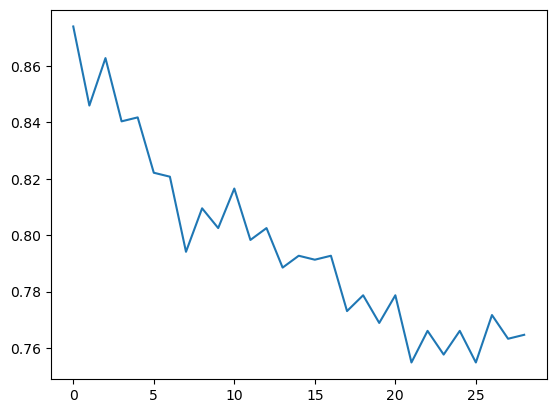
    


Vous comprenez maintenant que cette approche n'est pas la meilleure. Il faudrait plutôt commencer par créer un trainset et un testset pour entraîner et évaluer notre modèle. 

Ensuite, avec $GridSearchCV$, nous pourrions identifier les meilleurs hyperparamètres. 

Enfin, nous pourrions déterminer si la collecte de données supplémentaires serait bénéfique grâce aux courbes d'apprentissage. 

