# Python pour le Machine Learning : SKLEARN Metrics Regression

[Retour README](../README.md)

[toc]

------

## 1. Intro

Nous allons parler de métriques, et plus précisément de métriques de régression. En effet, beaucoup d'entre vous se demandent quelle est la différence entre la RMSE, la MAE, le coefficient R carré, et dans quelles situations utiliser l'un plutôt que l'autre. 

Pour bien comprendre l'origine de nos métriques, repartons de la base. 

Prenons un dataset X, y à partir duquel est développé un modèle de régression linéaire. 
Par exemple, il pourrait s'agir ici du prix de plusieurs appartements en fonction de leur surface habitable. 
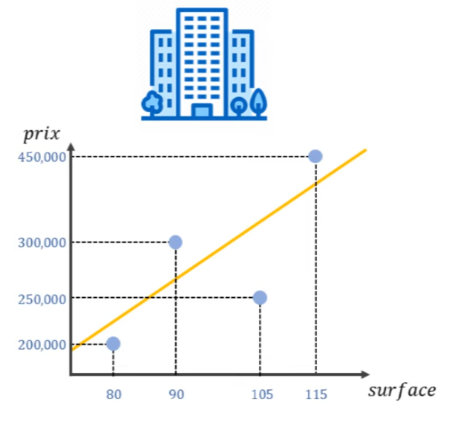

Pour évaluer la performance de ce modèle, il faut mesurer les erreurs entre ses prédictions et les valeurs réelles du dataset. Ainsi, on calcule la différence entre Yvrai et Ypred. Si votre modèle estime qu'un appartement vaut 300 000 euros mais que sa vraie valeur est de 250 000 euros, alors l'erreur est de -50 000 euros. 
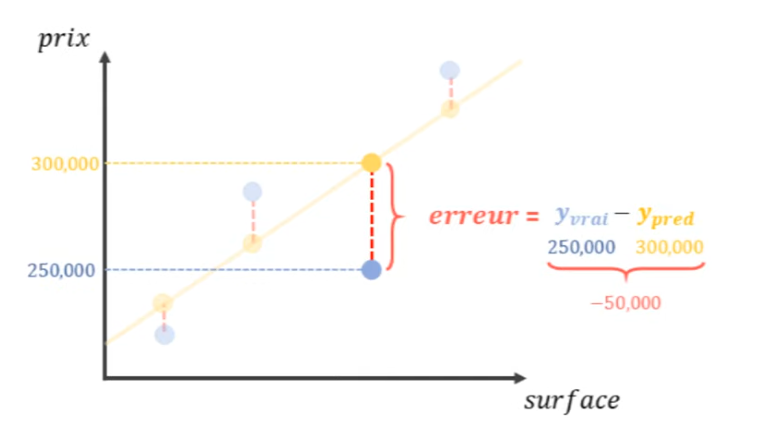

Ici, l'erreur est négative, mais elle pourrait aussi être positive. Travailler avec des erreurs qui peuvent être positives ou négatives n'est pas pratique.

Pour remédier à cela, il y a deux options : prendre la valeur absolue de chaque erreur 
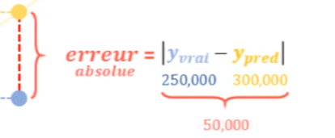


ou calculer le carré de chaque erreur. 
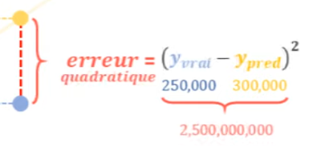

Puis, il suffit de faire la moyenne de toutes les erreurs. 
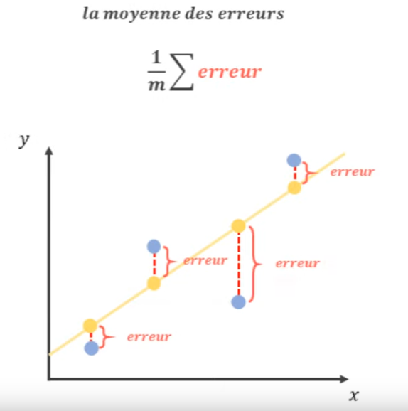

Quand on fait la moyenne des erreurs quadratiques, on obtient l'erreur quadratique moyenne, soit la **Mean Squared Error** en anglais. 


Et lorsqu'on fait la moyenne des erreurs absolues, on obtient l'erreur absolue moyenne, soit la **Mean Absolute Error** en anglais.
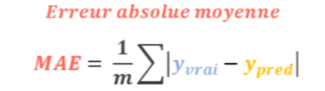

Pour calculer ces erreurs avec Scikit-learn, il suffit de les charger depuis le module metrics. Vous remarquerez qu'on utilise ces fonctions de la même manière en passant Y puis Ypred en argument. 

J'ai créé ici deux tableaux Y et Ypred, actuellement identiques, et j'ai également importé toutes les fonctions du module metrics. 

Je peux donc calculer la Mean Absolute Error et la Mean Squared Error entre ces deux tableaux qui vaut 0.


```python
import numpy as np
import matplotlib.pyplot as plt
from sklearn.metrics import *
```


```python
y = np.array([1])
y_pred = np.array([1])

print('MAE : ', mean_absolute_error(y, y_pred))
print('MSE : ', mean_squared_error(y, y_pred))
```

    MAE :  0.0
    MSE :  0.0


Maintenant, si je modifie le contenu de Ypred, les erreurs vont varier. 


```python
y = np.array([1])
y_pred = np.array([2])

print('MAE : ', mean_absolute_error(y, y_pred))
print('MSE : ', mean_squared_error(y, y_pred))
```

    MAE :  1.0
    MSE :  1.0

```python
y = np.array([1])
y_pred = np.array([3])

print('MAE : ', mean_absolute_error(y, y_pred))
print('MSE : ', mean_squared_error(y, y_pred))
```

    MAE :  2.0
    MSE :  4.0

```python
y = np.array([1])
y_pred = np.array([4])

print('MAE : ', mean_absolute_error(y, y_pred))
print('MSE : ', mean_squared_error(y, y_pred))
```

    MAE :  3.0
    MSE :  9.0


Il est important de comprendre que la Mean Squared Error n'est pas simplement le carré de la Mean Absolute Error. 
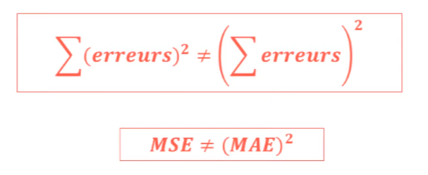


Par exemple, si nous ajoutons la valeur "deux" et que nous y attribuons également cette même valeur en prédiction, il n'y aura pas d'erreur pour cette deuxième prédiction.


```python
y = np.array([1, 2])
y_pred = np.array([5, 2])

print('MAE : ', mean_absolute_error(y, y_pred))
print('MSE : ', mean_squared_error(y, y_pred))
```

    MAE :  2.0
    MSE :  8.0


Ainsi, nous obtenons une erreur absolue moyenne de 2, car la moyenne entre 4 et 0 est 2. 

L'erreur quadratique moyenne est quant à elle de 8, car la moyenne entre 16 et 0 est 8. Or, 8 n'est pas le carré de 2, mais plutôt sa racine carrée est équivalente à deux fois la racine de 2. 

Pour calculer cette racine carrée, on utilise simplement la fonction dédiée depuis le module numpy, 


```python
print('RMSE : ', np.sqrt(mean_squared_error(y, y_pred)))
```

    RMSE :  2.8284271247461903


ce qui nous donne une valeur de 2,82. 

Cette valeur est nommée "Root Mean Squared Error", c'est-à-dire la racine carrée de l'erreur quadratique moyenne. 

Cette métrique est particulièrement utile car elle nous permet de remettre nos erreurs à leur échelle initiale. 

Par conséquent, d'une part, la Mean Absolute Error nous indique que la moyenne entre 0 et 4 est 2, ce qui est logique. 

D'autre part, la Root Mean Squared Error s'établit à 2,82, ce qui peut paraître un peu moins intuitif.


## 2. Dans quelles circonstances utiliser la RMSE plutôt que la MAE?

Cela nous amène à une question que beaucoup se posent: dans quelles circonstances utiliser la RMSE plutôt que la MAE? 

La réponse est simple. En général, on utilise la RMSE quand on accorde une importance exponentielle à nos erreurs.


Prenons un exemple. Imaginez que nous développons un système estimant la distance de freinage d'une voiture. Pour cela, nous entraînons deux modèles visant à retenir celui ayant les erreurs les plus faibles. Le modèle A fait une erreur de 10 mètres et une autre de 0 mètre. Si nous évaluons ce modèle avec la MAE, il obtient une erreur moyenne de 5 mètres. Le modèle B, lui, fait une erreur de 6 mètres et une autre de 5 mètres, soit une moyenne de 5,5 mètres. Le modèle A est donc le meilleur.
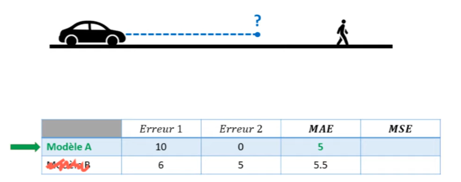

Cependant, cette conclusion est-elle judicieuse? Le modèle A a fait une erreur considérable de 10 mètres, risquant de causer un accident ou de heurter un piéton. Si nous évaluons nos modèles avec la RMSE, le modèle A obtient une erreur de 7 mètres et le modèle B, une erreur de 5,52 mètres. Dans ce cas, le modèle B est préféré.
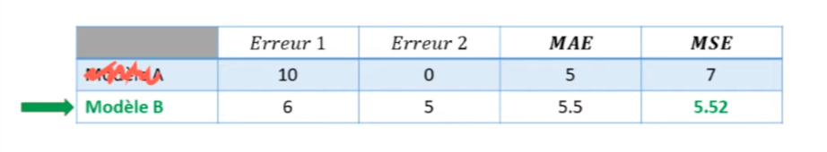

Cette différence s'explique par le fait que la RMSE pénalise davantage les grandes erreurs que la MAE. Une erreur de 10 mètres n'est pas simplement dix fois pire qu'une erreur de 1 mètre, elle est cent fois pire, car $10^2=100$. 


En général, la MSE est conseillée, mais si vous accordez une grande importance aux grandes erreurs, cela peut influencer le réglage des hyperparamètres d'un modèle avec, par exemple, GridSearchCV. 


Si vos grandes erreurs sont causées par des valeurs aberrantes (outliers en anglais), alors la MAE pourrait être plus représentative.

Parlant d'outliers, il existe une autre métrique moins sensible à ces valeurs : la Median Absolute Error. 


Comme son nom l'indique, cette mesure donne la médiane de toutes nos erreurs. 
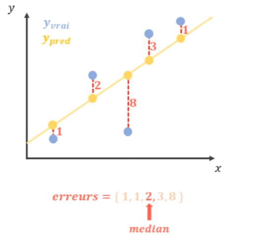

Si nos erreurs sont, par exemple, 1,1,2,3,8 la médiane est de 2. Cette métrique est utile pour éviter les valeurs aberrantes influentes.

Par exemple, si je continue d'ajouter des valeurs à mes tableaux et que j'intègre une valeur extrêmement élevée, disons une prédiction de 1000 alors que la valeur réelle était de 2, les erreurs quadratiques moyennes et absolues moyennes obtenues seront très importantes.


```python
y = np.array([1, 2, 2, 3, 5, 2])
y_pred = np.array([5, 2, 2, 5, 7, 1000])

print('MAE : ', mean_absolute_error(y, y_pred))
print('RMSE : ', np.sqrt(mean_squared_error(y, y_pred)))
```

    MAE :  167.66666666666666
    RMSE :  407.43670265044443


On pourrait dès lors penser que notre modèle commet de nombreuses erreurs conséquentes. Cependant, la réalité est autre : notre modèle ne commet pas une multitude d'erreurs majeures, mais seulement une erreur significative. En calculant la Median Absolute Error, on découvre que notre modèle a, en réalité, une erreur médiane de 2.


```python
print('median abs err : ', median_absolute_error(y, y_pred))
```

    median abs err :  2.0


Mais est-ce judicieux de dire à des collègues ou clients que votre modèle a une erreur moyenne de, disons, 2 euros alors qu'il pourrait causer une perte de milliers d'euros? 

Beaucoup se demandent quelle métrique choisir entre la Median Absolute Error, la RMSE et la MAE. 

Pourquoi ne pas toutes les utiliser?


Lorsque vous calculez toutes les erreurs qu'un modèle produit, pourquoi ne pas utiliser différentes statistiques pour mieux comprendre ces erreurs ? Vous pourriez étudier la moyenne, la médiane et, pourquoi pas, les quintiles pour observer la distribution de toutes ces erreurs. Vous pourriez ainsi établir des intervalles de confiance. Imaginez dire à votre patron ou à vos collègues que votre modèle a peut-être 5% de chances de commettre une erreur supérieure à 5 000 euros ou 10 000 euros, par exemple, lors de l'estimation du prix d'un appartement. C'est exactement ce qu'il faut faire lorsque l'on utilise des métriques de régression. 

J'ai ici chargé les données du prix de l'immobilier à Boston, à partir desquelles j'ai développé un modèle de régression linéaire. Voici les résultats obtenus.


```python
import pandas as pd
import numpy as np
from sklearn.linear_model import LinearRegression

data_url = "http://lib.stat.cmu.edu/datasets/boston"
raw_df = pd.read_csv(data_url, sep="\s+", skiprows=22, header=None)
X = np.hstack([raw_df.values[::2, :], raw_df.values[1::2, :2]])
y = raw_df.values[1::2, 2]
```


```python
model = LinearRegression()
model.fit(X, y)
y_pred = model.predict(X)

plt.scatter(X[:,5], y, label='y')
plt.scatter(X[:,5], y_pred, alpha = 0.8, label='y_pred')
plt.legend()
```


    <matplotlib.legend.Legend at 0x2270910d520>


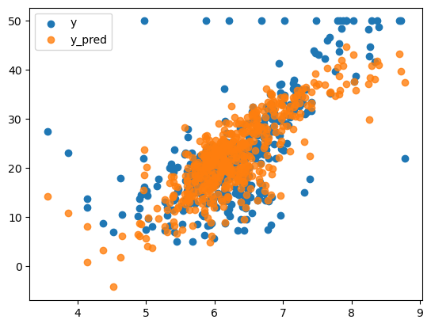
    


Si je souhaite comprendre la performance de ce modèle, je ne vais pas me contenter de calculer l'erreur moyenne. À la place, je vais déterminer la médiane, le quintile et, comme je l'ai mentionné précédemment, pourquoi pas examiner la distribution elle-même. 

Ce que j'affectionne particulièrement lors de l'évaluation d'un modèle, c'est de tracer un histogramme de mes erreurs. Par exemple, en calculant la valeur absolue de la différence entre les valeurs réelles y et les prédictions y_pred. 

Jusqu'ici, cela ressemble à notre erreur moyenne absolue. Cependant, au lieu d'en faire une simple moyenne, je préfère afficher ces erreurs dans un histogramme, en définissant, disons, 50 intervalles.


```python
err_hist = np.abs(y - y_pred)
plt.hist(err_hist, bins=50)
plt.show()
```


   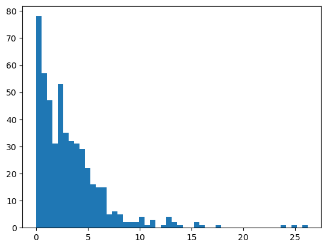
    


Sur le graphique résultant, je peux observer que sur toutes les prédictions effectuées, 80% d'entre elles ont une erreur très proche de zéro. Je peux également visualiser ou même quantifier le nombre d'erreurs supérieures à 5000 dollars. 

Grâce à cet histogramme, je comprends bien mieux l'état actuel de mon modèle et ses performances, bien plus qu'avec une simple moyenne. 

En conclusion, nos erreurs semblent suivre une loi de distribution exponentielle. C'est un comportement tout à fait normal que vous constaterez presque tout le temps. Retenez donc ce conseil : ne vous limitez pas à une seule métrique. En en utilisant plusieurs, vous obtiendrez bien plus d'informations.

## 3. le coefficient de détermination R²

Ce coefficient, vous l'utilisez à chaque fois que vous écrivez $modèle.score(x, y)$, en tout cas pour les modèles de régression. Que ce soit un modèle de régression linéaire, SGD, régressif ou même un réseau de neurones dans scikit-learn, c'est toujours le coefficient de détermination qui est implémenté dans la méthode "score".


Vous le savez sans doute : quand ce coefficient est proche de 1, notre modèle est très bon ; quand il est proche de 0, le modèle n'est pas bon du tout. 

Mais pour mieux comprendre ce qu'il représente vraiment, voyons ensemble sa formule mathématique. 


Oui, je sais, ça fait un peu peur, mais croyez-moi, c'est très simple à comprendre. 

En fait, le coefficient de détermination évalue la performance de notre modèle par rapport au niveau de variation présent dans les données. Au numérateur, on retrouve une expression très semblable à notre erreur quadratique : la somme des carrés des différences entre y et y_pred. 
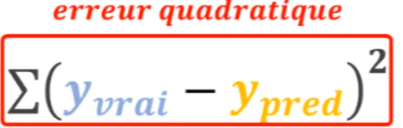
C'est donc une erreur qui est calculée dans la partie numérateur de notre fraction. 

Ensuite, au dénominateur, on calcule presque la même chose, mais cette fois-ci en faisant la différence entre y et la moyenne de y. 


En statistiques, cela s'appelle la variance. 

C'est pourquoi le coefficient de détermination évalue les erreurs, ou bien la performance, par rapport au niveau de variation présent dans les données. 

Lorsque le coefficient de détermination est proche de 1, cette fraction est elle-même proche de zéro, signifiant que les erreurs commises par votre modèle sont beaucoup plus petites que la variance présente dans les données. 
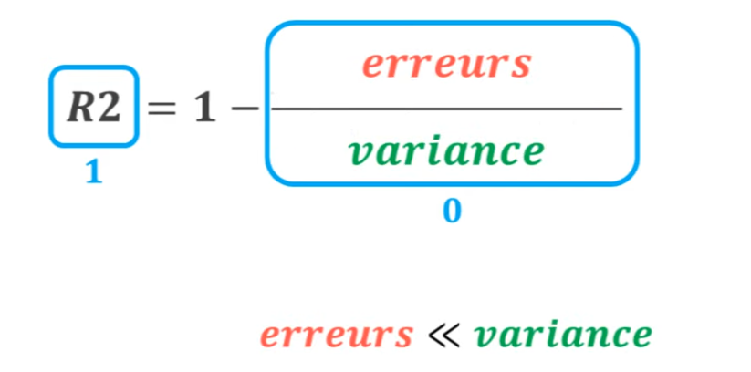

Par exemple, si vous développez un modèle sur des prix d'appartements, que l'erreur moyenne de ce modèle est 1000 euros et que la variance dans vos données est d'environ 100000 euros, alors on obtient un rapport de 1%, soit un coefficient de détermination égal à 0.99. 
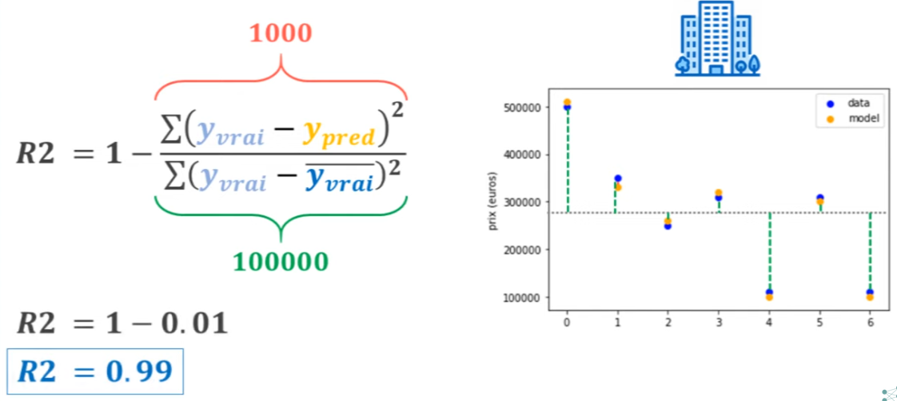

À l'inverse, on obtient un coefficient de détermination égal à zéro lorsque le numérateur est égal au dénominateur, c'est-à-dire que les erreurs sont aussi grandes que le niveau de variation des données. 


Et si vos erreurs sont encore plus grandes que la variance de vos données, alors vous pouvez même obtenir un coefficient de détermination négatif. 


Dans notre cas, avec le dataset de Boston, on obtient un coefficient de détermination de 0.74.


```python
model.score(X, y)
```


    0.7406426641094095

Qu'est-ce que ça veut dire ? Eh bien, cela signifie que notre modèle décrit 74% des variations du prix de l'immobilier à Boston. C'est avec ce genre de phrase que vous pouvez interpréter les résultats du coefficient de détermination. 

Encore une fois, ce n'est pas une métrique à utiliser seule, il faut l'utiliser en combinaison avec d'autres.

Si vous souhaitez utiliser ces différentes métriques dans une cross-validation, alors pour l'argument "scoring", vous devrez fournir une chaîne de caractères contenant vos différentes métriques que vous pouvez trouver à l'adresse https://scikit-learn.org/stable/modules/model-avaluation. 

Si jamais vous perdez cette page, j'ai une astuce : écrivez n'importe quoi, compilez votre code, et vous obtiendrez une erreur. Mais au bas de cette erreur, on vous suggérera de copier/coller un certain code. Ainsi, en important "scikit-learn.metrics", vous obtiendrez la liste de toutes les métriques disponibles sous forme de chaîne de caractères. 

Par exemple, vous retrouverez "mean_absolute_error" formulé de façon négative, mais c'est un détail. En revenant en haut et en remplaçant ceci par notre "neg_mean_squared_error", on obtient les résultats suivants : sur trois cross-validations, on obtient une erreur absolue moyenne de 20.63, 34.48 et 451.9.

Vous pouvez utiliser exactement cette même technique pour les fonctions "GridSearchCV" ou toute autre fonction de scikit-learn qui utilise la cross-validation.


```python
from sklearn.model_selection import cross_val_score
import sklearn.metrics
```


```python
cross_val_score(LinearRegression(), X, y, cv = 3, scoring = 'neg_mean_squared_error')
```


    array([ -20.63230588,  -34.48294871, -451.90968255])

