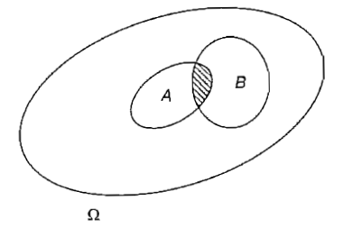

# [Section 1: Rappel de probabilité et de statistique](#section1) #

[Retour README](../README.md)

<a name="toc"/>

[1.1 Espace probabilisé](#1-1)

[1.2 Théorie des probabilités](#1-2)

- [1.2.1 Les axiomes](#1-2-1)

- [1.2.2 Les propriétés](#1-2-2)

[1.3 Lois de probabilités](#1-3)

- [1.3.1 Conditionnelles](#1-3-1)
  - [1.3.1.1 Définition](#1-3-1-1)
  - [1.3.1.2 Exemple](#1-3-1-2)

- [1.3.2 Indépendance de deux événements](#1-3-2)
  - [1.3.2.1 Définition](#1-3-2-1)
  - [1.3.2.2 Propriété](#1-3-2-2)

- [1.3.3 Indépendance deux à deux et indépendance mutuelle](#1-3-3)
  - [1.3.3.1 Définition](#1-3-3-1)
  - [1.3.3.2 Exemple](#1-3-3-2)

- [1.3.4 Formules de Bayes](#1-3-4)
  - [1.3.4.1 Définition](#1-3-4-1)
  - [1.3.4.2 Remarques](#1-3-4-2)
  - [1.3.4.3 Exemple](#1-3-4-3)

[1.4 Réflexion sur le concept de probabilité](#1-4)

- [1.4.1 La conception objectiviste](#1-4-1)

  - [1.4.1.1 La vision classique](#1-4-1-1)

  - [1.4.1.2 La vision fréquentiste](#1-4-1-2)

- [1.4.2 La conception subjectiviste](#1-4-2)
  - [1.4.2.1 Le bayésianisme](#1-4-2-1)

[1.5 Conclusion](#1-5)

[[7]( http://www.editionstechnip.com/en/catalogue-detail/149/probabilites-analyse-des-donnees-et-statistique.html)] **La théorie des probabilités** est une branche des mathématiques qui traitent des propriétés de certaines structures modélisant des phénomènes où le "hasard" intervient. Par exemple, estimer la probabilité qu'un lancé de dé sorte une séquence de chiffre pair. 

**La théorie des probabilités permet de modéliser efficacement certains phénomènes aléatoires et d'en faire l'étude théoriques.**

**Le rapport de la probabilité avec la statistique**  **est qu'il repose sur des observations de phénomènes concrets**. Par exemple, les différents niveaux de salaire d'hommes travaillant à Bruxelles permettent d'observer :

- que **les données sont souvent imprécises**, entachées d'erreur. Et **le modèle probabiliste** permet alors de représenter ces variables aléatoires comme **des déviations entre "vraies valeurs" et valeurs observées**.
- que la répartition statistique d'une variable au sein d'une population est voisine des modèles de lois des probabilités.
- que **les individus observés sont tirés au hasard**, ce qui assure mathématiquement leur représentativité et  grâce à ce tirage au sort, **le calcul des probabilités permet d'étudier leur répartition**.

<a name="1-1"/>

## [1.1 Espace probabilisé](#1-1) ##

[Retour TOC](#toc)

**Une expérience est qualifiée d'aléatoire si l'on ne peut pas prévoir à l'avance son résultat et si répétée dans des conditions identiques, elle peut donner lieu à des résultats différents.** Le résultat de cette expérience est représenté par un élément $\boldsymbol{\omega}$ de l'ensemble $\boldsymbol{\Omega}$ de tous les résultats possibles. $\boldsymbol{\Omega}$ est appelé **l'ensemble fondamental**. 
Par exemple, si nous lançons une pièce de monnaie, nous avons deux possibilités de figures : soit $\boldsymbol{\omega}$ vaut Face( $H$ ) ou pile( $T$ ) avec notre ensemble fondamental $\boldsymbol{\Omega}$ = $\lbrace H,T \rbrace$. Si maintenant nous lançons deux pièces de monnaies, nous avons un nouvel ensemble de tous les résultats  $\boldsymbol \Omega = \lbrace HH,HT,TT,TH\rbrace$  (deux combinaison de deux possibilités de figures).

Un **événement** est une assertion ou une proposition logique relative au résultat de l'expérience. 
Par exemple, nous voulons connaitre la probabilité du nombre de face( $H$ ) sorti sur dix lancés de pièce supérieur à trois. L'événement est réalisé si la proposition logiques est vraie ou fausse, une fois l'expérience terminée. Donc, l'événement est réussis si notre ensemble de résultat possible serait, par exemple, $\lbrace H,T,T,T,H,H,T,T,H,T\rbrace$ identifié comme une partie de  $\boldsymbol{\Omega}$ . Nous pouvons identifier **un événement à une partie de** $\boldsymbol{\Omega}$ pour laquelle cet événement est réalisé. 

**La probabilité est une mesure qui quantifie la probabilité qu'un événement se produise**. Par exemple, on peut quantifier la probabilité d'un incendie dans un quartier, d'une inondation dans une région ou de l'achat d'un produit. **La** **probabilité d'un événement** **peut être calculée directement en comptant toutes les occurrences de l'événement et en les divisant par le total des résultats possibles de l'événement.**

$$
\boldsymbol {probabilité =\frac{occurences}{non-occurences + occurences}}
$$

**La probabilité** attribuée **est une valeur fractionnaire** et **se situe toujours entre 0 et 1**, où 0 indique une probabilité nulle et 1 une probabilité totale. 

La somme des probabilités de tous les événements possibles donne la valeur de probabilité 1. **Si toutes les occurrences possibles sont également probables, la probabilité de leur occurrence est égale à 1 divisé par le total des occurrences ou essais possibles**.

**La probabilité s'écrit** souvent avec un $\boldsymbol p$ minuscule et peut être exprimée en pourcentage en multipliant la valeur par 100. 

**La probabilité d'un événement**, comme une inondation, est souvent désignée par une fonction (par exemple, la fonction de probabilité) avec un $\boldsymbol P$ majuscule. Par exemple,  

$$
\boldsymbol {P(inondation)=\ probabilité\ d'une\ inondation.}
$$

On l'écrit aussi parfois comme une fonction $\boldsymbol Pr(inondation)$.

**A chaque événement, on associe un nombre positif compris entre 0 et 1, sa probabilité**. 

**Le** **complément de la probabilité** peut être exprimé comme **un moins la probabilité de l'événement**.
Par exemple, 

$$
\boldsymbol {1-P(inondation)=probabilité\ d'absence\ d'inondation}.
$$

<a name="1-2"/>

## [1.2 Théorie des probabilités](#1-2) ##

[Retour TOC](#toc)

En tant que domaine d'étude, on parle souvent de **théorie des probabilités**  qui fournit un ensemble de règles formelles permettant de déterminer la probabilité qu'une proposition soit vraie compte tenu de la probabilité d'autres propositions.

La théorie des probabilités comporte trois concepts importants :

- **Événement** $\boldsymbol{(\Omega)}$ . Une issue à laquelle une probabilité est attribuée.
- **Espace d'échantillonnage**  $\boldsymbol{(\mathcal{F})}$. L'ensemble des résultats ou événements possibles. Avec $\boldsymbol{\mathcal{F}=2^\Omega}$. 
  ( $\boldsymbol{2^\Omega}$ est l'ensemble de tous les sous-ensembles de $\boldsymbol\Omega$ incluant $\boldsymbol\Omega$ et l'ensemble vide $\boldsymbol \emptyset$. 
  Notez que $\boldsymbol{\mathcal{F}=2^\Omega}$ n'est pas totalement générale, mais elle est souvent suffisante à des fins pratiques.)
- **Fonction de probabilité**  $\boldsymbol{(P)}$. Fonction utilisée pour attribuer une probabilité à un événement. 
  $\boldsymbol P$ est la **mesure/distribution de probabilité** qui fait correspondre un événement $\boldsymbol{\Omega \in \mathcal{F}}$ à une valeur réelle comprise entre zéro et un.

La probabilité qu'un **événement** $\boldsymbol{(\Omega)}$ soit tiré de l'**espace d'échantillonnage**  $\boldsymbol{(\mathcal{F})}$ est déterminée par la **fonction de probabilité**  $\boldsymbol{(P)}$. 

<a name="1-2-1"/>

### [1.2.1 Les axiomes](#1-2-1) ###

[Retour TOC](#toc)

La forme ou **la distribution de tous les événements dans l'espace d'échantillonnage** est appelée **distribution de probabilité**. Dans de nombreux domaines, la distribution des probabilités des événements a **une forme** familière, par exemple **uniforme si tous les événements ont la même probabilité** ou **gaussienne si la probabilité des événements a une forme normale ou en cloche**. 

**Soit $\boldsymbol A$, la distribution de probabilité qui est une correspondance entre des événements et des nombres réels qui satisfont à certains axiomes** :

1) Non-négativité : $\boldsymbol{P(A)\ge0, \forall A \subseteq \Omega}$

2) Unité de $\boldsymbol \Omega$ : $\boldsymbol{P(\Omega)=1}$

3) Additivité : Pour tout événement disjoint $\boldsymbol{A,B∈F}$ (c'est-à-dire $\boldsymbol{A∩B=∅}$), on a que, $\boldsymbol{P(A∪B)=P(A)+P(B)}$.

En utilisant la théorie des ensembles et les axiomes de probabilité, nous pouvons montrer plusieurs **propriétés** utiles et intuitives **de distribution de probabilité**.

<a name="1-2-2"/>

### [1.2.2 Les propriétés](#1-2-2) ###

[Retour TOC](#toc)

***Propriété 1 :*** $P(\emptyset)=0$ \
***Propriété 2 :*** $P(\bar{A})=1-P(A)$. Avec $\bar{A}$ l'événement contraire à l'événement $A$, c'est à dire que si $A$ est réalisé alors $\bar{A}$ ne l'est pas. \
***Propriété 3 :*** $P(A)\le P(B)$   si $A\subset B$ \
***Propriété 4 :*** $P(A\cup B)=P(A)+P(B)-P(A\cap B)$ \
***Propriété 5 :*** $P(\bigcup_i A_i)\le \sum_iP(A_i)$ 

<a name="1-3"/>

## [1.3 Lois de probabilités](#1-3)  ##

<a name="1-3-1"/>

### [1.3.1 Conditionnelles](#1-3-1)  ###

Supposons que l'on s'intéresse à la réalisation d'un événement $A$, tout en sachant qu'un événement $B$ est réalisé. Si $A$ et $B$ sont incompatibles la question est tranchée: $A$ ne se réalisera pas, mais si $A\cap B\neq 0$, il est possible que $A$ se réalise; cependant, l'univers des possibles n'est plus $\Omega$ tout entier, mais est restreint à $B$ . En fait, seule nous intéresse la réalisation de $A$ à l'intérieur de $B$, c'est-à-dire $A\cap B$ par rapport à $B$.

<a name="1-3-1-1"/>

#### [1.3.1.1 Définition](#1-3-1-1) ####

[Retour TOC](#toc)

Soit $B$ un événement de probabilité non nulle. On appelle **probabilité conditionnelle de $A$** sachant $B$  (ou encore de $A$ si $B$) le rapport noté 

$$
\boxed{P(A|B) = \frac{P(A)\cap P(B)}{P(B)}}\ \ \ (avec\ en\ général,\ P(A|B) \neq P(B|A))
$$

La règle de la chaîne peut être obtenue en réécrivant l'expression ci-dessus comme suit : 

$$
\boxed{P(A ∩ B) = P(B)P(A|B) = P(A)P(B|A)}
$$

De manière plus générale, nous avons

$$
\boxed{P(A_1 \cap A_2 \cap A_3 ...)=P(A_1)P(A_2|A_1)P(A_3|A_1A_2) ...}
$$

 Pour s'assurer que le nom probabilité est justifié, vérifions les axiomes :

$$
P(\Omega /B)=\frac{P(\Omega\cap B)}{P(B)}=\frac{P(B)}{P(B)}=1
$$

$$
P\left(\bigcup_i A_i|B\right)=\frac{P[(\bigcup_i A_i)\cap B]}{P(B)}=\frac{P[\bigcup_i(A_i\cap B_i)]}{P(B)}=\sum_i\frac{P(A_i\cap B)}{P(B)}=\sum_i P(A_i|B)\ \ \ cqfd.
$$

<a name="1-3-1-2"/>

#### [1.3.1.2 Exemple](#1-3-1-2) ####

[Retour TOC](#toc)

En fiabilité (ou en assurance sur la vie), on considère la fonction de survie $R(t)$ définie comme la probabilité qu'un individu vive au-delà d'une date t: $R(t)=P(X > t)$. Cette fonction détinit une loi de probabilité sur $\mathbb{R}^+$ et : 

$$
P(t_1 \leq X < t_2)=R(t_1)-R(t_2)
$$

La probabilité conditionnelle de défaillance (ou décès) entre $t_1$ et $t_2$ sachant que l'individu a déjà fonctionné (ou vécu) jusqu'à  $t_1$ est :

$$
P(t_1 \le X < t_2/X >t_1= \frac{R(t_1)-R(t_2)}{R(t_1)}
$$

<a name="1-3-2"/>

### [1.3.2 Indépendance de deux événements](#1-3-2) ###

[Retour TOC](#toc)

<a name="1-3-2-1"/>

#### [1.3.2.1 Définition](#1-3-2-1) ####

$A$ est indépendant de $B$ si $P(A|B)=P(A)$. Autrement dit, la connaissance de $B$ ne change pas les "chances" de réalisation de $A$.

<a name="1-3-2-2"/>

#### [1.3.2.2 Propriété](#1-3-2-2) ####

$A$ indépendant de $B \implies B$ indépendant de $A$ .

On parlera désormais d'événements indépendants sans autre précision. En effet , si $P(A|B)=P(A)$ alors :

$$
\boxed{\frac{P(A\cap B)}{P(B)} = P(A)}
$$

et :

$$
\boxed{P(B|A)=\frac {P(A\cap B)}{P(A)}=P(B)}
$$

Ce qui démontre la formule : $\fbox {{P(A ∩ B)= P(A)P(B)}}$ si et seulement si $A$ et $B$ sont indépendants.

**N.B**. La notion d'indépendance n'est pas une notion purement ensembliste comme l'incompatibilité: deux événements peuvent être indépendants pour une loi de probabilité $P$ et pas pour une autre $P'$. On s'en convaincra en vérifiant qu'en général si $A$ et $B$ sont indépendants, ils ne le sont plus conditionnellement à un troisième événement $C$.

<a name="1-3-3"/>

### [1.3.3 Indépendance deux à deux et indépendance mutuelle](#1-3-3) ###

[Retour TOC](#toc)

<a name="1-3-3-1"/>

#### [1.3.3.1 Définition](#1-3-3-1) ####

[Retour TOC](#toc)

Soient $A_1, A_2,...,A_n$ , des événements; ils sont dits mutuellement indépendants si pour toute partie $I$ de l'ensemble des indices allant de 1 à $n$, 
on a : 

$$
\boxed{P\left[\bigcap_IA_I\right]=\prod_I P(A_I)}
$$

Cette condition est beaucoup plus forte que l'indépendance deux à deux, qui ne lui est pas équivalente mais en est une simple conséquence.

La probabilité conditionnelle donne une autre interprétation de l'indépendance : $A$ et $B$ sont indépendants si la probabilité inconditionnelle est la même que la probabilité conditionnelle. Combinée à d'autres propriétés de la probabilité, l'indépendance peut parfois simplifier le calcul de la probabilité de certains événements.

**Remarque:** Dans les applications il est assez fréquent que l'on n'ait pas à démontrer l'indépendance de deux événements car celle-ci est une propriété de l'expérience aléatoire. Ainsi lorsqu'on procède à un tirage avec remise de $n$ individus dans une population finie, les événements relatifs aux différents tirages sont indépendants entre eux par construction.

<a name="1-3-3-2"/>

####  [1.3.3.2 Exemple](#1-3-3-2) ####

[Retour TOC](#toc)

Considérons une pièce de monnaie équitable. Quelle est la probabilité qu'il y ait au moins un côté face aux 10 premiers lancers ? 

Soit $A$ l'événement " au moins un côté face sur les 10 lancers ". Alors $A^c$ est l'événement " aucune côté face {$F$} sur les 10 lancers" (les 10 lancers se suivent). Nous avons

$$
P(A)=1−P(A^c)
$$

$$
\hspace{9,3em} = 1 − P(F\cap F\cap F\cap ...\cap F)
$$

$$
\hspace{3em} = 1 - \prod_{i=1}^{10} P(t)
$$

$$
\hspace{3em} = 1 − (1/2)^{10}
$$

<a name="1-3-4"/>

### [1.3.4 Formules de Bayes](#1-3-4) ###

[Retour TOC](#toc)

La **formule des probabilités totales** est un théorème qui permet de calculer la probabilité d'un événement en le décomposant suivant un système exhaustifs (finis ou dénombrables) d'événements.

<a name="1-3-4-1"/>

####  [1.3.4.1 Définition](#1-3-4-1) ####

Soit $B_1, B_2,..., B_n$ est une partition de $\Omega$. Alors, pour tout $A⊆\Omega$, on exprime $P(A|B)$ en fonction de $P(B|A)$.

Ce qui nous donne une **première formule de Bayes** :

$$
\boxed{P(B|A) = \frac {P(A|B)P(B)}{P(A)}}
$$

Il suffit d'éliminer $P(A\cap B)$ entre $P(A|B)=\frac{P(A\cap B)}{P(B)}$ et $P(B|A)=\frac {P(A\cap B)}{P(A)}$.

On peut écrire $P(A\cap B_i)=P(A|B_i)P(B_i)$ avec $i\in I \ (l'ensemble\ des \ indexes,\ indiçant\ les\ événements)$

Le théorème de **probabilités totales** devient donc:

$$
\boxed{P(A)=\sum_i P(A|B_i)P(B_i)=\sum_i P(A\cap B_i)}
$$

Et on en déduit que la **deuxième formule de Bayes** est:

$$
\boxed{P(B|A)=\frac{P(A|B_i)P(B_i)}{\sum_i P(A|B_i)P(B_i)}}
$$

La règle de Bayes nous permet de calculer $P(B_i|A)$ à partir de $P(A|B_i )$. Ceci est utile lorsque $P(B_i|A)$ n'est pas évident à calculer mais que $P(A|B_i )$ et $P(B_i )$ sont faciles à obtenir. **La règle de Bayes est une combinaison de la probabilité conditionnelle et de la loi de la probabilité totale**.

<a name="1-3-4-2"/>

#### [1.3.4.2 Remarque](#1-3-4-2) ####

[Retour TOC](#toc)

[[8]( https://fr.wikipedia.org/wiki/Formule_des_probabilit%C3%A9s_totales)] Lorsque $P(B_i)=0$ , définir $P(A|B_i)$ pose problème : $P(A|B_i )$  serait la probabilité conditionnelle de $A$ sachant un évènement qui ne se produit jamais, à savoir $B_i$. La définition usuelle de $P(A|B_i)$ conduirait alors à diviser par 0 . Une convention qui est rarement nocive consiste, lorsque $P(B_i)=0$ ,  à attribuer à $P(A|B_i)$ une valeur arbitraire entre 0 et 1 : on n'a jamais besoin de pronostiquer la vraisemblance de l'évènement $A$ sachant $B_i$ ,  puisque $B_i$ ne se produit jamais, donc attribuer à $P(A|B_i)$ une valeur arbitraire ne provoquera aucune erreur. 
Par ailleurs, dans la formule des probabilités totales, attribuer à $P( A|B_i)$ une valeur arbitraire entre 0 et 1 n'a aucune importance, puisqu'on multiplie ensuite cette valeur par $0=P(B_i)$ . 

En résumé, avec cette convention, l'hypothèse $P(B_i )≠0$ est superflue pour la formule des probabilités totales.
L'hypothèse selon laquelle $(B_i)\ avec\ i ∈ I$  est un système exhaustif peut être affaiblie : $\bigcup_{i∈I}B_i= \Omega$  peut être remplacée par $\bigcup_{i∈I}B_i\supset A$. Il est par contre essentiel que les $B_i$ soient disjoints.

<a name="1-3-4-3"/>

#### [1.3.4.3 Exemple](#1-3-4-3) ####

[Retour TOC](#toc)

[[7](http://www.editionstechnip.com/en/catalogue-detail/149/probabilites-analyse-des-donnees-et-statistique.html)] Pour illustrer la théorie voyons l'exemple suivant : dans une usine trois machines $M_1$, $M_2$ et $M_3$ fabriquent des boulons de même type. 
$M_1$ sort en moyenne 0.3 % de boulons défectueux, $M_2$ 0.8 % et $M_3$ 1 %. On mélange 1 000 boulons dans une caisse, 500 provenant de $M_1$, 350 de $M_2$ et 150 de $M_3$. On tire un boulon au hasard dans la caisse; il est défectueux. Quelle est la probabilité qu'il ait été fabriqué par $M_1$ (ou $M_2$ ou $M_3$) ?

Lorsque l'on tire un boulon au hasard les probabilités dites à priori qu'il provienne de $M_1$ , $M_2$ ou $M_3$ sont évidemment $P(M_1) = 0.50$, $P(M_2)=0.35$ et $P(M_3) = 0.15$ (déduit du nombre de boulons provenant des différentes machines).

Comme on sait que nous avons des boulons défectueux par machine, événements noté $D$, il faut alors calculer les probabilités conditionnelles:

$$
P(M_1|D), P(M_2|D) et P(M_3|D)
$$

Comme on connaît $P(D|M_1) = 0.003$, $P(D|M_2) = 0.008$ et $P(D|M_3) = 0.001$ alors la deuxième formule de Bayes permet d'écrire:

$$
\hspace{2em} P(M_1|D) = \frac {P(D|M_1)P(M_1)}{P(D|M_1)P(M_1) + P(D|M_2)P(M_3)+P(D|M_1)P(M_3)} 
$$

$$
=\frac{0.003 \times 0.5}{0.003\times 0.5 + 0.008\times 0.35+0.01\times 0.15} 
$$

$$
\hspace{-9.5em}\approx 0.26
$$

Et on trouverait de même pour $P(M_2|D)\approx 0.48$ et $P(M_3|D)\approx 0.26$

Ici, ce sont des probabilités à posteriori, sachant que le boulon est défectueux. On voit donc que la prise en compte d'une information (le boulon est défectueux) modifie les valeurs des probabilités de $M_1, M_2 \ et\  M_3$.

[[7](http://www.editionstechnip.com/en/catalogue-detail/149/probabilites-analyse-des-donnees-et-statistique.html)] Maintenant, modifions quelques peu l'exemple précédent de la fabrication des boulons : supposons qu'il n'y ait plus qu'une machine et que l'on cherche à estimer le pourcentage $p$ de boulons défectueux produit en moyenne par la machine : si l'on admet qu'il n'y a que trois valeurs possibles $p_1$, $p_2$ et $p_3$ respectivement égale à 0.3%, 0.8% et 1% de probabilités à priori $\pi_1$, $\pi_2$ et $\pi_3$, respectivement, la solution est inchangée et la valeur la plus probable à postiori est 0.008 (si l'on tire un seul boulon défectueux).
Supposons qu'on tire maintenant $n$ boulons et que le nombre de boulons défectueux soit $k$, la probabilité que le pourcentage de défectueux produit par la machine soit $p_2$ est alors:

$$
\frac {C_n^k p_2^k (1-p_2)^{n-k} \pi_2}{\sideset{}{_{i=1}^3}\sum C_n^k p_i^k(1-p_i)^{n-k} \pi_i}
$$

Donc, à condition de connaître une distribution de probabilité à priori sur les valeurs de $p$, on peut donc en déduire les valeurs de $p$ à postiori les plus probables, donc estimer $p$.

On aura remarqué que $p$ n'est pas aléatoire mais un paramètre fixe de valeur inconnue et que l'on a modélisé notre incertitude sur ses valeurs, par une mesure de probabilité. Mais comment choisir cette mesure à priori? **On retombe sur la difficulté : et si cette probabilité est subjective, quel statut scientifique donner à une grandeur qui peut varier d'un observateur à l'autre?** 

Là est la problème à surmonter dans les modèles, **La modélisation prédictive** avec le Machine Learning implique l'ajustement d'un modèle pour faire correspondre des exemples d'entrées à une sortie, comme un nombre dans le cas d'un problème de régression ou une étiquette de classe dans le cas d'un problème de classification. Les questions raisonnables à poser sont : 

- Quelles sont les meilleures fonctionnalités que je devrais utiliser ?
- Quel est le meilleur algorithme pour mon ensemble de données ?

 **Les réponses à ces questions sont inconnues, tout du moins exactement connaissable.**

<a name="1-4"/>

## [1.4 Réflexions sur le concept de probabilité](#1-4) ##

[Retour TOC](#toc)

[[7](http://www.editionstechnip.com/en/catalogue-detail/149/probabilites-analyse-des-donnees-et-statistique.html)] La théorie mathématique des probabilités ne dit pas quelle loi de probabilité mettre sur un ensemble  $\boldsymbol{\Omega}$ parmi toutes les lois possibles.

<a name="1-4-1"/>

### [1.4.1 La conception objectiviste](#1-4-1) ###

**La probabilité d'un événement peut-être déterminée de manière uniques.**

<a name="1-4-1-1"/>

#### [1.4.1.1 La vision classique](#1-4-1-1) ####

[Retour TOC](#toc)

C'est celle qui est héritée des jeux de hasard . $\boldsymbol{\Omega}$  est en général fini et des raisons de symétrie conduisent à donner à chaque événement élémentaire la même probabilité: ainsi le lancer d'un dé parfait conduit à un ensemble $\boldsymbol{\Omega}$  à 6 éléments équiprobables. Le calcul des probabilités n'est donc plus qu'une affaire de dénombrement, d'où la célèbre formule:

$$
P(A) = \frac{Nombre\ de\ cas\ favorables}{Nombre\ de\ cas\ possibles}
$$

Et l'analyse combinatoire fournit alors les réponses aux cas classiques.

Le problème avec cette vision est qu'elle ne s'étend qu'aux cas où $\boldsymbol{\Omega}$ n'est plus dénombrable et repose sur une conception idéalisée de l'expérience aléatoire c'est à dire que les symétries parfaites n'existent pas, ainsi le dé parfait n'est qu'une vue de l'esprit et ses 6 faces ne sont pas en réalités équiprobables en raison de la non homogénéité de la matière et surtout des gravures sur les faces.

<a name="1-4-1-2"/>

#### [1.4.1.2 La vision fréquentiste](#1-4-1-2) ####

[Retour TOC](#toc)

Elle repose sur la loi des grands nombres. Une seule expérience ne suffisant pas pour évaluer la probabilité d'un événement, on va répéter un très grand nombre de fois l'expérience. Ainsi du lancer d'un dé : la probabilité d'observer la face 6 est la limite du rapport:

$$
\frac{Nombre\ de\ 6\ obtenus}{Nombres\ d'essais}=f
$$

lorsque le nombre d'essais augmente indéfiniment. En effet "**la loi des grands nombres**" assure que $f$ converge vers la probabilité $p$ de l'événement. Du point de vue pratique, il est clair que la vision fréquentiste ne permet pas de trouver la probabilité d'un événement puisqu'un tel processus nécessitant une infinité d'observation est physiquement irréalisable : cela permet tout au plus de donner une définition de la probabilité comme limite d'une fréquence.

Par exemple,  soit le lancé d’une pièce de monnaie et le calcul de la probabilité pour qu’elle  tombe sur pile ou face. La vision fréquentiste se base sur  l’expérience pour établir la « vraie » probabilité d’obtenir pile. Par exemple la pièce, lancée 10 fois, est tombée 4 fois sur pile, autrement dit 4/10 soit 0.4 dans cet exemple. 

Conformément à la "loi des grands nombres", en lançant la pièce un nombre important de  fois, cette méthode convergera, au sens mathématique du terme, vers 0.5. Concrètement, on utilise des bornes de probabilités (intervalles de confiance) pour  quantifier l’incertitude du résultat.  Ainsi, en utilisant **une distribution binomial**[2], on sait que si on  lance une pièce équilibrée 10 000 fois, la proportion de pile sera  comprise entre deux bornes donnant une probabilité supérieure à 99 %.

**Donc, Les événements sont observés et comptés, et leurs fréquences constituent la base du calcul direct d'une probabilité, d'où le nom de fréquentiste.** La vision fréquentiste englobe les algorithme de Machine Learning tel que le [[11](https://en.wikipedia.org/wiki/Kernel_embedding_of_distributions)]  $Kernel\ Ridge\ Regression$ ou le $k-Nearest\ Neighbor$ [[12](https://fr.wikipedia.org/wiki/Méthode_des_k_plus_proches_voisins)] qui reposent généralement sur la "loi des grands nombres". Une des difficultés majeures des approches fréquentistes est le problème du surapprentissage **overfitting**)[[2](http://informatique.umons.ac.be/ssi/bdIIch.shtml)] .

Les méthodes issues des probabilités fréquentistes comprennent 

- les valeurs $\boldsymbol p$ (les probabilités) et 
- les intervalles de confiance utilisés dans l'inférence statistique et 
- l'estimation du maximum de vraisemblance pour l'estimation des paramètres.

***En conclusion, la probabilité objective d'un événement est une mesure d'incertitude, pouvant varier avec les circonstances et l'observateur.*** 
***La seul exigence étant qu'elle satisfait aux axiomes du calcul des probabilités.***

<a name="1-4-2"/>

### [1.4.2 La conception subjectiviste](#1-4-2) ###

[Retour TOC](#toc)

Les tenants de l'école subjectiviste proposent des méthodes permettant de passer d'une probabilité qualitative, c'est à dire de simple pré-ordre sur les événements, à une mesure de probabilité.

Puisque la répétition n'est plus nécessaire, on peut probabiliser des événements non répétables et étendre le domaine d'application du calcul des probabilités en particulier pour tout ce qui concerne les décision économiques.

<a name="1-4-2-1"/>

#### [1.4.2.1 Le bayésianisme](#1-4-2-1) ####

[Retour TOC](#toc)

L'école bayésienne probabilise tout ce qui est incertain et même des phénomène non aléatoires.

**L'approche bayésienne des probabilités est subjective**. Les probabilités sont attribuées aux événements en fonction des preuves et des croyances personnelles et sont centrées sur le théorème de Bayes, d'où le nom de bayésien. 

 Cela permet d'attribuer des probabilités à des événements très peu fréquents et à des événements qui n'ont pas été observés auparavant, contrairement à la probabilité fréquentiste.

Les méthodes issues des probabilités bayésiennes comprennent

- les **facteurs de Bayes** et 
- l'intervalle crédible pour l'inférence, ainsi que 
- l'estimateur de Bayes et 
- l'estimation a posteriori maximale pour l'estimation des paramètres. 

<a name="1-5"/>

## [1.5 Conclusion](#1-5) ##

[Retour TOC](#toc)

Cette première section sert d'introduction sur les outils probabiliste nécessaire au développement d'algorithme de Machine Learning. Bien entendu, nous avons couvert que le début de ce domaine mathématique et d'autres outils sont parcourus tout au long de ce document.

Nous voyons au-moins deux raisons d'avoir des notions de probabilités avant d'abordé l'apprentissage statistique et le Machine Learning.

1. Une raison d'avoir des notions de probabilités est qu'il Il existe des algorithmes spécialement conçus pour exploiter les outils et les méthodes des probabilités. Il s'agit notamment d'algorithmes individuels, comme l'algorithme **Naive Bayes**, qui est construit à l'aide du théorème de Bayes avec quelques hypothèses simplificatrices.

   - **Bayes naïfs** : elle s'étend également à des domaines d'étude entiers, tels que **les modèles graphiques probabilistes**, souvent appelés modèles graphiques ou **PGM** en abrégé, et conçus autour du théorème de Bayes.
   - **Modèles graphiques probabilistes** : un modèle graphique notable est celui des réseaux de croyance bayésiens, ou réseaux de Bayes, qui sont capables de capturer les dépendances conditionnelles entre les variables.
   - **Réseaux de croyance bayésiens** 

2. Le pourquoi des probabilités est que **le Machine Learning** appliqué **exige de se sentir à l'aise avec l'incertitude** (due à l'utilisation d'informations incomplètes ou imparfaites). L'incertitude est fondamentale dans le domaine de le Machine Learning, mais c'est l'un des aspects qui pose le plus de difficultés aux débutants, en particulier à ceux qui viennent d'un milieu de développeurs. 
   Pour les ingénieurs logiciels et les développeurs:  **les ordinateurs sont déterministes**. Vous écrivez un programme, et l'ordinateur fait ce que vous dites. Les algorithmes sont analysés en fonction de leur complexité spatiale ou temporelle et peuvent être choisis pour optimiser ce qui est le plus important pour le projet, comme la vitesse d'exécution ou les contraintes de mémoire. 
   
   [[5]( https://machinelearningmastery.com/uncertainty-in-machine-learning/)] Les probabilités sont un domaine des mathématiques qui quantifie l'incertitude. **Il s'agit indéniablement d'un pilier du domaine du Machine Learning, et beaucoup recommandent de l'étudier avant de se lancer**. 
   
   Donc, l'incertitude fait référence à des informations imparfaites ou incomplètes. Une grande partie des mathématiques est axée sur la certitude et la logique. Il en va de même pour la programmation, où nous développons des logiciels en partant du principe qu'ils s'exécuteront de manière déterministe. 
