## [Section 4: Regression Linéaire](#section4) ##

[Retour README](../README.md)

<a name="toc"/>

[4.1 Régression linéaire simple](#4-1)

- [4.1.1 Estimation des coefficients](#4-1-1)

- [4.1.2 Évaluation de l'exactitude des estimations de coefficients](#4-1-2)

- [4.1.3 Évaluation de la précision du modèle](#4-1-3)

  - [4.1.3.1 Erreur standard résiduelle](#4-1-3-1)

  - [4.1.3.2 Statistique R-carré](#4-1-3-2)

[4.2 Régression linéaire multiple](#4-2)

- [4.2.1 Estimation des coefficients de régression](#4-2-1)

- [4.2.2 Quelques questions importantes](#4-2-2)

  - [4.2.2.1 Un : existe-t-il une relation entre la réponse et les prédicteurs ?](#4-2-2-1)

  - [4.2.2.2 Deux : décide¨r des variables importantes](#4-2-2-2)

  - [4.2.2.3 Trois : Ajustement du modèle](#4-2-2-3)

  - [4.2.2.4 Quatre : Prédictions](#4-2-2-4)

[4.3 Autres considérations sur le modèle de régression](#4-3)

- [4.3.1 Prédicteurs qualitatifs](#4-3-1)

  - [4.3.1.1 Prédicteurs avec seulement deux niveaux](#4-3-1-1)

  - [4.3.1.2 Prédicteurs qualitatifs avec plus de deux niveaux](#4-3-1-2)

- [4.3.2 Extensions du modèle linéaire](#4-3-2)

  - [4.3.2.1 Suppression de l'hypothèse d'additivité](#4-3-2-1)

  - [4.3.2.2 Relations non linéaires](#4-3-2-2)

- [4.3.3 Problèmes potentiels](#4-3-3)

  - [4.3.3.1 Non-linéarité des données](#4-3-3-1)

  - [4.3.3.2 Corrélation des termes d'erreur](#4-3-3-2)

- [4.3.3.3 Variance non constante des termes d'erreur](#4-3-3-3)

  - [4.3.3.4 Valeurs aberrantes](#4-3-3-4)

  - [4.3.3.5 Points à fort effet de levier](#4-3-3-5)

  - [4.3.3.6 Colinéarité](#4-3-3-6)

[4.4 Le plan de marketing](#4-4)

[4.5 Comparaison de la régression linéaire avec K-Nearest Neighbors](#4-5)

La régression linéaire est un outil utile pour prédire une réponse quantitative. Bien qu'elle puisse sembler quelque peu ennuyeuse comparée à certaines des approches d'apprentissage statistique plus modernes, la régression linéaire reste une méthode d'apprentissage statistique utile et largement utilisée. On ne saurait trop insister sur l'importance de bien comprendre la régression linéaire avant d'étudier des méthodes d'apprentissage plus complexes. 

Dans cette section, nous passons en revue certaines des idées clés qui sous-tendent le modèle de régression linéaire, ainsi que l'approche des moindres carrés qui est le plus souvent utilisée pour ajuster ce modèle. Rappelez-vous les données sur la publicité de section 2, la $figure\ 2.1$ présente les ventes (en milliers d'unités) d'un produit particulier en fonction des budgets publicitaires (en milliers de dollars) pour la télévision, la radio et les journaux. 

Supposons que l'on nous demande, en tant que consultants en statistiques, de suggérer, sur la base de ces données, un plan marketing pour l'année prochaine qui permettra d'augmenter les ventes du produit. 
**Quelles informations seraient utiles afin de fournir une telle recommandation ?** 
Voici quelques questions importantes auxquelles nous pourrions chercher à répondre : 

1)	**Existe-t-il une relation entre le budget publicitaire et les ventes ?** 
Notre premier objectif devrait être de déterminer si les données fournissent la preuve d'une association entre les dépenses publicitaires et les ventes. 
Si les preuves sont faibles, on pourrait alors affirmer qu'il ne faut pas dépenser d'argent en publicité ! 
2)	**Quelle est la force de la relation entre le budget publicitaire et les ventes ?** 
En supposant qu'il existe une relation entre la publicité et les ventes, nous aimerions connaître la force de cette relation. La connaissance du budget publicitaire fournit-elle beaucoup d'informations sur les ventes de produits ? 
3)	**Quels médias sont associés aux ventes ?** 
Les trois médias - télévision, radio et journaux - sont-ils associés aux ventes, ou juste un ou deux d'entre eux ? Pour répondre à cette question, nous devons trouver un moyen de séparer la contribution individuelle de chaque média aux ventes lorsque nous avons dépensé de l'argent sur les trois médias. 
4)	**Quelle est l'importance de l'association entre chaque média et les ventes ?** 
Pour chaque dollar dépensé en publicité dans un média particulier, de quel montant les ventes augmenteront-elles ? Avec quelle précision pouvons-nous prédire ce montant d'augmentation ? 
5)	**Avec quelle précision pouvons-nous prédire les ventes futures ?** 
Pour un niveau donné de publicité à la télévision, à la radio ou dans les journaux, quelle est notre prédiction des ventes, et quelle est la précision de cette prédiction ? 

6)	**La relation est-elle linéaire ?** 
S'il existe approximativement une relation linéaire entre les dépenses publicitaires dans les différents médias et les ventes, alors la régression linéaire est un outil approprié. 
Si ce n'est pas le cas, il est peut-être possible de transformer le prédicteur ou la réponse de manière à pouvoir utiliser la régression linéaire. 
7)	**Y a-t-il une synergie entre les médias publicitaires ?** 
Peut-être que dépenser 50 000 dollars en publicité télévisée et 50 000 dollars en publicité radiophonique est associé à des ventes plus élevées que d'allouer 100 000 dollars à la télévision ou à la radio individuellement. En marketing, on parle d'effet de synergie, tandis qu'en statistique, on parle d'effet d'interaction. 

Il s'avère que la régression linéaire peut être utilisée pour répondre à chacune de ces questions. 

<a name="4-1"/>

## [4.1 Régression linéaire simple](#4-1) ##

[Retour TOC](#toc)

La régression linéaire simple porte bien son nom : il s'agit d'une approche très simple pour prédire une réponse quantitative ${Y}$ sur la base d'une seule variable prédictive ${X}$. 

Elle suppose qu'il existe approximativement une relation linéaire entre $X$ et $Y$ . Mathématiquement, nous pouvons écrire cette relation linéaire comme suit : 

$$
Y\approx\beta_0+\beta_1X. \hspace{6 em} 			(4.1)
$$

Vous pourriez lire " $≈$ " comme "est approximativement modélisé comme". Nous décrirons parfois (4.1) en disant que nous régressons $Y$ sur $X$ (ou $Y$ dans $X$). Par exemple, $X$ peut représenter la publicité télévisée et $Y$ peut représenter les ventes. Nous pouvons alors régresser les ventes sur la télévision en ajustant le modèle 

$$
ventes\approx\beta_0+\beta_1\times TV.
$$

Dans l'équation (4.1), $\beta_0$ et $\beta_1$ sont deux constantes inconnues qui représentent les termes d'interception et de pente du modèle linéaire. Ensemble, $\beta_0$ et $\beta_1$ sont connus comme les coefficients ou paramètres du modèle. Une fois que nous avons utilisé nos données d'apprentissage pour produire des estimations ${\hat{\beta}}_0$ et  ${\hat{\beta}}_1$ pour les coefficients du modèle, nous pouvons prédire les ventes futures sur la base d'une valeur particulière de la publicité télévisée en calculant 

$$
\hat{y}\ =\ \ {\hat{\beta}}_0\ +\ \ {\hat{\beta}}_1x, \hspace{6 em} 		(4.2) 
$$

où $\hat{y}$ indique une prédiction de $Y$ sur la base de $X=x$. Ici, nous utilisons un symbole de chapeau, $ˆ$ , pour indiquer la valeur estimée d'un paramètre ou coefficient inconnu, ou pour indiquer la valeur prédite de la réponse.

<a name="4-1-1"/>

### [4.1.1 Estimation des coefficients](#4-1-1) ###

[Retour TOC](#toc)

En pratique, $\beta_0$ et $\beta_1$ sont inconnus. Ainsi, avant de pouvoir utiliser (4.1) pour faire des prédictions, nous devons utiliser des données pour estimer les coefficients. 

</img>

<b>RAPPEL sur FIG 2.1</b><i> ![L'ensemble de données sur la publicité. Le graphique présente les ventes, en milliers d'unités, en fonction des budgets de la télévision, de la radio et des journaux, en milliers de dollars, pour 200 marchés différents. Dans chaque graphique, nous montrons l’ajustement simple des moindres carrés des ventes à cette variable, comme décrit dans la section 4. En d'autres termes, chaque ligne bleue représente un modèle simple qui peut être utilisé pour prédire les ventes duent aux publicités via la télévision, la radio et le journal.](https://www.statlearning.com)</i>

Soit 

$$
(x_1,\ y_1),\ (x_2,\ y_2),\ .\ .\ .\ (x_n,\ y_n)
$$

représentent $n$ paires d'observations, chacune d'entre elles consistant en une mesure de $X$ et une mesure de $Y$ . 
Dans l'exemple de la publicité, cet ensemble de données est constitué du budget de la publicité télévisée et des ventes de produits avec $n=200$ marchés différents. (Rappelons que les données sont représentées sur la $figure\ 2.1$.) 

Notre objectif est d'obtenir des estimations de coefficients ${\hat{\beta}}_0$ et ${\hat{\beta}}_1$ telles que le modèle linéaire (4.1) s'ajuste bien aux données disponibles, c'est-à-dire que $y_i \approx \ {\hat{\beta}}_0+\ {\hat{\beta}}_1x_i\ pour\ i=1,\ .\ .\ .\ ,n$. 
En d'autres termes, nous voulons trouver un intercept (coordonnée d’un point d’intersection entre la ligne de régression et l’axe des $Y$) ${\hat{\beta}}_0$ et une pente  ${\hat{\beta}}_1$ tels que la ligne résultante soit aussi proche que possible des $n = 200$ points de données. 

**Il existe un certain nombre de façons de mesurer la proximité. Cependant, l'approche de loin la plus courante consiste à minimiser le critère des moindres carrés.**

Soit  ${\hat{y}}_i={\hat{\beta}}_0+{\hat{\beta}}_1x_i$ la prédiction de $Y$ basée sur la $i^{ème}$ valeur de $X$. 
Alors $e_i=y_i-{\hat{y}}_i$ représente le $i^{ème}$ résiduel - c'est la différence entre la $i^{ème}$ valeur (réponse) observée et la $i^{ème}$ valeur (réponse) qui est prédite par notre modèle linéaire. 

Nous définissons la somme des carrés résiduels (RSS) comme 

$$
RSS=e_1^2\ +\ e_2^2\ +\ldots\ +\ e_n^2,\
$$

ou de manière équivalente comme 

$$
RSS=\left(y_1-\ {\hat{\beta}}_0-{\hat{\beta}}_1x_1\right)^2+\left(y_2-\ {\hat{\beta}}_0-\ {\hat{\beta}}_1x_2\right)^2+\ldots+\left(y_n-{\hat{\beta}}_0-\ {\hat{\beta}}_1x_n\right)^2. \hspace{6 em}	(4.3)
$$

L'approche **des moindres carrés** choisit  ${\hat{\beta}}_0$ et ${\hat{\beta}}_1$ pour minimiser la **RSS** (**somme résiduel des carrés**). En utilisant un peu de calcul, on peut montrer que les minimisateurs sont 

$$
\hspace{19.9 em}\hat\beta_1=\sum_{i=1}^n(x_i-\bar{x}_i)(y_i - \bar{y}) \ / \ \sum_{i=1}^n(x_i-\bar{x})^2, \hspace{6 em} (4.4)
$$

$$
\hat{\beta}_0=\bar{y}-\hat{\beta}_1 \bar{x},
$$

où 

$$
\bar{y}\equiv\ \frac{1}{n}\ \sum_{i=1}^{n}y_i \ et\ \bar{x}\equiv\frac{1}{n}\ \sum_{i=1}^{n}x_i
$$

sont les moyennes de l'échantillon. 

En d'autres termes, (4.4) définit **les estimations des coefficients des moindres carrés** pour la régression linéaire simple. La $figure\ 4.1$ présente l'ajustement de la régression linéaire simple aux données de la publicité, où  ${\hat{\beta}}_0 = 7.03$ et  ${\hat{\beta}}_1$ = $0.0475$ . 

En d'autres termes, selon cette approximation, un millier de dollars supplémentaires dépensés en publicité télévisée est associé à la vente d'environ $47.5$ unités supplémentaires du produit.

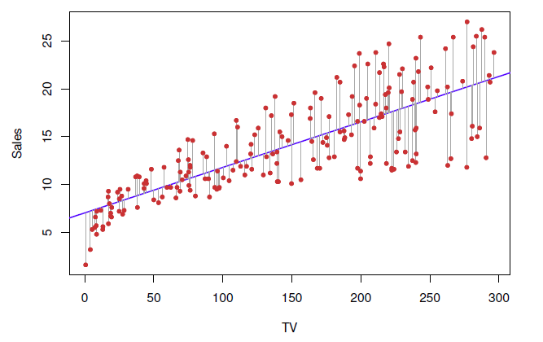
</img>

<b>FIG 4.1</b><i> </i>

Dans la $figure\ 4.2$, nous avons calculé le **RSS** pour un certain nombre de valeurs de $\beta_0$ et $\beta_1$, en utilisant les données publicitaires avec les ventes comme réponse et la télévision comme prédicteur. Dans chaque graphique, le point rouge représente la paire d'estimations des moindres carrés $({\hat{\beta}}_0, {\hat{\beta}}_1)$ donnée par (4.4). Ces valeurs minimisent clairement le RSS.

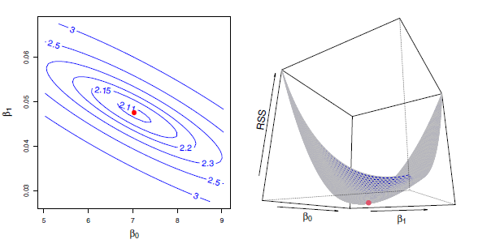
</img>

<b>FIG 4.2</b><i> </i>

<a name="4-1-2"/>

### [4.1.2 Évaluation de l'exactitude des estimations de coefficients](#4-1-2) ###

[Retour TOC](#toc)

Rappelons que, d'après (2.1), nous supposons que la relation réelle entre $X$ et $Y$ prend la forme $Y=f(X)+\epsilon$ pour une certaine fonction inconnue $f$, où $\epsilon$ est un terme d'erreur aléatoire de moyenne nulle. 

Si $f$ doit être approximée par une fonction linéaire, alors nous pouvons écrire cette relation sous la forme 

$$
Y=\beta_0+\beta_1X+\epsilon. \hspace{6 em} 		(4.5)
$$

Ici, $\beta_0$ est le terme d'interception, c'est-à-dire la valeur attendue de $Y$ lorsque $X=0$, et $\beta_1$ est la pente, c'est-à-dire l'augmentation moyenne de $Y$ associée à une augmentation d'une unité de $X$. 

Le terme d'erreur est un fourre-tout pour ce qui nous échappe avec ce modèle simple : la vraie relation n'est probablement pas linéaire, d'autres variables peuvent faire varier $Y$ , et il peut y avoir une erreur de mesure. 

Nous supposons généralement que le terme d'erreur est indépendant de $X$. Le modèle donné par (4.5) définit la ligne de régression de la population, qui est la meilleure approximation linéaire de la relation réelle entre $X$ et $Y$ (L'hypothèse de linéarité est souvent un modèle de travail utile. Cependant, malgré ce que de nombreux manuels peuvent nous dire, nous pensons rarement que la véritable relation est linéaire). 

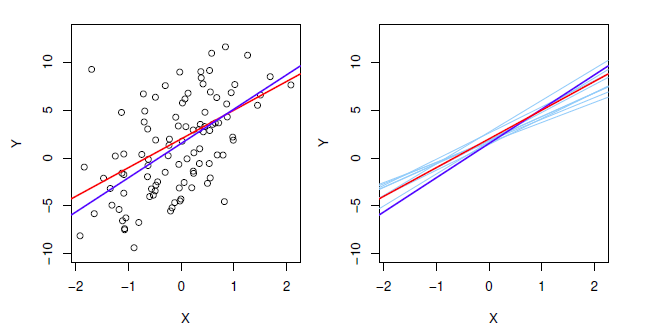
</img>

<b>FIG 4.3</b><i> ![Un ensemble de données simulées. À gauche : la ligne rouge représente la relation réelle, f(X) = 2+3X, que l'on appelle la ligne de régression de la population. La ligne bleue est la ligne des moindres carrés ; il s'agit de l'estimation des moindres carrés de f(X) basée sur les données observées, représentées en noir. A droite : La ligne de régression de la population est à nouveau représentée en rouge, et la ligne des moindres carrés en bleu foncé. En bleu clair, dix lignes de moindres carrés sont représentées, chacune étant calculée sur la base d'un ensemble aléatoire distinct d'observations. Chaque ligne des moindres carrés est différente, mais en moyenne, les lignes des moindres carrés sont assez proches de la ligne de régression de la population.](https://www.statlearning.com/)</i>

**Les estimations du coefficient de régression des moindres carrés** (4.4) caractérisent **la ligne des moindres carrés** (4.2). Le panneau de gauche de la $figure 4.3$ présente ces deux lignes dans un exemple simulé simple. Nous avons créé $100\ X$ aléatoires et généré $100\ Y$ correspondants à partir du modèle 

$$
Y=2+3X+\epsilon, \hspace {6 em}		(4.6)
$$

où $\epsilon$ a été généré à partir d'une distribution normale de moyenne zéro. La ligne rouge dans le panneau de gauche de la $figure 4.3$ représente la relation réelle, $f(X)\ =\ 2+3X$, tandis que la ligne bleue est l'estimation par les moindres carrés basée sur les données observées. 

La relation réelle n'est généralement pas connue pour les données réelles, mais la ligne des moindres carrés peut toujours être calculée à l'aide des estimations de coefficient données dans (4.4).  

En d'autres termes, dans les applications réelles, nous avons accès à un ensemble d'observations à partir desquelles nous pouvons calculer la droite des moindres carrés ; cependant, la droite de régression de la population n'est pas observée. 
Dans le panneau de droite de la $figure 4.3$, nous avons généré dix ensembles de données différents à partir du modèle donné par (4.6) et tracé les dix lignes des moindres carrés correspondantes. 

Les différents ensembles de données générés à partir du même modèle réel donnent des lignes de moindres carrés légèrement différentes, mais la ligne de régression de la population non observée ne change pas. 

À première vue, la différence entre la ligne de régression de la population et la ligne des moindres carrés peut sembler subtile et déroutante. 
Nous ne disposons que d'un seul ensemble de données, alors **que signifie le fait que deux lignes différentes décrivent la relation entre le prédicteur et la réponse ?** 
Fondamentalement, le concept de ces deux lignes est une extension naturelle de l'approche statistique standard qui consiste à utiliser les informations d'un échantillon pour estimer les caractéristiques d'une grande population. Par exemple, supposons que nous soyons intéressés à connaître la moyenne de population $\mu$ d'une certaine variable aléatoire $Y$ . Malheureusement, $\mu$ est inconnu, mais nous avons accès à $n$ observations de $Y$, $y_1,\ .\ .\ .\ ,\ y_n$, que nous pouvons utiliser pour estimer $\mu$. Une estimation raisonnable est $\hat{\mu}=\bar{y}$, où 

$$
$\bar{y}=\frac{1}{n}\ \sum_{i=1}^{n}y_i
$$

est la moyenne de l'échantillon. 

**La moyenne de l'échantillon et la moyenne de la population sont différentes, mais en général, la moyenne de l'échantillon fournira une bonne estimation de la moyenne de la population. **

**De la même manière, les coefficients inconnus $\beta_0$ et $\beta_1$ dans la régression linéaire définissent la droite de régression de la population**. Nous cherchons à estimer ces coefficients inconnus en utilisant ${\hat{\beta}}_0$ et ${\hat{\beta}}_1$ donnés dans (4.4). Ces estimations de coefficients définissent la droite des moindres carrés. 

L'analogie entre la régression linéaire et l'estimation de la moyenne d'une variable aléatoire est une analogie pertinente basée sur le concept de biais. 

Si nous utilisons la moyenne de l'échantillon $\hat{\mu}$ pour estimer $\mu$, cette estimation est sans biais, dans le sens où, en moyenne, nous nous attendons à ce que $\hat{\mu}$ soit égal à $\mu$. 
**Qu'est-ce que cela signifie exactement ?** 
Cela signifie que sur la base d'un ensemble particulier d'observations $y_1,\ .\ .\ .\ ,\ y_n$, $\hat{\mu}$ pourrait surestimer ${\mu}$, et sur la base d'un autre ensemble d'observations, $\hat{\mu}$ pourrait sous-estimer ${\mu}$. Mais si nous pouvions faire la moyenne d'un très grand nombre d'estimations de $\mu$ obtenues à partir d'un très grand nombre d'ensembles d'observations, alors cette moyenne serait exactement égale à $\mu$. Par conséquent, un estimateur sans biais ne surestime ou ne sous-estime pas systématiquement le vrai paramètre. 

La propriété d'impartialité s'applique également aux estimations des coefficients des moindres carrés données par (4.4) : si nous estimons $\beta_0$ et $\beta_1$ sur la base d'un ensemble de données particulier, nos estimations ne seront pas exactement égales à $\beta_0$ et $\beta_1$. Mais si nous pouvions faire la moyenne des estimations obtenues sur un grand nombre d'ensembles de données, alors la moyenne de ces estimations serait parfaite ! 

En fait, nous pouvons voir dans le panneau de droite de la $figure 4.3$ que la moyenne de nombreuses lignes de moindres carrés, chacune estimée à partir d'un ensemble de données distinct, est assez proche de la véritable ligne de régression de la population. 

Nous poursuivons l'analogie avec l'estimation de la moyenne de population $\mu$ d'une variable aléatoire $Y$. Une question naturelle est la suivante : 
**quelle est la précision de la moyenne de l'échantillon $\hat{\mu}$ en tant qu'estimation de ${\mu}$  ?** 
Nous avons établi que la moyenne des $\hat{\mu}$ sur de nombreux ensembles de données sera très proche de $\mu$, mais qu'une seule estimation $\hat{\mu}$ peut être une sous-estimation ou une surestimation substantielle de $\mu$. 

**Dans quelle mesure cette seule estimation de $\hat{\mu}$ sera-t-elle erronée ?** 
En général, nous répondons à cette question en calculant l'**erreur standard** de $\hat\mu$ , écrite comme **SE**( $\hat{\mu}$ ). Nous disposons de la formule bien connue 

$$
Var(\hat{\mu})=SE\left(\hat{\mu}\right)^2=\frac{\sigma^2}{n}\  , \hspace {6 em} 		(4.7)
$$

où $\sigma$ est l'écart type de chacune des réalisations $y_i$ de $Y$ (cette formule est valable à condition que les $n$ observations ne soient pas corrélées). 

En gros, **l'erreur standard nous indique la quantité moyenne dont cette estimation**  $\hat{\mu}$ diffère de la valeur réelle de $\mu$. L'équation 4.7 nous indique également comment cet écart se réduit avec $n$ ; plus le nombre d'observations est élevé, plus l'erreur standard de $\hat{\mu}$ est faible. 

Dans le même ordre d'idées, nous pouvons nous demander à quel point ${\hat{\beta}}_0$ et ${\hat{\beta}}_1$ sont proches des vraies valeurs $\beta_0$ et $\beta_1$. 
Pour calculer les erreurs standard associées à ${\hat{\beta}}_0$ et ${\hat{\beta}}_1$, nous utilisons les formules suivantes : 

$$
SE \left(\hat\beta_0\right)^2=\sigma^2\left[\frac{1}{n} + \bar{x}^2 \ / \ \sum_{i=1}^n\left(x_i-\bar x^2\right)\right],\ SE\left(\hat\beta_1\right)^2= \sigma^2 / \sum_{i=1}^n(x_i-\bar{x})^2, \hspace{6 em} (4.8)
$$

 où $\sigma^2=Var(\epsilon)$. 

Pour que ces formules soient strictement valides, nous devons supposer que les erreurs $\epsilon_i$ pour chaque observation ont une variance commune $\sigma^2$ et ne sont pas corrélées. 

Ce n'est manifestement pas le cas dans la $figure 4.1$, mais la formule s'avère néanmoins être une bonne approximation. Nous voyons dans la formule que $SE({\hat{\beta}}_1)$ est plus petit lorsque les $x_i$ sont plus étalés ; intuitivement, nous avons plus de levier pour estimer une pente lorsque c'est le cas. 

Nous voyons également que $SE( {\hat{\beta}}_0)$ serait la même que $SE(\hat{\mu})$ si $\bar{x}$ était nul ( auquel cas ${\hat{\beta}}_0$ serait égal à $\bar{y}$ ).

En général, $\sigma^2$ n'est pas connu, mais peut être estimé à partir des données. Cette estimation de $\sigma$ est connue sous le nom d'erreur standard résiduelle, et est donnée par la formule

$$
RSE=\sqrt{\frac{RSS}{n\ -\ 2}}. 
$$

Strictement parlant, lorsque $\sigma^2$ est estimé à partir des données, nous devrions écrire  $\widehat{SE}({\hat{\beta}}_1)$ pour indiquer qu'une estimation a été faite, mais pour simplifier la notation, nous allons laisser tomber ce "chapeau" supplémentaire. 

Les erreurs standard peuvent être utilisées pour calculer les intervalles de confiance. Un intervalle de confiance à 95% est défini comme une plage de valeurs telle qu'avec une probabilité de 95%, la plage contiendra la vraie valeur inconnue du paramètre. La plage est définie en termes de limites inférieure et supérieure calculées à partir de l'échantillon de données. 

Un intervalle de confiance à 95% a la propriété suivante : si nous prenons des échantillons répétés et construisons l'intervalle de confiance pour chaque échantillon, 95% des intervalles contiendront la vraie valeur inconnue du paramètre. 

Pour une régression linéaire, l'intervalle de confiance à 95% pour $\beta_1$ prend approximativement la forme 

$$
\hat{\beta}_1 \pm2 \ \centerdot \ SE(\hat{\beta}_1) \hspace{6 em} (4.9)
$$

C'est-à-dire qu'il y a environ 95 % de chances que l'intervalle 

$$
[\hat{\beta}_1 - 2 \ \centerdot\ SE(\hat{\beta}_1),\ \hat{\beta}_1 + 2 \ \centerdot\ SE(\hat{\beta}_1)] \hspace{6 em} (4.10)
$$

contienne la vraie valeur de $\beta_1$ (Approximativement pour plusieurs raisons. L'équation 4.10 repose sur l'hypothèse que les erreurs sont gaussiennes. 

De plus, le facteur de 2 devant le terme $SE({\hat{\beta}}_1)$ varie légèrement en fonction du nombre d'observations $n$ dans la régression linéaire. Pour être précis, le nombre 2 (4.10) devrait contenir le quantile 97.5% d'une distribution $t$ avec $n-2\ degrés$ de liberté. 

De même, un intervalle de confiance pour $\beta_0$ prend approximativement la forme 

$$
\hat{\beta}_1 \pm2 \ \centerdot \ SE(\hat{\beta}_1) \hspace{6 em} (4.11)
$$

Dans le cas des données publicitaires, l'intervalle de confiance à 95% pour $\beta_0$ est [6.130, 7.935] et l'intervalle de confiance à 95% pour $\beta_1$ est [0.042, 0.053]. Par conséquent, nous pouvons conclure qu'en l'absence de toute publicité, les ventes tomberont, en moyenne, quelque part entre 6.130 et 7.935 unités. De plus, pour chaque augmentation de 1000 $ de la publicité télévisée, il y aura une augmentation moyenne des ventes de 42 à 53 unités. 

**Les erreurs standard peuvent également être utilisées pour effectuer des tests d'hypothèse sur les coefficients**. Le test d'hypothèse le plus courant consiste à tester l'hypothèse nulle 

$$
H_0\ :\ Il\ n'y\ a\ pas\ de\ relation\ entre\ X\ et\ Y \hspace{6 em} 	(4.12)
$$

par rapport à l'hypothèse alternative 

$$
H_a\ :\ Il\ existe\ une\ certaine\ relation\ entre\ X\ et\ Y \hspace {6 em}	 (4.13)
$$

Mathématiquement, cela correspond à tester 

$$
H_0 ∶\ \beta_1=0\
$$

par rapport à 

$$
H_a∶\beta_1\neq0,\ 
$$

puisque si $\beta_1\ =0$, le modèle (4.5) se réduit à $Y=\beta_0+\epsilon$, et $X$ n'est pas associé à $Y$ .

Pour tester l'hypothèse nulle, nous devons déterminer si ${\hat{\beta}}_1$, notre estimation pour $\beta_1$, est suffisamment éloignée de zéro pour que nous puissions être sûrs que $\beta_1$ est non nul. **Jusqu'à quel point est-ce suffisant ?** 
Cela dépend bien sûr de la précision de ${\hat{\beta}}_1$, c'est-à-dire de $SE({\hat{\beta}}_1)$. 
Si $SE({\hat{\beta}}_1)$ est faible, alors même des valeurs relativement faibles de ${\hat{\beta}}_1$ peuvent fournir des preuves solides que $\beta_1\neq0$, et donc qu'il existe une relation entre $X$ et $Y$ . En revanche, si $SE({\hat{\beta}}_1)$ est grand, alors ${\hat{\beta}}_1$ doit être grand en valeur absolue pour que nous puissions rejeter l'hypothèse nulle. 

En pratique, nous calculons une statistique $t$, donnée par 

$$
t=\frac{\hat{\beta}_1 - 0}{SE(\hat{\beta}_1)}, \hspace {6 em} (4.14)
$$

qui mesure le nombre d'écarts types que ${\hat{\beta}}_1$ est éloigné de 0. 

S'il n'y a vraiment aucune relation entre $X$ et $Y$ , alors nous nous attendons à ce que (4.14) ait une distribution $t$ avec $n-2$ degrés de liberté. 

La distribution $t$ a une forme de cloche et pour les valeurs de $n$ supérieures à environ $30$, elle est assez similaire à la distribution normale standard. Par conséquent, il est facile de calculer la probabilité d'observer un nombre égal à $|t|$ ou plus grand en valeur absolue, en supposant que $\beta_1=0$. Nous appelons cette probabilité la valeur $p$. 

En gros, nous interprétons la valeur $p$ comme suit : une petite valeur $p$ indique qu'il est peu probable d'observer une association aussi importante entre le prédicteur et la réponse due au hasard, en l'absence de toute association réelle entre le prédicteur et la réponse. 

Par conséquent, si nous observons une petite valeur $p$, nous pouvons en déduire qu'il existe une association entre le prédicteur et la réponse. 

Nous rejetons l'hypothèse nulle, c'est-à-dire que nous déclarons qu'il existe une relation entre $X$ et $Y$, si la valeur $p$ est suffisamment faible. 

Les seuils typiques de la valeur $p$ pour le rejet de l'hypothèse nulle sont de 5% ou 1%. Lorsque $n=30$, cela correspond à des statistiques $t$ (4.14) d'environ 2 et 2.75, respectivement. 

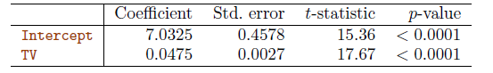
</img>

<b>TAB 4.1</b><i> </i>

Le $tableau 4.1$ fournit les détails du modèle des moindres carrés pour la régression du nombre d'unités vendues sur le budget de publicité télévisée pour les données sur la publicité. Les coefficients pour ${\hat{\beta}}_0$ et ${\hat{\beta}}_1$ sont très grands par rapport à leurs erreurs standard, de sorte que les statistiques t sont également grandes ; les probabilités de voir de telles valeurs si $H_0$ est vrai sont pratiquement nulles. 
Nous pouvons donc conclure que $\beta_0\neq0$ et $\beta_1\neq0$ (Dans le tableau 4.1, une petite valeur $p$ pour l'ordonnée à l'origine indique que nous pouvons rejeter l'hypothèse nulle que $\beta_0=0$. l'hypothèse nulle que $\beta_0=0$, et une petite valeur $p$ pour TV indique que nous pouvons rejeter l'hypothèse nulle que $\beta_1=0$. rejeter l'hypothèse nulle selon laquelle $\beta_1=0$. Le rejet de cette dernière hypothèse nulle nous permet de conclure qu'il existe une relation entre la télévision et les ventes. qu'il existe une relation entre la télévision et les ventes. Le rejet de la première hypothèse nous permet de conclure qu'en l'absence de dépenses de télévision, les ventes sont non nulles.)

<a name="4-1-3"/>

### [4.1.3  Évaluation de la précision du modèle](#4-1-3) ###

[Retour TOC](#toc)

Une fois que nous avons rejeté l'hypothèse nulle (4.12) en faveur de l'hypothèse alternative (4.13), il est naturel de vouloir quantifier la mesure dans laquelle le modèle s'ajuste aux données. Le $tableau 4.2$ présente l'erreur standard résiduelle (**RSE**), la statistique $R^2$ et la $F-statistique$  (décrite à la section 4.2.2) pour la régression linéaire du nombre d'unités vendues sur le budget de publicité télévisée.

<a name="4-1-3-1"/>

#### [4.1.3.1  Erreur standard résiduelle](#4-1-3-1) ####

[Retour TOC](#toc)

Rappelons que dans le modèle (4.5), chaque observation est associée à un terme d'erreur $\varepsilon$. 
En raison de la présence de ces termes d'erreur, même si nous connaissions la véritable ligne de régression (c'est-à-dire même si $\beta_0$ et $\beta_1$ étaient connus), nous ne serions pas en mesure de prédire parfaitement $Y$ à partir de $X$. 

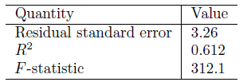
</img>

<b>TAB 4.2</b><i> </i>

Le RSE est une estimation de l'écart type de $\varepsilon$. En gros, il s'agit de la quantité moyenne de déviation de la réponse par rapport à la vraie ligne de régression. Elle est calculée à l'aide de la formule

$$
RSE=\sqrt{\frac{1}{n-2}RSS}=\sqrt {\ \frac{1}{n-2}\ \sum_{i=1}^n(y_i-\hat{y}_i)^2}. \hspace {6 em} (4.15)
$$

Notez que le **RSS** a été défini dans la section 4.1.1, et est donné par la formule suivante

$$
RSS=\left(\sum_{i=1}^n(y_i-\hat{y}_i)^2\right). \hspace{6 em} (4.16)
$$

Dans le cas des données sur la publicité, nous constatons, d'après les résultats de la régression linéaire du $tableau 4.2$, que le **RSE** est de 3.26. En d'autres termes, les ventes réelles sur chaque marché s'écartent de la véritable ligne de régression d'environ 3260 unités, en moyenne. 

Une autre façon de voir les choses est que même si le modèle était correct et que les vraies valeurs des coefficients inconnus $\beta_0$ et $\beta_1$ étaient connues avec exactitude, toute prédiction des ventes sur la base de la publicité télévisée serait toujours erronée d'environ 3260 unités en moyenne. Bien entendu, le fait que 3260 unités constituent ou non une erreur de prédiction acceptable dépend du contexte du problème. 
Dans l'ensemble de données sur la publicité, la valeur moyenne des ventes sur tous les marchés est d'environ 14000 unités, et le pourcentage d'erreur est donc de 3260/14000=23%. 

Le **RSE** est considéré comme une mesure du manque d'ajustement du modèle (4.5) aux données. Si les prédictions obtenues à l'aide du modèle sont très proches des valeurs réelles des résultats - c'est-à-dire si ${\hat{y}}_i\ \approx y_i \ pour \ i=1,\ ....\ ,n$ alors (4.15) sera petit, et nous pouvons conclure que le modèle s'ajuste très bien aux données. 
En revanche, si ${\hat{y}}_i$ est très éloigné de $y_i$ pour une ou plusieurs observations, alors le **RSE** peut être assez grand, ce qui indique que le modèle ne s'ajuste pas bien aux données.

<a name="4-1-3-2"/>

#### [4.1.3.2 Statistique R-carré](#4-1-3-2) ####

[Retour TOC](#toc)

Le **RSE** fournit une mesure absolue du manque d'ajustement du modèle (4.5) aux données. Mais comme il est mesuré en unités de $Y$ , il n'est pas toujours évident de déterminer ce qui constitue un bon **RSE**. La statistique $R^2$ fournit une autre mesure de l'adéquation. Elle prend la forme d'une proportion - la proportion de variance expliquée - et prend donc toujours une valeur comprise entre 0 et 1, et est indépendante de l'échelle de $Y$ . 
Pour calculer $R^2$, nous utilisons la formule

$$
R^2=\frac{TSS-RSS}{TSS}=1-\frac{RSS}{TSS} \hspace{6 em} (4.17)
$$

où $TSS={\sum{(y_i-}\bar{y})}^2$ est la somme totale des carrés, et **RSS** est défini dans (4.16). Le **TSS** mesure la variance totale de la réponse $Y$ , et peut être considérée comme la quantité de variabilité inhérente à la réponse avant l'exécution de la régression. 

En revanche, **RSS** mesure la quantité de variabilité qui reste inexpliquée après avoir effectué la régression. Par conséquent, $TSS-RSS$ mesure la quantité de variabilité de la réponse qui est expliquée (ou supprimée) en effectuant la régression, et $R^2$ mesure la proportion de variabilité de $Y$ qui peut être expliquée en utilisant $X$. 
Une statistique $R^2$ proche de 1 indique qu'une grande proportion de la variabilité de la réponse est expliquée par la régression. 

Un nombre proche de 0 indique que la régression n'explique pas une grande partie de la variabilité de la réponse ; cela peut se produire parce que le modèle linéaire est erroné, ou que la variance d'erreur $\sigma^2$ est élevée, ou les deux. 

Dans le $tableau 4.2$, le $R^2$ est de 0.61, ce qui signifie qu'un peu moins des deux tiers de la variabilité des ventes sont expliqués par une régression linéaire sur la télévision. 

La statistique $R^2$  (4.17) présente un avantage d'interprétation par rapport au **RSE** (4.15), car contrairement au **RSE**, elle est toujours comprise entre 0 et 1. Cependant, il peut être difficile de déterminer ce qu'est une bonne valeur $R^2$ et, en général, cela dépend de l'application. Par exemple, dans certains problèmes de physique, nous pouvons savoir que les données proviennent réellement d'un modèle linéaire avec une petite erreur résiduelle. Dans ce cas, nous nous attendons à voir une valeur $R^2$ extrêmement proche de 1, et une valeur $R^2$ sensiblement plus faible pourrait indiquer un problème sérieux avec l'expérience dans laquelle les données ont été générées. 

D'autre part, dans les applications typiques en biologie, psychologie, marketing et autres domaines, le modèle linéaire (4.5) est au mieux une approximation extrêmement grossière des données, et les erreurs résiduelles dues à d'autres facteurs non mesurés sont souvent très importantes. Dans ce contexte, on s'attendrait à ce que seule une très faible proportion de la variance de la réponse soit expliquée par le prédicteur, et une valeur $R^2$ bien inférieure à 0.1 pourrait être plus réaliste !

La statistique $R^2$ est une mesure de la relation linéaire entre $X$ et $Y$ . Rappelons que la corrélation, définie comme 

$$
Cor(X,Y)=\sum_{i=1}^n \ (x_i-\bar{x})\ (y_i-\bar{y})\ / \ \ \sqrt{\sum_{i=1}^n \ (x_i-\bar{x})^2} \ \ \sqrt{\sum_{i=1}^n\ (y_i-\bar{y})^2} \hspace{6 em} (4.18)
$$

est également une mesure de la relation linéaire entre $X$ et $Y$ (Nous notons qu'en fait, le côté droit de (3.18) est la corrélation d'échantillon ; il serait donc plus correct d'écrire $\widehat{Cor(X,Y)}$  ; cependant, nous omettons le "chapeau" pour faciliter la notation). 

Cela suggère que nous pourrions utiliser $r=Cor(X,\ Y)$ au lieu de $R^2$ afin d'évaluer l'adéquation du modèle linéaire. En fait, on peut montrer que dans le cadre de la régression linéaire simple, $R^2=r^2$. En d'autres termes, la corrélation au carré et la statistique $R^2$ sont identiques. 

Cependant, dans la section suivante, nous allons aborder le problème de la régression linéaire multiple, dans lequel nous utilisons plusieurs prédicteurs simultanément pour prédire la réponse. Le concept de corrélation entre les prédicteurs et la réponse ne s'étend pas automatiquement à ce contexte, puisque la corrélation quantifie l'association entre une seule paire de variables plutôt qu'entre un plus grand nombre de variables. Nous verrons que $R^2$ remplit ce rôle.

<a name="4-2"/>

## [4.2 Régression linéaire multiple](#4-2) ##

[Retour TOC](#toc)

La régression linéaire simple est une approche utile pour prédire une réponse sur la base d'une seule variable prédictive. 

Cependant, dans la pratique, nous avons souvent plus d'un prédicteur. Par exemple, dans les données sur la publicité, nous avons examiné la relation entre les ventes et la publicité télévisée. Nous disposons également de données sur les sommes dépensées pour la publicité à la radio et dans les journaux, et nous pouvons souhaiter savoir si l'un ou l'autre de ces deux médias est associé aux ventes. 

**Comment pouvons-nous étendre notre analyse des données sur la publicité afin de prendre en compte ces deux prédicteurs supplémentaires ?** L'une des options consiste à effectuer trois régressions linéaires simples distinctes, chacune d'entre elles utilisant un support publicitaire différent comme prédicteur. Par exemple, nous pouvons effectuer une régression linéaire simple pour prédire les ventes sur la base du montant dépensé en publicités radio. Les résultats sont présentés dans le $tableau\ 4.3$  (tableau supérieur). Nous constatons qu'une augmentation de 1 000 dollar des dépenses en publicité radio est associée à une augmentation des ventes d'environ 203 unités. 

Le $tableau\ 4.3$  (tableau du bas) contient les coefficients des moindres carrés pour une régression linéaire simple des ventes sur le budget de publicité dans les journaux. Une augmentation de 1 000 dollar du budget de publicité dans les journaux est associée à une augmentation des ventes d'environ 55 unités. 

Cependant, l'approche consistant à ajuster un modèle de régression linéaire simple distinct pour chaque prédicteur n'est pas entièrement satisfaisante. 

1. Tout d'abord, il n'est pas évident de faire une prédiction unique des ventes compte tenu des trois budgets publicitaires, puisque chacun des budgets est associé à une équation de régression distincte. 
2. Deuxièmement, chacune des trois équations de régression ne tient pas compte des deux autres médias dans la formation des estimations des coefficients de régression. 

Nous verrons bientôt que si les budgets médias sont corrélés entre eux sur les 200 marchés de notre ensemble de données, cela peut conduire à des estimations très trompeuses de l'association entre chaque budget média et les ventes. 

Au lieu d'ajuster un modèle de régression linéaire simple distinct pour chaque prédicteur, une meilleure approche consiste à étendre le modèle de régression linéaire simple (4.5) afin qu'il puisse directement prendre en compte des prédicteurs multiples. Pour ce faire, nous pouvons attribuer à chaque prédicteur un coefficient de pente distinct dans un modèle unique. En général, supposons que nous ayons $p$ prédicteurs distincts. Le modèle de régression linéaire multiple prend alors la forme suivante

$$
Y = β0 + β1X_1 + β2X_2 +···+ βpX_p + \varepsilon, \hspace{6 em}(4.19)
$$

où $X_j$ représente le $j^{ème}$ prédicteur et $β_j$ quantifie l'association entre cette variable et la réponse. Nous interprétons $β_j$ comme l'effet moyen sur $Y$ d'une augmentation d'une unité de $X_j$ , en maintenant fixes toutes les autres prédicteurs. 

Dans l'exemple de la publicité, (4.19) devient 

$$
ventes = β_0 + β_1 × TV + β_2 × radio + β3 × journal + \varepsilon. \hspace{6 em}(4.20)
$$

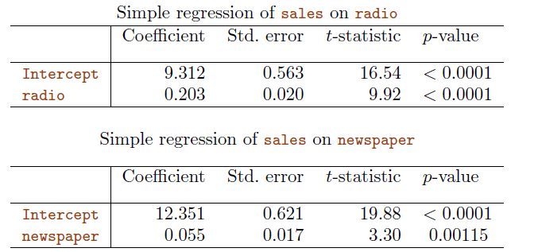
</img>

<b>TAB 4.3</b><i> ![Autres modèles de régression linéaire simple pour les données sur la publicité. Coefficients du modèle de régression linéaire simple pour le nombre d'unités vendues sur Haut : budget de publicité radio et Bas : budget de publicité dans les journaux. Une augmentation de 1 000 $ des dépenses de publicité à la radio est associée à une augmentation moyenne des ventes d'environ 203 unités, tandis que la même augmentation des dépenses de publicité dans les journaux est associée à une augmentation moyenne des ventes d'environ 55 unités. (Notez que la variable des ventes est exprimée en milliers d'unités, et que les variables de la radio et des journaux sont exprimées en milliers de dollars).](https://www.statlearning.com/)</i>

<a name="4-2-1"/>

### [4.2.1 Estimation des coefficients de régression](#4-2-1)  ###

[Retour TOC](#toc)

Comme c'était le cas dans le cadre de la régression linéaire simple, les coefficients de régression $β_0,β_1, . . . ,βp$ dans (4.19) sont inconnus, et doivent être estimés. Étant donné les estimations $\hat{β}_0, \hat {β}_1,..., \hat{β}_p$, nous pouvons faire des prédictions en utilisant la formule 

$$
\hat{y} = \hat{β}_0 + \hat{β}_1x_1 + \hat{β}_2x_2 +...+ \hat{β}_px_p. \hspace{6 em} (4.21)
$$

Les paramètres sont estimés en utilisant la même approche des moindres carrés que nous avons vue dans le contexte de la régression linéaire simple. Nous choisissons $β_0,β_1, . . . ,βp$  pour minimiser la somme des carrés des résidus 

$$
RSS = \sum_{i=1}^n (yi - \hat{y}_i)^2 = \sum_{i=1}^n (yi - \hat{β}_0 - \hat{β}_1x_1 - \hat{β}_2x_2 -- - -- \hat{β}_px_p)^2. \hspace {6 em} (4.22)
$$

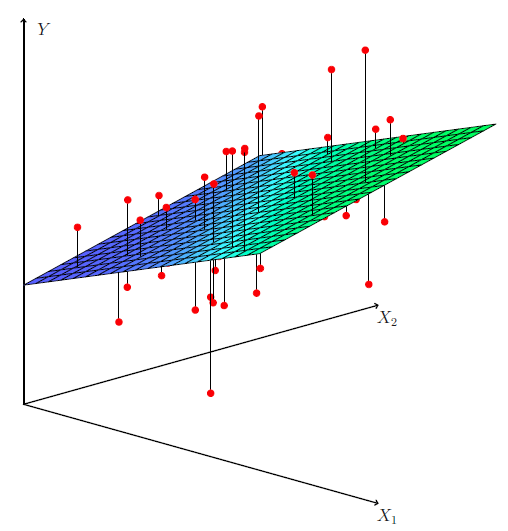
</img>

<b>FIG 4.4</b><i> </i>

Les valeurs $\hat{β}_0, \hat {β}_1,..., \hat{β}_p$ qui minimisent (4.22) sont les estimations des coefficients de régression par moindres carrés multiples. 

Contrairement aux estimations de la régression linéaire simple données dans (4.4), les estimations des coefficients de régression multiple ont des formes un peu compliquées qui sont plus facilement représentées en utilisant l'algèbre matricielle.  

N'importe quel logiciel statistique peut être utilisé pour calculer ces estimations de coefficients.

La $figure\ 4.4$ illustre un exemple d'ajustement par les moindres carrés à un ensemble de données avec $p = 2$ prédicteurs. Le $tableau\ 4.4$ présente les estimations des coefficients de régression multiple lorsque les budgets de publicité à la télévision, à la radio et dans les journaux sont utilisés pour prédire les ventes de produits à l'aide des données sur la publicité. 

Nous interprétons ces résultats comme suit : pour un montant donné de publicité à la télévision et dans les journaux, dépenser 1 000 dollars supplémentaires en publicité à la radio est associé à environ 189 unités de ventes supplémentaires. En comparant ces estimations de coefficients à celles des $tableaux\ 4.1\ et\ 4.3$, nous constatons que les estimations des coefficients de régression multiple pour la télévision et la radio sont assez similaires aux estimations des coefficients de régression linéaire simple. Cependant, alors que l'estimation du coefficient de régression du journal dans le tableau 4.3 était significativement non nulle, l'estimation du coefficient du journal dans le modèle de régression multiple est proche de zéro, et la valeur $p$ correspondante n'est plus significative, avec une valeur autour de 0.86. 

Cela montre que les coefficients de régression simple et multiple peuvent être très différents. Cette différence provient du fait que dans le cas de la régression simple, le terme de la pente représente l'augmentation moyenne des ventes de produits associée à une augmentation de 1 000 dollars de la publicité dans les journaux, sans tenir compte des autres prédicteurs tels que la télévision et la radio. 

En revanche, dans le cas de la régression multiple, le coefficient du journal représente l'augmentation moyenne des ventes de produits associée à une augmentation de 1 000 dollars des dépenses dans les journaux, sans tenir compte de la télévision et de la radio.

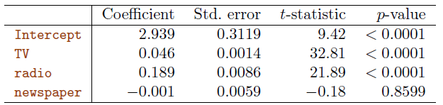
</img>

<b>TAB 4.4</b><i> </i>

**Est-il logique que la régression multiple suggère l'absence de relation entre les ventes et le journal alors que la régression linéaire simple implique le contraire ?** En fait, c'est le cas. Examinez la matrice de corrélation des trois variables prédicteurs et de la variable réponse, présentée au tableau 4.5. La corrélation entre la radio et le journal est de 0.35. Cela indique que les marchés où la publicité dans les journaux est importante ont tendance à avoir également une forte publicité à la radio. 

Supposons maintenant que la régression multiple est correcte et que la publicité dans les journaux n'est pas associée aux ventes, mais que la publicité à la radio est associée aux ventes. Alors, sur les marchés où nous dépensons plus en radio, nos ventes auront tendance à être plus élevées, et comme le montre notre matrice de corrélation, nous avons également tendance à dépenser plus en publicité dans les journaux sur ces mêmes marchés. 

Par conséquent, dans une régression linéaire simple qui examine uniquement les ventes par rapport aux journaux, nous observerons que des valeurs plus élevées de journaux tendent à être associées à des valeurs plus élevées de ventes, même si la publicité dans les journaux n'est pas directement associée aux ventes. La publicité dans les journaux est donc un substitut de la publicité radiophonique ; le journal obtient le "crédit" de l'association entre la radio et les ventes. 

Ce résultat légèrement contre-intuitif est très courant dans de nombreuses situations de la vie réelle. Prenons un exemple absurde pour illustrer le propos. Une régression des attaques de requins par rapport aux ventes de crème glacée pour des données collectées dans une communauté balnéaire donnée sur une période donnée montrerait une relation positive, similaire à celle observée entre les ventes et le journal. Bien entendu, personne n'a (encore) suggéré d'interdire les glaces sur les plages pour réduire les attaques de requins. En réalité, les températures plus élevées incitent davantage de personnes à se rendre à la plage, ce qui se traduit par une augmentation des ventes de glaces et des attaques de requins. Une régression multiple des attaques de requins sur les ventes de glaces et la température révèle que, comme l'intuition l'implique, les ventes de glaces ne sont plus un facteur prédictif significatif après ajustement pour la température.

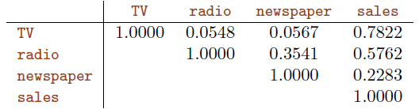
</img>

<b>TAB 4.5</b><i> </i>

<a name="4-2-2"/>

### [4.2.2 Quelques questions importantes](#4-2-2) ###

[Retour TOC](#toc)

Lorsque nous effectuons une régression linéaire multiple, nous souhaitons généralement répondre à quelques questions importantes. 

1. **Est-ce qu'au moins un des prédicteurs $X_1,X_2,...,X_p$ est utile pour prédire la réponse ?** 
2. **Toutes les variables prédictives permettent-elles d'expliquer $Y$ , ou seul un sous-ensemble de variables prédictives est-il utile ?** 
3. **Dans quelle mesure le modèle s'adapte-t-il aux données ?** 
4. **Étant donné un ensemble de valeurs prédicteurs, quelle valeur de réponse devrions-nous prédire et quelle est la précision de notre prédiction ?** 

Nous allons maintenant aborder chacune de ces questions à tour de rôle.

<a name="4-2-2-1"/>

#### [4.2.2.1 Un : existe-t-il une relation entre la réponse et les prédicteurs ?](#4-2-2-1)  ####

[Retour TOC](#toc)

Rappelez-vous que dans le cadre de la régression linéaire simple, pour déterminer s'il existe une relation entre la réponse et le prédicteur, nous pouvons simplement vérifier si $β_1=0$. 

Dans le cadre de la régression multiple avec $p$ prédicteurs, nous devons nous demander si tous les coefficients de régression sont nuls, c'est-à-dire si $β_1=β_2=...= β_p = 0$. Comme dans le cadre de la régression linéaire simple, nous utilisons un test d'hypothèse pour répondre à cette question. 

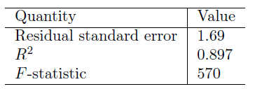
</img>

<b>TAB 4.6</b><i> </i>

Nous testons l'hypothèse nulle, 

$$
H_0 : β_1 = β_2 = ... = β_p = 0
$$

 par rapport à l'alternative 

$$
Ha :\ au\ moins\ un\ β_j\ est\ non\ nul.
$$

Ce test d'hypothèse est effectué en calculant la $F-statistique$ , 

$$
F = \frac{(TSS - RSS)/p} {RSS/(n - p - 1)} , \hspace{6 em} (4.23)
$$

 où, comme pour la régression linéaire simple, $TSS = \sum (y_i - \bar{y})^2$ et $RSS = (y_i-\bar{y}_i)^2. Si les hypothèses du modèle linéaire sont correctes, on peut montrer que 

$$
E \lbrace RSS/(n - p - 1) \rbrace = \sigma^2
$$

 et que, si H_0 est vrai, 

$$
E \lbrace (TSS - RSS)/p \rbrace = σ^2
$$

Par conséquent, lorsqu'il n'y a pas de relation entre la réponse et les prédicteurs, on s'attend à ce que la $F-statistique$ prenne une valeur proche de 1. D'autre part, si $H_a$ est vrai, alors $E \lbrace(TSS - RSS)/p \rbrace > \sigma_2$, ainsi nous souhaitons que $F-statistique$ soit plus grand que 1. 

La $F-statistique$ pour le modèle de régression linéaire multiple obtenu en régressant les ventes sur la radio, la télévision et les journaux est présentée au $tableau\ 4.6$. Dans cet exemple, la $F-statistique$ est de 570. Ce chiffre étant largement supérieur à 1, il fournit des preuves irréfutables contre l'hypothèse nulle H_0. En d'autres termes, la $F-statistique$ élevée suggère qu'au moins un des supports publicitaires doit être lié aux ventes. 

**Cependant, que se serait-il passé si la $F-statistique$ avait été plus proche de 1 ? Quelle doit être la taille de la $F-statistique$ pour que nous puissions rejeter $H_0$ et conclure à l'existence d'une relation ?** 

Il s'avère que la réponse dépend des valeurs de $n$ et de $p$. Lorsque $n$ est grand, une $F-statistique$ juste un peu plus grande que 1 peut encore fournir des preuves contre $H_0$. 

En revanche, une $F-statistique$ plus grande est nécessaire pour rejeter $H_0$ si $n$ est petit. Lorsque $H_0$ est vrai et que les erreurs $\varepsilon_i$ ont une distribution normale, la $F-statistique$ suit une $F-distribution$. 

Pour toute valeur donnée de $n$ et de $p$, n'importe quel logiciel statistique peut être utilisé pour calculer la valeur $p$ associée à la $F-statistique$ en utilisant cette distribution. Sur la base de cette valeur $p$, nous pouvons déterminer s'il faut ou non rejeter $H_0$. Pour les données relatives à la publicité, la valeur $p$ associée à la $F-statistique$ du $tableau\ 4.6$ est essentiellement nulle, ce qui signifie que nous avons des preuves extrêmement solides qu'au moins un des médias est associé à une augmentation des ventes. 

Parfois, nous voulons tester qu'un sous-ensemble particulier des coefficients $q$  est nul. Cela correspond à une hypothèse nulle 

$$
H_0 : β_{p-q+1} = β_{p-q+2}= ... = β_p = 0
$$

où par commodité nous avons mis les variables choisies pour l'omission à la fin de la liste. Dans ce cas, nous ajustons un second modèle qui utilise toutes les variables sauf les dernières $q$. Supposons que la somme résiduelle des carrés pour ce modèle soit $RSS_0$. Alors la $F-statistique$ appropriée est 

$$
F = \frac{(RSS0 - RSS)/q }{RSS/(n - p - 1)}. \hspace{6 em} (4.24)
$$

Dans le $tableau\ 4.4$, pour chaque prédicteur individuel, une $t-statistique$ et une valeur $p$ sont indiquées. Ces valeurs permettent de savoir si chaque prédicteur individuel est lié à la réponse, après ajustement pour les autres prédicteurs. Il s'avère que chacune de ces valeurs est exactement équivalente à la $F-test$ qui omet cette seule variable du modèle, laissant toutes les autres en place, c'est-à-dire $q=1$ dans (4.24). 

Il rapporte donc l'effet partiel de l'ajout de cette variable au modèle. Par exemple, comme nous l'avons vu précédemment, ces valeurs $p$ indiquent que la télévision et la radio sont liées aux ventes, mais que rien ne prouve que le journal soit associé aux ventes, lorsque la télévision et la radio sont maintenues fixes. Étant donné ces valeurs $p$ individuelles pour chaque variable, **pourquoi avons-nous besoin d'examiner la $F-statistique$ globale ?** Après tout, il semble probable que si l'une des valeurs $p$ pour les variables individuelles est très faible, alors au moins l'une des prédicteurs est liée à la réponse. Toutefois, cette logique est erronée, surtout lorsque le nombre de prédicteurs $p$ est élevé. Par exemple, considérons un exemple dans lequel $p = 100$ et $H_0 : β_1 = β_2 = ... = β_p = 0$ est vrai, donc aucune variable n'est vraiment associée à la réponse. 

Dans cette situation, environ 5 % des valeurs p associées à chaque variable (du type de celles présentées dans le $tableau\ 4.4$ ) seront inférieures à 0.05 par hasard. En d'autres termes, nous nous attendons à voir environ cinq petites valeurs $p$, même en l'absence de toute association réelle entre les prédicteurs et la réponse. 

En fait, il est probable que nous observerons au moins une valeur $p$ inférieure à 0.05 par hasard ! Par conséquent, si nous utilisons les $t-statistiques $individuelles et les valeurs $p$ associées pour décider s'il existe ou non une association entre les variables et la réponse, il y a de fortes chances que nous concluions à tort qu'il existe une relation. 

Cependant, la $F-statistique$  ne souffre pas de ce problème car elle s'ajuste au nombre de prédicteurs. Par conséquent, si $H_0$ est vrai, il n'y a que 5% de chances que la $F-statistique$ donne une valeur $p$ inférieure à 0.05, quel que soit le nombre de prédicteurs ou le nombre d'observations. L'approche consistant à utiliser une $F-statistique$ pour tester toute association entre les prédicteurs et la réponse fonctionne lorsque $p$ est relativement petit, et certainement petit par rapport à $n$. 

Cependant, il arrive que le nombre de variables soit très élevé. Si $p > n$, il y a plus de coefficients $β_j$ à estimer que d'observations à partir desquelles les estimer. Dans ce cas, nous ne pouvons même pas ajuster le modèle de régression linéaire multiple à l'aide des moindres carrés, la $F-statistique$ ne peut donc pas être utilisée, pas plus que la plupart des autres concepts que nous avons vus jusqu'à présent dans ce chapitre. Lorsque $p$ est grand, certaines des approches abordées dans la section suivante, comme la sélection directe, peuvent être utilisées. 

<a name="4-2-2-2"/>

#### [4.2.2.2 Deux : décider des variables importantes.](#4-2-2-2)  ####

[Retour TOC](#toc)

Comme nous l'avons vu dans la section précédente, la première étape d'une analyse de régression multiple consiste à calculer la $F-statistique$ et à examiner la valeur $p$ associée. Si nous concluons, sur la base de cette valeur $p$, qu'au moins un des prédicteurs est lié à la réponse, il est naturel de se demander quels sont les coupables ! Nous pourrions examiner les valeurs $p$ individuelles comme dans le tableau 4.4, mais comme nous l'avons vu, si $p$ est élevé, nous risquons de faire de fausses découvertes. Il est possible que toutes les variables prédicteurs soient associées à la réponse, mais il est plus fréquent que la réponse ne soit associée qu'à un sous-ensemble de variables prédicteurs. 

La tâche consistant à déterminer quelles prédicteurs sont associés à la réponse, afin d'ajuster un modèle unique impliquant uniquement ces prédicteurs, est appelée **sélection de variables**. 

Idéalement, nous aimerions effectuer une sélection de variables en essayant un grand nombre de modèles différents, chacun contenant un sous-ensemble différent de prédicteurs. Par exemple, si $p = 2$, nous pouvons considérer quatre modèles : 

1. un modèle ne contenant aucune variable, 
2. un modèle contenant uniquement $X_1$, 
3. un modèle contenant uniquement $X_2$, et 
4. un modèle contenant à la fois $X_1$ et $X_2$. 

Nous pouvons ensuite sélectionner le meilleur modèle parmi tous les modèles que nous avons considérés. 

**Comment déterminer quel est le meilleur modèle ?** Diverses statistiques peuvent être utilisées pour juger de la qualité d'un modèle. Il s'agit notamment du **$C_p$ de Mallow,** du **critère d'information d'Akaike (AIC)**, du **critère d'information bayésien (BIC)** et **du $R^2$ ajusté**. 

Nous pouvons également déterminer le meilleur modèle en traçant diverses sorties de modèle, telles que les résidus. Malheureusement, il existe un total de $2^p$ modèles qui contiennent des sous-ensembles de $p$ variables.  Cela signifie que même pour un $p$ modéré, il est impossible d'essayer tous les sous-ensembles possibles de prédicteurs. Par exemple, nous avons vu que si $p = 2$, alors il y a $2^2 = 4$ modèles à considérer. Mais si $p = 30$, nous devons considérer $2^{30} = 1 073 741 824$ modèles ! Ce n'est pas pratique. 

Par conséquent, à moins que $p$ ne soit très petit, nous ne pouvons pas considérer tous les $2^p$ modèles, et nous avons besoin d'une approche automatisée et efficace pour choisir un ensemble plus petit de modèles à considérer. Il existe trois approches classiques pour cette tâche : 

- **La sélection directe**. Nous commençons par le modèle nul c'est à dire un modèle qui contient une interception mais pas de prédicteurs. Nous ajustons ensuite $p$ régressions linéaires simples et ajoutons au modèle nul la variable qui donne le **RSS** le plus faible pour le nouveau modèle à deux variables. Cette approche est poursuivie jusqu'à ce qu'une règle d'arrêt soit satisfaite. 
- **Sélection à rebours**. Nous commençons par toutes les variables du modèle et supprimons la variable ayant la valeur $p$ la plus élevée, c'est-à-dire la variable qui est la moins significative sur le plan statistique. Le nouveau modèle à $(p - 1)$ variables est ajusté, et la variable ayant la plus grande valeur $p$ est retirée. Cette procédure se poursuit jusqu'à ce qu'une règle d'arrêt soit atteinte. Par exemple, nous pouvons nous arrêter lorsque toutes les variables restantes ont une valeur $p$ inférieure à un certain seuil. 
- **Sélection mixte**. Il s'agit d'une combinaison de sélection avant et arrière. Nous commençons sans aucune variable dans le modèle, et comme pour la sélection avant, nous ajoutons la variable qui fournit le meilleur ajustement. Nous continuons à ajouter des variables une par une. Bien entendu, comme nous l'avons noté dans l'exemple de la publicité, les valeurs $p$ des variables peuvent devenir plus importantes à mesure que de nouvelles variables prédictives sont ajoutées au modèle. Par conséquent, si à un moment donné la valeur $p$ de l'une des variables du modèle dépasse un certain seuil, nous retirons cette variable du modèle. Nous continuons à effectuer ces étapes avant et arrière jusqu'à ce que toutes les variables du modèle aient une valeur $p$ suffisamment faible, et que toutes les variables hors du modèle aient une valeur $p$ importante si elles étaient ajoutées au modèle. 

La sélection en amont ne peut pas être utilisée si $p > n$, tandis que la sélection en aval peut toujours être utilisée. La sélection directe est une approche avide, et peut inclure des variables au début du processus qui deviennent ensuite redondantes. La sélection mixte peut remédier à ce problème. 

<a name="4-2-2-3"/>

#### [4.2.2.3 Trois : Ajustement du modèle](#4-2-2-3) ####

[Retour TOC](#toc)

Deux des mesures numériques les plus courantes de l'adéquation du modèle sont le **RES** et le **$R^2$**, la fraction de la variance expliquée. 

Ces quantités sont calculées et interprétées de la même manière que pour la régression linéaire simple. Dans la régression simple, $R^2$ est **le carré de la corrélation entre la réponse et la variable**. Dans la régression linéaire multiple, il s'avère qu'il est égal à $Cor(Y, \hat{Y} )^2$, **le carré de la corrélation entre la réponse et le modèle linéaire ajusté** ; en fait, une propriété du modèle linéaire ajusté est qu'il maximise cette corrélation parmi tous les modèles linéaires possibles. 

Une valeur $R^2$  proche de 1 indique que le modèle explique une grande partie de la variance de la variable de réponse. À titre d'exemple, nous avons vu au $tableau\ 4.6$ que pour les données sur la publicité, le modèle qui utilise les trois supports publicitaires pour prédire les ventes a un $R^2$ de 0.8972. En revanche, le modèle qui utilise uniquement la télévision et la radio pour prédire les ventes a une valeur $R^2$ de 0.89719. En d'autres termes, il y a une légère augmentation de $R^2$ si nous incluons la publicité dans les journaux dans le modèle qui contient déjà la publicité à la télévision et à la radio, même si nous avons vu précédemment que la valeur $p$ pour la publicité dans les journaux dans le $tableau\ 4.4$ n'est pas significative. Il s'avère que le $R^2$ augmente toujours lorsque des variables supplémentaires sont ajoutées au modèle, même si ces variables ne sont que faiblement associées à la réponse. Cela est dû au fait que l'ajout d'une autre variable entraîne toujours une diminution de la somme des carrés résiduels sur les données d'apprentissage (mais pas nécessairement sur les données de test). 

Ainsi, la statistique $R^2$, qui est également calculée sur les données d'apprentissage, doit augmenter. Le fait que l'ajout de la publicité dans les journaux au modèle ne contenant que la publicité à la télévision et à la radio n'entraîne qu'une faible augmentation de $R^2$ prouve une fois de plus que les journaux peuvent être supprimés du modèle. En fait, le journal n'apporte aucune amélioration réelle à l'ajustement du modèle aux échantillons d'apprentissage et son inclusion conduira probablement à de mauvais résultats sur les échantillons de test indépendants en raison d'un ajustement excessif. 

En revanche, le modèle contenant uniquement la télévision comme prédicteur présente un $R^2$ de 0.61 ($tableau\ 4.2$). L'ajout de la radio au modèle entraîne une amélioration substantielle du $R^2$. Cela implique qu'un modèle qui utilise les dépenses de télévision et de radio pour prédire les ventes est nettement meilleur qu'un modèle qui n'utilise que la publicité télévisée. Nous pouvons quantifier davantage cette amélioration en examinant la valeur $p$ du coefficient de la radio dans un modèle qui ne contient que la télévision et la radio comme prédicteurs. Le modèle qui contient uniquement la télévision et la radio comme prédicteurs a une **RSE** de 1.681, et le modèle qui contient également le journal comme prédicteur a une **RSE** de 1.686 ($tableau\ 4.6$). En revanche, le modèle qui ne contient que la télévision a une **RSE** de 3.26 ($tableau\ 4.2$). Cela corrobore notre conclusion précédente selon laquelle un modèle qui utilise les dépenses de télévision et de radio pour prédire les ventes est beaucoup plus précis (sur les données d'apprentissage) qu'un modèle qui n'utilise que les dépenses de télévision. En outre, étant donné que les dépenses de télévision et de radio sont utilisées comme prédicteurs, il n'y a aucun intérêt à utiliser également les dépenses de presse comme prédicteur dans le modèle. Le lecteur observateur peut se demander comment le **RSE** peut augmenter lorsque le journal est ajouté au modèle étant donné que le **RSS** doit diminuer. 

En général, la **RSE** est définie comme 

$$
RSE = \sqrt{\frac{1}{n - p - 1}RSS}, \hspace{6 em} (4.25)
$$

qui se simplifie en (4.15) pour une régression linéaire simple. Ainsi, les modèles comportant un plus grand nombre de variables peuvent avoir une **RSE** plus élevée si la diminution du **RSS** est faible par rapport à l'augmentation de $p$. Outre l'examen des statistiques **RSE** et $R^2$ dont nous venons de parler, il peut être utile de tracer les données. Les résumés graphiques peuvent révéler les problèmes d'un modèle qui ne sont pas visibles à partir des statistiques numériques. 

Par exemple,la $figure 4.5$ présente un graphique tridimensionnel de la télévision et de la radio par rapport aux ventes. 

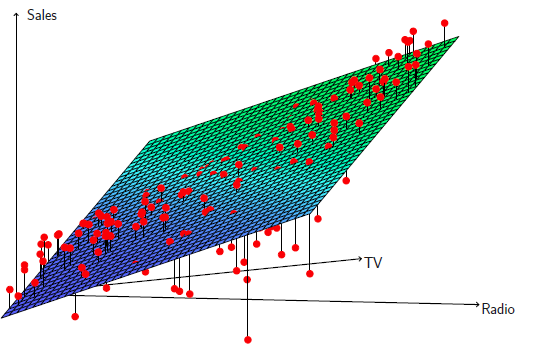
</img>

<b>FIG 4.5</b><i> ![Pour les données sur la publicité, une régression linéaire a été ajustée aux ventes en utilisant la télévision et la radio comme prédicteurs. D'après la configuration des résidus, nous pouvons constater qu'il existe une relation non linéaire prononcée dans les données. Les résidus positifs (ceux qui sont visibles au-dessus de la surface) ont tendance à se situer le long de la ligne à 45 degrés, où les budgets TV et radio sont répartis de manière égale. Les résidus négatifs (ceux qui ne sont pas visibles) ont tendance à s'éloigner de cette ligne, là où les budgets sont plus inégaux.](https://www.statlearning.com/)</i>

<a name="4-2-2-4"/>

#### [4.2.2.4 Quatre : Prédictions](#4-2-2-4) ####

[Retour TOC](#toc)

Une fois que nous avons ajusté le modèle de régression multiple, il est facile d'appliquer (4.21) afin de prédire la réponse $Y$ sur la base d'un ensemble de valeurs pour les prédicteurs $X_1,X_2, . . . ,X_p$. Cependant, trois types d'incertitude sont associés à cette prédiction. 

1. Les estimations des coefficients $\hat{β}_0, \hat{β}_1,..., \hat{β}_p$ sont des estimations pour $β_0,β_1, . . . ,β_p$. Autrement dit, le plan des moindres carrés $\hat{Y} = \hat{β}_0 + \hat{β}_1 X_1 + ... + \hat{β}_p X_p$ n'est qu'une estimation du vrai plan de régression de la population $f(X) = β_0 + β_1X_1 +... + β_pX_p$. L'imprécision des estimations des coefficients est liée à l'erreur réductible de la Section 2. Nous pouvons calculer un intervalle de confiance afin de déterminer à quel point $\hat{Y}$ sera proche de $f(X)$. 
2. Bien sûr, dans la pratique, supposer un modèle linéaire pour $f(X)$ est presque toujours une approximation de la réalité, il y a donc une source supplémentaire d'erreur potentiellement réductible que nous appelons **biais de modèle**. Ainsi, lorsque nous utilisons un modèle linéaire, nous estimons en fait la meilleure approximation linéaire de la surface réelle. Cependant, ici, nous allons ignorer cette divergence, et opérer comme si le modèle linéaire était correct. 
3. Même si nous connaissions $f(X)$, c'est-à-dire même si nous connaissions les vraies valeurs de $β_0,β_1, . . . ,β_p$, la valeur de la réponse ne peut pas être prédite parfaitement à cause de l'erreur aléatoire $\varepsilon$ dans le modèle (4.20). Dans la section 2, nous avons appelé cela l'erreur irréductible. **De combien $Y$ variera-t-il par rapport à $\hat{Y}$ ?** Nous utilisons les intervalles de prédiction pour répondre à cette question. Les intervalles de prédiction sont toujours plus larges que les intervalles de confiance, car ils incorporent à la fois l'erreur dans l'estimation de $f(X)$ (l'erreur réductible) et l'incertitude quant à l'ampleur de la différence entre un point individuel et le plan de régression de la population (l'erreur irréductible). 

Nous utilisons un intervalle de confiance pour quantifier l'incertitude entourant les ventes moyennes sur un grand nombre de villes. Par exemple, étant donné que 100 000 dollars  sont dépensés en publicité télévisée et 20 000 dollars  en publicité radiophonique dans chaque ville, l'intervalle de confiance à 95 % est de [10 985, 11 528]. Nous interprétons cela comme signifiant que 95 % des intervalles de cette forme contiendront la vraie valeur de $f(X)$. 

D'autre part, un intervalle de prédiction peut être utilisé pour quantifier l'incertitude entourant les ventes pour une ville particulière. Si l'on considère que 100 000 dollars  sont dépensés en publicité télévisée et 20 000 dollars  en publicité radiophonique dans cette ville, l'intervalle de prédiction à 95 % est de [7 930, 14 580]. Nous interprétons cela comme signifiant que 95 % des intervalles de cette forme contiendront la vraie valeur de $Y$ pour cette ville. Notez que les deux intervalles sont centrés sur 11 256, mais que l'intervalle de prédiction est nettement plus large que l'intervalle de confiance, ce qui reflète l'incertitude accrue sur les ventes pour une ville donnée par rapport aux ventes moyennes sur de nombreux sites. 

<a name="4-3"/>

## [4.3 Autres considérations sur le modèle de régression](#4-3) ##

[Retour TOC](#toc)

<a name="4-3-1"/>

### [4.3.1 Prédicteurs qualitatifs](#4-3-1) ###

[Retour TOC](#toc)

Dans notre discussion jusqu'à présent, nous avons supposé que toutes les variables de notre modèle de régression linéaire étaient quantitatives. Mais dans la pratique, ce n'est pas nécessairement le cas ; souvent, certains prédicteurs sont qualitatifs. Par exemple, l'ensemble de données sur le crédit présenté à la $figure 4.6$ enregistre les variables d'un certain nombre de détenteurs de cartes de crédit. La réponse est le solde (dette moyenne par carte de crédit pour chaque individu) et il y a plusieurs prédicteurs quantitatifs : âge, cartes (nombre de cartes de crédit), éducation (années d'éducation), revenu (en milliers de dollars), limite (limite de crédit) et notation (notation de crédit). 

Chaque panneau de la figure 4.6 est un nuage de points pour une paire de variables dont l'identité est donnée par les étiquettes des lignes et des colonnes correspondantes. Par exemple, le nuage de points situé directement à droite du mot "Balance" représente la balance en fonction de l'âge, tandis que le nuage de points situé directement à droite de "Age" correspond à l'âge en fonction des cartes. En plus de ces variables quantitatives, nous disposons également de quatre variables qualitatives : own (propriété d'une maison), student (statut d'étudiant), status (statut marital) et region (East, West ou South).

<a name="4-3-1-1"/>

#### [4.3.1.1 Prédicteurs avec seulement deux niveaux](#4-3-1-1) ####

[Retour TOC](#toc)

Supposons que nous souhaitions étudier les différences de solde de carte de crédit entre les personnes qui possèdent une maison et celles qui n'en possèdent pas, en ignorant pour l'instant les autres variables. Si un prédicteur qualitatif (également appelé facteur) n'a que deux niveaux, ou valeurs possibles, son incorporation dans un modèle de régression est très simple. Nous créons simplement un indicateur ou une variable fictive qui prend deux valeurs numériques possibles. Par exemple, sur la base de la variable propre, nous pouvons créer une nouvelle variable qui prend la forme 

$$
x_i = \left\lbrace
    	\begin{array}{ll}
        	1 & si\ la\ i^e\ personne\ possède\ une\ maison\\
		  	0 & si\ la\ i^e\ personne\ ne\ possède\ pas\ une\ maison \hspace{6 em} (4.26)
    	\end{array}
	\right.
$$

et utiliser cette variable comme prédicteur dans l'équation de régression. Il en résulte le modèle 

$$
yi = β_0 +β_1x_i +ϵ_i = \left\lbrace
    	\begin{array}{ll}
        	 β_0 + β_1 + ϵ_i & si\ la\ i^e\ personne\ possède\ une\ maison\\
		  	 β_0 + ϵ_i & si\ la\ i^e\ personne\ ne\ possède\ pas\ une\ maison \hspace{6 em} (4.27)
    	\end{array}
	\right.
$$

Maintenant, $β_0$ peut être interprété comme le solde moyen des cartes de crédit parmi ceux qui ne sont pas propriétaires, $β_0 + β_1$ comme le solde moyen des cartes de crédit parmi ceux qui sont propriétaires de leur maison, et $β_1$ comme la différence moyenne du solde des cartes de crédit entre les propriétaires et les non-propriétaires. 

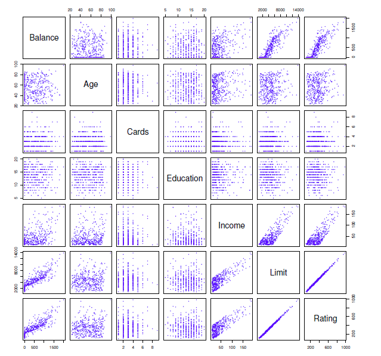
</img>

<b>FIG 4.6</b><i> </i>

Le $tableau 4.7$ présente les estimations des coefficients et d'autres informations associées au modèle (4.27). 

La dette moyenne sur carte de crédit des non-propriétaires est estimée à 509.80 dollars, tandis que les propriétaires ont une dette supplémentaire de 19.73 dollars , soit un total de 509,80  + 19,73  = 529,53 dollars. Cependant, nous remarquons que la valeur $p$ de la variable muette est très élevée. Cela indique qu'il n'y a pas de preuve statistique d'une différence dans le solde moyen des cartes de crédit en fonction de la propriété du logement. 

La décision de coder les propriétaires à 1 et les non-propriétaires à 0 dans (4.27) est arbitraire et n'a aucun effet sur l'ajustement de la régression, mais elle modifie l'interprétation des coefficients. Si nous avions codé les non-propriétaires comme 1 et les propriétaires comme 0, les estimations de $β_0$ et $β_1$ auraient été 529.53 et -19.73, respectivement, ce qui aurait conduit une fois de plus à une prédiction de l'endettement par carte de crédit de 529.53 dollars - 19,73  dollars = 509.80 dollars pour les non-propriétaires et une prédiction de 529.53 dollars pour les propriétaires. 

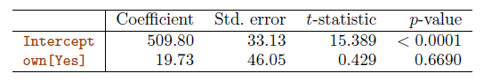
</img>

<b>TAB 4.7</b><i> </i>

Alternativement, au lieu d'un schéma de codage 0/1, nous pourrions créer une variable fictive 

$$
x_i =\left\lbrace
    	\begin{array}{ll}
        	 1 & si\ la\ i^e\ personne\ possède\ une\ maison\\
		  	 -1 & si\ la\ i^e\ personne\ ne\ possède\ pas\ une\ maison
    	\end{array}
	\right.
$$

 et utiliser cette variable dans l'équation de régression. On obtient ainsi le modèle 

$$
y_i = β_0+β_1x_i+ϵ_i =\left\lbrace
    	\begin{array}{ll}
        	 β_0 + β_1 + ϵ_i & si\ la\ i^e\ personne\ possède\ une\ maison\\
		  	 β_0 - β_1 + ϵ_i & si\ la\ i^e\ personne\ ne\ possède\ pas\ une\ maison
    	\end{array}
	\right.
$$

Maintenant, $β_0$ peut être interprété comme le solde moyen global des cartes de crédit (en ignorant l'effet de la propriété de la maison), et $β_1$ est le montant par lequel les propriétaires et les non-propriétaires de maison ont des soldes de cartes de crédit qui sont au-dessus et en dessous de la moyenne, respectivement. 

Dans cet exemple, l'estimation pour β0 est de 519,665, à mi-chemin entre les moyennes des non-propriétaires et des propriétaires de 509,80  et de 529,53 . L'estimation pour β1 est de 9,865 , soit la moitié de 19,73, la différence moyenne entre les propriétaires et les non-propriétaires. Il est important de noter que les prédictions finales pour les soldes créditeurs des propriétaires et des non-propriétaires seront identiques quel que soit le schéma de codage utilisé. La seule différence réside dans la manière dont les coefficients sont interprétés.

<a name="4-3-1-2"/>

#### [4.3.1.2 Prédicteurs qualitatifs avec plus de deux niveaux](#4-3-1-2) ####

[Retour TOC](#toc)

Lorsqu'un prédicteur qualitatif comporte plus de deux niveaux, une seule variable muette ne peut pas représenter toutes les valeurs possibles. Dans cette situation, nous pouvons créer des variables fictives supplémentaires. Par exemple, pour la variable région, nous créons deux variables fictives. La première pourrait être 

$$
x_i =\left\lbrace
    	\begin{array}{ll}
        	 1 & si\ la\ i^e\ personne\ est\ originaire\ du\ sud \\
		  	 0 & si\ la\ i^e\ personne\ n'\ est\ pas\ originaire\ du\ sud \hspace{6 em} (4.28)
    	\end{array}
	\right.
$$

et la seconde pourrait être 

$$
x_i =\left\lbrace
    	\begin{array}{ll}
        	 1 & si\ la\ i^e\ personne\ est\ originaire\ de\  l'ouest \\
		  	 0 & si\ la\ i^e\ personne\ n'\ est\ pas\ originaire\ de\ l'ouest \hspace{6 em} (4.29)
    	\end{array}
	\right.
$$

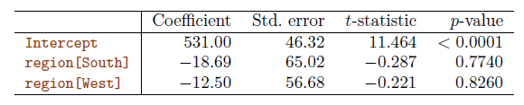
</img>

<b>TAB 4.8</b><i> </i>

Alors ces deux variables peuvent être utilisées dans l'équation de régression, afin d'obtenir le modèle 

$$
y_i = β_0+β_1x_i+ϵ_i =\left\lbrace
    	\begin{array}{ll}
        	 β_0 + β_1 + ϵ_i & si\ la\ i^e\ personne\ est\ originaire\ du\ sud \\
		  	 β_0 + β_2 + ϵ_i & si\ la\ i^e\ personne\ est\ originaire\ de\ l'ouest \\
 		  	 β_0 + ϵ_i & si\ la\ i^e\ personne\ est\ originaire\ de\ l'est \\
    	\end{array}
	\right.
$$

Maintenant, $β_0$ peut être interprété comme le solde moyen des cartes de crédit pour les individus de l'Est, $β_1$ peut être interprété comme la différence du solde moyen entre les personnes du Sud par rapport à celles de l'Est, et $β_2$ peut être interprété comme la différence du solde moyen entre celles de l'Ouest par rapport à celles de l'Est. Il y aura toujours une variable muette de moins que le nombre de niveaux. Le niveau sans variable fictive - Est dans cet exemple - est appelé le niveau de base. Le $tableau 4.8$ montre que le solde estimé pour le niveau de base, Est, est de 531,00 dollars. On estime que les personnes du Sud auront 18,69 dollars de moins de dettes que celles de l'Est, et que celles de l'Ouest auront 12,50 dollars de moins de dettes que celles de l'Est. 

Cependant, les valeurs $p$ associées aux estimations des coefficients pour les deux variables fictives sont très élevées, ce qui suggère qu'il n'y a pas de preuve statistique d'une différence réelle dans le solde moyen des cartes de crédit entre le Sud et l'Est ou entre l'Ouest et l'Est.

Une fois de plus, le niveau choisi comme catégorie de base est arbitraire, et les prédictions finales pour chaque groupe seront les mêmes quel que soit ce choix. Cependant, les coefficients et leurs valeurs p dépendent du choix du codage de la variable fictive. Plutôt que de se fier aux coefficients individuels, nous pouvons utiliser un $F-test$ pour tester $H_0 : β_1 = β_2 = 0$ ; ceci ne dépend pas du codage. Ce $F-test$ a une valeur $p$ de 0.96, ce qui indique que nous ne pouvons pas rejeter l'hypothèse nulle selon laquelle il n'y a pas de relation entre l'équilibre et la région. 

L'utilisation de cette approche par variable muette ne présente aucune difficulté lorsqu'on incorpore des prédicteurs quantitatifs et qualitatifs. Par exemple, pour régresser le solde sur une variable quantitative telle que le revenu et une variable qualitative telle que l'étudiant, il suffit de créer une variable muette pour l'étudiant, puis d'ajuster un modèle de régression multiple en utilisant le revenu et la variable muette comme prédicteurs du solde de carte de crédit. Toutes ces approches conduisent à des ajustements de modèle équivalents, mais les coefficients sont différents et ont des interprétations différentes, et sont conçus pour mesurer des contrastes particuliers.

<a name="4-3-2"/>

### [4.3.2 Extensions du modèle linéaire](#4-3-2) ###

[Retour TOC](#toc)

Le modèle de régression linéaire standard (4.19) fournit des résultats interprétables et fonctionne assez bien pour de nombreux problèmes du monde réel. Cependant, il pose plusieurs hypothèses très restrictives qui sont souvent violées dans la pratique. 

Deux des hypothèses les plus importantes stipulent que la relation entre les prédicteurs et la réponse est additive et linéaire. 

- **L'hypothèse d'additivité** signifie que l'association entre un prédicteur $X_j$ et la réponse $Y$ ne dépend pas des valeurs des autres prédicteurs.
- **L'hypothèse de linéarité** stipule que la variation de la réponse $Y$ associée à une variation d'une unité de $X_j$ est constante, quelle que soit la valeur de $X_j$ . 

<a name="4-3-2-1"/>

#### [4.3.2.1 Suppression de l'hypothèse d'additivité](#4-3-2-1) ####

[Retour TOC](#toc)

Dans notre analyse précédente des données sur la publicité, nous avons conclu que la télévision et la radio semblent être associées aux ventes. 

Les modèles linéaires qui ont servi de base à cette conclusion supposaient que l'effet sur les ventes de l'augmentation d'un média publicitaire est indépendant du montant dépensé sur l'autre média. Par exemple, le modèle linéaire (4.20) stipule que l'augmentation moyenne des ventes associée à une augmentation d'une unité de la télévision est toujours $β_1$, quel que soit le montant dépensé en radio. Cependant, ce modèle simple peut être incorrect. 

Supposons que dépenser de l'argent en publicité radio augmente en fait l'efficacité de la publicité TV, de sorte que le terme de pente pour la TV devrait augmenter lorsque la radio augmente. Dans cette situation, avec un budget fixe de 100 000 dollars, dépenser la moitié pour la radio et l'autre moitié pour la télévision peut augmenter les ventes davantage que d'allouer la totalité du montant à la télévision ou à la radio. 

En marketing, ce phénomène est connu sous le nom **d'effet de synergie**, et **en statistique, il est appelé effet d'interaction**. La $figure 4.5$ suggère qu'un tel effet peut être présent dans les données sur la publicité. Lorsque les niveaux de la télévision ou de la radio sont faibles, les ventes réelles sont inférieures aux prévisions du modèle linéaire. Mais lorsque la publicité est répartie entre les deux médias, le modèle a tendance à sous-estimer les ventes. 

Considérons le modèle de régression linéaire standard avec deux variables, 

$$
Y = β_0 + β_1X_1 + β_2X_2 + \varepsilon \hspace{6 em} (4.30)
$$

Selon ce modèle, une augmentation d'une unité de $X_1$ est associée à une augmentation moyenne de $Y$ de $β_1$ unités. La présence de $X_2 $ne modifie pas cette affirmation, c'est-à-dire que quelle que soit la valeur de $X_2$, une augmentation d'une unité de $X_1$ est associée à une augmentation de $Y$ de $β_1$ unités. 

Une façon d'étendre ce modèle est d'inclure un troisième prédicteur, appelé **terme d'interaction,** qui est construit en calculant le produit de $X_1$ et $X_2$. On obtient ainsi le modèle 

$$
Y = β_0 + β_1X_1 + β_2X_2 + β_3X_1X_2 + \varepsilon. \hspace{6 em}(4.31)
$$

**Comment l'inclusion de ce terme d'interaction assouplit-elle l'hypothèse additive ?** (4.31) peut être réécrit sous la forme 

$$
Y = β_0 + (β_1 + β_3X_2)X_1 + β_2X_2 + \varepsilon \hspace {6 em}(4.32)
$$

$$
\hspace{-12 em} = β_0 + \hat{β}_1X_1 + β_2X_2 + \varepsilon
$$

 où $\hat{β}_1 = β_1 + β_3X_2$. Puisque $\hat{β}_1$ est maintenant une fonction de $X_2$, l'association entre $X_1$ et $Y$ n'est plus constante : un changement de la valeur de $X_2$ modifiera l'association entre $X_1$ et $Y$ . 

Un argument similaire montre qu'un changement de la valeur de $X_1$ modifie l'association entre $X_2$ et $Y$ . Par exemple, supposons que nous soyons intéressés par l'étude de la productivité d'une usine. Nous souhaitons prédire le nombre d'unités produites sur la base du nombre de lignes de production et du nombre total de travailleurs. Il semble probable que l'effet de l'augmentation du nombre de lignes de production dépendra du nombre de travailleurs, car si aucun travailleur n'est disponible pour faire fonctionner les lignes, l'augmentation du nombre de lignes n'augmentera pas la production. Cela suggère qu'il serait approprié d'inclure un terme d'interaction entre les lignes et les travailleurs dans un modèle linéaire pour prédire les unités. 

Supposons que lorsque nous ajustons le modèle, nous obtenons des 

$$
unités ≈ 1.2 + 3.4 × lignes + 0.22 × travailleurs + 1.4 × (lignes × travailleurs)
$$

$$
\hspace {-2.5 em} = 1.2 + (3.4 + 1.4 × travailleurs) × lignes + 0.22 × travailleurs
$$

En d'autres termes, l'ajout d'une ligne supplémentaire augmentera le nombre d'unités produites de $3.4 + 1.4 × ouvriers$. Par conséquent, plus le nombre de travailleurs est élevé, plus l'effet des lignes est important. 

Revenons maintenant à l'exemple de la publicité. Un modèle linéaire qui utilise la radio, la télévision et une interaction entre les deux pour prédire les ventes prend la forme 

$$
ventes = β_0 + β_1 × TV + β_2 × radio + β_3 × (radio × TV) + \varepsilon
$$

$$
\hspace {9.5 em}= β_0 + (β_1 + β_3 × radio) × TV + β_2 × radio + \varepsilon. \hspace{6 em} (4.33)
$$

 Nous pouvons interpréter $β_3$ comme l'augmentation de l'efficacité de la publicité télévisée associée à une augmentation d'une unité de la publicité radio (ou vice-versa). 

Les coefficients qui résultent de l'ajustement du modèle (4.33) sont présentés dans le $tableau\ 4.9$. Les résultats du $tableau\ 4.9$ suggèrent fortement que le modèle qui inclut le terme d'interaction est supérieur au modèle qui ne contient que des effets principaux. 

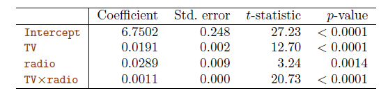
</img>

<b>TAB 4.9</b><i> </i>

La valeur $p$ pour le terme d'interaction, $TV×radio$, est extrêmement faible, ce qui indique qu'il existe de fortes preuves pour $Ha : β_3 \ne 0$. En d'autres termes, il est clair que la véritable relation n'est pas additive. 

Le $R^2$ du modèle (4.33) est de 96,8%, contre seulement 89.7% pour le modèle qui prédit les ventes à l'aide de la télévision et de la radio sans terme d'interaction. Cela signifie que (96.8 - 89.7)/(100 - 89.7) = 69 % de la variabilité des ventes qui subsiste après l'ajustement du modèle additif a été expliquée par le terme d'interaction. 

Les estimations des coefficients du $tableau 4.9$ suggèrent qu'une augmentation de la publicité télévisée de 1 000 dollars est associée à une augmentation des ventes de **$( \hat{β}_1+ \hat{ β}_3×radio)×1 000 = 19+1.1×unités\ de\ radio$.** Et une augmentation de la publicité radio de 1 000 dollars sera associée à une augmentation des ventes de $(\hat{β}_2 + \hat{β}_3 × TV) × 1 000 = 29 + 1.1 × unités\ TV$ . Dans cet exemple, les valeurs $p$ associées à la télévision, à la radio et au terme d'interaction sont toutes statistiquement significatives du $tableau\ 4.9$, et il est donc évident que les trois variables doivent être incluses dans le modèle. Il est donc évident que les trois variables doivent être incluses dans le modèle. 

Cependant, il arrive parfois qu'un terme d'interaction ait une très faible valeur $p$, mais que les effets principaux associés (dans ce cas, TV et radio) n'en aient pas. Le principe hiérarchique stipule que si nous incluons une interaction dans un modèle, nous devons également inclure les effets principaux, même si les $p-values$ associées à leurs coefficients ne sont pas significatives. En d'autres termes, si l'interaction entre $X_1$ et $X_2$ semble importante, nous devons inclure $X_1$ et $X_2$ dans le modèle, même si les estimations de leurs coefficients ont des valeurs $p$ importantes. Ce principe se justifie par le fait que si $X_1 × X_2$ est lié à la réponse, le fait que les coefficients de $X_1$ ou $X_2$ soient exactement nuls n'a que peu d'intérêt. 

De plus, $X_1 × X_2$ est généralement corrélé avec $X_1$ et$ X_2$, et les laisser de côté tend à modifier la signification de l'interaction. Dans l'exemple précédent, nous avons considéré une interaction entre la télévision et la radio, qui sont toutes deux des variables quantitatives. Cependant, le concept d'interaction s'applique juste aux variables qualitatives, ou à une combinaison de variables quantitatives et qualitatives. En fait, une interaction entre une variable qualitative et une variable quantitative a une interprétation particulièrement intéressante. 

Considérons l'ensemble de données sur le crédit de la $section\ 4.3.1$, et supposons que nous souhaitions prédire l'équilibre en utilisant les variables de revenu (quantitatives) et d'étudiant (qualitatives). En l'absence d'un terme d'interaction, le modèle prend la forme 

$$
balance_i ≈ β0 + β1 × income_i + \left\lbrace
    	\begin{array}{ll}
        	 β_2 & si\ i^e\ personne\ est\ un\ étudiant\\
		  	 0 &   si\ i^e\ personne\ n'est\ pas\ un\ étudiant
    	\end{array}
	\right.
$$

$$
\hspace{11.5 em} = β_1 × income_i +\left\lbrace
    	\begin{array}{ll}
        	 β_0 + β_2 & si\ i^e\ personne\ est\ un\ étudiant\\
		  	 β_0 &   si\ i^e\ personne\ n'est\ pas\ un\ étudiant. \hspace{6 em} (4.34)
    	\end{array}
	\right.
$$

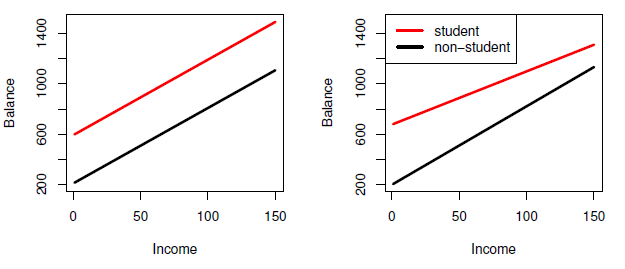
</img>

<b>FIG 4.7</b><i> </i>

Cela revient à ajuster deux lignes parallèles aux données, une pour les étudiants et une pour les non-étudiants. Les lignes pour les étudiants et les non-étudiants ont des intercepts différents, $β_0 + β_2$ contre $β_0$, mais la même pente, $β_1$. Ceci est illustré dans le panneau de gauche de la $figure\ 4.7$. Le fait que les lignes soient parallèles signifie que l'effet moyen sur le solde d'une augmentation d'une unité de revenu ne dépend pas du fait que l'individu soit étudiant ou non. Il s'agit là d'une limite potentiellement importante du modèle, puisqu'en fait, un changement de revenu peut avoir un effet très différent sur le solde de la carte de crédit d'un étudiant et d'un non-étudiant. Cette limitation peut être traitée en ajoutant une variable d'interaction, créée en multipliant le revenu par la variable muette pour l'étudiant. Notre modèle devient maintenant 

$$
balance_i ≈ β0 + β1 × income_i + \left\lbrace
    	\begin{array}{ll}
        	 β_2+β_3\times income  & si\ étudiant\\
		  	 0 &   si\ pas\ un\ étudiant
    	\end{array}
	\right.
$$

$$
\hspace{15.7 em} = β_1 × income_i +\left\lbrace
    	\begin{array}{ll}
        	 (β_0 + β_2) + (β_1 + β_3) \times income_i  & si\ i^e\ personne\ est\ un\ étudiant\\
		  	 \ β_0 + β_1 \times income_i &   si\ pas\ un\ étudiant. \hspace{6 em} (4.35)
    	\end{array}
	\right.
$$

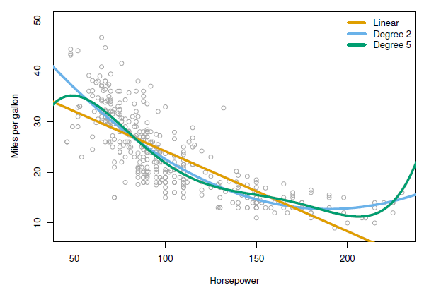
</img>

<b>FIG 4.8</b><i> </i>

Une fois encore, nous avons deux lignes de régression différentes pour les étudiants et les non-étudiants. Mais ces lignes de régression ont maintenant des intercepts différents, $β_0+β_2$ contre $β_0$, ainsi que des pentes différentes, $β_1+β_3$ contre $β_1$. Cela permet de tenir compte de la possibilité que les changements de revenu affectent différemment les soldes de cartes de crédit des étudiants et des non-étudiants. 

Le panneau de droite de la $figure\ 4.7$ montre les relations estimées entre le revenu et le solde pour les étudiants et les non-étudiants dans le modèle (4.35). Nous remarquons que la pente pour les étudiants est inférieure à celle des non-étudiants. Cela suggère que les augmentations de revenu sont associées à des augmentations plus faibles du solde des cartes de crédit chez les étudiants par rapport aux non-étudiants.

<a name="4-3-2-2"/>

#### [4.3.2.2 Relations non linéaires](#4-3-2-2) ####

[Retour TOC](#toc)

Comme nous l'avons vu précédemment, le modèle de régression linéaire (4.19) suppose une relation linéaire entre la réponse et les prédicteurs. 

Mais dans certains cas, la véritable relation entre la réponse et les prédicteurs peut être non linéaire. Nous présentons ici un moyen très simple d'étendre directement le modèle linéaire pour prendre en compte les relations non linéaires, en utilisant la régression polynomiale. 

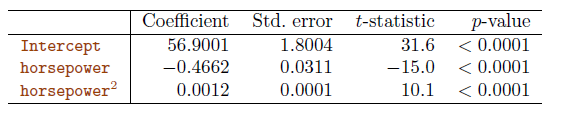
</img>

<b>TAB 4.10</b><i> </i>

Prenons l'exemple de la $figure\ 4.8$, qui illustre le rapport entre le kilométrage en miles par gallon (mpg) et la puissance en chevaux pour un certain nombre de voitures de l'ensemble de données Auto. La ligne orange représente l'ajustement par régression linéaire. Il existe une relation prononcée entre le mpg et la puissance en chevaux, mais il semble évident que cette relation est en fait non linéaire : les données suggèrent une relation courbe. 

Une approche simple pour incorporer des associations non linéaires dans un modèle linéaire consiste à inclure des versions transformées des prédicteurs. Par exemple, les points de la $figure\ 4.8$ semblent avoir une forme quadratique, ce qui suggère qu'un modèle de la forme 

$$
mpg = β_0 + β_1 ×\ puissance\ en\ cheveaux\ + β_2 ×\ puissance\ en\ cheveaux^2 + \varepsilon \hspace{6 em} (4.36)
$$

pourrait fournir un meilleur ajustement. L'équation (4.36) implique la prédiction du mpg en utilisant une fonction non linéaire de la puissance du cheval. 

Mais il s'agit toujours d'un modèle linéaire ! En d'autres termes, (4.36) est simplement un modèle de régression linéaire multiple avec $X_1 = puissance\ en\ chevaux\ et\ X_2 = puissance\ en\ chevaux^2$. Nous pouvons donc utiliser un logiciel de régression linéaire standard pour estimer $β_0$,$β_1$, et $β_2$ afin de produire un ajustement non linéaire. La courbe bleue de la $figure\ 4.8$ montre l'ajustement quadratique aux données qui en résulte. 

L'ajustement quadratique semble être sensiblement meilleur que l'ajustement obtenu lorsque juste le terme linéaire est inclus. Le $R^2$ de l'ajustement quadratique est de 0.688, contre 0.606 pour l'ajustement linéaire, et la valeur $p$ du $tableau\ 4.10$ pour le terme quadratique est hautement significative. 

**Si l'inclusion de $la\ puissance\ en\ chevaux^2$ a entraîné une telle amélioration du modèle, pourquoi ne pas inclure $la\ puissance\ en\ chevaux ^3$, $^4$ ou même $^5$ ?**  La courbe verte de la $figure\ 4.8$ montre l'ajustement qui résulte de l'inclusion de tous les polynômes jusqu'au cinquième degré dans le modèle (4.36). 

L'ajustement résultant semble inutilement ondulé, c'est-à-dire qu'il n'est pas clair que l'inclusion des termes supplémentaires ait réellement conduit à un meilleur ajustement aux données. L'approche que nous venons de décrire pour étendre le modèle linéaire aux relations non linéaires est connue sous le nom de régression polynomiale, puisque nous avons inclus des fonctions polynomiales des prédicteurs dans le modèle de régression.

<a name="4-3-3"/>

### [4.3.3 Problèmes potentiels](#4-3-3) ###

[Retour TOC](#toc)

Lorsque nous ajustons un modèle de régression linéaire à un ensemble de données particulier, de nombreux problèmes peuvent survenir. Les plus courants sont les suivants : 

1. Non-linéarité des relations réponse-prédicteur. 
2. Corrélation des termes d'erreur. 
3. Variance non constante des termes d'erreur. 
4. Valeurs aberrantes. 
5. Points à fort effet de levier. 
6. Colinéarité. 

Dans la pratique, identifier et surmonter ces problèmes est autant un art qu'une science. De nombreuses pages dans d'innombrables livres ont été écrites sur ce sujet. 

<a name="4-3-3-1"/>

#### [4.3.3.1 Non-linéarité des données](#4-3-3-1) ####

[Retour TOC](#toc)

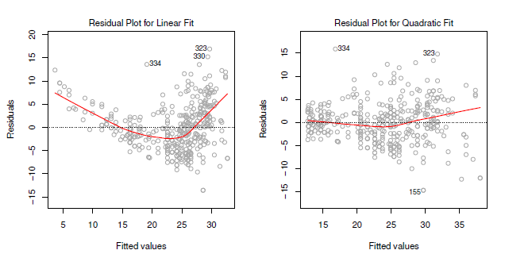
</img>

<b>FIG 4.9</b><i> ![Tracés des résidus par rapport aux valeurs prédites (ou ajustées) pour l'ensemble de données Auto. Dans chaque graphique, la ligne rouge est un ajustement lisse des résidus, destiné à faciliter l'identification d'une tendance. A gauche : Régression linéaire des mpg sur la puissance en chevaux. Une forte tendance dans les résidus indique une non-linéarité des données. A droite : Régression linéaire de mpg sur la puissance en chevaux et la puissance en chevaux au carré. Il y a peu de tendance dans les résidus.](https://www.statlearning.com/)</i>

Le modèle de régression linéaire suppose qu'il existe une relation linéaire entre les prédicteurs et la réponse. Si la relation réelle est loin d'être linéaire, pratiquement toutes les conclusions que nous tirons de l'ajustement sont suspectes. En outre, la précision de la prédiction du modèle peut être considérablement réduite. Les tracés résiduels sont un outil graphique utile pour identifier la non-linéarité. 

Dans le cas d'un modèle de régression linéaire simple, nous pouvons tracer les résidus, $e_i = y_i - \hat{y}_i$, en fonction du prédicteur $x_i$. 

Dans le cas d'un modèle de régression multiple, puisqu'il y a plusieurs prédicteurs, nous traçons plutôt les résidus en fonction des valeurs prédites (ou ajustées) $\hat{y}_i$. 

Idéalement, le tracé des résidus ne montrera aucun modèle discernable ajusté. La présence d'une tendance peut indiquer un problème avec un aspect du modèle linéaire. Le panneau de gauche de la $figure\ 4.9$ présente un tracé résiduel de la régression linéaire de mpg en fonction de la puissance en chevaux sur l'ensemble de données Auto illustré à la $figure\ 4.8$. La ligne rouge est un ajustement lisse des résidus, qui est affiché afin de faciliter l'identification des tendances. Les résidus présentent une forme en $\bigcup$ très nette, ce qui indique clairement la non-linéarité des données. 

En revanche, le panneau de droite de la $figure\ 4.9$ présente le tracé des résidus résultant du modèle (4.36), qui contient un terme quadratique. Il semble y avoir peu de tendance dans les résidus, ce qui suggère que le terme quadratique améliore l'ajustement aux données. Si le graphique des résidus indique qu'il existe des associations non linéaires dans les données, une approche simple consiste à utiliser des transformations non linéaires des prédicteurs, telles que $logX$, $\sqrt{X}$ et $X^2$, dans le modèle de régression.

<a name="4-3-3-2"/>

#### [4.3.3.2 Corrélation des termes d'erreur](#4-3-3-2) ####

[Retour TOC](#toc)

Une hypothèse importante du modèle de régression linéaire est que les termes d'erreur, $\varepsilon_1, \varepsilon_2, . . . , \varepsilon_n$ , ne sont pas corrélés. **Qu'est-ce que cela signifie ?** Par exemple, si les erreurs ne sont pas corrélées, le fait que $\varepsilon_i$ soit positif ne fournit que peu ou pas d'informations sur le signe de $\varepsilon_i+1$. Les erreurs standard qui sont calculées pour les coefficients de régression estimés ou les valeurs ajustées sont basées sur l'hypothèse de termes d'erreur non corrélés. 

S'il existe une corrélation entre les termes d'erreur, les erreurs standard estimées auront tendance à sous-estimer les véritables erreurs standard. Par conséquent, les intervalles de confiance et de prédiction seront plus étroits qu'ils ne devraient l'être. Par exemple, un intervalle de confiance de 95% peut en réalité avoir une probabilité bien plus faible que 0.95 de contenir la vraie valeur du paramètre. En outre, les valeurs $p$ associées au modèle seront plus faibles qu'elles ne devraient l'être, ce qui pourrait nous amener à conclure à tort qu'un paramètre est statistiquement significatif. 

En bref, si les termes d'erreur sont corrélés, nous pouvons avoir un sentiment de confiance injustifié dans notre modèle. À titre d'exemple extrême, supposons que nous ayons accidentellement doublé nos données, ce qui entraîne des observations et des termes d'erreur identiques par paires. Si nous n'en tenions pas compte, nos calculs d'erreur standard se feraient comme si nous avions un échantillon de taille $2^n$, alors que nous n'avons en fait que $n$ échantillons. Nos paramètres estimés seraient les mêmes pour les $2^n$ échantillons que pour les $n$ échantillons, mais les intervalles de confiance seraient plus étroits d'un facteur $\sqrt{2}!$ 

**Pourquoi des corrélations entre les termes d'erreur peuvent-elles se produire ?** De telles corrélations se produisent fréquemment dans le contexte de données de séries temporelles, qui consistent en des observations pour lesquelles des mesures sont obtenues à des moments discrets dans le temps. Dans de nombreux cas, des observations obtenues à des points de temps adjacents auront des erreurs positivement corrélées. 

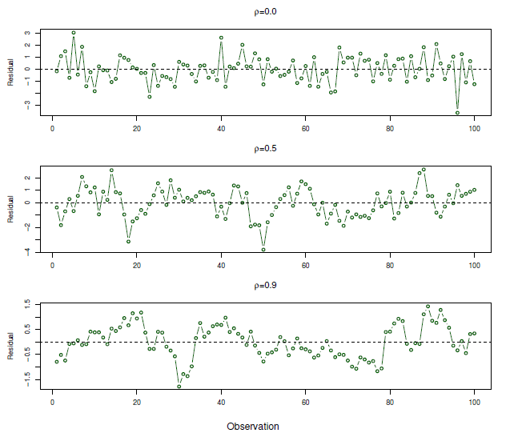
</img>

<b>FIG 4.10</b><i> </i>

Afin de déterminer si c'est le cas pour un ensemble de données donné, nous pouvons représenter les résidus de notre modèle en fonction du temps. Si les erreurs ne sont pas corrélées, il ne devrait pas y avoir de modèle discernable. En revanche, si les termes d'erreur sont positivement corrélés, nous pouvons observer un suivi des résidus, c'est-à-dire que des résidus adjacents peuvent avoir des valeurs similaires. 

La $figure\ 4.10$ en fournit une illustration. Dans le panneau supérieur, nous voyons les résidus d'une régression linéaire ajustée aux données générées avec des erreurs non corrélées. Il n'y a aucune preuve d'une tendance liée au temps dans les résidus. En revanche, les résidus du panneau inférieur proviennent d'un ensemble de données dans lequel les erreurs adjacentes avaient une corrélation de 0.9. Les résidus présentent maintenant une tendance claire : les résidus adjacents ont tendance à prendre des valeurs similaires. 

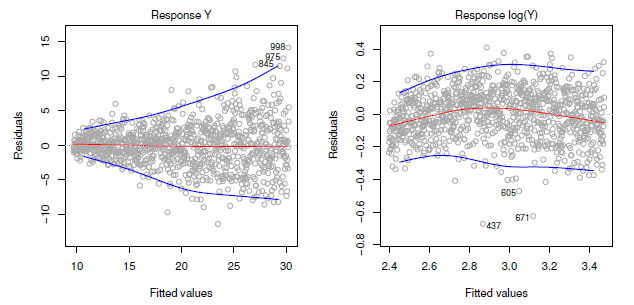
</img>

<b>FIG 4.11</b><i> </i>

Enfin, le panneau central illustre un cas plus modéré dans lequel les résidus avaient une corrélation de 0.5. Il y a encore des signes de suivi, mais le modèle est moins clair. De nombreuses méthodes ont été développées pour prendre en compte correctement les corrélations des termes d'erreur dans les données de séries chronologiques. La corrélation entre les termes d'erreur peut également se produire en dehors des données de séries chronologiques. Par exemple, considérons une étude dans laquelle la taille des individus est prédite à partir de leur poids. L'hypothèse d'erreurs non corrélées pourrait être violée si certains des individus de l'étude sont membres de la même famille, ont le même régime alimentaire ou ont été exposés aux mêmes facteurs environnementaux. En général, l'hypothèse d'erreurs non corrélées est extrêmement importante pour la régression linéaire ainsi que pour d'autres méthodes statistiques, et une bonne conception expérimentale est cruciale pour atténuer le risque de telles corrélations.

<a name="4-3-3-3"/>

#### [4.3.3.3 Variance non constante des termes d'erreur](#4-3-3-3) ####

[Retour TOC](#toc)

Une autre hypothèse importante du modèle de régression linéaire est que les termes d'erreur ont une variance constante, $Var(\varepsilon_i) = σ^2$. Les erreurs standard, les intervalles de confiance et les tests d'hypothèse associés au modèle linéaire reposent sur cette hypothèse. 

Malheureusement, il arrive souvent que les variances des termes d'erreur ne soient pas constantes. Par exemple, les variances des termes d'erreur peuvent augmenter avec la valeur de la réponse. On peut identifier les variances non constantes des erreurs, ou l'hétéroscédasticité, par la présence d'une forme en entonnoir dans le graphique. Un exemple est illustré dans le panneau de gauche de la $figure\ 4.11$ : il s'agit d'une hétéroscédasticité dans laquelle la magnitude des résidus tend à augmenter avec les valeurs ajustées. 

Face à ce problème, une solution possible consiste à transformer la réponse $Y$ à l'aide d'une fonction concave telle que $log Y$ ou $\sqrt{Y}$ . Une telle transformation entraîne un rétrécissement plus important des réponses les plus grandes, ce qui conduit à une réduction de l'hétéroscédasticité. 

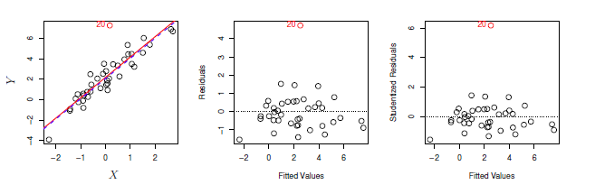
</img>

<b>FIG 4.12</b><i> </i>

Le panneau de droite de la $figure\ 4.11$ présente le graphique des résidus après avoir transformé la réponse en utilisant le $log Y$ . Les résidus semblent maintenant avoir une variance constante, bien qu'il y ait quelques preuves d'une légère relation non linéaire dans les données. Parfois, nous avons une bonne idée de la variance de chaque réponse. Par exemple, la $i^{ème}$ réponse peut être une moyenne de $n_i$ observations brutes. Si chacune de ces observations brutes est non corrélée avec une variance $σ^2$, alors leur moyenne a une variance $\sigma^2_ i = \sigma^2/n_i$. Dans ce cas, une solution simple consiste à ajuster notre modèle par moindres carrés pondérés, avec des poids proportionnels aux variances inverses, c'est-à-dire $w_i = n_i$ . 

La plupart des logiciels de régression linéaire permettent de pondérer les observations. 

<a name="4-3-3-4"/>

#### [4.3.3.4 Valeurs aberrantes](#4-3-3-4) ####

[Retour TOC](#toc)

Une valeur aberrante est une raison pour laquelle $y_i$ est éloigné de la valeur prédite par le modèle. 

Les valeurs aberrantes peuvent apparaître pour diverses raisons, comme l'enregistrement incorrect d'une observation pendant la collecte des données. Le point rouge (observation 20) dans le panneau de gauche de la $figure\ 4.12$ illustre une valeur aberrante typique. La ligne continue rouge est l'ajustement par régression des moindres carrés, tandis que la ligne pointillée bleue est l'ajustement des moindres carrés après suppression de la valeur aberrante. Dans ce cas, la suppression de la valeur aberrante a peu d'effet sur la ligne des moindres carrés : elle n'entraîne pratiquement aucun changement de la pente et une réduction minuscule de l'ordonnée à l'origine. 

Il est typique qu'une valeur aberrante qui n'a pas une valeur prédictive inhabituelle ait peu d'effet sur l'ajustement par la méthode des moindres carrés. Cependant, même si une valeur aberrante n'a pas beaucoup d'effet sur l'ajustement des moindres carrés, elle peut causer d'autres problèmes. Par exemple, dans cet exemple, la **RSE** est de 1.09 lorsque la valeur aberrante est incluse dans la régression, mais elle n'est que de 0.77 lorsque la valeur aberrante est supprimée. Étant donné que le **RSE** est utilisée pour calculer tous les intervalles de confiance et les valeurs $p$, une augmentation aussi spectaculaire causée par un seul point de données peut avoir des conséquences sur l'interprétation de l'ajustement. De même, l'inclusion de la valeur aberrante entraîne une baisse du $R^2$ de 0.892 à 0.805.

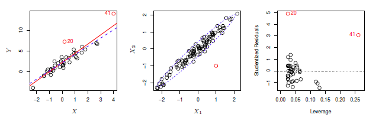
</img>

<b>FIG 4.13</b><i> </i>

Les graphiques de résidus peuvent être utilisés pour identifier les valeurs aberrantes. Dans cet exemple, la valeur aberrante est clairement visible dans le graphique résiduel illustré dans le panneau central de la $figure\ 4.12$. Mais dans la pratique, il peut être difficile de déterminer la taille du résidu avant de considérer le point comme une valeur aberrante. 

Pour résoudre ce problème, au lieu de tracer les résidus, nous pouvons tracer les résidus studentisés , calculés en divisant chaque résidu $e_i$ par son erreur standard estimée (écart type). Les observations dont les résidus studentisés sont supérieurs à 3 en valeur absolue sont des observations aberrantes possibles. 

Dans le panneau de droite de la $figure\ 4.12$, le résidu studentisé de l'observation aberrante dépasse 6, tandis que toutes les autres observations ont des résidus studentisés compris entre -2 et 2. 

Si nous pensons qu'une valeur aberrante est due à une erreur de collecte ou d'enregistrement des données, une solution consiste à supprimer tout simplement l'observation. Cependant, il faut faire attention, car une observation aberrante peut plutôt indiquer une déficience du modèle, comme un prédicteur manquant.

<a name="4-3-3-5"/>

#### [4.3.3.5 Points à fort effet de levier](#4-3-3-5) ####

[Retour TOC](#toc)

Nous venons juste de voir que les valeurs aberrantes sont des observations pour lesquelles la réponse $y_i$ est inhabituelle étant donné le prédicteur $x_i$. 

En revanche, les observations à fort effet de levier ont une valeur inhabituelle pour $x_i$. Par exemple, l'observation 41 dans le panneau de gauche de la $figure\ 4.13$ a un effet de levier élevé, en ce sens que la valeur du prédicteur pour cette observation est grande par rapport aux autres observations. (Notez que les données affichées dans la $figure\ 4.13$ sont les mêmes que celles de la $figure\ 4.12$, mais avec l'ajout d'une seule observation à fort effet de levier). La ligne pleine rouge est l'ajustement des moindres carrés aux données, tandis que la ligne pointillée bleue est l'ajustement produit lorsque l'observation 41 est supprimée. 

En comparant les panneaux de gauche des $figures\ 4.12\ et\ 4.13$, nous observons que la suppression de l'observation à fort effet de levier a un impact beaucoup plus important sur la ligne des moindres carrés que la suppression de l'observation aberrante. En fait, les observations à fort effet de levier ont tendance à avoir un impact considérable sur la ligne de régression estimée. Il y a lieu de s'inquiéter si la ligne des moindres carrés est fortement affectée par juste quelques observations, car tout problème avec ces points peut invalider l'ensemble de l'ajustement. Pour cette raison, il est important d'identifier les observations à fort effet de levier. 

Dans une régression linéaire simple, les observations à fort effet de levier sont assez faciles à identifier, puisque nous pouvons simplement rechercher les observations pour lesquelles la valeur du prédicteur est en dehors de la plage normale des observations. Mais dans une régression linéaire multiple avec de nombreux prédicteurs, il est possible d'avoir une observation qui se situe bien dans la plage des valeurs de chaque prédicteur individuel, mais qui est inhabituelle par rapport à l'ensemble des prédicteurs. Un exemple est illustré dans le panneau central de la $figure\ 4.13$, pour un ensemble de données avec deux prédicteurs, $X_1$ et $X_2$. La plupart des valeurs des prédicteurs des observations se situent à l'intérieur de l'ellipse en pointillés bleus, mais l'observation rouge est bien en dehors de cette plage. Mais ni sa valeur pour $X_1$ ni sa valeur pour $X_2$ ne sont inhabituelles. Donc, si nous examinons juste $X_1$ ou juste $X_2$, nous ne remarquerons pas ce point de levier élevé. Ce problème est plus prononcé dans les contextes de régression multiple avec plus de deux prédicteurs, car il n'existe alors aucun moyen simple de tracer toutes les dimensions des données simultanément. 

Afin de quantifier l'effet de levier d'une observation, nous calculons la statistique de l'effet de levier. Une valeur élevée de cette statistique indique une observation à fort effet de levier. Pour une régression linéaire simple, 

$$
h_i = \frac{1}{n} + \left[( x_i^′- \bar{x})^2 / \sum_{i^′=1}^n (x_i^′ - \bar{x})^2 \right]. \hspace{6 em} (4.37)
$$

Il ressort clairement de cette équation que $h_i$ augmente avec la distance de $x_i$ à $\bar{x}$. Il existe une extension simple de $h_i$ au cas de prédicteurs multiples, bien que nous ne fournissions pas la formule ici. La statistique de l'effet de levier $h_i$ est toujours comprise entre $1/n$ et 1, et l'effet de levier moyen pour toutes les observations est toujours égal à $(p+1)/n$. 

Ainsi, si une observation donnée présente une statistique d'effet de levier qui dépasse largement $(p+1)/n$, nous pouvons soupçonner que le point correspondant a un effet de levier élevé. Le panneau de droite de la $figure\ 4.13$ présente un graphique des résidus studentisés en fonction de $h_i$ pour les données du panneau de gauche de la $figure\ 4.13$. L'observation 41 se distingue par une statistique d'effet de levier très élevée ainsi que par un résidu studentisé élevé. En d'autres termes, il s'agit d'une observation aberrante et d'un effet de levier élevé. Il s'agit d'une combinaison particulièrement dangereuse ! Ce graphique révèle également la raison pour laquelle l'observation 20 a eu relativement peu d'effet sur l'ajustement des moindres carrés de la $figure\ 4.12$ : elle a un faible effet de levier.

<a name="4-3-3-6"/>

#### [4.3.3.6 Colinéarité](#4-3-3-6) ####

[Retour TOC](#toc)

La colinéarité désigne la situation dans laquelle deux variables prédicteurs ou plus sont étroitement liées les unes aux autres. La $figure\ 4.14$ illustre le concept de colinéarité à l'aide de l'ensemble de données sur le crédit. Dans le panneau de gauche de la $figure\ 4.14$, les deux variables prédicteurs que sont la limite et l'âge ne semblent pas avoir de relation évidente. 

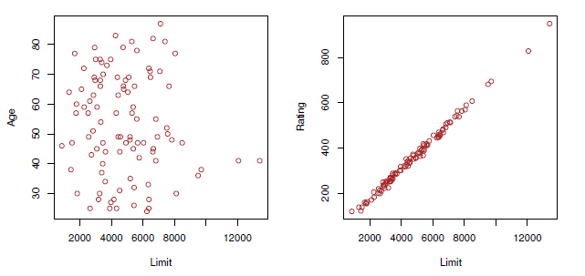
</img>

<b>FIG 4.14</b><i> </i>

</img>

<b>FIG 4.15</b><i> ![Courbes de niveau pour les valeurs RSS en fonction des paramètres β pour diverses régressions impliquant l'ensemble de données Credit. Dans chaque tracé, les points noirs représentent les valeurs de coefficient correspondant au RSS minimum. Gauche : Un tracé de contour du RSS pour la régression du solde sur l'âge et la limite. La valeur minimale est bien définie. Droite : Courbe de niveau du RSS pour la régression de l'équilibre sur le classement et la limite. En raison de la colinéarité, il existe de nombreuses paires (βLimit,βRating) avec une valeur similaire pour RSS.](https://www.statlearning.com/)</i>

En revanche, dans le panneau de droite de la $figure\ 4.14$, les prédicteurs limite et cote sont très fortement corrélés entre eux, et nous disons qu'ils sont colinéaires. La présence de colinéarité peut poser des problèmes dans le contexte de la régression, car il peut être difficile de séparer les effets individuels des variables colinéaires sur la réponse. En d'autres termes, puisque la limite et la cote ont tendance à augmenter ou à diminuer ensemble, il peut être difficile de déterminer comment chacune d'entre elles est associée séparément à la réponse. 

La $figure 4.15$ illustre certaines des difficultés qui peuvent résulter de la colinéarité. Le panneau de gauche de la $figure\ 4.15$ est un tracé de contour du **RSS** (4.22) associé à différentes estimations de coefficient possibles pour la régression de l'équilibre sur la limite et l'âge. Chaque ellipse représente un ensemble de coefficients qui correspondent au même **RSS**, les ellipses les plus proches du centre ayant les valeurs de **RSS** les plus faibles. Les points noirs et les lignes pointillées associées représentent les estimations des coefficients qui donnent le **RSS** le plus petit possible - en d'autres termes, ce sont les estimations des moindres carrés. 

Les axes de la limite et de l'âge ont été mis à l'échelle de manière à ce que le graphique comprenne des estimations de coefficient possibles qui se situent jusqu'à quatre erreurs standard de part et d'autre des estimations des moindres carrés. Ainsi, le graphique inclut toutes les valeurs plausibles pour les coefficients. Par exemple, nous voyons que le véritable coefficient limite se situe presque certainement quelque part entre 0.15 et 0.20. 

En revanche, le panneau de droite de la figure 3.15 présente les courbes de niveau des **RSS** associées aux estimations de coefficients possibles pour la régression de l'équilibre sur la limite et la notation, dont nous savons qu'elles sont fortement colinéaires. Les contours suivent maintenant une vallée étroite ; il existe une large gamme de valeurs pour les estimations de coefficients qui donnent des valeurs égales pour le **RSS**. Par conséquent, un petit changement dans les données pourrait faire en sorte que la paire de valeurs de coefficient qui donne le **RSS** le plus petit - c'est-à-dire les estimations des moindres carrés - se déplace n'importe où le long de cette vallée. Il en résulte une grande incertitude dans les estimations des coefficients. Remarquez que l'échelle du coefficient limite va maintenant d'environ -0.2 à 0.2 ; c'est huit fois plus que la plage plausible du coefficient limite dans la régression avec l'âge. 

Il est intéressant de noter que, même si les coefficients limites et les coefficients d'évaluation présentent maintenant beaucoup plus d'incertitude individuelle, ils se situeront presque certainement quelque part dans cette vallée de contour. Par exemple, nous ne nous attendrions pas à ce que la valeur réelle des coefficients de limite et d'évaluation soit respectivement de -0.1 et 1, même si une telle valeur est plausible pour chaque coefficient individuellement. Comme la colinéarité réduit la précision des estimations des coefficients de régression, elle entraîne une augmentation de l'erreur standard pour $\hat{β}_j$. Rappelons que la $t-statistique$ pour chaque prédicteur est calculée en divisant $\hat{β}_j$ par son erreur standard. Par conséquent, la colinéarité entraîne une baisse de la $t-statistique$. 

Par conséquent, en présence de colinéarité, nous pouvons échouer à rejeter $H_0 : β_j = 0$. Cela signifie que la puissance du test d'hypothèse - la probabilité de détecter correctement un coefficient non nul - est réduite par la colinéarité. 

Le $tableau\ 4.11$ compare les estimations des coefficients obtenues à partir de deux modèles de régression multiple distincts. Le premier est une régression de l'équilibre sur l'âge et la limite, et le second est une régression de l'équilibre sur la cote et la limite. Dans la première régression, l'âge et la limite sont tous deux hautement significatifs avec des valeurs $p$ très faibles. Dans la seconde, la colinéarité entre la limite et la notation a fait que l'erreur standard pour l'estimation du coefficient de la limite a été multipliée par 12 et que la valeur $p$ est passée à 0.701. En d'autres termes, l'importance de la variable limite a été masquée en raison de la présence de la colinéarité. 

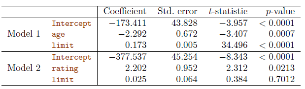
</img>

<b>TAB 4.11</b><i> </i>

Pour éviter une telle situation, il est souhaitable d'identifier et de traiter les problèmes potentiels de colinéarité lors de l'ajustement du modèle. Une façon simple de détecter la colinéarité est d'examiner la matrice de corrélation des prédicteurs. Un élément de cette matrice qui est grand en valeur absolue indique une paire de variables fortement corrélées, et donc un problème de colinéarité dans les données. Malheureusement, tous les problèmes de colinéarité ne peuvent pas être détectés par l'inspection de la matrice de corrélation : il est possible qu'une colinéarité existe entre trois variables ou plus, même si aucune paire de variables n'a une corrélation particulièrement élevée. Nous appelons cette situation la multicollinéarité. 

Au lieu d'inspecter la matrice de corrélation, une meilleure façon d'évaluer la multicollinéarité est de calculer le **facteur d'inflation de la variance** (**VIF**). Le **VIF** est le rapport de la variance de $\hat{β}_j$ lors de l'ajustement du modèle complet divisé par la variance de $\hat{β}_j$ si elle est ajustée seule. 

La plus petite valeur possible pour le **VIF** est 1, ce qui indique l'absence totale de colinéarité. En pratique, il existe généralement une petite colinéarité entre les prédicteurs. En règle générale, une valeur **VIF** supérieure à 5 ou 10 indique un degré de colinéarité problématique. Le **VIF** de chaque variable peut être calculé à l'aide de la formule 

$$
VIF(\hat{β}_j) = \frac{1}{1 - R^2_{X_j|X_-j}},
$$

où $R^2_{X_j|X_-j}$ est le $R^2$ d'une régression de $X_j$ sur tous les autres prédicteurs. Si $R^2_{X_j|X_-j}$ est proche de un, il y a colinéarité, et le **VIF** sera donc élevé. Dans les données sur le crédit, une régression du solde sur l'âge, la cote et la limite indique que les prédicteurs ont des valeurs VIF de 1.01, 160.67 et 160.59. 

Comme nous le soupçonnions, il existe une colinéarité considérable dans les données ! Face à ce problème de colinéarité, il existe deux solutions simples. 

1. La première consiste à éliminer l'une des variables problématiques de la régression. Cela peut généralement être fait sans trop compromettre l'ajustement de la régression, car la présence de colinéarité implique que les informations que cette variable fournit sur la réponse sont redondantes en présence des autres variables. Par exemple, si nous régressons la balance sur l'âge et la limite, sans le prédicteur notation, les valeurs VIF résultantes sont proches de la valeur minimale possible de 1, et le $R^2$ tombe de 0.754 à 0.75. L'élimination de la notation de l'ensemble des prédicteurs a donc permis de résoudre efficacement le problème de colinéarité sans compromettre l'ajustement. 
2. La deuxième solution consiste à combiner les variables colinéaires en un seul prédicteur. Par exemple, nous pourrions prendre la moyenne des versions standardisées de la limite et de la notation afin de créer une nouvelle variable qui mesure la solvabilité.

<a name="4-4"/>

## [4.4 Le plan de marketing](#4-4) ##

[Retour TOC](#toc)

Nous allons maintenant revenir brièvement sur les sept questions concernant les données publicitaires auxquelles nous avons entrepris de répondre au début de cette section. 

1. **Existe-t-il une relation entre les ventes et le budget publicitaire ?** On peut répondre à cette question en ajustant un modèle de régression multiple des ventes sur la télévision, la radio et le journal, comme dans (4.20), et en testant l'hypothèse $H_0 : β_{TV} = β_{radio} = β_{journal} = 0$. Dans la section 4.2.2, nous avons montré que la $F-statistique$ peut être utilisée pour déterminer si nous devons rejeter ou non cette hypothèse nulle. Dans ce cas, la valeur $p$ correspondant à la $F-statistique$ du $tableau\ 4.6$ est très faible, ce qui indique une preuve évidente d'une relation entre la publicité et les ventes. 
2. **Quelle est la force de la relation ?** Nous avons abordé deux mesures de la précision du modèle dans la section 4.1.3. Tout d'abord, le **RSE** estime l'écart type de la réponse par rapport à la ligne de régression de la population. Pour les données de la publicité, le RSE est de 1.69 unité alors que la valeur moyenne de la réponse est de 14.022, ce qui indique un pourcentage d'erreur d'environ 12%. Deuxièmement, la statistique $R^2$ indique le pourcentage de variabilité de la réponse qui est expliqué par les prédicteurs. Les prédicteurs expliquent près de 90% de la variance des ventes. Les statistiques **RSE** et $R^2$ sont présentées dans le $tableau\ 4.6$. 
3. **Quels médias sont associés aux ventes ?** Pour répondre à cette question, nous pouvons examiner les valeurs $p$ associées à la $t-statistique$ de chaque prédicteur (section 4.1.2). Dans la régression linéaire multiple présentée au $tableau\ 4.4$, les valeurs $p$ de la télévision et de la radio sont faibles, mais pas celle du journal. Cela suggère que seules la télévision et la radio sont liées aux ventes. 
4. **Quelle est l'importance de l'association entre chaque média et les ventes** ? Nous avons vu dans la section 4.1.2 que l'erreur standard de $\hat{β}_j$ peut être utilisée pour construire des intervalles de confiance pour $β_j$ . Pour les données sur la publicité, nous pouvons utiliser les résultats du $tableau\ 4.4$ pour calculer les intervalles de confiance à 95% pour les coefficients d'un modèle de régression multiple utilisant les trois budgets média comme prédicteurs. Les intervalles de confiance sont les suivants : (0.043, 0.049) pour la télévision, (0.172, 0.206) pour la radio et (-0.013, 0.011) pour les journaux. Les intervalles de confiance pour la télévision et la radio sont étroits et loin de zéro, ce qui prouve que ces médias sont liés aux ventes. Mais l'intervalle pour le journal inclut zéro, ce qui indique que la variable n'est pas statistiquement significative étant donné les valeurs de la télévision et de la radio. Nous avons vu à la section 4.3.3 que la colinéarité peut entraîner des erreurs types très larges. **La colinéarité pourrait-elle être la raison pour laquelle l'intervalle de confiance associé au journal est si large ?** Les scores **VIF** sont de 1.005, 1.145 et 1.145 pour la télévision, la radio et le journal, ce qui ne suggère aucune preuve de colinéarité. Afin d'évaluer l'association de chaque média individuellement sur les ventes, nous pouvons effectuer trois régressions linéaires simples distinctes. Les résultats sont présentés dans les $tableaux\ 4.1\ et\ 4.3$. Il existe des preuves d'une association extrêmement forte entre la télévision et les ventes et entre la radio et les ventes. Il existe une légère association entre le journal et les ventes, lorsque les valeurs de la télévision et de la radio sont ignorées. 
5. **Avec quelle précision pouvons-nous prédire les ventes futures ?** La réponse peut être prédite à l'aide de (4.21). La précision associée à cette estimation dépend du fait que l'on souhaite prédire une réponse individuelle, $Y = f(X) + \varepsilon$, ou la réponse moyenne, $f(X)$ (section 4.2.2). Dans le premier cas, nous utilisons un intervalle de prédiction, et dans le second, un intervalle de confiance. Les intervalles de prédiction seront toujours plus larges que les intervalles de confiance car ils tiennent compte de l'incertitude associée à $\varepsilon$, l'erreur irréductible. 
6. **La relation est-elle linéaire ?** Dans la section 4.3.3, nous avons vu que les diagrammes résiduels peuvent être utilisés afin d'identifier la non-linéarité. Si les relations sont linéaires, les tracés résiduels ne devraient présenter aucune tendance. Dans le cas des données sur la publicité, nous observons un effet non linéaire dans la $figure\ 4.5$, bien que cet effet puisse également être observé dans un graphique résiduel. Dans la section 4.3.2, nous avons discuté de l'inclusion de transformations des prédicteurs dans le modèle de régression linéaire afin de tenir compte des relations non linéaires. 
7. **Existe-t-il une synergie entre les supports publicitaires ?** Le modèle de régression linéaire standard suppose une relation additive entre les prédicteurs et la réponse. Un modèle additif est facile à interpréter car l'association entre chaque prédicteur et la réponse n'est pas liée aux valeurs des autres prédicteurs. Cependant, l'hypothèse additive peut être irréaliste pour certains ensembles de données. Dans la section 4.3.2, nous avons montré comment inclure un terme d'interaction dans le modèle de régression afin de tenir compte des relations non additives. Une petite valeur $p$ associée au terme d'interaction indique la présence de telles relations. La $figure\ 4.5$ suggère que les données sur la publicité ne sont peut-être pas additives. L'inclusion d'un terme d'interaction dans le modèle entraîne une augmentation substantielle du $R^2$, qui passe d'environ 90% à près de 97%.

<a name="4-5"/>

## [4.5 Comparaison de la régression linéaire avec K-Nearest Neighbors](#4-5) ##

[Retour TOC](#toc)

Comme nous l'avons vu à la section 2, la régression linéaire est un exemple d'approche paramétrique car elle suppose une forme fonctionnelle linéaire pour $f(X)$. Les méthodes paramétriques présentent plusieurs avantages. Elles sont souvent faciles à ajuster, car il suffit d'estimer un petit nombre de coefficients. Dans le cas d'une régression linéaire, les coefficients ont des interprétations simples, et les tests de signification statistique peuvent être facilement réalisés. Mais les méthodes paramétriques ont un inconvénient : par construction, elles font des hypothèses fortes sur la forme de $f(X)$. 

Si la forme fonctionnelle spécifiée est loin de la vérité, et que la précision de la prédiction est notre objectif, alors la méthode paramétrique sera peu performante. Par exemple, si nous supposons qu'il existe une relation linéaire entre $X$ et $Y$, mais que la relation réelle est loin d'être linéaire, le modèle résultant s'adaptera mal aux données et les conclusions qui en seront tirées seront suspectes. 

En revanche, les méthodes non paramétriques ne supposent pas explicitement une forme paramétrique pour $f(X)$, et fournissent ainsi une approche alternative et plus flexible pour effectuer une régression. 

Une des méthodes non paramétriques les plus simples et les plus connues est la régression **K-Nearest Neighbors** (régression **KNN**), étroitement liée au classificateur **KNN** présenté à la section 2. 

Étant donné une valeur pour $K$ et un point de prédiction $x_0$, la régression **KNN** identifie d'abord les $K$ observations d'apprentissage les plus proches de $x_0$, représentées par $\mathcal{N}_0$. Elle estime ensuite $f(x_0$) en utilisant la moyenne de toutes les réponses d'entraînement dans  $\mathcal{N}_0$. En d'autres termes, 

$$
\hat{f}(x_0) = \frac{1}{k} \sum_{x_i \in \mathcal{N}_0} y_i.
$$

La $figure\ 4.16$ illustre deux ajustements **KNN** sur un ensemble de données avec $p = 2- prédicteurs$. L'ajustement avec $K = 1$ est présenté dans le panneau de gauche, tandis que le panneau de droite correspond à $K = 9$. Nous voyons que lorsque $K = 1$, l'ajustement **KNN** interpole parfaitement les observations d'apprentissage, et prend par conséquent la forme d'une fonction échelon. Lorsque $K = 9$, l'ajustement **KNN** est toujours une fonction échelon, mais la moyenne sur neuf observations donne des régions de prédiction constante beaucoup plus petites, et par conséquent un ajustement plus lisse. 

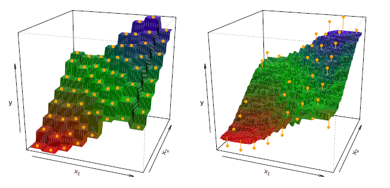
</img>

<b>FIG 4.16</b><i> </i>

En général, la valeur optimale de $K$ dépend du compromis biais-variance, que nous avons présenté à la section 2. Une petite valeur pour $K$ fournit l'ajustement le plus flexible, qui aura un biais faible mais une variance élevée. Cette variance est due au fait que la prédiction dans une région donnée dépend entièrement d'une seule observation. 

En revanche, des valeurs plus élevées de $K$ fournissent un ajustement plus lisse et moins variable ; la prédiction dans une région est une moyenne de plusieurs points, et donc le changement d'une observation a un effet plus faible. Cependant, le lissage peut entraîner un biais en masquant une partie de la structure de $f(X)$. 

**Dans quel contexte une approche paramétrique telle que la régression linéaire des moindres carrés surpasse-t-elle une approche non paramétrique telle que la régression KNN ?** La réponse est simple : l'approche paramétrique sera plus performante que l'approche non paramétrique si la forme paramétrique qui a été sélectionnée est proche de la forme réelle de $f$. La $figure\ 4.17$ fournit un exemple avec des données générées à partir d'un modèle de régression linéaire unidimensionnel. Les lignes pleines noires représentent $f(X)$, tandis que les courbes bleues correspondent aux ajustements **KNN** utilisant $K = 1$ et $K = 9$. Dans ce cas, les prédictions de $K = 1$ sont beaucoup trop variables, tandis que l'ajustement plus lisse de $K = 9$ est beaucoup plus proche de $f(X)$. 

Cependant, étant donné que la vraie relation est linéaire, il est difficile pour une approche non paramétrique de concurrencer la régression linéaire : une approche non paramétrique entraîne un coût en termes de variance qui n'est pas compensé par une réduction du biais. La ligne pointillée bleue dans le panneau gauche de la $figure\ 4.18$ représente l'ajustement de la régression linéaire aux mêmes données. Elle est presque parfaite. Le panneau de droite de la $figure\ 4.18$ révèle que la régression linéaire est plus performante que **KNN** pour ces données. La ligne verte continue, tracée en fonction de $1/K$, représente l'erreur quadratique moyenne (**MSE**) de l'ensemble de test pour **KNN**. Les erreurs de **KNN** sont bien au-dessus de la ligne pointillée noire, qui est la **MSE** de test pour la régression linéaire. Lorsque la valeur de $K$ est grande, les performances de **KNN** ne sont que légèrement inférieures à celles de la régression des moindres carrés en termes de **MSE**. Ses performances sont bien pires lorsque $K$ est petit. 

En pratique, la véritable relation entre $X$ et $Y$ est rarement exactement linéaire. La $figure\ 4.19$ examine les performances relatives de la régression des moindres carrés et de **KNN** pour des niveaux croissants de non-linéarité dans la relation entre $X$ et $Y$ . Dans la ligne supérieure, la relation réelle est presque linéaire. Dans ce cas, nous voyons que le test **MSE** de la régression linéaire est encore supérieur à celui de **KNN** pour de faibles valeurs de $K$. 

Cependant, pour $K ≥ 4$, **KNN** surpasse la régression linéaire. La deuxième ligne illustre une déviation plus importante de la linéarité. Dans cette situation, **KNN** surpasse considérablement la régression linéaire pour toutes les valeurs de $K$. 

Notez que lorsque l'étendue de la non-linéarité augmente, il y a peu de changement dans le **MSE** de l'ensemble de test pour la méthode **KNN** non paramétrique, mais il y a une forte augmentation du **MSE** de l'ensemble de test de la régression linéaire. 

Les $figures\ 4.18\ et\ 4.19$ montrent des situations dans lesquelles la méthode **KNN** est légèrement moins performante que la régression linéaire lorsque la relation est linéaire, mais bien meilleure que la régression linéaire pour les situations non linéaires. Dans une situation réelle dans laquelle la vraie relation est inconnue, on pourrait penser que **KNN** devrait être préféré à la régression linéaire parce qu'il sera au pire légèrement inférieur à la régression linéaire si la vraie relation est linéaire, et peut donner des résultats substantiellement meilleurs si la vraie relation est non linéaire. Mais en réalité, même lorsque la vraie relation est hautement non linéaire, **KNN** peut encore fournir des résultats inférieurs à la régression linéaire. 

En particulier, les $figures\ 4.18\ et\ 4.19$ illustrent des paramètres avec $p = 1$ prédicteur. Mais dans des dimensions plus élevées, **KNN** donne souvent de moins bons résultats que la régression linéaire. 

La $figure\ 4.20$ considère la même situation fortement non linéaire que dans la deuxième ligne de la $figure\ 4.19$, sauf que nous avons ajouté des prédicteurs de bruit supplémentaires qui ne sont pas associés à la réponse. Lorsque $p = 1$ ou $p = 2$, **KNN** surpasse la régression linéaire. Mais pour $p = 3$, les résultats sont mitigés, et pour $p ≥ 4$, la régression linéaire est supérieure à **KNN**. 

En fait, l'augmentation de la dimension n'a provoqué qu'une faible détérioration du MSE de l'ensemble de test de la régression linéaire, mais elle a provoqué une multiplication de plus de dix du **MSE** de **KNN**. Cette diminution de la performance au fur et à mesure que la dimension augmente est un problème commun pour **KNN**, et résulte du fait que dans les dimensions plus élevées il y a effectivement une réduction de la taille de l'échantillon. 

Dans cet ensemble de données, il y a 50 observations d'apprentissage ; lorsque $p = 1$, cela fournit suffisamment d'informations pour estimer avec précision f(X). Cependant, la répartition de 50 observations sur p = 20 dimensions entraîne un phénomène dans lequel une observation donnée n'a pas de voisins proches - c'est ce qu'on appelle la malédiction de la dimensionnalité. En d'autres termes, les $K$ observations les plus proches d'une observation test donnée $x_0$ peuvent être très éloignées de $x_0$ dans un espace à $p$ dimensions lorsque $p$ est grand, ce qui entraîne une très mauvaise prédiction de $f(x0)$ et donc un mauvais ajustement $KNN$. 

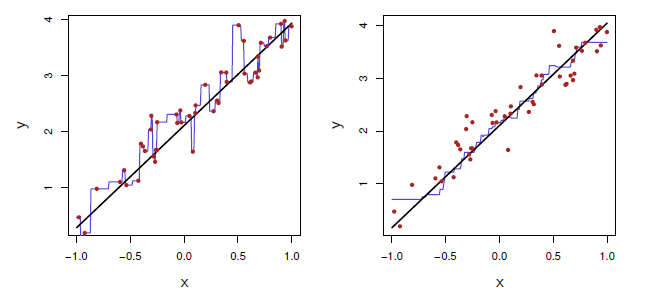
</img>

<b>FIG 4.17</b><i> </i>

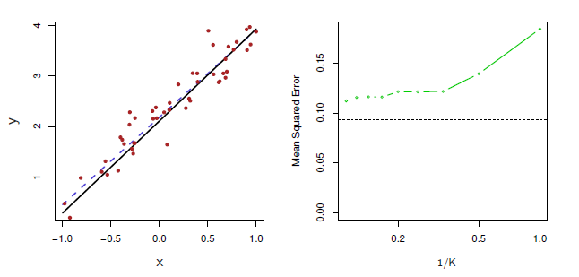
</img>

<b>FIG 4.18</b><i> ![Le même ensemble de données que celui de la figure 4.17 est étudié plus en détail. Gauche : la ligne pointillée bleue représente l'ajustement des moindres carrés aux données. Comme f(X) est en fait linéaire (représentée par la ligne noire), la ligne de régression des moindres carrés fournit une très bonne estimation de f(X). Droite : La ligne horizontale en pointillés représente l'EQM de l'ensemble de test des moindres carrés, tandis que la ligne verte pleine correspond à le MSE pour KNN en fonction de 1/K (sur l'échelle logarithmique). La régression linéaire permet d'obtenir une EQM de test inférieure à celle de la régression KNN, puisque f(X) est en fait linéaire. Pour la régression KNN, les meilleurs résultats se produisent avec une très grande valeur de K, correspondant à une petite valeur de 1/K](https://www.statlearning.com/)</i>

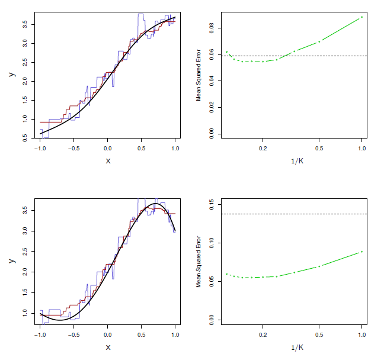
</img>

<b>FIG 4.19</b><i> ![En haut à gauche : Dans un cadre avec une relation légèrement non linéaire entre X et Y (ligne noire pleine), les ajustements KNN avec K = 1 (bleu) et K = 9 (rouge) sont affichés. En haut à droite : Pour les données légèrement non linéaires, le MSE de l'ensemble de test pour la régression des moindres carrés (noir horizontal) et le KNN avec différentes valeurs de 1/K (vert) sont affichés. En bas à gauche et en bas à droite : Comme dans le panneau supérieur, mais avec une relation fortement non linéaire entre X et Y .](https://www.statlearning.com/)</i>

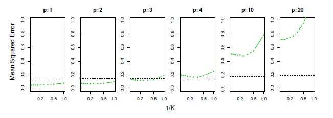
</img>

<b>FIG 4.20</b><i> ![Test MSE pour la régression linéaire (lignes pointillées noires) et KNN (courbes vertes) lorsque le nombre de variables p augmente. La fonction réelle est non linéaire dans la première variable, comme dans le panneau inférieur de la figure 4.19, et ne dépend pas des variables supplémentaires. Les performances de la régression linéaire se détériorent lentement en présence de ces variables de bruit supplémentaires, tandis que les performances de KNN se dégradent beaucoup plus rapidement lorsque p augmente.](https://www.statlearning.com/)</i>

En règle générale, les méthodes paramétriques ont tendance à être plus performantes que les approches non paramétriques lorsqu'il y a un petit nombre d'observations par prédicteur. Même lorsque la dimension est petite, nous pouvons préférer la régression linéaire à **KNN** du point de vue de l'interprétabilité. 

Si le test **MSE** de **KNN** n'est que légèrement inférieur à celui de la régression linéaire, nous pourrions être prêts à renoncer à un peu de précision de prédiction au profit d'un modèle simple qui peut être décrit en termes de juste quelques coefficients, et pour lequel les valeurs p sont disponibles.

## 4.6 Exemple : La hauteur des abres ##

[29]
