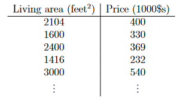
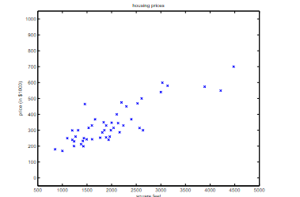
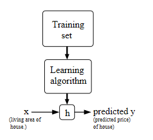
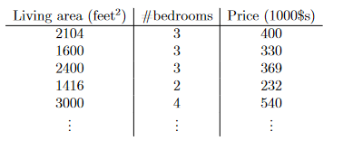
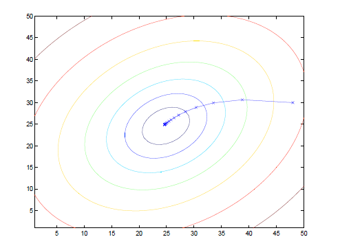
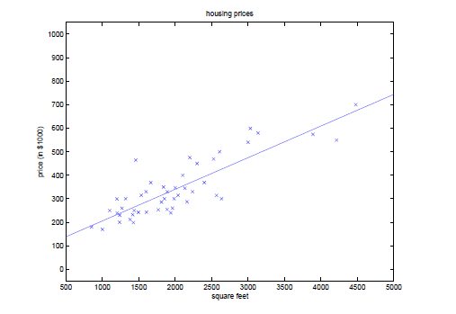
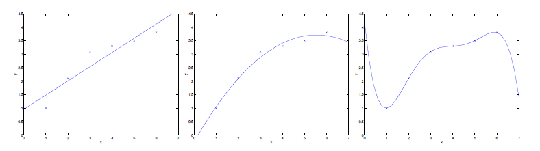

# Apprentissage supervisé #

[Retour README](../README.md)

<a name="toc"/>

[1. Régression linéaire](#1)

- [1.1 Algorithme LMS](#1-1)

[2. Les équations normales](#2)

- [2.1 Dérivées matricielles](#2-1)

- [2.2 Les moindres carrés revisités](#2-2)

[3 Interprétation probabiliste](#3)

[4 Régression linéaire pondérée localement](#4)

Commençons par évoquer quelques exemples de problèmes d'apprentissage supervisé. Supposons que nous disposions d'un ensemble de données donnant les surfaces habitables et les prix de 47 maisons de Portland, Oregon :

Nous pouvons tracer ces données :

Avec de telles données, comment pouvons-nous apprendre à prédire les prix des autres maisons de Portland, en fonction de la taille de leur surface habitable ?

Afin d'établir une notation pour une utilisation future, nous utiliserons $x^{(i)}$ pour désigner les variables "d'entrée" (la surface habitable dans cet exemple), également appelées caractéristiques d'entrée, et $y^{(i)}$ pour désigner la variable "de sortie" ou cible que nous essayons de prédire (le prix). 

Une paire $(x^{(i)}, y^{(i)})$ est appelée un exemple d'apprentissage, et l'ensemble de données que nous utiliserons pour apprendre - une liste de $m$ exemples d'apprentissage $\{(x^{(i)}, y^{(i)}) ; i=1, \ldots, m\}$ - est appelé un ensemble d'apprentissage. Notez que l'exposant " $(i)$ " dans la notation est simplement un index dans l'ensemble d'apprentissage et n'a rien à voir avec l'exponentiation. 

Nous utiliserons également $\mathcal{X}$ pour désigner l'espace des valeurs d'entrée et $\mathcal{Y}$ pour désigner l'espace des valeurs de sortie. Dans cet exemple, $\mathcal{X}=\mathcal{Y}=\mathbb{R}$.

Pour décrire le problème de l'apprentissage supervisé de manière un peu plus formelle, notre objectif est, étant donné un ensemble d'apprentissage, d'apprendre une fonction $h : \mathcal{X} \mapsto \mathcal{Y}$ de sorte que $h(x)$ soit un "bon" prédicteur de la valeur correspondante de $y$. Pour des raisons historiques, cette fonction $h$ est appelée une hypothèse. Vu de manière imagée, le processus se présente donc comme suit :

**Lorsque la variable cible que nous essayons de prédire est continue,** comme dans notre exemple de logement, **nous appelons le problème d'apprentissage un problème de régression.** 

**Lorsque $y$ ne peut prendre qu'un petit nombre de valeurs discrètes** (comme si, étant donné la surface habitable, nous voulions prédire si un logement est une maison ou un appartement, par exemple), **nous appelons cela un problème de classification**.

## Partie I ##

<a name="1"/>

### [1. Régression linéaire](#1) ###

[Retour TOC](#toc)

Pour rendre notre exemple de logement plus intéressant, considérons un ensemble de données légèrement plus riche dans lequel nous connaissons également le nombre de chambres à coucher dans chaque maison :

Ici, les $x$ sont des vecteurs bidimensionnels dans $\mathbb{R}^2$. Par exemple, $x_1^{(i)}$ est la surface habitable de la $i^{ème}$ maison de l'ensemble d'apprentissage, et $x_2^{(i)}$ est son nombre de chambres à coucher. (En général, lors de la conception d'un problème d'apprentissage, c'est à vous de décider quelles caractéristiques choisir, donc si vous êtes à Portland et que vous recueillez des données sur les logements, vous pouvez également décider d'inclure d'autres caractéristiques telles que la présence d'une cheminée dans chaque maison, le nombre de salles de bains, etc. Nous en dirons plus sur la sélection des caractéristiques plus tard, mais pour l'instant, prenons ces caractéristiques comme données).

Pour effectuer un apprentissage supervisé, nous devons décider comment nous allons représenter les fonctions/hypothèses $h$ dans un ordinateur. Comme choix initial, disons que nous décidons d'approximer $y$ comme une fonction linéaire de $x$ :

$$
h_\theta(x)=\theta_0+\theta_1 x_1+\theta_2 x_2
$$

Ici, les $\theta_i$ sont les paramètres (également appelés poids) paramétrant l'espace des fonctions linéaires reliant $\mathcal{X}$ à $\mathcal{Y}$. Lorsqu'il n'y a pas de risque de confusion, nous laisserons tomber l'indice $\theta$ dans $h_\theta(x)$, et l'écrirons plus simplement comme $h(x)$. Pour simplifier notre notation, nous introduisons également la convention de laisser $x_0=1$ (c'est le terme d'interception), de sorte que

$$
h(x)=\sum_{i=0}^n \theta_i x_i=\theta^T x
$$

où, dans la partie droite ci-dessus, nous considérons $\theta$ et $x$ comme des vecteurs, et ici $n$ est le nombre de variables d'entrée (sans compter $x_0$ ).

Maintenant, étant donné un ensemble d'apprentissage, comment choisir, ou apprendre, les paramètres $\theta$ ? Une méthode raisonnable semble être de faire en sorte que $h(x)$ soit proche de $y$, du moins pour les exemples d'apprentissage dont nous disposons.

Pour formaliser cela, nous allons définir une fonction qui mesure, pour chaque valeur des $\theta$, la proximité des $h(x^{(i)})$ par rapport aux $y^{(i)}$ correspondants. Nous définissons la fonction de coût :

$$
J(\theta)=\frac{1}{2} \sideset{}{^m_{i=1}}\sum\left(h_\theta\left(x^{(i)}\right)-y^{(i)}\right)^2 .
$$

Si vous avez déjà vu la régression linéaire, vous reconnaîtrez peut-être la fonction de coût familière des moindres carrés qui donne lieu au modèle de régression ordinaire des moindres carrés. Que vous l'ayez déjà vu ou non, continuons, et nous finirons par montrer qu'il s'agit d'un cas particulier d'une famille d'algorithmes beaucoup plus large.

------

**Pourquoi utilisons-nous la fonction de coût $J(\theta)$ ?**

La fonction de coût, souvent appelée fonction d'erreur ou fonction de perte, mesure la différence entre les prédictions d'un modèle (données par $h_\theta\left(x^{(i)}\right)$ ) et les véritables valeurs (les $\left.y^{(i)}\right)$. L'objectif est de trouver les paramètres $\theta$ qui minimisent cette erreur.

1. **Sens intuitif**: La somme des carrés des erreurs donne une indication de la "mauvaise" prédiction globale du modèle pour l'ensemble des données. Si cette somme est petite, cela signifie que le modèle prédit généralement bien. Si elle est grande, le modèle prédit mal.
2. **Continuité et différenciabilité**: La fonction est continue et différentiable, ce qui est bénéfique pour les algorithmes d'optimisation comme la descente de gradient, que l'on utilise souvent pour trouver le minimum de la fonction.
3. **Pénalisation des grosses erreurs**: En élevant au carré l'erreur, nous donnons plus de poids aux grosses erreurs. Cela signifie que notre modèle sera plus fortement pénalisé s'il fait des prédictions très éloignées de la véritable valeur.

**Démonstration:**

Pour démontrer que cela fonctionne, nous devons montrer qu'en minimisant cette fonction, nous obtenons un ensemble de paramètres $\theta$ qui donne de bonnes prédictions.

Soit la fonction de coût :

$$
J(\theta) = \frac{1}{2} \sum_ {i = 1}^m\left(h_ \theta\left(x^{(i)}\right) - y^{(i)}\right)^2
$$

où $m$ est le nombre d'exemples d'apprentissage.

L'objectif est de minimiser $J(\theta)$.

Pour minimiser $J(\theta)$, nous utilisons généralement un algorithme d'optimisation, comme la descente de gradient. À chaque itération de la descente de gradient, nous ajustons les paramètres $\theta$ dans la direction qui réduit le plus $J(\theta)$. Cela continue jusqu'à ce que $J(\theta)$ soit aussi faible que possible (c'est-à-dire jusqu'à convergence).

La mise à jour de la descente de gradient pour la régression linéaire est donnée par :

$$
\theta_ j:=\theta_ j - \alpha \frac{\partial}{\partial \theta_ j} J(\theta)
$$

où $\alpha$ est le taux d'apprentissage.

En utilisant cette mise à jour, nous minimisons progressivement $J(\theta)$ pour trouver les meilleurs paramètres $\theta$.

**En conclusion:**

La fonction de coût $J(\theta)$ nous donne un moyen quantitatif de déterminer la "mauvaise" prédiction d'un ensemble de paramètres $\theta$. En minimisant cette fonction, nous pouvons "apprendre" les paramètres qui permettent à notre modèle de prédire aussi près que possible des vraies valeurs $y$.

<a name="1-1"/>

#### [1.1 Algorithme LMS](#1-1) ####

[Retour TOC](#toc)

Nous voulons choisir $\theta$ de manière à minimiser $J(\theta)$. Pour ce faire, utilisons un algorithme de recherche qui commence par une " estimation initiale " de $\theta$, et qui modifie de manière répétée $\theta$ pour rendre $J(\theta)$ plus petit, jusqu'à ce que nous convergions vers une valeur de $\theta$ qui minimise $J(\theta)$. Plus précisément, considérons l'algorithme de descente de gradient, qui commence avec une valeur initiale de $\theta$, et effectue la mise à jour de manière répétée :

$$
\theta_j:=\theta_j-\alpha \frac{\partial}{\partial \theta_j} J(\theta) .
$$

(Cette mise à jour est effectuée simultanément pour toutes les valeurs de $j=0, \ldots, n$.) Ici, $\alpha$ est appelé le taux d'apprentissage. Il s'agit d'un algorithme très naturel qui effectue de manière répétée un pas dans la direction de la plus forte diminution de $J$.

Afin de mettre en œuvre cet algorithme, nous devons déterminer le terme de la dérivée partielle du côté droit. Commençons par le calculer dans le cas où nous n'avons qu'un seul exemple d'apprentissage $(x, y)$, de sorte que nous pouvons négliger la somme dans la définition de $J$. Nous avons :

$$
\begin{aligned}
\frac{\partial}{\partial \theta_j} J(\theta) & =\frac{\partial}{\partial \theta_j} \frac{1}{2}\left(h_\theta(x)-y\right)^2 \\
& =2 \cdot \frac{1}{2}\left(h_\theta(x)-y\right) \cdot \frac{\partial}{\partial \theta_j}\left(h_\theta(x)-y\right) \\
& =\left(h_\theta(x)-y\right) \cdot \frac{\partial}{\partial \theta_j}\left(\sum_{i=0}^n \theta_i x_i-y\right) \\
& =\left(h_\theta(x)-y\right) x_j
\end{aligned}
$$

Pour un seul exemple d'apprentissage, cela donne la règle de mise à jour ( Nous utilisons la notation " $a := b$ " pour désigner une opération (dans un programme informatique) dans laquelle nous définissons la valeur d'une variable $a$ comme étant égale à la valeur de $b$. En d'autres termes, cette opération écrase $a$ avec la valeur de $b$. En revanche, nous écrirons "  $a = b$ " lorsque nous affirmons un état de fait, à savoir que la valeur de $a$ est égale à la valeur de $b$ ) :

$$
\theta_j:=\theta_j+\alpha\left(y^{(i)}-h_\theta\left(x^{(i)}\right)\right) x_j^{(i)} .
$$

La règle s'appelle la règle de mise à jour $LMS$ ( $LMS$ signifie "***least mean squares***" $\equiv$ ***méthode des moindres carré*** ), et est également connue sous le nom de ***règle d'apprentissage de Widrow-Hoff***. Cette règle possède plusieurs propriétés qui semblent naturelles et intuitives. Par exemple, l'ampleur de la mise à jour est proportionnelle au terme d'erreur $\left(y^{(i)}-h_\theta\left(x^{(i)}\right)\right)$ ; ainsi, par exemple, si nous rencontrons un exemple d'apprentissage sur lequel notre prédiction correspond presque à la valeur réelle de $y^{(i)}$, alors nous trouvons qu'il y a peu de besoin de changer les paramètres ; en revanche, une modification plus importante des paramètres sera effectuée si notre prédiction $h_\theta\left(x^{(i)}\right)$ a une erreur importante (c. e., si elle est très éloignée de $\left.y^{(i)}\right)$.

Nous avions dérivé la règle du $LMS$ pour les cas où il n'y avait qu'un seul exemple d'apprentissage. Il existe deux façons de modifier cette méthode pour un ensemble d'apprentissage comprenant plus d'un exemple. La première consiste à la remplacer par l'algorithme suivant :

Répétez jusqu'à convergence : 

{

$$
\begin{array}{ll}  \theta_j:=0_j+\alpha \sideset{}{^m_{f=1}}\sum(y^{(i)}-h_\theta(x^{(i)})) x_j^{(i)} \text { (for every } j \text { ). } \\ \end{array}
$$

}

Le lecteur peut facilement vérifier que la quantité dans la sommation de la règle de mise à jour ci-dessus est juste $\partial J(\theta) / \partial \theta_j$ (pour la définition originale de $J$ ). Il s'agit donc simplement d'une descente de gradient sur la fonction de coût originale $J$. Cette méthode examine chaque exemple de l'ensemble d'apprentissage à chaque étape, et est appelée descente de gradient par lots. Notez que, bien que la descente par gradient puisse être sensible aux minima locaux en général, le problème d'optimisation que nous avons posé ici pour la régression linéaire n'a qu'un seul optima global, et aucun autre optima local ; ainsi, la descente par gradient converge toujours (en supposant que le taux d'apprentissage $\alpha$ n'est pas trop grand) vers le minimum global. 

En effet, $J$ est une fonction quadratique convexe. Voici un exemple de descente de gradient telle qu'elle est exécutée pour minimiser une fonction quadratique.

Les ellipses représentées ci-dessus sont les contours d'une fonction quadratique. On voit également la trajectoire prise par la descente par gradient, qui a été initialisée à $(48,30)$. Les $x$ de la figure (reliés par des lignes droites) marquent les valeurs successives de $\theta$ par lesquelles est passée la descente par gradient.

Lorsque nous exécutons la descente de gradient par lots pour ajuster $\theta$ sur notre ensemble de données précédent, afin d'apprendre à prédire le prix des logements en fonction de la surface habitable, nous obtenons $\theta_0=71.27,\ \theta_1=0.1345$. Si nous traçons $h_\theta(x)$ en fonction de $x$ (surface), avec les données d'apprentissage, nous obtenons la figure suivante :

Si le nombre de chambres à coucher est également inclus dans les caractéristiques d'entrée, nous obtenons $\theta_0=89.60,\ \theta_1=0.1392,\ \theta_2=-8.738$.

Les résultats ci-dessus ont été obtenus avec la descente de gradient par lots. Il existe une alternative à la descente de gradient par lots qui fonctionne également très bien. Considérons l'algorithme suivant :

$$
\begin{aligned} \\
& Loop \\ 
& \lbrace \text  { for } \mathrm{i}=1 \text { to } \mathrm{m}, \\
& \ \ \ \ \ \ \theta_j :=\theta_j+\alpha(y^{(i)}-h_\theta(x^{(i)})) x_j^{(i)} \\ 
& \ \ \ \ \ \ for\ every\ j \ \\
& \rbrace \\
\end{aligned}
$$

Dans cet algorithme, nous parcourons de manière répétée l'ensemble d'apprentissage et, chaque fois que nous rencontrons un exemple d'apprentissage, nous mettons à jour les paramètres en fonction du gradient de l'erreur par rapport à ce seul exemple d'apprentissage. 

***Cet algorithme est appelé descente de gradient stochastique*** (également descente de gradient incrémentielle). Alors que l'algorithme de descente par gradient discontinu doit parcourir l'ensemble de l'apprentissage avant de faire un seul pas - une opération coûteuse si $m$ est grand - l'algorithme de descente par gradient stochastique peut commencer à progresser tout de suite, et continue à progresser avec chaque exemple qu'il examine. 

**Souvent, la descente de gradient stochastique obtient $\theta$ "proche" du minimum beaucoup plus rapidement que la descente de gradient par lots.** (Notez cependant qu'elle peut ne jamais "converger" vers le minimum, et que les paramètres $\theta$ continueront à osciller autour du minimum de $J(\theta)$ ; mais en pratique, la plupart des valeurs proches du minimum seront des approximations raisonnablement bonnes du vrai minimum. Bien qu'il soit plus courant d'exécuter la descente de gradient stochastique telle que nous l'avons décrite et avec un taux d'apprentissage fixe $\alpha$, en laissant lentement le taux d'apprentissage $\alpha$ diminuer jusqu'à zéro au fur et à mesure de l'exécution de l'algorithme, il est également possible de s'assurer que les paramètres convergeront vers le minimum global plutôt que de simplement osciller autour du minimum). 

Pour ces raisons, notamment lorsque l'ensemble d'apprentissage est important, la descente de gradient stochastique est souvent préférée à la descente de gradient par lots.

<a name="2"/>

### [2. Les équations normales](#2) ###

[Retour TOC](#toc)

La descente de gradient donne une façon de minimiser $J$. Examinons une deuxième façon de le faire, en effectuant cette fois la minimisation de manière explicite et sans recourir à un algorithme itératif. 

Dans cette méthode, nous minimisons $J$ en prenant explicitement ses dérivées par rapport aux $\theta_j$ et en les mettant à zéro. Pour nous permettre de le faire sans avoir à écrire des rames d'algèbre et des pages pleines de matrices de dérivées, nous allons introduire une notation pour faire du calcul avec des matrices.

<a name="2-1"/>

#### [2.1 Dérivées matricielles](#2-1) ####

[Retour TOC](#toc)

Pour une fonction $f : \mathbb{R}^{m \times n} \mapsto \mathbb{R}$ de matrices $m$-par- $n$ vers les nombres réels, nous définissons la dérivée de $f$ par rapport à $A$ comme étant :

$$
\nabla_A f(A)=\left[\begin{array}{ccc}
\frac{\partial f}{\partial A_{11}} & \cdots & \frac{\partial f}{\partial A_{1 n}} \\
\vdots & \ddots & \vdots \\
\frac{\partial f}{\partial A_{m 1}} & \cdots & \frac{\partial f}{\partial A_{m n}}
\end{array}\right]
$$

Ainsi, le gradient $\nabla_A f(A)$ est lui-même une matrice $m$ par n, dont l'élément $(i, j)$ est $\partial f / \partial A_{i j}$. Par exemple, supposons que 

$$
A=\left[\begin{array}{ll}A_{11} & A_{12} \\ A_{21} & A_{22}\end{array}\right]
$$

est une matrice 2 par 2, et que la fonction $f : \mathbb{R}^{2 \times 2} \mapsto \mathbb{R}$ est donnée par

$$
f(A)=\frac{3}{2} A_{11}+5 A_{12}^2+A_{21} A_{22} .
$$

Ici, $A_{i j}$ désigne l'entrée $(i, j)$ de la matrice $A$. On a alors

$$
\nabla_A f(A)=\left[\begin{array}{cc}
\frac{3}{2} & 10 A_{12} \\
A_{22} & A_{21}
\end{array}\right] .
$$

Nous introduisons également l'opérateur trace, écrit "***tr***". Pour une matrice (carrée) $A$ de $n\ par\ n,\ la\ trace\ de\ A$ est définie comme étant la somme de ses entrées diagonales :

$$
{tr} A=\sum_{i=1}^n A_{i i}
$$

Si $a$ est un nombre réel (c'est-à-dire une matrice 1 par 1), alors ${tr} a=a$. (Si vous n'avez jamais vu cette "notation d'opérateur" auparavant, vous devez considérer la trace de $A$ comme ${tr}(A)$, ou comme l'application de la fonction "trace" à la matrice $A$. On l'écrit cependant plus couramment sans les parenthèses).

L'opérateur trace a la propriété que pour deux matrices $A$ et $B$ telles que $A B$ est carrée, on a que ${tr} A B={tr} B A$. (Vérifiez-le vous-même !) Comme corollaire de ceci, nous avons aussi, par ex,

$$
\begin{gathered}
{tr} A B C={tr} C A B={tr} B C A, \\
{tr} A B C D={tr} D A B C={tr} C D A B={tr} B C D A .
\end{gathered}
$$

Les propriétés suivantes de l'opérateur trace sont également facilement vérifiées. Ici, $A$ et $B$ sont des matrices carrées, et $a$ est un nombre réel :

$$
\begin{aligned}
{tr} A & ={tr} A^T \\
{tr}(A+B) & ={tr} A+{tr} B \\
{tr} a A & =a {tr} A
\end{aligned}
$$

Nous énonçons maintenant sans preuve certains faits relatifs aux dérivées de matrices (nous n'en aurons pas besoin avant la fin de ce trimestre). L'équation (4) ne s'applique qu'aux matrices carrées non singulières $A$, où $|A|$ désigne le déterminant de $A$. Nous avons :

$$
\begin{aligned}
\nabla_A {tr} A B & \ = \ B^T \hspace{10 em} &(1) \\ 
\nabla_{A^T} f(A) & \ = \ (\nabla_A f(A))^T \hspace{10 em} &(2)\\
\nabla_A {tr} A B A^T C & \ = \ C A B+C^T A B^T \hspace{10 em} &(3)\\
\nabla_A|A| & \ = \ |A|(A^{-1})^T \hspace{10 em} &(4)
\end{aligned}
$$

Pour rendre notre notation matricielle plus concrète, expliquons maintenant en détail la signification de la première de ces équations. Supposons que nous ayons une matrice fixe $B \in \mathbb{R}^{n \times m}$. Nous pouvons alors définir une fonction $f : \mathbb{R}^{m \times n} \mapsto \mathbb{R}$ selon $f(A)={tr} A B$. Remarquons que cette définition a un sens, car si $A \in m \times n$, alors $A B$ est une matrice carrée, et nous pouvons lui appliquer l'opérateur de trace ; ainsi, $f$ correspond effectivement de $\mathbb{R}^{m \times n}$ à $\mathbb{R}$. Nous pouvons alors appliquer notre définition des dérivées matricielles pour trouver $\nabla_A f(A)$, qui sera elle-même une matrice de $m$ par $n$ . L'équation (1) ci-dessus indique que l'entrée $(i, j)$ de cette matrice sera donnée par l'entrée $(i, j)$ de $B^T$, ou de manière équivalente, par $B_{j i}$.

Les preuves des équations (1-3) sont raisonnablement simples et sont laissées au lecteur à titre d'exercice. Les équations (4) peuvent être dérivées en utilisant la représentation adjointe de l'inverse d'une matrice. ${ }^3$

------

${ }^3$ Si nous définissons $A^{\prime}$ comme la matrice dont l'élément $(i, j)$ est $(-1)^{i+j}$ fois le déterminant de la matrice carrée résultant de la suppression de la ligne $i$ et de la colonne $j$ de $A$, alors on peut prouver que $A^{-1}=\left(A^{\prime}\right)^T /|A|$. (Vous pouvez vérifier que ceci est cohérent avec la manière standard de trouver $A^{-1}$ lorsque $A$ est une matrice 2 par 2. Si vous voulez voir une preuve de ce résultat plus général, consultez un texte d'algèbre linéaire intermédiaire ou avancé, tel que Charles Curtis, 1991, Linear Algebra, Springer). Ceci montre que $A^{\prime}=|A|\left(A^{-1}\right)^T$. De plus, le déterminant d'une matrice peut s'écrire 

$$
|A| = \sum_{j} A_{ij} A_{ij}^\prime
$$

$$
\text{Puisque} (A') _ {ij} \text{ ne dépend pas de } A_{ij}
$$

(comme on peut le voir d'après sa définition), cela implique que $(\partial / \partial A_{ij})|A|=A_{ij}^\prime$ . En mettant tout cela ensemble, on obtient le résultat.

------

<a name="2-2"/>

#### [2.2 Les moindres carrés revisités](#2-2) ####

[Retour TOC](#toc)

Armés des outils des dérivées matricielles, cherchons maintenant à trouver sous une forme fermée la valeur de $\theta$ qui minimise $J(\theta)$. Nous commençons par réécrire $J$ en notation matricielle-vectorielle.

En donnant un ensemble d'apprentissage, définissons la matrice de conception $X$ comme étant la matrice m$ par n (en fait m$ par n+1$, si nous incluons le terme d'interception) qui contient

les valeurs d'entrée des exemples de formation dans ses rangées :

$$
X=\left[\begin{array}{c}
-\left(x^{(1)}\right)^T- \\
-\left(x^{(2)}\right)^T- \\
\vdots \\
-\left(x^{(m)}\right)^T-
\end{array}\right]
$$

De plus, laissez $\vec{y}$ être le vecteur à $m$ dimensions contenant toutes les valeurs cibles de l'ensemble d'apprentissage :

$$
\vec{y}=\left[\begin{array}{c}
y^{(1)} \\
y^{(2)} \\
\vdots \\
y^{(m)}
\end{array}\right] .
$$

Maintenant, puisque $h_\theta\left(x^{(i)}\right)=\left(x^{(i)}\right)^T \theta$, nous pouvons facilement vérifier que

$$
\begin{aligned}
X \theta-\vec{y} & =\left[\begin{array}{c}
\left(x^{(1)}\right)^T \theta \\
\vdots \\
\left(x^{(m)}\right)^T \theta
\end{array}\right]-\left[\begin{array}{c}
y^{(1)} \\
\vdots \\
y^{(m)}
\end{array}\right] \\
& =\left[\begin{array}{c}
h_\theta\left(x^{(1)}\right)-y^{(1)} \\
\vdots \\
h_\theta\left(x^{(m)}\right)-y^{(m)}
\end{array}\right] .
\end{aligned}
$$

Ainsi, en utilisant le fait que pour un vecteur $z$, on a que $z^T z=\sum_i z_i^2$.

$$
\begin{aligned}
\frac{1}{2}(X \theta-\vec{y})^T(X \theta-\vec{y}) & =\frac{1}{2} \sum_{i=1}^m\left(h_\theta\left(x^{(i)}\right)-y^{(i)}\right)^2 \\
& =J(\theta)
\end{aligned}
$$

Enfin, pour minimiser $J$, trouvons ses dérivées par rapport à $\theta$. En combinant les équations (2) et (3), nous trouvons que

$$
\nabla_{A^T {tr}} A B A^T C=B^T A^T C^T+B A^T C \hspace{6 em} (5)
$$

D'où,

$$
\begin{aligned}
\nabla_\theta J(\theta) & =\nabla_\theta \frac{1}{2}(X \theta-\vec{y})^T(X \theta-\vec{y}) \\
& =\frac{1}{2} \nabla_\theta\left(\theta^T X^T X \theta-\theta^T X^T \vec{y}-\vec{y}^T X \theta+\vec{y}^T \vec{y}\right) \\
& =\frac{1}{2} \nabla_\theta {tr}\left(\theta^T X^T X \theta-\theta^T X^T \vec{y}-\vec{y}^T X \theta+\vec{y}^T \vec{y}\right) \\
& =\frac{1}{2} \nabla_\theta\left({tr} \theta^T X^T X \theta-2 {tr} \vec{y}^T X \theta\right) \\
& =\frac{1}{2}\left(X^T X \theta+X^T X \theta-2 X^T \vec{y}\right) \\
& =X^T X \theta-X^T \vec{y}
\end{aligned}
$$

Dans la troisième étape, nous avons utilisé le fait que la trace d'un nombre réel est juste le nombre réel ; la quatrième étape a utilisé le fait que ${tr}. A={tr} A^T$, et la cinquième étape utilise l'équation (5) avec $A^T=\theta, B=B^T=X^T X$, et $C=I$, et l'équation (1). Pour minimiser $J$, on met ses dérivées à zéro, et on obtient les équations normales :

$$
X^T X \theta=X^T \vec{y}
$$

Ainsi, la valeur de $\theta$ qui minimise $J(\theta)$ est donnée en forme fermée par l'équation

$$
\theta=\left(X^T X\right)^{-1} X^T \vec{y}
$$

<a name="3"/>

### [3 Interprétation probabiliste](#3) ###

[Retour TOC](#toc)

**Face à un problème de régression, pourquoi la régression linéaire, et plus précisément pourquoi la fonction de coût des moindres carrés $J$, serait-elle un choix raisonnable ?** Dans cette section, nous allons donner un ensemble d'hypothèses probabilistes, sous lesquelles la régression des moindres carrés est dérivée comme un algorithme très naturel.

Supposons que les variables cibles et les entrées soient liées par l'équation suivante

$$
y^{(i)}=\theta^T x^{(i)}+\epsilon^{(i)},
$$

où $\epsilon^{(i)}$ est un terme d'erreur qui capte soit les effets non modélisés (par exemple, s'il existe des caractéristiques très pertinentes pour prédire le prix des logements, mais que nous avons laissées de côté dans la régression), soit le bruit aléatoire. Supposons en outre que les $\epsilon^{(i)}$ sont distribués IID (indépendamment et identiquement distribués) selon une distribution gaussienne (également appelée distribution normale) de moyenne zéro et de variance $\sigma^2$.

Nous pouvons écrire cette hypothèse sous la forme " $\epsilon^{(i)} \sim$ $\mathcal{N}(0, \sigma^2)$." Autrement dit, la densité de $\epsilon^{(i)}$ est donnée par

$$
p\left(\epsilon^{(i)}\right)=\frac{1}{\sqrt{2 \pi} \sigma} \exp \left(-\frac{\left(\epsilon^{(i)}\right)^2}{2 \sigma^2}\right) .
$$

Cela implique que

$$
p\left(y^{(i)} \mid x^{(i)} ; \theta\right)=\frac{1}{\sqrt{2 \pi} \sigma} \exp \left(-\frac{\left(y^{(i)}-\theta^T x^{(i)}\right)^2}{2 \sigma^2}\right) .
$$

La notation " $p(y^{(i)} \mid x^{(i)} ; \theta)$  " indique qu'il s'agit de la distribution de $y^{(i)}$ étant donné $x^{(i)}$ et paramétrée par $\theta$. Notez que nous ne devons pas conditionner $\theta$ à  (" $(p(y^{(i)} \mid x^{(i)}, \theta)$ ") , puisque $\theta$ n'est pas une variable aléatoire. Nous pouvons également écrire la distribution de $y^{(i)}$ comme étant $y^{(i)} \mid x^{(i)} ; \theta \sim \mathcal{N}(\theta^T x^{(i)}, \sigma^2)$.

Étant donné $X$ (la matrice du plan, qui contient tous les $x^{(i)}$ 's) et $\theta$, quelle est la distribution des $y^{(i)}$ 's ? La probabilité des données est donnée par $p(\vec{y} \mid X ; \theta)$. Cette quantité est généralement considérée comme une fonction de $\vec{y}$ (et peut-être de $X$ ), pour une valeur fixe de $\theta$. Lorsque nous souhaitons la considérer explicitement comme une fonction de $\theta$, nous l'appellerons plutôt la fonction de vraisemblance :

$$
L(\theta)=L(\theta ; X, \vec{y})=p(\vec{y} \mid X ; \theta) .
$$

Notez que par l'hypothèse d'indépendance sur les $\epsilon^{(i)}$ 's (et donc aussi les $y^{(i)}$ 's étant donné les $x^{(i)}$ 's), ceci peut aussi être écrit

$$
\begin{aligned}
L(\theta) & =\prod_{i=1}^m p\left(y^{(i)} \mid x^{(i)} ; \theta\right) \\
& =\prod_{i=1}^m \frac{1}{\sqrt{2 \pi} \sigma} \exp \left(-\frac{\left(y^{(i)}-\theta^T x^{(i)}\right)^2}{2 \sigma^2}\right) .
\end{aligned}
$$

Maintenant, étant donné ce modèle probabiliste relatif aux $y^{(i)}$ et aux $x^{(i)}$, quelle est la façon raisonnable de choisir notre meilleure estimation des paramètres $\theta$ ? Le principe du maximum de vraisemblance dit que nous devrions choisir $\theta$ de manière à rendre les données aussi probables que possible. C'est-à-dire que nous devrions choisir $\theta$ pour maximiser $L(\theta)$.

Au lieu de maximiser $L(\theta)$, nous pouvons également maximiser toute fonction strictement croissante de $L(\theta)$. 

$$
\begin{aligned}
\ell(\theta) & =\log L(\theta) \\
& =\log \prod_{i=1}^m \frac{1}{\sqrt{2 \pi} \sigma} \exp \left(-\frac{\left(y^{(i)}-\theta^T x^{(i)}\right)^2}{2 \sigma^2}\right) \\
& =\sum_{i=1}^m \log \frac{1}{\sqrt{2 \pi} \sigma} \exp \left(-\frac{\left(y^{(i)}-\theta^T x^{(i)}\right)^2}{2 \sigma^2}\right) \\
& =m \log \frac{1}{\sqrt{2 \pi} \sigma}-\frac{1}{\sigma^2} \cdot \frac{1}{2} \sum_{i=1}^m\left(y^{(i)}-\theta^T x^{(i)}\right)^2 .
\end{aligned}
$$

Par conséquent, maximiser $\ell(\theta)$ donne la même réponse que minimiser

$$
\frac{1}{2} \sum_{i=1}^m\left(y^{(i)}-\theta^T x^{(i)}\right)^2
$$

que nous reconnaissons comme étant $J(\theta)$, notre fonction de coût originale des moindres carrés.

***Pour résumer*** : Dans le cadre des hypothèses probabilistes précédentes sur les données, la régression des moindres carrés correspond à la recherche de l'estimation du maximum de vraisemblance de $\theta$. Il s'agit donc d'un ensemble d'hypothèses sous lesquelles la régression des moindres carrés peut être justifiée comme une méthode très naturelle qui fait juste une estimation du maximum de vraisemblance. (Notez toutefois que les hypothèses probabilistes ne sont en aucun cas nécessaires pour que la régression des moindres carrés soit une procédure parfaitement bonne et rationnelle, et qu'il peut - et il existe en effet - d'autres hypothèses naturelles qui peuvent également être utilisées pour la justifier).

Notez également que, dans notre discussion précédente, notre choix final de $\theta$ ne dépendait pas de ce qu'était $\sigma^2$, et en fait nous serions arrivés au même résultat même si $\sigma^2$ était inconnu. Nous utiliserons à nouveau ce fait plus tard, lorsque nous parlerons de la famille exponentielle et des modèles linéaires généralisés.

<a name="4"/>

### [4 Régression linéaire pondérée localement](#4) ###

[Retour TOC](#toc)

Considérons le problème de la prédiction de $y$ à partir de $x \in \mathbb{R}$. La figure la plus à gauche ci-dessous montre le résultat de l'ajustement d'un modèle $y=\theta_0+\theta_1 x$ à un ensemble de données. On constate que les données ne sont pas vraiment alignées sur une ligne droite et que l'ajustement n'est donc pas très bon.

Au contraire, si nous avions ajouté une caractéristique supplémentaire $x^2$, et ajusté $y=\theta_0+\theta_1 x+\theta_2 x^2$, nous aurions obtenu un ajustement légèrement meilleur aux données. (Voir la figure du milieu) Naïvement, on pourrait penser que plus on ajoute de caractéristiques, mieux c'est. Cependant, l'ajout d'un trop grand nombre de caractéristiques présente également un danger : La figure la plus à droite est le résultat de l'ajustement d'un polynôme d'ordre 5 $y=\sideset{}{^5_{j=0}}\sum \theta_j x^j$. **Nous voyons que même si la courbe ajustée passe parfaitement par les données, nous ne nous attendons pas à ce qu'elle soit un très bon prédicteur**, par exemple, des prix des logements $(y)$ pour différentes zones d'habitation $(x)$. Sans définir formellement la signification de ces termes, nous dirons que la figure de gauche montre un exemple de sous-adaptation - dans lequel les données montrent clairement une structure non prise en compte par le modèle - et que la figure de droite est un exemple de sur-adaptation. (Plus tard dans ce cours, lorsque nous parlerons de la théorie de l'apprentissage, nous formaliserons certaines de ces notions, et définirons aussi plus précisément ce que signifie juste une hypothèse bonne ou mauvaise).

Comme nous l'avons vu précédemment, et comme le montre l'exemple ci-dessus, le choix des caractéristiques est important pour assurer la bonne performance d'un algorithme d'apprentissage. (Lorsque nous parlerons de sélection de modèles, nous verrons également des algorithmes permettant de choisir automatiquement un bon ensemble de caractéristiques). Dans cette section, parlons brièvement de **l'algorithme de régression linéaire pondérée localement** (LWR) qui, en supposant que les données d'apprentissage sont suffisantes, rend le choix des caractéristiques moins critique. Ce traitement sera bref, car vous aurez l'occasion d'explorer vous-même certaines des propriétés de l'algorithme $LWR$ dans les devoirs.

Dans l'algorithme de régression linéaire original, pour faire une prédiction à un point d'interrogation $x$ (c'est-à-dire pour évaluer $h(x)$ ), nous devions :

1. Ajuster $\theta$ pour minimiser $\sum_i\left(y^{(i)}-\theta^T x^{(i)}\right)^2$.

2. Produire $\theta^T x$.

En revanche, l'algorithme de régression linéaire pondérée localement effectue les opérations suivantes :

1. Ajuster $\theta$ pour minimiser $\sum_i w^{(i)}\left(y^{(i)}-\theta^T x^{(i)}\right)^2$.

2. Produire $\theta^T x$.

Ici, les $w^{(i)}$ sont des poids à valeur non négative. Intuitivement, si $w^{(i)}$ est grand pour une valeur particulière de $i$, alors en choisissant $\theta$, nous nous efforcerons de rendre  $(y^{(i)}-$ $\theta^T x^{(i)})^2$ petit. Si $w^{(i)}$ est petit, alors le terme d'erreur $(y^{(i)}-\theta^T x^{(i)})^2$ sera pratiquement ignoré dans l'ajustement.

Un choix assez standard pour les poids est ${ }^4$.

------

${ }^4$ Si $x$ est à valeur vectorielle, ceci est généralisé pour être $w^{(i)}=\exp (-(x^{(i)}-x)^T(x^{(i)}-x) /(2 \tau^2))$, ou $w^{(i)}=\exp (-(x^{(i)}-x)^T \Sigma^{-1}(x^{(i)}-x) / 2)$, pour un choix approprié de $\tau$ ou $\Sigma$.

------

$$
w^{(i)}=\exp \left(-\frac{\left(x^{(i)}-x\right)^2}{2 \tau^2}\right)
$$

Notez que les poids dépendent du point particulier $x$ auquel nous essayons d'évaluer $x$. De plus, si $|x^{(i)}-x|$ est petit, alors $w^{(i)}$ est proche de 1 ; et si $|x^{(i)}-x|$ est grand, alors $w^{(i)}$ est petit. Par conséquent, $\theta$ est choisi pour donner un "poids" beaucoup plus élevé aux (erreurs sur les) exemples d'apprentissage proches du point d'interrogation x. (Notez également que, bien que la formule pour les poids prenne une forme qui est cosmétiquement similaire à la densité d'une distribution gaussienne, les $w^{(i)}$ n'ont pas directement quelque chose à voir avec les gaussiennes, et en particulier les $w^{(i)}$ ne sont pas des variables aléatoires, normalement distribuées ou non). Le paramètre $\tau$ contrôle la vitesse à laquelle le poids d'un exemple d'apprentissage diminue en fonction de la distance de son $x^{(i)}$ par rapport au point d'interrogation $x ; \tau$ est appelé le paramètre de largeur de bande, et c'est également un paramètre que vous aurez l'occasion d'expérimenter dans vos devoirs.

La régression linéaire pondérée localement est le premier exemple que nous voyons d'un algorithme non paramétrique. L'algorithme de régression linéaire (non pondéré) que nous avons vu précédemment est connu comme un algorithme d'apprentissage paramétrique, car il possède un nombre fixe et fini de paramètres (les $\theta_i$), qui sont ajustés aux données. Une fois que nous avons ajusté les paramètres et que nous les avons stockés, nous n'avons plus besoin de conserver les données d'apprentissage pour faire de futures prédictions. En revanche, pour faire des prédictions à l'aide de la régression linéaire pondérée localement, nous devons conserver l'ensemble des données d'apprentissage. Le terme "non-paramétrique" (en gros) fait référence au fait que la quantité de données que nous devons conserver pour représenter l'hypothèse $h$ croît linéairement avec la taille de l'ensemble d'apprentissage.

