# Section Laboratoires 1 : La régression linéaire #

[Retour README](../README.md)

[[4]](https://machinelearnia.com/apprendre-le-machine-learning-en-une-semaine/) La régression linéaire est un outil utile pour prédire une réponse quantitative. 

Mais avant d'aller plus loin, revenons sur ce qu'est le Machine Learning. Le Machine Learning consiste à laisser l’ordinateur apprendre quel calcul effectuer, plutôt que de lui donner ce calcul (c’est-à-dire le programmer de façon explicite).

C'est une définition donnée par Arthur Samuel, 1959 (un mathématicien américain qui a développé un programme pouvant apprendre tout seul comment jouer aux Dames en 1959.) *"L'apprentissage automatique est la science qui consiste d'amener les ordinateurs à apprendre sans être explicitement programmés."*

Ensuite, Tom Mitchell donna en 1998 une définition un peu plus moderne du Machine Learning en énonçant "...*qu’une machine apprend quand sa performance à faire une certaine tâche s’améliore avec de nouvelles expériences.*"

<a name="toc"/>

[1.1 Capacité d'apprendre](#1-1)

[1.2 L'apprentissage supervisé](#1-2)

- [1.2.1 Le Dataset](#1-2-1)

- [1.2.2 Le Modèle](#1-2-2)

- [1.2.3 Apprentissage](#1-2-3)

  - [1.2.3.1 Les applications de l'apprentissage supervisé](#1-2-3-1)

  - [1.2.3.2 Définir la fonction de coût](#1-2-3-2)

- [1.2.4 Les paramètres qui minimisent la fonction de coût](#1-2-4)

[1.3 Les 4 notions clefs du Machine Learning sur la Régression Linéaire](#1-3)

[1.4 Les étapes pour programme de Régression Linéaire](#1-4)

- [1.4.1 Importer les librairies et les fonctions](#1-4)

- [1.4.2 Créer les Dataset](#1-4)

- [1.4.3 Développer le modèle et l'entraîner](#1-4)

[1.5 Les courbes d'apprentissages](#1-5)

- [1.5.1 Importer les librairies et les fonctions](#1-5-1)

- [1.5.2 Générer le Dataset aléatoire](#1-5-2)

- [1.5.3 Le Modèle](#1-5-3)

- [1.5.4 La Fonction coût](#1-5-4)

- [1.5.5 Gradient et Descente de gradient](#1-5-5)

- [1.5.6 Phase d'apprentissage](#1-5-6)

- [1.5.7 Courbe d'apprentissage](#1-5-7)

- [1.5.8 Coefficient de détermination](#1-5-8)

<a name="1-1"/>

## [1.1 Capacité d'apprendre](#1-1) ##

[Retour TOC](#toc)

Les scientifiques se sont inspirés de la méthode d'apprentissage des êtres humains pour donner à un ordinateur la capacité d'apprendre.

Parmis les méthodes apprentissages, voici celles qui nous intéressent dans le Machine Learning :

1. L'apprentissage supervisé (Supervised Learning)
2. L'apprentissage non supervisé (Unserpivised Learning)
3. L'apprentissage par renforcement (Reinforcement Learning)

<a name="1-2"/>

## [1.2 L'apprentissage supervisé](#1-2) ##

[Retour TOC](#toc)

L'apprentissage supervisée est la méthode qui fournit un grand nombre d'exemples à la machine pour son apprentissage.

Les quatre notions fondamentales du Machine Learning sont :

1. Le Dataset
2. Le Modèle avec ses Paramètres
3. Une Fonction de Coût
4. L'Algorithme d'Apprentissage

<a name="1-2-1"/>

### [1.2.1 Le Dataset](#1-2-1) ###

[Retour TOC](#toc)

On parle d'apprentissage supervisé lorsque l'on fournit à la machine un ensemble de données apprentissages appelé le Dataset.
Ces exemples fournis à la machines  sont représentés par la couple ($X$, $y$) et le but est de faire apprendre à la machine la relation qui relie $X$ à $y$.

En Machine Learning (**ML**), les couples ( $X$, $y$ ) de données peuvent être représentées dans un tableau, avec

- la variable $x$ (appelée feature) qui influence la valeur  de la variable $y$. En général, nous pouvons avoir une grande quantité de features représenté par l'ensemble $\lbrace x_1, x_2,...,x_p\rbrace$ que l'on regroupe dans une matrice $X$, avec $p$ le nombre des variables du Dataset.
- la variable $y$ (appelée target) est la variable que l'on cherche à prédire.

Par exemple, un Dataset reprenant des appartements à vendre avec leur prix $y_m$  (avec $m$ le nombre d'appartement observés) et les features $x_1$ = surface en $m^2 $, $x_2$ = nombre de chambres et $x_3$ = qualité des matériaux qui influencent ce prix $y_m$.

| $y$ (target) = prix | $x_1$ (feature) = Surface en $m^2$ | $x_2$ (feature) = N chambres | $x_3$ (feature) = Qualité |
| :-----------------: | :--------------------------------: | :--------------------------: | :-----------------------: |
|      655 000 €      |                180                 |              5               |            2.5            |
|      555 000 €      |                160                 |              4               |             2             |
|      450 000 €      |                140                 |              3               |             2             |
|      350 000 €      |                140                 |              3               |             1             |
|     3000 000 €      |                125                 |              3               |            1.5            |

Donc, en Machine Learning, on dispose de $m$ d'appartements et on désigne 

- $x^{(i)}$  ou $x_i$ la surface habitable de l'exemple $i$
- $y^{(i)}$  ou $y_i$ le prix de vente de l'exemple $i$

En visualisant le Dataset, nous avons le nuage de point suivant :

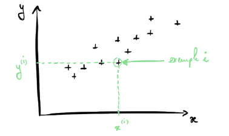


Dans la pratique, on exprime notre Dataset et nos paramètres sous forme matricielle, ce qui simplifie beaucoup les calculs.  un vecteur $y \in \mathbb R^{m\times 1}$ et une matrice $X \in \mathbb R^{m\times n}$ qui inclut toutes les features $n$. Dans la régression linéaire, 𝒏 = 𝟏. Voir appendice [[A]](../docs/Appendice_Mathematique.md#A)

<a name="1-2-2"/>

### [1.2.2 Le Modèle](#1-2-2) ###

[Retour TOC](#toc)

Pour l'apprentissage automatique, à partir de ce Dataset, nous allons construire un Modèle. 

| Modèle Linéaire                                             |
| ----------------------------------------------------------- |
| 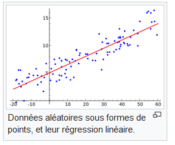 |
| $f(x)=ax + b$                                               |

Avec $a\ et\ b$ les **paramètres** du modèle.

Dans cet exemple, nous allons construire un modèle linéaire $f(x)=ax +b$ où $a\ et\ b$ sont les paramètres du modèle. Une chose important à noter est qu'un modèle retourne des erreurs par rapport au Dataset. On appelle **Fonction de coût** l'ensemble de ces erreurs  et le plus souvent, on prend la moyenne quadratique de ces erreurs.

<a name="1-2-3"/>

### [1.2.3 Apprentissage](#1-2-3) ###

[Retour TOC](#toc)

<a name="1-2-3-1"/>

#### [1.2.3.1 Les applications de l'apprentissage supervisé](#1-2-3-1) ####

[Retour TOC](#toc)

L'apprentissage supervisé permet de résoudre, par exemple, deux types de problèmes :

- Les problèmes de **Régression**. On cherche à prédire la valeur d'une variable continue c'est à dire une variable qui peut prendre une infinité de valeur. Pa exemple, prédire le prix d’un appartement $(y)$ selon sa surface habitable $(x)$.
- Les problèmes de **Classification**. On cherche à classer un objet dans différentes classes c'est à dire que l'on cherche à prédire la valeur d'une variable discrète (qui ne prend qu'un nombre fini de valeurs). Par exemple, prédire si un email est un spam ( $classe\ y = 1$ ) ou non
  ( $classe y = 0$ ) selon le nombre de liens présent dans l’email ( $x$ ). Autre exemple, prédire si une tumeur est maligne ( $y=1$ ) ou bénigne ( $y=0$ )  selon la taille de la tumeur ( $x_1$ ) et l’âge du patient ( $x_2$ ).

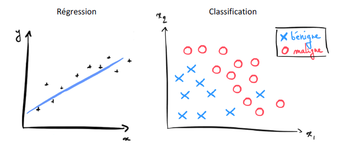

La force du Machine Learning, c’est qu’il est très facile de développer des modèles très complexes qui peuvent analyser des milliers de features ( $x$ )
qu’un être humain ne serait pas capable de prendre en compte pour faire son calcul.

<a name="1-2-3-2"/>

#### [1.2.3.2 Définir la fonction de coût](#1-2-3-2) ####

[Retour TOC](#toc)


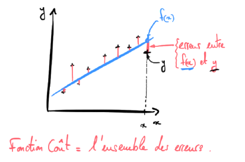

Un bon modèle donne de petites erreurs entre ses prédictions $f(x)$ et les exemples $( y )$ du Dataset.
Nous ne connaissons pas les valeurs des paramètres $a\ et\ b$, ce sera le rôle de la machine de les trouver, de sorte à tracer un modèle qui s’insère bien dans notre nuage de point comme ci-dessus.

Pour la régression linéaire, on utilise la norme euclidienne pour mesurer les erreurs entre $f(x)$ et $ (y) $.
Concrètement, voici la formule pour exprimer l’erreur $i$ entre le prix $y_i$ et la prédiction faites en utilisant la surface $x_i$ :


$$
erreur_i = (f(x_i) - y_i)^2
$$


Par exemple, soit le $10^{ième}$ exemple du Dataset qui est un appartement de $x_{10} = 80\ m^2$ dont le prix s’élève à  $y_{10}=100 000$ € et que le modèle prédise un prix de $f(x_{10}) = 100002$ €. L’erreur pour cette exemple est donc : 


$$
𝑒𝑟𝑟𝑒𝑢𝑟_{10} = ( 𝑓(𝑥_{10}) − 𝑦_{10})^2 = ( 100002 −100000 )^2 = 4
$$


Et comme chaque prédiction s’accompagne d’une erreur, on a donc $m$ erreurs. 

On définit la Fonction Coût $J(a,\ b)$ comme étant la moyenne de toutes les erreurs :


$$
J(a, b) = \frac{1}{2m} \sum_{i=1}^m (f(x_i) - y_i)^2 \hspace{3 em} avec\ erreur_i = (f(x_i) - y_i)^2
$$


c’est l’erreur **quadratique moyenne (Mean Squared Error).**

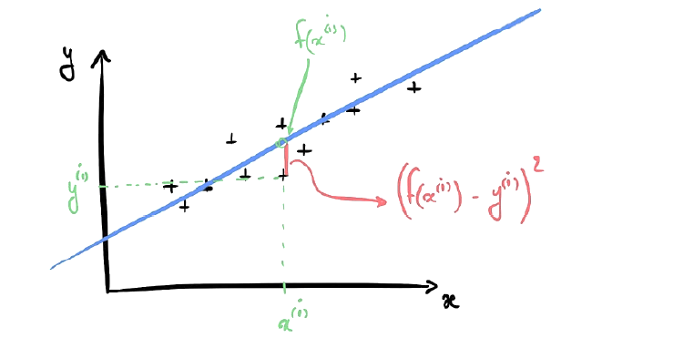

Et donc la fonction de coût devient :


$$
J(a, b) = \frac{1}{2m} \sum_{i=1}^m (b + ax_i - y_i)^2
$$


<a name="1-2-4"/>

### [1.2.4 Les paramètres qui minimisent la fonction de coût](#1-2-4) ###

[Retour TOC](#toc)

L'objectif principal de l'apprentissage supervisé est de trouver les paramètres $a\ et\ b$ du modèle qui minimisent la fonction de coût. Pour y arriver, nous allons utiliser un algorithme d'apprentissage et l'exemple le plus courant étant l'algorithme du **Gradient Descent.**

**Comprendre le Gradient Descent (la descente de gradient)**
[[4]](https://machinelearnia.com/apprendre-le-machine-learning-en-une-semaine/ ) Imaginez-vous perdu en montagne. Votre but est de rejoindre le refuge qui se trouve au point le plus bas de la vallée. Vous n’avez pas pris de carte avec vous donc vous ne connaissez pas les coordonnées de ce refuge, vous devez le trouver tout seul.

Pour vous en sortir, voici une stratégie à adopter :
1. Depuis votre position actuelle, vous partez en direction de là où la pente descend le plus fort.
2. Vous avancez une certaine distance en suivant cette direction coûte que coûte (même si ça implique de remonter une pente)
3. Une fois cette distance parcourue, vous répétez les 2 premières opérations en boucle, jusqu’à atteindre le point le plus bas de la vallée.

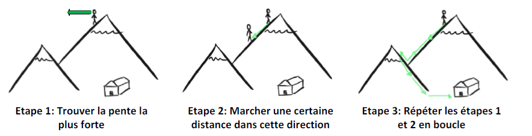

Les étapes 1, 2 et 3 forment ce qu’on appelle l’algorithme de Gradient Descent.
Cet algorithme vous permet de trouver le minimum de la Fonction Coût  $J(a,b)$ (le point le plus bas de la montagne) en partant de coordonnées $a$ et $b$ aléatoires (votre position initiale dans la montagne).

Doncn l'algorithme de descente de gradient consiste à 

1. calculer la pente de la Fonction Coût, c’est-à-dire la dérivée de $J(a, b)$ .
2. évoluer d’une certaine distance $\alpha$ dans la direction de la pente la plus forte. Cela a pour résultat de modifier les paramètres $a$ et $b$
3. recommencer les étapes 1 et 2 jusqu’à atteindre le minimum de $J(a,b)$.

Pour illustrer l’algorithme, voyez le dessin ci-dessous, où nous voyons la recherche du paramètre $a$ idéal (la même chose s’applique au paramètre $b$ )


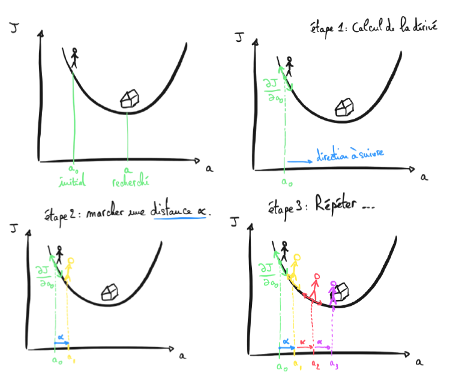

**Comment utiliser l’algorithme de Gradient Descent?** Nous avons jusqu’à présent créé un Dataset, développé un modèle aux paramètres inconnus, et exprimé la Fonction Coût  $J(a, b)$ associée à ce modèle. Notre objectif final : Trouver les paramètres $a$ et $b$ qui minimisent $J(a, b)$.

Pour cela, nous allons choisir $a$ et $b$ au hasard, puis nous allons utiliser en boucle la descente de gradient pour mettre à jour nos paramètres dans la direction de la Fonction Coût la plus faible.

Répéter en boucle :


$$
a = a - \alpha \frac{\partial J(a, b)}{\partial a}
$$


$$
b = b - \alpha \frac{\partial J(a, b)}{\partial b}
$$


A chaque itération de cette boucle, les paramètres $a$ et $b$ sont mis à jour en soustrayant leur propre valeur à la valeur de la pente $\frac{\partial J(a, b)}{\partial ...}$
multipliée par la distance à parcourir $\alpha$. On appelle $\alpha$ **la vitesse d’apprentissage (Learning rate)**.

Si la vitesse est trop lente, le modèle peut mettre longtemps à être entraîné, mais si la vitesse est trop grande, alors la distance parcourue
est trop longue et le modèle peut ne jamais converger. **Il est important de trouver un juste milieu. Le dessin ci-dessous illustre mes propos.**

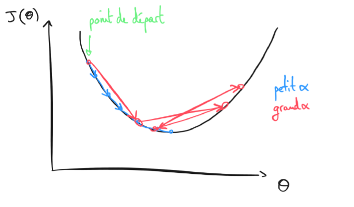

L' algorithme arrive à minimiser la Fonction Coût avec le nombre d’itérations. Par exemple, Une fois cet algorithme programmé, nous pouvons laisser la machine apprendre à prédire le prix d’un appartement selon sa surface habitable. 

<a name="1-3"/>

## [1.3 Les 4 notions clefs du Machine Learning sur la Regression Linéaire](#1-3)  ##

[Retour TOC](#toc)

Le Machine Learning est un domaine vaste et complexe et 4 notions essentielles sont à retenir.

- Le **Dataset** . En Machine Learning, tout démarre d’un Dataset qui contient les données. Dans l’apprentissage supervisé, le Dataset contient les questions $X$ et les réponses $y$ au problème que la machine doit résoudre. Donc, nous devons récolter les données $(X, y)$ avec $X, y \in \mathbb R ^{m\times1}$

- Le **Modèle** et ses **paramètres**. A partir de ce Dataset, on crée un modèle, qui n’est autre qu’une fonction mathématique. Les coefficients de cette fonction sont les paramètres du modèle. Ici, donner à la machine un modèle linéaire $F(X) = X . \theta$ 

  où 


$$
\theta = \begin{pmatrix} 
a \\ 
b \
\end{pmatrix}
$$


- La **Fonction Coût**. Lorsqu’on teste le modèle sur le Dataset, celui-ci nous donne des erreurs et l’ensemble de ces erreurs donne la Fonction Coût. 


$$
J(\theta) = \frac{1}{2m}\sum (F(X)-y)^2
$$


- L’**Algorithme d’apprentissage** L’idée centrale du Machine Learning, c’est de laisser la machine trouver quels sont les paramètres de notre modèle qui minimisent la Fonction Coût.

  Donc répéter en boucle :


$$
\theta = \theta - \alpha \times \frac{\partial J(\theta)}{\partial \theta}
$$


avec le gradient qui vaut : $\frac{\partial J(\theta)}{\theta} = \frac{1}{m}X^T . (F(X)-y)$. Voir Appendice [[B]](../docs/Appendice_Mathematique.md#b)

<a name="1-4"/>

## [1.4 Les étapes pour programme de Régression Linéaire](#1-4) ##

[Retour TOC](#toc)

[Labs_1_Regression_Lineaire](../codes/Labs_1_Regression_Lineaire.ipynb)

<a name="1-4-1"/>

### [1.4.1 Importer les librairies et les fonctions](#1-4-1) ###

[Retour TOC](#toc)

- **Numpy** : pour manipuler le Dataset comme une matrice
- **Matplotlib.pyplot** : pour visualiser les données
- La fonction **make_regression SkLearn** : qui permet de simuler des données en générant un nuage de points
- **SGDRegressor** (qui signifie Stochastic Gradient Descent Regressor) :  qui contient le calcul de la Fonction Coût, des gradients, de l’algorithme de minimisation.

```python
import numpy as np 
import matplotlib.pyplot as plt 
from sklearn.datasets import make_regression 
from sklearn.linear_model import SGDRegressor
```

<a name="1-4-2"/>

### [1.4.2 Créer les Dataset](#1-4-2) ###

[Retour TOC](#toc)

Pour ce premier code, nous allons générer un tableau de données $(x,y)$ aléatoires. La fonction **make_regression** prend comme arguments 

1. **le nombre d’échantillons à générer**, 
2. **le nombre de variables** et 
3. **le bruit**. 

Pour maitriser l’aléatoire, on écrit la ligne **np.random.seed(0)**. 

```python
np.random.seed(0)
```

Ensuite,  nous retournons deux vecteurs $x$ et $y$.

```python
x, y = make_regression(n_samples=100, n_features=1, noise=10)
```

Finalement, pour visualiser les données, on utilise la fonction **plt.scatter$(x, y)$**.

```python
plt.scatter(x, y)
```

Et le résultat afficher du Dataset est

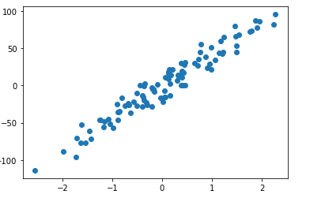

<a name="1-4-3"/>

### [1.4.3 Développer le modèle et l'entrainer](#1-4-3) ###

[Retour TOC](#toc)

Nous créons le modèle avec $SGDRegressor$ en entrant le nombre d’itérations que le Gradient Descent doit effectuer ainsi que le Learning Rate.

Par exemple, entraînons notre modèle sur 100 itérations avec un Learning rate de 0.0001.

```python
model = SGDRegressor(max_iter=100, eta0=0.0001)
```

Pour entraîner le modèle, nous utilisons la fonction $fit()$

```python
model.fit(x,y)
```


$$
\color{red}{!!!Attention!!!\ La\ fonction\ SGDRegressor,\ nous\ prévient\ par\ un\ warning\ que\ nous\ avons\ mal\ configurer\ notre\ modèle.}
$$


$$
\color{red}{ConvergenceWarning}:
$$


$$
\ Nombre\ maximal\ d'itérations\ atteint\ avant\ la\ convergence.\ Envisager\ d'augmenter\ maxiter\ pour améliorer\ l'ajustement
$$


Et ce warning est confirmer par l'observation de la précision du modèle en utilisant la fonction $score$ qui calcule **le coefficient de détermination $(R^2)$**  entre le modèle et les valeurs $y$ de notre Dataset.

```
print('Coeff R2 =', model.score(x, y))
```

Le résulta $R^2$ est 

```python
Coeff R2 = 0.22279377204565387
```

On peut aussi utiliser notre modèle pour faire de nouvelles prédictions avec la fonction $predict$ et tracer ces résultats avec la fonction $plt.plot$.

```python
plt.scatter(x, y) 
plt.plot(x, model.predict(x), c='red', lw = 3)
```

Et le résultat afficher est

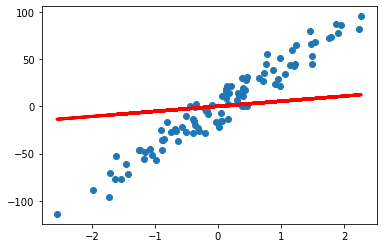


Ce qui confirme que notre modèle semble vraiment mauvais. Cela provient d'un manque d' entraînement du modèle et  le **Learning Rate** est trop faible. 

Il est possible de le ré-entraîner avec de meilleurs hyper-paramètres. En Machine Learning, les valeurs qui fonctionnent bien pour la plupart des entraînements sont :

- **Nombre d’itérations** = 1000
- **Learning Rate** = 0.001

```python
model = SGDRegressor(max_iter=1000, eta0=0.001)
model.fit(x,y)
```

Le message retourné par le fonction confirme le bon choix de nos hyper-paramètres.

```python
SGDRegressor(eta0=0.001)
```

Affichons le résultat.

```python
Coeff R2 = 0.9416557905990657
```

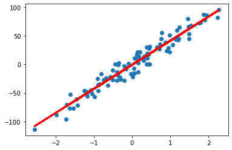

Notre modèle fonctionne vraiment bien avec un coefficient $R^2=94$ %. Ce modèle pourrait servir pour faire de bonnes prédictions. Par exemple,  pour prédire le prix d’un appartement selon sa surface habitable, ou bien pour prédire l’évolution de la température sur Terre. 

<a name="1-5"/>

## [1.5 Les courbes d'apprentissages](#1-5) ##

[Retour TOC](#toc)

[Labs_1_Regression_Linéaire et courbes d'apprentissages](../codes/Labs_1_Regression_Lineaire_Courbes_Apprentissages.ipynb)

En Machine Learning, on appelle courbe d’apprentissage (Learning curves) les courbes qui montrent l’évolution de la Fonction Coût au fil des itérations de Gradient Descent. Si votre modèle apprend, alors sa Fonction Coût doit diminuer avec le temps, comme ci-dessous.

L'idée ici est de voir comment la machine a appris les paramètres du modèle avec le Gradient Descent et pour cela, il existe ce qu’on appelle les courbes d’apprentissage.

<a name="1-5-1"/>

### [1.5.1 Importer les librairies et les fonctions](#1-5-1) ###

[Retour TOC](#toc)

Nous importons les librairies et les fonction
- **Numpy** : pour manipuler le Dataset comme une matrice
- **Matplotlib.pyplot** : pour visualiser les données
- La fonction make_regression SkLearn : qui permet de simuler des données en générant un nuage de points

```python
import numpy as np 
import matplotlib.pyplot as plt 
from sklearn.datasets import make_regression
```

<a name="1-5-2"/>

### [1.5.2 Générer le Dataset aléatoire](#1-5-2) ###

[Retour TOC](#toc)

La fonction **make_regression** prend comme arguments 

1. **le nombre d’échantillons à générer**, 
2. **le nombre de variables** et 
3. **le bruit**. 

Pour maitriser l’aléatoire, on écrit la ligne **np.random.seed(4)**. 

```python
np.random.seed(4) 
n = 1 
m = 100 
```

Ensuite,  nous retournons deux vecteurs $x$ et $y$.

```python
x, y = make_regression(n_samples=m, n_features=n, noise=10) 
y = y + 100 
```

Finalement, pour visualiser les données, on utilise la fonction **plt.scatter$(x, y)$**.

```python
plt.scatter(x, y)
```

Et le résultat afficher du Dataset est

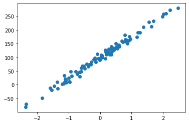

Nous devons utiliser la fonction $reshape()$ car la fonction make_regression ne définit pas correctement toutes les dimensions de $ y.X = (100,1) $ et $y=(100,) $. A la suite du reshape,  $y = (100,1)$

```python
y = y.reshape(y.shape[0], 1) 
```

Nous devons construire notre matrice X avec la colonne de biais c'est à dire une colonne ne contenant que des 1.


$$
X = 
 \begin{pmatrix}
  x_{1} & 1\\
  x_{2} & 1\\
  \vdots \\
  x_{m} & 1 
 \end{pmatrix}
$$


avec $m$, le nombre de ligne.

Nous utilisons la fonction $hstack()\ de\ Numpy$ qui permet de coller deux vecteurs ensembles. Ici le vecteur X et la matrice colonne 1. La fonction $np.ones()$ crée un vecteur de même dimension que X (lignes et colonnes). Et pour finir, on redimensionne le vecteur X, nous avons bien une matrice X de dimension 2.

```python
X = np.hstack((np.ones(x.shape), x)) 
X.shape
```

Nous allons initialiser un vecteur 


$$
\theta = 
 \begin{pmatrix}
  a \\
  b \\   
 \end{pmatrix}
$$


qui caractérise notre modèle. On ne connaît pas ce vecteur. Et c'est à la machine de déterminer l'erreur la plus petite c'est à dire qui minimalise la fonction coût. Et au départ, nous initialisons $\theta$ avec des paramètres aléatoires.

```python
np.random.seed(0) 
theta = np.random.randn(2, 1)
theta.shape
```

<a name="1-5-3"/>

### [1.5.3 Le Modèle](#1-5-3)

[Retour TOC](#toc)

Nous créons notre modèle $F = X . \theta$. Donc nous créons une fonction modèle() qui retourne le produit matriciel de X par $\theta$ car pour rappel  $\theta$ est de dimension (2,1) et $X$ est de dimension (100, 2) donc (100,2) $\times$ (2,1).

```python
def model (X, theta):
    return X.dot(theta)
```

Affichons pour vérifier ce que cela nous donne.

```python
theta
plt.scatter(x,y)
plt.plot (X, model(X,theta), c='r')
```

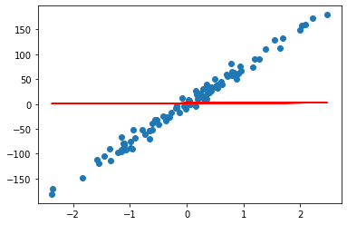

Nous voyons clairement qu'avec un $\theta$ aléatoire, nous avons un très mauvais modèle.

<a name="1-5-4"/>

### [1.5.4 La Fonction coût](#1-5-4) ###

[Retour TOC](#toc)

Nous allons maintenant calculer la fonction coût qui est l'erreur quadratique moyenne.


$$
J(\theta) = \frac{1}{2m}\sum (X . \theta -y)^2
$$


Nous créons une fonction coût qui a comme paramètre $x, y$ et $\theta$. Nous utilisons aussi une variable $m$ qui est le nombre d'exemples dans le Dataset, par exemple la longueur du vecteur $y$ (nous aurions aussi pu prendre la longueur de $x$ ). Pour rappel, nous sommons la différence entre le modèle et $y$.

```python
def fonction_cout(X, y, theta):
    m = len(y)
    return (1 / (2 * m)) * np.sum((model(X,theta)-y)**2) 
```

<a name="1-5-5"/>

### [1.5.5 Gradient et Descente de gradient](#1-5-5) ###

[Retour TOC](#toc)

Nous allons calculer la descente de gradient


$$
$\frac{\partial J(\theta)}{\theta} = \frac{1}{m}X^T . (X . \theta - Y)
$$


Nous définissons une fonction gradient qui a comme paramètre $x,y$ et $\theta$. ous utilisons aussi une variable $m$ qui est le nombre d'exemples dans le Dataset, par exemple la longueur du vecteur $y$. Comme X est un vecteur, X.T (fonction T) permet de transposer X et X.T.dot(...) permet de faire le produit matricielle entre X et la différence du modèle avec Y.

```python
def gradient(X,y,theta):
    m = len(y)
    return (1 / m) * X.T.dot(model(X, theta) - y) 
```

<a name="1-5-6"/>

### [1.5.6 Phase d'apprentissage](#1-5-6) ###

[Retour TOC](#toc)

Maintenant nous avons dans notre boîte à outil :
1. la fonction de coût
2. la fonction gradient
3. la fonction descente de gradient
4. $x , y$ et $\theta$ initialisées aléatoirement
5. et le modèle

Donc nous pouvons calculer un $\theta$ final qui minimisera la fonction de coût.

```python
theta_final = desc_gradient(X,y,theta,learning_rate=0.001,n_iterations=1000)
```

Nous allons vérifier si le vecteur paramètre $\theta$, nous donne de bon résultat. Nous allons créer un vecteur prédiction qui est égal au résultat du modèle ( $X $ par theta_final). Et nous affichons notre Dataset et le vecteur prédiction.

```python
predictions = model (X, theta_final)
plt.scatter(x,y)
plt.plot(x,predictions, c='r')
```

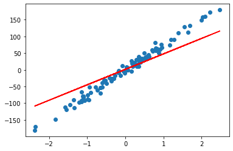

On voit que l'apprentissage n'est pas terminé. Donc, nous devons soit  augmenter le nombre d'itération c'est à dire faire travailler la machine plus longtemps ou soit augmenter le learning_rate c'est à dire que dans la descente de gradient du moment, nous faisons de trop petits pas et  nous allons augmenter la taille. 

```python
iterations = 1000
learning_rate = 0.01

theta_final = desc_gradient(X,y,theta,learning_rate=learning_rate,n_iterations=iterations)
predictions = model (X, theta_final)
plt.scatter(x,y)
plt.plot(x,predictions, c='r')
```


Ce qui est beaucoup mieux.

<a name="1-5-7"/>

### [1.5.7 Courbe d'apprentissage](#1-5-7) ###

[Retour TOC](#toc)

Maintenant nous arrivons nos courbes d'apprentissages c'est à dire comment tracer la minimalisation de la fonction de coût.
Nous allons vérifier si la machine a bien appris.

Nous allons changer l'algorithme de Descente de gradient, en ajoutant une tableau cost_history initialiser à zéro et ensuite on enregistre, dans le tableau, le coût du modèle à chaque itération.

```python
def desc_gradient(X,y,theta,learning_rate, n_iterations):
    cost_history = np.zeros (n_iterations)
    
    for i in range(0, n_iterations):
        #mettre à jour theta en disans qu'il est égale à [lui-même - (le learning_rate multiplié par le gradient)]
            theta = theta - (learning_rate * gradient(X,y,theta))
            cost_history [i] = fonction_cout(X, y, theta)
    return theta, cost_history   
```

```python
theta_final, cost_history = desc_gradient(X,y,theta,learning_rate=learning_rate,n_iterations=iterations)
```

Nous allons tracer notre courbe d'apprentissage.

```python
fig,ax = plt.subplots(figsize=(12,8))  
ax.set_ylabel('J(Theta)')  
ax.set_xlabel('Iterations')  
_=ax.plot(range (iterations),cost_history)
```

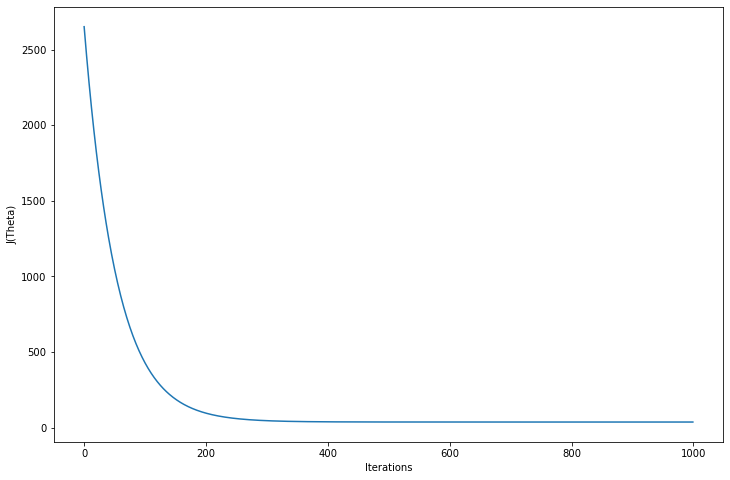

On voit la minimisation de la fonction coût sur les 1000 itérations.

Il est évident que le machine n'apprend plus entre 200 et 300 itérations. Donc, nous pouvons à ce stade changer n_itérations de 1000 à 300 pour optimiser le processus.

<a name="1-5-8"/>

### [1.5.8 Coefficient de détermination](#1-5-8) ###

[Retour TOC](#toc)

Nous allons évaluer le coût de coefficient de détermination. Pour évaluer la performance d'un modèle de Régression Linéaire, on peut utiliser le coefficient de détermination $R^2$. Pour rappel,


$$
R^2 = 1 - \frac{\sum(y - f(x))^2}{\sum(y -\bar{y})^2}
$$


Ce qui donne la performance du modèle.Plus $R^2$ est proche de 1 et plus modèle est proche de l'ensemble du Dataset. Nous allons créer une fonction coef_determination() avec deux variables. Avec u = résidu de la somme des carrés, c'est à dire la somme de (la différence entre les valeurs observées et les valeurs prédites) au carré. Et v =  est la somme total des carrés. Et pour finir, on retourne le rapport de 1-u/v.

```python
def coef_determination (y, pred):
    u=((y - pred)**2).sum()
    v = ((y - y.mean())**2).sum()
    return (1 - (u/v))
```

```python
coef_determination (y, predictions)	
```

```
0.9867144452060398
```

On voit que notre coefficient de détermination est de 98,67%. Ce qui est un bon score.
